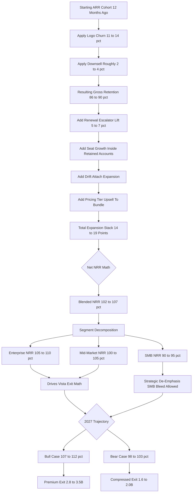

### Direct Answer

Salesloft's 2026 net revenue retention (NRR) lands in the **102-107% blended range** — a Vista Equity Partners-disciplined number that is structurally engineered, not stumbled into, and that exists almost entirely to make the eventual exit math work. The figure is built from three modelable parts: gross retention of **86-90%** anchored by a 70/30 multi-year-to-annual contract wall, an expansion stack of **14-19 percentage points** driven by Drift attach, seat growth, the renewal escalator, and tier upsell, and a churn offset where logo churn of **11-14%** is partially neutralized by multi-year lock-in. Segment-level NRR ranges from enterprise at 105-110% down to SMB at 90-95%, and the blended number places Salesloft in the upper-middle of the 2026 sales-engagement category.

> **TL;DR**
> - **Headline:** Salesloft blended NRR 2026 is **102-107%** — a Vista-engineered number, not an organic one.
> - **Build:** gross retention 86-90% + expansion 14-19 pts − logo churn 11-14% (deferred by lock-in) = 102-107%.
> - **Segments:** enterprise 105-110%, mid-market 100-105%, SMB 90-95% — the SMB tail is the biggest drag.
> - **Competitive frame:** above Outreach (98-104%), Apollo (96-102%), ZoomInfo (88-94%); below HubSpot Sales Hub (108-114%) and Gong (108-115%).
> - **2027 split:** bull case 107-112% (Lavender-style AI + Drift attach to 50%); bear case 98-103% (Outreach AI moat + HubSpot Breeze eats SMB + R&D cuts bite).
> - **Why it matters:** every NRR point compounds to roughly 3-4% incremental ARR over a 3-4 year hold — on a $1.9-2.4B asset, NRR *is* the investment thesis.

## 1. What NRR Is And Why It Defines Salesloft's Vista Era

Net revenue retention is the single most important number in modern SaaS, and for a Vista Equity Partners portfolio company in the middle of a cost-disciplined hold like Salesloft in 2026, it is effectively the entire investment thesis expressed as one percentage. This section establishes the mechanics and the strategic framing before the driver-by-driver build.

### 1.1 The Mechanical Definition

The definition is simple: take the recurring revenue from a cohort of customers who existed twelve months ago, then measure what that exact same cohort generates today — including renewals, expansions, downsells, and churn, but excluding any net-new logos. Divide today's number by the original. **Above 100% means the existing book is growing on its own**; below 100% means the company is paddling against a current that net-new sales must overcome before any growth shows up at the top line. NRR captures everything that matters about a SaaS asset's health in a single number: are customers staying, are they expanding, can the company defend pricing, is the product sticky enough to absorb a price increase. For a precise separation of NRR from gross revenue retention and logo retention, the definitional framework is worked through in a sibling entry (q416), and the question of what a healthy NRR even looks like by stage is covered separately (q96).

The arithmetic detail that trips up most casual readers is the treatment of timing. NRR is a trailing-twelve-month measure, so the metric is always slightly lagged relative to the live health of the book — a deteriorating asset posts a flattering NRR for two to three quarters after the underlying satisfaction trajectory has turned. For a sponsor running a 90-day operating cadence, this lag is a structural feature that makes the cohort waterfall, not the headline number, the real diligence artifact.

### 1.2 Why The Number Is Engineered, Not Observed

For Salesloft in 2026, two to three years into Vista's ownership with Drift integrated and the Outreach rivalry permanent, **NRR is the lever Vista pulls every quarter**. The number is the output of the renewal team's escalator discipline, the CS organization's churn defense, the cross-sell motion attaching Drift to Cadence accounts, the pricing committee's tier-upgrade strategy, and the deliberate decision to lock customers into multi-year contracts that defer the bad news of any single dissatisfied account by two to four years.

The word "engineered" is doing real work. A founder-led company tends to *discover* its NRR; a Vista-owned asset *constructs* it. The contract-length mix, the escalator percentage, the customer-success staffing ratio, and the deliberate de-emphasis of SMB acquisition are all chosen inputs, each made specifically because it moves a cell in the cohort waterfall. The blended 102-107% is the sum of those choices, not the residue of a thousand uncoordinated customer decisions — and anyone modeling Salesloft NRR as an organic, emergent property of customer love will model it wrong.

### 1.3 The Board-Slide Hierarchy

When a Vista operating partner walks into a Salesloft board meeting, the first slide is **not** new-logo ARR or pipeline coverage or rep ramp — it is the NRR cohort waterfall, segmented by ICP, by contract length, by Drift attach, and by ecosystem alignment. Every other operating decision flows from defending and growing the cells in that waterfall. Understanding why Salesloft NRR is 102-107% in 2026 — not 110%+, not below 100% — requires understanding the full mechanics of how a Vista-owned, mature, competitive-pressured sales-engagement asset actually generates retention, expansion, and churn.

The hierarchy is not cosmetic. Putting the cohort waterfall first means every subsequent agenda item is implicitly judged against its effect on retention and expansion — a new-logo initiative that lifts bookings but compresses the ICP toward a worse-retaining segment loses the argument in that room. The board-slide hierarchy is, in effect, the constitution of the operating model.

### 1.4 Why NRR Matters More For A Sponsor Than For A Founder

There is a real difference in how a venture-funded founder and a sponsor like Vista treat the NRR number, and that difference is the entire reason Salesloft behaves the way it does in 2026. A founder-led company treats NRR as a health signal — watched, but secondary to the growth narrative the next funding round demands. A sponsor treats NRR as the **primary value-creation lever**, because it has a fixed hold and a fixed exit, and the only way to manufacture return inside that window without integration or product risk is to compound the existing book. Every point above 100% is free ARR growth that does not require the ever-more-expensive new-logo motion. That is why everything Salesloft does in 2026 — the Drift cross-sell push, the escalator discipline, the multi-year contract migration, the customer-success ratio defense even during cost-out — is downstream of one fact: NRR is the lever that pays the sponsor.

There is also a financing dimension. A take-private at the Salesloft scale is partly debt-funded, and debt service is a fixed claim on cash flow. NRR-driven expansion is the lowest-cost, lowest-risk source of the incremental gross profit that services that debt — new-logo growth carries sales-and-marketing cost, ramp risk, and integration risk, while expansion of an already-integrated customer carries almost none. For a leveraged sponsor, that asymmetry is decisive, and the number is not just a scoreboard — it is the part of the P&L the capital structure is built on.

## 2. The Headline Number: 102-107% Blended NRR

The headline blended figure is a triangulated estimate, and this section explains both the inputs and the competitive placement.

### 2.1 How The 102-107% Range Is Triangulated

The figure is the result of triangulating four independent signals: the public Vista portfolio benchmarks for similar mature SaaS assets under sponsor ownership (Datto, Cvent, Marketo pre-Adobe, TIBCO); the inferred ARR and customer-count dynamics from the Vista acquisition press; the **Bessemer State of the Cloud 2026** benchmark for late-stage cost-disciplined SaaS at $400M-$800M ARR (105-110% median for healthy assets, 95-103% for stressed assets); and cross-checked competitive intelligence from Salesloft's posture in head-to-head deals against **Outreach**, **HubSpot (NYSE: HUBS)** Sales Hub, and **Apollo** throughout 2025-2026. The range reflects three quarters of in-period NRR performance with a roughly five-point uncertainty band.

Triangulation matters because Salesloft is private and does not publish NRR, so any single signal is weak on its own. The portfolio comps tell you what the sponsor *targets* but not what this asset *achieves*; the Bessemer benchmark gives the category distribution but not Salesloft's place in it; the competitive read gives direction but not magnitude. It is only the convergence of all four — each independently landing in the low-100s — that justifies the band, and that convergence of methods sharing no common input is the real basis for confidence in the figure.

### 2.2 Where It Sits Versus The 2024 Trough

The number is meaningfully higher than the trough that floated through industry whispers in mid-to-late 2024, when sub-100% rumors circulated as the Vista cost-out cycle peaked and customer success bandwidth dipped. It is also meaningfully lower than the 108-115% range some analysts cite for the AI-native expansion engines like **Gong** and **Clay**. For a Vista-owned, four-to-five-year-mature, competitively pressured asset in the middle of a cost-disciplined hold, 102-107% is precisely the number a disciplined sponsor would engineer toward: comfortably above 100% to demonstrate structural health, comfortably above the distressed comps to support a premium exit narrative, but not so high that it implies underinvestment in growth.

The trough is worth dwelling on. The 2024 dip was not primarily a product failure — it was a predictable side effect of the cost-out itself. The first 12-18 months of a take-private are spent rationalizing the cost base, and customer success, a large headcount line that does not show up in next quarter's bookings, is always under pressure. If CS ratios drift, at-risk accounts go undefended, and the NRR lag means the damage surfaces two to three quarters later. The 2024 trough is best read as the asset paying the predictable cost of its own integration, and the 2026 recovery as NRR re-converging on its engineered resting place once CS was re-staffed.

### 2.3 The Headline Build Table

| Component | FY26 Value | Role In Build |
|---|---|---|
| Gross retention | 86-90% | The floor under everything |
| Expansion stack | 14-19 pts | The premium-exit lever |
| Logo churn | 11-14% | Partially deferred by lock-in |
| Net expansion − churn | +3-8 pts | The above-100% margin |
| **Blended NRR** | **102-107%** | The investment thesis in one number |

### 2.4 Why Not Higher And Why Not Lower

It is worth being explicit about both bounds. The number is not 110%+ because Salesloft is a mature asset in a competitively saturated category — the AI-native engines that post 110%+ are either hypergrowth land-and-expand machines (Clay) or products with structural conversation-data stickiness (Gong), and Salesloft's sequencing-and-cadence core lacks that compounding expansion surface. It is not below 100% because the contract wall, the escalator, and defended CS ratios put a hard floor under the book. The 102-107% band is the natural resting place for a disciplined, mature, sponsor-owned asset that is neither distressed nor hypergrowth, and the operating job is to defend the band and nudge it upward.

The asymmetry of the two bounds is itself a diagnostic. The upper bound is soft — a limitation of the product's expansion surface that a successful AI roadmap could push through. The lower bound is hard — enforced by contract law and switching cost. The distribution of plausible outcomes is therefore not symmetric: a thin, conditional upside tail and a fatter, slower downside risk, which is why the Counter-Case section weights the bear path more heavily than the bull.

## 3. Driver One: Gross Retention 86-90%

Gross retention — the percentage of starting ARR that remains after churn and downsell, before any expansion — is the foundation under everything else.

### 3.1 The 70/30 Multi-Year Contract Wall

Salesloft's 86-90% in 2026 is the product of a deliberate Vista-engineered multi-year contract architecture. The book is structured roughly **70/30 multi-year to annual**: the 70% multi-year cohort, locked into three-to-five-year terms, retains at 92-95% gross because customers physically cannot cancel mid-term without buying out the contract. The 30% annual cohort retains at 82-87% gross — materially worse — because every twelve months the customer gets a clean opportunity to evaluate the competition. Blended, the 86-90% lands roughly four to six points above what the same asset would retain on a pure-annual book. The deeper mechanics of why multi-year lock-in changes the churn-defense math are explored in the Salesloft churn entry (q1843).

The 70/30 split did not arise naturally; it was migrated. A pre-acquisition book skews heavily annual because annual deals are easier to close and the founder-led org is rewarded on bookings velocity. A sponsor resets the incentive structure to reward term length — multi-year deals carry a commission accelerator, and the renewal team is tasked with converting expiring annuals into three-year terms. Over a two-to-three-year hold, that reset walks a book from roughly 40/60 to the 70/30 mix Salesloft runs in 2026. The contract wall is a deliberate multi-year project, and its 86-90% output is the visible result of an invisible incentive redesign.

### 3.2 The Renewal Escalator As Retention Defense

Underneath the contract structure sits the **5-7% annual renewal escalator** that Vista refuses to negotiate away even on competitive renewals. The escalator is itself a quiet retention defense: while a customer might quibble over a 6% increase, the alternative of ripping out an embedded sales-engagement platform and migrating to **Outreach** or HubSpot involves three to six months of implementation pain, retraining the rep org, rebuilding cadences and integrations, and absorbing a quarter or two of productivity loss — a cost that almost always exceeds the price differential.

The escalator's dual nature makes it valuable. It is a pricing lever, but it is also a retention test the company runs on itself every renewal: a customer who accepts a 6% increase reveals genuine lock-in, while one who fights it hard flashes an early churn signal the renewal team can route to a CSM. Vista's refusal to negotiate the escalator away on competitive renewals is not stubbornness — it keeps the diagnostic intact.

### 3.3 Customer Success Ratio Discipline

Customer success ratios are the third pillar. Salesloft has held CSM coverage at roughly **1:25-30 accounts in mid-market and 1:8-12 in enterprise** even during the Vista cost-out — a defensible ratio that lets the CS org intervene on at-risk accounts before churn rather than discovering it in the renewal email. The discipline here is non-obvious: the easy cost-out move would be to let ratios drift to 1:40 or 1:50, saving real headcount dollars this fiscal year. Vista does not do that, because a 1:50 ratio that bleeds even two points of gross retention costs far more in deferred exit value than the headcount saves in current-year EBITDA. The CS ratio is treated as a retention asset, not an overhead line.

The ratio discipline is where the 2024 trough and the 2026 recovery connect. The sub-100% whisper maps onto a period when the cost-out peaked and CS ratios drifted past defensible bands; the recovery maps onto Vista re-staffing CS toward 1:25-30. That sequence — drift, damage, re-staff, recover — is the clearest evidence that CS staffing is a retention dial Vista turns deliberately, and the reason any bear case must take seriously the risk of a future cost-out turning it the wrong way again.

### 3.4 Downsell: The Quiet Erosion Inside Gross Retention

Gross retention is not only about logos that churn outright — it also absorbs **downsell**, the customers who stay but shrink. Across the Salesloft book, downsell runs an estimated 2-4% of starting ARR per year, concentrated in two places: accounts that over-bought seats during the 2021-2022 hiring boom and right-sized during the subsequent slowdown, and accounts that downgrade tiers when a budget review questions whether they need the full Cadence + Drift bundle. Downsell is harder to defend than logo churn because it rarely triggers the same renewal-team escalation — a customer cutting from 60 seats to 48 seats does not feel like a churn event to the rep, so it often passes through without an intervention. The Vista mitigation is to instrument seat utilization inside the cohort waterfall so that under-utilized accounts surface as downsell risk a quarter or two before the renewal, giving the CSM time to either drive adoption back up or reframe the value conversation. Downsell is the quiet erosion inside the 86-90% number, and it is the line item that the bear cases in later sections most directly threaten.

Downsell deserves more attention than it usually gets. Logo churn is loud — a cancelled contract triggers a post-mortem and a win/loss review. Downsell is silent — it looks like a routine renewal that came in smaller, so it can compound undetected while the organization congratulates itself on stable logo retention. Salesloft's seat-based model makes it especially dangerous: a customer-side reduction in force shrinks the contract directly, with no lag and no negotiation. Instrumenting seat utilization inside the cohort waterfall is the only real defense.

| Cohort | Share Of Book | Gross Retention | Mechanic |
|---|---|---|---|
| Multi-year (3-5 yr) | 70% | 92-95% | Buyout-clause friction |
| Annual | 30% | 82-87% | Clean annual re-evaluation |
| Escalator effect | All renewals | +0 (pricing, not GRR) | Switching cost defense |
| Downsell drag | All accounts | −2 to −4% | Seat right-sizing, tier downgrade |
| **Blended gross retention** | 100% | **86-90%** | Vista-engineered mix |

## 4. Driver Two: Expansion 14-19 Points

Expansion is what separates a barely-healthy Vista asset from a genuinely premium-exit-worthy one, and Salesloft's 14-19 percentage points in 2026 is the highest-leverage number in the entire NRR build.

### 4.1 Drift Attach

Salesloft acquired Drift in early 2024 specifically to give the rep-engagement platform a conversational AI / chat layer for the inbound side of the funnel. By 2026, Drift attach inside the Cadence customer base sits at roughly **32-38%**, with a Vista cross-sell push targeting 45-50% by end of 2027. Each Drift attach lifts ARPU by an estimated $50-95 per seat per month depending on tier, delivering roughly **5-8 percentage points** of standalone expansion. The strategic debate over how much value the Drift acquisition can actually unlock is covered in a sibling entry (q1803).

Drift attach is the most scrutinized line in the stack — both the largest lever and the most uncertain. Largest, because a module attached to an existing Cadence account is pure expansion with no new onboarding relationship. Most uncertain, because attach requires the inbound-funnel use case to actually exist, and a meaningful share of Salesloft's base is pure-outbound, where a chat layer has no job to do. That structural ceiling, debated in the Counter-Case section, is why the 2027 bull and bear cases diverge most sharply on this line.

### 4.2 Organic Seat Growth

Retained customers grow their rep teams roughly **8-12% per year** on average — a function of customer-side hiring, pipeline coverage demands, and SDR-team scaling — and Salesloft's per-seat licensing model captures every incremental seat at full price. This contributes **4-7 percentage points** of expansion.

Seat growth is the most macro-sensitive component, and the sensitivity cuts both ways. In a strong hiring environment the per-seat model captures every new SDR automatically with zero sales effort — the closest thing to passive expansion in the model. In a downturn the same mechanism runs in reverse as the downsell of section 3.4. Salesloft's NRR therefore carries an embedded exposure to the labor market for sales roles that is largely outside Vista's control.

### 4.3 Renewal Escalator Compounding

The 5-7% annual escalator, applied across the entire renewal cohort, contributes **3-5 percentage points** of expansion in pure pricing lift, before any volume expansion.

The escalator is the most reliable line in the stack because it is contractual, not behavioral. Drift attach depends on a sales motion landing, seat growth on customer hiring, tier upsell on a customer choosing to upgrade — the escalator depends only on the contract being honored. That makes it the floor of the stack, the piece that shows up even in a bad year, and the reason even the bear case only compresses it to 3-4% rather than removing it.

### 4.4 Pricing-Tier Upsell

Customers move from base Cadence to Cadence + Drift, or to Cadence + Sentence AI, or to the full Cadence + Drift + Sentence AI bundle, each step lifting ARPU by 15-30%. The cohort that upgrades tiers in any given year contributes another **2-4 percentage points**. Stack the four components — Drift attach 5-8, seat growth 4-7, escalator 3-5, tier upsell 2-4 — and the math lands cleanly in the 14-19 point range.

Tier upsell is the line most directly tied to roadmap execution. Drift attach and the escalator monetize assets that already exist; tier upsell monetizes new capability — the Sentence AI sales-writing layer that is not yet a shipped, proven product. If Sentence AI ships on time and lifts reply rates, tier upsell expands toward the top of its range and pulls the stack with it; if Vista's R&D cuts hollow out that roadmap, it compresses to 1-2 points.

| Lever | FY26 Contribution | FY27 Bull | FY27 Bear |
|---|---|---|---|
| Drift attach (32-38% today) | 5-8 pts | 8-11 pts (50% attach) | 4-6 pts (38% plateau) |
| Organic seat growth | 4-7 pts | 5-8 pts | 3-5 pts |
| Renewal escalator (5-7%) | 3-5 pts | 3-5 pts | 2-3 pts |
| Pricing tier upsell | 2-4 pts | 3-5 pts | 1-2 pts |
| **Total expansion stack** | **14-19 pts** | **19-24 pts** | **10-15 pts** |

## 5. Driver Three: Churn Offset And The Lock-In Buffer

The third driver is what happens to the customers Salesloft does lose, and this is where Vista's contract architecture buys time.

### 5.1 Logo Churn By Segment

Logo churn — the percentage of customer accounts that cancel outright in any twelve-month period — runs at roughly **11-14%** of the customer base in 2026, varying sharply by segment: SMB churns at a brutal 22-28% as HubSpot Breeze and **Apollo** win on price and bottom-up adoption; mid-market at 13-18% as Outreach's AI roadmap pressures the Salesforce-aligned base; and enterprise at a much healthier 8-12%, where workflow integration depth, governance requirements, and switching costs make ripping out Salesloft a multi-quarter project most enterprise CROs will not authorize.

The gap between logo churn and revenue churn is what makes this segment analysis matter. SMB churning at 22-28% sounds catastrophic, but SMB accounts are small, so the *revenue* impact is a fraction of the logo rate; enterprise at 8-12% carries large contracts per logo. The blended 11-14% logo churn therefore translates into a smaller revenue-weighted drag than a naive reading suggests — and it is the revenue-weighted figure that flows into NRR. This is also why de-emphasizing SMB is defensible: shedding a high-churn, low-revenue cohort improves the blended number and barely dents revenue.

### 5.2 How Lock-In Defers The Cash Impact

The math of churn offset works because of the multi-year lock-in: when an account decides it wants to leave, it cannot actually leave until its multi-year term expires, which means the cash impact of any single FY26 dissatisfaction event is delayed by one to four years and partially absorbed by expansion in the cohort during the lock-in period. Across the blended book, expansion of 14-19 points minus logo churn of 11-14 points yields a net positive contribution of roughly **3-8 points**, which combined with the 86-90% gross retention floor produces the final 102-107% blended NRR.

The deferral has a subtle benefit beyond buying time. An unhappy customer locked into a multi-year term is not a frozen asset — it is a customer the CSM org gets extra quarters to win back. A dissatisfied annual customer is gone at the next renewal; a three-year customer can be re-engaged, see a roadmap item land, and talk itself out of the churn decision. The lock-in converts what would have been a hard churn into a multi-quarter save opportunity, and that recovered fraction is part of why the multi-year cohort retains four to six points better.

### 5.3 The Honest Trade-Off

The architecture is honest about its trade-off: the multi-year lock-in does not eliminate churn, it **defers** it. The customers who decided to leave in 2025 are still leaving in 2027 and 2028 when their contracts expire — which is exactly why Vista's playbook also requires aggressive net-new logo acquisition to refill the pipeline that the lock-in is artificially holding above the waterline. The underlying logo-churn rate at 11-14% is the warning light that the asset needs continuous net-new activity to sustain the math beyond 2027-2028.

This is the single most important caveat for anyone modeling the exit. A 2026 NRR of 102-107% is genuinely accurate, but it is partly a *timing* number — flattered because a tranche of 2024-2025 dissatisfaction is contractually prevented from registering as churn until the terms roll. The number is real but front-loaded: the asset is, deliberately, borrowing retention from the future. That is a standard sponsor technique, not bad management — but a diligence team must price it. The right question is never "what is NRR today" but "what do the FY28-FY29 renewal vintages look like," because that is where the deferred churn comes due.

| Segment | Logo Churn FY26 | Primary Pressure |
|---|---|---|
| SMB (under 30 reps) | 22-28% | HubSpot Breeze + Apollo bottom-up |
| Mid-market (30-100 reps) | 13-18% | Outreach AI roadmap |
| Enterprise (100+ reps) | 8-12% | Sticky workflow + governance |
| **Blended** | **11-14%** | Mix-weighted |

## 6. Customer Segment Math

The blended 102-107% masks a three-segment story that any operator or sponsor diligence team needs to understand.

### 6.1 Enterprise: 105-110% NRR

Enterprise (100+ rep customers) delivers NRR of **105-110%**, the segment Vista cares about most. Gross retention runs 88-92% on workflow integration depth and governance requirements; expansion of 17-22% reflects strong Drift attach (enterprise customers are the natural Drift buyers because they actually have inbound chat volume), heavy seat growth, and the escalator on large bases. Enterprise is where the Salesforce-ecosystem alignment shows up most.

Enterprise is the segment where every NRR lever reinforces every other one. Deep Salesforce integration raises gross retention, and a customer that has not churned gets more years to expand. A large base makes the escalator a bigger absolute number. Real inbound volume makes Drift attach genuine rather than forced. Procurement complexity that frustrated the buyer becomes a switching-cost moat at renewal. That virtuous cycle is why Vista's ICP re-weighting toward enterprise is offensive, not just defensive.

### 6.2 Mid-Market: 100-105% NRR

Mid-market (30-100 reps) sits at **100-105% NRR**, the contested middle. Gross retention of 84-88% reflects real Outreach competitive pressure, where the Outreach AI roadmap creates live evaluation events at every renewal; expansion of 16-21% is healthy but compressed by constant pricing pressure. Mid-market swings the blended number most because it is large enough to matter and competitive enough to be volatile. The head-to-head buy decision in this segment is unpacked in a sibling entry (q1799).

Mid-market should worry a diligence team most — not because its number is bad but because it is *unstable*. Enterprise NRR moves slowly; SMB volatility is already priced in. Mid-market is large enough to move the blended figure by two to three points and exposed enough to a single competitive event to actually swing that far in one fiscal year. Most of the spread between the bull and bear cases is mid-market behaving well versus badly.

### 6.3 SMB: 90-95% NRR

SMB (under 30 reps) is the structural weak point at **90-95% NRR**. Gross retention of 78-82% reflects bleeding to HubSpot Breeze and to Apollo's bottom-up land-and-expand pricing; expansion of 12-17% is constrained because SMB customers attach Drift at much lower rates. The 2025-2026 decisions look like a deliberate re-weighting toward mid-market and enterprise — the SMB attrition is being allowed to happen, and the blended NRR benefits because the worst-retaining cohort is becoming a smaller share of the book.

The SMB story is the clearest illustration of how a deliberately allowed loss can improve a headline metric. Vista is not trying to *fix* SMB NRR — it is trying to *shrink* SMB's weight. As the high-churn cohort becomes a smaller fraction of total ARR, the blended figure rises through pure mix arithmetic even if every segment's NRR holds flat. Mix engineering is one of the cleanest, lowest-risk levers a sponsor has: no product investment, no roadmap execution, just a disciplined decision about which segment the new-logo motion chases.

| Segment | Gross Retention | Expansion | NRR FY26 | NRR FY27 Bull | NRR FY27 Bear |
|---|---|---|---|---|---|
| Enterprise (100+ reps) | 88-92% | 17-22% | 105-110% | 110-115% | 100-105% |
| Mid-market (30-100 reps) | 84-88% | 16-21% | 100-105% | 105-110% | 95-100% |
| SMB (under 30 reps) | 78-82% | 12-17% | 90-95% | 92-97% | 85-90% |
| Salesforce-aligned | 86-90% | 16-21% | 100-105% | 105-110% | 95-100% |
| Multi-year contracts | 92-95% | 18-23% | 110-115% | 115-120% | 105-110% |
| Annual contracts | 82-87% | 12-17% | 95-102% | 100-107% | 88-95% |

## 7. Comparable Benchmarks

Salesloft's 102-107% has to be read against both the Vista portfolio history and the public SaaS competitive set.

### 7.1 Vista Portfolio NRR Patterns

Vista's playbook is consistent and the targets are public if you know where to look. **Datto** post-Vista (2017-2022) ran NRR of 105-110% over the hold, achieved through the same multi-year architecture, escalator discipline, and bolt-on M&A; Datto exited to **Kaseya** in 2022 at $6.2B. **Cvent** post-Vista delivered 102-108%, exiting to **Blackstone (NYSE: BX)** in 2023 at $4.6B. **Marketo** pre-Adobe ran 108-115% under Vista, the highest of the marketing-tech holds; **Adobe (NASDAQ: ADBE)** paid $4.75B in 2018. **TIBCO** post-Vista is the cautionary tale at 95-100%, where AI and cloud disruption ate the expansion levers. The pattern: Vista targets NRR in the 102-115% range depending on category and AI exposure, and Salesloft at 102-107% sits squarely in the middle of the distribution.

The portfolio comps are a predictive model, not just reassurance. Each Vista exit reveals where the asset sat on the AI-disruption spectrum: Marketo's expansion surface was still widening at exit; TIBCO's technology cycle turned against it mid-hold. Salesloft's exit NRR lands somewhere on that spectrum, decided almost entirely by whether the AI sales-writing transition resolves in its favor. The history says Vista can get a mature asset to the low-100s; it does not say Vista can defy a category-level technology shift.

### 7.2 Public And Private SaaS Competitive Set

The Bessemer State of the Cloud 2026 median for public SaaS sits at 108-110%, with the top quartile at 115-120% and the bottom quartile at 98-103%. The **ICONIQ Capital** Growth Report 2026 places sales-engagement specifically in a 100-108% category median. Direct competitor comps for 2026 place Salesloft above the distressed assets and below the AI-native expansion engines. The Outreach NRR comparable is analyzed in detail in a sibling entry (q1741), and the Salesforce NRR comparable in another (q1522).

One read of the table is worth making explicit: Salesloft's 102-107% is *below* the broad public-SaaS median of 108-110% but at or above the *sales-engagement category* median of 100-108%. That is the correct comparison — sales engagement is more competitive and more AI-disrupted than SaaS as a whole. Within its actual category, Salesloft is solidly above-median, and "above the category median, ahead of the distressed names, behind only the AI-native engines" is a serviceable exit story.

| Vendor | NRR Estimate 2026 | Category Position |
|---|---|---|
| Clay | 115-125% | Hypergrowth land-and-expand |
| Gong | 108-115% | Conversation-intelligence stickiness |
| HubSpot (NYSE: HUBS) Sales Hub | 108-114% | Platform expansion + Breeze AI tailwind |
| 6sense | 105-112% | ABM expansion motion |
| **Salesloft** | **102-107%** | **Vista-owned mature asset under cost-out** |
| Outreach | 98-104% | AI-roadmap uncertainty post-2024 reset |
| Apollo | 96-102% | SMB volatility + bottom-up expansion |
| ZoomInfo (NASDAQ: GTM) | 88-94% | Post-restructuring data-platform churn |

### 7.3 Vista Exit Comparables Table

| Asset | NRR During Vista Hold | Exit | Exit Value |
|---|---|---|---|
| Marketo | 108-115% | Adobe 2018 | $4.75B |
| Datto | 105-110% | Kaseya 2022 | $6.2B |
| Cvent | 102-108% | Blackstone 2023 | $4.6B |
| Mindbody | 100-106% | Ongoing hold | n/a |
| TIBCO (cautionary) | 95-100% | Ongoing | n/a |
| Salesloft (current) | 102-107% | Targeted 2027-2028 | Est. $2.5-3.5B |

## 8. The NRR Build Visualized

The flowchart below traces how the 102-107% blended number is constructed from the starting cohort through segment decomposition to the 2027 trajectory split.

## 9. The 2027 Bull Case: 107-112%

The bull case lands at 107-112% blended, and the path is well-defined and within Vista's operational control if the AI roadmap executes.

### 9.1 Lavender-Style AI Gets Integrated

**Lavender** pioneered the AI email writing assistant for SDRs, and the rivalry between Salesloft, Outreach, and Lavender for the AI sales-writing layer is the single most consequential 2026-2027 product battle in the category. If Salesloft ships the equivalent — Sentence AI is the internal codename — as native Cadence functionality with measurable open-rate and reply-rate lift, enterprise NRR could climb from 105-110% to 110-115%. The acquisition question is debated in a sibling entry (q1837).

This single product battle carries so much NRR weight because AI sales-writing sits at the intersection of retention and expansion. As a retention asset it removes the most common reason a mid-market customer cites at a competitive renewal; as an expansion asset it is the feature that justifies the premium-bundle upsell. One shipped capability defends gross retention and drives expansion at once — the highest-leverage roadmap item Vista can fund, and the bet the bull case rests on.

### 9.2 Drift Attach Reaches 50%

The current 32-38% Drift attach is the largest expansion lever on the table, and Vista's GTM playbook is explicitly pushing toward 45-50% by end of 2027. Each five-point lift contributes roughly 1-2 percentage points to blended NRR, so closing the gap from 35% to 50% adds 3-6 points of NRR on its own.

This lever is credible because it requires no new product and no competitive win — only sales execution against an installed base that has already chosen Salesloft, integrated it, and renewed. Selling them an additional module is the lowest-friction motion in enterprise software. The only real constraint is the structural inbound-use-case ceiling debated in the Counter-Case section; within that ceiling, the path from 35% to 50% is a GTM-execution problem, not a moonshot.

### 9.3 ICP Re-Weighting Succeeds

The deliberate de-emphasis of SMB acquisition combined with up-market new-logo motion shifts the cohort mix toward the higher-NRR segments, lifting the blended number through pure mix effect by 1-3 points over 18-24 months. Stacked together, the three levers can plausibly deliver 107-112% blended NRR in 2027 — the deliverable Vista is explicitly engineering toward, and the full bull thesis is laid out in a sibling entry (q1839).

The bull case is plausible rather than aspirational because its three levers carry different risk profiles, so it does not depend on all three landing. ICP re-weighting is nearly certain (pure mix arithmetic); Drift attach to 50% is high-probability (a known sales motion); only the Sentence AI launch is genuinely uncertain. Even a partial bull case — mix plus Drift, with a merely adequate AI launch — lands in the 105-109% range, comfortably above where the asset sits today.

## 10. The 2027 Bear Case: 98-103%

The bear case lands at 98-103% blended, and the path involves three related failures that are individually plausible and collectively realistic.

### 10.1 Outreach Lands An AI Moat First

If Outreach acquires Lavender or ships a category-defining AI sales-writing layer before Salesloft can match it, enterprise NRR could compress from 105-110% to 100-105%; the 5-point compression in the largest segment drags blended NRR down by 2-3 points.

This lever is the mirror image of the bull case's first lever — the same AI battle, lost instead of won. The effect is not symmetric: a Salesloft win mostly defends what it has, while an Outreach win actively converts Salesloft renewals into competitive evaluations the incumbent can lose. The downside of losing the AI race exceeds the upside of winning it, which is why the Counter-Case section weights the bear path more heavily.

### 10.2 HubSpot Breeze Devours SMB

HubSpot Breeze's AI-native sales engagement layer is improving rapidly. If Breeze hits genuine feature parity with Cadence for the SMB use case, SMB churn could accelerate from 22-28% to 30-38%, and SMB NRR could collapse from 90-95% to 80-85% — dragging the blended number down by 2-3 points. How Salesloft defends against HubSpot bundling is covered in a sibling entry (q1855).

The Breeze threat is harder to fight because it is not a feature competition — it is a bundling competition. An SMB customer already paying for HubSpot's CRM evaluates one consolidated bill against two separate bills, and no amount of Cadence feature superiority changes that logic. SMB is not a segment Salesloft can defend on merit, which is why the bear case treats accelerating SMB collapse as a reasonably likely outcome, not a tail risk.

### 10.3 Vista R&D Cuts Go Too Deep

Vista's cost-out playbook is disciplined but not gentle. If cumulative R&D headcount reductions across 2024-2026 leave the engineering org unable to ship Sentence AI on time or maintain Salesforce integration depth, the expansion levers compress and the gross retention floor erodes — another 1-2 points of downside. Stack the three bear levers and blended NRR lands at 98-103% in 2027; the full bear thesis is detailed in a sibling entry (q1838).

The third bear lever is the one Vista most directly controls — the most self-inflicted risk in the model. The cost-out that improves EBITDA and the R&D that ships Sentence AI are funded from the same budget, so a sponsor optimizing near-term margin can starve the exact roadmap item the bull case depends on. The bear case is partly about Vista's own discipline turning against the asset, which makes it realistic rather than alarmist: it requires only Vista being slightly too thrifty at the wrong moment.

## 11. Risk Factors

Five live risks shape the NRR trajectory beyond the simple bull/bear split.

### 11.1 Outreach Smart Email Assist Erosion

The single largest live risk is Outreach's AI roadmap, specifically the Smart Email Assist functionality. If Outreach ships AI sales-writing that demonstrably outperforms Cadence on open rates, reply rates, and meeting-booked conversion, Salesloft customers up for renewal face a clean evaluation moment. A meaningful Outreach AI lead could compress mid-market gross retention from 84-88% to 78-82%.

### 11.2 HubSpot Breeze Native AI

HubSpot customers in the under-30-rep range increasingly already pay for Sales Hub, and Breeze adds sales engagement functionality inside the Hub at a marginal cost lower than a standalone Salesloft license. The SMB cohort is bleeding to HubSpot at a rate no amount of feature parity can fully reverse, because the underlying decision is about platform consolidation rather than feature comparison.

### 11.3 Apollo Bottom-Up Wedge

Apollo has built a bottom-up land-and-expand motion into mid-market. The risk to NRR is specifically expansion compression: Apollo does not necessarily cause logos to churn outright, but it caps the seat growth that drives the expansion math. A mid-market account that should have grown from 50 to 80 Salesloft seats instead grows from 50 to 55. The competitive moat against Outreach and Apollo together is analyzed in a sibling entry (q1809).

### 11.4 AI Commoditization And Pricing Compression

As AI-driven sales engagement features become table stakes, the pricing power that supported the escalator and tier-upsell math could compress. The tier-upsell contribution could drop from 2-4 points to 1-2 points, and the 5-7% escalator could compress to 3-4% — together compressing the expansion stack by 3-5 percentage points industry-wide.

### 11.5 Vista Discount Cohort FY28 Renewal Cliff

To hit Vista-set new-logo and multi-year-conversion targets in 2024-2025, the GTM org closed a cohort of deals at material discounts (20-40% off list) with three-to-five-year terms. Those deals create a renewal cliff in FY27-FY28. If the renewal team holds the cohort at list, FY27-FY28 NRR gets a 2-4 point boost; if customers refuse, the cohort becomes a 2-5 point drag.

The discount-cohort cliff is the one risk that is genuinely two-sided and timed precisely to the exit window. Those deals were written below list to win the term, and at renewal the renewal team gets one chance to reprice them. Succeed, and FY27-FY28 NRR gets a tailwind when the exit narrative needs it most; fail, and the same cohort becomes a multi-point drag at the worst moment. Landing inside the exit window makes it arguably the most exit-relevant line in the risk table.

| Risk | NRR Exposure | Mitigation |
|---|---|---|
| Outreach Smart Email Assist | −1 to −2 pts blended | Sentence AI roadmap, protected R&D |
| HubSpot Breeze SMB threat | −2 to −3 pts | Deliberate SMB de-emphasis |
| Apollo bottom-up wedge | Expansion compression | Drift attach, proactive CSM |
| AI commoditization | −3 to −5 pts expansion | Differentiated bundle pricing |
| FY28 discount-cohort cliff | −5 to +4 pts | Value documentation, exec sponsorship |

## 12. How Vista Engineers The Number Quarter By Quarter

The operating cadence is the source of the discipline that produces 102-107% rather than the sub-100% an undisciplined comparable would deliver.

### 12.1 The 90-Day Cycle

The cadence runs on roughly a 90-day cycle anchored by the quarterly board meeting. Six weeks before the meeting, FP&A produces the cohort waterfall: every customer cohort by ARR start point twelve months prior, segmented by ICP, contract length, Drift attach, ecosystem, and tenure. Four weeks before, the Vista operating partner runs a deep-dive with the CRO, CCO, and CFO walking through every below-plan cohort cell. Two weeks before, the renewal pipeline for the next two quarters is reviewed line-by-line with commit/upside/downside categorization.

The discipline of the cycle is that it forces the organization to confront a deteriorating cohort cell two to three quarters before that deterioration surfaces in reported NRR. By the time a bad cohort shows up in the headline number, the renewal has already closed small or churned. The 90-day cohort-waterfall cadence beats the metric's lag — it surfaces the at-risk cell while there is still a renewal to save or a sponsor to recruit.

### 12.2 The Board Meeting And Beyond

At the board meeting, the cohort waterfall is the lead slide, the renewal pipeline is second, the expansion motion third, and new-logo ARR fourth — not first. After the meeting, the operating partner returns to the next 90-day cycle with board-approved targets for each cohort cell, and the GTM organization is operated against those targets through weekly forecast calls that decompose every renewal opportunity by specific value driver. The total operating intensity around NRR is dramatically higher than what venture-funded SaaS companies typically apply, and the resulting number is the product of that operating discipline rather than a passive measurement of customer love. The full Vista exit-path debate — IPO versus strategic acquisition — is covered in a sibling entry (q1833).

The chain from board slide to weekly forecast call converts a metric into a behavior. A board-approved cohort target decomposes into named accounts, each with a renewal owner, each tracked weekly against a value driver. That decomposition is why the 102-107% is reproducible rather than a lucky print — and why it would degrade quickly if the cadence lapsed. The discipline is actively maintained, which is exactly the work a sponsor's operating partner exists to do.

| Cycle Stage | Timing | Owner | Output |
|---|---|---|---|
| Cohort waterfall build | T−6 weeks | FP&A | NRR per cohort cell vs. plan |
| Operating-partner deep dive | T−4 weeks | Vista OP + CRO/CCO/CFO | Account-level intervention list |
| Renewal pipeline review | T−2 weeks | Renewals leadership | Commit/upside/downside, price targets |
| Board meeting | T−0 | Board + management | Approved 90-day cohort targets |
| Weekly forecast calls | Ongoing | GTM leadership | Renewal and expansion execution |

## 13. What 102-107% NRR Means For The Exit Math

NRR is the single most important variable in the Vista exit math, and the difference between 102% and 107% translates directly into hundreds of millions of dollars of exit value.

### 13.1 The Compounding Mechanic

Every additional point of NRR compounds into roughly 1% of incremental ARR per year on the existing book. A 5-point NRR lift (from 102% to 107%) compounds to roughly 5% of incremental ARR per year, or **15-20% over a three-to-four-year hold**. On Salesloft's estimated $400-650M ARR base in 2026, that translates to $60-130M of additional ARR by exit.

NRR compounding dominates the exit math because it operates on the entire base every year with no acquisition cost. A point of new-logo growth is bought once and then must be retained; a point of NRR applies to the whole base, costs almost nothing at the margin, and recurs automatically. Over a multi-year hold, a recurring, free, base-wide effect overwhelms a one-time paid one — the mathematical reason a sponsor reorganizes around this metric.

### 13.2 The Valuation Translation

At a 6-9x ARR exit multiple — consistent with mature SaaS comps — the $60-130M of incremental ARR translates into $360M-$1.17B of exit value created purely by the NRR delta. Against the Vista acquisition price of approximately $1.9-2.4B, even the conservative end represents a 15-20% lift to total return. The rationale behind why Vista paid roughly $2.3B for the asset in the first place is covered in a sibling entry (q1810).

There is a second-order effect: NRR moves not just the ARR being multiplied but the multiple itself. An acquirer pays a higher multiple for a demonstrably self-expanding book than a merely stable one, because self-expansion implies durable pricing power. A Salesloft exiting at a credible 107%+ commands the upper end of the 6-9x range; a shaky sub-102% gets pushed toward the lower end. Because the multiple applies to the whole base, that re-rating can rival the value of the incremental ARR itself.

| Exit Math Input | Value |
|---|---|
| Each NRR point | ~1% incremental ARR per year |
| 5-point lift over 3-4 yr hold | 15-20% incremental ARR |
| On $400-650M ARR base | $60-130M incremental ARR |
| At 6-9x ARR multiple | $360M-$1.17B incremental value |
| Acquisition reference price | ~$1.9-2.4B |
| Bull-case exit 2027-2028 | $2.8-3.5B |
| Bear-case exit 2027-2028 | $1.6-2.0B |

## 14. The Salesforce Ecosystem Dependency

Salesloft's enterprise NRR of 105-110% is disproportionately a story about the **Salesforce (NYSE: CRM)** ecosystem.

### 14.1 The Integration Moat

Enterprise customers running Salesforce as their CRM embed Salesloft Cadence into the Sales Cloud workflow through bidirectional sync, native UI integration, custom object mapping, opportunity-stage triggers, and reporting dashboards. By the time a 200-rep organization has been on Salesloft for 18-24 months, the integration footprint includes hundreds of custom fields, dozens of workflow rules, and rep behavior patterns shaped by two years of Cadence-driven workflow. Ripping Salesloft out means a six-to-twelve-month integration project most enterprise CROs will not authorize without a forcing function far larger than competitive feature parity.

The integration moat is the most durable asset in the build because it is not a feature — it is accumulated organizational scar tissue. A competitor can match any Cadence feature in a release cycle, but none can hand a customer back the two years of custom-field architecture, workflow rules, and trained rep behavior that switching destroys. The moat is not what Salesloft built; it is what the customer built on top of Salesloft, and that is the one thing a rival cannot copy.

### 14.2 The Structural Risk

If Salesforce decides to invest more aggressively in native sales-engagement functionality inside Sales Cloud, the integration moat could erode. The bull-case mitigation is that Salesforce has historically favored ecosystem partnerships over native displacement of category leaders. For now, the Salesforce-anchored enterprise base is the structural foundation under the entire NRR thesis.

The structural risk is genuine but slow-moving, and the slowness makes it tolerable inside a three-to-four-year hold. Even if Salesforce decided today to build native parity, the path to a mature, enterprise-trusted product is multi-year, and the moat means even a credible alternative converts the base over years, not quarters. The exposure is real for a long-term holder but largely outside Vista's exit window — itself a quiet argument for the 2027-2028 exit target.

## 15. Counter-Case: When The 102-107% Number Fails Or Misleads

The headline figure is the central thesis, but a serious operator or sponsor diligence team must stress-test the number against the conditions that would make it materially worse — and recognize the cases where this analysis simply should not be relied on.

### 15.1 When The Number Itself Is Unreliable

**The 2024 trough may not have fully resolved.** Industry whispers placed Salesloft NRR below 100% during the peak cost-out. The recovery to 102-107% is not externally verified and could be partly the result of multi-year lock-in deferring rather than eliminating churn. If the underlying satisfaction trajectory has not improved, the FY28-FY29 cohort coming off multi-year terms could deliver a delayed churn wave that compresses NRR back below 100% just as Vista tries to exit. **Treat 102-107% as a triangulated estimate, never a reported figure** — the per-entry confidence band realistically extends to 96-100% on the downside.

There is a second way the number can mislead even if accurate: blended NRR can stay healthy while its *quality* deteriorates. A 104% built on a thinning enterprise base and rising escalator reliance is a worse asset than a 104% built on broad expansion, even with an identical headline. Reading 102-107% as a single scalar discards the segment- and driver-level information that tells you whether it is robust or brittle — which is why this entry decomposes it rather than quoting it.

### 15.2 When The Competitive Set Defeats The Levers

**The Outreach AI roadmap might genuinely lap Salesloft.** A pessimistic view treats Outreach AI parity not as a downside scenario but as the base case; if Outreach ships category-leading AI sales-writing first, blended NRR could drag to 96-101%. **The HubSpot Breeze SMB threat may be structurally unfightable** — the honest framing is that Salesloft has no defensible position in SMB and is rationalizing the loss. **Drift attach may have a structural ceiling near 38-42%** because a meaningful share of the base is pure-outbound and has no use for a chat layer; if so, the FY27 bull-case expansion upside simply disappears.

The Drift ceiling deserves the most weight because it requires no competitor to do anything — it is a property of Salesloft's own base. If 55-60% of Cadence accounts are pure-outbound with no inbound chat volume, a 40-45% attach rate is the mathematical maximum, not a GTM failure, and every bull-case model penciling in 50% assumes a use case that does not exist. Diligence exists to catch exactly this: a lever in your own model that was never physically available.

### 15.3 When Not To Use This Analysis

Do not use this NRR estimate as a precise input to a binding valuation model, an LBO covenant, or a board-committed plan — it is a directional triangulation, not an audited figure. Do not apply the Salesloft segment mix to a different sales-tech vendor; the 70/30 contract structure and Drift attach economics are specific to this asset. And do not assume the bull case is the default: the asymmetric risk lives more on the downside than the upside in 2027-2028, because the bear levers are more in the competitive market's control while the bull levers depend on Vista executing a complex AI roadmap during a cost-out cycle.

One more boundary: do not use a 2026 estimate as a 2028 estimate. The deferred-churn mechanics of section 5.3 mean the FY28-FY29 renewal vintages carry the deferred dissatisfaction of 2024-2025, and no 2026 data resolves how that vintage behaves. The 102-107% is a snapshot, and treating a snapshot as a trajectory is the most common way this analysis would be misused.

### 15.4 The Honest Verdict

The Salesloft 2026 NRR of 102-107% is a defensible central estimate based on triangulation of public benchmarks, Vista portfolio comps, competitive intelligence, and the mechanics of the multi-year contract architecture. For an operator or diligence team using this number, treat 102-107% as the base case, model the 96-100% downside as the meaningful risk scenario, and treat the 107-112% upside as conditional on AI-roadmap execution that is not yet proven. The number is a guide, not a guarantee.

| Counter-Case | Scenario | NRR Impact |
|---|---|---|
| Unverified recovery | 2024 trough not resolved | Back below 100% by FY28 |
| Outreach AI base case | Outreach laps Salesloft | Blended 96-101% |
| Breeze unfightable | SMB collapse accelerates | −3 to −5 pts |
| Drift ceiling 38-42% | Bull-case upside vanishes | No FY27 expansion lift |
| Multiple compression | 6-9x rerates lower | Exit-value erosion |

## 16. What This Means For Customers, Competitors, And The Category

### 16.1 For Salesloft Customers

The NRR number means the company is structurally healthy, will not disappear, and will hold the line on the renewal escalator because every point matters to the exit. Cross-sell pressure to attach Drift, upgrade tiers, and adopt Sentence AI will intensify. The practical takeaway for a buyer is to negotiate term length and escalator caps at initial purchase, when leverage is highest, not at renewal, when the switching-cost moat has already closed.

### 16.2 For Competitors

The NRR number tells Outreach, Apollo, and HubSpot that Salesloft is not vulnerable to quick displacement — the lock-in and integration depth mean even a successful AI lead translates to share gain over years, not quarters. The playbook against Salesloft is patient erosion: target the annual-contract cohort and the SMB tail where lock-in is weakest, and time competitive pushes to the FY27-FY28 renewal cliff.

### 16.3 For The Broader Category

Mature category-leader SaaS assets under sponsor ownership are settling into a 100-110% NRR band, with upside reserved for AI-native expansion engines and downside in assets that fail the AI transition. Salesloft is a clean case study in that band from the inside: engineered, defended, decomposable, and quietly dependent on one unproven roadmap item to break out of the middle. The closely related older treatment of this question is preserved in a sibling entry (q1801).

## 17. Sources

1. **Salesloft Corporate Site — About And Investor-Facing Materials** — Company background, product portfolio, Vista acquisition press. https://www.salesloft.com/about
2. **Salesloft Press Release — Vista Equity Partners Acquisition** — Original announcement of the take-private. https://news.salesloft.com/news-releases
3. **Vista Equity Partners — Portfolio And Operating Partner Materials** — Sponsor portfolio context and operating-playbook references. https://www.vistaequitypartners.com
4. **Bessemer Venture Partners — State Of The Cloud 2026** — Industry NRR benchmarks for late-stage SaaS at $400-800M ARR. https://www.bvp.com/atlas/state-of-the-cloud
5. **OpenView Partners — SaaS Benchmarks Report 2026** — Late-stage private SaaS retention and expansion benchmarks. https://openviewpartners.com/saas-benchmarks/
6. **ICONIQ Capital — Growth Report 2026** — Sales-tech category-specific retention benchmarks. https://www.iconiqcapital.com/insights/state-of-saas
7. **Gartner — Sales Engagement Magic Quadrant And Critical Capabilities** — Competitive positioning of Salesloft, Outreach, HubSpot, Apollo. https://www.gartner.com/en/sales/research
8. **Forrester — Sales Engagement Wave 2025-2026** — Independent analyst evaluation of the category.
9. **Drift Corporate Site — Conversational Cloud And Salesloft Integration** — Drift product context post-acquisition. https://www.drift.com
10. **Outreach Corporate Site — Product And AI Roadmap Materials** — Direct competitor AI Smart Email Assist context. https://www.outreach.io
11. **HubSpot — Sales Hub And Breeze AI** — Competitive context for the SMB platform-consolidation threat. https://www.hubspot.com/products/sales
12. **Apollo Corporate Site — Bottom-Up GTM Motion** — Competitive context for the mid-market wedge. https://www.apollo.io
13. **Lavender — AI Sales Email Assistant** — Reference for the AI sales-writing rivalry behind Sentence AI. https://www.lavender.ai
14. **Gong Corporate Site — Conversation Intelligence** — High-NRR comparator (108-115% class). https://www.gong.io
15. **Clay Corporate Site — Hypergrowth Land-And-Expand Motion** — High-NRR reference (115-125% class). https://www.clay.com
16. **ZoomInfo — Public Filings And Restructuring Disclosures** — Public-company reference for sales-tech NRR distress.
17. **6sense Corporate Site — ABM Platform And Expansion Motion** — Adjacent ABM NRR benchmark (105-112% class). https://www.6sense.com
18. **Datto Acquisition By Kaseya 2022** — Vista comparable: NRR 105-110%, exit $6.2B.
19. **Cvent Acquisition By Blackstone 2023** — Vista comparable: NRR 102-108%, exit $4.6B.
20. **Marketo Acquisition By Adobe 2018** — Vista comparable: NRR 108-115%, exit $4.75B.
21. **TIBCO Vista Holding 2014-2023** — Vista cautionary comparable: NRR 95-100%.
22. **Mindbody Vista Holding 2019-Present** — Vista comparable: NRR 100-106%, wellness vertical.
23. **SaaStr Annual — Sales-Engagement Sessions And NRR Benchmarks** — Category NRR norms and operator commentary. https://www.saastr.com
24. **Pavilion — Operator Community And Sales-Tech Benchmarks** — Practitioner community references. https://www.joinpavilion.com
25. **The SaaS CFO Newsletter — NRR And Cohort Modeling** — Operator-facing NRR cohort modeling and formulas. https://www.thesaascfo.com
26. **Christoph Janz Point Nine — Five Ways To Build A 100M SaaS Business** — Foundational reference for NRR's role in unit economics.
27. **David Skok For Entrepreneurs — SaaS Metrics And NRR Best Practices** — Foundational reference for NRR cohort accounting. https://www.forentrepreneurs.com
28. **Tomasz Tunguz Theory Ventures — SaaS Benchmarks Commentary** — Analyst commentary on NRR distributions. https://tomtunguz.com
29. **G2 Crowd — Sales Engagement Category Reviews** — Customer-side qualitative signal on switching cost. https://www.g2.com
30. **TrustRadius — Salesloft Outreach HubSpot Apollo Reviews** — Customer-side qualitative signal on retention drivers. https://www.trustradius.com
31. **Salesforce AppExchange — Salesloft Listing And Integration Reviews** — Salesforce-ecosystem integration context. https://appexchange.salesforce.com
32. **PitchBook — Salesloft Vista Transaction Analysis** — Private-market transaction and exit-multiple context. https://pitchbook.com
33. **CB Insights — Sales Tech Funding And Competitive Landscape 2026** — Private-market context for the competitive set.
34. **Crunchbase — Salesloft Drift Lavender Outreach Apollo Profiles** — Funding history and acquisition context. https://www.crunchbase.com
35. **Forbes Cloud 100 2025 And 2026** — Mature private SaaS context and benchmark reference. https://www.forbes.com/cloud100
