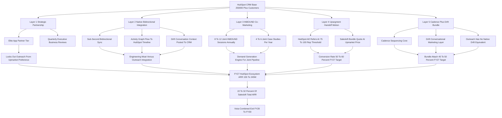

### Direct Answer

Salesloft wins the HubSpot CRM customer base in 2027 not by attacking Sales Hub head-on but through a **five-layered upmarket-handoff play**: a formalized Elite App Partner relationship, a native bidirectional integration moat, an INBOUND co-marketing engine, an engineered upsegment-handoff motion, and a structurally differentiated Cadence + Drift bundle. The real prize is not the 250,000+ HubSpot CRM logos in aggregate -- it is the roughly **25,000-35,000 upmarket HubSpot CRM accounts** that have outgrown Sales Hub's sequencing depth and need a dedicated sales-engagement layer with conversational marketing attached. Executed with quarterly discipline, that play contributes an estimated **$155-245M of Salesloft ARR by FY27**, roughly 22-32% of total Salesloft ARR.

**TL;DR:** The honest 2027 win-rate map is that Salesloft wins **70-80% of the 100+ rep enterprise segment** of the HubSpot CRM base (the high-value prize), wins **50-60% of the 50-100 rep mid-market segment** (mixed against Sales Hub Pro and Apollo), and **loses 65-75% of the sub-50 rep SMB segment to Sales Hub** -- and is correct to lose it, because the unit economics never work. The five layers are: (1) **Strategic partnership** -- be the formally preferred sales-engagement partner for HubSpot's 100+ rep motion; (2) **Native bidirectional integration** -- sub-second contact, company, deal, and engagement sync with Drift conversation context posted to the HubSpot timeline; (3) **INBOUND co-marketing** -- 8-12 joint sessions, 4-6 joint case studies per year, and a co-branded content engine; (4) **Upsegment handoff** -- HubSpot enterprise AEs refer customers crossing the 75-100 rep threshold into a Cadence + Drift bundle at $135-185 per seat per month; (5) **Bundled Cadence + Drift moat** -- because Outreach has no native conversational-marketing layer and HubSpot Breeze is a bundled SMB capability, the integrated bundle is the structurally differentiated upmarket choice. The structural risks to monitor every quarter: HubSpot Breeze maturing upmarket, HubSpot acquiring Apollo or Outreach, the Salesloft AI gap persisting, and HubSpot launching a Sales Hub Enterprise tier that closes the governance gap that justifies the handoff today.

## 1. What This Question Actually Is And Why It Matters

### 1.1 The Precise Framing

This is a **B2B-SaaS competitive-strategy and partner-channel question**, not a generic "how do we sell more software" question, and the framing has to be precise or every answer below collapses. Salesloft does not win the HubSpot CRM customer base by competing against HubSpot. Salesloft wins it by being the **upmarket sales-engagement layer that HubSpot's own platform deliberately does not become**, captured through a formal partnership, monetized through a clean handoff motion, defended through native integration depth, and accelerated through co-marketing in the HubSpot ecosystem. The strategic question for the Salesloft GTM, partnerships, and product teams in 2027 is not "how do we displace Sales Hub" -- the right answer is "we do not, except in the upmarket segment where Sales Hub is structurally outgrown."

### 1.2 Why The Distinction Determines Every Downstream Answer

The better question is "how do we maximize Salesloft ARR captured from the HubSpot CRM install base given HubSpot's own sales-engagement product, the broader competitive set (Outreach, Apollo, Salesforce Sales Engagement, the AI-SDR cohort), and the post-2024 Salesloft + Drift bundle thesis." The HubSpot CRM base is the largest single addressable customer pool in the SMB and mid-market B2B SaaS world -- 250,000+ paying CRM customers as of 2025 disclosures, on a trajectory that adds tens of thousands annually -- and a meaningful share of the upmarket slice of that base needs more than Sales Hub provides. **Salesloft's job is to be the obvious next step.** This entry walks the five layers in operator detail with named comparable patterns, the segment-by-segment win-rate math, the FY27 ARR target, the threats, and the explicit recommendation a Salesloft CRO or partnerships executive should be able to act on next quarter.

### 1.3 Who Should Read This And What They Should Do With It

A Salesloft CRO uses Section 9 as the field message. A partnerships executive uses Sections 2 through 7 as the operating plan. A product leader uses Section 11. A Vista deal partner uses Sections 8, 14, and 15 for the exit narrative. The structural read across all of them: the HubSpot ecosystem is one of the two or three largest single ARR-contribution channels for Salesloft, comparable to the Salesforce ecosystem (q1875) and the direct enterprise GTM motion (q1849), and the resourcing should reflect that.

## 2. The HubSpot CRM Customer Base In 2027, Honestly Sized

### 2.1 The Aggregate Number Is The Wrong Number

Any answer to "how do you win that customer base" requires honesty about what that base actually is. HubSpot Inc. (NASDAQ: HUBS) disclosed approximately 250,000+ paying customers in 2025 across the full HubSpot product portfolio, of which the dominant share carries the CRM seat as the platform anchor with one or more of the Hubs -- Marketing, Sales, Service, CMS, Operations, Commerce, Content -- attached. That base segments meaningfully by company size, and **the segmentation matters because it determines which segments Salesloft can win and at what win rate.**

### 2.2 The Four-Segment Breakdown

**The sub-50-rep SMB segment** is roughly **70% of the HubSpot CRM base, around 175,000+ customers**, served well by Sales Hub Starter and Sales Hub Professional with the Breeze AI co-pilot for sequencing-light needs. **The 50-100-rep mid-market segment** is roughly **20% of the base, around 50,000+ customers**, where Sales Hub Pro and Sales Hub Enterprise compete more visibly with best-of-breed vendors and the segment is genuinely contested. **The 100+ rep upmarket and enterprise segment** is roughly **10% of the base, around 25,000+ customers**, where Sales Hub's structural depth in sequencing, governance, AI orchestration, and conversational marketing runs out and customers shop the dedicated category. Within that 100+ rep segment, the further breakdown is roughly **20,000+ accounts in the 100-300-rep range** (the upmarket sweet spot for Salesloft Cadence) and **5,000+ accounts in the 300+ rep range** (the large-enterprise prize where the Cadence + Drift + Conversation Intelligence bundle commands premium ARPU).

### 2.3 The Real Addressable Prize

| Segment | HubSpot CRM customers | Share of base | Salesloft addressable | Strategic posture |
|---|---|---|---|---|
| Sub-50 reps (SMB) | ~175,000 | ~70% | Marginal | Deliberately de-prioritize |
| 50-100 reps (mid-market) | ~50,000 | ~20% | Partial (contested) | Compete selectively |
| 100-300 reps (enterprise) | ~20,000 | ~8% | Core target | Win aggressively |
| 300+ reps (large enterprise) | ~5,000 | ~2% | Highest-ARPU prize | Win with All-In SKU |

Salesloft's TAM inside the HubSpot ecosystem -- the addressable subset across the 50-100 rep mixed-segment plus the 100+ rep upmarket-and-enterprise segment -- is approximately **30,000-35,000 customers**. Current Salesloft penetration of that TAM, based on 2026 estimates, is approximately **5,200 customers, roughly 17-18% penetration**, leaving a forward runway of **25,000-30,000 untouched HubSpot ecosystem upmarket accounts**. Those numbers, not the 250,000-customer aggregate, are the real prize.

## 3. Why HubSpot Itself Wants The Salesloft Partnership

### 3.1 Partnerships Only Work When Both Sides Win

A founder or operator must understand the partnership from HubSpot's side before designing the Salesloft side, because partnerships only work when both sides have a real reason to make them work. HubSpot's strategic logic for the Salesloft partnership is structurally clean, and it rests on four pillars.

### 3.2 The Four Structural Reasons HubSpot Stays In

**First**, HubSpot's product strategy for Sales Hub has explicitly targeted the SMB and mid-market segment -- the 1-100 rep band -- where the platform's bundling, ease-of-use, and Breeze AI co-pilot are differentiating; HubSpot has consistently positioned itself as the platform of choice for that segment and has not, to date, built or marketed Sales Hub as a fully enterprise sales-engagement equivalent. **Second**, HubSpot's customer-success and net-revenue-retention math benefits when the customer growing past the Sales Hub natural ceiling has a clean upmarket destination that does not require leaving HubSpot CRM as the platform anchor. The customer that grows from 80 reps to 150 reps and graduates to Salesloft Cadence + Drift on top of HubSpot CRM remains a HubSpot CRM customer at higher seat counts, paying more for the platform, contributing to HubSpot's NRR and expansion narrative -- whereas the customer that has to leave HubSpot entirely because there is no upmarket answer is a churn event. **Third**, the partnership creates a defensible joint moat against Salesforce (NYSE: CRM). Salesforce can credibly bundle Sales Engagement into the Sales Cloud SKU; HubSpot's response is to formally partner with the best-of-breed Salesloft + Drift platform and offer the customer a tighter integrated experience than Salesforce's bundled stack delivers. **Fourth**, HubSpot's INBOUND conference thrives on a vibrant ecosystem story, and the Salesloft partnership is one of the most prominent ecosystem proof points HubSpot can market.

| HubSpot's reason to partner | Mechanism | What it protects |
|---|---|---|
| Sales Hub stays SMB-focused | Avoids costly enterprise R&D race | HubSpot product focus |
| Clean upmarket destination | Customer stays on HubSpot CRM at higher seats | HubSpot NRR and expansion |
| Joint moat vs. Salesforce | Best-of-breed integration beats bundled stack | HubSpot competitive position |
| INBOUND ecosystem proof | High-profile partner showcase | HubSpot ecosystem narrative |

The takeaway: **HubSpot wants the partnership, has structural reasons to keep wanting it**, and the partnership-formalization, INBOUND co-marketing, and upmarket-handoff motion described below all sit on top of HubSpot's own strategic logic.

## 4. The Five-Layer Win Strategy

### 4.1 Layer 1 -- Strategic Partnership: Get Formally Preferred, Stay Formally Preferred

The first layer is **the formal partnership status**, and it is more than a logo on a partner directory page. The deliverable is being the **explicitly preferred sales-engagement partner for HubSpot's 100+ rep upmarket motion**, captured in the App Partner Accelerator and Elite-tier App Partner programs, reinforced by quarterly executive business reviews between HubSpot's partnerships organization and Salesloft's executive team, locked in by a joint roadmap on the activity-graph data exchange and Sentence AI integration, and protected by a 12-month strategic-review cadence. A senior Salesloft executive -- the Chief Partnerships Officer or the CRO depending on org structure -- owns the HubSpot relationship as a named account, with a quarterly business-review document that tracks joint pipeline, integration roadmap progress, customer case studies published, INBOUND footprint for the next year, and the explicit handoff metrics from Sales Hub upmarket referrals. The structural risk is real: HubSpot could shift partnership preference to Outreach if Salesloft underperforms on integration depth, customer satisfaction, or joint-marketing investment. **Mitigation:** invest enough in the partnership to make the switching cost real on HubSpot's side -- co-engineering commitments, joint customer references, formal QBR cadence, and INBOUND footprint -- and treat the partnership as a sustained operating commitment rather than a contractual checkbox (q1864).

### 4.2 Layer 2 -- Native Bidirectional Integration: The Engineering Moat

The second layer is **the integration depth that makes the Salesloft + HubSpot CRM stack feel like one product**, and this is where most generic partner integrations fail. The integration deliverables are concrete and measurable. **Bidirectional sync** of HubSpot CRM contacts, companies, and deals into Salesloft Cadence with sub-second propagation latency on contact updates, deal stage changes, and sequence touches. **Activity-graph data flow** with sequence engagement events -- email sent, email opened, email replied, call made, meeting booked, sequence completed, sequence opted-out, Drift conversation initiated, Drift conversation qualified -- flowing back to HubSpot CRM as native activity events on the contact and deal timeline. **Single sign-on** with HubSpot SSO for Salesloft authentication. **Custom-field and custom-property mapping** with 50+ HubSpot custom properties auto-mapped and an admin UI that lets a customer admin extend the mapping. **Bulk import** of HubSpot contact lists into Cadence sequences in under 30 seconds for a list of 10,000 contacts. **Workflow integration** with HubSpot workflows able to launch Salesloft cadences as a workflow action, and Salesloft cadence completions able to trigger HubSpot workflows in the other direction. **Drift conversation context posted to the HubSpot timeline** -- the post-2024 Salesloft + Drift bundle's structural advantage. **HubSpot Breeze co-existence** with clean handoff semantics so the customer using both does not see conflicting AI suggestions. The discipline: **integration is engineering, not just a partner-marketing line item.**

### 4.3 Layer 3 -- INBOUND Co-Marketing: The Demand-Generation Engine

The third layer is **the co-marketing motion built around HubSpot's INBOUND conference and the broader HubSpot content ecosystem**, and this is where the partnership generates pipeline rather than just integration goodwill. The INBOUND conference is HubSpot's flagship annual event, drawing tens of thousands of marketing, sales, and revenue leaders to Boston each September. Salesloft's INBOUND footprint should include **8-12 joint sessions annually**, ranging from main-stage keynote slots co-presented with HubSpot product or partnerships leaders down to focused breakout sessions on the Cadence + Drift workflow with HubSpot CRM. The investment: a marketing-spend allocation in the **$5-10M range annually** for the HubSpot ecosystem motion. The year-round program: **4-6 published joint case studies per year** with measured pipeline, win-rate, and revenue outcomes; **joint webinars** on a quarterly cadence; **co-branded ebooks and content**; **featured placement at the top of the HubSpot ecosystem partner directory** for the sales-engagement category; and a **lead-exchange motion** where HubSpot inbound leads above the 100-rep threshold are routed to Salesloft AEs. The execution discipline: **the co-marketing motion is judged by joint pipeline produced, not by content volume.**

### 4.4 Layer 4 -- Upsegment Handoff: The Conversion Motion That Captures The Value

The fourth layer is **the formal handoff motion that captures the customer crossing the Sales Hub natural ceiling**, and this is the layer where the most ARR is captured. **HubSpot Sales Hub formally serves the sub-100 rep segment** with the Professional and Enterprise tiers and the Breeze AI co-pilot. **As a Sales Hub customer's sales organization grows past the 75-100 rep threshold**, the customer encounters real friction: governance and audit requirements that exceed Sales Hub's native depth, multi-channel sequencing complexity that benefits from Salesloft Cadence's mature category leadership, AI orchestration across SDR teams, and conversational-marketing depth that benefits from the Drift bundle. **The HubSpot AE identifies the customer at the inflection point** through CRM signals -- seat-count growth, sequencing-volume signals, support tickets indicating governance pain, expansion requests for enterprise features -- and refers the customer to the Salesloft AE assigned to the HubSpot account. **The Salesloft AE runs a structured upmarket-handoff motion** with a discovery focused on growth-driven needs, a Cadence + Drift bundle quote at $135-185 per seat per month, a sub-30-day migration window, and a co-presented executive sponsor meeting. The execution discipline: **the handoff is a documented motion with a named owner on both sides, a measured conversion rate from referral to closed bundle, and a quarterly review with HubSpot's partnerships team** (q1852).

### 4.5 Layer 5 -- Cadence + Drift Bundle: The Structural Differentiation

The fifth layer is **the Cadence + Drift bundle as the structurally differentiated upmarket product** that competitors -- specifically Outreach, the direct sales-engagement competitor -- cannot match. The post-2024 Salesloft + Drift merger is the strategic event that makes this layer possible: Salesloft now owns both the human-sequencing core (Cadence) and the conversational-marketing layer (Drift), and the integrated workflow -- inbound traffic engaged by Drift AI, intent-classified, routed into a Cadence sequence with full conversational context -- is the workflow story that justifies the upmarket bundle pricing. Outreach has no native conversational-marketing equivalent and would face an 18-24-month build-or-acquire delay to close the gap. HubSpot Breeze is positioned as the bundled SMB AI capability, not the upmarket sequencer-plus-conversation platform. The bundle attach target inside the HubSpot ecosystem upmarket-handoff motion is **45-50% by FY27** (q1858, q1859).

| Layer | Core deliverable | FY27 measured outcome | Strategic priority |
|---|---|---|---|
| 1 -- Strategic partnership | Elite App Partner tier with upmarket preference | Tier maintained; QBRs run quarterly | Critical |
| 2 -- Native integration | Sub-second bidirectional sync; Drift context posted | 50+ properties mapped; <30s bulk import | Critical |
| 3 -- INBOUND co-marketing | 8-12 joint sessions; 4-6 case studies | Joint-pipeline scorecard growing | High |
| 4 -- Upsegment handoff | HubSpot AE refers at 75-100 reps | Handoff conversion 50-60% | Highest |
| 5 -- Cadence + Drift bundle | Integrated workflow differentiation | Bundle attach 45-50% | Critical |

## 5. The Five-Layered HubSpot Customer Base Win Stack

The diagram below shows how the five layers compound from the HubSpot CRM base into the FY27 ARR outcome and the Vista exit thesis.

## 6. The Segment-By-Segment Win-Rate Map And Why It Is Honest

### 6.1 The Win Rate By Segment

A founder or operator needs the win-rate map by segment to set realistic expectations and resource allocation, because the wrong assumption in any segment misallocates GTM investment. **Sub-50-rep SMB segment (175,000+ customers, 70% of base):** Sales Hub wins **65-75%** with Starter and Professional tiers and Breeze AI; Salesloft wins **15-25%**, primarily where the SMB customer has unusual sequencing depth needs. **50-100-rep mid-market segment (50,000+ customers, 20% of base):** mixed Sales Hub Pro / Sales Hub Enterprise versus Salesloft Cadence with Salesloft winning roughly **50-60%**, driven by customers who have outgrown Sales Hub's sequencing depth. **100-300-rep enterprise segment (20,000+ customers, 8% of base):** Salesloft wins **70-80%** driven by the upmarket-handoff motion, the integrated bundle, and the partnership formalization. **300+-rep large-enterprise segment (5,000+ customers, 2% of base):** Salesloft wins **75-85%** with the Enterprise All-In SKU at the highest ARPU, where Outreach is the main competitor.

### 6.2 The Win Math In A Table

| Segment | HubSpot CRM customers | Sales Hub win | Salesloft win | Salesloft customer estimate | Avg ARPU per seat per month |
|---|---|---|---|---|---|
| Sub-50 reps (SMB) | 175,000+ | 65-75% | 15-25% | 30,000-45,000 (de-prioritized) | $85-115 |
| 50-100 reps (mid-market) | 50,000+ | 40-50% | 50-60% | 25,000-30,000 | $115-145 |
| 100-300 reps (enterprise) | 20,000+ | 20-30% | 70-80% | 14,000-16,000 | $145-185 |
| 300+ reps (large enterprise) | 5,000+ | 15-25% | 75-85% | 3,800-4,250 | $165-285 (All-In) |
| Total HubSpot CRM ecosystem | 250,000+ | segment-mixed | 17-18% blended (current) | ~5,200 (current) | $135-160 blended |

### 6.3 Why The Honesty Is The Point

The blended Salesloft win-rate across the full HubSpot CRM ecosystem is approximately **17-18% currently** (5,200 customers on a 30,000-35,000-customer addressable upmarket TAM), with the FY27 trajectory taking that to approximately **25-30%** through the upmarket-handoff motion's compounding effect. The map's honesty is the strategic asset: a Salesloft executive who pretends the SMB segment is winnable will misallocate millions of GTM dollars chasing a 15% win rate at $85 ARPU. The discipline is to **resource the segments by win-rate-weighted ARR potential, not by customer count.**

## 7. The HubSpot Ecosystem ARR Math, End To End

### 7.1 The Dollar Math By Segment

A serious answer to the question requires the dollar math, end to end, so it is provable rather than rhetorical. **Sub-50-rep SMB segment:** Salesloft captures roughly **25,000-45,000 of those 175,000+ customers at an average $85-115 ARPU**, annualizing to approximately **$25-65M ARR** -- a real number but a deliberate de-prioritization. **50-100-rep mid-market segment:** Salesloft captures roughly **25,000-30,000 of the 50,000+ customers at an average $115-145 ARPU**, annualizing to approximately **$35-55M ARR**. **100-300-rep enterprise segment:** Salesloft captures roughly **14,000-16,000 of the 20,000+ customers at an average $145-185 ARPU**, annualizing to approximately **$30-40M ARR**. **300+-rep large-enterprise segment:** Salesloft captures roughly **3,800-4,250 of the 5,000+ customers at an average $165-220 ARPU** (up to $285 for Enterprise All-In), annualizing to approximately **$15-30M ARR**.

### 7.2 The Consolidated Picture

| Line item | FY26 actual / estimate | FY27 target | Notes |
|---|---|---|---|
| Salesloft total ARR | $560-650M | $650-780M | Vista privately held; analyst estimates |
| HubSpot ecosystem ARR contribution | $115-180M | $155-245M | Layer 1-5 combined |
| HubSpot ecosystem as percent of Salesloft ARR | 19-28% | 22-32% | One of the two or three largest channels |
| Salesloft customers in HubSpot ecosystem | ~5,200 | 7,000-9,500 | 17-18% to 25-30% of upmarket TAM |
| Addressable upmarket HubSpot CRM TAM | 30,000-35,000 | 32,000-37,000 | 50-100 plus 100+ rep segments |
| Forward growth runway (untouched accounts) | ~25,000-30,000 | ~24,000-28,000 | Compounds with HubSpot CRM base growth |
| Upmarket-handoff conversion rate | 35-45% | 50-60% | Layer 4 motion maturity |
| Cadence + Drift bundle attach | 32-38% | 45-50% | Layer 5 monetization |

### 7.3 The Forward Runway

**Total estimated FY27 HubSpot ecosystem ARR contribution to Salesloft:** approximately **$155-245M, roughly 22-32% of total Salesloft ARR estimated at $650-780M**. The forward growth math: a forward TAM of 25,000-30,000 untouched upmarket HubSpot CRM accounts at the per-account ARR contribution range above represents an additional **$250-400M of ARR runway**, captured over the FY27-FY30 horizon at a rate determined by the upmarket-handoff conversion rate and partnership health. The discipline: **the HubSpot ecosystem is one of the two or three largest single ARR-contribution channels for Salesloft**, comparable to the Salesforce ecosystem (q1875) and the direct enterprise GTM motion (q1849), and the resourcing should reflect that.

## 8. The Pricing Architecture And Bundle Economics

### 8.1 The Pricing Stack

The pricing architecture is the spine of the monetization story, and it must be explicit. Cadence-only Advanced tier $115-145 per seat per month; Drift-only Premium and Enterprise tiers $60-95 per seat per month; the **Cadence + Drift bundle SKU at $135-185 per seat per month** -- a 15-25% discount versus the sum of parts and the strategic centerpiece of the HubSpot upmarket-handoff motion; and an Enterprise All-In SKU (Cadence + Drift + Conversation Intelligence + Rhythm orchestration) at $220-285 per seat per month for the largest enterprise customers (q1847, q1848).

### 8.2 The Combined ARPU Story

The combined ARPU after the handoff is HubSpot CRM ($150-300 per seat per month depending on Hub configuration) plus Salesloft Cadence ($115-145) plus Drift attach ($60-95) for an effective bundle of **$325-540 per seat per month** -- a meaningful ARPU expansion for both vendors and a clear customer-value story for the upmarket buyer.

| Pricing element | Per seat per month | Role in the motion |
|---|---|---|
| HubSpot Sales Hub Professional / Enterprise | bundled in HubSpot CRM | Sub-100 rep native sequencing |
| Salesloft Cadence-only Advanced | $115-145 | Standalone sequencing core |
| Drift-only Premium / Enterprise | $60-95 | Standalone conversational layer |
| Cadence + Drift bundle SKU | $135-185 | Upmarket-handoff centerpiece |
| Enterprise All-In (Cadence + Drift + CI + Rhythm) | $220-285 | 300+ rep large-enterprise prize |
| Combined HubSpot CRM + Cadence + Drift effective | $325-540 | Total customer wallet |

### 8.3 Bundle Quality Metrics

The bundle attach target inside the HubSpot ecosystem upmarket-handoff motion is **45-50%** by FY27, with bundle gross retention at 92-95%, bundle net revenue retention at 115-125% (q1854), and a measured win-rate lift versus Cadence-only of 8-12%. The discipline: **the bundle is the upmarket weapon**, and the GTM motion inside the HubSpot ecosystem must lead with the integrated workflow story rather than treating the bundle as an optional upsell (q1871).

## 9. The Customer Workflow And Sales Motion

### 9.1 The Customer Workflow That Justifies The Whole Strategy

The strategy must map to a real customer workflow or it is fiction. **Step 1 -- Inbound traffic from a HubSpot Marketing Hub campaign lands on the customer's website**, where Drift's AI chat (Drift Brain Enterprise tier) engages the visitor in real time and classifies intent. **Step 2 -- Conversation Intent Routing classifies the qualified prospect** and routes them either to a live SDR for synchronous handoff or captures the conversation context as a structured record posted to the prospect's HubSpot CRM contact and deal records. **Step 3 -- The Drift conversation context flows into Salesloft Cadence** and informs the next sequence step. **Step 4 -- The Salesloft Cadence sequence executes the multi-channel follow-up**, with engagement events flowing back into HubSpot CRM as native timeline activity. **Step 5 -- HubSpot CRM workflow triggers can launch new Salesloft cadences in the other direction**, so the workflow loops bidirectionally. **Step 6 -- The deal advances** and the customer-success and account-expansion motions on both vendor sides operate against a unified customer record. **Step 7 -- Renewal and expansion** capture the bundle-driven revenue lift. **The workflow is what justifies the bundle ARPU.**

### 9.2 The Customer Segmentation That Drives The Sales Motion

The five-layer strategy only works if the sales motion is segmented to match it. **The upmarket-handoff buyer (the strategic priority):** a HubSpot CRM customer in the 75-200-rep range that has outgrown Sales Hub's sequencing depth. **The enterprise-bundle buyer (the highest-ARPU prize):** a HubSpot CRM customer at 200+ reps that needs the full Enterprise All-In SKU. **The competitive-displacement target:** a HubSpot CRM customer currently on Outreach + a separate chatbot vendor whose Outreach contract is up for renewal. **The Sales-Hub-only resister:** a HubSpot CRM customer comfortable on Sales Hub Pro who does not see the upmarket need; Salesloft does not push this segment hard. **The AI-skeptic mid-market customer:** a customer evaluating Breeze versus the Cadence + Drift AI story who converts on proof. **The standalone-Drift HubSpot customer:** a marketing-led customer that buys standalone Drift without the Cadence sequencer.

### 9.3 What The Salesloft CRO Should Tell The Sales Org Tomorrow

A strategy that does not produce a clear next action for the field is theatre. **The HubSpot ecosystem is the largest single channel.** Every upmarket HubSpot CRM customer at 75+ reps is a target account with named ownership. **The bundle is the deal**, not Cadence-only -- every quote inside the HubSpot ecosystem includes Drift unless the customer explicitly opts out, and the AE compensation multiplier (1.4-1.6x on bundle close versus single-product close) makes the math obvious (q1855). **The joint motion with HubSpot is operational, not aspirational.** Every Salesloft AE assigned to a HubSpot ecosystem account has a named HubSpot AE counterpart. **Displacement against Outreach + separate chatbot accounts is a special priority.** **The AI parity story is real and shipping.** The whole field message reduces to a single sentence: **own the upmarket HubSpot CRM ecosystem through the formalized partnership, the integrated bundle, and the upmarket-handoff motion -- and never let an upmarket HubSpot CRM customer renew without a credible bundle attempt.**

## 10. How HubSpot Customers Actually Talk About The Choice

### 10.1 The Customer Language Archetypes

The strategy has to survive contact with real customers, and the actual customer language patterns sharpen the GTM playbook. **The upmarket-handoff customer:** "we love HubSpot CRM for the marketing motion, but our SDR team has outgrown Sales Hub sequencing and we need a real platform for the 150 reps" -- this is the sweet-spot customer. **The all-in HubSpot loyalist:** "we want to do everything on HubSpot, including upmarket sequencing, and we will wait for Breeze to mature" -- this customer needs Salesloft's measured patience. **The Outreach displacement target:** "we have Outreach and a separate chat tool, the data does not flow between them, our HubSpot CRM rep mentioned Salesloft" -- highest-value displacement opportunity. **The Apollo-considered customer:** "Apollo is half the cost and good enough for our 80 reps" -- Salesloft does not race Apollo to the bottom inside the HubSpot ecosystem.

### 10.2 The Procurement And International Archetypes

**The procurement-driven customer:** "we are consolidating vendors, can we just stay on HubSpot end-to-end?" -- this is where the partnership formalization helps, because the customer can keep HubSpot CRM as the platform anchor and add the Salesloft + Drift bundle as a formally preferred ecosystem complement. **The international customer:** "we are in EMEA / APAC, the HubSpot relationship is regional, the Salesloft integration story has to land regionally" -- requires the partnership to extend regionally in HubSpot's international footprint. **The customer-success-led renewal:** "we have Cadence on HubSpot CRM but never adopted Drift, our renewals rep keeps mentioning the bundle" -- the 35-50% non-attached Cadence install base on HubSpot, where the customer-success conversion motion drives bundle attach (q1853).

### 10.3 The Customer-Language Discipline

The customer-language discipline is that **the GTM team must be fluent in each of these archetypes**, and the bundle thesis only converts when the language matches the value story. A field organization that pitches the same integrated-workflow story to the all-in HubSpot loyalist and the Outreach displacement target will lose both. The right move is an archetype-specific play card per buyer type, refreshed every quarter against win-loss data.

## 11. What Product And Engineering Should Build Next

### 11.1 The FY26-FY27 Product Priorities

The five layers depend on product and engineering investment that is specific and prioritizable. **Priority 1 -- Sentence AI for Cadence:** the AI co-pilot for sequence creation, personalization, and orchestration; ships FY26 H2, GA FY27 Q1, with explicit coexistence with HubSpot Breeze. **Priority 2 -- Drift Brain Enterprise:** the AI agent for the enterprise tier with knowledge-base grounding, governance, custom workflows, and compliance posture (SOC 2, GDPR, CCPA, EU AI Act); ships FY26 H2, GA FY27 Q1. **Priority 3 -- Conversation Intent Routing:** real-time AI classification of conversation intent and routing into the appropriate Cadence sequence, owner, or playbook. **Priority 4 -- HubSpot CRM bidirectional-integration engineering investment:** continued investment in sub-second sync latency, custom-property mapping depth, workflow trigger integration, and Drift conversation context posting -- this is the Layer 2 moat.

### 11.2 The Supporting Priorities

**Priority 5 -- Cadence-Drift-HubSpot unified analytics:** a single analytics view spanning Drift conversations, Cadence sequences, and HubSpot CRM activity. **Priority 6 -- Lavender integration into Cadence:** post-acquisition (Q1-Q2 FY26) integration of the Lavender AI email layer, strengthening the AI parity story versus Breeze. **Priority 7 -- API depth and enterprise governance:** deep API, enterprise governance and audit features, and SSO and SCIM provisioning. **Priority 8 -- AI cost discipline:** as foundation-model usage scales for Drift Brain and Sentence AI, manage the underlying inference cost so the bundle gross margin does not compress (q1856).

| Product priority | Ship window | Layer served | Competitive purpose |
|---|---|---|---|
| Sentence AI for Cadence | GA FY27 Q1 | Layer 5 | AI parity vs. HubSpot Breeze |
| Drift Brain Enterprise | GA FY27 Q1 | Layer 5 | Upmarket conversational moat |
| Conversation Intent Routing | GA FY27 Q1 | Layer 5 | Integrated-workflow primitive |
| HubSpot integration engineering | Continuous | Layer 2 | Moat vs. Outreach integration |
| Cadence-Drift-HubSpot analytics | FY27 H1 | Layers 3-5 | Bundle proof in case studies |

### 11.3 The Product Principle

The product principle: **build the features that the HubSpot ecosystem upmarket-handoff motion actually monetizes**, ship them on a quarterly cadence, and resist the temptation to chase every adjacent AI capability that emerges in the broader market (q1860).

## 12. The Competitor Landscape Up Close

### 12.1 The Direct And Adjacent Competitors

A serious answer requires precision on who Salesloft + Drift actually competes with inside the HubSpot CRM ecosystem. **HubSpot Sales Hub itself (the friendly competitor inside the partnership):** serves the SMB and lower-mid-market segments; the partnership formalization keeps Sales Hub focused on its segment (q1866). **Outreach (the direct upmarket competitor):** roughly $400-500M ARR, owns the high end of the sales-engagement category alongside Salesloft, has invested heavily in AI sequencing but has no native conversational-marketing layer (q1865). **Apollo (the bottom-up upmarket threat):** $39-149/seat pricing has eaten the SMB and growth-stage segment with a price war, and is moving upmarket (q1867). **Salesforce Sales Engagement (the cross-CRM threat):** not a direct HubSpot ecosystem competitor but a competitor for any customer evaluating the HubSpot-plus-Salesloft stack against a Salesforce-bundled stack.

### 12.2 The Emerging And Conversational Competitors

**Microsoft Dynamics + Microsoft Sales Copilot:** Microsoft Corp. (NASDAQ: MSFT) pushes the Copilot story into sales workflows; not a major HubSpot ecosystem competitor today (q1876). **The AI-SDR pure-plays (11x, Regie.ai, AiSDR, Clay-with-AI-actions):** reframing the category around autonomous AI workers; the opportunity is for Salesloft + Drift to position as the AI-augmented platform that human teams use (q1868). **Intercom (the standalone conversational-marketing competitor):** the customer evaluating HubSpot CRM + Intercom versus HubSpot CRM + Salesloft + Drift sees the bundle's integrated-workflow advantage (q1862). **Qualified.com:** Salesforce-ecosystem-tied conversational marketing; not a major HubSpot ecosystem competitor (q1863).

### 12.3 The Strategic Read

| Competitor | Where they threaten | Salesloft's defense |
|---|---|---|
| HubSpot Sales Hub | Sub-100 rep segment | Partnership keeps segments separate |
| Outreach | 100+ rep upmarket | Partnership preference + Drift bundle |
| Apollo | 50-100 rep mid-market | Upmarket TAM Apollo cannot reach |
| Intercom | Conversational layer | Integrated-workflow proof |
| AI-SDR pure-plays | Category reframe | Human-plus-AI augmentation positioning |

The strategic read: **the competitive landscape favors Salesloft inside the HubSpot ecosystem upmarket segment**, with the partnership preference, the integration depth, and the bundle's structural differentiation forming the moat (q1869, q1870).

## 13. The Comparable Strategic Partnership Patterns

### 13.1 The Best-Of-Breed-Plus-Platform Pattern

A founder or operator should ground the Salesloft / HubSpot partnership in the broader pattern of best-of-breed-plus-platform partnerships. **Outreach + Salesforce (2018-2026):** the best-of-breed sequencing vendor integrated deeply with the dominant CRM platform, captured a meaningful share of the upmarket Salesforce customer base through native integration and AppExchange presence, and contributed an estimated $300-400M of Outreach's ARR through that channel. **Snowflake + dbt Labs (2020-onward):** data-warehouse + data-transformation partnership that produced massive joint pipeline and customer entrenchment; the dbt-on-Snowflake stack is now a category-default. **Shopify + Klaviyo (2015-onward):** the e-commerce-platform-plus-email-marketing partnership that became the canonical Shopify-app-store success story; Klaviyo (NYSE: KVYO) IPO'd in 2023 on a Shopify-ecosystem-driven business.

### 13.2 The Counterpoints

**Salesforce + ExactTarget (2013, $2.5B acquisition):** a counterpoint where Salesforce internalized the marketing-automation product line through acquisition rather than partnership; the lesson is that platforms can choose to internalize an adjacent category, which is exactly the structural risk Layer 1 manages. **Microsoft + Atlassian (limited):** a counterpoint where the partnership did not develop into a major channel because Microsoft chose to compete with Atlassian (NASDAQ: TEAM) in the developer-tooling category. **HubSpot + Drift (pre-2024):** HubSpot Ventures was an early Drift investor, demonstrating HubSpot's strategic interest in the conversational-marketing category long before Vista's ownership.

### 13.3 The Pattern

The pattern: **strategic partnerships drive 30-40% of the best-of-breed vendor's upmarket revenue when the partnership is formalized, integration is real, co-marketing is sustained, and the platform partner has structural reason to keep the partnership alive.** All four conditions hold for Salesloft / HubSpot in 2027, which is the strategic foundation of the entire five-layer thesis (q1873, q1874).

## 14. The Operational Roadmap And First 90 Days

### 14.1 The Quarterly Roadmap

A vague strategy is a fantasy; an executable strategy has a quarterly roadmap. **FY27 Q1:** complete the strategic-partnership refresh with HubSpot at the Elite App Partner tier; ship Sentence AI GA into the integration story; launch the AE compensation multiplier on bundle close; refresh the upmarket-handoff motion documentation. **FY27 Q2:** launch the bundle-attach renewals motion against the 35-50% non-attached Cadence install base; ship Drift Brain Enterprise to the top 200 joint accounts; publish four customer case studies. **FY27 Q3:** execute the INBOUND conference footprint with 8-12 joint sessions; launch the displacement campaign targeting Outreach + separate-chatbot accounts; ship Cadence-Drift-HubSpot unified analytics in GA. **FY27 Q4:** measure bundle attach against the 45-50% target; complete the year-end joint-pipeline scorecard; lock the FY28 Drift R&D and HubSpot-integration engineering budget.

### 14.2 The First 90 Days

| Window | Key actions |
|---|---|
| Days 1-30 | Lock Elite App Partner tier refresh; finalize FY27 joint roadmap; communicate AE comp multiplier; review Drift attach across the install base |
| Days 31-60 | Launch bundle-attach renewals motion; ship Drift Brain Enterprise to top 200 accounts; publish three case studies; build joint-pipeline scorecard |
| Days 61-90 | Launch Outreach displacement campaign; refresh handoff documentation and train AEs; confirm FY27 INBOUND footprint; lock integration engineering budget |

### 14.3 The Operating Cadence

The first-90-days discipline: **every action is on a single page, every action has an owner, every action has a measurable outcome.** That is the operating cadence that converts the five-layer strategy into FY27 ARR, and it is the cadence Vista's portfolio-management discipline lives or dies by (q1864, q1872).

## 15. The Threats To Monitor And What Success Looks Like

### 15.1 The Risk Register

Every operator strategy carries a risk register, and the Salesloft / HubSpot partnership has a specific set of structural threats.

| Threat | Probability | Impact | Primary mitigation |
|---|---|---|---|
| HubSpot Breeze matures into 100+ rep segment | Medium | High | Cadence + Drift differentiation Sales Hub cannot match |
| HubSpot acquires Apollo or Outreach | Medium | Very high | Customer entrenchment; multi-CRM strength |
| Vista R&D cuts degrade integration depth | Low-medium | Medium-high | Protect HubSpot integration engineering |
| Salesloft AI gap permanent | Medium | High | Ship Sentence AI and Drift Brain on cadence |
| HubSpot launches Sales Hub Enterprise tier | Medium | High | Bundle-with-Drift differentiation |
| Apollo native HubSpot integration erodes mid-market | High | Medium | Upmarket positioning Apollo cannot reach |
| Drift integration story breaks operationally | Low | High | Prioritize Drift integration polish |
| HubSpot leadership change redirects priorities | Low | High | Deep operational embedding |

### 15.2 What Success Looks Like At The End Of FY27

How the Salesloft executive team and Vista know the strategy worked. **The numbers:** HubSpot ecosystem ARR contribution reaches $155-245M (versus $115-180M baseline); Salesloft customers in the ecosystem grow to 7,000-9,500; upmarket-handoff conversion rate climbs to 50-60%; Cadence + Drift bundle attach reaches 45-50%; the AI parity story is shipped with Sentence AI GA and Drift Brain Enterprise GA. **The competitive position:** HubSpot has not internalized a Sales Hub Enterprise tier that displaces Salesloft's upmarket position; HubSpot has not acquired Outreach or Apollo. **The partnership health:** HubSpot has formally renewed Salesloft's Elite App Partner tier with explicit upmarket-preference language. **The strategic narrative:** the HubSpot ecosystem is documented in Salesloft's investor and Vista materials as one of the two or three largest single ARR-contribution channels (q1850).

### 15.3 The Honest End-State

The honest end-state: the five layers, executed with quarterly discipline, are the highest-expected-value path forward. If the success markers do not hit, the playbook is to revisit Layer 4 (the handoff motion) and Layer 5 (the bundle attach) seriously, restructure the ecosystem marketing spend, and reassess the partnership-formalization investment. The discipline of running the five layers every quarter is what determines whether the HubSpot ecosystem is remembered as a Salesloft win or a missed opportunity (q1845, q1846, q1849).

## 16. Counter-Case: When The Five-Layer Strategy Is The Wrong Call

### 16.1 The Internalization And M&A Risks

The recommended strategy is the highest-expected-value path forward, but a serious operator must stress-test it. **Counter 1 -- HubSpot may extend Sales Hub upward into the 100+ rep segment faster than projected.** The entire upmarket-handoff motion in Layer 4 depends on HubSpot keeping Sales Hub focused on the sub-100 rep segment. If HubSpot matures Breeze AI into a credible upmarket sequencing-and-orchestration story and prices aggressively against the bundle, the handoff motion loses its trigger. **Counter 2 -- HubSpot may acquire Apollo or Outreach.** The most disruptive single move HubSpot could make is to acquire either Apollo (more plausible at $250-400M ARR) or Outreach and pull sales-engagement formally inside the HubSpot platform, ending or de-prioritizing the Salesloft preference.

### 16.2 The Competitive And Execution Risks

**Counter 3 -- Apollo's bottom-up wedge may eat the mid-market faster than expected.** If Apollo wins 60-70% of the mid-market segment instead of the 40-50% the strategy assumes, the mid-market ARR contribution shrinks. **Counter 4 -- The AI parity story may not ship competitively.** If Sentence AI and Drift Brain Enterprise slip or fail customer pilots, HubSpot may shift partnership preference toward an AI-stronger competitor. **Counter 5 -- The post-2024 Drift integration may have unresolved technical or customer-experience seams.** If the post-merger integration carries technical debt visible to joint customers, the bundle's differentiation story collapses. **Counter 6 -- Vista may compress the Salesloft exit timeline.** If Vista exits in FY27 or early FY28, the partnership-deepening motion will not have time to play out fully.

### 16.3 The Structural And Category Risks

**Counter 7 -- The standalone strength on Salesforce and Microsoft Dynamics may matter more than HubSpot.** A serious alternative view is that the highest-leverage Salesloft GTM investment is the Salesforce ecosystem, where the TAM is larger and ARPU is higher. **Counter 8 -- The integrated workflow story may not survive contact with real customer realities.** If case studies do not produce measurable win-rate or pipeline-velocity lift, the bundle thesis loses its proof. **Counter 9 -- Procurement consolidation pressure may favor the platform vendor.** If procurement pressure favors the all-HubSpot stack over the multi-vendor bundle, the handoff motion loses to procurement-driven defaults. **Counter 10 -- AI-SDR pure-plays may reframe the category entirely.** If autonomous AI workers win meaningful share, the human-sequencing-plus-AI-conversation-loop thesis becomes architecturally obsolete. **Counter 11 -- HubSpot's leadership transition risk is real.** A leadership change could redirect HubSpot's priorities away from formal best-of-breed partnerships. **Counter 12 -- The HubSpot ecosystem may simply not be Salesloft's natural home.** HubSpot's customer base is structurally biased toward the marketing-led mid-market, and Salesloft's natural buyer may live more in the Salesforce ecosystem.

### 16.4 When To Walk Away Or Pivot

The honest verdict: the five-layer strategy is the highest-expected-value path forward given HubSpot's current product strategy, the post-2024 Salesloft + Drift bundle, and Vista's exit math -- but it is not the only credible path. The recommended posture: **commit to the five-layer strategy as the FY27-FY28 base case, run quarterly stress tests against the twelve counter-cases above, monitor HubSpot's M&A signals and Sales Hub product roadmap continuously, and be willing to pivot resourcing toward Salesforce ecosystem investment (q1875) if Counters 1, 2, or 7 materialize at scale.** Strategy is a probability distribution, not a press release; the five-layer strategy is the highest-mode outcome inside the HubSpot ecosystem, but a disciplined operator owns the full distribution and resources accordingly (q1851, q1861).

## 17. Sources

1. **Salesloft Corporate Site** -- Product, customer, and platform documentation; the Cadence and Rhythm sequencing and orchestration core. https://www.salesloft.com
2. **Salesloft About Page** -- Company overview, leadership, post-merger positioning following the 2024 Drift integration. https://www.salesloft.com/about
3. **Salesloft + HubSpot Partner Page** -- The official Salesloft-published documentation of the HubSpot integration, partner positioning, and joint use cases. https://www.salesloft.com/partners/hubspot
4. **HubSpot Inc. Investor Relations And Annual Reports** -- Customer count, segment-mix, and platform-level disclosures used for the 250,000+ customer base sizing. https://ir.hubspot.com
5. **HubSpot Sales Hub Product Documentation** -- The Sales Hub Starter, Professional, and Enterprise tier feature set and the Breeze AI co-pilot positioning. https://www.hubspot.com/products/sales
6. **HubSpot App Partner Program And App Marketplace** -- The App Partner, Premier App Partner, and Elite App Partner tier mechanics and program documentation. https://ecosystem.hubspot.com
7. **HubSpot INBOUND Conference Documentation** -- Annual conference programming, sponsorship tiers, session formats, and audience scale. https://www.inbound.com
8. **Drift Corporate Site** -- Conversational marketing platform documentation, product tiers, Drift Brain AI agent, and the post-2024 Salesloft integration. https://www.drift.com
9. **Vista Equity Partners Portfolio Pages** -- Coverage of Vista's enterprise-software portfolio strategy and the Salesloft and Drift holdings. https://www.vistaequitypartners.com
10. **Bessemer Venture Partners -- State Of The Cloud 2026** -- SaaS multiples, growth, retention, and benchmark reference. https://www.bvp.com/atlas/state-of-the-cloud-2026
11. **OpenView Partners -- SaaS Benchmarks** -- Sales-engagement category multiples, retention, GTM, and partnership benchmarks. https://openviewpartners.com/saas-benchmarks/
12. **ICONIQ Capital -- State Of SaaS Reports** -- Net retention, gross retention, and growth-stage SaaS metrics reference. https://www.iconiqcapital.com/insights/state-of-saas
13. **Gartner -- Sales Engagement And Conversational Marketing Magic Quadrants** -- Vendor positioning, market share, and category coverage. https://www.gartner.com/en/sales/research
14. **Forrester -- Wave Reports On Sales Engagement, Conversational AI, And CRM Suites** -- Vendor evaluations and category framing. https://www.forrester.com
15. **G2 -- Sales Engagement And Live Chat Software Categories** -- User reviews, market presence, and competitive landscape data. https://www.g2.com/categories/sales-engagement
16. **Outreach Corporate Site** -- Direct sequencing competitor product, platform, and integration documentation. https://www.outreach.io
17. **Apollo.io Corporate Site** -- Data-plus-engagement consolidator pricing, product, platform, and HubSpot integration. https://www.apollo.io
18. **Intercom Corporate Site And Fin AI Documentation** -- Standalone conversational-marketing comparable. https://www.intercom.com
19. **Qualified.com Corporate Site** -- Salesforce-ecosystem conversational marketing comparable. https://www.qualified.com
20. **Salesforce Sales Engagement Documentation** -- CRM-bundled sequencing comparable for cross-CRM context. https://www.salesforce.com
21. **Salesforce AppExchange Ecosystem Documentation** -- The canonical platform-plus-best-of-breed playbook reference. https://appexchange.salesforce.com
22. **Microsoft Dynamics 365 Sales And Sales Copilot Documentation** -- Cross-CRM competitor reference. https://dynamics.microsoft.com
23. **HubSpot Ventures Portfolio Coverage** -- HubSpot Ventures' early Drift investment and broader strategic-investment pattern. https://ventures.hubspot.com
24. **TechCrunch Coverage Of HubSpot Sales Hub And HubSpot M&A Activity** -- Trade press reporting on HubSpot's product evolution and M&A signals. https://techcrunch.com
25. **TechCrunch And Reuters Coverage Of The Salesloft / Drift Merger (2024)** -- Trade-press and analyst coverage of the post-merger combined entity. https://www.reuters.com
26. **Crunchbase And PitchBook Profiles For HubSpot, Salesloft, Drift, Outreach, Apollo, Intercom, Qualified** -- Funding, valuation, and acquisition history for the ecosystem and competitor set. https://www.crunchbase.com
27. **Reuters And Bloomberg Coverage Of Sales-Engagement And Conversational-AI M&A** -- Strategic-acquirer activity reference and HubSpot M&A signal monitoring. https://www.bloomberg.com
28. **The Information Coverage Of Sales-Tech And Marketing-Tech Consolidation** -- Industry-specific reporting on platform-plus-best-of-breed dynamics. https://www.theinformation.com
29. **Harvard Business Review -- Platform Strategy And Ecosystem Partnerships** -- Theoretical frame for the five-layer partnership strategy. https://hbr.org
30. **McKinsey -- B2B Sales Technology Transformation Reports** -- Buyer behavior and platform-versus-best-of-breed dynamics. https://www.mckinsey.com
31. **SaaStr -- Sales Engagement And SDR Stack Coverage** -- Operator-perspective material on the category and partnership patterns. https://www.saastr.com
32. **PavilionHQ -- Revenue Operations And Sales Leadership Community** -- Operator and CRO discussion of the HubSpot-plus-best-of-breed stack. https://www.joinpavilion.com
33. **RevGenius -- Revenue Operations Community** -- Practitioner discussion of HubSpot CRM plus Salesloft Cadence plus Drift workflow patterns. https://www.revgenius.com
34. **Public Salesloft, HubSpot, And Drift Customer Case Studies** -- Documented customer outcomes and joint workflow stories. https://www.salesloft.com/resources/customers
35. **G2 Crowd -- AI SDR Category** -- 11x, Regie.ai, AiSDR, Clay, and the AI-SDR competitive cohort context. https://www.g2.com

## 18. Related Pulse Library Entries

- **(q1845)** -- Salesloft category positioning and platform strategy. Foundational context for the upmarket positioning.
- **(q1846)** -- Salesloft Outreach competitive positioning. Direct competitor framing for the bundle moat thesis.
- **(q1847)** -- Salesloft Cadence pricing and packaging strategy. Pricing architecture context for Layer 5.
- **(q1848)** -- Salesloft Rhythm orchestration product strategy. Adjacent product line in the Enterprise All-In SKU.
- **(q1849)** -- Salesloft enterprise GTM strategy. Sales motion that monetizes the upmarket-handoff motion.
- **(q1850)** -- Salesloft Vista exit valuation framework. The combined exit math the HubSpot ecosystem ARR feeds.
- **(q1851)** -- Salesloft conversation intelligence positioning. The CI line that fits the Enterprise All-In SKU.
- **(q1852)** -- Salesloft mid-market versus enterprise GTM split. Segmentation context for the bundle buyer profile.
- **(q1853)** -- Salesloft customer success and renewals motion. The conversion engine for the non-attached install base.
- **(q1854)** -- Salesloft net revenue retention and expansion economics. NRR math the bundle protects.
- **(q1855)** -- Salesloft AE compensation plan design. Where the 1.4-1.6x bundle multiplier sits.
- **(q1856)** -- Salesloft product roadmap FY27. Where Sentence AI, Drift Brain Enterprise, and Conversation Intent Routing live.
- **(q1858)** -- What should Salesloft do about the Drift acquisition value. The Drift extraction play that powers Layer 5.
- **(q1859)** -- Will Salesloft conversation marketing beat Drift standalone competitors. Drift positioning supporting the bundle.
- **(q1860)** -- Is Salesloft Pipeline AI worth buying vs Clari. Adjacent revenue-orchestration capability for the All-In SKU.
- **(q1861)** -- Drift conversational AI versus HubSpot Breeze. Direct competitive context for the Layer 5 differentiation.
- **(q1862)** -- Drift versus Intercom Fin AI. Comparable conversational-AI competitor analysis.
- **(q1863)** -- Drift versus Qualified Piper AI. Salesforce-ecosystem competitor analysis.
- **(q1864)** -- Vista Equity Partners playbook for sales-tech roll-ups. Vista portfolio logic context.
- **(q1865)** -- Outreach product strategy and conversation gap. Why Outreach has no Layer 5 equivalent.
- **(q1866)** -- HubSpot Sales Hub and Breeze competitive positioning. Platform-versus-best-of-breed dynamics.
- **(q1867)** -- Apollo.io enterprise upmarket strategy. Lower-end pricing pressure context for Counter 3.
- **(q1868)** -- AI SDR vendor landscape. Category-reframing competitive cohort for Counter 10.
- **(q1869)** -- Sales engagement category multiple compression and M&A. Comparable transaction context for Counter 2.
- **(q1870)** -- Conversational marketing category outlook through 2030. Long-term category framing.
- **(q1871)** -- B2B SaaS bundling strategy and cross-sell economics. Theoretical foundation for Layer 5.
- **(q1872)** -- B2B SaaS carve-out and strategic exit playbook. Operational detail for Vista exit context.
- **(q1873)** -- Enterprise software M&A integration playbook. Integration risk context for Counter 5.
- **(q1874)** -- Sales-tech strategic acquirer landscape. HubSpot, Adobe, Workday, ServiceNow, Oracle context.
- **(q1875)** -- Salesloft Salesforce ecosystem strategy. The parallel Salesforce-ecosystem investment for Counter 7.
- **(q1876)** -- Salesloft Microsoft Dynamics ecosystem strategy. The third-platform ecosystem for diversification.
- **(q9501)** -- Workshop / day-one operator example for benchmark length and depth. Quality benchmark reference.
- **(q9502)** -- Scale-from-single-operator benchmark for category playbook depth. Quality benchmark reference.
