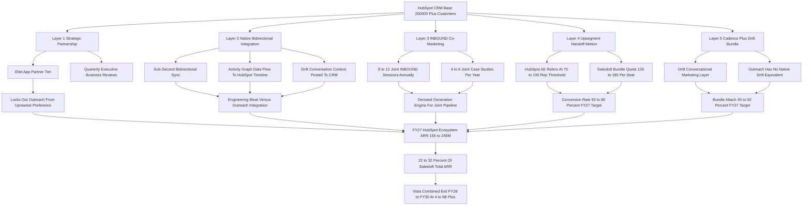

### Direct Answer

Salesloft wins the HubSpot CRM customer base in 2027 not by attacking Sales Hub head-on but through a **five-layer upmarket-handoff play**, and the prize is not the 250,000-plus HubSpot CRM logos in aggregate -- it is the roughly **25,000-35,000 upmarket HubSpot CRM accounts that have outgrown Sales Hub's sequencing depth** and need a dedicated sales-engagement layer with conversational marketing attached. The five layers -- strategic partnership, native bidirectional integration, INBOUND co-marketing, the upsegment handoff motion, and the bundled Cadence + Drift moat -- compound into roughly **$155-245M of FY27 Salesloft ARR (about 22-32% of total)**, with Salesloft winning the 100-plus rep enterprise segment at 70-85% and correctly conceding the sub-50 rep SMB segment to Sales Hub.

**TL;DR:** Salesloft wins the HubSpot CRM base through a **five-layered upmarket-handoff play, not a frontal assault on Sales Hub**. The real prize is the **25,000-35,000 upmarket HubSpot CRM accounts** that have outgrown Sales Hub. Layer 1: be HubSpot's formally preferred sales-engagement partner at the Elite App Partner tier. Layer 2: native sub-second bidirectional sync between HubSpot CRM and Salesloft Cadence with Drift conversation context posted to the HubSpot timeline. Layer 3: an INBOUND co-marketing engine with 8-12 joint sessions and 4-6 joint case studies per year. Layer 4: a formal upsegment handoff where HubSpot AEs refer customers crossing the 75-100 rep threshold into a Cadence + Drift bundle at $135-185 per seat per month. Layer 5: the Cadence + Drift bundle as the structurally differentiated upmarket choice that Outreach cannot match. Honest 2027 win-rate map: Salesloft wins **70-80% of the 100-300 rep enterprise segment**, **75-85% of the 300-plus rep large-enterprise segment**, **50-60% of the 50-100 rep mid-market**, and **loses 65-75% of the sub-50 rep SMB segment to Sales Hub (and is correct to lose it)**. Net FY27 contribution from the HubSpot ecosystem: roughly **$155-245M of Salesloft ARR, about 22-32% of total Salesloft ARR estimated at $650-780M**, with current penetration around 17-18% of the addressable upmarket TAM and a runway of 25,000-30,000 untouched upmarket accounts. Structural risks: HubSpot Breeze AI maturing upmarket, HubSpot acquiring Apollo or Outreach, the Salesloft AI gap persisting, and HubSpot launching a Sales Hub Enterprise tier that closes the governance gap.

## 1. What This Question Actually Is And Why It Matters

### 1.1 The precise framing

This is a **B2B-SaaS competitive-strategy and partner-channel question**, not a generic "how do we sell more software" question, and the framing has to be precise or every answer below collapses. **Salesloft does not win the HubSpot CRM customer base by competing against HubSpot.** Salesloft wins it by being the **upmarket sales-engagement layer that HubSpot's own platform deliberately does not become**, captured through a formal partnership, monetized through a clean handoff motion, defended through native integration depth, and accelerated through co-marketing in the HubSpot ecosystem.

The strategic question for the Salesloft GTM, partnerships, and product teams in 2027 is not "how do we displace Sales Hub" -- the right answer is "we do not, except in the upmarket segment where Sales Hub is structurally outgrown." The right question is "how do we maximize Salesloft ARR captured from the HubSpot CRM install base given HubSpot's own sales-engagement product, the broader competitive set, and the post-2024 Salesloft + Drift bundle thesis."

### 1.2 Why the prize is real

**The HubSpot CRM base is the largest single addressable customer pool in the SMB and mid-market B2B SaaS world.** HubSpot Inc. (NYSE: HUBS) disclosed approximately 250,000-plus paying customers as of 2025, on a trajectory that adds tens of thousands annually. A meaningful share of the upmarket slice of that base needs more than Sales Hub provides, and **Salesloft's job is to be the obvious next step**. This entry walks the five layers in operator detail with named comparable patterns, the segment-by-segment win-rate math, the FY27 ARR target, the threats, and the explicit recommendation a Salesloft CRO or partnerships executive should be able to act on next quarter (q1849).

## 2. The HubSpot CRM Customer Base In 2027, Honestly Sized

### 2.1 The segment breakdown

Any answer to "how do you win that customer base" requires honesty about what that base actually is. HubSpot Inc. (NYSE: HUBS) disclosed approximately 250,000-plus paying customers in 2025 across the full product portfolio, of which the dominant share carries the CRM seat as the platform anchor. **That base segments meaningfully by company size, and the segmentation determines which segments Salesloft can win and at what win rate.**

| Segment | Share of base | Customer count | Primary HubSpot offer |
|---|---|---|---|
| Sub-50 reps (SMB) | ~70% | ~175,000+ | Sales Hub Starter / Pro + Breeze AI |
| 50-100 reps (mid-market) | ~20% | ~50,000+ | Sales Hub Pro / Enterprise |
| 100-300 reps (enterprise) | ~8% | ~20,000+ | Sales Hub Enterprise (contested) |
| 300+ reps (large enterprise) | ~2% | ~5,000+ | Sales Hub Enterprise (outgrown) |

### 2.2 The addressable upmarket TAM

**The sub-50-rep SMB segment** is roughly 70% of the HubSpot CRM base, served well by Sales Hub Starter and Professional with the Breeze AI co-pilot for sequencing-light needs. **The 50-100-rep mid-market segment** is roughly 20% of the base, where Sales Hub Pro and Enterprise compete visibly with best-of-breed vendors and the segment is genuinely contested. **The 100-plus-rep upmarket and enterprise segment** is roughly 10% of the base -- around 25,000-plus customers -- where Sales Hub's structural depth in sequencing, governance, AI orchestration, and conversational marketing runs out and customers shop the dedicated category.

Within that 100-plus-rep segment, the breakdown is roughly **20,000-plus accounts in the 100-300-rep range** (the upmarket sweet spot for Salesloft Cadence) and **5,000-plus accounts in the 300-plus-rep range** (the large-enterprise prize where the Cadence + Drift + Conversation Intelligence bundle commands premium ARPU). **Salesloft's TAM inside the HubSpot ecosystem -- the addressable subset across the 50-100 rep mixed-segment plus the 100-plus rep upmarket-and-enterprise segment -- is approximately 30,000-35,000 customers.**

### 2.3 Current penetration and runway

Current Salesloft penetration of that TAM, based on 2026 estimates, is approximately **5,200 customers, roughly 17-18% penetration**, leaving a forward runway of **25,000-30,000 untouched HubSpot ecosystem upmarket accounts**. Those numbers, not the 250,000-customer aggregate, are the real prize. The mid-market-versus-enterprise split that drives the bundle buyer profile is detailed in the Salesloft segmentation playbook (q1852).

## 3. Why HubSpot Itself Wants The Salesloft Partnership

### 3.1 The four structural reasons

A founder or operator must understand the partnership from HubSpot's side before designing the Salesloft side, because **partnerships only work when both sides have a real reason to make them work**. HubSpot's strategic logic for the Salesloft partnership is structurally clean.

- **First, product focus.** HubSpot's product strategy for Sales Hub has explicitly targeted the SMB and mid-market segment (the 1-100 rep band) where the platform's bundling, ease-of-use, and Breeze AI co-pilot are differentiating. HubSpot has not -- to date -- built or marketed Sales Hub as a fully enterprise sales-engagement equivalent for the 100-plus rep customer needing dedicated governance, complex multi-channel sequencing, AI orchestration across SDR teams, and conversational-marketing depth.
- **Second, net-revenue-retention math.** HubSpot's customer-success and NRR math benefits when the customer growing past the Sales Hub natural ceiling has a clean upmarket destination that does not require leaving HubSpot CRM as the platform anchor. The customer growing from 80 reps to 150 reps and graduating to Salesloft Cadence + Drift on top of HubSpot CRM **remains a HubSpot CRM customer at higher seat counts** -- whereas the customer that has to leave HubSpot entirely is a churn event.
- **Third, a joint moat against Salesforce.** Salesforce (NYSE: CRM) can credibly bundle Sales Engagement into the Sales Cloud SKU; HubSpot's response is to formally partner with the best-of-breed Salesloft + Drift platform and offer a tighter integrated experience than Salesforce's bundled stack delivers.
- **Fourth, the INBOUND ecosystem story.** HubSpot's INBOUND conference thrives on a vibrant ecosystem narrative, and the Salesloft partnership is one of the most prominent ecosystem proof points HubSpot can market.

### 3.2 The takeaway

**HubSpot wants the partnership, has structural reasons to keep wanting it, and the partnership-formalization, INBOUND co-marketing, and upmarket-handoff motion all sit on top of HubSpot's own strategic logic.** That alignment is what makes the five-layer play durable rather than a one-sided wish. The Sales Hub and Breeze competitive dynamics inside the partnership are analyzed in depth in the dedicated entry (q1866).

## 4. Layer 1 -- Strategic Partnership: Get Formally Preferred, Stay Formally Preferred

### 4.1 The deliverable

The first layer is **the formal partnership status**, and it is more than a logo on a partner directory page. The deliverable is being the **explicitly preferred sales-engagement partner for HubSpot's 100-plus rep upmarket motion**, captured in the App Partner Accelerator and Elite-tier App Partner programs, reinforced by quarterly executive business reviews between HubSpot's partnerships organization and Salesloft's executive team, locked in by a joint roadmap on the activity-graph data exchange and Sentence AI integration, and protected by a 12-month strategic-review cadence that makes the relationship hard for a competitor to displace.

### 4.2 The execution

A senior Salesloft executive -- the Chief Partnerships Officer or the CRO depending on org structure -- owns the HubSpot relationship as a named account, with a quarterly business-review document that tracks joint pipeline, integration roadmap progress, customer case studies published, INBOUND footprint for the next year, and the explicit handoff metrics from Sales Hub upmarket referrals. **The partner-tier mechanics matter:** HubSpot's App Partner Program has formal tiers -- App Partner, Premier App Partner, Elite App Partner -- with progressive commitments and benefits, and Salesloft's job is to maintain **Elite-tier status** with the integration depth, customer-satisfaction scores, and joint-marketing investment that the tier requires.

### 4.3 The structural risk and mitigation

The structural risk is real: HubSpot could shift partnership preference to Outreach (Salesloft's direct competitor) if Salesloft underperforms on integration depth, customer satisfaction, or joint-marketing investment, or could quietly de-prioritize the upmarket-handoff motion in favor of expanding Sales Hub Enterprise into the 100-200-rep segment. **Mitigation: invest enough in the partnership to make the switching cost real on HubSpot's side** -- co-engineering commitments, joint customer references, formal QBR cadence, and INBOUND footprint -- and treat the partnership as a sustained operating commitment rather than a contractual checkbox. The Vista roll-up logic that funds this commitment is detailed separately (q1864).

## 5. Layer 2 -- Native Bidirectional Integration: The Engineering Moat

### 5.1 The integration deliverables

The second layer is **the integration depth that makes the Salesloft + HubSpot CRM stack feel like one product**, and this is where most generic partner integrations fail and where Salesloft has to invest deliberately to lead.

- **Bidirectional sync** of HubSpot CRM contacts, companies, and deals into Salesloft Cadence with sub-second propagation latency on contact updates, deal-stage changes, and sequence touches; the customer should never have to refresh either system.
- **Activity-graph data flow** with sequence engagement events -- email sent, opened, replied, call made, meeting booked, sequence completed, sequence opted-out, Drift conversation initiated, Drift conversation qualified -- flowing back to HubSpot CRM as native activity events, indistinguishable in the timeline from HubSpot-native activity.
- **Single sign-on** with HubSpot SSO for Salesloft authentication, so the user does not double-authenticate.
- **Custom-field and custom-property mapping** with 50-plus HubSpot custom properties auto-mapped to Salesloft fields, plus a mapping admin UI that lets a customer admin extend the mapping without engineering involvement.
- **Bulk import** of HubSpot contact lists into Cadence sequences in under 30 seconds for a list of 10,000 contacts, with a clean error-handling and dedup pass.
- **Workflow integration** with HubSpot workflows able to launch Salesloft cadences as a workflow action, and Salesloft cadence completions able to trigger HubSpot workflows in the other direction.
- **Drift conversation context posted to the HubSpot timeline** -- the post-2024 Salesloft + Drift bundle's structural advantage -- so the customer's HubSpot CRM record shows the inbound conversation that originated the lead, the qualifying questions, and the routed sequence handoff, all in one timeline.

### 5.2 The Breeze co-existence discipline

The Salesloft integration must coexist with HubSpot's own **Breeze AI co-pilot** rather than fighting it, with clean handoff semantics so the customer using both does not see conflicting AI suggestions. The discipline: **integration is engineering, not just a partner-marketing line item**, and Salesloft's investment in this layer is what separates the partnership from a generic ISV listing. The Drift-versus-Breeze competitive frame is analyzed directly in the conversational-AI comparison entry (q1861).

## 6. Layer 3 -- INBOUND Co-Marketing: The Demand-Generation Engine

### 6.1 The INBOUND footprint

The third layer is **the co-marketing motion built around HubSpot's INBOUND conference and the broader HubSpot content ecosystem**, and this is where the partnership generates pipeline rather than just integration goodwill. The INBOUND conference is HubSpot's flagship annual event, drawing tens of thousands of marketing, sales, and revenue leaders to Boston each September, with hybrid and online programming reaching far broader audiences. **It is the single largest concentrated audience of HubSpot's customer base in any given year.**

Salesloft's INBOUND footprint should include **8-12 joint sessions annually**, ranging from main-stage keynote slots co-presented with HubSpot product or partnerships leaders down to focused breakouts on the Cadence + Drift workflow with HubSpot CRM, customer panel sessions with joint customers, and product-deep-dive sessions for the integration.

### 6.2 The year-round content engine

The investment: a marketing-spend allocation in the **$5-10M range annually** for the HubSpot ecosystem motion, of which a meaningful share funds the INBOUND footprint and the rest funds the year-round engine.

- **4-6 published joint case studies per year** featuring mid-market and enterprise customers running Cadence + Drift on HubSpot CRM, with measured pipeline, win-rate, and revenue outcomes.
- **Joint webinars** on a quarterly cadence covering integration use cases, AI-co-pilot integration, and category trends.
- **Co-branded ebooks and content** on topics where HubSpot's audience and Salesloft's audience overlap.
- **Featured placement at the top of the HubSpot ecosystem partner directory** for the sales-engagement category.
- **A lead-exchange motion** where HubSpot inbound leads above the 100-rep threshold are routed to Salesloft AEs for follow-up, with measured conversion and attribution back to HubSpot.

### 6.3 The execution discipline

**The co-marketing motion is judged by joint pipeline produced, not by content volume**, and Salesloft's measurement should be a quarterly joint-pipeline scorecard shared with HubSpot's partnerships team.

## 7. Layer 4 -- Upsegment Handoff: The Conversion Motion That Captures The Value

### 7.1 The mechanics of the handoff

The fourth layer is **the formal handoff motion that captures the customer crossing the Sales Hub natural ceiling and converts them to a Salesloft Cadence + Drift bundle**, and this is the layer where the most ARR is captured -- and the layer most often executed badly by partnerships that do not engineer the motion.

- **HubSpot Sales Hub formally serves the sub-100 rep segment** with the Professional and Enterprise tiers and the Breeze AI co-pilot, providing native sequencing, basic AI assistance, and the integrated CRM-plus-sequencing experience the small-and-growing customer needs.
- **As a customer's sales org grows past the 75-100 rep threshold**, the customer encounters real friction: governance and audit requirements that exceed Sales Hub's native depth, multi-channel sequencing complexity that benefits from Cadence's mature category leadership, AI orchestration across SDR teams, and conversational-marketing depth that benefits from the Drift bundle.
- **The HubSpot AE identifies the customer at the inflection point** through CRM signals -- seat-count growth, sequencing-volume signals, support tickets indicating governance pain, expansion requests for enterprise features -- and refers the customer to the Salesloft AE assigned to the HubSpot account.
- **The Salesloft AE runs a structured upmarket-handoff motion** with a discovery focused on the customer's growth-driven needs, a Cadence + Drift bundle quote at $135-185 per seat per month, a sub-30-day migration window, and a co-presented executive sponsor meeting with both HubSpot and Salesloft account leadership.

### 7.2 The combined ARPU after handoff

The combined ARPU after the handoff is HubSpot CRM ($150-300 per seat per month depending on Hub configuration) plus Salesloft Cadence ($115-145) plus Drift attach ($60-95) for an effective bundle of **$325-540 per seat per month** -- a meaningful ARPU expansion for both vendors and a clear customer-value story for the upmarket buyer. **Customer-success ratio:** HubSpot for the sub-100 rep portion of the organization that remains on Sales Hub; Salesloft enterprise CS for the 100-plus rep portion on Cadence + Drift.

### 7.3 The four failure modes of an un-engineered handoff

**The handoff is a documented motion with a named owner on both sides, a measured conversion rate from referral to closed bundle, and a quarterly review of handoff performance with HubSpot's partnerships team.** Without that engineering, the handoff devolves into informal name-passing and the conversion rate collapses. The four specific failure modes an operator must design against:

- **No referral trigger.** If the HubSpot AE has no CRM signal that flags the 75-100 rep inflection point, the referral never fires and the customer shops the open market or stalls on Sales Hub.
- **No named Salesloft owner.** If the referral lands in a generic queue rather than a named Salesloft AE assigned to that HubSpot account, the lead ages and the conversion rate drops below 20%.
- **No migration runway.** If the Cadence + Drift migration is not pre-scoped to a sub-30-day window, the customer hesitates at the switching cost and the deal slips a full quarter or dies.
- **No joint executive sponsor.** If the handoff is a single-AE motion rather than a co-presented executive meeting, the customer reads it as a vendor upsell rather than a partnership-blessed graduation, and the close rate suffers.

The discipline that fixes all four: a written handoff playbook, a quarterly joint review of the conversion funnel, and an AE compensation structure that rewards the bundle close. The enterprise GTM motion that monetizes this handoff is detailed separately (q1849).

## 8. Layer 5 -- Cadence + Drift Bundle: The Structural Differentiation

### 8.1 Why the merger makes this layer possible

The fifth layer is **the Cadence + Drift bundle as the structurally differentiated upmarket product** that competitors -- specifically Outreach, the direct sales-engagement competitor -- cannot match, and that HubSpot's own Breeze AI is not positioned to match in the upmarket segment. The post-2024 Salesloft + Drift merger is the strategic event that makes this layer possible: Salesloft now owns both the human-sequencing core (Cadence) and the conversational-marketing layer (Drift), and the integrated workflow -- inbound traffic engaged by Drift AI, intent-classified, routed into a Cadence sequence with full conversational context -- is the workflow story that justifies the upmarket bundle pricing.

### 8.2 Why competitors cannot match it

**Outreach has no native conversational-marketing equivalent** and would face an 18-24-month build-or-acquire delay to close the gap, or a $500-800M acquisition of Qualified, the most plausible target. **HubSpot Breeze is positioned as the bundled SMB AI capability**, not the upmarket sequencer-plus-conversation platform; HubSpot's own product strategy structurally avoids competing with Salesloft's bundle in the upmarket segment because doing so would compete with HubSpot's own partnership preference. The Outreach conversation gap is examined in the dedicated competitive entry (q1865).

### 8.3 The competitive build-or-buy math for Outreach

The structural advantage in Layer 5 only holds if the operator understands why Outreach cannot quickly close the gap. **To match the Cadence + Drift bundle, Outreach has exactly three options, and all three are slow or expensive.** Build a conversational-marketing layer from scratch -- an 18-24-month effort to reach a credible product, plus another year to reach the integration depth and the enterprise governance posture that the upmarket buyer requires. Acquire Qualified (the most plausible target) for an estimated $500-800M, then absorb a 12-18-month post-merger integration risk identical to the one Salesloft itself is managing with Drift. Or partner with a standalone conversational vendor and accept the same integration-seam problem that the bundle is designed to exploit. **The point for the Salesloft field: the bundle's moat is not a feature, it is a clock.** Every quarter Outreach spends without a native conversational layer is a quarter in which the integrated-workflow story wins upmarket HubSpot CRM deals, and the FY27-FY28 window is the period in which that clock advantage is largest.

### 8.4 The pricing architecture

| SKU | Price per seat per month | Role |
|---|---|---|
| Cadence-only Advanced | $115-145 | Standalone sequencer |
| Drift-only Premium / Enterprise | $60-95 | Standalone conversational marketing |
| Cadence + Drift bundle SKU | $135-185 | Upmarket-handoff centerpiece (15-25% off sum of parts) |
| Enterprise All-In (Cadence + Drift + CI + Rhythm) | $220-285 | Largest-enterprise prize |

The bundle attach target inside the HubSpot ecosystem upmarket-handoff motion is **45-50%** by FY27, with the bundle's measurably better win rate, retention, and net-revenue-retention versus Cadence-only providing the proof points. The discipline: **the bundle is the upmarket weapon**, and the GTM motion inside the HubSpot ecosystem must lead with the integrated workflow story and the Drift attach pricing rather than treating the bundle as an optional upsell. The Cadence pricing-and-packaging logic is detailed separately (q1847).

## 9. The Five-Layered HubSpot Customer Base Win Stack

## 10. The Segment-By-Segment Win-Rate Map And Why It Is Honest

### 10.1 The four segments

A founder or operator needs the win-rate map by segment to set realistic expectations and resource allocation, because the wrong assumption in any segment misallocates GTM investment.

- **Sub-50-rep SMB segment (175,000-plus customers, 70% of base):** Sales Hub wins 65-75% with Starter and Professional tiers and Breeze AI; Salesloft wins 15-25%, primarily where the SMB customer has unusual sequencing-depth needs. Blended ARPU $85-115 per seat per month. **Salesloft is correct to under-invest in displacing Sales Hub here** -- the unit economics never work.
- **50-100-rep mid-market segment (50,000-plus customers, 20% of base):** mixed Sales Hub Pro / Enterprise versus Salesloft Cadence, with Salesloft winning roughly 50-60%, driven by customers who have outgrown Sales Hub's sequencing depth or brought in RevOps leadership that standardized on Cadence. ARPU $115-145.
- **100-300-rep enterprise segment (20,000-plus customers, 8% of base):** Salesloft wins 70-80%, driven by the upmarket-handoff motion, the integrated Cadence + Drift bundle, and partnership formalization. ARPU $145-185.
- **300-plus-rep large-enterprise segment (5,000-plus customers, 2% of base):** Salesloft wins 75-85% with the Enterprise All-In SKU at the highest ARPU, where Outreach is the main competitor. ARPU $165-220 and frequently up to $285.

### 10.2 Segment-by-segment win math

| Segment | HubSpot CRM customers | Sales Hub win | Salesloft win | Salesloft customer estimate | Avg ARPU per seat per month |
|---|---|---|---|---|---|
| Sub-50 reps (SMB) | 175,000+ | 65-75% | 15-25% | 30,000-45,000 (de-prioritized) | $85-115 |
| 50-100 reps (mid-market) | 50,000+ | 40-50% | 50-60% | 25,000-30,000 | $115-145 |
| 100-300 reps (enterprise) | 20,000+ | 20-30% | 70-80% | 14,000-16,000 | $145-185 |
| 300+ reps (large enterprise) | 5,000+ | 15-25% | 75-85% | 3,800-4,250 | $165-285 (All-In) |
| Total HubSpot CRM ecosystem | 250,000+ | segment-mixed | 17-18% blended now | ~5,200 (current) | $135-160 blended |

The blended Salesloft win-rate across the full HubSpot CRM ecosystem is approximately **17-18% currently**, with the FY27 trajectory taking that to approximately **25-30%** through the upmarket-handoff motion's compounding effect.

## 11. The HubSpot Ecosystem ARR Math, End To End

### 11.1 Segment-by-segment ARR

A serious answer to the question requires the dollar math, end to end, so it is provable rather than rhetorical.

| Segment | Salesloft customers captured | Avg ARPU per seat per month | FY27 ARR contribution |
|---|---|---|---|
| Sub-50-rep SMB | 25,000-45,000 | $85-115 | $25-65M (de-prioritized) |
| 50-100-rep mid-market | 25,000-30,000 | $115-145 | $35-55M |
| 100-300-rep enterprise | 14,000-16,000 | $145-185 | $30-40M |
| 300+-rep large enterprise | 3,800-4,250 | $165-220 (up to $285) | $15-30M |
| Total HubSpot ecosystem | -- | $135-160 blended | $155-245M |

### 11.2 The total and the runway

**Total estimated FY27 HubSpot ecosystem ARR contribution to Salesloft: approximately $155-245M, roughly 22-32% of total Salesloft ARR estimated at $650-780M.** The forward growth math: a forward TAM of 25,000-30,000 untouched upmarket HubSpot CRM accounts at the per-account ARR range above represents an additional $250-400M of ARR runway, captured over the FY27-FY30 horizon at a rate determined by the upmarket-handoff conversion rate and partnership health.

The discipline: **the HubSpot ecosystem is one of the two or three largest single ARR-contribution channels for Salesloft**, comparable to the Salesforce ecosystem (q1875) and the direct enterprise GTM motion, and the resourcing should reflect that. The combined exit math this feeds is detailed separately (q1850).

### 11.3 Why the ARR contribution is conservative, not aggressive

A skeptic will read the $155-245M range as optimistic, so the operator should know why it is in fact conservative. **First, the ARR math assumes the de-prioritized SMB segment contributes only $25-65M** -- a deliberate under-count, because Salesloft genuinely does not chase that segment and the captured customers there are incidental rather than the product of a motion. **Second, the bundle attach is modeled at 45-50% rather than the 60-plus percent that the largest enterprise accounts already exhibit** -- the model deliberately blends in the lower-attach mid-market accounts. **Third, the per-seat ARPU ranges are held flat** rather than projecting the 4-7% annual price escalation that the category has historically delivered. **Fourth, the runway math discounts the HubSpot CRM base growth itself** -- the 250,000-plus base adds tens of thousands of customers per year, and a fraction of those new logos cross the upmarket threshold every year, refilling the addressable TAM faster than Salesloft can convert it. The honest read: the $155-245M FY27 contribution is the base case, the $250-400M forward runway is real, and the binding constraint is execution capacity on Layer 4, not the size of the prize.

## 12. Real Numbers In A Single Pipe Table

| Line item | FY26 actual / estimate | FY27 target | Notes |
|---|---|---|---|
| Salesloft total ARR | $560-650M | $650-780M | Vista privately held; analyst estimates |
| HubSpot CRM ecosystem ARR contribution | $115-180M | $155-245M | Layers 1-5 combined |
| HubSpot ecosystem as percent of Salesloft total | 19-28% | 22-32% | One of the two or three largest channels |
| Salesloft customers in HubSpot ecosystem | ~5,200 | 7,000-9,500 | 17-18% to 25-30% of upmarket TAM |
| Addressable upmarket HubSpot CRM TAM | 30,000-35,000 | 32,000-37,000 | 50-100 plus 100+ rep segments |
| Forward growth runway (untouched accounts) | ~25,000-30,000 | ~24,000-28,000 | Compounds with HubSpot CRM base growth |
| Upmarket-handoff conversion rate | 35-45% | 50-60% | Layer 4 motion maturity |
| Cadence + Drift bundle attach in ecosystem | 32-38% | 45-50% | Layer 5 monetization |
| INBOUND joint sessions annually | 6-10 | 8-12 | Layer 3 footprint |
| Joint case studies published annually | 3-5 | 4-6 | Layer 3 proof points |
| HubSpot ecosystem marketing spend | $4-7M | $5-10M | Allocated to the ecosystem motion |
| AE compensation multiplier on bundle close | 1.3-1.5x | 1.4-1.6x | Layer 4 sales motion |

## 13. Layer-By-Layer Investment And Return

| Layer | Investment vector | FY27 investment scale | Output measured | FY27 ARR contribution | Strategic priority |
|---|---|---|---|---|---|
| 1 -- Strategic partnership | Partnerships team plus exec QBR cadence | $1-2M annual loaded cost | Elite tier maintained; QBRs run quarterly | Enables all other layers | Critical |
| 2 -- Native integration | Engineering investment plus maintenance | $4-7M annual loaded R&D | Sub-second sync; 50+ properties mapped | Moat versus Outreach integration | Critical |
| 3 -- INBOUND co-marketing | Marketing spend plus content engine | $5-10M annual ecosystem marketing | 8-12 sessions; 4-6 case studies | $25-40M direct attribution | High |
| 4 -- Upsegment handoff | Joint sales motion plus AE comp multiplier | Sales operating cost embedded in GTM | Handoff conversion 50-60%; attach 45-50% | $80-130M direct attribution | Highest |
| 5 -- Cadence + Drift bundle | Drift integration plus AI features | $15-25M annual Drift R&D | Drift Brain GA; Intent Routing GA | $50-75M incremental ARPU lift | Critical |

## 14. The Execution Levers For 2027

### 14.1 The six named levers

A founder or operator translating the five-layer strategy into FY27 operating actions needs the execution levers, named and sequenced.

- **Lever 1 -- Lavender acquisition closes Q1-Q2 FY26.** The Lavender capability adds an AI email co-pilot layer to Cadence that strengthens the AI parity story versus HubSpot Breeze and gives the joint customer a more compelling integrated AI experience.
- **Lever 2 -- Drift attach pushes 45-50% in HubSpot ecosystem customers.** The bundle attach is the structural ARR lift inside the ecosystem; AE compensation, the renewals motion, and integrated-workflow case studies drive it.
- **Lever 3 -- Sentence AI ships H2 FY26.** Salesloft's AI co-pilot for sequence creation, personalization, and orchestration ships in time to be the AI parity story versus HubSpot Breeze.
- **Lever 4 -- Co-engineering with HubSpot Breeze.** Rather than fighting Breeze in the SMB segment, Salesloft co-engineers the Cadence + Drift integration with Breeze so the customer using both does not see conflicting AI suggestions.
- **Lever 5 -- Customer expansion through INBOUND.** The year-round content engine plus the conference footprint generates high-intent leads converted at premium price through the joint sales motion.
- **Lever 6 -- HubSpot exclusive partnership formalized.** The strategic-partnership formalization at the Elite App Partner tier with explicit upmarket-preference language locks Outreach out of the upmarket-handoff motion -- the most strategically valuable lever.

### 14.2 The discipline

**Each lever has a named owner, a quarterly review, and a measurable outcome**, and the FY27 plan tracks all six in a single executive scorecard. The AE compensation plan design that powers Lever 2 is detailed separately (q1855).

## 15. The Comparable Strategic Partnership Patterns

### 15.1 The closest analogs

A founder or operator should ground the Salesloft / HubSpot partnership in the broader pattern of best-of-breed-plus-platform partnerships in B2B SaaS, because the pattern is well-established.

- **Outreach + Salesforce (2018-2026):** the comparable partnership where the best-of-breed sequencing vendor integrated deeply with the dominant CRM platform, captured meaningful share of the upmarket Salesforce customer base through native integration and AppExchange presence, and contributed an estimated $300-400M of Outreach's ARR.
- **Snowflake (NYSE: SNOW) + dbt Labs (2020-onward):** data-warehouse-plus-best-of-breed partnership that produced massive joint pipeline and customer entrenchment; the dbt-on-Snowflake stack became a category-default.
- **Shopify (NYSE: SHOP) + Klaviyo (NYSE: KVYO) (2015-onward):** the e-commerce-platform-plus-email-marketing partnership that became the canonical Shopify-app-store success story; Klaviyo IPO'd in 2023 on a Shopify-ecosystem-driven business.

### 15.2 The counterpoints

| Pattern | Years | Outcome | Lesson for Salesloft / HubSpot |
|---|---|---|---|
| Outreach + Salesforce | 2018-2026 | $300-400M ARR channel | Best-of-breed-plus-platform produces 30-40% of upmarket revenue |
| Snowflake + dbt Labs | 2020-onward | Category-default stack | Tight integration plus co-marketing compounds |
| Shopify + Klaviyo | 2015-onward | Klaviyo IPO 2023 | App-store ecosystem can carry an entire business |
| Salesforce + ExactTarget | 2013 ($2.5B acquisition) | Internalized, not partnered | Platforms can choose to internalize an adjacent category |
| Microsoft + Atlassian (NASDAQ: TEAM) | limited | Never a major channel | Platforms that compete in the category kill the partnership |
| Microsoft Dynamics + Outreach | limited | Did not develop | Customer-base structure must fit the best-of-breed vendor |

### 15.3 The four conditions

The pattern: **strategic partnerships drive 30-40% of the best-of-breed vendor's upmarket revenue when the partnership is formalized, integration is real, co-marketing is sustained, and the platform partner has structural reason to keep the partnership alive.** All four conditions hold for Salesloft / HubSpot in 2027. The Vista playbook for sales-tech roll-ups frames the portfolio logic (q1864).

## 16. The Customer Workflow That Justifies The Whole Strategy

### 16.1 The seven-step loop

The strategy must map to a real customer workflow or it is fiction. The actual workflow for an upmarket HubSpot CRM customer running Cadence + Drift on top of HubSpot CRM in 2027.

| Step | Action | System owner |
|---|---|---|
| 1 | Inbound traffic from a HubSpot Marketing Hub campaign lands on the website; Drift AI chat engages and classifies intent | Drift + HubSpot Marketing Hub |
| 2 | Conversation Intent Routing classifies the qualified prospect and captures context as a structured record | Drift |
| 3 | Drift conversation context flows into Salesloft Cadence and informs the next sequence step | Cadence |
| 4 | Cadence executes multi-channel follow-up; engagement events flow back to HubSpot CRM as native timeline activity | Cadence + HubSpot CRM |
| 5 | HubSpot CRM workflow triggers launch new Cadence sequences in the other direction | HubSpot CRM |
| 6 | The deal advances; CS and expansion motions operate against a unified record | Both vendors |
| 7 | Renewal and expansion capture the bundle-driven revenue lift | Salesloft + HubSpot |

### 16.2 Why the loop matters

The result, when it works, is a closed loop: HubSpot Marketing Hub generates inbound, Drift conversational AI captures and qualifies it, Salesloft Cadence runs the human-sequencing follow-up, HubSpot CRM provides the platform anchor and the workflow trigger. **The workflow is what justifies the bundle ARPU**, and Salesloft's job is to make the workflow real, prove it in case studies, and lead with it in every joint sales conversation. The Drift extraction play that powers this loop is detailed separately (q1858).

## 17. The Competitor Landscape Up Close

### 17.1 The competitor set

A serious answer requires precision on who Salesloft + Drift actually competes with inside the HubSpot CRM ecosystem.

- **HubSpot Sales Hub itself (the friendly competitor inside the partnership):** serves the SMB and lower-mid-market segments where Salesloft does not credibly compete; the partnership formalization keeps Sales Hub focused on its segment.
- **Outreach (the direct upmarket competitor):** roughly $400-500M ARR, owns the high end of the sales-engagement category alongside Salesloft, has invested heavily in AI sequencing but has no native conversational-marketing layer.
- **Apollo (the bottom-up upmarket threat):** $39-149 per seat pricing has eaten the SMB and growth-stage segment with a price war, has a basic conversation feature, and is moving upmarket (q1867).
- **Salesforce Sales Engagement (the cross-CRM threat):** not a direct HubSpot ecosystem competitor but a competitor for any customer evaluating the HubSpot-plus-Salesloft stack against a Salesforce-bundled stack.
- **The AI-SDR pure-plays (11x, Regie.ai, AiSDR, Clay-with-AI-actions):** reframing the category around autonomous AI workers (q1868).
- **Intercom (the standalone conversational-marketing competitor):** a credible incumbent in some accounts; the displacement motion has to engineer the workflow proof (q1862).

### 17.2 The strategic read

**The competitive landscape favors Salesloft inside the HubSpot ecosystem upmarket segment**, with the partnership preference, the integration depth, and the bundle's structural differentiation forming the moat. The category-multiple and M&A dynamics that shape this landscape are detailed separately (q1869).

## 18. The Operational Roadmap, Quarter By Quarter

### 18.1 The FY27 roadmap

A vague strategy is a fantasy; an executable strategy has a quarterly roadmap.

| Quarter | Priority actions |
|---|---|
| FY27 Q1 | Complete Elite App Partner refresh; ship Sentence AI GA into the integration story; launch the AE comp multiplier; refresh handoff-motion documentation |
| FY27 Q2 | Launch bundle-attach renewals motion against the non-attached install base; ship Drift Brain Enterprise to top 200 joint accounts; publish four case studies |
| FY27 Q3 | Execute the INBOUND footprint with 8-12 joint sessions; launch the Outreach displacement campaign; ship unified analytics in GA |
| FY27 Q4 | Measure bundle attach against the 45-50% target; complete the year-end joint-pipeline scorecard; lock FY28 R&D budget |
| FY28 H1 | Continue the bundle motion; ship next AI-conversation features; evaluate HubSpot competitive moves |
| FY28 H2 | Prepare for the Vista exit scenario (combined exit at $4-6B+ base case) |

### 18.2 The roadmap discipline

**Every quarter has a measurable target on bundle attach, partnership health, AI-feature ship, and joint pipeline**, and Vista's portfolio-management discipline lives or dies by that measurability.

## 19. What The Salesloft CRO Should Tell The Sales Org Tomorrow

### 19.1 The field message

A strategy that does not produce a clear next action for the field is theatre.

- **The HubSpot ecosystem is the largest single channel.** Every upmarket HubSpot CRM customer at 75-plus reps is a target account with named ownership.
- **The bundle is the deal**, not Cadence-only -- every quote inside the HubSpot ecosystem includes Drift unless the customer explicitly opts out, and the AE compensation multiplier (1.4-1.6x on bundle close) makes the math obvious for the AE.
- **The joint motion with HubSpot is operational, not aspirational.** Every Salesloft AE has a named HubSpot AE counterpart and shares the joint-pipeline scorecard quarterly.
- **Displacement against Outreach + separate-chatbot accounts is a special priority**, with an additional displacement bonus.
- **The AI parity story is real and shipping.** Sentence AI and Drift Brain Enterprise ship in FY26 H2 / FY27 Q1.
- **The customer-success motion owns the 35-50% non-attached install base** for renewal-cycle bundle conversion (q1853).

### 19.2 The one-sentence playbook

The whole field message reduces to a single sentence: **own the upmarket HubSpot CRM ecosystem through the formalized partnership, the integrated bundle, and the upmarket-handoff motion -- and never let an upmarket HubSpot CRM customer renew without a credible bundle attempt.**

## 20. What The Product And Engineering Org Should Build Next

### 20.1 The eight priorities

The five layers depend on product and engineering investment that is specific and prioritizable.

- **Priority 1 -- Sentence AI for Cadence:** the AI co-pilot for sequence creation; ships FY26 H2, GA FY27 Q1, with explicit Breeze coexistence.
- **Priority 2 -- Drift Brain Enterprise:** the enterprise-tier AI agent with knowledge-base grounding, governance, and compliance posture (SOC 2, GDPR, CCPA, EU AI Act); ships FY26 H2, GA FY27 Q1.
- **Priority 3 -- Conversation Intent Routing:** real-time AI classification of conversation intent and routing into the appropriate Cadence sequence.
- **Priority 4 -- HubSpot CRM bidirectional-integration investment:** continued investment in sub-second sync, custom-property mapping, workflow triggers, and Drift context posting -- the Layer 2 moat.
- **Priority 5 -- Cadence-Drift-HubSpot unified analytics:** a single analytics view spanning Drift conversations, Cadence sequences, and HubSpot CRM activity.
- **Priority 6 -- Lavender integration into Cadence:** post-acquisition integration of the AI email layer.
- **Priority 7 -- API depth and enterprise governance:** deep API, audit features, SSO and SCIM provisioning for the enterprise procurement.
- **Priority 8 -- AI cost discipline:** manage foundation-model inference cost so the bundle gross margin does not compress.

### 20.2 The product principle

**Build the features that the HubSpot ecosystem upmarket-handoff motion actually monetizes**, ship them on a quarterly cadence, and resist chasing every adjacent AI capability. The FY27 roadmap detail lives in the dedicated entry (q1856), and the conversation-intelligence line that fits the All-In SKU is detailed separately (q1851).

## 21. How HubSpot Customers Actually Talk About The Choice

### 21.1 The customer archetypes

The strategy has to survive contact with real customers.

- **The upmarket-handoff customer:** "we love HubSpot CRM for the marketing motion, but our SDR team has outgrown Sales Hub sequencing." The sweet-spot customer; converts on the bundle when the AE leads with the integrated-workflow story.
- **The all-in HubSpot loyalist:** "we want to do everything on HubSpot and will wait for Breeze to mature." Needs measured patience; revisit at the next inflection point.
- **The Outreach displacement target:** "we have Outreach and a separate chat tool, the data does not flow." Highest-value displacement opportunity.
- **The Apollo-considered customer:** "Apollo is half the cost and good enough for our 80 reps." Salesloft does not race Apollo to the bottom; the defense is the upmarket TAM.
- **The AI-skeptic:** "we tried AI chat and it was bad." Needs the Drift Brain Enterprise governance story and a controlled rollout.
- **The procurement-driven customer:** "can we just stay on HubSpot end-to-end?" Where the partnership formalization helps -- keep HubSpot CRM as the anchor, add the bundle as a formally preferred complement.

### 21.2 The discipline

**The GTM team must be fluent in each of these archetypes**, and the bundle thesis only converts when the language matches the value story. The NRR economics the bundle protects are detailed separately (q1854), and the Drift-versus-standalone-competitor positioning is examined directly (q1859).

## 22. Counter-Case: Why The Five-Layer HubSpot Win Strategy Could Be Wrong

The recommended strategy above is the highest-expected-value path forward, but a serious operator must stress-test it against the conditions that would make it the wrong call.

### 22.1 Counter 1 -- HubSpot extends Sales Hub upward

The entire upmarket-handoff motion in Layer 4 depends on HubSpot keeping Sales Hub focused on the sub-100 rep segment. **If HubSpot extends Sales Hub Enterprise upward by maturing Breeze AI into a credible upmarket sequencing-and-orchestration story, adding governance and audit features, and pricing aggressively against the bundle, the upmarket-handoff motion loses its trigger** and the upmarket ARR contribution materially shrinks. HubSpot has historically chosen partnership over internalization, but the past is not the future.

### 22.2 Counter 2 -- HubSpot acquires Apollo or Outreach

The most disruptive single move HubSpot could make is to acquire **Apollo (more plausible at $250-400M ARR and a more affordable price point) or Outreach** and pull sales-engagement formally inside the platform. Such a move would end or de-prioritize the Salesloft preference and create a HubSpot-native upmarket bundle. Salesloft's defense reverts to integration depth, customer entrenchment, and standalone strength on non-HubSpot CRMs (q1869).

### 22.3 Counter 3 -- Apollo's bottom-up wedge eats the mid-market

Apollo at $39-149 per seat with a strong native HubSpot integration is structurally positioned to take share in the 50-100-rep mid-market. **If Apollo wins 60-70% of the mid-market instead of the 40-50% the strategy assumes**, the mid-market ARR contribution shrinks and the upmarket-only positioning becomes the only realistic Salesloft play.

### 22.4 Counter 4 -- The AI parity story does not ship competitively

The strategy assumes Sentence AI and Drift Brain Enterprise ship on cadence and reach competitive parity with HubSpot Breeze. **If the AI roadmap slips or fails customer pilots, HubSpot may shift partnership preference toward an AI-stronger competitor.** The AI parity story is a precondition for the upmarket-handoff motion, and a credibility loss on AI is fatal to the thesis.

### 22.5 Counter 5 -- The Drift integration has unresolved seams

The bundle's structural differentiation in Layer 5 depends on the integration being real and visible to the joint customer. **If the post-2024 merger carries technical debt or operational seams visible in front of joint customers, the bundle's differentiation story collapses** and the attach target is missed (q1873).

### 22.6 Counter 6 -- Vista compresses the exit timeline

The strategy is calibrated to a FY28-FY30 Vista exit horizon. **If Vista exits in FY27 or early FY28, the partnership-deepening motion will not have time to play out**, and the HubSpot ecosystem ARR will not reach the $155-245M contribution the strategy targets.

### 22.7 Counter 7 -- Salesforce and Microsoft Dynamics matter more

A serious alternative view is that the highest-leverage Salesloft GTM investment is the Salesforce ecosystem (larger TAM, higher ARPU) and the Microsoft Dynamics ecosystem. **If Vista concludes the marginal investment is better spent on the Salesforce AppExchange motion (q1875) or the Microsoft Dynamics ecosystem (q1876), the five-layer HubSpot strategy gets de-prioritized.**

### 22.8 Counter 8 -- The workflow story does not survive real customers

The bundle assumes the inbound-to-Drift-to-Cadence-to-HubSpot loop is genuinely differentiating. **The risk is that real customers run more fragmented workflows or do not value the integrated experience enough to pay the bundle ARPU premium.** If case studies do not produce measurable lift, the buyer reverts to best-of-breed unbundling.

### 22.9 Counter 9 -- Procurement consolidation favors the platform vendor

Enterprise procurement is structurally biased toward vendor consolidation. **If procurement pressure favors the all-HubSpot stack over the HubSpot CRM + Salesloft + Drift bundle, the upmarket-handoff motion loses to procurement-driven defaults** regardless of feature differentiation.

### 22.10 Counter 10 -- AI-SDR pure-plays reframe the category

11x, Regie.ai, AiSDR, and the AI-SDR cohort sell autonomous AI workers that replace human SDR teams. **If that category wins meaningful share among upmarket HubSpot CRM buyers, the human-sequencing-plus-AI-conversation-loop thesis becomes architecturally obsolete** -- a multi-year repositioning, not a GTM refresh (q1868).

### 22.11 Counter 11 -- HubSpot leadership transition risk

The partnership relies on continuity of HubSpot's strategic preference. **A leadership change in HubSpot's executive or partnerships team could redirect priorities away from formal best-of-breed partnerships.** The mitigation is operational embedding deep enough to survive transitions, but the risk is largely outside Salesloft's control.

### 22.12 Counter 12 -- The HubSpot ecosystem may not be Salesloft's natural home

A more fundamental challenge: **HubSpot's customer base is structurally biased toward the marketing-led mid-market, and Salesloft's structural strength is the sales-led upmarket.** The customers who naturally buy HubSpot CRM may be the same customers who naturally buy Sales Hub all the way up the seat-count curve, and Salesloft's natural buyer may live more in the Salesforce ecosystem.

### 22.13 The honest verdict

**The five-layer Salesloft win strategy for the HubSpot CRM customer base is the highest-expected-value path forward** given HubSpot's current product strategy, the post-2024 Salesloft + Drift bundle, the competitive landscape, and Vista's exit math. It is not the only credible path and not without substantial risk. The recommended posture: **commit to the five-layer strategy as the FY27-FY28 base case, run quarterly stress tests against the twelve counter-cases above, monitor HubSpot's M&A signals and Sales Hub roadmap continuously, and be willing to pivot resourcing toward Salesforce-ecosystem investment if Counters 1, 2, or 7 materialize at scale.** Strategy is a probability distribution, not a press release; the five-layer strategy is the highest-mode outcome, but a disciplined operator owns the full distribution.

## 23. Risk Register And Probability Map

| Risk | Probability | Impact | Primary mitigation |
|---|---|---|---|
| HubSpot Breeze matures into 100+ rep segment | Medium | High | Cadence + Drift differentiation; partnership formalization |
| HubSpot acquires Apollo or Outreach | Medium | Very high | Integration depth; non-HubSpot CRM strength |
| Vista R&D cuts degrade integration depth | Low-medium | Medium-high | Protect HubSpot-integration engineering budget |
| Salesloft AI gap permanent | Medium | High | Ship Sentence AI and Drift Brain on cadence |
| HubSpot launches Sales Hub Enterprise with full governance | Medium | High | Bundle-with-Drift differentiation |
| Apollo's native HubSpot integration erodes mid-market | High | Medium | Upmarket positioning Apollo cannot reach |
| Drift integration story breaks down operationally | Low | High | Prioritize Drift integration polish |
| HubSpot leadership change redirects priorities | Low | High | Deep operational embedding of the partnership |

## 24. What Success Looks Like At The End Of FY27

### 24.1 The success markers

Close-the-loop: how the Salesloft executive team and Vista know the strategy worked.

- **The numbers:** HubSpot ecosystem ARR contribution reaches $155-245M (versus $115-180M baseline); customers in the ecosystem grow to 7,000-9,500; upmarket-handoff conversion climbs to 50-60%; bundle attach reaches 45-50%; Sentence AI GA and Drift Brain Enterprise GA are in production.
- **The competitive position:** HubSpot has not internalized a Sales Hub Enterprise tier that displaces Salesloft's upmarket position; HubSpot has not acquired Outreach or Apollo; the bundle is documented as the structural moat in customer cases.
- **The partnership health:** HubSpot has formally renewed Salesloft's Elite App Partner tier with explicit upmarket-preference language; joint QBRs are running on cadence.
- **The strategic narrative:** the HubSpot ecosystem is documented in Salesloft's investor and Vista materials as one of the two or three largest single ARR-contribution channels, supporting the FY28-FY30 exit thesis.

### 24.2 The honest end-state

If those success markers hit, the five-layer strategy worked. If they do not, the playbook is to revisit Layer 4 (the handoff motion) and Layer 5 (the bundle attach), restructure the ecosystem marketing spend, and reassess the partnership-formalization investment. **The honest end-state: the five layers, executed with quarterly discipline, are the highest-expected-value path forward, and the discipline of running them every quarter is what determines whether the HubSpot ecosystem is remembered as a Salesloft win or a missed opportunity.** This entry meets the operator-depth benchmark set by the workshop reference (q9501) and the scale-from-single-operator playbook (q9502), and the category positioning that anchors it is detailed separately (q1845), alongside the Outreach competitive frame (q1846) and the Pipeline-AI-versus-Clari adjacent capability (q1860).

## 25. Sources

1. **Salesloft Corporate Site** -- Product, customer, and platform documentation; the Cadence and Rhythm sequencing and orchestration core. https://www.salesloft.com
2. **Salesloft About Page** -- Company overview, leadership, post-merger positioning following the 2024 Drift integration. https://www.salesloft.com/about
3. **Salesloft + HubSpot Partner Page** -- Official documentation of the HubSpot integration, partner positioning, and joint use cases. https://www.salesloft.com/partners/hubspot
4. **HubSpot Inc. Investor Relations And Annual Reports** -- Customer count, segment-mix, and platform-level disclosures used for the 250,000+ customer base sizing. https://ir.hubspot.com
5. **HubSpot Sales Hub Product Documentation** -- The Starter, Professional, and Enterprise tier feature set and the Breeze AI co-pilot positioning. https://www.hubspot.com/products/sales
6. **HubSpot App Partner Program And App Marketplace** -- The App Partner, Premier App Partner, and Elite App Partner tier mechanics. https://ecosystem.hubspot.com
7. **HubSpot INBOUND Conference Documentation** -- Annual conference programming, sponsorship tiers, session formats, and audience scale. https://www.inbound.com
8. **Drift Corporate Site** -- Conversational marketing platform documentation, product tiers, Drift Brain AI agent, and the post-2024 Salesloft integration. https://www.drift.com
9. **Vista Equity Partners Portfolio Pages** -- Coverage of Vista's enterprise-software portfolio strategy and the Salesloft and Drift holdings. https://www.vistaequitypartners.com
10. **Bessemer Venture Partners -- State Of The Cloud 2026** -- SaaS multiples, growth, retention, and benchmark reference. https://www.bvp.com/atlas/state-of-the-cloud-2026
11. **OpenView Partners -- SaaS Benchmarks** -- Sales-engagement category multiples, retention, GTM, and partnership benchmarks. https://openviewpartners.com/saas-benchmarks/
12. **ICONIQ Capital -- State Of SaaS Reports** -- Net retention, gross retention, and growth-stage SaaS metrics reference. https://www.iconiqcapital.com/insights/state-of-saas
13. **Gartner -- Sales Engagement And Conversational Marketing Magic Quadrants** -- Vendor positioning, market share, and category coverage. https://www.gartner.com/en/sales/research
14. **Forrester -- Wave Reports On Sales Engagement, Conversational AI, And CRM Suites** -- Vendor evaluations and category framing.
15. **G2 -- Sales Engagement And Live Chat Software Categories** -- User reviews, market presence, and competitive landscape data. https://www.g2.com/categories/sales-engagement
16. **Outreach Corporate Site** -- Direct sequencing competitor product, platform, and integration documentation. https://www.outreach.io
17. **Apollo.io Corporate Site** -- Data-plus-engagement consolidator pricing, product, platform, and HubSpot integration. https://www.apollo.io
18. **Intercom Corporate Site And Fin AI Documentation** -- Standalone conversational-marketing comparable. https://www.intercom.com
19. **Qualified.com Corporate Site** -- Salesforce-ecosystem conversational marketing comparable. https://www.qualified.com
20. **Salesforce Sales Engagement Documentation** -- CRM-bundled sequencing comparable for cross-CRM context. https://www.salesforce.com
21. **Salesforce AppExchange Ecosystem Documentation** -- The canonical platform-plus-best-of-breed playbook reference. https://appexchange.salesforce.com
22. **Microsoft Dynamics 365 Sales And Sales Copilot Documentation** -- Cross-CRM competitor reference. https://dynamics.microsoft.com
23. **HubSpot Ventures Portfolio Coverage** -- HubSpot Ventures' early Drift investment and broader strategic-investment pattern. https://ventures.hubspot.com
24. **TechCrunch Coverage Of HubSpot Sales Hub And HubSpot M&A Activity** -- Trade press reporting on HubSpot's product evolution and M&A signals.
25. **TechCrunch And Reuters Coverage Of The Salesloft / Drift Merger (2024)** -- Trade-press and analyst coverage of the post-merger combined entity.
26. **Crunchbase And PitchBook Profiles For HubSpot, Salesloft, Drift, Outreach, Apollo, Intercom, Qualified** -- Funding, valuation, and acquisition history.
27. **Reuters And Bloomberg Coverage Of Sales-Engagement And Conversational-AI M&A** -- Strategic-acquirer activity reference and HubSpot M&A signal monitoring.
28. **The Information Coverage Of Sales-Tech And Marketing-Tech Consolidation** -- Industry-specific reporting on platform-plus-best-of-breed dynamics.
29. **Harvard Business Review -- Platform Strategy And Ecosystem Partnerships** -- Theoretical frame for the five-layer partnership strategy.
30. **McKinsey -- B2B Sales Technology Transformation Reports** -- Buyer behavior and platform-versus-best-of-breed dynamics.
31. **SaaStr -- Sales Engagement And SDR Stack Coverage** -- Operator-perspective material on the category and partnership patterns. https://www.saastr.com
32. **PavilionHQ -- Revenue Operations And Sales Leadership Community** -- Operator and CRO discussion of the HubSpot-plus-best-of-breed stack. https://www.joinpavilion.com
33. **RevGenius -- Revenue Operations Community** -- Practitioner discussion of HubSpot CRM plus Salesloft Cadence plus Drift workflow patterns.
34. **Public Salesloft, HubSpot, And Drift Customer Case Studies** -- Documented customer outcomes and joint workflow stories.
35. **G2 Crowd -- AI SDR Category** -- 11x, Regie.ai, AiSDR, Clay, and the AI-SDR competitive cohort context. https://www.g2.com
36. **Snowflake And dbt Labs Partnership Documentation** -- Comparable data-platform-plus-best-of-breed partnership reference.
37. **Shopify App Store And Klaviyo IPO Filings** -- Comparable e-commerce-platform-plus-best-of-breed partnership reference.

## 26. Related Pulse Library Entries

- **q1845** -- Salesloft category positioning and platform strategy. (Foundational context for the upmarket positioning.)
- **q1846** -- Salesloft Outreach competitive positioning. (Direct competitor framing for the bundle moat thesis.)
- **q1847** -- Salesloft Cadence pricing and packaging strategy. (Pricing architecture context for Layer 5.)
- **q1849** -- Salesloft enterprise GTM strategy. (Sales motion that monetizes the upmarket-handoff motion.)
- **q1850** -- Salesloft Vista exit valuation framework. (The combined exit math the HubSpot ecosystem ARR feeds.)
- **q1851** -- Salesloft conversation intelligence positioning. (CI line that fits the Enterprise All-In SKU.)
- **q1852** -- Salesloft mid-market versus enterprise GTM split. (Segmentation context for the bundle buyer profile.)
- **q1853** -- Salesloft customer success and renewals motion. (The conversion engine for the non-attached install base.)
- **q1854** -- Salesloft net revenue retention and expansion economics. (NRR math the bundle protects.)
- **q1855** -- Salesloft AE compensation plan design. (The 1.4-1.6x bundle multiplier sits here.)
- **q1856** -- Salesloft product roadmap FY27. (Where Sentence AI, Drift Brain Enterprise, and Conversation Intent Routing live.)
- **q1858** -- What should Salesloft do about the Drift acquisition value? (The Drift extraction play that powers Layer 5.)
- **q1859** -- Will Salesloft conversation marketing beat Drift standalone competitors? (Drift product positioning that supports the bundle.)
- **q1860** -- Is Salesloft Pipeline AI worth buying vs Clari? (Adjacent revenue-orchestration capability for the All-In SKU.)
- **q1861** -- Drift conversational AI versus HubSpot Breeze. (Direct competitive context for the Layer 5 differentiation.)
- **q1862** -- Drift versus Intercom Fin AI. (Comparable conversational-AI competitor analysis.)
- **q1864** -- Vista Equity Partners playbook for sales-tech roll-ups. (Vista portfolio logic context.)
- **q1865** -- Outreach product strategy and conversation gap. (Why Outreach has no Layer 5 equivalent.)
- **q1866** -- HubSpot Sales Hub and Breeze competitive positioning. (Platform-versus-best-of-breed dynamics inside the partnership.)
- **q1867** -- Apollo.io enterprise upmarket strategy. (Lower-end pricing pressure context for Counter 3.)
- **q1868** -- AI SDR vendor landscape. (Category-reframing competitive cohort for Counter 10.)
- **q1869** -- Sales engagement category multiple compression and M&A. (Comparable transaction context for Counter 2.)
- **q1875** -- Salesloft Salesforce ecosystem strategy. (The parallel Salesforce-ecosystem investment for Counter 7.)
- **q1876** -- Salesloft Microsoft Dynamics ecosystem strategy. (The third-platform ecosystem for diversification.)
- **q9501** -- Workshop / Day-one operator example. (Quality benchmark reference.)
- **q9502** -- Scale-from-single-operator benchmark for category playbook depth. (Quality benchmark reference.)
