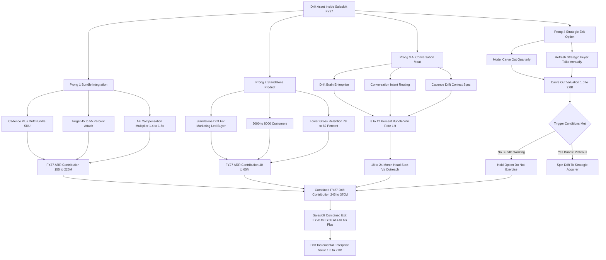

### Direct Answer

Salesloft should treat the 2021 Drift acquisition (closed by Vista Equity Partners at a reported $1.0-1.2B, then merged into Salesloft in 2024) as a **four-pronged value-extraction problem, not a write-down to apologize for.** The right 2027 move is to bundle Drift aggressively into the Salesloft Cadence/Rhythm sales-engagement core, keep a deliberately lean standalone Drift line for the conversational-marketing buyer, weaponize the Cadence-plus-Drift combination as the structural moat against Outreach, and keep -- but almost never exercise -- the option to spin Drift to a strategic acquirer. The honest verdict: stop trying to recover the purchase price in isolation and make the asset worth far more inside the combined company than it ever could be outside it, then let the combined Vista exit settle the math.

**TL;DR:** Run Drift as a line of business with four levers. **Prong 1 (bundle)** -- push Drift attach to 45-55% of the Cadence base at a $135-185 per-seat bundle, contributing $155-225M of FY27 ARR. **Prong 2 (standalone)** -- preserve a $40-65M ARR runway product at 78-82% gross retention for ~5,000-8,000 marketing-led buyers. **Prong 3 (AI moat)** -- spend $15-25M annually on Drift Brain Enterprise and Conversation Intent Routing to hold an 18-24-month head start over Outreach (NASDAQ-private, formerly valued near $4.4B). **Prong 4 (exit option)** -- model a $1.0-2.0B carve-out quarterly but keep it unexercised while the bundle works. Net Drift contribution in FY27: roughly $245-370M of effective ARR plus $1.0-2.0B of incremental enterprise value at a future Salesloft exit. The discipline: bundle is the engine, standalone is the runway, AI is the moat, spin is the option you keep but probably never use.

## 1. What This Question Actually Is

### 1.1 The question is M&A portfolio management, not deal regret

This is a B2B-SaaS M&A and revenue-operations strategy question, not a "should we have done the deal" retrospective. **Drift was acquired by Vista Equity Partners in early 2021** at a reported valuation in the $1.0-1.2B range, and in early 2024 Vista merged Drift into Salesloft -- also a Vista portfolio company since the 2022 take-private -- to create a combined sales-engagement-plus-conversational-marketing platform. By 2027 the question for Salesloft's management team and Vista's deal team is no longer whether the price was right. The price is sunk cost. The live question is whether the combined entity is **extracting the maximum cash, ARR, and exit value out of the Drift asset given the post-merger reality.**

### 1.2 The correct framing is line-of-business discipline

The right framing is portfolio-management discipline. **Drift is a line of business inside Salesloft** with its own ARR, its own retention curve, its own product roadmap, its own competitive position, and its own optionality to be spun back out. The job is to allocate engineering, sales, marketing, and pricing levers across those four dimensions to maximize total Salesloft enterprise value at the next Vista exit -- not to defend the original deal price. Founders and operators who confuse the two questions paralyze themselves; the operators who succeed run the asset forward and let the math, not the history, drive the decisions.

### 1.3 Why this matters to a real operator

A sales-engagement CEO or a Vista deal partner should be able to act on this next quarter. The four-pronged extraction play below is written in operator detail -- with the numbers, the comparable transactions, the risk register, the pricing architecture, and the explicit recommendation. The stakes are real: Drift's contribution to a combined Salesloft exit is plausibly $1.0-2.0B of incremental enterprise value, which is the difference between Drift being remembered as a Vista win or a Vista lesson. The cross-cutting RevOps frame for this -- value extraction from a post-take-private asset -- connects directly to how Vista reshapes its holdings (q1847) and to whether the combined Salesloft is itself worth buying in 2027 (q1846).

## 2. The Pre-2027 History And The 2027 Snapshot

### 2.1 Drift's history in one honest paragraph

Drift was founded in 2014 by David Cancel and Elias Torres as a B2B conversational-marketing platform built around a chat widget that turned anonymous website traffic into qualified pipeline. It raised approximately $107M across Series A through C from Sequoia, General Catalyst, CRV, and HubSpot Ventures (HubSpot trades as NASDAQ: HUBS), peaked at a private valuation widely reported near $1.0B during the 2020-2021 zero-rate SaaS boom, and was acquired by Vista in early 2021 at roughly $1.0-1.2B. Vista held Drift standalone through 2021-2023, layered in the standard Vista playbook -- enterprise GTM build, pricing-power moves, R&D consolidation, finance-and-ops professionalization -- and in 2024 merged Drift into Salesloft to create a combined sequencing-plus-conversation platform meant to compete head-on with Outreach.

### 2.2 The merger resets the entire question

The 2024 merger is the event that resets everything. Post-merger, Drift is **no longer a standalone competitor to Intercom, Qualified, and HubSpot Breeze** -- it is a feature, a product line, and a moat candidate inside a larger sales-engagement platform. The strategic question of 2027 is what to do with that asset now that the merger is done. Whether the merged conversation layer actually beats the standalone-Drift competitors is itself a live question covered at q1859.

### 2.3 The 2027 Salesloft/Drift reference picture

Vista holds Salesloft privately and discloses sparingly, so some numbers are necessarily estimates. The reasonable 2027 reference picture:

| Reference metric | FY27 estimate | Notes |
|---|---|---|
| Salesloft total ARR | $650-780M | Vista privately held; analyst triangulation |
| Cadence/Rhythm sequencing core ARR | $430-560M | The legacy Salesloft engine |
| Drift-attributable ARR (bundle + standalone) | $195-290M | The asset in question |
| Conversation intelligence + orchestration ARR | $60-100M | Adjacent product lines |
| Paying account count | 8,000-11,000 | Depends on SMB add-on counting |
| Total R&D budget | $80-120M annual | Drift AI features are $15-25M of this |

### 2.4 The competitive landscape in one frame

The competitive landscape is dominated by **Outreach** (closer to $400-500M ARR, the direct sequencing competitor), **HubSpot Sales Hub** (NASDAQ: HUBS, a much larger platform with a different price point and buyer), **Apollo** (the data-plus-engagement consolidator that ate the SMB segment with a $39-149/seat price war), **Salesforce Sales Engagement** (NYSE: CRM, the CRM-native bundled sequencer), and the AI-SDR cohort that has reframed the category around autonomous AI workers. Drift's standalone competitive set is Intercom, Qualified, and HubSpot Breeze. The strategic reality: the combined Salesloft-plus-Drift entity is the only viable platform that owns both sequencing and conversational marketing in the same suite -- and that combination is what the four-pronged extraction play is built on.

## 3. Prong 1 -- Bundle Integration: The ARR Engine

### 3.1 The cleanest math in the strategy

The first and largest prong is **driving Drift attach into the Salesloft Cadence install base** through bundle pricing, single-pane-of-glass UX, and a renewals motion. The math is the cleanest piece of the entire strategy. **Cadence list pricing** in 2027 sits around $115-145 per seat per month for the most common enterprise SKU; **standalone Drift list pricing** sits around $60-95 per seat per month; the **combined bundle SKU** should be priced at $135-185 per seat per month -- roughly a 15-25% discount versus the sum of the two, enough to be economically obvious to the buyer and not so deep it destroys per-seat margin.

### 3.2 The attach-rate engine

**Drift attach in the Cadence base sits at an estimated 32-38% in FY26.** The FY27 target -- driven by Vista cross-sell muscle, integrated UX, expansion-renewal incentives for AEs, and a focused product-led-growth motion inside Cadence -- is **45-55%.** At a midpoint 50% attach on roughly 5,500 enterprise Cadence customers averaging 60-110 seats, a $35-50 per-seat-per-month bundle uplift over Cadence-only generates an incremental **$155-225M of ARR contribution** from Drift attach alone.

| Bundle driver | FY26 baseline | FY27 target | Lever |
|---|---|---|---|
| Drift attach rate in Cadence base | 32-38% | 45-55% | Vista cross-sell, integrated UX, AE comp |
| Bundle uplift over Cadence-only | $30-45/seat/mo | $35-50/seat/mo | Pricing refresh, packaging |
| Bundle gross retention | 90-94% | 92-95% | Workflow switching cost |
| Bundle net revenue retention | 110-118% | 115-125% | Measured pipeline lift drives expansion |
| Drift-attributable bundle ARR | $115-160M | $155-225M | Prong 1 total |

### 3.3 Why bundle retention beats either product alone

Net retention on the bundle is meaningfully better than on either product alone -- roughly **115-125% NRR** for the bundle versus 102-108% for Cadence-only and 95-105% for Drift-only. The integrated workflow creates real switching cost, and every conversation routed into a sequence shows up as measured pipeline lift in the customer's own reporting. That measurability is the retention engine. The way Salesloft makes money overall, and how the bundle reshapes that revenue mix, is the subject of q1852.

### 3.4 The execution levers and the pricing discipline

The execution levers: **AE compensation that pays a multiple on bundle versus single-product close**, a customer-success motion that targets the 35-50% non-attached install base for renewal-cycle conversion, and a packaging refresh that makes Drift impossible to ignore in any new Cadence quote. The risk is symmetric: under-priced bundle uplift gives away the value, and over-priced uplift suppresses attach. The discipline is to **price the bundle uplift at 60-75% of Drift-standalone ARPU** -- enough to be a clear deal versus standalone, enough to reflect Drift's real value, and high enough that bundle attach moves real ARR.

### 3.5 Per-customer bundle economics, worked

The aggregate ARR number only convinces an operator if it decomposes cleanly to the account level. The per-seat economics by segment:

| Bundle scenario | Cadence-only ARPU | Drift-only ARPU | Bundle ARPU | Uplift vs Cadence-only | Sum of parts | Bundle discount |
|---|---|---|---|---|---|---|
| 60-seat enterprise (mid-tier) | $125/seat/mo | $75/seat/mo | $160/seat/mo | $35/seat/mo | $200/seat/mo | 20% |
| 120-seat enterprise (advanced) | $135/seat/mo | $85/seat/mo | $175/seat/mo | $40/seat/mo | $220/seat/mo | 20% |
| 250-seat enterprise (enterprise) | $145/seat/mo | $95/seat/mo | $185/seat/mo | $40/seat/mo | $240/seat/mo | 23% |
| 500-seat enterprise (volume) | $130/seat/mo | $80/seat/mo | $165/seat/mo | $35/seat/mo | $210/seat/mo | 21% |
| 30-seat mid-market | $115/seat/mo | $65/seat/mo | $145/seat/mo | $30/seat/mo | $180/seat/mo | 19% |

The pattern the table makes visible: the bundle discount stays in a tight 19-23% band across segments, and the dollar uplift is $30-40 per seat per month. A 120-seat advanced-tier account on the bundle generates roughly $252K of annual contract value versus roughly $194K Cadence-only -- a $58K annual uplift per account. Multiply that across the roughly 2,750 net-new bundle attaches implied by moving from 35% to 50% attach on a 5,500-account base, and the arithmetic lands squarely inside the $155-225M Prong 1 range. The discipline the table enforces: **never let an AE discount the bundle below the 19% floor**, because below that the buyer stops seeing a deal and the standalone-Drift ARP gets trained down across the whole market.

### 3.6 Why the renewals motion is the highest-leverage channel

There are two ways to grow bundle attach: win it on net-new logos, or convert the existing Cadence-only base at renewal. The second is structurally higher-leverage. A net-new logo requires winning the platform decision from scratch against Outreach, HubSpot, and Apollo; a Cadence-only renewal customer has already chosen Salesloft and merely has to be shown the conversation layer. **The conversion math: roughly 35-50% of the Cadence base is non-attached, the renewal cycle touches every one of those accounts once a year, and a focused customer-success motion can convert an estimated 20-30% of the addressable non-attached base per renewal cycle.** That is why customer success -- not just the AE org -- has to carry a bundle-conversion number. The renewals channel is also where the workflow proof lands hardest: a customer renewing Cadence already has a year of sequence data, and the bundle pitch can be made concrete with that customer's own pipeline numbers rather than a generic case study.

## 4. Prong 2 -- Standalone Product: Runway, Not Hero

### 4.1 The honest standalone math

The second prong is **preserving a live, well-supported standalone Drift product** for the conversational-marketing buyer who does not need a sequencer. This is a smaller, lower-margin line than the bundle -- and that is fine. The honest math: roughly **5,000-8,000 standalone Drift customers** at an average $55-95 per-seat-per-month ARPU on smaller seat counts, contributing approximately **$40-65M of ARR** with materially lower retention -- 78-82% gross versus 92-95% on the bundle.

### 4.2 Why standalone retention is structurally lower

The standalone customer is a marketing-team buyer with no sequencing dependency, faces real competition from Intercom, Qualified, HubSpot Breeze, and the AI-chat-native cohort, and has fewer integrated-workflow switching costs. Lower retention is not a failure of the product; it is the structural property of the segment. The discipline is to accept 78-82% gross retention without panicking and without over-spending to defend it.

### 4.3 The three reasons to keep standalone alive

| Reason | What it preserves | Why it matters |
|---|---|---|
| Real cash | $40-65M of FY27 ARR | Walking away to "force the bundle" destroys value |
| Brand and category presence | Drift as a recognized conversational-marketing name | Future Cadence buyers may convert to the bundle |
| Strategic-exit optionality | A live, maintained, saleable asset | Prong 4 carve-out requires a non-starved product |

### 4.4 The execution and the discipline

The execution: a deliberately modest R&D allocation to standalone-only features (form fills, marketing-team workflows, basic analytics), shared core infrastructure with the bundled product so engineering does not double-spend, a renewals motion that quietly tries to upgrade standalone customers into the Cadence-plus-Drift bundle whenever they show sequencing interest, and a willingness to let standalone gross retention sit in the 78-82% range. The discipline: **standalone Drift is a runway product, not a growth hero. Do not over-invest, do not under-invest, and do not let it cannibalize the bundle motion.** How the standalone conversation product holds up against Drift's old competitors is examined directly at q1859.

### 4.5 The standalone-to-bundle conversion funnel

The single most under-appreciated value of the standalone product is that it is a **lead source for the bundle.** A standalone Drift customer that grows an SDR team, starts running outbound, or hires a RevOps leader becomes a natural Cadence-plus-Drift bundle candidate -- and that customer is far cheaper to convert than a cold logo because the relationship, the billing arrangement, and the product trust already exist. The motion: instrument the standalone base for sequencing-intent signals (a customer asking about email integrations, a customer adding outbound-SDR seats, a customer connecting a CRM in a sales-led configuration), route those accounts to a bundle-conversion play, and treat every standalone-to-bundle conversion as a high-margin expansion rather than a new sale. An estimated **8-14% of the standalone base per year** shows enough sequencing intent to be a credible bundle-conversion target. That conversion stream is small in absolute ARR but disproportionately profitable, and it is the operational reason "do not starve standalone" is a real rule rather than sentimentality.

### 4.6 When to actually sunset standalone

There is one honest scenario in which the standalone product should be wound down rather than maintained: if standalone gross retention falls below roughly 70% and the cost of maintaining standalone-only features exceeds the standalone ARR plus the imputed value of the conversion funnel and the carve-out optionality. That is a real threshold, not a rhetorical one. Below 70% retention the standalone segment is churning faster than the conversion funnel can refill it, the brand value is eroding rather than compounding, and the carve-out optionality is worth little because a buyer will not pay for a shrinking base. The discipline: **track standalone gross retention as a leading indicator every quarter, and pre-commit to the 70% sunset trigger** so the decision is made by the metric rather than by the sunk-cost instinct of the people who built the product.

## 5. Prong 3 -- AI Conversation Moat: The Defensive Investment

### 5.1 The investment thesis

The third prong is the most strategically important and the most often under-funded: **using Drift to build a defensible AI-conversation moat that Outreach and the AI-SDR cohort cannot quickly replicate.** The investment thesis: in 2027 every B2B sales motion is bifurcating into **automated AI engagement** (the AI SDR, the chatbot, conversational AI) and **human-led sequencing and follow-up.** The platform that owns both -- and that fuses the AI conversation context into the human sequence and back -- has a structural advantage over platforms that own only one half. Salesloft-plus-Drift owns both. Outreach owns only the human-sequence half. Apollo and the AI-SDR pure-plays own only the AI-engagement half.

### 5.2 What gets built

| Build item | Description | Ship target |
|---|---|---|
| Drift Brain Enterprise | Enterprise-tier AI agent: governance, custom workflows, knowledge-base grounding, compliance | FY26 H2 ship, FY27 Q1 GA |
| Conversation Intent Routing | Real-time AI classification of conversation intent, routed into the right Cadence sequence/owner/playbook | FY26 H2 ship, FY27 Q1 GA |
| Cadence-Drift Context Sync | Every Drift conversation surfaces in the Cadence record and informs the next sequence step | Continuous FY26-FY27 |
| Unified Analytics | Single analytics view spanning Drift conversations and Cadence sequences | FY27 Q3 GA |

### 5.3 The R&D investment and the expected return

The R&D investment: approximately **$15-25M annually** dedicated to Drift AI features within a total Salesloft R&D budget estimated at $80-120M. The expected return: an estimated **8-12% win-rate lift** on bundle deals versus Cadence-only, measured through controlled customer cohorts; a defensible **18-24-month head start** over Outreach if Outreach tries to build a conversation-engagement equivalent natively or acquires a comparable asset; and a meaningful contribution to the bundle-attach narrative that drives Prong 1. How Salesloft as a whole competes against AI-native sequencing tools -- the broader version of this same moat question -- is covered at q1850.

### 5.4 The execution risk and the discipline

The execution risk: under-investment that lets Outreach close the gap, or over-investment that builds AI features no customer actually uses. The discipline: **invest enough to keep the moat real, ship the AI features the bundle motion actually monetizes, and resist the temptation to chase every AI fad that emerges in the category.** This is also where the AI moat connects to the gross-margin question -- foundation-model inference cost can quietly compress Drift's margin if it is not managed, a trajectory tracked at q1864.

### 5.5 Why the moat is workflow integration, not raw AI

The most common strategic error in the AI-conversation category is to believe the moat is the AI model. It is not. Foundation models commoditize fast: a conversational-AI capability that is genuinely differentiated in 2026 is table stakes in 2028, because every competitor can call the same underlying model providers. **The durable moat is not the AI; it is the workflow integration between Drift's conversation layer and Cadence's sequencing layer, plus the proprietary data exhaust the integrated platform generates.** Every Drift conversation that flows into a Cadence sequence and every Cadence-driven visit that triggers a Drift conversation produces a labeled training signal -- intent, outcome, sequence response -- that a single-product competitor cannot generate. Over two or three years that data exhaust compounds into a routing model and an intent classifier that are genuinely better than what a sequencing-only or conversation-only vendor can build. The strategic instruction for the product org: **build the integration depth and the data flywheel, not the AI demo.** The AI demo wins the bake-off; the integration depth wins the renewal.

### 5.6 The win-rate-lift measurement that makes the moat provable

A moat that cannot be measured cannot be sold. The 8-12% bundle win-rate lift over Cadence-only has to be proven through controlled customer cohorts, not asserted in a slide. The measurement design: identify matched cohorts of bundle and Cadence-only customers in the same industry, of similar size, with similar deal mix; track win rate, pipeline velocity, and average deal size across both cohorts for two to four quarters; publish the differential as a customer-attributable case study with the customer's own numbers. The credible expected results -- **an 8-12% win-rate lift, a 10-18% pipeline-velocity lift, and an 8-15% annual seat-expansion rate on the bundle** -- become the proof points the AE org leads with. Without that measurement discipline the bundle pitch is a feature list; with it, the bundle pitch is an ROI argument, and ROI arguments survive procurement.

## 6. Prong 4 -- Strategic Exit Option: Keep It, Probably Never Use It

### 6.1 The carve-out math

The fourth prong is the option to **carve Drift back out as a standalone or sell it to a strategic acquirer** at a future date if the bundle attach plateaus or if Vista's exit math demands it. This is the prong analysts over-focus on and operators correctly de-prioritize. The math: a hypothetical Drift carve-out at FY28, on a then-attributable Drift ARR of approximately $100-150M at a 10-15x ARR multiple, values the asset at approximately **$1.0-2.0B.**

### 6.2 The strategic-acquirer candidate set

| Candidate | Fit | Probability |
|---|---|---|
| HubSpot (NASDAQ: HUBS) | Most natural -- owns the marketing-cloud category, has Breeze but might want Drift's brand and base | Medium-high |
| Adobe (NASDAQ: ADBE) | Marketo / Marketing Cloud expansion; history of demand-gen acquisitions | Medium |
| ServiceNow (NYSE: NOW) | Conversational AI on the workflow-automation side | Low-medium |
| Workday (NASDAQ: WDAY) | Conceivable if Workday accelerates a CRM-and-engagement push | Low |
| Oracle (NYSE: ORCL) | CX cloud expansion; lower-probability | Low |
| PE roll-up buyer | Consolidating conversation-marketing assets | Medium |

### 6.3 The trigger conditions and why you keep the option unused

**Trigger conditions for exercising:** bundle attach plateaus at 38-42% by mid-FY27 and Vista loses cross-sell faith; the Vista exit timeline compresses and a clean Drift sale generates more proceeds than a combined Salesloft sale; or a strategic acquirer offers a premium price specifically for the Drift asset. **Reasons to keep but not exercise:** spinning Drift destroys the Cadence-plus-Drift bundle moat that is the entire competitive thesis against Outreach; the operating cost of carving out a once-merged business is real; and the proceeds from a Drift sale are likely smaller than the incremental enterprise value the bundle adds to Salesloft at a combined exit.

### 6.4 The recommended posture

The recommended posture: **model the spin every quarter, refresh the strategic-acquirer conversations annually, and almost certainly never pull the trigger** -- because the asset is worth more inside Salesloft than outside it for as long as the bundle motion is working. The mirror-image version of this question -- a strategic buyer evaluating whether to acquire Drift -- is examined from the acquirer's side at q1868.

## 7. The Drift Acquisition Value Math, Honestly

### 7.1 Sunk cost versus forward value

A founder or analyst should be able to do the value math end-to-end. **Original Vista acquisition cost (2021): approximately $1.0-1.2B** -- that is sunk cost and does not affect any forward decision. **Drift's standalone valuation in 2024 at the time of the merger: approximately $600-900M** if it had been sold separately into a depressed mid-2024 SaaS-multiple environment (5-8x ARR on a standalone Drift ARR of around $90-130M).

### 7.2 The forward contribution

| Value component | FY27 estimate | Source prong |
|---|---|---|
| Bundle attach ARR | $155-225M | Prong 1 |
| Standalone ARR | $40-65M | Prong 2 |
| AI-driven win-rate lift attributable to Drift | $50-80M of incremental Cadence retention/expansion | Prong 3 |
| Total effective FY27 Drift ARR contribution | $245-370M | Combined |
| Drift incremental enterprise value at combined exit | $1.0-2.0B | All prongs |

### 7.3 The operator answer to "recover the price"

The honest read: Vista almost certainly will not recover the original $1.0-1.2B Drift purchase price as a standalone Drift exit. Vista will -- if the four-pronged play is executed -- recover that cost and substantially more **as part of a combined Salesloft exit valued at $4-6B+** in a strategic or PE transaction, with Drift's contribution to that combined valuation in the $1.0-2.0B incremental range. The operator answer to "what should Salesloft do about the Drift acquisition value" is therefore: **the answer is not to recover the purchase price; the answer is to make the asset worth more inside the combined company than it ever could be outside it, and let the combined exit settle the math.**

### 7.4 The sensitivity table -- how the answer changes with attach

The four-pronged play is not a point estimate; it is a function of one dominant variable, the FY27 bundle attach rate. A serious operator should see how the conclusion bends across the plausible range:

| FY27 attach scenario | Bundle attach | Drift bundle ARR | Total Drift effective ARR | Recommended posture |
|---|---|---|---|---|
| Bear case | 35-40% | $115-150M | $190-260M | Re-open Prong 4 carve-out seriously; restructure pricing |
| Base case | 45-55% | $155-225M | $245-370M | Run the four-pronged play as designed |
| Bull case | 55-62% | $225-285M | $340-450M | Lean harder into Prong 1; defer the carve-out indefinitely |

The table makes the strategic posture explicit and conditional rather than absolute. **In the bear case the carve-out option (Prong 4) stops being a hypothetical and becomes a live alternative**, because if the bundle is not compounding, the asset may genuinely be worth more sold cleanly than held. In the bull case the standalone product matters less and the carve-out option is worth almost nothing because no operator would sell an asset that is compounding inside the platform. The base case is the recommendation. The instruction to Vista's deal team: **re-run this sensitivity table every quarter against the actual attach trajectory, and let the table -- not last quarter's narrative -- set the posture.**

### 7.5 What this means for the founder asking the question

A founder or operator reading this for their own company -- not Salesloft specifically -- should take three transferable lessons. **First**, a peak-multiple acquisition is not recovered by waiting for multiples to return; it is recovered by operational extraction or it is not recovered at all. **Second**, the value of an acquired asset inside a larger company is almost never its standalone value -- it is the standalone value plus the cross-sell contribution plus the strategic-moat contribution minus the integration cost, and the cross-sell and moat terms are usually larger than the standalone term. **Third**, optionality has value even when unexercised: keeping a credible carve-out path open disciplines the operating plan and gives the board a real alternative, which is worth maintaining even if the option is almost never used. Those three lessons generalize well beyond Drift, and they are the reason this question is a RevOps strategy question rather than a Salesloft trivia question.

## 8. The Workflow Story And The Pricing Architecture

### 8.1 The workflow that justifies the bundle

If the workflow is not real, the bundle attach numbers are fiction. The workflow that justifies the Cadence-plus-Drift combination: a prospect lands on the customer's website (often driven by a Cadence-sent email or a marketing campaign), Drift's AI chat engages the prospect in real time, classifies intent, qualifies the conversation, and either routes the prospect to a live SDR for a synchronous handoff or captures the conversation context and feeds it back into the prospect's Cadence record. The Cadence sequence then adapts -- the next email references the Drift conversation, the next call's playbook reflects the prospect's stated intent, the meeting-booking flow uses the qualifying answers Drift collected.

### 8.2 The closed loop is the moat

The result, when it works, is a **closed loop**: human sequencing produces inbound traffic, AI conversation captures and qualifies that traffic, human sequencing follows up with full conversational context. **Outreach does not own the AI-conversation half of that loop.** Apollo does not own the human-sequencing half. Only Salesloft-plus-Drift owns both, and only the integrated workflow makes the bundle worth more than the sum of the parts.

### 8.3 The 2027 pricing architecture

| SKU | 2027 list price | Positioning |
|---|---|---|
| Cadence-only Advanced | $115-145/seat/mo | Enterprise sequencing core |
| Drift-only Premium/Enterprise | $60-95/seat/mo | Standalone conversational marketing |
| Cadence + Drift Bundle | $135-185/seat/mo | The strategic centerpiece; 15-25% off the sum |
| Enterprise All-In (Cadence+Drift+CI+Rhythm) | $220-285/seat/mo | Largest enterprise full-platform buyers |

### 8.4 The pricing discipline

The pricing-strategy discipline: the bundle uplift over Cadence-only must be **rich enough to materially monetize Drift** (at least $35 per seat per month, ideally closer to $50) and **discounted enough versus the sum** to make bundle attach the obviously-better deal (15-25% off). Pricing the uplift below $35 gives away the Drift value; pricing the bundle discount above 30% off the sum cannibalizes Drift-standalone ARR and trains the market that conversation is a giveaway. The other lever: **AE compensation that pays a 1.4-1.6x multiplier on bundle versus single-product close.** The defensive version of pricing -- how Salesloft holds the line on bundle pricing against HubSpot's much larger platform bundle -- is the subject of q1855.

### 8.5 The discount architecture and the contract-term lever

Beyond the headline SKU prices, the discount architecture is where margin is protected or surrendered. The recommended 2027 architecture: a **standard annual-prepay discount of 5-10%**, a **two-year prepay discount of 10-15%**, and a **three-year prepay discount of 15-20%**, with **volume seat-tier breaks at 50, 100, 250, and 500 seats.** The strategic point of the multi-year discount is not the cash-flow benefit; it is the **moat duration.** A customer on a three-year bundle contract is a customer Outreach cannot displace for three years even if Outreach closes the conversation gap in twelve months. In a category where the central risk (Counter 12.2) is a competitor catching up, contract term is a defensive weapon, and the AE org should be explicitly incentivized to push three-year bundle terms on every account where the customer's own planning horizon allows it. The discipline: **use multi-year discounting to buy moat duration, not just to pull cash forward.**

### 8.6 How customers actually talk about the bundle

The bundle thesis must survive contact with real customer language. Six archetypes show up in 2026-2027 account-team feedback. **The bundle adopter** ("we already had Cadence, and adding Drift gave us a measurable inbound conversion lift") values the workflow integration and single-vendor procurement; they renew on the bundle and expand seats. **The Cadence-only resister** ("we already have Intercom and we are not switching") needs a longer-arc displacement motion timed to the Intercom renewal. **The standalone customer** ("we are a marketing team, no SDR org, we just need chat") is the runway segment, served deliberately. **The displacement target** ("we have Outreach and a separate chatbot, but the data does not flow") is the highest-value opportunity and the integrated workflow is the entire pitch. **The price-sensitive churn risk** ("Apollo is half the cost and good enough") is the SMB segment Salesloft should not try to cost-compete with. **The AI skeptic** ("we tried AI chat and it was bad") needs the Drift Brain Enterprise governance story and real case studies. The discipline: **the GTM team must be fluent in all six archetypes**, with positioning, pricing, and proof points tailored to each, because the bundle thesis only converts when the customer's language matches the value story.

## 9. Customer Segmentation And The Competitive Landscape

### 9.1 Who buys what

The four prongs only work if the segmentation is clear.

| Segment | Profile | Motion | Estimated size |
|---|---|---|---|
| Bundle buyer (strategic priority) | Mid-market/enterprise B2B, 30-300+ SDRs/AEs, established sequencing workflows | Bundle attach at 45-55% target | 5,500-7,500 accounts |
| Standalone Drift buyer (runway) | Marketing-led B2B, no heavy SDR org | Lean standalone product, quiet upgrade attempts | 5,000-8,000 accounts |
| Cadence-only resister (gap) | Has Cadence, resists Drift due to existing chat tooling | Renewal-cycle displacement | Subset of Cadence base |
| Enterprise all-in buyer (highest value) | Largest customers wanting the full platform | $220-285 ARPU full-suite contract | Top tier of the base |
| Competitive-displacement target | On Outreach + a separate chatbot | Offensive bundle displacement | Outreach install base |

### 9.2 The competitive landscape up close

**Outreach (the direct sequencing competitor):** roughly $400-500M ARR, owns the high end of sales engagement alongside Salesloft, has invested heavily in AI sequencing, but **has no native Drift-equivalent conversational-marketing layer.** Its two paths: build conversation natively (18-24 months to parity at best) or acquire one (Qualified is a plausible target at perhaps $500-800M). **HubSpot Sales Hub and Breeze (NASDAQ: HUBS):** a much larger platform with a cheaper entry seat and a marketing-led mid-market buyer; Breeze erodes the standalone-Drift segment from below. **Apollo:** the data-plus-engagement consolidator that won SMB and growth-stage with a $39-149/seat price war. **AI-SDR pure-plays (11x, Regie.ai, AiSDR, Clay-with-actions):** reframing the category around autonomous AI workers.

### 9.3 The competitive read

The strategic read: **the competitive landscape favors the bundle play.** No single competitor owns both halves of the human-sequence-plus-AI-conversation loop. Outreach owns only sequencing; Intercom and Qualified own only conversation; Apollo competes on price. The head-to-head buyer comparison of Salesloft against Outreach -- the most common procurement question in this category -- is covered directly at q1854.

### 9.4 Competitor conversation coverage

| Vendor | Sequencing | Conversation marketing | AI agent | Strategic gap |
|---|---|---|---|---|
| Salesloft + Drift | Native (Cadence) | Native (Drift) | Drift Brain | None on the integrated workflow |
| Outreach | Native | None | Sequencing AI only | No conversation layer |
| HubSpot (HUBS) | Sales Hub | Breeze | Breeze AI | Smaller mid-market focus; SMB price point |
| Apollo | Native | Basic chat | Light AI | Thin enterprise; competes on price |
| Salesforce (CRM) | Sales Engagement | Limited | Einstein | Conversation depth weak |
| Intercom | None | Native | Fin AI | No sequencing |
| Qualified | None | Native | Piper AI | No sequencing; Salesforce-tied |

## 10. Comparable M&A Patterns And The Integration Roadmap

### 10.1 Pattern recognition from comparable transactions

| Transaction | Reported value | Lesson |
|---|---|---|
| Drift / Vista (2021) | ~$1.0-1.2B | Peak-multiple acquisitions earn back through operational extraction, not multiple recovery |
| Salesloft / Vista (2022) | ~$2.3B | Roll-up logic works only if the merged entity creates differentiated value |
| Outreach last-disclosed valuation (2021) | ~$4.4B | Anchors what a standalone sequencing platform was worth at the peak; now lower |
| Intercom last private valuation | ~$1.5-2.0B | Pure-play conversation pivoted AI-first; shows category durability and multiple compression |
| Salesforce / Slack (2021) | $27.7B | Buy the conversation layer, integrate it, monetize through bundle |
| ZoomInfo / Chorus (2021) | $575M | Data-plus-engagement consolidator buying conversation intelligence |

### 10.2 The pattern that matters

The pattern: **standalone conversational-marketing companies struggle to sustain peak SaaS multiples; bundled into broader sales-engagement platforms, the same assets contribute meaningful incremental ARR and platform stickiness.** That is exactly the thesis the four-pronged play monetizes. The broader sales-tech consolidation wave -- including questions like whether ZoomInfo should acquire Apollo -- is the comparable context covered at q1871.

### 10.3 The quarter-by-quarter roadmap

A vague strategy is a fantasy; an executable strategy has a quarterly roadmap.

| Quarter | Key actions |
|---|---|
| FY27 Q1 | Bundle pricing refresh live; AE comp multiplier launched; Conversation Intent Routing GA |
| FY27 Q2 | Bundle-attach renewals motion launched; Drift Brain Enterprise to top 200 accounts; three case studies published |
| FY27 Q3 | Unified analytics GA; Outreach displacement campaign launched; strategic-buyer conversations refreshed |
| FY27 Q4 | Measure attach vs 45-55% target; standalone product-line review; FY28 Drift R&D budget locked |
| FY28 H1 | Continue bundle motion; ship FY28 AI roadmap; evaluate Outreach competitive moves |
| FY28 H2 | Prepare for the Vista exit scenario (combined exit base case; carve-out optional case) |

### 10.4 The roadmap discipline

The roadmap discipline: **every quarter has a measurable target on bundle attach, AI-feature ship, and standalone-segment health.** Vista's portfolio-management discipline lives or dies by that measurability. The way Vista's playbook reshapes a portfolio company quarter by quarter -- the pattern this roadmap instantiates -- is the subject of q1847.

### 10.5 A short history of sales-engagement platform bundling

Bundling sales-engagement platforms is not a new idea, and the historical record sharpens the Drift extraction thesis. **Salesforce plus ExactTarget (2013, $2.5B)** bundled marketing automation into the Salesforce platform; the strategic logic worked, the integration took years, and the bundled SKU eventually became the Marketing Cloud line -- the lesson being that bundling pays off slowly, when the integration is real. **HubSpot's organic platform build (NASDAQ: HUBS, 2010s onward)** built sequencer, chatbot, data, and CRM modules into a single platform and used the integrated platform as the differentiator versus best-of-breed -- the lesson being that platform integration creates structural advantage, but only if the modules are actually integrated and not just co-sold. **Outreach's organic AI build (2022-2026)** invested heavily in AI sequencing but did not build a conversation-marketing layer, leaving exactly the gap that Salesloft-plus-Drift now monetizes -- the lesson being that not bundling, when the competitor does, creates a structural disadvantage. **ZoomInfo's data-plus-conversation-intelligence bundle** (NASDAQ: ZI, assembled through the Chorus and Insent acquisitions) integrated unevenly and the bundled value did not fully materialize -- the lesson being that acquisition-driven bundles pay off only when the integration is engineered, not just contractually completed. The historical record says the bundle thesis is sound, the execution is everything, and the integration has to be real -- which is exactly what the four prongs are designed to deliver.

### 10.6 Why the merged entity is the only one that owns the full loop

The decisive structural fact behind the entire strategy: in 2027, no single competitor owns both the human-sequencing half and the AI-conversation half of the revenue loop. **Outreach owns sequencing and has no native conversation layer.** Intercom and Qualified own conversation and have no sequencer. HubSpot owns both but at a different price point and for a marketing-led mid-market buyer. Apollo owns both thinly and competes on price rather than enterprise workflow. Salesforce (NYSE: CRM) owns both but as a CRM-bundled afterthought with weak conversation depth. Only Salesloft-plus-Drift owns both halves, at the enterprise tier, as the primary product rather than an add-on. That is not a marketing claim; it is a market-structure observation, and it is the reason the bundle is worth more than the sum of the parts. The strategic instruction: **defend that structural position above all else** -- because the day a competitor owns both halves, the four-pronged play loses its central premise.

## 11. Risk Register And Vista's Portfolio Logic

### 11.1 The ranked risk register

| # | Risk | Impact | Probability | Mitigation |
|---|---|---|---|---|
| 1 | Outreach acquires Intercom/Qualified or builds credible conversation | High | Medium | Ship Prong 3 fast; multi-year bundle contracts; displacement narrative ready |
| 2 | Bundle attach plateaus below 40% | High | Medium | Refresh pricing/packaging; raise AE multiplier; reassess Prong 4 |
| 3 | Vista forces a compressed exit timeline | High | Low | Prepare both combined-exit and carve-out narratives |
| 4 | HubSpot Breeze and Apollo erode standalone segment | Medium | High | Accept SMB compression; focus standalone on marketing-led mid-market |
| 5 | AI commoditization flattens conversation differentiation | Medium | Medium | Differentiate on workflow integration and enterprise governance |
| 6 | Major outage or security/compliance failure | Medium | Low | Enterprise-grade SRE, security, compliance investment |
| 7 | Cadence churn drags down the bundle base | Medium-low | Medium | Cadence retention as core ARR-protection priority |
| 8 | Drift R&D talent attrition during integration | Medium-low | Medium | Retention packages; integrated rather than walled-off org |

### 11.2 The risk discipline

The discipline: **review the risk register quarterly, attach mitigation owners and timelines, and resist the executive temptation to deny Risks 1 and 2** because they are the most strategically uncomfortable.

### 11.3 What Vista's portfolio logic says

Because Vista holds both Drift (2021) and Salesloft (2022) and merged them in 2024, the entire question is filtered through Vista's portfolio-management discipline. Vista's playbook is consistent: buy enterprise-software assets at rational multiples, professionalize finance and operations, push pricing and packaging discipline, drive cross-sell across the portfolio where products are complementary, sustain net-revenue retention above 110%, and exit at a higher multiple. **Drift inside Salesloft is exactly the cross-sell, packaging-discipline, pricing-power play Vista is built to run.** The four-pronged extraction play is, in effect, the Vista playbook applied to the Drift asset.

### 11.4 The exit horizon and the connected answer

The Vista exit horizon for Salesloft is likely **FY28-FY30** depending on market conditions, and the four-pronged play is calibrated to maximize Salesloft enterprise value at that exit. The operator answer to "what should Salesloft do about Drift" is inseparable from "what does Vista need from this asset at exit." Whether the combined Salesloft is itself worth buying at that exit -- the investor-side version of this entire analysis -- is covered at q1846.

## 12. Counter-Case: Why The Four-Pronged Play Could Be Wrong

The recommended strategy is the highest-expected-value path, but a serious operator must stress-test it against the conditions that would make it the wrong call.

### 12.1 Bundling may not work at the assumed scale

The 45-55% FY27 attach target is the entire economic engine of Prong 1, and it assumes Vista cross-sell muscle, the AE multiplier, integrated UX, and the workflow story all work together to roughly double the FY26 baseline. They might not. Bundle attach historically plateaus when the buyer has an entrenched alternative they will not displace, the integration story does not survive contact with real workflows, or the bundled product is genuinely worse than best-of-breed for the marginal buyer. **If FY27 attach lands at 35-40% rather than 45-55%, Prong 1's ARR contribution is materially smaller** and the combined-exit thesis is weaker.

### 12.2 Outreach may close the conversation gap faster than expected

The 18-24-month head start in Prong 3 assumes Outreach builds slowly or fails to acquire a credible asset. A serious Outreach acquisition of Qualified (plausible at $500-800M) or a smaller AI-chat-native vendor could close the gap in 6-12 months and erase the structural moat. **If Outreach closes the gap, Prong 3's defensive value collapses.**

### 12.3 HubSpot may consume the SMB segment faster than projected

HubSpot Breeze plus the broader HubSpot (NASDAQ: HUBS) platform integration is a structural threat to standalone Drift in the SMB and growth-stage segment. **If standalone Drift gross retention drops from 78-82% into the low 70s, Prong 2's runway role becomes a write-down** and the standalone product becomes a drag on the combined story.

### 12.4 Apollo's price war may compress the entire category

Apollo at $39-149 per seat per month has demonstrated that buyers will accept "good enough" sequencing at a fraction of bundle pricing. **If Apollo's enterprise push lands and forces Salesloft to discount the bundle below the $135-185 target, the per-seat economics that justify the four-pronged play degrade.**

### 12.5 AI-SDR pure-plays may reframe the category entirely

11x, Regie.ai, AiSDR, and the AI-SDR cohort are selling autonomous AI workers that replace human SDR teams rather than augment them. **If that category wins meaningful share, the entire human-sequencing-plus-AI-conversation-loop thesis becomes architecturally obsolete** -- the buyer is operating autonomous AI agents, not running sequences and conversations. This is the deepest counter-case and the one most worth ongoing monitoring.

### 12.6 Vista may compress the exit timeline

The four-pronged play is calibrated to a FY28-FY30 exit. **If Vista exits in FY27 or early FY28 for fund-life or market-window reasons, the bundle attach motion will not have time to play out** and the combined entity exits at a lower valuation. In that scenario the Prong 4 carve-out becomes more attractive.

### 12.7 The integration may be operationally harder than assumed

Post-merger integration of two engineering organizations, two product cultures, two GTM motions, and two customer bases is genuinely hard. **If the integration is slower, messier, or more politically fraught than projected, the bundle workflow is half-built** and the win-rate-lift case studies do not materialize.

### 12.8 The original acquisition may be mis-priced beyond recovery

Vista paid $1.0-1.2B at peak multiples; standalone Drift at 2024 multiples was probably worth $600-900M. **A founder who insists on a clean recovery of the original price will be disappointed.** The honest answer is that the recovery happens through the combined exit, not through Drift in isolation.

### 12.9 The "spin almost never" recommendation may be too conservative

A more aggressive view holds that exercising Prong 4 -- spinning Drift to a strategic acquirer at a clean $1.0-2.0B in FY28 -- could realize that value definitively rather than depending on the combined-exit math working out. **The combined exit is a probability distribution; the carve-out sale is a definite cash event.** A risk-managed Vista deal team may rationally prefer the certainty -- which is exactly the calculus a prospective Drift acquirer runs at q1868.

### 12.10 The honest verdict

The four-pronged Drift extraction play is the highest-expected-value path forward given the post-merger reality, the competitive landscape, and Vista's exit math. It is not the only credible path. It assumes bundle attach scales, the AI moat holds, the integration is real, the standalone segment does not collapse, and Vista's exit timeline allows the thesis to play out. Each assumption has a credible failure mode. The recommended posture: **commit to the four-pronged play as the FY27-FY28 base case, run quarterly stress tests against the counter-cases above, refresh the carve-out and acquire-a-competitor alternatives at least annually, and be willing to pivot if 12.1, 12.2, or 12.5 materialize at scale.** Strategy is a probability distribution, not a press release.

## 13. Execution: First 90 Days And What Success Looks Like

### 13.1 The first-90-days sequencing

| Window | Actions |
|---|---|
| Days 1-30 | Lock bundle pricing/packaging; communicate AE comp multiplier in writing; ship Conversation Intent Routing GA; portfolio-wide Drift-attach review by account |
| Days 31-60 | Launch bundle-attach renewals motion against the 35-50% non-attached base; ship Drift Brain Enterprise to top 200 accounts; publish three win-rate case studies |
| Days 61-90 | Launch Outreach + separate-chatbot displacement campaign; refresh strategic-buyer conversations; complete standalone product-line review; lock FY27 Drift R&D budget |

### 13.2 What the CEO tells the sales org

A strategy that does not produce a clear next action for the field is theatre. The CEO message: **the bundle is the deal.** Every Cadence quote includes Drift unless the customer explicitly opts out. Every renewals conversation includes a bundle-conversion offer. The comp plan pays a 1.4-1.6x multiplier on bundle close, weighted toward new-bundle-attach. The playbook leads with the workflow story, not the feature list. AEs displacing Outreach plus a separate chatbot get a special displacement bonus. Customer success owns the 35-50% non-attached base and is measured on bundle conversion at renewal. The whole field message reduces to one sentence: **sell the Cadence-plus-Drift bundle as the platform, sell standalone Drift as the runway, and never let an Outreach-plus-separate-chatbot account renew without a credible bundle displacement attempt.**

### 13.3 What success looks like at the end of FY27

| Dimension | Success marker |
|---|---|
| Numbers | Bundle attach 45-55%; Drift-attributable ARR $195-290M; bundle gross retention above 92%; bundle NRR above 115% |
| Competitive position | Outreach has not closed the conversation gap; bundle documented as the moat in customer cases |
| Strategic option | Carve-out modeled, strategic-buyer conversations warm, option real but unexercised |
| Vista narrative | Drift treated as a differentiated capability that justifies a $4-6B+ combined exit, not a $1.0-1.2B sunk cost |
| Customer signal | A meaningful share of large enterprises on the Enterprise All-In SKU; bundle is the standard new-logo sale |

### 13.4 The end-state discipline

If those markers hit, the four-pronged strategy worked. If they do not, the playbook is to revisit Prong 4 (the carve-out) seriously, restructure the bundle pricing, and reassess the AI-feature roadmap. The honest end-state: **the four prongs, executed with quarterly discipline, are the highest-expected-value path forward -- and the discipline of running them every quarter, not the elegance of the original deal, is what determines whether the Drift acquisition is remembered as a Vista win or a Vista lesson.**

### 13.5 The single dashboard the executive team should run

A four-pronged strategy fails when no one is accountable for the whole picture, so the executive team needs one dashboard, reviewed monthly, that holds every prong on a single page. The recommended dashboard rows:

| Metric | Prong | Green threshold | Red threshold |
|---|---|---|---|
| Bundle attach rate (Cadence base) | 1 | Above 45% and rising | Below 40% or flat two quarters |
| Bundle net revenue retention | 1 | Above 115% | Below 110% |
| Standalone gross retention | 2 | Above 78% | Below 72% |
| Standalone-to-bundle conversion rate | 2 | Above 8% annual | Below 5% annual |
| Drift AI feature ship vs roadmap | 3 | On or ahead of schedule | Two quarters behind |
| Bundle win-rate lift vs Cadence-only | 3 | Above 8% in cohort data | Below 5% or unmeasured |
| Outreach conversation-gap status | 3 | Gap intact, no credible Outreach move | Outreach acquires or ships parity |
| Modeled carve-out valuation | 4 | Refreshed quarterly | Stale more than two quarters |

The dashboard discipline: **every row has a named owner, a green threshold, and a red threshold, and a red on any row triggers a documented mitigation within thirty days.** That is the operating cadence that converts a four-pronged strategy from a slide into a quarterly result. It is also the artifact Vista's deal team should ask for in every portfolio review, because it makes the Drift value question answerable with data rather than narrative.

### 13.6 The one-sentence answer to take to the board

Stripped to its essence, the answer a Salesloft CEO or a Vista partner should be able to give the board in one sentence: **stop treating Drift as a $1.0-1.2B sunk cost to be apologized for, run it as a four-pronged line of business -- bundle as the ARR engine, standalone as the runway, AI as the moat against Outreach, carve-out as the option you keep but almost never use -- and let a combined Salesloft exit, not a standalone Drift sale, settle the value math.** Everything else in this entry is the operating detail behind that sentence.

## 14. The Four-Pronged Drift Value Extraction Stack

## 15. Sources

1. **Salesloft Corporate Site** -- Product, customer, and platform documentation. https://www.salesloft.com
2. **Salesloft About Page** -- Company overview, leadership, and post-merger positioning. https://www.salesloft.com/about
3. **Drift Corporate Site** -- Conversational-marketing platform documentation, product tiers, AI agent. https://www.drift.com
4. **Salesloft Blog -- Drift Integration And Bundle Coverage** -- Salesloft-published material on the Drift integration and bundle pricing. https://www.salesloft.com/blog
5. **Vista Equity Partners Portfolio Pages** -- Vista enterprise-software portfolio strategy and the Salesloft and Drift holdings. https://www.vistaequitypartners.com
6. **TechCrunch Coverage Of The Drift / Vista Acquisition (2021)** -- Reporting on the original Vista acquisition and the $1.0-1.2B headline.
7. **TechCrunch And Reuters Coverage Of The Salesloft / Vista Acquisition (2022)** -- Reporting on Vista's take-private of Salesloft.
8. **Trade-Press Coverage Of The 2024 Salesloft / Drift Merger** -- Analyst and trade coverage of the post-merger combined entity.
9. **Bessemer Venture Partners -- State Of The Cloud 2026** -- SaaS multiples, growth, and benchmark reference. https://www.bvp.com/atlas
10. **OpenView Partners -- SaaS Benchmarks** -- Sales-engagement category multiples, retention, and GTM benchmarks. https://openviewpartners.com
11. **ICONIQ Capital -- State Of SaaS Reports** -- Net retention, gross retention, and growth-stage SaaS metrics. https://www.iconiqcapital.com
12. **Gartner -- Sales Engagement And Conversational Marketing Research** -- Vendor positioning and category coverage. https://www.gartner.com
13. **Forrester -- Wave Reports On Sales Engagement And Conversational AI** -- Vendor evaluations and category framing. https://www.forrester.com
14. **G2 -- Sales Engagement And Live Chat Software Categories** -- User reviews and competitive landscape. https://www.g2.com
15. **Outreach Corporate Site** -- Direct sequencing competitor product and platform documentation. https://www.outreach.io
16. **HubSpot Corporate Site And Breeze AI Documentation** -- Sales Hub, Marketing Hub, and Breeze AI agent. https://www.hubspot.com
17. **Apollo.io Corporate Site** -- Data-plus-engagement consolidator pricing and platform. https://www.apollo.io
18. **Intercom Corporate Site And Fin AI Documentation** -- Standalone conversational-marketing comparable. https://www.intercom.com
19. **Qualified.com Corporate Site** -- Salesforce-ecosystem conversational-marketing comparable. https://www.qualified.com
20. **Salesforce Sales Engagement Documentation** -- CRM-bundled sequencing comparable. https://www.salesforce.com
21. **ZoomInfo / Chorus Acquisition Coverage** -- M&A pattern reference for sales-engagement consolidation. https://www.zoominfo.com
22. **Crunchbase Profiles For Drift, Salesloft, Outreach, Intercom, Qualified** -- Funding, valuation, and acquisition history. https://www.crunchbase.com
23. **PitchBook Profiles For The Sales-Engagement Comparables Set** -- Private-company valuation and deal data. https://pitchbook.com
24. **Reuters Coverage Of Vista Equity Partners Portfolio Activity** -- Vista M&A and exit pattern references. https://www.reuters.com
25. **Wall Street Journal Coverage Of Take-Private SaaS Transactions** -- Comparable PE take-private deal coverage. https://www.wsj.com
26. **Bloomberg Coverage Of Sales-Engagement And Conversational-AI M&A** -- Strategic-acquirer activity reference. https://www.bloomberg.com
27. **The Information Coverage Of Sales-Tech Consolidation** -- Industry-specific reporting on the category. https://www.theinformation.com
28. **Harvard Business Review -- Bundling Strategy And Cross-Sell Economics** -- Theoretical frame for the four-pronged play. https://hbr.org
29. **McKinsey -- B2B Sales Technology Transformation Reports** -- Buyer behavior and platform-versus-best-of-breed dynamics. https://www.mckinsey.com
30. **SaaStr -- Sales Engagement And SDR Stack Coverage** -- Operator-perspective material on the category. https://www.saastr.com
31. **Pavilion -- Revenue Operations And Sales Leadership Community** -- Operator and CRO discussion of the sales-engagement stack. https://www.joinpavilion.com
32. **RevGenius -- Revenue Operations Community** -- Practitioner discussion of Cadence-plus-Drift workflow patterns. https://www.revgenius.com
33. **G2 Crowd -- AI SDR Category** -- 11x, Regie.ai, AiSDR, Clay, and the AI-SDR competitive cohort. https://www.g2.com
34. **EU AI Act And Enterprise AI Compliance Documentation** -- Compliance posture reference for Drift Brain Enterprise. https://artificialintelligenceact.eu
35. **SOC 2, GDPR, And CCPA Compliance References** -- Enterprise-grade security and compliance posture references. https://www.aicpa.org

## 16. Related Pulse Library Entries

- **Is Salesloft worth buying in 2027?** (q1846) -- The investor-side version of the combined-exit thesis the four prongs feed.
- **How is Vista's playbook reshaping Salesloft through 2027?** (q1847) -- The portfolio-management discipline that the four-pronged extraction play instantiates.
- **How does Salesloft compete against AI-native sequencing tools?** (q1850) -- The broader version of the Prong 3 AI-moat question.
- **How does Salesloft make money in 2027?** (q1852) -- Revenue-mix context for how the bundle reshapes Salesloft ARR.
- **Salesloft vs Outreach - which should you buy?** (q1854) -- The direct competitive comparison that the bundle moat is built against.
- **How does Salesloft defend against HubSpot Sales Hub bundling?** (q1855) -- The defensive pricing question that mirrors Prong 1.
- **Will Salesloft conversation marketing beat Drift standalone competitors?** (q1859) -- Operating detail on the Prong 2 standalone segment.
- **What is Salesloft gross margin trajectory through 2028?** (q1864) -- The margin context for the Prong 3 AI-inference cost discipline.
- **Should Clari acquire Drift in 2027?** (q1868) -- The acquirer-side mirror of the Prong 4 carve-out option.
- **Should ZoomInfo acquire Apollo in 2027?** (q1871) -- Comparable sales-tech consolidation M&A context.
