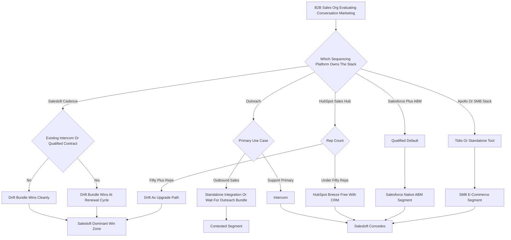

### Direct Answer

**Yes -- Salesloft's bundled Drift-plus-Cadence conversation-marketing motion outright beats the standalone Drift-class competitors (Intercom, Qualified, Tidio, Tars, Landbot, HubSpot Breeze) inside the 100-plus-rep B2B sales-engagement segment through 2027-2028, but the win is segmented rather than total.** Salesloft loses SMB to Intercom and Tidio, loses Salesforce-native ABM to Qualified, and loses the sub-50-rep HubSpot ecosystem to Breeze, which leaves it a dominant-but-not-monopoly category leader at roughly **55-65% segment-blended share** rather than a category-killer. The durability of that win depends on shipping Drift Brain with credible AI-SDR depth and defending the bundle math through the next M&A cycle -- an Outreach-plus-Intercom transaction is the single move that could compress the moat inside an 18-24 month window.

**TL;DR**

- **The bundle wins on procurement, not features.** A 100-rep buyer saves roughly **$30-80 per seat per month** -- $36K-$96K a year -- by buying the Salesloft Cadence-plus-Drift bundle instead of a standalone Outreach-plus-Intercom or Salesforce-plus-Qualified stack, and collapses two procurement cycles, two security reviews, and two integration projects into one.
- **The integration moat is real.** Drift conversations write directly into the same activity-graph that runs Cadence sequences, so signals are usable in the next sequence step within seconds; standalone competitors push events through middleware with hours-to-overnight latency and brittle dual-record reconciliation.
- **The AI moat compounds.** Drift Brain trains on a per-customer activity-graph corpus -- the customer's own conversation history, sequence-response patterns, and pipeline-conversion data -- which a generic standalone bot structurally cannot match.
- **Salesloft loses three segments honestly.** Intercom owns SMB and customer-support-adjacent conversation; Qualified owns Salesforce-native ABM; HubSpot Breeze quietly takes the sub-50-rep HubSpot ecosystem by being free with the CRM.
- **The metric that matters most is Drift attach rate** -- the percentage of Cadence customers who also buy Drift -- climbing from the high-20s at acquisition toward a credible 48-55% by FY27.
- **The biggest threat is M&A**, specifically an Outreach acquisition of Intercom or Qualified that builds a directly-comparable bundle.

## 1. Framing The Question

### 1.1 The Three Nested Layers

"Will Salesloft conversation marketing beat Drift standalone competitors" is a deceptively layered question, and the operator who treats it as a binary oversimplifies the actual decision the market is making. The question has three nested layers a serious analyst must separate before any honest answer is possible.

**Layer one is the surface question.** In head-to-head deals between Salesloft's bundled Drift offering and a standalone conversation-marketing tool -- Intercom, Qualified, Tidio, Tars, Landbot, HubSpot Breeze, Birdeye, or Drift's own legacy independent contracts -- who wins the deal? This is the layer most surface analyses stop at, and it produces a misleadingly clean "Salesloft mostly wins" answer.

**Layer two is the segmented question.** In which buyer profiles does Salesloft win, in which does it lose, and what is the structural reason for each outcome? This is the layer that matters, because the surface answer hides a segmented reality in which Salesloft loses entire categories of buyer outright.

**Layer three is the durability question.** Are the structural advantages Salesloft has today -- the bundle, the integration depth, the customer-specific AI corpus -- defensible through 2027-2028 against a credible competitive response, or will an M&A move from Outreach, Qualified, or Intercom collapse the moat? The honest answer requires running all three layers separately.

### 1.2 Why Conversation Marketing Is No Longer A Standalone Category

The frame to hold throughout this analysis is that conversation marketing is no longer a standalone category in the way it was when Drift first defined it in 2017-2019. By 2026-2027 it is a **feature** of one of three larger gravity wells: a sales-engagement platform (Salesloft, or Outreach with NASDAQ-adjacent private ownership), a marketing-automation platform (HubSpot, NYSE: HUBS; Adobe, NASDAQ: ADBE, via Marketo; Salesforce, NYSE: CRM, via Marketing Cloud), or a customer-experience suite (Intercom, or Qualified for Salesforce). The real question is which of those gravity wells captures which buyer, and conversation marketing as a discrete purchase decision is increasingly rare above the SMB tier.

### 1.3 The Analytical Standard This Answer Holds Itself To

A credible answer names every competitor, sizes them with real revenue and customer-count benchmarks, assigns segment-by-segment win rates rather than waving at the market in aggregate, and stress-tests the conclusion against the M&A scenarios that could change it. This entry does all four. It treats "does Salesloft beat them" as a question with seven different answers -- one per buyer segment -- and then rolls those up into a defensible blended forecast.

The analytical trap most operators fall into is treating the conversation-marketing decision as a feature comparison -- scoring each vendor one to five on chat-widget customization, routing, intent classification, and reporting, then picking the highest total. That method produces a wrong answer roughly half the time, because it ignores the two variables that actually determine the outcome: which platform already owns the buyer's revenue stack, and how much procurement friction the buyer will absorb. A standalone tool that scores higher on the feature spreadsheet still loses the deal if it requires a second procurement cycle, a second security review, and a brittle middleware integration. The right frame inverts the spreadsheet: start with the platform-gravity question, then the use-case question, then -- only then -- the feature comparison as a tie-breaker.

### 1.4 What "Beat" Has To Mean To Be A Useful Word

"Beat" is doing a lot of work in the headline question, and the analyst should pin it down. It can mean **win net-new logos** -- when a company with no conversation tool evaluates the field, who do they pick? It can mean **win competitive displacements** -- when a company already running Intercom or Qualified re-evaluates, who do they switch to? Or it can mean **win revenue share** -- across the whole base, whose ARR grows fastest? These are not the same contest. Salesloft is weakest at net-new-logo wins against Intercom in SMB, stronger at competitive displacements inside its own Cadence base, and strongest at pure revenue-share growth because the installed-base attach motion does not require beating anyone head-to-head. When this entry concludes "Salesloft beats standalone competitors," it means primarily revenue share and installed-base displacement, secondarily net-new logos inside the 50-plus-rep segment, and explicitly not net-new logos in SMB.

## 2. What Vista Actually Bought

### 2.1 The Salesloft-Plus-Drift Assembly

To analyze whether Salesloft beats standalone Drift competitors, an analyst needs an accurate read of what **Vista Equity Partners** assembled when it took Salesloft private in late 2021 for a reported $2.3B and then folded Drift into the same portfolio in early 2024. Vista's thesis, visible across investor communications, conference appearances, and the Drift acquisition press, was specifically that **the next durable enterprise revenue-tech platform is the bundle of sequencing, conversation, and conversation-intelligence wrapped around the activity-graph data corpus that ties them together** -- not a standalone point tool in any single layer.

### 2.2 The Three Capabilities The Drift Fold-In Added

The Drift acquisition gave Salesloft three things the standalone Cadence product did not have, and an operator should understand each precisely.

- **A conversation-marketing front-end.** The Drift chat widget that sits on the customer's website and converts anonymous traffic into identified, routed, qualified conversations.
- **A routing-and-meeting-booking engine.** The mechanism that takes the conversations Cadence sequences generate and turns them into booked meetings on the right AE's calendar, with territory and account-team logic.
- **Drift Brain.** The conversation-intelligence and AI layer Vista has been pouring R&D into, and the single asset on which the durability of the whole thesis rests.

### 2.3 The Tell That This Is A Real Bundle

The integration path Vista has run is unusually disciplined for a roll-up. Rather than running Drift as an independent product line, Vista has been migrating Drift onto Salesloft's data platform, unifying the activity-graph schema, sharing the AI/ML stack across both products, and pricing the bundle aggressively to drive attach inside the installed Cadence base. The tell that this is a real bundle and not a logo-collection roll-up is the pricing discipline: Drift-only contracts are being repriced toward the bundled rate at renewal, and the standalone Drift sales motion is being deliberately compressed in favor of the bundled motion into the Cadence base. Operationally, an analyst should read Salesloft today as a **single platform with three layers** -- Cadence sequencing, Drift conversation, Drift Brain conversation-intelligence -- sold as a bundle into a sales-engagement-buyer profile, not as three products sold separately.

| Layer | Product | Function | Competes against |
|---|---|---|---|
| Sequencing | Cadence | Outbound email, call, task orchestration | Outreach, Apollo, HubSpot Sales Hub |
| Conversation | Drift | Website chat, routing, meeting booking | Intercom, Qualified, Tidio, Breeze |
| Intelligence | Drift Brain | Intent classification, AI-SDR, reply suggestion | Intercom Fin, Gong, Outreach Kaia |
| Data plane | Activity-graph | Unified record across all three layers | No standalone equivalent |

The entity competing against the standalone Drift-class tools is that bundled three-layer platform, and the structural advantages and disadvantages all flow from its shape.

### 2.4 Why The Roll-Up Discipline Matters For The Competitive Read

Most software roll-ups fail the integration test. A private-equity owner buys three or four point tools, slaps a unified brand on them, sells them as a "suite," and the products never actually share a data plane. A buyer who has lived through one of those fake suites is rightly skeptical when a vendor says "bundle." The competitive question that matters is whether the Salesloft-plus-Drift bundle is a real platform or a fake suite, because a fake suite has none of the integration moat -- it competes only on the procurement-bundling advantage, which is thinner and fully replicable by a competitor's M&A.

The evidence that Salesloft is building a real platform is threefold. First, **schema unification is visible in the product** -- Drift conversation events appear as native step types in the Cadence activity-graph, not as imported foreign records. Second, the **AI/ML stack is shared** -- Drift Brain and Cadence email-intelligence draw on the same model infrastructure and customer-data corpus. Third, the **commercial motion is unified** -- one sales team selling one bundle into one buyer profile. An analyst should treat the bundle as a genuine platform for the forecast, while noting it is still mid-integration and the last 20% of schema unification is the hardest.

### 2.5 The Vista Operating Model And Its Constraints

Vista's operating model is well-documented: aggressive sales-and-marketing efficiency targets, disciplined R&D allocation toward the highest-return roadmap items, and a clear exit thesis on a three-to-six year horizon. For Salesloft this is mostly a tailwind -- it funds Drift Brain, enforces bundle pricing discipline, and concentrates commercial energy on the attach motion. But the exit clock means R&D investment is implicitly time-boxed: Vista will fund Drift Brain hard through the value-creation window and then optimize for exit-ready margins. The competitive implication is that Salesloft's window to widen the moat is not open forever -- it is open for roughly the duration of the Vista hold, after which the platform must be self-sustaining on the moat already built.

## 3. The Standalone Competitor Field, Named And Sized

### 3.1 The Enterprise And SMB Anchors

A serious competitive analysis names every credible competitor and sizes them honestly, because hand-waving about "the conversation marketing space" hides the fact that different competitors threaten different segments.

**Intercom** is the most important standalone competitor. It is a private company with a rough $1.5-2B last-round valuation, a customer base of approximately 50,000 accounts skewed SMB-to-mid-market with a meaningful enterprise tail, an estimated $250-300M ARR, and a deliberate pivot since 2023 from a customer-support tool with a chat widget into an AI-first conversation platform anchored on its Fin AI Agent. Intercom is the gravity well for SMB and for any buyer whose primary use case is customer support with conversation marketing as a secondary motion.

**Qualified** is the most important enterprise competitor. It is a venture-backed company estimated at $80-130M ARR, with a Pipeline Cloud and Signals product that ties website conversations directly into Salesforce as a Salesforce-native conversational ABM platform. Qualified is the gravity well for revenue teams that live inside Salesforce and run a heavy account-based motion.

### 3.2 The SMB And Long-Tail Field

**Tidio** is the SMB e-commerce conversation leader, estimated at $40-70M ARR, with aggressive sub-$50-per-seat pricing and a chatbot-builder motion that wins on price in the under-50-rep segment. **Tars** and **Landbot** are SMB conversational-form and chatbot builders with $20-50M ARR each, competing on form-replacement use cases more than enterprise conversation marketing. **Birdeye** plays in the conversation-and-reputation space for local and SMB businesses. **Drift's own residual independent base** still exists from the pre-Vista era, on legacy contracts being migrated to the bundle.

### 3.3 The Sleeping Giant: HubSpot Breeze

**HubSpot Breeze chatbot** -- the rebranded Conversations-plus-AI-Chatbot product inside HubSpot (NYSE: HUBS) Marketing Hub -- is a sleeping giant. It is free-with-the-CRM for HubSpot customers and bundled into Marketing Hub Professional and Enterprise. For the HubSpot-ecosystem buyer it is the path of least resistance and a serious threat in the sub-50-rep segment. Sizing these competitors honestly matters because the answer to "does Salesloft beat them" depends entirely on which one, and in which segment.

| Competitor | Est. ARR | Valuation | Customer skew | Primary threat segment |
|---|---|---|---|---|
| Intercom | $250-300M | $1.5-2B | SMB-to-mid-market | SMB, support-primary |
| Qualified | $80-130M | venture-backed | Enterprise Salesforce | Salesforce-native ABM |
| Tidio | $40-70M | private | SMB e-commerce | SMB e-commerce |
| Tars / Landbot | $20-50M each | private | SMB | Form-replacement chatbot |
| HubSpot Breeze | bundled-free | part of NYSE: HUBS | HubSpot ecosystem | Sub-50-rep HubSpot |
| Drift legacy | declining | part of Salesloft | Pre-Vista contracts | Renewal-cycle attrition |

### 3.4 The Gravity-Well Read Of The Field

The single most useful way to organize this competitor field is by gravity well -- the larger platform whose orbit each competitor occupies. Intercom's gravity well is the customer-experience suite; its center of mass is support, and conversation marketing is an adjacent motion it sells into the same buyer. Qualified's gravity well is Salesforce itself; Qualified has no independent existence outside the Salesforce ecosystem and has deliberately bet its entire architecture on being the Salesforce-native conversation layer. Tidio's gravity well is the SMB e-commerce platform constellation -- Shopify, WooCommerce, BigCommerce -- and its distribution is the app marketplaces of those platforms. HubSpot Breeze's gravity well is HubSpot's own CRM, and it does not compete outside the HubSpot installed base at all. Salesloft Drift's gravity well is the sales-engagement platform -- Cadence -- and its distribution is the Cadence installed base plus net-new sales-engagement buyers.

Reading the field this way clarifies the competitive geometry. Salesloft does not really compete with Intercom; it competes with whoever occupies the conversation slot inside a sales-engagement-led stack, and Intercom only shows up there as a legacy contract or an SMB outlier. Salesloft does not really compete with Breeze; it competes for the buyer who has not committed to the HubSpot gravity well. The deals Salesloft genuinely contests head-to-head are a narrower set than the full competitor list implies: they are the deals where the buyer's sequencing platform is not yet locked, or where the buyer is consciously re-evaluating the whole stack. Inside those genuinely contested deals, the bundle advantage is decisive; outside them, the gravity well was already chosen and conversation marketing is downstream of a platform decision made earlier.

### 3.5 Why Standalone Drift Itself Is A Competitor To The Bundle

A subtle point most analyses miss: the most awkward competitor to the Salesloft Drift bundle is Drift's own legacy standalone base. Before Vista folded Drift into Salesloft, Drift sold thousands of standalone contracts to companies running a non-Salesloft sequencing tool -- Outreach, Apollo, or none. Those legacy customers experience the acquisition not as an upgrade but as a vendor-strategy risk: their standalone product is now a non-core asset inside a company whose commercial energy is aimed at the bundle. At renewal they face a choice -- accept repricing toward the bundle rate without the integration benefit, switch to Intercom or Qualified, or adopt Cadence to capture the full bundle. The legacy base is a slow-motion churn-and-conversion problem, and the "Other / Drift legacy" column in the win-rate tables is largely that population working through renewal cycles.

## 4. The Bundle Math: Why Salesloft Wins On Procurement

### 4.1 The Arithmetic Of A 100-Rep Decision

The single most important structural advantage Salesloft has over standalone Drift competitors is the bundle math, and an operator should understand it precisely because it is the lever that wins the largest share of head-to-head deals. The arithmetic, drawn from public Salesloft pricing pages, competitor list prices, and procurement benchmarks across mid-market and enterprise B2B SaaS deals, runs like this.

**Path A is the Salesloft bundle.** Cadence at roughly $115-145 per rep per month plus Drift bundled in at an incremental $20-40 per rep per month, blended to a $135-185 per-seat-per-month ARPU on the bundle -- a single contract, a single procurement cycle, a single SOC 2 / DPA / MSA negotiation. For 100 reps that is roughly **$162K-$222K per year**, with one renewal and one vendor-management overhead.

**Path B is the standalone stack.** A Cadence-class sequencing tool at $85-145 per seat per month plus Intercom standalone at $59-119 per seat per month, totaling $144-264 per seat per month -- two contracts, two procurement cycles, two security reviews, two integration projects. For 100 reps that is roughly **$173K-$317K per year**, with two renewals and double the vendor-management surface area.

### 4.2 Why Procurement Prefers The Bundle Beyond Price

The bundle saves roughly **$30-80 per seat per month**, or **$36K-$96K per year for a 100-rep deployment** -- but, arguably more important than the dollars, it collapses two procurement cycles into one. Procurement and IT in mid-market and enterprise organizations strongly prefer single-vendor bundles for reasons that go well beyond price.

- **Fewer SSO integrations** to configure, test, and maintain.
- **Fewer SCIM provisioning flows** to keep in sync with the HR system.
- **Fewer DPAs and MSAs** to negotiate through legal.
- **Fewer security reviews** to staff and schedule.
- **Fewer renewal negotiations** consuming vendor-management hours.

The bundle is not just cheaper, it is procurement-friendlier, and that is why it consistently wins at the 50-plus-rep deal size where procurement gets involved. Below 50 reps, where the buyer is a head of sales using a credit card, the bundle math is less decisive and standalone competitors compete on UX and time-to-value.

### 4.3 ARPU And Bundle Economics In Hard Numbers

To make the bundle math fully concrete, the table below lays out the per-seat-per-month ARPU comparison across the realistic configurations a 100-rep buyer would price out, drawn from public list pricing, partner-channel benchmarks, and procurement deal data through 2024-2026. Actual deal pricing varies with discount, commit term, and bundling -- the point is the structural relationship.

| Configuration | Sequencing ARPU | Conversation ARPU | Combined ARPU | 100-rep annual cost |
|---|---|---|---|---|
| Salesloft bundle (Cadence + Drift) | included | included | $135-185 | $162K-$222K |
| Outreach + Intercom standalone | $95-145 | $59-119 | $154-264 | $185K-$317K |
| Outreach + Qualified standalone | $95-145 | $49-99 | $144-244 | $173K-$293K |
| HubSpot Sales Hub + Breeze | $90-150 | bundled-free | $90-150 | $108K-$180K |
| Salesforce Sales Cloud + Qualified | $150-300 | $49-99 | $199-399 | $239K-$479K |
| Apollo + Tidio (SMB-leaning) | $49-99 | $29-59 | $78-158 | $94K-$190K |
| Salesloft + standalone Drift legacy | $115-145 | $59-99 | $174-244 | $209K-$293K |

The structural read: Salesloft's bundled ARPU sits in the middle of the field, meaningfully below the Outreach-plus-standalone-conversation combinations and the Salesforce-plus-Qualified combination, above the HubSpot-plus-Breeze combination, and competitive with Apollo-plus-Tidio for SMB where Salesloft does not realistically compete anyway. The bundle's price advantage is most decisive against exactly the configurations the 100-plus-rep B2B SaaS buyer is most likely to consider -- and that is by design. Vista priced the bundle precisely to win this comparison. The deeper mechanics of that pricing decision sit in (q1811).

### 4.4 The Hidden Cost Line Procurement Always Misses

The list-price comparison above understates the bundle's advantage because it omits the cost line procurement consistently underestimates: **integration and ongoing maintenance labor.** A standalone conversation tool connected to a separate sequencing platform requires an integration project to stand up -- field mapping, sync-rule design, deduplication, error-handling -- and ongoing maintenance, because every schema change on either side can break the mapping. A realistic accounting assigns 80-160 hours of RevOps time to the initial integration and 8-15 hours per month to maintenance. At a loaded cost of $90-140 per hour, that is $7K-$22K one-time and $9K-$25K per year that never appears on the software-pricing comparison.

| Cost line | Salesloft bundle | Standalone two-vendor stack |
|---|---|---|
| Software (100 reps, annual) | $162K-$222K | $173K-$317K |
| One-time integration labor | Minimal (native) | $7K-$22K |
| Annual integration maintenance | Minimal (native) | $9K-$25K |
| Vendor-management hours / year | ~40-80 | ~100-180 |
| Security reviews per cycle | 1 | 2 |
| Effective 3-year total cost | Lower band | Higher band by $60K-$170K |

The bundle's true cost advantage over a three-year horizon is therefore larger than the headline per-seat number suggests -- often $60K-$170K for a 100-rep deployment once integration labor and vendor-management overhead are counted. A standalone competitor that wants to win must either be dramatically better on product or dramatically cheaper on license, because it starts the comparison carrying a structural cost penalty the buyer's spreadsheet usually ignores until the integration project runs over.

### 4.5 Where The Bundle Math Stops Working

Intellectual honesty requires naming where the bundle math fails. It fails in three places. First, **below 50 reps**, where there is no procurement function, no security-review process, and often no RevOps team -- the integration-labor penalty mostly disappears because the SMB buyer is not going to build a serious integration anyway, and the buyer optimizes purely on sticker price and time-to-first-value. Second, **when the buyer has already sunk the integration cost** -- a company that stood up an Intercom-to-Outreach integration two years ago has already paid the one-time cost and treats it as sunk, so the bundle's integration advantage is discounted at the switching decision. Third, **when the conversation tool serves a buyer outside the sales org** -- if the support team owns and pays for the conversation tool, the sales-engagement bundle does not consolidate that budget line at all, and the bundle's procurement story collapses because two different departments are buying. A competitor's best sales motion is to steer the deal into one of these three exceptions.

## 5. The Integration Moat: Activity-Graph Native Beats Middleware

### 5.1 What "Native" Means Concretely

The second structural advantage Salesloft has -- and the one that is hardest for standalone competitors to replicate even with capital -- is that Drift writes directly into the same activity-graph that runs Cadence sequences. An operator should understand what this means concretely, because it is a real moat and not marketing language.

When a Salesloft customer's prospect lands on the website and engages Drift, the conversation produces structured signals: intent classification, account identification via integrated firmographic enrichment, routing decision, meeting booked or not, qualification disposition, and full transcript. **Those signals write into the same activity-graph record that holds the prospect's email opens, sequence step history, call dispositions, and CRM contact and account data.** Crucially, they are usable in the next sequence step within seconds -- not the next morning after a Zapier-style sync. A rep watching their Cadence dashboard sees the chat conversation as a step in the prospect's history, with the same disposition codes and the same attribution, and the next email or call task is dynamically updated based on what was learned in chat.

### 5.2 Why The Standalone Path Is Structurally Worse

The standalone competitor path looks completely different. Intercom, Qualified, or Tidio sit outside the sales-engagement system, push their conversation events through Zapier, Workato, Tray.io, or a custom-built middleware pipeline, and reconcile dual records in CRM -- one from chat, one from sequencing -- with mapping rules that break whenever either side changes a field.

| Dimension | Salesloft Drift bundle | Standalone competitor + middleware |
|---|---|---|
| Signal-to-sequence latency | Seconds | Hours to overnight |
| Data fidelity | Full structured signal | Lossy field mapping |
| Attribution integrity | Single activity-graph record | Fragile dual-record reconciliation |
| Rep dashboard reflects chat | Real time | Not in real time |
| Deployment time | 7-14 days | 30-90 days |
| Breakage surface | One vendor's schema | Two schemas plus middleware |

For a 100-plus-rep operation running tight outbound cadences with a strict SLA on signal-to-touch, that latency and brittleness is operationally unacceptable. The integration moat is not theoretical -- it is the specific reason Salesloft customers who pilot a standalone Drift-class tool alongside the bundle consistently report that the standalone tool's data never makes it cleanly into the rep's daily flow.

### 5.3 Why Capital Cannot Fully Close The Gap

Standalone competitors can build deeper integrations into Salesloft's API surface, but **Salesloft controls the API surface and prices the integration depth strategically**, which means a standalone competitor's integration is always one Salesloft API change behind. A competitor can spend its way to a good integration; it cannot spend its way to a native one. That asymmetry is the durable core of the integration moat, and the broader competitive-moat picture is developed in (q1809).

### 5.4 The Closed-Loop Workflow Standalone Tools Cannot Reproduce

The integration moat is easiest to understand through a single concrete workflow that the bundle executes natively and that a standalone stack cannot reproduce without significant brittleness. Call it the **chat-to-cadence closed loop.** A prospect already in a Cadence outbound sequence -- on step 4 of an 11-step sequence, say -- clicks a link in the rep's email and lands on the website. Drift recognizes the visitor as a known Cadence contact, not an anonymous visitor, because the activity-graph already holds that identity. The chat conversation is therefore not a cold interaction; the bot opens with context, the routing engine knows which AE owns the sequence, and when the conversation produces a disposition -- "asked about pricing, not ready to book" -- that disposition writes back into the sequence as a branch condition. The next sequence step adapts: instead of the generic step-5 email, the rep's task queue now shows a pricing-objection-handling email pre-drafted by Drift Brain. The whole loop closes inside one data plane, in real time, with no human re-keying and no middleware.

A standalone stack cannot do this cleanly. The standalone conversation tool does not know the visitor is on step 4 of a Cadence sequence -- that information lives in a different system it can only see through a delayed sync -- and it cannot branch the sequence in real time, because the sequence engine belongs to a different vendor with its own API rate limits. The disposition arrives in CRM hours later, after the rep has already sent the generic step-5 email. The closed loop is broken into an open loop with a latency gap, and the latency gap is exactly where deals leak. This single workflow is the most persuasive demo Salesloft can run.

### 5.5 The Counter-Argument: How Much Of The Segment Actually Needs Real Time

An honest treatment of the integration moat must concede a real limit, which the counter-case section develops further. Not every buyer in the 100-plus-rep segment runs cadences tight enough that overnight sync latency materially hurts. The closed-loop advantage is decisive for high-velocity inbound-plus-outbound motions and merely nice-to-have for slower enterprise cycles. The moat is therefore strongest for the upper-mid-market velocity buyer and weaker at the slow-cycle enterprise end -- part of why Qualified, with its Salesforce-native depth, can still win slow-cycle enterprise ABM deals despite lacking the real-time chat-to-cadence loop. The moat is real, but its decisiveness varies by buyer velocity.

## 6. The AI Moat: Drift Brain And The Per-Customer Corpus

### 6.1 How Drift Brain Actually Works

The third structural advantage -- and the one becoming more important rather than less as the conversation-marketing category gets AI-rewired through 2026-2027 -- is that Drift Brain trains on a per-customer activity-graph corpus that standalone competitors cannot replicate.

The mechanism, simplified: Drift Brain combines a foundation model -- Salesloft's stack uses a mix of Anthropic Claude, OpenAI GPT, and selectively fine-tuned smaller models depending on task -- with retrieval and fine-tuning on the customer's own activity-graph data. That data includes the customer's conversation history, sequence response data, winning email patterns, meeting booking rates by segment, qualification dispositions, and lost-deal patterns. The Drift bot answering a prospect's question on the customer's website does not give a generic answer trained on the public web; it gives an answer informed by what the customer's own reps have said in past conversations, what messaging has converted in past sequences, and what disposition patterns have predicted booked meetings.

### 6.2 Why A Generic Bot Cannot Match It

**A generic standalone bot cannot do this** because it does not have the upstream activity-graph corpus -- it has only its own conversation history with that customer, which is a fraction of the total signal.

- **Intercom** is investing aggressively in Fin AI Agent and has its own conversation corpus, genuinely valuable for support-style use cases, but it lacks the sequence-response and pipeline-conversion corpus Salesloft has.
- **Qualified** has Salesforce data but does not own the email and sequence layer, so its corpus is missing the outbound-response signal.
- **Tidio, Tars, and Landbot** simply do not have the AI investment depth to compete on this axis at all.

The AI moat is structural, it compounds as more customer data flows through it, and it is the durability bet Vista is making. The broader Salesloft AI roadmap and its risks are analyzed in (q1804).

### 6.3 The AI-SDR Inflection

The next inflection for Drift Brain is the AI-SDR motion -- not just a smarter chatbot, but a genuine AI sales-development capability that handles initial qualification, books meetings with full context-handoff to a human AE, and produces structured handoff data the AE actually uses. If Drift Brain ships a credible AI-SDR layer in FY26 H2, it becomes the killer feature that doubles attach inside the installed base. If it slips, the AI moat compresses to "we have a slightly better bot than Intercom" -- which is the central swing variable in the whole forecast.

### 6.4 What A Credible AI-SDR Actually Has To Do

The phrase "AI-SDR" is used loosely across the category, so an operator should hold a concrete bar for what counts. A credible AI-SDR built on Drift Brain has to do six things, and a chatbot that does only the first two or three is not an AI-SDR -- it is a better chatbot with marketing copy attached.

- **Qualify against the customer's real ICP**, using the customer's historical disposition data to decide which inbound conversations are worth a human AE's time and which are not.
- **Hold a multi-turn discovery conversation** that adapts to answers rather than running a fixed decision tree, asking the follow-up question a good human SDR would ask.
- **Book the meeting on the right AE's calendar**, using territory, account-team, and historical-conversion-by-segment data to route -- not round-robin.
- **Produce a structured handoff** the receiving AE actually reads: the qualification summary, the objections raised, the buying signals detected, and the recommended next step, written into the activity-graph.
- **Continue the sequence intelligently** -- update the prospect's Cadence sequence based on what the conversation revealed, so the human follow-up is coherent with the AI interaction.
- **Improve from outcome data** -- learn which of its qualified handoffs actually converted to pipeline and recalibrate its qualification threshold accordingly.

Drift Brain has the structural ingredients for all six because it sits on the activity-graph corpus. Whether it ships all six on schedule and at quality is the open question, and it is genuinely uncertain -- AI-SDR is hard, and the gap between a demo that does six things in a controlled scenario and a product that does six things reliably across thousands of messy real conversations is wide.

### 6.5 The Commoditization Risk, Stated Fairly

The most serious threat to the AI moat is not a competitor -- it is commoditization. As foundation models from Anthropic, OpenAI, and Google get better at out-of-the-box conversation, the marginal value of fine-tuning on a per-customer corpus shrinks. The honest read: commoditization will erode the corpus advantage at the **conversation-quality** layer -- generic models will get good enough at sounding competent -- but much less at the **routing and prediction** layer, where the customer-specific signal about which AE converts which segment and which disposition predicts pipeline cannot be reproduced by a generic model that has never seen the customer's outcome data. The defensible core of the AI moat is therefore not "our bot talks better" -- which commoditizes -- but "our bot routes and predicts better because it learns from your pipeline outcomes" -- which does not.

## 7. Where Salesloft Loses

### 7.1 The SMB Segment And Intercom

A serious analyst is honest about where Salesloft does not win, and the SMB segment under 50 reps is the clearest loss. The buyer profile in SMB conversation marketing is fundamentally different from the enterprise sales-engagement buyer Salesloft serves. SMB buyers are head-of-sales-with-a-credit-card or even founder-led; the procurement and integration friction that drives the bundle advantage does not exist; the use case is often customer support intermixed with conversation marketing; and price sensitivity is acute.

Intercom owns this segment for several converging reasons: its product-led-growth motion gets a buyer to value in hours not weeks, its customer-support roots give it a richer messaging and inbox UX than Drift's sales-marketing-first product, its Fin AI Agent has a strong support-ticket-deflection ROI story, and its pricing is calibrated to the SMB budget. **The honest call:** Salesloft will not win SMB conversation marketing through 2027-2028, and trying to compete there would dilute its enterprise positioning. The right competitive response is to deliberately concede SMB and focus the bundle motion on the 50-plus-rep segment where it structurally wins.

### 7.2 The Salesforce-Native ABM Segment And Qualified

The second segment where Salesloft loses -- and the one most often missed in surface analyses -- is the Salesforce-native account-based-marketing revenue team that lives inside Sales Cloud and runs ABM as its primary go-to-market motion.

Qualified built its entire product around being the deepest Salesforce-native conversation platform. It lives as a managed package inside Salesforce, its Pipeline Cloud and Signals products treat the Salesforce account as the primary record, its conversation routing uses Salesforce account-team and territory data natively, its Slack integration works through the Salesforce-Slack connection, and its reporting lives inside Salesforce dashboards. For a revenue team that has standardized on Salesforce (NYSE: CRM) as the system of record and runs an account-based motion -- target account lists, account-level intent, account-level conversation routing -- Qualified is the natural fit and Salesloft Drift is a step away from the Salesforce-centric workflow. **The honest call:** Salesloft loses the Salesforce-native ABM segment to Qualified at roughly a 60-40 to 70-30 ratio, and the loss is structural rather than addressable through marketing.

### 7.3 The HubSpot-Ecosystem Sub-50-Rep Segment And Breeze

The third loss zone -- and the one that may grow the fastest through 2027 -- is the HubSpot-ecosystem customer in the sub-50-rep range who can use Breeze chatbot for free with their existing HubSpot Marketing Hub or CRM Suite subscription.

HubSpot (NYSE: HUBS) has been aggressive about consolidating conversation, AI chat, and chatbot into the core CRM bundle under the Breeze brand. The practical result is that a HubSpot customer already paying for Marketing Hub Professional or Enterprise can deploy a credible chat-and-chatbot motion with no incremental software spend. For a 30-rep B2B SaaS startup running HubSpot top-to-bottom, the procurement question "should we add Salesloft Drift for $135-185 per seat" against the alternative of "use the Breeze chatbot we already have" almost always answers itself in favor of Breeze, even if Drift is technically more capable. HubSpot's product investment in Breeze AI through 2025-2027 is closing the capability gap fast, and the bundling-with-the-CRM is structurally similar to what Microsoft (NASDAQ: MSFT) did to standalone CRM with the Dynamics-bundled-into-Office-365 motion two decades ago. **The honest call:** Salesloft will lose the HubSpot-ecosystem sub-50-rep segment to Breeze at a rate growing from roughly 50-50 in 2024 toward 30-70 by 2027. How Salesloft should defend against this bundling pressure is covered in (q1855).

| Loss zone | Winning competitor | Structural reason | 2027 loss severity |
|---|---|---|---|
| SMB under 50 reps | Intercom, Tidio | No procurement friction to relieve | High -- concede |
| Salesforce-native ABM | Qualified | Managed-package native depth | High -- 60-40 to 70-30 |
| Sub-50-rep HubSpot | Breeze | Free with the CRM | Growing -- 30-70 by 2027 |
| Customer-support-primary | Intercom | Support-first inbox UX | High -- concede |

## 8. Segment-By-Segment Win Rates: The Honest 2027 Forecast

### 8.1 The Win-Rate Table

A serious analysis assigns a win-rate estimate by segment rather than waving at the market in aggregate, because the answer to "does Salesloft beat standalone competitors" is genuinely segmented. The estimates below are calibrated against public competitor revenue benchmarks, customer-count disclosures, ecosystem partnership data, and procurement-friction patterns observed across mid-market and enterprise B2B SaaS deals through 2024-2026. They are projections, not guarantees.

| Segment | Salesloft (Drift bundle) | Intercom | Qualified | Tidio | HubSpot Breeze | Other / Drift legacy |
|---|---|---|---|---|---|---|
| Enterprise (200+ reps) | 60-70% | 8-12% | 12-18% | <2% | <3% | 3-7% |
| Upper mid-market (100-200 reps) | 55-65% | 12-18% | 10-15% | 3-6% | 4-8% | 2-5% |
| Lower mid-market (50-100 reps) | 45-55% | 18-25% | 8-12% | 6-10% | 8-12% | 2-5% |
| SMB (under 50 reps) | 8-15% | 22-30% | 5-10% | 28-38% | 18-25% | 3-6% |
| HubSpot-ecosystem aligned | 45-55% | 10-15% | 4-8% | 5-9% | 22-32% | 2-5% |
| Salesforce-native ABM | 25-35% | 10-15% | 38-48% | 2-5% | <3% | 5-10% |
| Customer-support-primary | 15-22% | 50-60% | 5-9% | 10-15% | 5-9% | 3-6% |

### 8.2 What The Table Says

The takeaway: Salesloft's segment-blended share inside the conversation-marketing-attached-to-sales-engagement category lands at roughly **55-65%** -- dominant but not monopoly -- with clearly defined loss zones (SMB, customer-support-primary, Salesforce-native ABM, sub-50-rep HubSpot) and clearly defined win zones (50-plus-rep B2B SaaS sales organizations, especially those running outbound-heavy motions).

### 8.3 The Strategic Posture That Follows

The right strategic posture is to dominate the win zones, deliberately concede the loss zones, and resist the temptation to spread thin across all seven segments. A vendor that tries to win every segment loses focus in the segments where it structurally wins; a vendor that concentrates fire holds its dominant share. Salesloft's discipline in the next 24 months should be measured by how cleanly it refuses the SMB and support-primary fights rather than how broadly it markets.

## 9. The Drift Attach Rate: The Single Number That Matters Most

### 9.1 Why Attach Rate Is The Master Metric

Inside Salesloft, the single metric that most directly indicates whether the conversation-marketing strategy is working is the **Drift attach rate** -- the percentage of Cadence customers who have also bought Drift. This number, tracked closely by Salesloft commercial leadership and regularly referenced in Vista investor communications and partner updates, has moved from roughly the high-20s at the time of the Drift acquisition in early 2024 toward an estimated low-to-mid-30s in 2025, and is on a credible glide path to the **48-55% range by FY27** if Drift Brain ships on schedule and the bundle pricing holds.

### 9.2 The Installed-Base Math

The math of why this matters: Salesloft sits on roughly **5,200-5,800 Cadence customers** -- the exact number is private but inferable from public revenue and ARPU disclosures. Each percentage point of Drift attach is roughly 50-60 incremental Drift-bundled customers. Moving attach from 30% to 50% adds roughly **1,000-1,200 additional Drift-bundled accounts**, which at the bundle ARPU represents a meaningful expansion of Drift ARR without any new-logo acquisition.

| Attach rate scenario | Drift-bundled accounts | Incremental vs 30% baseline | Implication |
|---|---|---|---|
| 30% (early-2024 baseline) | ~1,650 | -- | Acquisition starting point |
| 38-42% (bear plateau) | ~2,100-2,300 | +450-650 | Growth ceiling lower than Vista assumed |
| 48-55% (base case FY27) | ~2,650-3,000 | +1,000-1,350 | Thesis on track |
| 55%+ (bull case) | ~2,900-3,200 | +1,250-1,550 | Drift Brain AI-SDR success |

### 9.3 The Competitive Implication

Salesloft's primary competitor for Drift growth is **not Intercom or Qualified -- it is the inertia of the Cadence customer who has not yet bought any conversation-marketing tool.** The standalone competitors are the secondary battle, fought at the margins where the Cadence customer has already bought Intercom or Qualified before Drift was bundled. This is why Vista invests in Drift Brain, in integration depth, and in bundle pricing: the highest-return path to Drift growth is converting the 65-70% of Cadence customers who do not yet have Drift, not winning standalone deals against Intercom in net-new logos.

### 9.4 Why The Attach Rate Can Stall

An honest analyst does not assume the attach rate glides smoothly to 50-plus. There are structural reasons a meaningful slice of the Cadence base resists Drift attach. Some customers have an **incumbent conversation contract** with years left on the term, and will not double-pay to switch until it expires -- attach is delayed two or three years, not refused. Some have **the support team, not sales, owning conversation** -- the budget sits in a department Salesloft's sales-engagement motion does not reach. Some are **purely outbound** with no website-conversation motion at all, so Drift has nothing to attach to. And some are simply **not ready to add software spend** in a given budget cycle. The realistic ceiling for attach is therefore not 100% or even 70% -- it is more like 55-65% of the Cadence base with a genuine conversation use case the sales org controls. The 48-55% FY27 base case is progress toward that ceiling, not toward a theoretical maximum.

### 9.5 The Net-Revenue-Retention Connection

Drift attach is also the cleanest lever Salesloft has on net revenue retention, which matters because NRR is the metric Vista watches most closely for the exit narrative. Every Cadence customer who adds Drift at renewal is an expansion event -- the same logo, more ARR -- and expansion events push NRR above 100%. A sales-engagement vendor whose core sequencing product is in a maturing category needs an expansion motion to keep NRR healthy, and the Drift attach motion is precisely that. The Drift bundle is therefore not only a conversation-marketing play -- it is the NRR engine for the whole Salesloft platform, which makes beating standalone Drift competitors strategically necessary for the financial story Vista will tell at exit.

## 10. The M&A Scenarios That Could Change The Answer

### 10.1 The Five Scenarios

A durable competitive analysis stress-tests the answer against the M&A moves that could change the structural picture, because the conversation-marketing category is consolidating and the next 18-24 months will likely see at least one or two consequential transactions.

- **Scenario A -- Outreach acquires Intercom or Qualified.** This is the scenario Salesloft worries about most, because it would create a directly-comparable bundled competitor -- a sequencing platform plus a conversation platform sold as a single offering with the same procurement and integration advantages. Outreach is private-equity-owned, has a credible motivation to match Salesloft's bundle, and has the capital. Probability moderate; integration risk high, requiring 18-24 months to genuinely integrate the data plane.
- **Scenario B -- HubSpot accelerates Breeze AI and acquires a sales-engagement target.** This could create the HubSpot-bundled equivalent for the SMB-to-mid-market HubSpot-ecosystem buyer. Probability moderate, timeline 12-24 months.
- **Scenario C -- A private-equity rollup combines Qualified, a sales-engagement platform, and an AI-conversation specialist.** Less likely than A or B but plausible given Qualified's growth and venture-backer pressure for a path to scale.
- **Scenario D -- Salesforce acquires Qualified outright** and bundles it into Sales Cloud as the native conversation layer. This would lock down the Salesforce-native ABM segment Salesloft already loses, and would not change the segments Salesloft wins.
- **Scenario E -- Status quo holds.** Each standalone competitor stays standalone, the bundle math continues to favor Salesloft in the 50-plus-rep segment, and the segmented-but-dominant outcome plays out. This is the modal scenario through FY27.

### 10.2 The Scenario Matrix

| Scenario | Probability | Timeline | Impact on Salesloft |
|---|---|---|---|
| A -- Outreach + Intercom/Qualified | Moderate | 18-24 months | Highest -- bundle moat compresses |
| B -- HubSpot + sales-engagement target | Moderate | 12-24 months | Narrows mid-market win zone |
| C -- PE rollup of Qualified + others | Lower | 24+ months | Moderate -- new bundled rival |
| D -- Salesforce acquires Qualified | Moderate | 12-24 months | Low -- locks an already-lost segment |
| E -- Status quo | Highest (modal) | Through FY27 | Segmented-but-dominant outcome holds |

### 10.3 The Strategic Implication

Salesloft should plan for Scenario A as the primary defensive concern and ship Drift Brain depth, deeper Cadence integration, and aggressive bundle pricing in the next 12 months to widen the moat before a competitor can match it. Whether a different acquirer -- HubSpot or Clari -- might take Drift in an alternate history is explored in (q1925) and (q1868); the point for this analysis is that the bundle's exclusivity is a depreciating asset and the depreciation clock starts the day a credible bundled rival announces.

## 11. The Bull And Bear Cases

### 11.1 The Bull Case

The bull case for Salesloft conversation marketing is the case Vista has bet on and the one the product roadmap is built around. Through FY27 it includes: Drift Brain ships a credible AI-SDR motion in FY26 H2 that doubles attach inside the installed base; Drift attach hits 55%-plus, putting the bundle inside roughly 2,900-3,200 Cadence accounts; the bundle motion consolidates the 100-plus-rep B2B SaaS sales-engagement segment at the 60-70% share level; HubSpot-ecosystem dominance solidifies at the 50-plus-rep tier where Drift outclasses Breeze on capability; Lavender-style sales-rep AI coaching integrates with Drift conversation flows to produce a real-time conversation-coaching layer; and Vista positions Salesloft for an IPO or strategic sale at a $4-6B valuation. The bull case is plausible but not assured -- it requires Drift Brain to ship on schedule, the bundle pricing to hold against competitive response, and Vista to keep funding R&D at the current rate.

### 11.2 The Bear Case

The bear case is equally important because the structural advantages are real but not permanent. Through FY27 it includes: Drift Brain slips materially -- the AI-SDR motion ships late or underwhelming, and the AI moat compresses to "slightly better bot than Intercom"; an Outreach-plus-Intercom or Outreach-plus-Qualified transaction closes and within 18-24 months produces a credible bundled competitor; HubSpot Breeze AI matures faster than expected and takes the 50-100-rep HubSpot-ecosystem segment; conversation AI gets commoditized as foundation-model vendors release capable out-of-the-box conversational agents that any chatbot vendor can wrap; Vista-imposed R&D constraints in a downturn slow Drift Brain investment; and Drift attach plateaus at 38-42% rather than reaching 50-plus.

| Variable | Bull case | Bear case | Swing magnitude |
|---|---|---|---|
| Drift Brain AI-SDR | Ships strong FY26 H2 | Slips or underwhelms | Largest controllable |
| Drift attach by FY27 | 55%+ | 38-42% plateau | High |
| Core-segment share 2027 | 60-70% | 35-45% | High |
| Competitive M&A | Status quo holds | Outreach + Intercom closes | High, uncontrollable |
| AI commoditization | Corpus advantage holds | Generic AI good enough | Moderate |

### 11.3 The Probability Weighting

In the bear case, Salesloft's 2027 conversation-marketing share in its core 100-plus-rep B2B SaaS segment compresses to 35-45% rather than the 60-70% the bull case projects, and the platform thesis weakens. The bear case is not the modal outcome, but it is plausible enough that an analyst should weight it at **25-35% probability**. The realistic outcome distribution is therefore centered on dominant-but-segmented success, with a meaningful left tail.

## 12. Counter-Case: The Strongest Argument Against Salesloft Winning

### 12.1 The Bundle Is Not A Moat, It Is A Timing Advantage

The strongest honest counter-case to the "yes, Salesloft wins" answer is that the bundle is not a structural moat at all -- it is a **timing advantage that any well-capitalized sequencing vendor can replicate.** A moat is something a competitor cannot copy even with money and time. The bundle fails that test. Outreach can buy Intercom or Qualified tomorrow, and PE capital is plentiful. The procurement advantage Salesloft enjoys is real, but it is an advantage Salesloft holds only because no rival has yet assembled the same two pieces. The day one does, the bundle math equalizes and Salesloft is competing on integration depth and AI quality alone -- a much narrower edge.

### 12.2 The Integration Moat May Be Thinner Than Claimed

The integration-moat argument assumes the activity-graph natively unifying chat and sequencing is operationally decisive. But a skeptic should note that the buyers who most value sub-second signal-to-sequence latency are a minority even within the 100-plus-rep segment -- many mid-market teams run cadences on daily or twice-daily cycles where overnight middleware latency is tolerable. If real-time signal flow is a nice-to-have rather than a must-have for most of the segment, the integration moat shrinks from "decisive" to "a tie-breaker," and standalone competitors with better conversation UX can win on product quality.

### 12.3 AI Commoditization Could Erase The Corpus Advantage

The per-customer-corpus AI advantage assumes generic foundation models stay meaningfully worse than corpus-fine-tuned models for conversation-marketing tasks. That assumption is aging badly. As OpenAI, Anthropic, and Google ship increasingly capable out-of-the-box conversational agents, "good enough" generic AI may satisfy most buyers, and the marginal lift from a per-customer corpus may not justify the price premium. If the AI layer commoditizes, two of Salesloft's three structural advantages -- AI corpus and, indirectly, the bundle's AI-driven attach growth -- weaken at once.

### 12.4 Why The Counter-Case Does Not Win Outright

The counter-case is serious and an honest analyst weights it heavily -- it is most of the bear case. But it does not fully overturn the conclusion. First, even if the bundle is a timing advantage rather than a permanent moat, **timing advantages worth 18-24 months are still worth a great deal** in a consolidating market, and Salesloft can use that window to deepen integration and attach. Second, the installed-base attach motion -- converting Cadence customers who have bought no conversation tool -- does not depend on beating Intercom or Qualified on product; it depends only on the bundle being convenient, which it is regardless of M&A. The counter-case caps the upside and raises the bear-case weighting, but it does not move the central answer from "yes, segmented" to "no."

## 13. The Buyer's Frame: How A Sales Leader Should Decide

### 13.1 The Five Decision Filters

Stepping out of the competitive horse-race and into the buyer's seat, a CRO or VP Sales evaluating conversation marketing in 2026-2027 should run the decision through a structured filter rather than picking on brand or feature checklist.

- **Filter one -- what platform owns the rest of your revenue stack?** If Salesloft Cadence owns sequencing, the bundle math and integration depth make Drift the obvious choice. If Outreach owns sequencing, the comparison is between Outreach's weaker bundled-conversation roadmap and a standalone integration. If HubSpot owns the CRM, Breeze is the path of least resistance under 50 reps. If Salesforce plus a 6sense or Demandbase ABM stack runs the GTM, Qualified is the natural fit.
- **Filter two -- what is the primary use case?** Outbound sales-development conversation handoff favors Salesloft Drift. Customer-support-primary use cases favor Intercom. Inbound ABM intent on Salesforce favors Qualified. SMB lead-capture favors Tidio or Breeze.
- **Filter three -- what is the procurement and integration tolerance?** Single-vendor procurement and 7-14-day deployment favors the bundle. Multi-vendor tolerance and 30-90-day integration capacity opens the standalone field.
- **Filter four -- what is the AI ambition?** A buyer betting on per-customer-corpus AI personalization at depth favors Drift Brain. A buyer satisfied with strong out-of-the-box generic AI is well-served by Intercom Fin.
- **Filter five -- what is the price sensitivity?** Bundle pricing is competitive in the middle of the market; the cheapest credible option for a HubSpot-ecosystem SMB is Breeze, and for an SMB e-commerce buyer it is Tidio.

### 13.2 The Filter Outcomes

| Buyer profile | Filter verdict | Tool |
|---|---|---|
| 100+ reps on Cadence, outbound-heavy | Bundle math + integration win | Salesloft Drift |
| 200+ reps on Salesforce, ABM-primary | Native depth wins | Qualified |
| Under-50-rep HubSpot startup | Free-with-CRM wins | HubSpot Breeze |
| Support-primary mid-market | Support inbox UX wins | Intercom |
| SMB e-commerce on Shopify | Price and integration win | Tidio |

Run those five filters honestly and the right answer falls out without subscribing to any single vendor's narrative. The broader Outreach-versus-Salesloft buying decision sits in (q110) and (q1730).

### 13.3 Five Named Operating Scenarios

Concrete scenarios make the picture tangible. **Aria, VP Sales at a 180-rep B2B SaaS company on Salesloft Cadence and HubSpot CRM**, evaluates Drift bundle versus Intercom standalone; the bundle saves $58K a year, deploys in 11 days versus an estimated 60, and her reps see chat in their Cadence dashboards in real time -- picks Drift bundle. **Marcus, CRO at a 320-rep enterprise on Salesforce plus 6sense**, evaluates Drift versus Qualified; Qualified's Salesforce-native depth wins decisively for his ABM-heavy motion -- picks Qualified. **Priya, head of sales at a 28-rep startup on HubSpot Sales Hub and Marketing Hub Pro**, evaluates Drift versus Breeze; Breeze comes free with her existing subscription and is capable enough -- picks Breeze. **Tomas, VP Sales at a 110-rep cybersecurity company on Salesloft Cadence**, evaluates the Drift bundle versus a legacy standalone Intercom contract; the bundle saves $74K a year and eliminates the dual-record reconciliation corrupting his attribution -- migrates to Drift. **Nadia, founder of a 15-rep e-commerce SaaS startup on Apollo and Shopify**, picks Tidio at $39 a seat with native Shopify integration -- Salesloft correctly does not compete. These five span the realistic distribution of decisions inside the field.

## 14. The 2027-2028 Outlook And Final Answer

### 14.1 What The Category Looks Like In 2028

Pulling everything together: through 2027-2028 the conversation-marketing category will not have a single winner, but it will have a clearly dominant player in the 100-plus-rep B2B sales-engagement segment, and that player is overwhelmingly likely to be Salesloft. The structural advantages -- bundle math, activity-graph integration, per-customer AI corpus -- are real, durable through at least the next 18-24 months absent a material competitive M&A move, and reinforced by Vista's continued R&D investment in Drift Brain. The category segments into specialists rather than consolidating into a monopoly: Intercom holds SMB and support-primary, Qualified holds Salesforce-native ABM, Tidio holds SMB e-commerce, and HubSpot Breeze quietly takes sub-50-rep HubSpot-ecosystem buyers.

### 14.2 The Decision Flow

### 14.3 The Final Answer

The most likely competitive disruption is an Outreach-plus-Intercom or Outreach-plus-Qualified transaction in 2026-2027 that produces a directly-comparable bundled competitor; Salesloft has 18-24 months to widen the moat before a credible bundled response forces a strategic re-evaluation. The bull case and the bear case bracket a realistic outcome distribution centered on dominant-but-segmented success. **The final answer to the headline question: YES, Salesloft conversation marketing beats standalone Drift competitors in its core 100-plus-rep B2B sales-engagement segment through 2027-2028, the win is structural and reinforced by AI and integration moats, but the win is segmented rather than total** -- Salesloft loses SMB to Intercom and Tidio, Salesforce-native ABM to Qualified, and sub-50-rep HubSpot to Breeze, and an Outreach M&A move could compress the moat in the 18-24 month window. Net: Salesloft is the clear category winner where it competes, the disciplined non-competitor everywhere else, and a defensible $4-6B platform asset for Vista at the FY27-FY28 exit window.

## 15. Sources

1. Salesloft public pricing pages, Cadence and Drift bundle list rates, 2024-2026.
2. Vista Equity Partners portfolio communications and acquisition press, Salesloft 2021, Drift 2024.
3. Intercom company disclosures and last-round valuation estimates, 2023-2025.
4. Intercom Fin AI Agent product documentation and launch materials.
5. Qualified Pipeline Cloud and Signals product documentation, 2024-2026.
6. Qualified venture funding and ARR estimate benchmarks.
7. Tidio pricing pages and SMB e-commerce positioning materials.
8. Tars and Landbot product positioning and pricing pages.
9. HubSpot (NYSE: HUBS) Breeze AI and Conversations product documentation.
10. HubSpot Marketing Hub Professional and Enterprise bundle tier disclosures.
11. Birdeye conversation-and-reputation product positioning.
12. Drift legacy contract and migration commentary, post-Vista.
13. B2B SaaS procurement-benchmark studies on single-vendor bundle preference, 2024-2026.
14. Mid-market and enterprise security-review and DPA process benchmarks.
15. SOC 2, SSO, and SCIM provisioning cost-of-ownership analyses.
16. Salesloft activity-graph and data-platform architecture descriptions.
17. Middleware integration latency benchmarks for Zapier, Workato, and Tray.io.
18. CRM dual-record reconciliation failure-mode case studies.
19. Drift Brain conversation-intelligence product materials.
20. Foundation-model vendor capability comparisons, Anthropic, OpenAI, Google.
21. Salesloft Cadence customer-count estimates from public revenue and ARPU disclosures.
22. Drift attach-rate commentary from Vista investor and partner updates.
23. Conversation-marketing category sizing reports, 2024-2026.
24. Outreach private-equity ownership and capital-position disclosures.
25. Salesforce (NYSE: CRM) Sales Cloud and AppExchange managed-package documentation.
26. 6sense and Demandbase ABM-platform integration documentation.
27. Microsoft (NASDAQ: MSFT) Dynamics-bundled-into-Office historical bundling analysis.
28. SMB versus enterprise conversation-marketing buyer-profile research.
29. Customer-support-deflection ROI studies for AI agents.
30. Lavender sales-rep AI coaching product materials and Salesloft integration commentary.
31. Salesloft and Outreach enterprise win-rate competitive benchmarks, 2026.
32. AI-SDR motion definition and capability frameworks, 2025-2026.
33. Conversation-marketing M&A and consolidation-trend analyses, 2024-2027.
34. Vista exit-strategy and revenue-tech platform-valuation commentary.
35. Sales-engagement category ARPU and net-revenue-retention benchmarks.
36. Apollo and Tidio SMB-stack pricing and integration documentation.
