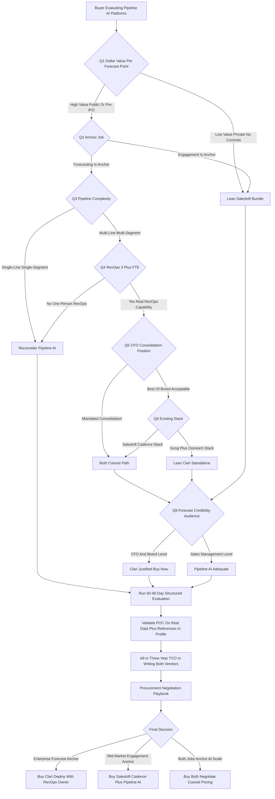

### Direct Answer

**Salesloft Pipeline AI and Clari are not the same product with different logos -- they are answers to two different jobs-to-be-done, and the buyer who picks correctly picks based on which job is the anchor, not on which vendor ran the louder demo.** Clari is a dedicated revenue platform built to give a CRO a board-defensible quarterly forecast; Salesloft Pipeline AI is a forecasting layer on top of the Cadence sequencing platform that gives mid-market AEs an integrated daily operating system. **The honest verdict: Pipeline AI is not worth buying as a Clari replacement for an enterprise multi-line forecast org, but it is genuinely worth buying as a Cadence add-on for the sequencing-anchored mid-market buyer.**

**TL;DR:** Clari (founded 2012, ~$540M raised, ~$170M-$220M ARR, ~1,300 enterprise customers, $2.6B last valuation) wins for $100M+ ARR enterprises with multi-line forecasts, dedicated 3+ FTE RevOps, and board-grade earnings exposure -- keep Salesloft Cadence underneath as the engagement layer. Salesloft Cadence + Pipeline AI (Salesloft acquired by Vista Equity Partners in March 2022 for $2.3B, now ~$300M-$380M ARR, ~5,000 customers) wins for $30M-$300M ARR sequencing-anchored mid-market businesses with single-line forecasts and a 1-2 person RevOps function. The asymmetric mistake -- replacing a working Clari deployment with Pipeline AI to chase an $80K-$200K license saving -- destroys 4-8 points of forecast accuracy and burns $300K-$900K in switching cost. Run the eight-question buying lens, map your buyer profile honestly, do the dollar math on accuracy, and the right vendor becomes obvious in under sixty minutes.

## 1. The Two Jobs-To-Be-Done Framing That Cuts Through The Marketing Fog

Most failed RevTech procurement decisions in this category trace to one root error: the buyer let the two vendors define the comparison instead of defining it themselves. Both Clari and Salesloft will gladly position into "the AI revenue platform" because the marketing surface is broad enough to swallow either pitch, and an evaluation that starts on the vendor's terrain ends with the buyer choosing between two products that are not actually comparable on the dimensions that matter.

### 1.1 Job One -- Earn A Board-Defensible Forecast

**Job one is to produce a defensible quarterly revenue forecast that the CRO, CFO, and board will trust under public-company scrutiny.** This is the job Clari was founded to do thirteen years ago. The entire R&D budget points at it, and the resulting platform reflects that focus: multi-line roll-ups, executive forecast cadence, deal-by-deal slip analysis, RevOps configurability, the agentic Conductor layer that drafts QBR scaffolds, and integration breadth into ERP and data warehouse. The customer base is public-company CROs who chose Clari precisely because they were tired of getting forecast accuracy wrong on the earnings call.

### 1.2 Job Two -- Run A Daily Revenue Operating System

**Job two is to give every revenue rep -- SDR, AE, manager, RevOps -- an integrated daily operating system that runs sequencing, captures conversations, manages the deal record, and produces a forecast view good enough for management decisions.** This is the job Salesloft has done since 2011, with Pipeline AI added in 2023-2025 as the forecasting capability that completes the daily-operating-system pitch.

### 1.3 Why Naming The Anchor Job Ends The Debate

Once these two jobs are written down, the question stops being "Salesloft Pipeline AI vs Clari" and becomes "is my anchor job earning forecast credibility or running a daily revenue operating system." The answer, for any specific organization, is almost always obvious. The trap is the buyer who answers "both, equally" -- because the bundle that tries to be best-in-class at both jobs costs more than expected, deploys slower than promised, and underperforms the dedicated tool at whichever job the organization actually needed more. A useful adjacent read on consolidation pressure is whether to stay best-of-breed or collapse the stack (q1870).

## 2. A Precise Account Of What You Are Actually Buying

Both vendors blur category language deliberately, so a buyer must inventory exactly what is in the box before negotiating.

### 2.1 Clari Is A Five-Module Platform

**Clari in 2027 is a five-module platform.** **Forecast** is the headline module -- configurable multi-line roll-ups, AI-generated commit and risk calls, scenario modeling, snapshot and waterfall analysis, and the executive cadence surface. **RevDB** is the underlying data lake unifying activity, deal, account, and interaction data across Salesforce, email, calendar, conversation intelligence, sales engagement, ERP, and the data warehouse. **Deals** is the deal-inspection workspace -- deal scoring, risk signals, conversation snippets, and the structured view a deal manager uses to inspect 30-80 active opportunities. **Mutual Action Plans / Deal Rooms** (the DealPoint surface, acquired 2023) is the buyer-seller collaboration layer with shared timelines, document repositories, and buyer-side analytics. **Conductor** (announced 2024, GA through 2025-2026) is the agentic AI layer that proactively updates deals, drafts follow-ups, prepares pre-meeting briefs, and generates QBR scaffolds.

### 2.2 Salesloft Is A Four-Module Platform

**Salesloft in 2027 is a four-module platform.** **Cadence** is the anchor -- sequencing of calls, emails, LinkedIn, SMS, and AI-suggested multi-channel outreach, the daily operating system for the SDR floor. **Conversations** is the call recording, transcription, and analysis layer. **Deals** is the pipeline management surface. **Pipeline AI** is the 2024-2025 forecasting layer that surfaces forecast risk and produces a forecast view, positioned as the natural extension of the Cadence + Conversations + Deals base. Underneath sits **Rhythm**, the signal-based prioritization engine.

### 2.3 The Honest Comparative Summary

**Clari is a forecasting platform with a deep agentic and inspection surface that integrates with sequencing tools; Salesloft is a sequencing platform with a forecasting surface that competes on bundle economics and workflow integration.** Both are competent at their anchor job; neither is a complete substitute for the other.

| Vendor | Anchor Module | Forecasting Role | Conversation Intelligence | Agentic Layer | Best-Fit Buyer |
|---|---|---|---|---|---|
| Clari | Forecast | Core, multi-line, board-grade | Wingman + Gong/Chorus integrations | Conductor (autonomous deal updates) | Enterprise CRO, $100M+ ARR |
| Salesloft | Cadence | Add-on, single-line, management-grade | Salesloft Conversations (native) | Rhythm (signal prioritization) | Mid-market VP Sales, $30M-$300M ARR |

## 3. The Eight-Question Buying Lens That Produces An Answer In Sixty Minutes

A serious buyer can compress this entire decision into eight explicit questions that, answered honestly, point at a vendor with little ambiguity.

### 3.1 Questions One Through Four -- The Capability Anchor

**Question one: what is your forecast variance today, and what is one percentage point of accuracy worth in dollar terms?** Calculate the absolute percentage difference between committed forecast at quarter-start and actual closed revenue at quarter-end across four to six quarters; that is your baseline. A public company with $500M ARR may attach $5M-$20M of board credibility per point; a private $80M ARR business with no external commitments may attach near-zero. **Question two: which job is the anchor -- forecast precision or AE workflow integration?** If the CRO is getting beaten up in board meetings on forecast misses, the anchor is forecasting. If the VP of Sales is fighting low SDR productivity, the anchor is engagement. **Question three: how complex is your pipeline?** Single-product, single-segment businesses need less platform depth; multi-product, multi-segment, multi-geography businesses demand the configurability Clari was built for. **Question four: does a real RevOps function exist?** A 3+ FTE RevOps team can extract value from Clari; a 1-person function will under-utilize it within twelve months.

### 3.2 Questions Five Through Eight -- The Political And Stack Reality

**Question five: what is the CFO mandating -- best-of-breed or consolidation?** Many 2027 CFOs explicitly demand RevTech consolidation; defending a separate Clari purchase to a consolidation-mandated CFO is a hard internal sell. **Question six: what conversation-intelligence and CRM stack already exists?** A buyer running Gong + Salesforce + Outreach can layer Clari naturally; a buyer running Salesloft Cadence + Conversations + Salesforce will find adding Clari more disruptive than adding Pipeline AI. **Question seven: what is the 36-month consolidation roadmap?** A buyer planning to consolidate engagement + conversation + forecasting leans Salesloft; a buyer keeping best-of-breed leans Clari. **Question eight: is forecast credibility a CFO/board concern or a sales-management concern?** If misses land on the earnings call, the dollar value of accuracy is high and Clari's premium is justified. If misses land in the Monday sales meeting, Pipeline AI's adequacy is sufficient.

| Question | Points To Clari When | Points To Salesloft When |
|---|---|---|
| Q1 Dollar value per point | High (public/pre-IPO/PE-backed) | Low (private, no external commits) |
| Q2 Anchor job | Forecast precision | AE workflow integration |
| Q3 Pipeline complexity | Multi-line, multi-segment | Single-line, single-segment |
| Q4 RevOps function | 3+ FTE technical depth | 1-2 FTE operational focus |
| Q5 CFO mandate | Best-of-breed acceptable | Consolidation mandated |
| Q6 Existing stack | Gong + Outreach + Salesforce | Salesloft Cadence + Conversations |
| Q7 36-month roadmap | Best-of-breed maintained | Bundle consolidation |
| Q8 Credibility audience | CFO and board level | Sales-management level |

## 4. The Forecast Variance Math -- Translating Accuracy Into Dollar ROI

Forecast variance is the central metric in this category and the dimension where Clari most consistently beats Salesloft Pipeline AI in published deployments.

### 4.1 The Metric Definition And Benchmark Range

**Forecast variance is the absolute percentage difference between revenue committed at the start of a period and revenue actually closed: variance equals abs of committed minus actual, divided by committed.** A 10 percent variance on a $50M committed quarter means actual landed between $45M and $55M. Spreadsheet-only forecasting produces 15-25 percent variance. Salesforce Reports plus manual updates produces 12-20 percent. Salesloft Pipeline AI in mature deployments produces 8-14 percent. Clari in mature enterprise deployments produces 4-9 percent, with a best-in-class ceiling near 3-6 percent.

| Forecasting Approach | Variance Range | Maturity Required | Annual Forecast-Error Swing on $200M ARR |
|---|---|---|---|
| Spreadsheet-only baseline | 15-25% | Day 1 | $30M-$50M |
| Salesforce Reports + manual updates | 12-20% | 6-12 months | $24M-$40M |
| Salesloft Pipeline AI (mature) | 8-14% | 6-12 months | $16M-$28M |
| Clari (mature enterprise) | 4-9% | 12-18 months | $8M-$18M |
| Best-in-class Clari (Adobe / Okta class) | 3-6% | 18-30 months | $6M-$12M |

### 4.2 The Dollar Translation

**An organization at $200M ARR with 13 percent variance commits $50M per quarter and lands in a $43.5M-$56.5M band; a seven-point improvement to 6 percent compresses that band to $47M-$53M.** The annualized forecast-error swing reduction is roughly $14M, against a Clari-vs-Pipeline-AI license differential of $80K-$200K per year on a 200-300 rep deployment. The ROI multiplier is 70x-175x in raw forecast-error terms before secondary benefits like board credibility, earnings-guidance protection, and capital-allocation precision.

### 4.3 The Qualifier That Collapses The Math

**This math only matters if forecast accuracy has real dollar consequences.** A private mid-market business with no external commitments may attach near-zero dollar value, and for that buyer the math collapses and the cheaper bundle wins. A public company, a pre-IPO company building a track record, or a private company with growth-equity investors enforcing forecast discipline attaches substantial dollar value and the math heavily favors Clari. The discipline is to bring the variance baseline, the dollar value per point, and the realistic accuracy delta into the CFO conversation explicitly.

## 5. The Pricing And TCO Comparison At Two Realistic Scales

Pricing in this category is intentionally opaque, but a serious buyer can triangulate from analyst reports, peer procurement conversations, and structured discovery.

### 5.1 The Realistic 2027 Pricing Landscape

| TCO Component | Clari (Enterprise) | Salesloft Cadence | Salesloft Pipeline AI Add-On | Notes |
|---|---|---|---|---|
| Per-rep license per month | $80-$180 | $100-$160 | $30-$70 (on top of Cadence) | Volume discounts engage at 200+ seats |
| Executive / leader seat | $150-$300 | included | included | Clari sometimes prices CRO/SVP seats separately |
| Conversation intelligence add-on | $30-$60/rep (Wingman) | included | n/a | Clari acquired Wingman 2022 |
| Mutual action plans / deal rooms | included or $20-$50/rep | not native | not native | Clari acquired DealPoint 2023 |
| Conductor agentic layer | included or $20-$40/rep | n/a | n/a | Clari Conductor announced 2024 |
| Implementation fee (one-time) | $25K-$120K | $10K-$40K | $5K-$20K | Realistic out-the-door is 30-60% above quoted |
| Premium support tier uplift | 15-25% on base | 10-20% on base | 10-20% on base | Named CSM and executive escalation |
| Annual renewal uplift (typical) | 8-12% (negotiable to 3-5%) | 7-10% | 7-10% | Negotiate cap in writing on initial deal |
| Typical 200-rep year-1 all-in | $250K-$650K | $300K-$450K | $400K-$600K (Cadence + Pipeline AI) | Range reflects modules selected |
| Typical 500-rep year-1 all-in | $500K-$1.4M | $700K-$1.0M | $900K-$1.4M | Larger deployments compress per-rep economics |

### 5.2 The Bundle-Math Insight That Surprises Buyers

**At enterprise scale the bundle math lands closer to Clari than the surface comparison suggests.** A 500-rep enterprise running full Salesloft Cadence + Pipeline AI + Conversations is in the $900K-$1.4M band, and a comparable Clari deployment is in the $500K-$1.4M band -- the same TCO ballpark with materially different forecasting depth. Where Clari is genuinely more expensive is at the full-suite ceiling, where adding Conductor + Wingman + DealPoint pushes the all-in number toward $1.8M. The mid-market story is different: at 50-150 reps and a $30M-$150M ARR business, the Salesloft bundle often genuinely saves $50K-$200K per year over equivalent Clari plus a separate sequencing tool.

### 5.3 The Hidden Cost Lines Neither Vendor Volunteers

**The realistic three-year TCO for a serious enterprise deployment lands 40-80 percent above the headline license number.** Implementation services run 30-60 percent above the quoted figure. Ongoing professional services recur at $20K-$60K per year. CRM hygiene is a load-bearing prerequisite at $50K-$200K. The platform justifies 1-3 additional RevOps headcount at $130K-$220K loaded cost each. Adoption and training programs add $40K-$120K per year. Premium support adds 15-25 percent on base. Renewal uplift compounds at 8-12 percent unless capped.

| Hidden Cost | Realistic Range | Why It Is Missed |
|---|---|---|
| Implementation services uplift | 30-60% above quoted | Custom config and data cleanup excluded from quote |
| Ongoing professional services | $20K-$60K/year | Re-tuning treated as optional |
| CRM hygiene prerequisite | $50K-$200K | Assumed clean data |
| Additional RevOps headcount | $130K-$220K/FTE loaded | Platform sold as self-running |
| Adoption / training program | $40K-$120K/year | Soft cost not on procurement sheet |
| Renewal uplift compounding | 8-12%/year unless capped | Year-one focus hides year-four cost |

## 6. The Customer Profile Match That Determines Success Or Regret

The single most useful diagnostic a buyer can run is mapping their own organization against the customer profile each vendor genuinely serves -- because both companies will sell to anyone but only one will fit any given buyer.

### 6.1 Clari's Natural Customer Profile

**Series-D-and-up enterprise revenue organizations, typically $100M ARR and above, with a dedicated 3+ FTE RevOps team, a formal weekly forecast meeting and structured QBR, multi-line pipeline, and earnings or board accountability for forecast accuracy.** Reference customers cluster here: Adobe (NASDAQ: ADBE) with $20B revenue and multi-product complex forecasting, Workday (NASDAQ: WDAY) on an enterprise-only motion, Okta (NASDAQ: OKTA) in security IAM enterprise sales, Zoom (NASDAQ: ZM) on a post-pandemic forecasting reset, Cisco (NASDAQ: CSCO) on broader enterprise IT forecasting, plus ServiceNow (NYSE: NOW) and Snowflake (NYSE: SNOW) on parts of their RevTech.

### 6.2 Salesloft's Natural Customer Profile

**$30M-$300M ARR mid-market and lower-enterprise organizations where the sequencing tool is the anchor RevTech investment, the SDR organization is a primary growth lever, the AE motion is broadly transactional or velocity-driven, RevOps is a 1-2 FTE function, and forecasting is single-line and rolled up by the VP of Sales.** Reference customers cluster in growth-stage SaaS, B2B mid-market technology, and professional services firms scaling outbound. For context on Salesloft's competitive positioning against bundled CRM suites, see how Salesloft defends against HubSpot Sales Hub bundling (q1855) -- HubSpot trades as NYSE: HUBS.

### 6.3 Where Regret Lives -- The Mismatch Zone

**The buyer-profile mismatch is the single most reliable predictor of renewal failure.** An enterprise CRO at a $500M multi-product business buying Pipeline AI to save license cost discovers within two quarters that the forecast roll-up does not handle their hierarchy -- they either supplement with Clari (paying for both) or churn back to spreadsheets. A growth-stage VP of Sales at $80M ARR buying full Clari discovers 60 percent of the platform sits unused and the per-rep cost is impossible to defend internally. The buyer who maps honestly first wins.

## 7. Five Concrete Buyer Scenarios That Make The Decision Tangible

Concrete scenarios anchor the abstract logic across the realistic distribution of buying situations a 2027 evaluator will face.

### 7.1 Priya -- $450M ARR Public SaaS, Data Infrastructure

CRO with a 380-rep global org, 7-person RevOps team, multi-line business, quarterly earnings guidance, variance running 11-13 percent and worsening, existing Salesloft Cadence + Gong + Salesforce stack. **Decision: buy Clari Forecast + Deals, keep Salesloft Cadence for the SDR motion underneath.** The forecast-accuracy math alone justifies the premium, the multi-line roll-up makes Pipeline AI a non-starter, and the engagement stack stays in place. Outcome at month 18: variance compresses to 6-7 percent and the CFO reports payback inside one fiscal quarter on forecast accuracy alone.

### 7.2 Hassan -- $85M ARR Growth-Stage Vertical SaaS, Construction Tech

VP of Sales with a 38-rep team, 1-person RevOps function, single-product velocity-AE motion, forecasting today a Salesforce report plus a Friday commit call. **Decision: buy Salesloft Cadence + Pipeline AI as the bundle, defer Clari until $200M ARR.** The bundle solves the genuine anchor need (SDR sequencing), Pipeline AI delivers competent forecasting well above the spreadsheet baseline, and Clari at this scale would be $250K-$400K of unused depth. Outcome at month 18: SDR productivity up, variance from 18 percent to 11 percent.

### 7.3 Lucia -- $1.6B ARR Multi-Business-Unit Enterprise, Healthcare IT

SVP of Sales for the cardiology-imaging line, Clari deployed enterprise-wide for three years, asking whether her line could move to Pipeline AI to save line-budget. **Decision: stay on Clari unconditionally.** The line-of-business roll-up into the consolidated multi-BU forecast requires the same platform across lines; switching one line breaks the executive cadence and creates a reconciliation problem the CFO will not tolerate. The ~$120K line-budget saving does not survive the cross-BU reconciliation cost.

### 7.4 Tariq -- $180M ARR Mid-Market, Already On Cadence + Conversations

VP of RevOps deciding whether to add Pipeline AI or buy Clari standalone. **Decision: add Pipeline AI as the starter forecasting capability, evaluate Clari at the $300M ARR threshold.** The bundle economics work at current scale, the forecasting need is genuinely single-line, the Cadence-Conversations-to-Pipeline-AI integration is meaningful, and a Clari decision now would be premature. Deferring is the disciplined call.

### 7.5 Esme -- $720M ARR Public SaaS, Security

Newly hired CRO inheriting an 18-month-old Pipeline AI deployment producing 14-16 percent variance and failing the board. **Decision: migrate to Clari, accept the $400K-$700K switching cost, communicate the migration as a forecast-credibility investment.** The cost of continued credibility damage exceeds the migration cost, and the board will support the corrective action when framed honestly.

| Scenario | ARR | Anchor Job | Decision | Variance Outcome |
|---|---|---|---|---|
| Priya | $450M | Forecasting | Clari greenfield + keep Cadence | 12% to 6-7% |
| Hassan | $85M | Engagement | Cadence + Pipeline AI bundle | 18% to 11% |
| Lucia | $1.6B | Forecasting | Hold Clari, reject line-switch | Maintained |
| Tariq | $180M | Engagement | Add Pipeline AI, defer Clari | Single-line adequate |
| Esme | $720M | Forecasting | Clari migration turnaround | 15% back to target |

## 8. The Side-By-Side Capability Matrix On The Dimensions That Matter

A structured capability matrix cuts through the marketing-language problem and lets a buyer compare like-for-like on the dimensions that genuinely affect the day-two experience.

### 8.1 The Sixteen-Dimension Comparison

| Capability Dimension | Clari | Salesloft Pipeline AI | Practical Winner |
|---|---|---|---|
| Single-line forecast accuracy | Excellent (4-9%) | Good (8-14%) | Clari |
| Multi-line forecast roll-up | Excellent (native) | Limited (single-line oriented) | Clari |
| Executive QBR pipeline review | Excellent (purpose-built) | Adequate | Clari |
| Mutual action plans / deal rooms | Native (DealPoint 2023) | Not native | Clari |
| Conversation intelligence depth | Excellent (Wingman + integrations) | Native (Salesloft Conversations) | Tie (different shapes) |
| Sales engagement / sequencing | Integrations (Outreach, Apollo) | Native (Salesloft Cadence) | Salesloft |
| CRM integration depth | Excellent (Salesforce, HubSpot, Dynamics) | Excellent for Salesforce, lighter elsewhere | Clari |
| ERP integration (NetSuite, SAP, Workday) | Native | Limited / API-level | Clari |
| Data warehouse integration | Native (Snowflake, Databricks) | Limited / API-level | Clari |
| Marketing automation integration | Native through RevDB | Limited | Clari |
| Agentic AI / autonomous workflow | Clari Conductor | Salesloft Rhythm (prioritization) | Clari (in forecasting context) |
| RevOps configurability | Excellent | Adequate | Clari |
| Per-rep TCO at enterprise scale | $80-$180/rep/month | $130-$230/rep/month bundled | Salesloft |
| Implementation time to first value | 8-16 weeks | 6-12 weeks | Salesloft |
| Time to mature forecast accuracy | 9-15 months | 6-12 months | Salesloft (lower bar) |
| Buyer fit -- mid-market sequencing-anchored | Adequate (often overkill) | Strong | Salesloft |

### 8.2 The Matrix Conclusion

**Clari wins on forecasting depth, executive cadence, integration breadth, and the agentic roadmap. Salesloft wins on bundle economics for sequencing-anchored buyers, faster deployment, and the integrated SDR-to-forecast workflow.** The decision is not which platform is better in some abstract Forrester-Wave sense -- both are competent products run by serious companies -- but which fits the specific buyer's profile, motion, and forecasting maturity.

## 9. What Clari Does That Salesloft Pipeline AI Genuinely Cannot Match

A buyer should be specific about the capabilities that genuinely differentiate Clari, because vague comparisons let either vendor win on rhetoric.

### 9.1 Multi-Line Roll-Ups And Executive QBR Depth

**Multi-line-of-business forecast roll-ups with separate hierarchies.** A $500M ARR enterprise with new logo, expansion, renewal, professional services, and channel revenue needs five separate roll-ups that ladder into a consolidated CRO-level forecast, with different forecast methodologies per line. Clari was architected around this primitive; Pipeline AI handles single-line competently but the multi-line depth is materially shallower. **Executive QBR-grade pipeline review.** The quarterly business review the CRO presents to the board needs a defensible narrative scaffolded around pipeline-by-stage analysis, deal-by-deal slip analysis, win-rate trends, and segment-by-segment performance. Clari has built this surface for a decade; it is a first-class product surface, not a dashboard tab.

### 9.2 Deal Rooms, Configurability, And ERP Integration

**Mutual action plans and deal rooms with buyer-side analytics.** The DealPoint acquisition in 2023 added a buyer-seller collaboration layer with shared timelines, document repositories, and analytics on which buyer-side stakeholders engaged with which materials. Salesloft has no comparable native surface. **RevOps-grade configurability.** Custom forecast categories, hierarchies, fields, dashboards, and roll-up logic that fit the actual business -- Clari's configuration depth substantially exceeds Pipeline AI's. **ERP and data warehouse integration breadth.** Native integration into NetSuite, SAP, Workday, Snowflake, Databricks, and BigQuery means the forecast can be reconciled against ERP actuals; Pipeline AI's footprint is much shallower outside the CRM-and-engagement core.

### 9.3 The Conductor Agentic Layer In Context

**Conductor proactively updates deals based on activity signals, drafts follow-up emails grounded in conversation history, prepares pre-meeting briefs, and generates QBR scaffolds.** In the forecasting context this is materially ahead of Salesloft Rhythm, which is a competent signal-based prioritization engine inside Cadence but is not designed to drive the forecasting and inspection workflow. The honest summary: the Clari premium buys real, defensible capability depth; the buyer who needs it gets value, the buyer who does not overpays.

## 10. What Salesloft Pipeline AI Does That Justifies The Bundle

The case for Salesloft Pipeline AI is real for the right buyer, and a balanced analysis must articulate it as honestly as the Clari differentiation.

### 10.1 Native Integration And Adoption Inheritance

**The Cadence integration is genuinely native, not stitched.** Pipeline AI surfaces sequencing activity, response rates, and engagement signals from Cadence directly into the forecast view -- a buyer running sequencing as the primary AE motion gets a forecast grounded in actual outreach behavior. **The Conversations integration is built in, not bolted on.** Salesloft Conversations lives inside the same platform and feeds Pipeline AI without an integration project. **User adoption is often higher because the AE is already in Cadence.** The forecast surface is one click from the daily sequencing workflow, and adoption is the single biggest predictor of forecast-accuracy realization in production. For context on how Salesloft's conversation layer competes with standalone players, see whether Salesloft conversation marketing beats Drift standalone competitors (q1859).

### 10.2 Bundle Economics And Procurement Simplicity

**The pricing is materially lower for the modest-need buyer.** A $30M-$150M ARR business that needs competent forecasting plus best-in-class sequencing genuinely saves money on the Salesloft bundle versus separate Clari and Outreach licenses. **The bundle simplifies procurement, contract management, and support escalation** -- one vendor, one master agreement, one renewal cycle, one support path, one CSM relationship. For a lean RevOps function this operational simplification matters more than the forecasting-depth gap. The strategic question of what Salesloft should do with its acquired Drift asset informs the bundle roadmap (q1858).

### 10.3 Faster Deployment And The Right Framing

**The implementation is faster.** A Pipeline AI add-on on an existing Cadence deployment can be live in 6-12 weeks; a greenfield Clari deployment runs 8-16 weeks. **Salesloft Pipeline AI is not trying to be Clari, and it does not need to be Clari to win the buyers it is built for.** The mistake is letting the Salesloft team frame Pipeline AI as a Clari replacement for an enterprise buyer for whom Clari is genuinely right; the equally serious mistake is dismissing the Pipeline AI proposition for the mid-market buyer for whom the bundle is materially better.

## 11. The Switching Cost Reality -- Why Replacing Either Platform Hurts

A buyer evaluating a switch must price the migration honestly, because the switching cost is genuinely high and is the most consistently underweighted line in the procurement business case.

### 11.1 The Six Cost Components

**Data migration cost.** Years of historical pipeline data, deal history, forecast snapshots, custom fields, and configured hierarchies have to move or be left behind; reconstructing the equivalent configuration takes 60-180 days of RevOps time plus a $50K-$150K consultant engagement. **Integration rebuild cost.** A typical enterprise carries 8-15 integrations to rebuild at 2-6 weeks each, stretching to 6-9 months even with parallel work streams. **User retraining cost.** Muscle memory built over 12-36 months is real value being destroyed; adoption typically dips for 4-8 months post-switch. **Forecast-credibility hit during the migration window.** Forecast quality degrades exactly when board confidence is most fragile. **RevOps opportunity cost.** The migration consumes 60-80 percent of RevOps bandwidth for 6-9 months. **The total honest cost.** For a 200-500 rep enterprise, $300K-$900K all-in; above 500 reps it can pass $1M.

| Switching Cost Component | Range | Calendar Impact |
|---|---|---|
| Data migration and reconstruction | $50K-$150K consultant + RevOps time | 60-180 days |
| Integration rebuild (8-15 systems) | Bundled in RevOps cost | 6-9 months |
| User retraining and adoption rebuild | Productivity dip | 4-8 month dip |
| Forecast-credibility hit | Real but unquantifiable | 1-2 quarters |
| RevOps opportunity cost | 60-80% of team bandwidth | 6-9 months |
| Total (200-500 rep enterprise) | $300K-$900K all-in | 9-12 months end-to-end |

### 11.2 The Asymmetric Mistake

**A $80K-$200K annual license-cost saving from switching does not justify a $300K-$900K migration when forecast-quality and credibility risks are added in.** The buyer should switch only when the incumbent platform has genuinely failed -- not adopted, vendor exiting market, fundamental capability gap, vendor relationship broken -- not for marginal license-cost arbitrage. "Save $150K to spend $600K to lose two quarters of forecast credibility" is the single most common procurement disaster in this category.

## 12. The Vendor Risk Profile Underneath The Product

A buyer committing to a multi-year RevTech platform must evaluate the vendor risk on each side, because a platform decision is also a multi-year bet on the vendor's runway, ownership stability, and acquisition exposure.

### 12.1 Clari Vendor Risk

**Clari is venture-backed across multiple rounds led by Sapphire, Sequoia, B Capital, Bain Capital Ventures, Tenaya, Northgate, and Madrona; total raised roughly $540M; revenue band $170M-$220M ARR; headcount 700-900; last public valuation $2.6B at the early-2022 Series F.** The 2022 Wingman acquisition, the 2023 DealPoint acquisition, and the 2024 Conductor announcement show continued platform ambition. The risk: Clari is private and could pursue an IPO, a strategic acquisition by Salesforce, Microsoft (NASDAQ: MSFT), or ServiceNow, or a private-equity recapitalization. The mitigation: the customer base is too valuable to disrupt destructively in a change-of-control scenario.

### 12.2 Salesloft Vendor Risk

**Salesloft was acquired by Vista Equity Partners in March 2022 for $2.3B at roughly $200M ARR; current revenue band $300M-$380M ARR; headcount 1,000-1,200; customer count roughly 5,000.** Vista operates a portfolio strategy emphasizing operational discipline and eventual exit within typical PE hold periods of 5-7 years. The risk: PE ownership tends to optimize cash flow over R&D pace, and a change-of-control event is plausible in 2027-2029. The mitigation: Vista has a long enterprise-software track record (Tibco, Marketo, Apptio) and Salesloft has continued shipping product including the Pipeline AI investment. The international-growth dynamics under Vista cost discipline are worth a separate look (q1861), as is the gross-margin trajectory through 2028 (q1864).

### 12.3 Comparative Risk Assessment

**Both vendors are operating businesses with multi-year runways; neither presents existential vendor risk in a 3-5 year horizon.** The relative profile favors Clari modestly on R&D pace and Salesloft modestly on financial stability, and is broadly neutral on change-of-control risk. Neither is a "safe boring choice" or a "risky bet" -- both are real platforms with real customer bases and real ownership dynamics a buyer should evaluate explicitly.

## 13. The Procurement Negotiation Playbook For Either Vendor

A buyer who has done the analysis and chosen a platform should negotiate aggressively, because published list prices are starting positions and procurement leverage in this category is substantial.

### 13.1 The Pricing And Renewal Levers

**Get a credible competing quote** even if you have chosen a platform -- the deal economics shift when the vendor knows you have an alternative. **Negotiate per-rep price aggressively at scale:** 200+ seat deals have 15-30 percent discount room, 500+ seat deals 25-40 percent, 1,000+ seat deals 35-50 percent. **Negotiate the implementation fee toward zero** -- it is often negotiable to zero in competitive deals. **Negotiate the renewal cap in writing on the initial deal** -- a 3-5 percent annual cap versus the 8-12 percent the vendor pushes often saves more over the term than any other concession.

| Negotiation Lever | Realistic Win | Where It Applies |
|---|---|---|
| Per-rep discount, 200+ seats | 15-30% off list | All enterprise deals |
| Per-rep discount, 500+ seats | 25-40% off list | Large enterprise |
| Per-rep discount, 1,000+ seats | 35-50% off list | Global enterprise |
| Implementation fee | Toward zero | Competitive deals |
| Renewal cap in writing | 3-5% vs 8-12% | Initial master agreement |
| Quarter-end timing premium | Additional 5-10% | Last two weeks of vendor quarter |

### 13.2 The Structural And Timing Levers

**Negotiate a multi-year discount with break-rights** -- a 3-year deal at 15-25 percent discount with a 12-month break right captures the price benefit without the long lock-in. **Bundle add-ons strategically up front** -- conversation intelligence, deal rooms, premium support negotiated into the initial deal discount more aggressively than incremental add-ons. **Time the deal to the vendor's quarter-end** -- both Clari and Salesloft are quarter-driven sellers. **Get integration work in scope with named deliverables** to protect against a scope-creep services bill. **Negotiate explicit data-portability rights** as future protection against a switch. A serious enterprise procurement function can typically extract 25-45 percent off a vendor's first proposal.

## 14. The Build-Versus-Buy Question And Why Build Almost Always Fails

Some sophisticated revenue organizations evaluate building a forecasting capability internally; a buyer should understand why this rarely works.

### 14.1 The Temptation And Why It Fails

**The temptation:** a revenue org with a good data team, a clean Salesforce instance, a Snowflake or Databricks warehouse, and a BI tool can imagine building a forecasting model with dbt, a feature store, Python, and the BI tool for the executive surface. **Why it fails:** the forecasting model is not the hard part. The hard part is the operating cadence, the executive UX, the deal-by-deal inspection workflow, the mutual action plan surface, the change management, the rep adoption, and the years of model refinement against actual outcomes. The vendor has had 13 years to refine these surfaces against thousands of deployments; the internal team starts at zero.

### 14.2 The Cost Comparison And Verdict

**Budget 2-4 data engineers, 1-2 analytics engineers, 1 product manager, and 1 designer over 18-30 months for the v1 build; 3-5 FTEs for ongoing maintenance.** Loaded cost: $1.5M-$3.5M for v1, $800K-$1.8M per year ongoing. This dwarfs the Clari license at any plausible deployment size. **Internal build genuinely makes sense only for truly idiosyncratic businesses** (novel usage-based monetization no vendor serves) or very large organizations ($5B+ revenue with 50+ data engineers and a build culture). For 99 percent of buyers the build path costs more, takes longer, and delivers less. The verdict: buy, negotiate hard, and use the in-house data team to extend the platform rather than recreate it.

## 15. How To Run A Disciplined Sixty-To-Ninety-Day Evaluation

A buyer should run a structured evaluation rather than relying on vendor demos and reference calls, because the vendor-controlled experience deliberately obscures the gaps.

### 15.1 Criteria, Discovery, And Proof-Of-Concept

**Step one: write the evaluation criteria upfront, before any vendor conversation** -- the eight buying questions, the customer-profile match, the variance baseline, the all-in TCO target, and deal-breaker capability requirements documented in a procurement charter the CRO, CFO, CIO, and VP of RevOps sign off on. **Step two: run structured discovery with both vendors on identical criteria** -- same questions, same data, same scenarios. **Step three: run a sandbox or POC on real data, not vendor demo data** -- both vendors support a 30-60 day POC on a sanitized subset of your actual pipeline; the POC should produce a real forecast against a real historical quarter.

### 15.2 References, Validation, And Decision

**Step four: run reference calls with customers in your specific profile, not the marquee logos** -- your size band, your industry, your motion, deployed in the last 18 months. **Step five: validate every claimed integration on your actual stack** field-by-field, not the marketing checkmark. **Step six: get the all-in three-year TCO in writing** under both 8-12 percent and 3-5 percent renewal scenarios. **Step seven: validate the change-management plan with the same rigor as the technology plan.** **Step eight: run the procurement negotiation playbook.** **Step nine: decision and stakeholder sign-off** by the CRO, CFO, CIO, and head of RevOps based on the documented evaluation, not the louder demo.

| Evaluation Step | Owner | Output |
|---|---|---|
| 1. Criteria charter | VP RevOps + CRO | Signed procurement charter |
| 2. Structured discovery | RevOps | Identical-criteria vendor responses |
| 3. POC on real data | RevOps + IT | Forecast vs actual on historical quarter |
| 4. Reference calls in profile | CRO | Risk-adjusted vendor read |
| 5. Integration validation | IT | Field-by-field sync confirmation |
| 6. All-in three-year TCO | Procurement | Written TCO both renewal scenarios |
| 7. Change-management plan | Enablement | Named-owner adoption plan |
| 8. Negotiation playbook | Procurement | 25-45% off first proposal |
| 9. Decision and sign-off | CRO, CFO, CIO, RevOps | Documented platform choice |

## 16. The 2027-2030 Category Outlook And What It Means Today

A buyer committing to a multi-year platform should have a documented view on where the category goes next, because the platform chosen in 2027 should still be right in 2030.

### 16.1 Agentic AI And Conversation-Intelligence Convergence

**The agentic-revenue thesis is mainstream and accelerating.** Both Clari (Conductor) and Salesloft (Rhythm plus agentic roadmap) are investing in autonomous deal updates, email drafting, QBR preparation, and increasingly autonomous deal advancement with rep supervision. The 2030 bet is that the AE's day moves from "manage 30 deals manually" to "supervise an agentic system managing 80 deals." **Conversation intelligence converges toward commodity** -- Gong, Chorus, Wingman, Salesloft Conversations, and others have converged on comparable analysis; the differentiation has moved to deal-context integration depth. Whether Gong should acquire Chorus to consolidate the conversation-intelligence layer is a live category question (q1866).

### 16.2 Accuracy Gap, Consolidation, And Acquisition Risk

**The forecasting-accuracy gap narrows but does not close** -- Pipeline AI's accuracy improves over 24-36 months, compressing the gap to Clari from 5-7 points today to perhaps 3-5 by 2029, but the directional advantage stays with Clari through 2030. **Platform consolidation pressure intensifies** as CFOs push back on RevTech sprawl with explicit consolidation mandates, gaining share for the bundle thesis in mid-market and lower-enterprise. **Acquisition is plausible on both sides within 36 months** -- a Salesforce, Microsoft, or ServiceNow acquisition would reshape the category; whether Clari itself should acquire Drift is one such live scenario (q1868). Buyers should evaluate each vendor's standalone roadmap and assume acquisition risk is real but not imminent.

## 17. The Honest Final Recommendation Framework

Pulling the entire analysis into a single recommendation framework that produces a defensible answer for any specific buyer.

### 17.1 The Buy Recommendations

**Buy Clari if** you are an enterprise revenue organization with $100M+ ARR, multi-line forecasting needs, a dedicated 3+ FTE RevOps function, a structured executive QBR cadence, and earnings-or-board-credibility pressure on forecast accuracy. The price premium is justified by genuine capability differentiation and the dollar math heavily favors the dedicated platform. **Buy Salesloft Cadence + Pipeline AI if** you are a $30M-$300M ARR organization where sequencing is the anchor RevTech investment, the AE motion is velocity-driven, RevOps is a 1-2 person function, and the forecasting need is single-line and modest. **Buy both coexisting if** you are a large enterprise already running Salesloft Cadence for the SDR organization and wanting Clari for executive forecasting -- they coexist well and the combined cost is justified at scale.

### 17.2 The Do-Not Recommendations

**Do not buy Salesloft Pipeline AI to replace Clari** unless Clari has genuinely failed -- the migration cost ($300K-$900K) and forecast-credibility risk almost always exceed the license-cost saving ($80K-$200K per year). **Do not buy Clari standalone for a sequencing-anchored mid-market business** -- the platform will be 60 percent unused and the buyer-profile mismatch produces churn at renewal. **Do not skip the structured 60-90 day evaluation** -- both vendors are good at running a sales process. **Do not skip the procurement negotiation playbook** -- 25-45 percent off list is real. The honest verdict on the original question: **Salesloft Pipeline AI is not worth buying as a Clari replacement, but it is genuinely worth buying as a Cadence add-on for the right buyer profile.**

## 18. The Reference Numbers Buyers Should Carry Into The Procurement Room

Procurement decisions in this category are won or lost on whether the buyer brings the right numbers to the table. The following reference set consolidates every load-bearing figure from the analysis into a form a buyer can carry directly into a CFO conversation or a vendor negotiation.

### 18.1 Forecast Accuracy And Dollar Impact

**The forecast-accuracy-to-dollar bridge is the single most persuasive artifact in the procurement business case.** A seven-percentage-point variance gap on a $200M ARR base translates into a roughly $14M annual forecast-error swing, against an $80K-$200K license differential on a 200-rep deployment -- a 70x-175x ROI multiplier in raw forecast-error terms. The Pipeline AI variance gap to Clari is 5-7 points today and projected to compress to 3-5 points by 2029 without closing entirely.

| Reference Metric | Value | Procurement Use |
|---|---|---|
| Seven-point variance gap on $200M ARR | ~$14M annual error swing | Anchor the CFO conversation |
| Clari-vs-Pipeline-AI license differential, 200 reps | $80K-$200K/year | Quantify the premium |
| ROI multiplier of accuracy improvement | 70x-175x raw error terms | Justify the Clari premium |
| Pipeline AI accuracy gap to Clari, 2027 | 5-7 percentage points | Set realistic expectations |
| Projected accuracy gap, 2029 | 3-5 percentage points | Inform 3-year deal bet |

### 18.2 Cost, Switching, And Negotiation Reference Ranges

**The switching-cost asymmetry is the second artifact every buyer should carry.** For a 200-500 rep enterprise, a platform switch costs $300K-$900K all-in against an $80K-$200K annual license saving -- the math only works when the incumbent has genuinely failed. The internal build path costs $1.5M-$3.5M for v1 plus $800K-$1.8M per year ongoing, breaking even essentially never for 99 percent of buyers. On the negotiation side, a serious procurement function extracts 25-45 percent off a vendor's first proposal, with a 3-5 percent renewal cap saving more over a 3-5 year horizon than any other single concession.

| Reference Metric | Value | Procurement Use |
|---|---|---|
| Switching cost, 200-500 rep enterprise | $300K-$900K all-in | Defeat the license-arbitrage temptation |
| Internal build v1 cost | $1.5M-$3.5M over 18-30 months | Kill the build-versus-buy debate |
| Internal build ongoing maintenance | $800K-$1.8M/year | Reinforce the buy verdict |
| Realistic three-year TCO vs headline license | 40-80% higher | Set the all-in budget |
| Negotiation room off first proposal | 25-45% | Set the negotiation target |
| Renewal cap to negotiate | 3-5% vs 8-12% vendor push | Protect year-four economics |

### 18.3 Vendor Profile Reference Snapshot

**A buyer signing a multi-year deal should carry the vendor-profile snapshot to evaluate runway and ownership risk.** Clari was founded in 2012, has raised roughly $540M, sits at $170M-$220M ARR with 700-900 headcount and a $2.6B last valuation, and has made three platform acquisitions (Wisdom AI 2022, Wingman 2022, DealPoint 2023) plus the 2024 Conductor announcement. Salesloft was acquired by Vista Equity Partners in March 2022 for $2.3B at roughly $200M ARR, now sits at $300M-$380M ARR with 1,000-1,200 headcount and roughly 5,000 customers. Both face plausible change-of-control events in the 2027-2029 window, which is precisely why the data-portability negotiation lever exists.

## 19. The Eight-Question Decision Tree From Buyer Profile To Vendor Choice

## 20. Counter-Case -- When Salesloft Pipeline AI Is The Right Buy And When Clari Fails

The analysis above leans toward Clari for the enterprise forecasting use case, but a serious buyer must stress-test that conclusion against the real reasons Pipeline AI is the right answer for many organizations.

### 20.1 The Economic And Adoption Counter-Arguments

**The bundle math is genuinely compelling at mid-market scale.** A $100M ARR business needing sequencing and competent forecasting saves materially buying both from Salesloft rather than Outreach plus Clari separately -- combined per-rep cost 30-40 percent lower, integration overhead zero, vendor-management overhead halved. **Clari is overkill for a large fraction of deployments.** A $50M-$150M ARR single-product business does not need multi-line roll-ups, QBR-grade review, deal rooms, or Conductor; the unused capability sits in the per-rep license forever. **Adoption matters more than depth.** A platform the AE uses every day produces better accuracy than a deeper platform the AE avoids; Pipeline AI inherits Cadence adoption while Clari requires a separate platform and mental model. **The accuracy gap narrows each release** -- a buyer signing a 3-year Salesloft deal is betting the gap continues to compress, and that bet may pay off.

### 20.2 The Political And Production-Reality Counter-Arguments

**Vendor consolidation is a CFO mandate in 2027, not a preference.** The buyer defending a separate Clari purchase to a consolidation-pushing CFO spends political capital better used elsewhere. **Switching from Salesloft to Clari is genuinely expensive** -- an existing-Salesloft buyer adding Pipeline AI gets a cheap, fast, native path versus introducing an expensive second vendor. **The PE-ownership criticism cuts both ways** -- Vista discipline produces a more financially stable platform less likely to face a fundraising-driven disruption or strategic pivot. **Clari's pricing premium is hard to defend in many procurement contexts** -- a 30-60 percent per-rep premium will not be approved without an ironclad dollar-value business case many buyers cannot construct. **The agentic-AI advantage is theoretical until proven in production** -- Conductor is shipping but production maturity in 2027 is uneven; pay for capability proven in deployments like yours, not capability that may exist in 2029. **Most enterprises under-utilize the platforms they buy** -- a 200-rep org buying Clari at $400K/year typically uses 40-60 percent of capability after 18 months.

### 20.3 When This Recommendation Fails Entirely

**This entire decision framework fails when the buyer skips the honest self-assessment.** If the buyer cannot articulate the anchor job, cannot measure current forecast variance, cannot assign a dollar value to accuracy, or lets the vendor define the comparison axes, no amount of capability matrix resolves the decision -- the buyer will pick on demo quality and discover the misfit at renewal. **The framework also fails for the genuinely ambidextrous buyer** at $300M+ ARR where both jobs are simultaneously anchor problems; here the answer is not "pick one" but "buy both and negotiate coexistence pricing," and a buyer forced into a binary choice picks wrong. **Finally, the framework fails when the organization is mid-transformation** -- a company actively shifting from a velocity AE motion to an enterprise motion (or vice versa) has a moving anchor job, and a platform bought for the current motion may misfit the motion 18 months out. In that case the disciplined call is to buy the cheaper, faster-to-deploy option (Pipeline AI) as a bridge and re-evaluate at the next renewal once the motion has stabilized. The honest verdict: Pipeline AI is the right buy for mid-market sequencing-anchored organizations, buyers facing CFO-mandated consolidation, buyers with single-line modest forecasting needs, existing-Salesloft buyers wanting a simple add-path, and buyers who cannot defend the Clari premium. It is the wrong buy for enterprise multi-line forecast orgs with dedicated RevOps and board-credibility pressure.

## 21. Sources

1. Clari -- Official product documentation, customer stories, and Conductor announcement; Forecast, Deals, RevDB, Conductor, DealPoint, Wingman surfaces. https://www.clari.com
2. Salesloft -- Official product documentation, Pipeline AI and Rhythm overview; Cadence, Conversations, Deals feature documentation. https://www.salesloft.com
3. G2 -- Sales forecasting and sales engagement software categories; peer reviews and grid positioning. https://www.g2.com/categories/sales-analytics
4. Gartner -- Magic Quadrant for revenue intelligence platforms and sales force automation. https://www.gartner.com
5. Forrester Wave -- Sales engagement and revenue operations platforms. https://www.forrester.com
6. Clari customer case studies -- Adobe, Okta, Zoom, Workday, Cisco forecast-variance outcomes. https://www.clari.com/customers
7. Salesloft customer case studies -- Cadence and Pipeline AI deployment outcomes. https://www.salesloft.com/customers
8. Vista Equity Partners -- Salesloft acquisition announcement, March 2022, $2.3B reference. https://www.vistaequitypartners.com
9. Sapphire Ventures, Sequoia Capital, B Capital -- Clari investor references and capital-raise history. https://sapphireventures.com
10. Crunchbase -- Clari and Salesloft funding histories and acquisition timelines. https://www.crunchbase.com
11. PitchBook -- Revenue intelligence and sales engagement sector analysis. https://pitchbook.com
12. Bessemer Venture Partners -- State of the Cloud reports and RevTech sector data. https://www.bvp.com/atlas
13. OpenView Partners -- 2027 sales tech stack and pricing surveys. https://openviewpartners.com
14. Tomasz Tunguz / Theory Ventures -- RevTech category analysis and forecasting benchmarks. https://tomtunguz.com
15. The Bridge Group -- SDR and AE compensation, productivity, and tech-stack surveys. https://www.bridgegroupinc.com
16. Pavilion / RevOps Co-op -- Practitioner communities on RevTech vendor selection and TCO. https://www.joinpavilion.com
17. Modern Sales Pros -- Practitioner Slack community on forecasting accuracy and vendor switching.
18. Salesforce AppExchange -- Clari and Salesloft listings, reviews, and integration documentation. https://appexchange.salesforce.com
19. HubSpot App Marketplace -- Clari and Salesloft integration documentation for non-Salesforce CRM. https://ecosystem.hubspot.com
20. Snowflake Data Cloud Partner Network -- ERP and data warehouse integration depth reference. https://www.snowflake.com/partners
21. Gong -- Conversation intelligence platform documentation. https://www.gong.io
22. Chorus by ZoomInfo -- Conversation intelligence platform and integration reference. https://www.zoominfo.com/chorus
23. Outreach -- Sales engagement platform; primary Salesloft competitor and bundle reference. https://www.outreach.io
24. Aviso -- Sales forecasting and revenue intelligence; alternative Clari competitor. https://www.aviso.com
25. InsightSquared / Mediafly -- Adjacent revenue intelligence vendor in the comparison set. https://www.mediafly.com
26. Wingman by Clari -- 2022 conversation-intelligence acquisition reference.
27. DealPoint by Clari -- 2023 mutual action plan and deal room acquisition reference.
28. Drift by Salesloft -- conversational marketing acquisition path informing the Conversations product.
29. Clari Conductor -- agentic AI layer announced 2024; autonomous-deal-management thesis reference.
30. Salesloft Rhythm -- signal-based prioritization engine reference.
31. Andy Byrne, CEO Clari -- public talks, SaaStr sessions, and roadmap commentary.
32. Kyle Porter, founder Salesloft, and Vista operating-partner public talks on bundle strategy.
33. The Sales Hacker Podcast and sales-tech industry podcasts -- practitioner interviews on RevTech selection.
34. Vendor pricing triangulation from procurement references and analyst-published ranges; figures are realistic 2027 enterprise ranges, not vendor list prices.
35. Annual SaaS renewal and procurement surveys (Vendr, Tropic, Spendflo) -- renewal-uplift, discount-room, and TCO benchmarks. https://www.vendr.com

## 22. Related Pulse Library Entries

- **(q1855)** -- How does Salesloft defend against HubSpot Sales Hub bundling? Context on Salesloft's competitive position versus bundled CRM suites.
- **(q1856)** -- What is Salesloft net revenue retention in 2026? A read on Salesloft platform stickiness underneath the Pipeline AI bundle.
- **(q1857)** -- How does Salesloft win the HubSpot CRM customer base? Cross-sell dynamics that shape the Cadence + Pipeline AI bundle pitch.
- **(q1858)** -- What should Salesloft do about the Drift acquisition value? Roadmap context for the Conversations layer feeding Pipeline AI.
- **(q1859)** -- Will Salesloft conversation marketing beat Drift standalone competitors? Conversation-intelligence positioning relevant to the bundle case.
- **(q1861)** -- How does Salesloft grow internationally without Vista cost-cutting? Vendor-risk context on Salesloft's PE-owned trajectory.
- **(q1864)** -- What is Salesloft gross margin trajectory through 2028? Financial-stability context for the Salesloft vendor-risk assessment.
- **(q1866)** -- Should Gong acquire Chorus to consolidate conversation intelligence? Category-consolidation dynamics in the CI layer both platforms depend on.
- **(q1868)** -- Should Clari acquire Drift in 2027? Acquisition-risk scenario directly relevant to the Clari vendor-risk profile.
- **(q1870)** -- What replaces the RevOps stack if AI agents replace SDRs natively? The agentic-future thesis that reshapes both platforms' roadmaps.
