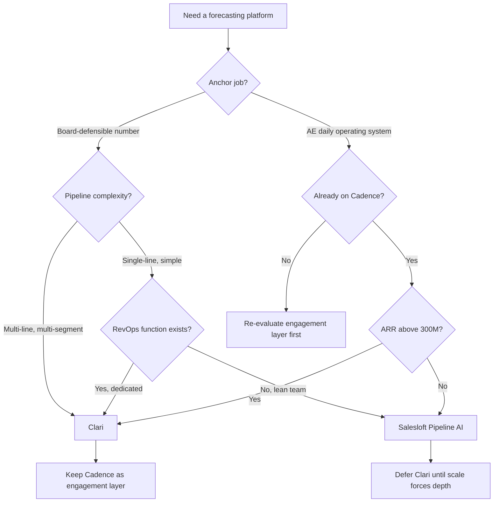

### Direct Answer

Salesloft Pipeline AI and Clari are **not the same product wearing different logos** — they are answers to two different jobs-to-be-done, and the buyer who picks correctly almost always picks on which job is the anchor, not on which vendor runs the louder demo. **Clari** is a dedicated revenue platform built to give a CRO a defensible quarterly forecast number a public-company board will trust; **Salesloft Pipeline AI** is a forecasting layer bolted onto Salesloft's Cadence-anchored sales-engagement suite, built to give AEs and SDRs an integrated daily operating system that also rolls up into a competent forecast. The decision rule is blunt: for **$100M+ ARR enterprise revenue orgs** with multi-line forecasts, a dedicated RevOps function, and board-grade earnings exposure, buy **Clari** and keep Salesloft Cadence as the engagement layer underneath; for **$30M-$300M ARR sequencing-anchored mid-market businesses** with single-line forecasts and a one-to-two-person RevOps team, buy **Salesloft Cadence + Pipeline AI as the bundle** and defer Clari until scale forces the depth requirement. The asymmetric mistake — ripping out a working Clari deployment to chase a bundle discount — destroys forecast credibility far faster than it saves money.

> **TL;DR**
> - **Different jobs, not different brands.** Clari answers "give my CRO a board-defensible number"; Salesloft Pipeline AI answers "give my reps one daily operating system that also forecasts." Buying the wrong one is a mismatch, not a downgrade.
> - **The 8-question lens** decides it in under an hour: forecast variance and its dollar value, anchor job, pipeline complexity, RevOps depth, CFO consolidation stance, existing conversation-intelligence stack, 36-month roadmap, and whether forecast credibility is a board concern or a sales-management concern.
> - **Buy Clari** at $100M+ ARR with multi-line forecasts, dedicated RevOps, and public-company or PE-board earnings exposure — it is the depth instrument.
> - **Buy Salesloft Pipeline AI** at $30M-$300M ARR when Cadence is already the anchor, the forecast is single-line, and consolidation onto one bill genuinely matters.
> - **The killer mistake:** replacing a healthy Clari deployment with Pipeline AI for an $80K-$250K bundle saving. The forecast-credibility loss with the CFO and board dwarfs the line-item win.
> - **The moat question:** whichever you buy, the platform only pays back if a human operating cadence — weekly pipeline reviews, deal inspection, AE accountability — actually runs on top of it. Software does not forecast; disciplined RevOps does.

---

## 1. Banner: The Two Jobs-to-be-Done — Why This Is Not an Apples-to-Apples Fight

### 1.1 The Single Most Expensive Misframe

The most expensive mistake in this entire evaluation is made before a single demo is booked: the buyer assumes Salesloft Pipeline AI and Clari are the same category of product, differing only in price, polish, and logo. They are not. They are answers to **two genuinely different jobs-to-be-done**, and the entire decision collapses into clarity the moment a buyer names which job is the anchor for their business.

Clari answers the job: *"give my CRO a defensible quarterly forecast number that a public-company board, a PE sponsor, or an audit committee will trust."* Salesloft Pipeline AI answers the job: *"give my AEs and SDRs one integrated daily operating system — sequencing, calls, deal management — that also produces a competent roll-up forecast."* Those are not the same sentence. One is a finance-and-board instrument. The other is a sales-productivity instrument with a forecasting feature attached.

A buyer who frames the question as "which is the better forecasting tool" will be pulled toward whichever vendor demos more fluently, and will then discover six months post-deployment that they bought depth they cannot operate or bought a bundle that cannot survive a board meeting. A buyer who frames the question as "which job is the anchor for my revenue org right now" gets a clean, durable answer in under an hour. This guide is built entirely around that reframe.

### 1.2 What Clari Actually Is

Clari was founded in 2012 by Andy Byrne and Venkat Rangan and has raised roughly $540M in total across Sapphire Ventures, Sequoia Capital, B Capital, Bain Capital Ventures, Tenaya Capital, Northgate Capital, and Madrona Venture Group. Its last public valuation was approximately $2.6B at the early-2022 Series F. The company is widely estimated at roughly $170M-$220M ARR with on the order of 800 employees and approximately 1,300 enterprise customers — a roster that has publicly included Adobe (NASDAQ: ADBE), Okta (NASDAQ: OKTA), Workday (NASDAQ: WDAY), Zoom (NASDAQ: ZM), Cisco (NASDAQ: CSCO), Qualtrics, ServiceNow (NYSE: NOW), and Lattice.

Clari is a **dedicated revenue platform** organized around five primitives: Forecast (the roll-up and submission engine), RevDB (the time-series capture of every CRM-field change), Deals (deal inspection and risk scoring), Mutual Action Plans (via the 2023 DealPoint acquisition), and Conductor (the agentic automation layer announced in 2024). The product was built from the first commit for one purpose — to make a forecast number defensible — and every primitive serves that purpose. Clari is what a CRO buys when the forecast is an earnings-grade artifact.

### 1.3 What Salesloft Pipeline AI Actually Is

Salesloft was founded in 2011 by Kyle Porter and acquired by Vista Equity Partners in March 2022 for approximately $2.3B at roughly $200M ARR. Under Vista the company is estimated at roughly $300M-$380M ARR with on the order of 1,100 employees and approximately 5,000 customers — a notably larger and more mid-market-weighted customer base than Clari's.

Salesloft is a **sales-engagement platform** with Cadence as the anchor product — the sequencing and outbound-execution layer where AEs and SDRs live every day. Conversations (conversation intelligence, built largely on the Drift and earlier Costello assets) and Deals sit alongside it. **Pipeline AI** is the 2024-2025 forecasting layer added on top of that stack: it scores deals, predicts pipeline outcomes, and produces a roll-up forecast for sales managers, leveraging the engagement and conversation signal the platform already captures. Pipeline AI is not a standalone product a buyer acquires in isolation — it is a capability that becomes compelling specifically because the buyer already runs Cadence.

The deeper context on how this fits Salesloft's overall direction is covered in the Salesloft AI strategy analysis (q1849) and the assessment of whether Cadence is still relevant in 2027 (q1851).

### 1.4 The Architecture Difference That Drives Everything

| Dimension | Clari | Salesloft Pipeline AI |
|---|---|---|
| **Origin job** | Board-defensible forecast | AE/SDR daily operating system |
| **Anchor product** | Forecast + RevDB | Cadence (sequencing) |
| **Forecasting status** | The core product | A layer on the engagement suite |
| **Primary buyer** | CRO / RevOps / CFO | VP Sales / Sales Ops |
| **Data foundation** | RevDB time-series capture of CRM history | Engagement + conversation activity signal |
| **Depth ceiling** | Very high — multi-line, multi-segment | Moderate — strongest on single-line |
| **Operating-team need** | Dedicated RevOps to exploit fully | Operable by a lean team |

The single most important row is **data foundation**. Clari's RevDB captures every change to every CRM field over time, which is what lets it answer "how has this deal moved" and "is this rep's pattern reliable" with statistical rigor — the raw material of a defensible forecast. Salesloft Pipeline AI's signal advantage is different: it has unusually rich *engagement and conversation* data because reps already work inside Cadence and Conversations. Each foundation is genuinely strong for its own job, and genuinely a compromise for the other.

The implication is subtle and worth stating plainly. A forecasting platform is, at bottom, a function that maps a data foundation to a number. If the foundation is a complete time-series of pipeline history, the function can be statistically rigorous and the number can be defended with evidence. If the foundation is rich engagement signal automatically captured from adopted tools, the function can be grounded in real rep behavior with minimal data-entry tax. Neither foundation is universally superior — each is the *correct* foundation for its own job. The mistake is assuming one foundation should serve both jobs, and then being surprised when the resulting forecast either lacks evidentiary depth or depends on rep data that never gets entered. The data foundation is not a technical footnote; it is the reason the two products exist as separate things.

### 1.5 The Two Buyers, Side by Side

It helps to picture the two archetypal buyers, because the right product is almost always obvious once the buyer is named precisely rather than abstractly.

The **Clari buyer** is a Chief Revenue Officer at a $300M ARR company that sells four product lines across enterprise, mid-market, and a partner channel. The CRO submits a forecast number every quarter to a board that includes a PE sponsor and two independent directors, at least one of whom reads the pipeline detail closely. A miss is not a sales problem at this company — it is a guidance event, a capital-allocation problem, and a personal-credibility problem for the CRO. There is a four-person RevOps team whose entire job is to make the number defensible. This buyer is not shopping for rep productivity. They are shopping for an instrument that lets them walk into a board meeting and *prove* the call.

The **Salesloft Pipeline AI buyer** is a VP of Sales at an $80M ARR company that sells one product through a single motion. The forecast is reviewed in a Monday sales-management meeting and shared with the CEO; it is taken seriously, but it is not an SEC-grade artifact. There is one sales-ops person who also owns the CRM, the comp plan, and the territory carving. The reps already live in Salesloft Cadence eight hours a day. This buyer's pain is not forecast defensibility — it is that their reps already resent the number of tools they have to touch, and adding a separate forecasting platform with its own login is a genuine adoption risk.

Two buyers, two products. Neither is making a mistake. They are solving different problems, and the product market has correctly produced two different answers.

### 1.6 Why "Better Tool" Is the Wrong Question

Ask "which is the better tool" and there is no answer, because the two tools optimize different loss functions. Clari is "better" if the loss you are minimizing is forecast variance against a board-committed number across a complex book. Pipeline AI is "better" if the loss you are minimizing is rep adoption friction and the number of separate systems a seller must touch in a day. A buyer must therefore replace the bad question with the right one: *which job is the anchor, and what does getting that job wrong actually cost?* That reframe is what Section 2 turns into an operating checklist.

---

## 2. Banner: The Eight-Question Buying Lens

### 2.1 Why a Structured Lens Beats a Demo

A vendor demo is engineered to make the product look like the obvious answer. The defense against demo-driven buying is a fixed evaluation lens applied *before* the demo — a set of questions whose answers the buyer already knows about their own business. Eight questions, answered honestly, produce a clean recommendation in under sixty minutes. The same discipline of structured evaluation over vendor theater shows up in the Outreach vs Salesloft vs Apollo cadence comparison (q110) and the broader question of when to add a forecasting tool at all (q108).

### 2.2 The Eight Questions

| # | Question | What the answer reveals |
|---|---|---|
| 1 | What is your forecast variance today, and what is one point of accuracy worth in dollars? | Whether precision justifies a depth platform |
| 2 | Is the anchor job forecasting precision or AE workflow integration? | The single biggest determinant |
| 3 | How complex is the pipeline — single-line vs multi-line, one segment vs many? | Whether Clari's depth is needed or wasted |
| 4 | Does a real RevOps function exist to operate a deep platform? | Whether Clari can be exploited or will idle |
| 5 | What does the CFO require — best-of-breed or vendor consolidation? | The finance veto |
| 6 | What conversation-intelligence and CRM stack already exists? | Integration cost and overlap |
| 7 | What is the 36-month consolidation roadmap? | Whether today's choice survives scale |
| 8 | Is forecast credibility a board concern or a sales-management concern? | Which job is truly the anchor |

### 2.3 Question 1 — Variance and the Dollar Value of a Point

Forecast accuracy is not a vanity metric. If a $400M ARR company forecasts within plus-or-minus 12% and a credible deployment tightens that to plus-or-minus 5%, the swing in committed-number reliability is worth tens of millions in capital-allocation confidence, hiring-plan stability, and — for a public company — avoided guidance misses. A buyer must put a dollar figure on a single point of accuracy. If that figure is large and the buyer is currently wide of the number, depth is justified and Clari moves to the front. If the figure is modest and the forecast is already serviceable, paying for depth is paying for capability that will sit idle.

### 2.4 Question 2 — Naming the Anchor Job

This is the determinant. If the anchor is *forecasting precision* — the number must withstand a board, an audit committee, or a PE sponsor — Clari leads. If the anchor is *AE workflow integration* — the priority is one daily operating system reps actually adopt — Salesloft Pipeline AI leads. Most buyers know the answer instantly once forced to choose; the discipline is refusing to answer "both," because "both" is how a buyer talks themselves into the wrong purchase.

The reason "both" is dangerous deserves a moment. Every buyer genuinely wants both a defensible forecast and frictionless rep adoption — neither is something a reasonable person would decline. But a buying decision is not a wish list; it is an allocation of finite budget and finite implementation capacity against the *primary* job. A buyer who refuses to rank the two jobs ends up letting the vendor with the more polished demo do the ranking for them. The correct mental move is to ask: "if I could only get one of these two jobs done well, which would it be?" That forced choice — even though it feels artificial — is exactly the choice the budget and the org's operating capacity will make in practice. Naming it consciously beats discovering it accidentally six months after signing.

### 2.5 Question 3 — Pipeline Complexity

Clari's depth advantage is real but it is *conditional on complexity*. A business forecasting a single product line in a single segment does not need multi-line roll-ups, segment-specific algorithms, or channel-overlay forecasting — and will pay for sophistication it never exercises. A business forecasting new business plus expansion plus renewals plus channel, across enterprise and mid-market and SMB, with multi-year contracts and holdbacks, needs exactly that depth. The forecasting methodology when contract structures are complex is examined directly in the multi-year-contract forecasting analysis (q423).

### 2.6 Question 4 — Does RevOps Exist

A deep platform is only as good as the team operating it. Clari rewards a dedicated RevOps function that builds the forecast hierarchy, tunes the scoring, runs the inspection cadence, and translates the output for the executive team. Hand Clari to a business with no RevOps owner and it becomes expensive shelfware. Salesloft Pipeline AI is deliberately operable by a leaner team — a one-to-two-person sales-ops group can run it — which is precisely why it fits the mid-market profile.

### 2.7 Question 5 — The CFO Veto

Question 5 is the finance veto, and it is more powerful than most sales leaders expect. A CFO committed to best-of-breed tooling — one who believes the right instrument for each job is worth a separate contract — will fund Clari as a dedicated forecasting platform without much friction. A CFO running a hard vendor-consolidation mandate, by contrast, is actively counting vendors, renewals, and integration seams, and will push hard toward the Salesloft bundle and a single invoice. The point is that this question is frequently decided *above* the revenue org. A VP of Sales who falls in love with Clari in a demo, only to discover the CFO has a standing consolidation policy, has wasted an evaluation cycle. Surface the CFO's stance in week one, not week ten.

### 2.8 Question 6 — The Existing Stack

Question 6 asks what conversation-intelligence and CRM systems already exist, because integration math is real money and real risk. A heavy Gong-and-Salesforce enterprise shop has a different calculus than a HubSpot-native mid-market org. Clari integrates with the major CRMs and conversation-intelligence tools, but every integration is a project with a cost and a maintenance tail. Salesloft Pipeline AI's advantage here is that its conversation intelligence is native — there is no seam between Conversations and the forecast. A buyer should map their current stack honestly and price the integration work into the comparison, because the cheaper-looking option can become the more expensive one once a fragile CRM sync is included. This stack-fit tension is explored further in the Salesloft-versus-HubSpot-customer-base question (q1857).

### 2.9 Questions 7 and 8 — Roadmap and Altitude

**Question 7** forces a 36-month view. A choice that fits the business today but breaks at the next scale tier is not a purchase — it is a deferred re-purchase, with a migration project attached. A mid-market buyer choosing Pipeline AI should know the ARR and complexity threshold at which they will likely need Clari, and should choose with that horizon in mind rather than optimizing purely for today. **Question 8** is the altitude test, and it is the cleanest tiebreaker of the eight. Ask simply: where is forecast credibility actually debated? If the answer is "in board meetings, with directors who probe the detail," that is unambiguously Clari's job. If the answer is "in the Monday sales-management review," Pipeline AI is sufficient. Altitude — the organizational level at which the forecast is contested — is the single most reliable proxy for which job is the true anchor.

---

## 3. Banner: Clari in Depth — The Forecast-Defensibility Instrument

### 3.1 The Five Primitives

Clari's product is best understood as five primitives that together make a number defensible:

| Primitive | Function | Why it matters for defensibility |
|---|---|---|
| **Forecast** | Roll-up, submission, and snapshot of the number | The artifact the board sees |
| **RevDB** | Time-series capture of every CRM-field change | The evidence behind the number |
| **Deals** | Deal inspection, risk scoring, engagement signal | Surfaces what will slip before it slips |
| **Mutual Action Plans** | Buyer-seller close-plan alignment (DealPoint) | Tightens late-stage predictability |
| **Conductor** | Agentic automation across the workflow | Reduces manual forecast hygiene |

### 3.2 RevDB — The Real Moat

RevDB is the part of Clari that is hardest for a competitor to replicate quickly. It continuously captures the *history* of the pipeline — not just the current state of every opportunity, but every change to every field, time-stamped. That history is what makes a Clari forecast defensible: a CRO can show a board not only "here is the number" but "here is how every deal in it has behaved over the last six weeks, here is which reps' commits have historically been reliable, and here is the statistical basis for the call." A forecast without that evidentiary trail is an opinion. RevDB is what converts it into an argument.

### 3.3 Conductor and the Agentic Layer

Conductor, announced in 2024, is Clari's automation layer — the move from a system that *displays* forecast risk to one that *acts* on it: nudging reps on stalled deals, flagging hygiene gaps, and automating the repetitive RevOps work that otherwise consumes a forecasting team. It is strategically important because the broader market is moving toward agentic revenue tooling, and a forecasting platform that cannot automate is a forecasting platform that ages. The question of what happens to the forecasting layer as AI agents take over more of the workflow is explored in the analysis of what replaces manual forecasting (q1880).

### 3.4 The Deal-Inspection Engine

Beyond the roll-up, Clari's Deals primitive is a deal-inspection engine, and it is worth understanding why that matters for a forecast. A forecast number is only as reliable as the deals inside it, and the deals most likely to break a quarter are the ones that *look* healthy but are not — a deal sitting in a late stage with no recent buyer engagement, a deal with a close date that has slipped twice, a deal with a single-threaded champion and no economic-buyer contact.

Clari surfaces exactly those patterns. It scores deals on engagement signal, on stage-age, on close-date movement, and on the gap between rep optimism and observed activity. A RevOps team or a sales manager can then walk the forecast not as a list of dollar figures but as a ranked set of risks. This is the practical link between the tool and forecast accuracy: the platform does not produce a better number by magic — it produces a better-inspected pipeline, and a well-inspected pipeline produces a better number. The discipline of separating genuine forecast risk from rep optimism is examined in depth in the deal-slippage-tracking analysis (q9520).

### 3.5 Where Clari Is Genuinely Strong

- **Multi-line, multi-segment forecasts.** New business, expansion, renewal, and channel — rolled up separately and together — is Clari's native terrain.
- **Board-grade defensibility.** The RevDB evidentiary trail is purpose-built for the audit-committee and PE-sponsor conversation.
- **Deal inspection at scale.** Risk scoring across hundreds of reps and thousands of open deals, surfaced where managers can act.
- **The executive cadence.** Clari is built to power the weekly forecast call and the quarterly business review, not just a dashboard.

### 3.6 The Clari Operating Model

Clari is not bought; it is operated. The platform delivers its value through a specific operating model, and a buyer who acquires the software without committing to the model gets a fraction of the return.

| Operating element | What it requires | Why it matters |
|---|---|---|
| **Forecast hierarchy** | RevOps builds roll-up structure by segment, line, region | The number is only as good as its structure |
| **Scoring calibration** | Ongoing tuning of deal-risk and engagement scores | Untuned scores erode manager trust fast |
| **Weekly forecast call** | A disciplined, Clari-powered cadence | The platform powers the call; it does not replace it |
| **Quarterly business review** | RevDB-backed retrospective on forecast accuracy | Closes the loop and improves the next quarter |
| **CRM hygiene enforcement** | Field-completeness standards reps actually follow | Clari forecasts off CRM data; rot in, rot out |

The pattern across every row is the same: Clari supplies the instrument, and a RevOps function plus a management cadence supplies the discipline. This is why the RevOps question (Question 4) is not a side consideration — it is close to a gating requirement. The structural sequencing of building that RevOps capability alongside process standardization is examined in the CRO-sequencing analysis (q9545).

### 3.7 Where Clari Costs You

Clari's strengths have a price beyond the invoice. It assumes a **dedicated RevOps function** — without one, the platform is underused. It carries a **real implementation cost** — forecast hierarchies, scoring tuning, and integration take time and expertise. And its depth is **overkill for a simple single-line pipeline**, where the buyer pays for sophistication that never gets exercised. Clari is the right instrument for a complex, board-exposed revenue org and the wrong instrument for a lean, single-product mid-market business — and an honest evaluation names both halves of that.

---

## 4. Banner: Salesloft Pipeline AI in Depth — The Integrated Operating System

### 4.1 Pipeline AI Inside the Salesloft Stack

Pipeline AI is not a product a buyer purchases on its own. It is a forecasting capability layered onto a stack the buyer is already running: Cadence (sequencing and outbound execution), Conversations (conversation intelligence), and Deals (deal management). That architectural fact is the whole story of Pipeline AI's appeal — and its limits.

| Salesloft layer | Role | Relationship to Pipeline AI |
|---|---|---|
| **Cadence** | Sequencing, outbound execution | The anchor; the reason reps are in the platform daily |
| **Conversations** | Conversation intelligence | Feeds call and meeting signal into the forecast |
| **Deals** | Deal management and tracking | The opportunity layer Pipeline AI scores |
| **Pipeline AI** | Forecasting and deal scoring | The roll-up built on all of the above |

### 4.2 The Signal Advantage

Because reps already live in Cadence and Conversations, Salesloft captures unusually rich **engagement and conversation data** — email and call activity, sequence progression, meeting content, buyer responsiveness. Pipeline AI forecasts off that signal. For a single-line pipeline in a sequencing-anchored business, this is a genuine strength: the forecast is grounded in what reps actually did, captured automatically, with no separate data-entry tax. The reps are not asked to feed a forecasting tool — the forecasting tool reads the work they were already doing.

### 4.3 The Bundle Economics

The strategic case for Pipeline AI is consolidation. A mid-market business already paying for Cadence can add forecasting **without adding a vendor, a contract, an integration, or a separate login**. For a CFO running a vendor-consolidation mandate, that is a real and legitimate win — fewer invoices, fewer renewals, fewer integration seams, one support relationship. The way Salesloft monetizes this layered, consolidate-onto-one-platform model is detailed in the analysis of how Salesloft makes money in 2027 (q1852).

### 4.4 The Strategic Context Under Vista

Pipeline AI cannot be evaluated in isolation from Salesloft's ownership and strategy. Vista Equity Partners acquired Salesloft in 2022, and Vista-owned software companies operate under a recognizable playbook: disciplined cost management, a push toward platform expansion and cross-sell, and a focus on net revenue retention. Pipeline AI is a direct expression of that playbook — it is a way to expand revenue from existing Cadence customers without acquiring new logos, and it is exactly the kind of attach-rate-lifting product a Vista operating team prioritizes.

For a buyer, this context cuts two ways. On the positive side, a Vista-owned vendor has a strong incentive to keep investing in a layer like Pipeline AI, because cross-sell expansion is core to the financial model. On the cautious side, a buyer is partly betting on continued investment under an ownership structure focused on margin discipline. The way to handle this is not to avoid Pipeline AI but to weight the roadmap question (Question 7) and to validate, in the evaluation, that the product is on a credible investment trajectory. The Vista playbook's effect on Salesloft is examined directly in the analysis of how Vista is reshaping Salesloft (q1847), and the question of whether Cadence — the anchor underneath Pipeline AI — remains relevant is the subject of the Cadence-relevance analysis (q1851).

### 4.5 Where Pipeline AI Is Genuinely Strong

- **Adoption.** Reps already work in Cadence; the forecast rides on adopted behavior rather than requiring a new habit.
- **Single-line forecasting.** For one product line and one motion, Pipeline AI is competent and sufficient.
- **Consolidation.** One platform, one bill, one vendor — a real benefit for a lean stack.
- **Lean operability.** A one-to-two-person sales-ops team can run it without a dedicated RevOps function.

### 4.6 The Adoption Argument Quantified

The strongest single argument for Pipeline AI is adoption, and it deserves to be made concretely rather than as a slogan. Forecasting tools fail most often not because the algorithm is wrong but because the data going in is incomplete — reps do not update the CRM, do not log activity, do not maintain the deal record, and the forecast is therefore built on a partial picture.

Pipeline AI attacks that failure mode at the root. Because reps are already in Cadence executing sequences and in Conversations on calls, the engagement signal is captured **automatically, as a byproduct of work the rep was doing anyway**. There is no separate forecasting-tool data-entry tax. A standalone forecasting platform, no matter how sophisticated, asks the rep to do something extra; Pipeline AI asks the rep to do nothing new. For a mid-market business where rep compliance is the binding constraint on forecast quality, that is not a marginal benefit — it is frequently the decisive one. The forecast that gets built on adopted behavior beats the more sophisticated forecast that gets built on neglected data.

### 4.7 Where Pipeline AI Costs You

Pipeline AI's ceiling is real. It is **strongest on single-line forecasts** and weaker as the pipeline fragments into multiple lines, segments, and motions. It does **not match Clari's evidentiary depth** — there is no RevDB-equivalent time-series moat — so it is harder to make a Pipeline AI number withstand a hostile audit-committee cross-examination. And it is **structurally tied to Salesloft**: its value depends on the buyer committing to the Salesloft stack, which is a strategic dependency the broader Salesloft-versus-Outreach question (q1854) puts in context. There is also a roadmap question: Pipeline AI is a relatively newer layer, and a buyer is partly betting on Salesloft's continued investment in it under Vista ownership — a bet the Salesloft-AI-strategy analysis (q1849) and the analysis of how Salesloft competes against AI-native sequencing tools (q1850) help size. Pipeline AI is the right call for a mid-market, sequencing-anchored business and the wrong call for a complex enterprise revenue org — and, again, an honest read names both sides.

---

## 5. Banner: Head-to-Head — Cost, Depth, and Total Economics

### 5.1 The Capability Comparison

| Capability | Clari | Salesloft Pipeline AI |
|---|---|---|
| Multi-line forecast roll-up | Excellent | Limited |
| Single-line forecast | Excellent (overkill) | Strong |
| Board-grade defensibility | Excellent | Moderate |
| Deal inspection at scale | Excellent | Good |
| Time-series pipeline history | Excellent (RevDB) | Limited |
| Rep adoption / daily use | Moderate | Excellent (Cadence) |
| Sequencing / outbound execution | None native | Excellent |
| Conversation intelligence | Via integration | Native |
| Operability by a lean team | Hard | Easy |
| Vendor consolidation | Adds a vendor | Removes a vendor |

### 5.2 The Cost Picture

Neither vendor publishes transparent list pricing, and both negotiate heavily, so the figures below are directional planning ranges, not quotes — every buyer must validate with a current quote.

| Cost element | Clari (directional) | Salesloft Pipeline AI (directional) |
|---|---|---|
| Forecasting capability, annual | Higher — a dedicated platform | Lower — an add-on to existing Cadence spend |
| Implementation / onboarding | Significant — hierarchies, tuning | Lighter — rides existing deployment |
| RevOps operating cost | Requires dedicated headcount | Operable by existing sales ops |
| Net new vendor relationships | One new vendor | Zero — already a Salesloft customer |
| 3-year total cost of ownership | Higher, justified by depth | Lower, if the bundle fits the job |

### 5.3 Total Cost of Ownership Is Not the Invoice

The most common costing error is comparing the two line items and stopping there. The real comparison is **total cost of ownership against the job done**. Clari's higher invoice buys depth that is worth far more than its cost *if* the business has a complex, board-exposed forecast — and is pure waste if it does not. Pipeline AI's lower cost is a genuine saving *if* the single-line bundle actually does the job — and a false economy if the business needed depth and bought a layer instead. TCO is invoice plus implementation plus operating headcount plus the cost of getting the forecast wrong. That last term usually dominates.

Consider the arithmetic on the cost of a wrong forecast. A company that commits a number to its board and misses by a wide margin does not just absorb a sales shortfall — it absorbs a credibility cost. The next quarter's number is trusted less, the hiring plan built on the forecast is now suspect, and capital allocated against projected revenue must be re-examined. For a public company the cost can include a guidance miss and the share-price reaction that follows. Set against that, the difference between the Clari invoice and the Pipeline AI invoice is frequently a rounding error. The discipline is to size the cost of forecast error *first*, in dollars, and only then compare the platform invoices — because a buyer who leads with the invoice comparison is optimizing the small number while ignoring the large one.

### 5.4 The Hidden Costs Both Sides Miss

Beyond the headline invoice and the cost of error, both deployments carry hidden costs that buyers routinely under-model.

| Hidden cost | Clari | Pipeline AI |
|---|---|---|
| **Implementation calendar time** | Months — hierarchy design, tuning, integration | Weeks — rides the existing Cadence deployment |
| **Ongoing operating headcount** | A RevOps function, partially or fully | Existing sales-ops capacity, usually sufficient |
| **Change-management load** | New platform, new cadence, new habits | Lower — reps stay in a familiar environment |
| **Migration risk if you outgrow it** | Low — it is the depth endpoint | Real — a future Clari migration if you scale |
| **Vendor-relationship overhead** | One additional vendor to manage | None — already a Salesloft customer |

The honest reading of this table is that the two products distribute their costs differently in *time* as well as in *dollars*. Clari front-loads cost — implementation, headcount, change management — in exchange for a deployment that does not need to be replaced as the business scales. Pipeline AI back-loads cost — a low entry price and fast deployment, but a real migration project waiting at the far end if the business grows past the bundle's ceiling. Neither distribution is wrong. The buyer simply has to choose which cost shape fits their trajectory.

### 5.5 The Decision Flow

### 5.6 Reading the Flow

The flow encodes the whole guide. The first fork is the anchor job. A board-defensible number routes toward Clari unless the pipeline is genuinely simple *and* there is no RevOps function — in which case Pipeline AI's lean operability wins even for a forecasting-anchored buyer. An AE-operating-system anchor routes toward Pipeline AI, but only if the business is already on Cadence and below roughly $300M ARR; above that threshold, depth requirements pull even a Cadence-native buyer toward Clari. Critically, **the two endpoints are not symmetric** — choosing Clari still keeps Cadence underneath as the engagement layer, while choosing Pipeline AI explicitly defers Clari rather than ruling it out forever.

---

## 6. Banner: The Decision Matrix by Company Profile

### 6.1 Profile-Based Recommendations

| Company profile | Recommendation | Rationale |
|---|---|---|
| $100M+ ARR enterprise, multi-line forecast, dedicated RevOps, board exposure | **Clari**, Cadence kept underneath | Depth and defensibility are the anchor job |
| $30M-$300M ARR mid-market, single-line, sequencing-anchored, lean RevOps | **Salesloft Cadence + Pipeline AI** | Bundle fits the job; consolidation is real value |
| $250M-$400M ARR, scaling fast, forecast complexity rising | **Clari** — the trigger has arrived | Depth requirement has crossed the threshold |
| Sub-$30M ARR, simple pipeline, no RevOps | **Neither yet** — Salesforce/HubSpot reports | A forecasting platform is premature |
| Public company or PE-sponsored, earnings-grade forecast | **Clari**, non-negotiable | The number must survive an audit committee |
| HubSpot-native mid-market, Cadence already deployed | **Salesloft Pipeline AI** | Stack fit and operability favor the bundle |

### 6.2 The Enterprise Profile

For a $100M+ ARR enterprise revenue org with a multi-line forecast, a dedicated RevOps function, and board-grade earnings exposure, the answer is Clari, every time. The forecast at this scale is an earnings-grade artifact; it must withstand an audit committee and a PE sponsor; the pipeline is complex enough to exercise Clari's depth fully; and a RevOps function exists to operate the platform. Salesloft Cadence stays in place as the engagement layer underneath — this is not an either/or. The enterprise buys Clari for the forecast and keeps Cadence for the reps.

### 6.3 The Mid-Market Profile

For a $30M-$300M ARR sequencing-anchored mid-market business with a single-line forecast and a one-to-two-person RevOps team, the answer is Salesloft Cadence plus Pipeline AI as the bundle. The forecast is simple enough that Pipeline AI is genuinely sufficient; the business already runs Cadence so the forecast rides on adopted behavior; consolidation onto one platform is a real CFO win; and a lean team can operate it without dedicated RevOps headcount. Clari is deferred — not rejected — until scale forces the depth requirement.

### 6.4 The Scaling-Through Profile

The hardest profile is the business scaling fast through $250M-$400M ARR. This is the trigger zone. The pipeline is fragmenting into multiple lines and segments, the forecast is becoming a board-level artifact, and the Pipeline AI bundle that fit perfectly at $80M ARR is starting to strain. The discipline here is to recognize the trigger early and plan the Clari migration deliberately — before a missed quarter forces it under pressure. The structural patterns of when to upgrade revenue tooling as an org scales are examined in the RevOps-hiring-and-process-sequencing analysis (q9545).

### 6.5 The Too-Early Profile

For a sub-$30M ARR business with a simple pipeline and no RevOps function, the honest answer is *neither yet*. Salesforce or HubSpot native reports, run with discipline, will carry the forecast. Buying a dedicated forecasting platform — either one — before the pipeline complexity or the team maturity justifies it is paying for capability that cannot yet be exploited. The right move is to build the forecasting *discipline* first and buy the *tool* when the discipline outgrows the spreadsheet. The question of when a forecasting tool is genuinely warranted versus when native CRM reports are sufficient is examined directly in the Clari-vs-Salesforce-reports analysis (q108).

### 6.6 The HubSpot-Native Profile

A distinct and increasingly common profile is the HubSpot-native mid-market business that has already deployed Salesloft Cadence on top of HubSpot CRM. For this buyer, Pipeline AI is the natural answer: the stack is already integrated, the reps are already in Cadence, and adding the forecasting layer requires no new vendor and minimal new integration work. Clari does integrate with HubSpot, but for a business at this scale the integration project and the dedicated-RevOps requirement rarely clear the bar. The strategic dynamics of Salesloft serving the HubSpot customer base specifically are covered in the analysis of how Salesloft wins the HubSpot CRM base (q1857).

### 6.7 What the Matrix Is Really Saying

Read across all the profiles and a single principle emerges: **the recommendation tracks the job, and company size is only a proxy for the job.** Most of the time the proxy holds — enterprises tend to have complex forecasts and RevOps teams, mid-market businesses tend to have simple forecasts and lean ops. But the proxy is not the rule. A PE-owned $60M business with a punishing board can need Clari; a $400M business with one product line and a thin ops team can be served by Pipeline AI. The matrix is a fast first pass. The eight-question lens is the actual decision instrument, and where the two disagree, the lens wins.

---

## 7. Banner: The Asymmetric Mistake and the Counter-Case

### 7.1 The Most Expensive Wrong Move

The single most damaging decision in this category is **ripping out a working Clari deployment to replace it with Salesloft Pipeline AI in pursuit of a bundle discount**. The saving — somewhere in the range of $80K-$250K annually for a typical enterprise — is real on the invoice. The cost is not on the invoice. It is the loss of forecast credibility with the CFO and the board.

A board that has come to trust a Clari-grade number, with its RevDB evidentiary trail, does not quietly accept a thinner forecast. The first quarter the number is wide of the call, the question is not "what happened in the market" — it is "what happened to the forecasting system." Re-establishing forecast credibility after it has been damaged costs vastly more than the bundle ever saved, in board confidence, in CRO political capital, and frequently in a humiliating re-purchase of the platform that was removed. This is the asymmetric mistake: a small, visible saving against a large, delayed, hard-to-reverse loss.

### 7.2 The Counter-Case — When the Conventional Wisdom Is Wrong

An honest guide names the cases where its own recommendations break down. There are real situations where the obvious answer is the wrong one.

| Conventional call | When it is wrong | The better move |
|---|---|---|
| "Enterprise must buy Clari" | Enterprise with a genuinely simple single-line forecast and no RevOps | Pipeline AI may be sufficient and far cheaper to operate |
| "Mid-market should bundle Pipeline AI" | Mid-market that is PE-owned with a board demanding earnings-grade forecasts | Clari's defensibility is worth the premium even at smaller scale |
| "Never rip out Clari" | Clari deployed years ago, never adopted, no RevOps to run it | A working bundle beats a shelfware depth platform |
| "Defer the forecasting tool until $30M ARR" | Sub-$30M business with a famously volatile, lumpy pipeline | Earlier investment in forecasting discipline can be justified |
| "One platform, one bill is always better" | Consolidation that forces a worse forecast to save a vendor | Best-of-breed depth can outweigh the consolidation win |

### 7.3 The Honest Reading of the Counter-Case

The counter-case does not overturn the main recommendations — it disciplines them. The lesson is that **company size is a proxy, not the rule**. The real rule is the eight-question lens: anchor job, pipeline complexity, RevOps depth, and board altitude. A small PE-owned company with a brutal board can need Clari; a large company with a simple book and no RevOps can be fine on Pipeline AI. A buyer who applies the lens honestly will sometimes land on the unconventional answer — and will be right to.

The most instructive counter-case is the third row of the table: the buyer who already owns Clari but never adopted it. This situation is more common than vendors will admit. A company bought Clari two or three years ago in an ambitious moment, never built the RevOps function to operate it, and now has an expensive depth platform that nobody uses while the real forecast still lives in a spreadsheet. The conventional wisdom — "never rip out Clari" — is exactly wrong here, because there is nothing to protect. There is no board trust built on the Clari number, because the Clari number was never operationalized. In that specific case, moving to a Pipeline AI bundle that the lean team will actually run is the better decision, even though it looks like a downgrade on paper. The principle: the counter-case is not "ignore the rules," it is "the rules are about the *job*, and the job depends on facts, not on what the company bought in the past."

### 7.4 The Failure Modes That Sink Either Choice

Both platforms fail in predictable, preventable ways. Naming them is the cheapest insurance a buyer can buy.

- **Buying depth with no team to operate it.** Clari without RevOps is expensive shelfware. The platform did not fail — the operating model was never built.
- **Buying the bundle and assuming the forecast got better.** Adding Pipeline AI to Cadence does not improve the forecast unless the deal-inspection discipline runs on top of it.
- **Treating the tool as the forecast.** Neither platform forecasts. People forecast, using the platform. A tool purchase with no cadence change changes nothing.
- **Letting CRM hygiene rot.** Both platforms forecast off CRM data. Garbage pipeline data produces a garbage forecast in a beautiful interface.
- **Skipping the migration plan.** A business that outgrows Pipeline AI and scrambles to Clari mid-crisis pays far more than one that planned the move at the trigger point.

### 7.5 The Cadence That Makes Either Tool Work

The deepest truth in this entire comparison is that the platform is necessary but not sufficient. A forecast becomes accurate when a **human operating cadence** runs on top of the software. That cadence has a specific, recognizable shape, and it is the same shape regardless of which platform powers it:

| Cadence element | Frequency | What it does |
|---|---|---|
| **Weekly pipeline review** | Weekly | Inspects at-risk deals, not just the roll-up total |
| **Forecast submission** | Weekly | Each manager owns and commits a number |
| **Deal inspection** | Continuous | Surfaces slip risk before the close date arrives |
| **Quarterly business review** | Quarterly | Retrospective on forecast accuracy vs actuals |
| **One-on-one coaching** | Weekly | Translates forecast signal into rep behavior change |

Buy Clari and skip the cadence and the forecast stays unreliable — an expensive dashboard nobody acts on. Buy Pipeline AI and skip the cadence and the same is true. The platform supplies the signal; the cadence is what converts signal into a better number and a better-run pipeline. The operator playbook for the weekly review that drives real accuracy rather than theater is laid out in the 25-minute pipeline-review analysis (q9519), the discipline of separating forecast inaccuracy from AE optimism is the subject of the deal-slippage-tracking analysis (q9520), and the mechanics of building a bottom-up forecast that survives one large deal slipping are examined in the 50-rep bottom-up-forecast analysis (q9517).

### 7.6 The Procurement Sequence That Avoids Regret

A buyer who follows a disciplined procurement sequence almost never lands on the wrong platform. The sequence is short and the order matters:

- **First, answer the eight questions in writing.** Do this before contacting either vendor. The answers come from facts about your own business, not from a demo.
- **Second, surface the CFO's consolidation stance.** If finance has a standing policy, it constrains the choice; learn it before investing evaluation cycles.
- **Third, demand a proof-of-concept on your real data.** A sandbox demo proves nothing. The gap between the two products shows only against a real, messy pipeline.
- **Fourth, design the operating cadence before signing.** Decide who owns the weekly review and the forecast submission. If that owner does not exist, the tool will not save you.
- **Fifth, negotiate both quotes and compare total cost of ownership.** Not line items — TCO, including implementation, headcount, and the cost of forecast error.

A buyer who runs this sequence is buying a job-fit, not a feature list — and job-fit is what does not produce regret in eighteen months.

---

## 8. Banner: 2027 Outlook and the Action Plan

### 8.1 Where the Market Is Heading

| Trend | Implication for the Clari vs Pipeline AI choice |
|---|---|
| Agentic revenue tooling matures (Conductor and peers) | Both platforms move from displaying risk to acting on it |
| CFO-led vendor consolidation pressure intensifies | Strengthens the Pipeline AI bundle case at the margin |
| Forecast scrutiny rises with macro uncertainty | Strengthens Clari's defensibility premium |
| AI agents absorb more SDR and forecast-hygiene work | Reshapes what a forecasting platform must do |
| Sales engagement and revenue intelligence converge | The category line between the two products blurs |
| PE ownership concentrates in revtech | Pricing and roadmap discipline both tighten |

Two of these trends pull in opposite directions, and that tension is worth naming. **CFO-led consolidation pressure** strengthens the Pipeline AI bundle case — every finance organization counting vendors is, at the margin, nudging buyers toward one platform and one invoice. At the same time, **rising forecast scrutiny** under macro uncertainty strengthens Clari's defensibility premium — a board that is nervous about the number wants the most rigorous, most evidence-backed forecast it can get, and is willing to fund a dedicated instrument to have it. A buyer caught between a consolidation-minded CFO and a scrutiny-minded board is experiencing the central tension of this market in miniature. The resolution, again, is the altitude question: if the forecast is genuinely a board-grade artifact, defensibility wins the argument over consolidation, because a cheaper forecast that the board does not trust is not actually cheaper.

### 8.2 The Convergence Question

The two product categories — sales engagement and revenue intelligence — are slowly converging. Salesloft is pushing up into forecasting with Pipeline AI; revenue platforms are pushing toward more of the daily workflow. Over a 36-month horizon the clean line this guide draws between "AE operating system" and "board-defensible forecast" will blur. That does not invalidate the framework — it raises the stakes on Question 7, the 36-month roadmap question. A buyer should choose not only for the job today but for where each vendor is credibly heading. The broader strategic trajectory of Salesloft as a platform is the subject of the Is-Salesloft-worth-buying analysis (q1846), and the question of whether the entire sequencing layer survives AI agents is examined in the Outreach-acquire-Apollo analysis (q1892).

The honest read of convergence is that it makes the *job-to-be-done* framing more durable, not less. As features overlap, feature-by-feature comparison becomes even more useless — both products will eventually check most of the same boxes on a spec sheet. What will not converge is the *origin* of each product and the operating model each demands. Clari will remain the instrument built for board-grade defensibility, with the RevDB evidentiary spine and the RevOps-operated cadence that implies. Pipeline AI will remain the layer that rides an adopted engagement platform. Convergence blurs the demo; it does not blur the job. A buyer who anchors on the job will still get a clean answer in 2027 and beyond.

### 8.3 The AI-Agent Disruption

The larger force reshaping both products is the rise of agentic AI in the revenue stack. Clari's Conductor is one expression of it; Salesloft's broader AI investment is another. As AI agents absorb more of the forecast-hygiene work, more of the deal-inspection triage, and eventually more of the SDR motion itself, the question is no longer just "which forecasting tool" but "what does a forecasting tool even do once agents handle the data layer." This is not a reason to defer a purchase — a business with a forecast problem today needs a solution today — but it is a reason to weight Question 7 heavily and to favor vendors with a credible agentic roadmap. The deeper exploration of what happens to forecasting when AI agents take over the SDR and hygiene layers is the subject of the what-replaces-manual-forecasting analysis (q1880).

### 8.4 The Evaluation Action Plan

1. **Run the eight-question lens before any demo.** Answer all eight in writing, using facts about your own business. The recommendation will be visible before a vendor presents.
2. **Put a dollar figure on a point of forecast accuracy.** This single number tells you whether depth is an investment or a waste.
3. **Demo against your own pipeline, not the vendor's sandbox.** Insist on a proof-of-concept with your real, messy data — that is where the gap between the two products shows.
4. **Validate pricing with current quotes.** Neither vendor lists transparent pricing; negotiate both and compare total cost of ownership, not line items.
5. **Plan the operating cadence before signing.** Decide who owns the weekly review and the forecast submission. If the answer is unclear, fix that before buying either tool.
6. **For scaling businesses, set the migration trigger now.** Define the ARR and complexity threshold at which a Pipeline AI deployment becomes a Clari deployment, and revisit it quarterly.

### 8.5 The Bottom Line

Salesloft Pipeline AI and Clari are not competitors in the simple sense — they are answers to two different jobs, and the buyer's only real task is to name which job is the anchor. For a **$100M+ ARR enterprise** with a multi-line forecast, dedicated RevOps, and board-grade earnings exposure, the answer is **Clari**, with Salesloft Cadence kept as the engagement layer beneath it. For a **$30M-$300M ARR sequencing-anchored mid-market business** with a single-line forecast and a lean RevOps team, the answer is **Salesloft Cadence + Pipeline AI as the bundle**, with Clari deferred until scale forces the depth requirement.

The asymmetric mistake — ripping out a working Clari deployment to chase a bundle discount — is the one move to refuse outright, because the forecast-credibility loss dwarfs the saving. And the deepest point stands above either choice: **the platform is the instrument, not the forecast.** A disciplined weekly pipeline review, real deal inspection, and genuine AE accountability are what make a number accurate. Buy the tool that fits the job — and then build the operating cadence that makes the tool worth its price.

---

#### Sources and Citations

1. Clari — official product documentation for Forecast, RevDB, Deals, and Conductor.
2. Clari — company funding history and investor roster (Sapphire, Sequoia, B Capital, Bain Capital Ventures, Tenaya, Northgate, Madrona).
3. Clari — DealPoint acquisition announcement and Mutual Action Plans integration (2023).
4. Clari — Conductor agentic-layer announcement (2024).
5. Salesloft — official product documentation for Cadence, Conversations, Deals, and Pipeline AI.
6. Salesloft — company history and founding (Kyle Porter, 2011).
7. Vista Equity Partners — Salesloft acquisition announcement, March 2022 ($2.3B).
8. Crunchbase — Clari funding rounds and Series F valuation data.
9. PitchBook — Clari and Salesloft private-company valuation and ARR estimates.
10. Forrester — revenue operations and revenue intelligence platform market analysis.
11. Gartner — sales engagement and forecasting tool Market Guide research.
12. G2 — Clari and Salesloft user reviews and category positioning.
13. TrustRadius — revenue intelligence and sales engagement buyer reviews.
14. Adobe (NASDAQ: ADBE) — referenced as a Clari enterprise customer.
15. Okta (NASDAQ: OKTA) — referenced as a Clari enterprise customer.
16. Workday (NASDAQ: WDAY) — referenced as a Clari enterprise customer.
17. Zoom (NASDAQ: ZM) — referenced as a Clari enterprise customer.
18. Cisco (NASDAQ: CSCO) — referenced as a Clari enterprise customer.
19. ServiceNow (NYSE: NOW) — referenced as a Clari enterprise customer.
20. Qualtrics — referenced as a Clari enterprise customer.
21. Lattice — referenced as a Clari customer.
22. SaaS Capital — ARR benchmarking and growth-rate data for private SaaS companies.
23. OpenView Partners — SaaS expansion and benchmark research (historical).
24. Bessemer Venture Partners — Cloud Index and SaaS metrics commentary.
25. SEC filings — public-company guidance and forecast-accuracy disclosure context.
26. PE industry coverage — Vista Equity Partners portfolio operating-playbook reporting.
27. Sales Hacker / Pavilion — practitioner commentary on revenue intelligence adoption.
28. The RevOps Co-op — community practitioner discussion of forecasting tool selection.
29. TechCrunch — Clari and Salesloft funding and acquisition reporting.
30. Forbes — Cloud 100 coverage of Clari and Salesloft.
31. Salesforce (NYSE: CRM) — AppExchange integration documentation referenced for stack-fit analysis.
32. HubSpot (NYSE: HUBS) — CRM platform documentation referenced for mid-market stack-fit analysis.
33. Gong — conversation-intelligence platform, referenced for competitive stack context.
34. Pulse RevOps internal benchmark library — revenue-tooling selection and forecasting-discipline analysis.

**Related questions:** when to add a forecasting tool like Clari vs Salesforce reports (q108), how to evaluate Outreach vs Salesloft vs Apollo for outbound cadences (q110), how to forecast with multi-year contracts and holdbacks (q423), is Salesloft worth buying in 2027 (q1846), what is Salesloft's AI strategy in 2027 (q1849), is Salesloft Cadence still relevant in 2027 (q1851), how does Salesloft make money in 2027 (q1852), Salesloft vs Outreach which should you buy (q1854), how does Salesloft win the HubSpot CRM customer base (q1857), what replaces manual forecasting if AI agents replace SDRs (q1880), should Outreach acquire Apollo in 2027 (q1892), how should a CRO sequence RevOps hiring and process standardization (q9545), the operator playbook for a 25-minute weekly pipeline review (q9519), how to build a deal-slippage tracking system (q9520).
