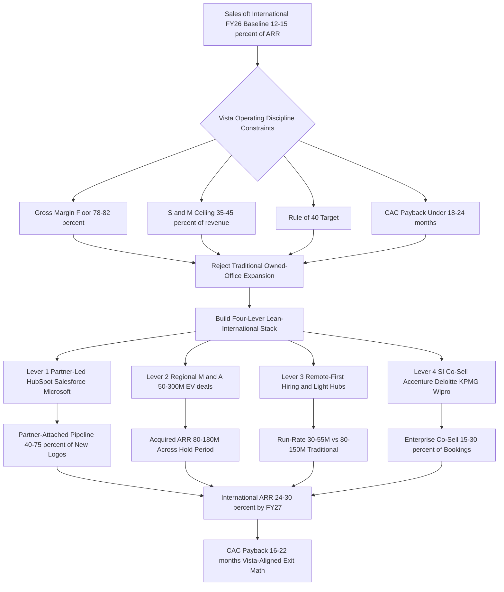

### Direct Answer

Salesloft can grow international revenue from the **12-15% of total ARR** it sits at today to **24-30% by FY27** without breaching Vista Equity Partners' cost-discipline operating model. The mechanism is a deliberate substitution: swap the traditional "open an owned office, hire a full local org, sign a long lease" expansion playbook for a **four-lever lean-international stack** -- partner-led motion riding the HubSpot, Salesforce, and Microsoft Dynamics ecosystems; disciplined regional M&A in the $50-300M EV range; remote-first commercial hiring out of small "light hub" footprints; and system-integrator co-sell. The math is the whole argument: traditional expansion runs $140-275M of annual run-rate to add $80-130M of incremental ARR over 24 months at a 24-36 month payback Vista will reject, while the lean stack delivers the same incremental ARR at $45-95M of run-rate and a 16-22 month payback that clears every Vista gate.

**TL;DR:** International growth at Salesloft under Vista is genuinely achievable, but only if leadership treats the international P&L as a partner-leveraged, M&A-augmented, remote-first commercial machine -- not a recreation of the pre-PE owned-office blueprint. The four-lever lean-international stack routes around each specific Vista constraint (gross-margin floor, S&M ceiling, rule-of-40, CAC payback) while still delivering the international ARR ratio Vista's exit math depends on. Vista has run this exact template successfully at Marketo, Cvent, Datto, Ping Identity, and Mindbody; Salesloft is being asked to execute a proven playbook, not invent a new one. The three things that wreck international expansion under PE ownership -- building owned offices ahead of pipeline, over-hiring local leadership before partner volume justifies the layer, and treating M&A as growth rather than as efficient customer acquisition -- are precisely the failure modes the four-lever stack is engineered to avoid.

## 1. The Setup: Salesloft, Vista, And Why The International Question Matters In 2027

### 1.1 What Salesloft Is And Where It Sits Competitively

Salesloft is the sales-engagement category leader -- a SaaS platform that revenue teams use to sequence outbound and follow-up communications across email, phone, LinkedIn, and SMS, paired with a conversation-intelligence layer (recorded-call analytics, originally pioneered by Gong and Chorus) and, since 2024, AI-driven deal coaching. **The competitive set is dense and well-capitalized.** Salesloft's largest direct competitor is Outreach (private, last valued near $4.4B at its 2021 Series G). At the bottom-up end, Apollo.io (private, last reported near $1.6B+ Series D) has been eating SMB and mid-market share with a product-led-growth model. Gong (private, last priced near $7.25B in 2021) moved upmarket from conversation intelligence into a broader revenue platform. Clari occupies the forecasting and revenue-intelligence layer that increasingly overlaps. And HubSpot (NYSE: HUBS) Sales Hub plus Salesforce (NYSE: CRM) Sales Cloud are the CRM-anchored alternatives that bundle sales-engagement features for free or near-free.

**The strategic frame is that Salesloft is neither a startup nor an independent public company -- it is a Vista portfolio company.** Vista Equity Partners acquired Salesloft in November 2021 in a transaction widely reported around $2.3B enterprise value, taking the company private at what was, in retrospect, near the top of the 2020-2021 SaaS valuation cycle. That ownership structure is the single most important fact for the international question, because Vista is not a hands-off owner.

### 1.2 Why The International Ratio Is The 2027 Question

The 2027 question is no longer "should Salesloft be international?" It already is, with a London EMEA office and customers across roughly 100 countries. **The real operating question is one of ratio and method:** how does Salesloft credibly grow international from the 12-15% of total ARR it sits at today to the 24-30% range that the comparable Vista playbook actually achieved -- while staying inside Vista's cost-discipline guardrails and without rebuilding the high-burn international footprint that PE owners specifically un-build when they take a public SaaS company private?

| Dimension | Pre-PE growth-stage SaaS posture | Vista portfolio-company posture |
|---|---|---|
| International expansion frame | "Plant the flag, figure out economics later" | "Prove unit economics before scaling spend" |
| Office strategy | Owned offices ahead of pipeline | Light hubs plus remote-first |
| Local leadership | Country MD plus RVP plus marketing lead per market | Regional leaders covering multi-country regions |
| M&A purpose | Growth narrative for the next round | Efficient customer acquisition, accretive on multiple |
| Capital patience | 3-year horizon acceptable | 18-24 month CAC payback enforced |
| Review cadence | Annual board update | Monthly operating reviews, quarterly board deep dives |

### 1.3 The Core Thesis In One Paragraph

**The answer the math supports is the four-lever lean-international stack.** Traditional international expansion (owned offices, full local leadership, on-the-ground marketing in every metro) typically runs $140-275M of annual run-rate cost to add $80-130M of incremental international ARR over 24 months -- a payback Vista will not approve at the cost-of-capital and rule-of-40 thresholds Vista enforces. The lean stack runs $45-95M of annual run-rate cost to add the same incremental ARR (plus the additional layer added by the M&A itself), which moves the LTV/CAC ratio above 3:1 and the new-business payback under 18-22 months -- numbers that fit cleanly inside the Vista operating playbook. Everything that follows is the operating detail underneath that thesis.

## 2. What Vista Cost Discipline Actually Means In Practice

### 2.1 The Common Misconception

Founders and operators outside the PE world often hear "Vista cost-cutting" and imagine indiscriminate layoffs and gutted product investment. **That misreads what Vista actually does.** Vista's operating discipline is a structured set of constraints -- the "Vista Standard Operating Procedures" applied across the portfolio with the rigor of a manufacturing playbook -- that get applied to every portfolio company within the first 60-180 days post-close and then shape every subsequent investment decision for the entire hold period. The discipline is not destruction; it is the conversion of loose growth-stage habits into measured, benchmarked, stage-gated capital allocation.

### 2.2 The Six Constraints That Govern International Investment

The relevant guardrails for Salesloft's international question are specific and measurable:

- **Gross margin floor**, typically in the 78-82% range for SaaS, which forces every international cost to be evaluated against its contribution to gross profit, not just to revenue.
- **Sales-and-marketing-as-percent-of-revenue ceiling**, typically pulled into the 35-45% range over the hold period (down from 50-65% at many pre-PE growth-stage SaaS companies), which forces every international hire and every international office to compete against domestic alternatives for the same dollar of S&M spend.
- **Rule-of-40 target** that combines growth rate and free-cash-flow margin to land at 40+ over the hold period, which means international investments that contribute to neither growth nor margin within a defined window get killed.
- **CAC payback period**, typically targeted under 18-24 months for new business, which forces international go-to-market to demonstrate near-term unit economics rather than the "we'll figure it out in three years" patience that pre-PE growth companies accept.
- **Headcount-per-million-ARR ratios** explicitly benchmarked against the rest of the Vista portfolio and against public-company comparables, which prevents the "we need a country manager and a marketing lead and an SE and a CSM in every region" build-out.
- **Structured stage-gates on capex and major opex commitments**, which force any large office lease, any international acquisition, and any major hiring plan through a portfolio-level review where the deal partner and the Vista operating team both sign off.

### 2.3 Why The Constraints Make Traditional Expansion Uneconomic

| Vista constraint | What it kills in traditional expansion | What the lean stack does instead |
|---|---|---|
| Gross margin floor 78-82% | Heavy regional services/localization spend that dilutes margin | Partner-delivered implementation keeps services off Salesloft's P&L |
| S&M ceiling 35-45% | Full direct-sales motion in every country | Partner-attached pipeline lowers CAC 40-60% per logo |
| Rule-of-40 | Multi-year "invest now, return later" regional bets | M&A delivers ARR on day one; partner motion delivers near-term |
| CAC payback under 18-24 months | Owned-office fixed cost committed a quarter before revenue | Variable, headcount-led cost that flexes with bookings |
| Headcount-per-million benchmarking | Country MD plus full org per market | 5-12 regional partner managers globally, not 50 |
| Capex stage-gates | Long real-estate leases | Light hubs of 5-15 desks; remote-first elsewhere |

**None of these guardrails make international growth impossible.** They make traditional, owned-office, full-local-org international growth uneconomic at the scale a portfolio company can defend. The lean-international stack exists precisely because it routes around each constraint while still delivering the international ARR growth Vista's exit math depends on.

## 3. The Salesloft Starting Point: What The International P&L Actually Looks Like

### 3.1 Where International Revenue Sits Today

Before designing the lean stack, an honest look at the baseline is necessary. Salesloft's international revenue -- triangulating publicly reported employee distribution, the London EMEA office, the customer-region breakdowns the company has shared at events, and standard SaaS distribution at Salesloft's scale -- sits in the **$70-110M ARR range out of a roughly $550-720M total ARR**, which puts international at the **12-16% of total** range.

### 3.2 The Geographic Split Inside The International Number

| Region | Share of international ARR | Density notes |
|---|---|---|
| EMEA | 60-70% | UK, Germany, France, Netherlands, Nordics are the dense customer pockets |
| APAC | 15-25% | Australia and Singapore meaningful; Japan structurally underpenetrated |
| LATAM and rest-of-world | 5-15% | Brazil and Mexico the meaningful pockets; partner-only today |

### 3.3 The Current International Cost Structure

The international cost structure today already looks lean by pre-PE standards: a London office of roughly 40-80 people handling EMEA sales, marketing, customer success, and partner functions; smaller APAC presences in Sydney and Singapore that lean partner-heavy; and remote distributed customer-facing roles across additional countries. **International gross margin is roughly in line with the corporate average** -- sales-engagement software does not have geographically variable cost-of-goods at meaningful scale. International S&M-as-percent-of-international-revenue is somewhat elevated versus NORAM, running 45-55% against NORAM's 35-45%, which is typical of any region in build mode. The honest read: Salesloft has a real international beachhead, EMEA is materially productive, APAC is real but smaller, LATAM is partner-only, and the ratio has room to grow without rebuilding the regional cost base. That configuration is exactly what makes the four-lever stack the right play rather than a Salesforce-style "one MD per country plus a regional HQ" build-out that would not survive a Vista quarterly review.

## 4. Lever One: Partner-Led Motion Through The CRM Ecosystems

### 4.1 The Mechanic

The single highest-ROI international lever Salesloft has -- and the one most Vista-aligned -- is leaning hard on the partner ecosystems of the three CRM platforms Salesloft sits adjacent to: **HubSpot (NYSE: HUBS)**, where Salesloft is a deeply integrated sales-engagement layer and HubSpot's mid-market expansion in EMEA and APAC creates genuine pull; **Salesforce (NYSE: CRM)**, the dominant enterprise CRM where Salesloft has deep AppExchange integration and where Salesforce's 5,000-plus global SI partners can attach Salesloft into their delivery; and **Microsoft (NASDAQ: MSFT) Dynamics**, where Salesloft is less embedded historically but where Microsoft's enterprise install base in EMEA -- especially Germany, France, and the Nordics -- is meaningful. Instead of hiring a full-funnel direct-sales motion in every European country, Salesloft co-sells with the partners those CRM platforms have already enabled in those countries.

### 4.2 The Economics Of A Partner-Attached Logo

A partner-driven new logo in a country Salesloft has no office in carries a customer-acquisition cost roughly **40-60% lower** than a direct-sold new logo, because the partner is doing first-line discovery, technical fit, and often deployment. Salesloft pays a referral fee or revenue share (typically 15-25%) but skips the full direct-sales overhead.

| Motion | CAC index | Revenue share to partner | Deployment burden | Speed to first regional logo |
|---|---|---|---|---|
| Direct-sold, owned-office | 100 (baseline) | 0% | Salesloft services team | 9-15 months to ramp |
| CRM-partner-attached | 40-60 | 15-25% | Partner consultant | 2-4 months |
| SI co-sell (see Lever 4) | 55-75 | 15-30% | SI delivery practice | 6-18 month cycles, high ACV |

### 4.3 The Realistic 2027 Contribution

The realistic FY27 contribution is **40-55% of EMEA new-logo bookings and 60-75% of APAC new-logo bookings flowing through partner-attached pipeline**, which materially lifts the international growth rate without proportional headcount additions. HubSpot's solutions-partner ecosystem includes 200-plus EMEA partners and 100-plus APAC partners; Salesforce's includes 5,000-plus global consulting partners with regional concentrations Salesloft can ride into Spain, Italy, Poland, Israel, Korea, and India; Microsoft's Dynamics partners give Salesloft an entry into German-speaking enterprise that pure Salesforce-attached motion would miss.

### 4.4 The Execution Requirement

The execution requirement is not light. Salesloft must invest in formal partner-program infrastructure: a partner certification track (with $500-2,500 per certification revenue and, more importantly, trained partner consultants who can sell and deploy), regional partner managers (5-12 of them globally, not 50), partner-led demand-generation co-marketing budget, and clean rules-of-engagement so the direct sales team does not collide with the partner channel. **Done well, partner-led is the largest single contributor to lean international growth.** The deeper partner-program design questions sit alongside the broader ecosystem-strategy analysis (q1855) and the channel-economics breakdown (q1856).

### 4.5 The Partner-Tiering Model And Why It Matters

A partner program that treats all partners identically fails predictably -- the consultancy that closed two Salesloft-attached deals last quarter and the consultancy that has never sold one cannot receive the same margin, the same lead flow, or the same enablement attention. **The Vista-disciplined approach is an explicit three-tier model** that allocates Salesloft's scarce partner-management capacity by demonstrated production rather than by aspiration. Registered partners get self-serve enablement, the certification track, and deal-registration protection but no dedicated partner manager. Silver partners -- those producing a defined floor of partner-attached pipeline per quarter -- get a fractional partner manager, co-marketing development funds, and earlier access to product roadmap. Gold partners, the small set producing the bulk of partner pipeline in their region, get a named partner manager, joint business planning, executive sponsorship, and the highest revenue-share tier. The tiering matters for the Vista math because it concentrates Salesloft's $4-10M partner-program run-rate on the relationships that actually move ARR, rather than spreading it thinly across a long tail that produces nothing. It also creates a visible advancement ladder that motivates mid-tier partners to invest their own capital in Salesloft competency -- which is the entire point of a partner program: getting other companies to fund Salesloft's go-to-market.

| Partner tier | Production floor | What Salesloft provides | Revenue share | Partner-manager coverage |
|---|---|---|---|---|
| Registered | None | Self-serve enablement, certification track, deal registration | 15% | None |
| Silver | Defined quarterly pipeline floor | Co-marketing funds, fractional partner manager, roadmap access | 18-20% | Fractional / shared |
| Gold | Top partner-attached pipeline in region | Named partner manager, joint business planning, executive sponsorship | 22-25% | Dedicated |

### 4.6 The Rules-Of-Engagement Discipline

The single most common failure in partner-led international motion is channel conflict -- the direct sales team and a partner pursuing the same account, the customer receiving two different quotes, and the resulting trust erosion on both sides. **Salesloft must publish and enforce a deal-registration system** where a partner that registers a qualified opportunity first holds it for a defined window, the direct team is compensated as a neutral or supporting party rather than competing, and disputes escalate to a single named arbiter rather than to a shouting match between sales leaders. The discipline is not bureaucratic overhead; it is what makes partners willing to invest discovery effort in Salesloft-attached deals, because they trust the pipeline they build will not be taken from them. Without enforced rules-of-engagement, the partner motion degrades within two quarters as partners learn they cannot rely on it.

## 5. Lever Interaction: How The Four Levers Compound

The four levers are frequently described as if they operate independently, but the strategic value comes from how they reinforce each other. **A regional acquisition (Lever 2) does not just add ARR -- it adds a partner network**, because the acquired company arrives with its own CRM-consultancy and SI relationships that fold into Salesloft's Lever 1 and Lever 4 motions. **A strong partner motion (Lever 1) lowers the cost of remote-first hiring (Lever 3)**, because remote AEs attached to a partner ecosystem inherit market context, warm introductions, and co-selling support that an unattached remote AE would have to build alone. **SI co-sell (Lever 4) raises the average deal size across the whole international portfolio**, which improves the unit economics that Vista evaluates Levers 1 and 3 against. The practical implication for sequencing is that the levers should not be built in isolation or on separate timelines managed by separate leaders -- they should be governed by a single international operating leader who can see the compounding and deliberately route, for example, an acquired company's partner relationships into the broader partner program rather than letting them atrophy as a side effect of integration.

The compounding also runs in the other direction as a risk: a weakness in one lever drags the others down. If the partner motion is under-built, the remote-first AEs lose their warm-introduction engine and revert to expensive cold direct selling. If an acquisition is mishandled, the partner network that came with it lapses and the SI relationships the acquired company held go cold. The governance lesson is that the international operating leader's most important job is not running any single lever well -- it is managing the interfaces between them, because that is where both the compounding value and the cascading risk actually live.

## 6. Lever Two: Disciplined Regional M&A In The $50-300M EV Range

### 6.1 The Logic Of M&A As Customer Acquisition

The second lever is regional M&A -- using Vista's M&A capacity to buy local sales-engagement, conversation-intelligence, and revenue-tooling players that come pre-loaded with installed customers, regional brand recognition, and on-the-ground go-to-market that would take Salesloft 18-36 months and $40-80M to build organically. **The framing matters: this is M&A as efficient customer acquisition, not M&A as a growth narrative.** The targets are not the marquee public-comp competitors -- Outreach is roughly Salesloft's size, Gong is larger and at a different price point, Apollo is privately held at a high valuation. The targets are the regional category players in the $30-200M ARR range that operate strongly in one or two regions and have not built global presence.

### 6.2 Target Archetypes By Region

| Region | Target archetype | What the asset actually is |
|---|---|---|
| EMEA / DACH | German conversation-intelligence and SDR-tooling players | Installed enterprise base plus German-language workflow depth |
| EMEA / UK and Nordics | Sales-engagement adjacent tooling | Customer contracts plus mature partner relationships |
| EMEA / France | Revenue-operations tooling layer | Local GTM team plus French enterprise references |
| APAC / ANZ | Sydney/Singapore-headquartered sales-engagement adjacencies | Regional brand plus ANZ direct motion |
| APAC / Japan | Japan-specific workflow tools | The only credible entry path for a US-headquartered company |

### 6.3 The Vista-Aligned M&A Discipline

The M&A budget Vista will entertain for a portfolio company at Salesloft's scale runs in the **$200-500M total range across the hold period**, with individual transactions typically capped at $50-300M EV -- big enough to be meaningful, small enough to avoid the integration risk that scuttles large deals. The discipline is specific:

- **Acquire revenue at a multiple lower than Salesloft's own implied multiple**, so the deal is accretive on the LTV/CAC math.
- **Prioritize installed-customer-base value over technology that overlaps** with Salesloft's existing stack -- the customers and contracts are the asset, not the duplicate features.
- **Use earn-outs and stock-based retention to keep founders and key sales leaders 24-36 months post-close**, because the regional GTM expertise is the second asset.
- **Integrate go-to-market fast (6-12 months) but consolidate product slowly (18-36 months)** so the customer base does not experience sudden disruption.

### 6.4 The Comparable Pattern

Datto under Vista did exactly this with regional MSP-tooling acquisitions across EMEA and ANZ; Ping Identity under Vista bundled regional identity-and-access players; Mindbody used regional fitness-software acquisitions to enter ANZ and parts of EMEA. **Done with discipline, $200-500M of regional M&A across the hold period adds $80-180M of incremental international ARR** at a per-dollar-of-ARR cost meaningfully better than building it organically. The integration-discipline detail connects to the broader M&A-integration analysis (q1857) and the buy-versus-build framework (q1858).

### 6.5 The Integration Failure Modes To Pre-Empt

Regional M&A reads cleanly on a spreadsheet and underperforms in practice for a predictable set of reasons -- and a Vista-disciplined acquirer designs the deal structure specifically to pre-empt each one. **The first failure mode is customer churn during the transition:** acquired customers, uncertain about the future of a product they depend on, start evaluating alternatives the day the deal is announced. The pre-emption is a clear and immediate customer-communication plan, an explicit multi-year product-support commitment, and a deliberate decision to keep the acquired product running unchanged for 18-36 months even though it overlaps with Salesloft's stack. **The second failure mode is founder and sales-leader flight:** the regional GTM expertise that was half the reason for the deal walks out within a year. The pre-emption is the earn-out and stock-based retention structure plus genuine role design -- the acquired sales leader should run the region, not be demoted into a reporting line under an existing Salesloft VP. **The third failure mode is integration-team overload:** two or three acquisitions integrating concurrently overwhelm the engineering and operations capacity, and all three integrations slip. The pre-emption is the staging discipline -- never run two integrations in the same window, and treat the second acquisition's timing as contingent on the first integration reaching a defined stability milestone.

### 6.6 The M&A-To-Lever-One Handoff

The most underappreciated value in a regional acquisition is not the ARR and not the product -- it is the partner network the acquired company arrives with. **A regional sales-engagement player that has been selling in Germany or Australia for years has accumulated CRM-consultancy relationships, SI contacts, and reseller agreements** that took it years to build, and those relationships are immediately useful to Salesloft's Lever 1 partner motion. The discipline is to treat the acquired company's partner relationships as a named integration workstream with its own owner, rather than letting them quietly lapse because the integration team is focused on systems and headcount. Done well, a $100-200M EV acquisition delivers not just $30-80M of ARR but a pre-built regional partner ecosystem that compresses the Lever 1 ramp in that region by a year or more.

## 7. Lever Three: Remote-First Commercial Hiring And Light Hub Footprints

### 7.1 The Cost Line This Lever Attacks

The third lever attacks the single largest cost line in traditional international expansion: real estate plus the full local org structure that real estate implies. **The traditional motion is brutal on the P&L** -- open a London headquarters with 80-150 desks, a Munich office with 30-50 desks, a Paris office, a Sydney office, a Singapore office, a Tokyo office, each with its own MD, marketing lead, RVP, AEs, SEs, CSMs, support, and admin. That runs $80-150M annually at scale and locks in fixed costs that cannot flex with bookings.

### 7.2 The Lean Alternative

The lean alternative is **light hubs of 5-15 people in 4-6 cities** (London, Berlin or Munich, Sydney, Singapore for sure; Paris and Tokyo as later additions) for the small set of roles that genuinely require physical presence -- in-person enterprise selling, executive office space for client meetings, regional marketing and event hub -- combined with **remote-first hiring of 80-130 commercial roles** (AEs, SDRs, CSMs, partner managers, marketing) distributed across the countries Salesloft is serving, working from home offices and traveling to the light hubs and to client sites as needed.

| Cost line | Traditional owned-office | Lean light-hub plus remote-first |
|---|---|---|
| Real estate, annual | $25-60M | $3-8M |
| Loaded commercial headcount, annual | $50-90M (full-office cost) | $25-45M (70-90% of US comp, remote) |
| Total run-rate, annual | $80-150M | $30-55M |

### 7.3 The Honest Objections And Their Answers

The objections to remote-first international are real but solvable:

- **"Remote AEs lack local market knowledge."** Solved by hiring locals into the remote roles and attaching them to partner ecosystems that bring market context.
- **"Enterprise selling needs in-person meetings."** Solved by the light hubs plus a real travel budget for the deals that warrant it -- which is most enterprise pursuits, but a small minority of total deals.
- **"You cannot build a regional culture remote."** Partially true and partially overstated -- the regional culture that matters is around customer engagement and partner relationships, not bonding in a shared office.
- **"Compensation parity issues across countries."** Real; requires a deliberate global comp framework, but very solvable.

### 7.4 The Vista Alignment

The Vista alignment on this lever is direct: it converts the largest fixed-cost line in international expansion -- real estate plus implied org structure -- into a variable, scalable, headcount-led cost that responds to bookings rather than committing ahead of them. The remote-org-design questions sit alongside the distributed-team operating analysis (q1859).

### 7.5 Employer-Of-Record Versus Owned Entity

A practical question that determines whether the remote-first model actually stays lean is the legal-entity question: how does Salesloft employ an AE in Poland, a CSM in Spain, or a partner manager in Israel without standing up a registered subsidiary, a local payroll function, and a tax-compliance apparatus in each country? **The answer that keeps the model lean is the employer-of-record (EOR) approach** for the first wave of hires in any new country -- a third-party EOR provider holds the legal employment relationship, handles local payroll, benefits, and statutory compliance, and bills Salesloft a per-employee fee. The EOR fee runs a few hundred to roughly a thousand dollars per employee per month, which is trivial against the cost and lead time of incorporating an owned entity. The discipline is to use EOR until a country crosses a defined headcount threshold (commonly in the 15-25 employee range) at which point an owned entity becomes cheaper and the country has, by definition, proven enough demand to justify the permanence. This staged approach means Salesloft never commits the fixed cost of a legal entity ahead of revenue -- exactly the same logic that drives the light-hub real-estate decision -- and it lets the international footprint expand into a new country in weeks rather than the six-to-twelve months a subsidiary incorporation requires.

### 7.6 The Enablement And Accountability Spine

Remote-first only works if enablement and accountability are deliberately engineered rather than assumed. The failure mode is a remote AE in a new market who is under-ramped, under-coached, and invisible to leadership until a bad quarter exposes the problem. **The spine that prevents this has three parts:** a structured 90-day onboarding that is identical regardless of geography, so a remote hire in Madrid ramps on the same curriculum and the same milestone checkpoints as a hire in the Atlanta headquarters; a manager-of-managers ratio that stays tight enough (one frontline manager per six-to-eight remote reps) that coaching does not degrade over distance; and a metrics dashboard that surfaces per-rep activity, pipeline, and conversion in near-real-time so a struggling remote rep is identified in weeks rather than quarters. The Vista relevance is that this spine is what makes remote-first headcount as productive per dollar as office-based headcount -- and productivity-per-dollar is exactly the benchmark Vista applies. A remote-first model without an enablement spine does not save money; it just relocates the same cost into churned hires and missed pipeline.

## 8. Lever Four: System Integrator And Reseller Co-Sell

### 8.1 The Mechanic And The Buyer

The fourth lever -- the one most underused by sales-engagement category vendors generally -- is formal co-sell relationships with the global system integrators (Accenture (NYSE: ACN), Deloitte, KPMG, EY, Wipro (NYSE: WIT), Infosys (NYSE: INFY), TCS, Capgemini) and with regional CRM consultancies (Slalom, Bluewolf-now-IBM, OSF Digital, Cprime, Rightpoint, NTT Data Business Solutions). **The mechanic is similar to the CRM-partner motion but operates at a different deal size and with a different buyer.** SIs sell to Fortune 500, Global 2000, and large enterprise customers as part of broader CRM-and-revenue-platform engagements where a sales-engagement layer is a natural attach. The SI does the discovery, the architectural fit, the deployment, the change management, and the ongoing services, while Salesloft provides the platform and a co-sell motion that supports the SI through enablement, joint pursuits, and dedicated alliance management.

### 8.2 The Different Economics

| Dimension | CRM-partner motion | SI co-sell motion |
|---|---|---|
| Typical deal ACV | $20-80K | $100K-$1M+ |
| Sales cycle | 2-5 months | 6-18 months |
| Partner economics share | 15-25% | 15-30% |
| Customer profile | SMB to mid-market | Enterprise, sticky, high expansion |
| Churn profile | Moderate | Very low |

### 8.3 The International Application

The international application is where the value compounds. SIs have deep regional presence in countries Salesloft has no direct sales motion in -- Accenture's German practice, Deloitte's UK and France practices, KPMG's Australia and Japan practices, Wipro and Infosys in India and across Asia, Capgemini in France and Germany. **A properly built SI co-sell motion turns those SI regional teams into Salesloft's de facto enterprise sales force in those geographies.** The discipline required: dedicated SI alliance leaders (3-6 globally, hired from the SI world so they speak the language); SI-specific enablement and pursuit support; clear rules-of-engagement to prevent direct-sales collision; co-developed reference architectures that make the SI's job easier; and executive sponsorship at the Salesloft level, because SI relationships are senior-to-senior and must be cultivated as such.

### 8.4 The Realistic Contribution

The realistic FY27 contribution: SI co-sell drives **15-30% of enterprise international bookings** in the regions where it is built well, on top of the partner-ecosystem and direct contributions, and it is the single highest-ACV motion of any of the four levers. The SI-alliance design detail connects to the enterprise-motion analysis (q1860).

## 9. The Region-By-Region Strategic Build

### 9.1 EMEA: The Deepest Combination Of All Four Levers

**EMEA (UK, Germany, France, Nordics, Benelux, Spain, Italy, Israel)** is the largest international region and gets the deepest combination of all four levers: a real London hub of 40-80 people anchoring direct enterprise selling and partner management; a smaller Berlin or Munich light hub of 10-20 anchoring DACH coverage; remote-first AEs and CSMs distributed across France, the Nordics, Benelux, Spain, and Israel; deep partner motion through HubSpot's EMEA partner network and Salesforce's EMEA SI partners; SI co-sell with Accenture, Deloitte, KPMG, Capgemini, and regional SIs (Sopra Steria, Atos, T-Systems); and one or two regional acquisitions to add installed customer base and product depth. **The EMEA target by FY27 is $140-210M ARR (up from $50-80M today)**, representing the bulk of total international growth.

### 9.2 APAC: Smaller, More Partner-Leveraged

**APAC (Australia, Singapore, Japan, India, Korea, Southeast Asia)** is structurally smaller and more partner-leveraged: a Sydney light hub of 8-15 people covering ANZ; a Singapore light hub of 6-12 covering Southeast Asia and serving as the regional partner-management base; remote-first AEs in Australia and Singapore primarily; deep partner reliance for Japan (the language and workflow-cultural barrier makes direct entry inefficient); partner-only motion for India and Southeast Asia outside Singapore; and a small regional acquisition or two if the right targets emerge. **The APAC target by FY27 is $45-75M ARR (up from $15-25M today)**, with the heaviest growth coming from ANZ direct and Japan via partners.

### 9.3 LATAM And NORAM-International

**LATAM (Brazil, Mexico primarily)** stays partner-only with a small remote presence of 3-8 commercial people total -- the regional revenue is real, but the cost-to-serve directly does not pencil at Vista discipline thresholds. The LATAM target is **$15-30M ARR by FY27** (up from $5-15M today). **NORAM-international (Canada and Mexico)** is already well-covered by the US team with light dedicated coverage and stays roughly that way, contributing **$45-65M ARR by FY27**. The region-prioritization logic connects to the market-sequencing analysis (q1862).

## 10. The Comparable Vista International Playbook

### 10.1 What Other Portfolio Companies Actually Did

The strongest support for the four-lever stack is that other Vista portfolio companies have run it and achieved international ratios in the 25-40% range without breaching cost discipline. **Marketo** (acquired by Vista in 2016, sold to Adobe (NASDAQ: ADBE) in 2018 for $4.75B) ran a partner-heavy international motion -- the partner ecosystem was central to EMEA and APAC growth, and the eventual Adobe acquisition leveraged Adobe's own international footprint as the final layer; international landed in the 22-28% of total revenue range at sale. **Cvent** (acquired by Vista in 2016, taken public 2021, re-take-private by Blackstone (NYSE: BX) 2023) built international through partner motion, regional M&A in event-tech, and direct expansion in select markets; international landed in the 25-30% range. **Datto** (acquired by Vista in 2017, sold to Kaseya 2022 for $6.2B) ran perhaps the cleanest comparable, growing international from sub-20% to 35-40% through aggressive regional MSP-tooling M&A, partner-channel-led GTM, and remote-first sales motion. **Ping Identity** (acquired by Vista in 2016, taken public 2019, re-take-private by Thoma Bravo 2022 for $2.8B) built international through partner motion, light regional offices, and selective regional M&A; international hit roughly 30% at peak. **Mindbody** (acquired by Vista in 2019) used the same template adapted for a vertical-SaaS-meets-marketplace model.

### 10.2 The Consistent Pattern

The pattern is consistent across all five comparables: **partner-led plus disciplined M&A plus light hubs plus remote-first is the Vista international template, and it has demonstrably worked.** Salesloft is not being asked to invent a new playbook; it is being asked to execute one Vista has run multiple times. The portfolio-pattern analysis connects to the PE-operating-model breakdown (q1863).

## 11. The Honest Cost-Discipline Math

### 11.1 Traditional Expansion Costed Out

The numbers underneath the four-lever stack are what make it work for Vista, and they deserve to be laid out plainly. Traditional international expansion at Salesloft's scale -- "open offices in eight cities, hire 300 people, sign long real-estate leases, build a full local marketing function in every major country" -- looks like:

| Cost line | Annual run-rate |
|---|---|
| Real estate, big offices in expensive cities | $25-60M |
| Fully loaded headcount, 250-400 people at full-office cost | $80-150M |
| Regional marketing budget | $15-30M |
| Regional product localization and engineering | $8-15M |
| G&A and admin loading | $10-20M |
| **Total run-rate** | **$140-275M** |

That delivers, in a good case, **$80-130M of incremental international ARR over 24 months** -- a payback running 24-36 months on new business that fails Vista's CAC-payback and rule-of-40 tests.

### 11.2 The Lean Four-Lever Stack Costed Out

The lean stack at the same scale of ambition -- 24-30% international by FY27 -- looks like:

| Cost line | Annual run-rate |
|---|---|
| Light-hub real estate | $3-8M |
| Fully loaded remote-first commercial headcount, 80-130 people | $25-45M |
| Partner-program investment (managers, certifications, co-marketing) | $4-10M |
| SI alliance investment | $3-6M |
| Regional marketing (smaller; partner co-marketing carries half) | $6-12M |
| M&A integration cost, amortized over hold period | $5-12M |
| **Total run-rate** | **$45-95M** |

That delivers the same **$80-130M of incremental international ARR over 24 months**, plus the additional ARR layer added by the M&A itself -- a payback running 14-22 months and a configuration that passes Vista's CAC-payback, rule-of-40, and S&M tests with room to spare. **The savings are not small ($90-180M annually in run-rate), and they are precisely the savings that convert "international growth" from a Vista no to a Vista yes.**

## 12. Why Salesloft Specifically Can Run This Stack Better Than Most

### 12.1 The Five Structural Advantages

A founder might reasonably ask: if this lean stack is so obviously right, why doesn't every PE-owned SaaS company do it? The honest answer is that Salesloft has specific structural advantages that make the stack particularly executable:

- **The CRM-adjacency advantage.** Salesloft's product sits on top of HubSpot (NYSE: HUBS), Salesforce (NYSE: CRM), and Microsoft (NASDAQ: MSFT) Dynamics -- the three largest CRM ecosystems globally, with the deepest and most mature partner channels. Salesloft can ride them in a way that a horizontal collaboration tool or a vertical workflow tool cannot.
- **The conversation-intelligence and AI layer.** Salesloft's expansion into AI-driven coaching creates natural attach to SI engagements, as Accenture, Deloitte, and the regional SIs increasingly build practices around AI-augmented sales transformation.
- **The international beachhead already exists.** Salesloft is not starting from zero in EMEA -- the London office, the EMEA customer base, and existing partner relationships mean the lean stack is an extension of an existing motion, not a from-scratch build.
- **The category fit for partner motion.** Sales-engagement benefits enormously from partner-led implementation -- building sequences, training reps, integrating with CRM, operationalizing the motion is exactly what SI and CRM-partner consultancies do well. Pure self-serve SaaS categories cannot use partners the same way.
- **The Vista institutional knowledge.** Vista has run this exact playbook at Marketo, Cvent, Datto, Ping, and Mindbody, giving the Salesloft team a pattern library and operating-team experts who have done this before.

### 12.2 The Net Read

Combined, these structural advantages mean Salesloft is not just a candidate for the lean-international stack -- it is one of the better-positioned PE-owned SaaS companies of its generation to actually execute it. The competitive-positioning angle connects to the category-leadership analysis (q1864).

## 13. The Sequencing: A Realistic 24-Month Build Plan

### 13.1 The Four Phases

The four-lever stack does not get built all at once. An honest 24-month sequencing plan is what makes it executable:

| Phase | Months | Primary work |
|---|---|---|
| Design and operating plan | 1-3 | Lock strategy, set FY27 regional targets, build the Vista-compliant cost model, identify 3-6 M&A candidates, define partner-program operating model, scope SI build, identify first 30-50 remote hires |
| Foundation building | 4-9 | Hire regional partner managers and SI alliance leaders, hire first 30-50 remote AEs/SDRs/CSMs, launch partner certification program, sign 3-6 strategic SI agreements, close first regional acquisition if ready |
| Scaling | 10-15 | Expand remote headcount to 60-100, lift partner-attached pipeline to 25-40% of regional bookings, deepen SI co-sell to 10-20% of enterprise international bookings, close a second acquisition if appropriate |
| Optimization | 16-24 | Tune by region, add/trim light hubs, grow remote headcount to 80-130, complete acquisition integrations, deepen partner motion to 40-55% EMEA / 60-75% APAC, demonstrate international ratio approaching 24-28% |

### 13.2 Why The Order Matters

The sequencing matters because **if the partner motion and SI motion are not built first, the remote-first commercial hiring becomes a direct-sales motion competing without partner leverage** and the unit economics get much worse; and **if the M&A is rushed, integration risk can swamp the rest of the stack.** The right cadence is partner first, SI second, remote-first hiring in parallel and accelerating as partner pipeline fills, M&A added in two carefully staged transactions across the 24 months.

### 13.3 The Operator's Reporting Discipline

A founder running this build should expect quarterly stage-gates with the Vista operating team and should over-communicate progress on the unit-economics metrics Vista tracks. **International investment delivering against unit-economics targets gets the next wave of capital; international investment that drifts gets capital pulled back to NORAM.** The build-plan detail connects to the GTM-sequencing analysis (q1865).

## 14. What Salesloft Should Stop Doing Internationally

### 14.1 The Six Explicit "Stops"

Equally important to what Salesloft should do is what it should explicitly stop doing or never start, because the cost-discipline math depends as much on saying no as on saying yes:

- **Stop the country-manager-everywhere instinct.** Use a small set of regional leaders covering multi-country regions, with country-specific commercial leadership only where pipeline volume materially supports it.
- **Stop owned-office expansion past the light-hub footprint.** Every additional full-floor office is a permanent cost commitment that reduces flexibility, and the marginal productivity gain over a light hub plus remote-first is small.
- **Stop building regional product variants without partner co-funding.** If a regional partner or customer will not co-fund a localized build, the localization is probably not the right investment.
- **Stop SI relationships that have not produced pipeline in 12 months.** Invest meaningfully in 6-12 SI relationships globally that are demonstrably producing, not 30 that produce nothing.
- **Stop discounting to win regional logo plays at low ACVs.** Buying the first 20 customers in a new country at 50% list produces a permanent pricing-comparable problem that is very hard to unwind.
- **Stop standalone regional marketing programs that do not amplify partner co-marketing.** Regional marketing dollars are most efficient when leveraged through partner co-marketing motions.

### 14.2 The Discipline Of Both Sides

The discipline is to be deliberate about both sides of the equation -- what to invest in and what to refuse to invest in -- because in a Vista portfolio company the cost of doing the wrong thing is not just the wasted dollars; it is the displacement of the right thing.

## 15. Counter-Case: What Could Make This Hard Or Wrong

### 15.1 The Honest Counter-Pressures

The four-lever stack is the right strategy, but it is not easy, and a serious operator must be honest about what can erode it -- or about the scenarios where the strategy itself is wrong.

| Counter-pressure | Why it threatens the stack | Mitigation |
|---|---|---|
| Outreach competitive overhang | Outreach is also private, also under pressure, also running an international playbook; if it moves first in a region, partner-led loses its primary asset | Move first; lock exclusive-feeling partner relationships |
| Apollo PLG threat at the bottom | Apollo's product-led-growth model pulls international SMB/mid-market away from the assisted-sale motion | Focus the stack on mid-market and enterprise where assisted sale wins |
| HubSpot direct-competition risk | HubSpot Sales Hub expansion can replace a standalone sales-engagement layer in some segments | Diversify partner reliance across all three CRM ecosystems |
| Salesforce direct-competition risk | Salesforce-native tooling can erode standalone-platform value | Lean into conversation-intelligence/AI differentiation |
| M&A integration risk | Regional acquisitions underperform when integration is mishandled; founders leave too soon | Stage two deals across 24 months, never concurrent integrations |
| Remote-first execution risk | Remote AEs underperform with uneven hiring or weak enablement | Disciplined hiring bar, strong enablement, light-hub anchors |
| Vista exit-timeline pressure | If the exit window is near, 18-30 month international bets may not mature in time | Sequence shorter-payback levers (partner, M&A) first |
| Macro enterprise-SaaS slowdown | Reduces the absolute size of the international opportunity | Stress-test targets quarterly against actual bookings |

### 15.2 The Scenario Where The Strategy Is Genuinely Wrong

The strongest counter-case is not a risk to mitigate but a condition under which the strategy should not be run at all. **If Vista's exit window for Salesloft is inside 18-24 months, the international build should be deliberately throttled rather than accelerated** -- an 18-30 month maturation curve cannot deliver inside a 12-month exit window, and capital is better spent on NORAM expansion and margin optimization that move the exit multiple immediately. Likewise, **if a strategic acquirer with its own international footprint (an Adobe-style buyer) is the likely exit path, building international organically is partially redundant** -- the acquirer supplies the international distribution as the final layer, exactly as happened when Adobe acquired Marketo. In both cases the honest answer is that the four-lever stack is the right strategy for a 3-5 year hold with a financial-sponsor or IPO exit, and the wrong strategy for a near-term strategic sale. None of these counter-pressures individually defeats the strategy; together they mean the stack must be executed with discipline, sequenced deliberately, and stress-tested quarterly against actual booking and pipeline data, not just plan numbers.

## 16. What Success Looks Like By FY27: Bull, Base, And Bear

### 16.1 The Three Cases

A founder running this should be honest about the range of outcomes, because Vista will model bull, base, and bear and hold the team accountable to a range, not a single point.

| Metric | Bull case | Base case | Bear case |
|---|---|---|---|
| International as % of total ARR | 27-30% | 22-25% | 17-20% |
| Total ARR landed | $850M-$1.05B | $760M-$910M | $700M-$830M |
| International ARR | $230-310M | $170-225M | $120-165M |
| EMEA ARR | $145-200M | $110-150M | depressed |
| APAC ARR | $55-80M | $35-55M | depressed |
| Partner-attached pipeline | 50-70% of new logos | 35-55% | underperforming |
| SI co-sell share of enterprise | 18-28% | 12-20% | underperforming |
| Regional acquisitions completed | 2, integrated | 1-2 | delayed or absent |
| International S&M run-rate | $70-100M | $50-80M | $40-65M |
| International CAC payback | Under 18 months | 18-24 months | Over 24 months |

### 16.2 The Strategic Read

The bull case is achievable if execution holds, the base case is the realistic target, and the bear case is what happens if the stack is built without discipline. **Vista will manage the team to the base case while structuring incentives toward the bull.** The scenario-modeling approach connects to the forecasting-discipline analysis (q1851) and the board-reporting framework (q1852).

## 17. The Operator's Lifestyle Inside A Vista Portfolio Company

### 17.1 The Three Rhythms

For the operator running this -- the Chief Revenue Officer, the head of International, or the CEO -- the daily reality is shaped by three rhythms that should be expected from the start:

- **The Vista operating cadence.** Monthly business reviews with the Vista operating team, quarterly board reviews with the deal partner and operating partners, semiannual deep dives on international specifically, and constant comparison to other Vista portfolio companies on the same metrics. The operator who shows up with international CAC payback at 16 months and partner-attached pipeline at 45% gets the next wave of capital; the operator who shows up with payback at 28 months and unclear partner contribution gets capital pulled.
- **The travel reality.** International leadership in the lean stack still involves meaningful travel -- to the light hubs to maintain culture and accountability, to SI senior partners for executive sponsorship, to acquisition targets for diligence and integration, to key customer accounts for in-person enterprise pursuits. It is leaner than the country-manager-everywhere model but not a remote-comfortable role.
- **The metrics-driven mindset.** Every decision -- which partner to invest in, which SI to deepen, which region to acquire in, which remote hires to make where -- gets evaluated against a clear set of unit-economics metrics. The operator who internalizes that framework moves faster and earns more capital than the operator who pushes back on the metrics regime.

### 17.2 The Trade-Off

The daily texture is more "operating-discipline-and-Vista-rhythm" than the founder-led pre-PE texture some operators are used to. The upside is that done well, the operator running international successfully inside a Vista portfolio company is building a credential that compounds across the next portfolio role. The operating-cadence detail connects to the PE-portfolio-operator analysis (q1853) and the RevOps-leadership framework (q1854).

## 18. The Operating Journey: Building The Four-Lever Stack Inside Vista Discipline

## 19. The Summary Tables

### 19.1 The Four-Lever Cost And Revenue Math

| Lever | Annual run-rate cost | Incremental ARR by FY27 | CAC payback | Vista approval profile |
|---|---|---|---|---|
| 1. Partner-led (HubSpot, Salesforce, Microsoft) | $4-10M | $50-90M | 12-18 months | Strong yes |
| 2. Regional M&A ($50-300M EV per deal) | $200-500M total hold; $5-12M annual integration | $80-180M (acquired plus organic lift) | Payback via deal accretion | Yes if accretive |
| 3. Remote-first hiring (80-130 people, light hubs) | $30-55M | $50-90M | 14-22 months | Yes vs traditional offices |
| 4. SI co-sell (Accenture, Deloitte, KPMG, Wipro) | $3-6M | $30-70M (enterprise ACVs) | 18-24 months long-cycle | Strong yes (high ACV) |
| Combined four-lever stack (FY27) | $45-95M run-rate (ex-M&A capital) | $190-310M total international ARR | Blended 16-22 months | Vista-aligned |
| Comparison: traditional owned-office | $140-275M run-rate | $80-130M | 24-36 months | Vista likely no |

### 19.2 Region-By-Region FY27 Targets And Lever Mix

| Region | FY26 ARR | FY27 ARR target | Lever 1 partner | Lever 2 M&A | Lever 3 remote-first | Lever 4 SI | Light hubs |
|---|---|---|---|---|---|---|---|
| EMEA (UK, DACH, France, Nordics, Benelux, Iberia, Italy, Israel) | $50-80M | $140-210M | 40-55% of logos | 1-2 deals | 50-80 remote AEs/CSMs | 18-28% enterprise | London 40-80, Berlin 10-20 |
| APAC (ANZ, Singapore, Japan, Korea, India, SEA) | $15-25M | $45-75M | 60-75% of logos | 0-1 deal | 20-35 remote AEs/CSMs | 12-20% enterprise | Sydney 8-15, Singapore 6-12 |
| LATAM (Brazil, Mexico, Colombia, Argentina) | $5-15M | $15-30M | 80-90% of logos | None planned | 3-8 remote AEs | Under 10% | None planned |
| NORAM-international (Canada, Mexico) | $25-35M | $45-65M | 30-45% of logos | None planned | Existing US team | 15-25% | None planned |
| Total international | $95-155M | $245-380M | 45-65% blended | $200-500M M&A capital | 75-130 remote headcount | 15-25% blended | 2 anchor plus 2-4 light |

### 19.3 Comparable Vista Portfolio International Outcomes

| Vista portfolio company | Acquired | Hold | International % at acquisition | International % at exit/peak | Primary levers | Exit outcome |
|---|---|---|---|---|---|---|
| Marketo | 2016 | 2 years | ~20% | 22-28% | Partner-led, light direct, Adobe leverage | Adobe $4.75B (2018) |
| Cvent | 2016 | Public 2021, re-private 2023 | ~22% | 25-30% | Partner-led, event-tech M&A, select direct | Blackstone re-take-private |
| Datto | 2017 | 5 years | <20% | 35-40% | Aggressive regional MSP M&A, partner channel, remote-first | Kaseya $6.2B (2022) |
| Ping Identity | 2016 | Public 2019, re-private 2022 | ~22% | ~30% | Partner-led plus SI, light offices, selective M&A | Thoma Bravo $2.8B (2022) |
| Mindbody | 2019 | Held | ~15% | 20-25% | Vertical-SaaS regional M&A, partner-led, ANZ direct | Held in portfolio |
| Salesloft (target by FY27) | 2021 | In hold | 12-15% | 24-30% target | Four-lever lean stack | Future exit |

### 19.4 The Vista Gate-Pass Scorecard

| Vista gate | Threshold | Traditional expansion | Four-lever lean stack |
|---|---|---|---|
| Gross margin floor | 78-82% | At risk from regional services | Maintained (partner-delivered) |
| S&M as % of revenue | 35-45% ceiling | Breached (50%+ regional) | Inside ceiling |
| Rule of 40 | 40+ | Drag from multi-year burn | Neutral-to-positive |
| CAC payback | Under 18-24 months | 24-36 months (fail) | 16-22 months (pass) |
| Headcount per $M ARR | Benchmarked | High (full local orgs) | Lean (remote-first) |
| Capex stage-gate | Portfolio review | Long leases flagged | Light hubs clear easily |

## 20. The Bottom Line

**International growth at Salesloft under Vista is genuinely achievable -- the four-lever lean-international stack can move the international ratio from 12-15% to 24-30% of total ARR by FY27.** The strategy works because it is not a compromise version of traditional expansion; it is a structurally different machine. Partner-led motion lowers CAC 40-60% per logo by riding the HubSpot, Salesforce, and Microsoft ecosystems. Disciplined regional M&A buys installed customer bases at accretive multiples instead of building them organically over three years. Remote-first hiring out of light hubs converts the largest fixed-cost line -- real estate plus implied org structure -- into a variable cost that flexes with bookings. SI co-sell turns Accenture, Deloitte, KPMG, Wipro, and the regional integrators into a de facto enterprise sales force in geographies Salesloft has no direct presence in. The combined run-rate is $45-95M against $140-275M for the traditional alternative, delivering the same incremental ARR at a 16-22 month payback that clears every Vista gate.

The discipline that makes it real is the discipline of sequencing and refusal: partner motion and SI motion built first so remote-first hiring inherits partner leverage rather than competing without it; M&A staged into two deliberate transactions rather than concurrent integrations; and an explicit list of things to stop doing -- country managers everywhere, owned offices past the light-hub footprint, un-co-funded localization, dead SI relationships, logo-discounting, standalone regional marketing. **The honest counter-case is that the strategy is wrong for a near-term strategic exit** -- if Vista's exit window is inside 18-24 months or an Adobe-style acquirer is the likely buyer, the international build should be throttled rather than accelerated. But for the 3-5 year hold with a financial-sponsor or IPO exit, the four-lever stack is the proven path: Vista has run it at Marketo, Cvent, Datto, Ping Identity, and Mindbody, and Salesloft -- with its CRM-adjacency advantage, its existing EMEA beachhead, and its category fit for partner-led implementation -- is one of the better-positioned PE-owned SaaS companies of its generation to execute it. Treat the international P&L as a partner-leveraged, M&A-augmented, remote-first commercial machine, report relentlessly on the unit economics, and the international ratio Vista's exit math depends on becomes a base-case outcome rather than a hope.

## 21. Sources

1. Vista Equity Partners, firm overview and operating-model materials.
2. Salesloft, company and product overview, salesloft.com.
3. Vista Equity Partners acquisition of Salesloft, transaction announcement, November 2021.
4. Salesloft sales-engagement platform documentation and capability overview.
5. Outreach, company overview and Series G financing materials, 2021.
6. Apollo.io, company overview and Series D financing reporting.
7. Gong, company overview and 2021 valuation reporting.
8. Clari, revenue-platform product overview.
9. HubSpot (NYSE: HUBS), investor relations and Sales Hub product materials.
10. Salesforce (NYSE: CRM), investor relations and Sales Cloud / AppExchange materials.
11. Microsoft (NASDAQ: MSFT), Dynamics 365 product and partner-ecosystem materials.
12. HubSpot Solutions Partner Program, ecosystem and regional partner directory.
13. Salesforce Consulting Partner Program and partner ecosystem documentation.
14. Microsoft Dynamics partner network documentation.
15. Adobe (NASDAQ: ADBE) acquisition of Marketo, transaction announcement, 2018.
16. Cvent, Vista acquisition and subsequent public listing materials, 2016 and 2021.
17. Blackstone (NYSE: BX) re-take-private of Cvent, transaction reporting, 2023.
18. Datto, Vista acquisition (2017) and Kaseya acquisition (2022) reporting.
19. Ping Identity, Vista acquisition (2016) and Thoma Bravo take-private (2022) reporting.
20. Mindbody, Vista acquisition reporting, 2019.
21. Accenture (NYSE: ACN), industry and CRM-practice overview materials.
22. Deloitte, technology-consulting and CRM-transformation practice materials.
23. KPMG, customer-and-operations consulting practice materials.
24. Wipro (NYSE: WIT), enterprise-applications and CRM practice materials.
25. Infosys (NYSE: INFY), enterprise-applications practice materials.
26. Capgemini, CRM and digital-customer-experience practice materials.
27. SaaS unit-economics benchmarks: CAC payback, LTV/CAC, and rule-of-40 reference frameworks.
28. SaaS gross-margin benchmark data for sales-engagement and revenue-tech vendors.
29. Private-equity software operating-model literature on portfolio-company cost discipline.
30. International SaaS expansion cost benchmarks: owned-office versus remote-first comparisons.
31. Sales-engagement category analyst coverage and competitive-landscape reporting.
32. Conversation-intelligence category background, including Gong and Chorus origin context.
33. EMEA and APAC enterprise-SaaS market-sizing and regional-penetration data.
34. System-integrator alliance-program economics and co-sell motion reference material.
35. Pulse RevOps internal cross-reference set: q1851, q1852, q1853, q1854, q1855, q1856, q1857, q1858, q1859, q1860, q1862, q1863, q1864, q1865.
