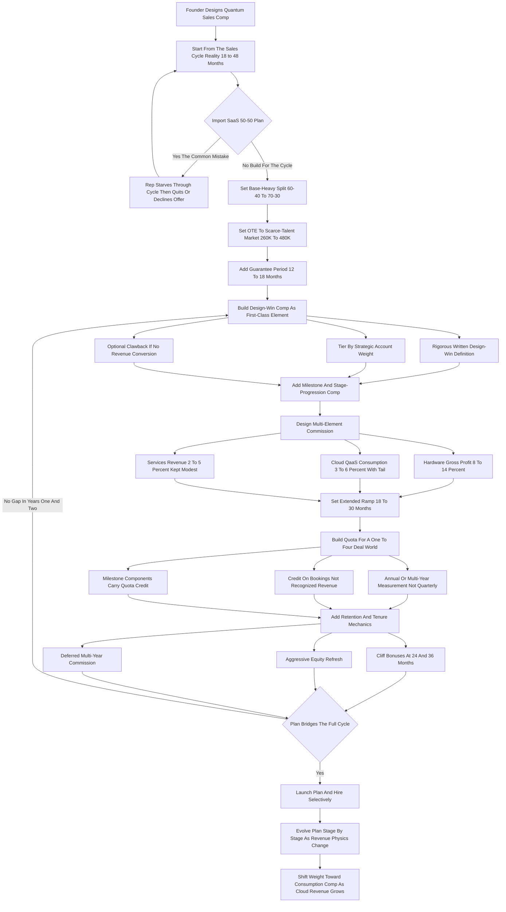

### Direct Answer

Quantum computing startups structure Account Executive (AE) compensation along a fundamentally different physics than SaaS, because the thing being sold is not a self-serve subscription with a 6-9 month cycle but a multi-year, capital-equipment-and-research-partnership sale with an 18-48 month cycle, a buyer pool measured in the low hundreds globally, and a revenue object that braids hardware, cloud access, and professional services into a single deal. The practical translation: base-heavy pay mixes (60/40 to 70/30 instead of SaaS's 50/50), materially higher on-target earnings ($260K-$480K versus $180K-$300K), a design-win bonus with no clean SaaS analog, ramps stretched to 18-30 months, multi-element margin-aware commission, and heavy retention mechanics. The right mental model is semiconductor capital-equipment sales fused with defense business development and deep-tech patience funding, with a SaaS-style consumption module bolted on for the one component -- cloud quantum-as-a-service -- that genuinely behaves like SaaS.

**TL;DR:** A quantum AE comp plan is not a tuned SaaS plan -- it is a different instrument built for a different sale. Seven structural shifts define it: (1) the base/variable split inverts to base-heavy; (2) OTE runs materially higher on talent scarcity; (3) design-win compensation appears as a first-class element paid 12-24 months ahead of revenue; (4) ramps and quota relief stretch to 18-30 months; (5) a multi-element commission formula replaces the single ARR rate; (6) retention and tenure incentives become non-negotiable; and (7) the concentrated lab-government-enterprise buyer motion forces relationship-tenure incentives over transactional acceleration. Every shift traces to one root cause -- the quantum sale is a multi-year capital-equipment-and-research-partnership transaction where the company co-funds the rep's patience. The three traps founders fall into: importing a SaaS 50/50 plan wholesale, paying only on closed revenue, and under-pricing the scarce talent.

## Section 1: What A Quantum AE Comp Plan Has To Do

### 1.1 A Comp Plan Is An Instruction, Not A Payroll Formula

**A compensation plan is the company telling a salesperson, in money, what to do every day for the next two to four years.** In SaaS that instruction is simple: find pipeline, run a 6-9 month cycle, close annual recurring revenue (ARR), repeat four times a year, and variable pay tracks tightly to bookings because bookings happen often enough to form a real feedback loop. In quantum computing the instruction is profoundly harder, because the events the company cares about happen on a cadence of one to three per year per rep, and recognized revenue may not land for a year or more after the commitment.

**The events that matter in quantum are slow and rare.** A national lab committing its quantum roadmap to your hardware, a bank's R&D group standardizing on your software development kit (SDK), a defense program writing your system into a multi-year appropriation -- a comp plan built only on recognized revenue would give a quantum AE almost no behavioral signal for the first 18-24 months on the job. A SaaS-style plan in a quantum company pays nothing and signals nothing for two years, and a rep good enough to sell quantum will not accept it.

### 1.2 The Four Jobs The Plan Must Do At Once

**The quantum AE comp plan has to accomplish four things simultaneously**, where a SaaS plan really only does one well:

- **Keep the rep solvent and committed** through a cycle long enough that a SaaS rep would have changed jobs twice. The base salary is the instrument for this.
- **Reward leading indicators** -- design wins, technical evaluations passed, pilots converted, multi-year frameworks signed -- because those are the only frequent, controllable, predictive events in the motion.
- **Handle a braided revenue object** -- hardware, cloud consumption, and services in one deal, each with a different margin and a different strategic value to the company.
- **Retain a person from a global talent pool of a few hundred** who could leave for a competitor or a hyperscaler tomorrow.

**SaaS comp plans are tuned for velocity and volume; quantum comp plans are tuned for patience, retention, and the conversion of slow strategic commitments into eventual revenue.** Everything that follows is downstream of that single difference -- the same formalize-when-the-motion-demands-it logic that governs founder-led comp design generally (q9555).

### 1.3 Why The SaaS Template Fails By Default

**The default failure is not malice -- it is familiarity.** A founder reaches for the comp plan they know, and the comp plan they know is SaaS. The SaaS 50/50 split, the 3-6 month ramp, the single ARR commission rate, the quarterly quota: each is a well-engineered answer to the SaaS sales cycle and a wrong answer to the quantum one. The discipline this entry argues for is simple to state and hard to practice: design the plan from the actual sales cycle and revenue physics, not from the category label.

| Plan question | SaaS default answer | Quantum-correct answer |
|---|---|---|
| What is the plan optimizing? | Velocity and volume | Patience, retention, commitment conversion |
| What event does variable pay track? | Closed ARR, quarterly | Design wins, milestones, then braided revenue |
| How long until the first payday? | One to two quarters | 12-24 months (via design-win comp) |
| What is the biggest design risk? | Under-paying accelerators | Importing the SaaS template wholesale |
| What does the base salary buy? | A living wage between commissions | Two-plus years of the rep's patience |

## Section 2: The Sales Cycle Reality That Drives Every Difference

### 2.1 The SaaS Cycle Versus The Quantum Cycle

**The root cause of every divergence between quantum and SaaS comp is the sales cycle.** A SaaS enterprise deal runs roughly: contact, discovery, demo, technical validation, security review, procurement, close -- six to nine months for a serious mid-six-figure annual contract value (ACV) deal, often faster. A quantum computing deal runs a different shape entirely.

| Quantum cycle stage | Typical duration | What is actually happening |
|---|---|---|
| Discovery and education | 3-6 months | AE functions as industry educator; buyer is still forming a view on quantum relevance |
| Technical evaluation | 6-12 months | Customer's research team benchmarks qubit counts, gate fidelity, error rates, coherence times |
| Proof-of-concept / pilot | 6-12 months | Paid pilot or co-development; the customer's problem is actually run on the system |
| Procurement | 3-6 months | Hardware procurement, often gated to an appropriations or fiscal cycle |
| Contracting and delivery | 3-6 months | On-premise system install or dedicated cloud allocation stood up |

### 2.2 Summing The Cycle: 18 To 48 Months

**Sum the stages: 18 months on the genuinely fast end, 30-48 months on the realistic end for a hardware-inclusive enterprise or government deal.** A SaaS comp plan assumes the rep produces a closed deal within their first year; a quantum comp plan that assumes the same will have fired or lost the rep before their first deal lands. The federal-buyer subset is even slower -- federal procurement cycles diverge sharply from commercial ones and must be modeled separately (q643).

**Every base-salary, quota-relief, design-win, and retention decision in quantum comp exists to bridge the gap** between when the rep starts working a deal and when the company can recognize revenue from it. The technical-evaluation stage is a genuine scientific exercise, not a feature checklist -- the customer's quantum information science team is comparing your processor against IBM's (NYSE: IBM), IonQ's (NYSE: IONQ), and Rigetti's (NASDAQ: RGTI) on measurable physical parameters.

### 2.3 The Cycle Compared To Other Long-Cycle Motions

**The quantum cycle is not unique in being long -- it is unique in combining length with a braided revenue object and a tiny buyer set.** Biotech B2B sales orgs face comparably long clinical-trial-gated cycles and have invented their own quota structures (q1863); healthcare SaaS cycles run long because of clinical adoption gates (q654). What quantum adds on top of length is the hardware-plus-cloud-plus-services braid and a buyer pool measured in the low hundreds.

| Motion | Typical cycle | Revenue object | Buyer pool |
|---|---|---|---|
| Horizontal enterprise SaaS | 6-9 months | Single-rate ARR | Tens of thousands |
| Healthcare / clinical SaaS | 9-18 months | ARR plus services | Thousands |
| Biotech B2B (clinical-trial deals) | 12-30 months | Milestone-gated contracts | Hundreds to low thousands |
| Semiconductor capital equipment | 18-36 months | Equipment + service + consumables | Dozens to low hundreds |
| Quantum computing (hardware-inclusive) | 18-48 months | Hardware + cloud + services braid | Low hundreds |

## Section 3: Dimension One -- The Base-To-Variable Split Inverts

### 3.1 Why SaaS Converged On 50/50

**The most visible structural difference is the pay mix.** Mature enterprise SaaS has converged, over two decades, on a roughly 50/50 split of on-target earnings between base salary and variable commission. The logic is sound for SaaS: a 50/50 plan keeps the rep hungry, ties half their income to performance they control on a quarterly feedback loop, and is affordable because the variable half is self-funding out of bookings. The split is one of the most studied decisions in go-to-market design (q9522).

### 3.2 Why That Logic Collapses In Quantum

**That logic collapses in quantum.** With a 30-month cycle, a 50/50 plan means a rep earns only their base for two and a half years before the variable half pays out -- and a rep good enough to sell quantum will not accept that, because they can get a 50/50 plan with a 9-month feedback loop at a SaaS company tomorrow.

**So quantum startups run base-heavy splits, typically 60/40 and frequently 70/30.** A quantum AE with a $400K OTE on a 65/35 split carries a $260K base and $140K of variable; the base alone is competitive with a strong SaaS AE's entire OTE. This is necessity, not generosity: **the base is the company buying the rep's patience and solvency across a cycle the variable comp cannot reach in time.**

### 3.3 The Second-Order Effects Founders Must Plan For

**The base-heavy split has second-order effects the founder must plan for:**

- **It raises fixed cash burn.** A ten-rep team on 65/35 at $400K OTE is $2.6M of guaranteed annual base regardless of bookings, funded from the raise.
- **It compresses variable leverage.** The variable portion is now a minority of pay, so it must be designed extremely well to drive behavior.
- **It changes hiring economics.** The company makes a large fixed bet on each rep and must hire more slowly and selectively than a SaaS company that hires ahead of revenue.

**The split is the most consequential design decision, and importing the SaaS 50/50 is the single most common and most damaging mistake founders make.**

| Comp dimension | Typical enterprise SaaS | Quantum computing startup |
|---|---|---|
| Base/variable OTE split | ~50/50 | 60/40 to 70/30 (base-heavy) |
| OTE range (enterprise AE) | $180K-$300K | $260K-$480K |
| Base salary range | $90K-$150K | $160K-$280K |
| Sales cycle | 6-9 months | 18-48 months |
| Ramp / full-quota onset | 3-6 months | 18-30 months |
| Deals closed per rep per year | 6-15 | 1-4 |
| Commission object | Single-rate ARR | Multi-rate: hardware GP + cloud + services |
| Design-win / milestone comp | Rare (logo bonus at most) | Standard ($20K-$80K per design win) |
| Retention / tenure comp | Modest | Heavy (cliff bonuses, equity refresh) |
| Global qualified talent pool | Tens of thousands | ~300-1,000 |

## Section 4: Dimension Two -- Total Compensation Runs Higher

### 4.1 The OTE Premium Quantified

**A quantum AE is more expensive than a SaaS AE at every level of the org**, and a founder budgeting off SaaS benchmarks will under-fund the function badly. A strong enterprise SaaS AE runs an OTE in the $180K-$300K band. A credible quantum enterprise AE -- someone who can hold a technical conversation with a national lab's quantum information science team, navigate a government procurement, and structure a hardware-plus-cloud-plus-services deal -- runs $260K-$480K OTE, the senior end higher for reps with genuine relationships into the dozen-or-so anchor accounts that matter. CRO and leadership comp scales similarly with stage and motion complexity (q9634).

### 4.2 The Four Sources Of The Premium

**The premium has four distinct sources:**

- **Talent scarcity** is the largest. The global population that has actually sold quantum or comparable deep-tech hardware into enterprise and government is small, and every quantum company plus the hyperscalers' quantum arms recruit from the same bench.
- **Technical depth** commands a premium. The role is closer to a sales engineer fused with an enterprise AE than to a classic closer -- a rare, valuable hybrid.
- **Buyer seniority** pushes it up. Quantum AEs sell to chief scientists, heads of R&D, lab directors, and program managers, and the company needs reps credible at that altitude.
- **Cycle risk** is priced in. A rep taking a job where the first commission is two-plus years away rationally demands a higher floor.

### 4.3 The Founder Cost-Structure Implication

**The founder implication is a sales-team cost structure that resembles a semiconductor or defense-tech business development function more than a SaaS sales org** -- fewer reps, each far more expensive, each carrying a longer, larger, slower pipeline.

| Role | SaaS OTE band | Quantum OTE band | Premium driver |
|---|---|---|---|
| Enterprise AE | $180K-$300K | $260K-$480K | Scarcity, technical depth, cycle risk |
| Sales engineer / solutions architect | $150K-$250K | $230K-$420K | PhD-level talent, co-seller status |
| Sales leader / VP | $300K-$500K | $400K-$700K | Few qualified leaders, board-facing role |

**Modeling a quantum go-to-market on SaaS cost-per-rep assumptions produces a plan that is both under-staffed at the required quality bar and under-budgeted for the people it does hire.**

## Section 5: Dimension Three -- Design-Win Compensation

### 5.1 What A Design Win Actually Is

**The single most distinctive element of quantum AE comp is the design win**, and it has no clean SaaS equivalent. A design win is the moment a customer makes an architectural commitment to build on, around, or with your quantum platform -- the lab decides its next three years of research will run on your hardware, the enterprise R&D group standardizes on your SDK, the systems integrator designs your processor into a solution they take to their own customers.

**Critically, a design win is not a purchase order and not recognized revenue.** It is a commitment that precedes revenue, often by 12 to 24 months, and is the single most predictive leading indicator the company has.

### 5.2 The Bonus Mechanics

**Quantum startups pay AEs a material bonus on design wins -- typically $20,000 to $80,000 per win**, scaled to account weight. The design win is the controllable, dateable, verifiable event the AE actually drives, and paying on it gives the rep a meaningful payday inside the cycle rather than only at its distant end. The mechanics must be engineered:

- **Rigorous written definition.** What qualifies must be ratified by sales leadership and often the technical organization, because a soft definition turns the bonus into a negotiation. Criteria usually include a documented architectural commitment, a named executive sponsor, a defined scope, and frequently a signed framework, letter of intent, or paid pilot agreement.
- **Tiering by account weight.** A Tier 1 anchor-account design win pays multiples of a Tier 3.
- **Partial clawback.** The bonus is sometimes partially clawed back if the design win fails to convert to revenue within a defined window, keeping reps honest about quality versus quantity -- mirroring gaming-resistant credit-policy logic in quota design (q731).

### 5.3 Why The SaaS Analog Fails

**The closest SaaS analog is a logo bonus or new-business SPIFF, but those reward a closed, paying customer; the design-win bonus rewards a technical and architectural commitment that is not yet a customer** -- a genuinely different, quantum-specific comp object.

| Comp element | What it rewards | Timing vs revenue | SaaS equivalent |
|---|---|---|---|
| Design-win bonus | Architectural commitment to the platform | 12-24 months ahead | None clean (logo bonus is weak analog) |
| Milestone comp | Eval passed, pilot converted, framework signed | 6-18 months ahead | Stage-gate SPIFF (rare) |
| Multi-element commission | Closed, recognized braided revenue | At/after close | ARR commission |
| Consumption tail | Cloud usage growth post-close | Months to years after | Expansion / NRR commission |

**For many quantum AEs, design-win bonuses are the largest component of realized variable pay in years one and two** -- the point being to pay the rep for doing the right thing two years before the revenue arrives.

## Section 6: Dimension Four -- Extended Ramps And Quota Relief

### 6.1 Why SaaS Ramps Do Not Translate

**A new SaaS AE is typically given a 3-6 month ramp with reduced quota**, assuming that within two quarters they should be near full productivity. Applying that to quantum is incoherent: the first real deal genuinely takes 18-48 months, so a new quantum AE could do everything right and still close nothing in their first 12-18 months.

### 6.2 The Glide-Path Structure

**Quantum comp plans use dramatically extended ramps and multi-year quota relief, structured as a deliberate glide path** rather than a brief onboarding courtesy. A representative structure:

| Tenure window | Comp posture | Quota posture | Measured on |
|---|---|---|---|
| Months 1-6 | Full base, no revenue quota | Zero | Accounts engaged, evaluations initiated, relationships built |
| Months 7-18 | Full base + design-win + milestone comp active | Zero or nominal | Leading indicators: design wins, frameworks, pilots |
| Months 19-30 | Full base + ramped revenue quota | Stepped up as early pipeline converts | Bookings on first converting deals |
| Month 30+ | Full plan | Full revenue quota | Full attainment against named-account book |

### 6.3 The Supporting Mechanics

**Several design choices support the glide path:**

- **Guarantee periods.** A guaranteed minimum total comp for the first 12-18 months regardless of bookings makes the offer credible to a rep who can do the cycle math.
- **Pipeline-coverage and stage-progression metrics** carry real comp weight early -- they are the only quota-like signal available before revenue.
- **Capacity modeling for the longer ramp.** A quantum capacity model bakes in the 18-30 month productivity onset, the same tenure-and-ramp variance problem RevOps capacity models address generally (q730).

**Quota, once it exists, is set against a deal count of one to four per year**, not the six-to-fifteen of SaaS. The founder must budget honestly: a quantum AE is a 2-3 year investment before becoming a self-funding revenue producer, and a comp plan that pretends otherwise churns reps out precisely as their pipeline is about to mature.

## Section 7: Dimension Five -- The Multi-Element Commission Formula

### 7.1 Why A Single Rate Fails

**SaaS commission is one number times one rate:** new ARR times a commission percentage, with accelerators above quota. Quantum cannot use a single-rate formula because a quantum deal is not a single revenue object -- it is a braid of three economically distinct components, and the comp plan must weight each by its margin and strategic value, or the rep optimizes for the wrong mix.

### 7.2 The Three Components And Margin-Aware Rates

| Deal component | Share of deal value | Typical gross margin | Representative commission rate | Strategic comp intent |
|---|---|---|---|---|
| Quantum hardware / system | 40-55% | 35-50% | 8-14% of gross profit | Pay on GP so discounting hurts the rep |
| Cloud / QaaS consumption | 25-40% | 65-80% | 3-6% of revenue, multi-year tail | Reward long-term consumption growth |
| Professional services | 15-25% | 30-50% | 2-5% of revenue | Keep modest; avoid a services-led motion |

**A well-designed quantum commission plan pays separate, margin-aware rates on each component.** Hardware is commissioned on gross profit, not revenue, so the rep is not incentivized to discount to the bone. Cloud or quantum-as-a-service (QaaS) consumption carries a recurring multi-year tail so the rep keeps earning as consumption ramps. Services rates stay modest because services are lower-margin and the company does not want a services-led motion.

### 7.3 The Design Logic And Its Cost

**The design logic is to make the rep's commission-maximizing behavior identical to the company's margin-and-strategy-maximizing behavior:** pay enough on cloud to make the rep care about long-term consumption growth, pay on hardware gross profit so discounting hurts the rep too, and keep services rates modest so the rep does not become a consulting-deal machine.

**The cost is real complexity.** Quantum AE pay statements often require finance review and cannot be fully scripted the way a SaaS commission run can, and disputes over component attribution are more common. But the alternative -- a single blended rate -- gives the rep no reason to care about the mix, a strategically expensive simplification in a business where the cloud tail is the long-term value. Fintech faces a parallel problem when comp must reflect embedded versus standalone revenue (q655).

## Section 8: Dimension Six -- Retention And Tenure Mechanics

### 8.1 Why A Mid-Cycle Departure Is A Near-Catastrophe

**In SaaS, a rep leaving is a manageable loss** -- their pipeline is mostly 6-9 month deals a replacement can pick up, and the median enterprise AE tenure of roughly 18-24 months is something the org is built to absorb.

**In quantum, a rep leaving at month 20 of a 30-month deal is close to a catastrophe.** The relationship, the technical context, the trust built with a chief scientist over two years, and the half-converted pipeline all degrade, and a replacement effectively restarts a multi-year clock.

### 8.2 The Explicit Retention Mechanics

**Quantum comp plans carry explicit retention and tenure mechanics that SaaS plans use only lightly:**

- **Tenure or cliff bonuses.** A defined cash bonus at the 24- and 36-month employment marks, sometimes $40K-$120K per cliff, directly pays the rep to still be there when their pipeline matures.
- **Aggressive equity refresh.** Annual refresh grants larger than SaaS norms, because in a pre-IPO quantum company equity is a major retention lever tied to the multi-year build.
- **Deferred or multi-year commission.** A portion of closed-deal commission paid over the following 12-24 months, sometimes contingent on continued tenure and projected consumption ramp.
- **Guarantee-and-true-up mechanics** that protect the rep's downside early while keeping the upside.

### 8.3 The Founder Logic

| Retention mechanic | When it pays | What it protects |
|---|---|---|
| 24-month cliff bonus | Employment month 24 | The rep still present as first deals convert |
| 36-month cliff bonus | Employment month 36 | The rep through the second harvest wave |
| Equity refresh | Annual | Long-term upside alignment in a pre-IPO build |
| Deferred commission | 12-24 months post-close | Income smoothing plus a reason to stay |

**The founder logic is straightforward once the cycle is understood:** the company co-invests two-plus years of base salary and relationship-building into each rep before that rep is a net revenue producer, and losing the rep at month 20 forfeits nearly all of it. **Retention comp is not a perk in quantum; it is the protection of the company's single largest go-to-market investment.**

## Section 9: Dimension Seven -- The Lab-Government-Enterprise Buyer Motion

### 9.1 The Three Buyer Types

**The final structural difference is the buyer**, and it shapes comp in ways a SaaS plan never has to consider. The quantum buyer set today is not a broad market -- it is a concentrated set of three buyer types.

- **National laboratories and government research institutions.** The US Department of Energy national labs (Oak Ridge, Argonne, Lawrence Berkeley, Los Alamos, Sandia), defense and intelligence agencies, NASA, and their international equivalents -- buying on appropriations cycles, through formal procurement, on multi-year timelines.
- **Government-adjacent and academic research consortia.** University quantum centers, national quantum initiatives, and public-private research programs -- operating on grant cycles and consortium dynamics.
- **Enterprise R&D groups.** The quantum and advanced-computing teams inside a small set of banks (JPMorgan, NYSE: JPM; Goldman Sachs, NYSE: GS), pharmaceutical and chemical companies, aerospace and automotive firms (Airbus, EPA: AIR; Boeing, NYSE: BA), and energy companies, buying on corporate R&D budgets that are real but defended and slow.

### 9.2 How Concentration Drives Comp Design

**The total count of genuinely active enterprise and government quantum buyers worldwide is plausibly in the low hundreds**, not the tens of thousands a SaaS category enjoys. This concentration drives comp design in specific ways:

- **Account assignment is named and strategic**, not territory-by-volume; the comp plan is built around a small book of very high-value named accounts.
- **Relationship-tenure incentives dominate transactional acceleration** -- there is no point paying a quantum AE for speed when the buyer cannot move fast.
- **Government-deal mechanics get their own comp treatment** -- the appropriations-gated, procurement-heavy government cycle sometimes warrants its own quota relief and milestone structure. Federal procurement diverges so sharply from commercial selling that it is effectively a separate motion (q643), and gatekeeping layers like FedRAMP add their own timeline (q639).

### 9.3 The Scarcity-Of-Buyers Effect

**The scarcity of buyers means losing or mishandling one account is materially more damaging** than in SaaS, feeding back into the retention and quality-of-design-win emphasis. A SaaS comp plan optimizes a rep against a large, fast, repeatable market; a quantum comp plan optimizes a rep against a tiny, slow, strategically irreplaceable set of accounts.

| Buyer dimension | SaaS | Quantum |
|---|---|---|
| Active buyer count worldwide | Tens of thousands | Low hundreds |
| Account assignment | Territory by volume / segment | Named strategic accounts |
| Book size per AE | Dozens to hundreds | 6-15 named accounts |
| Procurement gating | Standard corporate procurement | Appropriations cycles, grant cycles |
| Cost of losing one account | Absorbed by volume | Materially damaging |

## Section 10: The Full Comp Architecture, Element By Element

### 10.1 The Eight-To-Ten Element Plan

**A complete quantum AE comp plan has more distinct elements than a SaaS plan**, and a founder should design each one deliberately.

| Element | Typical magnitude | Primary purpose |
|---|---|---|
| Base salary | $160K-$280K | Buy the rep's patience and solvency across the cycle |
| Guarantee period | 12-18 months minimum total comp | Make the offer credible against the cycle math |
| Design-win bonuses | $20K-$80K per qualifying win, tiered | Primary in-cycle payday and behavioral driver |
| Milestone / stage-progression comp | Smaller, per evaluation / pilot / framework | Keep behavior pointed at leading indicators |
| Multi-element commission | 8-14% HW GP, 3-6% cloud, 2-5% services | Pay out as braided deals convert |
| Recurring / consumption tail | 3-6% ongoing on cloud growth | Keep the rep earning as QaaS ramps post-close |
| Accelerators | Above-quota multipliers | Reward overperformance against a 1-4 deal year |
| Tenure / cliff bonuses | $40K-$120K at 24 and 36 months | Protect the multi-year investment in the rep |
| Equity | Aggressive refresh grants | Retention and alignment in a pre-IPO build |
| Deferred commission | Portion paid over 12-24 months | Smooth income, reinforce tenure |

### 10.2 Why The Complexity Is Necessary

**A SaaS plan can run on three or four elements** (base, ARR commission, accelerators, maybe a logo SPIFF); a quantum plan needs eight to ten, because it simultaneously bridges a multi-year cycle, rewards leading indicators, weights a braided revenue object, and retains scarce talent. **The complexity is not a flaw to engineer away -- it is the necessary response to a sale genuinely more complex than a SaaS subscription.** That said, complexity is itself a cost, and the discipline is to add only the elements the cycle and revenue mix genuinely require.

### 10.3 The Comp Design Journey

The flow below shows how a founder builds the plan from the cycle reality outward, with the common SaaS-import mistake as an explicit loop-back.

## Section 11: How Quantum Borrows From Semiconductor And Capital-Equipment Sales

### 11.1 The Semiconductor Analog

**Quantum AE comp borrows heavily from the comp playbooks of adjacent deep-tech and capital-equipment industries.** Semiconductor capital equipment is the closest structural cousin: companies like ASML (NASDAQ: ASML), Applied Materials (NASDAQ: AMAT), Lam Research (NASDAQ: LRCX), and KLA (NASDAQ: KLAC) sell multi-million-dollar fab tools on long cycles, with design wins as the central leading indicator, base-heavy comp, named strategic accounts, and a braid of equipment, service, and consumables revenue. **The design-win bonus in quantum comp is a near-direct import from semiconductor sales.**

### 11.2 The Enterprise-Hardware And Defense Analogs

- **Enterprise hardware and infrastructure.** The comp playbooks of Cisco (NASDAQ: CSCO), Dell (NYSE: DELL), and the data-center hardware vendors contribute the multi-element commission logic and the gross-profit-based hardware commission.
- **Defense and government business development.** Primes like Lockheed Martin (NYSE: LMT) and RTX (NYSE: RTX) contribute appropriations-cycle awareness, program-manager-relationship emphasis, multi-year quota relief, and tenure incentives appropriate to a buyer that cannot be rushed.
- **Scientific instruments and lab equipment.** Thermo Fisher Scientific (NYSE: TMO) contributes the model of selling complex technical equipment into research institutions on grant and capital cycles.

### 11.3 The Synthesis

| Source industry | What quantum borrows | Representative operators |
|---|---|---|
| Semiconductor capital equipment | Design-win bonus, base-heavy comp, long-cycle quota | ASML, AMAT, LRCX, KLAC |
| Enterprise hardware | Multi-element and gross-profit commission | Cisco (CSCO), Dell (DELL) |
| Defense / government BD | Appropriations awareness, tenure comp, PM relationships | Lockheed Martin (LMT), RTX (RTX) |
| Scientific instruments | Selling into research institutions on grant cycles | Thermo Fisher (TMO) |
| Usage-based SaaS | The cloud / QaaS consumption commission module only | See Section 12 |

**The synthesis quantum runs:** semiconductor design-win and capital-equipment cycle logic, plus enterprise-hardware multi-element commission, plus defense-style government-buyer and tenure mechanics, plus deep-tech base-heavy patience funding, with a thin SaaS layer for the cloud/QaaS consumption tail only. A founder who benchmarks against ASML and a defense prime designs something far closer to correct than one who benchmarks against a SaaS comp survey.

## Section 12: The Cloud/QaaS Component -- The One Place Quantum Looks Like SaaS

### 12.1 Why The Cloud Component Behaves Like SaaS

**One part of quantum comp genuinely resembles SaaS, and getting it right matters.** The cloud or quantum-as-a-service component -- metered, consumption-based access to quantum hardware over the cloud, the model used by IBM Quantum (IBM), Amazon Braket from Amazon (NASDAQ: AMZN), Microsoft Azure Quantum from Microsoft (NASDAQ: MSFT), and IonQ's cloud access (IONQ) -- behaves much like a usage-based SaaS product. It is recurring, it ramps with customer adoption, it has high gross margin, and the comp-relevant behaviors -- land a customer, then grow their consumption -- mirror the land-and-expand motion SaaS comp plans are built for.

### 12.2 What To Borrow From SaaS Here

**The cloud component can and should borrow SaaS thinking:** a recurring commission tail on consumption growth, expansion incentives for growing an existing account's usage, and net-revenue-retention-style metrics for the consumption book.

### 12.3 The Error To Avoid

**The error is letting the cloud component's SaaS-like nature seduce the founder into making the whole plan SaaS-like.** The hardware, services, design-win, government-buyer, and cycle-length realities are all still non-SaaS, and the cloud tail is a minority of total deal value today even if it is the strategically important growth vector.

**The correct design treats the quantum comp plan as fundamentally a deep-tech capital-equipment plan with a SaaS-style consumption module bolted into the commission structure** -- not a SaaS plan with hardware attached. As the revenue mix tilts toward cloud consumption through 2030, the SaaS-like portion of the plan will grow, shifting weight from design-win and hardware-GP comp toward consumption and expansion comp.

## Section 13: Quota Design In A One-To-Four-Deal World

### 13.1 Why Quantum Quota Does Not Behave Statistically

**Quota is where the SaaS-to-quantum translation breaks most visibly.** A SaaS AE carrying a $1.2M annual quota across 6-15 deals has a quota that behaves statistically -- a single deal slipping a quarter is noise, the law of large numbers smooths attainment, quarterly cadence is meaningful. A quantum AE carrying a quota across one to four deals a year has a quota that does not behave statistically at all: a single anchor deal slipping from Q4 to Q1 -- entirely normal in a 30-month cycle -- can swing the rep from 140% of quota to 35%, through no fault of their own.

### 13.2 The Quantum Quota Design Rules

**Quantum quota design has to absorb this:**

- **Annual or multi-year quota measurement** replaces quarterly, because quarterly attainment is meaningless when deals are this large and infrequent.
- **Quota credit on bookings or signed contract value** rather than recognized revenue, so the rep is credited when they close the commitment, not a year later.
- **Milestone-based quota components** -- design wins, framework agreements, and pilot conversions carry quota credit, not just closed revenue.
- **Generous slip provisions** -- a deal closing in the first weeks of the next period often counts toward the prior period.
- **Pipeline-coverage and stage-progression as formal, comp-bearing metrics**, especially in the first 18-30 months.
- **Smaller, named-account books** -- quota built bottom-up from the realistic potential of 6-15 specific accounts rather than top-down from a market-size division. Bottom-up versus top-down quota modeling is a core RevOps decision (q729), and credit policies must resist gaming (q731).

### 13.3 Quota As A Strategic-Account Plan, Not A Statistical Instrument

| Quota dimension | SaaS approach | Quantum approach |
|---|---|---|
| Measurement period | Quarterly | Annual or multi-year |
| Credit basis | Recognized revenue | Bookings / signed contract value |
| Milestone credit | Rare | Design wins and frameworks carry credit |
| Slip handling | Tight period boundaries | Generous slip provisions |
| Quota construction | Top-down market division | Bottom-up from named accounts |

**In SaaS, quota is a statistical instrument; in quantum, quota is closer to a strategic-account plan with money attached.** Designing it like a SaaS quota produces wild, demoralizing, behavior-distorting swings that have nothing to do with rep performance.

## Section 14: The Talent Pool Problem And The Sales-Engineering Question

### 14.1 The Hard Numbers On Talent Scarcity

**The scarcity of qualified quantum sales talent is not a soft factor; it is a hard constraint that shapes the entire comp plan.** The population that can credibly do this job -- sell deep-tech hardware into enterprise and government, hold a technical conversation with a chief scientist, navigate a federal procurement, structure a braided multi-element deal -- is plausibly in the few hundred to low thousands globally.

**Every quantum startup recruits from this same bench**, competing with each other and with the well-capitalized quantum arms of IBM (IBM), Alphabet/Google (NASDAQ: GOOGL), Microsoft (MSFT), and Amazon (AMZN), plus the better-funded pure-plays IonQ (IONQ), Rigetti (RGTI), D-Wave Quantum (NYSE: QBTS), and Quantum Computing Inc (NASDAQ: QUBT).

### 14.2 The Comp Consequences Of Scarcity

- **OTE floors are set by the market for scarce talent, not by the company's revenue.** A pre-revenue startup still pays $300K+ OTE because that is the clearing price.
- **Retention comp is non-negotiable** because the replacement cost -- recruiting difficulty plus multi-year relationship rebuild -- is so high.
- **The plan has to be legible and credible** -- a scarce, sophisticated candidate does the cycle math and walks if the plan does not honestly bridge it.
- **Equity has to be real** because cash comp alone is competitive with a strong SaaS job; equity upside is part of what makes the harder, slower job worth taking.
- **The company often hires adjacently** -- from semiconductor, scientific instruments, defense, or enterprise hardware sales -- accepting a quantum learning curve that lengthens ramp.

### 14.3 The Sales Engineer As Co-Seller

**A quantum comp design that stops at the AE is incomplete**, because the quantum sale is so technical that the sales engineer or quantum solutions architect is a co-seller, not a support function. The SE is frequently a PhD-level quantum information scientist who runs the technical evaluation, designs the pilot, benchmarks the platform, and is often the person the customer's chief scientist trusts most.

**Quantum companies increasingly put SEs on plans that include design-win credit**, milestone comp for evaluations and pilots they led, and a variable component meaningful enough to reflect co-seller status -- while keeping the base high. SE comp must align to AE OTE to maintain role clarity (q610), and the career path must keep strong SEs from burning out or defecting to AE roles (q615). The go-to-market comp budget has to cover an AE-plus-SE pair as the real selling unit, roughly doubling per-selling-unit cost versus a SaaS AE-with-shared-SE model.

## Section 15: A Worked Example -- One Quantum AE's First Three Years

### 15.1 The Plan Setup

**To make the architecture concrete, walk one representative quantum AE through three years on a well-designed plan.** The setup: $400K OTE on a 65/35 split ($260K base, $140K target variable), six named strategic accounts (two national labs, one defense program, three enterprise R&D groups), a 12-month guarantee at $340K total, design-win bonuses of $30K (Tier 2) to $70K (Tier 1), a multi-element commission, and 24- and 36-month cliff bonuses of $60K each.

### 15.2 Year By Year

- **Year one.** The rep earns the $260K base, hits two milestone payments for technical evaluations initiated at a lab and a bank ($15K total), and lands one Tier 2 design win late in the year ($30K) as the bank's R&D group commits to SDK standardization. **Realized comp roughly $310K -- almost all base and design-win, zero recognized-revenue commission**, exactly what the plan intends.
- **Year two.** The rep earns the $260K base, lands a Tier 1 design win as a national lab commits its three-year roadmap to the platform ($70K), two more milestones ($20K), and the bank's year-one design win converts to a signed hardware-plus-cloud-plus-services deal generating the first real commission (~$55K). The 24-month cliff bonus pays $60K. **Realized comp roughly $465K.**
- **Year three.** The base continues, the national lab design win converts to a large procurement (~$90K of multi-element commission), the bank's cloud consumption ramps and throws off a recurring tail ($25K), a new Tier 2 design win lands ($30K), and the rep is now beating a real ramped quota. **Realized comp roughly $480K-$520K.**

### 15.3 The Three-Year Summary Table

| Year | Base | Design wins | Milestones | Revenue commission | Cliff bonus | Total realized |
|---|---|---|---|---|---|---|
| Year 1 | $260,000 | $30,000 (one Tier 2) | $15,000 | $0 | $0 | ~$310,000 |
| Year 2 | $260,000 | $70,000 (one Tier 1) | $20,000 | $55,000 (first converted deal) | $60,000 (24-mo cliff) | ~$465,000 |
| Year 3 | $260,000 | $30,000 (one Tier 2) | $10,000 | $115,000 (procurement + $25K cloud tail) | $0 (next cliff at month 36) | ~$480K-$520K |

**The shape of the three years is the whole point:** the plan kept the rep solvent and motivated on base, guarantee, and design-win comp through the long dry stretch, then transitioned to revenue commission as the pipeline matured -- and the cliff bonus made sure the rep was still there at month 24 to harvest what they planted. A SaaS plan would have left this rep earning only base for two years; they would have left at month 14.

## Section 16: Where Founders Get It Wrong -- The Common Failure Modes

### 16.1 The Cycle-Naive Failures

**Quantum comp plans fail in recognizable, repeated ways.** The first cluster ignores the cycle:

- **Importing the SaaS 50/50 split wholesale** -- the most common and most damaging error; the rep starves through the cycle and quits, or never accepts the offer.
- **Paying only on recognized revenue** -- gives the rep no behavioral signal and no income for two years, and provides leadership no leading-indicator read on the pipeline.
- **SaaS-length ramps** -- 3-6 month ramps in an 18-48 month cycle guarantee the rep is judged a failure before their first deal could possibly land.
- **Quarterly quota measurement** -- produces wild, demoralizing attainment swings driven by procurement timing, not performance.

### 16.2 The Structural-Element Failures

The second cluster omits or mis-builds specific plan elements:

- **No design-win or milestone comp** -- removes the only frequent, controllable payday and behavioral lever inside the cycle.
- **A single blended commission rate** -- gives the rep no reason to care about the hardware/cloud/services mix.
- **Under-pricing the talent** -- benchmarking OTE to SaaS surveys and losing every good candidate.
- **No retention or tenure comp** -- the company invests two-plus years of base into a rep and then loses them at month 20.
- **No equity reality** -- thin equity grants that fail to make the harder, slower quantum job worth taking.

### 16.3 The Over-Correction Failures

The third cluster -- often missed -- over-applies the "quantum is different" thesis:

- **Over-engineering toward SaaS because of the cloud component** -- letting QaaS consumption seduce the founder into a SaaS-shaped plan.
- **Ignoring the government-buyer motion** -- treating an appropriations-gated federal deal like an enterprise SaaS deal in the comp plan.

| Failure cluster | Representative mistake | Consequence |
|---|---|---|
| Cycle-naive | SaaS 50/50 split, 3-6 month ramp | Rep starves and quits before first deal |
| Structural-element | No design-win comp, single blended rate | No in-cycle payday, wrong revenue mix |
| Over-correction | SaaS-shaped plan from the cloud module | Mishandles hardware, government, cycle |

**Every one of these is avoidable**, and the mistake is almost always "the founder used a SaaS comp plan because that is the plan the founder knew." When a plan needs fixing mid-stream, the change must be sequenced carefully to avoid triggering attrition (q744) and communicated transparently to the board (q747).

## Section 17: How Quantum AE Comp Should Evolve As The Company Scales

### 17.1 The Four Stages

**A quantum startup's AE comp plan should not be static; it evolves in recognizable stages** as the company moves from pre-revenue research-partnership selling toward commercial scale.

| Stage | Revenue posture | Dominant comp elements | Base/variable drift |
|---|---|---|---|
| Stage 1 -- Pre-revenue / first design wins | No recognized revenue | Base, guarantee, design-win, milestone | 70/30 |
| Stage 2 -- First revenue conversions | Early deals converting | Multi-element commission added, deferred comp, tenure | 70/30 to 65/35 |
| Stage 3 -- Repeatable revenue | Predictable bookings | Ramped quota, commission grows, accelerators matter | 65/35 to 60/40 |
| Stage 4 -- Commercial scale / cloud-weighted | Recurring QaaS dominant | Consumption and expansion comp, SaaS-like for those segments | Approaches SaaS norms for SaaS-like segments |

### 17.2 The Evolution Principle

**The comp plan is a living instrument that tracks the company's actual revenue physics:** heavily base-and-milestone-weighted while the cycle is long and revenue is distant, gradually more commission-and-consumption-weighted as revenue becomes nearer, more recurring, and more predictable. A plan frozen at stage one becomes uncompetitive as reps mature; a plan that jumps to stage four prematurely starves reps through a cycle that has not shortened yet.

### 17.3 The SaaS-Quantum Decision Matrix

The matrix below maps each comp dimension to its SaaS logic and its quantum logic; every row converges on the same root cause -- a multi-year capital-equipment-and-research-partnership sale.

| Dimension | SaaS logic | Quantum logic |
|---|---|---|
| Base/variable split | 50/50 for velocity | 60/40 to 70/30; base buys patience |
| Total OTE | $180K-$300K, broad talent pool | $260K-$480K, scarce-talent premium |
| Leading-indicator comp | Logo SPIFF at most | Design-win bonus $20K-$80K, first-class |
| Ramp length | 3-6 month ramp | 18-30 month extended ramp |
| Commission object | Single-rate ARR | Multi-element margin-aware rates |
| Retention comp | Light tenure, absorbed | Cliff bonuses, equity refresh, deferred comp |
| Buyer motion | Large fast repeatable market | Tiny concentrated lab-government-enterprise set |

**The conclusion every row points to:** benchmark against semiconductor and defense comp rather than SaaS, bolt a SaaS-style module onto the cloud QaaS component only, and treat the plan as a living instrument that evolves with the company's revenue physics.

## Section 18: Counter-Case -- Where The "Quantum Is Totally Different" Framing Misleads

### 18.1 The Software-Versus-Hardware Counter

**The seven-dimension framework is the right default, but a founder should stress-test it**, because over-applying the "quantum is completely different from SaaS" thesis creates its own failure modes.

**Counter 1 -- Not every quantum company has an 18-48 month cycle.** A quantum software, middleware, error-correction, or developer-tooling startup may have a sales motion much closer to SaaS: shorter cycles, no hardware procurement, a real product-led motion. A founder who imports the full base-heavy, design-win-centric quantum playbook into a quantum software company will overpay base, under-incentivize velocity, and build a sluggish motion. The cycle, not the word "quantum," should drive the plan.

**Counter 2 -- The cloud/QaaS component is growing, and with it the SaaS-like share of the plan.** As the revenue mix tilts toward recurring consumption, a plan frozen in heavy-design-win, heavy-base mode becomes progressively wrong. The precise version: quantum comp is becoming less different for the parts of the business that are becoming SaaS-like.

### 18.2 The Element-Level Counters

**Counter 3 -- Base-heavy splits can breed complacency.** The 70/30 split solves the solvency problem, but it also weakens the strongest behavioral lever comp has. A poorly designed base-heavy plan can produce comfortable, unproductive reps; it must be paired with genuinely motivating in-cycle comp.

**Counter 4 -- Design-win comp can be gamed.** If the design-win definition is soft, reps will manufacture "design wins" that never convert, collecting $30K-$80K bonuses for commitments that evaporate. The mechanism depends on a rigorous definition, technical-org ratification, tiering, and ideally partial clawback.

**Counter 5 -- Some "quantum" deals are really research grants, not sales.** A meaningful share of early quantum revenue is co-funded research, grants, and pilot programs that look like deals but behave like funded R&D. Compensating an AE on these as commercial wins distorts the picture of true commercial traction.

### 18.3 The Benchmarking And Complexity Counters

**Counter 6 -- The talent-scarcity premium may compress.** The "you must pay $300K+ OTE" logic holds today, but quantum sales talent is being actively developed, adjacent sellers are crossing over, and a funding downturn could loosen the market.

**Counter 7 -- Over-complex plans have real costs.** The eight-to-ten-element plan responds to genuine complexity, but complexity is a cost: pay statements needing finance review, disputes over component attribution, reps who cannot model their own earnings. Add only the elements the cycle and revenue mix genuinely require.

**Counter 8 -- Importing semiconductor and defense comp wholesale has its own risks.** "Benchmark against ASML and a defense prime" is good directional advice, but those are large, mature companies with comp structures suited to scale -- not a 30-person startup that needs hunger and velocity. Borrow the concepts, not the bureaucratic comp machinery.

**The honest verdict.** The seven-dimension framework is correct as a default for a quantum hardware startup with a genuine multi-year capital-equipment-and-research-partnership cycle. It should be applied more lightly to quantum software and tooling companies, treated as a living instrument that drifts toward SaaS norms as the cloud-consumption share grows, and each distinctive element carries its own failure mode disciplined design must guard against. The framing "quantum comp is different from SaaS" is true, but the precise version is "quantum comp is driven by the actual sales cycle and revenue physics -- which for a hardware company are radically un-SaaS-like, and for a software company may not be."

## Section 19: The Honest Bottom Line

### 19.1 The Synthesis

**A quantum computing startup's AE comp plan is not a modified SaaS plan -- it is a different instrument built for a different sale.** The founder who understands that designs something that works; the one who reaches for the SaaS template churns reps and mis-points the motion. The seven structural differences -- inverted base-heavy split, higher OTE, design-win comp with no SaaS analog, multi-year extended ramps, multi-element margin-aware commission, heavy retention mechanics, and the concentrated lab-government-enterprise buyer motion -- all trace to one root cause: **the quantum sale is a multi-year capital-equipment-and-research-partnership transaction into a tiny buyer set, sold by scarce expensive talent, where the company co-funds the rep's patience for two-plus years before revenue arrives.**

### 19.2 The Concrete Founder Takeaway

**The right mental model is semiconductor capital-equipment sales plus defense business development plus deep-tech patience funding**, with a SaaS-style consumption module bolted into the commission structure for the one component -- cloud QaaS -- that genuinely behaves like SaaS. The concrete takeaway: budget for fewer, more expensive, base-heavier reps on longer ramps; build design-win and milestone comp as first-class plan elements with rigorous definitions; use multi-element margin-aware commission, paying hardware on gross profit; invest seriously in retention comp because the mid-cycle departure is a near-catastrophe; benchmark against deep-tech and capital-equipment comp, not SaaS surveys; and treat the plan as a living instrument that evolves stage by stage as the company's revenue physics change.

### 19.3 Where It Is Heading

As the industry approaches commercial advantage between 2027 and 2030 and the revenue mix tilts toward recurring cloud consumption, quantum AE comp will drift partway toward SaaS norms for the parts of the business that become genuinely SaaS-like -- but the hardware, government, and research-partnership cores will keep their distinctive comp shape for the foreseeable future. The founder who designs from the cycle, not the category label, builds a plan that survives that evolution.

## Section 20: Key Numbers Reference

### 20.1 Pay Mix And OTE

| Metric | SaaS | Quantum |
|---|---|---|
| Base/variable OTE split | ~50/50 | 60/40 to 70/30 |
| Enterprise AE OTE | $180K-$300K | $260K-$480K |
| AE base salary | $90K-$150K | $160K-$280K |
| AE target variable | $90K-$150K | $90K-$200K |
| 10-rep team guaranteed annual base (65/35, $400K OTE) | n/a | ~$2.6M |

### 20.2 Cycle, Ramp, And Quota

| Metric | SaaS | Quantum |
|---|---|---|
| Sales cycle | 6-9 months | 18-48 months |
| Ramp / full-quota onset | 3-6 months | 18-30 months |
| Deals closed per rep per year | 6-15 | 1-4 |
| Guarantee period | Rare | 12-18 months |
| Quota book size | Dozens to hundreds of accounts | 6-15 named accounts |

### 20.3 Design-Win, Commission, And Retention

| Metric | Value |
|---|---|
| Design-win bonus per qualifying win | $20K-$80K |
| Tier 1 anchor-account design win | $60K-$80K |
| Tier 2 design win | ~$30K |
| Design wins per AE per year | 1-3 |
| Hardware commission | 8-14% of gross profit |
| Cloud / QaaS commission | 3-6% of revenue with multi-year tail |
| Services commission | 2-5% of revenue |
| Cliff / tenure bonuses | $40K-$120K at 24- and 36-month marks |
| Active enterprise + government quantum buyers worldwide | Low hundreds |
| Global qualified quantum sales talent pool | ~300-1,000 |

## Related Pulse Library Entries

- **(q1863)** -- How biotech B2B sales orgs structure quota for long-cycle clinical-trial deals; the closest in-library analog for long-cycle quota design.
- **(q643)** -- How federal procurement cycles differ from commercial sales cycles; the government-buyer timeline that warrants its own quota relief.
- **(q639)** -- What FedRAMP is and why it gatekeeps federal SaaS sales; a related government-procurement gating layer.
- **(q610)** -- How sales-engineer comp should align with AE OTE; the SE-as-co-seller alignment central to quantum go-to-market.
- **(q615)** -- The SE career-path framework that prevents top SEs from burning out or leaving; the talent-retention adjacency for quantum solutions architects.
- **(q729)** -- The difference between top-down and bottom-up quota models; the bottom-up named-account approach quantum quota requires.
- **(q730)** -- Designing a capacity model for rep tenure, ramp, and territory variance; the long-ramp capacity problem in quantum.
- **(q731)** -- Quota credit policies that prevent gaming while rewarding splits and expansions; the anti-gaming logic behind design-win clawback.
- **(q744)** -- How to structure a mid-year comp plan change without triggering attrition; relevant when a quantum plan needs mid-stream correction.
- **(q747)** -- The playbook for communicating comp plan changes to the board and investors; the governance side of quantum comp design.
- **(q9522)** -- Structuring comp when both a founder and a sales leader close deals; the quota-and-variable-pay ownership question.
- **(q9634)** -- What CRO compensation benchmarks look like by company stage; the leadership-comp context above the quantum AE plan.

## Sources

1. **McKinsey & Company -- Quantum Technology Monitor** -- Annual analysis of quantum computing market size, investment, talent, and commercialization timelines. https://www.mckinsey.com/capabilities/mckinsey-digital/our-insights
2. **Boston Consulting Group -- The Long-Term Forecast for Quantum Computing** -- Market sizing, value-creation timelines, and commercial-advantage forecasts. https://www.bcg.com
3. **IDC and Hyperion Research -- Quantum Computing Market Forecasts** -- Industry revenue, spending, and adoption data for the quantum sector.
4. **IonQ Investor Relations -- Public Filings and Earnings** -- A public quantum company's disclosed revenue mix, bookings, and go-to-market commentary. https://investors.ionq.com
5. **Rigetti Computing Investor Relations -- Public Filings** -- Public quantum company financials and commercial-strategy disclosure. https://investors.rigetti.com
6. **D-Wave Quantum Investor Relations -- Public Filings** -- Public quantum company revenue, QaaS model, and bookings disclosure. https://www.dwavesys.com
7. **IBM Quantum -- Platform and Quantum Network Documentation** -- Reference for the QaaS / cloud-access model and enterprise quantum partnerships. https://www.ibm.com/quantum
8. **Amazon Braket -- Quantum Computing Service Documentation** -- Reference for the marketplace and consumption-based quantum access model. https://aws.amazon.com/braket
9. **Microsoft Azure Quantum -- Service Documentation** -- Reference for cloud-delivered quantum access and the ecosystem model. https://azure.microsoft.com/en-us/products/quantum
10. **Quantinuum -- Company and Commercial Strategy Materials** -- Reference on enterprise quantum go-to-market and hardware-plus-software offerings. https://www.quantinuum.com
11. **PsiQuantum -- Company Materials** -- Reference on the capital-intensive fault-tolerant quantum hardware build and its commercial timeline. https://www.psiquantum.com
12. **US Department of Energy -- Office of Science and National Quantum Initiative** -- Reference for national-lab and government quantum procurement and program structure. https://www.energy.gov/science
13. **National Quantum Initiative -- Program Documentation** -- US government quantum research funding and consortium structure. https://www.quantum.gov
14. **Oak Ridge, Argonne, and Lawrence Berkeley National Laboratories -- Quantum Computing Programs** -- Reference for the national-lab buyer motion and research-partnership procurement.
15. **The Alexander Group -- Sales Compensation Research and Benchmarks** -- Pay-mix, OTE, and plan-design benchmarks across industries.
16. **WorldatWork -- Sales Compensation Surveys and Plan-Design Resources** -- Professional association data on base/variable splits, OTE structures, and quota practices.
17. **Pavilion -- Compensation Benchmarks** -- Go-to-market leadership community comp data for AE, SE, and sales-leadership roles.
18. **OpenView Partners -- SaaS Benchmarks Reports** -- Reference benchmarks for SaaS AE OTE, pay mix, ramp, and quota -- the comparison baseline.
19. **Bridge Group -- SaaS AE Metrics and Compensation Reports** -- Detailed SaaS account-executive comp, ramp, tenure, and quota benchmark data.
20. **ASML, Applied Materials, Lam Research, KLA -- Investor and Sales-Model Disclosures** -- Semiconductor capital-equipment sales structures and long-cycle comp analogs.
21. **Semiconductor Industry Association -- Design-Win and Sales-Cycle References** -- Industry background on the design-win concept quantum comp borrows from.
22. **Thermo Fisher Scientific and Bruker -- Scientific Instrument Sales Models** -- Capital-equipment sales into research institutions on grant and capital cycles.
23. **Deloitte and PwC -- Deep-Tech and Quantum Talent Studies** -- Analyses of quantum-skilled workforce scarcity and the deep-tech talent pipeline.
24. **CB Insights and PitchBook -- Quantum Computing Funding and Startup Landscape** -- Venture funding, startup count, and competitive-landscape data.
25. **Quantum Economic Development Consortium (QED-C) -- Industry and Workforce Reports** -- Industry-consortium data on quantum commercialization and workforce.
26. **Defense and Government Contracting Compensation References** -- Background on appropriations-cycle selling and program-manager-relationship comp models.
27. **Harvard Business Review -- Sales Compensation Design Articles** -- General principles of aligning comp plans to sales-cycle length and strategic objectives.
28. **Gartner and CSO Insights -- Sales-Cycle and Comp Benchmarking** -- Cross-industry sales-cycle length and comp-structure benchmark data.
29. **a16z and Quantum-Focused VC Commentary** -- Venture-investor analysis of quantum go-to-market, commercialization timelines, and team-building.
30. **Cisco and Dell -- Enterprise Hardware Sales-Model Disclosures** -- Multi-element and gross-profit-based commission analogs for hardware sales.
31. **Lockheed Martin and RTX -- Government Contracting Disclosures** -- Defense-prime business-development comp and appropriations-cycle references.
32. **IBM, Alphabet, Microsoft, and Amazon -- Quantum Division Disclosures** -- Hyperscaler quantum-arm commentary informing the competitive talent market.
33. **Goldman Sachs, JPMorgan, Airbus, and Boeing -- Public Quantum R&D Program Disclosures** -- Reference for the enterprise-R&D quantum buyer motion and budget structure.
34. **SEBI / SEC Public Filings -- Quantum Computing Inc and Peers** -- Disclosed financials for additional public quantum pure-plays.
35. **Sales Management Association -- Quota-Setting and Ramp Research** -- Benchmark research on quota construction, ramp design, and attainment distribution.
