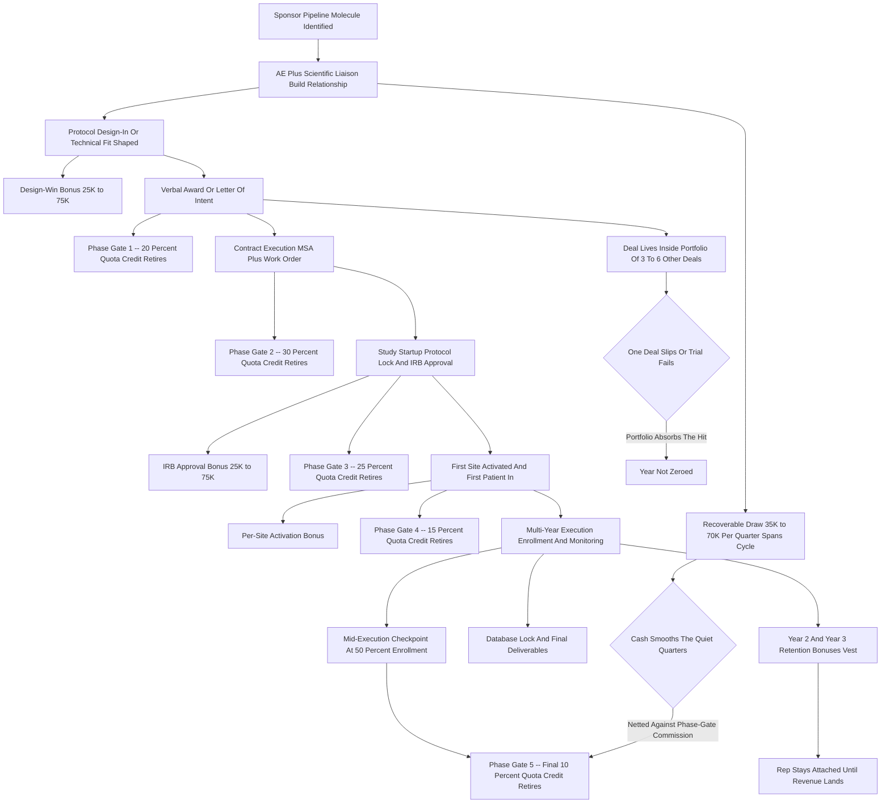

### Direct Answer

Biotech B2B sales orgs -- the CROs, eClinical software vendors, central labs, and trial-services firms selling into clinical trials -- cannot use the SaaS quota playbook, because the thing they sell takes **18 to 48 months to convert a verbal yes into recognized revenue**, so a flat annual bookings quota either pays reps for unconfirmed paper or lags their real work by years. Mature biotech commercial orgs instead run a **layered quota architecture** built from five mechanisms: **phase-gated bookings credit** (quota retires in tranches as the deal de-risks), **milestone-based recoverable draws** ($35K-$70K a quarter so reps survive the cycle), **design-win bonuses** ($25K-$150K at pre-revenue technical wins), **multi-year portfolio quotas** (3-6 deals carried at once so one trial failure cannot zero a year), and **tenure/retention bonuses** ($75K-$200K in years two and three). Net: biotech quota design is fundamentally a **cash-flow-timing and talent-retention problem disguised as a comp problem**, solved by decomposing the long cycle into creditable, payable milestones and funding the rep through the gap.

**TL;DR:** The clinical-trial sales cycle separates selling effort (front-loaded, months 1-14) from revenue recognition (back-loaded, months 18-50). An annual SaaS-style quota breaks on contact -- it credits reps for deals that may never bill, or it pays them three years late. The fix is a five-mechanism stack: (1) phase-gated credit retiring quota across verbal-award, executed-contract, study-startup, first-patient-in, and mid-execution gates; (2) recoverable draws of $35K-$70K/quarter to smooth the quiet quarters; (3) design-win bonuses paying the high-signal pre-revenue events (protocol design-in, IRB approval, site activation); (4) portfolio quotas of $3M-$9M ACV across 3-6 simultaneous deals to diversify trial-failure risk; and (5) year-two and year-three retention bonuses to keep the rep attached until revenue lands. The honest economics: a biotech enterprise AE runs an OTE of $260K-$480K, a base-heavy 55-65% pay mix, an 18-24 month ramp, and explicit quota relief for ramp and inherited-pipeline state. The plan must also pre-write the hard-case rules -- trial failure, descoping, rep departure, team-sale crediting -- before the year starts, because over a multi-year cycle every one of those cases will happen.

## What Long-Cycle Clinical-Trial Deals Actually Are

### 1.1 The Sellers And The Customer

**"Biotech B2B sales" is not one business.** The orgs this question is about are the companies that sell *into* the clinical-trial process, and being precise about the seller matters because the cycle differs by segment. **Contract research organizations (CROs)** -- IQVIA (NYSE: IQV), ICON plc (NASDAQ: ICLR), Fortrea (NASDAQ: FTRE), and Medpace (NASDAQ: MEDP) -- run trials for sponsors on full-service or functional-service awards. **eClinical and clinical-trial software vendors** -- Medidata (a unit of Dassault Systemes, OTC: DASTY), Veeva Systems (NYSE: VEEV), and Oracle (NYSE: ORCL) Health Sciences -- sell EDC, CTMS, eTMF, RTSM, and decentralized-trial platforms. **Central and specialty labs**, and **instrument and reagent suppliers** -- Thermo Fisher Scientific (NYSE: TMO), Danaher (NYSE: DHR) life-sciences brands, and Illumina (NASDAQ: ILMN) -- sell sequencing, assays, and consumables into trial work. **Trial-services firms** handle site networks, patient recruitment, imaging, and biospecimen logistics.

**What unites them is the customer.** Every one of these vendors sells to a *sponsor* -- a pharma or biotech company developing a drug -- and the purchase is tied to a specific molecule moving through a specific trial. The deal is not a seat license that goes live next month; it is an award tied to a study with its own multi-year timeline, its own regulatory gates, and its own failure risk.

### 1.2 Why The Deal Is Not A Bookings Event

**A clinical-trial award is a sequence, not a moment.** A rep can win the verbal award in Q1, watch the contract take six months to execute through procurement and legal, watch the study take another nine months to clear final protocol and IRB, and then watch revenue trickle in over the following 24-36 months as sites activate and patients enroll. The selling effort happened in year one. The revenue happens in years two, three, and four. Every quota problem in biotech sales flows from that single timing fact, and any comp plan that ignores it is quietly broken before it launches.

### 1.3 The Effort-To-Recognition Gap In Numbers

**Map a representative deal on a timeline and the gap is obvious.** Months 1-9: the AE and scientific team identify the sponsor's pipeline molecule, build the relationship, shape the protocol fit, and win the verbal award. Months 6-14: contract execution -- master service agreement, work order, statement of work -- grinding through the sponsor's procurement and outsourcing governance. Months 12-20: study startup -- final protocol, regulatory and IRB/ethics approvals, site selection and contracting, system build and validation. Months 18-44: execution -- site activation, patient enrollment, monitoring visits, data capture, interim analyses -- and *this* is when most revenue actually recognizes, on a units-of-delivery or percentage-of-completion basis. Months 40-50: database lock, final deliverables, and the last revenue tranche.

| Deal Stage | Months From Award | What Happens | Revenue State |
|---|---|---|---|
| Relationship and protocol shaping | 1-9 | AE plus scientific liaison engage sponsor | Zero |
| Contract execution | 6-14 | MSA, work order, SOW signed | Zero |
| Study startup | 12-20 | Protocol lock, IRB approval, system build | Zero to minimal |
| Execution | 18-44 | Site activation, enrollment, monitoring | Bulk recognizes here |
| Closeout | 40-50 | Database lock, reconciliation | Final tranche |

**The sales effort is concentrated in months 1-14; the revenue recognition is concentrated in months 18-50.** If quota credits effort, the org pays for things that may never happen. If quota credits recognition, the comp plan becomes a three-year-lagging indicator that gives the rep zero signal during the selling period. Every mechanism in this answer exists to bridge that gap without falling into either trap.

## Why The SaaS Quota Playbook Breaks On Contact

### 2.1 The Three Specific Fracture Points

**The standard SaaS commercial model is a beautifully tuned machine for a 30-to-120-day sales cycle -- and it shatters in biotech in three specific places.**

- **The measurement window is wrong.** A SaaS rep's quota year and sales cycle roughly align, so an annual number measures the annual work. A biotech rep's cycle is 18-48 months, so an annual bookings quota either credits them in year one for a deal that bills in year three (paying for unconfirmed paper) or credits them at recognition (paying them in year three for year-one work, by which point they may have left).
- **The cash-flow timing is wrong.** A SaaS rep closes something most months and gets paid most months. A biotech rep can go three or four quarters between billable events while doing the hardest work of their pipeline. A 50/50 plan with no draw means the rep cannot eat.
- **The attribution is wrong.** SaaS deals have one closer. A biotech trial award is touched by the AE, a scientific or medical liaison, a proposal/bid-defense team, and often a BDR -- and the "close" is not one event but a sequence of awards, executions, and scope expansions over years.

### 2.2 The Two Predictable Pathologies

**Orgs that run SaaS comp in biotech get two predictable failures.** First, **reps sandbag and game the early-stage definitions** to pull quota credit forward, because survival cash depends on it. Second, **good reps churn out in month 18-22** because the math never paid them for the cycle they actually worked. Both are comp-design failures, not people failures. The deeper version of this problem -- a comp plan that itself drives gaming, sandbagging, and inflated pipelines -- is its own diagnostic exercise covered in the sibling entry (q278), and the lesson transfers directly: a misaligned plan does not produce bad reps, it produces rational reps optimizing a broken incentive.

### 2.3 What The Long Cycle Demands Instead

**The long cycle does not call for a vaguer plan -- it calls for a more structured one.** Mature long-cycle industries have *more* comp structure than SaaS, not less, because the structure is what makes a multi-year cycle manageable. The biotech answer decomposes the long cycle into a set of intermediate, verifiable, creditable, payable events, and spreads quota retirement and cash across them. That is the five-mechanism stack.

## Mechanism One: Phase-Gated Bookings Credit

### 3.1 Retiring Quota In Tranches

**The foundational fix is to stop treating "the deal" as a single creditable event and instead retire quota in tranches tied to phase gates.** Instead of crediting 100% of a $4M trial award at verbal close, or at revenue recognition, the org defines a credit schedule across the deal's real milestones.

| Phase Gate | Quota Credit Retired | Trigger Event |
|---|---|---|
| Gate 1 -- Verbal Award / LOI | 20% | Sponsor selects the vendor |
| Gate 2 -- Executed Contract | 30% | MSA plus work order signed |
| Gate 3 -- Study Startup | 25% | Protocol locked, IRB approved, systems live |
| Gate 4 -- First Patient In / First Site Active | 15% | Study operationally live, revenue begins |
| Gate 5 -- Mid-Execution Checkpoint | 10% | ~50% enrollment or database lock |

**The exact weights vary by business.** A software vendor weights contract execution and go-live heavily; a CRO weights enrollment milestones heavily because that is where its revenue and risk concentrate. But the principle is constant: **quota retires as the deal de-risks, not all at once and not at the very end.**

### 3.2 What Phase-Gating Buys The Org

**Phase-gated credit does three things.** It gives the rep a quota-credit signal in the period they are doing the work. It protects the company, because the bulk of credit lands only after the contract is executed and the study is real. And it makes forecasting honest, because phase-gated credit forces the org to track where every deal actually sits. This is the same tranched-credit logic that high-end SaaS uses for multi-year platform deals and that quantum-computing startups apply to their long-cycle hardware-plus-software sales (q1862) -- the structural problem is shared across any business where the contract and the revenue are years apart.

### 3.3 The Discipline Phase-Gating Requires

**Gate definitions must be written, auditable, and tied to documents** -- a signed work order, an IRB approval letter, a system go-live record -- not to the rep's say-so. Otherwise phase-gating just becomes a new surface for sandbagging. The broader question of how to write quota-credit policies that reward split deals and expansions without inviting gaming is covered in the sibling entry (q731), and its rules apply directly here: every creditable event needs an artifact, and every artifact needs an owner who is not the rep.

## Mechanism Two: Milestone-Based Recoverable Draws

### 4.1 Why Credit Is Not Cash

**Phase-gated credit fixes when quota retires; it does not fix when cash reaches the rep.** In a business with three or four quarters between billable events, cash timing is what makes reps quit. The instrument is the **recoverable draw**: the org advances the rep a fixed sum each period -- commonly $35,000-$70,000 a quarter for an enterprise biotech AE -- against their future earned commission.

| Draw Parameter | Representative Setting | Rationale |
|---|---|---|
| Quarterly draw amount | $35,000-$70,000 | Scaled to OTE and territory; livable but not coastable |
| First 12-18 months | Non-recoverable or partially forgiven | Gets a new rep through ramp without going underwater |
| Recoverability after ramp | Recoverable advance | Keeps the rep economically motivated |
| Cumulative unrecovered cap | ~2 quarters of draw | Triggers a performance review when breached |
| Exit treatment | Specified in the contract | Defines what happens to outstanding draw on departure |

### 4.2 The Non-Obvious Levers

**Draw design has levers that are easy to miss.** The draw should be large enough to live on but not so large that a rep can coast on draws for years without producing -- so orgs cap cumulative unrecovered draw and trigger a performance review when it exceeds, say, two quarters of draw. The draw should also have a clean exit treatment: the contract specifies what happens to outstanding unrecovered draw if the rep leaves, and what happens to unbilled deals they sourced. The full design of when a draw is a genuine advance versus when it quietly becomes a tab the rep owes back is worked through in the sibling entry (q265).

### 4.3 The Mental Model

**Phase-gated credit is the scoreboard; the draw is the paycheck that lets the rep stay in the game long enough for the scoreboard to pay out.** Strip out the draw and even a perfectly designed phase-gate schedule fails, because the rep leaves before the gates retire. The two instruments are inseparable: the gate schedule answers "did the rep earn it," and the draw answers "can the rep afford to wait for it." A biotech org that funds one without the other has a plan that is half-built, and reps experience a half-built plan as an unreliable one -- which in a labor market where recruiters email good biotech AEs weekly is itself a churn driver.

**The draw also disciplines the manager-rep conversation.** Because the draw is reconciled against retired credit every period, the manager and rep both see, in dollars, exactly how far ahead or behind the rep's actual production sits versus the cash they have taken. That shared, unambiguous number turns the quarterly review from a vibe check into an arithmetic conversation, and it surfaces a struggling rep early -- at the moment the unrecovered balance starts climbing -- rather than 18 months later when a portfolio quietly fails to retire. The draw, properly administered, is as much an early-warning system as it is a paycheck.

## Mechanism Three: Design-Win And Protocol-Adoption Bonuses

### 5.1 Paying The True Leading Indicators

**The third mechanism pays for the pre-revenue technical wins that are the true leading indicators of a biotech deal.** In long-cycle clinical sales, the moments that actually predict revenue are technical and scientific: the sponsor adopts your platform or assay into the **protocol design** itself (a "design-in" -- once you are written into the protocol you are extremely hard to displace); the trial clears **IRB / ethics committee approval** with your scope in it; the **first site is activated** on your system; the sponsor expands you into additional studies or indications.

| Bonus Type | Range | When Paid |
|---|---|---|
| Protocol design-in | $25,000-$75,000 | Vendor written into protocol design |
| IRB / ethics approval | $25,000-$75,000 | Trial cleared with vendor scope |
| Per-site activation | $25,000-$50,000 per site | Each site activated on platform or services |
| Patient-enrollment bonus | $1,000-$5,000 per patient | Patients enrolled using vendor tools |
| Account / indication expansion | $50,000-$150,000 | Sponsor grows into new molecule or phase |
| Annual design-win pool (productive AE) | $75,000-$300,000 | Portion of total comp |

### 5.2 Why Bonuses Beat A Pure Bookings Quota

**These events are not bookings and not revenue, so a pure bookings or revenue quota ignores them entirely** -- which is irrational, because they are the highest-signal events in the whole cycle. Design-win bonuses reward the behavior you actually want -- deep scientific engagement early, getting embedded in the protocol, expanding the account -- rather than rewarding only the lagging financial outcome. They also give the rep frequent, motivating payable events inside an otherwise long, quiet cycle.

### 5.3 The Healthcare-Adoption Parallel

**Biotech is not the only sector where a technical adoption event predicts revenue before any contract does.** Healthcare SaaS faces a structurally similar dynamic -- clinical adoption and protocol fit drive the deal long before procurement signs -- and how clinical adoption should factor into the forecast is examined in the sibling entry (q654). The biotech design-win bonus is the comp-side expression of the same insight: pay the adoption event, because the adoption event is the deal.

## Mechanism Four: Multi-Year Portfolio Quotas

### 6.1 Changing The Unit Of Quota

**The fourth mechanism changes the unit of quota from a single annual number to a portfolio.** A biotech enterprise AE does not work one deal to close and then start the next; they carry a **rolling book of 3-6 deals at different phases simultaneously** -- one in early relationship-building, one in contract execution, two in active multi-year execution throwing off revenue and expansion, one in wind-down. The quota is structured against that portfolio: a blended annual number, commonly $3M-$9M in annual contract value or annual revenue, retired through new awards, phase-gate progressions on in-flight deals, and expansions on the installed base.

### 6.2 Risk Diversification Is The Point

**Clinical trials fail, get delayed, get descoped, or get killed when an earlier-phase readout reads out badly -- and none of that is the rep's fault.** If a rep's entire year rode on one $5M award and the sponsor pauses the program, a single-deal quota zeroes them for reasons completely outside their control, and the org loses the rep. A portfolio quota means one deal slipping is absorbed by progress on the other five.

| Quota Model | Exposure To One Trial Failure | Matches The Actual Work |
|---|---|---|
| Single annual deal-based quota | Catastrophic -- year can zero | No -- rep manages several deals at once |
| Multi-year portfolio quota (3-6 deals) | Absorbed -- other deals carry the year | Yes -- mirrors the rep's real book |

### 6.3 The Design Discipline Underneath It

**The portfolio quota still needs phase-gated credit underneath it** so progress is measured, and it needs explicit ramp and territory-maturity adjustments -- a rep who inherits a young territory with no in-flight execution deals cannot carry the same portfolio number as a rep with a mature book. Right-sizing rep capacity and assigning a quota you are not simply guessing at is its own discipline, worked through in the sibling entry (q385), and a capacity model that properly accounts for rep tenure, training ramp, and territory variance is detailed in the sibling entry (q730).

## Mechanism Five: Tenure And Retention Bonuses

### 7.1 The Failure Mode That Quietly Destroys The Plan

**The fifth mechanism addresses the failure mode that quietly destroys long-cycle comp plans: the rep leaves before the deal they sold ever bills.** The org spends 12-18 months ramping a new biotech AE through a brutal learning curve -- the science, the regulatory landscape, the sponsor relationships, the internal bid-defense process. The rep becomes productive around month 18-24. The deals they sourced in that window will not fully recognize revenue for another 24-36 months. If the rep churns at month 22 -- a completely normal tenure in tech sales -- the org has paid for the ramp, paid the draws, and is about to harvest revenue from a relationship the rep is walking away from.

### 7.2 Building Retention Into The Architecture

**Retention is not an HR nicety in biotech sales; it is load-bearing comp architecture.**

| Retention Bonus | Range | Trigger |
|---|---|---|
| Year-2 retention bonus | $75,000-$125,000 | Completing the second year of tenure |
| Year-3 retention bonus | $100,000-$200,000 | Completing third year / sourced deals hit milestones |
| Trailing commission (good-standing exit) | Declining share, defined period | Revenue tranches from the rep's sourced deals |

**Some orgs add trailing commissions** -- a rep who leaves in good standing still earns a declining share of the revenue tranches from deals they sourced, for a defined period -- which both retains and makes departures less damaging.

### 7.3 The Strategic Logic

**The person who owns the sponsor relationship is the single most valuable asset in a long-cycle deal**, and the comp plan has to make staying-until-it-bills the obviously rational choice. An org that under-funds retention is, in effect, training the industry's biotech reps and donating its pipeline to competitors.

**Retention pay should be designed as a vesting instrument, not a loyalty gift.** The strongest structures tie the year-two and year-three bonuses to the milestone progress of the *specific deals the rep sourced* -- the bonus vests as those deals hit their enrollment gates and database locks -- rather than to the calendar alone. That design does two things at once: it keeps the rep economically attached to the exact relationships the org needs protected, and it filters out the failure mode where a tenure bonus simply pays a mediocre long-serving rep to occupy a seat. A rep whose sourced portfolio is genuinely advancing earns the retention money; a rep coasting on draws while their pipeline stalls does not. Retention pay tied to sourced-deal quality is retention pay that the org would *want* to pay, because every dollar of it corresponds to a deal moving toward revenue.

**The trailing-commission provision is the underrated half of the retention design.** Many orgs focus only on keeping the rep and ignore what happens when a good rep leaves anyway -- which, over a 40-month cycle, some will. A trailing-commission clause that pays a departing good-standing rep a declining share of the revenue tranches from deals they sourced does something subtle: it makes a departure orderly rather than adversarial, it gives the rep a reason to leave the relationship well-documented and warmly handed off, and it reduces the incentive for a leaving rep to take the sponsor relationship with them. Retention architecture is not only about preventing exits; it is about making the exits that do happen non-destructive.

## Putting The Five Mechanisms Together

### 8.1 The Stack, Not The Pieces

**No single mechanism works alone; the actual plan is the stack.** Phase-gated credit decomposes the long cycle into a measurable scoreboard. Recoverable draws turn that scoreboard into a livable paycheck across the quiet quarters. Design-win bonuses pay the high-signal pre-revenue events the scoreboard would otherwise miss. Portfolio quotas diversify the rep across enough deals that trial failure and sponsor delay do not zero the year. Tenure bonuses keep the rep attached to the relationship until the revenue lands.

### 8.2 What Happens When You Pull One Out

| Mechanism Removed | Pathology That Returns |
|---|---|
| Phase-gated credit | Plan lags reality by years; no in-cycle signal |
| Recoverable draws | Reps starve and quit for cash-flow reasons alone |
| Design-win bonuses | Reps stop doing early scientific engagement |
| Portfolio quotas | One trial failure breaks a rep's entire year |
| Retention bonuses | Org trains reps for competitors; pipeline walks out |

### 8.3 The Long-Cycle Deal Lifecycle Diagram

**The diagram below traces a single deal through the five mechanisms** -- where each phase gate retires credit, where the draw spans the cycle, and where the portfolio and retention mechanisms absorb risk and hold the rep.

## The OTE Architecture: The 55-65% Base Rule

### 9.1 Why Biotech Runs Base-Heavy

**Biotech enterprise sales comp is structurally more base-heavy than SaaS, and the reason is the cycle.** A 50/50 base/variable split assumes the rep can influence enough closes per year that variable pay is genuinely "at risk but achievable on a normal cadence." In an 18-48 month cycle, that assumption fails -- so biotech orgs run **55-65% base, 35-45% variable**, sometimes richer base for highly scientific roles.

| OTE Component | Range | Notes |
|---|---|---|
| Total OTE | $260,000-$480,000 | Enterprise AE selling into clinical trials |
| Base salary | $145,000-$300,000 | 55-65% of OTE -- base-heavier than SaaS |
| Variable / at-risk | $100,000-$190,000 | Phase-gate commission plus design-win bonuses |
| Quarterly recoverable draw | $35,000-$70,000 | Advance against future commission |
| Pay mix (base/variable) | 55-65 / 35-45 | Versus the ~50/50 SaaS norm |

### 9.2 What The Richer Base Buys And Costs

**The richer base does several jobs.** It retains the rep through the dry quarters, it reflects that biotech AEs are often scientifically credentialed and expensive to replace, and it reduces the incentive to game early-stage definitions for survival cash. **The trade-off the org accepts is less leverage** -- you cannot motivate purely with uncapped upside the way SaaS does -- which is why design-win bonuses and expansion accelerators matter: they are where the org puts the "hungry" money back into a base-heavy plan.

### 9.3 The Regional Adjustment

**Base-heavy does not mean uniform.** A biotech org spanning the US, EMEA, and APAC has to adjust base for cost-of-living and local market rates, the same problem any multi-region sales org faces -- structuring AE compensation across regions with different cost bases is worked through in the sibling entry (q450). The mistake to avoid in both directions: too base-heavy and the plan stops driving behavior and becomes salary; too variable-heavy and the cycle starves the rep and drives churn and gaming.

## Quota Sizing And Crediting Rules

### 10.1 Sizing From Capacity, Not From A Target

**Quota sizing in biotech has to start from capacity and territory math, not from a revenue target divided by headcount.** The questions: how many active deals can one AE genuinely manage across all phases (typically 3-6, because each demands sustained scientific and relationship work)? What is the average deal's total contract value and how does it recognize over time? How mature is the territory? A common framework lands enterprise AE portfolio quotas at **$3M-$9M in annual contract value or annual recognized revenue**.

**The sizing discipline biotech specifically requires is quota relief for ramp and for inherited-pipeline state.** A rep in months 1-18 should carry a stepped quota -- roughly 40%, then 70%, then 100% by month 24 -- because they physically cannot originate and advance a full portfolio inside a sub-cycle window. The choice between top-down and bottom-up quota models, and when a RevOps leader should use each, is examined in the sibling entry (q729); biotech leans bottom-up, because the portfolio is built deal by deal from real capacity.

### 10.2 Crediting A Five-Person Team Sale

**A biotech trial award is a team sale, and the crediting rules are where plans get politically messy.** A single deal is typically touched by the **enterprise AE** (owns the relationship and the commercial close), a **scientific or medical liaison** (shapes protocol fit and bid defense), a **proposal/bid-defense team**, sometimes a **BDR**, and an **account or program manager** who takes over during multi-year execution.

| Role | Comp Mechanism | Quota-Carrying |
|---|---|---|
| Enterprise AE | Primary quota plus bulk of phase-gate commission | Yes |
| Scientific / medical liaison | MBO or pooled bonus tied to win rates and bid-defense | No |
| Proposal / bid-defense team | Pooled bonus tied to win rates | No |
| BDR / inside rep | Sourcing bonus or small slice of early-gate credit | Partial |
| Account / program manager | Expansion-revenue split during execution | Partial |

**The essential rule: write the crediting and split rules down before the year starts**, including the hard cases -- reassigned territories, a rep who leaves mid-cycle, a deal sourced by one rep and closed by another after a reorg. How to design performance-based comp that rewards team selling over individual heroics is examined in the sibling entry (q277), and the specific question of comping sales engineers and technical contributors in a complex deal cycle is covered in the sibling entry (q209).

### 10.3 The Worked Example: A $4.5M CRO Deal

**Make it concrete with one deal.** An enterprise AE at a mid-size CRO is working a sponsor's Phase III oncology program -- a full-service award with a total contract value of $4.5M recognizing over roughly 40 months.

| Month | Event | Credit Retired | Bonus Paid |
|---|---|---|---|
| 8 | Verbal award (Gate 1, 20%) | $900K | $50K protocol design-in |
| 14 | MSA plus work order signed (Gate 2, 30%) | $1.35M | -- |
| 21 | Study startup met (Gate 3, 25%) | $1.125M | Per-site activation bonuses |
| 24 | First patient in (Gate 4, 15%) | $675K | -- |
| 34 | 50% enrollment checkpoint (Gate 5, 10%) | $450K | -- |

**Across the deal, the AE drew roughly $50K-$60K a quarter the whole time**, netted against phase-gate commission as each tranche retired. The deal lived inside the AE's portfolio of five other deals at other phases, so the quarters between gates were not dead. And because the AE was still with the company at months 24 and 36, they collected the year-two and year-three retention bonuses. One deal, five mechanisms, 40 months, and at no point did the rep go a quarter without income or a creditable event.

## Forecasting, Trial Failure, And The Hard-Case Rules

### 11.1 The Phase-Weighted, Time-Phased Pipeline

**Phase-gated credit is also the backbone of honest forecasting.** A SaaS-style pipeline -- sum the deal values, apply a stage probability, get a forecast -- falls apart over an 18-48 month cycle because the time-to-revenue is enormous and variable. The biotech discipline is a **phase-weighted, time-phased pipeline**: each deal carries not just a value and probability but a phase, a time-to-next-gate, and a revenue-recognition curve. This is exactly the data the phase-gated comp plan needs -- aligning comp credit to phase gates forces the org to maintain the phase-accurate pipeline that good forecasting requires anyway. How forecast models should handle multi-year deals that straddle revenue-recognition boundaries is examined in detail in the sibling entry (q306).

### 11.2 Handling Trial Failure, Delay, And Descoping

**Clinical trials fail, pause, slip, and shrink, and the plan needs explicit, pre-agreed rules.**

| Event | Rule | Rationale |
|---|---|---|
| Trial killed after retired gates | Credit retired at executed-contract and earlier is NOT clawed back | The rep did the work; the deal was real |
| Trial killed before later gates | Later-gate credit simply does not retire | Fair on both sides; no revenue, no pay |
| Sponsor descopes the work order | Pro-rata adjustment of not-yet-retired credit | Credit tracks the new contract value |
| Trial slips a year | Absorbed by the portfolio and time-phased forecast | The deal still pays, just later |

**The principle: protect retired credit, do not pay for events that never occurred, adjust for scope changes, and absorb timing risk through the portfolio** -- and write all of it down before the failure happens, because negotiating it after a program dies is when reps lose faith in the plan.

**The reason the no-clawback rule on retired credit matters so much is psychological as well as legal.** A rep deciding whether to invest a year of scientific engagement in a sponsor relationship is implicitly pricing the risk that the molecule fails. If the comp plan claws back already-retired credit when a sponsor's Phase II readout disappoints, the rep is effectively underwriting the *sponsor's science* -- a risk no salesperson can evaluate or control -- and rational reps respond by avoiding early-stage, higher-risk programs entirely, which is exactly the opposite of the behavior the org needs. A plan that protects retired credit tells the rep: "you are paid for the selling work you did and the deal you genuinely won; you are not paid for revenue that never recognized, and you are not punished for a coin-flip you were never qualified to call." That clean division is what makes the job insurable enough for good people to take it.

### 11.3 Governance And Plan-Change Cadence

**A long-cycle comp plan has a governance problem SaaS plans largely escape:** changes the org makes mid-year ripple across deals that started under the old rules and will not finish under any rules currently written. A SaaS plan can be retuned every January and the cycle finishes inside the year; a biotech plan touched in June 2027 affects deals sourced in 2025 and not closing until 2029. The discipline this forces: **freeze the plan annually with a clear effective date, grandfather in-flight deals under the rules they were sourced under, and document every change in a versioned plan document.** Mature orgs treat the comp plan like contract terms -- versioned, dated, and binding -- rather than a marketing deck the VP of Sales can edit on a whim. They publish a plan handbook with worked examples, run a kickoff workshop, and give every rep a personalized model of their territory under the plan.

**The political reality is that every comp-plan change is read by reps as a signal about how the org values their work.** A plan that gets quietly tightened mid-year tells the best reps to take the calls from the recruiters who keep emailing them, and in a long-cycle business where a departing rep takes a multi-year relationship with them, that signal is unusually expensive. Plan stability is therefore not a nice-to-have; it is a retention input, and it should be governed with the same seriousness as the trial-failure rules. The orgs that run this well separate two things cleanly: the *plan*, which is frozen and grandfathered, and the *territory and quota assignments*, which can be adjusted at the annual boundary with explicit relief rules. Conflating the two -- using a quota reassignment as a backdoor to change the comp mechanics on in-flight deals -- is the single fastest way to lose the trust the whole architecture depends on.

## The Decision Path And RevOps Tooling

### 12.1 The SaaS-Versus-Biotech Decision

**The first decision a comp designer faces is whether the long-cycle apparatus is even warranted.** Not every "biotech B2B" deal is a 40-month full-service award; a vendor selling per-study eClinical modules or reagents on shorter cycles may have a 6-12 month cycle that does not need the full stack. The triage is honest and simple: measure the genuine median time from verbal yes to the *last* dollar of recognized revenue on a representative deal, and if that span sits inside a single fiscal year, a SaaS-style annual plan is fine; if it stretches past 18 months, the layered plan becomes mandatory rather than optional.

| Decision Input | SaaS-Style Plan Works | Biotech Layered Plan Required |
|---|---|---|
| Sales cycle | 30-120 days | 18-48 months |
| Quota structure | Annual quota, fresh every January | Multi-year phase-gated portfolio |
| Pay mix | ~50/50 base/variable | 55-65% base |
| Cash smoothing | Frequent commissions | Recoverable draw $35K-$70K/quarter |
| Leading-indicator pay | Logo and pipeline metrics | Design-win and protocol-adoption bonuses |
| Hard-case rules needed | Minimal | Trial failure, descoping, departure, team-sale credit |

**The most expensive mistake is misclassification in either direction.** An org that runs an annual SaaS plan on a genuine 40-month cycle gets the gaming-and-churn pathology; an org that bolts the full five-mechanism apparatus onto a 9-month reagent-resupply business burns RevOps headcount and ICM cost administering risk that does not exist. The cycle length is the single classifying variable, and the org should measure it from real historical deals rather than from the optimistic deal-stage definitions reps carry in the CRM. Once the cycle is measured and the plan type is chosen, the rest of the design -- the five mechanisms, the OTE architecture, and the hard-case rules -- follows deterministically from the gate map, the rev-rec curve, and the capacity math.

### 12.2 The Systems That Run The Plan

**A layered, multi-year, phase-gated, portfolio comp plan cannot be run on a spreadsheet.** The stack: a **CRM** (Salesforce, or Veeva's industry CRM) configured with the real phase stages -- verbal-award, MSA-executed, work-order-signed, protocol-locked, IRB-approved, first-site-activated, enrollment-milestone, database-lock; an **incentive compensation management (ICM) platform** -- CaptivateIQ, Xactly, Varicent, or Spiff -- configured to retire quota in tranches, net recoverable draws, calculate design-win bonuses, and apply ramp relief; **CPQ and contract systems** tying work-order data into the credit engine; and a **revenue-recognition model** owned jointly by RevOps and finance.

| System Layer | Tool Examples | What It Does |
|---|---|---|
| CRM | Salesforce, Veeva CRM | Holds the real phase-gate stage data |
| ICM platform | CaptivateIQ, Xactly, Varicent, Spiff | Tranches credit, nets draws, calculates bonuses |
| CPQ / contract | Salesforce CPQ, contract systems | Feeds work-order and SOW data to the credit engine |
| Rev-rec model | RevOps plus finance | Maps award value to the quarters it will recognize |

### 12.3 The SaaS-Versus-Biotech Comparison

| Dimension | SaaS Enterprise | Biotech Clinical-Trial |
|---|---|---|
| Sales cycle | 30-120 days | 18-48 months |
| Quota basis | Annual bookings / ARR | Multi-year phase-gated portfolio |
| Pay mix | ~50/50 | 55-65% base |
| Cash smoothing | Frequent commissions | Recoverable draw $35K-$70K/quarter |
| Quota unit | Single annual number | Rolling portfolio of 3-6 deals |
| Leading-indicator pay | Logo / pipeline metrics | Design-win / protocol-adoption bonuses |
| Top retention risk | Normal | Rep churns before sourced deal bills |
| Forecasting | Stage probability | Phase-weighted, time-phased rev-rec curve |

## Counter-Case: Why The Five-Mechanism Plan Can Still Fail

**The layered plan above is the mature answer, but a sales leader should stress-test it, because each mechanism carries its own failure mode and the architecture is not automatically safe just because it is sophisticated.**

### 13.1 Phase-Gated Credit Can Be Gamed

**Decomposing the deal into gates creates new surfaces to manipulate.** A rep can lean on a sponsor to issue a soft "letter of intent" early to pull Gate 1 credit forward, or push a thin work order to trip Gate 2. Phase-gating only works if every gate is tied to an auditable artifact -- and even then the rep has influence over *timing*. The mechanism reduces gaming versus a pure annual quota; it does not eliminate it.

### 13.2 Recoverable Draws Can Become Entitlements

**A draw large enough to live on is also large enough to coast on.** A rep can collect draws for six or eight quarters while their portfolio underperforms, and because the draw is "recoverable" on paper, the org tells itself the risk is contained -- until the rep leaves with a large unrecovered balance the company will never collect. Without hard cumulative caps and a real performance trigger, the draw stops being an advance and becomes an unfunded salary supplement.

### 13.3 Design-Win Bonuses Can Reward Activity Over Outcome

**Paying $25K-$75K for a protocol design-in is meant to reward a high-signal leading indicator -- but a design-in on a molecule that fails Phase II produces a bonus payment and zero revenue.** If the design-win pool gets too large relative to revenue-linked pay, the org is paying handsomely for technical engagement on programs that never bill, and reps optimize for collecting design-win bonuses rather than for closing revenue-producing studies.

### 13.4 Portfolio Quotas Can Hide Underperformance

**A portfolio of 3-6 deals diversifies trial-failure risk -- but it also blurs accountability.** A weak rep can look adequate because two strong installed-base expansion deals carry the number while their new-business origination is dead. Without separate new-business and expansion sub-quotas, the portfolio becomes a place for underperformance to hide.

### 13.5 Retention Bonuses Can Retain The Wrong People

**A $100K-$200K year-three bonus keeps reps attached to their deals -- including mediocre reps who would otherwise be managed out.** If retention pay is purely tenure-based rather than tied to sourced-deal quality and milestone progress, the org is paying its weakest long-tenured reps to stay exactly when it should be upgrading the seat.

### 13.6 The Base-Heavy OTE Reduces Leverage

**Running 55-65% base is the right structural choice for cash-flow reasons, but it genuinely weakens the plan's ability to drive aggressive behavior.** A rep on a rich base through quiet quarters has less acute pressure to advance deals than a SaaS rep facing a thin draw. The org trades churn-protection for a softer hunger, and in a slow-funding biotech market that softer hunger can mean a stalled pipeline that nobody is desperate enough to unstick.

### 13.7 The Plan Assumes A Stable Deal Lifecycle

**Phase-gated credit, the rev-rec curve, and the forecast all depend on the deal lifecycle behaving roughly as modeled.** Decentralized trials, AI-accelerated design, platform-subscription pricing, and funding-driven cycle stretching are all actively reshaping that lifecycle. A plan built on 2024's gate map can be subtly wrong by 2027 -- crediting site-activation heavily in a decentralized-trial world where "site activation" barely exists as a discrete event.

### 13.8 Administrative Complexity Is Itself A Risk

**A five-mechanism, multi-tranche, portfolio-based, draw-netted plan with hard-case rules is genuinely hard to administer correctly.** Every gate is a comp trigger and a forecast input; every CRM stage error is a mispayment. Orgs that cannot fund the ICM tooling and RevOps data-hygiene discipline end up with a sophisticated plan administered badly -- which is worse than a simple plan administered well, because reps lose trust in a plan they cannot predict.

### 13.9 It May Be Over-Engineered For Shorter-Cycle Segments

**Not every "biotech B2B" deal is a 40-month full-service trial award.** A vendor selling per-study eClinical modules, or reagents and consumables on shorter cycles, may have a 6-12 month cycle that does not need the full five-mechanism apparatus. Applying the long-cycle plan to a medium-cycle business adds cost and complexity for risk that is not there.

### 13.10 The Honest Verdict

**The five-mechanism layered plan is the right architecture for genuine long-cycle clinical-trial deals** -- 18-to-48-month full-service awards where the effort-to-recognition gap is real and large. It works when the org (a) ties every phase gate to an auditable artifact, (b) caps and performance-triggers the draw, (c) keeps the design-win pool proportionate to revenue-linked pay, (d) splits the portfolio into new-business and expansion sub-quotas, (e) ties retention pay to sourced-deal quality rather than pure tenure, (f) revisits the gate map as the trial landscape shifts, and (g) actually funds the ICM tooling and RevOps discipline the plan demands. It is the wrong plan -- over-engineered and over-costly -- for shorter-cycle biotech segments, and it is dangerous when adopted in form but not administered with rigor. The mechanisms are sound; the failure modes live in the weighting, the controls, and the administration.

## Comparable Patterns And The 2027-2030 Evolution

### 14.1 Steal From Other Long-Cycle Industries

**Biotech sales leaders should steal from other industries that solved long-cycle comp first**, because the structural problem is not unique. **Capital equipment and aerospace sales** run multi-year cycles with milestone-based bookings credit and progress payments -- biotech's phase-gated credit is the same idea. **Construction and large infrastructure** uses percentage-of-completion accounting and milestone billing, the direct analog of clinical-trial units-of-delivery recognition. **Government and defense contracting** has the richest playbook for crediting team sales across capture managers, proposal teams, and program managers over multi-year award cycles -- biotech's crediting-rules problem is nearly identical. The lesson from all of them: the long cycle is not an excuse for a vague plan; the mature long-cycle industries have *more* structured comp than SaaS, not less.

| Adjacent Long-Cycle Industry | Mechanism Biotech Can Borrow | Biotech Equivalent |
|---|---|---|
| Capital equipment and aerospace | Milestone-based bookings credit, progress payments | Phase-gated quota credit |
| Construction and infrastructure | Percentage-of-completion accounting, milestone billing | Units-of-delivery revenue recognition |
| Government and defense contracting | Team-sale crediting across capture and proposal roles | Written crediting and split rules |
| Enterprise systems integration | Signed-SOW plus delivery-milestone pay, portfolio quotas | Portfolio quota across 3-6 deals |

**Pharma's own field-sales side is instructive as a contrast rather than a model.** The reps detailing approved drugs to physicians run a high-frequency, territory-based motion using market-share and call-activity metrics -- the opposite of long-cycle clinical-trial sales. Studying it clarifies what biotech B2B sales is *not*: it is not a fast-cycle, high-volume motion, and any instinct to import detailing-style activity metrics into a trial-services comp plan should be resisted. The orgs that feel like they are inventing long-cycle comp from scratch are not; they are re-deriving capital-equipment and government-contracting comp design, and the fastest path to a sound biotech plan is to study how those industries already solved the milestone-credit, team-crediting, and progress-payment problems decades ago.

### 14.2 The 2027-2030 Shifts

**The clinical-trial landscape is shifting, and the comp architecture has to track it.** **Decentralized and hybrid trials** change the milestone map: "site activation" becomes a fuzzier, more distributed event, so comp plans weight enrollment and data-completeness milestones more heavily. **AI and analytics in trial design** are sold *earlier* in the sponsor relationship, which pushes more comp weight toward the design-win bonus mechanism. **Pricing-model shifts** matter too: as some eClinical offerings move toward subscription and platform pricing, the 2027+ biotech AE may carry a *blended* quota -- part long-cycle milestone-gated study work and part recurring-revenue platform subscription. **Funding-cycle volatility** makes the portfolio quota and retention bonuses *more* important, not less.

| 2027-2030 Shift | Effect On The Milestone Map | Comp-Weighting Response |
|---|---|---|
| Decentralized and hybrid trials | "Site activation" becomes diffuse and continuous | Weight enrollment and data-completeness gates higher |
| AI-assisted protocol and trial design | Vendors sell at the design stage, earlier than ever | Shift weight toward design-win bonuses |
| Platform and subscription pricing | Part of the portfolio behaves like recurring revenue | Blended quota: milestone-gated plus SaaS-like ARR |
| Sponsor funding-cycle volatility | Cycles stretch in thin-funding years | Strengthen portfolio diversification and retention pay |

**The blended quota is the hardest of these to administer well.** When a single AE carries both a long-cycle milestone-gated study book and a recurring-revenue platform-subscription book, the org is effectively running two comp logics under one OTE -- and the two logics pull in different directions. The milestone book rewards patient, scientific, multi-year relationship work; the subscription book rewards faster, more transactional renewal-and-expansion motion. A plan that averages the two into a single undifferentiated number lets the rep optimize for whichever half is easier in a given quarter, usually the subscription half, starving the long-cycle pipeline. The 2027+ answer is explicit sub-quotas inside the blended number -- a milestone-gated study sub-quota and a recurring-revenue sub-quota, each with its own credit logic -- so the rep cannot rob one motion to make the other. The throughline for 2027-2030: the five mechanisms stay valid, but their weighting shifts toward earlier-signal events and the plan structure must increasingly accommodate two coexisting revenue models.

### 14.3 The Honest Verdict In One Line

**Strip away the mechanism detail and biotech quota design is not really a quota problem at all** -- it is a cash-flow-timing problem and a talent-retention problem wearing a quota costume. The selling work and the revenue are separated by years; everything hard about the comp plan flows from that gap. The phase-gated credit is how you give the work a scoreboard inside the gap. The recoverable draw is how you pay the rent inside the gap. The design-win bonuses reward the high-signal behavior inside the gap. The portfolio quota keeps one trial failure inside the gap from zeroing a year. The retention bonuses keep the human being attached to the relationship across the gap until the revenue finally lands. In long-cycle clinical-trial sales, the comp plan is not a motivational accessory -- it is the structural mechanism that holds the commercial org together across a cycle longer than most tech-sales careers.

## Numbers

**Biotech Enterprise AE Compensation (Representative 2027)**

| Component | Range | Notes |
|---|---|---|
| Total OTE | $260,000-$480,000 | Enterprise AE selling into clinical trials |
| Base salary | $145,000-$300,000 | 55-65% of OTE -- base-heavier than SaaS |
| Variable / at-risk | $100,000-$190,000 | Phase-gate commission plus design-win bonuses |
| Quarterly recoverable draw | $35,000-$70,000 | Advance against future commission |
| Portfolio quota | $3M-$9M ACV / annual revenue | Across 3-6 deals at different phases |
| Ramp to full quota | 18-24 months | Stepped: ~40% / 70% / 100% |

**Deal Cycle And Timing Benchmarks**

| Transition | Typical Duration |
|---|---|
| Verbal award to executed contract | 4-9 months |
| Executed contract to study startup complete | 6-12 months |
| Study startup to first patient in | 2-6 months |
| Full revenue recognition span | 24-48 months from award |
| Total effort-to-full-recognition gap | 36-50 months |
| Deals carried per enterprise AE simultaneously | 3-6 |

**Trial-Failure And Descoping Rules (Representative)**

| Scenario | Treatment |
|---|---|
| Credit retired at executed-contract gate and earlier | NOT clawed back on later trial failure |
| Credit tied to later gates (enrollment, database lock) | Does not retire -- events never occurred |
| Descoping of the work order | Pro-rata adjustment of not-yet-retired credit |
| Trial delay | Absorbed by portfolio and time-phased forecast |

## Sources

1. **WorldatWork -- Sales Compensation Programs and Practices** -- Professional association and primary research source on sales comp design, quota setting, and pay-mix benchmarks. https://worldatwork.org
2. **Alexander Group -- Sales Compensation and Revenue Growth Advisory** -- Consultancy with published research on long-cycle and life-sciences sales comp structures. https://www.alexandergroup.com
3. **ZS Associates -- Pharmaceutical and Life-Sciences Commercial Strategy** -- Life-sciences-focused consultancy publishing on biopharma sales-force and incentive design. https://www.zs.com
4. **Korn Ferry -- Life Sciences Sales Compensation Benchmarking** -- Executive and sales-force compensation benchmarking including life-sciences and biotech roles. https://www.kornferry.com
5. **Radford / Aon -- Life Sciences Compensation Surveys** -- Compensation survey data covering biotech and pharma commercial roles. https://radford.aon.com
6. **CaptivateIQ -- Incentive Compensation Management Platform** -- ICM software documentation on multi-tranche, draw, and milestone-based commission logic. https://www.captivateiq.com
7. **Xactly -- Sales Performance and Incentive Compensation Management** -- ICM platform and published benchmarks on quota attainment and pay mix. https://www.xactlycorp.com
8. **Varicent -- Incentive Compensation and Sales Planning** -- ICM and territory/quota planning platform documentation. https://www.varicent.com
9. **Spiff (Salesforce) -- Commission Software** -- Commission automation platform relevant to tranched and recoverable-draw plans. https://spiff.com
10. **IQVIA -- Contract Research and Clinical Trial Services** -- Major CRO; investor and corporate materials on clinical-trial services revenue models. https://www.iqvia.com
11. **ICON plc -- Clinical Research Organization** -- CRO investor materials describing full-service trial award structures and backlog/revenue recognition. https://www.iconplc.com
12. **Medpace -- Clinical Research Organization** -- CRO disclosures on net-new-business awards, backlog, and revenue conversion timelines. https://www.medpace.com
13. **Fortrea -- Clinical Development and CRO Services** -- CRO corporate materials on trial-services contracting. https://www.fortrea.com
14. **Medidata (Dassault Systemes) -- Clinical Trial Software Platform** -- eClinical platform vendor; product materials on EDC, CTMS, and decentralized-trial software. https://www.medidata.com
15. **Veeva Systems -- Clinical and Life Sciences Cloud** -- Life-sciences software vendor; materials on clinical, CRM, and platform offerings. https://www.veeva.com
16. **Oracle Health Sciences -- Clinical Trial Technology** -- Clinical-trial software and data-management platform documentation. https://www.oracle.com/life-sciences
17. **Labcorp Drug Development -- Central Laboratory and Trial Services** -- Central-lab and trial-services revenue and contracting context. https://www.labcorp.com
18. **Thermo Fisher Scientific -- Life Sciences and Clinical Research** -- Instrument, reagent, and clinical-research-services supplier context. https://www.thermofisher.com
19. **Danaher -- Life Sciences Operating Companies** -- Diversified life-sciences group; context on instrument and reagent sales into research and trials. https://www.danaher.com
20. **Illumina -- Sequencing in Clinical Research** -- Sequencing-platform supplier; context on instrument and consumable sales into trial work. https://www.illumina.com
21. **Harvard Business Review -- Sales Compensation Design Articles** -- Practitioner literature on quota setting, pay mix, and long-cycle sales incentives. https://hbr.org
22. **The Sales Management Association -- Research on Quota and Territory Design** -- Research and benchmarks on quota-setting practice and sales-force effectiveness. https://salesmanagement.org
23. **FASB ASC 606 -- Revenue From Contracts With Customers** -- Accounting standard governing how trial-services revenue recognizes over time. https://www.fasb.org
24. **SEC EDGAR -- CRO 10-K Filings (IQVIA, ICON, Medpace)** -- Public filings detailing backlog, net new business awards, and revenue-conversion timing. https://www.sec.gov/edgar
25. **DIA (Drug Information Association) -- Clinical Trial Process and Operations** -- Industry association resources on the clinical-development and trial-operations lifecycle. https://www.diaglobal.org
26. **ACRO (Association of Clinical Research Organizations)** -- Industry association representing CROs; context on the trial-services market. https://www.acrohealth.org
27. **FDA -- Clinical Trial Phase and IRB Documentation** -- Reference for the Phase I-III, IRB, and submission milestone structure that comp gates map to. https://www.fda.gov
28. **Decentralized Trials and Research Alliance (DTRA)** -- Industry group on decentralized and hybrid trial models reshaping milestone maps. https://www.dtra.org
29. **BioPharma Dive -- Industry Journalism on Biotech Funding and Trials** -- Trade journalism covering sponsor funding cycles and trial-services demand. https://www.biopharmadive.com
30. **Endpoints News -- Biotech Industry Coverage** -- Trade journalism on biotech funding volatility and commercial dynamics. https://endpts.com
31. **CenterWatch -- Clinical Trial Industry Market Data** -- Market data on clinical-trial outsourcing and CRO industry size and growth. https://www.centerwatch.com
32. **Bain & Company -- Life Sciences Commercial Excellence** -- Consultancy research on biopharma commercial models and sales effectiveness. https://www.bain.com
33. **McKinsey & Company -- Life Sciences and Sales Compensation Research** -- Published research on sales-force design and incentive structures in complex B2B. https://www.mckinsey.com
34. **Gartner -- Sales Compensation and Revenue Operations Research** -- Research on RevOps tooling, ICM selection, and comp-plan administration. https://www.gartner.com
35. **Deloitte -- Life Sciences Sector and Commercial Operations Research** -- Sector research on biopharma commercial models, trial outsourcing, and operating-model design. https://www2.deloitte.com

## Related Pulse Library Entries

- **How do quantum computing startups structure AE comp plans differently from typical SaaS?** (q1862) -- The adjacent long-cycle comp problem in a deep-tech context; shares the tranched-credit logic and the base-heavy pay-mix decision.
- **What's the difference between top-down and bottom-up quota models, and when should a RevOps leader use each?** (q729) -- The quota-model choice underneath portfolio sizing; biotech leans bottom-up because the portfolio is built deal by deal from real capacity.
- **How do you design a capacity model that accounts for rep tenure, training ramp, and territory variance?** (q730) -- The capacity math that feeds biotech ramp relief and portfolio quota sizing.
- **What quota credit policies prevent gaming while rewarding split deals, expansions, and net-new accounts?** (q731) -- The crediting-rules discipline that keeps phase gates from becoming a sandbagging surface.
- **When do we pay a draw to an AE, and when does it become a tab they have to pay back?** (q265) -- Mechanism-two deep dive: draw recoverability, forgiveness, and exit treatment.
- **How do we structure performance-based comp (quotas + bonuses + accelerators) to encourage team selling over individual heroics?** (q277) -- The team-sale crediting problem that a five-person biotech trial award depends on.
- **How should forecast models handle multi-year deals that straddle revenue recognition boundaries?** (q306) -- The forecasting backbone the phase-weighted, time-phased pipeline requires.
- **What differentiates healthcare SaaS sales cycles from horizontal SaaS, and how should clinical adoption factor into your forecast?** (q654) -- The clinical-adoption parallel: technical adoption predicts revenue before procurement signs.
- **How do you right-size rep capacity and assign quota without guessing?** (q385) -- The capacity-first sizing discipline biotech portfolio quotas demand.
- **How do I structure AE compensation across regions with different cost-of-living and market rates?** (q450) -- The regional base-pay adjustment that a base-heavy biotech plan still has to make.
- **What's the right way to compensate sales engineers in a complex deal cycle?** (q209) -- Comping the scientific and technical contributors who help win a biotech trial award.
- **How do we fix comp when we've created a monster -- reps gaming deals, inflating pipelines, sandbagging?** (q278) -- The diagnostic lens on how a misaligned comp plan produces rational reps gaming a broken incentive.
