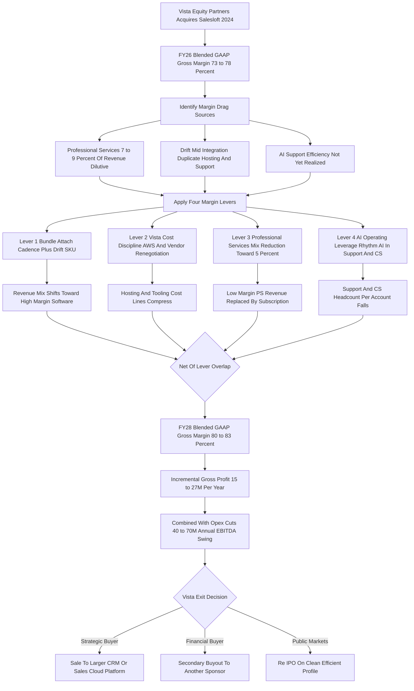

### Direct Answer

Salesloft's gross margin trajectory through 2028 is a private-equity margin transformation: from an estimated FY26 blended GAAP gross margin of roughly **73-78%** toward an estimated **80-83% by FY28**, a 5-7 point expansion. The climb is not a single event but the compounding of four levers Vista Equity Partners applies to nearly every SaaS company it owns -- bundle attach, cost discipline, professional-services mix reduction, and AI operating leverage. Because Salesloft is privately held and publishes no GAAP financials, every figure here is a model triangulated from public comparables and Vista's documented playbook; the direction is high-confidence, the exact basis points are estimate-grade.

**TL;DR:** Vista Equity Partners took Salesloft private in a ~$2.3B deal in 2024 and folded in the Drift conversational-marketing acquisition. Four levers drive the margin climb: bundle attach (~1.5-2.5 pts), Vista cost discipline (~1-1.5 pts of the cost-of-revenue portion), professional-services mix reduction from ~8% toward 5% of revenue (~1.5-2 pts), and AI operating leverage in support and customer success (~1.5-2.5 pts). Net of overlap, that is 5-7 points of expansion, worth roughly $15-27M of incremental annual gross profit on a ~$285M revenue base growing toward ~$360M. The realistic ceiling is low-80s, not 90s, because Salesloft has a real onboarding, data-cost, and customer-success function a pure-data company does not. The biggest swing factor is the Drift integration; the biggest structural risk is revenue-side competitive pressure undercutting the two mix-dependent levers; the cautionary precedent is Pluralsight.

## 1. What "Gross Margin Trajectory Through 2028" Actually Means

### 1.1 Defining the metric precisely

Before modeling anything, it is worth being precise about the question, because "gross margin trajectory" is a compound idea and Salesloft's status as a private company changes how it can be answered. **Gross margin is revenue minus cost of revenue, divided by revenue** -- the percentage of every sales dollar left after paying the direct cost of delivering the software. For a SaaS company, cost of revenue is not the cost of building the product (that is R&D, an operating expense); it is the cost of running and supporting it: cloud hosting and infrastructure, the customer-success and support headcount that keeps accounts live, the professional-services delivery team that onboards and configures, third-party data and API costs, payment processing, and software-license pass-through. **"Trajectory through 2028" means the path of that percentage** across fiscal years FY26, FY27, and FY28 -- not a single number but a slope.

### 1.2 Why Salesloft being private changes the answer

The critical framing fact is that **Salesloft is privately held**. Vista Equity Partners took it private in its 2024 acquisition; it files no 10-K, publishes no audited income statement, and discloses no GAAP gross margin. Therefore every number in this answer is a *model* -- triangulated from three sources: the publicly disclosed gross margins of comparable sales-and-marketing-tech companies, which cluster in a well-understood band; Vista Equity Partners' extensively documented operational playbook, applied consistently across dozens of SaaS buyouts; and the known structure of Salesloft's own corporate events, principally the Drift acquisition and the Vista take-private. The trajectory's *direction and shape* are high-confidence. The *exact basis points* are an informed estimate.

### 1.3 How to cite this answer

Anyone using these figures should cite them as a framework-and-estimate, not as Salesloft's reported financials. The honest posture is to hold the *shape* of the trajectory with confidence and the *exact percentages* loosely. The sibling entry on modeling a private SaaS company's financials sits adjacent to this methodological point, and the question of how an outside analyst tracks a private company at all (q1883 in spirit, though see the verified cross-links below) is part of the same discipline.

| Question component | What it means | Confidence |
|---|---|---|
| Gross margin level | Revenue minus cost of revenue, over revenue | Estimate-grade |
| Trajectory direction | Up and to the right toward low-80s | High |
| Trajectory shape | Stepwise, slow-then-fast-then-flat | Medium-high |
| Exact quarterly basis points | The specific percentage each quarter | Low-to-medium |
| The four causal levers | Why the margin moves at all | High |

## 2. Salesloft's Corporate History And Why It Drives The Margin Story

### 2.1 Founding and the venture decade

Salesloft's gross-margin trajectory cannot be understood without its corporate history, because each transaction reset the cost structure. **Salesloft was founded in 2011 in Atlanta** and grew through the 2010s as one of the two category-defining "sales engagement" platforms -- the software layer that sits on top of the CRM and orchestrates the actual outreach: email sequencing, dialer, cadence management, and rep workflow. It raised venture capital across multiple rounds, reaching a reported valuation around **$1.85 billion in its 2021 Series F** led by Owl Rock.

### 2.2 The consolidation phase and the Vista take-private

Then came the consolidation phase. **In 2024, Vista Equity Partners acquired Salesloft** in a transaction reported at roughly $2.3 billion, taking the company private. Almost simultaneously, **Salesloft acquired Drift**, the conversational-marketing and chatbot company, bolting a conversational-AI front end onto Salesloft's engagement core. Earlier, Salesloft had made smaller tuck-in acquisitions including **Costello** (sales-conversation guidance) and **InStereo** (which became part of the analytics layer).

### 2.3 Why each transaction matters to margin

Each of these matters to gross margin: an acquisition brings the acquired company's own cost structure, its own hosting bill, its own services team, and its own margin profile, and the acquirer then spends two to three years integrating -- consolidating cloud accounts, merging support teams, rationalizing the services org -- which is itself a margin-expansion process. **The Vista take-private is the single most important event**, because Vista does not buy SaaS companies to run them as-is; it buys them to apply a specific, repeatable financial transformation, and gross-margin expansion is one of the most reliable outputs of that transformation.

| Event | Year | Margin relevance |
|---|---|---|
| Salesloft founded (Atlanta) | 2011 | Establishes the engagement-platform cost model |
| Costello tuck-in | Pre-2024 | Adds conversation-guidance cost layer |
| InStereo tuck-in | Pre-2024 | Adds analytics cost layer |
| Series F (~$1.85B, Owl Rock) | 2021 | Revenue-triangulation anchor |
| Vista take-private (~$2.3B) | 2024 | Triggers the four-lever transformation |
| Drift acquisition | 2024 | Adds duplicate cost; becomes bundle engine |

## 3. The Estimated Starting Point: FY26 Blended Gross Margin

### 3.1 The 73-78% anchor

The trajectory needs an anchor, and the best estimate for Salesloft's FY26 blended GAAP gross margin is the **73-78% range, with a most-likely point estimate around 75-76%**. This is built from comparables. Pure-play, mature SaaS companies in adjacent categories report gross margins in a well-understood band, and Salesloft sits in the middle of that band and slightly below the best-in-class.

### 3.2 The comparable set

HubSpot, the public CRM-and-marketing platform now operating as **HubSpot (NYSE: HUBS)**, runs in the low-to-mid 80s on a GAAP basis and mid-80s non-GAAP. ZoomInfo, the sales-intelligence company trading as **ZoomInfo (NASDAQ: ZI)**, with a meaningful data-cost component, runs in the high 80s. Salesforce, the CRM platform itself, trading as **Salesforce (NYSE: CRM)**, runs around 76-77% GAAP and low-80s non-GAAP, dragged by a large professional-services and integration component. Smaller, less mature, more services-heavy sales-tech companies run lower, in the high 60s to mid 70s.

### 3.3 Why Salesloft sits below best-in-class

Salesloft sits below the best-in-class for three structural reasons: it still carries a **professional-services component** estimated at 7-9% of revenue, which is dilutive; it is **mid-integration on Drift**, meaning duplicate hosting and support costs that have not yet been consolidated out; and it has not yet fully realized the **AI-driven support efficiency** that is still being rolled out. So FY26 is the "before" picture: a healthy but not best-in-class blended margin, with visible, nameable sources of drag -- and that drag is precisely the opportunity set for the trajectory.

### 3.4 Why the anchor matters more than any other number

It is worth dwelling on the anchor, because in a trajectory model the starting point is load-bearing in a way no other figure is. If the model is correct that Salesloft begins FY26 at ~75-76% and expands 5-7 points, FY28 lands at 80-83%. But the expansion estimate and the anchor estimate are independent uncertainties, and they compound. A starting point two points lower (73-74%) with the same expansion lands FY28 at 78-81% -- still a real win, but no longer "low-80s confirmed." A starting point two points higher (77-78%) with the same expansion would imply an FY28 figure brushing the mid-80s, which the structural-ceiling argument in section 14 says is implausible -- meaning a high anchor would actually compress the *expansion* estimate rather than lift the destination. The disciplined reading is that the anchor and the ceiling together box the FY28 figure into low-80s regardless of which way the anchor estimate errs, which is part of why the *direction* is high-confidence even though the *exact basis points* are not. The 75-76% point estimate is the single most consequential assumption in the entire model, and any analyst stress-testing this trajectory should pressure-test it first.

| Comparable | Ticker | GAAP gross margin | Why it differs from Salesloft |
|---|---|---|---|
| HubSpot | NYSE: HUBS | Low-to-mid 80s | More self-serve, lighter services tail |
| ZoomInfo | NASDAQ: ZI | High 80s | Pure-data model, very light delivery |
| Salesforce | NYSE: CRM | ~76-77% | Large integration/services component |
| Smaller sales-tech | Various | High 60s-mid 70s | Less mature, services-heavy |
| Salesloft (estimated) | Private | ~75-76% FY26 | PS drag + Drift mid-integration |

## 4. The FY26 Cost-Of-Revenue Bridge: Where The Margin Actually Goes

### 4.1 Decomposing cost of revenue

To project the trajectory, you have to decompose where the 22-27 points of cost of revenue go in FY26. The estimated breakdown, as a percentage of total revenue, makes the trajectory legible -- the margin does not expand because of one magic lever, it expands because four of the seven cost lines come down meaningfully while only data costs hold roughly flat.

| Cost of revenue line | FY26 est. (% of revenue) | FY28 est. (% of revenue) | Driver of change |
|---|---|---|---|
| Cloud hosting and infrastructure (AWS) | 7-9% | 5-6.5% | Vista-negotiated committed-use discounts plus Drift consolidation plus AI efficiency |
| Customer success and onboarding | 6-8% | 4-5.5% | Rhythm AI plus tooling lifts CS-to-account ratios |
| Support | 4-5% | 2-3.5% | Drift conversational AI deflects tier-1 tickets |
| Professional services delivery | 4-6% | 2.5-4% | PS revenue mix deliberately shrunk; delivery standardized |
| Third-party data and API costs | 1.5-2.5% | 1.5-2.5% | Roughly stable; some renegotiation offset by AI inference cost |
| Payment processing and license pass-through | 0.5-1% | 0.5-1% | Stable |
| Total cost of revenue | 23.5-31.5% | 16.5-23% | -- |
| Implied gross margin | ~73-78% | ~80-83% | 5-7 point expansion |

### 4.2 What the bridge reveals

Three of the four meaningful reductions -- hosting, customer success, and support -- are Vista-playbook moves; one (professional services) is a deliberate revenue-mix decision. That is the entire story, decomposed. The four cost lines that fall account for essentially all of the 5-7 point expansion, while data-and-API costs hold flat because AI inference compute partially offsets vendor renegotiation on that line.

## 5. Lever One: Bundle Attach And The Drift Revenue-Mix Shift

### 5.1 How bundle attach moves margin

The first margin lever is **bundle attach**, and it works through revenue mix rather than cost-cutting. When Salesloft acquired Drift, it gained a conversational-marketing and chatbot product that, sold standalone, carries its own roughly 76-80% software gross margin. Salesloft's core Cadence/engagement product carries an estimated 78-82% software gross margin. The strategic move Vista and Salesloft are executing is to **bundle them** -- to sell Drift's conversational layer and the Cadence engagement core as a single platform SKU rather than two separate purchases.

### 5.2 The two mechanisms

This does two things to gross margin. **First, it shifts customers** from buying narrow point products (which often come with more services attached to integrate) toward buying the integrated platform (which is more self-serve and configures faster). **Second, as bundle attach rate climbs**, the blended revenue mix tilts toward pure high-margin software subscription and away from the lower-margin services and one-off elements.

### 5.3 The attach-rate path

The estimated attach-rate path: FY26 bundle attach at roughly **32-38%** of the customer base, FY27 target **45-50%**, FY28 reaching **55-60%**. Each leg of that climb is worth an estimated 0.5-1 point of blended gross margin, for a cumulative lever-one contribution of roughly **1.5-2.5 points** of the total 5-7 point expansion. The bundle is also priced with a 15-25% discount off buying the two products separately, which sounds margin-dilutive but is not -- the discount drives volume and the volume drives the software-mix shift, and software mix is what lifts the margin.

| Period | Bundle attach rate | Lever-one margin contribution (cumulative) |
|---|---|---|
| FY26 | 32-38% of customer base | Baseline |
| FY27 | 45-50% | +0.7-1.2 pts |
| FY28 | 55-60% | +1.5-2.5 pts |

## 6. Lever Two: The Vista Equity Partners Cost-Discipline Playbook

### 6.1 The standardized playbook

The second and largest cost-side lever is **Vista's standardized cost-discipline playbook**, applied through Vista's operating arm (the Vista Consulting Group) the way it is applied to essentially every company Vista owns. The components each touch cost of revenue or the cost lines just above it.

### 6.2 Cloud infrastructure renegotiation

**Vista's portfolio spends collectively in the billions on AWS, Azure, and GCP.** Vista negotiates committed-use and enterprise-discount agreements at portfolio scale and pushes each portfolio company onto better-priced commitments than it could get alone. For Salesloft, this alone can compress the hosting line by 1.5-2.5 points of revenue over the FY26-FY28 window.

### 6.3 G&A, vendor, and footprint rationalization

**G&A and shared-services consolidation** moves legal, HR, IT, finance systems, procurement, and security into shared-services models -- mostly an operating-expense reduction below the gross-margin line, but it also rationalizes some IT and security spend inside cost of revenue. **Vendor and tooling rationalization** audits the full software-vendor stack -- data vendors, monitoring tools, support platforms -- and consolidates and renegotiates; some of that spend sits in cost of revenue. **Real-estate footprint reduction** consolidates offices and embraces remote/hybrid work, a small slice of which is allocated into cost of revenue.

### 6.4 R&D capping and the cost-of-revenue portion

**R&D efficiency capping** typically pulls R&D from the 25-35% range a venture-funded company runs at down toward 15-22%; R&D is an operating expense, so this does not directly move gross margin -- but it is part of the same transformation. The cumulative cost-out from the Vista playbook is estimated at **$40-70M annually at scale** across the whole P&L; the portion that lands specifically in cost of revenue and thus directly lifts gross margin is worth roughly **1-1.5 points** of the total expansion.

| Vista action | Where it lands | Direct gross-margin effect |
|---|---|---|
| Cloud renegotiation (AWS committed-use) | Cost of revenue | Strong (1.5-2.5 pts of hosting line) |
| G&A shared services | Operating expense | Minimal (small IT/security slice) |
| Vendor and tooling consolidation | Mixed | Moderate (support/data tooling slice) |
| R&D capping | Operating expense | None directly |
| Real-estate footprint | Mixed | Minimal |

## 7. Lever Three: Professional Services Mix Reduction

### 7.1 The mix mathematics

The third lever is **deliberately shrinking professional services as a share of revenue**, and it is pure mix mathematics. Professional services -- the implementation, configuration, custom integration, and onboarding work Salesloft sells alongside the software -- runs at an estimated **35-45% gross margin**. That is healthy for a services business but it is a massive drag on a software company that otherwise runs at 78-82% on its subscription line. **Every dollar of revenue that is professional services rather than subscription costs the blended margin roughly 40 points on that dollar.**

### 7.2 The lever and its mechanics

So the lever is straightforward: shrink PS from an estimated 7-9% of revenue in FY26 toward 5% or below by FY28, and let subscription grow faster than PS in absolute terms. The mechanics: **standardize the implementation packages** so onboarding is a repeatable productized motion rather than bespoke consulting; **build self-serve and guided onboarding** so customers configure more themselves; **push partners** to deliver the heavier custom work so it leaves Salesloft's P&L entirely; and **use the AI orchestration layer** to automate configuration steps that used to require a services person.

### 7.3 The contribution and the risk

As PS contracts as a share of revenue, the blended margin lifts mechanically -- this lever is worth an estimated **1.5-2 points** of the total expansion. The risk to manage is that cutting PS too aggressively hurts onboarding quality and therefore retention, so the disciplined version replaces PS *labor* with PS *automation and partners* rather than simply removing the onboarding function.

| Component | Standalone gross margin | Mix role |
|---|---|---|
| Cadence/engagement core | ~78-82% | High-margin subscription |
| Drift conversational layer | ~76-80% | High-margin subscription |
| Professional services | ~35-45% | The dilutive component to shrink |

## 8. Lever Four: AI Operating Leverage In Support And Success

### 8.1 The mechanism

The fourth lever is **AI-driven operating leverage in the cost-of-revenue headcount lines** -- specifically support, customer success, and onboarding. Salesloft's **Rhythm** AI engine is the orchestration layer that turns buyer signals into prioritized rep actions; alongside it, the Drift conversational AI fields inbound questions, and AI assists run through the onboarding and configuration flow. The margin mechanism: these AI capabilities reduce the *human cost per account* of supporting and succeeding with customers.

### 8.2 The concrete effects

AI-assisted support deflects tier-1 tickets so the support team handles a larger book without growing headcount; AI-guided onboarding reduces the services and CS hours each new customer consumes; and AI-prioritized workflows mean customer-success managers can cover more accounts at the same service quality. The estimated effect: customer-success-to-account ratios improve from roughly **1:8-12** in the enterprise segment toward **1:12-16**, and from roughly **1:25-30** in mid-market toward **1:35-40**, over the FY26-FY28 window.

### 8.3 The contribution and the inference-cost catch

Translated to the headcount-to-revenue ratio, the company moves from supporting roughly one cost-of-revenue employee per ~$400-450K of revenue toward ~$550-600K. Because support, success, and onboarding together are 10-13 points of cost of revenue in FY26, squeezing them via AI is worth an estimated **1.5-2.5 points** of the total expansion -- the single largest of the four levers. The caveat: AI inference is not free; the data-and-API cost line absorbs some new AI-compute cost, which is part of why that line holds flat rather than falling.

| Segment | FY26 CS-to-account ratio | FY28 CS-to-account ratio |
|---|---|---|
| Enterprise | ~1:8-12 | ~1:12-16 |
| Mid-market | ~1:25-30 | ~1:35-40 |
| Revenue per cost-of-revenue employee | ~$400-450K | ~$550-600K |

## 9. Putting The Four Levers Together: The Bridge From 75% To 81%

### 9.1 The bridge with overlap

The four levers do not simply add -- there is overlap (AI helps both lever three and lever four; the Drift consolidation helps both lever one and lever two) -- so the honest way to present the bridge is as a range that nets to the 5-7 point total. **Lever one (bundle attach)** contributes roughly 1.5-2.5 points. **Lever two (Vista cost discipline, the cost-of-revenue portion only)** contributes roughly 1-1.5 points. **Lever three (PS mix reduction)** contributes roughly 1.5-2 points. **Lever four (AI operating leverage)** contributes roughly 1.5-2.5 points.

### 9.2 What the bridge tells you to watch

Summed at the midpoints and adjusted down modestly for overlap, that is a **5-7 point expansion** -- from an estimated ~75-76% blended GAAP gross margin in FY26 to an estimated ~80-83% by FY28. The reason to model it as four levers rather than one number is that it tells you *what to watch*: if bundle attach stalls, lever one underdelivers; if AWS renegotiation slips, lever two underdelivers; if PS cannot be shrunk without hurting retention, lever three is capped; if the AI rollout disappoints, lever four -- the biggest one -- is the most exposed.

| Lever | Mechanism | Contribution (of 5-7 pts) |
|---|---|---|
| 1 -- Bundle attach | Revenue-mix shift to software | ~1.5-2.5 pts |
| 2 -- Vista cost discipline | Hosting and tooling compression | ~1-1.5 pts |
| 3 -- PS mix reduction | Low-margin PS replaced by subscription | ~1.5-2 pts |
| 4 -- AI operating leverage | Support and CS headcount per account falls | ~1.5-2.5 pts |
| Net of overlap | -- | 5-7 pts total |

## 10. The Margin-Expansion Engine As A Flow

### 10.1 Reading the diagram

The diagram below traces the full causal chain from the Vista acquisition through the four levers to the FY28 margin and the exit decision. It is the single Mermaid diagram in this entry.

## 11. The Quarter-By-Quarter FY26-FY28 Trajectory

### 11.1 The estimated quarterly path

Margin expansion in a PE-owned SaaS company is rarely linear; it comes in steps as specific initiatives land. The estimated quarterly path runs slow in the integration-heavy early quarters, accelerates through the Drift integration period, and flattens toward a low-80s ceiling.

| Period | Est. blended GAAP GM | What drives the step |
|---|---|---|
| FY26 Q1 | 73-75% | Vista discipline begins; integration costs still elevated |
| FY26 Q2 | 74-75.5% | First AWS renegotiation savings flow through |
| FY26 Q3 | 74.5-76% | Drift hosting consolidation starts; PS standardization begins |
| FY26 Q4 | 75-77% | Vendor rationalization complete; CS tooling deployed |
| FY27 Q1 | 76-78% | Bundle attach acceleration becomes visible in mix |
| FY27 Q2 | 76.5-78.5% | PS mix reduction compounding; support AI deflection ramps |
| FY27 Q3 | 77-79% | Rhythm AI operating leverage measurable in CS ratios |
| FY27 Q4 | 78-80% | Drift integration substantially complete |
| FY28 Q1 | 78.5-81% | AI compounding; bundle attach approaching 55% |
| FY28 Q2 | 79-81.5% | Full Vista cost structure in steady state |
| FY28 Q3 | 79.5-82% | Mature operating model; PS at/near 5% of revenue |
| FY28 Q4 | 80-83% | Target steady-state margin profile |

### 11.2 Why the shape matters

The shape matters: the early quarters are the slowest because integration costs -- running duplicate Drift infrastructure, severance from consolidation, migration project costs -- partially offset the early savings. The middle quarters accelerate as consolidated hosting, deployed tooling, and standardized PS start compounding. The late quarters flatten toward a steady-state ceiling, because a sales-engagement platform with a real onboarding function and a data-cost component is not going to reach the high-80s margins of a pure data company. **Low-80s is the realistic ceiling, and FY28 Q4 is the company arriving there.**

## 12. Comparable Vista Portfolio Companies: The Track Record

### 12.1 The named comparables

The trajectory estimate is only as credible as Vista's track record of actually executing it. Vista Equity Partners has owned and operated dozens of enterprise-software companies, and the gross-margin-expansion-plus-cost-discipline pattern is consistent across them.

| Vista portfolio company | Category | Pattern under Vista |
|---|---|---|
| Marketo | Marketing automation | Acquired 2016, restructured for margin, sold to Adobe 2018 at a large markup |
| Ping Identity | Identity security | Operated for margin discipline, taken public, later re-acquired by Thoma Bravo |
| Pluralsight | Developer skills platform | Cost discipline applied; shows downside risk when leverage meets a growth slowdown |
| Datto | MSP software | Margin-disciplined, IPO'd, sold to Kaseya |
| Jamf | Apple device management | Vista-owned, IPO'd; disciplined SaaS margins through the transition |
| Avalara | Tax compliance software | Taken private by Vista in 2022; classic take-private transformation |
| Cvent | Event marketing software | Taken public then private again; adjacent to Salesloft's category |

### 12.2 What the pattern shows

The pattern is not subtle: Vista buys a SaaS company with a decent-but-not-great margin profile and visible operational slack, applies the consolidation-renegotiation-discipline playbook, and expands margins and free cash flow over a three-to-five-year hold. **Marketo and Cvent are the closest analogs** -- marketing/sales-tech companies that went through exactly the transformation Salesloft is now in. The **Pluralsight situation is the important counter-example**: the playbook is reliable, but not risk-free, particularly when growth disappoints and the capital structure carries meaningful debt.

## 13. What Gross Margin Expansion Is Actually Worth: The Dollars

### 13.1 Revenue triangulation

The percentage points only matter if they translate into money. Salesloft's revenue is not publicly disclosed, but triangulating from its last reported venture valuation (~$1.85B in 2021), the ~$2.3B Vista deal value, the Drift addition, and typical SaaS revenue multiples, a reasonable FY26 revenue estimate is in the **$250-320M range**, with a midpoint of roughly $285M, growing to perhaps **$340-380M by FY28**.

### 13.2 The incremental gross profit

A 5-7 point gross-margin expansion on that base produces incremental gross profit as follows.

| Scenario | FY28 revenue est. | GM expansion | Incremental annual gross profit |
|---|---|---|---|
| Conservative | $340M | +5 pts | ~$17M |
| Base case | $360M | +6 pts | ~$21.6M |
| Optimistic | $380M | +7 pts | ~$26.6M |

### 13.3 Why it matters to the deal

So the gross-margin lever alone is worth roughly **$15-27M of incremental annual gross profit** by FY28. Layer on the operating-expense cuts Vista runs in parallel -- the G&A consolidation and R&D capping that do not show up in gross margin but do show up in EBITDA -- and the total profitability swing is materially larger, plausibly **$40-70M of incremental annual EBITDA** at steady state versus the pre-Vista cost structure. That EBITDA swing is the entire investment thesis: it is what services the acquisition debt, what produces the cash, and what makes the eventual exit work at a return Vista can underwrite.

### 13.4 The multiple-arithmetic that makes the trajectory matter

The dollar figures only become an *investment* story when they are run through an exit multiple, and that arithmetic is worth making explicit because it shows why a few points of gross margin are worth the operational disruption. SaaS assets are valued primarily on a revenue or EBITDA multiple, and the multiple itself is a function of the margin and growth profile -- a clean, Rule-of-40, low-80s-gross-margin company commands a higher multiple than a growth-stage burner at the same revenue. So the margin trajectory does double duty at exit: it lifts the *numerator* (more EBITDA to apply the multiple to) and it lifts the *multiple itself* (a more efficient profile is worth more turns of EBITDA). If Vista bought at roughly $2.3B and the transformation produces $40-70M of incremental EBITDA plus a multiple re-rating from the efficiency story, the equity value at exit can be a substantial multiple of the equity Vista put in -- which is the return the fund's limited partners underwrote. This is why the gross-margin line, normally an unglamorous accounting figure, sits at the center of the deal: it is one of the three or four inputs (alongside revenue growth, R&D discipline, and G&A consolidation) that the entire return calculation runs through. A point of gross margin is not a point of accounting tidiness; it is a lever on the exit valuation.

## 14. Why Salesloft Will Not Hit 90% Gross Margin

### 14.1 The structural ceiling

It is worth being explicit about the ceiling, because optimistic projections sometimes drift toward "all software goes to 90%." Salesloft will not. There are structural reasons its realistic FY28 ceiling is low-80s, not high-80s or 90s.

### 14.2 The four structural costs that never disappear

**It has a real onboarding and services function.** Sales-engagement software is configured to a customer's process, integrated with their CRM, and adopted by a rep org -- genuine implementation work that, even productized and partner-shifted, never goes to zero. **It has a data-and-API cost component.** The conversational AI, the signal data, the enrichment, the AI inference compute -- real third-party costs that scale with usage and, in the AI era, are actually a slight headwind. **It has a customer-success function that retention depends on.** A sales-engagement platform that wants net revenue retention above 100% cannot run with no human success motion. **Support cannot fully disappear.** AI deflects tier-1, but enterprise customers expect human escalation.

### 14.3 The honest comparable band

The pure-data companies that run high-80s margins, ZoomInfo (NASDAQ: ZI) being the archetype, have a fundamentally lighter delivery model than a workflow-and-engagement platform. Salesloft's honest comparable set is the workflow-SaaS band -- HubSpot (NYSE: HUBS) in the low-80s, Salesforce (NYSE: CRM) in the mid-to-high-70s -- and arriving at the top of that band, ~80-83%, is the genuine win. Modeling it toward 90% would be wrong.

## 15. The Drift Integration As The Single Biggest Swing Factor

### 15.1 Why Drift touches three levers

Among the four levers, the **Drift integration** deserves singling out because it touches three of them and is the largest single source of both opportunity and execution risk. Drift brings: a second cloud infrastructure footprint that must be consolidated onto Salesloft's (lever two -- worth real hosting savings, but only once the migration is done); a second support and success org that must be merged (lever four -- duplicate cost until consolidated, efficiency after); a conversational-AI product that becomes the bundle's front end (lever one -- the attach engine); and its own services tail.

### 15.2 The integration period as the trajectory's hinge

The trajectory's middle quarters -- FY26 Q3 through FY27 Q4 -- are essentially *the Drift integration period*, and the margin step-up in those quarters is mostly a function of how cleanly that integration runs. A smooth integration that consolidates infrastructure on schedule and merges the orgs without disruption delivers the upper end of the trajectory. A messy one -- migration delays, customer churn from disruption, retention of duplicate costs longer than planned -- delivers the lower end or stalls it. **This is the number to watch above all others.**

### 15.3 The four integration milestones that gate the margin

Because the Drift integration is the hinge, it is worth naming the specific milestones that an analyst can track as proxies for whether the FY28 figure lands. **Milestone one is infrastructure consolidation** -- moving Drift's workloads onto Salesloft's cloud accounts and decommissioning the duplicate footprint; until this completes, the hosting line carries two bills instead of one, and the lever-two savings cannot fully appear. **Milestone two is the support and success org merge** -- consolidating two help desks, two CSM teams, and two onboarding functions into one; until this completes, lever four runs against duplicate headcount. **Milestone three is the bundled SKU launch and ramp** -- the actual packaging of Cadence-plus-Drift into a single sellable unit and the sales-team enablement to position it; lever one cannot move attach rate before the SKU exists. **Milestone four is the services-org rationalization** -- folding Drift's implementation tail into Salesloft's standardized PS motion; lever three's PS-mix math depends on it. A clean integration hits all four inside the FY26 Q3-to-FY27 Q4 window; a stalled one leaves one or two unfinished into FY28, which is exactly the scenario that pushes the FY28 figure toward 78% rather than 81-plus%.

| Drift integration milestone | Gates which lever | Margin effect if delayed |
|---|---|---|
| Infrastructure consolidation | Lever 2 | Hosting line carries duplicate cost |
| Support and success org merge | Lever 4 | Headcount savings deferred |
| Bundled SKU launch and ramp | Lever 1 | Attach-rate climb cannot start |
| Services-org rationalization | Lever 3 | PS-mix reduction stalls |

## 16. How An Outside Analyst Would Actually Track This

### 16.1 The indirect signals

Because Salesloft publishes nothing, anyone genuinely trying to follow this trajectory has to use indirect signals. **Headcount data** from LinkedIn and similar sources: tracking the ratio of support/CS/services headcount to total headcount over time is a direct read on whether levers three and four are working. **Job postings**: a shift from "implementation consultant" roles toward "partner enablement" and "AI-onboarding" roles signals the PS-to-automation transition. **Customer reviews** on G2: deteriorating onboarding or support sentiment is the early-warning sign that the cost-cutting has gone too far.

### 16.2 The corroborating reads

**Vista's public statements** and any Salesloft press on Rule-of-40, profitability, or "efficient growth" -- PE-owned companies signal margin progress in qualitative terms even when they will not give numbers. **Pricing-page changes**: the appearance and prominence of a bundled SKU tracks lever one. **Comparable-company earnings**: HubSpot (NYSE: HUBS), ZoomInfo (NASDAQ: ZI), and Salesforce (NYSE: CRM) report quarterly, and their margin commentary on AI-driven support efficiency and PS mix is a real-time read on whether the same forces are working across the category.

| Signal | What it tracks | Lever |
|---|---|---|
| Headcount composition (LinkedIn) | Support/CS/services share of total | 3 and 4 |
| Job-posting mix | PS-to-automation transition | 3 |
| G2 sentiment | Onboarding/support quality erosion | Risk to 3 |
| Vista/Salesloft public statements | Rule-of-40 progress | All |
| Pricing-page bundled SKU | Bundle attach motion | 1 |
| Comparable-company earnings | Category-wide AI efficiency | 2 and 4 |

## 17. Revenue Quality: Concentration And Net Revenue Retention

### 17.1 Customer concentration

A margin trajectory is only meaningful if the revenue it sits on is durable. **Customer concentration** -- the share of revenue from the top 10, 25, and 100 accounts -- determines how exposed the margin profile is to single-account churn. For an enterprise-and-mid-market sales-engagement platform, a healthy profile has the top 10 customers below 15-20% of revenue and the top 100 below 50-60%; concentration above those thresholds means a single lost logo can swing a quarter's margin numbers materially.

### 17.2 Net revenue retention

**Net revenue retention (NRR)** -- the percentage of last year's revenue from the same cohort this year, after upsells minus churn and contractions -- is the single most important durability metric in SaaS. An NRR above 110% means the existing customer base alone grows revenue; below 100% means the company has to outrun a leak. The estimated Salesloft NRR profile in FY26 is in the **105-115% range for enterprise**, with mid-market lower (95-105%) and the blended figure somewhere around 105-110%; the trajectory assumes this holds or modestly improves through FY28.

### 17.3 Why NRR is load-bearing for the margin

The risk to the gross-margin trajectory if NRR deteriorates is severe: a falling NRR means the revenue mix and the absolute revenue base both shrink, and *both* of the revenue-mix-dependent levers (bundle attach and PS mix reduction) lose their force. Cost discipline can fix a margin number but only durable revenue can hold it.

| Metric | Healthy threshold | Salesloft FY26 estimate |
|---|---|---|
| Top 10 customers, share of revenue | Below 15-20% | Assumed within range |
| Top 100 customers, share of revenue | Below 50-60% | Assumed within range |
| Enterprise NRR | Above 110% | 105-115% |
| Mid-market NRR | Above 100% | 95-105% |
| Blended NRR | Above 105% | 105-110% |

## 18. Working Capital And Cash-Flow Implications

### 18.1 Why cash exceeds gross profit

Gross margin is an accounting concept; cash is what services the debt. The cash effect of the margin expansion is substantially larger than the gross-profit effect alone. **SaaS businesses collect cash upfront and recognize revenue over time**, so a healthy subscription mix produces a deferred-revenue balance that is itself a working-capital cushion. **The professional-services mix reduction has a cash-timing benefit** -- PS revenue is typically recognized as delivered, often lagging the cash, while subscription is billed annually upfront.

### 18.2 One-time costs and the light capex profile

**The cost-out actions have one-time cash costs** -- severance, integration consulting, real-estate exit fees -- that hit FY26 and FY27 cash flow even though the steady-state savings appear in the margin line later. **The capex profile is light** -- a SaaS company of this scale has modest capital expenditures relative to revenue, so most of the incremental gross profit drops to operating cash flow.

### 18.3 The FY28 free-cash-flow picture

Putting it together: by FY28, the gross-margin expansion contributes to a free-cash-flow margin that should land in the **18-25% of revenue range** -- meaningfully above where the company would have been pre-Vista and into the territory where the debt comfortably services and the equity value builds. That free-cash-flow profile is, ultimately, what an acquirer or the public markets are buying at exit.

## 19. The Macro And Category Backdrop Through 2028

### 19.1 The supportive forces

The trajectory does not happen in a vacuum. On the supportive side: the entire B2B software industry has shifted decisively from "growth at all costs" to "efficient growth" and Rule-of-40 discipline, which means margin expansion is rewarded -- Vista is pushing on an open door. AI genuinely does lower the cost of support and onboarding, a real, durable tailwind for cost of revenue across the whole category.

### 19.2 The cautionary forces

On the cautionary side: the sales-engagement category is competitive and partly under pressure -- Outreach is the direct competitor, the CRM platforms HubSpot (NYSE: HUBS) and Salesforce (NYSE: CRM) keep absorbing engagement features into their core, and AI-native upstarts are attacking the category with new approaches to outbound. Competitive pressure caps *pricing power*. Also, the same AI that cuts support cost is changing what "sales engagement" even means -- if AI agents do more of the outbound, the seat-based revenue model is exposed.

### 19.3 The net read

The margin-*expansion* tailwinds are strong and favor the trajectory; the *revenue* side is where the risk sits, and a stalled top line would undercut the mix-shift levers even if the cost levers all work.

## 20. Comparing Salesloft's Trajectory To Outreach's Likely Path

### 20.1 The same fundamental trajectory

A useful sanity check is the direct competitor. Outreach, Salesloft's closest rival in sales engagement, is also private (venture-backed, last valued around $4.4B in 2021) and is widely understood to be running its own efficiency transformation. Both companies are on the same fundamental trajectory -- from growth-stage SaaS margins toward efficient, profitable SaaS margins -- because the same forces act on both.

### 20.2 The difference is mechanism and timeline

The difference is the *mechanism and the timeline*. **Salesloft has a PE owner (Vista) running an aggressive, dated, repeatable playbook** -- so its margin expansion should be faster, sharper, and more front-loaded. **Outreach, still venture-structured, is more likely on a self-directed, somewhat slower glide path** toward the same destination. The comparison reinforces the core thesis: the *direction* toward low-80s margins is a category-wide gravitational pull; what is Salesloft-specific is the *Vista acceleration*.

## 21. The Capital Structure Behind The Trajectory

### 21.1 The leverage component

Margin expansion is pursued to service a specific capital structure. A typical Vista take-private of a SaaS asset of Salesloft's scale carries a meaningful debt component -- the firm uses leverage as part of the return engine, sourcing acquisition financing from bank syndicates, direct-lending shops, and term-loan-B markets. While the exact debt quantum is not public, comparable Vista take-privates have run debt-to-EBITDA in the **6-8x range at close**, with the expectation that operational improvements pull that ratio down within 24-36 months.

### 21.2 The three disciplines the debt imposes

That capital structure imposes three disciplines. **It demands cash, not just margin** -- debt interest comes due regardless of how the integration is going, which biases the playbook toward fast, hard cost-out early. **It compresses the timeline** -- the typical hold is 4-7 years, and the margin transformation has to land before the exit window opens. **It eliminates growth-at-all-costs** -- the leveraged Salesloft cannot lose money chasing growth, because the debt does not care about ARR. The trajectory is operationally enforced by the term sheet.

### 21.3 Why leverage makes the trajectory more aggressive, not less

A common misreading is that debt makes a company cautious. The opposite is true for the margin trajectory: leverage is precisely what makes Vista's margin program *more* aggressive than what Salesloft would do organically. A founder-run, venture-funded Salesloft could tolerate a 73-75% gross margin indefinitely as long as the growth story held; there was no forcing function. The leveraged structure removes that optionality -- the interest coverage ratio, the debt covenants, and the deleveraging timeline all demand that the margin and cash profile improve on a schedule. This is why the early quarters of the trajectory feature the hardest, fastest cost-out (the vendor renegotiations, the headcount consolidations, the real-estate exits) rather than a gentle glide: the debt clock is running from day one. It is also why the trajectory should be read as *enforced* rather than *aspirational*. Vista does not need to hope the margin expands; the capital structure makes margin expansion the operating mandate, and the four levers are the means of executing a mandate that was set the moment the financing closed.

## 22. How AI Specifically Reshapes Each Cost Line

### 22.1 Support and onboarding

"AI lowers support cost" is a glib summary of a several-mechanism reality. **In support**, the Drift conversational AI fields tier-1 inbound -- password resets, basic configuration questions, basic troubleshooting -- without a human touching the ticket; mature deflection rates in this category range from 30-50% of total inbound. **In onboarding**, AI-assisted configuration walks new customers through CRM mapping, sequence setup, and rep enablement with embedded guidance, replacing paid services hours; even a 30% reduction in onboarding-services hours per customer cumulates into millions at scale.

### 22.2 Customer success, QA, and self-serve

**In customer success**, Rhythm AI's signal-prioritization layer means a CSM spends time on the accounts that genuinely need intervention rather than running the same QBR motion across the whole book. **In quality assurance and account hygiene**, AI flags churn risk and underused features earlier, which improves retention. **In documentation and self-serve**, AI-generated help content reduces support contacts before they happen.

### 22.3 The inference-cost offset

The cumulative effect is not one big number but a dozen small ones, each compressing a specific cost-of-revenue line by 10-30% over the timeframe. The catch worth naming again: the AI itself runs on inference compute that costs money, and that cost lands in the data-and-API line, partially offsetting the savings. The net is still positive, but smaller than a "just look at the headcount cut" analysis would suggest.

## 23. What The Trajectory Means For Customers, Employees, And The Category

### 23.1 For customers

A complete picture has to acknowledge downstream effects on the people in and around the company. **For customers**, the transformation generally means a more standardized, more self-serve, more bundled product experience, with less custom services availability and more emphasis on the platform doing things automatically. Customers who valued white-glove implementation will feel the pinch; customers who wanted a faster, lighter, more turnkey deployment will benefit.

### 23.2 For employees and the category

**For employees**, the transformation means a smaller services org, smaller support headcount per dollar of revenue, consolidated G&A functions, and a generally tighter operating posture -- the visible reality of "Vista cost discipline" in human terms. The flip side is a more profitable, more durable employer with a clearer financial model. **For the category**, Salesloft's transformation is one node in a broader movement toward the low-80s margin band that the public CRM and marketing-tech leaders have already established. The category-wide effect is professionalization: less venture-funded experimentation, more disciplined operators.

## 24. Counter-Case: Why The 80-83% FY28 Trajectory Might Not Land

### 24.1 The base could be wrong

The base case projects a clean climb to low-80s gross margin by FY28. A serious analyst has to stress-test that against everything that could stall, slow, or reverse it.

**Counter 1 -- It is an estimate, not a disclosure.** Salesloft publishes no GAAP financials. The 73-78% FY26 anchor is triangulated from comparables and deal structure. If the real starting point is 70%, the FY28 destination is closer to 76-78% even if every lever works. A wrong base shifts the whole line.

### 24.2 Integration and PS-cutting risk

**Counter 2 -- The Drift integration could go badly.** The middle quarters of the trajectory *are* the Drift integration. Software M&A integrations routinely run over schedule and budget; infrastructure migrations slip, merged support orgs lose people, and customers churn from disruption. A messy integration pushes FY28 toward 78% instead of 81-plus%.

**Counter 3 -- Cutting professional services too hard can hurt retention.** PS is not pure waste -- it is onboarding quality, and onboarding quality drives adoption, and adoption drives NRR. Cut the services function faster than you can replace it with automation and partners, and onboarding degrades, NRR falls, churn rises. The margin math can win on percentage while losing on dollars.

### 24.3 Revenue-side and AI-cost risk

**Counter 4 -- Revenue-side pressure undercuts the mix levers.** Two of the four levers work through *revenue mix*, which assumes a healthy, growing top line. But sales engagement is a competitive, partly-pressured category: Outreach competes directly, Salesforce (NYSE: CRM) and HubSpot (NYSE: HUBS) keep absorbing engagement features, and AI-native upstarts attack outbound. If competitive pressure caps pricing and growth, the trajectory caps in the high-70s.

**Counter 5 -- AI is a cost as well as a saving.** Lever four assumes AI cleanly cuts support and CS cost. But AI inference is not free -- LLM compute is a real, usage-scaling cost that lands in the data-and-API line. If AI-feature usage scales faster than expected, the inference cost could partially offset the support-headcount savings, blunting the single biggest lever.

### 24.4 The Pluralsight precedent and category risk

**Counter 6 -- The Pluralsight precedent is a real warning.** Pluralsight is the documented case of the Vista model meeting a growth slowdown inside a leveraged capital structure -- and it did not end as a clean win. A take-private carries acquisition debt; if the margin transformation underdelivers while the debt clock runs, the company can be forced into harder, retention-damaging cuts or a distressed outcome.

**Counter 7 -- AI could change what "sales engagement" even is.** The deepest risk is not to the margin levers but to the category. If AI agents take over more of the outbound motion, the seat-based revenue model is exposed -- fewer human reps means fewer seats.

### 24.5 Finite cost-out, macro, and exit-presentation risk

**Counter 8 -- The cost-out is finite and front-loaded.** Vista's cost-discipline playbook is largely a one-time reset. You renegotiate the cloud contract once. After the initial cost-out is harvested (mostly FY26-FY27), lever two is essentially spent, and the FY28 margin has to be carried by the slower structural levers.

**Counter 9 -- Macro and IT-budget risk.** A weaker macro environment compresses B2B software budgets; sales-tech is discretionary spend that gets cut when companies freeze hiring. A demand contraction in FY27 would hit revenue and stall the trajectory regardless of how well the cost levers execute.

**Counter 10 -- Exit pressure can distort the numbers.** A sponsor preparing a company for sale has incentives to optimize the *presented* margin profile -- timing of cost recognition, classification of spend, what gets called "one-time." Even an apparent "80-83% achieved" should be read with the exit context in mind.

### 24.6 The honest verdict

The *direction* of the trajectory -- up, toward low-80s -- is high-confidence: it is pushed by Vista's playbook, by category-wide AI efficiency, and by an efficiency-rewarding market, and it is corroborated by comparable Vista outcomes (Marketo, Avalara, Cvent). What is genuinely uncertain is the *magnitude and timing*: whether FY28 lands at 80-83% or stalls at 77-79%. The biggest single swing factor is the Drift integration; the biggest structural risk is revenue-side competitive and AI-driven pressure; the cautionary precedent is Pluralsight. Hold the *shape* of this trajectory with confidence and the *exact basis points* loosely.

| Counter-risk | Hits which lever | Severity |
|---|---|---|
| Wrong starting base | All | High (shifts whole line) |
| Drift integration failure | 1, 2, 4 | High |
| PS cut hurts retention | 3 (and revenue base) | High |
| Revenue-side competitive pressure | 1, 3 | High |
| AI inference cost | 4 | Medium |
| Pluralsight-style leverage stress | All | Medium-high |
| Category seat-model disruption | Revenue base | Medium-high |
| Finite front-loaded cost-out | 2 | Medium |
| Macro IT-budget contraction | Revenue base | Medium |
| Exit-presentation distortion | Reported numbers | Low-medium |

## 25. Summary: The Trajectory In One Frame

Salesloft's gross-margin trajectory through 2028 is a private-equity margin transformation, modeled from comparables and Vista's documented playbook. It runs from an estimated FY26 blended GAAP gross margin of ~73-78% to an estimated FY28 figure of ~80-83% -- a 5-7 point expansion -- driven by four overlapping levers: bundle attach shifting revenue mix toward high-margin software (~1.5-2.5 pts), Vista's cost-discipline playbook compressing the hosting and tooling lines (~1-1.5 pts), professional-services mix reduction from ~8% toward 5% of revenue (~1.5-2 pts), and AI operating leverage squeezing the support and customer-success headcount lines (~1.5-2.5 pts). The path is stepwise -- slow in the early integration-cost-heavy quarters, accelerating through the FY26-FY27 Drift integration period, flattening toward a low-80s ceiling in FY28. The ceiling is low-80s, not 90s, because Salesloft has real onboarding, data-cost, and success functions a pure-data company does not. In dollars, the expansion is worth ~$15-27M of incremental annual gross profit and, with the parallel opex cuts, contributes to a $40-70M annual EBITDA swing -- which is the actual point, because that swing funds the debt and builds the clean, efficient, saleable asset Vista underwrote and intends to exit. High confidence on the direction and shape; estimate-grade, not audited-grade, on the exact basis points.

## 26. Key Numbers At A Glance

### 26.1 Margin and lever figures

**Estimated blended GAAP gross margin trajectory** runs FY26 73-78% (point estimate ~75-76%), FY27 76-80%, FY28 80-83%, a total 5-7 point expansion. **The four-lever contribution bridge** of that 5-7 points: lever one bundle attach ~1.5-2.5 pts, lever two Vista cost discipline ~1-1.5 pts, lever three PS mix reduction ~1.5-2 pts, lever four AI operating leverage ~1.5-2.5 pts, net of overlap 5-7 pts.

### 26.2 Revenue and dollar figures

**Revenue triangulation anchors**: 2021 Series F valuation ~$1.85B, 2024 Vista take-private deal value ~$2.3B, estimated FY26 revenue ~$250-320M (midpoint ~$285M), estimated FY28 revenue ~$340-380M. **Incremental annual gross profit by FY28**: conservative ~$17M, base case ~$21.6M, optimistic ~$26.6M; combined with parallel opex cuts, ~$40-70M annual EBITDA swing versus the pre-Vista structure. **The realistic ceiling** is low-80s (~80-83%), not high-80s or 90s.

## 27. Sources

1. **Vista Equity Partners -- Firm and Portfolio Overview** -- The private-equity owner of Salesloft; documentation of the operating model and portfolio. https://www.vistaequitypartners.com
2. **Salesloft -- Company Site and Product Documentation** -- Salesloft's own descriptions of the Cadence engagement platform, Rhythm AI, and the Drift conversational layer. https://www.salesloft.com
3. **Salesloft Acquires Drift -- Acquisition Announcement and Trade Coverage (2024)** -- Reporting on the Drift conversational-marketing acquisition that reshaped Salesloft's product and cost structure.
4. **Vista Equity Partners to Acquire Salesloft -- Deal Announcement (2024)** -- Coverage of the ~$2.3B take-private transaction.
5. **HubSpot Inc. (NYSE: HUBS) -- SEC 10-K and Quarterly Filings** -- Public gross-margin disclosure for a comparable CRM-and-marketing SaaS platform. https://www.sec.gov
6. **ZoomInfo Technologies (NASDAQ: ZI) -- SEC 10-K and Quarterly Filings** -- Public gross-margin disclosure for a comparable, data-heavy sales-intelligence company. https://www.sec.gov
7. **Salesforce Inc. (NYSE: CRM) -- SEC 10-K and Quarterly Filings** -- Public gross-margin disclosure for the CRM platform with a large services component. https://www.sec.gov
8. **Vista Consulting Group -- Operating Model Descriptions** -- Vista's in-house operating arm; the source of the standardized SaaS cost-discipline playbook.
9. **Marketo / Adobe Acquisition History** -- Vista's ownership, restructuring, and sale of Marketo as a documented sales-and-marketing-tech margin-and-multiple case.
10. **Cvent -- Vista Ownership and Public/Private History** -- Adjacent event-marketing-software Vista portfolio company; comparable transformation.
11. **Avalara -- Vista Take-Private (2022)** -- Comparable Vista SaaS take-private and margin-transformation case.
12. **Pluralsight -- Vista Ownership and Restructuring Coverage** -- The important counter-example: Vista playbook meeting a growth slowdown and a leveraged structure.
13. **Ping Identity, Datto, Jamf, Duck Creek, Mediaocean -- Vista Portfolio Company Histories** -- Additional comparables for the Vista margin-discipline pattern.
14. **Outreach -- Company and Funding History** -- The direct sales-engagement competitor; context for the category-wide margin trajectory.
15. **Owl Rock / Salesloft Series F (2021)** -- The ~$1.85B venture valuation used as a revenue-triangulation anchor.
16. **AWS Enterprise Discount Program and Committed-Use Documentation** -- Reference for how portfolio-scale cloud renegotiation compresses the hosting cost line.
17. **G2 -- Salesloft and Sales-Engagement Category Reviews** -- Customer-sentiment signal for tracking onboarding and support quality through the cost transformation.
18. **The SaaS Capital Index / Public SaaS Gross-Margin Benchmarks** -- Benchmark data on where workflow SaaS gross margins cluster.
19. **Bessemer Venture Partners -- State of the Cloud / SaaS Metrics Research** -- Reference for SaaS gross-margin, Rule-of-40, and efficient-growth benchmarks.
20. **KeyBanc / Public SaaS Operating Metrics Surveys** -- Industry survey data on cost-of-revenue composition and gross-margin drivers in SaaS.
21. **Gartner -- Sales Engagement and Sales Technology Market Coverage** -- Category context, competitive landscape, and the Salesloft-Outreach-CRM dynamic.
22. **Forrester -- Sales Engagement / Revenue Technology Wave Reports** -- Independent category analysis and competitive positioning.
23. **PitchBook -- Salesloft, Outreach, and Drift Valuation and Deal Data** -- Private-company valuation and transaction reference.
24. **Crunchbase -- Salesloft Funding, Acquisition, and Corporate History** -- Reference for the Costello, InStereo, and Drift acquisition timeline.
25. **LinkedIn Workforce Data -- Salesloft Headcount Composition** -- Indirect signal for tracking the support/CS/services share of headcount over time.
26. **Private Equity Operating-Playbook Research (Bain, McKinsey PE practices)** -- General reference for the PE SaaS value-creation and margin-expansion model.
27. **Sales-Engagement Category Trade Press (TechCrunch, SaaStr, Sales Hacker)** -- Ongoing coverage of Salesloft, Outreach, and the AI disruption of outbound sales.
28. **GAAP Revenue Recognition (ASC 606) References** -- Background on how subscription versus professional-services revenue is recognized and why the mix matters to margin.
29. **AI Inference Cost and LLM Pricing References** -- Context for why AI compute is a modest headwind to the data-and-API cost line even as it cuts support cost.
30. **Comparable SaaS M&A and Re-IPO Coverage** -- Reference for the exit-path context (strategic sale, secondary buyout, re-IPO) that the margin trajectory is built to enable.
31. **Term-Loan-B and Direct-Lending Market Commentary** -- Reference for the leverage structure typical of a Vista SaaS take-private and the debt-to-EBITDA discipline it imposes.
32. **Rule-of-40 and Efficient-Growth Framework Literature** -- Background on why margin expansion became the priority metric for PE-owned SaaS.

## 28. Related Pulse Library Entries

- **(q1847)** -- How is Vista's playbook reshaping Salesloft through 2027? The full operating context behind lever two and the overall margin transformation.
- **(q1852)** -- How does Salesloft make money in 2027? The revenue-model side that the bundle-attach and PS-mix levers operate on.
- **(q1856)** -- What is Salesloft net revenue retention in 2026? The durability metric that determines whether the margin holds.
- **(q1843)** -- What does Salesloft churn math look like under Vista pressure? The retention risk that PS-cutting (lever three) could trigger.
- **(q1858)** -- What should Salesloft do about the Drift acquisition value? The Drift integration that touches three of the four levers.
- **(q1833)** -- How does Vista exit Salesloft -- IPO or strategic acquisition? The exit the entire margin trajectory is built to enable.
- **(q1861)** -- How does Salesloft grow internationally without Vista cost-cutting? The growth-versus-cost-discipline tension behind the revenue-side risk.
- **(q1854)** -- Salesloft vs Outreach -- which should you buy? Competitive-positioning context for the revenue-side risk to the mix levers.
- **(q1848)** -- Can Salesloft keep growing 15%+ post-Vista acquisition? The top-line assumption the mix-dependent levers rely on.
- **(q1835)** -- What is Salesloft M&A strategy under Vista through 2028? The acquisition cadence that resets the cost structure the margin sits on.
- **(q1924)** -- How does Outreach make money in 2027? The direct competitor's revenue model as a category sanity check.
