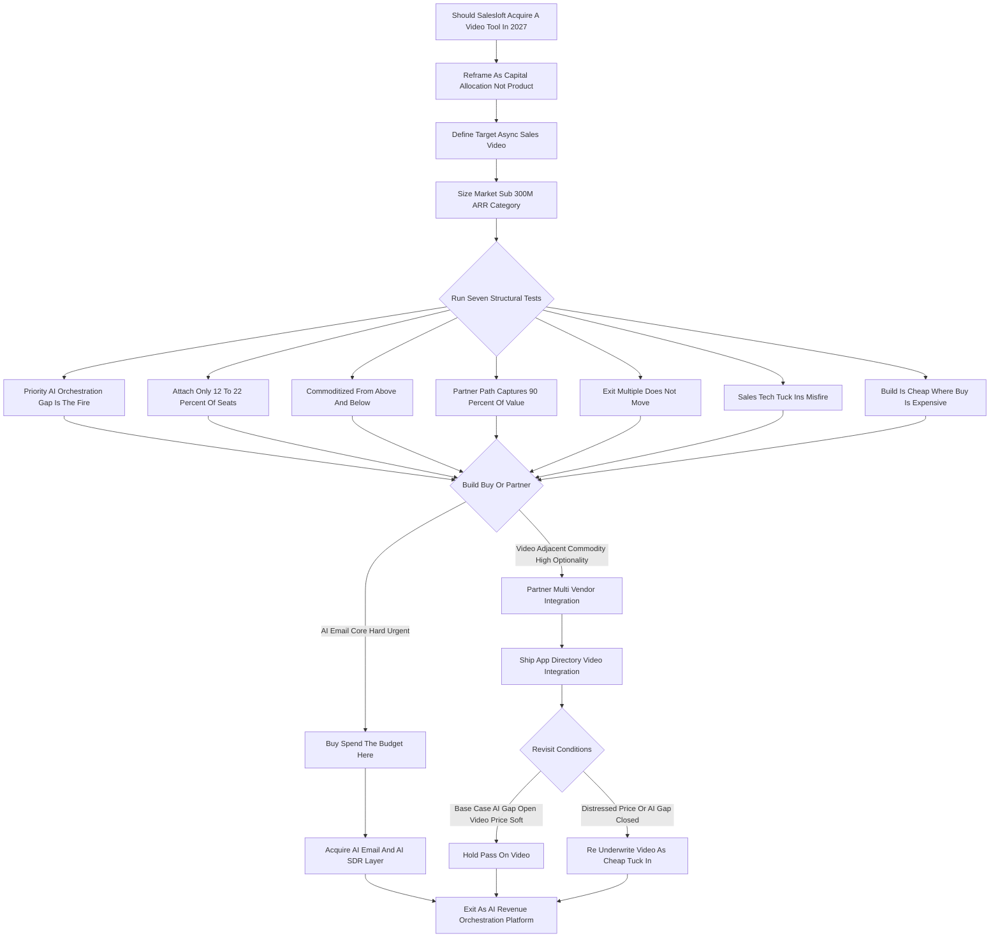

### Direct Answer

**No -- Salesloft should not acquire a standalone async sales-video tool in 2027.** This is a capital-allocation verdict, not a dislike of video: a Vista Equity Partners portfolio company carries a finite M&A budget, and every dollar spent on a low-attach video acquisition is a dollar not spent closing the existential AI-orchestration gap against **Outreach**, **HubSpot (NYSE: HUBS)**, and the foundation-model-native challengers. The disciplined move is **partner-and-integrate** -- deepen native integrations with Loom, Vidyard, and Sendspark to capture roughly 90% of the customer value at roughly 0% of the capital cost -- and reserve the budget for the AI-email and AI-SDR orchestration asset that actually re-rates the exit multiple.

**TL;DR**

- **The question is corp-dev, not product.** "Should Salesloft buy video" is a capital-allocation decision inside a PE-owned company with a finite budget and a defined exit clock -- it must be judged on opportunity cost, not on whether sales video is useful.
- **Seven structural reasons say no:** strategic-priority mismatch, a 12-22% attach ceiling, commoditization from above and below, the partner path capturing ~90% of value, zero exit-multiple impact, a poor sales-tech tuck-in track record, and build being cheap where buy is expensive.
- **The budget belongs to AI-orchestration.** AI-native email and AI-SDR orchestration attach to ~100% of seats and re-rate Salesloft from "cadence tool" to "AI revenue-orchestration platform" -- the only spend that moves the exit multiple.
- **Partner, do not buy.** A multi-vendor App Directory integration with Loom, Vidyard, and Sendspark delivers the cadence-native video experience customers actually ask for, for engineering person-weeks instead of $100M-$300M.
- **The answer is conditional.** It flips to yes only on a genuinely distressed price, an already-closed AI gap, a true defensive block, or a transformation of the video category itself -- none of which hold in the base 2027 case.

## Section 1 -- The Actual Question: A Capital-Allocation Decision

### 1.1 Why The Product Framing Fails

The question "should Salesloft acquire a video tool in 2027" sounds like a product question and gets answered badly when it is treated as one. **The bad version is a debate about whether sales video is useful** -- and of course it is; asynchronous video has a real place in outbound and in deal cycles. But that framing misses what the question actually is: a capital-allocation decision inside a private-equity-owned company with a finite budget and a defined exit window. Asked as a product question, the answer drifts toward "video is nice, let's get some." Asked as a corp-dev question, the answer falls out of arithmetic. The single most important reframe in this entry is this: **video is a fine feature and a poor acquisition**, and the gap between those two statements is the entire analysis.

### 1.2 The Vista Ownership Lens

**Salesloft is owned by Vista Equity Partners**, which acquired it in 2022 and runs it the way Vista runs everything -- toward a value-creation plan with a target exit multiple, a disciplined M&A budget, and a ruthless sense of opportunity cost. In that world the right question is never "is video good." It is **"is a video acquisition the best available use of the next $100M-$300M of M&A capital,"** measured against every other thing that money could buy and against simply not spending it. A PE owner with a clock does not buy comfortable adjacencies; it buys the thing that re-rates the company. Everything downstream in this deep dive is an application of that lens. For the broader operating-model context, see the Vista-style value-creation playbook in (q1860) and the way PE firms structure M&A budgets and exit timelines in (q1861).

### 1.3 The Reframe In One Sentence

**This is corp-dev, not product management, and the discipline of corp-dev is opportunity cost.** Video does not compete against "doing nothing" -- it competes against a slate of higher-return uses of the same dollars, and it loses to all of them. Hold that sentence through every section below; it is the spine of the recommendation.

## Section 2 -- What "A Video Tool" Actually Means In 2027

### 2.1 Defining The Target Precisely

Before the case against, define the target, because "video tool" is doing a lot of vague work. In the 2027 sales-engagement context, **a "video tool" acquisition means buying an asynchronous sales-video platform** -- the category occupied by Loom (now inside **Atlassian (NASDAQ: TEAM)**), Vidyard, BombBomb, Sendspark, Potion, and the remnants of HubSpot's SoapBox acquisition. These tools let a rep record a screen-and-webcam clip, generate a personalized thumbnail and landing page, embed it in an email or LinkedIn message, and track opens and watch-through. That is a genuine outbound motion -- a video step inside a Salesloft cadence can lift reply rates on the right segments.

### 2.2 What It Is Not

The async-record-and-send category is **not the same thing as conversation intelligence** (Gong, Chorus, Salesloft's own Conversations), which records and analyzes live sales calls; it is not video conferencing (**Zoom (NASDAQ: ZM)**, Microsoft Teams from **Microsoft (NASDAQ: MSFT)**); and it is not AI avatar/video generation (Synthesia, HeyGen, Tavus), though that adjacency matters for the commoditization argument later. Precision here matters because a loose definition lets a corp-dev team accidentally argue the merits of one category while pricing another. For the category-convergence picture between CI and sales engagement, see (q1867).

| Category | Example Vendors | In Scope For This Question? |
|---|---|---|
| Async record-and-send video | Vidyard, BombBomb, Sendspark, Loom | Yes -- this is the target |
| Conversation intelligence | Gong, Chorus, Salesloft Conversations | No -- live-call analysis, different motion |
| Video conferencing | Zoom, Microsoft Teams | No -- meetings, not outbound |
| AI video generation | Synthesia, HeyGen, Tavus | No -- but the from-below commoditizer |

### 2.3 The First Hard Fact: Market Size

The standalone async-sales-video market is small. **A reasonable estimate puts the entire async-sales-video category at $150M-$300M of addressable ARR spread across all vendors**, with the largest independent players doing perhaps $30M-$80M ARR each. That market size is the first hard fact, and it constrains everything: you cannot pay $200M+ for a meaningful share of a sub-$300M category and expect the math to work without a transformation strategy the category does not support. The market-sizing step deserves its own scrutiny because the whole case partly rests on it. Vidyard, the most sales-focused independent, is plausibly in the $40M-$80M ARR range; BombBomb, with its real-estate-plus-sales mix, is a similar order of magnitude; Sendspark, Potion, and Tolstoy are smaller, often venture-stage. Loom, the giant, was always more a *collaboration and work* tool than a *sales* tool -- which is exactly why Atlassian, not a sales-tech company, bought it. Strip out the non-sales use and the genuinely addressable async-sales-video ARR across all vendors is plausibly $150M-$300M. That has three implications. **First, you cannot build a large standalone business by rolling up this category** -- there is not enough there. **Second, any single acquisition target is small**, so the ARR contribution to a $3B-$6B exit is marginal. **Third, a small category with platform giants shipping native features and AI-generation eroding the moat is, definitionally, a category under margin and growth pressure.** None of that says video is worthless -- it says video is a feature inside other people's platforms, which is precisely the argument for integrating rather than buying.

## Section 3 -- The Seven Structural Reasons To Pass

### 3.1 Reason One -- The AI-Orchestration Gap Is The Real Fire

The single strongest reason against a video acquisition is that **Salesloft has a more urgent, more existential gap to close**, and the M&A budget is the tool for closing it. The gap is AI orchestration and AI-native email -- the layer where a rep, or increasingly an AI SDR agent, decides what to send, to whom, when, and with what message, and where the system drafts and personalizes at scale. **Outreach** has pushed hard on Smart Email Assist; **HubSpot (NYSE: HUBS)** ships AI across its Sales Hub for an installed base of hundreds of thousands; and the genuinely dangerous challengers -- the AI-SDR-native companies like 11x, Regie, Nooks, and Artisan -- are attacking the assumption that a human rep using a cadence tool is even the right unit of work. **That is the fire.** Spending $100M-$300M on async video while the orchestration gap stays open is the corp-dev equivalent of buying nicer furniture for a house that is on fire. For why AI disruption of incumbent SaaS categories is existential, see (q1863); for the agentic-outbound thesis specifically, see (q1868).

### 3.2 Reason Two -- The Attach-Rate Problem

The second reason is empirical and unsentimental: **async sales video has a low attach rate**, and low-attach features make poor platform acquisitions. Attach rate is the share of the customer base that actively, repeatedly uses a capability -- and for async video inside B2B sales orgs, the honest number is **12-22%**. Reps know video works, but recording feels like effort, many segments do not respond to it, SDRs under quota pressure default to text, and adoption decays after the novelty wears off. There is also a self-selection problem: the reps who adopt video tend to be the high performers who would over-perform on any channel, which makes the channel's marginal lift look better in anecdote than it is in aggregate. Compare that to what Salesloft already attaches: dialer/cadence is effectively 100%; conversation intelligence, once bundled, attaches in the 35-50% range and rising. **A capability that roughly 80% of seats ignore does not become a moat just because you own it.** It also does not lift ARPU meaningfully -- even a generous $30-$60/seat/month video add-on, applied to only 12-22% of seats, is a rounding error against a platform price. The platform-acquisition logic only works when the acquired capability becomes something a large majority of the base uses and would genuinely miss if it were gone. Video does not clear that bar; it is a real motion for a real minority, and a minority motion is served with an integration, not a balance-sheet commitment. Attach rate as a corp-dev metric -- and why it should be the *first* number demanded in any capability diligence -- is treated in depth in (q1872).

### 3.3 Reason Three -- Commoditization From Underneath

The third reason is timing, and it is brutal for video specifically. **The async-video category is being commoditized from two directions at once.** From above, every platform a sales team already pays for is shipping native record-and-send: HubSpot has had it since SoapBox, **Salesforce (NYSE: CRM)** surfaces it, and Salesloft itself can build a competent record-embed-track feature for a fraction of an acquisition price. From below, the foundation-model labs and AI-video-generation companies (Synthesia, HeyGen, Tavus) are turning "personalized video" into a generated commodity. The valuation evidence is visible: **Loom sold to Atlassian for roughly $975M in 2023**, well below its peak private valuation. **Acquiring an async-video tool in 2027 means buying into a melting asset** -- paying a 2025-style price for a capability whose differentiation is being eroded from both sides.

### 3.4 Reason Four -- The Partner Path Captures ~90% Of The Value

The fourth reason is that **ownership is not required to give customers what they want.** Salesloft already has, and can deepen, native integrations with Loom, Vidyard, and Sendspark through the Salesloft App Directory. A well-built integration lets a rep insert a video step into a cadence, record or attach a video without leaving the workflow, sync watch-data back into Salesloft analytics, and trigger follow-up based on engagement. **That covers roughly 85-95% of the usable value of owning the video tool outright.** The delta between "deeply integrated partner" and "owned product" is small for the customer and enormous for the balance sheet: the integration costs engineering time measured in person-weeks; the acquisition costs $100M-$300M plus integration risk plus opportunity cost. Sales-engagement platforms have always been integration hubs -- a meaningful part of Salesloft's value is that it connects to everything in the rep's stack -- and customers generally prefer the flexibility of choosing their video vendor over being locked into whatever Salesloft happened to buy. The partner path also keeps Salesloft on good terms with the entire video ecosystem rather than turning every video vendor into a competitor overnight, which preserves the neutral-hub positioning that is itself a moat. When an integration delivers roughly 90% of the value at roughly 0% of the capital cost and roughly 0% of the integration risk, the burden of proof on the acquisition is extraordinarily high -- and video does not come close to meeting it.

### 3.5 Reason Five -- Vista Exit Math: The Multiple Doesn't Move

The fifth reason is the one that matters most to the actual owner. **Vista underwrote Salesloft to a value-creation plan with a target exit** -- a strategic sale or sponsor-to-sponsor deal plausibly in the $3B-$6B enterprise-value range. Exit value is roughly **ARR x multiple**, and the question for any acquisition is whether it raises ARR, the multiple, or both, by more than it costs. For video: **ARR contribution is small** (the category is small, attach is low -- maybe $20M-$60M, much at churn/overlap risk); **multiple contribution is essentially zero to slightly negative** (a strategic acquirer buys Salesloft for its engagement platform and its AI story, not for a tucked-in video tool); and **cost is $100M-$300M of the budget**. By contrast, a credible AI-email/AI-SDR asset can move the multiple itself -- a re-rating, not an add-on. SaaS M&A multiple mechanics are detailed in (q1869).

### 3.6 Reason Six -- Integration Risk: Sales-Tech Tuck-Ins Misfire

The sixth reason is execution risk, and the sales-tech sector's own history is the evidence. **Tuck-in acquisitions in this space have a mixed-to-poor track record** of actually delivering the promised synergy. The pattern of failure is consistent: the acquired product's roadmap stalls during integration; the acquired team's best people leave within 12-18 months; the two codebases never fully merge, so customers get a bolted-on experience rather than a native one; the acquired product's standalone customers churn because they did not want to be on the acquirer's platform in the first place; and management attention -- the scarcest resource in a PE-owned company racing to an exit -- gets consumed by integration instead of by the core roadmap. The cruel arithmetic of integration risk is that **the difficulty does not scale down with the prize.** Fusing a small video tool into Salesloft is nearly as much organizational work as fusing a large one: the same data-model reconciliation, the same single-sign-on and billing unification, the same support-team retraining, the same go-to-market re-narration. A small acquisition therefore carries near-full integration cost against a fractional payoff -- the worst possible ratio. Even Salesloft's own Drift acquisition, strategically sensible on paper as a move into conversational marketing, illustrated how much real work it is to fuse a meaningfully different product into the core platform and tell a clean combined story. The opportunity cost is not just the dollars; it is the quarters of senior-leadership and engineering focus that integration eats -- focus that, in 2027, must be on the AI roadmap. Post-merger integration failure modes, and the specific patterns that kill software tuck-ins, are catalogued in (q1870).

### 3.7 Reason Seven -- Build Is Cheap Where Buy Is Expensive

The seventh reason closes the build-vs-buy logic. **The core of a sales-video feature -- record screen and webcam, generate a shareable page with a personalized thumbnail, embed in a cadence step, track watch-through, sync engagement to analytics -- is not deep technology in 2027.** Browser recording APIs are mature, video hosting and transcoding are commodity cloud services, and personalization and thumbnail generation are exactly the kind of thing modern AI tooling makes cheap. Salesloft could build a competent, "good enough for the 12-22% who want it" native video step with a focused engineering squad over a couple of quarters, at a cost measured in low single-digit millions of dollars -- versus $100M-$300M to buy. The general principle: **buy for moats and time-to-market on hard problems; build for commodity features; partner for everything in between.** Video is commodity-to-partner, not buy. The only thing an acquisition would add over a build is the acquired company's existing ARR and brand -- and as Reasons Two and Five established, that ARR is small, low-attach, and does not move the multiple. When build is cheap and partner is free and buy is expensive for the same customer outcome, *buy is simply the wrong verb*. The build-buy-partner framework is treated as a standalone discipline in (q1862), and the central insight there applies cleanly here: the verb you choose should be dictated by the nature of the capability, not by the excitement of the target.

### 3.8 The Seven Reasons As A Single Argument

Read together, the seven reasons are not seven independent objections that a strong buy case could pick off one at a time -- they reinforce each other into a single, coherent argument. **The strategic-priority mismatch (Reason One) explains why the budget is precious; the attach-rate problem (Reason Two) explains why video's prize is small; commoditization (Reason Three) explains why even that small prize is shrinking; the partner path (Reason Four) explains why the prize can be captured without the acquisition at all; the exit math (Reason Five) explains why the owner gets nothing from the deal; integration risk (Reason Six) explains why the deal costs more than its sticker price; and build economics (Reason Seven) explains why the one thing an acquisition uniquely provides is cheap to replicate.** A buy case would have to overturn most of these simultaneously to succeed -- it would need video to be a top strategic priority *and* high-attach *and* not commoditizing *and* not substitutable by integration *and* multiple-moving *and* low-integration-risk *and* hard to build. No realistic 2027 scenario clears all seven bars at once. That is why the recommendation is firm rather than tentative: it does not rest on any single reason being decisive; it rests on the structure of all seven pointing the same way.

| # | Structural Reason | One-Line Verdict |
|---|---|---|
| 1 | Strategic-priority mismatch | AI-orchestration is the fire; video is furniture |
| 2 | Low attach rate (12-22%) | A minority motion is not a platform moat |
| 3 | Commoditization from above and below | Buying a melting asset at a soft-but-not-distressed price |
| 4 | Partner path captures ~90% of value | Ownership is unnecessary for the customer outcome |
| 5 | Exit multiple does not move | ARR contribution marginal, re-rating zero |
| 6 | Sales-tech tuck-in integration risk | Normal difficulty, small prize -- bad ratio |
| 7 | Build is cheap where buy is expensive | Commodity tech does not justify a nine-figure check |

## Section 4 -- The Build-Buy-Partner Framework, Applied

### 4.1 The Grid

Corp-dev runs every capability question through a build-buy-partner grid. **Build** when the capability is core to differentiation, the technology is within reach, and time-to-market is acceptable. **Buy** when the capability is core or strategically urgent, the technology or market position is genuinely hard to replicate, time-to-market matters, and the target's ARR/team/IP justify the price and integration cost. **Partner** when the capability is valuable but adjacent, customers benefit from optionality, and an integration captures most of the value.

### 4.2 Running Video Through The Grid

Run video through it: **differentiation -- adjacent, not core; technology -- commodity; customer optionality -- high** (customers like choosing their video vendor); **value captured by integration -- ~90%.** Video lands squarely in **partner**, with **build** as the fallback if a tighter native experience is wanted.

### 4.3 Running AI-Orchestration Through The Same Grid

Now run AI-email/AI-orchestration through the same grid: **differentiation -- core and existential; technology -- genuinely hard, fast-moving, talent-constrained; time-to-market -- urgent** because competitors are already shipping; **integration -- justified by the strategic stakes.** AI-orchestration lands squarely in **buy.** The framework does not just say "no to video" -- it says *why*, in a way that also says *yes* to the right target.

| Capability | Differentiation | Technology | Optionality | Integration Captures | Verdict |
|---|---|---|---|---|---|
| Async sales video | Adjacent | Commodity | High | ~90% | Partner (build fallback) |
| AI-email / AI-coaching | Core, existential | Hard | Low | Low | Buy |
| AI-SDR / agentic orchestration | Core, existential | Hard | Partial | Partial | Buy |
| Conversation-intelligence depth | Defensive | Moderate | Partial | Partial | Buy / aggressive build |

## Section 5 -- Where The Budget Should Go Instead

### 5.1 The Priority Shopping List

If the budget is not going to video, it should go to the layer that decides Salesloft's exit category. **First, AI-email/AI-coaching:** an asset in the Lavender mold -- AI that scores, drafts, and improves sales emails in real time, with a real installed base and a data flywheel. This directly closes the Outreach Smart Email Assist gap and **attaches to ~100% of seats because every rep sends email.** A credible target here is worth $200M-$500M because it moves the multiple. **Second, AI-SDR/agentic orchestration:** the Regie/Nooks/11x weight class, so Salesloft owns the "AI agent does the outbound" narrative rather than being disrupted by it. **Third, conversation-intelligence depth:** if the Drift-era and native Conversations assets prove thin against Gong, a CI deepening protects a category Salesloft should own outright.

### 5.2 Video Sits Below The Line

**Video sits below all three** -- a partner integration, not a budget line. The discipline is sequencing: close the existential AI gap first with the bulk of the budget, protect CI second, and treat video, scheduling, and other adjacencies as integrations funded with engineering time, not acquisition dollars. The AI-email priority deserves emphasis because it is the clearest contrast with video on every axis. An AI-email/AI-coaching asset attacks the **single largest, most universal motion in the rep's day** -- every rep sends email, so the capability attaches to essentially the whole base rather than to a 12-22% minority. It closes a concrete, named competitive gap against Outreach's Smart Email Assist rather than adding a generic adjacency. It carries a genuine data flywheel: an AI-email tool with a real installed base accumulates the email-outcome data that makes the next generation of the model better, a compounding asset of exactly the kind corp-dev is supposed to buy. And it re-rates the company in the eyes of a 2027-2028 acquirer, who is underwriting Salesloft's AI narrative depth, not its feature breadth. The AI-SDR priority addresses the disruption thesis head-on -- if autonomous agents are going to compress the SDR role, Salesloft should *own* that motion rather than be displaced by it. The CI priority is defensive but real: a category Salesloft already plays in should not be ceded to Gong. Video offers none of these properties, which is why it is below the line and the three AI/CI priorities are on it.

| Priority | Capability | Capital | Attach | Multiple Impact |
|---|---|---|---|---|
| 1 | AI-email / AI-coaching | $200M-$500M | ~100% of seats | Re-rates platform |
| 2 | AI-SDR / agentic orchestration | $100M-$300M | Growing fast | Owns disruption narrative |
| 3 | Conversation-intelligence depth | $100M-$200M | 35-50% bundled | Protects category |
| 4 | Surgical capability tuck-ins | $20M-$60M each | 30-60% per capability | Modest accretion |
| Below line | Async sales video | ~$0 (integration) | 12-22% | ~Zero |

### 5.3 The Capital-Allocation Decision Flow

## Section 6 -- Comparable Deal Analysis

### 6.1 Category-Expanding Deals That Moved Multiples

**ZoomInfo (NASDAQ: ZI) acquired Chorus.ai in 2021 for roughly $575M** -- conversation intelligence that moved a data company toward a platform multiple. That is a category-expanding acquisition, exactly the strategic logic video lacks. **Atlassian (NASDAQ: TEAM) acquired Loom in 2023 for roughly $975M** -- the marquee async-video deal, but done on a *collaboration* thesis, not a sales thesis, and at a price below Loom's peak. Even the best async-video asset commanded a collaboration-strategic buyer at a deflating valuation.

### 6.2 What The Big Acquirers Chose To Do With Video

**Salesforce (NYSE: CRM) and HubSpot (NYSE: HUBS) generally built or lightly tucked in video** rather than paying up for it -- HubSpot's SoapBox tuck-in being the template. That is revealed preference from the most acquisitive companies in the space: **video is not a buy-it-big capability.** Outreach's own tuck-ins (Sameplan, Canopy) were small, surgical, capability-focused deals -- the playbook for adjacent capabilities is small and surgical, not $200M for a melting category.

| Deal | Approx Value | Type | Lesson |
|---|---|---|---|
| Atlassian to Loom (2023) | ~$975M | Async video | Bought on collaboration thesis, below peak valuation |
| ZoomInfo to Chorus (2021) | ~$575M | Conversation intelligence | Category-expanding -- moved the multiple |
| Salesloft to Drift (2024) | Undisclosed | Conversational marketing | Sensible but integration-heavy |
| HubSpot to SoapBox | Small tuck-in | Async video | Big platforms tuck in video, do not pay up |
| Outreach to Sameplan/Canopy | Small | Capability tuck-ins | Adjacent capability = small and surgical |

### 6.3 The Pattern

The pattern across all of it: **category-expanding CI/data deals can move multiples; async video is something the smart acquirers built, tucked in cheaply, or bought only on a non-sales thesis at a soft price.** That record supports pass-and-partner. The contrast between the Chorus deal and the Loom deal is the cleanest teaching example. ZoomInfo paid roughly $575M for Chorus and arguably *expanded its multiple*, because conversation intelligence repositioned a data company as a platform -- the acquisition changed the story an acquirer or public market would underwrite. Atlassian paid roughly $975M for Loom -- more money -- and the deal is not remembered as a multiple-mover, because it was a feature addition to a collaboration suite at a deflating price. **More dollars, less strategic re-rating.** That is the corp-dev lesson: the size of the check is not the signal; the question is whether the acquisition changes the category the buyer is judged in. Video, bought by a sales-engagement company, changes nothing about the category Salesloft is judged in -- it remains a cadence platform that now also has video. AI-orchestration, by contrast, changes the category outright. The comparable record does not merely fail to support a video acquisition; it actively points the budget elsewhere.

### 6.4 Reading The Revealed Preference

There is a deeper signal in the comparable record worth making explicit: **revealed preference.** The most acquisitive, best-capitalized companies in and around sales-tech -- Salesforce, HubSpot, ZoomInfo, Atlassian -- have collectively made hundreds of acquisitions. When those companies wanted conversation intelligence, data, or AI capability, they paid up and bought. When they wanted async video for a *sales* use case, they built it or tucked it in for small money; the one large async-video deal on record was made on a *collaboration* thesis. If a video acquisition were genuinely a multiple-mover for a sales platform, at least one of these sophisticated, deal-hungry acquirers would have done it at scale by now. None has. Revealed preference is not proof, but it is strong corroborating evidence, and it points the same direction as every other strand of this analysis: video is a build-or-partner capability, and the firms with the most M&A reps have already voted with their checkbooks.

## Section 7 -- The Integration Architecture That Substitutes For Ownership

### 7.1 The Five-Part Spec

Saying "partner instead" is only credible with a concrete picture of the integration. **(1) Native cadence step** -- a "video" step type inside Salesloft cadences, so a rep building a sequence drops in a video touch as naturally as an email or call step. **(2) In-workflow record/attach** -- the rep records via the partner's browser tool or attaches an existing video without leaving Salesloft, with the partner's personalization applied automatically. **(3) Bidirectional engagement sync** -- video opens, watch-through percentage, and click events flow back into Salesloft's activity timeline and analytics. **(4) Multi-vendor support** -- Loom, Vidyard, and Sendspark all supported, so customers keep vendor choice and Salesloft stays a neutral hub. **(5) Admin and reporting parity** -- video usage and outcomes appear in manager analytics so the motion can be coached.

### 7.2 The Gap To "Owned"

Built to that spec, the integration delivers the cadence-native, measured, coachable video experience that is the actual customer ask. **The gap to "owned" is a slightly tighter UI and a single bill** -- worth person-weeks of engineering, not $100M-$300M. This is the deliverable that makes "pass on the acquisition" a *positive* recommendation rather than a refusal. The recommendation is not "do nothing about video"; it is "do the integration well." A weak, half-maintained integration genuinely is not a substitute for ownership -- if the video step is buggy, the watch-data sync is unreliable, or only one vendor is supported, customers will rightly complain and a competitor's native video will look better by comparison. A strong integration, built to the five-part spec and properly resourced, *is* a substitute, and the burden on the App Directory team is to build the strong version. The capital math only works if the integration is treated as a real product surface with a real owner, not as a checkbox.

### 7.3 The Roadmap And Resourcing

Concretely, the partner path should be funded and scheduled like any other roadmap item. **A focused squad -- a handful of engineers, a designer, and a product manager -- can ship the multi-vendor video integration to the five-part spec inside one to two quarters.** Phase one delivers the native cadence video step and single-vendor record/attach for the most-requested partner. Phase two adds bidirectional engagement sync into the activity timeline and analytics. Phase three adds the remaining vendors and manager-dashboard parity. The total cost is engineering time measured in person-weeks to a couple of person-quarters -- low single-digit millions of dollars fully loaded, against $100M-$300M to buy. Critically, this roadmap also produces a *renewable* asset: as new video vendors emerge, the integration framework absorbs them, whereas an acquisition locks Salesloft to a single vendor's technology and roadmap forever. The partner path is not just cheaper at the moment of decision; it is cheaper and more flexible for the entire life of the capability.

| Integration Capability | Owned Product Delivers | Deep Integration Delivers |
|---|---|---|
| Native cadence video step | Yes | Yes |
| In-workflow record/attach | Yes | Yes (partner browser tool) |
| Engagement data in analytics | Yes (native) | Yes (bidirectional API sync) |
| Multi-vendor choice | No (locked to acquired vendor) | Yes |
| Single bill / single UI | Yes | Partial |
| Capital cost | $100M-$300M | Engineering person-weeks |

## Section 8 -- The Revenue Model And Opportunity-Cost Ledger

### 8.1 The ARPU Arithmetic That Doesn't Materialize

"Video will lift ARPU" is the seductive line that needs testing. **Suppose Salesloft bundles a $40/seat/month video add-on** and active attach settles, generously, at 20% of seats. On a 100-seat account that is **20 seats x $40 x 12 = roughly $9,600 of incremental annual revenue per 100-seat account** -- and that is the optimistic case, before discounting, before the users who would have used the free integration anyway, and before churn. Across a base, the blended ARPU lift is small single-digit percent at best. By contrast, **AI-email applies across ~100% of seats** because every rep emails -- an order-of-magnitude more revenue leverage per acquisition dollar.

### 8.2 The Opportunity-Cost Ledger

Make the opportunity cost concrete. Assume a $200M video acquisition. **That $200M does not fund** the AI-email acquisition that closes the Outreach gap; it does not fund the AI-SDR/agentic tuck-in; it does not fund a conversation-intelligence deepening against Gong; it does not fund two or three surgical capability tuck-ins (scheduling, enrichment, signals) that each attach better than video; and it does not stay on the balance sheet as **dry powder** for an opportunistic distressed AI asset. Every one of those alternatives has a stronger attach profile, stronger multiple impact, or both.

| Alternative Use Of $200M | Attach | Multiple Impact | Beats Video? |
|---|---|---|---|
| AI-email acquisition | ~100% of seats | Re-rates platform | Yes |
| AI-SDR / agentic tuck-in | Growing fast | Owns disruption narrative | Yes |
| CI deepening vs Gong | 35-50% | Protects category | Yes |
| 3-4 surgical capability tuck-ins | 30-60% each | Modest accretion | Yes |
| Dry powder for distressed AI asset | N/A | Optionality | Yes |
| Async video acquisition | 12-22% | ~Zero | Baseline (loses) |

### 8.3 Customer Demand Intensity

The recommendation should be grounded in what customers actually request. **The loudest, most repeated asks cluster around AI:** "help my reps write better emails faster," "tell me which accounts to prioritize," "summarize my calls," "can an AI handle the top-of-funnel grind." Video comes up the way a *convenience* comes up, not the way a *need* comes up -- and it almost always comes up satisfiable-by-integration ("we use Vidyard, just make the integration better"). **The intensity gap is the signal:** AI-orchestration is a five-alarm ask across nearly the whole base; video is a polite, integration-shaped request from a minority.

### 8.4 The Budget Priority Stack In Words

The decision flow above resolves to a budget priority stack that a corp-dev committee can defend line by line. **Priority one is AI-email and AI-coaching**, because it closes the Outreach Smart Email Assist gap, attaches to nearly 100% of seats, and is the single spend that re-rates the category from "cadence tool" to "AI revenue-orchestration platform." **Priority two is AI-SDR and agentic orchestration**, because it puts Salesloft on the right side of the autonomous-outbound narrative and defends directly against the 11x, Regie, and Nooks disruption thesis rather than waiting to be disintermediated by it. **Priority three is conversation-intelligence depth**, a defensive spend that protects a category Salesloft already plays in against Gong and Chorus and deepens the Drift-era and native Conversations assets. **Priority four is a small set of surgical capability tuck-ins** -- scheduling, enrichment, signals -- each in the $20M-$60M range and each attaching better than video. **Async video sits below the line**: low attach, commoditizing, substitutable, and therefore funded with engineering time, not acquisition dollars. Read top to bottom, the stack is a sequencing instruction: close the existential AI gap first with the bulk of the budget, protect CI second, fund tactical tuck-ins with what remains, and treat video as an integration. Every rung above video either moves the exit multiple or defends a category that does; video does neither, which is precisely why it is below the line and not on it.

### 8.5 The Dry-Powder Argument

There is one more line in the opportunity-cost ledger that corp-dev teams routinely under-weight: the value of *not spending*. In a soft 2027 funding market, holding budget as **dry powder** is itself a strategic position. If an AI-orchestration asset comes available at a distressed price -- a well-built AI-email company that ran out of runway, an AI-SDR team whose venture backers pulled support -- the firm with uncommitted capital wins it cheaply, and the firm that already spent its budget on a video tool watches from the sideline. Optionality has a real, if unbooked, value. A $200M video acquisition does not just fail to move the multiple; it *destroys the option* to act decisively on a better target that has not yet appeared. Disciplined corp-dev treats the unspent dollar as a live asset, not as money sitting idle, and that reframe alone is often enough to kill a marginal acquisition. Video is exactly the marginal acquisition that the dry-powder lens is designed to catch.

### 8.6 Why The ARPU Slide Always Looks Good

It is worth naming the specific cognitive trap, because it recurs on every adjacency. **The ARPU-lift slide always looks good because it multiplies a plausible-sounding per-seat price by the total seat count and stops there.** "$40 per seat across 200,000 seats is $96M of potential ARR" is a number that survives exactly until someone asks for the attach rate. Apply a realistic 12-22% attach and the figure collapses by four-fifths; subtract the users who would have used the free integration anyway, subtract discounting, subtract overlap churn, and the genuine incremental ARR is a fraction of the headline. The discipline is to never let an ARPU slide leave the room without an attach-rate column next to the price column. For video, the moment that column is added, the revenue case visibly deflates -- and that deflation is the whole point of insisting on the metric. A corp-dev team that internalizes "no ARPU number without an attach number" will reject video on sight and will also correctly green-light AI-email, whose attach column reads ~100%.

## Section 9 -- The Twelve-Point Corp-Dev Decision Framework

### 9.1 The Checklist

Pull the analysis into a reproducible checklist a corp-dev team can run on this -- or any -- capability acquisition. **One: define the target precisely.** **Two: size the addressable market honestly.** **Three: measure the attach rate** -- demand a number, do not assume. **Four: check the commoditization vector** -- eroded from above or below? **Five: run build-buy-partner explicitly.** **Six: model the ARPU/revenue lift realistically.** **Seven: model the exit-multiple impact.** **Eight: itemize the opportunity-cost ledger.** **Nine: assess integration risk against sector comps.** **Ten: steelman the yes case and name the flip conditions.** **Eleven: ground it in customer-demand intensity.** **Twelve: decide through the owner's lens.**

### 9.2 Running Video Through It

Run video through all twelve and **it fails at points three, four, five, six, seven, eight, and eleven, and only conditionally passes at ten.** The framework's verdict is unambiguous: no, partner instead, spend the budget on AI-orchestration -- and the same twelve points will correctly say *yes* when the AI-email target comes across the desk. The value of a framework is reproducibility. It is not enough to reach the right answer on this one question; the corp-dev team needs a process that reaches the right answer on the *next* one too, and that resists the organizational gravity pulling toward visible, demoable, exciting targets. The twelve points are deliberately ordered so that the cheap, decisive tests come early: define the target and size the market before anyone falls in love with a demo, and demand the attach rate before the ARPU slide is allowed in the room. A target that fails the early tests can be set aside before the diligence sunk cost makes it hard to walk away. Video fails early and often, which is the framework working exactly as designed.

### 9.3 The Owner's Lens As The Tiebreaker

The twelfth point -- decide through the owner's lens -- is the tiebreaker that resolves any remaining ambiguity, so it is worth spelling out. **Vista evaluates a portfolio-company acquisition on a short list of questions.** Does it accelerate the value-creation plan? Video: marginally; AI-orchestration: materially. Does it move ARR, the multiple, or both? Video: small ARR, no multiple; AI: real ARR, real multiple. Is the integration risk-adjusted return attractive? Video: small prize, normal risk -- poor ratio. Does it preserve optionality for the exit story? Video: neutral-to-distracting; AI: it *is* the exit story in 2027. What is the opportunity cost against the rest of the pipeline? Video loses on that every time. Through the owner's lens, video is not a hard call -- it is a clear pass, and the only mild surprise is that the question gets asked at all, which it does because video is visible and demoable in a way that backend AI-orchestration is not. The corp-dev team's job is to keep the decision anchored to the value-creation plan and not to the demo.

| # | Framework Point | Video Result |
|---|---|---|
| 1 | Define target precisely | Pass (async sales video) |
| 2 | Size addressable market | Concern (sub-$300M category) |
| 3 | Measure attach rate | Fail (12-22%) |
| 4 | Check commoditization vector | Fail (eroded both directions) |
| 5 | Run build-buy-partner | Fail for "buy" (lands in partner) |
| 6 | Model ARPU/revenue lift | Fail (low-single-digit blended lift) |
| 7 | Model exit-multiple impact | Fail (~zero) |
| 8 | Itemize opportunity cost | Fail (loses to every alternative) |
| 9 | Assess integration risk | Concern (poor sector record) |
| 10 | Steelman and name flip conditions | Conditional pass |
| 11 | Ground in customer-demand intensity | Fail (polite minority ask) |
| 12 | Decide through owner's lens | Fail (does not move value-creation plan) |

## Section 10 -- The Internal Politics And Talent Question

### 10.1 Why The Wrong Acquisition Gets Proposed

An uncomfortable observation: **the reason video keeps coming up as an acquisition candidate is not strictly strategic.** Video is visible, demoable, and exciting; AI-orchestration is infrastructural, invisible, and harder to demo to a board. Sales leaders love to show a slick personalized-video flow in a QBR; nobody gets a standing ovation for a backend prompt-orchestration framework. **These are organizational gravity pulling toward the wrong acquisition.** The corp-dev discipline is to recognize that gravity, name it, and route around it by keeping the value-creation plan and the multiple-impact analysis on the table whenever a glamorous adjacent target comes up.

### 10.2 The Acquihire Logic And Where It Doesn't Apply

A serious version of the buy case runs through talent: even if the asset is small, the team is excellent. **Worth taking seriously and then dismissing carefully.** Async-video teams have built real product, but the skills involved -- browser-recording UX, transcoding/CDN integration, personalization-page rendering -- **are valuable but not scarce in 2027, and not the same skill set as applied LLM engineering, eval orchestration, and agentic-systems work** that Salesloft actually needs. Buying a video team to staff the AI-orchestration roadmap is a category mistake; the talent does not transfer cleanly. The historical retention math on sales-tech acquihires is poor -- founders often leave inside 12-18 months once they vest.

### 10.3 The Lock-In Argument Backfires

One pro-acquisition thread deserves explicit dismissal: that owning video deepens customer lock-in via the bundled stack. **It backfires for three reasons.** First, lock-in only works if the bundled capability is differentiated and high-attach -- bundling a low-attach commodity just adds an ignorable line item. Second, 2027 B2B buyers are explicitly suspicious of forced bundles and demand best-of-breed flexibility. Third, Salesloft's value as a connective hub depends on being a *good neighbor* -- turning Vidyard or Sendspark from partner into competitor weakens the hub positioning across the whole category. **The real 2027 lock-in moat is AI-driven workflow centrality, not bundled feature breadth.**

## Section 11 -- Timing, Sequencing, And The Twelve-Month Scoreboard

### 11.1 Why 2027 Specifically

The "in 2027" is doing real work. **2027 is when the AI-orchestration layer is still up for grabs** -- the Lavender/Regie/Nooks/11x weight class is acquirable now, but by 2028-2029 prices will be higher and targets fewer. **2027 is also when async-video valuations are softening but not yet distressed** -- paying full price for a slowly deflating category at exactly the moment to be patient. **2027 is when Vista's exit clock is ticking** -- a 2022 acquisition points toward a 2027-2028 exit. **2027 is when the foundation-model labs ship multimodal natively**, compressing the window in which a pure async-video play can claim differentiation.

### 11.2 The Twelve-Month Scoreboard

A recommendation should ship with an outcome scoreboard. **On the video integration side:** a shipped multi-vendor App Directory integration with Vidyard, Loom, and Sendspark; a native cadence "video step" with bidirectional sync; manager-dashboard parity; net no customer loss over a missing native feature. **On the M&A side:** a closed AI-email/AI-coaching acquisition integrated into the core with measurable adoption inside two quarters; serious diligence on AI-SDR targets; a refreshed CI roadmap holding the line against Gong. **On the exit-narrative side:** an analyst and acquirer pitch positioning Salesloft as the AI-driven revenue-orchestration platform.

| Scoreboard Dimension | Success Looks Like | Failure Looks Like |
|---|---|---|
| Video integration | Multi-vendor App Directory integration shipped | Customers defect over missing native video |
| M&A execution | AI-email acquisition closed and adopted | AI gap still open at 12 months |
| Exit narrative | Positioned as AI revenue-orchestration platform | Still pitched as a cadence tool |
| Financials | AI-driven ARPU lift across ~100% of seats | Rounding-error ARPU lift from video |

### 11.3 How A Sales-Engagement Platform Actually Wins In 2027

Pull back from the specific acquisition and ask the bigger question: what does a sales-engagement platform have to *be* in 2027 to survive and exit well? The category is being reshaped by three concurrent forces. **Force one -- AI moves up the stack.** What used to be "rep uses cadence tool" is becoming "AI drafts, scores, sequences, and increasingly executes the outbound motion, with the rep supervising at the exception level." Platforms that own this orchestration layer become indispensable; platforms that remain a UI on top of someone else's AI become commoditized. **Force two -- the agent layer arrives.** Autonomous and semi-autonomous AI SDRs compress what used to be the SDR's full job into software, and either the engagement platform absorbs the agent layer or it gets disintermediated by it. **Force three -- bundling pressure from CRMs and data platforms.** HubSpot pushes engagement into Sales Hub for an installed base of hundreds of thousands; Salesforce surfaces native engagement; Apollo bundles data plus engagement at aggressive prices. The strategic answer to all three is the same: **own the AI-orchestration layer, deepen on data and intelligence, and integrate broadly on the periphery.** Acquisitions should be aimed at the center of that thesis -- AI-email, AI-SDR, conversation intelligence -- and the periphery should be solved with integrations and small surgical tuck-ins. A platform that distributes its M&A budget across pretty adjacencies exits as a feature company; the video question is, in this larger frame, a test of whether corp-dev has the discipline to spend on the center rather than the periphery.

### 11.4 The Bottom Line For Salesloft

Salesloft in 2027 is a strong sales-engagement platform owned by a disciplined PE firm, racing a clock toward an exit, in a category being redefined by AI. **The M&A budget is the single most important strategic lever the company has**, and it should be aimed with precision at the one gap that decides whether Salesloft exits as a platform or a feature: AI-native email and AI-SDR orchestration. Async video is a real motion, a fine feature, and a poor acquisition: a small market, low attach, commoditizing from above and below, fully substitutable by an integration that captures roughly 90% of the value at roughly 0% of the capital cost, and incapable of moving the exit multiple. Buying it would consume nine figures of irreplaceable budget and quarters of irreplaceable leadership focus for a marginal prize. The disciplined answer is the boring one -- **pass on the video acquisition, ship a best-in-class multi-vendor video integration with the App Directory team, and reserve the M&A budget for the AI-orchestration layer.** Revisit only if a video asset comes available at a distressed price or after the AI gap is already closed. That is not a lack of ambition about video; it is ambition correctly aimed. The companies that exit well are the ones whose corp-dev teams spent the budget on the fire, not the furniture.

## Section 12 -- Counter-Case: The Strongest Argument FOR Acquiring A Video Tool

### 12.1 The Seven Pro-Acquisition Arguments

A recommendation this firm deserves its strongest opposition stated in full.

- **Counter 1 -- Differentiation in a commoditizing core.** Sales-engagement platforms are converging; owning a native, deeply-woven video experience could be a visible differentiator in competitive deals. *Rebuttal:* video is being commoditized faster than cadence, so it is a *shrinking* differentiator, and a tight multi-vendor integration delivers most of the demo impact without the capital outlay.
- **Counter 2 -- Owning the data flywheel.** Native video engagement data would feed Salesloft's AI and prioritization models more richly than a partner API. *Rebuttal:* a well-built bidirectional integration already pipes watch-data into analytics; the marginal richness of ownership is small and not worth nine figures.
- **Counter 3 -- Defensive blocking.** If Outreach or Apollo acquires the best async-video asset and makes it a wedge, Salesloft is on the back foot. *Rebuttal:* defensive acquisitions are usually overpays, video is not a strong enough wedge to block, and Salesloft can neutralize a competitor's move with a fast build or integration.
- **Counter 4 -- Cheap if the category keeps deflating.** By 2027 a real asset might be available at 1-2x ARR, pricing in the melting-asset risk. *Rebuttal:* this is conceded -- it is a named flip condition. But the base 2027 case is "soft, not distressed," and you do not underwrite an acquisition on a price you hope appears.
- **Counter 5 -- Bundling and ARPU expansion.** A video add-on is incremental revenue and bundling raises switching costs. *Rebuttal:* the arithmetic is small (20% attach on a $40 add-on is low-single-digit blended lift), and the same dollar on AI-email expands ARPU across ~100% of seats.
- **Counter 6 -- Talent and roadmap acceleration.** Acquiring a video company brings a team that has solved recording, hosting, and analytics. *Rebuttal:* the technology is commodity in 2027, the build is cheap and fast, and sales-tech acquisitions lose the acquired team within 12-18 months anyway.
- **Counter 7 -- Strategic optionality.** Owning a video asset is a platform to expand into AI-video generation later. *Rebuttal:* speculative -- the AI-video-generation category has its own well-funded leaders, and a melting async-video tool is a poor entry vehicle.

### 12.2 The Honest Verdict

The counter-case is real and a serious corp-dev team should hold it in view -- **video is not worthless and the answer is genuinely conditional.** But every pro-acquisition argument either (a) is better served by a deep integration at near-zero capital cost, (b) describes a small prize, or (c) is a *pricing* condition already acknowledged as a flip trigger. None overcomes the central fact: in the base 2027 case, the M&A budget has a more urgent, higher-attach, multiple-moving home in AI-orchestration. **The answer flips to yes only under four nameable conditions** -- a genuinely distressed price (1-2x ARR), an already-closed AI gap freeing surplus budget, a true defensive block where native video is a durable differentiator, or a transformation of the video category itself into a high-attach, moated motion. Absent those -- and in the base 2027 case none hold -- the verdict holds: **no under current conditions; partner now, and revisit only if the price turns distressed or the AI gap is already closed.**

## Sources

1. Vista Equity Partners -- Salesloft Acquisition and Portfolio Strategy. Vista's 2022 acquisition of Salesloft and its value-creation operating model. https://www.vistaequitypartners.com
2. Salesloft -- Company, Platform, and Drift Acquisition. https://www.salesloft.com
3. Salesloft App Directory / Integration Marketplace. https://www.salesloft.com/platform/integrations
4. Outreach -- Sales Execution Platform and Smart Email Assist. https://www.outreach.io
5. Apollo.io -- Data-Plus-Engagement Platform. https://www.apollo.io
6. HubSpot (NYSE: HUBS) -- Sales Hub and SoapBox Video Acquisition. https://www.hubspot.com
7. Atlassian (NASDAQ: TEAM) -- Loom Acquisition (2023, ~$975M). https://www.atlassian.com/software/loom
8. Vidyard -- Async Sales Video Platform. https://www.vidyard.com
9. BombBomb -- Video Messaging Platform. https://bombbomb.com
10. Sendspark -- Personalized Video for Sales. https://www.sendspark.com
11. ZoomInfo (NASDAQ: ZI) -- Chorus.ai Acquisition (2021, ~$575M). https://www.zoominfo.com
12. Gong -- Revenue Intelligence Platform. https://www.gong.io
13. Lavender -- AI Email Coaching. https://www.lavender.ai
14. Regie.ai -- AI Sales Content and Agents. https://www.regie.ai
15. Nooks -- AI Sales Assistant and Parallel Dialer. https://www.nooks.ai
16. 11x.ai -- Autonomous AI SDR. https://www.11x.ai
17. Synthesia -- AI Video Generation. https://www.synthesia.io
18. HeyGen -- AI Avatar and Video Generation. https://www.heygen.com
19. Tavus -- AI Video Personalization API. https://www.tavus.io
20. Salesforce (NYSE: CRM) -- Sales Cloud and Native Video. https://www.salesforce.com
21. Microsoft (NASDAQ: MSFT) -- Teams and Microsoft 365 Sales Tooling. https://www.microsoft.com
22. Zoom (NASDAQ: ZM) -- Video Communications Platform. https://www.zoom.com
23. CB Insights -- SaaS M&A Multiples and Valuation Trends. https://www.cbinsights.com
24. PitchBook -- Private Market Valuation and Deal Data. https://pitchbook.com
25. Forrester -- Sales Engagement Platform Market Analysis. https://www.forrester.com
26. Gartner -- Sales Technology Market Guide and Magic Quadrant Context. https://www.gartner.com
27. TechCrunch -- Sales-Tech and AI-SDR Funding and M&A Coverage. https://techcrunch.com
28. The SaaS Capital Index -- Public SaaS Multiples. https://www.saas-capital.com
29. Bessemer Venture Partners -- State of the Cloud / AI Reports. https://www.bvp.com
30. Outreach Acquisitions (Sameplan, Canopy) -- Capability Tuck-In Pattern. https://www.outreach.io
31. G2 -- Sales Video and Sales Engagement Category Reviews. https://www.g2.com
32. TrustRadius -- Sales Software Buyer Reviews and Adoption Signals. https://www.trustradius.com
33. Mergers & Acquisitions in SaaS -- Integration Failure Pattern Literature.
34. Sales Engagement Platform Buyer Surveys -- Roadmap Demand Signals.
35. Vista Equity Partners Value-Creation Methodology -- Public Commentary.

## Related Pulse Library Entries

- B2B SaaS competitive-strategy deep dive, adjacent sales-tech positioning analysis (q1864).
- Sales-engagement platform category analysis, the market Salesloft competes in (q1866).
- Private-equity value-creation playbooks for portfolio software companies, the Vista operating-model lens (q1860).
- How PE firms structure M&A budgets and exit timelines, the capital-allocation constraint at the core of this answer (q1861).
- Build-vs-buy-vs-partner frameworks for product teams, the framework applied throughout this entry (q1862).
- AI disruption of incumbent SaaS categories, why the AI-orchestration gap is existential (q1863).
- Conversation intelligence vs sales engagement category convergence, the Gong/Chorus defense priority (q1867).
- AI SDR and agentic outbound, the autonomous-prospecting wave and the priority-2 acquisition thesis (q1868).
- SaaS M&A multiples and how acquirers price strategic vs financial deals, the exit-multiple math (q1869).
- Post-merger integration failure modes in software, the integration-risk reason against (q1870).
- Attach rate as a product and corp-dev metric, the decisive metric in this analysis (q1872).
