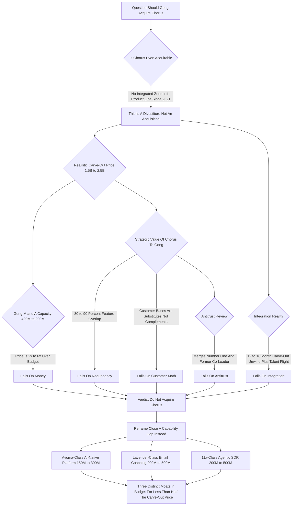

### Direct Answer

**No -- Gong should not acquire Chorus to "consolidate conversation intelligence," and the question itself is half a category error that has to be unbundled before it can be answered honestly.** Chorus is not an acquirable company: it has been a wholly owned, deeply integrated product line inside ZoomInfo (NASDAQ: ZI) since July 2021, so buying it is a contentious, billion-dollar *divestiture* negotiation, not a startup acquisition. And even if it could be bought at a fair price, the deal still fails -- Gong is already the conversation-intelligence category leader, so the purchase buys mostly duplicate technology and an overlapping customer base while inviting an 18-month antitrust review. The disciplined move is to spend a realistic ~$400M-$900M M&A budget on AI-native architecture, agentic workflows, and adjacent surfaces instead.

**TL;DR:** Chorus.ai was bought by ZoomInfo (NASDAQ: ZI) for ~$575M in 2021 and dissolved into its revenue platform; "acquiring" it now means prying an integrated product line out of a public company, realistically a **$1.5B-$2.5B** carve-out. Gong, at a ~$7.25B 2021 private valuation, has a realistic M&A budget of only **$400M-$900M** -- 2x-6x under that price. Even at a fair price the deal fails on **80-90% feature overlap**, a substitute (not complementary) customer base, a 12-18 month integration unwind, and antitrust risk from merging the category's number one and former co-leader. The productive reframe: Gong *should* do M&A -- buying an Avoma-class AI-native platform (~$150M-$300M), a Lavender-class email-coaching tool (~$200M-$500M), and an 11x-class agentic-SDR company (~$200M-$500M) -- three distinct moats for less than half the price of one duplicate. This entry covers the corporate-development case against the deal, the better targets, the comparable consolidation patterns, and the buyer's-side framework for choosing a conversation-intelligence platform in 2027.

## Section 1 -- The Question Is Half A Category Error

### 1.1 Three false assumptions hiding inside the question

Before answering "should Gong acquire Chorus," you have to notice that the question quietly assumes three things that are not true, and every one of them changes the answer.

- **False assumption one -- Chorus is an acquirable company.** It is not. Chorus.ai was acquired by ZoomInfo (NASDAQ: ZI) in July 2021 for approximately $575M in cash, and it has not existed as an independent company since. There is no Chorus cap table to buy, no Chorus board to negotiate with, no Chorus founders holding equity -- there is a ZoomInfo product line.
- **False assumption two -- Gong and Chorus are peer competitors of comparable size.** They are not peers. Gong is the runaway category leader; Chorus, post-acquisition, is a feature inside a data company's platform whose standalone momentum has eroded relative to Gong every year since 2021.
- **False assumption three -- the strategic problem Gong faces is conversation-intelligence market share.** It is not. Gong already has the share. Gong's actual 2027 problem is staying ahead of AI-native architecture and agentic workflows, and Chorus does nothing for that.

### 1.2 The honest version is three questions, not one

The honest version of this question is not one question, it is three: **is Chorus even buyable and at what cost** (a corporate-development feasibility question); **does buying it make strategic sense even if it were free** (a strategy question); and **what should Gong actually do with its M&A budget instead** (the question that matters). The rest of this entry answers all three -- but the headline answer is no, Gong should not acquire Chorus, and the reasons are structural, not close calls.

### 1.3 Why "consolidation" is doing unexamined work

The word *consolidation* in the original question sounds strategic and tidy -- like cleaning up a fragmented market -- but consolidation only creates value under specific conditions. **It works when a market is genuinely fragmented** among many sub-scale players; conversation intelligence is not fragmented that way -- it has a clear leader and the rest has largely been absorbed into platforms. **It works when the combined entity can cut duplicated cost**; here the "savings" would be deprecating one of two near-identical products and absorbing migration churn, which is cost *creation*. **It works when it removes destructive price competition**; Chorus is not driving destructive price competition against Gong. The correct mental model is not "consolidate the category" -- it is "extend the leader's capability frontier."

### 1.4 The cost of answering the wrong question

The reason this distinction matters beyond pedantry is that a corporate-development team that answers the *literal* question -- "can we make a Chorus deal pencil out?" -- will burn months building a model that was never going to clear a board. They will commission a valuation, run a financing scenario, draft an antitrust memo, and sound out bankers, all in service of a transaction that fails on its first premise. The discipline of *interrogating the question before modeling the answer* is the single highest-leverage move in corporate development. A good corp-dev function does not ask "how do we buy this?" -- it asks "is this the right thing to buy, and is it even buyable, and what does the question reveal about a gap we should close another way?" Answered that way, "should Gong acquire Chorus" stops being a deal question and becomes a *strategy* question, and the strategy answer is clear: Gong has a frontier to extend, not a competitor to absorb. Every section below is, in effect, the worked proof that the reframed question is the productive one. The reader who takes only one thing from this entry should take this: when an M&A question arrives pre-loaded with assumptions, the assumptions are the analysis.

## Section 2 -- What Conversation Intelligence Is And Why Consolidation Talk Never Stops

### 2.1 The category, defined

Conversation intelligence is the category of software that records sales and customer calls and meetings, transcribes them, and uses AI to extract structured insight -- deal risk, competitor mentions, next steps, talk-track adherence, coaching opportunities, pipeline health -- and pushes that insight into the CRM and the rep's and manager's workflow. Gong and Chorus.ai were the two companies that defined the category in the late 2010s.

### 2.2 Three structural pressures that keep consolidation talk alive

The "should X consolidate Y" talk never stops in this space because the category sits on top of three structural pressures.

| Pressure | What it does | Why it triggers consolidation talk |
|---|---|---|
| **Technology commoditized** | Transcription, diarization, summarization went from moats to API calls | A feature that is no longer a moat is one you buy or bundle, not build a company around |
| **Buyers want suites** | Revenue leaders are tired of stitching dialer + sequencer + CI + forecasting + coaching | Every adjacent vendor has an incentive to absorb CI into a broader platform |
| **AI-native wave reset the board** | A class of companies built AI-first from day one | Makes 2018-era architecture look heavy, inviting "should the incumbent buy the disruptor" |

### 2.3 The pattern already completed

ZoomInfo (NASDAQ: ZI) buying Chorus in 2021 was pressure two in action -- a data company absorbing a workflow tool to become a platform. The "should Gong buy Chorus" question is people pattern-matching on that deal **without noticing that the pattern already completed**. The conversation-intelligence layer Chorus represents is no longer a free-standing asset; it is plumbing inside someone else's house.

### 2.4 Who else has already bundled conversation intelligence

The reason the standalone-conversation-intelligence-company is an increasingly rare object is that nearly every adjacent platform has already absorbed the capability. Salesforce (NYSE: CRM) embeds call intelligence and summarization into its Einstein and Agentforce layers. Microsoft (NASDAQ: MSFT) ships conversation intelligence inside Copilot for Sales, wired into Dynamics 365. HubSpot (NYSE: HUBS) bundles call recording and AI summaries into Sales Hub via its Breeze AI layer. The sales-engagement suites built or bought their own versions -- Outreach has Kaia, Salesloft absorbed conversation capability through the Drift acquisition. The pattern is unmistakable: conversation intelligence has become a *feature of larger platforms*, sold as part of a suite, and the only two companies that ever ran it as a true standalone strategic product were Gong and Chorus. Chorus chose -- or, more precisely, ZoomInfo chose for it -- the bundle path in 2021. Gong is now the *last* major pure-play. That is the strategic context that makes "buy Chorus" so obviously wrong: Gong's differentiation *is* being the best-of-breed standalone, and there is nothing about owning a bundled-into-ZoomInfo product line that strengthens that position. If anything, the right competitive read is that Gong should be widening the gap between "the deepest dedicated platform" and "the conversation feature inside your data tool," not paying billions to own a copy of the feature.

| Platform | Public ticker | Conversation-intelligence approach |
|---|---|---|
| Salesforce | NYSE: CRM | Built-in via Einstein Conversation Insights and Agentforce |
| Microsoft | NASDAQ: MSFT | Conversation intelligence inside Copilot for Sales / Dynamics 365 |
| HubSpot | NYSE: HUBS | Call recording and AI summaries in Sales Hub via Breeze AI |
| ZoomInfo | NASDAQ: ZI | Acquired Chorus (2021); bundled into SalesOS / Copilot |
| Gong | Private | Standalone best-of-breed -- the last major pure-play |

## Section 3 -- The Feasibility Wall: You Cannot Buy What Is Not For Sale

### 3.1 An acquisition versus a divestiture

The first reason the deal does not happen is the most basic one: Chorus is not for sale, and making it for sale is a different and much harder transaction than the question implies. When a product line is wholly owned by a public company and woven into that company's platform, acquiring it is a *divestiture* -- you are asking ZoomInfo's board and management to carve a working, revenue-generating, integrated piece of their product out and hand it to a competitor. Divestitures of integrated product lines are rare, slow, and expensive for structural reasons.

### 3.2 The three conditions a Chorus carve-out would have to meet

- **The seller has to be motivated.** Usually by activist pressure, a strategic refocus, or a distressed balance sheet. ZoomInfo (NASDAQ: ZI), while it has had its own stock-price and growth challenges, has shown no signal of wanting to unwind the Chorus integration; if anything it has leaned in, building conversation data into its Copilot and platform story.
- **The seller has to price in the unwind.** Separating Chorus's codebase, data pipelines, and integrations from ZoomInfo Engage, SalesOS, and Copilot is 12-18 months of engineering work that someone has to pay for, and the seller will not absorb that cost.
- **The seller will demand a control and strategic premium** for handing a capability to a competitor.

### 3.3 Why this gets you to $1.5B-$2.5B

Add it up and the realistic transaction is not "Gong pays a fair multiple for Chorus's standalone ARR" -- it is "Gong pays the original price, plus an integration-unwind premium, plus a revenue-at-risk discount working *against* it, plus a strategic premium, to a reluctant seller." That is how you get to a $1.5B-$2.5B number for an asset that changed hands at $575M, and it is why the deal dies on feasibility before strategy even gets a vote.

### 3.4 What a motivated-seller scenario would actually require

It is worth being precise about the one path where a Chorus carve-out becomes *thinkable*, because steelmanning the feasibility case shows how narrow it is. ZoomInfo (NASDAQ: ZI) would have to become a genuinely motivated seller, which in practice means one of three triggers fires. **Activist pressure:** an activist investor takes a position and demands ZoomInfo refocus on its core data business, explicitly pushing it to divest non-core product lines. **A strategic pivot:** ZoomInfo's own leadership decides conversation intelligence is not where it wants to invest and chooses to concentrate capital on data, intent, and agentic copilots. **Balance-sheet distress:** a sharp deterioration in ZoomInfo's growth or debt position forces asset sales to raise cash. Even if one of these triggers fires, two things remain true. First, ZoomInfo would still run a *competitive process* -- it would not hand Chorus to Gong on a quiet bilateral basis; it would invite private-equity platforms and other strategics, which keeps the price high. Second, and more important, a motivated seller fixes only the *feasibility and price* objection. It does nothing for the redundancy, the customer-base substitution, the integration-unwind cost, or the antitrust review. So even the most generous feasibility scenario lands you back at a deal that fails on strategy -- which is exactly why feasibility is the *first* wall, not the only one.

## Section 4 -- The Money: Gong's Capacity Versus The Carve-Out Price

### 4.1 Gong's realistic M&A capacity

Gong is a private company; it raised a Series E in 2021 at a roughly $7.25B valuation, has been broadly understood to be operating with strong efficiency and a path to or past profitability, and has a substantial but not infinite balance sheet. A private SaaS company at that scale typically has M&A *capacity* -- counting cash on hand, what it could raise, and what it could finance -- on the order of several hundred million dollars for an acquisition it really wants, not multiple billions. Call Gong's realistic, board-supportable M&A budget **$400M-$900M**.

### 4.2 The mismatch, in one table

| Financial dimension | Chorus carve-out reality | Gong's actual capacity |
|---|---|---|
| Original Chorus price (ZoomInfo, 2021) | ~$575M cash | -- |
| Realistic carve-out / divestiture price (2027) | ~$1.5B-$2.5B | -- |
| Integration-unwind cost (someone pays) | 12-18 months of engineering | -- |
| Gong last known valuation (Series E, 2021) | -- | ~$7.25B |
| Gong realistic M&A budget | -- | ~$400M-$900M |
| Carve-out price as multiple of budget | 2x-6x over budget | -- |
| Financing required | New mega-round and/or significant debt | Not board-supportable |

### 4.3 Why the financing path is wrong

To do the deal, Gong would have to raise a massive new round in a market that is not generous to 2018-era growth companies doing defensive consolidation, take on significant debt, or both -- and it would be spending all of it, plus more, on a single transaction that buys mostly duplicate technology. That is not a capital allocation a disciplined board approves. The reference pattern is instructive: Vista Equity Partners took Salesloft private, and the broader pattern of conversation-intelligence-adjacent consolidation has run through *private-equity* balance sheets precisely because the price tags are large. A growth-stage operating company does not have PE-scale firepower. (See **(q152)** for which sales-tech vendors actually get acquired and by whom.)

## Section 5 -- Reason One Against The Deal: Duplicate Technology

### 5.1 Gong already is the leader

Strip away feasibility and assume Chorus could be bought at a fair price -- the deal still fails on strategy, and the first reason is redundancy. Gong already *is* the conversation-intelligence leader, with an estimated 4,000-5,000+ customers and roughly $300M-$500M+ ARR. Its product does what Chorus's product does: multi-channel call and meeting capture, transcription, AI summaries and topic tracking, deal and pipeline intelligence, competitive intelligence, coaching and scorecards, CRM write-back.

### 5.2 The overlap math

The feature overlap between the two products is on the order of **80-90%**. M&A creates value when the target brings something the acquirer does not have -- a new capability, a new customer segment, a new geography, a new technology architecture, a new distribution channel. Chorus brings Gong essentially none of those. It brings *more of the same thing Gong is already best at*.

| What value-creating M&A brings | Does Chorus bring it to Gong? |
|---|---|
| New capability | No -- 80-90% feature overlap |
| New customer segment | No -- same mid-market focus |
| New geography | No -- overlapping footprint |
| New technology architecture | No -- same 2018-era generation |
| New distribution channel | No -- Gong's GTM is already stronger |

### 5.3 "Neutral, for $1.5B-$2.5B" is a failing grade

The engineering integration would be a months-long exercise in deciding which of two near-identical pipelines to keep and which to deprecate, migrating customers off the loser, and absorbing the churn that migration causes. The kindest thing you can say about the technology case is that it is neutral -- Gong would not get *worse* -- and "neutral, for $1.5B-$2.5B" is a failing grade for a capital allocation.

### 5.4 The one place a duplicate could help -- and why it still does not

The most sophisticated version of the redundancy counter-argument is not "you get new features" but "you get more *training data*." Conversation intelligence is, increasingly, an AI product, and AI products improve with data scale; Chorus has years of accumulated call and meeting data that, in principle, could make Gong's models marginally better. This is the strongest pro-deal technical argument, and it still fails for three reasons. **First, Gong already has the larger dataset.** It is the category leader by customer count and call volume; the marginal information added by an overlapping, smaller corpus is low, and AI model quality has diminishing returns to data once you are already at scale. **Second, you do not need to own the company to have a leading dataset.** Gong's organic scale already delivers data leadership; paying $1.5B-$2.5B to acquire incremental data you mostly already have is not moat-building, it is the most expensive imaginable way to buy a rounding error. **Third, data portability is legally and contractually fraught.** Customer call data is governed by privacy regulation and customer contracts; you cannot simply pour Chorus's customer recordings into Gong's training pipeline post-acquisition. The "more data" argument is the last refuge of the pro-Chorus case, and even it does not survive contact with how AI models, data ownership, and diminishing returns actually work.

## Section 6 -- How A Disciplined Acquirer Would Actually Price This

### 6.1 The fictional floor

It is worth walking the valuation the way a corporate-development team would. Start with the floor: whatever Chorus's standalone ARR is today inside ZoomInfo (NASDAQ: ZI) -- estimated conservatively, given years of being sold as a platform feature rather than pushed standalone -- a fair *going-rate* SaaS multiple on that ARR gets you to a number plausibly *below* the original $575M, because the standalone momentum has decayed. But that floor is fiction, because Chorus cannot be sold standalone without first being *made* standalone.

### 6.2 The build-up that produces $1.5B-$2.5B

| Valuation layer | Direction | Effect |
|---|---|---|
| Standalone ARR multiple | Floor | Plausibly below $575M -- momentum decayed |
| Integration-unwind cost + TSA | Adds | Eight-figure-plus, buyer-funded |
| Revenue-at-risk on platform-attached ARR | Works against buyer | Paying for ARR that partially evaporates |
| Control + strategic premium to a reluctant seller | Adds | Potentially 50-100%+, not 20-30% |
| **Net result** | -- | **~$1.5B-$2.5B for an asset worth less standalone than in 2021** |

### 6.3 The defining absurdity

Stack the original price, the unwind cost, the strategic premium, against a partially-evaporating revenue base, and you land at $1.5B-$2.5B for an asset that is *worth less on a standalone basis than it was in 2021*. That is the defining absurdity: the price goes *up* threefold while the underlying value goes *down*. A disciplined acquirer does not need to finish this model -- the moment the price exceeds the standalone value by this much, the analysis is over. (For the general diligence discipline, see **(q804)**.)

## Section 7 -- Reason Two Against The Deal: The Customer Math Is Brutal

### 7.1 The bull case and why it collapses

The bull case for buying Chorus is "you acquire its customer base." Run the numbers and that case collapses. Gong's customer base is the larger one -- on the order of 4,000-5,000+ companies, heavily weighted to mid-market and enterprise revenue teams. Chorus, post-ZoomInfo, has a customer base that is both smaller and substantially *overlapping* with Gong's: the two products competed head-to-head for years in the same mid-market segment.

### 7.2 What netting out the overlap leaves

When you net out the overlap -- customers Gong already has, plus customers who would churn during a forced platform migration, plus customers who are Chorus users only because they are ZoomInfo platform customers and would not follow Chorus to Gong -- the genuinely *net-new, sticky* logos Gong would gain are a small fraction of Chorus's headline count.

| Customer-base dimension | Gong (acquirer) | Chorus (target, post-ZoomInfo) |
|---|---|---|
| Approx. customer count | ~4,000-5,000+ | Smaller; eroded since 2021 |
| Primary segment | Mid-market and enterprise revenue teams | Mid-market, increasingly ZoomInfo-platform-attached |
| Overlap with the other base | High in shared mid-market | High |
| Net-new sticky logos from a deal | -- | Small fraction of headline count |
| Implied CAC per net-new logo at $1.5B-$2.5B | -- | High six to low seven figures |
| Organic CAC comparison | Dramatically lower | -- |

### 7.3 Substitutes, not complements

Divide a $1.5B-$2.5B price by that small number of net-new customers and the effective customer acquisition cost is in the high six figures to low seven figures *per logo*. Gong's organic CAC is a tiny fraction of that. M&A justified by "we get their customers" only works when the customer bases are *complementary*; here they are *substitutes*.

### 7.4 The forced-migration tax

There is a cost inside the customer math that headline models routinely omit: the *forced-migration tax*. After a Chorus acquisition, Gong would not run two near-identical products in parallel forever -- the entire economic rationale of consolidation is to converge on one. That means telling Chorus customers, at some point, that their product is being deprecated and they must migrate to Gong's platform. Forced migrations are reliably destructive. A meaningful slice of customers use the moment of forced change to *re-evaluate the whole category* rather than passively accept the migration -- and re-evaluation means competitive bake-offs against AI-native challengers and bundled suites that the customer would not otherwise have run. Some migrate; some churn; some downgrade. The migration also consumes Gong's customer-success and onboarding capacity, which is finite and would otherwise be spent on expansion within Gong's existing base. So the customer math is worse than "small net-new logo count at a high CAC." It is "small net-new logo count, at a high CAC, *minus* a migration tax, *minus* the opportunity cost of the CS capacity the migration consumes." Every honest version of the customer model makes the deal look worse, not better.

## Section 8 -- Reason Three Against The Deal: Integration And ZoomInfo Entanglement

### 8.1 A carve-out multiplies integration risk

Even a clean acquisition of an independent company carries integration risk; acquiring a *carve-out* multiplies it. Chorus is not a tidy box you can lift out of ZoomInfo. Its call and meeting data feeds ZoomInfo's broader intelligence layer; it is wired into ZoomInfo Engage's sequencing and into the Copilot/platform experience; its data model and infrastructure share plumbing with the parent. Separating it is a 12-18 month engineering project *just to get a standalone product*, before Gong does any of the work of merging it into Gong's own stack.

### 8.2 Three bad things happen during the limbo

- **Talent flight.** Key Chorus engineers -- the people who actually know the system -- are exactly the people most likely to leave during a contentious carve-out and re-acquisition, taking institutional knowledge with them.
- **Customer churn.** Chorus customers, sensing disruption, evaluate alternatives, and a real share churn during the limbo.
- **Roadmap diversion.** The combined engineering org spends a year-plus on integration plumbing instead of on the AI-native and agentic roadmap that is the actual competitive battleground.

### 8.3 The value destroyed is post-close

The cautionary reference here is every messy big-software carve-out and re-integration -- the value destroyed is rarely in the purchase price, it is in the eighteen months of distraction, attrition, and customer uncertainty that the org pays *after* the deal closes. Gong would be trading its most precious 2027 resource -- focused engineering attention on the AI transition -- for a duplicate product.

## Section 9 -- Reason Four Against The Deal: Antitrust In A Hostile Climate

### 9.1 Merging number one and the former co-leader

Suppose Gong somehow finances the deal, accepts the redundancy, and is willing to eat the integration pain. It still has to get the deal *cleared*. A Gong-plus-Chorus combination would hold a dominant share of the enterprise conversation-intelligence segment -- the two companies that *defined* the category, merged. In the regulatory climate of 2026-2027, that is not a rubber-stamp filing.

### 9.2 The regulatory gauntlet

The US FTC and DOJ, and the European Commission, have spent the mid-2020s explicitly hostile to incumbent-on-incumbent consolidation in software and AI, and have shown willingness to challenge or extract heavy concessions from deals that concentrate share in a defined category -- particularly where the merging parties are the number one and a former number one.

| Antitrust dimension | Reality for a Gong-Chorus deal |
|---|---|
| Combined position | Category number one + former co-leader |
| Likely review path | FTC second request or EC Phase 2 |
| Realistic duration | ~12-18 months in regulatory limbo |
| Value during limbo | Bleeds -- churn, talent flight, product stagnation |
| Probability-weighted outcome | Real chance of block or rationale-gutting conditions |

### 9.3 Disqualifying on its own

A serious second request or an EC Phase 2 review would put the deal in limbo for 12-18 months, during which Chorus's value bleeds and Gong's management is consumed by the process. And the deal could still be *blocked*, or cleared only with divestiture conditions that gut the rationale. For a deal whose strategic upside is already weak, adding a 12-18 month regulatory gauntlet with a real chance of failure is disqualifying on its own.

## Section 10 -- Reason Five Against The Deal: Opportunity Cost

### 10.1 Capital and attention are finite

The fifth reason is the one corporate-development teams weigh most heavily: opportunity cost. Capital and management attention are finite. Every dollar and every quarter of executive focus spent prying Chorus out of ZoomInfo is a dollar and a quarter *not* spent on the things that would actually extend Gong's lead.

### 10.2 Gong's real 2027 threats are not Chorus

Gong's real 2027 competitive threats are not Chorus -- they are AI-native conversation platforms with lighter, more modern architectures; agentic tools that do not just *analyze* the sales call but *take actions* off it; and adjacent surfaces (email coaching, autonomous outreach, multi-channel revenue workflows) where Gong is not yet the leader. A focused $400M-$900M deployed against *those* threats buys Gong durable, differentiated capability.

### 10.3 The single best argument against the deal

The same money -- plus a billion more -- deployed against Chorus buys Gong a duplicate of its own product and an eighteen-month integration headache. Opportunity cost is not an abstraction here; it is the difference between Gong using this M&A cycle to *get ahead of the AI transition* and Gong using it to *re-fight a war it already won*. The single best argument against the Chorus deal is simply: look at what else that money could do. (See **(q1357)** for the broader view of Gong's actual 2026 strategic priorities.)

### 10.4 The five-failure summary

It is worth pausing to see the five reasons stacked together, because each one is independently disqualifying -- the deal does not need to fail on all five; it fails on any one of them.

| Failure mode | The disqualifying fact |
|---|---|
| Money | $1.5B-$2.5B carve-out is 2x-6x Gong's $400M-$900M capacity |
| Redundancy | 80-90% feature overlap -- you buy a duplicate, not a capability |
| Customer math | Substitute customer bases; high six- to low seven-figure CAC per net-new logo |
| Integration | 12-18 month carve-out unwind, talent flight, roadmap diversion |
| Antitrust | Merging number one and former co-leader invites a 12-18 month hostile review |

Notice that even the *most* generous resolution of any single row leaves the other four standing. Fix the money with a mega-round, and redundancy, customer math, integration, and antitrust still kill it. Fix the antitrust with concessions, and you have gutted the rationale while the money problem remains. There is no ordering of fixes that produces a good deal -- which is the structural signature of a transaction that should be declined, not negotiated.

## Section 11 -- What Gong Should Actually Buy: The Real M&A Thesis

### 11.1 The gap is real -- it is just not market share

The productive version of "should Gong do M&A" is yes -- and here is the thesis. Gong has a genuine, well-defined gap, and it is not market share in conversation intelligence. It is threefold.

- **AI-native architecture.** Gong's core was built in the 2018 era, and while it has bolted on modern AI, a from-scratch AI-native platform is structurally lighter and faster to evolve.
- **Agentic workflows.** The frontier is shifting from "software that surfaces insight to a human" to "software that takes the action," and Gong's roadmap there benefits from acquired talent and product.
- **Adjacent revenue surfaces.** Email coaching, autonomous outbound, and multi-channel orchestration are places where Gong's data would be powerful but Gong does not yet have the product.

### 11.2 A portfolio, not one giant deal

The M&A thesis is to deploy a disciplined $400M-$900M across one to three *AI-native or agentic, capability-additive* targets -- not one giant defensive consolidation. This is "buy what you cannot easily build, in the direction the market is moving," which is the only M&A logic that reliably creates value.

| M&A option | Realistic price | What Gong actually gets | Integration risk | Antitrust risk |
|---|---|---|---|---|
| Chorus carve-out (the bad deal) | ~$1.5B-$2.5B | Duplicate technology, overlapping customers | Severe (12-18mo carve-out unwind) | High (concentrates the category) |
| Avoma-class AI-native platform | ~$150M-$300M | Modern AI-native architecture and team | Low (clean independent acquisition) | Benign |
| Lavender-class email coaching | ~$200M-$500M | Adjacent surface; voice-plus-text moat | Moderate | Benign |
| 11x-class agentic SDR | ~$200M-$500M | Forward position in the agentic shift | Moderate-high (category still proving) | Benign |
| Portfolio of all three challengers | ~$550M-$1.3B | Three distinct moats, in budget | Manageable, staged | Benign |

### 11.3 Target one: an Avoma-class AI-native conversation platform

The first and most natural target archetype is an **AI-native conversation-intelligence platform** -- the category best represented by a company like Avoma. The strategic logic is the inverse of the Chorus logic. Avoma-class companies were built AI-first: their architecture, data model, and product assume modern AI from the ground up rather than retrofitting it onto a 2018 core. They are smaller -- estimated $30M-$70M ARR, growing fast -- and a realistic acquisition price is on the order of $150M-$300M, comfortably *inside* Gong's budget. What Gong gets is not duplicate technology; it gets a *modern architecture and the team that built it*, closing the AI-native gap that Chorus does nothing for. The integration is genuinely easier: an independent company with a clean cap table is a normal acquisition, not a contentious carve-out, so there is no divestiture-unwind, no ZoomInfo entanglement, and far less talent-flight risk. The antitrust profile is benign. For roughly *one-tenth* the cost of the Chorus carve-out, Gong closes a real capability gap. (Gong evaluating exactly this target is the subject of **(q1910)**.)

### 11.4 Target two: a Lavender-class AI email-coaching tool

The second archetype moves Gong into an *adjacent* surface: AI-powered email and written-communication coaching, the category defined by a company like Lavender. The strategic logic is *expansion*, not consolidation. Gong's moat is the proprietary dataset of what works in sales *conversations*; an email-coaching tool extends that exact same value proposition -- "here is how to communicate better, backed by data" -- into the written channel. A Lavender-class acquisition, realistically $200M-$500M, gives Gong a differentiated, adjacent product that competitors' suites do not have, and it does so by *adding* a moat rather than buying a duplicate one. It also differentiates Gong against bundled-platform players by giving it a coaching surface that spans voice *and* text. (The same target archetype, evaluated for a different acquirer, appears in **(q1922)**.)

### 11.5 Target three: an 11x-class agentic-SDR company

The third archetype is the most forward-leaning: an **agentic AI sales-development company**, represented by a company like 11x. The strategic logic is *getting ahead of the platform shift*. The clear direction of revenue software in 2027 is from *insight* to *action* -- from software that tells a human what to do, to software that does it. Acquiring one -- realistically $200M-$500M -- gives Gong a forward position in the agentic layer, where it can fuse its conversation dataset with autonomous execution. This is the highest-risk, highest-ceiling of the three: agentic SDR is a fast-moving, hype-exposed category, and Gong would be buying a bet, not a settled business. But the *direction* is right, and a measured position there -- one bet inside a three-target portfolio -- is exactly the kind of risk a category leader should take. (Whether agentic-SDR companies are themselves consolidators is explored in **(q1878)**.)

## Section 12 -- The Talent And Culture Problem Nobody Models

### 12.1 A carve-out is a worst-case talent scenario

The spreadsheet version of an acquisition models ARR, multiples, and synergies; it almost never models the thing that actually determines whether a deal works, which is people. A Chorus carve-out is a worst-case talent scenario. The engineers who matter -- the ones who hold the institutional knowledge of how Chorus's systems are wired into ZoomInfo (NASDAQ: ZI) -- are precisely the people who have already lived through one acquisition (the 2021 deal), watched their product get absorbed and rebranded, and would now be told they are being carved out and sold *again* to a competitor. The highest performers, with the most options, leave first.

### 12.2 Culture compounds the problem

On top of attrition, there is culture: Gong has its own engineering culture, its own product philosophy, its own way of building; bolting on a team that has been through two acquisitions and a carve-out is not a clean merge, it is a years-long integration of mismatched norms.

### 12.3 The honeymoon-versus-divorce contrast

| Talent dimension | Chorus carve-out | Avoma-class independent acquisition |
|---|---|---|
| Team mindset entering the deal | Second acquisition; demoralized, depleted | Founder-led; energized, choosing to join |
| Equity motivation | Largely washed out | Meaningful upside, retention-aligned |
| Institutional knowledge retention | Low -- best engineers leave first | High -- core team comes along |
| Cultural merge difficulty | Severe -- two-acquisitions-and-a-carve-out norms | Moderate -- normal post-acquisition integration |

One deal buys a demoralized, depleted team mid-divorce; the other buys an energized team mid-honeymoon. The talent delta alone should settle the question, and it is the variable the headline price most completely ignores.

## Section 13 -- Comparable Patterns: Learning From The Actual Deals

### 13.1 ZoomInfo's own Chorus acquisition

The most instructive comparable is the deal that created this situation: ZoomInfo's 2021 acquisition of Chorus for ~$575M. It made sense *for ZoomInfo* because it was *capability-additive and category-expanding* -- ZoomInfo was a data company with no conversation layer, and Chorus gave it one, with minimal overlap. That is the value-creating pattern: buy what you do not have. The Gong-buys-Chorus version inverts every condition: Gong *already has* the conversation layer, the overlap is near-total, there is no new capability. The deal also shows the *integration reality* -- ZoomInfo spent years absorbing Chorus, rebranding it, and wiring it into Engage and Copilot, which is precisely *why* it is now so hard to extract.

### 13.2 Salesloft, Drift, and the private-equity pattern

The second comparable cluster is the sales-engagement consolidation wave -- Salesloft's acquisition of Drift, and the private-equity-led roll-ups (Vista Equity Partners taking Salesloft private). Two lessons. First, **the large conversation-and-engagement deals have run on private-equity money**, because the price tags are PE-scale, not growth-operating-company-scale. If a Chorus carve-out ever happened, the natural buyer would be a PE platform assembling a revenue-tech suite, not Gong. Second, **engagement-suite consolidation has been about assembling complementary pieces** -- a sequencer plus a conversation layer plus a chat/intent layer. That is *complementary* consolidation. Gong buying Chorus is *substitute* consolidation.

### 13.3 Big-software carve-outs and capability-additive M&A

The third comparable is the cautionary-tale category: large software carve-outs where integrated products are pulled apart and re-housed. The pattern is consistent -- the purchase price is the *smallest* cost; the real costs land afterward in separation plumbing, attrition, churn, cultural friction, and leadership distraction. The contrast is capability-additive M&A done right -- the kind of deal explored in **(q1536)** (a platform buying a genuinely different platform) and **(q1607)** (a data company buying an adjacent transformation layer). Those deals buy *what the acquirer does not have*; a Chorus carve-out buys what Gong already is. The general "when does consolidation save money versus create blind spots" question is itself the subject of **(q403)**.

For Gong, every one of the carve-out cost categories would land at the worst possible moment -- the middle of an industry-wide AI transition where focus is the scarce resource. The cautionary comparable is the answer to anyone who says "but the strategic logic could work if the price were right": the price is never the thing that kills these deals. The eighteen months *after* the price is the thing that kills these deals, and a Chorus carve-out is a textbook setup for exactly that failure mode. (The post-close failure mode is itself the subject of a dedicated practitioner discussion in the corporate-development literature, and the lesson is always the same -- model the integration, not the headline multiple.)

### 13.4 The reverse-deal test

A clean way to sanity-check any "should A buy B" question is the *reverse-deal test*: ask whether the same deal made sense in the other direction, and if so, what was different. ZoomInfo (NASDAQ: ZI) buying Chorus in 2021 passed every test of value-creating M&A -- it bought a capability it did not have, in a part of the workflow it did not occupy, with almost no product overlap, at a price its balance sheet could absorb, with a benign antitrust profile. Reverse the arrow and *every* one of those conditions flips: Gong already has the capability, occupies the workflow, has near-total overlap, cannot absorb the price, and faces a hostile antitrust review. The reverse-deal test is not a gimmick; it is a fast diagnostic for whether a deal is *capability-additive* (good) or *substitutive* (bad). A deal that made sense forward and fails completely in reverse is a deal whose value came entirely from the *direction* of the capability transfer -- and you cannot buy a capability you already own. That single observation is the most compact possible statement of why Gong should not acquire Chorus.

| Comparable | Logic | Verdict for the Gong-Chorus question |
|---|---|---|
| ZoomInfo / Chorus (2021) | Capability-additive, category-expanding | Argues *against* -- shows what good M&A is, and shows the wall |
| Salesloft / Drift; Vista roll-ups | Complementary pieces on PE balance sheets | Argues *against* -- substitute, not complement; wrong buyer profile |
| Big-software carve-outs | Value destroyed post-close, not in price | Argues *against* -- textbook setup for the failure mode |

## Section 14 -- The Operator's Question: Gong Or Chorus As A Buyer

### 14.1 The "vs" framing is miscast

Underneath the corporate-development puzzle is the question most readers actually have: *I run a revenue team -- should I buy Gong or Chorus?* Here the "vs" framing is also slightly miscast, because by 2027 you are not choosing between two peer products -- you are choosing between **Gong, the standalone best-of-breed conversation-intelligence leader**, and **Chorus, a conversation-intelligence capability bundled inside the ZoomInfo (NASDAQ: ZI) platform.** Those are different purchases.

### 14.2 When best-of-breed (Gong) wins

Choose Gong -- the standalone leader -- when several of these are true.

- **Conversation intelligence is strategic, not incidental:** your coaching, deal inspection, and forecasting genuinely run on call and meeting data.
- **You have a complex, multi-tool best-of-breed stack already** and you want the best conversation layer in that assembly.
- **Coaching and enablement maturity is high:** managers will actually use scorecards, talk-track analysis, and deal-risk signals.
- **You sell complex, multi-threaded deals** where the richness of deal and pipeline intelligence pays for itself.
- **You can fund and staff a primary platform** -- Gong is a serious budget line and a serious implementation. (Whether that spend pays for itself is the subject of **(q401)**.)

### 14.3 When the bundled platform (Chorus/ZoomInfo) wins

Choose the bundled path -- Chorus inside ZoomInfo -- when the opposite conditions hold.

- **You are consolidating vendors:** fewer tools, fewer contracts, fewer integrations.
- **You are already a ZoomInfo customer:** turning on conversation intelligence is an expansion, not a new vendor evaluation.
- **Conversation intelligence is "important but not the centerpiece":** solid call capture, transcription, AI summaries, and basic deal intelligence clear your bar.
- **Your RevOps capacity is constrained:** one-throat-to-choke has real operational value.
- **Budget discipline favors the bundle:** incremental conversation intelligence inside a platform you already pay for can pencil out better than a standalone six-figure Gong contract.

## Section 15 -- The Real Decision Criteria And The 2027-2030 Outlook

### 15.1 It is an operating-model decision, not a feature comparison

The mistake buyers make is treating this as a *feature comparison* when it is really an *operating-model decision*. The features, by 2027, are 80-90% the same; picking on the 10-20% delta optimizes the wrong variable. The real criteria:

| # | Decision criterion | What it determines |
|---|---|---|
| 1 | Is conversation intelligence a strategic system or a useful feature for us? | Drives most of the answer |
| 2 | Are we a best-of-breed shop or a consolidation shop? | Procurement philosophy, not a demo |
| 3 | What is our existing platform gravity? | If deep in ZoomInfo, the bundle's pull is real |
| 4 | What is our RevOps capacity to own a primary platform? | Will you exploit best-of-breed depth or just pay for it? |
| 5 | What is total cost including integration and adoption? | The bundle's hidden value vs the standalone's hidden cost |

Decide those five and the Gong-or-Chorus question answers itself -- and notably, *neither* answer depends on the M&A question at all.

### 15.2 Where conversation intelligence is heading

A corporate-development team or a buyer making a multi-year decision needs a view of the trajectory, because the right deal depends on where the category is going, not just where it is.

- **The standalone-versus-suite tension persists and probably sharpens** -- the bundled platforms (ZoomInfo, the engagement suites, Salesforce (NYSE: CRM), HubSpot (NYSE: HUBS), Microsoft (NASDAQ: MSFT)) keep absorbing conversation intelligence as a feature, while the best-of-breed leader keeps out-innovating on depth. Both models survive, serving different buyers.
- **The technology layer keeps commoditizing** -- transcription, summarization, and basic insight extraction are now table stakes, so defensible value moves up into proprietary data, workflow, coaching efficacy, and *action*.
- **Agentic workflows are the real frontier** -- the shift from "analyze the call" to "do the work off the call" (autonomous follow-up, CRM hygiene, outbound, research) is where the next moat is built, which is exactly why Gong's M&A budget should point there. (The competitive dynamics of conversation intelligence inside a sequencing suite are explored in **(q1744)**.)
- **AI-native challengers keep pressuring the 2018-era leaders on architecture** -- which keeps the "should the leader buy the challenger" question alive, but the right answer is to buy the *small AI-native challenger*, not the *old co-leader*.
- **Consolidation continues, but the value-creating version is complementary, not substitutive** -- suites assembling complementary pieces, leaders buying adjacent capability. The net outlook: conversation intelligence is a durable, healthy category being *absorbed and extended* rather than disrupted, and the strategic winners are the players who buy *into the direction it is heading* rather than the ones who spend their war chest re-securing the part of the category that is already settled.

### 15.3 The corporate-development verdict

Pull it all together. **Should Gong acquire Chorus to consolidate conversation intelligence? No.** It fails on feasibility -- Chorus is an integrated ZoomInfo product line, and prying it out is a contentious divestiture. It fails on money -- a $1.5B-$2.5B carve-out is 2x-6x Gong's $400M-$900M capacity. It fails on strategy -- 80-90% feature overlap and a substitute customer base. It fails on integration -- a 12-18 month unwind paid for with the engineering focus Gong needs for the AI transition. It fails on antitrust -- merging number one and the former co-leader invites a hostile 12-18 month review. And it fails worst on opportunity cost -- the same money, deployed against an Avoma-class target (~$150M-$300M), a Lavender-class target (~$200M-$500M), and an 11x-class target (~$200M-$500M), buys three distinct moats for less than half the price of one duplicate. The final framework: **(1)** frame M&A as "close a capability gap," never "consolidate a competitor"; **(2)** define the gap honestly; **(3)** size the budget realistically and refuse to balance-sheet-bet on one deal; **(4)** prefer a portfolio of small, capability-additive targets; **(5)** price integration and antitrust risk as deal-killers; **(6)** for the buyer underneath the question, decide on operating model, not a feature bake-off.

## Section 16 -- The Corporate-Development Decision Flow

## Section 17 -- Counter-Case: The Strongest Arguments For The Deal

A serious corporate-development analysis has to steelman the deal, not just dismiss it. Here are the best arguments *for* Gong acquiring Chorus, each followed by why it does not survive scrutiny.

### 17.1 Counter 1 -- "Eliminating a competitor has defensive value"

The argument: Chorus, even diminished, is a competitor; removing it raises Gong's pricing power and removes a fallback option for buyers. **The rebuttal:** Chorus's competitive pressure on Gong is *already modest and declining* -- it has been a bundled ZoomInfo feature, not an aggressive standalone challenger, for years. You do not pay a $1.5B-$2.5B premium to eliminate a competitor the market has already mostly eliminated for you, and the *real* pressure on Gong comes from AI-native challengers and bundled suites, neither of which buying Chorus touches.

### 17.2 Counter 2 -- "Buying the customer base beats organic growth"

The argument: M&A is a shortcut to logos. **The rebuttal:** only when the bases are complementary. Here they are substitutes -- high overlap, forced-migration churn, and ZoomInfo-attached customers who would not follow Chorus to Gong -- so the net-new sticky logo count is small and the effective CAC is in the high six to low seven figures per logo. Organic growth is not just cheaper here; it is *dramatically* cheaper.

### 17.3 Counter 3 -- "Owning Chorus's data deepens Gong's dataset moat"

The argument: more conversation data makes Gong's AI better. **The rebuttal:** Gong already has the largest conversation dataset in the category; the marginal value of Chorus's overlapping data is low, and you do not need to *own the company* to have a leading dataset. Paying billions for marginally more of a moat you already lead is not moat-building, it is over-paying.

### 17.4 Counter 4 -- "Consolidation is inevitable, so be the consolidator"

The argument: better to be the buyer than the target. **The rebuttal:** this conflates *being acquisitive* with *making this specific bad acquisition*. Gong absolutely should be a consolidator -- of AI-native, agentic, and adjacent challengers. Being the consolidator does not mean buying the one target with the worst overlap, the highest price, the worst antitrust profile, and the hardest integration. Passing on Chorus *is* the disciplined-consolidator move.

### 17.5 Counter 5 -- "A bold mega-deal signals category dominance"

The argument: the deal is a statement. **The rebuttal:** a deal that is 2x-6x over budget, buys duplicate technology, and risks an 18-month antitrust block does not signal dominance -- it signals a leader spending its war chest defensively instead of innovating. The market rewards leaders who buy *into the future*, not leaders who spend everything re-securing the past.

### 17.6 Counter 6 -- "At a low enough price the logic works"

The argument: every deal is good at the right price. **The rebuttal:** price is not the binding constraint. Even at a *fair* price, the deal fails on redundancy, customer-base substitution, integration distraction, and antitrust. A cheap duplicate is still a duplicate. The price problem makes the deal *impossible*; the strategy problems make it *unwise even if it were possible*.

### 17.7 Counter 7 -- "ZoomInfo might be a motivated seller"

The argument: a distressed ZoomInfo could divest Chorus cheaply. **The rebuttal:** even granting a motivated seller, this only fixes the *feasibility and price* objection -- it does nothing for redundancy, customer-base substitution, integration-unwind cost, or antitrust review. And the more likely buyer for a divested Chorus is a PE platform building a revenue-tech suite, not the category leader buying a duplicate.

### 17.8 The honest verdict

The case *for* the deal rests on defensive instincts -- eliminate a competitor, grab a customer base, make a statement, be the consolidator. Every one of those instincts is reasonable in the abstract and wrong in this specific case, because Chorus is the wrong target for all of them. Gong *should* do M&A in this cycle -- aggressively. It should buy an AI-native platform, an email-coaching tool, and an agentic-SDR company, for less than half the price of the Chorus carve-out, and get three real moats instead of one expensive mirror. The deal the question asks about is the one deal a disciplined corporate-development team would take off the table first.

## Section 18 -- Key Numbers At A Glance

### 18.1 The deal at the center of the question

| Metric | Value |
|---|---|
| Chorus.ai original acquisition price (ZoomInfo, July 2021) | ~$575M cash |
| Chorus status since 2021 | Wholly owned, integrated ZoomInfo product line |
| Realistic carve-out / divestiture price (2027) | ~$1.5B-$2.5B |
| Integration-unwind work to extract Chorus | ~12-18 months of engineering |
| Carve-out price as multiple of original price | ~3x-4x |

### 18.2 Gong's capacity, overlap, and the better targets

| Metric | Value |
|---|---|
| Gong last known valuation (Series E, 2021) | ~$7.25B |
| Gong estimated customer base | ~4,000-5,000+ companies |
| Gong estimated ARR | ~$300M-$500M+ |
| Gong realistic, board-supportable M&A budget | ~$400M-$900M |
| Carve-out price as multiple of Gong's M&A budget | ~2x-6x over budget |
| Gong / Chorus feature overlap | ~80-90% |
| Effective CAC per net-new logo at $1.5B-$2.5B | High six to low seven figures |
| Realistic regulatory review duration | ~12-18 months |
| Avoma-class AI-native platform price | ~$150M-$300M (est. $30M-$70M ARR) |
| Lavender-class AI email-coaching tool price | ~$200M-$500M |
| 11x-class agentic-SDR company price | ~$200M-$500M |
| Three-target portfolio total | ~$550M-$1.3B (less than half the carve-out price) |

## Section 19 -- Related Pulse Library Entries

- **(q1884)** -- Should Gong acquire Outreach to bundle conversation+sequencing? The closest sibling: another Gong M&A scenario, evaluated on the same capability-gap discipline.
- **(q1910)** -- Should Gong acquire Avoma in 2027? Gong evaluating the exact AI-native target archetype this entry recommends instead of Chorus.
- **(q1878)** -- Should 11x acquire Avoma in 2027? The agentic-SDR-as-consolidator angle on the same target landscape.
- **(q1922)** -- Should Apollo acquire Lavender in 2027? The Lavender email-coaching target archetype, evaluated for a different acquirer.
- **(q1744)** -- Will Outreach Kaia win conversation intelligence vs Gong? The competitive dynamics of conversation intelligence inside a sequencing suite.
- **(q1357)** -- How'd you fix Gong's revenue issues in 2026? Context for Gong's actual strategic priorities and where M&A capital should go.
- **(q401)** -- Does Gong ROI really justify $200k+ annual spend? The buyer-side question underneath "should I buy Gong."
- **(q152)** -- Which sales-tech vendors are getting acquired most often in 2026? The M&A landscape this deal would sit inside.
- **(q403)** -- Tech consolidation: when does cutting tools actually save money versus creating blind spots? The general consolidation-logic framework.
- **(q804)** -- How do you assess sales leadership compatibility during M&A diligence before the deal closes? The diligence discipline a disciplined acquirer applies.
- **(q1536)** -- Should Salesforce acquire HubSpot? A big-software-consolidation comparable for evaluating mega-deals.
- **(q1607)** -- Should Snowflake acquire Coalesce.io or dbt Labs? A capability-additive M&A comparable -- buying what you do not have.

## Sources

1. **ZoomInfo -- Chorus.ai Acquisition Announcement (July 2021)** -- ZoomInfo's ~$575M cash acquisition of Chorus.ai, establishing Chorus as an integrated product line. https://www.zoominfo.com
2. **ZoomInfo Investor Relations -- Filings, Earnings, and M&A Disclosures** -- Public-company financials, segment commentary, and the positioning of conversation intelligence within the platform. https://ir.zoominfo.com
3. **Gong -- Company, Product, and Customer Information** -- Conversation-intelligence and revenue-intelligence product scope, customer base, and category positioning. https://www.gong.io
4. **Gong Series E Funding Coverage (2021)** -- Reporting on Gong's ~$7.25B valuation round, the basis for its M&A capacity estimate.
5. **Chorus.ai (now ZoomInfo) -- Product Documentation** -- Current conversation-intelligence capabilities delivered inside the ZoomInfo platform. https://www.zoominfo.com/products/conversation-intelligence
6. **Avoma -- AI-Native Conversation and Meeting Intelligence Platform** -- Reference for the AI-native conversation-intelligence target archetype. https://www.avoma.com
7. **Lavender -- AI Email Coaching Platform** -- Reference for the adjacent AI email-coaching target archetype. https://www.lavender.ai
8. **11x -- Agentic AI Sales Development** -- Reference for the agentic-SDR target archetype. https://www.11x.ai
9. **Salesloft -- Drift Acquisition Coverage** -- The sales-engagement consolidation comparable; complementary-piece roll-up pattern.
10. **Vista Equity Partners -- Salesloft Take-Private Coverage** -- Reference for the private-equity balance-sheet pattern behind large revenue-tech consolidation.
11. **US Federal Trade Commission -- Merger Enforcement Guidance and Posture** -- Reference for the 2026-2027 antitrust climate toward incumbent software and AI consolidation. https://www.ftc.gov
12. **US Department of Justice Antitrust Division -- Merger Review** -- Reference for second-request processes and timelines in concentrated-category deals. https://www.justice.gov/atr
13. **European Commission -- Competition / Merger Control** -- Reference for Phase 1 / Phase 2 EU merger review and its impact on deal timelines. https://competition-policy.ec.europa.eu
14. **Hart-Scott-Rodino Act -- Premerger Notification Overview** -- Reference for the US merger-clearance process and waiting periods.
15. **Gartner -- Revenue Intelligence and Conversation Intelligence Market Coverage** -- Category definition, vendor landscape, and adoption-trend context.
16. **Forrester -- Conversation Intelligence and Sales Technology Research** -- Independent analysis of the conversation-intelligence category and competitive dynamics.
17. **G2 -- Conversation Intelligence Category and Grid** -- Buyer-review data comparing Gong, Chorus, and adjacent vendors. https://www.g2.com/categories/conversation-intelligence
18. **Crunchbase -- Gong, Avoma, Lavender, 11x Funding Profiles** -- Funding history and valuation reference for the acquirer and target archetypes. https://www.crunchbase.com
19. **PitchBook -- SaaS M&A Multiples and Valuation Benchmarks** -- Reference for divestiture pricing, control premiums, and SaaS revenue multiples.
20. **Corporate Development / M&A Practice Literature -- Carve-Out and Divestiture Risk** -- Reference for the structural cost and risk of separating integrated product lines.
21. **Salesforce-Tableau and Big-Software Integration Coverage** -- Cautionary comparable on integration distraction and value destruction in large software deals.
22. **TechCrunch -- Revenue Tech and Conversation Intelligence M&A Coverage** -- Ongoing reporting on consolidation in the sales-technology stack.
23. **SaaStr -- Conversation Intelligence and Sales-Tech Category Analysis** -- Practitioner-oriented analysis of best-of-breed versus suite dynamics.
24. **Outreach and Salesloft -- Sales Engagement Suite Product Scope** -- Reference for the engagement-suite competitors absorbing conversation-intelligence features.
25. **HubSpot and Salesforce -- CRM-Native Conversation Intelligence** -- Reference for CRM platforms bundling conversation intelligence as a feature.
26. **The Bridge Group / RevOps Practitioner Research** -- Reference for revenue-operations capacity and best-of-breed-versus-suite buying behavior.
27. **AI-Native SaaS Architecture Analysis** -- Reference for the structural difference between AI-native and retrofitted 2018-era architectures.
28. **Conversation Intelligence Buyer Guides (RevOps Communities)** -- Practitioner discussion of evaluation criteria, integration cost, and total cost of ownership.
29. **ZoomInfo Copilot and SalesOS Product Documentation** -- Reference for how Chorus conversation data is wired into ZoomInfo's broader platform. https://www.zoominfo.com
30. **Antitrust in Technology Markets -- Academic and Practitioner Commentary** -- Reference for regulatory treatment of category-concentrating deals among software incumbents.
31. **SaaS Carve-Out Transition Services Agreement (TSA) Practice Notes** -- Reference for the post-close separation obligations and costs in product-line divestitures.
32. **Revenue Technology Stack Surveys (2026-2027)** -- Reference for buyer consolidation trends and platform-versus-best-of-breed adoption shifts.
