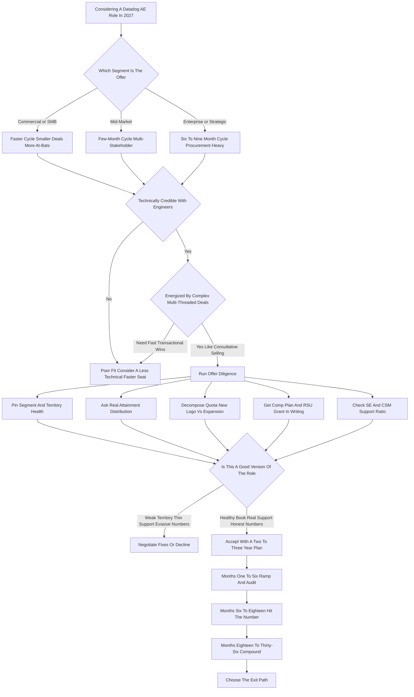

### Direct Answer

**Yes -- a Datadog AE (Account Executive) role is still a genuinely good career move in 2027, but only for the right rep and only if you price the trade-offs honestly.** Datadog (NASDAQ: DDOG) in 2027 is a profitable, roughly $3B-revenue, mid-20s-percent-growth public company sitting at the center of the observability market, and an AE seat there is a top-quartile enterprise SaaS sales job with realistic all-in earnings of **$170K-$300K for mid-market and commercial reps and $260K-$420K-plus for enterprise and strategic reps**. The honest catch: the 2027 role is an expansion-led, technical, consumption-priced, multi-threaded enterprise motion -- not the new-logo lottery of 2020-2021 -- and company-wide quota attainment realistically sits in the **45-60%** band, so the offer-letter OTE is a stretch target, not an expected value.

> **TL;DR**
> - **The seat is good** for a technically credible rep energized by complex, consultative, 6-9 month enterprise deals who values brand and skill-building as career capital.
> - **The seat is wrong** for a rep who needs fast transactional wins, cannot absorb a below-plan year financially, is not technically curious, or is chasing a startup-style equity windfall.
> - **Comp is strong but distributed:** OTE is reached by roughly the top half of the org; a below-plan year lands well under OTE; a top-decile year can clear $500K-$700K-plus.
> - **The company is safe, not explosive:** Datadog (NASDAQ: DDOG) is GAAP-profitable, growing mid-20s percent, with net revenue retention in the 110-120 percent band -- RSUs are real income, not a multi-bagger.
> - **The decision rule:** pin the segment, demand the real attainment distribution, audit the territory, get the comp plan in writing, and walk in with a deliberate two-to-three-year plan.

## 1. What A Datadog AE Role Actually Is In 2027

A Datadog Account Executive owns a defined book of business and carries a quota for new and expansion bookings, selling Datadog's observability and security platform to engineering, DevOps, platform, SRE, and increasingly security organizations. Understanding the shape of the job before you evaluate the comp is the difference between a clear-eyed decision and a disappointed first year.

### 1.1 The Product Is A Platform, Not A Point Tool

**Datadog is not one product; it is a platform of more than twenty modules.** Infrastructure monitoring, APM (application performance monitoring), log management, real user monitoring, synthetic monitoring, database monitoring, network monitoring, CI visibility, cloud security management, application security, and the LLM-observability and AI-monitoring lines that grew through 2025-2026 all sit under one brand. **The AE's job is to land an initial use case, prove value, and expand** -- more modules and more usage -- inside the account. That makes the role a land-and-expand, consumption-priced, multi-threaded enterprise sale, and that single fact shapes everything else about the seat.

### 1.2 The Team Around The Seat

**You do not sell Datadog alone.** A Datadog AE coordinates a cast of co-sellers: a Solutions Engineer who runs technical proofs of value, a Customer Success Manager who owns post-sale account health, sometimes a Product Specialist for security or a specific module, a deal desk that prices and structures contracts, and an expanding partner ecosystem spanning AWS, Microsoft Azure, Google Cloud, and the system integrators. **A rep who wants to "just sell" will find the internal-orchestration load real.** A rep who runs the team well wins more.

### 1.3 The Segments Differ Enormously

**The single most important thing to pin down about any Datadog offer is the segment**, because comp, cycle, daily work, and difficulty all flow from it.

| Segment | Account load | Typical cycle | Buyer profile | Best fit for |
|---|---|---|---|---|
| Commercial / SMB | Many smaller accounts | Weeks to ~2 months | Single eng / DevOps leader | Reps new to enterprise; high at-bats |
| Mid-Market | Mixed book | ~2-4 months | Small buying group | Reps building enterprise muscle |
| Enterprise | Few large named accounts | ~6-9 months | Full buying committee | Reps strong at multi-threading |
| Strategic / Major | Largest global accounts | ~6-12-plus months | Global committee + procurement | Veteran complex-deal sellers |

The mistake reps make is evaluating "a Datadog AE role" as one thing. **A Commercial seat and a Strategic seat are nearly different jobs at the same company.**

### 1.4 What A Week In The Seat Actually Looks Like

**A useful way to test fit is to picture an ordinary week rather than the highlight reel.** For an enterprise AE, a typical week is roughly 40 percent customer-facing -- discovery calls, executive alignment meetings, proof-of-value reviews, and negotiation sessions -- and roughly 30 percent internal coordination, including account-planning sessions with the Solutions Engineer, deal-desk conversations about pricing structure, forecast reviews with the manager, and handoffs with Customer Success. The remaining 30 percent is preparation and pipeline work: building business cases in spreadsheets, researching accounts, writing follow-up summaries, keeping the CRM honest, and prospecting into white space. **A rep who imagines the job as back-to-back closing calls is imagining the wrong job.** The closing energy is real but episodic; the steady-state work is research, orchestration, and patient multi-threading. A rep who finds that steady state energizing will thrive; a rep who finds it draining should weigh that honestly before signing, because no comp number compensates for spending the bulk of your week on work you dislike.

## 2. The Company Behind The Seat: Datadog's 2027 Financial Reality

A rep evaluating an AE role is, whether they frame it this way or not, making a bet on the company. The comp plan, the quota, the RSU value, and the brand all flow from Datadog's financial trajectory -- so the company diligence is part of the career diligence.

### 2.1 Mature Growth, Not Hypergrowth

**Datadog (NASDAQ: DDOG) in 2027 is a mature-growth public company** -- not a hypergrowth rocket and not a declining incumbent. Revenue is in the roughly $3B annual range, growth has moderated to the mid-20s percent year-over-year (down from 60-80-plus percent in the 2019-2021 window), the company is solidly GAAP-profitable and strongly free-cash-flow positive, and net revenue retention has settled into roughly the 110-120 percent band, down from 130-plus percent at the peak but still healthy. **Sales-and-marketing spend as a percentage of revenue has been declining** as Datadog optimizes for the Rule of 40 -- growth rate plus profit margin -- which directly affects an AE: headcount grows more slowly, territories get scrutinized, and the company expects more expansion per rep.

### 2.2 What That Means For The Rep

**You are joining a financially safe, brand-strong company that is run for efficiency rather than growth at all costs.** The stock is a real, liquid, large-cap equity -- RSUs have genuine value -- but a four-year grant no longer 10x's the way early-employee equity once did. The table below makes the shift concrete.

| Datadog metric | ~2020-2021 (hypergrowth) | ~2027 (mature growth) | What it means for an AE |
|---|---|---|---|
| Revenue YoY growth | 60-80-plus % | ~Mid-20s % | Quotas grow, territories tighten, headcount slower |
| Net revenue retention | 130-plus % | ~110-120 % | Expansion is harder but still the core of the plan |
| GAAP profitability | Near breakeven | Solidly profitable | Company stable; less "growth funds everything" |
| S&M as % of revenue | High, growth-mode | Declining, efficiency-mode | More expansion expected per rep; leaner coverage |
| RSU upside | Potential multi-bagger | Real but ~market-like | Equity is income, not a lottery ticket |
| Company-wide attainment | 65-75-plus % | Realistically ~45-60 % | The number is genuinely harder to hit |

**The honest read: financial safety is a real asset, and a rep who values a stable employer with a strong brand should weigh it positively** -- just not confuse it with the wealth-creation engine the 2021-era lore describes.

### 2.3 What The Stock Means For Your Total Comp

**A rep should think about DDOG the stock as a real but volatile slice of total compensation, not as a side detail.** A four-year RSU grant at an enterprise AE level commonly adds $40K-$100K-plus in annualized vesting value, and refresh grants layered in with tenure and performance keep that running. The honest framing has three parts. First, **the grant value at the offer is set by the stock price on a specific date** -- a rep who joins after a run-up is buying at a higher basis, and a rep who joins after a pullback is buying lower; this timing is luck, and it materially affects realized equity value. Second, **the stock is liquid and large-cap**, so unlike private-company equity it can be sold as it vests and treated as income -- there is no waiting for an exit. Third, **the upside is roughly market-like**: DDOG can outperform or underperform, but a rep should not model it as a multi-bagger. The practical rule: treat the RSU vesting as a meaningful bonus to the cash OTE, model it conservatively at or below the grant-date value, and never let the equity story paper over a weak base or a thin variable plan. The cash comp has to stand on its own.

## 3. The Compensation Reality: What A Datadog AE Actually Earns

Compensation is usually the first question, and it deserves a segmented, honest answer rather than a single headline number.

### 3.1 The Structure Of The Plan

**Datadog AE comp is a base-plus-variable split, typically around 50/50 for full-cycle AEs** (sometimes 60/40 in lower segments), with **uncapped commission** and **accelerators** above quota, plus an **RSU grant** that vests over four years and refreshes with performance and tenure. The variable is earned against a quota that blends new-logo and expansion bookings.

### 3.2 On-Target Earnings By Segment

The all-in OTE figures below are 2027 estimates drawn from publicly reported ranges on levels.fyi, RepVue, Glassdoor, and Datadog's own job postings.

| Segment | Base salary | Total OTE | Typical RSU add (annualized) |
|---|---|---|---|
| Commercial / SMB AE | $70K-$100K | $130K-$190K | $15K-$45K |
| Mid-Market AE | $90K-$130K | $170K-$260K | $25K-$70K |
| Enterprise AE | $120K-$170K | $240K-$360K | $40K-$100K-plus |
| Strategic / Major Account AE | $150K-$200K-plus | $300K-$420K-plus | $60K-$150K-plus |

### 3.3 OTE Is A Target, Not An Average

**The real distribution matters more than the OTE.** In a normal year, a rep who hits roughly 100 percent of quota earns their OTE; a top-decile rep with accelerators and a strong expansion year can clear $500K-$700K-plus all-in; and a rep who lands at 50-60 percent attainment -- a large share of the org in 2027 -- earns base plus partial commission, often landing well below OTE.

| Outcome (Enterprise AE, representative year) | All-in earnings | Share of org |
|---|---|---|
| Below plan (~45-60% attainment) | ~$120K-$200K | Roughly half in a typical year |
| At plan (~100% quota) | ~$240K-$360K (full OTE plus RSUs) | Roughly the top half |
| Top decile (accelerators, big expansion) | ~$500K-$700K-plus | The strongest reps |

**The comp is genuinely strong and top-quartile for enterprise SaaS.** But the headline OTE is a stretch target, and the gap between OTE and actual earnings is wider in 2027 than the hypergrowth-era reviews imply. A rep who plans their finances around the OTE number is planning around the top half of the org's outcome.

## 4. How The 2027 Comp Plan Differs From The 2021 Comp Plan

A rep who takes advice from someone who sold Datadog in 2020-2021 is getting accurate history and misleading guidance, because the comp plan itself has been redesigned around the company's maturation.

### 4.1 The New-Logo-Versus-Expansion Rebalance

**In the hypergrowth era, the plan and the culture were weighted toward landing new logos** -- that is where the accelerators and the glory lived. In 2027, with net revenue retention as the board-watched metric, a meaningful portion of quota -- often 30-45 percent for established-territory AEs -- is expansion of existing accounts, and the plan rewards module attach and usage growth, not just new names.

### 4.2 Consumption Pricing Changed The Rhythm Of Earnings

**Datadog's usage-based pricing means a chunk of a rep's number can come from existing customers simply growing their cloud footprint** -- which sounds like free money but cuts both ways. In a quarter where customers optimize spend or cut cloud costs, a rep's "expansion" can go backward through no fault of their own.

### 4.3 Quotas Rose, Territories Tightened, Commitments Grew

| Plan dimension | 2020-2021 | 2027 |
|---|---|---|
| Quota emphasis | New-logo hunting | Expansion + new logo blend |
| Expansion share of quota | Low | ~30-45% (established territory) |
| Pricing model impact | Mostly fixed deals | Consumption volatility built in |
| Deal structure | Single-module land | Multi-year platform commitments |
| Territory sizing | Generous, growth-mode | Tighter, efficiency-mode |

**The practical takeaway: the 2027 plan rewards a technical, expansion-oriented, account-management-heavy rep more than a fast, transactional, new-logo-hunter rep.** If your selling identity is the latter, this is a harder seat than it looks.

## 5. The Observability Market In 2027: Datadog's Competitive Position

An AE's quota attainment is partly skill and partly the wind at the rep's back -- and the observability market in 2027 is a moderately favorable but genuinely competitive environment, not a blue ocean.

### 5.1 The Competitive Field

**Datadog is the clear platform leader by mindshare and breadth, but it sells into a crowded field.** Splunk, now owned by Cisco (NASDAQ: CSCO) after the roughly $28B acquisition closed in 2024, is the deep-pocketed incumbent in log analytics and security. Dynatrace (NYSE: DT) is the strongest direct APM-and-observability platform competitor in large complex enterprises. New Relic, taken private by Francisco Partners and TPG in 2023, repositioned around consumption pricing as a price-competitive alternative. Grafana Labs -- open-source-led, with Grafana, Prometheus, Loki, and Tempo -- is the structural threat to cost-conscious engineering orgs that would rather assemble and self-host. Elastic (NYSE: ESTC) competes on logs and search. And Microsoft (NASDAQ: MSFT), Amazon (NASDAQ: AMZN), and Alphabet (NASDAQ: GOOGL) all ship native cloud-monitoring tools that create constant "why not just use the native tool" objections.

| Competitor | Ownership / status 2027 | Where it pressures a Datadog AE |
|---|---|---|
| Splunk | Cisco-owned (NASDAQ: CSCO), ~$28B, closed 2024 | Logs, SIEM, security; Cisco enterprise distribution |
| Dynatrace | Public (NYSE: DT) | Direct APM and observability platform in large enterprise |
| New Relic | Private (Francisco Partners / TPG, 2023) | Consumption-priced, price-competitive alternative |
| Grafana Labs | Private, open-source-led | Mid-market and cost-conscious self-host buyers |
| Elastic | Public (NYSE: ESTC) | Logs and search workloads |
| Hyperscaler native tools | AWS, Azure, GCP platforms | Good-enough native tooling; displacement objection |
| CrowdStrike / Wiz | Public (NASDAQ: CRWD) / private security leaders | Security-observability convergence overlap |

### 5.2 What It Means For The Rep

**You will spend real selling time on competitive displacement and on defending against "we'll just use open source" and "we'll just use the cloud-native tool"** -- friction a Datadog rep in 2018 rarely faced. But Datadog's platform breadth, ease of deployment, and brand still win a large share of competitive deals, and the market itself -- cloud, microservices, Kubernetes, and now AI workloads -- keeps expanding the surface area that needs monitoring.

## 6. Quota Attainment: The Honest Numbers

The single most important and most under-discussed reality of any AE role is **what percentage of reps actually hit quota** -- because OTE is irrelevant if attainment is low.

### 6.1 The 2027 Attainment Picture

**Company-wide quota attainment at Datadog in 2027 is realistically in the 45-60 percent band**, meaning a large share of the sales org -- likely close to half in a typical year -- finishes below 100 percent of their number. This is not a Datadog-specific failing; it is the math of enterprise SaaS in a mature-growth, efficiency-focused company, where quotas are set so the company hits its plan only if reps are stretched.

| Era | Reported attainment | Driver |
|---|---|---|
| 2019-2021 hypergrowth | ~60-75-plus % (RepVue-cited) | Generous territories, new-logo tailwind |
| 2024-2025 transition | Compressing | Quotas rising, growth moderating |
| 2027 mature growth | ~45-60% | Efficiency posture, expansion-weighted plan |

### 6.2 The Mistake To Avoid

**The mistake is to read the OTE in the offer letter as an expected value -- it is a target that roughly the top half of the org reaches.** A median rep earns base plus partial commission. A good rep hits the number and earns OTE. A top rep crushes it and earns multiples. The reps who consistently hit the number in 2027 are technical, multi-threaded, expansion-disciplined, and good at navigating procurement -- and the reps who miss are usually the ones who treated it like a faster, simpler sale than it is.

## 7. The Deal Cycle: What Selling Datadog Actually Feels Like Day To Day

The lived experience of the job varies enormously by segment, and a rep should know which version they are signing up for.

### 7.1 The Cycle By Segment

| Segment | Cycle length | Daily texture |
|---|---|---|
| Commercial / SMB | Weeks to ~2 months | Higher volume, single buyer, classic SaaS motion |
| Mid-Market | ~2-4 months | Multiple stakeholders, growing procurement friction |
| Enterprise | ~6-9 months | Multi-threaded campaign, security review, procurement |
| Strategic / Major | ~6-12-plus months | Global committees, longest cycles, biggest numbers |

### 7.2 What An Enterprise Quarter Looks Like

**In Enterprise and Strategic, the cycle runs six to nine months or longer, and the work is fundamentally different from a transactional sale.** You run a multi-threaded campaign across engineering champions, platform leadership, the economic buyer, security review, procurement, and sometimes legal; you coordinate a Solutions Engineer through a proof of value where Datadog is deployed against real workloads; you build a business case in spreadsheets; and you do all of this while expanding the accounts you already closed. **A typical enterprise AE's quarter is a portfolio:** a couple of new-logo campaigns in mid-stage, several expansion conversations, a renewal or two with upsell attached, and constant internal coordination.

**It is intellectually demanding, technically substantive, and relationship-heavy.** It is not transactional -- a rep energized by fast closes and a clean pipeline of simple deals will find the enterprise motion slow and frustrating, while a rep who likes complex, consultative, high-stakes selling will find it some of the most interesting work in software.

## 8. The Skills You Build: Why The Resume Value Is Real

One of the strongest arguments for a Datadog AE role in 2027 has nothing to do with the comp in the seat itself -- it is what the seat does to your career capital.

### 8.1 The Portable Skill Set

**Selling Datadog teaches a specific and highly portable skill set.** You learn consumption and usage-based selling, the dominant pricing model of modern infrastructure software. You learn to sell technically to a technical buyer -- engineers, SREs, platform teams -- a more durable skill than selling on relationship alone. You learn multi-product platform selling and the land-and-expand motion. And you learn enterprise procurement, security review, and multi-threading in real, high-dollar deals.

| Skill built at Datadog | Where it transfers |
|---|---|
| Consumption / usage-based selling | Snowflake, MongoDB Atlas, Confluent, the cloud providers |
| Technical selling to engineers | Any infrastructure or developer-tools company |
| Land-and-expand platform motion | Nearly every modern enterprise software vendor |
| Enterprise procurement navigation | Any large-deal enterprise seat |
| Multi-threading buying committees | Strategic and major-account roles industry-wide |

### 8.2 The Brand

**"Datadog enterprise AE who carried a $1.5M-plus number and hit it" is a credential recruiters recognize instantly** at CrowdStrike (NASDAQ: CRWD), Snowflake (NYSE: SNOW), MongoDB (NASDAQ: MDB), HashiCorp, Confluent (NASDAQ: CFLT), and the entire Series-B-through-pre-IPO infrastructure landscape. **Even a rep who has an average two years -- hits quota once, misses once -- leaves with a materially stronger resume.** This is the part of the value proposition the comp-plan debate tends to obscure, and for many reps it is the real reason the seat is worth taking.

### 8.3 Why The Skill Set Compounds Faster Than The Comp

**A subtle but important point: the skill set a Datadog AE builds appreciates faster than the comp in the seat itself, and a rep evaluating the role should weigh it that way.** In a single seat, the comp is roughly flat year over year unless the rep climbs a segment -- a Mid-Market AE earns a Mid-Market number whether it is year one or year three. But the skill set is cumulative: a rep in year three has run dozens of enterprise cycles, navigated procurement and security review repeatedly, built and refined a proof-of-value playbook, and developed real judgment about which deals are winnable. **That accumulated judgment is what commands the higher numbers at the next seat.** A rep who thinks of the role purely in terms of this year's W-2 is underpricing it; a rep who thinks of it as a two-to-three-year investment in a portable, appreciating asset is reading it correctly. The career-capital math is genuinely favorable, and it is the strongest argument for the seat that has nothing to do with the offer-letter number.

## 9. The Career Paths Out Of A Datadog AE Seat

A rep should evaluate a role partly by where it leads, and a Datadog AE seat leads to several genuinely good places.

### 9.1 The Five Exit Paths

| Path | What it looks like | Trade-off |
|---|---|---|
| Vertical inside Datadog | Commercial to Mid-Market to Enterprise to Strategic | Bigger number each rung; stays at one company |
| Management | First-line to second-line sales leadership | Trades uncapped rep upside for scope |
| Lateral-up to a startup | Early enterprise rep at a Series C infra company | Bigger equity upside, more risk |
| Adjacent platform | Snowflake, CrowdStrike, MongoDB, HashiCorp, Confluent | Comparable or higher number |
| Specialist / overlay | Solutions Engineering, product specialist, RevOps | Different work, often lower variable |

### 9.2 The Hub-And-Spoke Read

**The seat is not a dead end or a niche -- it is a hub with many spokes, and most of them lead to roles that pay as well or better.** A proven Datadog enterprise rep is a prime hire for a higher-growth or earlier-stage infrastructure company where the equity upside is larger. Some reps even move to the buyer side -- vendor management, FinOps, or platform procurement -- using the deep product and pricing knowledge. The optionality is a real, under-counted part of the seat's value.

## 10. The Ramp Reality: Why The First Six Months Decide The Next Three Years

A Datadog AE seat is genuinely back-loaded: the ramp period is long, the product is deep, and the rep who treats months one through six as a learning sprint rather than a closing sprint sets up everything that follows.

### 10.1 Why Ramp Is Long

**Datadog's platform is more than twenty modules, each with its own buyer, competitive set, and technical story.** A rep cannot be credible across that surface in thirty days, and the company knows it -- which is why ramp quotas are reduced and the first two quarters are partly about absorption rather than production.

### 10.2 What Good Ramp Looks Like

The reps who use the ramp well do three specific things:

- **Get genuinely fluent in the platform** -- not marketing-deck fluent, but able to whiteboard the architecture and the pricing model to a skeptical SRE.
- **Audit the inherited territory account by account** -- building a real map of which accounts are healthy and expanding, which are flat, which are at risk, and where the white space is.
- **Invest in the internal relationships** -- the SE who will run their proofs of value, the CSM who owns post-sale health, the deal desk that prices their deals, the manager who advocates for them in territory and quota discussions.

**The ramp is not downtime; it is the foundation.** The reps who waste it panic about the number, chase any deal that moves, and pay for it in quarters three through eight when a buyer asks a real question and the rep cannot answer it credibly.

## 11. The Solutions Engineer Relationship: The Most Important Partnership In The Seat

If there is a single relationship that determines a Datadog AE's success more than any other, it is the partnership with the Solutions Engineer -- the technical pre-sales counterpart who runs the proofs of value and provides the credibility that closes technical buyers.

### 11.1 The SE Is A Co-Seller, Not A Resource

**A rep who treats the SE as a resource to be summoned for demos is leaving most of the value on the table.** The SE shapes the technical narrative, detects when a deal is technically dead before the AE does, builds champion relationships inside engineering the AE cannot build alone, and in a consumption-priced platform sale often understands the customer's technical trajectory -- and therefore the real expansion potential -- better than the AE.

### 11.2 What A Strong Partnership Looks Like

| AE owns | SE owns | Shared |
|---|---|---|
| Commercial negotiation | Technical proof of value | Account planning |
| Procurement navigation | Deep technical answers | Deal qualification |
| Political mapping | Architecture credibility | Champion-building |
| Forecast and commit | Competitive technical defense | Expansion strategy |

**SE coverage ratios matter too:** a segment where one SE supports three AEs is a very different job from one where one SE supports eight. A rep evaluating an offer should ask about the ratio directly. The throughline: this is a team sale, the SE is the most important teammate, and a rep who is not naturally collaborative will find the Datadog motion harder.

## 12. Renewals, Net Revenue Retention, And The Expansion Discipline

Because the 2027 comp plan is so heavily weighted toward expansion and net revenue retention, a rep needs to understand the renewal-and-expansion machine in detail -- it is where a large share of the number is made or lost.

### 12.1 The Renewal Is Not A Formality

**In a consumption-priced platform, the renewal is the moment the customer reassesses** whether they are getting value, whether they are over-provisioned, whether a competitor or an open-source stack could do the job cheaper, and whether to commit to a larger multi-year platform deal or to flatten and optimize. A skilled AE works the renewal as a months-long campaign, not a contract-signing event.

### 12.2 The Expansion Discipline

**Expansion is its own skill** -- identifying the next use case, building the internal champion for it, and sequencing it so the account grows steadily rather than in lumpy renewal-driven jumps.

| Expansion signal | The next-module play |
|---|---|
| Team running APM, no log management | Attach log management |
| Infra monitoring customer, new security mandate | Attach cloud security / app security |
| Growing Kubernetes footprint | Grow infrastructure monitoring usage |
| Generative-AI workloads moving to production | Attach LLM observability |

**The reps who are great at this treat their book like a portfolio of growing relationships; the reps who struggle treat closed accounts as done and are surprised when the renewal comes in flat or down.** In 2027, an AE who cannot run expansion and protect renewals will miss the number even with strong new-logo performance -- the plan simply does not let new logos alone carry the year.

### 12.3 Why Net Revenue Retention Is The Metric That Governs The Seat

**A rep who understands one company-level metric deeply should make it net revenue retention, because it is the number that the board watches and the comp plan encodes.** NRR measures how much revenue the existing customer base generates this year versus last year, after accounting for expansion, contraction, and churn. When NRR sits comfortably above 100 percent, the installed base grows on its own and every new logo compounds; when it slips toward 100 percent, the company has to win new logos just to stand still, and quotas tighten across the org. Datadog's NRR in the 110-120 percent band in 2027 is healthy but not the 130-plus percent of the hypergrowth years -- and that single shift explains most of what changed in the AE seat. **The expansion weighting in the comp plan, the renewal discipline the company expects, the scrutiny on territory health, and the harder attainment math all trace back to the NRR number.** A rep evaluating an offer should ask where segment-level NRR sits, because a segment whose installed base is expanding is a fundamentally easier seat than a segment whose base is flat or optimizing -- and the difference will show up directly in the rep's paycheck.

## 13. The Procurement And Security-Review Gauntlet

A rep moving into the enterprise or strategic segment needs to be ready for the part of the modern enterprise sale that is least glamorous and most decisive: procurement and security review.

### 13.1 Why Deals Stall At The End

**In 2027, large enterprises have centralized, professionalized procurement functions whose explicit job is to compress vendor pricing, standardize terms, and slow the process down enough to extract concessions.** A Datadog deal of meaningful size goes through this gauntlet every time. The same is true of security review: before a large enterprise lets a monitoring platform ingest its logs and telemetry, security and compliance teams run vendor risk assessments, review SOC 2 and other attestations, and scrutinize data residency -- adding weeks or months.

### 13.2 Managing It As A Workstream

**The skilled enterprise AE treats procurement and security as workstreams to be managed from early in the deal, not obstacles encountered at the end.** They identify the procurement and security stakeholders during discovery, get the security documentation moving in parallel with the technical evaluation, understand the customer's contracting standards before the negotiation, and coordinate with Datadog's deal desk and legal so the company is responsive rather than a bottleneck. A rep who wants the deal to be done when the champion says yes will find the last third of every enterprise deal frustrating.

## 14. Forecasting And Pipeline Discipline In A Consumption World

One underappreciated demand of the Datadog AE seat in 2027 is the forecasting and pipeline rigor the role requires, which is harder in a consumption-priced platform than in a traditional fixed-license sale.

### 14.1 Forecasting A Blend

**In a seat-license world, a deal is a discrete thing** -- a number of seats at a price, closing on a date. In Datadog's world, a rep forecasts a blend: new-logo deals with their own probability and timing, expansion that depends partly on the customer's own growth, renewals that could come in up or down, and usage-driven revenue that fluctuates with cloud consumption.

### 14.2 The Discipline That Builds Trust

| Discipline | What it requires |
|---|---|
| Pipeline hygiene | Knowing the true stage and health of every deal |
| Honest qualification | Killing dead deals rather than carrying them |
| Usage monitoring | Watching consumption signals that predict expansion or contraction |
| Calling the number | The judgment to commit a forecast and hit it |

**A rep who consistently sandbags or consistently misses their commit erodes trust with leadership, which affects everything from territory quality to promotion.** For a rep who is naturally rigorous and data-oriented, this is a strength to lean into; for a rep who finds CRM hygiene tedious, it is a real friction point worth being honest about before taking the seat.

## 15. The AI And LLM-Observability Tailwind

A genuinely positive structural factor for a Datadog AE in 2027 -- and one worth weighing in the career calculus -- is that the surface area Datadog monitors keeps expanding, and the newest expansion is the AI and LLM workload.

### 15.1 New White Space Inside Existing Accounts

**As enterprises move generative-AI and machine-learning workloads into production, they discover the same thing they discovered with microservices and Kubernetes a decade earlier: they cannot operate what they cannot observe.** Datadog built and expanded LLM-observability and AI-monitoring product lines through 2025-2026 -- monitoring model performance, cost, latency, drift, and the behavior of AI-powered features in production. For an AE, a customer who has been a Datadog infrastructure-and-APM customer for years now has a new category of workload that needs monitoring -- an expansion conversation that did not exist before.

### 15.2 On The Right Side Of The Trend

**The thing Datadog sells -- visibility into complex production systems -- is a need that the dominant technology trend of the era is making bigger, not smaller.** That is a meaningfully better structural position than selling into a category the market is commoditizing, and it is part of why the seat remains a good one even as the company's own growth has moderated. It does not make the number easy -- the AI-observability category is also competitive -- but it is a tailwind, not a headwind.

## 16. How To Evaluate The Specific Offer In Front Of You

A rep deciding on a real Datadog offer should run a structured diligence process rather than reacting to the OTE number.

### 16.1 The Eight-Point Diligence Checklist

| # | Diligence question | Why it matters |
|---|---|---|
| 1 | Which segment is the seat? | Everything else flows from it |
| 2 | What is the real attainment distribution? | OTE is meaningless without it |
| 3 | What territory would you inherit? | Greenfield, backfill, or carve-down? |
| 4 | How is quota split new-logo vs expansion? | Tells you if the target is realistic |
| 5 | What is the comp plan in writing? | Splits, accelerators, uncapped status, RSUs |
| 6 | What is the SE and CSM support ratio? | Thin support makes the number much harder |
| 7 | What do 2-3 current reps say? | The unfiltered preview of the job |
| 8 | What is the brand and skill value? | Counts even in a below-plan year |

### 16.2 The Signal In The Answers

**A good hiring manager gives you real answers; evasiveness on attainment is itself a signal.** Run this process and the offer becomes a clear yes, a clear no, or a "yes if they fix the territory question" -- which is exactly the clarity a major career decision needs.

### 16.3 The Questions To Ask Current Reps

**Hiring managers describe the role they are selling; current reps describe the role as it is lived -- and the gap between the two is the most valuable information in the whole process.** A candidate should ask to speak with two or three current AEs in the same segment, and should ask specific rather than generic questions. Generic questions ("do you like it here?") produce generic answers. Sharper questions surface the truth:

| Question to a current rep | What it reveals |
|---|---|
| What did you wish you knew before you took this seat? | The under-priced surprises of the role |
| How did your inherited territory compare to what you expected? | How much territory variance the org tolerates |
| What did the median rep in our segment actually earn last year? | The real distribution behind the OTE |
| How responsive is deal desk and security when a deal is stuck? | Whether internal support helps or hinders |
| What does a rep who misses look like a year later? | Whether the org is supportive or punitive on a miss |

**A rep who declines to put a candidate in touch with current reps, or who routes only carefully chosen top performers, is sending a signal.** A confident, healthy sales org is comfortable letting candidates talk to ordinary reps, because the ordinary experience is good enough to survive scrutiny.

## 17. Datadog AE Versus The Alternatives

A rep is rarely choosing between "Datadog AE" and "nothing" -- the real decision is Datadog versus a comparable seat elsewhere.

### 17.1 The Alternatives Compared

| Alternative | Upside vs Datadog AE | Downside vs Datadog AE |
|---|---|---|
| Hyperscaler (AWS / Azure / GCP) | Bigger brand, broad portfolio, stability | Less deal ownership, diffuse comp |
| Series B-D infra startup | Larger equity upside, faster pace | More risk, thin support, unproven product |
| Mature incumbent (Oracle / Cisco / IBM) | Maximum stability and structure | Slower growth, more political, less technical |
| Direct peer (Snowflake / CrowdStrike / etc.) | Often comparable; depends on specifics | Comes down to territory, manager, equity timing |

### 17.2 The Framework

**Datadog AE is a high floor with a real-but-moderate ceiling.** If you want a higher ceiling and can absorb risk, an earlier-stage company is the move. If you want maximum stability, an incumbent is the move. If you want the best balance of brand, skill-building, comp, and safety in infrastructure sales, Datadog is genuinely one of the best seats available -- which is exactly why it is competitive to get. The question is rarely whether Datadog is a good company; it plainly is. The question is fit.

### 17.3 The Risk-And-Career-Stage Lens

**The right answer between Datadog and the alternatives depends heavily on two personal variables: risk tolerance and career stage.** A rep early in their career, with few fixed financial obligations and a long runway, can rationally take more risk -- the earlier-stage company with bigger equity upside is a defensible swing, and even a miss is a recoverable learning year. A rep mid-career, with a mortgage and dependents, rationally weights the high floor more heavily -- Datadog's financial safety and predictable base become genuinely valuable, and the moderate equity ceiling is an acceptable trade for not betting the household on an unproven product. **There is no universally correct choice; there is only the choice that matches the rep's actual situation.**

| Rep profile | Better-fit choice | Reasoning |
|---|---|---|
| Early career, high risk tolerance | Series C infra startup | Bigger equity swing, recoverable downside |
| Mid-career, fixed obligations | Datadog AE | High floor, predictable base, real brand |
| Wants maximum stability | Mature incumbent | Structure and predictability over growth |
| Wants best balance | Datadog AE | Brand, skill, comp, and safety together |

The honest framing for a rep deciding: **Datadog is rarely the wrong answer, but it is not always the optimal answer** -- and knowing which situation you are in is the whole decision.

## 18. The Two-To-Three-Year Plan If You Take The Seat

A rep who accepts a Datadog AE role should walk in with a deliberate plan, because the difference between a rep who extracts maximum value and a rep who just occupies the seat is enormous.

### 18.1 The Phased Plan

| Phase | Months | Focus |
|---|---|---|
| Ramp | 1-6 | Platform fluency, territory audit, first small wins |
| Perform | 6-18 | Run full motion, hit the year, build the playbook |
| Compound | 18-36 | Convert performance into a deliberate next move |

### 18.2 Why The Plan Matters

**The first full-year attainment result is what defines your trajectory both inside Datadog and on your future resume.** By month thirty-six a deliberate rep has the consumption-selling skill set, the land-and-expand playbook, the enterprise-procurement scar tissue, and the brand. The reps who treat the seat as a two-to-three-year skill-and-brand-building campaign with a deliberate exit thesis are the ones for whom "is a Datadog AE role good for my career" resolves to an unambiguous yes. The reps who drift through it without a plan later wonder whether it was worth it. **The seat is good; what you do with it is what makes it good for your career specifically.**

### 18.3 The Milestones That Mark A Plan On Track

**A rep should set concrete checkpoints rather than relying on a vague sense of progress, because the seat is long enough that drift is easy and self-deception is comfortable.** The checkpoints below give a rep an honest read on whether the two-to-three-year thesis is working or quietly failing.

| Checkpoint | On-track signal | Warning signal |
|---|---|---|
| End of month 6 | Platform-fluent, territory mapped, first wins logged | Still chasing any deal, no territory map |
| End of year 1 | At or near 100% attainment, repeatable playbook | Well below plan with no diagnosed cause |
| Middle of year 2 | Trusted with bigger accounts, expansion compounding | Flat book, renewals coming in down |
| End of year 2 | Clear exit thesis, recruiter interest, brand earning its keep | Comfortable but stalled, no next move in view |

**The reps who hit these checkpoints convert the seat into a launchpad; the reps who miss them quietly and do not adjust are the ones who later describe the role as a disappointment.** The difference is almost never the company -- it is whether the rep treated the seat as a deliberate campaign with honest milestones or as a place to simply show up. A rep who reviews these checkpoints honestly every six months will know, well before it is too late to act, whether the Datadog seat is delivering the career value it can deliver.

## 19. The Decision Journey

The flowchart below compresses the entire evaluation into a single decision path -- from considering the role through accepting it with a plan and choosing an exit.

## 20. Counter-Case: Why A Datadog AE Role Might Be The Wrong Move In 2027

The analysis above concludes the seat is good for the right rep -- but a careerist owes themselves the strongest version of the opposite argument before signing.

### 20.1 The Ten Counter-Arguments

- **Counter 1 -- The OTE in the offer letter is marketing, not a forecast.** With company-wide attainment realistically in the 45-60 percent band, a coin-flip-or-worse share of the org earns meaningfully less than OTE in any given year. A rep who plans their life around the OTE number is planning around a stretch target.
- **Counter 2 -- Your year is partly hostage to the territory you are handed.** Books vary wildly -- some full of healthy expanding accounts, some full of cloud-cost optimizers and at-risk renewals. A rep can do everything right and still miss because they inherited a shrinking book.
- **Counter 3 -- Consumption pricing means the customer's CFO is on your comp plan.** Because expansion tracks the customer's cloud footprint, a wave of cloud-cost optimization can shrink your existing-account revenue with zero misstep on your part.
- **Counter 4 -- The hypergrowth-era upside is gone.** The lore that makes Datadog sound like a wealth-creation machine comes from the 2019-2021 window. That company does not exist anymore at $3B in revenue and mid-20s growth; the RSUs are real income but roughly market-like.
- **Counter 5 -- It is an internal-coordination job as much as a selling job.** The multi-threaded motion across SE, CSM, product specialist, deal desk, legal, and partners means a large share of the week is internal orchestration.
- **Counter 6 -- The deal cycle is slow, and slow is demoralizing for some reps.** A six-to-nine-month enterprise cycle means long stretches with no closes and a quarter's outcome often decided by deals that started two quarters ago.
- **Counter 7 -- The competitive grind is constant and partly unwinnable.** "Why not just use CloudWatch" and "we'll self-host Grafana and Prometheus" are objections a Datadog AE faces on a large share of deals, and some of those deals are genuinely lost to good-enough free tooling.
- **Counter 8 -- An earlier-stage company may simply be the better career bet.** For a rep with the skill and risk tolerance, taking the Datadog-caliber skill set to a Series C infrastructure company as an early enterprise rep with a real equity grant can be the higher-expected-value move.
- **Counter 9 -- The brand value can be a trap if you stay too long.** The resume value compounds best when you use it -- a rep who settles into a comfortable below-plan groove for four or five years can find the brand value plateaus while peers who moved have surpassed them.
- **Counter 10 -- Technical credibility is now a hard requirement.** A strong relationship seller who is not technically curious will struggle to sell a twenty-module platform to engineers and SREs in 2027. Charisma does not cover a thin technical understanding.

### 20.2 The Honest Verdict

**A Datadog AE role in 2027 is the wrong move for: a rep who needs to reliably earn full OTE and cannot absorb a below-plan year; a rep who wants fast, transactional, single-product selling; a rep chasing a startup-style equity windfall; a rep who is not technically curious; and a rep who would do better taking a swing at an earlier-stage company.** It remains a genuinely good move for a technically credible rep who is energized by complex enterprise selling, values the brand and skill-building as career capital, can be patient with long cycles, has the financial cushion to absorb a tough year, and walks in with a deliberate plan. The seat is not a scam and it is not a disappointment by default -- but the gap between the rep it fits and the rep it does not is wide, and the OTE-versus-attainment gap is the single most under-priced risk in the decision.

## 21. The Bottom-Line Framework

Pulling the entire analysis into a single decision framework: a Datadog AE role in 2027 is good for your career if you can answer yes to a specific set of questions.

### 21.1 The Five Yes-Or-No Questions

- **Can you be technically credible with an engineering buyer?** If yes, the product plays to your strength; if no, you will struggle.
- **Are you energized by complex, multi-threaded, six-to-nine-month enterprise deals, or do you need fast transactional wins?** The former thrives here; the latter does not.
- **Do you value the consumption-selling and land-and-expand skill set and the Datadog brand as career capital, not just the immediate comp?** If yes, the seat pays off even in a below-plan year.
- **Can you absorb a year where you land at 50-60 percent attainment without it being a financial crisis?** That is a realistic outcome in a tough year for a large share of the org.
- **Have you done the territory and comp-plan diligence** so you know whether the specific offer is a good version of the role or a poor one?

### 21.2 The Final Read

**If you answer yes across these, a Datadog AE role is one of the best enterprise SaaS seats available** -- a high-floor, real-ceiling job that builds top-tier skills, carries genuine brand equity, and pays in the top quartile of the profession. If you answer no on technical credibility or on tolerance for complex slow deals, the role is a poor fit and an adjacent seat would serve you better. The question is not whether Datadog is a good company; it plainly is. The question is whether the 2027 version of the role -- expansion-led, technical, consumption-priced, harder to fully attain than the hypergrowth-era reviews suggest -- fits the rep you actually are. Match honestly, do the diligence, walk in with a plan, and the seat is genuinely good for your career.

## 22. Key Numbers At A Glance

| Metric | 2027 figure |
|---|---|
| Datadog revenue | ~$3B annual range |
| Revenue growth | ~Mid-20s % YoY |
| Net revenue retention | ~110-120% |
| Company-wide quota attainment | ~45-60% of reps hit 100%-plus |
| Commercial / SMB AE OTE | $130K-$190K |
| Mid-Market AE OTE | $170K-$260K |
| Enterprise AE OTE | $240K-$360K |
| Strategic / Major AE OTE | $300K-$420K-plus |
| Top-decile all-in earnings | $500K-$700K-plus |
| Enterprise deal cycle | ~6-9 months |
| Base/variable split | ~50/50 for full-cycle AEs |
| Expansion share of quota | ~30-45% (established territory) |
| Platform modules | 20-plus |

## 23. Related Pulse Library Entries

For readers weighing this seat against comparable roles, the following sibling entries go deeper on adjacent AE and Solutions Engineer careers, peer-company comparisons, and the consumption-priced enterprise motion. Each is a standalone analysis in the same format.

- A consumption-priced enterprise peer with the closest comparable motion (q1923).
- A second deep analysis of the Snowflake enterprise AE seat and its trajectory (q1591).
- The Stripe AE seat -- another usage-priced platform sale to a technical buyer (q1926).
- The HubSpot AE role as a higher-velocity, less infrastructure-heavy comparison (q1915).
- A second HubSpot AE analysis covering the mid-market and commercial motion (q1875).
- The Salesforce AE seat as the mature-incumbent platform comparison (q1894).
- A second Salesforce AE analysis on the incumbent trade-offs (q1541).
- The ServiceNow AE role -- a large-platform enterprise comparison (q1641).
- The Apollo AE seat as a faster-cycle, lower-ACV contrast (q1896).
- The Salesloft AE role for a sales-tech rather than infrastructure comparison (q1820).
- The Outreach AE seat as another sales-tech career comparison (q1761).
- The Atlassian AE role -- a developer-tools platform comparison (q1889).
- The Outreach Solutions Engineer path for the AE-versus-SE career fork (q1897).
- The Workato Sales Engineer seat as a technical pre-sales alternative (q1882).
- A framework for keeping strong Solutions Engineers from leaving for AE roles (q615).

## 24. Sources

1. **Datadog, Inc. Investor Relations -- Quarterly and Annual Results** -- Primary source for revenue, growth rate, net revenue retention, profitability, and customer metrics. https://investors.datadoghq.com
2. **Datadog SEC Filings (10-K, 10-Q)** -- Audited financials, risk factors, sales-and-marketing spend, and customer concentration data. https://www.sec.gov
3. **levels.fyi -- Datadog Sales Compensation Data** -- Crowdsourced AE base, OTE, and equity data by level and segment. https://www.levels.fyi
4. **RepVue -- Datadog Sales Org Ratings and Quota Attainment** -- Rep-reported quota attainment, comp satisfaction, and culture ratings. https://www.repvue.com
5. **Glassdoor -- Datadog Account Executive Reviews and Salaries** -- Self-reported comp ranges and qualitative reviews of the AE role. https://www.glassdoor.com
6. **Datadog Careers / Job Postings -- Account Executive Roles** -- Official base-salary ranges, OTE ranges, and role descriptions by segment. https://careers.datadoghq.com
7. **US Bureau of Labor Statistics -- Sales Occupations, Software Publishers** -- Baseline data on sales-role employment and wages in the software sector. https://www.bls.gov
8. **Gartner -- Magic Quadrant for Observability Platforms and APM** -- Independent positioning of Datadog versus Dynatrace, Splunk, New Relic, and others. https://www.gartner.com
9. **Gartner -- Market Guide and Forecasts for Observability and Monitoring Spend** -- Market-size and growth context for the observability category.
10. **Cisco Investor Relations -- Splunk Acquisition Disclosures** -- Detail on the roughly $28B Splunk acquisition and its closing. https://investor.cisco.com
11. **Dynatrace, Inc. Investor Relations (NYSE: DT)** -- Competitor financials and positioning. https://ir.dynatrace.com
12. **Elastic N.V. Investor Relations (NYSE: ESTC)** -- Competitor financials in logs and search. https://ir.elastic.co
13. **New Relic / Francisco Partners and TPG Take-Private Disclosures (2023)** -- Detail on the New Relic privatization and repositioning.
14. **Grafana Labs -- Company and Product Information** -- Open-source-led observability stack (Grafana, Prometheus, Loki, Tempo) competitive context. https://grafana.com
15. **CNBC, The Information, and Tech Press Coverage of Datadog and the Observability Market** -- Ongoing journalism on Datadog's growth, the Splunk-Cisco deal, and competitive dynamics.
16. **Pavilion / The Bridge Group -- SaaS AE Compensation and Quota Benchmarks** -- Industry benchmarks for enterprise AE OTE, base/variable split, and attainment rates.
17. **The Bridge Group -- SaaS Sales Metrics and Quota Attainment Studies** -- Independent data on enterprise AE quota-attainment distributions.
18. **OpenView / SaaS Benchmarks Reports -- Net Revenue Retention and Go-to-Market Efficiency** -- Context for NRR norms and the Rule-of-40 efficiency shift.
19. **Sales Hacker / Pavilion Community -- Consumption-Based Selling Practitioner Guidance** -- Practitioner material on selling usage-priced infrastructure software.
20. **LinkedIn Economic Graph / LinkedIn Talent Insights -- Enterprise SaaS Sales Mobility** -- Data on where Datadog reps move and how the brand travels.
21. **Blind -- Datadog Sales Org Discussion** -- Anonymous practitioner discussion of comp, quota, and territory realities.
22. **levels.fyi and RepVue Comparisons -- Snowflake, CrowdStrike, MongoDB, HashiCorp, Confluent AE Comp** -- Peer-company comp benchmarks for the alternatives comparison.
23. **AWS, Microsoft Azure, and Google Cloud -- Native Monitoring Product Documentation** -- Context on CloudWatch, Azure Monitor, and Cloud Operations as competitive good-enough tooling.
24. **FinOps Foundation -- Cloud Cost Optimization Practices** -- Context for the consumption-pricing downside and cloud-spend-optimization pressure on expansion revenue.
25. **CrowdStrike and Wiz -- Security Platform Positioning** -- Context for the security-observability convergence and competitive overlap.
26. **Datadog Earnings Call Transcripts (via Motley Fool / Seeking Alpha)** -- Management commentary on growth, NRR, sales productivity, and go-to-market strategy.
27. **Software Equity Group / Public SaaS Comparables -- Rule of 40 and Growth-Efficiency Tracking** -- Context for Datadog's maturation and efficiency posture.
28. **Wall Street Equity Research Summaries on DDOG (publicly summarized)** -- Analyst context on growth trajectory and RSU-relevant stock dynamics.
29. **Sales Compensation Surveys (WorldatWork / Alexander Group)** -- Enterprise SaaS sales comp structure, accelerator, and uncapped-commission norms.
30. **G2 and TrustRadius -- Observability Platform Buyer Reviews** -- Buyer-side perspective on Datadog versus competitors, useful for understanding the AE's selling environment.
31. **Snowflake, Inc. Investor Relations (NYSE: SNOW)** -- Peer consumption-priced platform financials for the alternatives comparison.
32. **CrowdStrike Holdings Investor Relations (NASDAQ: CRWD)** -- Security-platform peer financials and go-to-market context.
33. **MongoDB, Inc. Investor Relations (NASDAQ: MDB)** -- Consumption-priced database-platform peer comparison.
34. **Confluent, Inc. Investor Relations (NYSE: CFLT)** -- Data-infrastructure peer for the consumption-selling skill-transfer context.
