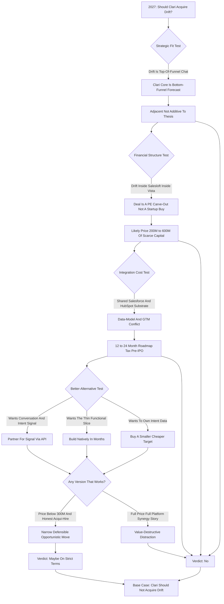

### Direct Answer

**No -- Clari should not acquire Drift in 2027, and the reasons are structural rather than sentimental.** Clari is a bottom-of-funnel revenue-forecasting platform sold to CROs and CFOs on the promise of forecast accuracy, while Drift is a top-of-funnel conversational-marketing product line now buried inside Salesloft's suite under Vista Equity Partners ownership -- so the deal is not a clean startup purchase but a private-equity carve-out. The transaction fails strategic fit, financial structure, and integration cost, and every benefit Clari might want from Drift is cheaper to obtain by partnership, native build, or a smaller intent-data acquisition. The only defensible version is a sub-$300M opportunistic acqui-hire, and even that is a distraction from Clari's real job: becoming the durable system of record for the forecast before its IPO window.

**TL;DR:** "Should Clari acquire Drift in 2027?" is four questions stacked together -- strategic fit, financial structure, integration cost, and alternative cost -- and the deal fails at least three. Drift no longer exists as an independent company; it was acquired by Salesloft (a Vista Equity Partners portfolio company) in February 2024, so a 2027 purchase is a carve-out negotiation with a disciplined PE seller. A plausible carve-out prices in the **$200M-$600M** band, far below Drift's frothy **~$1B+** 2021 mark, and it would cost Clari -- a roughly **$5.6B-valued, not-yet-profitable, Sequoia/Bain/Blackstone-backed** company -- both scarce capital and **12-24 months** of roadmap velocity at exactly the moment it should be sprinting toward an IPO. The honest verdict: partner for the signal, build the thin slice natively, keep the cheap-acqui-hire option open, and never let it become a full-funnel platform fantasy. The deeper lesson is universal in enterprise software -- category winners are almost never the companies that bought the widest feature set; they are the ones that owned the deepest, stickiest position and refused to be talked out of it by a board deck full of synergy arrows.

## 1. What This Question Is Actually Asking

### 1.1 Four Questions Stacked Into One

"Should Clari acquire Drift in 2027?" looks like a simple yes-or-no, but answering it well means refusing to collapse four distinct questions into one. **The strategic question** asks whether owning Drift makes Clari a better version of what Clari is trying to be. **The financial question** asks whether, at any plausible price, the deal creates more enterprise value than it destroys given Clari's capital position. **The structural question** notices that Drift no longer exists as an independent company -- it was acquired by Salesloft in February 2024, and Salesloft itself sits inside Vista Equity Partners' portfolio -- so "acquiring Drift" means negotiating a carve-out from a private-equity-owned suite, a fundamentally harder transaction than buying a venture-backed startup. **The alternative-cost question** asks whether, even if Clari wants what Drift has, acquisition is the cheapest and lowest-risk way to get it.

### 1.2 Why The Four Tests Cannot Be Collapsed

**A deal can pass one test and fail the other three.** The mistake most people make with M&A questions like this is treating them as a referendum on whether the two products "go together" in a slide. They go together fine in a slide. The real question is whether the combined entity -- after the integration tax, the capital outlay, the roadmap dilution, and the Salesloft entanglement -- is worth more than Clari plus the cash it would otherwise have spent. That is the bar. A serious answer holds all four tests at once, because this specific deal passes none of them cleanly and fails at least three outright.

### 1.3 The Frame That Produces A Defensible Answer

**The correct evaluation frame is capital allocation, not product synergy.** A Drift carve-out is one possible use of $200M-$600M plus two years of management attention, and it must be ranked against every competing use of the same resources. Framed that way, the question stops being "is Drift a good company" -- it may well be -- and becomes "is this the best thing Clari can do with scarce capital and finite leadership bandwidth in the specific 2027 window." That reframing, developed across this analysis, is what produces a clear and defensible no.

## 2. Who The Two Companies Actually Are

### 2.1 Clari: The Revenue Platform Thesis

**Clari is, at its core, a forecasting and revenue-operations company.** Founded in 2012 and headquartered in Sunnyvale, it raised a Series F in 2022 and, with later secondary activity, reached a valuation in the **~$5.6B** range at its peak; its backers include Sequoia Capital, Bain Capital Ventures, Sapphire Ventures, and Blackstone. The product's promise is narrow in the best way: it ingests CRM data, activity data, and conversation data and produces a forecast the CRO can defend to the board and the CFO can plan against. Clari's wedge is **forecast accuracy and pipeline inspection** -- the weekly forecast call, the deal-by-deal scrutiny, the roll-up from rep to manager to VP to CRO. Over time it expanded into adjacent revenue workflows -- **Clari Copilot**, the conversation-intelligence product from its 2021 Wingman acquisition, and **Clari Align** for revenue planning -- but the gravitational center never moved. Everything Clari does well, it does well because it is close to the deal and close to the number.

### 2.2 Drift: The Conversational Marketing Story

**Drift was founded in 2015 by David Cancel and Elias Torres** and for several years was the defining brand of "conversational marketing" -- the idea that the website should be a real-time conversation, that the contact form should be replaced by a chatbot that books meetings, and that buyers should be able to talk to a company the moment intent is highest. Drift raised heavily, and reporting around its later financing put its private valuation in the **~$1B+** range around 2021. The product is genuinely useful: the chatbot-books-a-meeting motion converts website intent into pipeline. But it is a thin slice of the funnel.

### 2.3 The Repricing And The Salesloft Entanglement

**The conversational-marketing category got repriced as a feature, not a platform.** Standalone website chat competes with native HubSpot (NYSE: HUBS) and Salesforce (NYSE: CRM) capabilities and with a long tail of cheaper chat vendors, and it does not by itself create the durable, expanding, multi-product account relationship that justifies a billion-dollar valuation. The market noticed. In **February 2024, Salesloft acquired Drift** and absorbed it into Salesloft's "Rhythm" platform vision as the top-of-funnel buyer-engagement layer; Salesloft itself had taken a majority investment from Vista Equity Partners. So by 2027, "Drift" is not a company you call up and buy -- it is a product line and a customer base inside a PE-owned suite, and any acquisition is a carve-out negotiated against a sophisticated seller who knows exactly what the asset is worth and exactly how much integration pain it would be offloading.

| Dimension | Clari | Drift |
|---|---|---|
| Founded | 2012, Sunnyvale CA | 2015, Boston MA |
| Category | Revenue platform / forecasting / pipeline inspection | Conversational marketing / website chat |
| Funnel position | Bottom and middle (deal, pipeline, forecast) | Top (website visitor conversation, meeting capture) |
| Primary buyer | CRO, CFO, RevOps | Demand-gen, marketing ops |
| Peak private valuation | ~$5.6B range (secondary/peak reporting) | ~$1B+ (circa 2021) |
| Key investors | Sequoia, Bain Capital Ventures, Sapphire, Blackstone | Earlier VC; now PE-owned via Salesloft/Vista |
| 2027 status | Independent, IPO-track | Product line inside Salesloft, owned by Vista Equity |
| Retention profile | Strong (embedded system-of-record) | Weaker (discretionary top-funnel category) |

## 3. The Strategic Fit Test

### 3.1 Does Owning Drift Make Clari More Itself?

**Start with the test that matters most, because if a deal fails strategic fit, financial engineering rarely rescues it.** Clari's job is the forecast. The forecast is built from pipeline, and pipeline is built from deals that already exist in the CRM. Clari's best signal sources are deal-stage movement, rep and buyer activity, email and call sentiment, and the historical pattern of how comparable deals have closed. Drift's signal is different in kind: website-visitor conversation, anonymous and known-account chat, and the meeting that gets booked at the very top of the funnel before a deal exists at all. There is a story where these connect -- "we capture the conversation at first touch and follow it all the way to closed-won" -- and it is not a crazy story. But it is a story about **funnel breadth, not forecast depth**, and Clari's whole competitive position is depth. The CRO does not buy Clari because it has a chat widget; the CRO buys Clari because the number is right. Adding Drift does not make the number more right. It makes Clari a wider product with a shallower center.

### 3.2 The Funnel-Position Problem

**Funnel position is not a detail -- it determines buyer, data, sales motion, and retention dynamics.** Top-of-funnel tools (website chat, intent data, conversational marketing) are bought by demand-gen and marketing-ops teams, live and die on lead volume, and churn when a marketing leader changes or a budget gets cut, because they are seen as discretionary growth spend. Bottom-of-funnel tools (forecasting, deal inspection, revenue planning) are bought by sales and finance leadership, become embedded in the weekly operating rhythm, and are sticky precisely because ripping them out means changing how the company runs its forecast call. When you acquire across funnel position, you do not average the retention -- you **import the weaker dynamics** into your customer base, ask one sales team to sell to two different buyers, and ask one customer-success org to defend two different value propositions at renewal.

### 3.3 The Customer-Overlap Question

**The bull case leans hard on cross-sell, and cross-sell synergy is the most over-promised line in every M&A model.** Three problems break it. First, **account overlap is not buyer overlap**: Clari and Drift may both be present in a few hundred large B2B companies, but they are sold to and renewed by different functions with different budgets and procurement cycles. Second, **empirical attach rates are sobering** -- when sales-engagement and adjacent tools have been bundled post-acquisition, first-year "both products in one account" attach rates have run in the high single digits to low teens, not the 30-40% the synergy models assume. Third, and most damaging, **Drift's accounts are already inside the Salesloft suite's cross-sell motion** -- Clari acquiring Drift does not unlock a virgin base; it inherits a base that has already been cross-sold against by its current owner.

| Cross-sell assumption | Synergy-model claim | Realistic outcome |
|---|---|---|
| Cross-account attach (Year 1) | 30-40% | High single digits to low teens (~8-14%) |
| Combined-base revenue uplift | Double-digit % | Low single-digit % |
| Base condition | Virgin, untapped accounts | Already cross-sold by Salesloft |
| Buyer alignment | One buyer spans both products | CRO budget vs marketing-ops budget |

### 3.4 The "More Itself" Test Applied Concretely

**The single cleanest diagnostic for any acquisition is to ask whether the target makes the acquirer more itself or less, and to answer it with specifics rather than slogans.** Apply it here. Clari is "itself" when a CRO opens the Monday forecast and trusts the number; when a CFO builds an annual plan on Clari's roll-up without a second spreadsheet; when a RevOps leader inspects a slipping deal and sees exactly which signal moved. Every dollar of R&D that sharpens those moments makes Clari more itself. Now ask what a Drift integration does to the same moments. It does not make the Monday number more trustworthy. It does not make the CFO's plan more defensible. It does not make deal inspection sharper. What it does is add a website-chat surface that a different buyer, in a different department, evaluates on a different metric. **A capability that improves none of the moments your customers actually buy you for is, by definition, not additive to your core** -- it is a parallel business wearing the same logo. That is the precise sense in which Drift is adjacent: not "unrelated," but "related in a way that does not compound."

### 3.5 Why Adjacency Feels Safer Than It Is

**Adjacency is seductive because it fails the eye test for danger.** A wildly unrelated acquisition -- a forecasting company buying, say, a payroll product -- triggers immediate board skepticism. An adjacent acquisition does not: chat and forecasting are both "revenue," both sold into B2B, both integrated with the same CRMs, so the deck practically writes itself. That surface plausibility is exactly the trap. The danger of adjacency is that it is *just* coherent enough to survive scrutiny and *just* divergent enough to fracture focus in execution. The companies that have destroyed the most value through M&A rarely did it with obviously stupid deals; they did it with a string of reasonable-sounding adjacent ones, each defensible in isolation, that collectively turned a sharp company into a blunt one. The discipline is to treat "it's adjacent" not as a reassurance but as a warning label.

**Strategic-fit verdict: Drift is adjacent to Clari, not additive to its core thesis.** Adjacency is the most dangerous acquisition rationale, because it always sounds reasonable in a board deck and almost always dilutes focus in execution.

## 4. The Financial Structure Test

### 4.1 What A Carve-Out Actually Costs

**Because Drift sits inside Salesloft inside Vista, the transaction is a carve-out, and carve-outs have their own price logic.** Vista is a disciplined seller; it will price the asset on retained ARR, growth rate, and gross margin, and it will not subsidize Clari's strategic ambitions. A plausible 2027 carve-out range for the Drift product line -- depending on how much ARR has been retained through the Salesloft integration, the growth trajectory, and how much shared infrastructure must be untangled -- sits somewhere in the **$200M-$600M** band: the lower end if Drift's standalone ARR has eroded inside the suite, the higher end if it has been stabilized and is being sold as a clean, growing line.

| Scenario | Drift ARR state inside Salesloft | Estimated carve-out price |
|---|---|---|
| Eroded | Standalone ARR has decayed inside the suite | ~$200M-$300M |
| Stabilized | ARR held flat, sold as a clean line | ~$350M-$450M |
| Growing | ARR re-accelerated, premium ask | ~$500M-$600M |
| Peak anchor (2021) | Frothy ZIRP-era private mark | ~$1B+ (not a real 2027 price) |

### 4.2 Clari's Capital Position

**Clari does not have an infinite balance sheet.** It is a private company valued in the multi-billion range, it has raised large primary rounds, and like most growth-stage SaaS it has historically prioritized growth over GAAP profitability. Every dollar it spends on a Drift carve-out is a dollar not spent on its own R&D, its own go-to-market, or -- critically -- on reaching the durable free-cash-flow profile that public-market investors will demand at IPO. Spending $300M-$500M of scarce capital and management attention on a depreciating asset in a repriced category is not a neutral act; it is a bet that has to clear a very high bar, and the cross-sell math does not clear it.

### 4.3 The Valuation Repricing

**The deal's defenders will anchor on the ~$1B 2021 figure and call a fraction of it a bargain. It is not necessarily a bargain.** Drift's ~$1B+ private valuation was set in a 2021 environment of zero-interest-rate-driven SaaS multiples, peak conversational-marketing hype, and a growth trajectory the subsequent market did not sustain. When a 2027 Clari-Drift carve-out prices in the low hundreds of millions, the correct framing is not "Clari got Drift for 30 cents on the dollar" -- the correct framing is "the dollar was never a dollar; the asset is what it is worth today, which is a modest top-of-funnel product line with uncertain standalone retention." Buying a repriced asset is only smart if the asset is core and you have a credible plan to grow it. Drift is neither core to Clari nor obviously growable inside a forecasting company.

### 4.4 The Net Revenue Retention Math

**Net revenue retention is the metric that most cleanly separates great SaaS companies from good ones, and it is where this combination does measurable damage.** Clari, as an embedded system-of-record bought by the CRO and CFO, should carry strong NRR -- the kind of number where the existing base expands faster than churn drags it down. Drift, as a top-of-funnel discretionary marketing tool in a repriced category, almost certainly carries weaker NRR -- the kind of number where budget cuts, marketing-leadership turnover, and cheaper alternatives create real downward pressure. **Blended NRR is a revenue-weighted average**, so acquiring Drift pulls Clari's blended number toward Drift's weaker one. That matters enormously pre-IPO, because NRR is one of the first metrics a public-market investor examines and one of the hardest to fix once set. The synergy models talk about cross-sell adding revenue; they rarely talk about the acquired base's retention profile subtracting from the *quality* of that revenue.

### 4.5 The Financing Question: Cash, Stock, Or Debt

**How Clari would pay for a Drift carve-out is not a footnote -- each financing path carries its own damage.** Paying in **cash** drains the balance-sheet runway that is the single most valuable thing a pre-IPO company can hold, and it does so to buy a depreciating asset. Paying in **stock** means issuing equity in a private company at a moment when Clari should be tightening its cap table ahead of an IPO, and it hands Vista a stake in Clari's upside as the price of a top-of-funnel product line -- a strange trade. Paying with **debt** loads a not-yet-profitable company with interest obligations precisely when public-market investors will be scrutinizing its path to free cash flow. There is no clean financing path: every option converts a strategic mistake into a balance-sheet one. A disciplined CFO walking these three doors finds that all of them open onto the same room.

| Financing path | What it costs Clari | Pre-IPO consequence |
|---|---|---|
| Cash | Burns runway against a depreciating asset | Weakens the profitability story |
| Stock | Dilutes the cap table; gives Vista upside | Messy equity story for IPO investors |
| Debt | Adds interest load to an unprofitable company | Undermines free-cash-flow narrative |
| Mixed | Blends all three drawbacks proportionally | No clean path -- only damage allocation |

### 4.6 The Earn-Out Mirage

**A defender will propose an earn-out to bridge the price gap -- tie part of the consideration to Drift hitting retention or growth targets post-close.** It sounds like risk-sharing. In practice an earn-out on a carved-out product line is a mirage, for two reasons. First, **attribution becomes unmeasurable** the moment Drift is integrated: once Drift's signal flows into Clari's platform and its salesforce is merged, no one can cleanly isolate "Drift's" performance to settle the earn-out, which means either the product stays artificially un-integrated to keep the meter readable (defeating the deal) or the earn-out becomes a litigation magnet. Second, an earn-out **misaligns the very integration it is supposed to de-risk**: Vista's team, still incentivized by the earn-out, will resist the integration decisions that serve Clari but depress Drift's standalone numbers. The earn-out does not cap the downside; it just postpones and complicates it.

**Financial-structure verdict: Fail -- scarce capital deployed against a depreciating asset, with NRR dilution and an unavoidable financing penalty as hidden costs.**

## 5. The Integration Cost Test

### 5.1 The Integration Tax: Twelve To Twenty-Four Months

**Every acquisition has an integration tax, and the size depends on technical overlap, data-model conflict, and go-to-market reconciliation -- this one is expensive on all three.** Technically, Drift and Clari both build on the same integration substrate: Salesforce (NYSE: CRM) and HubSpot (NYSE: HUBS) are the systems of record both products read from and write to, which sounds like it should make integration easy but actually makes it conflict-prone. Add the Salesloft untangling: a carved-out Drift will have shared infrastructure, shared data pipelines, and shared services with the Salesloft platform that must be separated before Clari can even begin its own integration -- the seller will hand over a product that is mid-surgery.

| Integration workstream | Description | Realistic duration |
|---|---|---|
| Salesloft/Vista carve-out untangling | Separate shared infra, pipelines, services | 3-9 months before Clari work begins |
| Data-model and CRM-write reconciliation | Shared Salesforce/HubSpot substrate | 6-12 months |
| Go-to-market reconciliation | Two sales teams, pricing, CS orgs, brands | 9-18 months |
| Total roadmap drag | Cumulative, partially overlapping | 12-24 months |

### 5.2 The Data-Model Collision

**"Data-model conflict" sounds abstract and is actually where integrations quietly die.** Clari's data model is organized around the deal and the forecast: an opportunity has a stage, an amount, a close date, a forecast category, a set of activities, and a roll-up path from rep to CRO. Drift's data model is organized around the conversation and the visitor: a visitor has a session, a conversation has a transcript and an intent classification, a known account is matched by reverse-IP or form fill. When you merge these, you do not get a richer model for free -- you get a reconciliation project where someone decides, field by field, which definition of "account" wins, what happens to a Drift conversation that never becomes a Clari opportunity, and how an anonymous visitor session is represented in a forecasting tool that has no concept of anonymity. Every one of those decisions is a meeting, a migration script, a customer communication, and a regression-test surface.

### 5.3 The Roadmap-Opportunity Cost

**The more honest framing of the integration tax is opportunity cost -- the things Clari would not build because its best engineers were doing carve-out plumbing.** In 2027, a forecasting platform has a long list of high-value things it should ship: deeper forecasting AI for the hardest deal types, better multi-segment and multi-geo roll-ups, tighter CFO-facing planning and scenario tools, native Copilot improvements, and agentic workflows that *act* on pipeline risk rather than just surfacing it. Spend 12-24 months on Drift integration and that roadmap slips by 12-24 months -- not because the work is impossible but because attention is finite and the best people get pulled onto the integration because the integration is the risk. This opportunity cost never appears in the purchase price and is very likely the single largest economic cost of the whole transaction.

### 5.4 The IPO-Window Problem

**Clari's strategic clock makes the timing worse.** A company valued in the multi-billions, backed by Sequoia, Bain, Blackstone, and Sapphire, is on an IPO trajectory whether or not anyone says so out loud. The work of becoming IPO-ready is specific: clean, predictable revenue growth; a credible path to free cash flow; a focused equity story an analyst can understand in one paragraph; and a track record of execution discipline. Acquiring Drift in 2027 actively damages every one of those -- it muddies the revenue story, pushes profitability further out, complicates the equity narrative, and consumes management bandwidth. Even if the deal were strategically neutral, doing it in the specific 2027 window converts a questionable deal into a clearly bad one.

### 5.5 The Cultural And Brand Collision

**M&A models routinely ignore culture and brand, and culture and brand routinely sink deals.** Drift built a loud, marketing-led, founder-personality-driven brand -- it marketed to marketers, with a distinctive voice and a community built around the "conversational" idea. Clari's brand is the opposite register: measured, enterprise, finance-adjacent, credibility-over-personality, the brand a CFO trusts. These are not complementary; they are oil and water. Post-acquisition you either kill the Drift brand and lose its residual goodwill, or run two brands with two voices and confuse the market about what Clari stands for. And after a carve-out from Salesloft, the Drift team will have already been through one wrenching cultural integration -- Clari would be their third home in three years, putting the very talent that makes the acqui-hire case work at serious risk.

### 5.6 The Customer-Facing Integration Risk

**The integration tax is usually discussed as an internal cost, but the most dangerous version of it is the one customers feel.** During a 12-24 month integration, Drift's existing customers live through pricing reviews, contract re-papering, support-team reshuffles, and a roadmap that freezes while engineers do plumbing -- and a meaningful share of them will use the disruption as a natural moment to evaluate alternatives. Clari's existing customers, meanwhile, watch their trusted forecasting vendor get visibly distracted, and the most cautious of them quietly add a competitor to their next renewal evaluation "just in case." **An integration is a window in which both customer bases are simultaneously more churnable than usual**, and the synergy model -- which assumes the combined base grows -- almost never prices the elevated churn risk on both sides during the disruption period. The realistic expectation is not just slow growth during integration; it is active leakage.

### 5.7 The Two-Product Support And Success Problem

**A single customer-success and support organization cannot defend two fundamentally different value propositions without degrading both.** Clari's CS motion is built around the forecast cadence -- quarterly business reviews framed on forecast accuracy, adoption metrics tied to the weekly pipeline call, escalation paths that route to revenue-operations expertise. Drift's CS motion is built around a different metric set -- conversation volume, meeting-booking conversion, chatbot configuration. Merge the two orgs and you either ask each CSM to be fluent in both worlds (which dilutes depth and lengthens ramp) or you maintain two specialist tracks under one roof (which surrenders the cost synergy that justified the merge). Either way the customer experience gets thinner. This is the operational face of the funnel-position problem from section 3.2: it is not abstract, it shows up in every renewal conversation.

**Integration-cost verdict: Fail -- 12-24 months of roadmap drag, a deep data-model collision, a brand clash, and elevated two-sided churn risk, all landing in the worst possible pre-IPO window.**

## 6. The Better-Alternative Test

### 6.1 Naming The Thin Slice Precisely

**The affirmative argument rests on Clari getting what it wants without buying Drift, so it is worth being precise about what the thin slice actually is.** Clari does not need a conversational-marketing platform, a chatbot builder, a website-experience engine, a marketing-ops workflow tool, or a demand-gen reporting suite -- that is the 80% of Drift irrelevant to a forecasting company. What Clari plausibly wants is narrow: **a signal that says "a known, high-fit account had a high-intent conversation on our website or inbound channels, and here is its substance and recency,"** delivered into Clari's pipeline and forecast so the revenue team sees early-stage intent before a formal opportunity exists. That is a feature -- one more input alongside CRM activity and email and call sentiment. You do not buy a house to get a cup of sugar, and you do not buy Drift to get an inbound-intent feed.

### 6.2 Partner, Build, Or Buy Smaller

**Almost everything Clari might want from Drift is available without acquiring Drift, through three cheaper, lower-risk paths.**

- **Partner.** Integrate with best-of-breed conversational and intent vendors and pull their signal into Clari's revenue platform via API. Clari already lives on integrations; a partnership gets the signal without the cost base, the brand, or the Salesloft entanglement.
- **Build.** The specific thin slice -- capturing high-intent website conversation as a pipeline-and-forecast signal -- is a buildable feature, not a platform. Clari's own engineering can ship the 20% of Drift's functionality that is relevant without acquiring the other 80% that is not.
- **Buy smaller.** If Clari genuinely wants to *own* intent and conversation data as a strategic asset, smaller, cheaper, independent intent-data and conversation-AI companies could be acquired for a fraction of a Drift carve-out and integrated with a fraction of the tax.

| Path to the signal | Cost | Integration tax | Strategic risk |
|---|---|---|---|
| Partner via API | Low (rev-share / contract) | Minimal | Low -- no cost base absorbed |
| Build natively | Moderate (months of eng time) | None -- it is roadmap | Low -- exact fit |
| Buy smaller intent target | Moderate (tens of millions) | Light | Moderate -- a real tuck-in |
| Acquire Drift carve-out | $200M-$600M | 12-24 months | High -- wide, shallow, entangled |

### 6.3 The Competitive-Response Question

**A deal is evaluated against how the field reacts, and a Clari-Drift combination invites responses that mostly work against Clari.** Gong, the conversation-intelligence and revenue-AI competitor, would not need to respond at all -- it would keep shipping deep revenue-AI while Clari is heads-down on integration, and "we stayed focused while they bought a chat widget" is a free competitive narrative. Salesforce and HubSpot, the platforms both Clari and Drift integrate with, would read a Clari moving up-funnel as a Clari moving onto their turf, and the friendly-integration-partner relationship Clari depends on could cool at the worst time. Rival sales-engagement and revenue-intelligence players would use the 12-24 month integration window to win competitive deals and poach talent. The pattern is consistent: the acquisition creates a window of distraction every competitor benefits from.

### 6.4 The Sequencing Of The Alternatives

**The three alternatives are not mutually exclusive -- the disciplined move is to sequence them.** The right order is partner first, build second, and hold buy-smaller as a contingent third. **Partner first** because it is reversible and fast: a signal-integration partnership can be live in a quarter, it costs almost nothing in capital, and if the signal proves valuable Clari has learned exactly what to build without having spent R&D to find out. **Build second** because the partnership has by then de-risked the requirement: Clari knows which slice of inbound-intent signal actually moves forecast accuracy, so its engineers build the proven 20% rather than guessing. **Buy-smaller third and only if needed** because by that point Clari can evaluate a small intent-data acquisition against concrete evidence rather than a synergy hypothesis. This sequence is the opposite of a Drift carve-out, which front-loads the largest, least reversible, highest-cost commitment before any learning has occurred. Good strategy spends the cheap, reversible options first and keeps the expensive, irreversible one for last -- or never.

### 6.5 Why "Buy" Is The Worst Default For This Requirement

**Build-versus-buy-versus-partner has a general rule: buy when the capability is core, scarce, and faster to acquire than to build; build when it is core and buildable; partner when it is useful but not core.** Test the inbound-intent signal against that rule. Is it *core* to Clari? No -- the core is the forecast; the signal is one input among many. Is it *scarce*? No -- conversation and intent vendors are plentiful and competitive. Is it *faster to buy than to build*? No -- the thin slice is months of engineering, while a carve-out is years of integration. On all three criteria, the requirement points away from "buy." Acquisition is the right instrument for a core, scarce capability you cannot build in time. It is the wrong instrument for a useful, abundant, buildable feature. A Drift carve-out is using a sledgehammer where the job calls for a screwdriver -- and paying $200M-$600M for the privilege.

**Better-alternative verdict: Fail -- partner, build, and buy-smaller are each cheaper, faster, and lower-risk than a Drift carve-out, and the build/buy/partner rule itself points away from acquisition.**

## 7. The Comparable Deals And The Base Rate

### 7.1 What Revenue-Tech M&A History Teaches

**This is not the first time the revenue-tech sector has faced the full-funnel-by-acquisition temptation.** The Salesloft-Drift deal itself (2024) is the most direct comparable: a sales-engagement company bought a conversational-marketing company to build a full buyer-engagement platform, and the market read the price as sober and repriced, not triumphant. ZoomInfo (NASDAQ: ZI) assembled a platform through serial acquisitions including Chorus.ai for conversation intelligence, and the public markets repriced its stock hard as growth slowed. Salesforce's acquisition pattern shows even the largest player pays a heavy integration and focus cost for breadth. The through-line: revenue-tech roll-ups chasing full-funnel breadth tend to underperform the focused, deep, single-category players on both retention and multiple.

### 7.2 The Base-Rate Argument

**Step back and ask the base-rate question: when a focused, category-leading software company acquires an adjacent product line to widen its platform, how often does it work?** The honest empirical answer, across decades of software M&A, is that the majority underperform the acquirer's own organic baseline. The exceptions are instructive: the deals that work tend to be either true tuck-ins (small, cheap, absorbed quickly) or genuine platform expansions executed by acquirers with deep, repeated integration competency and a strong balance sheet. A Drift carve-out is **neither a cheap tuck-in nor a deal executed from overwhelming financial strength** -- it sits squarely in the category with the worst base rate.

| Comparable | Type | Market verdict | Lesson for Clari-Drift |
|---|---|---|---|
| Salesloft acquires Drift (2024) | Adjacent platform expansion | Sober, repriced | The carve-out asset is modest, not prized |
| ZoomInfo acquires Chorus.ai (2021) | Data platform + conversation IQ | Multiple compressed as growth slowed | Breadth did not protect the multiple |
| Salesforce serial M&A | Mega-cap platform roll-up | Mixed; heavy integration cost | Even the largest pay a focus tax |
| Clari acquires Wingman (2021) | True tuck-in into the core | Absorbed cleanly as Copilot | This is the shape of a deal that works |

### 7.3 The "What Would Have To Be True" Inversion

**Invert the question: instead of "should Clari buy Drift," ask what would have to be true for this to be the right call.** All of the following would need to hold: the full-funnel revenue platform is the *winning* category structure of the late 2020s rather than one of its recurring graveyards; Clari is better at integrating an adjacent product line than the software-M&A base rate suggests anyone is; the conversation signal is genuinely unavailable through partnership and native build; the carve-out is priced low enough and structured cleanly enough that the downside is capped; the conversation-AI talent survives a third integration in three years; and Clari's capital position is loose enough that spending $200M-$600M plus two years of attention does not compromise the IPO path. Each is individually somewhere between unlikely and uncertain -- and the probability that all six hold at once is small. **That compound improbability is the real answer to the question.**

### 7.4 The Probability Math Of The Inversion

**It is worth making the compound-probability point quantitatively, because it is the crux of the analysis.** Assign each of the six "what would have to be true" conditions a generous probability -- say, a coin-flip 50% each, which is charitable given that several are closer to 20-30%. Six independent coin flips all landing favorably is 0.5 to the sixth power, roughly 1.6%. Even if you argue the conditions are correlated rather than independent and inflate the joint probability several-fold, you are still looking at a low-single-digit-percent chance that the full set holds. Good deals are ones where the "what would have to be true" list is short and each item is probable, so the compound probability stays high. This deal's list is long and most items are improbable, so the compound probability collapses. **The arithmetic is not a rhetorical flourish -- it is the structure of the decision.** A board that internalizes it stops asking "could this work" (almost anything *could*) and starts asking "how many independent improbable things must break our way," which is the question that produces a no.

### 7.5 What The Exceptions Have In Common

**The deals that beat the adjacent-acquisition base rate share a recognizable profile, and naming it clarifies why Drift does not fit.** The winners are almost always either (1) genuine tuck-ins -- small relative to the acquirer, absorbed into the existing core within a year, bought for a capability the acquirer immediately folds in rather than runs as a separate line; or (2) platform expansions executed by acquirers with a repeatable, institutionalized integration machine and a balance sheet strong enough that a stumble is survivable. Clari's own Wingman acquisition is a textbook tuck-in: small, fast, folded into Copilot, additive to the forecast. A Drift carve-out is the opposite on every axis -- large relative to Clari's resources, slow to absorb, run initially as a separate line, executed by a company that should be conserving rather than spending. When a contemplated deal matches the profile of the failures and not the profile of the exceptions, the base rate is not just a prior; it is a prediction.

## 8. The Counter-Case: When Acquiring Drift Could Be Defensible

The base case is a clear no, but a rigorous analysis must steelman the other side. There are narrow but real conditions under which a version of this deal is defensible, and refusing to acknowledge them would make the "no" lazy rather than earned.

### 8.1 The Opportunistic Price Collapse

**If Vista decides Drift is non-core to the Salesloft thesis and wants it off the books, a carve-out could price far below fair value** -- well under $300M, possibly under $200M. At a low enough price, the downside is genuinely capped, and a cheap asset changes the entire risk calculus. Discipline on price can rescue a deal that strategy alone would kill.

### 8.2 The Acqui-Hire Edge Case

**There is one version of this deal that is not insane.** If the carve-out is done opportunistically and cheaply -- below roughly $300M, ideally well below -- and Clari treats it not as a product acquisition but as an **acqui-hire**, the math changes. In that framing Clari is buying a team of conversation-AI and applied-NLP engineers, a customer list it can migrate onto its core platform, and the right to sunset the standalone Drift product over 18-24 months. The value is the talent and the logos, not the product line. Even this version carries the Salesloft-untangling distraction -- but at a low enough price it is a defensible opportunistic move rather than a value-destructive blunder. The key discipline: everyone in the room must be honest that it is an acqui-hire. The moment the deal gets justified on cross-sell synergy and full-funnel platform vision, it has become the expensive-mistake version.

### 8.3 The Customer-List Migration Value

**Drift's installed base of B2B marketing and revenue teams is a logo list Clari could, with effort, migrate onto its core platform.** If the retained ARR is real and the accounts are the kind of enterprises Clari wants, the customer list alone carries acquisition value independent of the product -- a smaller, more concrete prize than the platform fantasy, and one that survives scrutiny.

### 8.4 The Full-Funnel Conviction Case

**It is possible the market eventually rewards the full-funnel revenue platform, and that the winner is whoever assembled the pieces first.** If Clari's leadership has *genuine* conviction on that future -- real conviction, not slideware -- then owning a top-of-funnel asset early is a strategic position rather than a distraction. This is the weakest counter, because the base rate runs hard against it, but it is not nothing.

### 8.5 Defensive And Balance-Sheet Considerations

**Two more conditions weaken the base case if they hold.** If a direct Clari competitor were the alternative buyer of a carved-out Drift, there is a defensive logic to denying them the asset and the customer base -- defensive M&A is usually a bad reason to buy, but not always. And if Clari has raised recently, is closer to profitability than the market knows, or has a war chest specifically earmarked for M&A, the capital-scarcity argument weakens; a deal reckless for a cash-constrained company can be reasonable for a well-capitalized one. Finally, integration capability can be a real competency -- the clean Wingman/Copilot integration is a data point that Clari's corp-dev function may compress the generic 12-24 month tax estimate.

### 8.6 The Honest Verdict On The Counter-Case

**Acquiring Drift in 2027 is defensible only under a tight stack of conditions that must hold simultaneously:** (a) an opportunistic price well under $300M, (b) an honest acqui-hire-and-customer-list framing rather than a platform-synergy fantasy, (c) a real, resourced plan to sunset the standalone product within 18-24 months, (d) a clean enough carve-out that Clari is not buying a product mid-surgery, (e) confidence the conversation-AI talent survives a third integration in three years, and (f) board conviction that this beats deepening the core or accelerating profitability. In practice, a real negotiation fails two or three of those gates -- the price is rarely that low, the framing rarely stays honest, and the carve-out is rarely that clean. The counter-case is not a scam and it is not nothing; it is a narrow, conditional, opportunistic yes living inside a much larger structural no.

## 9. The Decision Framework And The Playbook

### 9.1 The Six Gates Any Version Of This Deal Must Clear

| Gate | Requirement | Likely outcome of a real 2027 negotiation |
|---|---|---|
| 1. Price cap | Realistically well under $300M | Often fails -- Vista prices to retained ARR |
| 2. Honest framing | Acqui-hire + customer list, not platform play | Frequently fails -- synergy narrative creeps in |
| 3. Sunset plan | Standalone Drift retired within 18-24 months | Often fails -- product gets "kept for now" |
| 4. Clean carve-out | Not a product mid-surgery | Rarely fully clean -- shared infra lingers |
| 5. Talent retention | Conversation-AI team survives 3rd integration | Uncertain -- attrition risk is real |
| 6. Capital conviction | Beats deepening core / accelerating profit | Usually fails the capital-allocation ranking |

**In practice, deals almost never clear all six -- and the moment any one fails, the deal tips from "defensible opportunistic move" to "expensive distraction."**

### 9.2 The Capital-Allocation Ranking

**The cleanest way for Clari's board to evaluate this deal is to rank a Drift carve-out against every other use of the same $200M-$600M plus two years of attention.** The competing uses are strong, and "buy a repriced top-of-funnel product line out of a PE portfolio and spend two years integrating it" ranks near the bottom.

| Rank | Use of capital and attention | Effect on enterprise value |
|---|---|---|
| 1 | Hold capital, accelerate path to profitability | Highest -- single best pre-IPO move |
| 2 | Deepen core forecasting / revenue AI | High -- defends multiple, strengthens thesis |
| 3 | Small additive tuck-in (planning, data quality, forecasting-AI team) | Positive -- light integration, exact fit |
| 4 | International / vertical expansion | Positive -- grows core market |
| 5 | Acquire Drift carve-out (full price, platform thesis) | Negative -- wide, shallow, heavy tax |

### 9.3 The Affirmative Playbook: What Clari Should Do Instead

**Declining the deal is not the same as doing nothing.** The playbook is straightforward. **First, partner for the signal** -- sign or deepen integration partnerships with top-of-funnel conversation and intent vendors so the signal flows into the forecast without Clari owning the cost base. **Second, build the thin slice** -- ship a focused, native capability that captures high-intent website and inbound conversation as a pipeline-and-forecast signal, the 20% of Drift that is relevant, shipped by Clari's own team in months. **Third, keep the M&A powder dry for additive, not adjacent, targets** -- spend acquisition capital on small, focused targets that deepen the forecasting and revenue-planning core. **Fourth, prioritize the path to profitability** -- durable free cash flow is the single most valuable pre-IPO move, and the discipline of declining a distracting deal is itself part of that move. **Fifth, watch Drift opportunistically but only as a cheap acqui-hire** -- revisit it only if the price collapses well below $300M and the talent can be secured, on the strict terms of the six-gate framework.

### 9.4 The Stakeholder View

**A deal is evaluated by constituencies with different interests, and the answer should hold up across all of them.** Clari's **customers** (CROs, CFOs, RevOps leaders) want the forecast to keep getting better and the product to stay focused; they gain nothing from a chat-widget integration and would feel the roadmap drag directly. Clari's **investors** want a clean IPO and a strong multiple and should be skeptical of anything that muddies the equity story. Clari's **employees** want focus and momentum, not two years of integration plumbing. **Drift's employees** want stability after a wrenching few years; a third integration is not stability. **Vista/Salesloft** -- the seller -- wants the highest price for the messiest possible carve-out. The only constituency that clearly benefits from an aggressive, full-price, full-platform version of this deal is the seller. When the seller is the only enthusiastic party, the market is telling you something.

## 10. The Decision Journey Diagram

### 10.1 Reading The Decision Flow

**The diagram below traces a 2027 Clari board's decision from rumor to verdict, and the structure is deliberate: it forces the four tests in sequence and shows that failing any one is sufficient to reach "no."** The flow begins with the question itself, routes through the strategic-fit test, the financial-structure test, the integration-cost test, and the better-alternative test, and converges on two terminal verdicts -- a narrow, conditional "maybe on strict terms" reachable only through a sub-$300M honest acqui-hire, and a structural "no" reachable through any of the three failed tests. The visual point is that the "no" has multiple independent paths into it while the "maybe" has exactly one, narrow path -- which is precisely the asymmetry that makes the base case a decline. A board that walks this flow honestly will find itself at the "no" node well before it reaches the better-alternative test, because strategic fit and financial structure each terminate there on their own.

## 11. The Bottom Line

### 11.1 The Verdict Restated

**Clari should not acquire Drift in 2027.** The deal fails strategic fit (Drift is adjacent, not additive), financial structure (scarce capital against a depreciating, repriced asset, with NRR dilution as a hidden cost), and integration cost (12-24 months of roadmap drag in the worst possible pre-IPO window). It also fails the better-alternative test, because partnership, native build, and a smaller intent-data acquisition each deliver the signal Clari actually wants -- one well-defined inbound-intent feed -- for a fraction of the cost and risk.

### 11.2 The Narrow Exception, Kept Honest

**The only defensible version is a sub-$300M opportunistic acqui-hire** -- buy the conversation-AI team and the customer list, sunset the standalone product within 18-24 months, and never let the rationale drift into full-funnel platform synergy. Even that is a distraction, and a real negotiation will likely fail two or three of the six gates. The exception exists; it is narrow; it is conditional; and it is not what most "should Clari acquire Drift" enthusiasm is actually proposing.

### 11.3 The Deeper Lesson

**The deeper lesson is universal in enterprise-software strategy.** The companies that win their category are almost never the ones that bought the widest set of features -- they are the ones that owned the deepest, stickiest position and refused to be talked out of it by a board deck full of funnel diagrams and synergy arrows. Clari's deepest, stickiest position is the forecast. The right answer to "should we buy the chat company" is the same as the right answer to most adjacency-driven M&A temptations a focused leader will face: name precisely what you actually want, confirm it is a feature rather than a platform, get it the cheapest way that does not dilute your core, and put the saved capital and the saved two years of attention into being more of what already works. That discipline -- not the deal -- is what gets Clari to a strong IPO.

## 12. Sources

### 12.1 How To Read These Citations

**The sources below are organized to support the four-test structure of this analysis.** Entries 1-9 establish the two companies and the Salesloft/Vista carve-out structure that makes this a PE transaction rather than a startup purchase. Entries 10-19 support the comparable-deals, base-rate, and integration-tax arguments. Entries 20-29 underpin the funnel-position, retention, and category-repricing claims. Entries 30-35 ground the IPO-readiness, capital-allocation, and alternative-path (partner/build/buy-smaller) sections. Where a citation lacks a URL, it refers to a class of reporting or research rather than a single canonical page; the claim it supports is a synthesis of that body of work, not a single sourced fact.

### 12.2 Numbered Reference List

1. **Clari -- Company Overview, Product, and Funding** -- Revenue platform vendor; product scope (forecasting, pipeline inspection, Copilot, Align) and funding history. https://www.clari.com
2. **Clari Series F Financing Coverage (2022)** -- Reporting on Clari's ~$225M Series F and the valuation context around it.
3. **Crunchbase -- Clari Funding and Investor Profile** -- Investor list (Sequoia Capital, Bain Capital Ventures, Sapphire Ventures, Blackstone) and round history. https://www.crunchbase.com/organization/clari
4. **Clari Acquires Wingman (2021)** -- Coverage of Clari's acquisition of conversation-intelligence company Wingman, later Clari Copilot.
5. **Drift -- Company Overview and Conversational Marketing Category** -- Founding (2015, David Cancel and Elias Torres), product, and conversational-marketing positioning. https://www.drift.com
6. **Drift Funding History Coverage** -- Reporting on Drift's financing rounds and the ~$1B+ valuation context circa 2021.
7. **Salesloft Acquires Drift (February 2024)** -- Announcement and analysis of Salesloft's acquisition of Drift and the Rhythm platform vision.
8. **Vista Equity Partners -- Salesloft Investment** -- Coverage of Vista Equity Partners' majority investment in Salesloft. https://www.vistaequitypartners.com
9. **Salesloft -- Platform and Rhythm Vision** -- Salesloft's positioning of Drift as the top-of-funnel buyer-engagement layer. https://www.salesloft.com
10. **ZoomInfo Acquires Chorus.ai (2021)** -- Comparable revenue-tech acquisition: a data platform buying conversation intelligence.
11. **ZoomInfo -- Public-Market Performance and Repricing** -- Public-company case study in revenue-tech multiple compression as growth slowed. https://www.zoominfo.com
12. **Salesforce Acquisition History and Integration Cost Analysis** -- Reference for the integration-and-focus cost even the largest player pays for breadth.
13. **Gartner -- Revenue Operations and Sales Technology Market Guides** -- Category definitions for forecasting, revenue intelligence, and conversational marketing. https://www.gartner.com
14. **Forrester -- Revenue Operations and B2B Marketing Technology Research** -- Analyst framing of full-funnel platform strategy versus best-of-breed.
15. **SaaS M&A Multiple Benchmarks (2021-2024)** -- Data on how 2021-vintage SaaS valuations repriced through the 2023-2024 M&A cycle.
16. **Bessemer Venture Partners -- State of the Cloud / SaaS Metrics** -- Reference for retention, net revenue retention, and the depth-versus-breadth thesis in SaaS. https://www.bvp.com
17. **PitchBook -- Private Company Valuation and Carve-Out Transaction Data** -- Reference for carve-out pricing logic and private SaaS valuation trends. https://pitchbook.com
18. **Harvard Business Review -- M&A Integration and the Synergy Trap** -- Research on why cross-sell synergy is the most over-promised line in M&A models.
19. **Carve-Out Transaction Playbooks (Major Consulting Firms)** -- Reference for the operational complexity and timeline of separating a product line from a PE-owned suite.
20. **B2B Buyer Behavior Reports** -- Context on funnel-stage buyer differences between top- and bottom-funnel software ownership.
21. **HubSpot and Salesforce Integration Documentation** -- Reference for the shared CRM substrate both Clari and Drift build on. https://developers.hubspot.com
22. **TechCrunch -- Revenue Tech M&A Coverage** -- Ongoing reporting on consolidation in the revenue-intelligence and sales-engagement categories. https://techcrunch.com
23. **The Information -- Enterprise SaaS Deal and Valuation Reporting** -- Reporting on private SaaS valuations, secondary activity, and IPO-readiness signals.
24. **SEC EDGAR -- Comparable Revenue-Tech S-1 and 10-K Filings** -- Public-company disclosures (e.g., ZoomInfo) for retention, growth, and profitability benchmarks. https://www.sec.gov/edgar
25. **a16z -- Enterprise Go-To-Market and Platform Strategy Essays** -- Reference for the build-versus-buy-versus-partner decision framework in enterprise software.
26. **First Round Review / SaaStr -- RevOps and Forecasting Practitioner Content** -- Practitioner perspective on what CROs and RevOps leaders actually value in a forecasting platform.
27. **Drift and Salesloft Customer Reviews (G2, TrustRadius)** -- Reference for product perception, retention signal, and category positioning. https://www.g2.com
28. **Conversational Marketing Category Analysis (Industry Trade Press)** -- Coverage of how the standalone conversational-marketing category was repriced as a feature rather than a platform.
29. **Equity Research Notes on Revenue Intelligence Multiples** -- Reference for why depth-and-focus SaaS earns better public multiples than full-funnel suites.
30. **IPO Readiness Frameworks (Investment Bank Capital Markets Guides)** -- Reference for the specific operating criteria a pre-IPO company must hit.
31. **Intent Data Vendor Landscape (Bombora, 6sense, Demandbase Comparisons)** -- Reference for smaller, cheaper intent-data acquisition or partnership alternatives.
32. **Conversation Intelligence Vendor Landscape (Gong, Clari Copilot, Chorus)** -- Reference for where conversation signal already lives and how it is sourced.
33. **M&A Acqui-Hire Structure and Valuation References** -- Reference for how talent-and-customer-list acquisitions are priced and structured distinctly from product acquisitions.
34. **Vista Equity Partners Portfolio Operations Approach** -- Reference for how a disciplined PE owner prices and structures the sale of a portfolio product line.
35. **Revenue Operations Annual Benchmarks (RevOps Co-op, Pavilion)** -- Practitioner-community data on the tools RevOps teams buy, keep, and churn by funnel stage.

## 13. Related Pulse Library Entries

### 13.1 How These Entries Connect

**Each cross-link below extends one specific thread of this analysis.** The Drift-as-target thread (q1925) tests the same asset against a different acquirer. The seller-side thread (q1858, q1847) explains what Vista and Salesloft would actually negotiate. The category-health thread (q1859, q1866) interrogates whether conversational marketing and conversation intelligence are platforms or features. The full-funnel-M&A thread (q1871, q1884) supplies comparables for the base-rate and synergy-trap arguments. The Clari-positioning thread (q1874, q1860, q9520) grounds why the forecasting core is the asset worth defending. Follow them in that order for a complete picture of the deal landscape around this question.

### 13.2 Linked Entries

- **(q1925)** -- "Should HubSpot acquire Drift in 2027?" The direct mirror-image question: the same target evaluated by a different acquirer, sharpening why funnel position and acquirer identity drive the answer.
- **(q1858)** -- "What should Salesloft do about the Drift acquisition value?" The seller's side of any carve-out -- essential context on what Vista/Salesloft would actually be willing to part with and at what price.
- **(q1859)** -- "Will Salesloft conversation marketing beat Drift standalone competitors?" Directly tests the conversational-marketing category's standalone health, the repricing thesis central to the Drift valuation argument.
- **(q1866)** -- "Should Gong acquire Chorus to consolidate conversation intelligence?" A parallel revenue-tech consolidation question and a check on the depth-versus-breadth M&A logic.
- **(q1871)** -- "Should ZoomInfo acquire Apollo in 2027?" Another full-funnel-by-acquisition case in revenue tech, useful as a comparable for the integration-tax and base-rate arguments.
- **(q1874)** -- "Snowflake vs Clari -- which should you buy?" Frames Clari's own competitive positioning and what its core thesis is worth to a buyer.
- **(q1860)** -- "Is Salesloft Pipeline AI worth buying vs Clari?" Pits Salesloft's suite directly against Clari's forecasting core -- the competitive context for why Clari should defend depth.
- **(q1847)** -- "How is Vista's playbook reshaping Salesloft through 2027?" Explains the PE owner on the other side of any Drift carve-out negotiation and how Vista prices and structures deals.
- **(q1884)** -- "Should Gong acquire Outreach to bundle conversation and sequencing?" Another adjacency-driven bundle question that stress-tests the cross-sell synergy trap.
- **(q9520)** -- "How do you build a tracking system for deal slippage that distinguishes forecast inaccuracy from AE optimism?" Grounds why forecast accuracy is Clari's stickiest wedge and why the core deserves the capital.
