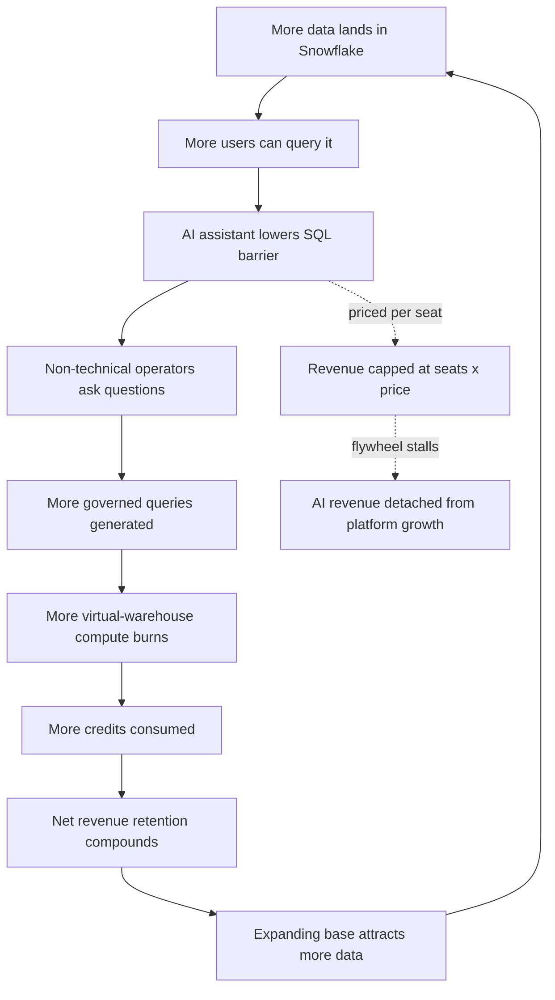

### Direct Answer

Snowflake should price its AI assistant as a **consumption-metered, credit-denominated add-on that rides the existing Snowflake billing relationship** — not as a per-seat SaaS line priced to match a standalone "Snowflake equivalent" such as a generic text-to-SQL tool or a BI copilot. Meter the assistant in Snowflake credits so it feels like normal platform usage the customer already trusts and forecasts; anchor the price to **analyst-hour replacement and faster time-to-insight** rather than to a competitor's sticker; and set the all-in cost **30-55% below a third-party "equivalent" stack** while keeping a clear premium over raw SQL. The single biggest mistake is treating this as a pricing-match exercise against a point solution — the durable advantage is data context the platform already owns, and the pricing model has to express that advantage instead of competing it away.

> **TL;DR**
> - **Billing unit:** Snowflake credits, not seats. The assistant consumes credits the same way a query consumes compute — usage that the customer already forecasts, governs, and trusts.
> - **The two anchors:** Anchor UP to analyst-hour replacement ($55-$95/loaded hour) for the value story; anchor DOWN to a standalone "equivalent" stack only to set the ceiling, never the price.
> - **Price band:** $0.02-$0.08 effective cost per natural-language question at the consumption layer; optional $25K-$150K/year platform fee on larger accounts for governance and semantic-model curation.
> - **The discipline:** Keep the assistant 30-55% below an assembled third-party equivalent and 20-40% cheaper when attached to existing Snowflake compute than bought separately.
> - **The three killers:** (1) flat per-seat pricing that detaches from usage, (2) anchoring to a competitor and getting dragged into a discount war, (3) making AI "free" and destroying core compute margin visibility.
> - **The counter-case:** Metered pricing can suppress adoption and trigger bill-shock; the honest answer is a hybrid with a generous free tier, hard spend caps, and an optional committed-credit plan — not pure metering.

---

## 1. Banner: What "Pricing The AI Assistant" Actually Means

### 1.1 The Question Is Really Three Questions Stacked

When a Snowflake (SNOW) product leader asks "how should we price the AI assistant against the Snowflake equivalent," the question sounds like one decision and is actually three, and conflating them is the root cause of most bad AI add-on pricing.

The **AI assistant** here is the natural-language, data-context layer that sits on top of the warehouse — the capability that lets an analyst, a RevOps manager, or a non-technical operator ask a question in plain English ("what was net revenue retention by segment last quarter, and which accounts dragged it down?") and get a governed, accurate answer drawn from the customer's own data. In Snowflake's product line this is the Cortex family — Cortex Analyst for text-to-SQL over a semantic model, Cortex Search for retrieval, and the broader Cortex AI surface. The "Snowflake equivalent" is whatever the customer would buy or build instead: a standalone text-to-SQL tool, a BI copilot bolted onto an existing dashboard product, an LLM-plus-connector assembled in-house, or a competing platform's native assistant.

The three stacked questions:

| Sub-question | What it decides | The wrong default | The right default |
|---|---|---|---|
| **What unit do you bill?** | Seats, queries, tokens, or Snowflake credits | Per-seat, because the sales team finds it easy to quote | Credits — the unit the platform already meters |
| **What do you anchor against?** | Competitor sticker, human-analyst cost, or existing Snowflake spend | The standalone competitor's price | Analyst-hour replacement (up) and existing spend (sizing) |
| **How do you protect the core?** | Compute-and-storage margin under AI load | Make the assistant "free" to drive adoption | Keep AI metered and visible; never bury compute margin |

Every section below works one of these three threads. Get the unit right and per-seat churn disappears. Get the anchor right and the discount war never starts. Get the margin protection right and AI revenue is additive instead of cannibalizing.

### 1.2 Why The Billing Unit Is The Whole Game

The billing unit is not a packaging detail — it is the single decision that determines whether the assistant compounds with the platform or fights it. Snowflake's entire commercial model is **consumption**: customers buy credits, credits are burned by compute (virtual warehouses) and certain serverless features, and the customer forecasts, governs, and reconciles credit spend through tools they already operate. A finance team at a Snowflake account has a credit budget, an alerting threshold, and a quarterly true-up conversation.

If the AI assistant is priced in credits, it slots into that machinery with zero new procurement surface. The customer does not sign a new contract, does not add a new vendor, does not run a new security review, and does not forecast a new line item — the assistant is just another thing that consumes the credits they already buy. If the assistant is priced per seat, it becomes a **detached SaaS product wearing a Snowflake logo**, and it inherits every pathology of per-seat software: seat-count negotiation, shelfware, "we only have 30 active users on 200 seats" churn conversations, and an annual renewal that is now a separate fight from the platform renewal.

This is the difference between AI revenue that **rides the consumption flywheel** and AI revenue that sits outside it as a fragile, separately-cancellable line. Snowflake's whole valuation thesis is the net-revenue-retention engine of consumption growth; the AI assistant pricing should feed that engine, not bolt a per-seat appendage onto the side of it.

### 1.3 The Stakes: Why This Pricing Decision Is Load-Bearing

AI assistant pricing is not a minor SKU decision for Snowflake — it is load-bearing for three reasons.

- **It signals the company's AI posture to Wall Street.** Investors are watching whether Snowflake's AI features are incremental consumption (good) or a margin-diluting cost center (bad). The pricing model is the clearest public signal of which one management believes.
- **It sets a precedent for every future AI feature.** Cortex Analyst is the first major AI assistant SKU, but Cortex Search, document AI, agentic workflows, and a dozen unannounced features will follow. Whatever unit and anchor the assistant launches with becomes the template — re-pricing later is far harder than pricing right once.
- **It is a competitive fork.** Databricks, Google BigQuery, Microsoft Fabric, and a long tail of point solutions are all pricing data-AI assistants at the same time. The unit choice determines whether Snowflake competes on data-context advantage (defensible) or on copilot feature parity (a race to zero).

For the broader pattern of how platform companies defend pricing power when AI commoditizes a category, the analysis of how Salesloft defends against HubSpot Sales Hub bundling (q1855) covers the same structural fight: an incumbent with a workflow moat deciding whether to meet a bundler on price or to reframe the value.

---

## 2. Banner: The Two Anchors — Standalone Equivalent And Existing Spend

### 2.1 Anchor One: The Standalone "Snowflake Equivalent"

The first anchor a pricing team reaches for is the obvious one — what does the competing standalone product cost? This anchor is **useful for a ceiling and dangerous as a price.**

A standalone "equivalent" to the Snowflake assistant is rarely a single SKU. It is an assembled stack: a text-to-SQL or chat-with-your-data tool ($20-$60 per user per month is a common band for the seat-priced ones), plus the compute to run the queries it generates, plus the integration and security work to connect it to the warehouse, plus the ongoing cost of maintaining a semantic layer outside the platform. When a customer prices the real all-in cost of a standalone equivalent, the number is materially higher than the headline per-seat sticker — because the sticker hides compute, integration, and governance.

That gap is the opportunity. The standalone-equivalent number tells Snowflake the **ceiling** — the price above which the customer rationally chooses the third-party tool. It does not tell Snowflake what to charge. Charging just below the competitor's sticker leaves enormous value on the table, because the native assistant eliminates the integration cost, the duplicate semantic layer, and the second security review entirely.

### 2.2 Anchor Two: The Customer's Existing Snowflake Spend

The second anchor is the one that actually sizes the deal: **what is this customer already spending on Snowflake?** A customer with a $300K annual credit commitment and a customer with a $4M commitment are not the same buyer, and the assistant's pricing should flex against that base.

Existing spend is the right sizing anchor for three reasons. It correlates with **data volume and query volume** — the more a customer uses Snowflake, the more questions their people will ask of that data, so assistant value scales with platform spend. It correlates with **organizational maturity** — large committed customers have semantic models, governance, and a data team that makes the assistant immediately useful. And it correlates with **expansion headroom** — a metered assistant attached to a large base has more room to grow consumption without a renegotiation.

| Anchor | What it is | What it should set | What it must NOT set |
|---|---|---|---|
| **Standalone equivalent** | Assembled third-party stack cost | The ceiling — price below this | The price itself (leaves value on the table) |
| **Existing Snowflake spend** | Customer's annual credit commitment | Deal sizing and platform-fee tier | The per-question rate (that is value-driven) |
| **Analyst-hour replacement** | Loaded cost of a human analyst | The value story / willingness-to-pay | A literal per-hour invoice |

### 2.3 Why The Equivalent Is The Wrong Thing To Match

Matching the standalone equivalent's price is the most common and most expensive error in AI add-on pricing, and it fails for a structural reason: **it concedes that the products are equivalent.** They are not.

The Snowflake assistant runs inside the customer's governed data environment. It inherits row-level security, masking policies, role-based access, and lineage automatically. A standalone tool has to be granted access, has to replicate or approximate those policies, and creates a second surface where data governance can drift or break. The native assistant also has the customer's **semantic context** — the table relationships, the certified metrics, the business definitions — already present. A standalone tool either rebuilds that context or guesses.

When Snowflake prices to match the equivalent, it is implicitly telling the customer "these are the same thing, choose on price." That is precisely the conversation Snowflake should never have. The whole pricing model should express the opposite: the assistant is cheaper *and* better *because* it is native, and the price reflects native advantage, not a discount on a commodity. This is the same trap analyzed in the comparison of buying Salesloft Pipeline AI versus Clari (q1860) — when a platform-native feature gets benchmarked head-to-head against a best-of-breed point tool, the platform must sell the integration advantage or lose the framing.

---

## 3. Banner: Why Credit-Metered Pricing Should Win

### 3.1 The Mechanics Of Credit Metering

A credit-metered assistant works like this: every natural-language interaction triggers a sequence of metered operations — the assistant interprets the question, retrieves relevant schema and semantic context, calls an LLM to generate SQL or a response, executes the generated query against a virtual warehouse, and may call the LLM again to summarize the result. Each of those steps that consumes compute or inference is denominated in credits, and the total lands on the same invoice as every other credit the customer burns.

The customer sees the assistant as **a feature of the platform that uses credits**, exactly like they see a Snowpark job or a serverless task. There is no separate meter to reconcile, no separate budget to defend, and no separate vendor relationship. The finance team's existing credit-monitoring and alerting apply automatically.

### 3.2 Why Metering Beats Per-Seat On Every Axis

| Dimension | Per-seat pricing | Credit-metered pricing |
|---|---|---|
| **Alignment with value** | None — a seat that asks 2 questions costs the same as one asking 200 | Perfect — cost tracks usage and therefore value |
| **Procurement surface** | New contract, new line item, new review | Zero — rides the existing credit relationship |
| **Churn exposure** | High — "we overbought seats" renewal fights | Low — usage self-corrects, no seat true-down |
| **Expansion motion** | Manual seat-add negotiation | Automatic — more usage = more revenue, no renegotiation |
| **Adoption friction** | Seat allocation gates who can try it | Anyone in the org can try it; cost follows real use |
| **Forecastability** | Easy headline, brittle reality | Harder headline, honest reality — manageable with caps |

The per-seat model has exactly one advantage: a clean number a sales rep can put in a quote. Every other axis favors metering. And the clean-number advantage is recoverable inside a metered model through committed-credit plans and a platform fee — covered in section 5.

### 3.3 The Consumption Flywheel The Pricing Should Feed

Snowflake's growth engine is the consumption flywheel: more data lands in the platform, more users query it, more compute burns, net revenue retention compounds, and the expanding base attracts more data. A credit-metered assistant **accelerates the flywheel** because it lowers the friction of asking a question — a non-technical operator who would never write SQL can now generate governed queries, which means more queries, which means more compute, which means more credits.

A per-seat assistant **sits outside the flywheel.** Its revenue is capped at seats × price regardless of how much the platform is used, and worse, it can suppress query volume if seat scarcity gates access. The strategic logic is identical to the consumption-versus-subscription debate in the analysis of how Salesloft makes money in 2027 (q1852): revenue models that scale with usage compound, and revenue models that cap at a license count do not.

---

## 4. Banner: The Case Against Per-Seat (And When A Platform Fee Still Fits)

### 4.1 The Three Failure Modes Of Per-Seat AI Pricing

Per-seat pricing for an AI assistant inside a consumption platform fails in three specific, predictable ways.

- **Seat-hoarding and shelfware.** Buyers over-provision seats to "be safe," then 60-80% go unused. At renewal, the unused seats are a liability the customer wants to cut, and the conversation becomes a true-down negotiation instead of an expansion.
- **The detachment problem.** A per-seat line is a separate thing that can be cancelled separately. It does not benefit from the platform's switching costs; it has its own, much weaker switching costs. A customer who would never rip out their warehouse will happily drop a per-seat AI add-on.
- **The adoption gate.** Seat licensing decides who is allowed to use the assistant before anyone knows who benefits from it. The most valuable assistant users are often unpredictable — a regional ops lead, a finance analyst, a customer-success manager — and seat gating means they need an approval before they can even try it.

### 4.2 When A Platform Fee Is Still Correct

Rejecting per-seat does not mean rejecting all fixed fees. A **platform fee** — a fixed annual charge for the non-consumption value of the assistant — is correct, and it is different from a per-seat license in a way that matters.

A platform fee pays for things that exist whether or not anyone asks a question: the **semantic-model curation** (the certified metrics and table relationships that make answers accurate), the **governance and admin controls** (who can use the assistant, what data it can touch, audit logging), the **accuracy and evaluation tooling** (the dashboards that show whether generated SQL is correct), and the **support and onboarding** for the data team. These are real costs and real value, and they do not scale with question volume — so they should not be metered. They should be a fixed fee, tiered by account size.

| Pricing component | What it covers | How it scales | Recommended band |
|---|---|---|---|
| **Credit metering** | Per-question inference + compute | With usage | $0.02-$0.08 effective per question |
| **Platform fee** | Semantic curation, governance, admin, accuracy tooling | With account tier, not usage | $25K-$150K/year |
| **Free tier** | Capped exploration to drive adoption | Fixed cap | First N questions/month free |

The platform fee also recovers the clean-number advantage that per-seat pricing claimed: a sales rep can quote the platform fee as a concrete annual figure, and the metered consumption sits on top of it as variable upside.

### 4.3 The Hybrid Is The Real Answer

The honest recommendation is not "pure metering" — it is a **hybrid**: a free tier to drive adoption, credit-metered consumption as the core variable revenue, and an optional platform fee on larger accounts for governance and curation. This hybrid keeps the alignment-with-value benefit of metering, recovers the forecastability and clean-quote benefit of a fixed fee, and gives the sales team a structure they can actually sell. Pure anything — pure metering, pure per-seat, pure free — fails; the hybrid is what holds up.

---

## 5. Banner: The Pricing Ladder — Free, Metered Standard, Enterprise Platform

### 5.1 Rung One: The Free Tier

The free tier exists for one job: **drive adoption past the trial threshold without training the market to expect AI for free.** The design that does both is a capped free allotment — a fixed number of natural-language questions per month, or a small monthly credit grant earmarked for the assistant, included with every Snowflake account.

The cap must be **generous enough to prove value** (a data analyst should be able to run a real week of exploration and feel the time savings) and **clearly finite** (the customer sees the meter, sees the cap, and understands that sustained use is paid). A free tier with no visible cap teaches customers AI is free; a free tier that is too stingy never gets past the skeptic. The target is the band where a champion inside the account experiences the value, hits the cap, and asks "how do we turn this on for the team."

### 5.2 Rung Two: Metered Standard

The standard rung is pure credit metering with no platform fee. This is the default for self-serve and mid-market accounts: the customer turns the assistant on, it consumes credits per question, and the cost lands on the existing invoice. There is no negotiation, no new contract, and no minimum — the customer pays for exactly what they use.

This rung is where the **$0.02-$0.08 effective cost per question** lives. The range is wide on purpose: a simple lookup against a clean semantic model costs near the floor; a complex multi-step analytical question that retrieves heavy context, generates a large query, scans significant data, and summarizes a big result costs near the ceiling. The customer is not quoted a per-question price — they are quoted "it consumes credits like any other workload" — but the effective cost lands in that band.

### 5.3 Rung Three: Enterprise Platform

The enterprise rung adds the platform fee ($25K-$150K/year, tiered by account size) on top of metered consumption, and in exchange the customer gets the governance, semantic-curation, accuracy-evaluation, and admin capabilities of section 4.2, plus volume-discounted credit rates for the assistant and committed-credit options for forecastability.

| Rung | Who it is for | Structure | Forecastability | Adoption role |
|---|---|---|---|---|
| **Free tier** | Every account, evaluators, champions | Capped free questions/credits | N/A | Land — prove value |
| **Metered standard** | Self-serve, mid-market | Pure credit metering, no fee | Moderate (use caps) | Expand — usage grows |
| **Enterprise platform** | Large committed accounts | Platform fee + metered + committed credits | High (committed credits) | Defend — governance lock-in |

The ladder is a land-and-expand motion expressed as pricing: free to land, metered to expand, platform fee to defend. Each rung is a natural graduation from the one below, and the customer is never forced into a renegotiation to climb it.

---

## 6. Banner: Anchoring To Value — Analyst-Hour Replacement, Not Copilot Sticker

### 6.1 The Value The Assistant Actually Delivers

The assistant's value is not "it answers questions." Its value is **it compresses the time and the headcount required to turn a business question into a governed answer.** Without the assistant, a RevOps manager who needs a segmented NRR breakdown either writes SQL themselves (if they can), or files a ticket with the data team and waits hours-to-days, or builds a dashboard that goes stale. With the assistant, the answer is minutes away and self-serve.

That compression has two quantifiable components: **analyst-hour replacement** (questions that previously required a data analyst's time now do not) and **time-to-insight** (decisions that previously waited on a data-team queue now happen in the meeting where the question was asked). The pricing should be anchored to those, because that is what the customer is actually buying.

### 6.2 The Analyst-Hour Math

A loaded data analyst — salary, benefits, overhead, tooling — costs an employer somewhere in the band of $55-$95 per working hour in most markets. The assistant does not replace an analyst wholesale, but it absorbs a meaningful slice of the **ad-hoc question load** that consumes analyst time: the "quick question" requests, the one-off pulls, the exploratory checks.

Even a conservative estimate — the assistant absorbs a few hours of analyst-equivalent work per active business user per month — produces a value figure that dwarfs the metered cost. If the assistant handles questions that would have consumed three hours of analyst time per month for a given user, that is roughly $165-$285 of value, against a metered cost that, even for a heavy user asking hundreds of questions, lands well below that. The willingness-to-pay anchored to analyst-hour replacement is far above the metered price — which is exactly the position Snowflake wants: priced well below the value delivered, priced well above the marginal inference cost.

### 6.3 Why Sticker-Anchoring Loses

| Anchor used | Conversation it creates | Outcome |
|---|---|---|
| **Copilot sticker** ($20-$60/seat) | "Why are you more/less than tool X?" | Feature-and-discount war, commodity framing |
| **Analyst-hour replacement** ($55-$95/hr) | "How many analyst-hours does this give us back?" | Value framing, willingness-to-pay rises |
| **Time-to-insight** | "What is a decision made a day faster worth?" | Strategic framing, hardest to discount |

Anchoring to a competitor's sticker imports the competitor's value ceiling. Anchoring to analyst-hour replacement and time-to-insight imports the *customer's* value ceiling, which is far higher — and it reframes the negotiation from "match the cheaper tool" to "capture a fraction of the headcount and speed you are gaining." The discipline analyzed in how Salesloft's gross margin trajectory holds through 2028 (q1864) applies here too: value-anchored pricing protects margin, cost-plus or competitor-matched pricing erodes it.

---

## 7. Banner: Where To Set The Price Relative To The Equivalent

### 7.1 The 30-55% Discount To The Assembled Equivalent

The recommendation is concrete: the all-in cost of the native assistant should land **30-55% below the true all-in cost of an assembled standalone equivalent.** Note "assembled" and "true all-in" — not the competitor's headline sticker.

The assembled equivalent's true cost includes the third-party tool's license, the compute to run its generated queries (the customer pays Snowflake for that compute either way), the integration engineering, the duplicate semantic-layer maintenance, and the incremental governance and security overhead of a second data-access surface. When all of that is totaled, the native assistant — which eliminates the license arbitrage, the integration cost, and the duplicate semantic layer — can be 30-55% cheaper all-in and still carry a healthy margin.

### 7.2 Why Not Cheaper, And Why Not Matched

The price should not go below the 30-55% discount band, and it should never merely match the equivalent.

- **Not below the band.** Going deeper than ~55% cheaper signals the assistant is a low-value commodity, invites a price war that Snowflake's cost structure cannot win against a venture-subsidized point tool, and trains customers to expect AI to be nearly free — which poisons every future AI SKU.
- **Not matched.** Matching the equivalent's price concedes equivalence (section 2.3), surrenders the native-advantage premium, and turns every deal into a feature-by-feature bake-off.

The 30-55% band is the sweet spot: cheap enough that "just use the native one" is the obvious rational choice, expensive enough that the assistant is unmistakably a premium capability and not a giveaway.

### 7.3 The Premium Over Raw SQL

There is a floor as well as a ceiling. The assistant must remain a **clear premium over the raw SQL a capable customer could write themselves** for free. If the metered cost of an assistant question approached the cost of just running the equivalent query manually, the assistant's value would look like pure markup and sophisticated customers would route around it.

The premium is justified because the assistant delivers something raw SQL does not: it lets non-technical users self-serve, it applies the semantic model consistently, it reduces error, and it compresses time-to-insight. The price expresses that — above raw SQL (there is real value), below the assembled equivalent by 30-55% (native advantage is shared with the customer), and far below analyst-hour replacement value (the customer always wins on ROI).

| Reference point | Where the assistant price sits | Why |
|---|---|---|
| **Raw SQL the customer writes** | Clear premium above | Self-serve, semantic consistency, time savings |
| **Assembled standalone equivalent** | 30-55% below | Native eliminates integration + duplicate semantic layer |
| **Analyst-hour replacement value** | Far below | Customer must always win the ROI math |
| **Marginal inference + compute cost** | Comfortably above | Margin floor must hold even on volatile inference cost |

---

## 8. Banner: Protecting The Core — Margin, Cannibalization, And The "Free AI" Trap

### 8.1 The "Free AI" Trap

The most dangerous idea in the room when an incumbent platform prices an AI assistant is "make it free to drive adoption and grow compute." It is dangerous because it is half-right, which makes it persuasive.

It is right that the assistant drives compute — every question it answers burns warehouse credits. It is wrong that "free" is the way to capture that. Making the assistant free does three damaging things: it **forfeits the inference revenue** that covers the genuine, non-trivial cost of running LLMs at scale; it **trains the entire customer base and the market** to treat AI as a zero-price expectation, which makes every future AI SKU a fight; and it **obscures the value**, because a free feature has no visible price and customers do not perceive value in things that appear to cost nothing.

### 8.2 Cannibalization: The Real Risk Is Margin Visibility

The cannibalization worry is usually framed wrong. The fear is "the assistant will eat our core compute revenue." It will not — it generates compute, it does not replace it. The real cannibalization risk is **margin visibility**: if AI inference cost is bundled invisibly into credit pricing, and inference costs spike, the platform's blended margin erodes and neither Snowflake nor its investors can see why.

The fix is to keep the assistant's economics **legible**. Inference-driven credit consumption should be identifiable — internally for margin management, and ideally for the customer in their consumption dashboards. When the cost is visible, Snowflake can manage it (route to cheaper models, optimize context retrieval, renegotiate inference supply) and the customer can manage it (set caps, optimize their semantic model). Invisible cost is unmanageable cost.

### 8.3 The Margin Floor And Inference Volatility

LLM inference cost is volatile — model prices move, usage patterns shift, and a heavy-context assistant question can be far more expensive than a light one. The pricing model has to hold a **margin floor** through that volatility.

| Margin threat | How the recommended model defends it |
|---|---|
| **Inference price spikes** | Metered (not flat) pricing passes cost through; effective per-question band absorbs variance |
| **Heavy-context questions** | Per-question cost scales with retrieval + query size — expensive questions cost more |
| **"Free AI" expectation** | Assistant is never free at scale; only a capped free tier exists |
| **Invisible margin erosion** | Inference consumption is legible internally and on customer dashboards |
| **Venture-subsidized competitor** | Price anchored to value, not to a competitor's loss-leading sticker |

Because the recommended model is metered, a rise in inference cost is partially passed through as higher per-question credit consumption rather than silently eating margin. Because there is a platform fee, the fixed costs of governance and curation are covered regardless of question volume. And because the price is anchored to analyst-hour value rather than competitor sticker, there is headroom to absorb cost shocks without breaking the customer's ROI case.

---

## 9. Banner: Packaging — Bundle Economics That Make Native The Obvious Choice

### 9.1 The Bundle Discount Logic

The assistant should be **20-40% cheaper when attached to existing Snowflake compute than when a customer assembles the same capability from a third-party tool plus their own compute.** This is not a discount in the give-away sense — it is the honest expression of a real cost difference.

When the assistant runs natively, there is no integration to build, no second semantic layer to maintain, no separate security review, and no license arbitrage from a third party. Those eliminated costs are real money. The bundle "discount" simply shares a portion of that eliminated cost with the customer, which makes "just use the native one" the rational choice while still leaving Snowflake a better margin than the customer's alternative would give a third-party vendor.

### 9.2 What To Bundle And What To Meter Separately

| Element | Bundle into platform/credits | Meter / charge separately | Rationale |
|---|---|---|---|
| **Per-question inference** | — | Metered in credits | Scales with usage; must stay legible |
| **Query compute** | Already in credits | — | Customer pays for compute regardless |
| **Semantic-model curation** | Platform fee | — | Fixed value, does not scale with questions |
| **Governance + admin** | Platform fee | — | Fixed value, enterprise requirement |
| **Free exploration tier** | Included with every account | — | Adoption driver |
| **Premium model access** | — | Higher credit rate | Optional upgrade for hard questions |

The principle: bundle the things whose cost is fixed and whose value is "table stakes for trusting the assistant" (governance, curation), and meter the things whose cost scales with use (inference, compute). Never bundle the variable-cost inference into a flat fee — that is how margin erodes invisibly.

### 9.3 Avoiding The Over-Bundle Mistake

There is a symmetric error to the "free AI" trap: **over-bundling**, where the assistant is folded so completely into the base platform price that it has no identity, no visible value, and no expansion lever. An over-bundled assistant cannot be a land-and-expand motion because there is nothing to expand into — it is just "included."

The packaging has to keep the assistant **visible as its own capability with its own meter and its own ladder**, even as it rides the platform's billing relationship. Visible enough that the customer perceives the value and the sales team has an expansion story; integrated enough that there is no new procurement surface. That balance — visible but not detached — is the packaging goal.

---

## 10. Banner: Customer Segments And How Pricing Flexes

### 10.1 The Three Segments

The pricing model is one structure, but it flexes across three segments that buy and use the assistant differently.

- **Self-serve and small accounts.** Low or no committed credit spend, no data team, price-sensitive. They live almost entirely on the free tier and metered standard rung. They want zero friction and zero negotiation.
- **Mid-market accounts.** A real Snowflake commitment ($100K-$1M/year band), a small data team, a semantic model under construction. They graduate from metered standard toward the enterprise platform rung as governance needs grow.
- **Large enterprise accounts.** Major committed spend ($1M+/year), a mature data organization, strict governance and procurement requirements. They are enterprise-platform-rung from day one, and they need committed-credit forecastability and hard spend controls.

### 10.2 How Each Lever Flexes By Segment

| Lever | Self-serve / small | Mid-market | Large enterprise |
|---|---|---|---|
| **Free tier** | Primary entry point | Evaluation + champion-building | Pilot / proof-of-concept |
| **Metered standard** | The whole relationship | Core, growing | Baseline under the platform fee |
| **Platform fee** | None | Optional, governance-triggered | Standard, tiered by spend |
| **Committed credits** | None | Optional | Standard — forecastability requirement |
| **Discounting** | None (list price) | Modest, volume-based | Negotiated, anchored to commitment |
| **Spend caps** | Hard caps, on by default | Configurable | Mandatory, procurement requirement |

### 10.3 The Procurement Reality At The Top End

Large enterprise procurement has a hard requirement that pure metering does not satisfy: **they need to cap the spend precisely.** A CFO will not sign an open-ended metered commitment for an unpredictable AI workload.

The model satisfies this through **committed-credit plans with hard caps**: the enterprise commits to a forecasted block of assistant credits at a discounted rate, and configures hard spend limits so the assistant simply stops (or degrades gracefully to a cheaper model) when the cap is reached. This gives procurement the ceiling they require while keeping the underlying model metered and value-aligned. The committed block also gives the sales team the clean number to quote. Pure metering with no cap fails enterprise procurement; metering with committed-credit caps passes it — this is the non-negotiable accommodation the model must make.

---

## 11. Banner: The Competitive Set — What "The Snowflake Equivalent" Actually Is

### 11.1 The Four Categories Of Equivalent

"The Snowflake equivalent" is not one product. It is four categories, and the pricing must be defensible against each.

| Category | What it is | Pricing pattern | Snowflake's edge |
|---|---|---|---|
| **Standalone text-to-SQL tools** | Point products that translate English to SQL | Per-seat, $20-$60/user/mo band | Native governance + semantic context |
| **BI copilots** | AI bolted onto an existing dashboard product | Bundled into BI license or per-seat add-on | No data movement, no second BI tool |
| **Rival platform assistants** | Databricks, BigQuery, Fabric native AI | Consumption/compute-metered | Head-to-head on data-context and price |
| **DIY / in-house builds** | LLM + connectors assembled by the customer | "Free" license, real engineering cost | No build cost, no maintenance burden |

### 11.2 How To Price Against Each

Against **standalone text-to-SQL tools**, the play is the assembled-equivalent math of section 7: their per-seat sticker hides compute and integration; the native all-in is 30-55% lower and better governed. Against **BI copilots**, the play is "no second tool, no data movement" — the copilot's price may look low because it is bundled, but adopting it means committing to that BI vendor's whole stack. Against **rival platform assistants** (Databricks, Google BigQuery, Microsoft Fabric), the fight is genuinely head-to-head and is won on data-context depth and consumption-pricing transparency, not on undercutting. Against **DIY builds**, the play is total-cost-of-ownership: the "free" LLM license is dwarfed by the engineering cost to build and the ongoing cost to maintain accuracy, governance, and the semantic layer.

### 11.3 The One Competitor That Changes The Math

There is one competitive scenario that genuinely threatens the recommended model: a major rival shipping a **truly free, genuinely good, bundled** data assistant — not free-tier-with-a-cap, but free-at-scale as a loss leader to win the platform.

If that happens, "price the assistant 30-55% below the equivalent" is the wrong frame, because the equivalent is now zero. The response is not to match free — Snowflake cannot win a subsidy war and matching free destroys the AI revenue line and every future SKU. The response is to **reframe the category away from the assistant feature and onto the platform**: governed data, semantic accuracy, enterprise trust, and the consumption model's transparency. This is exactly the reframing fight covered in how Salesloft competes when a bigger player bundles a comparable capability for "free" (q1855) — the incumbent must move the buying criteria off the bundled feature and onto the platform's defensible ground.

---

## 12. Banner: The Numbers — Illustrative Price Points And Unit Economics

### 12.1 The Illustrative Price Bands

These are bands for modeling, not final list prices — final prices depend on inference supply contracts, model mix, and segment testing.

| Component | Illustrative band | Notes |
|---|---|---|
| **Effective cost per NL question** | $0.02 - $0.08 | Floor = simple lookup; ceiling = heavy-context analytical question |
| **Platform fee (enterprise rung)** | $25K - $150K / year | Tiered by account commitment |
| **Free tier allotment** | Capped questions or small credit grant / month | Generous enough to prove value, clearly finite |
| **Bundle advantage vs assembled equivalent** | 20 - 40% cheaper all-in | Honest reflection of eliminated integration cost |
| **Discount to assembled standalone equivalent** | 30 - 55% below true all-in | The strategic positioning band |
| **Premium over raw self-written SQL** | Clear, positive | Floor — assistant must read as premium, not markup |

### 12.2 Worked Example — Mid-Market Account

A mid-market account with a **$300K/year Snowflake credit commitment** turns on the assistant. They have roughly 40 business users who would benefit and a two-person data team.

- They start on the **free tier** — champions in RevOps and finance prove value within the monthly cap.
- They graduate to **metered standard.** Across 40 users, suppose the org generates on the order of 25,000 assistant questions per month. At an effective $0.04 average per question, that is roughly **$1,000/month, ~$12K/year** of metered consumption.
- They add the **enterprise platform fee** at the entry tier — call it **$35K/year** — to get governance, semantic curation, and accuracy tooling for the data team.
- All-in assistant spend: **~$47K/year**, against a $300K platform commitment — a ~16% expansion of the relationship.
- The value check: if the assistant gives back even two analyst-hours per active user per month, that is 80 hours/month at $55-$95/hour, **$4,400-$7,600/month of value** — multiples of the $47K all-in annual cost. The customer wins the ROI math decisively, and Snowflake books high-margin expansion.

### 12.3 Worked Example — Large Enterprise Account

A large enterprise with a **$4M/year Snowflake commitment**, a mature 15-person data organization, and strict procurement.

- They skip straight to the **enterprise platform rung.** Platform fee at a high tier — say **$120K/year** — covers governance, curation, accuracy evaluation, and admin across many business units.
- They sign a **committed-credit block** for the assistant — a forecasted, discounted block with hard spend caps so procurement gets its precise ceiling. Suppose committed assistant consumption of **~$280K/year** at the discounted committed rate.
- All-in assistant spend: **~$400K/year**, a 10% expansion on the $4M base.
- The value check: across hundreds of business users, the analyst-hour replacement value runs into the millions annually, and the time-to-insight gain on enterprise decisions is strategically material. The committed-credit cap satisfies the CFO; the metered underlying model keeps the economics value-aligned; the platform fee is dwarfed by the value of governed, trustworthy answers at enterprise scale.

| Account | Snowflake base | Platform fee | Metered/committed | All-in assistant | Expansion % |
|---|---|---|---|---|---|
| **Mid-market** | $300K/yr | $35K/yr | ~$12K/yr metered | ~$47K/yr | ~16% |
| **Large enterprise** | $4M/yr | $120K/yr | ~$280K/yr committed | ~$400K/yr | ~10% |

---

## 13. Banner: Metering Mechanics And Governance As A Priced Capability

### 13.1 What Exactly Generates A Charge

Precision about what is metered prevents bill-shock and builds trust. A single natural-language interaction can trigger up to five metered operations:

1. **Question interpretation** — an LLM call to parse intent. Small inference cost.
2. **Context retrieval** — fetching relevant schema, semantic-model definitions, and prior context. Retrieval/compute cost, scales with semantic-model size.
3. **SQL or response generation** — the main LLM call. The largest inference component; scales with model choice and question complexity.
4. **Query execution** — the generated SQL runs on a virtual warehouse. Standard credit consumption, scales with data scanned.
5. **Result summarization** — an optional LLM call to turn rows into prose. Inference cost, scales with result size.

A simple lookup may skip summarization and scan little data — landing near the $0.02 floor. A complex analytical question retrieves heavy context, uses a premium model, scans significant data, and summarizes a large result — landing near the $0.08 ceiling. Metering each step honestly is what makes the per-question band defensible and the margin legible.

### 13.2 Governance Is Worth Paying For

Governance is not an obligation Snowflake fulfills for free — it is a **priced capability** because it is the single most valuable thing the native assistant offers over a standalone tool. The platform fee buys: enforced row-level security and masking on every assistant answer, role-based control over who can use the assistant and what data it can reach, full audit logging of every question and generated query, and accuracy-evaluation tooling so the data team can trust and certify the assistant's output.

A standalone tool either cannot do this or makes the customer rebuild it. Pricing governance into the platform fee — rather than giving it away — does two things: it captures revenue for genuine value, and it signals to the enterprise buyer that governance is a first-class, supported capability, not an afterthought. Enterprises *want* to pay for governance they can point to in an audit.

### 13.3 The Land-And-Expand Motion The Pricing Drives

The pricing model is a land-and-expand motion by design. **Land** with the free tier — a champion proves value at zero friction. **Expand** through metered standard — usage grows organically as more of the org adopts the assistant, and revenue grows with it automatically, no renegotiation. **Defend and deepen** with the enterprise platform fee and committed credits — governance lock-in and forecastability make the assistant a sticky, strategic part of the relationship.

This motion mirrors the broader question of what a healthy revenue architecture looks like when AI changes the work — explored in what replaces the RevOps stack when AI agents handle the workflow natively (q1870) and what replaces cold outbound once AI agents own the channel (q1873). In every case, the durable answer is a usage-aligned model that compounds, not a seat-count license that caps.

---

## 14. Banner: Discounting Discipline, Rollout, And Internal Objections

### 14.1 Discounting Discipline

The fastest way to destroy the recommended model is undisciplined discounting in enterprise negotiations. Three rules hold the line.

- **Discount the committed-credit rate, not the per-question economics.** Volume commitment earns a better credit rate; the underlying metering integrity stays intact. Never discount by making the assistant "mostly free."
- **Never discount the platform fee to zero.** A free platform fee signals governance is worthless and trains the next negotiation. If pressure is extreme, reduce the tier, do not eliminate the fee.
- **Anchor every negotiation to value, not to the competitor.** When a buyer cites a cheaper standalone tool, the rep returns to analyst-hour replacement and the assembled-equivalent total cost — not to a price-match.

### 14.2 The 18-Month Rollout Sequence

| Phase | Months | Focus | Pricing action |
|---|---|---|---|
| **Phase 1: Free-tier launch** | 0-3 | Drive adoption, gather usage data | Free tier on for all accounts; instrument metering |
| **Phase 2: Metered standard** | 3-8 | Convert champions to paid usage | Turn on credit metering; publish the per-question economics transparently |
| **Phase 3: Enterprise platform** | 6-12 | Land governance-driven enterprise deals | Introduce platform fee + committed-credit plans |
| **Phase 4: Optimization** | 12-18 | Tune bands, defend margin | Adjust per-question band on real inference data; refine segment pricing |

The sequencing matters: launch free to seed adoption and — critically — to collect real usage and cost data before locking the metered bands. Pricing the metered rung on guessed inference costs is how the margin floor breaks; pricing it on three months of real data is how it holds.

### 14.3 Internal Objections And The Answers

| Objection | The answer |
|---|---|
| "Sales needs a per-seat number to quote." | The platform fee and committed-credit block are the clean numbers; metering is the variable upside on top. |
| "Metering will scare customers with bill-shock." | Hard spend caps, generous free tier, transparent per-question economics, and graceful degradation at the cap. |
| "We should give it away to grow compute." | Free-at-scale forfeits inference revenue, trains a zero-price expectation, and obscures value. Capped free tier only. |
| "Just match the competitor's price." | Matching concedes equivalence and starts a discount war. Anchor to value; price 30-55% under the assembled equivalent. |
| "Enterprises won't accept an uncapped model." | Committed-credit plans with hard caps give procurement its precise ceiling without abandoning metering. |

---

## 15. Counter-Case: When Credit-Metered Pricing Is The Wrong Call

A rigorous recommendation has to argue against itself. Here is the strongest case that the credit-metered, value-anchored model is wrong.

**Counter 1 — Sales velocity genuinely suffers without a per-seat number.** Enterprise sales motions are built around predictable, comparable SKUs. A per-seat assistant is trivial to quote, trivial to compare, and trivial to forecast. A metered model — even with a platform fee — forces every deal through a usage-estimation conversation that slows the cycle. If Snowflake's go-to-market is seat-oriented and the sales force resists, the theoretically superior model can underperform a simpler per-seat one in practice. **Rebuttal:** real, but the platform fee plus committed-credit block recovers most of the clean-number benefit, and the consumption sales motion already exists at Snowflake for the core product — the assistant rides an established muscle, not a new one.

**Counter 2 — Bill-shock risk is real and can poison the platform relationship.** A metered AI feature that quietly runs up a large bill does not just lose the assistant revenue — it damages trust in the *entire* Snowflake consumption relationship. One ugly surprise invoice and the CFO scrutinizes every credit line. **Rebuttal:** valid, and it is why the model mandates hard spend caps on by default, a generous free tier, transparent per-question economics, and graceful degradation — the bill-shock defenses are not optional add-ons, they are core to the model.

**Counter 3 — A competitor's truly-free bundled copilot can reframe the category.** If Databricks, Google BigQuery, or Microsoft Fabric ships a genuinely good assistant at zero marginal price as a platform loss leader, "30-55% below the equivalent" is meaningless against an equivalent priced at zero. **Rebuttal:** true, and section 11.3 concedes it directly — the response is to reframe onto platform-level value (governance, accuracy, transparency), not to match free. But this counter is real: a subsidy war is a scenario the model handles by changing the frame, not by winning on price.

**Counter 4 — Inference cost volatility can break the margin floor.** The model assumes metering passes inference cost through. If inference costs spike faster than the per-question band can absorb, and competitive pressure prevents raising the band, the margin floor breaks anyway. **Rebuttal:** metering is a better hedge than flat pricing, but it is not perfect insulation — this is a genuine residual risk that requires active inference-supply management and model-routing, not just a pricing structure.

**Counter 5 — Metered pricing can suppress the very adoption it is meant to drive.** A visible per-question meter can make users hesitate — "should I ask this, it costs money" — exactly the opposite of the frictionless exploration the assistant needs to prove value. A flat per-seat price, once paid, encourages unlimited use. **Rebuttal:** the free tier and generous caps are designed to absorb the exploration phase, but the psychology is real — a meter that is too visible at the individual-question level can chill usage, and the UX must hide the per-question cost from end users while keeping it legible to admins.

**Counter 6 — The "expands compute consumption" claim is unproven and could reverse.** The flywheel argument assumes the assistant generates net-new queries. It is possible the assistant mostly *replaces* queries users would have written anyway, or generates more efficient queries that burn *less* compute — in which case the assistant cannibalizes compute rather than expanding it. **Rebuttal:** the directional case (lowering the SQL barrier brings new users and new questions) is strong, but it is a hypothesis, and the rollout's Phase 1 data collection exists precisely to validate it before betting the pricing on it.

**Counter 7 — Enterprise procurement may simply refuse a model they cannot cap perfectly.** Committed-credit caps help, but some procurement organizations will reject *any* consumption-variable AI line on principle and demand a flat all-you-can-eat price. **Rebuttal:** for those accounts, a negotiated flat enterprise tier (a large fixed fee for unlimited use within fair-use bounds) can be offered as an exception — but it should be the exception, priced at a premium that reflects the risk transfer, not the default.

**Counter 8 — It assumes Snowflake's governance and context advantage is durable.** The whole "price the native advantage" thesis rests on the native assistant being meaningfully better-governed and better-contextualized than alternatives. If standalone tools close that gap — better connectors, federated governance, easier semantic-layer sync — the premium evaporates and the 30-55% positioning collapses toward "match the competitor." **Rebuttal:** the advantage is real today and structurally hard to replicate, but it is not permanent, and the pricing power described here decays if the product advantage decays. Pricing strategy cannot outrun product strategy.

**The honest verdict.** The credit-metered, value-anchored, hybrid-with-platform-fee model is the right recommendation for Snowflake — but it is right *conditionally*. It is right if the bill-shock defenses are treated as mandatory, if the free tier is genuinely generous, if a flat enterprise exception is available for procurement holdouts, if the compute-expansion hypothesis is validated with real data, and if the product team keeps the governance-and-context advantage ahead of the standalone tools. Strip those conditions away and the counter-cases win. The recommendation is not "metered pricing is always right" — it is "metered pricing is right *when these guardrails hold*," and the guardrails are part of the recommendation, not footnotes to it.

---

## 16. Banner: The Final Framework

### 16.1 The Decision Cascade

Snowflake's AI-assistant pricing decision, reduced to its essential cascade:

1. **Unit:** Bill in Snowflake credits, not seats. The assistant is platform usage, not a detached SaaS product.
2. **Anchor:** Anchor value to analyst-hour replacement and time-to-insight; use the standalone equivalent only to set a ceiling and size against existing Snowflake spend.
3. **Position:** Price 30-55% below the true all-in cost of an assembled standalone equivalent; keep a clear premium over raw SQL; stay far below analyst-hour value so the customer always wins the ROI math.
4. **Structure:** A three-rung hybrid ladder — capped free tier (land), metered standard (expand), enterprise platform fee plus committed credits (defend).
5. **Protect:** Keep inference cost legible, never make AI free at scale, hold a margin floor through inference volatility, and bundle fixed-cost governance into the platform fee while metering variable-cost inference.
6. **Guardrail:** Hard spend caps by default, a flat enterprise exception for procurement holdouts, and a Phase-1 data-collection period before locking the metered bands.

### 16.2 The Decision Matrix

| Dimension | Credit-metered native (recommended) | Per-seat SaaS | Free giveaway |
|---|---|---|---|
| **Aligns with value** | Yes — cost tracks usage | No — flat regardless of use | No — no price signal at all |
| **Feeds consumption flywheel** | Yes | No — capped at seats | Partially, but forfeits revenue |
| **Procurement surface** | Zero — rides existing relationship | New contract + review | Zero, but no revenue |
| **Churn exposure** | Low — usage self-corrects | High — seat true-downs | N/A — nothing to churn from |
| **Margin protection** | Strong — metered + legible | Weak if inference spikes | None — forfeits inference revenue |
| **Sales quotability** | Moderate — fixed via platform fee | High | High (it's free) |
| **Future-SKU precedent** | Sets a healthy template | Detaches AI from platform | Trains zero-price expectation |
| **Verdict** | **Right, with guardrails** | Wrong — detaches from platform | Wrong — destroys AI revenue line |

### 16.3 Why This Beats Just Matching The Equivalent

The obvious alternative — find the standalone "Snowflake equivalent," price just under it, ship it — is seductive because it is simple and defensible in a meeting. It is also the worst available option, because it concedes the one thing Snowflake should never concede: that the native assistant and a standalone tool are *equivalent*. They are not. The native assistant inherits governance, owns the semantic context, eliminates integration cost, and rides a billing relationship the customer already trusts. A pricing model that matches a competitor throws all of that away and turns a defensible platform capability into a commodity feature in a discount war.

The credit-metered, value-anchored model does the opposite. It expresses the native advantage in the structure itself — usage-aligned like the platform, anchored to the customer's own value, positioned as a deliberate premium-but-cheaper choice, and protected by legible margins and hard guardrails. It makes the assistant compound with Snowflake's growth engine instead of bolting a fragile appendage onto it. That is the recommendation: not the price that wins a bake-off, but the model that makes the bake-off irrelevant.

---

## Related Pulse Library Entries

- **(q1855)** How does Salesloft defend against HubSpot Sales Hub bundling? — the incumbent's playbook for reframing value when a larger player bundles a comparable capability.
- **(q1860)** Is Salesloft Pipeline AI worth buying vs Clari? — what happens when a platform-native feature is benchmarked head-to-head against a best-of-breed point tool.
- **(q1852)** How does Salesloft make money in 2027? — the consumption-versus-subscription revenue-architecture debate that underlies the metering recommendation.
- **(q1864)** What is Salesloft gross margin trajectory through 2028? — value-anchored pricing as margin defense, the discipline behind section 6.
- **(q1870)** What replaces the RevOps stack if AI agents replace SDRs natively? — how a healthy revenue model compounds with usage instead of capping at a license count.
- **(q1873)** What replaces cold outbound if AI agents handle outbound? — the broader pattern of usage-aligned economics surviving an AI shift in how work gets done.

## Sources

1. Snowflake — Pricing and the Consumption (Credit) Model. https://www.snowflake.com/pricing/
2. Snowflake — Cortex AI and Cortex Analyst Documentation. https://docs.snowflake.com/
3. Snowflake — Investor Relations and Quarterly Results. https://investors.snowflake.com/
4. Snowflake — Annual Report and 10-K Filings (SEC EDGAR). https://www.sec.gov/cgi-bin/browse-edgar
5. OpenView Partners — Usage-Based Pricing Research. https://openviewpartners.com/
6. a16z — The Economics of AI Application Pricing. https://a16z.com/
7. Bessemer Venture Partners — State of the Cloud and Consumption Pricing. https://www.bvp.com/atlas
8. Tomasz Tunguz — Consumption vs Subscription Revenue Models. https://tomtunguz.com/
9. Databricks — Pricing and Platform Documentation. https://www.databricks.com/product/pricing
10. Google Cloud — BigQuery Pricing and Gemini in BigQuery. https://cloud.google.com/bigquery/pricing
11. Microsoft — Fabric and Copilot Pricing Documentation. https://www.microsoft.com/microsoft-fabric
12. Gartner — Magic Quadrant for Cloud Database Management Systems. https://www.gartner.com/
13. Gartner — Market Guide for Analytics and BI Augmented Capabilities. https://www.gartner.com/
14. Forrester — Total Economic Impact of Cloud Data Platforms. https://www.forrester.com/
15. McKinsey — The Economic Potential of Generative AI. https://www.mckinsey.com/
16. Andreessen Horowitz — How to Price Your SaaS Product. https://a16z.com/
17. Snowflake — Cortex Analyst Semantic Model Documentation. https://docs.snowflake.com/en/user-guide/snowflake-cortex/cortex-analyst
18. SaaS Capital — Pricing Strategy Benchmarks. https://www.saas-capital.com/
19. ProfitWell / Paddle — SaaS Pricing and Monetization Research. https://www.paddle.com/resources
20. OpenAI — API Pricing and Model Documentation. https://openai.com/pricing
21. Anthropic — Claude API Pricing and Documentation. https://www.anthropic.com/pricing
22. Snowflake Summit — Keynotes and Product Announcements. https://www.snowflake.com/summit/
23. Wood Mackenzie / IDC — Cloud Data Platform Market Sizing. https://www.idc.com/
24. Battery Ventures — Software Pricing and Packaging Reports. https://www.battery.com/
25. The Information — Coverage of Snowflake and Databricks AI Strategy. https://www.theinformation.com/
26. Snowflake — Customer Case Studies and ROI Reports. https://www.snowflake.com/customers/
27. Harvard Business Review — Pricing Strategy and Value-Based Pricing. https://hbr.org/
28. Simon-Kucher & Partners — Monetizing AI Features Research. https://www.simon-kucher.com/
29. Snowflake — Security, Governance, and Data Access Policy Documentation. https://docs.snowflake.com/en/guides-overview-secure
30. Redpoint Ventures — GTM and Consumption Pricing Commentary. https://www.redpoint.com/
31. Snowflake — Cost Management and Resource Monitor Documentation. https://docs.snowflake.com/en/user-guide/cost-understanding-overall
32. Public Comparable Analysis — Snowflake (SNOW), Databricks, Microsoft (MSFT), Alphabet (GOOGL) AI Monetization Disclosures. https://www.sec.gov/cgi-bin/browse-edgar
