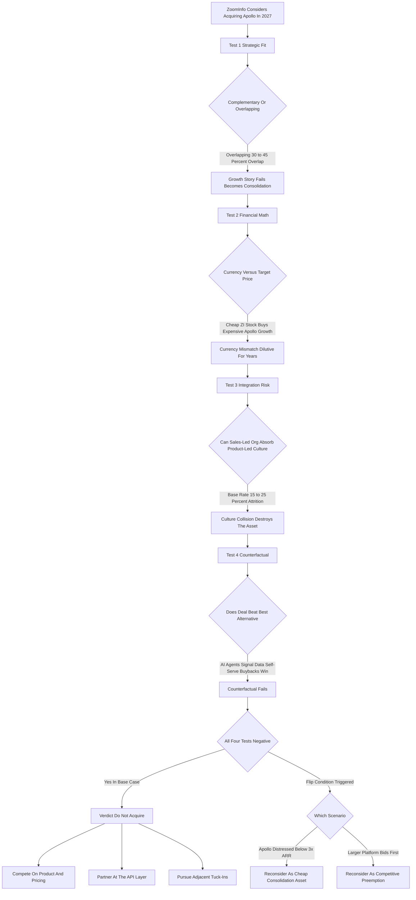

### Direct Answer

**ZoomInfo should not acquire Apollo in 2027.** The deal looks seductive on a banker's slide -- buy the fastest-growing GTM-intelligence challenger, eliminate a competitor, bolt $130M-$250M of ARR onto a public company hungry for a growth narrative -- but it fails all four tests that decide whether a strategic acquisition creates or destroys value: strategic fit, financial math, integration risk, and the counterfactual. The honest verdict is that ZoomInfo (NASDAQ: ZI) should compete with Apollo on product and price, partner at the API layer, and redirect M&A capital toward genuinely additive adjacent tuck-ins -- reversing course only if Apollo becomes a distressed asset below 3x ARR or a larger platform like Salesforce (NYSE: CRM) or HubSpot (NYSE: HUBS) moves to buy Apollo first.

**TL;DR**
- **The base-case verdict is a clear no.** The deal fails strategic fit (the two companies overlap rather than complement), fails the financial math (ZoomInfo's compressed 4-6x multiple is the wrong currency to buy expensive growth), fails integration (a sales-led org cannot absorb a product-led culture cleanly), and fails the counterfactual (AI agents, signal data, organic self-serve, and buybacks all beat the deal).
- **Overlap kills the growth story.** ZoomInfo and Apollo sell the same thing -- a B2B contact database wrapped in sales engagement -- with 30-45% customer overlap in SMB and mid-market, so a merger is consolidation, not expansion.
- **The currency mismatch is fatal.** ZoomInfo trades at roughly 4-6x forward revenue; buying Apollo at a 12x-20x+ growth multiple with cheap equity or debt destroys per-share value and is dilutive for years.
- **Integration base rates are brutal.** Large horizontal SaaS mergers of culturally distinct challengers routinely shed 15-25% of customers and key talent within 18-24 months.
- **The answer flips only in two narrow scenarios** -- a distressed Apollo below 3x ARR, or a credible competitive-preemption move by a larger platform. Neither describes the most likely 2027 environment.

This entry is deliberately a framework, not a hot take. It runs ZoomInfo and Apollo through the same four tests any disciplined acquirer should apply to any target, shows the deal failing all four in the base case, defines precisely the two conditions under which the verdict reverses, steelmans the strongest opposing case before rejecting it, and lays out the superior alternative posture. The point is not to be contrarian about a specific pair of logos; it is to demonstrate the discipline that separates value-creating acquisitions from the far more common value-destroying ones, using a deal that looks obviously smart on a slide and, on honest examination, is not.

## 1. What This Question Is Really Asking

"Should ZoomInfo acquire Apollo in 2027?" is not a question about two logos. It is a question about how a mature, multiple-compressed, public B2B-data company should deploy capital when its core market is being repriced underneath it -- and whether buying its fastest-growing direct competitor is offense or panic.

### 1.1 Four Analyses Held At Once

To answer it honestly you have to hold four separate analyses in your head simultaneously and refuse to let any single one carry the decision.

- **Strategic fit.** Are ZoomInfo and Apollo complementary pieces worth more combined, or overlapping competitors where a merger is just consolidation wearing a growth costume?
- **The financial math.** What would Apollo cost, what currency would ZoomInfo pay in, what multiple is ZoomInfo's own stock trading at, and does the combined entity's per-share math actually improve?
- **Integration risk.** Can ZoomInfo's enterprise, sales-led, contract-heavy operating model absorb Apollo's product-led, self-serve, founder-led culture without destroying the very thing it paid for?
- **The counterfactual.** What is the single best alternative use of the same billion-plus dollars, and does the Apollo deal beat it?

### 1.2 Why The Discipline Matters

An operator who only runs the first analysis ends up with a romantic "category consolidation" story. An operator who only runs the second ends up with a spreadsheet that ignores culture. The discipline of this answer is running all four, in order, and being willing to kill the deal if any one of them comes back clearly negative -- because in M&A, a single fatal flaw is not offset by three attractive features. The table below frames the four tests and what a passing versus failing result looks like.

| Test | Passing Looks Like | Failing Looks Like |
|---|---|---|
| Strategic fit | Target sells a different layer to customers you want | Target sells the same thing to the same customers |
| Financial math | Acquirer currency richer than or equal to target multiple | Cheap currency buying expensive growth; dilutive |
| Integration risk | Culturally absorbable, complementary motions | Structural culture collision; motion cannibalization |
| Counterfactual | Deal beats every alternative use of the capital | Multiple alternatives offer better risk-adjusted return |

### 1.3 The Method In One Sentence

The method is simple to state and hard to follow: never ask "is the target good?" -- always ask "does buying this target, at this price, in this currency, with this integration risk, beat the best alternative use of the capital?"

## 2. The Two Companies' Actual Positions In 2027

You cannot evaluate an acquisition without an honest read on both the acquirer and the target. Both reads, done properly, already tilt the decision before a single test is run.

### 2.1 ZoomInfo: The Acquirer's Fragile Position

ZoomInfo (NASDAQ: ZI) built the modern B2B go-to-market data category. It merged with DiscoverOrg in 2019, went public in 2020 at a valuation that briefly made it one of the most richly valued software IPOs of its era, and assembled a platform through acquisitions: RingLead, EverString, Komiko, Insent, Chorus.ai (conversation intelligence, roughly $575M in 2021), Comparably, and Dogpatch Advisors.

The strong reading: by the 2024-2025 window its revenue sat in the $1.2B-$1.3B range, it was solidly profitable on a non-GAAP basis, generating real free cash flow, and returning capital through buybacks. The weak reading -- the one that matters for an M&A decision -- is harder. ZoomInfo's revenue growth decelerated sharply from the 40%+ rates of its IPO era toward low-single-digit or flat growth; its net revenue retention slipped below the 100% line the market treats as the dividing line between a growth company and a mature one; its stock de-rated from a 2021 peak above $75 to a low-double-digit handle; and its forward revenue multiple compressed from 25x-plus to roughly 4-6x. The SMB segment, where it competed most directly with Apollo, showed elevated churn.

ZoomInfo in 2027 is therefore a company with strong cash generation, a damaged growth narrative, a cheap stock, and a strategic question it cannot avoid: how does it get the market to believe in growth again? "Acquire the fast-growing competitor" is the obvious answer -- which is exactly why it deserves the most scrutiny, because obvious M&A answers driven by narrative pressure are how acquirers overpay.

### 2.2 Apollo: The Target's Expensive-Growth Profile

Apollo.io built a genuinely different motion in the same market. Where ZoomInfo sold an enterprise data subscription through a sales team, Apollo built a product-led, self-serve sales-intelligence-and-engagement platform with a generous free tier, credit-card signup, low entry pricing, and a database it largely crowd-sourced and enriched rather than bought through the legacy data-broker supply chain. It raised a Series D reportedly around $100M in 2023 at a valuation near $1.6B, and through 2024-2025 it was widely reported to be growing ARR at rates -- frequently cited in the 80-150%+ range in its earlier years and still well into double or triple ZoomInfo's rate -- that made it the category's clear momentum story.

By 2027 a reasonable estimate puts Apollo's ARR somewhere in the $130M-$250M range, still growing fast, still mostly serving startups, SMBs, and mid-market sales teams, still cheaper and faster-to-adopt than ZoomInfo. Apollo's strengths are its growth rate, its self-serve efficiency, its product velocity, and its brand among younger, smaller, more price-sensitive buyers. Its weaknesses -- the things an acquirer would be buying into -- are a thinner enterprise presence, a data set whose accuracy at the top of the market is debated, exposure to the same third-party-data and email-deliverability headwinds the whole category faces, and a valuation set in the 2023 growth-equity environment that may or may not survive contact with a 2027 public-market multiple.

### 2.3 The Two Reads Side By Side

Apollo is not a distressed asset in this base case. It is expensive growth -- and expensive growth is the single hardest thing for a cheap, slow, public acquirer to buy well.

| Dimension | ZoomInfo (Acquirer) | Apollo (Target) |
|---|---|---|
| Revenue / ARR | ~$1.2B-$1.3B revenue | ~$130M-$250M ARR (2027 estimate) |
| Growth rate | Low-single-digit / roughly flat | High double / triple digits historically |
| Motion | Sales-led, contract, CSM | Product-led, self-serve, free tier |
| Core segment | Enterprise and mid-market | Startups, SMB, mid-market |
| Valuation multiple | ~4-6x forward revenue | ~12x-20x+ implied on a control bid |
| Strategic problem | Damaged growth narrative | Decelerating-eventually growth, data headwinds |

## 3. Test One -- Strategic Fit And Why Overlap Kills The Story

The most important question in any acquisition is the least quantitative one: are these two companies complementary or overlapping?

### 3.1 Complementary Versus Overlapping

**Complementary acquisitions** -- where the target sells something the acquirer does not, to customers the acquirer wants -- can create real combined value because the whole is genuinely larger than the parts. **Overlapping acquisitions** -- where the target sells roughly what the acquirer sells, to roughly the same customers -- are consolidation, and consolidation creates value only through cost synergy and pricing power, not growth. ZoomInfo and Apollo are overwhelmingly the second case.

### 3.2 The Overlap Is Structural

Both companies sell a B2B contact-and-company database. Both wrap that database in a sales-engagement workflow -- sequences, dialers, email, cadence tooling. Both sell, primarily, to revenue teams that want to find, contact, and book meetings with prospects. The customer overlap in the SMB and mid-market band -- the band where Apollo is strongest and where ZoomInfo's downmarket SKU competes -- is plausibly 30-45%, meaning a large share of an acquired Apollo's revenue is revenue ZoomInfo was either already competing for or already serving.

| Capability | ZoomInfo | Apollo | Overlapping? |
|---|---|---|---|
| B2B contact-and-company database | Yes | Yes | Yes |
| Sales-engagement sequences | Yes | Yes | Yes |
| Dialer / email cadence | Yes | Yes | Yes |
| Intent / signal data | Partial | Partial | Yes |
| Self-serve product-led funnel | Weak | Strong | Capability gap, but welded to a competitor |
| Enterprise security / procurement motion | Strong | Weak | ZoomInfo advantage |

### 3.3 Three Consequences That Gut The Growth Story

- **Revenue synergy is mostly an illusion.** You cannot cross-sell a customer a product they functionally already have.
- **The deal is defensive, not offensive.** Its real logic is "stop Apollo from taking our downmarket share," and defensive M&A is almost always overpriced because the acquirer is buying the absence of a threat rather than the presence of an asset.
- **The combined entity invites backlash.** Consolidating the two most visible GTM-data platforms concentrates the category in a way both antitrust reviewers and customers notice, and customers who lose a competitive alternative do not thank the acquirer.

When the strategic-fit test comes back "overlapping," the burden of proof on the other three tests rises dramatically, because the deal can no longer be justified as growth -- it has to be justified as cost and defense, which are much weaker reasons to spend a billion dollars.

### 3.4 What A Good ZoomInfo Acquisition Would Look Like

To see clearly why Apollo fails the fit test, define what passing would look like. A genuinely additive ZoomInfo acquisition would have four properties.

- **A different layer of the stack.** Not another database-plus-engagement bundle, but an AI research-and-prospecting agent, a first-party intent-and-signal source, a revenue-orchestration or workflow layer, a data-quality and CRM-hygiene engine, or a vertical-specific intelligence product.
- **A different customer segment** ZoomInfo cannot easily win organically -- a true enterprise-only asset, an international data set, or a specific vertical.
- **A different go-to-market motion** ZoomInfo lacks and wants -- a real self-serve, product-led funnel, for instance -- ideally attached to a product that is not a direct competitor.
- **Asset pricing, not a momentum trade** -- acquired because the capability is hard to build, not because the growth rate looks good on a slide.

Apollo fails the first (same layer), fails the second (same core segment), passes only the third in a contaminated way (the self-serve motion is real but welded to a competing product, so you cannot buy the motion without buying the competition), and fails the fourth (it is momentum-priced). The only thing Apollo genuinely offers that ZoomInfo cannot easily build is the self-serve motion -- and ZoomInfo can build that itself, far more cheaply, by productizing the data assets it already owns. When the single real synergy in a deal is something the acquirer could build for a fraction of the price, the deal is not strategy; it is impatience.

### 3.5 The Pricing-Power Mirage

A second-order argument the fit-test failure exposes is the pricing-power case: if ZoomInfo owns both companies, the reasoning goes, it can stop the price war in SMB and lift the whole segment's economics. The problem is that pricing power earned by removing a competitor is the most fragile kind. SMB and mid-market GTM buyers are price-sensitive precisely because the category has low switching costs at the bottom -- contracts are short, data can be re-sourced, and a new challenger can stand up a credible product in 18 months. Lifting prices after the merger does not capture durable margin; it hands the next entrant a wide-open value gap and an instant marketing message. ZoomInfo would, in effect, be paying billions to create the demand conditions for its own next Apollo. Genuine pricing power in this category comes from product depth and data accuracy that buyers will not trade away, not from the temporary absence of one alternative. The fit test fails not only on growth but on the durability of the very cost-and-pricing synergies that are supposed to rescue an overlapping deal.

## 4. Test Two -- The Financial Math And The Currency Problem

If strategic fit is the most important test, the financial math is the most unforgiving, and it is where the Apollo deal becomes genuinely dangerous rather than merely unattractive.

### 4.1 The Price Of Apollo

Apollo's last reported private valuation was near $1.6B in 2023. By 2027, if it has roughly tripled ARR and the growth-equity environment has been even modestly kind, a private mark or acquisition price in the $2.5B-$5B range is plausible; if the public-market re-rating of SaaS has been harsh the number could be lower, but a control premium on top of any number pushes it up.

### 4.2 The Currency Mismatch

Through 2024-2025 ZoomInfo's stock traded at roughly 4-6x forward revenue -- a fraction of its IPO-era multiple. That creates the textbook currency mismatch: ZoomInfo would use cheap equity (or debt against a modestly growing cash-flow base) to buy a target priced on a richer growth multiple.

- **In an all-stock deal**, ZoomInfo dilutes existing shareholders heavily to buy growth that, post-merger, gets revalued at the combined company's lower multiple -- the acquired growth does not stay expensive once it lives inside a cheap company.
- **In a debt-funded deal**, ZoomInfo loads leverage onto a business whose own growth is flat, which is precisely the balance sheet you do not want if the category keeps repricing.

A $3B-plus purchase against Apollo's ARR implies a forward multiple of 12x-20x+ revenue, and the implied return on that capital -- even with aggressive synergy assumptions -- struggles to clear ZoomInfo's own cost of capital.

| Funding Path | Mechanism | Per-Share Effect | Hidden Cost |
|---|---|---|---|
| All-stock | Issue ZI shares at 4-6x to buy 12x-20x+ asset | Heavy dilution; acquired growth re-rated down | Permanent share-count increase |
| All-debt | Borrow against flat cash-flow base | Interest expense; covenant exposure | Leverage on a repricing category |
| Stock + debt blend | Split the dilution and the leverage | Both effects, smaller each | Worst features of both, halved |
| Buyback alternative | Repurchase ZI at 4-6x instead | Accretive, zero integration risk | Foregone "growth narrative" optics |

### 4.3 The Accretion / Dilution Reality

Public-company acquirers live and die by one question their board asks first: is the deal accretive or dilutive to earnings and free cash flow per share, and over what horizon? Apollo, as a high-growth, self-serve, still-reinvesting company, is unlikely to be throwing off the GAAP profit or free cash flow that makes a large acquisition immediately accretive. So the deal is near-certainly **dilutive in Years 1-3** on a per-share basis, whether funded by stock or debt.

The standard defense -- "but the synergies" -- is exactly where the deal is weakest. **Cost synergy** is real but capped: you can consolidate overlapping data infrastructure, G&A, and some R&D, but you cannot cut Apollo's growth engine without killing the reason you bought it. **Revenue synergy** is largely fictional because of the overlap -- you cannot cross-sell customers a product they already have, and the consolidation may actually lose revenue as overlapping customers consolidate their own spend or churn to a competitor to preserve a backup vendor.

| Synergy Type | Claimed In Deal Models | Honest Assessment |
|---|---|---|
| Data-infrastructure consolidation | Large, fast | Real but technically hard and multi-year |
| G&A consolidation | Moderate | Real but modest in absolute dollars |
| R&D consolidation | Moderate | Capped -- cannot touch the growth engine |
| Cross-sell revenue synergy | Large | Largely fictional given 30-45% overlap |
| Pricing-power revenue synergy | Moderate | Triggers churn and antitrust attention |

A deal that is dilutive for years, defended by synergies that do not survive scrutiny, is a deal a disciplined board rejects.

### 4.4 The Goodwill And Impairment Risk

There is a balance-sheet consequence of overpaying that deal models routinely understate: goodwill. A $3B-$5B purchase against $130M-$250M of ARR generates an enormous goodwill and intangibles balance, because most of the price is paid for growth expectations rather than tangible or separately identifiable assets. Goodwill sits on the acquirer's balance sheet until reality forces a write-down. If Apollo's growth decelerates inside ZoomInfo -- which the integration base rate strongly predicts -- the auditors will eventually require an impairment charge, and a multi-billion-dollar non-cash impairment is a public, humiliating admission that the deal destroyed value. It also tends to arrive at the worst possible moment, in a quarter when the category is already under pressure, compounding the narrative damage the deal was supposed to repair. The accretion/dilution conversation usually stops at earnings per share; a disciplined board extends it to the impairment-risk question, and on that question the Apollo deal scores badly: it is precisely the profile -- large premium, growth-priced target, decelerating-eventually trajectory -- that produces the impairment write-downs studied as cautionary tales.

### 4.5 The Opportunity Cost Of A Distracted Balance Sheet

Beyond dilution and impairment lies a subtler financial cost: optionality. A company that spends $3B-$5B and takes on integration leverage has spent its strategic flexibility for years. If the category's real disruption -- AI research agents, a new data paradigm -- demands a fast, decisive capital response in 2028 or 2029, a ZoomInfo that has just digested Apollo cannot make it. It is over-levered, distracted, and mid-integration. The Apollo deal does not just cost the purchase price; it costs every move ZoomInfo cannot make while it is paying for and absorbing Apollo. In a category being actively repriced by technology, surrendering optionality is one of the most expensive things a balance sheet can do.

## 5. Test Three -- Integration Risk And The Culture Collision

Even if an acquirer overpays, a deal can still work if integration is clean. The Apollo deal would not be clean, because ZoomInfo and Apollo are not just different companies -- they are different species of company.

### 5.1 The Operating-Model Collision

Consider the collision across every dimension that matters.

- **Go-to-market.** ZoomInfo is sales-led -- quotas, AEs, annual contracts, procurement cycles, CSMs, enterprise security reviews. Apollo is product-led -- free tier, credit-card self-serve, in-product upgrade, low-touch. You cannot run both motions inside one org without one cannibalizing or starving the other.
- **Pricing.** ZoomInfo's pricing is famously opaque, seat-and-credit-based, and negotiated; Apollo's is transparent, low-entry, and published. Harmonizing them means either raising Apollo's prices (triggering the churn you were trying to prevent) or cannibalizing ZoomInfo's enterprise pricing power.
- **Engineering culture.** Apollo ships fast with a founder-led, lean team; ZoomInfo runs a larger, process-heavier product org integrating many prior acquisitions. Merge them and the fast team slows to the pace of the slow org.
- **Talent.** Apollo's best engineers and product people joined a fast-moving challenger, not a mature public consolidator; post-acquisition vesting cliffs and the simple loss of mission trigger exactly the talent flight that hollows out the asset.
- **Customers.** Apollo's SMB base chose Apollo specifically because it was not ZoomInfo -- cheaper, simpler, faster. Tell them they are now ZoomInfo customers and a meaningful share will leave on principle and on price.

### 5.2 The Base Rate Is Brutal

Large SaaS acquisitions of fast-growing, culturally distinct challengers routinely shed 15-25%+ of the acquired customer base and a comparable share of key talent within 18-24 months. ZoomInfo's own acquisition history is instructive -- Chorus and other deals were absorbed, but the integration of distinct cultures and products into the ZoomInfo platform was neither instant nor frictionless.

| Integration Dimension | ZoomInfo Norm | Apollo Norm | Collision Outcome |
|---|---|---|---|
| Sales motion | Quota-carrying AEs | Self-serve PLG funnel | One motion starves the other |
| Pricing transparency | Opaque, negotiated | Published, low-entry | Harmonization triggers churn |
| Release cadence | Process-heavy | Fast, founder-led | Fast team slows to the slow org |
| Talent retention driver | Stability, scale | Mission, autonomy | Mission disappears at close |
| Customer self-selection | Enterprise buyers | Anti-ZoomInfo buyers | Principled SMB churn |

### 5.3 The Founder And Talent Sub-Problem

Inside integration risk lies the specific place where acquired SaaS value most reliably evaporates: the founders and senior team. Apollo's growth was not an accident of timing -- it was built by people who made specific contrarian bets: a generous free tier when the category sold gated contracts, transparent pricing when the category negotiated, a crowd-sourced data model when the category bought from brokers. Those people are the engine. When ZoomInfo acquires Apollo, it buys a snapshot of an engine that only keeps running if the people who built it stay, stay motivated, and stay empowered -- and the structure of a large-acquirer integration works against all three. The observable pattern is that the acquired company's most entrepreneurial people are gone within 18-30 months. Retention packages help at the margin, but they cannot manufacture mission, and a team that stays only for the money is not the team that produced 100%+ growth.

### 5.4 The Integration-Sequencing Trap

Even acquirers who acknowledge culture risk often believe they can manage it with a careful integration sequence -- run Apollo as an independent unit at first, integrate slowly, protect the brand. The trap is that every sequencing choice forces a loss. **Integrate fast** and you trigger the culture collision, the pricing harmonization, and the talent flight immediately -- but you at least capture the cost synergies the deal model promised. **Integrate slowly** and you preserve Apollo's culture and momentum longer -- but you forgo the synergies, run two redundant cost structures, and leave the strategic rationale unrealized, so the deal stays dilutive with no offsetting benefit. **Never fully integrate** -- run Apollo as a permanent standalone -- and you have simply paid a control premium for a financial holding, which a public-market investor could have bought directly without ZoomInfo as an expensive intermediary. There is no sequencing path that escapes the dilemma, because the dilemma is structural: the synergies and the asset's value live in opposition. The slow path protects the asset and kills the economics; the fast path captures the economics and kills the asset. An integration plan that claims to do both is a plan that has not been pressure-tested.

### 5.5 The Customer-Trust Cost

A dimension that deal models almost never quantify is the trust cost across both customer bases. Apollo's customers chose it as the anti-ZoomInfo; a meaningful share will treat the acquisition as a betrayal and begin evaluating alternatives the day it is announced -- not because anything has changed yet, but because the thing they were buying (an independent challenger) no longer exists. Simultaneously, ZoomInfo's own enterprise customers watch their vendor spend billions and turn its attention inward for two years, and some will read that as a signal to diversify their data supply. The acquisition can therefore generate churn on both sides of the combined customer base at once, before a single integration milestone is hit. Trust, once spent, is slow and expensive to rebuild, and the announcement itself -- not the integration -- is the moment the meter starts running.

## 6. Test Four -- The Counterfactual

The final test, the one acquirers most often skip, is the counterfactual: every billion-plus dollars spent on Apollo is a billion-plus dollars not spent on something else, and the deal is only good if it beats the best alternative.

### 6.1 Four Alternative Uses Of The Capital

ZoomInfo in 2027 has at least four alternatives that each plausibly beat the Apollo deal.

- **Build a credible AI research-and-prospecting agent layer.** The category's real 2027 disruption is AI agents that do research, list-building, and outreach drafting -- a capability ZoomInfo can build or tuck-in cheaply, directly on top of the proprietary data it already owns.
- **Invest in first-party intent and signal data.** The whole category's data supply chain faces deliverability decay, privacy regulation, and accuracy erosion; the durable moat is first-party, consented, signal-rich data.
- **Build ZoomInfo's own self-serve motion.** The one genuine thing Apollo has that ZoomInfo wants is a product-led funnel -- and ZoomInfo can productize its existing data into a self-serve, transparent-priced SKU for a tiny fraction of Apollo's price tag.
- **Buy back ZoomInfo's own deeply discounted stock.** If ZoomInfo's equity trades at 4-6x revenue while it generates real free cash flow, repurchasing it is a high-return, zero-integration-risk use of capital that directly improves per-share metrics.

| Alternative | Approximate Cost | Why It Beats The Apollo Deal |
|---|---|---|
| AI research / prospecting agent layer | Organic + small tuck-ins | Addresses the actual 2027 disruption; sits on owned data |
| First-party intent / signal data | Organic + tuck-ins | Diversifies away from the decaying third-party supply chain |
| Organic self-serve motion | Fraction of Apollo's price | Captures the one real thing Apollo has that ZoomInfo wants |
| Buy back discounted ZI stock | Flexible | 4-6x multiple makes buybacks high-return, per-share accretive |

When at least four alternatives each offer better risk-adjusted returns than the marquee acquisition, the marquee acquisition fails the counterfactual test. The Apollo deal is not competing against doing nothing; it is competing against four genuinely good alternatives, and it loses to all of them.

### 6.2 The Data-Supply-Chain Question Both Companies Face

There is a deeper reason the Apollo acquisition misreads 2027: it doubles down on a data model itself under pressure. **Email deliverability is decaying** as inbox providers tighten. **Privacy regulation is tightening** -- state-level US privacy laws, GDPR enforcement, the trend toward consent requirements -- raising the cost and lowering the coverage of the scrape-and-broker supply chain. **Data accuracy erodes constantly** -- people change jobs and the contact graph decays at double-digit annual rates. **AI changes the buyer's expectation** -- buyers increasingly want answered questions, not raw records. Acquiring Apollo means spending a billion-plus dollars to own more of an asset class facing all four pressures, and to concentrate exposure to them, rather than diversifying away.

| Structural Headwind | Effect On A Contact Database | Why Buying More Of It Hurts |
|---|---|---|
| Email deliverability decay | Records get harder to actually reach | Value of each contact record falls |
| Privacy regulation tightening | Higher cost, lower coverage of scrape-and-broker data | Compliance burden scales with data volume |
| Contact-graph accuracy erosion | Double-digit annual decay; constant re-enrichment | Expensive treadmill just to stand still |
| AI shift in buyer expectation | Buyers want answers, not raw rows | The asset class itself is being disintermediated |

### 6.3 The Counterfactual In Capital-Allocation Terms

The cleanest way to see the counterfactual is to think like a portfolio manager allocating ZoomInfo's next $3B-$5B. A buyback of a 4-6x-revenue, cash-generative business is a high-certainty, zero-integration-risk return that mechanically improves every per-share metric. An organic self-serve build is a low-cost, high-control bet on the one capability gap that genuinely matters. A tuck-in program in AI agents and signal data is a diversified set of small, asset-priced bets on the categories that are appreciating. The Apollo deal, by contrast, is a single, concentrated, momentum-priced, high-integration-risk bet on a category that is depreciating. No disciplined capital allocator ranks that bet first. The Apollo deal is not competing against doing nothing -- it is competing against a buyback that wins on certainty, an organic build that wins on cost and control, and a tuck-in program that wins on diversification and fit. It loses to all three.

## 7. The Antitrust And Regulatory Dimension

A deal of this profile does not happen in a regulatory vacuum, and the antitrust dimension is a real cost, not a footnote.

### 7.1 The Concentration Concern

Combining ZoomInfo and Apollo would consolidate the two most prominent independent B2B go-to-market data-and-engagement platforms into a single entity, materially concentrating a category that buyers, regulators, and the press all watch. The regulatory environment for tech M&A through the mid-2020s was notably more skeptical than the prior decade -- larger horizontal deals drew extended reviews, second requests, and in some cases litigation or abandonment.

### 7.2 The Specific Reviewer Concerns

| Concern | What A Reviewer Would Examine |
|---|---|
| Horizontal overlap | Combined share of B2B contact-data and engagement market |
| Data concentration | One company holding a larger share of the US professional contact graph |
| Foreclosure | Whether the combined entity could disadvantage data- or integration-dependent rivals |
| Process cost | 12-24 months of regulatory limbo, attrition, legal fees, distraction |

Even if the deal were ultimately approvable, the process imposes real costs: 12-24 months of regulatory limbo during which both companies operate under restrictions and uncertainty, employee and customer attrition driven by that uncertainty, legal and advisory fees, and the strategic distraction of a leadership team focused on closing rather than competing. A deal already weak on fit, math, and integration does not need an antitrust overhang on top.

## 8. The Defensive-Acquisition Trap

It is worth naming the psychological trap that makes the Apollo deal feel compelling, because naming it is how you resist it.

### 8.1 Buying The Absence Of A Threat

The trap is the defensive acquisition -- buying a competitor not because the asset is great but because the threat is scary. Apollo is taking ZoomInfo's downmarket share; Apollo's growth rate makes ZoomInfo's deceleration look worse; analysts ask ZoomInfo about Apollo on every earnings call. Acquiring it makes the threat disappear from the slide. But defensive acquisitions are the most reliably value-destroying category of M&A, because the acquirer is buying the removal of a comparison, not the addition of an asset, and it almost always overpays because the bidding is driven by fear rather than a disciplined view of intrinsic value.

### 8.2 The Threat Just Changes Names

The combined entity still has to compete -- now against the next challenger, with a diluted share count or a levered balance sheet and an integration distraction. The threat does not go away; it changes names. The disciplined response to a scary competitor is almost never to buy it -- it is to out-execute it: fix the product gaps the competitor exposed, fix the pricing it undercut, and fix the motion it proved customers want. Apollo did not reach its growth rate by magic; it found real gaps in ZoomInfo's offering. The right answer is to close those gaps, not to pay a fear premium to make the scoreboard easier to look at.

### 8.3 How To Tell A Defensive Deal From A Strategic One

Because defensive acquisitions are dressed up as strategy in every banker's deck, an operator needs a practical test to tell them apart. The questions below separate the two, and the Apollo deal answers the wrong way on every one.

| Diagnostic Question | Strategic Deal Answer | Defensive Deal Answer | Apollo Deal Answer |
|---|---|---|---|
| Would you buy this if the target were not a competitor? | Yes -- the asset stands alone | No -- only the threat-removal matters | No |
| Does the deal add a capability, or remove a comparison? | Adds a capability | Removes a comparison | Removes a comparison |
| Is the price set by intrinsic value or by fear of losing? | Intrinsic value, with a walk-away number | Fear; the walk-away number keeps moving | Fear-driven |
| Does the threat genuinely disappear after close? | The capability is permanent | The next challenger appears | Next challenger appears |
| Is the board calmer or more anxious driving the deal? | Calm, analytical | Anxious, narrative-pressured | Anxious |

When four of five answers point to "defensive," the honest label is defensive, and the honest response is to redirect the energy into execution. The discipline is not to never buy a competitor -- it is to never buy one because you are afraid of it.

## 9. When The Answer Would Flip

A rigorous analysis must define the conditions under which the verdict reverses, because "no" is only useful if you know what would make it "yes."

### 9.1 The Distressed-Asset Scenario

The base case treats Apollo as expensive growth -- the worst thing for ZoomInfo to buy. But suppose 2026-2027 is unkind to Apollo: growth decelerates hard, the self-serve funnel saturates, a fundraising round comes in flat or down, and the company's effective valuation collapses from a growth multiple toward a distressed one -- say, below 3x ARR. At that price the entire calculus inverts. Apollo stops being a momentum trade and becomes a cheap pile of revenue, a recognized brand, a real product, and a self-serve motion -- all at a price where even the limited, overlap-constrained cost synergies clear the return hurdle. In a distressed scenario the overlap that kills the growth story actually helps the value story, because consolidating two overlapping cost structures at a low purchase price is exactly the situation where consolidation M&A works. "No at $3B, yes at $700M" is not a contradiction -- it is the entire point of valuation discipline.

### 9.2 The Competitive-Preemption Scenario

The second flip condition is competitive preemption. If a larger platform -- Salesforce (NYSE: CRM), HubSpot (NYSE: HUBS), Microsoft (NASDAQ: MSFT), or a well-capitalized private-equity roll-up -- moves to buy Apollo, ZoomInfo's question is no longer "do we want this asset" but "can we survive a competitor owning it." A CRM platform that owns Apollo could bundle GTM data directly into the system of record and structurally disadvantage ZoomInfo's standalone offering -- a different and more existential threat than Apollo-as-independent-challenger. Even here, discipline holds in a modified form: ZoomInfo should not pre-emptively overpay to prevent a hypothetical purchase; it should monitor closely, maintain the optionality to bid if a real process emerges, and only enter a contested situation with a hard walk-away price.

| Flip Condition | Trigger | What Changes | Discipline Still Required |
|---|---|---|---|
| Distressed asset | Apollo valuation below ~3x ARR | Consolidation math works at low price | Hard pre-set walk-away price |
| Competitive preemption | Larger platform moves to buy Apollo | Question shifts to "survive a rival owning it" | Bid only in a real process, never pre-empt |

The flip conditions are real but narrow, and neither describes the most likely 2027 environment.

## 10. The Superior Posture -- Compete, Partner, Tuck-In

If ZoomInfo should not acquire Apollo in the base case, what should its posture be? A deliberate three-track strategy.

### 10.1 Compete Hard On Product And Pricing

ZoomInfo should treat Apollo as the most useful competitor it has -- a live, public demonstration of exactly which gaps in ZoomInfo's offering matter to buyers. Apollo proved that a generous free tier and transparent pricing win SMB hearts; ZoomInfo should answer with its own self-serve, transparent SKU. Apollo proved that fast iteration and a clean engagement workflow matter; ZoomInfo should out-invest it there. Competing is cheaper than acquiring and it forces the organization to actually fix the things customers are voting on.

### 10.2 Partner At The API Layer

The reality of 2027 GTM stacks is that customers run multiple tools, and ZoomInfo's data is valuable inside other workflows -- including, potentially, alongside Apollo's. API partnerships, data interoperability, and being the trusted data layer that other tools enrich from is a revenue stream and a moat that does not require owning the competitor.

### 10.3 Pursue Adjacent Tuck-Ins

Rejecting the Apollo deal is not rejecting M&A -- it is redirecting it toward acquisitions that pass the four tests. The target profile: small-to-mid-sized companies, priced as assets rather than momentum trades, that add a layer ZoomInfo lacks.

| Tuck-In Category | Why It Passes The Fit Test | Approximate Cost |
|---|---|---|
| AI research / prospecting agents | Different layer; sits on top of ZoomInfo data | Tens of millions |
| First-party intent / signal data | Diversifies away from decaying third-party supply | Tens of millions |
| Revenue orchestration / workflow | ZoomInfo data becomes the fuel | Tens of millions |
| Data quality / CRM hygiene | Natural extension of enrichment value | Tens of millions |
| Vertical / international data assets | Coverage ZoomInfo cannot build organically | Tens of millions |

A disciplined tuck-in program -- five or ten of these over a few years -- builds the AI-and-signal future ZoomInfo actually needs, for less total capital than a single Apollo deal, and without betting the company on one integration. That is what good M&A looks like for ZoomInfo in 2027.

## 11. The Mega-Deal Base Rate And The Disciplined-Board Process

Any honest M&A analysis must confront the base rate, and the base rate for large, horizontal, culturally distinct SaaS acquisitions is not encouraging.

### 11.1 What History Says

The pattern across the most-studied cases is consistent. Salesforce's acquisition of Tableau (2019, ~$15.7B) brought a differentiated asset, but integration was slow and Tableau's growth decelerated inside Salesforce. Salesforce's acquisition of Slack (2021, ~$27.7B) faced persistent questions about whether price and fit justified the dilution. Okta's (NASDAQ: OKTA) acquisition of Auth0 (2021, ~$6.5B) -- a closer analogy, two overlapping identity products with different motions -- was followed by integration friction and a multi-year period where the market questioned whether the deal created value.

| Deal | Year | Approx Price | Lesson |
|---|---|---|---|
| Salesforce / Tableau | 2019 | ~$15.7B | Slow integration; acquired growth decelerated inside the larger entity |
| Salesforce / Slack | 2021 | ~$27.7B | Persistent price-and-fit-vs-dilution questions |
| Okta / Auth0 | 2021 | ~$6.5B | Closest analogy: overlapping products, different motions, multi-year friction |
| ZoomInfo / Chorus.ai | 2021 | ~$575M | Absorbable but non-trivial integration of a distinct product and culture |

The throughline: big horizontal deals combining different cultures and overlapping products tend to underperform the acquirer's promises. ZoomInfo acquiring Apollo would be a textbook member of the underperforming category -- large, horizontal, culturally distinct, momentum-priced.

### 11.2 How A Disciplined Board Runs The Decision

A disciplined ZoomInfo board would process an Apollo proposal through a deliberate sequence, and the process is where good and bad M&A decisions diverge.

- **Force the fit question in writing.** Overlapping or complementary? The board does not let a banker's growth-synergy slide paper over a 30-45% customer overlap.
- **Model conservatively, under both funding paths.** Build the financial model with conservative synergy assumptions, run it under both stock and debt funding, and stress it against a scenario where the category keeps repricing -- then compare the per-share outcome explicitly against a buyback and an organic build.
- **Get an independent integration assessment.** Commission it from people who have actually integrated companies, not from the deal champions, and price in the base-rate attrition rather than assuming this deal is the exception.
- **Get real antitrust counsel.** Establish the probability and timeline of a challenge before, not after, an announcement.
- **Set a hard walk-away price first.** Fix the number before negotiations and refuse to move it because of deal momentum or fear of losing -- the single step that most reliably separates disciplined acquirers from narrative-driven ones.

Run honestly, that process almost certainly kills the base-case Apollo deal: the fit test fails, the math is dilutive, the integration base rate is poor, the antitrust overhang is real, and the counterfactual offers better returns. A board that runs the process and still does the deal is either seeing a distressed price the base case does not assume, responding to a preemption threat the base case does not include, or has let narrative pressure override discipline -- the most common and most expensive M&A mistake of all.

### 11.3 The Question To Ask On Every Earnings Call

There is a simple discipline test a board and an executive team can apply continuously, not just at deal time. On every earnings call where an analyst raises Apollo, the honest internal question is not "how do we make this question stop?" but "what specific product, pricing, or motion gap is this analyst's question actually pointing at, and are we closing it?" An organization that treats the Apollo question as a competitive-intelligence signal stays disciplined; an organization that treats it as a narrative problem to be solved with a checkbook drifts toward the defensive deal. The scoreboard pressure is real and constant -- which is exactly why the response has to be a standing analytical habit rather than a one-time decision.

## 12. Decision Flow

The diagram below traces the four-test framework end to end.

## 13. Counter-Case -- The Argument For Acquiring Apollo, And Why It Still Does Not Hold

A rigorous "no" must engage the strongest version of "yes." Here is that case, steelmanned -- then stress-tested.

### 13.1 Counter 1 -- Consolidation Is Inevitable

The argument: the GTM-data category will consolidate, and ZoomInfo should be the consolidator, not the consolidated. The rebuttal: consolidation being likely does not make this consolidation, at this price, with this currency, value-creating. Being the consolidator only works if you consolidate at attractive prices into a coherent platform; consolidating your most expensive direct competitor at a momentum price, funded with cheap equity, is how consolidators destroy value. Inevitability is not a valuation.

### 13.2 Counter 2 -- It Fixes The Growth Narrative

The argument: bolt 80-150% growth onto a flat company and the blended rate -- and the multiple -- improves. The rebuttal: the market sees through bolt-on growth. Acquired growth gets revalued at the combined company's multiple, the dilution or leverage is permanent, and once the acquired growth decelerates inside the larger org the narrative is worse than before, now with a diluted share count.

### 13.3 Counter 3 -- The Self-Serve Motion Is Irreplaceable

The argument: ZoomInfo has struggled to build a real product-led motion; Apollo has one; buy it. The rebuttal: this is the strongest single point in the bull case, and it still fails, because you cannot buy Apollo's motion without buying Apollo's competing product, overlapping customer base, and culture-collision risk. The motion is welded to everything else. ZoomInfo can build a self-serve SKU on its existing data for a fraction of the price -- it lacks will and focus, not capability.

### 13.4 Counter 4 -- Eliminating Apollo Stops The Bleeding

The argument: Apollo is the main reason ZoomInfo's SMB churn is elevated; remove it and the bleeding stops. The rebuttal: this is the defensive-acquisition trap named explicitly. The downmarket pressure does not come from Apollo specifically; it comes from ZoomInfo's offering being overpriced and overcomplicated for that segment. Remove Apollo and the next challenger exploits the same gap.

### 13.5 Counter 5 -- The Cost Synergies Are Substantial

The argument: two companies maintaining overlapping contact graphs is wasteful; merge them and the cost base shrinks. The rebuttal: the cost synergy is real but capped and slow -- you cannot touch Apollo's growth engine without destroying the asset, and data-infrastructure integration is technically hard and multi-year. A capped, slow synergy justifies, at most, a distressed-priced purchase.

### 13.6 Counter 6 -- If ZoomInfo Does Not Buy It, Salesforce Will

The argument: better ZoomInfo owns Apollo than a CRM platform that bundles it and structurally disadvantages ZoomInfo. The rebuttal: this is a real risk and exactly one of the two defined flip conditions -- but it justifies being ready to bid in a real contested process, not bidding first, in the base case, at a base-case-optimistic price.

### 13.7 Counter 7 -- ZoomInfo Has The M&A Muscle

The argument: DiscoverOrg, Chorus, RingLead, EverString -- ZoomInfo is an experienced acquirer. The rebuttal: experience with tuck-ins and complementary deals is not experience with a large, horizontal, culturally distinct merger of a direct competitor. Those are different problems, and the base rate for the second is far worse.

### 13.8 Counter 8 -- At The Right Price, It Works

The argument: every "no" here is really a "no at this price" -- so the deal is not wrong, just expensive. The rebuttal: this is conceded -- it is the entire distressed-scenario flip condition. "No at $3B-$5B, yes below 3x ARR" is not a contradiction; it is valuation discipline.

### 13.9 The Honest Synthesis

| Counter Argument | Strongest Form | Why It Fails For The Base-Case Deal |
|---|---|---|
| Consolidation inevitable | Be the consolidator | Inevitability is not a valuation |
| Fixes growth narrative | Blended rate improves | Market discounts bolt-on growth on day one |
| Self-serve motion gap | Real capability gap | Motion welded to a competing product; buildable cheaper |
| Eliminate the competitor | Stops SMB churn | Defensive-acquisition trap; next challenger appears |
| Cost synergy | Two contact graphs is waste | Capped, slow; justifies only a distressed price |
| Preemption risk | Better us than a CRM | Justifies readiness, not a first strike |
| M&A muscle | Experienced acquirer | Tuck-in experience is not mega-merger experience |
| Right-price argument | No is price-conditioned | Conceded -- confirms valuation discipline |

The bull case has one genuinely strong point (the self-serve capability gap) and one genuinely real risk (competitive preemption) -- and neither survives as a reason to do the base-case deal. The motion can be built more cheaply; the preemption risk justifies readiness, not a first strike. The steelmanned yes makes the no more precise, not weaker.

## 14. The Operator's Synthesis

"Should ZoomInfo acquire Apollo in 2027?" feels like it should be yes -- consolidate the category, buy the growth, silence the competitor -- and is, on disciplined examination, a clear no. It fails strategic fit (overlap turns the growth story into a consolidation story), fails the financial math (a compressed multiple makes ZoomInfo's currency too cheap to buy Apollo's expensive growth without destroying per-share value), fails integration (a product-led, founder-led culture collides structurally with an enterprise, sales-led model), and fails the counterfactual (AI agents, first-party signal data, an organic self-serve motion, and buybacks each offer a better risk-adjusted return).

The verdict is not "M&A is bad" -- ZoomInfo should be an active tuck-in acquirer in adjacent, additive categories. The verdict is that this specific deal, in the base-case environment, is a defensive, dilutive, integration-heavy mistake dressed as a growth story. The answer flips only in two narrow scenarios -- a distressed Apollo price below 3x ARR, or a credible competitive-preemption move by a larger platform -- and a disciplined acquirer stays ready for those while refusing the base-case deal. The deeper lesson outlasts these two specific companies: in strategic M&A, the question is never "is the target good?" It is "does buying it, at this price, in this currency, with this integration risk, beat the best alternative use of the capital?" For ZoomInfo and Apollo in 2027, on every one of those dimensions, the answer is no.

## 15. Related Pulse Library Entries

This entry sits inside a cluster of acquisition, competitive-strategy, and GTM-data analyses. The most directly relevant siblings:

- The closest structural parallel is the same target evaluated against a different acquirer (q1877).
- Two more parallel suitors evaluating an Apollo bid round out the comparison set (q1892).
- A lead-gen-framed version of the same acquisition question adds another data point (q1837).
- The mirror case of Apollo itself acting as an acquirer shows the other side of the table (q1922).
- The acquirer's standalone turnaround problem -- fixing ZoomInfo's revenue without M&A -- is essential background (q1358).
- The head-to-head buyer's evaluation of Apollo versus ZoomInfo grounds the overlap thesis in real procurement (q1109).
- The mega-deal benchmark -- a far larger horizontal CRM consolidation -- tests the base-rate argument at scale (q1536).
- Apollo's competitive-defense posture against a different attacker shows why the target keeps growing (q1885).

## Sources

1. **ZoomInfo Technologies Inc. -- SEC Filings (10-K, 10-Q, 8-K) and Investor Relations** -- Primary source for ZoomInfo revenue, growth rate, net revenue retention, profitability, free cash flow, buyback activity, and acquisition history. https://ir.zoominfo.com
2. **ZoomInfo S-1 / IPO Prospectus (2020)** -- Original public-offering documentation establishing the company's IPO-era growth profile and valuation context. https://www.sec.gov
3. **ZoomInfo -- Chorus.ai Acquisition Announcement (2021)** -- Reference for the ~$575M conversation-intelligence acquisition and ZoomInfo's platform-by-acquisition strategy.
4. **ZoomInfo -- DiscoverOrg Merger Documentation (2019)** -- The foundational merger that created the modern ZoomInfo.
5. **Apollo.io -- Company Funding and Series D Announcement (2023)** -- Reference for Apollo's reported ~$100M Series D and ~$1.6B valuation. https://www.apollo.io
6. **Crunchbase -- Apollo.io Funding History and Valuation** -- Aggregated funding-round, investor, and valuation data for Apollo. https://www.crunchbase.com
7. **PitchBook -- Apollo.io and ZoomInfo Private and Public Valuation Data** -- Valuation, multiple, and comparables data for both companies and the GTM-software category.
8. **Apollo.io -- Pricing Page and Product Documentation** -- Primary source for Apollo's transparent, low-entry, product-led pricing and self-serve motion.
9. **ZoomInfo -- Pricing and Product Documentation** -- Reference for ZoomInfo's seat-and-credit, sales-negotiated pricing model.
10. **G2 -- Sales Intelligence Software Category (ZoomInfo, Apollo, and Competitors)** -- Customer-review data on product positioning, segment fit, and competitive overlap. https://www.g2.com
11. **Gartner -- Market Guide for Sales Intelligence / Revenue Technology** -- Analyst framing of the GTM-data category, vendor positioning, and segment dynamics. https://www.gartner.com
12. **Forrester -- B2B Sales and Revenue Technology Research** -- Analyst research on the sales-intelligence and engagement landscape.
13. **Salesforce -- Tableau Acquisition (2019, ~$15.7B) Documentation and Subsequent Filings** -- Mega-deal base-rate reference: integration timeline and growth deceleration post-acquisition.
14. **Salesforce -- Slack Acquisition (2021, ~$27.7B) Documentation** -- Mega-deal base-rate reference on price, fit, and dilution debate.
15. **Okta -- Auth0 Acquisition (2021, ~$6.5B) Documentation and Subsequent Filings** -- Closest analogy: overlapping products, different motions, documented integration friction.
16. **Harvard Business Review -- Research on M&A Failure Rates and Value Destruction** -- Academic and practitioner research on why most large acquisitions underperform. https://hbr.org
17. **McKinsey & Company -- M&A and Programmatic Acquisition Research** -- Evidence that disciplined tuck-in programs outperform large transformational deals.
18. **Bain & Company -- M&A Report (Annual)** -- Industry data on deal multiples, synergy realization, and acquirer returns. https://www.bain.com
19. **Aswath Damodaran -- Valuation, Acquisition Currency, and Accretion/Dilution Frameworks** -- Foundational reference on the currency-mismatch problem and per-share value in M&A. https://pages.stern.nyu.edu/~adamodar
20. **US Federal Trade Commission -- Merger Review Guidelines and Tech-M&A Enforcement Actions** -- Reference for the antitrust environment for horizontal software consolidation. https://www.ftc.gov
21. **US Department of Justice Antitrust Division -- Horizontal Merger Guidelines** -- Framework for evaluating horizontal-overlap and data-concentration concerns.
22. **The Information -- Reporting on Apollo.io Growth and the GTM-Data Category** -- Trade journalism on Apollo's ARR trajectory and competitive dynamics. https://www.theinformation.com
23. **TechCrunch -- Apollo.io Funding and B2B SaaS M&A Coverage** -- Reporting on funding rounds and category consolidation. https://techcrunch.com
24. **SaaS Capital / Public SaaS Multiple Indices** -- Reference data on the SaaS revenue-multiple compression from 2021 peaks through 2024-2025.
25. **Bessemer Venture Partners -- State of the Cloud / Cloud Index** -- Public-SaaS valuation and growth-vs-multiple benchmarking. https://www.bvp.com
26. **ZoomInfo and Apollo Earnings-Call Transcripts and Analyst Coverage** -- Reference for how analysts frame the ZoomInfo-vs-Apollo competitive question.
27. **Email Deliverability and Privacy Regulation Research (Inbox-Provider Policy Changes, US State Privacy Laws, GDPR Enforcement)** -- Context for the structural pressure on the contact-data supply chain.
28. **Tomasz Tunguz / Theory Ventures -- Analysis of SaaS Growth, Net Revenue Retention, and M&A** -- Practitioner analysis of growth deceleration and capital allocation in mature SaaS.
29. **CB Insights -- B2B Data and Sales-Tech Market Maps and M&A Activity** -- Category mapping and acquisition-activity reference. https://www.cbinsights.com
30. **Public-Company Acquisition Accretion/Dilution Practitioner Guides (Investment-Banking M&A References)** -- Standard frameworks for modeling per-share impact of stock- and debt-funded acquisitions.
31. **Deloitte / KPMG M&A Integration Practice Research** -- Practitioner data on post-merger integration timelines, attrition, and synergy realization rates.
32. **Microsoft, Salesforce, and HubSpot Investor Materials** -- Reference for the strategic posture of larger platforms that could pursue Apollo in a preemption scenario.
