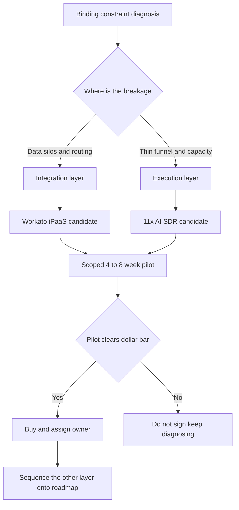

### Direct Answer

**Workato and 11x are not competitors, and "which should you buy" is the wrong question** -- they occupy different layers of the revenue stack, and most teams mature enough to ask this end up running both. **Workato is an enterprise iPaaS** that connects your systems of record and orchestrates cross-system workflows; **11x is an AI sales-execution layer** whose digital workers run outbound prospecting at machine scale. Buy Workato when the binding constraint is plumbing and data silos; buy 11x when the constraint is outbound volume and pipeline-generation capacity; buy neither until you can name the constraint in a dollar figure.

**TL;DR**

- **Different layers, not substitutes.** Workato is integration and orchestration infrastructure; 11x is an outbound execution capability. They overlap only in that both touch the CRM.
- **Diagnose the binding constraint first.** If good-fit leads do not route fast and clean, the constraint is plumbing -- Workato. If reps lack qualified pipeline and burn the week on prospecting, the constraint is execution -- 11x.
- **Cost structures diverge sharply.** Workato is a six-figure annual platform commitment ($35K-$300K-plus, often seven figures at scale) on a multi-year contract with an 8-16 week implementation. 11x is per-digital-worker (roughly $5K-$25K per worker per year), live in days to weeks, far easier to start and to kill.
- **Time-to-value and reversibility differ.** Workato is slow-to-value and hard-to-reverse; 11x is fast-to-value and easier-to-reverse. The reversible tool is the safer first probe only when it maps to a real constraint.
- **Most mature teams run both, sequenced.** The "vs" is real only as a budgeting-sequence question this quarter -- which layer to fund first -- not a permanent either/or.
- **The decision-killers:** buying a platform to solve a process problem, underestimating the human owner cost, and signing the long contract before a scoped pilot proves the number.
- **Net:** name the constraint, price it, pilot the one tool that attacks it, prove the dollar number, then decide whether the other layer is the next investment or a distraction.

---

## 1. What This Question Is Really Asking

### 1.1 Why The "Versus" Framing Is A Trap

A buyer typing "Workato vs 11x -- which should you buy" has almost always been handed two demos in the same month and assumed, reasonably, that two tools pitched to the same RevOps leader must be substitutes. **They are not.** Workato is an integration and automation platform; 11x is an AI sales-execution platform. They overlap in exactly one narrow place -- both touch your CRM and both promise to "automate" -- and that surface similarity is the entire source of the confusion. The right question is not which to buy but **what is the binding constraint on your revenue engine right now**, because the answer to that question selects the tool. If you cannot answer it, you should buy neither.

**The teams that waste money here** are the ones that bought the tool that demoed best rather than the tool that attacked their actual bottleneck. A company drowning in disconnected systems does not need an AI SDR generating more leads to dump into a broken router. A company with clean plumbing but a thin top-of-funnel does not need another iPaaS recipe. The framing this guide insists on: **name the constraint, price the constraint, then buy against the constraint** -- and treat "Workato vs 11x" as a diagnostic prompt, not a menu.

### 1.2 The One Sentence That Resolves It

Here is the entire decision compressed: **buy Workato when the constraint is plumbing; buy 11x when the constraint is outbound volume; buy neither yet if you cannot articulate the constraint in a dollar figure.** Everything else in this guide is the supporting evidence, the diagnostic procedure, and the failure stories that show what happens when a buyer skips the discipline. The honest 2027 framing is that this is not Workato OR 11x -- it is a sequencing decision under a finite budget, and the sequencing is determined by which layer's breakage is load-bearing.

### 1.3 Why The Stakes Are High

These are not cheap tools, and neither is reversible for free. Workato is a six-figure annual commitment with a real implementation project behind it; 11x, while smaller per-worker, carries brand and deliverability risk that does not show on an invoice. **A wrong-layer buy does not just waste the license fee** -- it amplifies the underlying problem. Automating a broken lead-routing rule mis-routes leads faster; pouring AI-generated volume into a broken CRM corrupts the data you would use to measure anything. The cost of getting this wrong is the spend plus the compounding damage, which is why the diagnosis comes before the demo.

There is also an organizational cost that buyers underweight. A failed six-figure platform purchase does not just lose money -- it **burns political capital and makes the next, correct purchase harder to fund.** When RevOps buys Workato to fix a process problem and the platform visibly fails to move the metric, the finance team and the executive sponsor learn the wrong lesson: that "RevOps tooling does not work," rather than "we bought the wrong layer." The next buyer in that organization, even with a perfect constraint diagnosis, now negotiates against a poisoned well. Getting the first buy right is therefore worth more than its own ROI; it preserves the organization's willingness to invest in the layer that is actually broken.

### 1.4 The Three Decision-Killers In One Place

Before the detail, here are the three mistakes that destroy the most value in this category, stated plainly so a buyer can watch for them:

- **Buying a platform to solve a process problem.** Neither tool fixes a broken process; both amplify whatever process they are given. A broken routing rule automated by Workato mis-routes faster. A weak value proposition amplified by an 11x worker reaches more people who say no. Fix the process, then automate it.
- **Underestimating the human cost.** Workato needs an integration owner; 11x needs a worker owner managing ICP, messaging, deliverability, and replies. Neither is "set and forget." A tool with no human owner decays to zero value while the license renews.
- **Signing the long contract before the pilot proves the number.** Workato's annual minimums and 11x's worker commitments both punish the buyer who skipped a scoped, time-boxed proof of value. The vendor's best price rewards the longest commitment -- but that price is only a bargain on a tool the pilot proved you need.

Every failure story later in this guide is one of these three wearing a different costume.

---

## 2. What Each Tool Actually Is

### 2.1 What Workato Actually Is

Workato is an **enterprise integration platform-as-a-service** -- an iPaaS. Its core unit is the "recipe," an automation that listens for a trigger in one system and performs actions in others: a new opportunity closes in Salesforce, so a recipe provisions the account in NetSuite, opens a project in Asana, posts to a Slack channel, and updates a Snowflake table. Workato ships connectors for over 1,200 applications -- Salesforce, HubSpot, Marketo, Outreach, Salesloft, ZoomInfo, NetSuite, Workday, ServiceNow, Snowflake, Jira, Slack, and the long tail of SaaS a real company runs -- plus HTTP and database connectors for everything else.

**It is the layer that makes a fragmented SaaS estate behave like one system.** RevOps teams use it for lead-to-account matching and routing, CRM hygiene and deduplication, quote-to-cash orchestration, territory and quota syncs, and the dozens of cross-system workflows that otherwise live in a person's calendar as a recurring manual export. Workato sells to mid-market and enterprise, competes with MuleSoft -- now owned by Salesforce (NYSE: CRM) -- as well as Boomi, Tray.ai, and Zapier at the lighter end, and is governed like infrastructure with environments, version control, role-based access, audit logs, and error monitoring.

**The systems Workato most often connects are themselves public companies whose products a RevOps buyer already pays for.** A typical Workato deployment stitches together Salesforce (NYSE: CRM) as the CRM, HubSpot (NYSE: HUBS) where the marketing or second CRM lives, Snowflake (NYSE: SNOW) as the warehouse, Workday (NASDAQ: WDAY) for HR data, ServiceNow (NYSE: NOW) for IT and case workflows, Microsoft (NASDAQ: MSFT) Dynamics or Teams on the productivity side, and the finance system -- often Oracle (NYSE: ORCL) NetSuite or a billing platform. Workato itself is privately held, venture-backed, and has been the subject of recurring acquisition speculation. It is bought by a buyer who has concluded that **the company's systems do not talk to each other and that gap is now costing real money.**

### 2.2 What 11x Actually Is

11x sells **"digital workers"** -- AI agents built to do sales-development jobs end to end rather than to assist a human doing them. Its flagship worker, **Alice**, runs the outbound SDR motion: she sources prospects against an ideal-customer profile, enriches and researches each account, drafts personalized multi-channel outreach across email and LinkedIn, sequences it, and adapts based on engagement. A second worker, **Julian**, handles voice -- AI-driven calling and conversation.

**The pitch is capacity:** a digital worker runs continuously, does not need ramp time, and executes the research-and-personalization grind that human SDRs do slowly and inconsistently. 11x integrates with the CRM and the engagement stack to log activity and hand qualified replies to humans. It rose fast on the "AI SDR" wave alongside competitors like Artisan, Qualified's Piper, Relevance AI's agents, and a crowd of newer entrants, and it has also drawn public scrutiny over churn and revenue claims -- which matters to a buyer and is treated honestly in the Counter-Case section below.

**Like Workato, 11x is privately held, venture-backed, and not a public stock** -- but it sits in a competitive field that includes both private startups and the AI roadmaps of public incumbents. Salesforce (NYSE: CRM) has pushed agentic selling features directly into its CRM; HubSpot (NYSE: HUBS) has built AI assistants into Sales Hub; and the sales-engagement incumbents 11x effectively competes with for the outbound budget -- Outreach and Salesloft, the latter owned by Vista-backed private equity -- are racing to add their own AI sequencing. A buyer evaluating 11x is therefore not only comparing it to other AI SDR startups but implicitly weighing it against AI features the CRM and engagement vendors they already pay for are shipping for free or near-free. 11x is bought by a buyer who has concluded that **the top of the funnel is too thin and human prospecting capacity is the ceiling.**

### 2.3 The Layer Diagram: Where Each Tool Lives

Picture the revenue stack as layers. At the **data and systems layer** sit Salesforce, HubSpot, the marketing automation platform, the data warehouse, the finance system, the product database -- the systems of record. At the **integration and orchestration layer** sits the plumbing that moves data between those systems and triggers cross-system workflows -- this is Workato's home. At the **execution layer** sit the tools the GTM team uses to actually generate and work pipeline -- the engagement platform, the dialer, the prospecting tools -- and this is where 11x's digital workers operate. Above that sits the **human layer** -- AEs, SDRs, managers, RevOps analysts -- making judgment calls.

Workato is **horizontal infrastructure** under the whole GTM motion; 11x is a **vertical capability** inside one slice of it. They can coexist trivially because they do not contend for the same job: Workato can be the plumbing that routes the leads 11x generates, and 11x can be one more execution system that Workato keeps in sync.

The layer diagram is the whole insight -- once a buyer draws it, "which should I buy" resolves into "which layer is broken."

---

## 3. The Core Decision Drivers

### 3.1 Driver One: Diagnose The Binding Constraint

Every revenue engine has **one constraint that, relieved, unlocks the most growth** -- and spending on any other part is motion without progress. The diagnostic is concrete. Ask: **when a good-fit lead enters the system, does it get to the right rep, fast, with full context, every time?** If the honest answer is no -- leads sit in a queue, route by a stale rule, arrive without firmographic context, or require someone to manually move them -- the constraint is in the integration layer and Workato is the candidate.

Then ask: **do reps have enough qualified pipeline to hit quota, and are they spending their time selling rather than prospecting?** If the honest answer is no -- the funnel is thin, reps burn the majority of the week on list-building and research, outbound is inconsistent -- the constraint is in the execution layer and 11x is the candidate. A team can have both problems, but it almost always has one that is **more binding right now**, and that is the one to buy against first. The failure mode is buying against the constraint that demoed best or that the loudest stakeholder feels, rather than the one the funnel math actually identifies.

### 3.2 Driver Two: Time-To-Value And Reversibility

The two tools have very different risk profiles on the time axis, and a buyer should weigh this explicitly. **Workato is a slow-to-value, hard-to-reverse commitment:** a real implementation runs 8-16 weeks, involves discovery, connector authentication, recipe design, error-handling, UAT, and change management; it usually needs an integration owner or an implementation partner; and once dozens of recipes run the business, ripping it out is a project.

**11x is a fast-to-value, easier-to-reverse commitment:** a digital worker can be configured against an ICP and live in days to a few weeks, the proof shows up in weeks not quarters, and if it underperforms you can pause or cancel a worker far more cheaply than you can decommission an integration platform. This asymmetry has a practical consequence: when the constraint is genuinely ambiguous, **the reversible, fast-feedback tool is the safer first probe** -- but only if it actually maps to a real constraint. Reversibility is not a reason to buy the wrong layer; it is a tiebreaker when the layers are close.

### 3.3 Driver Three: Cost Structure And Who Signs The Check

The two tools are priced on different axes and that shapes both the number and the buyer. **Workato prices on connectors and task/transaction volume,** sold as an annual platform subscription with real minimums -- a focused mid-market deployment commonly lands in the tens of thousands per year, a broad deployment in the low-to-mid six figures, and a true enterprise estate with high task volume runs into seven figures. It is a multi-year contract, a procurement event, and often a budget line owned by RevOps and IT jointly.

**11x prices on digital workers** -- roughly a per-worker / seat-equivalent annual fee, commonly in the $5K-$25K-per-worker range with usage tiers -- a smaller initial check, a shorter or more flexible term, and a budget line that sales leadership can often approve without a full procurement cycle. The implication: Workato is a deliberate infrastructure investment that should clear an ROI bar before signing; 11x is a more experimental capacity buy that should still clear a pilot bar but is easier to start. Neither pricing model is "better" -- they reflect what the tools are -- but a buyer must price the **fully loaded** cost, including the human owner each one needs.

### 3.4 Driver Four: The Quality Of Your Existing Data

There is a fourth driver that buyers routinely skip, and it tilts the decision before the constraint diagnosis even begins: **the current state of your data.** Workato does not improve data quality by itself -- it moves data faster between systems. If the data in Salesforce (NYSE: CRM) is dirty, Workato will replicate dirty data into Snowflake (NYSE: SNOW) and NetSuite at machine speed; the platform is an amplifier, and it amplifies whatever it is given. A buyer with a genuine data-quality problem -- duplicate accounts, inconsistent field formats, no canonical source of truth -- needs a data-hygiene project alongside or before Workato, not instead of it.

The same driver hits 11x harder. An AI digital worker is **only as good as the ICP definition and the contact data it prospects against.** If the company has never crisply defined its ideal-customer profile, or its enrichment data is stale, the worker will execute high-volume outreach against a fuzzy target and the output will be noise. The honest sequencing implication: if your data is genuinely bad, neither tool fixes it, and the first dollar should arguably go to data hygiene -- a Clay-style enrichment cleanup, a deduplication pass, an ICP-definition workshop -- before either platform is signed. This is the quiet reason many buyers should answer "neither yet."

### 3.5 Driver Comparison Table

| Decision driver | Workato | 11x |
|---|---|---|
| Layer of the stack | Integration and orchestration | Outbound execution |
| Binding constraint it relieves | Data silos, broken routing | Thin funnel, prospecting capacity |
| Time-to-value | 8-16 weeks | Days to a few weeks |
| Reversibility | Hard -- decommissioning is a project | Easier -- pause or cancel a worker |
| Pricing axis | Connectors and task volume | Per digital worker |
| Typical annual cost | $35K-$300K-plus, often seven figures | $5K-$25K per worker |
| Contract shape | Multi-year, procurement event | Shorter, more flexible term |
| Primary check-signer | RevOps and IT jointly | Sales leadership |
| Dependency on existing data quality | Amplifies whatever it is given | Only as good as the ICP and contact data |
| What it does NOT fix | Data hygiene, broken process logic | Value proposition, conversion problems |

---

## 4. Total Cost Of Ownership: The Honest Numbers

### 4.1 Workato Total Cost Of Ownership

The Workato license is the visible cost and frequently not the largest one. The fully loaded picture:

- **Platform subscription** -- tens of thousands to seven figures by scale.
- **Implementation** -- internal engineering time or a partner engagement, often $25K-$150K-plus for a serious initial build.
- **Ongoing integration owner** -- a RevOps engineer or platform admin who designs, monitors, and maintains recipes, a real fraction of a salaried role or a managed-service retainer.
- **Connector and task overage** -- if volume grows past the contracted tier.
- **Opportunity cost of governance** -- the reviews, testing, and change management that infrastructure correctly demands.

A buyer who budgets only the license and discovers the owner cost six months in is the buyer who lets the platform decay into unmonitored recipes -- which is worse than not having it. **The right way to underwrite Workato is against the quantified cost of the silos it removes:** the analyst-hours of manual export, the revenue lost to slow or wrong lead routing, the errors from systems disagreeing. If that number is large and recurring, Workato's TCO is justified; if it is small, it is not.

**Worked example.** Suppose a mid-market company runs Salesforce (NYSE: CRM), HubSpot (NYSE: HUBS), Snowflake (NYSE: SNOW), and an Oracle (NYSE: ORCL) NetSuite finance instance, and two RevOps analysts spend roughly a combined twelve hours a week on manual exports and reconciliation between them. At a fully loaded analyst cost, that is on the order of $60K-$90K a year of pure manual-integration labor, before counting the revenue lost when a lead routes a day late or an account syncs wrong. If Workato eliminates two-thirds of that manual work and tightens routing, a $60K-$120K all-in annual Workato program -- license plus a fractional owner -- can be cash-flow neutral or positive in year one. The discipline is to do this arithmetic *before* signing, not to discover it at renewal. A buyer who cannot produce a number like this has not yet proven the constraint and should not sign.

### 4.2 11x Total Cost Of Ownership

11x's per-worker fee is also not the whole cost. The fully loaded picture:

- **Worker subscription** itself -- the per-digital-worker annual fee.
- **Email infrastructure and deliverability** -- domains, inboxes, warmup, monitoring, because an AI worker sending at volume will torch sender reputation without disciplined deliverability hygiene.
- **Data and enrichment** -- the ICP and contact data the worker prospects against, sometimes bundled, sometimes a separate ZoomInfo, Apollo, or Clay-type cost.
- **Human owner** -- someone tunes the ICP, reviews and approves messaging, handles the qualified replies the worker hands off, and watches quality metrics.
- **Brand risk cost** -- poorly targeted or obviously robotic outreach has a reputational price that does not show on an invoice.

**The right way to underwrite 11x is against the quantified cost of the pipeline gap:** the meetings not booked, the SDR headcount you would otherwise hire and ramp, the AE time reclaimed from prospecting. If the funnel gap is real and the human owner exists, 11x's TCO is justified; if outbound is not actually the constraint, the spend produces noise.

**Worked example.** A fully loaded human SDR -- salary, variable, benefits, tooling, management overhead -- commonly runs $90K-$130K a year and takes three to six months to ramp, with real attrition risk. If a company needs the equivalent of two additional SDRs of outbound capacity, that is a $180K-$260K annual fixed-cost decision plus a multi-month ramp drag. An 11x digital worker, at a per-worker fee in the $5K-$25K range plus deliverability infrastructure and a fraction of a human owner's time, can plausibly land the all-in cost well below a single human SDR while being live in weeks. But the comparison is only honest if the buyer holds quality constant: the right metric is **cost per qualified meeting that converts to real pipeline**, not cost per email sent. A digital worker that is cheaper per meeting but produces meetings that never convert is more expensive than the human, not less. Underwrite on converted pipeline, not activity, or the cheap number is a mirage.

### 4.3 Fully Loaded Cost Comparison

| Cost component | Workato | 11x |
|---|---|---|
| Visible license | Platform subscription | Per-worker subscription |
| Implementation / setup | $25K-$150K-plus, 8-16 weeks | Days to weeks, modest |
| Human owner required | Integration owner / platform admin | Worker owner managing ICP and replies |
| Hidden infrastructure cost | Connector and task overage | Email domains, warmup, deliverability |
| Data cost | Usually included in connectors | Enrichment data may be separate |
| Reputational / risk cost | Bad recipe corrupts production data | Bad outreach damages domain reputation |
| Underwrite against | Cost of silos removed | Cost of pipeline gap closed |

---

## 5. When Each Tool Is Clearly The Right Buy

### 5.1 When Workato Is Clearly The Right Buy

There are buyer situations where Workato is unambiguously the answer and 11x is irrelevant:

- **The CRM and the finance system disagree** on the same accounts, and reconciliation is a recurring manual fire drill.
- **Lead-to-account matching and routing is broken or hand-operated,** and good leads decay in queues.
- **The company runs a sprawling SaaS estate** -- a dozen-plus systems -- held together by CSV exports and a few heroic analysts.
- **Quote-to-cash spans Salesforce, a CPQ tool, NetSuite, and a billing system** with manual handoffs between each.
- **A merger or a re-platforming just doubled** the systems that need to talk.
- **RevOps reporting is unreliable** because data lands in the warehouse late, partial, or transformed inconsistently.

In every one of these, the bottleneck is structural plumbing, the cost is paid in analyst hours and routing latency and data distrust, and an AI SDR would simply pour more volume onto the broken floor. This is the Workato buyer: the constraint is integration, the pain is silos, the unlock is orchestration.

### 5.2 When 11x Is Clearly The Right Buy

There are equally clear buyer situations where 11x is the answer and Workato is irrelevant:

- **Reps are missing quota because pipeline coverage is thin** -- not because of conversion, because of raw top-of-funnel volume.
- **AEs spend the majority of the week building lists,** researching accounts, and writing first-touch emails instead of running deals.
- **The company wants to test new segments or geographies** without hiring and ramping a full SDR pod for an unproven motion.
- **SDR hiring is slow, expensive, and high-churn,** and the team needs outbound capacity faster than recruiting can deliver it.
- **Outbound is inconsistent** -- it happens in bursts when someone has time, not as a continuous motion.
- **The CRM and systems are reasonably clean,** so the constraint genuinely sits in execution, not plumbing.

In each case the bottleneck is prospecting capacity, the cost is paid in unbooked meetings and unramped headcount, and an integration platform would do nothing for it. This is the 11x buyer: the constraint is execution, the pain is a thin funnel, the unlock is machine-scale outbound.

### 5.3 The Buyer-Situation Matrix

| Buyer situation | Constraint layer | Right candidate |
|---|---|---|
| CRM and finance disagree on accounts | Integration | Workato |
| Lead routing is slow or hand-operated | Integration | Workato |
| Dozen-plus systems held together by CSV | Integration | Workato |
| Post-merger systems doubled | Integration | Workato |
| Reps missing quota on thin coverage | Execution | 11x |
| AEs buried in list-building | Execution | 11x |
| Testing a new segment without hiring | Execution | 11x |
| Outbound happens in inconsistent bursts | Execution | 11x |
| Cannot name the constraint in dollars | Unknown | Neither -- keep diagnosing |

---

## 6. Why Most Mature RevOps Teams Run Both

### 6.1 The Two Problems Are Not Equally Binding At The Same Moment

Once a company is large enough to be seriously evaluating either tool, it usually has **both problems** -- they are just not equally binding at the same moment. A growth-stage company often hits the execution constraint first: it needs pipeline, hires SDRs or buys an AI SDR layer, and grows. Growth then exposes the integration constraint -- more systems, more volume, more handoffs -- and the plumbing that was "good enough" at twenty people breaks at a hundred.

**The sophisticated end state is layered:** Workato as the orchestration substrate that routes leads, syncs accounts, and keeps the systems of record honest; 11x (or an AI SDR layer) as one execution capability generating top-of-funnel into that well-plumbed system. They are complements -- Workato can even be the integration that pipes 11x's activity and outcomes cleanly into Salesforce and the warehouse. The "vs" in the question is real only in the narrow sense of **sequencing under a finite budget this quarter** -- which layer to fund first -- not in the sense of a permanent either/or.

### 6.2 The Maturity Curve: What Each Stage Needs

The right answer to "Workato or 11x" changes with company stage, and a buyer should locate themselves on the curve before deciding:

- **Early stage** -- a handful of GTM people, a single CRM, a few tools. The company usually has neither problem at scale: native point-to-point integrations or a Zapier-class tool cover the plumbing, and the funnel constraint, if it exists, is better solved by founder-led selling and a first SDR than by a digital-worker layer the company cannot yet manage.
- **Growth stage** -- a real sales team, quota pressure, expansion ambitions. The execution constraint usually bites first: the company needs more pipeline than human prospecting can produce, and an AI SDR layer becomes a legitimate capacity buy, while the integration estate is still tolerable.
- **Scale stage** -- many systems, high volume, multiple teams, a real RevOps function. The integration constraint becomes acute: the SaaS estate is sprawling, the manual exports are a liability, the routing is business-critical, and a Workato-class platform earns its TCO.
- **Enterprise stage** -- both run as permanent, governed, owned infrastructure.

The mistake is buying for the stage you aspire to rather than the stage you are in: a growth-stage company buying enterprise iPaaS is buying plumbing for systems it does not yet have, and a scale-stage company still hand-routing leads has under-bought its integration layer for years.

### 6.3 The Maturity Curve Table

| Company stage | Typical binding constraint | Right move | Wrong move |
|---|---|---|---|
| Early (handful of GTM staff) | Usually neither at scale | Native integrations, founder-led selling | Buying enterprise iPaaS prematurely |
| Growth (real sales team) | Execution -- thin funnel | AI SDR layer as capacity buy | Over-investing in plumbing too early |
| Scale (many systems, RevOps function) | Integration -- silos | Workato-class iPaaS | Still hand-routing leads |
| Enterprise (multi-team) | Both, permanently | Run both as governed infrastructure | Treating either as a convenience purchase |

---

## 7. Sequencing, Pilots, And Procurement

### 7.1 Sequencing Logic: Which To Buy First

Given a finite budget and both problems present, the sequencing rule is: **fix the layer whose breakage corrupts the other.** Broken plumbing corrupts execution -- if leads do not route and data is untrustworthy, then any pipeline an AI SDR generates lands in the same broken system and converts worse, and you cannot even measure the SDR layer's true performance because the attribution data is dirty. The reverse is less true -- a thin funnel does not corrupt your integrations.

So when both are broken and you must choose, **Workato-class plumbing usually sequences first**, because it is the foundation the execution layer's results are measured on. The exception: if the plumbing is merely imperfect rather than broken, and the funnel is genuinely empty, then the execution layer sequences first because an empty funnel is an existential problem and an imperfect integration is a tolerable one. The sequencing question is "which breakage is load-bearing," and the answer is usually the integration layer -- but a buyer must check, not assume.

### 7.2 The Pilot Design That De-Risks Either Decision

Neither tool should be bought on a demo; both should be bought on a scoped pilot that proves a dollar number. A **Workato pilot** picks one painful, well-bounded workflow -- lead-to-account routing, or one quote-to-cash handoff -- builds it, runs it for 4-8 weeks, and measures the specific metric it should move: routing latency, manual analyst hours eliminated, error rate. If that one recipe pays for a meaningful slice of the platform cost, the broader investment is underwritten.

An **11x pilot** scopes one segment and one digital worker, runs it for 4-8 weeks with a human owner managing replies and quality, and measures qualified meetings booked, reply quality, deliverability health, and cost per qualified meeting versus the human-SDR baseline. If the worker produces qualified pipeline at an acceptable cost and quality, the capacity buy is underwritten. The discipline in both cases: **time-box it, define the success metric before starting, assign the human owner, and do not sign the long contract until the pilot clears the bar.** A vendor confident in the product will support a real pilot; resistance to a scoped pilot is itself information.

**The pilot also needs a pre-agreed kill criterion**, not just a success criterion. Before the pilot starts, the buyer and the internal sponsor should write down what result would cause them to walk away -- for Workato, perhaps "if the recipe does not cut routing latency by at least half, we do not expand"; for 11x, perhaps "if cost per converted meeting is not below our human-SDR baseline, or deliverability degrades, we do not renew." A pilot with only a success criterion and no kill criterion is not a pilot; it is a procurement formality that always ends in a purchase. The kill criterion is what makes the exercise honest, and it is the single most common thing buyers skip.

### 7.3 The Pilot Scorecard

| Pilot dimension | Workato pilot | 11x pilot |
|---|---|---|
| Scope | One bounded workflow | One segment, one worker |
| Duration | 4-8 weeks | 4-8 weeks |
| Primary success metric | Routing latency or analyst hours cut | Cost per converted qualified meeting |
| Secondary metrics | Error rate, recipe uptime | Deliverability health, positive reply rate |
| Required owner during pilot | Integration owner or partner | Worker owner managing replies |
| Pre-agreed kill criterion | No meaningful latency or hours reduction | Cost above SDR baseline or deliverability harm |
| Decision gate | Recipe pays for a slice of platform cost | Worker produces converting pipeline at acceptable cost |

### 7.4 Negotiation And Procurement: How To Buy Each One Well

Once the constraint is named and the pilot is planned, the buyer still has to negotiate, and the two tools reward different tactics. With **Workato**, the leverage points are term length, task/connector tier sizing, overage rates, and implementation scope. The buyer should size the initial tier to realistic near-term volume rather than aspirational volume -- it is easier to expand a tier than to recover spend on an oversized one -- and should negotiate overage rates explicitly, because volume growth is exactly when the vendor has pricing power. A multi-year term can earn a real discount, but only sign it after the pilot proves a workflow.

With **11x**, the leverage points are worker count, term flexibility, usage tiers, and exit terms. Given the category's youth and the public scrutiny around the vendor, the buyer should resist the multi-worker multi-year commitment up front, start with one worker on the shortest reasonable term, negotiate a clean exit, and treat the early period as pilot-priced. In both cases the universal rule holds: **the vendor's best price is offered for the longest commitment, and the buyer's best position is to earn that price only after a scoped pilot has converted uncertainty into a proven dollar number.** A buyer who negotiates before piloting is negotiating blind.

### 7.5 The Decision Framework: A Structured Path

Pulling it together into a sequence a buyer can actually run:

1. **Instrument and name the constraint** -- measure lead routing latency and data-integrity pain on one side, pipeline coverage and rep-time-on-prospecting on the other; name which is more binding in a dollar figure.
2. **Confirm the layer** -- if the constraint is plumbing and silos, the candidate is Workato; if it is outbound volume and capacity, the candidate is 11x; if you cannot name it, buy neither.
3. **Price the fully loaded TCO** -- license plus implementation plus the human owner plus the hidden costs -- and underwrite it against the quantified cost of the constraint.
4. **Run the scoped, time-boxed pilot** with a pre-defined success metric and an assigned owner; do not sign the long contract first.
5. **Do the vendor diligence** -- lock-in and continuity for Workato, references and retention for 11x.
6. **Decide and sequence** -- buy the tool that cleared its pilot bar; if both problems are real, sequence the load-bearing layer first and put the other on the roadmap.
7. **Assign the owner and the operating discipline before go-live** -- governance for Workato, a managed-worker discipline for 11x.

Run this and "Workato vs 11x" stops being a coin flip and becomes a defensible, instrumented decision.

---

## 8. Integration, Governance, And Operations

### 8.1 How They Actually Touch Your CRM

Both tools connect to Salesforce (NYSE: CRM) and HubSpot (NYSE: HUBS), but they touch the CRM in fundamentally different ways, and understanding this kills the "they overlap" confusion. **Workato touches the CRM as an orchestration system** -- it reads triggers (record created, field changed, stage advanced) and writes coordinated actions across many systems; it treats the CRM as one node in a graph it keeps consistent. **11x touches the CRM as an execution system** -- it reads ICP and account context and writes back activity (emails sent, replies, meetings) so the funnel reflects what the digital worker did; it treats the CRM as the place its work is recorded and handed off.

A buyer running both should think about **who owns which fields and writes:** Workato should own the cross-system sync and routing logic; 11x should own the outbound-activity records for its workers. Conflicts arise only if nobody designs the boundary -- two systems writing the same field. The fix is governance, not choosing one tool: a simple map of which platform is the system of action for which object and field.

**The ownership map should be written down, not assumed.** A practical artifact is a one-page table listing each contested CRM object -- Lead, Contact, Account, Opportunity, Activity -- and naming the single system of action for each field that more than one tool might write. When Workato owns lead-to-account matching and routing fields, and 11x owns outbound-activity and engagement fields, the two never collide. When that map does not exist, the symptom is silent: a field flips back and forth, a report becomes untrustworthy, and an analyst spends a week tracing it. The companies that run both tools cleanly are not the ones with the best tools; they are the ones that did the boring governance work of drawing the boundary before go-live.

### 8.2 The API And Rate-Limit Reality

A detail buyers discover late: both tools consume CRM API capacity, and CRM platforms meter it. Salesforce (NYSE: CRM) enforces daily API call limits by edition and license count; HubSpot (NYSE: HUBS) similarly meters API usage. Workato, orchestrating many systems, can generate substantial API traffic, and a high-volume 11x worker logging activity adds more. A buyer running both -- or running either at scale -- should confirm with the CRM admin that the org has API headroom, because hitting the ceiling does not produce a clean error in a user's face; it produces silent, intermittent sync failures that are miserable to diagnose. This is a real line item in the integration plan, not a footnote, and it is exactly the kind of operational detail that separates a smooth deployment from a six-month firefight.

### 8.3 Data, Security, And Governance Considerations

Both tools cross sensitive boundaries, and a buyer who skips the security review is buying a future incident. **Workato moves data between systems of record** -- customer data, financial data, employee data -- and that makes it a security review, not just a RevOps purchase: the buyer must understand where data is processed and stored, how credentials are secured, what the access-control and audit model is, and how recipe changes are governed so a single bad edit cannot corrupt production data across many systems.

**11x touches customer and prospect data, sends communications on the company's behalf, and shares domain reputation** with the rest of the business: the buyer must understand what data the worker ingests and stores, how it is used to train or tune, what the opt-out and compliance posture is for outbound, and who governs the messaging the worker sends in the company's name. The governance throughline for both: a tool that acts across systems or speaks to the market on your behalf needs an explicit owner, an explicit change-control practice, and an explicit boundary of what it is and is not allowed to do.

### 8.4 Implementation And Adoption: Where Each One Goes Wrong

Each tool has a characteristic implementation failure mode, and a buyer who knows it can pre-empt it. **Workato goes wrong** when it is treated as a tactical fix instead of governed infrastructure: recipes get built ad hoc by whoever needs one, with no environments, no version control, no error monitoring and no owner -- and within a year the platform is a pile of fragile, undocumented automations that break silently. The pre-empt: governance from day one, an owner, a recipe-review practice, monitoring.

**11x goes wrong** when it is treated as fully autonomous instead of a managed worker: nobody tunes the ICP, nobody reviews the messaging, nobody minds deliverability, nobody works the replies fast -- and the worker generates high-volume, low-fit, reputation-damaging outreach that books few real meetings. The pre-empt: a human owner, messaging review, deliverability discipline, fast reply handling, and quality metrics watched as closely as volume. In both cases the tool is not the failure -- the absence of an owner and an operating discipline is.

### 8.5 The Stakeholder Map: Who Should Be In The Room

The two decisions pull in different stakeholders, and getting the room wrong produces the wrong buy.

| Decision | Stakeholders who must be in the room | Risk of getting the room wrong |
|---|---|---|
| Workato | RevOps lead, integration/platform owner, IT/security, owners of connected systems, finance | Recipes nobody trusts or owns |
| 11x | Sales lead, SDR/pipeline manager, RevOps, marketing, the worker's human owner | Outbound that damages domain reputation and pollutes the funnel |

A Workato decision made without the system owners produces recipes nobody trusts; an 11x decision made without marketing and RevOps produces outbound that damages domain reputation and pollutes the funnel with low-fit activity. The buyer's job is to assemble the room that can both judge the tool and own it afterward.

### 8.6 Build Versus Buy Versus Both

A buyer should honestly consider the alternatives to buying either. Against **Workato**, the build-or-substitute options are: native point-to-point integrations (cheap until you have a dozen and a maintenance nightmare), a lighter tool like Zapier or Make for low-volume non-critical flows, a heavier enterprise iPaaS like MuleSoft or Boomi if you are already in that ecosystem, or custom engineering if you have the team and the flows are stable. Against **11x**, the options are: hiring and ramping human SDRs (slower, higher fixed cost, full judgment and brand control), assembling a build-it-yourself stack of Clay plus an engagement platform plus an AI writer, or a competing AI SDR product. The point is not to talk yourself out of buying -- it is to make sure the bought tool is genuinely the best instrument for the constraint, and to know your walk-away alternative when you negotiate.

---

## 9. Measuring Success And Vendor Diligence

### 9.1 The Metrics That Matter

A buyer must define success metrics before buying, or the renewal becomes a vibe check.

| Workato metric | 11x metric |
|---|---|
| Manual analyst hours eliminated | Qualified meetings booked per worker |
| Lead-routing latency (creation to assignment) | Cost per qualified meeting vs human-SDR baseline |
| Data error / discrepancy rate between systems | Positive reply rate (not just reply rate) |
| Percentage of cross-system workflows automated | Deliverability health (bounce, spam placement) |
| Recipe uptime and error rate | Pipeline-to-close conversion of worker-sourced deals |

For **Workato**, the renewal question: are the silos measurably smaller and is the analyst time measurably reclaimed? For **11x**, the renewal question: is the worker producing qualified pipeline at an acceptable cost and quality, without damaging the brand or the domain? In both cases, vanity metrics -- recipes built, emails sent -- must be subordinated to outcome metrics. The buyer who renews on activity counts is the buyer who got sold.

### 9.2 Risk And Vendor-Health Due Diligence

This category requires unusually careful vendor due diligence. For **Workato**, the diligence is mostly about lock-in and continuity: how portable are your recipes if you leave, what is the data-residency and security posture, how does pricing escalate as task volume grows, and what is the support and uptime track record. It is becoming infrastructure, so treat it like infrastructure.

For **11x**, the diligence is sharper because the AI-SDR category is young and turbulent: 11x specifically has faced public reporting questioning its revenue claims and customer churn, so a buyer should ask hard for verifiable reference customers in a similar segment, real retention data, and a clear-eyed account of where the product underperforms -- and should structure the contract (shorter term, pilot-gated, clear exit) to reflect category-level uncertainty. This is not a reason to avoid 11x; it is a reason to buy it the way you buy anything in a fast-moving category.

### 9.3 The Reference-Check Script

A buyer should not skip references, and should not waste them on softball questions. For a **Workato** reference: how long was your real implementation versus what you were quoted; who owns the platform internally now and how much of their time does it take; what broke in the first year and how did you find out; how has your cost changed as task volume grew; and if you had to leave, how portable are your recipes.

For an **11x** reference, the truth-surfacing questions are sharper: what is your actual cost per qualified meeting and how does it compare to your human SDRs; what happened to your deliverability and domain reputation in the first ninety days; how much human time does the worker actually require to run well; what percentage of the worker's "meetings" turned into real pipeline; and -- the one that matters most -- are you still using it. If a referee hesitates, that hesitation is the answer. Ask both reference sets the same meta-question: what do you wish you had known before signing.

### 9.4 What Changes If You Already Own One Of Them

The decision looks different for a buyer who already runs one of these tools. If you **already run Workato** and are evaluating 11x: is the execution layer now the binding constraint, and how cleanly will 11x's activity pipe through your existing recipes -- owning Workato is an advantage, because the orchestration substrate to integrate a new execution tool already exists. If you **already run 11x** and are evaluating Workato: has growth exposed the integration constraint, and is the data your digital worker depends on starting to suffer from the same silo problems Workato exists to fix. The general principle: owning one does not change the diagnosis discipline, but it does change the starting point.

---

## 10. The Competitive Context Behind The Decision

### 10.1 Workato Is Not The Only iPaaS On The Table

A buyer leaning toward the integration layer should know that "Workato vs 11x" quietly contains a second comparison: **Workato versus the rest of the iPaaS market.** The strongest alternatives each carry a different bias. MuleSoft, owned by Salesforce (NYSE: CRM), is the natural default for a heavily Salesforce-centric enterprise but is generally heavier and more developer-oriented. Boomi, now independent after years inside Dell (NYSE: DELL), competes hard in mid-market. Microsoft (NASDAQ: MSFT) ships Power Automate and Logic Apps, which can be compelling for a shop already deep in the Microsoft estate. At the lighter end, Zapier and Make handle low-volume, non-critical automation at a fraction of the cost. The honest framing: Workato is an excellent iPaaS, but a buyer who has concluded the constraint is the integration layer should still run a short bake-off rather than assuming Workato by name. The constraint diagnosis selects the *layer*; a separate evaluation selects the *vendor*.

### 10.2 11x Is Not The Only AI SDR On The Table

The same is true on the execution side. The AI SDR category in 2027 is crowded and turbulent: 11x competes with Artisan, Qualified's Piper agent, Relevance AI, and a steady stream of new entrants -- and, crucially, with the AI features the incumbents the buyer already pays for are shipping. Salesforce (NYSE: CRM) has pushed agentic outbound capabilities into its CRM; HubSpot (NYSE: HUBS) has built AI prospecting and writing assistants into Sales Hub; and the sales-engagement vendors Outreach and Salesloft are both racing AI sequencing into their core products. A buyer evaluating 11x should explicitly ask: is a dedicated digital-worker product worth the spend versus the agentic features already bundled into our CRM and engagement stack? Sometimes yes -- a purpose-built worker can outperform a bundled feature -- but the question must be asked, not assumed away.

### 10.3 Vendor Continuity And The Acquisition Question

Both vendors sit in categories where consolidation is constant, and a buyer should price that in. Workato has been the subject of recurring acquisition speculation; a buyer signing a multi-year iPaaS contract should ask what happens to pricing, roadmap, and support if the vendor is acquired by a larger platform company. 11x, as a venture-backed startup in a young and scrutinized category, carries the sharper continuity question -- not only acquisition but the more basic question of whether the vendor will be independently operating, at its current product quality, in two years. Neither risk is a reason to walk away, but both are reasons to favor shorter terms, clean exit clauses, and data-portability guarantees over the deepest possible discount on the longest possible commitment.

### 10.4 Competitive Context Summary

| Question | Workato side | 11x side |
|---|---|---|
| Direct alternatives | MuleSoft, Boomi, Power Automate, Zapier, Make | Artisan, Qualified Piper, Relevance AI |
| Incumbent-bundled threat | Native CRM and ERP integrations | Agentic features in Salesforce, HubSpot, Outreach, Salesloft |
| Consolidation risk | Recurring acquisition speculation | Young, turbulent category; continuity question |
| Buyer protection | Short bake-off before vendor selection | Pilot-gated, short term, clean exit |

---

## 11. Counter-Case: When This Framing Is Wrong

### 11.1 When You Should Buy Neither

The strongest counter-case is the **buy-neither** case, and it is more common than vendors will admit. If you cannot name the binding constraint in a dollar figure, both tools are premature. An early-stage company with a single CRM, a few tools, and a founder still doing the selling has neither a silo problem at scale nor a capacity problem a digital worker can fix -- native integrations and a first human SDR are the right moves. Buying Workato here is buying plumbing for pipes that do not exist; buying 11x here is category theater. **The honest answer for many buyers asking "Workato vs 11x" is "you are not ready for either."**

### 11.2 When The "Different Layers" Framing Breaks Down

The "different layers, not competitors" framing is mostly right, but a buyer should know its limits. **Under a hard, single-quarter budget, they genuinely compete** -- not for the same job, but for the same dollar. A team that can fund exactly one this quarter is making a real either/or decision, and pretending otherwise is dishonest. Second, the layers blur at the edges: Workato can run lightweight outbound-ish automations, and 11x's workers do some lightweight enrichment that overlaps with data plumbing. The framing is a strong default, not a law -- a buyer with an unusual stack should test it against their own reality.

### 11.3 The Failure Stories: What Bad Buys Look Like

Concrete failure patterns make the stakes tangible:

- **The amplified-mess buy:** a company with a broken lead-routing rule buys Workato, automates the broken rule, and now mis-routes leads faster and at scale.
- **The orphaned-platform buy:** a company buys Workato, builds forty recipes through whoever needed one, never assigns an owner, and within a year has a pile of fragile undocumented automations that break silently while the license renews.
- **The unmanaged-worker buy:** a company buys 11x, treats the digital worker as fully autonomous, and the worker sends high-volume low-fit outreach that torches the domain reputation and books almost no real meetings.
- **The wrong-layer buy:** a company with a genuinely broken CRM buys 11x to "generate more pipeline," pours digital-worker leads into the broken system, and cannot even measure whether the worker is good because the attribution data is corrupt.
- **The category-theater buy:** leadership feels pressure to "have an AI strategy," buys 11x as a press-release line item, and the tool sits half-configured because no real constraint ever justified it.

Every one of these is a process-and-ownership failure wearing a tool's name -- and every one was avoidable with diagnosis, a pilot, and an owner.

### 11.4 The Honest Bottom Line For A 2027 Buyer

In 2027 the RevOps tool market is loud, the AI-SDR category especially so, and the pressure to "buy AI" or "buy automation" is real and not always rational. The disciplined buyer holds two ideas at once: these tools are genuinely useful when matched to a real constraint, and they are genuinely expensive mistakes when bought as category theater. **Workato is the right buy for the company whose systems do not talk and whose people are the integration layer.** **11x is the right buy for the company whose funnel is thin and whose reps are buried in prospecting.** Most mature teams will, over time, own both -- in different layers, sequenced by which breakage was load-bearing first. The buyer who wins is not the one who picks the "better" tool; there is no better tool because they are not the same kind of tool. The buyer who wins is the one who diagnoses the constraint, prices it, pilots against it, and buys -- in order -- the layer that was actually broken.

---

## 12. Related Questions

For deeper context on the vendors, the category dynamics, and the AI-outbound shift behind this decision, these sibling entries are worth reading:

- Whether a strategic acquirer should absorb Workato, and what that means for iPaaS buyers (q1912).
- How the 11x roadmap might extend through acquisition into adjacent categories (q1878).
- Whether a Workato-skills career path holds up as automation reshapes RevOps roles (q1882).
- A parallel "which should you buy" comparison in the sales-engagement layer (q1906).
- What happens to dedicated SDR teams when AI agents do outbound natively (q1899).
- The broader question of what replaces cold outbound once AI agents own it (q1873).
- How sequencing tooling shifts when AI agents handle the outbound motion (q1927).
- How the RevOps stack itself changes when AI agents replace the SDR function (q1870).

---

## Sources

1. Workato official product documentation -- recipes, connectors, and platform architecture.
2. Workato connector library and integration catalog overview.
3. 11x official site -- digital workers Alice and Julian, product positioning.
4. iPaaS category definition and Gartner Magic Quadrant for integration platforms.
5. Forrester analysis of integration-platform-as-a-service adoption in mid-market and enterprise.
6. AI SDR category overview -- vendors, capabilities, and 2026-2027 market dynamics.
7. Public reporting on 11x revenue-claim scrutiny and customer churn questions.
8. RevOps benchmark reports on lead routing latency and time-to-first-touch.
9. Salesforce lead-to-account matching and routing best-practice documentation.
10. HubSpot operations and workflow automation guidance.
11. MuleSoft and Boomi comparative iPaaS positioning materials.
12. Zapier and Make positioning for lightweight automation use cases.
13. Quote-to-cash orchestration playbooks across CRM, CPQ, and billing systems.
14. RevOps total-cost-of-ownership frameworks for platform purchases.
15. SaaS procurement and contract-negotiation guidance for multi-year platform deals.
16. Email deliverability best practices -- domain warmup, sender reputation, monitoring.
17. ZoomInfo, Apollo, and Clay positioning for prospecting data and enrichment.
18. SDR hiring, ramp-time, and churn benchmark studies.
19. Outbound compliance overview -- commercial email regulation by region.
20. Data security and governance standards for systems-integration platforms.
21. Vendor due-diligence frameworks for early-stage SaaS categories.
22. Reference-check methodology for enterprise software purchases.
23. RevOps maturity-curve models by company stage and ARR.
24. Pipeline-coverage and quota-attainment benchmark data for B2B SaaS.
25. Sales-engagement platform comparison research (Outreach, Salesloft).
26. AI-agent adoption surveys for go-to-market teams, 2026-2027.
27. Build-versus-buy decision frameworks for integration tooling.
28. CRM data-quality and attribution-integrity research.
29. Change-management practices for iPaaS recipe governance.
30. Pilot-design methodology for time-boxed software proofs of value.
31. RevOps stakeholder-alignment and decision-room composition guidance.
32. Cost-per-qualified-meeting benchmarking for human and AI SDR motions.
33. Domain-reputation and brand-risk analysis for high-volume outbound.
34. Enterprise iPaaS lock-in, portability, and exit-planning research.
35. 2027 RevOps tooling market overviews and category landscape reports.
