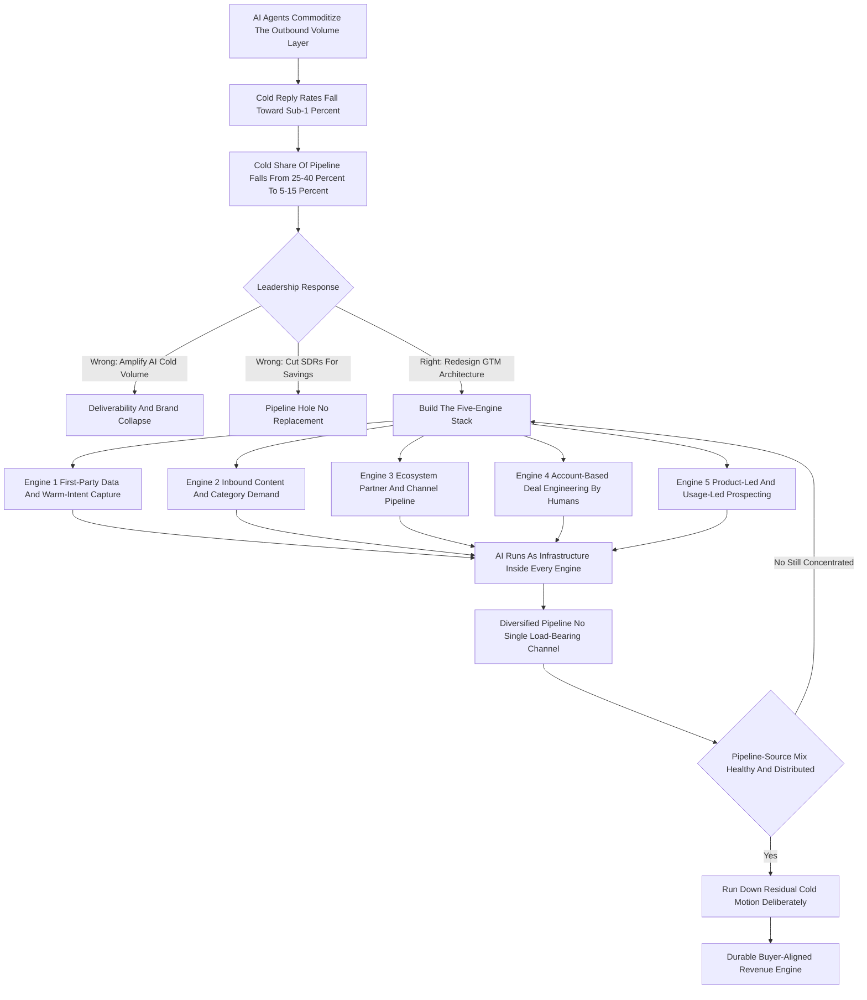

### Direct Answer

What replaces cold outbound when AI agents handle outbound is not another channel -- it is a structural inversion of the revenue model in which the scarce, defensible work moves away from *generating* contacts and toward *earning attention, owning data, and engineering deals*. When every competitor's AI can send a thousand personalized emails an hour at near-zero marginal cost, the inbox becomes a commodity wasteland, reply rates collapse toward a sub-1% floor, and the spray-volume motion stops producing pipeline -- not because the tools got worse, but because they got universal. The durable replacement is a five-engine architecture built on owned assets: first-party data, inbound and category demand, ecosystem and partner pipeline, human deal engineering, and product-led signal -- assembled deliberately, before the old motion is retired.

**TL;DR:** Cold outbound worked because it was *moderately hard*; AI agents remove the friction that made it valuable, so the differentiation evaporates and the channel commoditizes. The replacement is not a tactic or a channel-swap -- it is a revenue architecture of five engines: **(1) first-party data and warm-intent capture**, owning signals competitors cannot buy; **(2) inbound and category demand creation**, becoming the name buyers trust before any seller touches them; **(3) ecosystem and partner-sourced pipeline**, channel relationships that deliver pre-warmed referrals; **(4) account-based deal engineering**, humans doing multi-threaded orchestration on few high-fit accounts; and **(5) product-led and usage-led motion**, letting the product itself prospect. Cold's share of net-new pipeline falls from the 25-40% it represented in many 2021-2023 B2B SaaS orgs toward 5-15%, while cost-per-meeting *rises* even as AI tooling gets cheaper. The three failure modes that kill companies: amplifying AI-cold volume into a deliverability-and-brand ditch, cutting SDRs for savings without building the replacement, and treating "AI does outbound" as a cost story instead of a go-to-market redesign. The sharpest test for any proposed replacement: does it rest on something you *own and compound*, or something you *rent alongside every competitor*?

---

## 1. Why The Question Is Really About Commoditization, Not Channels

### 1.1 The instinct that wastes a year

The instinct when asked "what replaces cold outbound if AI agents handle outbound?" is to reach for another channel -- LinkedIn, events, webinars, cold calling, direct mail -- as if the job is to swap one prospecting tactic for another. **That instinct is wrong, and getting it wrong is how revenue leaders waste a year.** The real dynamic is commoditization, not substitution. Cold outbound worked, when it worked, because it was *moderately hard*: it took a list, a tool, copywriting skill, a cadence, and labor, and that friction meant not everyone did it well, so the operators who did stood out enough to earn a 2-5% reply rate.

**AI agents do not "improve" cold outbound -- they remove the friction that made it valuable.** When a competitor's AI can research a prospect, write a genuinely personalized email referencing their last earnings call and their new VP of Engineering, and send it at 3am for a fraction of a cent, then *every* competitor's AI can do that too. The differentiation evaporates. The reframe -- from channel-swap to scarcity-relocation -- is the entire answer, and every section below is an application of it. This is the same commoditization logic that hollows out the tooling layer in adjacent questions about what replaces sales sequences (q1770) and what replaces SDR teams (q1899).

### 1.2 The scarcity-relocation test

The question "what replaces it" is really "**what work stays scarce when the contact-generation work becomes free?**" That single reframe drives the whole analysis. Anything universally available at near-zero cost is, by definition, not a competitive advantage -- so the durable replacement must rest on something a company *owns and compounds*. The table below contrasts the two mental models.

| Dimension | Channel-swap mental model (wrong) | Scarcity-relocation model (right) |
|---|---|---|
| Core question | Which channel replaces cold email? | What work stays scarce when contact-gen is free? |
| Unit of strategy | A tactic or sending tool | A revenue architecture of owned assets |
| Time horizon | This quarter | Multi-year compounding |
| Failure mode | Polishing a commoditizing motion | None, if the test is applied honestly |
| What it optimizes | Reply rate on cold sequences | Pipeline-source diversification |
| Defensibility | Zero -- everyone has the same tools | High -- owned data, attention, relationships |

### 1.3 Why "channel" is the wrong noun

A channel is a *delivery mechanism*; an engine is a *generation mechanism* built on an owned asset. Cold outbound was a channel -- email plus a list plus a cadence. Its replacement is not a different channel but a set of engines that *generate* warm demand. The leader who keeps asking "which channel" will keep getting commoditized answers, because every channel an AI can spray is a channel an AI will saturate. LinkedIn messaging is already mid-collapse for exactly this reason; cold calling degrades more slowly only because voice has not yet been fully automated, and the moment it is, the same curve applies. The noun matters because it determines the budget line: a leader who funds a "channel" funds a tool and a team to operate it, while a leader who funds an "engine" funds an owned asset that keeps producing after the spend stops. The entire transition is the act of moving budget from the first noun to the second, and a revenue leader who cannot articulate that distinction to a board will not be granted the patience the J-curve requires.

There is a second-order reason the channel framing fails. Channels compete for the *same fixed pool of buyer attention*, so adding a channel does not add attention -- it just redistributes a shrinking share of it. Engines, by contrast, can *create* attention that did not previously exist: a genuinely useful piece of content, a product that spreads through a team, a partner who makes an introduction. That is the difference between a zero-sum scramble and a positive-sum build, and it is why the replacement for cold outbound has to be engines and not channels.

---

## 2. What "AI Agents Handle Outbound" Actually Means In Practice

### 2.1 The tasks AI agents actually absorb

Before designing the replacement, a revenue leader must be precise about what is actually being automated, because "AI does outbound" is doing a lot of vague work in that sentence. By 2026, the AI-agent outbound stack reliably handles five sub-tasks, mapped below.

| Sub-task | What the AI agent does | Representative tooling layer |
|---|---|---|
| List building and enrichment | Pulls and cleans contact data, infers org charts, scores fit | Clay, Apollo, ZoomInfo-class data |
| Research and personalization | Reads posts, news, filings, product signals; drafts a relevant message | Regie.ai, Lavender-class assist |
| Multi-channel sequencing | Orchestrates email, LinkedIn, SMS over days | Outreach, Salesloft, Smartlead, Instantly |
| Reply handling and triage | Parses responses, books meetings, routes objections | 11x, Artisan, agent-native tools |
| Continuous optimization | A/B tests copy, send times, cadences at superhuman scale | Built into most modern platforms |

### 2.2 What AI agents do NOT do

What the AI does *not* reliably do is **create the reason the prospect should care**. It can articulate a value proposition, but it cannot manufacture trust, it cannot make the prospect already know your brand, and it cannot make the inbox itself a place worth checking. The automation is real and it is the *volume layer* -- and what it exposes is that the volume layer was never the durable part of the business.

### 2.3 Why mapping the sub-tasks is the prerequisite

A leader who maps exactly which sub-tasks the agents absorb can then see clearly which human-and-strategy work is left -- and that leftover work *is* the replacement. The named platforms above -- **Salesforce (NYSE: CRM)** through its Sales Cloud and Agentforce layer, **HubSpot (NYSE: HUBS)** through Breeze, **Microsoft (NASDAQ: MSFT)** through Copilot for Sales -- are racing to own the agent layer, and that race is precisely why the agent layer commoditizes: when the largest vendors all ship the same capability, no buyer of that capability gets an edge.

The practical exercise for a revenue leader is to take the current SDR job description and strike through every line an agent now performs. In most B2B SaaS orgs, by 2026, that strike-through removes the majority of the document: research, list-building, first-touch drafting, follow-up cadence, meeting scheduling, and reply triage all go. What survives the strike-through is thin and revealing -- usually some variant of "exercise judgment about which accounts genuinely deserve human attention" and "build a real relationship with a specific person." Those two surviving lines are not an SDR job; they are the seed of an account-development or deal-engineering role. The mapping exercise is therefore not academic. It is the document that tells a leader exactly how many pure-volume seats are about to lose their economic rationale, and exactly what the surviving seats must be retrained to do. A leader who does this exercise honestly will not be surprised by the org-chart inversion in Section 11; a leader who skips it will discover the inversion the hard way, in a quarter when pipeline is already short.

---

## 3. The Mechanics Of Collapse: Why Cold Reply Rates Fall Toward Zero

### 3.1 The four compounding forces

The replacement only makes sense if a leader genuinely believes the old motion degrades, so it is worth being concrete about the mechanics. **Four forces compound**, and the table quantifies each.

| Force | Mechanism | Direction of effect |
|---|---|---|
| Volume saturation | Marginal cost of a personalized email falls toward zero; total volume rises an order of magnitude against fixed buyer attention | Each email gets less attention |
| Deliverability collapse | Google (NASDAQ: GOOGL) and Microsoft (NASDAQ: MSFT) tighten filters against AI sending patterns | "Good" cold email never reaches the inbox |
| Pattern recognition | Buyers learn the shape of AI outbound -- the fake-personal opener, the "I noticed you..." hook | Recognized patterns get mentally filtered regardless of quality |
| Trust inversion | As cold channels fill with noise, buyers distrust unsolicited contact and self-source | Demand shifts to communities, peers, search |

### 3.2 Why the decline is a step-change, not a slope

The combined effect is not a gentle decline; it is a **step-change**. A motion that produced a 3% reply rate and a meaningful share of pipeline can fall to a sub-1% reply rate within a few quarters. Because the costs -- tooling, domains, data, the SDR team -- do not fall proportionally, the cost-per-meeting *rises* even as each email gets cheaper. The detailed reply-rate question (q199) and the cold-personalization-at-scale question (q1114) both sit inside this same collapse curve.

### 3.3 The trap a unit-cost lens hides

That is the trap: **the unit got cheaper and the outcome got worse**, and a leader watching only the unit cost will not see it coming. The table below shows the divergence between the two metrics a leader can watch.

| Metric | Trend as AI saturates the channel | What it tempts the leader to believe |
|---|---|---|
| Cost per email sent | Falls sharply toward zero | "Outbound is getting more efficient" |
| Emails sent per rep | Rises by an order of magnitude | "We are scaling pipeline generation" |
| Reply rate on cold | Falls from 2-5% toward sub-1% | (Often not watched closely enough) |
| Cost per meeting booked | Rises | The true signal -- the motion is failing |
| Cold share of net-new pipeline | Falls from 25-40% toward 5-15% | The structural verdict |

---

## 4. Engine One: First-Party Data And Warm-Intent Capture

### 4.1 Owning signal instead of renting data

The first replacement engine is the one most directly substitutive: instead of *buying* contact data that every competitor's AI also buys, you *own* signal data they cannot. **First-party data means anything generated by your own relationship with the market** -- product usage and telemetry (who is hitting limits, who invited teammates, who went quiet), website and content engagement (who read the pricing page three times), community activity (who is asking questions in your Slack or forum), event attendance, support tickets, and the behavioral exhaust of existing customers and their networks.

### 4.2 Warm third-party intent that still differentiates

Layered on top is *warm* third-party intent that still differentiates because it requires interpretation rather than just purchase. The table catalogs the signal types and why each survives AI commoditization.

| Signal type | Example | Why it stays differentiating |
|---|---|---|
| Job changes | A champion moved to a new company | Requires interpretation of relationship history |
| Funding events | A target raised a Series B | Timing window must be acted on with judgment |
| Hiring signals | A company posts ten roles in your function | Implies budget and initiative, not just headcount |
| Tech-stack changes | They adopted a tool you integrate with | Requires a point of view on the integration play |
| Topic-surge intent | G2 (private) or Bombora (private) surge data | Raw signal; the routing logic is the moat |
| Product usage (PLG) | Forty users hit the free-tier ceiling | Strongest possible signal -- owned outright |

### 4.3 The funnel inversion

The engine is: **instrument everything, score the signals, and route only warm, signal-backed accounts to humans.** This inverts the cold funnel -- instead of starting cold and hoping to warm a prospect up, you start with accounts that have *already* done something. AI absolutely assists here -- scoring, routing, summarizing -- but the *signal itself* is proprietary, and proprietary signal is the moat. Teams that build this well stop measuring "emails sent" and start measuring "signal-backed accounts worked" and "signal-to-meeting conversion," a discipline that connects directly to ICP scoring (q221) and inbound lead quality (q587).

The inversion is worth stating precisely because it changes what a "lead" is. In the cold model, a lead is a name on a list -- an input the team manufactures interest against. In the signal model, a lead is an *account that has emitted behavior*, and the human's job shifts from manufacturing interest to *interpreting and acting on interest that already exists*. The conversion math reflects this. Cold sequences convert at a sub-1% reply rate and a small fraction of those to a meeting; warm signal-backed outreach -- a champion who just changed jobs, an account that hit a usage ceiling -- converts to a meeting at many multiples of that rate, often in the double digits. The reason is not that the outreach is better written; it is that the timing and the relevance are real rather than asserted.

### 4.4 The build sequence for the data engine

A leader cannot instrument everything at once, so Engine One has its own internal sequence. **First**, instrument the product and the website -- usage, page views, content downloads -- because that data is fully owned and immediately available. **Second**, layer in the relationship signals: customer-base job changes, champion movement, expansion triggers. **Third**, add external warm intent -- funding, hiring, tech-stack changes -- which requires either vendor data or scraping plus interpretation logic. **Fourth**, build the scoring and routing layer that turns raw signal into a ranked queue of accounts for humans to work. The order matters because each layer is cheaper and more owned than the next, and a leader who starts with expensive third-party intent before instrumenting their own product has bought the least defensible signal first. The endpoint is a system where no human ever works a genuinely cold account -- every account a rep touches has a documented reason, and that reason is owned data.

---

## 5. Engine Two: Inbound, Content, And Category Demand Creation

### 5.1 Becoming the name buyers already trust

The second engine is the long-game one, and it is the most defensible: **become the company buyers already know and trust before any seller -- human or AI -- ever reaches out.** When cold channels are noise, buyers retreat to sources they chose: search, peer recommendations, communities, and a small set of media and creators they trust. The company that owns mindshare in those sources gets pulled into deals; the company that does not gets filtered out with the AI spam.

### 5.2 The five components of the inbound engine

| Component | What it is | Why AI cannot trivially replicate it |
|---|---|---|
| Point of view | A genuine, opinionated thesis -- a position, not "content" | Requires real conviction and editorial judgment |
| Distribution | Founder and executives publishing consistently | Trust accrues to a person, not a prompt |
| Category and narrative work | Naming and framing the buyer's problem | Mindshare compounds; it cannot be sprayed |
| Free tools and data | Calculators, benchmarks, open datasets, assessments | Generates owned inbound and durable links |
| Answer-engine presence | Being the answer ChatGPT, Perplexity, Google surface | Authority is earned over quarters, not bought |

### 5.3 The compounding cost curve

This engine is slow -- it compounds over quarters and years, not weeks -- which is exactly **why it is defensible**: a competitor cannot spin up trust and mindshare with an AI agent. The honest tradeoff: inbound is slower to start, harder to attribute cleanly, and demands real editorial talent rather than SDR headcount. But its cost-per-opportunity *falls* over time as the content library and brand compound -- the mirror image of cold outbound's rising cost curve. This is the transition described in the inbound-to-outbound question in reverse (q165) and underpins the inbound-versus-outbound mix question at scale (q94).

### 5.4 Answer-engine optimization as the new SEO

The single most important change to Engine Two between 2023 and 2026 is the rise of *answer engines*. Buyers increasingly research problems by asking an AI assistant -- ChatGPT, Perplexity, Google's AI Overviews, Claude -- rather than scrolling a page of blue links. This reshapes inbound twice over. **First**, the unit of discovery is no longer a ranked page but a *synthesized answer*, and the company that wins is the one the model cites or paraphrases. **Second**, thin, templated, AI-generated content -- the kind a competitor can spray as cheaply as cold email -- gets ignored by the models in favor of genuinely authoritative, original, well-structured sources. This is the precise mirror of the cold-email dynamic: AI commoditizes the *production* of generic content just as it commoditizes the *sending* of generic email, so the durable move is the same in both cases -- own something genuine that the commodity layer cannot replicate. Answer-engine optimization rewards original data, clear structure, named expertise, and real point of view. A revenue leader who treats AI search as a 2027 problem is already a year behind; the companies being cited today are the ones that built authority before the assistants became the default research surface.

---

## 6. Engine Three: Ecosystem, Partner, And Channel-Sourced Pipeline

### 6.1 Routing around cold through other people's trust

The third engine routes around the cold problem entirely by sourcing pipeline through *other people's trust*. **A partner-sourced lead arrives pre-warmed by a trusted third party** -- the buyer has already extended trust to the partner, and that trust transfers. Partner-sourced and referral pipeline consistently converts at higher rates and larger deal sizes than cold-sourced pipeline, and it scales through relationships rather than send volume, so it does not degrade as inboxes saturate.

### 6.2 The five partner motion types

| Motion type | Example partner | What the buyer trust transfer looks like |
|---|---|---|
| Technology / integration partners | A product you plug into, with co-sell incentive | "Their integration vouches for you" |
| Solution partners and agencies | Consultancies implementing your category | "My implementer recommends you" |
| Resellers and channel | Partners carrying you into new segments | "My existing vendor carries you" |
| Referral and advocacy programs | Structured happy-customer referrals | "A peer who uses you sent me" |
| Marketplaces | AWS (NASDAQ: AMZN), Microsoft Azure (NASDAQ: MSFT), Salesforce AppExchange (NYSE: CRM) | "I am already transacting here" |

### 6.3 The cost and the payoff

The cost is real: building a partner ecosystem requires dedicated partnerships headcount, partner enablement, co-marketing investment, often a revenue share, and patience -- **it is a 12-24 month build, not a quarter.** But the resulting pipeline is durable, defensible, and immune to the deliverability collapse that guts cold email. Many B2B SaaS companies that historically ran 30-40% of pipeline from outbound shift to running 25-40% from ecosystem and partner as the cold motion decays. The mechanics of building tiered programs (q429) and co-sell compensation (q239) are the operational layer of this engine.

---

## 7. Engine Four: Account-Based Deal Engineering By Humans

### 7.1 Concentrating the scarce human resource

The fourth engine is about *where the surviving human sellers actually spend their time*. If AI handles the volume of contact generation, then the scarce, expensive human resource should be concentrated on the work that genuinely needs a person: **complex, multi-stakeholder, high-value deal engineering on a deliberately small set of high-fit accounts.** This is the inverse of the old SDR model -- instead of one SDR touching five hundred accounts shallowly, a small team of sophisticated sellers works thirty to fifty accounts deeply.

### 7.2 The old model versus the new model

| Dimension | Old SDR volume model | New deal-engineering model |
|---|---|---|
| Accounts per person | 300-500, shallow | 30-50, deep |
| Core activity | Cold contact generation | Buying-committee orchestration |
| Stakeholders engaged per deal | 1-2 (single-threaded) | 6-10+ (multi-threaded) |
| Primary metric | Meetings booked | Win rate and revenue per rep |
| Role of AI | Was the motion | Force multiplier around the human |
| Headcount cost per head | Lower | Higher, justified by revenue per head |

### 7.3 Why human orchestration grows more valuable

AI is a *force multiplier* inside this motion -- it preps the rep with account research, drafts follow-ups, summarizes calls, surfaces risks, builds the mutual action plan -- but it cannot *be* the trusted person in the room when a $400K decision with career risk attached is being made. As deals get larger and more consensus-driven, this human orchestration becomes **more** valuable, not less. The replacement here is qualitative: fewer, more expensive, more skilled humans, each owning fewer accounts, each producing far more revenue per head. This is the same role transformation described when SDR teams become Pipeline Architects (q1472) and when the BDR role is eliminated outright (q1483).

The reason human judgment resists automation in this specific layer is structural, not sentimental. A complex B2B deal is a negotiation among people whose incentives diverge -- the economic buyer wants ROI, the champion wants career credit, procurement wants a discount, security wants to say no, legal wants to slow down. Navigating that requires reading a room, absorbing political risk, making a credible promise, and being *accountable* for it. An AI can draft the mutual action plan, but it cannot stake its reputation on the outcome, and a $400K buyer is buying, in part, a person who will. This is why the deal-engineering role is the one place in the new architecture where headcount does not shrink toward zero -- it shrinks in *count* relative to the old SDR floor but *rises* in skill, compensation, and revenue responsibility per head.

### 7.4 What the deal engineer actually does all day

It is worth being concrete about the daily work, because "deal engineering" can sound like a euphemism. A deal engineer working thirty to fifty accounts spends the day on: mapping and re-mapping the buying committee as new stakeholders surface; running tailored discovery that uncovers hidden pain rather than leading the prospect; designing and shepherding proofs-of-concept that do not creep in scope; building the business case the champion will carry internally; managing the procurement, security, and legal review in parallel rather than in series; and keeping a multi-threaded set of conversations alive across a buying cycle that may run two or three quarters. AI sits underneath all of it -- surfacing which accounts to prioritize from the Engine One signal queue, prepping each call, drafting each follow-up, flagging deal risk from call transcripts -- but the *sequencing of moves* and the *relationships* are the human's. The role is closer to a project-managing consultant than to a classic quota-carrying rep, and hiring for it means hiring for judgment, business acumen, and consultative skill rather than for activity tolerance.

---

## 8. Engine Five: Product-Led And Usage-Led Prospecting

### 8.1 Letting the product do the prospecting

The fifth engine lets the *product itself* do the prospecting, which is the ultimate end-run around the cold-channel problem because **there is no channel to saturate.** Product-led growth (PLG) and product-led sales (PLS) mean a free tier or freemium that lets a buyer experience value without talking to anyone; viral and collaborative loops where using the product pulls in colleagues; usage-based self-serve onboarding; and a product-qualified lead (PQL) motion where product usage data *becomes* the prospecting signal.

### 8.2 The PLG component stack

| Component | What it does | Connection to the other engines |
|---|---|---|
| Free tier / freemium | Buyer experiences value with zero seller contact | Feeds Engine One with usage signal |
| Viral / collaborative loops | Usage naturally pulls in colleagues and counterparties | Compounds reach without a channel |
| Self-serve onboarding | Converts users to paid without a seller | Lowers cost-per-customer structurally |
| PQL motion | Usage triggers route to sales | The richest possible signal for Engine Four |

### 8.3 Where PLG fits and where it does not

This connects directly back to Engine One, because PLG generates the richest possible first-party signal: not "they read a blog post" but "**forty people at this company use our free tier daily and just hit the usage ceiling.**" PLG is not viable for every category -- highly complex, high-touch, or heavily regulated products may not self-serve well -- and it requires real investment in product, onboarding, and activation. But where it fits, it is the most durable cold-outbound replacement of all, because the "prospecting" is a side effect of the product working. The PLG-to-sales handoff KPIs (q675) and the signals that a PLG account is ready for land-and-expand (q673) are the operational instrumentation of this engine.

### 8.4 The PQL handoff and where PLG breaks

The product-qualified lead is the hinge between Engine Five and Engine Four, and getting the handoff wrong wastes the engine. A PQL is not "anyone who signed up"; it is an account whose *usage pattern* crosses a threshold that predicts a paid expansion -- multiple active users, a hit usage ceiling, a viral invite into a new team, a feature adoption associated with conversion. The sales team should engage *only* those accounts, and engage them with context: a rep who opens with "I see your team has grown to forty users and you are hitting the workspace limit" is not doing cold outbound at all, even though the motion ends in a sales conversation. PLG also has a well-documented breaking point: it stalls when a buyer needs procurement, security review, multi-team rollout, or executive sponsorship that a self-serve flow cannot deliver. At that point the product-led motion needs a *sales overlay* -- a human who takes the warm, product-qualified account and runs the Engine Four deal-engineering motion on it. The mistake is treating PLG and sales as rivals; in the replacement architecture they are sequential stages of one funnel, with the product generating the signal and the human closing the complex deal.

---

## 9. How The Five Engines Fit Together Into One Architecture

### 9.1 A stack, not a menu

The five engines are not a menu to pick one from -- they are a **stack**, and the replacement for cold outbound is the *combination*, sequenced and weighted to the company's stage, segment, and motion. PLG signal (Engine Five) and inbound (Engine Two) sit at the top, generating volume and warm signal at low and falling marginal cost. First-party data (Engine One) is the connective tissue -- it instruments, scores, and routes everything the other engines generate. Ecosystem (Engine Three) runs alongside as a parallel, relationship-sourced stream. And account-based deal engineering (Engine Four) is where the scarce human resource is concentrated.

### 9.2 The architecture, visualized

### 9.3 The leader's weighting decision

The architectural insight is that cold outbound was a *single load-bearing pillar* for many B2B SaaS companies, and the replacement is not another single pillar -- it is a *distributed structure* where no single channel is load-bearing, which is itself the point. The leader's job is to decide the *weighting*: a PLG-native company leans Engine Five and Two; an enterprise platform leans Engine Three and Four; a mid-market company balances all five.

---

## 10. The Common Thread: Every Engine Is Built On Owned Assets

### 10.1 Cold outbound rented everything

It is worth naming what makes the five engines a coherent answer rather than five unrelated tactics. Cold outbound, even at its best, **rented everything**: it rented contact data from a vendor every competitor also pays, it rented the inbox as a delivery channel governed by Google (NASDAQ: GOOGL) and Microsoft (NASDAQ: MSFT), and it rented attention it had not earned. The moment AI made the *renting* cheap and universal, the rented motion lost all its value.

### 10.2 The owned asset behind each engine

| Engine | Owned asset | Why it cannot be bought overnight |
|---|---|---|
| Engine One | Signal -- behavioral data from your own market relationship | No competitor can purchase your telemetry |
| Engine Two | Attention and authority -- a content library and brand | Mindshare compounds; it has a multi-year ramp |
| Engine Three | Relationships -- partner trust and co-sell motions | Built over years, not transferable to a rival |
| Engine Four | Human judgment and trust where a real person is irreplaceable | A trusted person cannot be instantiated |
| Engine Five | The product experience itself as a prospecting mechanism | Requires the product to actually be good |

### 10.3 The rent-versus-own test

The strategic test for any proposed "replacement for cold outbound" is therefore simple: **does it rest on something you own, or something you rent?** If it rests on something you rent -- a new tool, a new data source, a new channel everyone can access -- it is not a durable replacement; it is the next thing to commoditize. The five engines are not arbitrary -- they are an exhaustive map of the owned assets a B2B revenue org can build: data, attention, relationships, judgment, and product.

---

## 11. The Org Chart Inversion: What Happens To The SDR Function

### 11.1 The hardest part of the transition is people

The hardest, most consequential part of the transition is what happens to people. The traditional B2B SaaS go-to-market org pointed enormous headcount at the volume layer: large SDR/BDR teams whose entire job was cold contact generation. When AI absorbs the volume layer, that allocation stops making sense -- but the answer is **not "fire the SDRs and pocket the savings,"** because that just creates a pipeline hole with no replacement engine behind it. The answer is reallocation.

### 11.2 Where the headcount and budget move

| Old allocation | New allocation | Engine served |
|---|---|---|
| SDR / BDR volume teams | Data and RevOps talent | Engine One |
| SDR enablement and tooling | Content, editorial, and creator talent | Engine Two |
| SDR management overhead | Partnerships and ecosystem talent | Engine Three |
| Pure-volume cold reps | Upskilled account-development and closing reps | Engine Four |
| Outbound tooling spend | Product, growth, and lifecycle talent | Engine Five |

### 11.3 The cultural half nobody sees

The total headcount may shrink, but the *composition* changes far more than the *count*. There is also a cultural dimension leaders consistently underweight: **an SDR floor has a distinct energy** -- a volume culture, a metrics culture, a fast-feedback culture -- and the replacement engines run on a *different* culture entirely. A leader who moves the boxes on the org chart without rebuilding the rituals, the dashboards, the standups, and the definition of "a good week" will find the new structure quietly reverting to old behavior. This is the lived experience behind the questions on why an SDR team got eliminated (q1466) and the right SDR-to-AE ratio (q18).

### 11.4 Retaining talent through the inversion

The talent question is the one most likely to be fumbled, because the instinct under cost pressure is to treat the SDR team as a line item rather than a pipeline of future closers. The best SDRs are, almost by definition, the people with the curiosity, resilience, and business sense to grow into account-development and deal-engineering roles -- and a botched transition sends them to a competitor. The leader who navigates this well does three things. **First**, communicate the redesign honestly and early: "the volume layer is being automated, here is the new shape of the org, here is the path for you." **Second**, build a real upskilling track -- discovery skills, multi-threading, business-case construction, consultative selling -- so the jump from SDR to account development is a program, not a hope. **Third**, be honest that not every SDR will make the jump, and treat the ones who will not with dignity rather than letting attrition do the work silently. A transition framed as a redesign retains the best people; a transition framed as a layoff loses them, loses the institutional knowledge, and -- six months later -- discovers that the AI replaced one *task* inside the function, not the function itself.

---

## 12. Segment Matters: Replacement Looks Different By Deal Size And Motion

### 12.1 The architecture is universal; the weighting is not

The replacement architecture is universal, but its *weighting* is not -- and a leader who applies a one-size template will misallocate. The table below sets the weighting by segment.

| Segment | Lead engines | Why | What it must rebuild |
|---|---|---|---|
| Self-serve / SMB | Engine Five, Engine Two | Cold was always marginal here; AI finishes it off | Product virality and demand creation |
| Mid-market | All five, balanced | Relied most heavily on SDR outbound historically | The most -- it has the deepest hole |
| Enterprise | Engine Three, Engine Four | Enterprise buys through trusted channels | Deeper ecosystem and deal engineering |
| Developer / technical buyer | Engine Five, Engine Two | Developers actively reject cold outbound | Product-led adoption and genuine technical content |

### 12.2 The mid-market reckoning

**The mid-market segment is who the question is really for.** It relied most heavily on SDR outbound historically, so it has the most to rebuild -- a blend of inbound, first-party signal, partner-sourced pipeline, a lean account-based human layer, and product-led signal where the product supports it. The CAC-payback question for a half-PLG half-outbound motion (q1146) is exactly the mid-market measurement challenge.

### 12.3 The discipline of knowing your shape

The discipline is to know your real segment and motion, then weight the five engines accordingly, rather than copying the architecture of a company with a different shape. An enterprise platform that copies a PLG-native's playbook will under-build the ecosystem engine its buyers actually transact through.

---

## 13. The Economics: Why The Replacement Engines Have Better Unit Cost Curves

### 13.1 Startup cost versus cost curve

A skeptical CFO will ask whether the replacement engines are actually *cheaper* than cold outbound, and the honest answer requires distinguishing *startup cost* from *cost curve over time*. Cold outbound has a deceptively flat-looking cost per email but a **rising cost-per-meeting curve**, because as the channel saturates you need more volume, more domains, more data, and more tooling to hold the same output.

### 13.2 The cost-curve comparison

| Motion | Upfront cost | Marginal cost over time | CFO verdict |
|---|---|---|---|
| AI-powered cold outbound | Low | Rising -- saturation erodes conversion | Loses on a multi-year horizon |
| Engine Two (inbound / content) | High, slow ramp | Falling -- the library compounds | Wins if the J-curve is tolerated |
| Engines One and Five (data / PLG) | Instrumentation and product cost | Near zero, does not degrade | Strong once built |
| Engine Three (ecosystem) | Headcount and rev-share | Favorable per dollar of revenue | Wins on revenue, not cost-per-lead |
| Engine Four (deal engineering) | Expensive humans | High per head, high revenue per head | Wins on few enough high-fit accounts |

### 13.3 The J-curve a CFO must tolerate

The CFO-grade summary: the replacement architecture has *higher fixed and upfront cost* and a *lower and falling marginal cost*, versus cold outbound's *lower upfront cost* and *rising marginal cost*. For any company with a multi-year horizon, the replacement wins on economics -- **but only if leadership can tolerate the J-curve of investing before the compounding kicks in.** This is the magic-number distortion a leader sees when the motion mix is shifting (q1108).

---

## 14. Measurement: The Metrics That Replace "Emails Sent" And "Meetings Booked"

### 14.1 The old metrics are now misleading

A motion you cannot measure, you cannot manage -- and the metrics that governed cold outbound (emails sent, sequences active, meetings booked, SDR activity) are actively **misleading** in the new architecture. The replacement requires a new measurement frame, engine by engine.

### 14.2 The per-engine metric set

| Engine | Replacement metrics |
|---|---|
| Engine One | Signal coverage of ICP, signal-to-opportunity conversion, time-from-signal-to-touch |
| Engine Two | Share of search, branded search volume, inbound opportunity trend, content-attributed pipeline |
| Engine Three | Partner-sourced and influenced pipeline, partner win rate and deal size, active co-sell partner count |
| Engine Four | Accounts worked per rep (deliberately low), multi-threading depth, win rate on worked accounts, revenue per rep |
| Engine Five | Signups, activation rate, PQL volume, PQL-to-paid conversion, product-influenced expansion |

### 14.3 The portfolio metric that ties it together

The overall portfolio metric is **pipeline-source diversification**: no single source should be load-bearing, and the health of the new architecture is partly *measured by its distribution*. A leader still running a weekly dashboard built around SDR activity volume is managing the old motion's vanity metrics while the new motion goes unmanaged. The board-level reporting cadence for attribution and pipeline sourcing (q701) and the source-of-pipeline math in a land-expand-renew motion (q700) are the executive layer of this measurement frame.

---

## 15. The Transition Sequence: How To Actually Get From Here To There

### 15.1 The sequence that fails if reordered

Knowing the destination is not the same as having a route, and the transition has a sequence that, done out of order, fails. The eight steps below are ordered deliberately.

| Step | Action | Why the order matters |
|---|---|---|
| 1 | Reframe as GTM redesign, not channel swap | The whole org must understand the goal |
| 2 | Instrument first-party data (Engine One) | Every other engine routes through it |
| 3 | Start the slowest-compounding engine now | Inbound or PLG has the longest ramp |
| 4 | Build the partner engine (Engine Three) in parallel | A 12-24 month ramp; starting late is costly |
| 5 | Do NOT cut the SDR/cold motion yet | Run it down only as replacements come online |
| 6 | Reshape humans toward deal engineering (Engine Four) | Upskill SDRs who can make the jump |
| 7 | Rebuild measurement and comp | Comp drives behavior; old comp protects old motion |
| 8 | Re-weight the five engines continuously | The right mix is not static |

### 15.2 The single most fatal error

**Cutting before the replacement produces pipeline is the single most common fatal error.** The throughline is: build the replacement, prove it carries load, then retire the old motion -- never the reverse. Step 7 matters more than leaders expect; if comp still pays SDRs on meetings-booked, the org will not actually change behavior, a dynamic explored in the comp-monster question (q278).

### 15.3 Instrument before you cut

Step 2 -- instrument before you cut -- deserves emphasis. The first-party data layer gives you the visibility to see what is actually working as you shift the pipeline-source mix. A leader who cuts without instrumentation is flying blind through the most dangerous phase of the transition.

---

## 16. Five Named Real-World Patterns Of The Transition

### 16.1 The PLG-native that barely notices

Companies built product-led from the start -- the model of **Atlassian (NASDAQ: TEAM)**, or the trajectory of design and collaboration tools like Figma and Notion -- never had a large cold-outbound dependency. AI absorbing cold outbound is a non-event for them; their "replacement" is just continuing to invest in product virality, activation, and inbound.

### 16.2 The content-and-community compounder

Companies like **HubSpot (NYSE: HUBS)** historically, or the growth-era model of conversation-intelligence and chat vendors, built enormous inbound and category-defining content engines. Their replacement for any cold dependency is to lean harder into the demand-creation machine they already had.

### 16.3 The enterprise platform that runs on ecosystem

Companies selling into enterprise through cloud marketplaces and SI partners -- the **Snowflake (NYSE: SNOW)**, **Datadog (NASDAQ: DDOG)**, and **CrowdStrike (NASDAQ: CRWD)** pattern of co-sell and marketplace motion -- replace cold with deeper ecosystem investment and more account-based deal engineering.

### 16.4 The outbound-heavy mid-market company facing the reckoning

The company that built a 100-person SDR floor and ran 35% of pipeline from cold outbound in 2021 -- **this is who the question is really for.** Their transition is the hard one: instrument first-party data, build inbound from near-zero, stand up partnerships, upskill the best SDRs, run down cold deliberately over 12-18 months, and rebuild comp.

### 16.5 The cautionary tale

The company that read "AI does outbound" as a cost-savings headline, cut the SDR team in one quarter, kept no replacement engine, watched pipeline fall off a cliff two quarters later, and spent the following year in emergency rebuild -- **the canonical failure of treating a go-to-market redesign as a layoff.** This is the lived reality behind the question of what to do after eliminating the BDR role (q1483).

---

## 17. The Role AI Still Plays -- Just Not As The Strategy

### 17.1 AI is infrastructure, not strategy

It would be a misread of this entire answer to conclude "AI is bad for go-to-market." The opposite is true: **AI is deeply valuable across all five replacement engines -- it is just infrastructure, not strategy.** The table maps AI's role inside each engine.

| Engine | What AI does as infrastructure |
|---|---|
| Engine One | Scores signals, summarizes account intelligence, routes warm accounts |
| Engine Two | Accelerates content production; AI search becomes a new demand surface |
| Engine Three | Identifies co-sell overlap, preps partner-sourced deals |
| Engine Four | Research, call prep, follow-up drafting, deal-risk surfacing, mutual-action-plan generation |
| Engine Five | In-product personalization, predictive PQL scoring, lifecycle messaging |

### 17.2 AI still runs the residual cold motion

AI still runs the *residual* cold motion: the slice of outbound that still works gets run with the best AI tooling available. The correct mental model is that AI moves from being *the thing you do* to being *the thing that makes everything you do faster and cheaper*. The detailed Apollo-class tooling questions (q1908) and the sequencing-replacement question (q1770) describe exactly this residual layer.

### 17.3 AI-saturated infrastructure, human-led strategy

The companies that win are not anti-AI; they are **AI-saturated in their infrastructure and human-led in their strategy** -- which is exactly the configuration that the commoditization of the volume layer should produce. Whether AI sales tooling is a net positive or a net distraction for mid-market ops (q404) resolves cleanly under this frame: positive as infrastructure, distraction if mistaken for strategy.

---

## 18. What Buyers Actually Want In A Post-Cold-Outbound World

### 18.1 Designing from the buyer's side

Designing the replacement from the seller's side alone misses the most important input: **what the buyer actually wants once cold channels are noise.** The evidence is consistent, and each buyer preference maps to a replacement engine.

| What the buyer wants | Buyer behavior | Demand-side case for |
|---|---|---|
| To self-educate before talking to anyone | Reads, watches, trials, asks peers | Engines Two and Five |
| Trusted, contextual recommendations | Relies on communities, peers, partners | Engine Three |
| A genuinely knowledgeable person, when they do talk | Rejects script-readers generating activity | Engine Four |
| The company to already understand them | Resents being treated as a cold contact | Engine One |

### 18.2 The replacement is also a better experience

Every replacement engine is also a *better experience for the buyer*, which is not a coincidence: **cold outbound degraded precisely because it became a worse and worse experience.** The replacement architecture wins partly because it is aligned with how buyers now want to buy -- a buyer journey now crowded with 50+ vendor claims daily (q556).

### 18.3 Buyer alignment as a design principle

A leader who designs the replacement around buyer preference rather than seller convenience will build the more durable machine. Buyer alignment is not a soft consideration -- it is the structural reason the five-engine architecture outlasts the cold motion it replaces.

---

## 19. Counter-Case: When Cold Outbound Still Works And When This Analysis Is Wrong

### 19.1 The honest limits of the thesis

Intellectual honesty requires naming where this analysis is weakest. **Cold outbound does not vanish, and there are genuine cases where it remains the right primary motion.** The table catalogs them.

| Counter-case | Why cold still works here | Caveat |
|---|---|---|
| Brand-new category creation | No inbound exists yet because no one searches for it | Cold buys time to build the engines |
| Tiny, well-defined TAM | A few hundred named accounts; precision beats volume | This is ABM, not spray -- a different motion |
| Greenfield geographic expansion | No brand, no partners, no content in the new market | Cold seeds the market while engines ramp |
| Phone-first / non-email channels | Cold calling degrades more slowly than cold email | Still requires real skill -- see q1467 |
| Event-driven, time-boxed plays | A funding event or exec change demands fast contact | This is signal-backed, not pure cold |

### 19.2 Where the five-engine thesis could be wrong

The thesis carries three real risks. **First**, if AI-driven *deliverability and trust restoration* arrives -- verified-sender standards, AI that genuinely filters for relevance -- the inbox could partially de-commoditize, and a high-quality cold motion could regain value. **Second**, the J-curve is real and some companies cannot afford it; a cash-constrained company may rationally keep running cold while it has runway, even knowing the curve. **Third**, the five engines have their own commoditization risks -- if every competitor builds the same first-party data stack and the same content engine, those too compress, and the moat moves again. The rent-versus-own test is durable; the *specific* engines are a 2026-2027 snapshot.

### 19.3 The strongest objection: "you are describing 2015 inbound"

A sharp skeptic will say the five engines are just a relabeling of advice that predates AI entirely -- "do inbound, build partnerships, run PLG, hire good closers" was sound counsel a decade ago, so what is actually new? Two things are new, and they matter. **First**, the *urgency* is new. For a decade these engines were the slower, optional, complementary motion next to a cold outbound machine that genuinely worked; a leader could rationally underinvest in them. AI removes that option by collapsing the cold motion's contribution, so the engines move from "nice complement" to "the load-bearing structure." **Second**, the *AI infrastructure layer* is new. Each engine now runs with AI underneath it -- signal scoring, content acceleration, co-sell mapping, rep augmentation, in-product personalization -- which changes the cost curve and the achievable scale of each engine. So the answer is not "do 2015 inbound." It is "the motions that were optional in 2015 are now mandatory, and they run on an AI substrate that did not exist in 2015." The skeptic is right that the *engines* are not novel; the skeptic is wrong that the *situation* is unchanged.

### 19.4 The test that survives the counter-cases

Even granting every counter-case, the underlying test holds: **build on what you own and compound, retire what you rent alongside every competitor.** Cold outbound's surviving niches are precisely the ones where it is *not* a rented commodity -- a tiny named-account list worked with precision is an owned relationship motion, not a spray. The counter-cases do not refute the thesis; they sharpen it. The honest posture for a revenue leader is to hold the thesis firmly and the *specific engine list* loosely: the rent-versus-own test is durable across any market, while the precise five engines are a 2026-2027 mapping that will itself need re-weighting as the next layer commoditizes.

---

## 20. The Final Framework: Replacing Cold Outbound, In Order

### 20.1 The operating sequence

Pulling the entire answer into one operating sequence, a revenue leader facing "AI agents now handle outbound" should: **first, reframe the problem** from "which channel replaces cold" to "the volume layer is commoditizing; we are redesigning our pipeline-source architecture." **Second, instrument first-party data (Engine One)** before touching anything else. **Third, start the slowest-compounding engine now** -- inbound (Engine Two) or product-led signal (Engine Five). **Fourth, build the ecosystem engine (Engine Three)** in parallel. **Fifth, do not cut the cold motion or the SDR team yet.** **Sixth, reshape the human team toward account-based deal engineering (Engine Four).** **Seventh, rebuild measurement and comp.** **Eighth, re-weight the five engines continuously.**

### 20.2 The forcing-function reframe

Do these eight things in order and "AI agents handle outbound" becomes **the best thing that happened to the go-to-market org** -- the forcing function that pushed it off a single fragile pillar onto a diversified, defensible, buyer-aligned architecture. Skip the sequence -- especially by cutting before building, or by polishing AI cold instead of replacing it -- and the same trigger becomes a pipeline crisis.

### 20.3 The one-sentence answer

What replaces cold outbound is not a tactic, not a channel, and not better AI. **It is owned attention, owned data, owned relationships, and human judgment concentrated where it compounds** -- assembled deliberately, in order, before the old motion is retired. The single sharpest test for any proposed replacement is whether it rests on something the company *owns and compounds* or something it *rents alongside every competitor*.

---

## Related Questions

- (q1770) What replaces sales sequences if AI agents handle outbound?
- (q1899) What replaces SDR teams if AI agents replace SDRs natively?
- (q1467) What replaced cold calling?
- (q1483) My company eliminated the BDR role -- what should I do?
- (q1908) What replaces Apollo sequencing if AI agents handle outbound in 2027?
- (q94) What's the right ratio of inbound to outbound pipeline at $20M ARR?
- (q165) What's the right way to transition from inbound-only to outbound?
- (q199) How do I get reply rates above 5% on cold email?
- (q675) What PLG-to-sales handoff KPIs matter most to forecast revenue impact?
- (q429) How do we build a tiered partner program that rewards scale without collapsing margin?
- (q587) How do you measure inbound lead quality without waiting 90 days for close rates to surface?

---

## Sources

1. Gartner -- "The Future of Sales" research series, on the long-term decline of seller-led sourcing and the rise of digital buying.
2. Forrester -- B2B buying-journey studies on self-service preference and rep avoidance.
3. McKinsey & Company -- "The future of B2B sales" on omnichannel and hybrid GTM models.
4. HubSpot -- annual "State of Sales" and "State of Marketing" reports on inbound, cold-email performance, and reply rates.
5. Salesforce -- "State of Sales" report on AI adoption across the seller workflow.
6. LinkedIn -- "State of Sales" report on buyer trust and outbound saturation.
7. SalesLoft -- benchmark data on cadence performance and email deliverability trends.
8. Outreach -- sequence-performance benchmarks and the shift toward agent orchestration.
9. Apollo.io -- aggregate cold-email reply-rate benchmarks across its sending base.
10. Smartlead and Instantly -- deliverability and inbox-placement benchmark reporting.
11. Google Workspace -- Gmail sender guidelines and bulk-sender authentication requirements.
12. Microsoft -- Outlook and Exchange Online Protection guidance on sender reputation.
13. Bombora -- Company Surge intent-data methodology and use in account prioritization.
14. G2 -- Buyer Intent data and the role of review-site signals in account scoring.
15. Clay -- documentation and case studies on signal-based GTM and waterfall enrichment.
16. 6sense -- research on buying-team behavior and the "dark funnel" of anonymous research.
17. Demandbase -- account-based experience benchmarks and intent-driven targeting.
18. Bain & Company -- analysis of ecosystem and partner-led growth in B2B software.
19. Crossbeam / Reveal -- ecosystem-led growth reports on partner-sourced pipeline conversion.
20. Partnership Leaders -- community benchmarks on partner-sourced win rates and deal size.
21. OpenView Partners -- "Product Benchmarks" reports on PLG, free-tier conversion, and PQLs.
22. ProductLed -- research and frameworks on product-qualified leads and self-serve motion.
23. Gartner -- guidance on product-led sales and the integration of PLG with sales-assisted motion.
24. CB Insights -- analysis of AI-native go-to-market tooling and the agent-outbound vendor landscape.
25. SaaStr -- operator commentary on the decline of pure-volume SDR models and headcount reallocation.
26. Pavilion -- revenue-leader community benchmarks on pipeline-source mix and GTM org design.
27. The GTM Partners -- research on "allbound" and the blending of inbound, outbound, and ecosystem.
28. TOPO / Gartner -- account-based engagement benchmarks on multi-threading and buying-committee size.
29. Corporate Visions -- research on buyer decision-making and the cost of consensus-driven deals.
30. Winning by Design -- frameworks on revenue architecture, the "bowtie" model, and recurring-impact selling.
31. Tomasz Tunguz (Theory Ventures) -- analysis of AI's impact on SaaS go-to-market unit economics.
32. a16z (Andreessen Horowitz) -- writing on AI agents, the commoditization of the tooling layer, and durable moats.
33. First Round Review -- operator essays on building inbound, community, and founder-led distribution.
34. Lenny's Newsletter -- PLG, growth-loop, and activation case studies from operators.
35. Sales Hacker / GTMnow -- practitioner reporting on outbound saturation, deliverability, and AI-SDR adoption.
36. Anthropic and OpenAI -- public documentation on AI agents and the capabilities now embedded in GTM tooling.
37. Pulse RevOps Library -- internal cross-analysis of entries q1770, q1899, q1467, q1483, q1908, q94, q165, and q675 on the AI-outbound transition.
