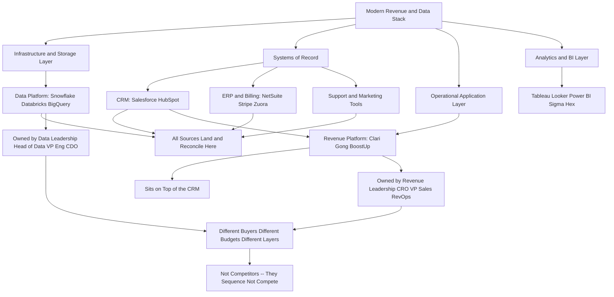

### Direct Answer

**"Snowflake vs Clari -- which should you buy?" is a category error disguised as a comparison, and the most useful answer is to refuse the framing.** Snowflake (NYSE: SNOW) is a cloud data platform -- the warehouse and compute layer where every team's data lands and reconciles -- while Clari is a revenue platform that sits on top of your CRM to forecast the quarter and inspect pipeline; they occupy different floors of the same building and do not compete. A mature company runs **both**, connected, and the only real decision a constrained buyer faces is **sequencing**: diagnose the binding bottleneck, buy the layer that unblocks it, and sequence the other.

## TL;DR

- **They are not competitors.** Snowflake is infrastructure (a data platform); Clari is an application (a revenue platform on top of the CRM). Comparing them is like asking "should I buy a foundation or a kitchen?"
- **The right question is bottleneck-first.** Not "which tool is better" but "which constraint costs me the most right now, and which layer relieves it."
- **Buy the revenue platform first** when the pain is an untrustworthy forecast and an uninspectable pipeline -- typically Series A-C with a real sales org.
- **Buy the data platform first** when the pain is fragmented data and company-wide disagreement about basic numbers -- typically scaling stage with many sources.
- **Mature companies run both**, connected through the CRM, with reconciliation between Clari's forecast and the Snowflake-fed finance model as a deliberate control.
- **The real bake-offs are within-layer:** Snowflake vs Databricks vs BigQuery vs Redshift; Clari vs Gong vs BoostUp vs Aviso vs Salesforce-native.
- **The skill worth buying into** is evaluation discipline -- bottleneck statements, true competitive sets, honest three-year TCO, structured procurement -- not picking a winner in a false binary.

This guide answers the literal question honestly, then does the more valuable thing: it teaches the B2B software evaluation discipline that makes "vs" questions answerable in the first place.

## 1. Why "Snowflake vs Clari" Is The Wrong Question

### 1.1 The hidden assumption inside the question

The phrase "Snowflake vs Clari -- which should you buy?" gets typed into search bars and dropped into Slack channels constantly, and almost every time it is asked, the asker has already made a subtle mistake: **they have assumed the two products occupy the same shelf.** They do not. Snowflake is a cloud data platform -- a place to land, store, transform, and query data at scale, the warehouse layer of a modern data stack. Clari is a revenue platform -- an application that sits on top of a CRM and helps sales and revenue teams forecast, inspect pipeline, and run deal and account workflows.

**Comparing them is like asking "should I buy a foundation or a kitchen?"** Both are part of a finished house, both cost money, and a contractor will happily sell you either -- but they are not substitutes. They are different floors of the same building.

### 1.2 Why the malformed question persists

The reason the question survives anyway is instructive, and worth naming precisely:

- **Both show up in the same budget conversations.** A COO or CFO sees both proposals in the same quarter and treats them as competing line items.
- **Both get pitched to revenue and operations leaders.** The audiences overlap even though the products do not.
- **Both promise "better visibility into the business."** The marketing rhymes even though the products do not.
- **Both vendors use the language of insight, intelligence, and growth.** That language is broad on purpose -- it lets each vendor appear relevant to budget conversations that strictly belong to the other layer.

### 1.3 The right question to ask instead

The genuinely useful response is not to pick a winner -- it is to **re-pose the question**. The right question is: *what is the actual bottleneck in my revenue-and-data operation right now, and which layer of the stack relieves it?* Once a buyer asks that, the false binary dissolves and a real decision appears. This guide answers the literal question (the two companies, side by side, honestly) and then teaches the evaluation discipline that makes "vs" questions answerable -- diagnosing bottlenecks, mapping the stack, sequencing purchases, and running a procurement process that does not get captured by whichever vendor has the better sales team.

| The malformed question | The well-formed question |
|---|---|
| "Snowflake or Clari -- which is better?" | "Which bottleneck costs me the most this quarter?" |
| Assumes the two are substitutes | Assumes each tool belongs to a stack layer |
| Resolved by a vendor bake-off | Resolved by a diagnosis, then a within-layer bake-off |
| Vendor's sales motion sets the frame | Buyer's bottleneck statement sets the frame |
| Produces an arbitrary winner | Produces a sequenced plan |

## 2. What Snowflake Actually Is

### 2.1 The job Snowflake does

Snowflake (NYSE: SNOW) is a cloud-native data platform. Strip away the marketing and it does a specific job: **it gives a company one place to store enormous volumes of structured and semi-structured data, and a fast, elastic engine to query and transform that data, with storage and compute separated so they scale and bill independently.**

A company pipes data into Snowflake from everywhere -- the CRM (Salesforce, owned by Salesforce Inc. (NYSE: CRM), or HubSpot (NYSE: HUBS)), the product itself (event and usage telemetry), the billing system (Stripe, or Zuora (NYSE: ZUO), or Oracle NetSuite (NYSE: ORCL)), the support tool (Zendesk, Intercom), marketing automation (Adobe Marketo (NASDAQ: ADBE), HubSpot) -- and then analysts, data scientists, and BI tools (Salesforce Tableau, Google Looker, Microsoft Power BI (NASDAQ: MSFT), Sigma, Hex) query it. **Snowflake is the layer where "the numbers" are supposed to finally agree.**

### 2.2 Snowflake's commercial scale

Snowflake's scale is large and worth stating plainly, because it tells you what kind of vendor you are dealing with:

| Metric | Figure |
|---|---|
| Product revenue (FY2025, approx) | ~$3.6B |
| Customers >$1M trailing-12-mo product revenue | ~745 |
| Net revenue retention (approx) | ~126-127% |
| IPO | 2020 (one of the largest software IPOs ever) |
| Pricing model | Consumption -- compute credits + storage |
| Stack layer | Infrastructure / data platform |

### 2.3 Why Snowflake is sticky

The point of those numbers is not to be impressed -- it is to understand the vendor's nature. **Snowflake is core infrastructure**, sold to data and engineering organizations, priced on consumption (credits for compute, plus storage), and once it is in, nearly every other analytical tool in the company reads from it. It is sticky because it is foundational. You do not "use Snowflake" the way a sales rep uses a forecasting tool; **you build on Snowflake the way a city builds on a power grid.** Snowflake competes with the other data platforms: Databricks, Google BigQuery (NASDAQ: GOOGL), Amazon Redshift (NASDAQ: AMZN), and Microsoft Fabric. It does not compete with a revenue application.

### 2.4 What the data platform changes about a company

Adopting a data platform is not a feature purchase -- it is an operating-model change. Before the warehouse, every team owns its own data island, and "the number" is whatever the most confident person in the room asserts. After the warehouse, there is a physical place where reconciliation *has* to happen, and the political cost of disagreeing with the warehouse rises sharply. **That cultural shift -- from data tribalism to a shared source of truth -- is the actual deliverable, and the technology is only the enabler.** This is also why a Snowflake purchase made for the wrong reason fails so completely: a company that buys the warehouse but never does the modeling, governance, and metric-definition work simply relocates its disagreements into a more expensive venue. The buyer who understands this evaluates Snowflake not by its query speed but by whether the organization is ready to let a warehouse arbitrate disputes that today get settled by seniority. For a contrasting strategy-and-career lens on what working inside this vendor looks like, see a career-track guide (q1923) and a vendor-AI-strategy guide (q1909).

## 3. What Clari Actually Is

### 3.1 The job Clari does

Clari is a revenue platform. Its job is also specific: **it connects to a company's CRM and other revenue signals and helps the go-to-market organization run the revenue process** -- forecast the quarter, inspect the pipeline, catch deals that are slipping, see which accounts are at risk, and give sales leadership and RevOps a defensible, repeatable forecasting cadence instead of a spreadsheet that three people maintain by hand.

Clari pulls activity data, CRM fields, and engagement signals, applies models and rollup logic, and produces forecasts and pipeline views that a VP of Sales can actually run a Monday forecast call against.

### 3.2 Clari's commercial profile

| Metric | Figure |
|---|---|
| Estimated ARR | $150M+ (estimate) |
| Valuation (2022 Series F, reported) | ~$2.6B |
| Founded | 2012 |
| Pricing model | Per-seat / per-package SaaS subscription |
| Typical annual deal range | Tens of thousands to low hundreds of thousands |
| Stack layer | Operational application / revenue platform |

### 3.3 Where Clari sits -- and what it competes with

The crucial thing to understand about Clari is **where it sits: it is an application on top of the CRM, not infrastructure underneath the company.** It does not replace Salesforce; it makes Salesforce data usable for forecasting and inspection. It competes with other revenue platforms -- Gong's forecasting product, BoostUp, Aviso, Mediafly (which absorbed InsightSquared), Salesforce's own forecasting and Revenue Intelligence features, and a long tail of pipeline tools. **It does not compete with a data warehouse.** A company "uses Clari" the way a sales org uses a workflow tool -- daily, in meetings, as part of a process.

### 3.4 What a revenue platform changes about a company

Like the warehouse, Clari's real deliverable is not a feature -- it is a behavior change. Before a revenue platform, the forecast is an artifact: a number assembled once a week by a RevOps analyst, defensible only to the person who built it, and re-litigated every Monday. After a revenue platform, the forecast becomes a **process** -- a repeatable cadence with a consistent methodology, an audit trail of how the number moved, and a shared surface where managers inspect deals against the same definitions. **The value is not "a better number"; it is a number the whole revenue org can stand behind without the analyst in the room.** This is also why Clari fails when adoption fails: a revenue platform that reps do not feed and managers do not inspect produces a forecast that is no more trustworthy than the spreadsheet it replaced, only more expensive. The buyer who understands this evaluates Clari not by its dashboard polish but by whether the sales organization has the discipline to run a real forecast cadence at all -- because the tool amplifies a process, it does not manufacture one.

## 4. The Stack Map: Where Each Tool Lives

### 4.1 Drawing the stack

The fastest way to end the "vs" confusion is to draw the stack. Every tool in a modern revenue-and-data operation occupies a layer, and tools on the same layer compete while tools on different layers sequence.

### 4.2 Reading the map

At the bottom sits **infrastructure and storage** -- the data platform (Snowflake, Databricks, BigQuery) -- where all data lands and reconciles. Feeding it is the **ingestion and transformation layer** -- Fivetran, Airbyte, dbt -- that moves and shapes data. Above the warehouse sits the **analytics and BI layer** -- Tableau, Looker, Power BI, Sigma, Hex -- where analysts build dashboards. Alongside all of that sit the **systems of record** -- the CRM, the ERP and billing system, support and marketing tools -- which both feed the warehouse and run day-to-day operations. And on top of the CRM specifically sit the **operational applications** that a function lives in -- and this is where Clari lives, in the revenue-operations application layer, next to Gong, Outreach, Salesloft, and the CRM's native intelligence features.

### 4.3 Why the map settles the argument

**Snowflake is a floor. Clari is a room on an upper floor.** They are connected -- Clari's forecasts and Snowflake's warehouse data should ultimately reconcile, and many companies pipe Clari or CRM data into Snowflake for deeper analysis -- but they are not the same purchase, not the same buyer, not the same budget line, and not substitutes under any circumstance. Once a buyer can place a tool on this map, "A vs B" becomes answerable: tools on the same layer compete; tools on different layers sequence. Snowflake and Clari are on different layers. Therefore they sequence -- the only real question is which one first, and that depends entirely on the bottleneck. (For a worked example of a genuine same-layer comparison, see q1886.)

## 5. The Real Decision: Diagnose The Bottleneck First

### 5.1 Bottleneck before vendor

Every good B2B software decision starts with a **bottleneck diagnosis, not a vendor comparison**. The question is never "which tool is better" in the abstract -- it is "which constraint is currently costing me the most, and which purchase relieves it." For a revenue-and-data stack, the two candidate bottlenecks map almost exactly onto the two products in the question.

### 5.2 Bottleneck A -- the forecast and pipeline are untrustworthy

**Symptoms:** the forecast is a spreadsheet that RevOps maintains while the CRO disagrees on the number; deals slip without warning; nobody can answer "what changed since last week" in pipeline; the board gets surprised; reps update Salesforce inconsistently and managers cannot inspect it. **If this is the pain, the bottleneck is in the revenue application layer**, and the purchase that relieves it is a revenue platform -- Clari or a competitor. Buying a data warehouse will not fix a Monday forecast call.

### 5.3 Bottleneck B -- the data is fragmented and nobody trusts any number

**Symptoms:** product usage lives in one place, billing in another, CRM in a third, support in a fourth; every team builds its own metrics and they never match; analysts spend their week reconciling exports; "what is our net revenue retention" takes a week to answer and the answer is contested. **If this is the pain, the bottleneck is in the data infrastructure layer**, and the purchase that relieves it is a data platform -- Snowflake or a competitor. Buying a forecasting tool will not fix an organization-wide source-of-truth problem.

| Symptom cluster | Binding bottleneck | Stack layer to buy | Wrong purchase |
|---|---|---|---|
| Forecast is a spreadsheet, deals slip silently | Forecast accuracy | Revenue platform | A data warehouse |
| Finance and RevOps disagree on NRR | Data fragmentation | Data platform | A forecasting tool |
| Reps will not update the CRM | Process and adoption | Process fix first | Any tool |
| Cannot answer cross-functional metrics | Data fragmentation | Data platform | A point solution |

### 5.4 The discipline

Write down the three most expensive symptoms in the business right now. **They will cluster. Buy for the cluster.** The vendor comparison comes after the bottleneck diagnosis, never before.

### 5.5 Putting a number on the bottleneck

A bottleneck statement that does not carry a rough cost is just a complaint. The discipline of attaching a number does two things: it forces honesty about whether the pain justifies a purchase at all, and it gives the eventual TCO model something to be measured against. **For a forecast bottleneck, the cost is estimable:** if a $30M-ARR company misses its forecast by 15% twice a year because pipeline is uninspectable, the downstream damage -- bad hiring decisions made on a phantom number, an over-aggressive spend plan, eroded board trust that raises the cost of the next round -- is plausibly worth several hundred thousand dollars and arguably far more in second-order effects. Against that, a six-figure revenue-platform contract is cheap. **For a data-fragmentation bottleneck, the cost is also estimable:** if four analysts each spend a day a week reconciling exports, that is roughly 0.8 of a full-time-equivalent burned on plumbing, plus the slower, lower-quality decisions made on contested numbers. The point is not precision -- it is that a costed bottleneck converts a vague "we should probably get a tool" into a defensible business case, and a buyer who cannot produce that number should treat the inability as a signal that they are not yet ready to buy.

## 6. When To Buy The Revenue Platform First

### 6.1 The signals

A buyer should reach for the revenue platform (Clari or an equivalent) first when the company's pain is concentrated in the go-to-market motion rather than in data infrastructure. **The clearest signals:** the company is post-Series-A with a real sales team (say, 8+ quota-carrying reps and a couple of sales managers), revenue is the thing the board is most anxious about, and the forecast is currently produced by heroics -- a RevOps analyst, a giant spreadsheet, and a prayer.

### 6.2 Why the bottleneck is enormous at this stage

In that situation the cost of the bottleneck is **enormous and immediate**: a missed forecast erodes board trust, triggers bad hiring and spending decisions, and is genuinely existential for a venture-backed company. A revenue platform attacks that pain directly -- it gives a repeatable forecast cadence, makes pipeline inspectable, surfaces slipping deals early, and reduces the dependence on one analyst's spreadsheet.

### 6.3 Why the data bottleneck is still tolerable

The data-infrastructure pain, at that stage, is usually still tolerable: the company has fewer data sources, the CRM plus a billing tool plus product analytics can be reconciled manually or with a lightweight BI tool, and a full warehouse would be expensive infrastructure for a problem the company does not yet acutely have. **The sequencing logic:** at Series A-C, with a real sales org and an untrustworthy forecast, buy the revenue platform first; defer the warehouse until data fragmentation becomes the dominant pain. The mistake to avoid is the reverse -- a sales-led company buying a Snowflake-centric modern data stack because it feels sophisticated, while the forecast it actually runs the business on stays a spreadsheet. (On whether a forecasting tool is even worth buying versus a CRM-native option, see q1745 and q1860.)

## 7. When To Buy The Data Platform First

### 7.1 The signals

The buyer should reach for the data platform (Snowflake or an equivalent) first when **the dominant pain is fragmentation and disagreement about basic numbers across the whole company** -- not just in sales. The signals: the company has crossed into scaling mode (often Series B and beyond, or a PLG company with serious product-telemetry volume), data now lives in many systems -- product events, billing, CRM, support, marketing, finance -- and the teams that depend on those numbers no longer agree on them.

### 7.2 Why a revenue platform cannot touch it

Finance's revenue number does not match RevOps's. The product team's "active users" does not match what marketing reports. Every cross-functional metric -- net revenue retention, CAC payback, gross margin by segment, expansion rate -- takes days to assemble and gets argued about when it lands. **That is an infrastructure bottleneck, and a revenue platform cannot touch it**, because a revenue platform only sees the CRM-and-engagement slice of the world. A data platform attacks it directly: one warehouse, one place where all sources land, one set of modeled and governed metrics that every BI tool and every team reads from.

### 7.3 The sequencing logic

At scaling stage, with many data sources and organization-wide disagreement about numbers, **buy the data platform first**; layer specialized applications like a revenue platform on top once the source of truth exists. The mistake to avoid here is the reverse -- a data-fragmented company buying point solution after point solution, each with its own definition of the truth, deepening the fragmentation it should be solving.

| Buy revenue platform first when... | Buy data platform first when... |
|---|---|
| Forecast is the board's top anxiety | Cross-functional metrics are contested |
| 8+ reps, untrustworthy pipeline | 5+ data sources, no agreed numbers |
| Few data sources, manageable manually | Sales pain is real but secondary |
| Series A-C, sales-led | Series B+, scaling, PLG telemetry volume |

## 8. Why Mature Companies Run Both

### 8.1 The layered system

The reason "vs" is the wrong word becomes obvious at scale: **most companies large enough to seriously evaluate either tool end up running both**, because they solve different problems and reinforce each other. A mature SaaS company at, say, $80M-$300M ARR typically has: a data platform (Snowflake) as the warehouse where the CRM, product telemetry, billing, support, and marketing all land; a BI layer on top for analysts and executives; the CRM (Salesforce) as the system of record; and a revenue platform (Clari) on top of the CRM so the go-to-market org can forecast and inspect pipeline. These are not redundant -- they are a layered system.

### 8.2 How the layers connect

- **Reconciliation as a control.** Clari's forecast and the warehouse's revenue model should reconcile. If Clari says the quarter lands at $24M and the Snowflake-fed finance model says $21M, that gap is a finding, and discovering it is a feature of having both.
- **Clari-into-Snowflake.** Many companies pipe Clari's data, or the underlying CRM data Clari structures, into Snowflake for deeper longitudinal analysis -- win-rate trends, segment-level pipeline conversion, the analyses a forecasting application is not built to run.
- **Snowflake-into-Clari context.** Product-usage and billing signals modeled in Snowflake can enrich the account health that the revenue team inspects.

### 8.3 The healthy mental model

The healthy mental model is not "Snowflake or Clari." It is **"Snowflake and Clari, connected, each doing the job the other cannot, with reconciliation between them as a deliberate control."** The only real question a buyer with budget for one-but-not-yet-both faces is sequencing -- and that, again, is settled by the bottleneck.

## 9. The True Competitive Sets

### 9.1 The Snowflake competitive set

If the genuine decision is "I have a data-infrastructure bottleneck, which data platform do I buy," the real comparison set is **not Clari** -- it is the other data platforms.

- **Databricks** is the closest peer and the most common true competitor: a lakehouse platform strong in data science, ML, and large-scale data engineering, increasingly overlapping with Snowflake on warehousing. The rough rule of thumb: ML-heavy organizations lean Databricks; SQL-analytics-and-BI-heavy organizations lean Snowflake, though both are converging.
- **Google BigQuery** is the serverless data warehouse for companies already deep in Google Cloud, with a simple consumption model.
- **Amazon Redshift** is the AWS-native warehouse, often the default for companies heavily invested in AWS.
- **Microsoft Fabric / Azure Synapse** is the Microsoft-ecosystem answer, attractive to companies standardized on Azure and Power BI.

### 9.2 The Clari competitive set

Symmetrically, if the genuine decision is "I have a forecasting-and-pipeline bottleneck, which revenue platform do I buy," the real comparison set is **not Snowflake** -- it is the other revenue platforms.

- **Gong** is the most prominent overlapping competitor: it started in conversation intelligence and expanded into forecasting and a broader revenue platform, so Gong-vs-Clari is a real and common bake-off.
- **BoostUp** competes directly on forecast accuracy and pipeline inspection.
- **Aviso** is an AI-centric forecasting and revenue-operations platform.
- **Mediafly (which absorbed InsightSquared)** offers revenue intelligence and analytics.
- **Salesforce's own** forecasting and Revenue Intelligence is the incumbent "good enough and already paid for" option every revenue-platform vendor has to displace.

### 9.3 The point of both sets

| If the bottleneck is... | The real comparison set is... |
|---|---|
| Untrustworthy forecast, uninspectable pipeline | Clari vs Gong vs BoostUp vs Aviso vs Mediafly vs Salesforce-native |
| Fragmented data, no agreed numbers | Snowflake vs Databricks vs BigQuery vs Redshift vs Microsoft Fabric |

When a buyer correctly identifies a data-platform decision, "Snowflake vs Clari" was never the comparison. When they correctly identify a revenue-platform decision, "Clari vs Snowflake" was never the comparison either. **The "vs" only makes sense within a layer.**

### 9.4 How to tell a real "vs" from a fake one

A buyer can test any "X vs Y" question with three quick checks before investing a procurement cycle in it. **First, the buyer test:** would the same executive own both purchases? If a Head of Data owns one and a CRO owns the other, they are almost certainly on different layers and do not compete. **Second, the substitution test:** if you bought X, would you genuinely not need Y -- or would you still need Y for a different job? If you would still need both, the "vs" is fake. **Third, the failure-mode test:** do X and Y fail for the same reasons? Two tools with disjoint failure modes -- one fails on governance, the other on adoption -- are complements, not competitors. "Snowflake vs Clari" fails all three tests, which is the cleanest possible proof that it is a malformed question. By contrast, a true within-layer comparison -- two revenue platforms, or two data warehouses -- passes all three: same buyer, real substitution, shared failure modes. The discipline of running these three tests up front saves a buyer from spending weeks bake-off-testing two products that were never alternatives to begin with.

## 10. How To Run A B2B Software Evaluation

### 10.1 The eight-step process

Since the real lesson of this question is evaluation discipline, here is the process a competent buyer runs regardless of which layer they are buying:

1. **Write the bottleneck statement.** One paragraph -- the specific, expensive symptom you are buying to relieve, with a rough cost attached. If you cannot write it, you are not ready to buy.
2. **Define requirements from the bottleneck, not from demos.** Rank must-haves vs nice-to-haves before any vendor talks to you, because vendor demos are designed to redefine your requirements around their strengths.
3. **Identify the true competitive set** -- the tools on the same stack layer.
4. **Run a structured bake-off** -- the same scenario, the same data, the same evaluators scoring against the same rubric, ideally a paid pilot rather than a guided demo.
5. **Model total cost of ownership honestly** -- not just license, but implementation, integration, internal headcount, and for consumption-priced tools, a realistic projection of usage-based spend.
6. **Check integration and exit** -- how it connects to what you already own, and how hard it is to leave.
7. **Reference-check with same-stage companies**, not the vendor's flagship logos.
8. **Negotiate, and time the negotiation** -- enterprise SaaS pricing is highly negotiable; multi-year and end-of-quarter dynamics matter.

### 10.2 Why the process matters

This process is what makes "vs" questions answerable; **skipping it is what makes buyers ask malformed ones.** A buyer who insists on the bottleneck statement first, who maps every pitched tool onto a stack layer before taking the meeting, and who refuses to let a vendor's framing define the requirements, is largely immune to the false-binary trap.

| Step | What it produces | What it prevents |
|---|---|---|
| Bottleneck statement | A specific, costed problem | Buying from FOMO |
| Requirements from pain | A vendor-neutral rubric | Demo-driven scope creep |
| True competitive set | The right shortlist | Cross-layer comparisons |
| Structured bake-off | Comparable evidence | Sales-theater bias |
| Honest TCO model | A three-year cost picture | Sticker-price surprises |
| Reference checks | Same-stage reality | Flagship-logo distortion |

## 11. Total Cost Of Ownership: Two Pricing Models

### 11.1 Snowflake is consumption-priced

A buyer comparing anything to Snowflake has to understand that its pricing model is **structurally different** from an application like Clari. Snowflake is consumption-priced: you buy credits consumed by compute (every query, every transformation, every workload), plus you pay for storage. The bill scales with usage -- elastic and fair in principle, but it also means a poorly governed deployment, an inefficient query pattern, an always-on warehouse, or a sudden growth in data volume can make the bill climb in ways nobody forecast. **Snowflake TCO planning has to include the discipline** -- query optimization, warehouse sizing, governance -- required to keep consumption in line.

### 11.2 Clari is seat-priced

**Clari is seat-priced (mostly).** It is a per-user or per-package SaaS subscription -- you buy access for a defined set of users plus modules. The bill is far more predictable; it scales with headcount and module adoption, not usage intensity. The TCO surprises with an application like Clari are different in kind -- they come from seat creep, module upsell, and the implementation and CRM-hygiene work required to make it produce trustworthy forecasts.

### 11.3 The two models compared

| Dimension | Snowflake (infrastructure) | Clari (application) |
|---|---|---|
| Billing basis | Consumption (credits + storage) | Seats + modules |
| Cost predictability | Variable -- scales with usage intensity | Predictable -- scales with headcount |
| Main TCO surprise | Runaway consumption, ungoverned queries | Seat creep, module upsell, shelfware |
| Cost-control discipline | Query optimization, warehouse sizing, governance | Adoption enforcement, seat-count audits |
| Negotiation lever | Credit commitment vs realistic usage projection | Seat count, module scope, quarter timing |

**The lesson for any "vs" evaluation:** never compare a consumption-priced infrastructure tool and a seat-priced application on sticker price alone -- the cost behavior over three years is the thing that matters, and the two models behave nothing alike.

## 12. The Buyer Personas: Who Owns Each Decision

### 12.1 Snowflake's owner

**Snowflake is typically owned by data and engineering leadership** -- a Head of Data, a VP of Engineering, a Chief Data Officer, sometimes a CTO -- with the analytics organization as the primary user base and finance as a heavily invested stakeholder. The decision runs through a data-strategy lens: architecture, governance, scalability, cloud alignment.

### 12.2 Clari's owner

**Clari is typically owned by revenue leadership** -- a CRO, a VP of Sales, or a Head of Revenue Operations -- with sales managers and reps as the user base and the CEO and board as the stakeholders who consume its outputs. The decision runs through a go-to-market lens: forecast accuracy, pipeline discipline, rep adoption.

### 12.3 When one budget owner sees both proposals

When a single budget owner -- often a COO or CFO at a smaller company -- finds both proposals on their desk in the same week, the temptation is to treat them as competing line items and pick one. **That is the trap.** The correct move is to recognize they are looking at a data-infrastructure proposal and a revenue-operations proposal, route each to the right diagnostic question, and sequence them by bottleneck severity -- not to force an apples-to-oranges bake-off between an engineering tool and a sales tool.

| Decision | Owner | User base | Stakeholder | Lens |
|---|---|---|---|---|
| Snowflake | Head of Data, VP Eng, CDO, CTO | Analysts, data scientists, engineers | Finance | Data strategy |
| Clari | CRO, VP Sales, Head of RevOps | Reps, managers, RevOps | CEO, board | Go-to-market |

## 13. Common Mistakes In Stack Buying

### 13.1 The eight recurring errors

The "Snowflake vs Clari" confusion is one instance of a broader set of recurring B2B buying mistakes:

- **Comparing tools on different stack layers.** The core error in this question -- treating infrastructure and an application as substitutes.
- **Buying from a demo instead of a bottleneck.** Letting a vendor's polished demo define requirements rather than deriving them from diagnosed pain.
- **Buying sophistication you do not need yet.** A Series A company building a Snowflake-centered stack because it is fashionable, while its forecast stays a spreadsheet.
- **Deepening fragmentation with point solutions.** A data-fragmented company buying yet another tool with its own private definition of the truth.
- **Ignoring consumption-cost behavior.** Signing a consumption-priced infrastructure deal without the governance to control spend.
- **Under-budgeting implementation and adoption.** Assuming the license cost is the cost.
- **Skipping reconciliation.** Running both a warehouse and a revenue platform but never reconciling their numbers.
- **Letting the loudest vendor win.** Buying from the vendor with the best sales motion rather than the best fit.

### 13.2 Why naming them helps

Naming the mistakes is itself a defense: a buyer who has the list in front of them can audit a pending decision against it. **Every one of these is avoidable with the evaluation discipline above.** The thread running through all eight is the same -- the buyer let something other than a diagnosed bottleneck drive the purchase.

## 14. Company Scenarios By Stage

### 14.1 The four scenarios

Concrete scenarios make the sequencing logic tangible:

- **Scenario one -- the Series A PLG startup, ~$3M ARR, 6 reps.** The forecast is a spreadsheet, the board is anxious about revenue, data sources are few. The bottleneck is the forecast. They buy a revenue platform (Clari, Gong Forecast, or a Salesforce-native option if budget is tight) and defer the warehouse.
- **Scenario two -- the Series C scaling company, ~$40M ARR.** Product telemetry, billing, CRM, support, and marketing data all live in separate systems; finance and RevOps disagree on NRR. The bottleneck is fragmentation. They buy the data platform, build the BI layer, and likely already run a revenue platform on top.
- **Scenario three -- the $150M ARR enterprise SaaS company.** It runs Snowflake as the warehouse, Salesforce as the system of record, Clari on top for forecasting, and a BI layer for analysts -- and its quarterly close includes reconciling Clari's forecast against the Snowflake-fed finance model. The "vs" question never arises.
- **Scenario four -- the cautionary tale.** A sales-led Series B company, talked into a fashionable Snowflake-centric stack by a consultancy, spends two quarters on infrastructure while its forecast stays a manually maintained spreadsheet, and misses the number it could not see coming.

### 14.2 Sequencing logic by stage

| Stage | Dominant bottleneck | Buy first | Sequence later |
|---|---|---|---|
| Series A-B (~$1M-$10M ARR), real sales team | Forecast accuracy, pipeline discipline | Revenue platform | Data platform |
| Series B-C scaling (~$10M-$50M ARR) | Data fragmentation across many systems | Data platform | Revenue platform (often present) |
| Growth / enterprise ($80M-$300M+ ARR) | Both -- different layers, both acute | Both, connected | Reconciliation as ongoing control |

## 15. What Each Tool Does Not Do

### 15.1 Snowflake does not forecast your quarter

A clean way to internalize that these are not substitutes is to state plainly what each one does **not** do. **Snowflake does not forecast your quarter.** It will not run a Monday forecast call, will not tell a sales manager which deals are slipping, will not give a rep a pipeline view, will not enforce CRM hygiene. It is a warehouse and a query engine; turning its data into a revenue workflow requires applications and BI built on top of it. A company that buys Snowflake and expects better forecasting has misunderstood the purchase.

### 15.2 Clari does not unify your data

**Clari does not unify your company's data.** It will not be the single source of truth for product usage, billing, support, and marketing; it does not replace a warehouse; it does not give the data team a governed metrics layer; it does not let an analyst run an arbitrary longitudinal query across every system. It sees the CRM-and-engagement slice of the world, deeply, and that is its job.

### 15.3 Disjoint failure modes prove the point

The two "does not" lists do not overlap at all -- and **that non-overlap is the proof that the tools are complements, not competitors.** When two products have completely disjoint failure modes, they are not on the same shelf.

## 16. The Procurement And Negotiation Playbook

### 16.1 Negotiating an infrastructure deal

For an **infrastructure deal like Snowflake**: negotiate the credit commitment against a realistic -- not optimistic -- usage projection, because over-committing wastes money and under-committing forfeits discount tiers; insist on clarity about how consumption is measured and billed; build in governance and cost-monitoring from day one; and treat the multi-year commitment as a real forecast exercise.

### 16.2 Negotiating an application deal

For an **application deal like Clari**: negotiate on seat count and module scope, push back on seat-count inflation, time the deal to the vendor's quarter-end when discounting is most flexible, and tie payment or expansion milestones to actual adoption so you are not paying for shelfware.

### 16.3 What applies to both

For **both**: get a proper pilot before signing; reference-check with same-stage companies; read the integration and data-exit terms; involve the people who will actually use and run the tool; and remember the first quote is an opening position. **Enterprise SaaS pricing has wide negotiation latitude** -- multi-year terms, quarter timing, competitive tension between vendors in the true competitive set, and a willingness to walk are all real leverage. The buyer who runs procurement as a process rather than accepting the vendor's process gets materially better terms on either layer.

## 17. The Integration Reality: How They Touch

### 17.1 The CRM is the hinge

Because the cleanest proof that two tools are complements is showing how they physically connect, it is worth being concrete about the wiring. **The CRM -- Salesforce, almost always -- is the hinge.** Clari connects to Salesforce and reads the opportunity, account, and activity objects, applies its forecasting and rollup logic, and produces forecasts and pipeline views. That same Salesforce instance is also one of the sources piped into Snowflake by an ELT tool like Fivetran, landing the raw CRM objects in the warehouse on a schedule. So both tools are downstream of the CRM, but they do different things with it: **Clari turns it into a live revenue workflow; Snowflake turns it into a historical, joinable, governed dataset.**

### 17.2 Three integration patterns

- **Clari-into-Snowflake.** Companies export Clari's structured forecast data, snapshot history, and pipeline-change records into Snowflake so analysts can run longitudinal analyses Clari is not built for.
- **Snowflake-into-Clari context.** Product-usage and billing signals modeled in the warehouse can be fed back as account-health or risk inputs the revenue team inspects.
- **Parallel-and-reconcile.** The two are kept independent on purpose, and the finance model built on Snowflake data is reconciled against Clari's forecast every close as a deliberate control.

### 17.3 The lesson of the wiring

Tools that are wired together as source-and-consumer, or run in parallel as a cross-check, are by definition not substitutes -- **you do not "reconcile" a thing against its own replacement.**

## 18. The Stack As A Company Grows

### 18.1 The full arc

A buyer reasons better about sequencing when they can see the whole arc:

- **Seed to Series A (under ~$2M ARR).** The stack is deliberately thin -- a CRM, a billing tool, product analytics, and a spreadsheet doing the work of both a forecast and a warehouse. Neither Snowflake nor Clari belongs here yet.
- **Series A to B (~$2M-$10M ARR).** A real sales team forms, the forecast spreadsheet starts failing under its own weight, and the first genuine revenue-platform decision appears -- the stage where Clari (or Gong Forecast, or hardened Salesforce-native forecasting) earns its place.
- **Series B to C (~$10M-$50M ARR).** Data sources multiply and cross-functional metric disagreement becomes the dominant pain -- where the data platform and a real BI layer get built.
- **Growth and enterprise ($50M-$300M+ ARR).** The full layered stack is in place; the work shifts from buying layers to governing them.

### 18.2 Why the arc makes the answer obvious

Seeing this arc makes the answer to "Snowflake vs Clari" obvious: **they enter the stack at different stages, for different reasons, and a company far enough along to need both was never really choosing between them.** A buyer who has internalized the arc also gains a quieter benefit: the ability to recognize when they are *ahead of* the arc. A Series A company seriously evaluating a warehouse, or a seed-stage company shopping for a revenue platform, is usually not solving a tooling gap -- it is solving a status anxiety, buying the stack of the company it wants to be rather than the company it is. The arc gives that buyer permission to wait, and waiting is frequently the highest-return decision available, because every layer added before its bottleneck binds is capital and attention spent on a problem the company does not yet have.

### 18.3 The arc also predicts the next purchase

The arc is not only a diagnostic for today -- it is a roadmap. A company that has correctly bought a revenue platform at Series B can look one stage ahead and see the data-fragmentation bottleneck forming, and begin the warehouse evaluation *before* the pain becomes acute rather than scrambling once finance and RevOps are already at war over the numbers. **Sequencing is easier when it is anticipated than when it is reactive**, and the buyer who reads the arc forward turns each purchase into a calm, well-run process instead of a panicked response to a metric nobody can agree on.

## 19. The Vendor Sales Motion: Why The Question Gets Asked

### 19.1 Expansive language by design

It is worth being cynical for a moment about why a malformed comparison circulates at all. Both Snowflake and Clari run sophisticated, well-funded go-to-market motions, and both deliberately use **expansive language** -- "visibility into your business," "intelligence," "a single source of truth for revenue," "the platform for growth." That language is broad on purpose: it lets each vendor appear relevant to budget conversations that strictly belong to the other layer. A Snowflake account team is happy to talk to a CRO about "revenue analytics," and a Clari account team is happy to talk about being "the source of truth for the revenue number."

### 19.2 The ecosystem that amplifies it

Add the consultancy and analyst ecosystem, which packages and repackages "the modern stack" in ways that flatten layer distinctions, and the influencer content that chases search traffic with "X vs Y" headlines regardless of whether X and Y compete, and you get a **steady manufacture of false binaries.**

### 19.3 The structural defense

The defense is structural, not attitudinal: a buyer who insists on the bottleneck statement first, who maps every pitched tool onto a stack layer before taking the meeting, and who refuses to let a vendor's framing define the requirements, is largely immune. **The vendors are not lying** -- they are each accurately describing their own value in the broadest defensible terms. It is the buyer's job, not the vendor's, to keep the layers straight.

## 20. Risk And Failure Modes

### 20.1 How a Snowflake purchase fails

A complete evaluation considers how each purchase fails. **A Snowflake purchase fails** when consumption runs ungoverned and the bill balloons past any forecast; when the warehouse gets built but the data modeling and governance work never happens, so it becomes a swamp of conflicting tables; when it is bought ahead of the bottleneck and sits underused; or when nobody owns it and it drifts. The common thread: Snowflake failures are about **discipline and governance** -- the tool works, the organization around it does not.

### 20.2 How a Clari purchase fails

**A Clari purchase fails** when reps do not adopt it and CRM hygiene stays poor, so the forecast is garbage-in-garbage-out; when it is bought to paper over the absence of a revenue process rather than to support one; when seat count inflates past actual usage; or when leadership treats its forecast as magic rather than as a model that still requires judgment. The common thread: Clari failures are about **adoption and process** -- the tool works, the go-to-market motion around it does not.

### 20.3 What the failure modes teach

Knowing these failure modes sharpens the evaluation: for an infrastructure tool, scrutinize your own governance maturity; for an application tool, your own process and adoption discipline. **The tool is rarely the point of failure. The organization's readiness for that layer is.**

| Tool | Failure mode | Root cause | What to scrutinize before buying |
|---|---|---|---|
| Snowflake | Runaway consumption, swamp of tables | Discipline and governance | Data team maturity, FinOps capacity |
| Clari | Garbage forecasts, shelfware seats | Adoption and process | Revenue process, CRM hygiene |

## 21. Counter-Case: When The Framework Is Too Glib

The guide above argues that Snowflake and Clari are not competitors and that the real skill is bottleneck diagnosis and sequencing. That is correct -- but a sharp buyer should push back where the tidy framework gets too comfortable.

### 21.1 "Buy both eventually" can be an excuse to never say no

The layered-stack answer is true for large companies, but for a resource-constrained startup, "you'll need both eventually" is exactly the reasoning that produces bloated tool spend. **The disciplined version is not "buy both"** -- it is "buy one, prove it relieves the bottleneck, and do not buy the second until its pain is genuinely binding." The framework must come with the discipline to defer, not just to sequence.

### 21.2 The cheaper, already-owned option is often the right first answer

A Series A company with a shaky forecast may not need Clari at all -- it may need to actually use Salesforce's native forecasting, clean up its CRM hygiene, and run a disciplined forecast cadence. **Many "we need a revenue platform" problems are really "we have no revenue process" problems**, and a new tool on top of a broken process just makes the brokenness more expensive.

### 21.3 The lines genuinely blur, and will blur more

The clean "infrastructure vs application" split is real today but softening. Data platforms are pushing up into applications and "data apps"; revenue platforms are deepening their analytics; CRMs are absorbing both forecasting and intelligence features. **A buyer who treats the layer boundaries as permanent may over-buy** -- in two years, the CRM-native or warehouse-native option may cover what a separate tool does today.

### 21.4 Bottleneck diagnosis is harder than the framework admits

"Just diagnose the bottleneck" assumes the organization can see itself clearly. In practice, the loudest executive's pain often gets labeled "the bottleneck" regardless of cost, and political reality -- which VP has budget, which one is trusted -- drives the purchase more than any rubric. **The framework is correct in principle and routinely defeated by org politics in practice.**

### 21.5 Consumption pricing makes "infrastructure first" riskier than it looks

Telling a scaling company to "buy the data platform first" understates how badly Snowflake spend can surprise an organization that lacks the governance maturity to control it. For some companies, **the responsible sequencing is to delay the warehouse until they can staff the discipline to run it** -- an ungoverned consumption contract is its own kind of failure.

### 21.6 Sometimes the honest answer is "neither, yet"

Both products are real and good, but a company asking "Snowflake vs Clari" while it has six reps, three data sources, and no documented revenue process may not be ready for either. **The most valuable answer is "fix the process and the definitions first; the tools amplify whatever discipline you already have, and amplify the absence of it just as faithfully."**

### 21.7 The honest verdict

The core claim stands: Snowflake and Clari are not competitors, the question is malformed, and the real work is bottleneck diagnosis, true-competitive-set evaluation, honest TCO modeling, and disciplined sequencing. But the framework is **not a license to buy -- it is a license to decide**, and the most common right decision for a constrained company is to buy *one* layer (or *neither* yet), fix the underlying process, control the cost behavior, and stay deeply skeptical of any sequencing logic that always seems to conclude "yes, buy something."

## 22. The Final Answer To The Literal Question

### 22.1 The diagnosis, not a winner

So, directly: **which should you buy, Snowflake or Clari?** Neither answer is "the other one is worse," because they are not competitors. The answer is a diagnosis.

- **If your most expensive, most board-visible problem is that you cannot trust your forecast and cannot inspect your pipeline**, buy the revenue platform first -- Clari, Gong, BoostUp, or a Salesforce-native option, evaluated honestly against each other -- and sequence the warehouse for when data fragmentation becomes the dominant pain.
- **If your most expensive problem is that your data is scattered and no team agrees on basic numbers**, buy the data platform first -- Snowflake, Databricks, or BigQuery, evaluated honestly against each other -- and layer the revenue platform on top once the source of truth exists.
- **If both pains are real and acute**, you are not choosing -- you are running both, connected, with reconciliation as a deliberate control, which is exactly what mature SaaS companies do.

### 22.2 The skill worth buying into

In every case, the move that protects your budget and your business is not picking a side in a false binary -- it is running the evaluation discipline: diagnose the bottleneck, identify the true same-layer competitive set, run a structured bake-off, model three-year TCO honestly, and negotiate as a process. **The question "Snowflake vs Clari" is a small trap. The skill of refusing the trap -- of seeing the stack, the layers, and the real decision underneath the marketing -- is the thing worth actually buying into.**

## 23. Related Pulse Library Entries

The bottleneck-first evaluation discipline and the stack-layer logic in this entry connect to a range of sibling guides. The most directly relevant cross-links:

- A genuine "which should you buy" comparison that, like this one, rewards mapping the contenders onto a stack layer before choosing (q1886).
- A second cross-layer "which should you buy" question where the same category-error trap appears -- two tools that look comparable but are not (q1876).
- An automation-versus-AI-agent buying comparison that benefits from the same bottleneck-first framing (q1872).
- A same-layer sales-tooling comparison showing what a *legitimate* "vs" bake-off looks like when both tools really do compete (q1879).
- Another within-layer sales-engagement bake-off illustrating the structured-comparison discipline this guide recommends (q1854).
- An infrastructure-tier "which should you buy" comparison where TCO and consumption-cost behavior dominate the decision (q1679).
- A direct evaluation of whether a pipeline-AI feature is worth buying versus Clari -- a true same-layer revenue-platform comparison (q1860).
- A forecasting-tool buying question that turns on whether a CRM-native option is genuinely insufficient (q1745).
- A scenario where the bottleneck-diagnosis discipline is applied to a different business problem entirely (q9501).
- A sequencing-and-constraint-relief question in a scaling context, mirroring the "buy the layer that unblocks the bottleneck" logic here (q9502).

## Sources

1. Snowflake Inc. -- Investor Relations and FY2025 Annual Results. Reported product revenue, customer counts, and net revenue retention. https://investors.snowflake.com
2. Snowflake -- Form 10-K Annual Report (SEC Filing). Audited financials, customer metrics, and business description. https://www.sec.gov
3. Snowflake -- Official Product Documentation and Architecture Overview. Separation of storage and compute; consumption-based credit pricing. https://docs.snowflake.com
4. Snowflake -- Pricing and Credit Consumption Guide. How compute credits and storage are measured and billed. https://www.snowflake.com/pricing
5. Snowflake -- Investor Day and Quarterly Earnings Presentations. Growth, retention, and customer-cohort context. https://investors.snowflake.com
6. Clari -- Company Site and Revenue Platform Overview. Forecasting, pipeline inspection, and revenue orchestration. https://www.clari.com
7. Clari -- Series F Funding Announcement (2022). Reported valuation and funding round details. https://www.clari.com/blog
8. Crunchbase -- Clari Company Profile. Funding history, founding date, and investor information. https://www.crunchbase.com/organization/clari
9. Clari -- Product Documentation and Forecasting Methodology. How CRM data, activity, and rollup logic produce a forecast. https://docs.clari.com
10. Databricks -- Lakehouse Platform Overview. Competitive context for the data-platform layer. https://www.databricks.com
11. Google Cloud -- BigQuery Documentation. Serverless data warehouse competitive context. https://cloud.google.com/bigquery
12. Amazon Web Services -- Redshift Documentation. AWS-native data warehouse competitive context. https://aws.amazon.com/redshift
13. Microsoft -- Fabric and Azure Synapse Analytics Documentation. Microsoft-ecosystem data-platform context. https://learn.microsoft.com/fabric
14. Gong -- Revenue Intelligence and Forecasting Platform. Primary competitive context for the revenue-platform layer. https://www.gong.io
15. BoostUp -- Revenue Intelligence Platform. Forecasting and pipeline-inspection competitive context. https://www.boostup.ai
16. Aviso -- AI Revenue Operating System. AI-forecasting competitive context. https://www.aviso.com
17. Mediafly / InsightSquared -- Revenue Intelligence. Revenue analytics competitive context. https://www.mediafly.com
18. Salesforce -- Revenue Intelligence and Sales Cloud Forecasting. The CRM-native incumbent option. https://www.salesforce.com
19. Fivetran -- Automated Data Movement Platform. Ingestion-layer context for how data reaches the warehouse. https://www.fivetran.com
20. dbt Labs -- Analytics Engineering and Transformation. Transformation-layer context in the modern data stack. https://www.getdbt.com
21. Airbyte -- Open-Source Data Integration. Alternative ingestion-layer context. https://airbyte.com
22. Gartner -- Magic Quadrant for Cloud Database Management Systems. Independent analyst positioning of data-platform vendors.
23. Gartner -- Market Guide for Revenue Intelligence and Forecasting Platforms. Independent analyst positioning of revenue-platform vendors.
24. Forrester -- Wave Reports on Data Management and Revenue Operations. Analyst evaluations covering both stack layers.
25. G2 -- Data Warehouse Software Category and Reviews. Practitioner reviews and category definition for the data-platform layer. https://www.g2.com
26. G2 -- Revenue Operations and Intelligence Category and Reviews. Practitioner reviews and category definition for the revenue-platform layer. https://www.g2.com
27. a16z -- The Modern Data Stack and Data-Apps Commentary. Reference framing for stack-layer architecture. https://a16z.com
28. OpenView -- SaaS Benchmarks and Go-To-Market Operations Reports. Context on forecasting maturity and RevOps tooling by stage.
29. Bessemer Venture Partners -- State of the Cloud. Industry context on data-infrastructure and application-layer SaaS spending. https://www.bvp.com
30. RevOps Co-op and Pavilion -- Practitioner Community Guidance. Practitioner perspective on revenue-platform selection and adoption.
31. Snowflake vs Databricks -- Independent Technical Comparisons. Third-party analysis of the true data-platform bake-off.
32. Clari vs Gong -- Independent Buyer Comparisons. Third-party analysis of the true revenue-platform bake-off.
33. Vendr and Tropic -- Enterprise SaaS Procurement and Negotiation Guides. Reference for consumption-vs-seat pricing, TCO modeling, and negotiation timing.
34. SEC EDGAR -- Public SaaS Company Filings. Cross-reference for revenue, retention, and customer-metric definitions. https://www.sec.gov/edgar
35. Snowflake and Clari Customer Case Studies and Integration Documentation. Real-world examples of how the two layers connect and reconcile.
