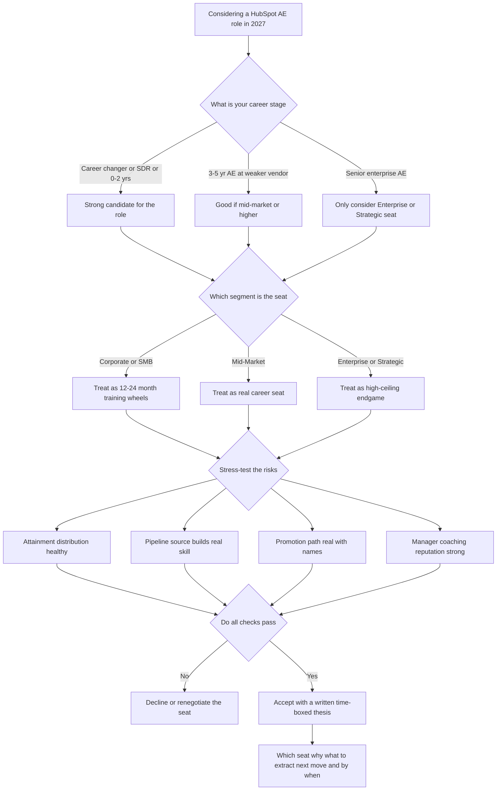

### Direct Answer

A HubSpot Account Executive role is **still a genuinely good career bet in 2027** — but only as a deliberate, segment-aware, skill-stacking play with a written exit thesis, not as a passive place to ride a velocity quota forever. The honest read: for early-to-mid-career sellers, career changers, and SDRs ready to close, a HubSpot AE seat is one of the best skill-acquisition and credential-building engines in all of B2B SaaS, while for already-senior enterprise sellers it is a likely step-down unless the specific seat is mid-market or enterprise. The single fact that decides everything is which of the three structurally different jobs hiding behind the title "HubSpot AE" you are actually being offered, and how fast you move between them.

**TL;DR:** "HubSpot AE" is not one job — it is at least three (Corporate/SMB, Mid-Market, Enterprise/Strategic) sharing a title, a logo, and a CRM. HubSpot (NYSE: HUBS) in 2026-2027 is a mature, ~$2.6B-run-rate platform company with 250K+ customers and a deliberate push upmarket — so the Corporate seat that historically defined "HubSpot AE" is thinning under product-led growth and AI, while mid-market and enterprise seats are getting *more* valuable. As a first or second sales job the role is elite training: world-class enablement, the HubSpot Sales Method, a recognizable logo, and a cadence fast enough to run hundreds of full cycles in two years. As a ten-year home it underperforms unless you climb into mid-market/enterprise or out into RevOps, management, or partnerships. Three things decide whether the seat compounds: **(a)** which segment you sit in, **(b)** whether you build transferable, AI-resistant skill, and **(c)** your timing and exit awareness. Net: a deliberate yes — take it as a 2-4 year credential-and-capability compounder with a known exit thesis; decline it as a passive "ride the velocity quota forever" plan.

---

## 1. The Title Hides Three Different Jobs

The single biggest mistake people make when they ask "is a HubSpot AE role good for my career" is treating "HubSpot AE" as one job. It is not. By 2027 it is at least three structurally different jobs that happen to share a title, a logo, and a CRM — and the career answer is completely different for each.

### 1.1 The Corporate / SMB Account Executive

The **Corporate / SMB Account Executive** is historically the engine room of HubSpot's go-to-market: selling Starter and Professional tier subscriptions into small businesses, working a high-volume pipeline, running sales cycles measured in days-to-weeks, carrying a quota built on deal *count* and velocity, and living inside a heavily systematized, inbound-fed motion. When someone on the internet says "HubSpot AE is a dead-end velocity grind," they are almost always describing this seat. It is the training wheels — genuinely excellent training wheels — but it is not a destination.

### 1.2 The Mid-Market Account Executive

The **Mid-Market Account Executive** sells Professional and Enterprise tier multi-hub deals into companies with real org charts, multiple stakeholders, an actual procurement process, sales cycles measured in months, and a quota built on deal *size* and expansion. This is where the career actually lives. It is the seat where you learn the skills that compound for the next twenty years: multi-stakeholder discovery, business-case construction, and land-and-expand motion.

### 1.3 The Enterprise / Strategic Account Executive

The **Enterprise / Strategic Account Executive** sells six-figure-plus multi-product platform deals into companies that already run a Salesforce or Microsoft footprint, where you are displacing incumbents, multi-threading across a buying committee, building executive business cases, and coordinating solutions engineers, partners, and customer success in a genuinely complex sale. When someone says "HubSpot AE is one of the best enterprise-sales training grounds in tech," they are describing this and the mid-market seat.

### 1.4 The Specialist Seats

Layered on top are **specialist seats** — Channel/Partner AEs who sell through HubSpot's solutions-partner ecosystem, and product-specialist AEs attached to specific hubs. These seats trade some quota leverage for a different, often more durable, skill profile.

| Seat type | Core motion | Quota basis | Career signal |
|---|---|---|---|
| Corporate / SMB AE | High-velocity inbound | Deal count + velocity | Training wheels — exit within 24 months |
| Mid-Market AE | Multi-stakeholder, months-long | Deal size + expansion | Real career seat — durable skills |
| Enterprise / Strategic AE | Complex, displacement, six-figure | Lumpy, large deals | High-ceiling endgame inside HubSpot |
| Channel / Partner AE | Sell through the ecosystem | Partner-sourced ARR | Leverage model — different risk profile |
| Product Specialist AE | Hub-specific depth | Attach + product | Niche durability, AI/Breeze front row |

The career question is therefore never "is HubSpot AE good" — it is "which HubSpot AE seat am I being offered, how fast can I move between them, and what does each one set me up for next." Every other section in this guide is downstream of that distinction. For a sibling read on how an adjacent vendor's AE seat splits the same way, see the library's Salesforce AE career analysis (q1541).

---

## 2. HubSpot The Business — The Platform You Would Attach Your Career To

You are not just taking a job; you are attaching two-to-four years of your career to a specific company's trajectory, so you need an honest read of HubSpot the business.

### 2.1 The Headline Numbers

As of 2026-2027, **HubSpot (NYSE: HUBS)** is a mature public company running at roughly a $2.6B-$2.9B annualized revenue rate, with on the order of 250,000+ customers, average subscription revenue per customer trending up as the company sells more hubs per account, and net revenue retention in the mid-to-high 90s — solid for the segment but no longer the hypergrowth story it was in 2018-2021.

| Business metric | 2018-2021 era | 2026-2027 reality |
|---|---|---|
| Revenue trajectory | Hypergrowth, ~30%+ YoY | Mature S-curve, ~15-20% YoY |
| Customer count | Rapidly compounding | 250K+, growth normalized |
| Net revenue retention | Strong | Mid-to-high 90s |
| Product surface | Marketing-led, narrower | Full multi-hub platform |
| Internal promotion | Near-automatic escalator | Real but earned and competitive |

### 2.2 The Four Strategic Facts That Matter For An AE

**First, HubSpot is deliberately moving upmarket.** It started as the SMB inbound-marketing tool and has spent years building Enterprise-tier products, multi-hub bundles, and a Service/Content/Breeze stack to land bigger, stickier, multi-product deals. **Second, HubSpot is leaning hard into AI.** Breeze — its AI layer of agents, copilots, and intelligence — is the headline product narrative, so AEs are increasingly selling AI capability *and* having AI tooling injected into their workflow. **Third, HubSpot is a recognizable, respected brand.** "HubSpot AE" passes the resume screen at essentially every B2B SaaS company. **Fourth, growth has normalized.** The company is profitable-minded, disciplined on headcount, and managing a mature S-curve — internal promotion is real but no longer automatic.

### 2.3 What This Means For Your Trajectory

The career translation: HubSpot in 2027 is a *stable, credible, well-run platform with a clear upmarket and AI strategy* — a good logo to hold and a good system to learn inside — but it is not a rocket ship where a Corporate AE seat automatically becomes an enterprise seat in eighteen months because the org is exploding. You have to drive your own trajectory. For the deeper investor-grade view of whether the company itself is healthy, see the library's HubSpot equity analysis (q1499); for the AI-strategy specifics, see the dedicated Breeze coverage (q1502).

---

## 3. The Honest Compensation Picture

Career advice that dodges the money is useless, so here is the honest 2027 compensation structure. HubSpot AE comp, like most B2B SaaS, is built as **base plus variable at roughly a 50/50 to 60/40 split**, quota-carrying, with accelerators above 100% attainment.

### 3.1 Segment Compensation Bands

The numbers vary by geography, segment, and tenure, but the realistic 2027 ranges look like this:

| Segment | Typical base | Typical OTE | Realistic quota | Sales cycle | Attainment reality |
|---|---|---|---|---|---|
| Corporate / SMB AE | $55K-$75K | $90K-$140K | $500K-$900K ARR | days to ~6 weeks | High variance; velocity-driven; top reps clear, middle reps grind |
| Mid-Market AE | $75K-$100K | $150K-$230K | $900K-$1.6M ARR | 1-4 months | More stable; deal-size driven; expansion helps |
| Enterprise / Strategic AE | $100K-$140K | $200K-$320K+ | $1.2M-$2.5M ARR | 3-9 months | Lumpy but high ceiling; one deal can make a quarter |
| Channel / Partner AE | $80K-$110K | $150K-$240K | Partner-sourced ARR | Varies | Leverage model; scales through partners |

### 3.2 The Career-Relevant Truths Inside That Table

**First, the Corporate seat has a real OTE ceiling** — you can be excellent and still be capped by the segment's economics. **Second, the jump from Corporate to Mid-Market is the single highest-ROI move in the building** — frequently a $40K-$80K OTE step *and* a change in what skills you build. **Third, enterprise comp is lumpy** — the OTE is high but a slow quarter genuinely hurts. **Fourth, attainment distribution matters more than OTE** — a $130K-OTE Corporate seat where only the top third clears quota is worse than a $150K-OTE mid-market seat where the middle of the pack lands at 90-110%.

### 3.3 How To Read A Comp Offer

When you evaluate an offer, ask for the *team's* attainment distribution over the last four quarters, not the OTE headline. The OTE is the marketing; the attainment curve is the reality.

| What recruiters quote | What actually matters | Why the gap matters |
|---|---|---|
| OTE headline number | Last 4 quarters' attainment distribution | OTE is meaningless if two-thirds miss quota |
| "Uncapped commission" | Accelerator tiers and clawback terms | Uncapped means little if the base quota is unreachable |
| "Great territory" | Ramped quota vs. territory ARR potential | A high quota on a thin territory is a trap |
| "Fast promotion path" | Named examples of recent promotions | Path with no names is aspiration, not structure |

---

## 4. The Case FOR Taking The Role — The Skill-Acquisition Engine

There is a strong, real, unsentimental case for the role, and it is built on what the seat *teaches you*, not on HubSpot stock.

### 4.1 The Volume Of Reps

A Corporate AE runs more complete sales cycles in two years than an enterprise AE at a slow-moving vendor runs in eight. Sales is a skill built through cycles — discovery, objection handling, negotiation, close, loss post-mortems — and HubSpot's velocity means you accumulate those reps at a rate few seats in B2B can match.

### 4.2 The Enablement And Methodology

HubSpot is widely regarded as one of the best sales-training environments in the industry: structured onboarding, a real qualification framework, the HubSpot Sales Method, continuous coaching, and a culture that documents the craft. You leave with a *system*, not just a vibe.

### 4.3 The Logo And The Product Fluency

"HubSpot AE" on a resume clears the screen everywhere — it signals you were trained in a respected, process-driven org and can carry a quota. You also finish fluent in the CRM, marketing-automation, and RevOps stack thousands of companies run on, and that fluency is a transferable asset — it is why so many HubSpot AEs exit into RevOps, agency, or partner roles.

### 4.4 The Internal Optionality And The AI Front-Row Seat

HubSpot has real, visible ladders — Corporate to Mid-Market to Enterprise, AE to Senior AE to Principal, AE to manager, AE to specialist or channel. And selling Breeze means you are learning, in real time, how AI is actually being bought and deployed in go-to-market orgs — one of the most valuable things you can know in 2027.

| "For" case pillar | What it builds | Why it transfers |
|---|---|---|
| Volume of reps | Pattern recognition across hundreds of cycles | Every sales role values demonstrated cycle count |
| Enablement / methodology | A named, runnable sales process | Hiring managers screen for process, not vibes |
| Logo | Resume-screen credibility | Clears the gate at every B2B SaaS company |
| Product fluency | CRM / marketing-automation / RevOps depth | Direct on-ramp to RevOps and ops roles |
| Internal optionality | Visible segment and management ladders | Climb without changing employers |
| AI front-row seat | How AI is bought and deployed in GTM | Scarce, durable, hard-to-fake knowledge |

The honest summary: HubSpot AE is a *credential-and-capability compounder*. Two-to-four years in the right seat, used deliberately, makes you measurably more valuable and more optionable than two-to-four years in most other entry-to-mid B2B sales seats.

---

## 5. The Case AGAINST — The Velocity Trap And The Automation Exposure

The case against is just as real, and you should hear it without flinching.

### 5.1 The Corporate Velocity Trap

The SMB seat can become a hamster wheel — a high-volume, transactional, heavily-scripted motion where you are optimizing for deal count, not building the multi-threaded, executive-level, complex-sale muscles that define a senior sales career. You can spend three years there and have *one year* of skill repeated three times.

### 5.2 The Ceiling And The Automation Exposure

If you do not climb out of Corporate, the segment economics cap your OTE and your skill ceiling — and the climb is competitive and not guaranteed. More importantly, the SMB transactional motion is the part of the funnel most exposed to AI and product-led growth. Self-serve buying, AI-assisted product configuration, AI SDRs, and PLG funnels are structurally compressing the need for a human to mediate a small, fast, low-complexity deal. The Corporate AE seat is not disappearing in 2027, but it is *thinning* — fewer seats, higher bar, more automation in the workflow.

### 5.3 The Inbound-Dependency Gap And Mature-Company Realities

HubSpot's Corporate motion has historically been heavily inbound-fed; an AE who never had to *build* pipeline from scratch is exposed when they move to a company that expects serious outbound and ABM rigor. On top of that, mature companies re-cut comp plans, segment lines, and territories regularly, and internal mobility at a 250K-customer public company is a competitive, political process — not an automatic escalator.

| "Against" case risk | Who it hurts most | The mitigation |
|---|---|---|
| Velocity trap | Corporate AEs with no exit thesis | Written, time-boxed segment plan from day one |
| Segment / OTE ceiling | Anyone who stays in Corporate too long | Climb to mid-market within 18-24 months |
| AI / PLG thinning | Transactional SMB sellers | Build AI-resistant strategic skills deliberately |
| Inbound dependency | Reps who never self-source pipeline | Practice outbound even when you do not have to |
| Comp / territory volatility | All AEs at a mature company | Diversify skills; keep an exit option warm |
| Mature-company politics | Passive performers waiting to be noticed | Actively market your promotion case |

The against case in one sentence: **the danger is not HubSpot — it is sitting still inside HubSpot**, specifically sitting still in the Corporate seat while the segment automates around you and the ceiling holds you down.

---

## 6. Is It Right For YOU — The Decision Framework

The role's value is not absolute; it depends on where you are in your career.

### 6.1 The Candidate-Stage Matrix

| Your situation | Is HubSpot AE a good move in 2027? | Why |
|---|---|---|
| Career changer / 0-2 yrs sales experience | **Strong yes** | Best-in-class training, fast reps, credible logo, real ladder above you |
| SDR/BDR ready to promote to closing | **Strong yes** | Natural, well-supported step; HubSpot's AE onboarding is built for this |
| 3-5 yr AE at a weaker/no-name vendor | **Yes, if mid-market+** | Logo upgrade plus methodology upgrade; avoid lateraling into Corporate |
| 5+ yr enterprise AE at a top-tier vendor | **Usually no** | Likely a lateral or step-down unless it is a HubSpot Enterprise/Strategic seat |
| Wants to move into RevOps / Sales Ops | **Yes** | HubSpot product plus process fluency is a direct on-ramp to RevOps |
| Wants to move into sales management | **Yes** | HubSpot promotes from within and invests in frontline-manager development |
| Wants a stable, indefinite, low-change job | **No** | Wrong industry entirely; sales comp and segments are inherently volatile |
| Already strong outbound/ABM enterprise seller | **Only at Enterprise tier** | Corporate's inbound motion would atrophy your most valuable skills |

### 6.2 The Meta-Rule The Table Encodes

**HubSpot AE is an excellent *on-ramp* and an excellent *upgrade* for early-to-mid-career sellers and for people pivoting into RevOps or management — and a likely *downgrade* for already-senior enterprise sellers unless the specific seat is mid-market or enterprise.** Match the seat to your stage, and never accept a Corporate seat as a "step up" if you already run complex deals. The same stage-matching logic appears in the Snowflake AE career analysis (q1591) and the ServiceNow AE career analysis (q1641).

---

## 7. Segment Strategy — Training Wheels Versus The Career

If you take a HubSpot AE role, your single most important strategic decision is your relationship with segment.

### 7.1 Treat Corporate As Deliberate Training Wheels

Treat **Corporate / SMB as deliberate training wheels** — a 12-24 month sprint to accumulate cycles, master the methodology, post the numbers that earn the next move, and learn the product cold. Do not treat it as home.

### 7.2 Treat Mid-Market As The Real Career Seat

Treat **Mid-Market as the real career seat** — it is where you learn the skills that compound for the next twenty years: multi-stakeholder discovery, building a business case to a CFO, navigating procurement and security review, managing a 1-4 month cycle without losing momentum, and the expansion / land-and-expand motion.

### 7.3 Treat Enterprise As The High-Ceiling Endgame

Treat **Enterprise / Strategic as the high-ceiling endgame** within HubSpot — the seat where comp, complexity, and durability all peak. The sequencing for someone joining in 2027: enter wherever you can get in (often Corporate), but enter with an explicit, written, time-boxed thesis — "I will clear quota twice, earn top-quartile attainment, and move up within 18-24 months."

| Segment | How to treat it | Time horizon | Primary skill extracted |
|---|---|---|---|
| Corporate / SMB | Training wheels | 12-24 months | Cycle volume, methodology, product fluency |
| Mid-Market | Real career seat | 2-4+ years | Multi-threading, business cases, procurement |
| Enterprise / Strategic | High-ceiling endgame | Open-ended | Orchestration, executive selling, displacement |

The segment ladder inside HubSpot is one of the genuine assets of working there — but it is a ladder you climb on purpose, not an escalator that carries you.

---

## 8. The AI Question — Tailwind Or Headwind For The AE Career

This deserves its own section because it is the question underneath the question.

### 8.1 The Headwind For The Transactional Motion

AI SDRs, AI-assisted self-serve buying, AI deal-desk and configuration tooling, and PLG funnels all compress the *transactional* part of selling — the small, fast, low-complexity deal that a human used to mediate is increasingly mediated by software. That directly thins the Corporate seat.

### 8.2 The Tailwind For The Strategic Motion

AI dramatically *amplifies* a good strategic seller — it removes the administrative drag (call notes, CRM hygiene, follow-up drafting, research, forecasting), letting a strong AE spend their hours on the irreducibly human work: building trust, reading a room, orchestrating a buying committee, constructing a CFO-grade business case, and being the person a six-figure buyer wants to talk to.

### 8.3 The Career Move This Implies

**Deliberately build the AI-resistant skills** — executive-level discovery, business-case construction, multi-threading, ecosystem selling, negotiation, RevOps fluency — and become *excellent at selling AI itself*, because being the AE who genuinely understands how Breeze (or any AI go-to-market layer) creates value is a scarce, durable position.

| Funnel layer | AI effect | AE-career implication |
|---|---|---|
| Bottom (transactional SMB) | Heavy compression | Corporate seat thins — exit it early |
| Middle (mid-market) | Partial automation of admin work | Net positive if you own the strategic parts |
| Top (enterprise / strategic) | Amplification of the human seller | Seat becomes more valuable, not less |
| AE workflow itself | AI copilots, call summaries, drafting | Productivity rises; the bar to be hired rises with it |

HubSpot's AI push is a tailwind *if* you ride it up into strategic selling and AI fluency; it is a headwind *if* you sit in a transactional seat and let it automate around you. Same fact, opposite outcomes — and you choose which by which seat you fight to be in. For the company-level framing of the same forces, see the broader question of what replaces the RevOps stack if AI agents replace SDRs natively (q1870).

---

## 9. The Skill Stack To Build — A Two-To-Four Year Plan

A HubSpot AE seat is only as good as what you extract from it, so go in with an explicit skill-acquisition plan.

### 9.1 Year 1 — Master The System

Internalize the HubSpot Sales Method and qualification framework until it is automatic; get fluent in the full product suite (all hubs, not just the one you sell); run as many full cycles as you can and post-mortem every loss; build CRM and forecasting discipline.

### 9.2 Year 2 — Build Complexity Muscle

Push for the largest deals your segment allows; deliberately practice multi-threading even on smaller deals; learn to build a written business case and ROI model; get reps on procurement, security review, and legal redlines; build a relationship with mid-market leadership.

### 9.3 Years 3-4 — Specialize And Differentiate

Move up a segment if you have not already; develop genuine depth in a vertical, a product (such as the Breeze stack), or a motion (channel/partner, expansion); build RevOps fluency — you should be able to *speak* RevOps, meaning attribution, funnel math, comp design, tooling; develop a point of view on AI in go-to-market you can articulate to a buyer or a hiring manager.

| Year | Focus | Concrete deliverable |
|---|---|---|
| Year 1 | Master the system | Certified; full product fluency; max cycles run |
| Year 2 | Build complexity muscle | First written business cases; multi-threaded deals |
| Years 3-4 | Specialize and differentiate | Segment climb; named vertical/product depth; RevOps fluency |

The transferable, AI-resistant assets you should walk out with: **(1)** a real, named sales methodology you can run and teach; **(2)** complex, multi-stakeholder, executive-level deal experience; **(3)** business-case and ROI-construction skill; **(4)** deep RevOps and CRM-platform fluency; **(5)** a credible, articulate point of view on AI in sales; **(6)** a track record with numbers attached. If you can list those six things at the end of four years, the seat did its job — regardless of whether you stay or go.

---

## 10. Exit Paths — Where HubSpot AEs Actually Go

The strongest argument for the role is the *optionality* it creates, so map the realistic exits explicitly.

### 10.1 The Exit-Path Map

| Exit path | Typical timing | What it looks like | Comp direction |
|---|---|---|---|
| HubSpot Mid-Market / Enterprise AE | 18-36 months in | Internal climb; biggest near-term OTE jump | Up $40K-$120K OTE |
| Enterprise AE at Salesforce/ServiceNow/Snowflake-tier | 2-4 years in | Lateral-to-up into top-tier enterprise SaaS | Up, with higher ceiling |
| RevOps / Sales Operations | 2-4 years in | Leverage HubSpot product plus process fluency | Lateral; more stable, less variable |
| Sales Management (frontline manager) | 3-5 years in | Lead a team; HubSpot promotes from within | Up; leadership track |
| Partner / Channel / Alliances | 2-4 years in | Sell through the ecosystem; leverage model | Comparable; different risk profile |
| HubSpot Solutions Partner / Agency | 2-5 years in | Run or join an agency in the HubSpot ecosystem | Variable; equity upside |
| Sales Enablement / Sales Training | 3-5 years in | Teach the methodology you mastered | Lateral; lower variance |
| Customer Success / Account Management | 1-3 years in | If you prefer retention/expansion over hunting | Lateral; lower variance |
| Founder / Early sales hire at a startup | 3-6 years in | Carry your playbook into a smaller, higher-upside seat | Variable; equity upside |

### 10.2 Why The Width Of The Table Is The Point

The point is not any single row — it is the *width* of the table. Very few entry-to-mid B2B roles open this many credible doors. A HubSpot AE seat, used well, is one of the most optionality-rich seats in go-to-market. The career risk is not running out of doors; it is never walking through one. The RevOps door in particular is one of the strongest — the adjacent Salesforce RevOps career path entry (q1542) maps how that operations on-ramp works.

---

## 11. How To Evaluate The Specific Offer In Front Of You

When you have an actual HubSpot AE offer, do not evaluate "HubSpot AE" — evaluate *this seat*.

### 11.1 The Seven Questions, In Order

**(1) Which segment is this — Corporate, Mid-Market, or Enterprise?** This is the single most important question and reframes everything else. **(2) What is the team's attainment distribution over the last four quarters?** Not the OTE — the percentage of the team that actually cleared quota. **(3) How is pipeline sourced — inbound, outbound, marketing, partner?** A purely inbound seat builds a narrower skill set. **(4) What does the promotion path actually look like, with names and timelines?** **(5) Who is the frontline manager and what is their coaching reputation?** In sales, your manager is 50% of your experience. **(6) What is the ramp and the ramped quota, and what is the territory?** **(7) How is AI changing this specific role this year?**

| Question | What a good answer looks like | What a bad answer reveals |
|---|---|---|
| Which segment? | Clear, in writing, with quota tied to it | Vagueness signals an undefined or shifting seat |
| Attainment distribution? | Specific quartile percentages | "Most reps do well" means they will not show numbers |
| Pipeline source? | Honest mix, with self-source % stated | "All inbound" means a narrowing skill set |
| Promotion path? | Named recent examples and timelines | Aspirational language with no people attached |
| Manager reputation? | Reps speak well of coaching | Hesitation or evasion is a red flag |
| Ramp and territory? | Defined ramp, ramped quota, mapped territory | A great OTE on an impossible territory |
| AI's effect this year? | Thoughtful, specific answer | Denial or "it does not affect us" |

### 11.2 The Discipline

The discipline here is the same as everywhere else in this guide: the title is not the job, the OTE is not the comp, the brand is not the seat. Evaluate the seat.

---

## 12. The Resume And Credential Value

Separate from the comp and the skills, the HubSpot AE title carries genuine *credential* value, and it is worth pricing that explicitly.

### 12.1 What Two Years Of The Title Buys You

On the open market in 2027, "HubSpot Account Executive, 2 years, top-quartile attainment" **clears the automated and recruiter screen** at essentially every B2B SaaS company, **signals process** (hiring managers assume real qualification and CRM discipline), **signals coachability** (HubSpot's coaching culture is well known), **signals product breadth** (assumed fluency in CRM, marketing automation, and RevOps tooling), and gives you the **HubSpot Sales Method certification** as a recognizable, verifiable credential.

### 12.2 The Contrast That Makes It Concrete

Two years as an AE at an unknown vendor with a homegrown process requires you to *explain and defend* your background in every interview; two years as a HubSpot AE lets you spend that interview time on your *numbers and your deals* instead. That is a real asset — and one more reason the seat is best understood as a credential-and-skill compounder you hold for a defined period. If you are deciding which platform's ecosystem to build credential equity in, the comparison of learning Salesforce versus HubSpot (q1543) is the right companion read.

---

## 13. Internal Mobility — How The Ladder Actually Works

Because so much of the career case rests on climbing, you need a realistic picture of how internal mobility works at a 250K-customer public HubSpot, not the 2018 hypergrowth version.

### 13.1 The Ladders Are Real And Visible

The ladders are real: **Corporate AE to Mid-Market AE to Enterprise/Strategic AE** (segment climb); **AE to Senior AE to Principal AE** (seniority climb within a segment); **AE to Team Lead to Sales Manager to Sales Director** (management track); and **AE to Channel/Partner AE or Product Specialist** (specialization).

### 13.2 What Changed In The Mature Era

The climb is **competitive and earned, not automatic**. When the company was doubling, segments were constantly opening seats and the escalator moved fast; in a disciplined, profitable-minded 2027 HubSpot, you are competing with strong peers for a more measured number of openings.

### 13.3 What You Actually Need To Climb

You need **top-quartile attainment, sustained** — one good quarter is not a case; **visible relationships with leadership in the segment you want** — the hiring manager for the next seat should already know you; **a documented skill case** — evidence you can run the complex motion; and **timing** — being ready *when* a seat opens.

| Ladder | Steps | Promotion currency |
|---|---|---|
| Segment climb | Corporate → Mid-Market → Enterprise | Attainment + complex-deal evidence |
| Seniority climb | AE → Senior AE → Principal AE | Sustained top-quartile performance |
| Management track | AE → Team Lead → Manager → Director | Coaching instinct + leadership signal |
| Specialization | AE → Channel/Partner or Product Specialist | Niche depth + ecosystem relationships |

The practical move: from day one, treat your manager and your skip-level as people you are building a promotion case with, ask explicitly what the bar for the next seat is, and get that bar in writing.

---

## 14. The Inbound-Dependency Trap

There is one specific, under-discussed risk in the HubSpot AE path that quietly damages careers in a way the OTE bands and exit tables never reveal.

### 14.1 Why The Trap Exists

HubSpot's go-to-market, especially in the Corporate segment, has historically been heavily inbound-fed — the company is, after all, the one that coined the modern usage of "inbound marketing." A meaningful share of your pipeline arrives already raised-hand: a lead filled out a form, started a trial, or self-identified intent. That is pleasant to work and lets you accumulate closing reps fast — but it can leave a hole exactly where the rest of the market expects strength.

### 14.2 The Hole Is Pipeline Generation From Cold

The hole is **pipeline generation from cold** — building a target account list from nothing, researching and personalizing genuine outbound, running a disciplined multi-touch sequence, and orchestrating an account-based motion against accounts that have never heard of you. Many enterprise vendors expect AEs to self-source 30-60% of their own pipeline; the inbound-trained rep can be great at *working* a pipeline and underdeveloped at *building* one.

### 14.3 The Fix Is Entirely In Your Control

**Deliberately practice outbound even when you do not have to.** Self-source a portion of your pipeline on purpose, learn account research as a craft, get reps on the cold call and the cold sequence, and study ABM rigor. The AEs who get burned never noticed the gap because the inbound kept flowing; the ones who are immune treated the comfortable inbound seat as the right place to *safely* practice the uncomfortable outbound skill before they needed it. This is the same skill stress that hits sellers whose pipeline function was reorganized — see what to do when a company eliminates the BDR role (q1483).

---

## 15. The Day-To-Day Reality

Career advice tends to float at the altitude of OTE bands and exit paths and never describes the actual texture of the work — so here is the ground truth.

### 15.1 The Three Days

A **Corporate AE's day** is dense and rhythmic: pipeline review and forecast hygiene, back-to-back demos and discovery calls fed largely by inbound, a constant stream of follow-up and quoting, and an ever-present awareness of the quarter clock. A **Mid-Market AE's day** is slower-breathing and strategic: fewer calls but longer ones, mapping a buying committee, preparing a business case, coordinating a solutions engineer, chasing a stalled deal through procurement. An **Enterprise AE's day** is the most varied and least scripted: long stretches of relationship and account work that do not show up as "activity," internal orchestration across SEs and legal, and the lumpy rhythm of a few very large deals.

| Texture dimension | Corporate AE | Mid-Market AE | Enterprise AE |
|---|---|---|---|
| Call volume | Very high | Moderate | Low, long sessions |
| Cycle clock pressure | Weekly/monthly | Monthly/quarterly | Quarterly, lumpy |
| Scripted vs. open | Heavily scripted | Semi-structured | Largely unscripted |
| "Invisible" account work | Minimal | Meaningful | Dominant |

### 15.2 The Constants Across All Three

In 2027 the constants are: heavy CRM and forecasting discipline (it is HubSpot — the company runs on its own product), a culture of continuous coaching and call review, a metrics-visible environment where your numbers are not private, and an increasing layer of AI tooling in the workflow. The honest emotional read: it is a *demanding* job with a *clear* job — you always know whether you are winning — and whether that clarity feels motivating or oppressive is one of the most important fit questions you can ask before accepting.

---

## 16. How HubSpot AE Stacks Up Against The Alternatives

You are almost never choosing between "HubSpot AE" and "nothing" — you are choosing between HubSpot AE and a specific set of realistic alternatives.

### 16.1 The Comparative Read

Against an **AE seat at an unknown or early-stage vendor**: HubSpot wins on training, methodology, brand, and a proven motion; the unknown vendor wins only on equity upside, faster promotion, or a hotter category. Against an **enterprise AE seat at a Salesforce-, ServiceNow-, or Microsoft-tier vendor**: those seats offer a higher ceiling and more prestige but are harder to land without a track record — which is precisely the track record a HubSpot seat builds. Against **staying an SDR/BDR longer**: rarely a good reason to delay the closing seat. Against a **RevOps role directly**: a year or two carrying a HubSpot quota first makes you a *dramatically* more credible RevOps hire.

| Alternative | HubSpot AE wins on | The alternative wins on |
|---|---|---|
| Unknown / early-stage vendor AE | Training, methodology, brand, safety | Equity upside, faster promotion, hot category |
| Top-tier enterprise vendor AE | Accessibility — HubSpot is the on-ramp | Higher ceiling, prestige (if you can land it) |
| Staying an SDR/BDR longer | Comp step, skill step, closing reps | Almost nothing if you are ready to close |
| RevOps role directly | Quota-carrying credibility for later | Speed, if you already know ops is the goal |
| Customer Success / Account Mgmt | Hunting skill, higher variance upside | Lower variance, retention-oriented stability |

### 16.2 The Comparative Verdict

**HubSpot AE is rarely the highest-ceiling option on the board, but it is very often the best risk-adjusted option for an early-to-mid-career seller** — it is the seat that most reliably *creates the optionality* to reach the higher-ceiling alternatives later.

---

## 17. Geography, Remote Work, And Org Structure

The HubSpot AE experience is not uniform across the map, and the structural details of *where* and *how* you sit materially change the career math.

### 17.1 The Remote Trade-Off

HubSpot operates a distributed model with significant hubs (Cambridge/Boston, Dublin, and others) and a large remote workforce. The upside of remote: access to the role and the brand without relocating, geographic comp arbitrage, and flexibility. The career cost nobody tells junior AEs: in a metrics-visible, coaching-heavy, internally-competitive promotion environment, *visibility* is a real currency — and it is harder to be visible to a hiring manager two segments up when you are a tile on a screen.

### 17.2 Manufacturing Visibility And Verifying The Local Seat

This is not a reason to avoid a remote HubSpot seat — it is a reason to be *deliberate* about manufacturing visibility: over-communicate your wins, build relationships with leadership in the segment you want, and treat the promotion case as something you actively market. Geography also shapes comp — the OTE bands above are US blended ranges that shift materially by metro and country; verify the band for your specific location.

| Structural factor | Safer skill-building bet | Higher-variance bet |
|---|---|---|
| Work mode | Hybrid near a hub (visibility) | Fully remote (flexibility, lower visibility) |
| Team maturity | Established segment team, strong enablement | Newer team, faster promotion but more chaos |
| Geography | Verified local OTE band | Headline US band assumed without checking |

The structural due diligence is the same discipline as the rest of this guide: the brand is national and uniform, but the *seat* is local, specific, and structured — and the seat is what you are actually accepting.

---

## 18. Pre-Acceptance Checklist And The First-90-Days Playbook

If the analysis nets out to "yes," convert it into action with two concrete artifacts.

### 18.1 The Pre-Acceptance Checklist

Do not sign without honest answers to all of these: **(1)** Which segment is this seat — Corporate, Mid-Market, or Enterprise — in writing? **(2)** What was the team's quota-attainment distribution over the last four quarters? **(3)** How is pipeline sourced, and how much am I expected to self-generate? **(4)** What is the named, exampled promotion path out of this seat? **(5)** Who is my direct manager and what is their coaching reputation? **(6)** What is the ramp, the ramped quota, and the territory definition? **(7)** How is AI changing this role this year? **(8)** What is the comp plan's clawback, draw, and accelerator structure? If you cannot get clear answers, that opacity is itself data.

### 18.2 The First-90-Days Playbook

| Window | Focus | Concrete actions |
|---|---|---|
| Days 0-30 | Methodology and product | Get certified; get fluent in every hub; shadow the *best* reps |
| Days 30-60 | Cycles and loss analysis | Run as many cycles as ramp allows; post-mortem every loss in writing |
| Days 60-90 | Thesis and relationships | Write the time-boxed thesis; confirm the next-seat bar in writing |

The candidates for whom HubSpot becomes a great career chapter are not the ones with the best instincts; they are the ones who treated the acceptance as a decision with a checklist and the first quarter as a plan with artifacts. The seat rewards deliberateness — and deliberateness starts before you sign.

---

## 19. The Two Failure Modes That End HubSpot AE Careers

Across the people who look back on a HubSpot AE stint as a *mistake*, the post-mortems cluster into two failure modes, and naming them is the best protection against them.

### 19.1 Failure Mode One — The Velocity-Trap Drift

The AE takes a Corporate seat, is good at it, hits quota, gets comfortable, and simply stays — for three, four, five years. The comp plateaus at the segment ceiling and the skill set narrows to one motion. Then the segment thins under PLG and AI, a comp re-cut or territory shrink hits, and the AE is suddenly job-searching at year five with one year of skill repeated five times and no complex-deal experience to show an enterprise hiring manager. The job did not fail them; the *passivity* did.

### 19.2 Failure Mode Two — The Senior-Seller Step-Down

An already-strong enterprise AE takes a HubSpot *Corporate* seat because the OTE headline looked fine or the brand felt like an upgrade — and spends two years in an inbound-fed velocity motion that *atrophies* the multi-threading, outbound, and executive-selling muscles that were their actual market value. They come out *less* valuable than they went in.

### 19.3 The Shared Root Cause And Fix

Both failure modes have the same root cause: **treating "HubSpot AE" as a single undifferentiated thing instead of a specific seat in a specific segment with a specific trajectory.** The fix: enter with a written, time-boxed, segment-aware thesis — which seat, why, what you will extract, what the next move is, and by when — and then actually execute it.

---

## 20. The Decision Flow

The decision is best made as a sequence: establish your career stage, identify which segment seat is on offer, stress-test it against the AI and ceiling risks, then commit only with a written, time-boxed thesis.

The flow encodes the whole guide: stage first, segment second, risk stress-test third, and commitment only with an artifact in hand. Anyone who skips straight from "HubSpot is a good brand" to "accept" has skipped the three decisions that actually determine the outcome.

---

## 21. The Numbers, Laid Out

Career math is still math. These tables consolidate the quantitative picture so a candidate can model the decision rather than vibe it.

### 21.1 Segment-By-Segment Economics

| Metric | Corporate / SMB | Mid-Market | Enterprise / Strategic |
|---|---|---|---|
| Base salary | $55K-$75K | $75K-$100K | $100K-$140K |
| On-target earnings | $90K-$140K | $150K-$230K | $200K-$320K+ |
| Annual ARR quota | $500K-$900K | $900K-$1.6M | $1.2M-$2.5M |
| Avg deal size | $3K-$15K ARR | $15K-$60K ARR | $60K-$250K+ ARR |
| Sales cycle | days to ~6 weeks | 1-4 months | 3-9 months |
| Deals closed / year | 60-150+ | 25-60 | 8-25 |
| Pipeline source | mostly inbound | inbound + outbound | outbound + ABM + partner |
| AI/PLG exposure | high (thinning) | moderate | low (durable) |
| OTE ceiling pressure | high | moderate | low |
| Skill durability | low-moderate | high | very high |

### 21.2 The Cost Of Standing Still

| Year | Drifts in Corporate seat | Climbs deliberately |
|---|---|---|
| Year 1 | ~$105K OTE (Corporate, ramping) | ~$105K OTE (Corporate, ramping) |
| Year 2 | ~$120K OTE (Corporate, at quota) | ~$125K OTE (Corporate, top-quartile) |
| Year 3 | ~$125K OTE (Corporate, plateaued) | ~$180K OTE (promoted to Mid-Market) |
| Year 4 | ~$130K OTE (Corporate, comp re-cut) | ~$240K OTE (Mid-Market top-quartile / Enterprise) |
| 4-yr skill stack | one motion, repeated | methodology + complex deals + RevOps + AI POV |
| Market position at yr 4 | narrowing, AI-exposed | widening, AI-resistant, optionality-rich |

### 21.3 Time-To-Skill — Why Velocity Is An Asset

| Seat | Full cycles in 2 years | What that volume teaches |
|---|---|---|
| HubSpot Corporate AE | 150-300+ | rapid reps: discovery, objection handling, close, loss post-mortems |
| HubSpot Mid-Market AE | 50-120 | multi-stakeholder cycles, business cases, procurement |
| HubSpot Enterprise AE | 16-50 | orchestration, executive selling, displacement |
| Slow-moving enterprise vendor | 10-25 | depth, but few reps — skill builds slowly |

### 21.4 The Ten-Year Expected-Value Frame

| Strategy | Yr 4 OTE | Yr 4 skill stack | Yr 10 trajectory (rough) | Risk profile |
|---|---|---|---|---|
| Drift in Corporate seat | ~$130K | one motion repeated | $130K-$160K, AI-exposed, narrow options | high downside |
| Deliberate climb inside HubSpot | ~$220K-$260K | complex deals + RevOps + AI POV | $250K-$400K+ AE or sales leadership | moderate, mitigated |
| HubSpot 2-3 yrs then top-tier enterprise exit | ~$200K+ | portable methodology + logo + reps | enterprise AE / strategic, high ceiling | moderate |
| HubSpot 2-3 yrs then RevOps exit | ~$160K-$190K | product + process fluency, operator credibility | RevOps leadership, $200K-$300K+ | low variance |
| Senior seller takes Corporate seat (anti-pattern) | ~$130K | atrophied enterprise muscles | below where they started | self-inflicted |

### 21.5 The Risk-Vs-Reward Summary By Candidate Type

| Candidate | Reward potential | Risk if passive | Net 2027 call |
|---|---|---|---|
| Career changer / 0-2 yrs | high | moderate | strong yes |
| SDR ready to close | high | low | strong yes |
| 3-5 yr AE at weak vendor | moderate-high | moderate | yes, mid-market+ |
| Senior enterprise AE | low | high | no, unless enterprise seat |
| RevOps-bound | moderate | low | yes |
| Management-bound | high | low-moderate | yes |

The numbers all point one way: the **Corporate seat's velocity is a feature, not a bug — if it is converted into the skills and the climb the other tables describe.** Left unconverted, that same velocity is just a faster treadmill. Every favorable row above is gated on the word *deliberate*, and every unfavorable row shares the single root cause of passivity.

---

## 22. The Skill-And-Exit Arc

The seat compounds only if you run it as a deliberate arc — master the system, build complexity muscle, specialize, then move up or out before the velocity trap closes.

### 22.1 The Arc, Year By Year

Year 1 is system mastery; Year 2 is complexity muscle; Years 3-4 are specialization and a deliberate exit decision. The arc is not optional decoration — it is the difference between four years that compound and four years that repeat. The candidates who walk out with a portable methodology, a complex-deal track record, RevOps fluency, an articulate AI point of view, and numbers attached are, almost without exception, the ones who ran this arc on purpose from day one.

### 22.2 The Exit Decision At Year Four

By year four you face a fork: climb up inside HubSpot, move across to a top-tier enterprise vendor, move sideways into RevOps or enablement or partnerships, step into management, or step out into a startup seat. Every one of those is a *good* outcome — which is the entire point of the role. The only bad outcome is not deciding, and aging in place in a Corporate seat while the segment thins around you.

| Arc stage | Year | Exit options unlocked |
|---|---|---|
| Master the system | Year 1 | Internal credibility; ramp completion |
| Build complexity muscle | Year 2 | Mid-market promotion candidacy |
| Specialize and differentiate | Years 3-4 | Segment climb, top-tier exit, RevOps, management, or founder |

---

## 23. Counter-Case — When "Yes" Becomes "No"

Intellectual honesty requires steel-manning the position that a HubSpot AE role is *not* a good 2027 career move, because for a real subset of people it genuinely is not.

### 23.1 The Strongest Version Of The Bear Case

It runs like this: B2B SaaS selling, especially in the SMB and mid-market tiers HubSpot is strongest in, is in the early innings of a structural compression. Product-led growth has been eating the bottom of the funnel for a decade; AI SDRs, AI deal-desks, and AI-assisted self-serve configuration are now eating the *middle*; and the HubSpot Corporate seat sits exactly in the blast radius. In this view, taking a Corporate AE seat in 2027 is like taking a travel-agent job in 2003 — not because the job is bad *today*, but because you are spending your scarce early-career years building skill equity in a function whose human-mediated surface area is shrinking. Even the "climb to enterprise" escape hatch is contested: enterprise seats are fewer, the competition is fierce, and a headcount-disciplined HubSpot is not minting new enterprise seats fast.

### 23.2 Where The Bear Case Is Right

It is right that the Corporate/SMB transactional seat is genuinely thinning and genuinely AI-exposed — that is not fear-mongering, it is the observable direction. It is right that the velocity trap is real and that many AEs do drift into it. It is right that internal mobility at a mature HubSpot is competitive and not guaranteed. And it is right that an already-senior enterprise seller taking a Corporate seat is making a real mistake. For someone whose *only* option is an indefinite Corporate seat with no credible climb, no strong manager, and a bad attainment distribution — the bear case wins, and the answer is genuinely "no."

### 23.3 Where The Counter-Case Overreaches

It conflates "the transactional seat is thinning" with "the AE career is dying" — those are different claims. AI is compressing the *bottom* of the skill ladder while *amplifying* the top; the strategic, multi-threaded, AI-fluent seller is becoming *more* valuable, not less. The bear case also undervalues the *credential and skill transfer* — even if you never sell another HubSpot deal, the methodology, RevOps fluency, deal reps, and logo are portable assets that open RevOps, enablement, management, partnerships, and startup doors. And it ignores that the *deliberate* strategy — segment-aware entry, written exit thesis, AI-resistant skill stacking, 2-4 year time-box — specifically routes *around* every risk the bear case names.

### 23.4 The Synthesis

| Scenario | Bear case verdict | Correct call |
|---|---|---|
| Only option is indefinite Corporate, weak manager, bad attainment | Wins | Genuine "no" — walk away |
| Already-senior enterprise seller offered a Corporate seat | Wins | "No" — it atrophies your skills |
| Will not commit to a written deliberate thesis | Wins | "No" — passivity guarantees the trap |
| Early-career, segment-aware entry, written thesis | Overreaches | "Yes" — risks neutralized by strategy |
| Mid-market or enterprise seat with a real climb | Overreaches | "Yes" — the strong version of the role |

The counter-case is not wrong about the facts; it is wrong about the *strategy*. It is a decisive argument against the *passive* version of the role — drift into Corporate, ride the velocity quota, hope the segment holds — but *not* against the *deliberate* version. So the bear case does real work: it sets the conditions under which the answer flips to "no." If you cannot get a seat with a credible climb, or you will not commit to a deliberate thesis, or you are already a senior enterprise seller — listen to the bear and walk away. Otherwise, it is the exact list of risks your deliberate strategy is built to neutralize.

---

## 24. The Final Verdict — A Deliberate Yes

Put it all together. HubSpot the company in 2027 is a mature, credible, well-run platform with a clear upmarket and AI strategy — a good logo to hold and a good system to learn inside, if not a hypergrowth rocket. The HubSpot AE *title* hides three different jobs, and the career answer is entirely a function of which one you sit in and how fast you move between them.

### 24.1 The Verdict By Candidate

For early-to-mid-career sellers, career changers, and SDRs ready to close, it is one of the best skill-acquisition and credential-building seats in all of B2B SaaS — world-class enablement, a real methodology, a fast cycle that compounds reps, a recognizable logo, a genuine internal ladder, and a front-row seat to how AI is reshaping go-to-market. For already-senior enterprise sellers, it is a likely step-down *unless* the specific seat is mid-market or enterprise.

### 24.2 The One-Sentence Rule

The risks are real — the Corporate velocity trap, the segment ceiling, the AI-driven thinning of the transactional motion, the inbound-dependency gap, and the politics of climbing inside a mature org — but every one is mitigated by the same discipline: **be segment-aware, build the AI-resistant skill stack on purpose, treat the seat as a 2-4 year credential-and-capability compounder with a written exit thesis, and move deliberately rather than drifting.** So the verdict for 2027 is a *deliberate yes*: take the HubSpot AE role if you will treat it as an engine for becoming more valuable and more optionable — and decline it if your plan is to ride a velocity quota indefinitely and hope the segment stays the way it is. It will not. But the seat, used well, is still one of the better bets on the board.

---

## 25. Sources And Where To Verify This Yourself

Career decisions should not rest on one guide — here is where to pressure-test every claim above against primary and current sources.

**HubSpot the business — verify the platform you would attach your career to:**

1. HubSpot Investor Relations (ir.hubspot.com) — quarterly and annual results: revenue run-rate, customer count, average subscription revenue per customer, net revenue retention.
2. HubSpot 10-K and 10-Q filings via SEC EDGAR (sec.gov) — the unfiltered version of the growth, margin, and segment story.
3. HubSpot's annual INBOUND conference keynotes and product announcements — the clearest signal of the upmarket and Breeze/AI strategy direction.
4. HubSpot newsroom and product blog (hubspot.com/company-news) — Breeze and Enterprise-tier product roadmap.
5. HubSpot earnings-call transcripts — management commentary on segment mix and upmarket progress.
6. NYSE: HUBS analyst coverage and price-target notes — the market's read on the company's trajectory.

**Compensation and the AE seat — verify the money and the day-to-day:**

7. Levels.fyi — crowd-sourced base, OTE, and equity data by company and level.
8. Glassdoor — salary ranges, interview reviews, and culture signal for HubSpot AE roles.
9. Repvue — crowd-sourced quota-attainment data by company and segment, the exact "attainment distribution" number that matters more than OTE.
10. LinkedIn — search current and former HubSpot AEs by segment and look at their *next* roles to verify the exit-path table.
11. Pavilion community — practitioner discussion of HubSpot's comp plans and segment realities.
12. RevGenius community — frontline AE perspectives on velocity seats and ceilings.
13. Sales Hacker — published breakdowns of SaaS comp structures and segment economics.
14. Bravado / War Room — peer discussion of HubSpot territories, ramp, and quota fairness.

**The AI and RevOps context — verify the headwind/tailwind thesis:**

15. HubSpot's Breeze product pages — the actual AI capabilities being sold and built into the workflow.
16. HubSpot's annual State of AI in Sales and State of Marketing reports — primary data on AI adoption in go-to-market.
17. Gartner Sales Force Automation and CRM Magic Quadrants — HubSpot's competitive position vs. Salesforce, Microsoft, and Zoho.
18. Forrester Wave reports on CRM and sales technology — an independent read on platform strength.
19. RevOps Co-op community — the realistic picture of how AI is changing AE workflows in 2026-2027.
20. Wizards of Ops community — practitioner detail on RevOps tooling and funnel automation.
21. McKinsey and Bain commentary on AI in B2B sales — the macro framing of funnel compression.

**Methodology and the craft — verify what you would actually be trained in:**

22. HubSpot Academy (academy.hubspot.com) — the actual certification curriculum, including the Sales Method content.
23. "The Sales Acceleration Formula" by Mark Roberge — the documented intellectual foundation of how HubSpot thinks about selling.
24. HubSpot's published sales playbooks and enablement blog — the public version of the training system.
25. MEDDIC / MEDDPICC reference material — the qualification frameworks adjacent to HubSpot's method.
26. Current HubSpot AE job postings on the HubSpot careers site — actual requirements, segment definitions, and ramp expectations.

**The honest practitioner view — verify the texture, not just the structure:**

27. Blind — unfiltered employee discussion of HubSpot comp, culture, and promotion realities.
28. Reddit r/sales and r/hubspot — day-to-day texture and the comp-plan and territory complaints recruiters will not surface.
29. 30 Minutes to President's Club podcast — how working AEs across the industry talk about velocity seats and the AI shift.
30. The Sales Players and other practitioner podcasts — frontline perspective on segment climbs and exits.
31. Comparative library research — cross-reading sibling vendor AE-career analyses to triangulate the HubSpot-specific claims.
32. Direct conversations — a 20-minute call with two or three *current* HubSpot AEs in the *specific segment* you are considering is the single highest-signal source.

The verification discipline that matters most: do not verify "is HubSpot a good company" — verify "what is the attainment distribution and promotion velocity in the *specific segment seat* I am being offered," because that is the number the marketing never shows you and the number your career actually runs on.

---

## 26. Related Questions In The Library

The HubSpot AE career question sits inside a wider web of go-to-market career and RevOps strategy questions — these connect directly:

- For a sibling enterprise-vendor AE seat that splits into Corporate, Mid-Market, and Enterprise the same way, see the Salesforce AE career analysis (q1541).
- For a high-ACV, technical-sale comparison on whether a data-platform AE seat compounds, see the Snowflake AE career analysis (q1591).
- For a platform-vendor AE seat under direct AI-native competitive pressure, see the ServiceNow AE career analysis (q1641).
- For the RevOps exit path — one of the strongest doors a HubSpot AE seat opens — see the Salesforce RevOps career path entry (q1542).
- For the company-level read on whether HubSpot is financially healthy enough to attach a career to, see the HubSpot equity analysis (q1499).
- For the AI-strategy detail underneath the Breeze headwind/tailwind thesis, see HubSpot's AI strategy in 2027 (q1502).
- For the platform-choice decision underneath credential-building, see whether to learn Salesforce or HubSpot in 2027 (q1543).
- For the pipeline-generation skill stress when a development function is reorganized, see what to do when a company eliminates the BDR role (q1483).
- For the macro question of what the RevOps stack becomes when AI agents replace SDRs natively, see the dedicated analysis (q1870).

The connective tissue across all of these: a job title is never the unit of analysis. The seat, the segment, the trajectory, and your own deliberate thesis are — and that is as true for a HubSpot AE role as for every other career question in this library.
