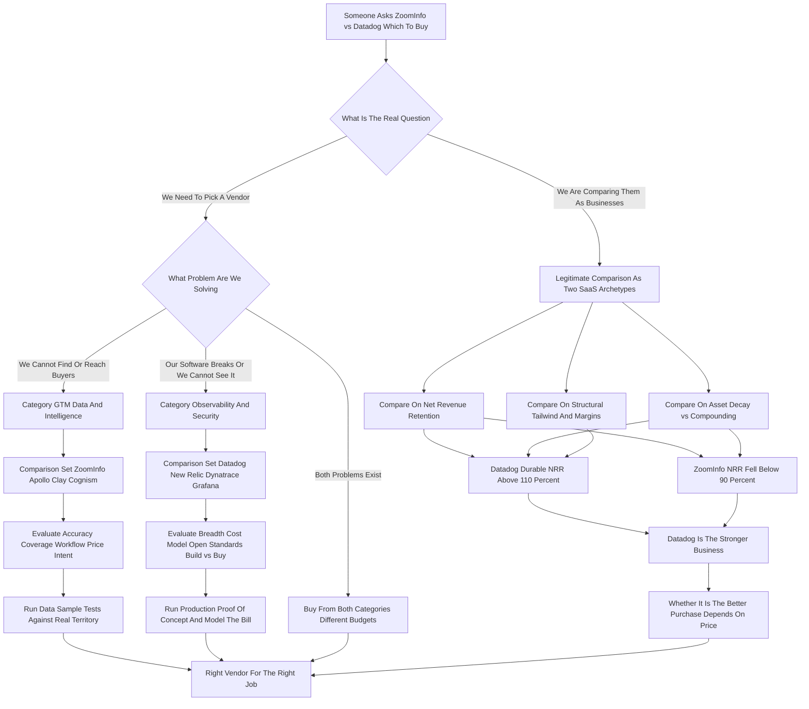

### Direct Answer

"ZoomInfo vs Datadog -- which should you buy?" is a malformed question, and the first move of any serious operator, investor, or candidate is to refuse the framing: **these two companies do not compete.** ZoomInfo is a go-to-market data and intelligence platform sold to revenue teams to find and reach buyers; Datadog is a cloud observability and security platform sold to engineering teams to keep software running. They share no buyer, no budget line, no use case, and no competitive surface. The honest answer is to diagnose which real question is being asked -- a category buying decision (run the bake-off *inside* the correct category) or a business/investment comparison (judge each on durability) -- and answer *that*. As businesses, Datadog (NASDAQ: DDOG) is materially stronger than ZoomInfo (NASDAQ: GTM) on net revenue retention, asset durability, and structural tailwind.

**TL;DR**

- **They do not compete.** ZoomInfo sells GTM data; Datadog sells observability. Different problems, different buyers, different budgets.
- **The question hides two real questions.** Either you need to *pick a vendor* (route to the right category) or *compare two businesses* (a legitimate study of SaaS archetypes).
- **As a buying guide:** if the pain is "we cannot find buyers," shop GTM data (ZoomInfo vs Apollo, Clay, Cognism). If the pain is "our software keeps breaking," shop observability (Datadog vs New Relic, Dynatrace, Grafana).
- **As a business comparison:** Datadog is the stronger business -- roughly double the revenue, durable 110%+ net revenue retention, a compounding telemetry asset, and a structural cloud tailwind. ZoomInfo is a profitable but structurally strained business with net revenue retention that fell below 90%.
- **A company can buy from both categories.** They are not even mutually exclusive at the company level -- they are two unrelated purchases from two different budgets.
- **The wrong answer is to pick one.** The right answer shows *why the question as posed cannot be answered*, then answers the better question underneath it.

## 1. Why This Comparison Does Not Exist

The single most important thing to establish before anything else is that ZoomInfo and Datadog are not alternatives to each other. They have never appeared on the same evaluation shortlist inside a competent organization, and they will never show up in the same procurement RFP.

### 1.1 Two Tools That Do Unrelated Jobs

**ZoomInfo sells go-to-market data.** Its deliverables are the contact records, firmographic and technographic attributes, intent signals, and prospecting workflow that sales development reps, account executives, marketers, and RevOps leaders use to identify and reach potential buyers. **Datadog sells observability and security.** Its deliverables are the metrics, traces, logs, dashboards, alerts, and security analytics that software engineers, site reliability engineers, and platform teams use to understand whether their systems are healthy and to fix them when they are not.

One tool helps you *sell* software. The other tool helps you *run* software. They are adjacent only in the trivial sense that both are SaaS companies sold to other companies. Asking which to "buy" is like asking whether a company should buy a forklift or a payroll system -- the honest answer is "both, neither, or one, depending on what is actually broken, and they come out of different budgets owned by different executives."

### 1.2 Three Reasons People Keep Making The Comparison

So why does the comparison keep getting typed into search bars, posed in interviews, and assigned as a case study? Three reasons, and each points at a different real question hiding underneath.

- **Both are heavily scrutinized public SaaS stocks.** ZoomInfo (NASDAQ: GTM) IPO'd in 2020 as the rare profitable, fast-growing SaaS business; Datadog (NASDAQ: DDOG) IPO'd in 2019 and became the textbook example of usage-based observability compounding. "ZoomInfo vs Datadog" is shorthand for "compare two famous SaaS business models."
- **The asker often does not know the categories.** They have heard both names, both are "B2B software," and they have conflated them. A good answer gently corrects the framing and routes them to the real decision.
- **Interview and MBA-case culture loves the head-to-head.** Putting two well-known SaaS names side by side is precisely the trap: a strong candidate is supposed to notice they do not compete and reframe the question.

This entry serves all three: it treats the head-to-head as a *business and investment comparison*, and it treats the underlying buyer confusion as two separate, real *category buying decisions*.

### 1.3 The "B2B SaaS" Flattening

It is worth naming directly why intelligent people conflate these two. The phrase "B2B SaaS" has become so broad that it flattens genuinely unrelated businesses into a single mental category. ZoomInfo and Datadog are both cloud-delivered, subscription-priced, sold to companies, publicly traded, frequently discussed by the same investors, and roughly contemporaries as IPOs. From thirty thousand feet they rhyme.

But "B2B SaaS" is not a market -- it is a *delivery and pricing model* that spans dozens of unrelated markets. Saying a company should "buy ZoomInfo or Datadog" is like saying a household should "buy a streaming service or a mortgage" because both are recurring monthly payments. The recurring-payment structure is real; the equivalence is an illusion.

| Surface Similarity | ZoomInfo | Datadog | Why It Is Misleading |
|---|---|---|---|
| Delivery model | Cloud SaaS | Cloud SaaS | A delivery model, not a market |
| Pricing structure | Subscription | Subscription + usage | Recurring payment is not a use case |
| Buyer type | Other businesses | Other businesses | "B2B" spans dozens of unrelated markets |
| Public market | NASDAQ: GTM | NASDAQ: DDOG | Both watched by SaaS investors, different sectors |
| IPO era | 2020 | 2019 | Contemporaries, not competitors |
| Actual job-to-be-done | Find and reach buyers | Keep software healthy | Completely unrelated problems |

## 2. The Two Categories, Defined Properly

To choose well you must first know which aisle of the store you are standing in. The categories are unrelated, and naming them precisely is the foundation of every correct answer.

### 2.1 Go-To-Market Data And Intelligence -- ZoomInfo's Category

**Go-to-market data and intelligence** is the layer of the revenue stack that answers "who should we sell to and how do we reach them." Its deliverables are a database of companies and the people inside them; contact details (email, direct dial, mobile); firmographics; technographics; intent data; and increasingly workflow on top of that data -- list building, CRM enrichment, automated prospecting sequences, conversation intelligence, and orchestration.

**The buyers** are the Chief Revenue Officer, VP of Sales, VP of Marketing, and the RevOps team. **The budget** is the go-to-market or sales-and-marketing operating budget. **Success metrics** are pipeline created, contact accuracy, and cost per qualified meeting.

### 2.2 Observability And Security -- Datadog's Category

**Observability and security** is the layer of the engineering stack that answers "is our software healthy, and if not, why." Its deliverables are infrastructure monitoring; application performance monitoring (the behavior of code in production); log management; digital experience and synthetic monitoring; and a growing security suite (cloud security posture, threat detection, application security).

**The buyers** are the VP of Engineering, the SRE or platform lead, the CTO, and increasingly the CISO. **The budget** is the engineering, infrastructure, or cloud operating budget -- frequently the second- or third-largest line in the entire engineering spend, behind only the cloud bill itself and headcount. **Success metrics** are mean time to detection, mean time to resolution, and alert noise.

### 2.3 No Shared Metric, Meeting, Or Executive

Different problems, different buyers, different budgets, different success metrics. A RevOps leader evaluating ZoomInfo measures pipeline created and cost per qualified meeting. An SRE evaluating Datadog measures mean time to resolution and alert noise. There is no metric, no meeting, and no executive that both decisions share.

| Dimension | GTM Data (ZoomInfo) | Observability (Datadog) |
|---|---|---|
| Question answered | Who do we sell to and how | Is our software healthy and why |
| Primary buyer | CRO, VP Sales, VP Marketing, RevOps | VP Eng, SRE lead, CTO, CISO |
| Budget line | Sales and marketing opex | Engineering and infrastructure opex |
| Core deliverable | Contact and company records | Metrics, traces, logs, alerts |
| Success metric | Pipeline, contact accuracy, cost per meeting | MTTD, MTTR, alert noise |
| Evaluation test | Data sample against real territory | Production proof-of-concept |
| Renewal battle | Price-per-seat, data accuracy | Cost-per-gigabyte, telemetry coverage |

## 3. What ZoomInfo Actually Is

To compare anything, you first need an honest portrait of each company on its own terms.

### 3.1 The Core Asset And The Product Suite

ZoomInfo (NASDAQ: GTM) is the largest pure-play go-to-market data and intelligence company. Its core asset is a continuously-updated database covering tens of millions of companies and well over a hundred million professional contact records, assembled from a blend of public web crawling, a contributory network, partnerships, machine processing, and human research.

On top of that data sits a widening software layer:

- **ZoomInfo Sales** -- the prospecting and intelligence workspace.
- **ZoomInfo Marketing** -- audience targeting and advertising activation.
- **ZoomInfo Operations** -- data enrichment and the data-as-a-service plumbing that pipes clean records into a CRM.
- **ZoomInfo Talent** -- the same data aimed at recruiters.
- **Acquired capabilities** -- conversation intelligence (Chorus) and sales engagement.

### 3.2 Genuine Strengths

The strategic logic is sound on paper: own the data layer, then sell more and more workflow that depends on it, raising switching costs and net revenue per customer. The business has real strengths -- **it is profitable**, generates substantial free cash flow, has deep enterprise penetration, and the data underneath genuinely is among the most comprehensive available in North American mid-market and enterprise coverage.

### 3.3 Structural Pressure

But the business carries real, structural pressure that any honest evaluation must name:

- **Data decays.** People change jobs constantly, and a contact database is a melting ice cube that must be re-frozen every day. A meaningful share of records go stale annually as professionals move roles, companies, and email domains. Freshness is therefore a permanent operating cost and a permanent vulnerability -- the database is never "done," and the cost of keeping it fresh never goes away.
- **The category is under price and freshness attack.** Newer vendors -- Apollo, Clay, Cognism, Lusha, Seamless.ai -- undercut on price, claim better international coverage or fresher data, and appeal to a generation of buyers who balk at ZoomInfo's enterprise pricing and multi-year contracts. The challenger pitch is explicit: same job, lower price, friendlier terms.
- **AI changes the prospecting motion itself.** If large language models and agentic tools can assemble account research and contact paths on demand, the value of a static licensed database compresses. The very act ZoomInfo monetizes -- finding the right person -- is the kind of task generative tooling is best at automating.
- **Net revenue retention fell below 90%.** This is the number that tells the story most plainly: the average existing customer cohort *shrinks* year over year before new logos are counted.

ZoomInfo is not a broken business. It is a business defending a moat that is being actively eroded, and the strategic question is whether the workflow pivot outruns the data decay.

### 3.4 The Strategic Bet ZoomInfo Is Making

The whole of ZoomInfo's forward strategy can be stated in one sentence: **convert a database-license business into a data-and-workflow platform business before the database alone stops compounding.** Operations is the clearest expression of this -- if ZoomInfo becomes the data-as-a-service layer continuously enriching a customer's CRM, it stops being a thing you license once a year and becomes infrastructure you build on. Conversation intelligence and engagement deepen the footprint the same way. The bet is sound in logic; the open question is execution speed. A data-license business has no built-in expansion engine, so ZoomInfo must *manufacture* one product by product, customer by customer, faster than challengers erode the base. That race -- pivot speed versus decay speed -- is the entire ZoomInfo investment thesis in 2027.

## 4. What Datadog Actually Is

The mirror portrait, on Datadog's own terms.

### 4.1 The Platform And Its Breadth

Datadog (NASDAQ: DDOG) is the category-defining cloud observability platform, and increasingly a security platform as well. It began as infrastructure monitoring and expanded -- deliberately and successfully -- into a broad suite: infrastructure monitoring, APM and distributed tracing, log management, synthetic and real-user monitoring, database monitoring, network performance monitoring, cloud security and application security, CI visibility, and a steady stream of new modules.

### 4.2 The Land-And-Expand Model

The strategic core is a *land-and-expand, usage-based* model: a customer adopts one or two products, the platform proves its value, and then -- because all the telemetry already flows into one place -- adopting the next module is easy and natural. Datadog routinely reports that a large and growing share of customers use four, six, or eight or more of its products, and that high-spend customers grow consistently.

### 4.3 Exceptional By Almost Every SaaS Yardstick

The business is, by almost every SaaS yardstick, exceptional: durable revenue growth at substantial scale, net revenue retention that has stayed strong (historically well above 110%, even through cloud-spend-optimization cycles when it compressed but did not break), high gross margins, real free cash flow, and a founder-CEO still running the company with a long-term product orientation. Its tailwind is structural -- every workload that moves to the cloud, every shift to containers and microservices and serverless, every new AI application that must be monitored, *increases* the surface area Datadog can instrument.

### 4.4 The Honest Pressures On Datadog

The pressures on Datadog are real but different in kind from ZoomInfo's:

- **Cost can spook customers.** Usage-based billing means a busy month produces a big bill, and "Datadog sticker shock" is a genuine and recurring complaint. The same model that drives expansion also produces resentment.
- **Competition is credible.** Dynatrace, New Relic, Grafana, the Splunk/Cisco combination, and the cloud providers' own native tools are all real alternatives, several of them well-resourced.
- **Open-source observability is a build-it-yourself alternative.** Prometheus, OpenTelemetry, Grafana, and Loki give sophisticated platform teams a way to trade license cost for engineering time.
- **Cloud-spend optimization is a recurring headwind.** When customers tighten cloud budgets, observability spend is squarely in the blast radius.

But the underlying asset -- a unified platform that gets *more* valuable as it ingests more of your telemetry -- is far more defensible than a contact database that decays.

### 4.5 Why The Datadog Asset Compounds

The deepest reason Datadog's economics differ from ZoomInfo's is architectural, not managerial. Once a customer routes its metrics, traces, and logs into Datadog, three compounding effects kick in. First, **the data has gravity** -- every dashboard, alert, monitor, and runbook built on top of Datadog is switching-cost the customer would have to rebuild elsewhere. Second, **the platform gets more useful as it ingests more** -- correlated telemetry across infrastructure, applications, and security is worth more than the same data siloed in separate tools, so each additional module makes the others better. Third, **customer growth is Datadog growth** -- a customer that migrates more workloads, ships more code, or launches AI features sends more telemetry without any sales motion at all. A contact database has none of these properties: enrichment does not compound, the data decays rather than accretes, and a customer that grows does not automatically license more records. That architectural difference -- a compounding asset versus a decaying one -- is the single most important fact in the entire comparison.

## 5. The Investor's Comparison: Two Business Models Side By Side

If the real reason for the question is investment or operator due diligence -- "which is the better *business*" -- then the comparison becomes legitimate, not because the companies compete, but because they are both instructive SaaS case studies.

### 5.1 The Verdict And Why It Is Not Close

On a business basis the verdict is not close, and it is important to be direct about why. **Datadog is the stronger business.** Its revenue is roughly double ZoomInfo's and still compounding at a healthy clip; its net revenue retention has remained structurally strong because usage-based observability *expands by default* as customers grow and migrate more workloads; its product surface keeps widening into adjacent budgets; its gross margins are high and stable; and its tailwind is one of the most durable in software.

**ZoomInfo is a good business under structural strain.** It is profitable and cash-generative, which many SaaS companies are not, and that deserves credit. But its core asset decays, its net revenue retention fell below 90%, its category is being attacked on price and freshness, and AI is a genuine threat rather than an obvious tailwind.

### 5.2 The Numbers That Matter, Vendor By Vendor

A serious comparison has to put approximate figures on the table, with the caveat that exact quarterly numbers move and should be checked against current filings. The shape of the two businesses, however, is stable and clear.

| Metric | ZoomInfo (NASDAQ: GTM) | Datadog (NASDAQ: DDOG) |
|---|---|---|
| Category | GTM data and intelligence | Cloud observability and security |
| Primary buyer | CRO, VP Sales, VP Marketing, RevOps | VP Eng, SRE, CTO, CISO |
| Budget line | Sales and marketing opex | Engineering and infrastructure opex |
| Approx. revenue run-rate | Roughly 1.2 to 1.3 billion dollars | Roughly 2.8 to 3.0 billion dollars |
| Revenue growth | Low single digits, roughly flat | Strong double digits |
| Net revenue retention | Fell below 90 percent, clawing back | Historically 110 to 130 percent, durable |
| Gross margin profile | High (data-license economics) | High, above 80 percent (software economics) |
| Profitability and FCF | Profitable, strong FCF | Profitable, strong FCF |
| Revenue model | Seat plus platform subscription | Usage-based plus committed-use platform |
| Core asset | Contact and company database | Unified telemetry platform |
| Asset durability | Decays, must be continuously refreshed | Compounds, more telemetry equals more value |
| Primary structural tailwind | None obvious, AI is ambiguous-to-negative | Cloud migration, microservices, AI workloads |
| Primary structural risk | Data decay, price competition, AI disruption | Cost sticker shock, native-cloud and OSS competition |
| Leadership | Professionalized public-company management | Founder-CEO, long-term product orientation |

### 5.3 Two Archetypes, Not Two Competitors

The two companies are a near-perfect teaching pair precisely *because* they are not competitors. They illustrate the difference between a usage-based platform whose value compounds with customer success (Datadog) and a data-license business whose value must be continuously rebuilt against decay and competition (ZoomInfo). An investor comparing them is really comparing two *archetypes*: the expanding platform versus the defended database. The same archetype contrast shows up across the public SaaS landscape -- in usage-based data warehousing like Snowflake (NYSE: SNOW) versus seat-based applications, for instance.

### 5.4 What Each Business Has To Prove

The cleanest way to hold the investment comparison in your head is to ask what each company has left to *prove*, because the burden of proof is asymmetric. **Datadog has to prove durability of growth.** Nobody seriously doubts the quality of the asset or the retention engine; the open question is whether a 3-billion-dollar-revenue business can keep compounding fast enough to justify a premium multiple, and whether security and AI-workload monitoring become large enough second and third engines to offset the inevitable deceleration of core observability. **ZoomInfo has to prove the asset is not in structural decline.** The profitability is not in doubt; the open question is whether the workflow pivot arrests the NRR slide before the cohort erosion compounds into a genuinely shrinking business. One company is defending a high bar; the other is trying to clear a low one. An investor who understands that asymmetry understands the comparison.

| Investment Axis | Datadog Burden Of Proof | ZoomInfo Burden Of Proof |
|---|---|---|
| Core question | Can growth stay fast enough for the multiple | Can the asset stop declining |
| What is not in doubt | Asset quality, retention engine | Profitability, free cash flow |
| Key second engine | Security and AI-workload monitoring | Operations and workflow software |
| Failure mode | Deceleration punished at premium price | NRR slide compounds into a shrinking base |
| Bar to clear | High bar, defending it | Low bar, trying to reach it |

## 6. Net Revenue Retention: The Single Most Telling Divergence

If you only look at one number to understand why these two businesses diverge, look at net revenue retention.

### 6.1 What NRR Measures And Why It Is A Truth Serum

Net revenue retention (NRR) is the percentage of last year's revenue that this year's *same* customer cohort produces, before new customers are counted. It is the closest thing SaaS has to a truth serum, because it strips away sales-and-marketing spend and asks: do customers, left alone, naturally spend more or less? Above 100% means the cohort expands on its own; below 100% means the cohort shrinks on its own.

### 6.2 Datadog's NRR: Expansion As The Default State

**Datadog's NRR has historically run well above 110%**, often into the 120s and 130s. That is the signature of usage-based observability: a customer who adopts Datadog and then grows, migrates more workloads, adds microservices, ships more code, and launches AI features will *automatically* send Datadog more telemetry and more dollars. Even during the 2022 to 2024 cloud-cost-optimization wave -- when customers actively trimmed cloud spend -- Datadog's NRR compressed but stayed above 110%; it bent but did not break, and then recovered.

### 6.3 ZoomInfo's NRR: A Cohort That Shrinks

**ZoomInfo's NRR fell below 90%.** That is the signature of a data-license business under strain: the average existing customer cohort *shrinks* year over year. Seats get cut in downturns, smaller customers churn to cheaper challengers, and the product does not have a built-in expansion engine the way usage-based telemetry does. You license the database, and absent buying *more* workflow software, there is no automatic mechanism that makes last year's customer spend more this year. ZoomInfo's entire strategic project -- pushing Operations, Marketing, Talent, conversation intelligence -- is fundamentally an effort to *manufacture* the expansion engine that Datadog gets for free from its architecture.

### 6.4 Why NRR Predicts Durability Better Than Growth

It is worth being explicit about why NRR, not headline revenue growth, is the metric that separates these two businesses. Headline growth blends two very different things: expansion of the existing base, and acquisition of new logos. New-logo growth can be *bought* with sales-and-marketing spend; it tells you how hard the company is pushing, not how good the product is. NRR strips the spend away and isolates the question that actually predicts the future: left alone, does a customer become more or less valuable? A business with NRR above 110% can grow even if it stops winning new logos entirely -- the installed base compounds on its own. A business with NRR below 90% is running up a down escalator: it must win enough new logos each year just to *replace* the revenue the existing base quietly loses. That is why two profitable, cash-generative SaaS companies can have completely different futures, and why an investor who reads only the growth headline will misjudge both. Datadog's NRR says the future is compounding; ZoomInfo's says the future depends entirely on the pivot.

| NRR Behavior | Datadog | ZoomInfo |
|---|---|---|
| Typical level | Well above 110%, into 120s-130s | Fell below 90% |
| Cohort trajectory | Expands on its own | Shrinks on its own |
| Expansion mechanism | Automatic, from telemetry growth | Must be manufactured via more software |
| Behavior in a downturn | Compressed but stayed above 110% | Seat cuts, churn to cheaper rivals |
| What it signals | Compounding asset | Defended, decaying asset |

## 7. If You Meant: How Do I Choose A GTM Data Vendor

Many people who type "ZoomInfo vs Datadog" on the buying side actually mean "I need go-to-market data and I have heard of ZoomInfo -- what should I do?"

### 7.1 The Real Comparison Set

If that is you, Datadog is irrelevant and the real comparison set is **ZoomInfo, Apollo, Clay, Cognism, LinkedIn Sales Navigator, Lusha, Seamless.ai**, and the data-as-a-service providers behind them.

### 7.2 The Evaluation Axes

The category decision turns on a handful of axes:

- **Data accuracy and freshness** -- the only thing that matters in the end is whether the emails bounce and the phone numbers ring; demand bounce-rate guarantees and run a sample test before signing.
- **Coverage** -- ZoomInfo is strongest in North American mid-market and enterprise; Cognism and others are often better for European and regulatory-compliant data.
- **Workflow depth versus raw data** -- ZoomInfo and Apollo bundle prospecting workflow; Clay is a flexible orchestration layer combining many data sources; pure data-as-a-service providers just sell records.
- **Price and contract** -- ZoomInfo is the premium-priced, enterprise-contract option; Apollo, Lusha, and Seamless compete on a lower price point.
- **Intent data** -- if buyer-intent signals are core to your motion, evaluate that specifically, as quality varies widely.

| GTM Data Vendor | Position | Best For | Pressure Point |
|---|---|---|---|
| ZoomInfo | Incumbent leader | Deepest North American data plus workflow suite | Premium price, data decay, AI disruption |
| Apollo | Price challenger | Lower cost, bundled engagement | Data depth versus ZoomInfo |
| Clay | Orchestration layer | Multi-source enrichment and flexibility | Requires more setup sophistication |
| Cognism | International specialist | EU and global coverage, compliant data | Smaller North American depth |
| LinkedIn Sales Navigator | Network graph | Relationship paths, fresh job-change signal | Not a bulk-export database |

### 7.3 The GTM Data Category In Depth

The go-to-market data market exists because the single hardest, most expensive part of B2B selling is *finding the right person at the right company at the right time and reaching them*. Every dollar of GTM-data spend is ultimately justified by one equation: does it lower the cost per qualified meeting or per pipeline dollar enough to pay for itself. The category has structural challenges every vendor fights constantly. **Decay is relentless** -- the database is never finished. **Coverage is uneven** -- deep in some geographies, thin in others, and international and privacy-regulated data is genuinely harder. **Compliance is a moving target** -- privacy regulation constrains how data is collected and used, and the compliant vendors make that a selling point. **AI is reshaping the motion** -- agentic research tools can assemble account intelligence on demand. The practical takeaway for the buyer is that this is a *bake-off category*: never single-source it, always test samples against real territory, and always keep a credible alternative on the table for renewal leverage.

### 7.4 The Honest 2027 Guidance

ZoomInfo is still a credible enterprise choice with the deepest North American database and a real workflow suite, but it is no longer the *obvious default*. The challengers have closed enough of the gap that you should always run a competitive bake-off, test data samples from at least three vendors against your real territory, and use the alternatives as genuine pricing leverage. The disciplined process is concrete: pull a real list of 200 to 500 target accounts from your actual territory, request matched samples from three vendors, measure bounce rate and connect rate against your own outreach, weight coverage in the geographies you actually sell into, and only then negotiate -- with the live alternatives as your leverage. The vendor with the best brand is not automatically the vendor with the best data for *your* territory.

## 8. If You Meant: How Do I Choose An Observability Vendor

The mirror image: many people who type the question on the buying side actually mean "our systems keep breaking -- I have heard of Datadog."

### 8.1 The Real Comparison Set

If that is you, ZoomInfo is irrelevant and the real comparison set is **Datadog, New Relic, Dynatrace, Grafana (and Grafana Cloud), the Splunk/Cisco platform, Honeycomb, Chronosphere, Elastic**, and the cloud providers' native tools (Amazon CloudWatch, Google Cloud Operations, Azure Monitor).

### 8.2 The Evaluation Axes

- **Breadth versus depth** -- Datadog's strength is one unified platform; some competitors go deeper on a slice (Honeycomb on high-cardinality tracing, Grafana on visualization and open standards).
- **Cost model and predictability** -- the central observability pain; Datadog's usage-based pricing produces real sticker shock, and a serious evaluation models the bill against actual log volume and host count.
- **Open standards and lock-in** -- Grafana and the OpenTelemetry ecosystem appeal to teams that want to avoid proprietary agents; Datadog is more of a walled garden that is extremely good *inside the walls*.
- **Build versus buy** -- a sophisticated platform team can self-host Prometheus, Grafana, Loki, and OpenTelemetry, trading license cost for engineering time.
- **Native cloud tools** -- if you are all-in on one cloud, that provider's native monitoring may be good enough, though usually weaker on multi-cloud and deep APM.

| Observability Vendor | Position | Best For | Pressure Point |
|---|---|---|---|
| Datadog | Benchmark leader | One unified platform across infra, APM, logs, security | Usage-based cost sticker shock |
| New Relic / Dynatrace | Closest platform peers | Broad APM, AIOps, alternative pricing shapes | Breadth versus Datadog's pace |
| Grafana / Prometheus / OpenTelemetry | Open-standards ecosystem | Portability, self-hosting, no agent lock-in | Engineering time to run it |
| Splunk (Cisco) | Log and security heritage | Heavy log analytics, security overlap | Cost, complexity |
| CloudWatch / Cloud Operations / Azure Monitor | Native cloud tools | Cheap-ish, convenient, single-cloud | Weak multi-cloud and deep APM |

### 8.3 The Observability Category In Depth

Observability exists because modern software is *too complex to understand by intuition*. A single user request might traverse dozens of microservices, several databases, multiple cloud regions, and third-party APIs; when something is slow or broken, no human can reason about it without instrumentation. Observability is the discipline -- and the tooling -- of making a complex distributed system *legible*: metrics tell you *something is wrong*, traces tell you *where*, logs tell you *why*. The category's defining tension is **cost versus completeness**. The more telemetry you collect, the better you can debug -- and the bigger the bill. Every observability buyer in 2027 lives inside that trade-off, and "observability cost governance" has become a real engineering discipline: sampling strategies, log-volume controls, retention tiers, and deciding what *not* to collect. The landscape sorts roughly into the broad unified platforms (Datadog the benchmark, Dynatrace and New Relic the closest peers), the open-standards ecosystem (Grafana, Prometheus, OpenTelemetry, Loki), the deep specialists (Honeycomb, Chronosphere), the log-and-security heritage players (Splunk inside Cisco, Elastic), and the native cloud tools (CloudWatch, Cloud Operations, Azure Monitor).

### 8.4 The Honest 2027 Guidance

Datadog is the category benchmark and the safe, capable default for a team that wants one excellent platform and can manage the cost. The reasons to choose otherwise are specific: cost predictability, an open-standards philosophy, a deep single-use-case need, or a build-it-yourself capability. The disciplined process mirrors the GTM one: stand up a proof-of-concept against *real* production telemetry, not a demo environment; instrument a representative slice of the actual stack; model the bill against your true log volume, host count, and span volume with a generous growth assumption; and budget for cost governance as a permanent operating discipline rather than a one-time setup. The team that buys Datadog without modeling the bill is the team that writes the "we switched off Datadog" post a year later.

## 9. The Procurement Reality: Different Buyers, Different Battles

Even the *act of buying* these two products looks nothing alike, which is further proof they do not belong in the same comparison.

### 9.1 Buying ZoomInfo

**Buying ZoomInfo** is a go-to-market budget decision, championed by a CRO, VP of Sales, VP of Marketing, or a RevOps leader. The evaluation centers on data sample tests, integration with the CRM and sales engagement stack, seat counts, and -- almost always -- a hard negotiation over price and contract length, because ZoomInfo's list pricing creates immediate procurement friction. The cycle is measured in weeks to a couple of months; the renewal fight is annual and increasingly contested.

### 9.2 Buying Datadog

**Buying Datadog** is an engineering budget decision, championed by a VP of Engineering, an SRE lead, a platform team, or a CTO. The evaluation centers on agent deployment across the real environment, a proof-of-concept against actual production telemetry, integration coverage for the specific stack, and -- the defining issue -- *cost modeling*, because the bill scales with usage and a botched estimate produces a budget blowout. The cycle often runs longer because it requires real technical proof-of-value, and the renewal conversation is dominated by cost-governance.

### 9.3 Different War, Different Room

One purchase is fought over data accuracy and price-per-seat; the other is fought over telemetry coverage and cost-per-gigabyte. Different war, different room, different generals. The renewal dynamics differ just as sharply: ZoomInfo's renewal is an annual price negotiation in which the buyer arrives armed with cheaper challenger quotes, while Datadog's renewal is a cost-governance conversation in which a *growing* customer is trying to keep an *expanding* bill sane. One renewal is contested because the customer wants to pay less for the same thing; the other is contested because the customer is buying more whether they meant to or not. That single contrast -- a defended renewal versus an expanding one -- is the procurement-level fingerprint of the same architectural difference that NRR measures financially. If you ever needed proof that these are not the same purchase, the renewal meeting is it: nobody who has sat in both would mistake one for the other.

| Procurement Factor | ZoomInfo Purchase | Datadog Purchase |
|---|---|---|
| Budget owner | CRO / VP Sales / RevOps | VP Eng / SRE lead / CTO |
| Core evaluation | Data sample tests, CRM integration | Production proof-of-concept, cost modeling |
| Cycle length | Weeks to a couple of months | Often longer, technical proof required |
| Negotiation focus | Price-per-seat, contract length | Cost-per-gigabyte, usage caps |
| Renewal battle | Contested annual price fight | Cost-governance as growth continues |
| Defining risk | Data accuracy disappoints | Bill scales beyond budget |

## 10. The Honest Case For ZoomInfo And Against Datadog

A rigorous answer presents the strongest version of the unpopular side -- both the case *for* the weaker business and the case *against* the stronger one.

### 10.1 The Honest Case For ZoomInfo

- **It is profitable and generates substantial free cash flow.** Many faster-growing SaaS companies do not, and in an environment where capital is no longer free, durable profitability is a genuine asset.
- **The North American database is genuinely the deepest** in mid-market and enterprise coverage.
- **The workflow strategy is the right strategy** -- Operations is a legitimately sticky product, and *if* ZoomInfo becomes the data-and-workflow layer rather than a database license, it manufactures the expansion engine it currently lacks.
- **AI is not purely a threat** -- ZoomInfo can become the trusted, structured data layer that AI agents query, and a clean, governed dataset is exactly what agentic prospecting tools need.
- **The valuation reflects the pessimism** -- a profitable business priced for decline can be a perfectly good investment *if* the decline is arrested.

### 10.2 The Honest Case Against Datadog

- **Valuation is the central issue** -- Datadog has consistently traded at a premium multiple, and a great business at a demanding price can still be a mediocre *investment* if growth decelerates.
- **Cost sticker shock is a genuine product risk** -- the same usage-based model that drives the wonderful NRR also produces customer resentment, and resentment is the seed of churn.
- **The competition is credible and well-resourced** -- Dynatrace and New Relic are serious, Grafana appeals to sophisticated teams, Splunk inside Cisco is a giant, and cloud providers bundle native monitoring.
- **Cloud-spend optimization is a recurring headwind** -- when customers tighten cloud budgets, observability spend is in the blast radius.
- **Concentration and law-of-large-numbers** -- a 3-billion-dollar-revenue business cannot compound at startup rates forever, and deceleration is punished hard at a premium multiple.

## 11. A Framework: Resolving "X vs Y" When X And Y Do Not Compete

The most transferable lesson from this question is a *method* for any "should I buy X or Y" decision where X and Y turn out not to be substitutes.

### 11.1 The Six Steps

- **Step one -- identify the job-to-be-done.** Not the product, the problem. If you cannot state the job in one plain sentence, you are not ready to compare anything.
- **Step two -- identify the buyer and the budget.** If X and Y come out of different budgets owned by different executives, they are not competitors and the "vs" is a category error.
- **Step three -- place each product in its real category** and assemble the *correct* comparison set of three to six products that genuinely contend for the same job.
- **Step four -- define the evaluation axes for that category.** For GTM data it is accuracy, coverage, workflow, price, intent; for observability it is breadth, cost model, open standards, build-versus-buy.
- **Step five -- run the bake-off inside the category** with real tests against real data or telemetry, using genuine alternatives as pricing leverage.
- **Step six -- only if the question is investment or strategy: judge each business on durability axes** -- net revenue retention, asset decay versus compounding, structural tailwind, gross margin, leadership.

### 11.2 The Method Dissolves A Whole Class Of Bad Comparisons

This six-step method dissolves not just "ZoomInfo vs Datadog" but a whole class of malformed comparisons. It is the same discipline whether the pairing is "Salesforce vs Snowflake," "Stripe vs Workday," or "Shopify vs ServiceNow": refuse the framing, find the job, find the buyer, find the real category, then compare.

| Step | Question To Answer | Failure If Skipped |
|---|---|---|
| 1. Job-to-be-done | What problem are we solving | Comparing products, not problems |
| 2. Buyer and budget | Who owns the outcome and the money | Missing the category error |
| 3. Real category | Which three to six products truly contend | Comparing across categories |
| 4. Evaluation axes | What dimensions decide this category | Vague, unscored bake-off |
| 5. Bake-off | Test against real data or telemetry | Choosing on brand, not fit |
| 6. Durability (investing only) | NRR, asset decay, tailwind, margin | Confusing a famous name for a good business |

## 12. Named Scenarios: Who Is Actually Asking

Concrete cases make the method tangible.

### 12.1 Priya, The New RevOps Lead

She inherits a sales org with a stale CRM and reps who cannot find good contacts; someone told her "look at ZoomInfo or Datadog." The job is *find and reach buyers*; the buyer is her CRO; the budget is sales-and-marketing opex. **Datadog is instantly eliminated.** Her real bake-off is ZoomInfo vs Apollo vs Clay vs Cognism, judged on data accuracy against her actual territory. She finds ZoomInfo's North American data deepest but Apollo's price dramatically lower, and uses Apollo as leverage.

### 12.2 Marcus, The VP Of Engineering

His team is firefighting production incidents with no unified view; someone said "ZoomInfo or Datadog." The job is *see and stabilize our software*; the buyer is Marcus; the budget is engineering opex. **ZoomInfo is instantly eliminated.** His real bake-off is Datadog vs New Relic vs Grafana Cloud vs native cloud tools, judged on coverage and a modeled bill against his log volume. He picks Datadog for breadth but stands up cost-governance on day one.

### 12.3 Dana, The Public-Markets Analyst

She is not buying software at all -- she covers SaaS and is comparing the two as *investments*. For her the comparison is legitimate: she puts the businesses side by side on NRR, revenue durability, gross margin, and valuation multiple, and concludes Datadog is the higher-quality business while debating whether ZoomInfo's pessimistic price already prices in the decay.

### 12.4 The Cautionary Tale And The Interview Candidate

A founder hears "evaluate ZoomInfo vs Datadog" in a board meeting, does not catch that they are unrelated, and wastes a quarter of confused vendor calls. The lesson is the cost of *not* refusing a malformed framing. By contrast, Jordan, a platform-strategy interview candidate, is asked "ZoomInfo or Datadog" and immediately reframes -- "these do not compete; let me show you how I would decide *which problem we have*" -- and that reframing *is* the answer the interviewer wanted.

## 13. The 2027-2030 Outlook For Both Businesses

Looking forward sharpens the comparison.

### 13.1 ZoomInfo: An Existential Test Of The Workflow Pivot

For ZoomInfo, the next several years are an existential test. **The bull path:** it successfully becomes the trusted, governed data-and-workflow layer that AI prospecting agents query, and the expansion engine that NRR has been missing finally turns over. **The bear path:** challengers keep closing the data-quality gap while undercutting on price, AI commoditizes the act of finding a contact, and ZoomInfo slowly becomes a profitable-but-shrinking utility. The NRR trend is the number to watch -- if it climbs back above 100%, the pivot is working.

### 13.2 Datadog: Extending The Platform Without Choking Customers

For Datadog, the next several years are about extending the platform and absorbing adjacent budgets without choking customers on cost. **The bull path:** security becomes a second engine as large as observability, AI-workload monitoring becomes a structural new tailwind, and the platform keeps compounding. **The bear path:** cloud-cost-optimization cycles keep clipping growth, sticker shock opens competitive doors, and the premium multiple compresses.

### 13.3 Two Different Questions Forever

Datadog's downside is mostly a *valuation and growth-rate* story; ZoomInfo's downside is an *asset and category* story. One company is asking "can we keep compounding fast enough to justify the price"; the other is asking "can we stop the core asset from eroding." Those are not the same question, and the companies were never the same comparison.

| Outlook Factor | ZoomInfo | Datadog |
|---|---|---|
| Central question | Can we stop the asset from eroding | Can we keep compounding fast enough |
| Bull path | Becomes the trusted AI data layer | Security plus AI-workload monitoring compound |
| Bear path | Profitable-but-shrinking utility | Premium multiple compresses on deceleration |
| Number to watch | NRR climbing back above 100% | Growth rate versus expectations baked into price |
| Downside type | Asset and category | Valuation and growth-rate |

## 14. Counter-Case: When This Is Not As Clear-Cut As It Looks

The body of this entry makes two strong claims: that ZoomInfo and Datadog do not compete, and that as businesses Datadog is materially stronger. Both claims are defensible, but a rigorous answer has to stress-test them.

### 14.1 "They Do Not Compete" Is True Today, Not A Law Of Nature

Software categories converge. Datadog has expanded relentlessly from infrastructure monitoring into APM, logs, security, and CI visibility -- it is a serial category-eater. ZoomInfo has expanded from a database into marketing activation and conversation intelligence. It is not impossible to imagine a future where both push toward a "revenue intelligence" or "business signal" layer. The categorical "they will never compete" is right for the foreseeable horizon but should be held as a strong present-tense observation, not an eternal truth.

### 14.2 Profitability Is Not Nothing

The entry is hard on ZoomInfo's NRR, and rightly, but a profitable, free-cash-flow-generative software business is genuinely rarer and more valuable than a decade of growth-at-all-costs culture trained people to believe. A profitable business that merely *stabilizes* can be a perfectly good investment from a pessimistic starting price. The bear case is real; "therefore Datadog, obviously" does not follow for the *investment* question.

### 14.3 Datadog's Premium Is Itself The Risk

"Better business" and "better investment" diverge most violently exactly when a great business carries a great price. Datadog has spent most of its public life expensive. If growth decelerates even to "merely good," a premium multiple compresses and the stock can underperform a far worse business that was priced for nothing.

### 14.4 Cost Sticker Shock Is A Slow-Acting Churn Agent

It is easy to wave at "Datadog is expensive" as a footnote. But usage-based pricing that produces resentment is structurally dangerous: every angry bill is a reason to evaluate a competitor, to cap usage, or to fund an internal open-source effort. The same mechanism that produces the beautiful NRR also continuously manufactures the motivation to leave.

### 14.5 "Refuse The Framing" Can Be A Cop-Out If Overused

The entry's central move -- "this question is malformed, here is the real question" -- is correct here. But it is also a rhetorical pattern that can be abused: there are plenty of "X vs Y" questions where X and Y *do* compete and the asker just wants a straight answer. The discipline is to reframe *when the categories genuinely differ* and to *answer directly* when they do not.

### 14.6 The Buyer May Genuinely Need Both

Routing the asker to "GTM data or observability" is correct, but a growing software company very plausibly needs *both* -- it has a sales org that needs contact data and an engineering org that needs observability. Framing it as an either/or can accidentally imply they are still substitutes at the company level. They are not even that: they are two unrelated purchases from two different budgets.

### 14.7 AI Is Genuinely Ambiguous For ZoomInfo

The entry mostly frames AI as erosion pressure on ZoomInfo. But the ambiguity is real and could break either way. If agentic prospecting becomes dominant, the entity that owns the *cleanest, most governed structured dataset* becomes more valuable -- agents need a trustworthy source to avoid hallucinating contacts. The bear case and this bull case are both coherent.

### 14.8 The Honest Verdict After The Stress Test

The two central claims survive, but with calibration. *They do not compete* -- true and decision-relevant today; hold it as strong present-tense fact, not eternal law. *Datadog is the stronger business* -- true, on durable NRR, a compounding asset, and a structural (if cyclically choppy) tailwind. But "stronger business" is not "better purchase": for a vendor decision the question is a category error; for an investment decision the answer is genuinely contested and turns on price paid.

## 15. Decision Flow: Resolving "ZoomInfo vs Datadog"

The diagram below traces the disciplined path from the malformed question to the right answer.

## 16. Sources

1. **ZoomInfo Technologies -- Investor Relations and SEC Filings (10-K, 10-Q, earnings releases)** -- Primary source for ZoomInfo revenue, net revenue retention, profitability, and segment commentary. https://ir.zoominfo.com
2. **Datadog -- Investor Relations and SEC Filings (10-K, 10-Q, earnings releases)** -- Primary source for Datadog revenue, net revenue retention, multi-product adoption, and high-spend customer cohorts. https://investors.datadoghq.com
3. **Datadog -- "State of..." Reports (Cloud Security, Serverless, Containers, AI)** -- Datadog's recurring data reports on cloud, container, serverless, and AI-workload adoption trends. https://www.datadoghq.com/state-of-cloud-security/
4. **ZoomInfo -- Product Documentation (Sales, Marketing, Operations, Talent)** -- Reference for the ZoomInfo product suite and the data-to-workflow strategy. https://www.zoominfo.com
5. **Datadog -- Product Documentation (Infrastructure, APM, Logs, Security, Synthetics)** -- Reference for the Datadog observability and security product surface. https://docs.datadoghq.com
6. **Gartner Magic Quadrant for Observability Platforms** -- Independent analyst positioning of Datadog, Dynatrace, New Relic, Grafana, and peers.
7. **Gartner / Forrester Coverage of B2B Sales Intelligence and Data Providers** -- Independent analyst coverage of the GTM-data category including ZoomInfo, Apollo, Cognism, and Clay.
8. **G2 -- Category Grids for Sales Intelligence and Application Performance Monitoring** -- Aggregated user-review positioning for both categories. https://www.g2.com
9. **Apollo.io -- Product and Pricing Documentation** -- Reference for the leading lower-priced GTM-data challenger. https://www.apollo.io
10. **Clay -- Product Documentation** -- Reference for the multi-source data orchestration and enrichment approach. https://www.clay.com
11. **Cognism -- Product Documentation and Compliance Materials** -- Reference for international coverage and privacy-compliant GTM data. https://www.cognism.com
12. **LinkedIn Sales Navigator -- Product Documentation** -- Reference for the network-graph approach to prospecting. https://business.linkedin.com/sales-solutions
13. **New Relic -- Product Documentation** -- Reference for a closest-peer observability platform. https://newrelic.com
14. **Dynatrace -- Investor Relations and Product Documentation** -- Reference for a closest-peer observability and AIOps platform. https://www.dynatrace.com
15. **Grafana Labs -- Product Documentation (Grafana, Loki, Tempo, Mimir)** -- Reference for the open-source and open-standards observability ecosystem. https://grafana.com
16. **OpenTelemetry Project Documentation (CNCF)** -- Reference for the open-standard instrumentation framework reshaping observability portability. https://opentelemetry.io
17. **Prometheus Documentation (CNCF)** -- Reference for the open-source metrics standard underpinning self-hosted observability. https://prometheus.io
18. **Splunk (Cisco) -- Product and Platform Documentation** -- Reference for the log-and-security heritage observability player. https://www.splunk.com
19. **Honeycomb -- Product Documentation** -- Reference for the high-cardinality tracing specialist. https://www.honeycomb.io
20. **Chronosphere -- Product Materials** -- Reference for the cost-controlled, scale-focused observability challenger. https://chronosphere.io
21. **Amazon CloudWatch Documentation** -- Reference for AWS-native monitoring. https://aws.amazon.com/cloudwatch/
22. **Google Cloud Operations Suite Documentation** -- Reference for GCP-native monitoring. https://cloud.google.com/products/operations
23. **Microsoft Azure Monitor Documentation** -- Reference for Azure-native monitoring. https://azure.microsoft.com/products/monitor
24. **The SaaS Capital Index and SaaS Benchmarking Reports** -- Reference for net revenue retention, growth, and margin benchmarks across public SaaS.
25. **Bessemer Venture Partners -- State of the Cloud Reports** -- Reference for cloud-software business-model benchmarks including NRR and the rule-of-40.
26. **OpenView / SaaS Pricing and Net-Revenue-Retention Research** -- Reference for usage-based versus seat-based revenue-model dynamics.
27. **Battery Ventures -- Software / Cloud Computing Reports** -- Reference for public-SaaS valuation and growth-durability analysis.
28. **Meritech Capital -- Public SaaS Comparables and Analysis** -- Reference for SaaS valuation multiples and operating-metric comparisons. https://www.meritechcapital.com
29. **The Information / Wall Street Journal -- Coverage of ZoomInfo and Datadog** -- Business-press reporting on both companies' trajectories, competition, and strategy.
30. **CNCF Annual Survey** -- Reference for cloud-native adoption (containers, microservices, observability) driving the observability tailwind. https://www.cncf.io
31. **GDPR and Global Privacy Regulation Resources** -- Reference for the compliance constraints shaping the GTM-data category.
32. **RevOps Community and Practitioner Resources (RevGenius, Wizards of Ops, Pavilion)** -- Practitioner discussion of GTM-data vendor selection and bake-off practice.
33. **SRE and Platform-Engineering Community Resources (SREcon, the Google SRE books)** -- Practitioner context for observability practice and tool selection.
34. **Public Earnings-Call Transcripts (Seeking Alpha, Motley Fool transcripts)** -- Management commentary from both companies on retention, competition, and strategy.
35. **Vendor Analyst-Day and Investor-Day Presentations (ZoomInfo, Datadog)** -- Long-range strategy and market-sizing framing direct from each company.

## 17. Related Pulse Library Entries

- **The same "X vs Y which should you buy" reframe applied to two genuinely competing products (q1886)** -- HubSpot vs Snowflake, another pairing where the discipline is to find the real category.
- **A within-category buying comparison done correctly (q1879)** -- Outreach vs HubSpot, where the products genuinely overlap and a direct answer is appropriate.
- **A "vs" question where the two names truly do not compete (q1891)** -- Outreach vs MongoDB, a parallel category-error pairing.
- **A direct same-category bake-off (q1906)** -- Outreach vs Salesloft, the correct shape of a vendor comparison.
- **Another cross-category pairing to stress-test the framework (q1874)** -- Snowflake vs Clari, data warehouse versus revenue platform.
- **A fifth comparison pairing for the method (q1872)** -- Workato vs 11x, automation versus AI sales agent.
- **The structural force most additive to Datadog's surface area (q1914)** -- Datadog's AI strategy and how AI workloads expand what it can instrument.
- **The structural force most ambiguous for ZoomInfo's core asset (q1916)** -- what replaces ZoomInfo sequencing if AI agents handle outbound.
- **The within-category consolidation question on ZoomInfo's side (q1871)** -- should ZoomInfo acquire Apollo, the price challenger named throughout this entry.
- **Net revenue retention as the telling number, applied to a peer (q1856)** -- Salesloft net revenue retention, the same metric that most separates these two businesses.
- **The gross-versus-net retention toolkit used in this entry (q9518)** -- how to compute true retention when contracts complicate the math.
- **A pricing-comparison framing on the observability side (q1902)** -- how ServiceNow should price forecasting against a Datadog equivalent.
- **A pricing-comparison framing on the GTM-data side (q1895)** -- how Hightouch should price pipeline analytics against a ZoomInfo equivalent.
- **The compounding-platform archetype in another category (q1909)** -- Snowflake's AI strategy, a usage-based platform parallel to Datadog.

---

*This entry was upgraded to gold format (format_v 2026-05). It refuses the malformed "ZoomInfo vs Datadog" framing, diagnoses the two real questions underneath, and routes each to the correct category bake-off or durability analysis.*
