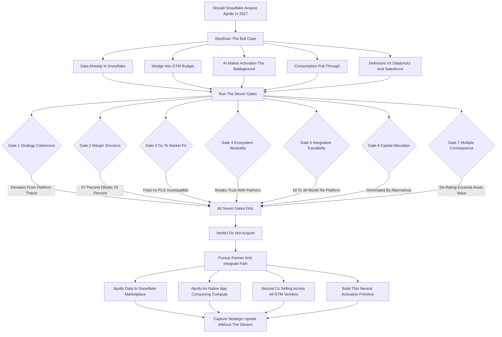

### Direct Answer

**No — Snowflake should not acquire Apollo in 2027.** The deal is seductive on a slide and dominated by arithmetic in reality: it dilutes a 75-78% gross-margin structure with a 65-69% one, fuses two incompatible go-to-market motions into a single organization, and destroys the ecosystem neutrality that underwrites Snowflake's partner moat — all to acquire roughly $100M-$150M of ARR for a likely $3B-$7B price. The strategically correct move is the inverse of an acquisition: **partner-and-integrate** with Apollo through the Snowflake Marketplace and Native App Framework, and — if Snowflake wants to own activation — build a thin, neutral, warehouse-native reverse-ETL primitive rather than buy a thick, branded, SMB-flavored application.

**TL;DR**

- **Verdict: pass.** The Snowflake-Apollo acquisition fails all seven gates a disciplined board should run it through — strategy coherence, margin structure, go-to-market fit, ecosystem neutrality, integration tractability, capital allocation, and multiple consequence.
- **The dominant cost is invisible on the synergy slide.** A 1-2 turn forward-multiple de-rating on Snowflake's ~$8.4B existing revenue base is worth **$8B-$15B+ of market capitalization** — larger than the entire value of the acquired asset.
- **Margin dilution is structural, not tactical.** Apollo's COGS carries third-party data licensing, email infrastructure, and deliverability costs that Snowflake's does not — blended gross margin compresses **80-190 basis points** once integration drag is counted.
- **Motion conflict is the quiet killer.** Snowflake (NYSE: SNOW) sells via enterprise field motion; Apollo grows via product-led growth. One organization cannot run both without degrading the PLG engine that makes Apollo valuable.
- **Neutrality is unbuyable and unsellable.** Owning Apollo turns Snowflake into a competitor of Salesforce (NYSE: CRM), HubSpot (NYSE: HUBS), ZoomInfo (NASDAQ: GTM), and the modern enrichment layer — every one of them a current Snowflake partner.
- **The right instrument exists and is cheaper.** Data sharing, the Native App Framework, neutral co-selling, and a thin activation primitive capture the strategic upside the bull case wants without the dilution, the integration slog, or the channel conflict.

---

## 1. What This Question Is Actually Asking

The question "Should Snowflake acquire Apollo in 2027?" is not really a question about Snowflake or about Apollo. It is a question about whether an infrastructure company should move up the stack into applications by acquisition — and that is one of the most consequential, most frequently botched decisions in enterprise software strategy.

### 1.1 The Two Companies, Stated Precisely

To answer the question well, you have to be exact about the two companies. **Snowflake (NYSE: SNOW)** is a cloud data platform: customers land their structured and semi-structured data in Snowflake, run analytics and increasingly AI workloads against it, and pay on a consumption basis for storage and compute. **Apollo** — here meaning Apollo.io, the sales-intelligence and engagement platform, not the private-equity firm — is the opposite kind of company: it sells a B2B contact-and-company database fused with prospecting, enrichment, sequencing, and engagement workflow, and it goes to market product-led with a free tier and self-serve expansion into SMB and mid-market teams.

| Attribute | Snowflake (NYSE: SNOW) | Apollo.io |
|---|---|---|
| Category | Cloud data platform / infrastructure | Sales-intelligence + engagement application |
| Revenue scale (2027 frame) | ~$8.4B product revenue run-rate | ~$100M-$150M ARR |
| Gross margin | 75-78% | 65-69% |
| Net revenue retention | ~125-135% historically | Seat + credit expansion driven |
| Go-to-market motion | Enterprise field sales | Product-led growth, free tier, self-serve |
| Customer center of gravity | Enterprise / large enterprise | SMB / mid-market |
| Pricing model | Consumption (storage + compute) | Seats + credits + tier upgrades |

### 1.2 The Real Question Underneath

Asked precisely, the question becomes: should a 76%-margin, enterprise-field, neutral-infrastructure compounder pay billions to absorb a 67%-margin, product-led, SMB-flavored, competitively-entangled application? Framed that way, the answer nearly writes itself. **The discipline is in showing the work** — and the work is what separates a board decision from a banker's narrative.

### 1.3 Why "Infrastructure Buys Application" Is The Pattern To Watch

The Snowflake-Apollo question is a specific instance of a recurring enterprise-software pattern: an infrastructure or platform company reaching up into the application layer by acquisition. The pattern has a base rate, and the base rate is poor. The deals that work look nothing like Apollo; the deals that destroy value look exactly like it. That base-rate prior is the backdrop against which every specific argument below should be read.

---

## 2. The Strategic Logic FOR The Deal — Stated As Strongly As Possible

A serious analysis has to steelman the bull case before dismantling it, because the bull case is not stupid — it is just incomplete. Strategy is not the sum of true points; it is what survives contact with margin structure, go-to-market mechanics, integration reality, and competitive response.

### 2.1 The Five Pillars Of The Bull Case

**One — the data is already there.** Enterprise customers already land their CRM, product, and behavioral data in Snowflake; Apollo's entire value proposition is enriching and activating contact and account data; owning Apollo lets Snowflake "close the loop" from raw data to revenue action without the customer leaving the platform.

**Two — it is a wedge into the GTM-software budget.** Revenue-operations and go-to-market tooling is a large, growing, durable budget line — arguably $20B-plus across data, engagement, and CRM-adjacent tooling — and Snowflake today captures none of it directly.

**Three — AI makes activation the battleground.** As AI agents start doing prospecting, research, and outbound, whoever owns the data layer plus the activation layer has a structural advantage; buying Apollo buys a head start.

**Four — cross-sell and consumption pull-through.** Apollo workloads — enrichment, scoring, sequencing — would themselves consume Snowflake compute, and Snowflake's enterprise relationships could pull Apollo upmarket.

**Five — defensive positioning.** If Snowflake does not own an activation layer, Databricks, Salesforce Data Cloud, or Microsoft Fabric might fuse data and activation first.

### 2.2 Why The Bull Case Is Necessary But Not Sufficient

| Bull-case pillar | Is the premise true? | Does it survive scrutiny? |
|---|---|---|
| Data is already there | Yes | No — argues for integration, not acquisition |
| Wedge into GTM budget | Yes | No — Native App Framework captures it as consumption |
| AI makes activation the battleground | Yes | No — a neutral primitive holds the ground better |
| Consumption pull-through | Yes | Partly — but small ($20M-$60M) and partnership-achievable |
| Defensive vs Databricks/Salesforce | Yes | No — neutrality is the stronger defense |

Every pillar is true in isolation. The bull case is a narrative; the bear case is an arithmetic; and **in M&A the arithmetic wins.**

---

## 3. Margin Structure: The Dilution That Cannot Be Argued Away

The first and least escapable problem is gross margin. Snowflake (NYSE: SNOW) is valued the way it is — as a premium compounder — substantially because it runs a 75-78% gross margin with the operating leverage profile that implies.

### 3.1 Why Apollo's Margin Is Structurally Lower

Apollo, as a sales-intelligence and engagement platform, runs structurally lower gross margin — call it 65-69% — because its cost of revenue includes things Snowflake's does not: **licensing and refreshing third-party contact and firmographic data**, **email-sending infrastructure and deliverability management**, and **the human data-operations cost of keeping a B2B database accurate**. These are not inefficiencies a smart acquirer can engineer away; they are the cost of being in the sales-intelligence business at all.

### 3.2 The Dilution Arithmetic

When you weld a 67%-margin business onto a 76%-margin business, the blended number does not average gently — it gets dragged toward the lower number in proportion to revenue weight, then dragged further by integration costs that hit COGS during the multi-year stitching period.

| Scenario | Snowflake rev | Snowflake GM | Apollo rev | Apollo GM | Blended GM | GM compression |
|---|---|---|---|---|---|---|
| Apollo at $100M ARR | $8,400M | 76% | $100M | 67% | 75.9% | ~10 bps (pre-integration) |
| Apollo at $150M ARR | $8,400M | 76% | $150M | 67% | 75.8% | ~16 bps (pre-integration) |
| Apollo scaled to $400M ARR | $9,000M | 76% | $400M | 66% | 75.6% | ~43 bps |
| With integration drag in COGS (Yr1-2) | $9,000M | 76% | $400M | 58% | 75.2% | ~80 bps |
| Bear case: data-cost inflation + churn mix | $9,000M | 75% | $400M | 54% | 74.1% | ~190 bps |

### 3.3 The Trap In "Only 10 Basis Points"

The pure arithmetic dilution looks modest at first because Apollo is small relative to Snowflake — but that is exactly the trap. A board does not get to evaluate the deal at "10 bps of dilution." It has to evaluate it at the full cost: the integration COGS drag, data-licensing cost inflation as Apollo scales, the lower-margin revenue mix becoming a larger share over time if Apollo grows faster than the core, and — most importantly — the **multiple consequence** of being repriced from a pure-play high-margin infrastructure company to a mixed-margin "platform." That last effect is not measured in basis points. It is measured in tens of billions of dollars of market capitalization, and it gets its own section below.

---

## 4. Go-To-Market Motion Conflict: Two Companies That Sell Nothing The Same Way

The second structural problem is that Snowflake and Apollo do not just sell different products — they sell in fundamentally incompatible **motions**, and motion conflict is the quiet killer of infrastructure-buys-application deals.

### 4.1 Two Motions Side By Side

Snowflake's motion is **enterprise field sales**: named-account reps, sales engineers, multi-quarter cycles, six- and seven-figure consumption commitments, procurement and security review, executive sponsorship, and a customer-success organization tuned to expanding workloads inside large accounts. Apollo's motion is **product-led growth**: a free tier, self-serve credit-card signup, in-product expansion, a sales-assist team that pounces on usage signals, and a center of gravity in SMB and mid-market teams of 5 to 200 reps.

| Dimension | Snowflake motion | Apollo motion |
|---|---|---|
| Primary engine | Enterprise field sales | Product-led growth + self-serve |
| Typical buyer | CDO, VP Data, CIO | VP Sales, RevOps, individual SDR/AE |
| Deal size | $100K-$5M+ consumption | $5K-$50K subscription |
| Sales cycle | 3-12 months | Days to weeks (self-serve) or short-cycle |
| Expansion mechanism | More workloads per account | Seats + credits + tier upgrades |
| Customer segment center | Enterprise / large enterprise | SMB / mid-market |
| Success metric | Net revenue retention on consumption | Activation, seat expansion, credit burn |
| Org DNA | Field, SE-heavy, procurement-savvy | Growth, lifecycle marketing, sales-assist |

### 4.2 What Breaks When You Force Both Into One Org

When Snowflake's enterprise field organization is told to "also sell Apollo," several things go wrong at once. **Reps optimize for the seven-figure consumption deal** and treat the $15K Apollo attach as a rounding error not worth the cycles. **The PLG funnel that actually drives Apollo's growth gets starved** because nobody in an enterprise field org knows how to feed it. **Apollo's SMB customers** — the base of its pyramid — get an account team built for the Fortune 500, which is both expensive and unwelcome.

### 4.3 The Historical Pattern Is Unambiguous

When an enterprise-field company acquires a PLG company, the PLG motion is the one that dies, because the acquiring org's incentives, headcount, and instincts all pull the other way. Snowflake would be paying billions for Apollo's growth engine and then, structurally, switching it off. This is not a hypothetical — it is the base-rate outcome, explored further in (q1886) and (q1879).

---

## 5. Ecosystem Neutrality: The Brand Asset Snowflake Would Set On Fire

The third structural problem is the least visible on a spreadsheet and arguably the most expensive.

### 5.1 Why Neutrality Is Snowflake's Real Moat

Snowflake's position in the market depends on a specific, hard-won posture: it is **neutral**. It sits underneath the application layer and refuses to compete with it. A Salesforce shop, a HubSpot shop, a Microsoft Dynamics shop, an Outreach shop, a ZoomInfo shop — all of them can land their data in Snowflake without worrying that Snowflake will use that position to compete with the application they already bought. That neutrality is why Snowflake's Marketplace has the partner density it has, why thousands of independent software vendors build on the Native App Framework, and why data sharing — Snowflake's genuine moat — works at all.

### 5.2 What Breaks The Moment Snowflake Owns Apollo

The moment Snowflake owns Apollo, that posture cracks. Apollo competes directly with the companies in the table below — every one of which is also, today, a Snowflake partner or a Snowflake-adjacent vendor whose customers run on Snowflake.

| Partner / vendor | Ticker | How Apollo collides with it | Today's Snowflake relationship |
|---|---|---|---|
| Salesforce | NYSE: CRM | Sales Cloud, Data Cloud, engagement layer | Major ecosystem partner |
| HubSpot | NYSE: HUBS | Sales Hub, Breeze intelligence, SMB CRM | Ecosystem partner |
| ZoomInfo | NASDAQ: GTM | Head-to-head on B2B data coverage | Data-partner adjacency |
| Microsoft | NASDAQ: MSFT | Dynamics, LinkedIn Sales Navigator, Fabric | Cloud + ecosystem partner |
| Twilio | NYSE: TWLO | Engagement and communications adjacency | Marketplace data adjacency |

### 5.3 The Self-Inflicted Wound

Owning Apollo tells all of these companies that Snowflake is now willing to compete in the application layer — which gives every one of them a reason to accelerate their own data-platform strategy, to dual-source onto Databricks or Microsoft Fabric, to slow their Snowflake Marketplace investment, and to treat Snowflake as a frenemy rather than neutral plumbing. **Neutrality is the kind of asset you only notice when it is gone, and you cannot buy it back.** The Apollo acquisition would be Snowflake spending billions of dollars to acquire roughly $130M of ARR while degrading the trust that underwrites a multi-billion-dollar partner ecosystem. That is not a synergy — it is a self-inflicted wound with a price tag attached.

---

## 6. Integration Reality: 18-30 Months Of Engineering For A Loop That Barely Closes

Even if you wave away margin, motion, and neutrality, the integration itself is a multi-year slog with a weak payoff.

### 6.1 The Architectural Mismatch

The bull case says "the data is already in Snowflake, so integration is easy." It is not, and the reason is architectural. Snowflake is built for **analytical** workloads — columnar storage, set-based queries, batch and increasingly streaming ingestion, an open-table-format direction with Iceberg. Apollo is an **operational** application — it needs low-latency, row-level reads and writes against contact and engagement records, a transactional data model, and tight sub-second interaction loops with sending infrastructure and the user's inbox and CRM. **Those are different database problems.**

### 6.2 The Integration Workstreams

To genuinely fuse Apollo into Snowflake you would have to either (a) keep Apollo's operational stack separate and bolt a sync layer between it and Snowflake — which is not integration, it is a pipe a partnership gives you for free — or (b) re-platform Apollo's operational core, an 18-30 month engineering program.

| Workstream | What it requires | Difficulty | Time |
|---|---|---|---|
| Identity resolution | Reconcile Apollo's contact/account graph with customer Snowflake data | High | 6-12 mo |
| Operational data model | Map transactional schema onto warehouse-native architecture | Very high | 12-24 mo |
| Real-time enrichment | Sub-second reads and writes against warehouse-class storage | Very high | 12-30 mo |
| Engagement + deliverability | Email infra, sending reputation, inbox sync — all non-Snowflake | High | 9-18 mo |
| Billing model reconciliation | Apollo seats and credits vs Snowflake consumption | Medium | 6-12 mo |
| Security + compliance unification | SOC2, data residency, two compliance regimes merged | Medium-high | 9-15 mo |
| Brand + GTM repositioning | Decide if "Apollo" survives, retrain field and PLG orgs | High (org) | 12-24 mo |

### 6.3 The No-Win Quadrant

The punchline: the version of integration that is "easy" is the version that is not integration at all (a sync pipe a partnership gives you for free), and the version that is "real" is an 18-30 month re-platforming with stalled product velocity and uncertain unit economics. **There is no quadrant of this analysis where the integration is both easy and valuable.**

### 6.4 The Velocity Tax Nobody Models

There is a second-order cost buried inside the integration timeline that the banker's deck never quantifies: the **velocity tax**. While Apollo's engineering organization spends 18-30 months reconciling its operational data model against warehouse architecture, its competitors are not standing still. The agentic-enrichment frontier — autonomous research agents, AI-driven contact discovery, real-time intent scoring — is exactly where the category is moving fastest in 2027. Every engineer-quarter Apollo spends on "make this run on Snowflake" is an engineer-quarter not spent on "stay ahead of the competitive frontier." The acquisition therefore does not merely cost the purchase price and the integration spend; it costs Apollo its competitive position during the precise window when that position is most contestable. A growth asset that stops growing during integration is not a growth asset — it is a declining asset that was purchased at a growth multiple. This is the mechanism by which post-close performance routinely undershoots the model: not because the integration fails technically, but because the integration succeeds while the market moves on. The velocity tax is invisible on a spreadsheet because it shows up as an absence — the features that did not ship, the customers that were not won — and absences do not appear in a synergy projection.

---

## 7. The Multiple De-Rating: The Real Price Tag Nobody Puts On The Slide

Here is the cost the banker's deck will not show.

### 7.1 Why The Market Does Not Value All Software Revenue Equally

Public-market investors pay a premium — historically a forward revenue multiple in the low-to-mid teens for a company with Snowflake's growth-and-margin profile — for a **pure-play, high-margin, neutral data-infrastructure compounder**, because that profile implies durable expansion, high incremental margins, and a long runway. They pay much less — mid-single-digit to high-single-digit forward revenue — for a **mixed-margin "platform" company** that competes with its own ecosystem, because that profile implies margin pressure, channel conflict, and slower, more contested growth.

### 7.2 The De-Rating Arithmetic

The Apollo acquisition does not just dilute gross margin by basis points; it threatens to move Snowflake from the first category into the second in the eyes of the market.

| Multiple scenario | Forward revenue multiple | Implied value on ~$8.4B base |
|---|---|---|
| Premium pure-play infrastructure compounder | Low-to-mid teens | Reference / status quo |
| One turn of compression | -1x forward revenue | ~$8B+ market cap erased |
| Two turns of compression | -2x forward revenue | ~$15B+ market cap erased |
| Full re-rate to mixed-margin platform | 5-9x forward revenue | Severe, structural |

### 7.3 The Term That Dominates The Whole Deal

Compare the de-rating to what Snowflake would pay for Apollo: somewhere between $3B and $7B. **The deal can be value-destructive even if Apollo performs perfectly post-close**, because the multiple consequence on the $8.4B base dwarfs the entire value of the $130M acquired asset.

| Lever | Magnitude | Direction |
|---|---|---|
| Apollo ARR acquired | $100M-$150M | + (small) |
| Purchase price | $3B-$7B | - (cash/stock out) |
| Gross-margin compression | 80-190 bps blended | - |
| Integration spend (opex + COGS), 24 mo | $300M-$700M | - |
| Forward-multiple de-rating risk on $8.4B base | $8B-$15B+ market cap | - (dominant term) |
| Realistic consumption pull-through from Apollo workloads | $20M-$60M incremental revenue | + (small) |

The terms do not balance. A disciplined capital-allocation analysis stops here. The de-rating mechanism is examined as a standalone topic in (q1887).

---

## 8. Capital Allocation: What Snowflake Should Do With $3B-$7B Instead

The deal also has to clear a bar it is rarely measured against: is acquiring Apollo the **best** use of $3B-$7B, or merely a use?

### 8.1 The Menu Of Higher-Return Alternatives

| Alternative | What it does | Why it beats the Apollo deal |
|---|---|---|
| Share buyback | Retire shares at a reasonable multiple | Known return, zero integration risk, zero ecosystem damage |
| AI / Cortex investment | Fund native AI workloads on the warehouse | Compounds the core thesis instead of diluting it |
| Pure-infrastructure tuck-ins | Streaming, governance, vector/retrieval, dev tooling | Raises platform value to all partners |
| Native App Framework + Marketplace funding | Make 50 Apollo-like ISVs build on Snowflake | Routes consumption via partners, no channel conflict |
| Thin reverse-ETL / activation primitive | Build the neutral audience layer directly | Owns activation without owning a branded application |

### 8.2 The Dominated-Decision Conclusion

Every one of these alternatives delivers more return per dollar at less risk than buying a sub-scale, lower-margin, competitively-entangled application. **In capital-allocation terms, the Apollo deal is dominated** — there exists at least one alternative that is better on every axis. This is the Gate 6 analysis, and capital-allocation discipline for high-multiple software companies is the subject of (q1884).

---

## 9. The Partner-And-Integrate Path: Getting The Upside Without The Acquisition

The strongest argument against the acquisition is that Snowflake can capture nearly all of the strategic upside the bull case describes — without paying billions, without diluting margin, without burning integration years, and without torching neutrality.

### 9.1 The Four Mechanics Of The Partnership Path

**Data sharing.** Apollo can publish enriched contact and account data into the Snowflake Marketplace, and Snowflake customers can consume it without data ever leaving the governance boundary. That is the "data is already there" loop, closed, at zero acquisition cost.

**Native App Framework.** Apollo can ship its enrichment, scoring, and audience logic as a Snowflake Native App that runs inside the customer's account and consumes Snowflake compute — which is the "consumption pull-through" the bull case wants, delivered as partner revenue.

**Co-selling without ownership.** Snowflake's field can refer GTM-data workloads to Apollo and a dozen competitors, staying neutral while still steering the budget toward the platform.

**Reverse-ETL and activation primitives.** Snowflake builds the thin activation surface itself, neutrally, so any application — Apollo, Salesforce, HubSpot, Outreach — can be the destination.

### 9.2 Partnership Beats Acquisition On Every Axis That Matters

| Axis | Acquisition path | Partner-and-integrate path |
|---|---|---|
| Cost | $3B-$7B + integration spend | Near-zero |
| Gross margin | Compressed 80-190 bps | Preserved at 76% |
| Go-to-market motion | Two motions collide | Single enterprise motion intact |
| Ecosystem neutrality | Broken with major partners | Preserved, partners stay loyal |
| Integration | 18-30 month slog | None — partner mechanics only |
| Consumption pull-through | Captured (also via partnership) | Captured via Native App Framework |
| Valuation multiple | De-rating risk | Premium compounder multiple protected |

The only thing the acquisition gives you that the partnership does not is **ownership of Apollo's P&L** — and Apollo's P&L, as established above, is exactly the thing Snowflake should not want to own.

---

## 10. The Competitive Landscape Apollo Actually Lives In

To understand why owning Apollo is a competitive liability rather than an asset, you have to see the field Apollo plays on — because Snowflake would be inheriting all of those fights.

### 10.1 The Five-Front War

**ZoomInfo (NASDAQ: GTM)** is the scaled incumbent in B2B data intelligence: larger revenue base, deep enterprise penetration, and a direct head-to-head with Apollo on data coverage and accuracy. **Salesforce (NYSE: CRM)** owns the CRM system of record and is pushing aggressively into the data-and-engagement layer with Data Cloud and Agentforce. **HubSpot (NYSE: HUBS)** owns the SMB-and-mid-market CRM motion — the exact segment Apollo's PLG engine targets. **Outreach and Salesloft** own sales engagement and overlap Apollo's sequencing-and-cadence functionality. **The modern enrichment layer** — the fast-moving agentic-enrichment entrants — are arguably the most dangerous competitors to Apollo's medium-term position. **Microsoft (NASDAQ: MSFT)** sits underneath all of it with Dynamics, LinkedIn Sales Navigator, and Fabric.

### 10.2 Why Inheriting The War Is The Worst Part

| Competitor Apollo faces | Threat vector | Also a Snowflake partner? |
|---|---|---|
| ZoomInfo (NASDAQ: GTM) | Data coverage and accuracy | Yes — data adjacency |
| Salesforce (NYSE: CRM) | CRM + Data Cloud + Agentforce | Yes — major partner |
| HubSpot (NYSE: HUBS) | SMB/mid-market CRM motion | Yes — ecosystem partner |
| Outreach / Salesloft | Sales-engagement sequencing overlap | Adjacent / Marketplace |
| Microsoft (NASDAQ: MSFT) | Dynamics + Sales Navigator + Fabric | Yes — cloud + ecosystem |

If Snowflake buys Apollo, Snowflake is not entering a green field — it is enlisting in a five-front war in a category where it has no product DNA, no brand permission, and no existing right to win. Worse, several of those combatants are Snowflake partners today, so **the acquisition simultaneously starts the war and arms the enemy.** Apollo's own competitive defense posture is examined in (q1885).

---

## 11. Snowflake's Own Stated Strategy And Why Apollo Contradicts It

### 11.1 The Platform Thesis, Not The Application Thesis

Snowflake's leadership has been consistent and public about what the company is trying to be: the platform where data, AI, and applications converge — with the applications built by **others** on the Native App Framework and distributed through the Marketplace, while Snowflake monetizes the storage, compute, governance, and data sharing underneath. The strategy is explicitly a **platform** strategy, not an **application** strategy. The whole point of the Native App Framework is that Snowflake does not want to build or own the long tail of vertical and horizontal applications — it wants thousands of them to exist on its substrate, each generating consumption.

### 11.2 The Coherence Tax

Acquiring Apollo directly contradicts that thesis. It says: for this one category — GTM data and engagement — Snowflake will be the application vendor, will compete with the ISVs it is courting everywhere else, and will take on the operational, brand, and channel-conflict burden it has deliberately structured its entire strategy to avoid. **Strategy coherence matters because the market prices it.** A focused infrastructure compounder earns a premium multiple; a company that opportunistically reaches into the application layer earns a conglomerate discount and a credibility tax. The Apollo acquisition is not a refinement of Snowflake's strategy — it is a deviation from it.

---

## 12. When Infrastructure Buying Applications Actually Works — And Why This Is Not That

### 12.1 The Five Conditions For A Good Infrastructure-Buys-Application Deal

It would be too glib to say infrastructure companies should never buy applications. Sometimes they should. The discipline is in knowing the conditions and checking whether the Snowflake-Apollo deal meets them.

| Condition | What it requires | Snowflake-Apollo result |
|---|---|---|
| Thin, neutral feature | The acquired thing is a primitive, not a brand | FAIL — Apollo is a thick branded application |
| Matching margin structure | Target margin meets or exceeds the platform's | FAIL — 67% below 76% |
| Same go-to-market motion | One org can sell both without degrading either | FAIL — field vs PLG incompatible |
| No major-partner collision | The target does not compete with key partners | FAIL — collides with CRM, HUBS, GTM |
| Genuinely architectural integration | The target re-expresses natively in a reasonable horizon | FAIL — 18-30 month re-platform |

### 12.2 Five Conditions, Five Failures

The Snowflake-Apollo deal fails every one of these conditions. By contrast, if Snowflake were evaluating a small reverse-ETL primitive, a governance tool, or a streaming-ingestion engine, the same five-question test would mostly pass — which is precisely why **those, not Apollo, are the deals Snowflake should be looking at.**

---

## 13. The Founder-And-Talent Dimension: What Happens To Apollo Post-Close

### 13.1 You Are Acquiring An Organization, Not A Spreadsheet

M&A analyses that stop at the spreadsheet miss that you are also acquiring — and frequently destroying — an organization. Apollo's value is not just its ARR and its database; it is a product-led-growth operating system: a growth team that knows how to convert a free tier, a product organization that ships fast in a competitive category, a data-operations function that keeps the database fresh, and a leadership team whose instincts are tuned to PLG and SMB.

### 13.2 The Predictable Post-Close Decay

| Post-close dynamic | What happens | Why |
|---|---|---|
| Growth/PLG leadership | Departs within 12-24 month earn-out window | Expertise orthogonal to enterprise-infra parent |
| Product roadmap | Re-prioritized toward "Snowflake integration" | Integration work crowds out competitive velocity |
| SMB customer base | Churns at the edges | Now served by an enterprise account model |
| The growth engine itself | Degrades | Acquirer does not know how to run it, is not incentivized to |

This is not a hypothetical risk; it is the base-rate outcome when an enterprise-infrastructure company acquires a PLG application company. **You would be paying growth-asset prices for an asset whose growth depends on an operating culture your own organization will involuntarily dismantle.**

### 13.3 Why Culture Mismatch Is Not Fixable With An Org Chart

The standard board response to the talent-decay concern is structural: "we will ring-fence Apollo, keep its leadership, preserve its comp plans, protect it from the parent's bureaucracy." This is a reasonable instinct and it still does not work, for a reason rooted in how operating cultures actually function. A PLG culture is not a set of policies that can be written down and protected — it is a continuous stream of small decisions made by hundreds of people who share an instinct for what matters: shipping fast, optimizing the funnel, treating the free tier as sacred, measuring activation obsessively. That instinct is reinforced every day by who gets promoted, which metrics the leadership reviews, and what the company celebrates. The moment Apollo sits inside Snowflake, the parent's gravity starts bending all of those reinforcement loops, slowly and unavoidably. Snowflake's board reviews consumption growth and net revenue retention; Apollo's leaders learn that those are the numbers that earn airtime. Snowflake's promotion ladder rewards enterprise-deal skills; Apollo's ambitious people notice. Within two or three review cycles, the ring-fence has become a fiction — not because anyone violated it, but because culture is a flow, not a fence, and you cannot ring-fence a flow. The talent that built Apollo's growth engine reads these signals faster than any retention agreement, and the best of them leave before the earn-out cliff because they can see where the current is taking them.

### 13.4 The Acqui-Hire Math Does Not Rescue The Deal

If the real prize is Apollo's growth-and-data-operations talent, a board should ask the uncomfortable question directly: what would it cost to simply hire an equivalent team? A world-class growth org, a data-operations function, and a PLG-fluent product leadership group is an expensive thing to assemble — but it is a low-tens-of-millions problem, not a multi-billion-dollar one. Paying $3B-$7B, taking billions of goodwill onto the balance sheet, absorbing 80-190 basis points of margin dilution, and accepting the de-rating risk in order to "acquire the team" is the most expensive acqui-hire in the history of enterprise software — and it comes bundled with a lower-margin P&L, a five-front competitive war, and an ecosystem-neutrality cost that direct hiring does not carry. The talent argument, examined honestly, is an argument for a recruiting budget, not for an acquisition.

---

## 14. Timing: Why 2027 Specifically Makes It Worse

### 14.1 The Category Is Mid-Transformation

The "in 2027" in the question is not incidental — the timing makes the case against the deal stronger, not weaker. 2027 is the year the AI-agent layer for go-to-market work is being actively contested: agentic prospecting, autonomous research, AI-driven enrichment and outbound are moving from demo to production. Acquiring a full-stack application in a category that is mid-transformation means buying an asset whose product surface may be partially obsoleted by the transformation — and committing 18-30 months of integration engineering at exactly the moment the category is moving fastest.

### 14.2 The Opportunity Cost Is At Its Maximum

| Snowflake priority in 2027 | What it needs | What the Apollo deal does to it |
|---|---|---|
| Cortex / native AI workloads | Engineering attention and capital | Diverts both into GTM-app integration |
| Data-and-AI convergence narrative | Executive bandwidth and focus | Spends it on channel-conflict management |
| M&A capacity | Reserved for infra tuck-ins | Consumed by one large application deal |

The right time to buy a full-stack application in a category undergoing AI disruption is approximately never; doing it in 2027, when both the target's category and the acquirer's core platform are in their most dynamic phase, is **the worst possible timing.**

---

## 15. The Decision Framework: How A Disciplined Board Should Reason About This

Strip the analysis down to a framework a board can actually run, and the Snowflake-Apollo question becomes a sequence of gates, each of which the deal must pass.

### 15.1 The Seven Gates

| Gate | Test | Result |
|---|---|---|
| 1 | Strategy coherence — does it advance the stated strategy? | FAIL — deviates from platform-not-application thesis |
| 2 | Margin structure — does the target protect the premium? | FAIL — 67% dilutes 76% |
| 3 | Go-to-market fit — can one org sell both motions? | FAIL — field vs PLG incompatible |
| 4 | Ecosystem effect — strengthen or break neutrality? | FAIL — breaks trust with CRM, HUBS, GTM, Outreach |
| 5 | Integration tractability — native re-expression possible? | FAIL — 18-30 month re-platform |
| 6 | Capital allocation — is this the best use of capital? | FAIL — dominated by buybacks, AI, infra tuck-ins |
| 7 | Multiple consequence — protect or threaten the multiple? | FAIL — de-rating risk exceeds acquired asset value |

### 15.2 Seven Failures Is Not A Close Call

A deal that fails one gate deserves serious skepticism. A deal that fails all seven is not a close call — **it is a clear pass, and a board that approved it anyway would be substituting narrative for discipline.** The governance discipline of pressure-testing a management-proposed acquisition is the subject of (q1878).

---

## 16. The Decision Journey: A Visual Map

The flowchart below traces how a disciplined board moves from the bull case, through the seven gates, to the verdict and the partnership path.

---

## 17. The History Lesson: What Comparable Deals Teach

### 17.1 The Three-Stage Decay Pattern

The Snowflake-Apollo question is not novel — the enterprise-software graveyard is full of infrastructure and platform companies that reached up into the application layer by acquisition.

| Stage | What happens | Why it happens |
|---|---|---|
| 1. Ecosystem cools | ISVs reassess, dual-source, slow investment | The platform has shown it will compete with partners |
| 2. Velocity slows | Integration crowds out competitive feature work | Founding-team instincts clash with acquirer culture |
| 3. Coherence discount | Focused-compounder multiple becomes conglomerate discount | Channel conflict and margin drag get priced in |

### 17.2 The Deals That Worked Were The Opposite Shape

The deals that worked were almost always the opposite shape — the acquirer bought a thin capability that strengthened the platform for **everyone** (a database engine, a security layer, a developer tool, an open-source project that became a managed service), at a margin profile that matched, sold through the same motion, with no major-partner collision. **The lesson is not "never acquire" — it is "the acquisitions that compound value look like Apollo's opposite."** A board reasoning from base rates rather than from the seductive specific narrative should treat the historical pattern as a strong prior against the deal.

---

## 18. The Customer's And CFO's Views

### 18.1 What Snowflake's Buyers Actually Want

Leave the boardroom and ask what Snowflake's actual customers — the chief data officers, VPs of data, and platform engineering leaders who sign the consumption contracts — would want. These buyers chose Snowflake substantially **because** it is neutral infrastructure. They run Salesforce or Dynamics for CRM, a sales-engagement tool of their choosing, a BI tool of their choosing, and they land all of it in Snowflake precisely because Snowflake does not have a horse in those races. When Snowflake acquires Apollo, those buyers face an uncomfortable signal: the platform they chose for neutrality is now an application vendor in the GTM category — which means the platform might next be an application vendor in **their** category. The most sophisticated customers will note the precedent and keep their Databricks or Microsoft Fabric relationship warm as a hedge.

### 18.2 How The Deal Reads On The Financial Statements

| Statement | What the deal does | Why it hurts |
|---|---|---|
| Income statement | Lower-margin revenue in; integration spend in opex and COGS | Drags blended margin during the synergy-watch window |
| Balance sheet | Billions of goodwill and intangibles appear | Goodwill gets impaired with a press release if Apollo underperforms |
| Cash flow statement | Cash-and-stock purchase depletes reserves or dilutes holders | Integration burns FCF when the market wants FCF expanding |
| Metrics page | Pressures NRR, RPO, gross margin, FCF margin | Improves none of the numbers investors trade on |

A disciplined CFO does not need the strategic debate to reach a view: the financial-statement mechanics alone make the deal **a hard sell to the board and a harder sell to the market.**

---

## 19. The Regulatory And Closing-Risk Dimension

### 19.1 A Deal Is A Process, Not A Decision

A multi-billion-dollar acquisition is not a decision — it is a process with its own failure modes. A transaction at the $3B-$7B scale draws antitrust attention, and the relevant theory of harm is not far-fetched: regulators have grown attentive to platform companies acquiring adjacent application players in ways that could foreclose competition or entrench a data advantage. The combination of Snowflake's data-platform position with Apollo's data-and-engagement application is exactly the shape of deal that invites a second look.

### 19.2 The Cost Of The Process Itself

| Closing risk | Cost imposed |
|---|---|
| Antitrust review | Months of uncertainty; competitors recruit Apollo customers and talent |
| Limbo period | Apollo can neither fully integrate nor fully operate independently |
| Stock-funded structure | Both sides exposed to SNOW share-price volatility before close |
| Cash-funded structure | Depletes the strategic reserve |
| Integration-team risk | Best people on both sides spend a year on integration, not product |

None of this changes the fundamental verdict, but it sharpens it: even a board that somehow talked itself past the seven gates would still be signing up for a closing process whose costs are real and whose benefits remain, at best, a narrative.

---

## 20. The Steelman Of The Best Version — And Why Even That Fails

### 20.1 The Best-Constructed Version Of The Deal

Fairness demands one more pass: what is the **best-constructed** version of this acquisition? Imagine Snowflake structures it as carefully as possible. It keeps Apollo as a standalone brand and business unit with its own PLG motion and leadership intact, ring-fenced from the enterprise field organization. It commits publicly to keeping Apollo's data and integrations open to all platforms, including Databricks. It funds Apollo's roadmap independently so velocity does not stall. It treats the integration as a long-horizon, optional data-sharing project rather than a forced re-platforming.

### 20.2 Why Every Safety Move Makes The Deal Pointless

This is the best version of the deal — and it still fails, for a revealing reason: **every move that makes the deal safer also makes it pointless.** If Apollo stays a ring-fenced standalone with its own motion, you have not gained go-to-market synergy. If Apollo stays open to all platforms, you have not gained competitive exclusivity. If the integration stays optional and long-horizon, you have not gained the closed loop. The best version of the acquisition asymptotically approaches a partnership — except you have paid $3B-$7B, taken the goodwill onto your balance sheet, absorbed the margin dilution, and accepted the closing risk to get there. The structural problems are load-bearing: the very things that would make the deal **valuable** are the things that make it **destructive**, and the very things that would make it **safe** are the things that make it **redundant with a partnership.**

---

## 21. Counter-Case: The Strongest Arguments That Snowflake SHOULD Acquire Apollo

Intellectual honesty requires putting the bull case at full strength, because a board that has not genuinely wrestled with the strongest pro-deal arguments has not actually made a decision — it has just confirmed a prior.

### 21.1 The Counter-Arguments, Argued At Full Strength

**Counter 1 — The data gravity argument is real.** Enterprise customer data genuinely does already live in Snowflake, and Apollo's whole product is data activation. There is real, intuitive logic to owning the activation layer that sits on top of the data you already host. *Why it still fails:* data gravity is an argument for **integration**, not **acquisition**. The Marketplace and Native App Framework let Apollo's activation run on top of Snowflake-resident data with zero acquisition cost and zero margin dilution.

**Counter 2 — The GTM-software budget is large and Snowflake captures none of it.** Revenue-operations and go-to-market tooling is a $20B-plus budget category, and today Snowflake's share is essentially zero. *Why it still fails:* Snowflake can route that budget onto its platform as **consumption** by hosting fifty Apollo-like ISVs on the Native App Framework — capturing the platform economics of the whole category instead of the application P&L of one sub-scale player.

**Counter 3 — AI agents make the activation layer the strategic high ground.** As autonomous agents take over prospecting and outbound, whoever controls data plus activation has a durable advantage. *Why it still fails:* the activation high ground can be held with a thin, neutral primitive that every agent and every application plugs into. Owning one branded application gives you one combatant in a five-front war and turns the other four into enemies.

**Counter 4 — It is a defensive necessity against Databricks, Salesforce, and Microsoft.** If Snowflake does not fuse data and activation, a competitor will. *Why it still fails:* the defensive value is captured by **building the neutral primitive and funding the ecosystem**, which makes Snowflake the substrate every activation vendor needs — a stronger defensive position than owning one application that partners now distrust.

**Counter 5 — Consumption pull-through is real incremental revenue.** Apollo's enrichment, scoring, and sequencing workloads would themselves consume Snowflake compute. *Why it still fails:* the pull-through is real but small ($20M-$60M range), and fully achievable through the Native App Framework without buying the company.

**Counter 6 — Apollo is growing fast and cheap relative to what it could become.** At ~$130M ARR with high growth, Apollo at a $3B-$5B price could look cheap in hindsight. *Why it still fails:* this assumes Snowflake can run Apollo's growth engine — and the base-rate outcome of an enterprise-field company acquiring a PLG company is that the PLG engine degrades and the growth that justified the multiple does not materialize.

**Counter 7 — Strategic optionality has value even if synergies are uncertain.** Buying Apollo gives Snowflake a foothold and a team in a category it might want to own later. *Why it still fails:* optionality purchased at a $3B-$7B price, with margin dilution, motion conflict, neutrality destruction, and de-rating risk, is the most expensive option in the portfolio. Cheaper options preserve the same optionality at a fraction of the cost.

**Counter 8 — The talent acquisition alone could justify the price.** Apollo has built a world-class growth-and-data-operations team in a category Snowflake has zero expertise in. *Why it still fails:* you do not retain an acqui-hired team by dropping it into an organization whose culture, incentives, and instincts are orthogonal to theirs. If Snowflake wants growth-and-PLG capability, it can hire it directly, far more cheaply, without the $3B-$7B wrapper.

**Counter 9 — First-mover advantage in data-plus-activation is winner-take-most.** If the fused layer is genuinely winner-take-most, moving first beats moving second. *Why it still fails:* the premise smuggles in its conclusion. The data-and-activation layer is winner-take-most only if it is owned as a **closed** loop — and Snowflake's entire platform advantage comes from being an **open** substrate. The winner-take-most logic, applied correctly, argues **for** the platform path.

### 21.2 The Honest Verdict On The Counter-Case

The bull case is not built on false premises — data gravity is real, the GTM budget is real, the AI-activation high ground is real, the defensive concern is real. The bull case fails not because its premises are wrong but because, **for every genuine strategic objective it identifies, there is a cheaper, lower-risk instrument than acquisition that achieves the same objective.** That is the precise definition of a dominated decision. A board that takes the counter-case seriously arrives at the same place as a board that never entertained it — pass, pursue partner-and-integrate — but it arrives there with conviction rather than reflex.

---

## 22. The Strategic Map: Acquisition Path Vs Partnership Path

### 22.1 Two Instruments For One Ambition

Snowflake has a single, legitimate ambition behind this whole question: close the loop from the data it already hosts to the revenue action that data should drive. The mistake the bull case makes is conflating the ambition with one specific instrument. There are two instruments available — acquire Apollo, or partner-and-integrate with it — and they produce opposite outcomes from the same starting intent. The acquisition path destroys value even if Apollo performs; the partnership path captures the upside while avoiding every structural cost. The contrast below is the heart of the verdict.

### 22.2 The Side-By-Side Contrast

| Decision dimension | Acquisition path | Partnership path |
|---|---|---|
| Up-front cost | Pay $3B-$7B in cash and stock | Zero acquisition cost |
| Gross margin | Blended margin drops 80-190 bps | Margin structure preserved at ~76% |
| Go-to-market | Two incompatible motions collide in one org | Single enterprise motion stays intact |
| Ecosystem neutrality | Broken with Salesforce, HubSpot, ZoomInfo | Preserved — partners stay loyal |
| Integration | 18-30 month re-platforming slog | None — Marketplace and Native App mechanics |
| Consumption pull-through | Captured (also achievable via partnership) | Captured via the Native App Framework |
| Valuation multiple | Forward-multiple de-rating risk of $8B-$15B+ | Premium compounder multiple protected |
| Net outcome | Value destruction even if Apollo performs | Strategic upside captured, risk avoided |

### 22.3 Why The Disciplined Board Lands On Partnership

The acquisition path concentrates every negative term in the deal arithmetic — purchase price, margin compression, integration spend, de-rating risk — while delivering an upside (Apollo's $130M P&L) that is small and that the partnership path largely captures anyway. The partnership path concentrates the upside and eliminates the downside. When a disciplined board lays the two instruments side by side, the decision rule is simple: **arithmetic beats narrative**, and the arithmetic points unambiguously at partner-and-integrate. The board does not need to dislike Apollo or doubt the ambition to reach this conclusion — it only needs to choose the instrument that achieves the ambition at the lowest cost and risk.

---

## 23. The Verdict, Stated Plainly

### 23.1 Why The Answer Is No

Should Snowflake acquire Apollo in 2027? **No.** Not because Apollo is a bad company — it is a good company — and not because the strategic instinct behind the question is foolish; closing the loop from data to revenue action is a real and worthy ambition. The answer is no because the **acquisition** is the wrong instrument for that ambition. The acquisition dilutes a margin structure that took a decade to build; it forces two incompatible go-to-market motions into one organization, predictably degrading the PLG engine that makes Apollo valuable; it destroys the ecosystem neutrality that underwrites Snowflake's partner moat; it commits the company to an 18-30 month integration slog with a weak payoff; it represents a worse use of capital than at least four available alternatives; and it risks a forward-multiple de-rating whose cost, applied to Snowflake's existing $8.4B revenue base, exceeds the entire value of the acquired asset.

### 23.2 What Snowflake Should Do Instead

The strategically correct move is the partner-and-integrate path: data sharing through the Marketplace, Apollo as a Native App consuming Snowflake compute, neutral co-selling, and — if Snowflake wants to own activation — building the thin, neutral reverse-ETL primitive rather than buying the thick, branded application. That path captures the strategic upside the bull case wants while preserving everything the acquisition would destroy. **A disciplined Snowflake board should pass on Apollo in 2027**, and should be suspicious of any banker, executive, or board member whose case for the deal is a compelling story unaccompanied by an arithmetic that balances. In enterprise-software M&A, the synergy case is almost always a narrative and the dis-synergy case is almost always an arithmetic — and the operators who compound value over decades are the ones who let the arithmetic win.

---

## 24. Key Numbers At A Glance

### 24.1 The Two Companies (2027 Frame)

| Metric | Snowflake (NYSE: SNOW) | Apollo.io |
|---|---|---|
| Revenue | ~$8.4B product revenue run-rate | ~$100M-$150M ARR |
| Gross margin | 75-78% | 65-69% |
| Net revenue retention | ~125-135% historically | Seat + credit driven |
| Cash and equivalents | $5B+ range | Series D backed, ~$1.6B 2023 valuation |
| Go-to-market | Enterprise field | Product-led, free tier, SMB/mid-market |

### 24.2 The Deal Arithmetic

| Lever | Magnitude | Sign |
|---|---|---|
| Apollo ARR acquired | $100M-$150M | + small |
| Purchase price | $3B-$7B | - large |
| Gross-margin compression | 80-190 bps blended | - |
| Integration spend (opex + COGS), 24 mo | $300M-$700M | - |
| Forward-multiple de-rating risk on $8.4B base | $8B-$15B+ market cap | - dominant |
| Consumption pull-through from Apollo workloads | $20M-$60M incremental revenue | + small |

The terms do not balance. The acquired asset and the consumption pull-through are small positive numbers; the purchase price, the margin compression, the integration spend, and the de-rating risk are large negative numbers.

---

## 25. Related Pulse Library Entries

The following sibling entries extend the frameworks used above — acquisition decisions, vendor comparisons, and competitive-defense analysis across the RevOps and GTM-software landscape:

- **Should Outreach acquire Apollo in 2027?** (q1892) — the mirror-image acquisition question for the same target, viewed from an application acquirer rather than an infrastructure one.
- **Should 11x acquire Avoma in 2027?** (q1878) — the same acquisition-discipline framework applied to an AI-native GTM player and a conversation-intelligence target.
- **Should Gong acquire Outreach to bundle conversation and sequencing?** (q1884) — a bundling-versus-buying decision that stress-tests the same motion-and-margin logic.
- **HubSpot vs Snowflake — which should you buy?** (q1886) — a direct comparison of the application and infrastructure ends of the GTM-data stack.
- **How does Apollo defend against Zendesk in 2027?** (q1885) — the competitive-defense view of the exact asset this entry evaluates as an acquisition target.
- **Should ServiceNow acquire Atlassian in 2027?** (q1887) — a large-cap platform-acquisition question that exercises the same multiple-de-rating and coherence analysis.
- **Outreach vs HubSpot — which should you buy?** (q1879) — a GTM-vendor buying decision that surfaces the PLG-versus-enterprise motion-conflict theme.
- **Pulse benchmark — workshop business friction point and next move** (q9501) — benchmark entry for analytical depth and structured strategic reasoning.
- **Pulse benchmark — scaling a workshop-led business past the single-operator ceiling** (q9502) — benchmark entry for framework-driven scaling-path analysis.

---

## 26. Sources

1. **Snowflake Inc. — SEC 10-K and 10-Q Filings** — Product revenue, gross margin trajectory, net revenue retention, and cash position. https://www.sec.gov/cgi-bin/browse-edgar?action=getcompany&CIK=1640147&type=10-K
2. **Snowflake Investor Relations — Quarterly Results and Investor Presentations** — Management commentary on platform strategy, Native App Framework, and AI/Cortex direction. https://investors.snowflake.com
3. **Apollo.io — Crunchbase Profile (Funding, Valuation, Investors)** — Series A-D funding history, 2023 round valuation context, investor list. https://www.crunchbase.com/organization/apollo-io
4. **Gartner — Magic Quadrant for Revenue Data Solutions and Sales Engagement** — Competitive positioning of Apollo, ZoomInfo, Salesforce, and engagement vendors. https://www.gartner.com/en/research/methodologies/magic-quadrants-research
5. **Forrester — B2B Sales Intelligence and Revenue Operations Tooling Landscape** — Category sizing and vendor landscape for GTM data tooling. https://www.forrester.com
6. **ZoomInfo Technologies — SEC 10-K Filings** — Scaled-incumbent revenue base, gross margin, and data-cost structure as a B2B-data comparable. https://www.sec.gov/cgi-bin/browse-edgar?action=getcompany&CIK=1794515&type=10-K
7. **Salesforce Inc. — Investor Relations and 10-K Filings** — Data Cloud, Agentforce, and Sales Cloud strategy; ecosystem-partner context. https://investor.salesforce.com
8. **HubSpot Inc. — Investor Relations and 10-K Filings** — SMB/mid-market CRM motion, Sales Hub attach rates, and gross-margin profile. https://ir.hubspot.com
9. **Andreessen Horowitz — "16 Startup Metrics" and SaaS Economics Essays** — Unit-economics definitions, gross-margin benchmarks, and the cost of margin-dilutive M&A. https://a16z.com/16-startup-metrics/
10. **Bessemer Venture Partners — "10 Laws of Cloud" and State of the Cloud** — Cloud-business margin structure, multiple frameworks, and infrastructure-vs-application economics. https://www.bvp.com/atlas/10-laws-of-cloud
11. **SaaStr — Margins and Unit Economics in SaaS; M&A Margin-Dilution Analysis** — Practitioner benchmarks on blended gross-margin dilution in software acquisitions. https://www.saastr.com/margins-and-unit-economics-in-saas/
12. **OpenView Partners — Expansion SaaS Benchmarks and PLG Reports** — Product-led-growth motion benchmarks and the field-vs-PLG organizational conflict. https://openviewpartners.com
13. **Databricks — Company Materials and Lakehouse Positioning** — Competitive context for the data-platform layer and the defensive case in the bull argument. https://www.databricks.com
14. **Microsoft — Fabric, Dynamics, and LinkedIn Sales Navigator Documentation** — Competitive context for the data-plus-GTM-activation convergence thesis. https://www.microsoft.com/microsoft-fabric
15. **Outreach and Salesloft — Product and Analyst Materials** — Sales-engagement category overlap with Apollo's sequencing-and-cadence functionality. https://www.outreach.io
16. **Hightouch and Census — Reverse-ETL and Data-Activation Documentation** — The thin, neutral, warehouse-native activation primitive Snowflake should build or tuck in instead. https://hightouch.com
17. **Snowflake Marketplace and Native App Framework Documentation** — The partnership-and-platform mechanics that capture the strategic upside without acquisition. https://www.snowflake.com/en/data-cloud/marketplace/
18. **First Round Review — Operator Playbooks on M&A Integration** — Base-rate outcomes when enterprise-infrastructure companies acquire PLG application companies. https://review.firstround.com
19. **Lenny's Newsletter — Benchmark Archive on PLG and GTM Motion** — Reference benchmarks on product-led-growth motion economics and segment fit. https://www.lennysnewsletter.com
20. **CB Insights — Software M&A and Valuation Multiple Analysis** — Forward-revenue multiple ranges for infrastructure vs mixed-margin platform companies. https://www.cbinsights.com
21. **PitchBook — SaaS M&A Comparables and Deal Multiples** — Transaction multiples (ARR multiples) for growth-stage GTM-software acquisitions. https://pitchbook.com
22. **McKinsey — "Programmatic M&A" and "Why Deals Fail" Research** — Strategy-coherence, integration, and capital-allocation discipline frameworks for corporate M&A. https://www.mckinsey.com
23. **Harvard Business Review — "The Big Idea: The New M&A Playbook"** — The distinction between leverage-my-business-model and reinvent-my-business-model acquisitions. https://hbr.org
24. **Snowflake and Apollo Engineering Blogs — Architecture Documentation** — Analytical-warehouse vs operational-application architecture, informing the integration-difficulty analysis. https://www.snowflake.com/blog/
25. **Battery Ventures — Software 2027 and Cloud Computing Reports** — Sector benchmarks on growth-margin profiles and the focus-premium-versus-conglomerate-discount dynamic. https://www.battery.com
26. **Public Comparables — Snowflake, ZoomInfo, HubSpot, Salesforce Market Data** — Trading multiples and enterprise-value-to-revenue ratios underpinning the de-rating arithmetic. https://www.sec.gov
27. **Apollo.io Product and Pricing Documentation** — Free-tier structure, credit model, seat pricing, and the product-led-growth motion mechanics. https://www.apollo.io
28. **Snowflake Cortex and AI Product Documentation** — The native AI workload roadmap that competes with Apollo for engineering attention and capital in 2027. https://www.snowflake.com/en/data-cloud/cortex/
29. **Federal Trade Commission and DOJ Merger Guidelines** — The antitrust theory-of-harm framework relevant to platform-acquires-application transactions. https://www.ftc.gov/legal-library/browse/competition-enforcement
30. **Damodaran Online — Software Sector Valuation Data and Margin Datasets** — Cross-sector gross-margin and revenue-multiple datasets supporting the margin-dilution and multiple analysis. https://pages.stern.nyu.edu/~adamodar/
31. **SaaS Capital — Spending Benchmarks and Retention Reports** — Net-revenue-retention and gross-margin benchmarks for infrastructure versus application software. https://www.saas-capital.com
32. **Tomasz Tunguz — Theory and Data on SaaS M&A and Cloud Economics** — Practitioner analysis of acquisition multiples, margin structure, and platform strategy. https://tomtunguz.com
