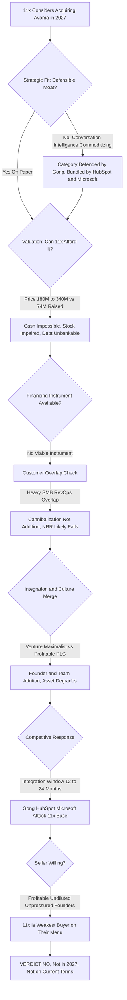

### Direct Answer

**No -- 11x should not acquire Avoma in 2027, and certainly not as a full acquisition at the price the strategic story implies.** The deal is a plausible-sounding tuck-in -- stitch "the AI that books the meeting" to "the AI that runs and analyzes the meeting" -- but it fails at least four independent underwriting tests, any one of which is fatal: Avoma realistically costs **$180M-$340M** against the roughly **$74M** 11x has ever raised, 11x has no viable instrument to finance it, conversation intelligence is a commoditizing category defended by far larger players, and the two operating cultures are textbook value-destruction opposites. The disciplined 2027 move is a commercial partnership or a narrow IP/talent acqui-hire -- not a $200M+ buy.

> **TL;DR** -- 11x is a high-burn, venture-dependent "AI SDR" company (Alice the SDR, Julian the phone agent) with a contested ARR story and a credibility wobble. Avoma is its operational opposite: a profitable, capital-efficient, product-led conversation-intelligence platform whose founders deliberately stopped raising. A full acquisition fails the valuation test ($180M-$340M vs ~$74M raised), the financing test (cash impossible, stock impaired, debt unbankable), the strategic-fit test (conversation intelligence is commoditizing under Gong, HubSpot, and Microsoft), the customer-overlap test (heavy SMB-RevOps overlap means cannibalization not addition), the integration test (venture-maximalist vs profitable-PLG culture), the competitive-response test (an integration window invites a siege), the timing test (11x should be fixing its core), and the seller-willingness test (Avoma's founders have the strongest "no" in the building). The answer flips to "yes" only if a stack of five conditions all hold -- none of which are true in 2027. The honest verdict: a firm "no, not now, and not on anything resembling current terms."

## 1. What This Question Is Actually Asking

### 1.1 An M&A underwriting exercise dressed as a one-liner

"Should 11x acquire Avoma in 2027?" is **not a yes/no trivia question** -- it is a full M&A underwriting exercise compressed into a single sentence, and answering it well means doing the work an acquirer's corp-dev team, board, and lead investor would actually do. The question silently bundles at least six separate decisions, and a real answer has to address all of them because an acquisition can be brilliant on one axis and a disaster on another.

- **A valuation decision** -- what is Avoma genuinely worth, and what would 11x actually have to pay including a control premium?
- **A strategic-fit decision** -- does conversation intelligence extend 11x's moat, or just bolt on a commodity?
- **A financing decision** -- can 11x even fund this, in cash, stock, or debt, given its own balance sheet?
- **An integration decision** -- can two opposite operating cultures survive a merger intact?
- **A competitive decision** -- what do Gong, Clari, Salesloft, HubSpot, and Microsoft do in response?
- **A timing decision** -- is 2027 the right moment given where both companies and the AI-SaaS market sit in their cycles?

### 1.2 Why all six layers must be answered together

**An acquisition that is brilliant on strategic fit can still be value-destroying on integration**, and a deal that is cheap on price can still be unfundable. The rest of this analysis walks each layer in the order a disciplined acquirer would: understand both companies as they actually are, then the category they sit in, then valuation, then the financing reality, then integration and competitive response, then the alternatives to a full buy, and finally the narrow conditions under which the answer flips. The short version is that **this is a plausible-sounding deal that does not survive contact with the numbers** -- and the value of the exercise is seeing exactly where and why it breaks.

| Decision layer | Core question | Verdict preview |
|---|---|---|
| Valuation | What does Avoma cost at 2027 multiples? | $180M-$340M -- unaffordable |
| Strategic fit | Does this extend a defensible moat? | No -- commoditizing adjacency |
| Financing | Is there a viable instrument to pay? | No -- cash, stock, debt all fail |
| Integration | Can the cultures merge intact? | No -- opposite operating models |
| Competitive | What do incumbents do in response? | They attack the integration window |
| Timing | Is 2027 the right year? | No -- 11x's core is leaking |

## 2. Who 11x Actually Is In 2027

### 2.1 The autonomous digital-worker pitch

**11x is an AI-native sales-execution company** that became one of the most-discussed -- and most-contested -- names in the 2024-2026 "AI SDR" wave. Its product is built around autonomous "digital workers": **Alice**, an AI sales development rep that prospects, researches accounts, writes and sends outbound sequences, and books meetings; and **Julian**, an AI phone agent that handles calls. The pitch is **replacement, not assistance** -- 11x positioned its digital workers as substitutes for human SDRs, priced and sold accordingly, and landed a roster of venture-backed tech logos on that promise.

### 2.2 The funding profile and the credibility wobble

**11x raised aggressively against a hypergrowth thesis.** A seed round, a Series A led by Benchmark, and a Series B led by Andreessen Horowitz totaled roughly **$74M** in disclosed funding at venture valuations that assumed the autonomous-outbound story would compound. But by 2025-2026, 11x had also become a cautionary tale. Multiple press investigations and former-customer accounts alleged that 11x had **inflated its ARR figures**, listed customers on its site who had churned or never fully deployed, and shipped a product whose autonomous output frequently needed heavy human cleanup. Reported churn was high, and the gap between "digital worker replaces your SDR" marketing and "you still need a human babysitting it" reality created real reputational damage.

### 2.3 Why the acquirer's profile is load-bearing

**The 11x that would contemplate an Avoma acquisition in 2027 is not a serene, cash-rich strategic acquirer.** It is a high-burn, venture-dependent company with a contested ARR number, a credibility problem, retention issues in its core product, and a finite runway. That profile matters enormously, because **who the acquirer is** determines what it can afford, what it should prioritize, and whether it can absorb an integration at all. An acquirer fixing a leaky core product has very different obligations than one expanding from strength -- a distinction explored further in the AI-SDR-category context of related entry (q1872) and the broader RevOps-stack question of (q1870).

| 11x attribute (2027) | Reality |
|---|---|
| Category | AI-native sales execution -- autonomous digital workers |
| Flagship products | Alice (AI SDR), Julian (AI phone agent) |
| Total funding | ~$74M across seed, Series A, Series B |
| Lead investors | Benchmark (Series A), a16z (Series B) |
| Funding posture | High-burn, venture-dependent, finite runway |
| ARR status | Publicly contested / disputed |
| Reputation | ARR-inflation disputes, elevated churn reporting |

## 3. Who Avoma Actually Is In 2027

### 3.1 The capital-efficient operational opposite

**Avoma is, in almost every respect, 11x's operational opposite** -- and understanding that contrast is the heart of this question. Avoma is an **AI meeting assistant and conversation-intelligence platform**: it records, transcribes, and summarizes sales and customer calls, extracts action items, scores and analyzes conversations, surfaces deal and coaching insights, and pushes structured notes into the CRM. Founded in 2017 and based in the Bay Area, Avoma raised a relatively modest amount -- on the order of **$15M-$18M** across seed and Series A from investors including Storm Ventures -- and then, notably, **stopped raising and grew on its own cash**.

### 3.2 A profitable, PLG, retention-driven business

**Avoma built a product-led-growth motion with transparent, low pricing** -- per-seat plans generally in the tens of dollars per month, with annual contract values often under $5,000 -- a large base of small and mid-market customers, strong gross retention, and a reputation for being calm, reliable, and capital-efficient. Where 11x is "burn venture money to replace humans," Avoma is **"be profitable, keep customers, compound quietly."** Avoma's ARR in 2027 is best estimated in the **$15M-$30M** range -- real, durable, growing at a healthy but not hypergrowth rate, and crucially **profitable or near it**.

### 3.3 Why the asset you'd buy is the asset you'd break

**That profitability and capital efficiency is exactly what makes Avoma attractive and exactly what makes it expensive relative to 11x's ability to pay.** A profitable, retention-strong SaaS asset does not sell at a distressed price, and its founders -- having deliberately avoided dilution for years -- have no pressure to sell at all. In a venture ecosystem that systematically rewards growth over discipline, a company that chose to stay small-cap, profitable, and founder-controlled is an outlier, and **outliers do not sell cheaply or under duress**. Avoma's founders proved over nearly a decade that they can run a sustainable business without the venture treadmill; that proof is itself part of what an acquirer would be paying for -- and it is also exactly the asset most likely to be destroyed by absorption into a high-burn parent. **The thing that makes Avoma worth buying is the thing the acquisition would break.**

| Metric | 11x | Avoma |
|---|---|---|
| Category | AI-native sales execution (digital workers) | Conversation intelligence / AI meeting assistant |
| Founded | ~2022 | 2017 |
| Total funding raised | ~$74M (seed, A, B) | ~$15M-$18M (seed, A) |
| Lead investors | Benchmark (A), a16z (B) | Storm Ventures and others |
| Funding posture | High-burn, venture-dependent | Stopped raising, grew on own cash |
| ARR estimate | Contested / disputed | ~$15M-$30M, real and durable |
| Profitability | Burning, finite runway | Profitable or near-profitable |
| Go-to-market | Top-down enterprise, aggressive | Product-led growth, transparent low pricing |
| Typical ACV | Higher, enterprise-oriented | Often under $5,000 |
| Reputation in 2027 | ARR-inflation disputes, churn reporting | Calm, reliable, capital-efficient |

## 4. The Strategic Thesis -- Stated Fairly

### 4.1 The full-funnel platform story

**Before tearing the deal down, it deserves its strongest case**, because the strategic story is genuinely seductive. The pitch: 11x owns the **top** of the sales motion -- finding prospects and booking meetings -- and Avoma owns the **middle and bottom** -- running, capturing, and analyzing the meetings that result. Combine them and you get a single AI-native platform spanning the full funnel: Alice books the meeting, the rep (or, in the maximalist version, another digital worker) takes it, Avoma transcribes and analyzes it, and the loop closes -- conversation insights feed back into Alice's targeting and messaging.

### 4.2 The data, commercial, and narrative arguments

**Three further arguments give the thesis weight.** There is a *data argument*: conversation intelligence generates a rich, proprietary corpus of what actually works in sales calls, and that corpus could in principle make 11x's outbound AI smarter. There is a *commercial argument*: cross-sell Avoma into 11x's logos and 11x into Avoma's larger base, raising ACVs and net revenue retention. And there is a *narrative argument*: "the end-to-end autonomous revenue platform" is a far better fundraising and category story than "the AI SDR vendor with a churn problem."

### 4.3 Why a fair hearing is necessary

**On paper, this is the kind of vertical-integration logic that corp-dev decks are built on.** The problem is not that the thesis is *stupid* -- it is that every load-bearing assumption in it (that the categories are complementary rather than commoditized, that 11x can afford it, that the cultures can merge, that the customers don't overlap, that competitors won't respond) collapses under scrutiny. A fair hearing of the thesis is necessary precisely so the rebuttal lands on the merits -- and a fuller version of the bull case is given its own section later.

## 5. The Conversation-Intelligence Category Is Crowded And Defended

### 5.1 The incumbent, the bundlers, and the free tier

**The single biggest strategic flaw in the deal is that conversation intelligence in 2027 is not an open frontier** -- it is one of the most contested categories in all of revenue technology, and buying into it does not buy a moat.

- **Gong** effectively created the category, carries a last private valuation in the **$7-8B** range against **$300M+ ARR**, owns the enterprise mindshare, and has the largest proprietary conversation dataset by far.
- **Clari** has folded conversation intelligence into its revenue-operations and forecasting platform.
- **Salesloft** -- acquired by Vista Equity Partners at roughly **$2.3B** -- bundles conversation intelligence into its engagement suite, as does **Outreach**.
- **HubSpot (NYSE: HUBS)** ships conversation intelligence natively inside a CRM that millions of SMBs already pay for.
- **Microsoft (NASDAQ: MSFT)** embeds call analysis into Copilot for Sales and Teams, meaning a huge slice of the market gets "good enough" conversation intelligence for **zero marginal dollars**.
- **Fireflies, Otter, Fathom, Read**, plus **Zoom (NASDAQ: ZM)** and its native AI Companion, have driven the commodity end of the market toward free or near-free.

### 5.2 Avoma is a mid-tier player in a defended market

**Avoma is a good product, but it is a mid-tier player in a category with a dominant incumbent above it, platform bundlers beside it, and a free tier below it.** When 11x acquires Avoma, it is not acquiring a defensible position -- it is acquiring a company that itself has to fight every quarter to justify its price against Gong's brand, HubSpot's bundle, and Otter's free plan. Vertical integration only creates a moat if the acquired layer is **itself hard to replicate**. Conversation transcription and summarization, in the age of cheap, excellent foundation models, is the opposite of hard to replicate -- it is rapidly commoditizing.

### 5.3 The "could I get this another way?" test

**There is a useful test any acquirer should apply: if I wanted this capability and could not buy this specific company, how hard and how expensive would it be to get it another way?** For a genuinely defensible asset -- a category-defining dataset, a regulatory moat, a deeply entrenched distribution channel -- the answer is "very hard, possibly impossible." For conversation transcription and call summarization in 2027, the answer is **"I could ship a competent version next quarter on off-the-shelf models, or license it from any of a dozen vendors."** When the answer is the second one, paying a control premium for a full acquisition is almost definitionally a mistake. The strategic-fit test is not "would this be nice to own" -- it is "is this hard enough to get that buying the whole company is the rational path," and conversation intelligence in 2027 fails that test badly. Whether vertical integration genuinely builds a moat in AI-native SaaS is the focus of related entry (q1873).

| Conversation-intelligence tier | Players | Threat to Avoma |
|---|---|---|
| Category-defining incumbent | Gong (~$7-8B mark, $300M+ ARR) | Out-ships, out-sells, owns enterprise |
| Platform bundlers | HubSpot, Microsoft, Clari, Salesloft, Outreach | Capability included at zero marginal cost |
| Free / freemium tier | Fireflies, Otter, Fathom, Zoom AI Companion | Drives willingness-to-pay toward zero |
| Mid-tier pure-play | Avoma (~$15M-$30M ARR) | Squeezed from above, beside, and below |

## 6. What Avoma Is Actually Worth In 2027

### 6.1 The compressed-multiple environment

**Valuation is where the deal first becomes concretely unworkable.** SaaS M&A multiples in 2027 are a different universe than the 2021 ZIRP peak: the public SaaS index spent 2022-2025 re-rating hard, and growth-adjusted, profitable B2B SaaS in the mid-market generally changes hands at **6-14x ARR**, with the high end reserved for >40% growth at real margins and the low end for slower or less efficient assets. Avoma is profitable and retention-strong but growing at a healthy-not-explosive rate, which lands it credibly in the **8-12x** band.

### 6.2 The valuation matrix

| Avoma ARR (2027 est.) | 6x (low / distressed) | 9x (base case) | 12x (strategic premium) | 14x (peak) |
|---|---|---|---|---|
| $15M | $90M | $135M | $180M | $210M |
| $20M | $120M | $180M | $240M | $280M |
| $25M | $150M | $225M | $300M | $350M |
| $30M | $180M | $270M | $360M | $420M |

### 6.3 The arithmetic that kills the deal

**The realistic acquisition price -- accounting for the control premium a profitable, no-need-to-sell company would extract -- sits in the $180M-$340M range, with a base case around $200M-$260M.** Now hold that against the acquirer: 11x raised roughly **$74M total** and was burning against a contested revenue base. Even at the very bottom of the range, **the purchase price is more than double everything 11x has ever raised**. There is no version of 11x's 2027 balance sheet that funds a $200M+ cash acquisition. That is not a pessimistic read -- it is arithmetic. And it means the deal can only happen via stock or debt, both of which are worse than they sound. The full ARR-multiple framework underpinning these ranges is developed in related entry (q1860).

## 7. The Financing Reality -- Cash, Stock, And Debt All Fail

### 7.1 Cash is off the table

**11x's total lifetime funding (~$74M) is a fraction of even the low-end purchase price**, and a high-burn company cannot drain its runway into an acquisition. Cash is not a partial option here; it is simply unavailable.

### 7.2 Stock is uniquely toxic for 11x

**Stock is the path corp-dev decks default to -- but for 11x it is uniquely toxic.** To issue stock, 11x has to **strike a value on its own equity**, and given the public ARR-inflation disputes and churn reporting, any honest mark is well below its last venture round. Issuing equity to buy Avoma forces 11x to either accept a punishing internal down-round markdown -- crystallizing a lower valuation for all existing investors and employees -- or negotiate with Avoma's founders, who are sophisticated, profitable, and unpressured, to accept 11x paper at an inflated price they have every reason to reject. Avoma's founders deliberately avoided dilution for years; they are not going to swap a profitable, independent company for stock in a higher-burn company with a credibility problem.

### 7.3 Debt is the worst path of all

**Lenders price leverage off cash flow and enterprise quality**, and a high-burn company with contested ARR is close to unbankable for a $150M+ acquisition loan. Any debt that *was* available would carry covenants and rates that accelerate 11x toward insolvency. The financing analysis alone is close to dispositive: even if the strategy were perfect, **11x lacks a viable instrument to pay for Avoma in 2027**. Acquisitions are not just strategy decks -- they are financed transactions, and this one has no clean source of funds. The full stock-vs-cash-vs-debt financing comparison is the subject of related entry (q1865).

| Financing path | Why it fails for 11x |
|---|---|
| Cash | ~$74M ever raised vs $180M-$340M price; high burn cannot drain runway |
| Stock | Forces a credibility-crystallizing down-round; impaired paper unwanted by seller |
| Debt | Unbankable for high-burn, contested-ARR profile; covenants accelerate insolvency |

## 8. Culture And Operating-Model Collision

### 8.1 Opposite philosophies, not cosmetic differences

**Suppose 11x somehow solved the financing. The integration would still be brutal**, because 11x and Avoma are run on opposite philosophies, and M&A integration failure is overwhelmingly a **people-and-culture failure**, not a product one. 11x's culture is venture-maximalist: raise big, burn big, market aggressively, sell top-down to enterprise, optimize for growth-story and headline ARR. Avoma's culture is the deliberate inverse: stay lean, stay profitable, grow PLG from the bottom up, price transparently and low, optimize for retention and capital efficiency. These are not cosmetic differences -- they drive **every operating decision**: how you hire, how you comp salespeople, how you set prices, how you treat burn, what you tell investors, what you celebrate internally.

### 8.2 The predictable post-close sequence

**Drop Avoma's team inside 11x and the predictable sequence unfolds.** Avoma's founders, who chose independence and profitability on purpose, chafe under high-burn ownership and a contested-credibility parent. Key Avoma engineers and PLG-growth people -- the ones who built the capital-efficient motion -- leave within the typical **12-24 month earnout window**. 11x, needing to "show synergy," pushes Avoma's pricing up and its motion top-down, which breaks the very retention and efficiency that made Avoma worth buying. **The asset you paid a premium for degrades because of the integration.** This is the single most common way mid-market SaaS acquisitions destroy value, and the 11x-Avoma culture gap is unusually wide.

| Operating dimension | 11x | Avoma |
|---|---|---|
| Capital philosophy | Burn venture money for growth | Profitable, self-funded |
| Go-to-market | Top-down enterprise sales | Bottom-up product-led growth |
| Pricing | Higher, enterprise-oriented | Transparent, low, sub-$5K ACV |
| Primary metric | Headline ARR / growth story | Net revenue retention / efficiency |
| Hiring profile | Aggressive AE expansion | Lean, product and growth engineers |
| Investor narrative | Hypergrowth and disruption | Durable, compounding independence |

## 9. Customer Overlap -- Addition Or Cannibalization?

### 9.1 The bases overlap heavily

**A core assumption in the bull thesis is that combining the companies adds revenue through cross-sell. The likelier reality is cannibalization**, because the customer bases overlap heavily. Both companies sell into RevOps and sales teams; Avoma's sweet spot is SMB and lower-mid-market sales orgs, and 11x's logos skew toward venture-backed tech companies with exactly that profile. A large share of Avoma's accounts are companies 11x already sells to or targets, and vice versa.

### 9.2 Overlap consolidates, it does not stack

**When customer bases overlap, a merger does not stack two revenue lines -- it consolidates them, and often shrinks the total.** The combined entity has fewer distinct logos than the sum; procurement uses the consolidation to renegotiate down; and some customers who deliberately chose **best-of-breed point solutions** react to forced bundling by churning to a competitor. There is also a conflict-of-interest problem: some of Avoma's customers compete with, or are wary of, 11x; some of 11x's customers may not want their conversation data flowing into a platform owned by their outbound-automation vendor.

### 9.3 NRR is more likely to fall than rise

**Net revenue retention -- the metric that actually drives SaaS value -- is more likely to fall post-merger than rise.** An acquisition justified by cross-sell math should be able to show that the customer bases are **complementary**, not overlapping. Here they overlap, which turns the headline "combined ARR" number into a figure that double-counts and then leaks. The deeper question of what replaces the RevOps stack as AI agents reshape these motions is examined in related entry (q1870).

## 10. The Competitive Response 11x Is Not Pricing In

### 10.1 The announcement hands incumbents a free reason to act

**M&A underwriting routinely ignores that the rest of the market gets a vote**, and here the competitive response would be swift and punishing. The moment 11x announces it is acquiring a conversation-intelligence platform, every incumbent is handed a free reason to act.

- **Gong** -- vastly larger, better-capitalized, with the dominant dataset -- can simply out-ship and out-sell a wobbly 11x-Avoma combination, and can point enterprise buyers at 11x's credibility issues as a reason to consolidate on Gong instead.
- **HubSpot (NYSE: HUBS)** and **Microsoft (NASDAQ: MSFT)** don't even have to try: their conversation intelligence is **already bundled in** at zero marginal cost, and a price-sensitive SMB base -- exactly Avoma's base -- is the most vulnerable to "you already have this in the tool you pay for."
- **Salesloft and Outreach** can bundle harder.

### 10.2 The integration window is the danger zone

**Acquisitions create an integration window of 12-24 months where the acquirer is internally focused and externally vulnerable**, and competitors are trained to attack exactly then. Every competitor can run the same play against 11x's customers: "your vendor is distracted by a hard integration, has a contested ARR story, and is burning -- come to the stable platform." 11x, already on its back foot reputationally, would be opening that window voluntarily, against a field of larger, calmer, better-funded opponents. **The deal does not just fail to build a moat -- it invites a siege.** How incumbents respond to a competitor's acquisition is the framework explored in related entry (q1866).

## 11. Timing -- Why 2027 Specifically Is Wrong

### 11.1 Three compounding timing factors

**Even a deal that is right in the abstract can be wrong now, and 2027 is a particularly bad year for 11x to attempt this.** Three timing factors compound.

- **11x's own house is not in order.** A company dealing with public ARR-inflation disputes, elevated churn, and a product-credibility gap should be spending 2027 **fixing retention and rebuilding trust** -- the least defensible moment to take on a major integration is when your core product is leaking.
- **The financing market is unforgiving.** 2027 SaaS multiples are compressed, growth-at-all-costs is out of favor, and capital flows to **efficient** companies -- which means 11x can't easily raise the clean Series C that would be a precondition for affording Avoma, and Avoma (the efficient one) has no reason to sell into a weak market.
- **The category is still being reshaped by foundation-model commoditization.** Transcription and summarization keep getting cheaper and better as a **free byproduct** of model progress, so buying a conversation-intelligence asset in 2027 risks paying a 2023-style premium for a 2028-style commodity.

### 11.2 Good acquirers buy from strength

**Good acquirers buy from strength, into durable categories, with clean financing, when their own operations are stable.** In 2027, 11x has **none** of those conditions. The timing argument alone counsels waiting -- and "wait" usually resolves into "the moment never comes." But in this case waiting is not procrastination; it is the recognition that the conditions for a defensible deal genuinely do not exist yet.

## 12. What Avoma's Founders And Investors Actually Want

### 12.1 The deliberate choice to stay independent

**A deal needs a willing seller, and this section is where the deal often quietly dies before price is even discussed.** Avoma's founders made a deliberate, multi-year choice: they raised little, avoided dilution, built a profitable company, and kept control. That is not the profile of founders desperate for an exit -- it is the profile of founders who **like owning a good, independent business** and have optionality.

### 12.2 11x is the weakest buyer on Avoma's menu

**Avoma's realistic alternatives to selling to 11x are all attractive.** They can keep compounding as a profitable independent; raise a growth round on their own terms from a position of strength; or, if they do want to sell, sell to a **strategic that can actually pay and actually help** -- a HubSpot, a Salesloft/Vista, a larger CRM or RevOps platform -- at a clean cash price. Against that menu, an offer from 11x is the **weakest option on the board**: 11x can't pay cash, its stock is hard to value and arguably impaired, its culture is alien to how Avoma is run, and its brand carries reputational baggage that would attach to Avoma post-close. Avoma's investors (Storm Ventures and others) would reach the same conclusion: a known-good independent asset beats illiquid paper in a higher-risk parent. **For the deal to happen at all, 11x would have to overpay in a currency Avoma doesn't want** -- which is another way of saying the deal doesn't happen.

| Avoma's option | Attractiveness | Why it beats an 11x sale |
|---|---|---|
| Stay independent, keep compounding | High | Profitable, founder-controlled, no dilution |
| Raise growth round on own terms | High | Negotiates from strength, picks the partner |
| Sell to a cash-rich strategic | High | Clean cash, real distribution, real help |
| Sell to 11x | Low | Impaired paper, alien culture, brand baggage |

## 13. The Diligence Red Flags A Buyer Would Find

### 13.1 Diligence into Avoma is mostly reassuring

**Real M&A involves diligence both ways.** Diligence *into Avoma* would mostly reassure -- real ARR, real retention, real profitability -- but would also surface the category risk: heavy dependence on a commoditizing capability, exposure to HubSpot and Microsoft bundling, and a mid-tier position under Gong.

### 13.2 Diligence into 11x is the bigger problem

**Diligence into 11x, which Avoma's side would run hard, would be the bigger problem.** The public disputes over inflated ARR mean Avoma's team and bankers would **distrust 11x's stated numbers by default** and discount its equity accordingly. The churn data would raise questions about whether 11x's core product even works at the level marketed. The burn rate and runway would raise solvency questions about whether 11x can survive the integration period at all. There is a real scenario where **Avoma's diligence into 11x concludes that 11x is the riskier company** -- and a profitable independent does not merge into a riskier, higher-burn, credibility-impaired acquirer. Mutual diligence here doesn't grease the deal; it **surfaces exactly the asymmetry** that makes 11x the wrong buyer. The cleaner the look each side takes, the worse the deal gets.

## 14. The Better Alternatives To A Full Acquisition

### 14.1 The alternatives ladder

**Rejecting the full acquisition does not mean 11x and Avoma have nothing to do with each other** -- there are several lighter-weight moves that capture much of the upside without the financing, integration, and competitive risk.

- **A commercial partnership / integration.** 11x and Avoma build a deep product integration -- 11x books the meeting, Avoma is the recommended conversation layer, data flows both ways -- with a referral or revenue-share arrangement. This delivers the "full-funnel" customer story with **zero acquisition cost**, no integration tax, and no culture merge; it is reversible and low-risk.
- **A narrow IP or talent acqui-hire.** If 11x specifically wants conversation-AI capability in-house, it could license Avoma's transcription/summarization technology, or acqui-hire a small team, for **single-digit millions** rather than $200M+.
- **Build, not buy.** The most capital-rational move may be for 11x to build a lightweight conversation-capture feature itself, because the underlying capability is no longer scarce.
- **Or -- the hardest truth -- do neither, and fix the core.** The highest-return use of 11x's scarce 2027 attention and capital is almost certainly **not** an adjacency at all; it is repairing its core product's reliability, bringing churn down, and rebuilding the credibility of its ARR story.

### 14.2 Every alternative dominates the full buy

**The alternatives ladder -- partner, license, build, or focus inward -- dominates the full buy on every risk-adjusted measure.** An acquisition is a distraction from the core work 11x most needs to do, and every rung of the ladder reaches most of the same destination with a vehicle 11x actually has.

| Alternative | Cost | Risk | Captures full-funnel story? |
|---|---|---|---|
| Commercial partnership | Near zero | Low, reversible | Yes -- customer narrative intact |
| IP license / acqui-hire | Single-digit millions | Moderate | Partly -- capability in-house |
| Build on foundation models | Engineering time | Low-moderate | Partly -- lightweight capture layer |
| Fix the core, do neither | Internal focus | Lowest | No, but highest risk-adjusted return |
| Full acquisition | $180M-$340M | Highest | Yes, but unfundable and value-destroying |

## 15. The Data-Flywheel Claim, Examined Closely

### 15.1 The strongest card in the bull hand

**The most intellectually serious argument for the deal is the data flywheel:** conversation intelligence generates a proprietary corpus of real sales conversations, and that corpus could make 11x's outbound AI measurably better, creating a compounding advantage no point solution can match. It deserves a careful, skeptical examination, because it is the one part of the bull case that is not obviously wrong -- it is just **probably** wrong, for three reasons.

### 15.2 Three reasons the flywheel does not spin

- **The data is a contractual minefield.** The corpus 11x would acquire is **Avoma's customers' conversation data**, and using one set of customers' private call data to train a product sold to a different (and overlapping) set of customers is a contractual and trust minefield. The moment customers realize their calls are training their vendor's prospecting AI, churn risk spikes.
- **The marginal value is shrinking.** Even if the data could be used cleanly, the marginal value of a mid-tier conversation corpus is shrinking fast. Foundation models in 2027 are already excellent at conversation understanding and even sales-coaching inference **out of the box**; the proprietary-data edge that mattered when Gong was built in the late 2010s is far thinner when a base model already does 85% of the job for free.
- **The pipe assumes a clean integration.** The flywheel assumes a clean technical and organizational pipe from Avoma's analytics into 11x's outbound models -- exactly the kind of deep integration that the culture collision and team attrition make unlikely to get built well, or at all.

### 15.3 A slide is not a flywheel

**The data-flywheel claim is not stupid -- it is the strongest card in the bull hand -- but it rests on a contractual assumption that is shaky, a value assumption that is eroding, and an execution assumption that the integration risk undermines.** A slide that says "data flywheel" is not the same as a flywheel that spins. How foundation models commoditize vertical AI features -- the dynamic eroding this corpus advantage -- is the focus of related entry (q1873).

## 16. The Opportunity Cost -- What $200M And A Year Of Focus Could Otherwise Do

### 16.1 Every acquisition is a decision not to do everything else

**Every acquisition is also a decision not to do everything else with the same money and attention**, and for a capital-constrained company that opportunity cost is the sharpest part of the analysis. Suppose, counterfactually, that 11x *could* assemble $200M+ and the organizational bandwidth to integrate Avoma. The question a disciplined board would ask is: **is acquiring a commoditizing adjacency the highest-return use of that capital and that year of executive focus?** Almost certainly not.

### 16.2 What the same resources could otherwise fund

- **A multi-year runway extension** that lets 11x fix its core product without the gun-to-the-head of a closing fundraise.
- **A serious rebuild of the digital-worker product's reliability** -- the single thing most likely to bring churn down and rebuild the credibility of the ARR story.
- **A genuine enterprise go-to-market motion**, or a real research effort to widen 11x's actual technical lead in autonomous outbound.
- **A war chest** that makes 11x the strong party in a *later* acquisition, once its house is in order.

### 16.3 Distraction kills constrained companies

**Against any of those uses, "buy a mid-tier conversation-intelligence company into a knife fight" is a poor allocation.** The opportunity-cost lens reframes the whole question: this is not merely "is the Avoma deal good or bad in isolation" -- it is "is the Avoma deal better than the best alternative use of 11x's scarcest resources," and it is not close. **Capital-constrained companies die from distraction as often as from lack of capital**, and a $200M adjacency acquisition is the most expensive distraction available.

## 17. A Brief History Lesson -- RevTech M&A That Worked And M&A That Didn't

### 17.1 The profile of deals that worked

**The 11x-Avoma question is not being asked in a vacuum; revenue-technology M&A has a track record.** The deals that *worked* share a profile: a **strong, well-capitalized** acquirer buying a **complementary** (not overlapping) capability, with a **clear integration plan** and the **balance sheet to absorb** the integration period -- large CRM and platform players methodically adding adjacent modules they could fund comfortably and sell through an existing distribution machine. Vista's take-private of Salesloft fits the "well-capitalized acquirer, deliberate thesis" mold.

### 17.2 The 11x-Avoma deal matches the failure archetype

**The deals that failed share the opposite profile:** a **stretched** acquirer buying an **overlapping** asset to **paper over its own weakness**, financing it in a way that strained the balance sheet, then watching the acquired team leave and the acquired product stagnate during a distracted integration. The 11x-Avoma deal, as contemplated in 2027, lines up **feature by feature** with the failure pattern: stretched acquirer, overlapping asset, weakness-papering motive, no clean financing, predictable team attrition. When a contemplated deal matches the failure archetype on every axis, the burden of proof is on the people who think **this time is different** -- and in this case they have not met it. How an acquirer should think about whether to acquire versus build a capability is examined in related entry (q1868).

## 18. How A Disciplined Acquirer Underwrites Any Deal Like This

### 18.1 The ten-test corp-dev checklist

**It is worth abstracting the framework, because the same checklist applies to any "should Company A buy Company B" question.** A disciplined acquirer asks, in order:

1. **Strategic fit** -- does the target extend a *defensible* capability, or bolt on a commoditizing one?
2. **Category structure** -- is the target's market an open frontier or a defended, bundled, commoditizing space?
3. **Valuation** -- what does the target realistically cost at *current* multiples, including a control premium?
4. **Financing** -- does the acquirer have a *viable instrument* to pay that price?
5. **Customer overlap** -- do the bases *stack* (complementary) or *consolidate* (overlapping)?
6. **Integration / culture** -- can the two operating models actually merge without destroying the asset?
7. **Competitive response** -- what do the bigger players do during the integration window?
8. **Timing** -- is the acquirer operating from strength, with a stable core, right now?
9. **Seller willingness** -- does the target *want* to sell, to *this* buyer, in *this* currency?
10. **Alternatives** -- does a partnership, license, build, or "do nothing" beat the full acquisition?

### 18.2 Eight of ten tests fail

**A deal should pass most of these to proceed.** The 11x-Avoma deal fails **strategic fit, category structure, financing, customer overlap, integration, competitive response, timing, and seller willingness** -- eight of ten -- and the two it arguably passes (a superficially nice narrative, a real underlying asset) are the two that matter least. **That is not a close call.**

## 19. The 11x-Avoma Scorecard

### 19.1 The verdict at a glance

**Pulling the underwriting framework into a single view makes the verdict legible at a glance.**

| Test | Verdict | Why |
|---|---|---|
| Strategic fit | Fail | Conversation intelligence is a commoditizing adjacency, not a moat extension |
| Category structure | Fail | Defended by Gong above, HubSpot/Microsoft bundling beside, Otter/Zoom free below |
| Valuation | Fail | $180M-$340M realistic price vs. ~$74M total ever raised by 11x |
| Financing | Fail | No viable instrument -- cash impossible, stock toxic/impaired, debt unbankable |
| Customer overlap | Fail | Heavy SMB-RevOps overlap means cannibalization, not addition |
| Integration / culture | Fail | Venture-maximalist vs. profitable-PLG; predictable founder and team attrition |
| Competitive response | Fail | Announcement hands Gong/HubSpot/Microsoft a free reason to attack the integration window |
| Timing (2027) | Fail | 11x's core is leaking; compressed multiples; category still commoditizing |
| Seller willingness | Fail | Profitable, undiluted, unpressured founders; 11x is the weakest buyer on their menu |
| Better alternatives exist | Yes | Partner, license, build, or fix the core -- all dominate the full buy |

### 19.2 When a framework is this lopsided

**Nine of ten tests point the same direction.** When an underwriting framework is this lopsided, the answer is not "maybe with conditions" -- it is a clear no, with the only real question being **which** lighter-weight alternative 11x pursues instead.

## 20. The Acquisition Underwriting Flow

### 20.1 The decision path visualized

**The diagram below traces the underwriting path the deal cannot survive** -- each gate is a test, and the deal fails enough of them to terminate at a clear "no."

### 20.2 Reading the flow

**The flow makes the structure of the argument explicit:** the deal does not fail at one dramatic point -- it fails progressively, gate after gate, and even generous "yes on paper" routing through the strategic-fit gate only delays the termination by one step. A deal that cannot survive its own decision tree is a deal that should not be attempted.

## 21. The Numbers Behind The Verdict

### 21.1 Valuation and financing math

| Figure | Value |
|---|---|
| Avoma ARR estimate (2027) | ~$15M-$30M |
| Avoma credible multiple band | 8-12x ARR |
| Realistic acquisition range (with control premium) | $180M-$340M |
| Base-case acquisition price | ~$200M-$260M |
| 11x total lifetime funding | ~$74M |
| Purchase price as a multiple of all 11x has raised | ~2.4x-4.6x |

### 21.2 Market and integration benchmarks

- **2027 mid-market profitable B2B SaaS multiples:** generally **6-14x ARR**, down sharply from the 2021 ZIRP peak of 20-40x+.
- **High end (14x+):** reserved for >40% growth at real margins.
- **Low end (6-8x):** slower-growth or less capital-efficient assets.
- **M&A deals that fail to create value:** commonly cited at **~50-70%**.
- **Dominant failure cause:** culture and integration, not product.
- **Key-employee / founder attrition window:** **12-24 months** (earnout period).
- **Integration window of acquirer vulnerability:** **12-24 months**.

### 21.3 The competitive landscape in numbers

| Player | Position | Approx. scale signal |
|---|---|---|
| Gong | Category-defining incumbent | ~$7-8B last private mark, $300M+ ARR |
| Salesloft | Bundled into engagement suite | Acquired by Vista at ~$2.3B |
| Clari | Bundled into RevOps/forecasting | Multi-billion private valuation |
| HubSpot | Native in Sales Hub CRM | Public, tens of billions market cap |
| Microsoft | Embedded in Copilot for Sales / Teams | Zero marginal cost to its base |
| Fireflies / Otter / Fathom / Zoom | Freemium / native assistants | Drive the commodity / free tier |
| Avoma | Mid-tier pure-play | ~$15M-$30M ARR |

## 22. The Narrow Conditions Under Which "Yes" Becomes Right

### 22.1 The five flip-conditions

**Intellectual honesty requires stating what would have to be true for the answer to flip**, because "no" is a 2027 answer, not a permanent law. The deal becomes defensible only if a **stack** of conditions all hold at once.

1. **Financing solved cleanly.** 11x raises a large, genuine Series C at a **defensible** valuation -- meaning it has already rebuilt enough credibility that its equity is worth issuing.
2. **The price is right.** Avoma's founders become genuinely motivated sellers and a deal clears at a **sub-6x, near-distressed** multiple rather than a strategic premium.
3. **11x has fixed its core.** Churn down, ARR story clean, product reliability demonstrated -- so the company acquires **from strength** with bandwidth to integrate.
4. **11x proves it can run a PLG motion.** Some evidence it won't simply break Avoma's bottom-up, retention-driven model by forcing it top-down.
5. **The strategic case sharpens.** A concrete, demonstrated data flywheel where conversation data measurably improves 11x's outbound AI, not just a slide claiming it would.

### 22.2 What the list really describes

**If all five hold, "yes" is reasonable. But notice what that list really says:** it describes a **different 11x, a different Avoma, and a different market** than the ones that exist in 2027. The conditions aren't impossible -- they are just **not currently met**, and several of them (a motivated Avoma seller at a distressed price; a fully rehabilitated 11x) are unlikely to co-occur. So the honest framing is: not a permanent no, but a firm **"no, not now, and not on anything resembling current terms."**

| Flip-condition | Met in 2027? |
|---|---|
| Clean, large Series C at a defensible valuation | No |
| Avoma price clears sub-6x (near-distressed) | No |
| 11x core fixed: churn down, ARR clean, reliability proven | No |
| 11x demonstrates a working PLG motion | No |
| Concrete, demonstrated conversation-data flywheel | No |

## 23. Stress-Testing The "No" -- What If The Skeptics Are Wrong?

### 23.1 Four counter-scenarios

**A verdict is only as good as its willingness to be wrong**, so it is worth pressure-testing the "no" against the scenarios where it would look foolish in hindsight.

- **Scenario one: 11x rapidly rehabilitates.** Suppose 11x's product genuinely improves, churn falls, the ARR disputes fade, and it raises a clean Series C. The financing objection weakens -- but this is precisely flip-conditions one and three, and it describes a **future** 11x, not the 2027 one. The "no" was always a no *for now*; this scenario is the path to a later "yes."
- **Scenario two: foundation models commoditize conversation intelligence completely.** If transcription and analysis become near-worthless as standalone products, Avoma could collapse toward a distressed multiple -- but that same commoditization **destroys the strategic rationale** for buying it. A cheaper Avoma is a less necessary one.
- **Scenario three: Avoma's founders suddenly want out.** A co-founder split or liquidity need could produce a motivated seller -- but even a motivated Avoma seller would prefer a **cash buyer that can actually pay** over 11x's impaired paper. Motivation changes the price, not the identity of the best buyer.
- **Scenario four: a competitor's move forces 11x's hand.** If Gong or HubSpot acquires an AI-SDR company, 11x might feel pressure to respond -- but **responding to a competitive threat by making a deal you cannot finance, into a category you cannot defend, is how panic compounds a problem.**

### 23.2 Why the verdict survives

**The "no" is robust across the obvious counter-scenarios** because in each one the deal either *remains* unworkable or *becomes a future "yes"* that the verdict already explicitly allows for. A conclusion that survives its own stress test is one you can act on.

## 24. Counter-Case: The Argument That 11x Should Acquire Avoma

### 24.1 The bull case, made well

**A rigorous answer has to give the strongest possible version of "yes" a fair hearing**, because the bull case is not empty -- it just loses on the weight of the evidence. Here is the deal's best argument.

- **Counter 1 -- The full-funnel platform story is real, and platforms beat point solutions.** The history of software is the history of suites eating features. A combined 11x + Avoma genuinely could tell a story no point solution can: one AI-native system that finds the prospect, books the meeting, runs and analyzes the conversation, and feeds the result back into targeting. If 11x stays a single-feature "AI SDR" vendor, it is **more** vulnerable to commoditization, not less.
- **Counter 2 -- Avoma's profitability is exactly the medicine 11x needs.** Bolting on a profitable, retention-strong, capital-efficient business **improves the combined entity's financial profile** -- it adds real, durable ARR and real gross retention to a company that badly needs both. In a market that now rewards efficiency, acquiring efficiency is a rational response.
- **Counter 3 -- The conversation data is a genuine AI moat.** Conversation intelligence is a proprietary corpus of what actually works in real sales conversations -- precisely the training and grounding data that could make 11x's outbound AI meaningfully better. In an AI-native world, **whoever owns the proprietary interaction data wins.**
- **Counter 4 -- A weak market is when you buy, not when you wait.** Compressed multiples cut both ways: Avoma is also cheaper than it would have been in 2021. The disciplined acquirers in every cycle are the ones who buy good assets when the market is fearful.
- **Counter 5 -- Cross-sell into two real customer bases is a fast NRR lever.** Even granting overlap, the non-overlapping portions of each base are immediate cross-sell territory: a near-term net-revenue-retention and ACV-expansion engine hard to build organically.
- **Counter 6 -- Acqui-hiring a proven, profitable team de-risks 11x's execution.** Avoma's team built a capital-efficient SaaS company -- a discipline 11x visibly lacks. The right post-merger move is to let Avoma's discipline **infect** 11x.

### 24.2 Why the counter-case still loses

**Each of these is true in isolation and collapses in combination with the financing reality.** The platform story, the profitability ballast, the data moat, the cross-sell, the team -- all presuppose that 11x can actually **pay** for Avoma without destroying itself, and it cannot: cash is impossible at ~$74M raised against a $180M-$340M price, stock issuance forces a credibility-crystallizing down-round, and debt is unbankable for a high-burn contested-ARR profile. The counter-case is a series of reasons the **combined company** would be nice to own -- but an acquisition is not a wish; it is a **financed transaction with a willing seller**, and this one has neither. The data-moat argument is further undercut by foundation-model commoditization. And the "buy in a weak market" argument cuts the wrong way for **this** acquirer -- weak markets reward the **strong** buyers, and in 2027 11x is the weak party. **The bull case describes a good destination and ignores that 11x has no vehicle to get there.**

## 25. Lessons This Question Teaches About SaaS M&A Generally

### 25.1 Ten transferable lessons

**Step back from 11x and Avoma specifically, and the exercise leaves a set of transferable lessons** that apply to almost any "should A acquire B" question in software.

- **A good combined-company story is not a good deal** -- the destination being attractive says nothing about whether the acquirer has a vehicle to get there.
- **Financing is not a footnote** -- "we'd pay in stock" does enormous, usually unexamined work, and for an impaired-currency acquirer it can be the whole ballgame.
- **Category structure beats product quality** -- a good product in a defended, commoditizing category is a worse acquisition than a mediocre product in an open one.
- **Customer overlap is the silent deal-killer** -- "combined ARR" is near-meaningless until you know how much of it is the same customers.
- **Culture is not soft** -- the operating-model collision between high-burn and capital-efficient companies is as concrete as any spreadsheet line.
- **The market gets a vote** -- the competitive response during the integration window is real and routinely omitted from the model.
- **Timing is acquirer-specific** -- "is now a good time" depends far more on the acquirer's own stability than on macro conditions.
- **The seller has to want it** -- a deal needs a willing counterparty in a currency they will accept.
- **Always price the alternatives** -- partner, license, build, or do nothing are real options the full acquisition must beat.
- **Opportunity cost is the final filter** -- for a constrained company, the question is never "is this deal good" but "is this the best use of our scarcest resources."

### 25.2 A clean teaching case

**Run any acquisition question through those ten lessons and the analysis writes itself.** The 11x-Avoma deal is a particularly clean teaching case precisely because it fails so many of them at once -- and the same checklist applies to sibling underwriting questions such as (q1877), (q1871), and (q1865).

## 26. The Verdict, Stated Plainly

### 26.1 Why the answer is no

**Should 11x acquire Avoma in 2027? No.** The strategic story -- own the whole funnel, from the AI that books the meeting to the AI that analyzes it -- is genuinely appealing as a narrative, and Avoma is a genuinely good company. But **a good narrative wrapped around a good asset is not a good deal.** The acquisition fails the valuation test, the financing test, the strategic-fit test, the customer-overlap test, the integration test, the competitive-response test, the timing test, and the seller-willingness test. Eight independent failures, any one of which is enough.

### 26.2 What 11x should do instead

**What 11x should do instead is the unglamorous, correct thing:** pursue a **commercial partnership** with Avoma to tell the full-funnel story at zero acquisition cost, or **build or license** a lightweight conversation layer on cheap foundation models if it truly needs the capability in-house -- and, above all, **spend 2027 fixing its core product, its retention, and the credibility of its numbers.** Acquisitions are accelerants; you pour them on a fire that is already burning clean. 11x's fire is not burning clean in 2027, and acquiring Avoma would not fix that -- it would just make the eventual reckoning larger. The honest verdict is not a permanent "never" but a firm **"no, not now, and not on anything resembling current terms."**

## 27. Sources

1. **TechCrunch -- Coverage of 11x, AI SDR funding and ARR-inflation reporting** -- Investigative and funding coverage of 11x, its Benchmark and a16z rounds, and disputes over reported ARR and churned customers. https://techcrunch.com
2. **The Information -- 11x revenue and customer-churn investigation** -- Reporting on the gap between 11x's marketed ARR and its actual retained revenue. https://www.theinformation.com
3. **Crunchbase -- 11x funding history and investor profile** -- Disclosed seed, Series A (Benchmark), and Series B (a16z) round data, ~$74M total. https://www.crunchbase.com/organization/11x-ai
4. **Crunchbase -- Avoma funding history** -- Avoma's seed and Series A rounds, Storm Ventures involvement, ~$15M-$18M total raised. https://www.crunchbase.com/organization/avoma
5. **Andreessen Horowitz (a16z) -- Investment thesis on AI-native sales and agentic software** -- a16z commentary on the AI SDR / digital-worker category and its risks. https://a16z.com
6. **Benchmark -- Portfolio and AI sales-tech positioning** -- Benchmark's role as 11x Series A lead. https://www.benchmark.com
7. **Avoma -- Official product, pricing, and positioning pages** -- Conversation intelligence, AI meeting assistant, transparent per-seat pricing. https://www.avoma.com
8. **11x -- Official product pages for Alice and Julian digital workers** -- 11x's autonomous SDR and phone-agent positioning. https://www.11x.ai
9. **Gong -- Company, valuation, and conversation-intelligence category leadership** -- Gong's ~$7-8B last private mark and category-defining position. https://www.gong.io
10. **Clari -- Revenue platform and conversation-intelligence bundling** -- Clari's RevOps and forecasting platform including conversation analysis. https://www.clari.com
11. **Vista Equity Partners -- Salesloft acquisition (~$2.3B)** -- Vista's take-private of Salesloft and engagement-suite bundling. https://www.vistaequitypartners.com
12. **Salesloft -- Conversation intelligence within the engagement platform** -- Salesloft's bundled conversation-intelligence capability. https://www.salesloft.com
13. **HubSpot -- Native conversation intelligence in Sales Hub** -- HubSpot's bundled call analysis inside its CRM. https://www.hubspot.com
14. **Microsoft -- Copilot for Sales and Teams call analysis** -- Microsoft's embedded conversation intelligence at zero marginal cost. https://www.microsoft.com
15. **Fireflies.ai -- AI meeting assistant, freemium tier** -- Pure-play assistant driving the commodity end of the market. https://fireflies.ai
16. **Otter.ai -- Transcription and meeting notes, free tier** -- Free/near-free transcription pressuring the category floor. https://otter.ai
17. **Zoom -- AI Companion native meeting summarization** -- Zoom's bundled AI summaries reducing willingness-to-pay for standalone tools. https://www.zoom.com
18. **Bessemer Venture Partners -- State of the Cloud / SaaS multiples reports** -- Public and private SaaS revenue-multiple benchmarks for 2026-2027. https://www.bvp.com
19. **Meritech Capital -- Public SaaS comparables and ARR-multiple analysis** -- Growth-adjusted SaaS trading multiples used to frame valuation ranges. https://www.meritechcapital.com
20. **SaaS Capital -- Private SaaS valuation and revenue-multiple research** -- Mid-market private SaaS valuation benchmarks. https://www.saas-capital.com
21. **PitchBook -- SaaS M&A deal multiples and volume data** -- Transaction-level multiple data for B2B SaaS acquisitions. https://pitchbook.com
22. **Harvard Business Review -- Why most M&A deals fail / the integration tax** -- Foundational research on culture and integration as the dominant cause of M&A failure. https://hbr.org
23. **McKinsey & Company -- M&A integration and synergy-capture research** -- Analysis of synergy timelines and integration-window vulnerability. https://www.mckinsey.com
24. **Bain & Company -- M&A practice: when acquisitions create vs destroy value** -- Frameworks on acquirer strength, category structure, and deal discipline. https://www.bain.com
25. **CB Insights -- Conversation intelligence and revenue-tech market maps** -- Competitive landscape mapping for the conversation-intelligence category. https://www.cbinsights.com
26. **Storm Ventures -- Avoma investor profile and B2B SaaS thesis** -- Avoma's lead early investor and its capital-efficiency orientation. https://www.stormventures.com
27. **SEC / public filings of comparable RevOps SaaS companies** -- Public-comp revenue, growth, and margin data underpinning the multiple ranges. https://www.sec.gov
28. **Forrester -- Conversation intelligence and revenue-operations technology Wave** -- Analyst evaluation of conversation-intelligence vendors and bundling trends. https://www.forrester.com
29. **Gartner -- Revenue technology and sales-engagement Magic Quadrant coverage** -- Analyst positioning of conversation-intelligence and sales-execution vendors. https://www.gartner.com
30. **Battery Ventures -- Software M&A and take-private market commentary** -- Context on the 2026-2027 SaaS financing and M&A environment. https://www.battery.com
31. **First Round Review -- Post-acquisition founder retention and earnout dynamics** -- Practitioner analysis of why acquired founders and teams leave within the earnout window. https://review.firstround.com
32. **a16z -- The commoditization of AI features built on foundation models** -- Why capabilities like transcription and summarization erode as standalone moats. https://a16z.com
33. **OpenView Partners -- Product-led growth benchmarks and PLG operating models** -- Reference for Avoma's PLG motion and the metrics it optimizes. https://openviewpartners.com

## 28. Related Pulse Library Entries

- **(q1877)** -- Should Snowflake acquire Apollo in 2027? A sibling acquisition-underwriting question that applies the same ten-test corp-dev framework to a different acquirer-target pair.
- **(q1866)** -- Should Gong acquire Chorus to consolidate conversation intelligence? A conversation-intelligence M&A question directly adjacent to this deal's category analysis.
- **(q1868)** -- Should Clari acquire Drift in 2027? A sibling acquisition question testing strategic fit and financing for a RevOps platform buyer.
- **(q1865)** -- Should Salesloft acquire a video tool in 2027? Another sibling underwriting case on whether to buy an adjacent capability or build it.
- **(q1871)** -- Should ZoomInfo acquire Apollo in 2027? A sibling acquisition question on overlap, cannibalization, and seller willingness.
- **(q1872)** -- Workato vs 11x: which should you buy? Directly relevant context on 11x's core product, positioning, and credibility in 2027.
- **(q1860)** -- Is Salesloft Pipeline AI worth buying vs Clari? A RevOps buying-decision entry that exercises the same valuation and category-structure lenses.
- **(q1870)** -- What replaces the RevOps stack if AI agents replace SDRs natively? Context for the customer-overlap and 11x-category sections of this analysis.
- **(q1873)** -- What replaces cold outbound if AI agents handle outbound? Background on the autonomous-outbound thesis underpinning 11x's flagship products.
