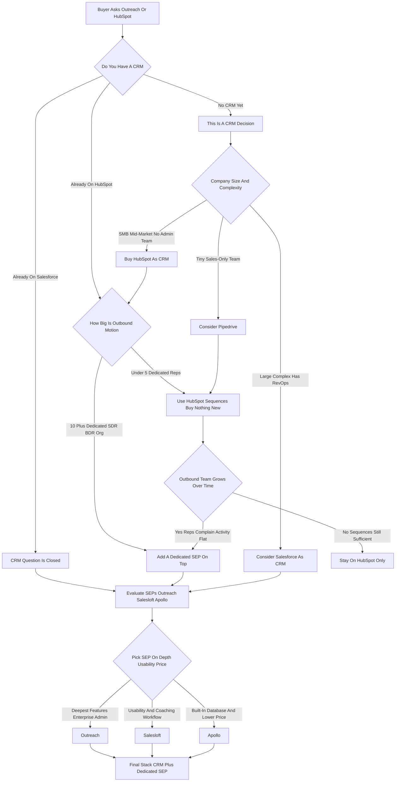

### Direct Answer

**Outreach and HubSpot are not real competitors -- they are two different layers of the revenue stack, and the right purchase depends entirely on the job you are hiring software to do.** HubSpot (NYSE: HUBS) is a CRM suite -- your system of record for contacts, companies, and deals, plus marketing, sales, and service modules. Outreach is a sales engagement platform (SEP) -- an execution layer that sits *on top of* a CRM and makes outbound reps run more, better-sequenced activity. For most companies asking this question, the honest answer is **buy HubSpot as your CRM now, and add a dedicated SEP like Outreach later -- only when your outbound team has visibly outgrown HubSpot's built-in Sequences.** They are sequential purchases far more often than they are an either/or.

> **TL;DR**
> - **They are different categories.** HubSpot = CRM suite (system of record). Outreach = sales engagement platform (execution layer on top of a CRM). One does not replace the other.
> - **The real question splits in two.** No CRM yet? You are choosing a CRM -- HubSpot vs Salesforce vs Pipedrive. Already have a CRM and a real outbound team? You are choosing an SEP -- Outreach vs Salesloft vs Apollo.
> - **The overlap is thin.** Both run multi-step email-and-task cadences. Outreach goes far deeper on dialer, conversation intelligence, A/B testing, and queue management; HubSpot owns the database, marketing, and service.
> - **2026 economics.** HubSpot Sales Hub Pro runs roughly $90-$100/seat/mo plus a ~$1,500 onboarding fee; a real SMB Marketing+Sales deployment lands at $1,500-$6,000+/mo. Outreach is opaque, annual-only, roughly $100-$165/user/mo -- a 20-rep team is frequently a $35K-$55K+/year commitment.
> - **The expensive mistake** is buying Outreach as a CRM (it is not one) or expecting HubSpot Sequences to carry a 20-person SDR org (it will not -- adoption quietly collapses).
> - **The decision rule:** name the job, inventory what you own, size the outbound motion, price the full stack. Buy the CRM first; add the SEP when the motion proves it out.

---

## 1. Why "Outreach vs HubSpot" Is The Wrong Question

The single most important thing to understand before spending a dollar is that Outreach and HubSpot are not the same kind of product. Framing the decision as a head-to-head is how buyers waste a quarter and a budget.

### 1.1 Two Different Layers Of The Stack

**HubSpot is a customer relationship management (CRM) suite** -- the database of record that stores every contact, company, deal, ticket, and email, and the platform other tools plug into. **Outreach is a sales engagement platform (SEP)** -- a layer that sits on top of a CRM and orchestrates what reps do all day: sequences of emails and calls, task lists, the dialer, conversation recording, and deal and forecast views. You do not replace one with the other.

- **A company that "buys Outreach instead of a CRM"** still has no system of record. Outreach reads from and writes to a CRM; it does not become one.
- **A company that expects HubSpot Sequences to run a 20-person outbound team** the way Outreach does will watch adoption collapse within a quarter.
- **The architecture is fixed:** HubSpot is the foundation, Outreach is the execution layer. Most companies eventually own both.

### 1.2 The Real Decision Splits In Two

The genuine question hiding under "Outreach vs HubSpot" is one of two questions, never the literal one:

- **If the need is "we need a place to keep customers and run our funnel,"** the real comparison set is HubSpot vs Salesforce vs Pipedrive vs Zoho vs Microsoft Dynamics. That is a **CRM decision**.
- **If the need is "our reps must execute more, better-sequenced outbound,"** the real comparison set is Outreach vs Salesloft vs Apollo vs HubSpot's native Sequences. That is an **SEP decision**.

### 1.3 Why The Two Get Conflated

The confusion is manufactured by both vendors, on purpose:

- **HubSpot deliberately built sequencing into Sales Hub** to capture the lighter end of the SEP market -- so HubSpot *looks* like it competes with Outreach.
- **Outreach has steadily added CRM-adjacent features** -- deal management, forecasting (Outreach Commit) -- so Outreach *looks* like it might be a system of record.
- **Neither blurring changes the core truth.** HubSpot is the foundation; Outreach is the execution layer.

| Lens | HubSpot | Outreach |
|---|---|---|
| Category | CRM suite | Sales engagement platform |
| System of record? | Yes -- it *is* the CRM | No -- sits on top of a CRM |
| Founded / HQ | 2006, Cambridge MA | 2014, Seattle WA |
| Core job | Store and run the whole funnel | Make reps execute more outbound |
| Primary buyer | SMB / mid-market, often no admin team | VP Sales / RevOps with an outbound team |
| What you compare it against | Salesforce, Pipedrive, Zoho, Dynamics | Salesloft, Apollo, Groove |

### 1.4 The Test That Settles It In One Question

When a buyer is genuinely stuck, there is a single diagnostic question that resolves the confusion faster than any feature comparison: **"If this tool disappeared tomorrow, what would we lose?"** If the answer is "the record of who our customers are, what deals are open, and what every team did with them" -- you are describing a CRM, and HubSpot (NYSE: HUBS) is the relevant product. If the answer is "the engine that makes our outbound reps run consistent, sequenced, well-coached activity every day" -- you are describing a sales engagement platform, and Outreach is the relevant product. The two answers are not in tension; a mature company would lose *both* things, because it owns both layers. The reason the literal "Outreach vs HubSpot" question feels unanswerable is that it forces a choice between two items that are not on the same shelf. A buyer who internalizes that the CRM is the floor and the SEP is a piece of furniture you place on that floor stops asking "which one" and starts asking "which floor, and when do I add the furniture" -- which are both answerable questions with clear criteria. Everything that follows in this analysis is an elaboration of those two questions.

---

## 2. What Each Product Actually Is

You cannot make this decision well without a precise picture of each category. The two products solve genuinely different problems.

### 2.1 Outreach: The Sales Engagement Platform

Outreach, founded in 2014 and headquartered in Seattle, is the company most associated with creating and defining the sales engagement category. The core product solves a specific problem: outbound reps are inconsistent, they forget follow-ups, they freelance their messaging, and managers cannot see or coach the activity.

- **Sequences** -- multi-step, multi-channel cadences that tell a rep "today, send these 12 emails, make these 8 calls, send these LinkedIn messages" and track every open, reply, and meeting booked.
- **Native dialer** -- local presence, call recording, and a power-dialing experience built for reps who dial all day.
- **Unified task and inbox** -- reps work one prioritized list instead of bouncing between tools.
- **Kaia conversation intelligence** -- records, transcribes, and analyzes sales calls for coaching and deal-risk signals.
- **Deal management and forecasting** -- pipeline boards, deal health scoring, and a forecast roll-up, positioning Outreach as a broader "sales execution platform."

**Critically, Outreach is not your CRM.** It bi-directionally syncs with Salesforce or HubSpot (NYSE: HUBS), reading and writing contacts, leads, opportunities, and activities -- but the system of record lives elsewhere. Its value is proportional to how much structured outbound activity your team does.

The buyer Outreach is built for is specific. It is a VP of Sales or a RevOps leader at a company with a real, measured outbound motion -- SDR and BDR teams, account executives who self-source pipeline -- typically in B2B SaaS or another considered-purchase industry where deals require multiple touches over weeks. Outreach is bought for **four things in particular**: rep productivity (more activity per rep per day), messaging consistency (every rep sends the proven sequence, not a freelanced version), manager visibility (a dashboard that shows who did what and where deals are stalling), and coaching at scale (conversation intelligence that surfaces the moments worth reviewing instead of forcing a manager to listen to every call). A team that mostly works inbound leads and referrals will not get its money's worth -- there is simply not enough structured outbound activity for the engine to optimize. A team running thousands of cold touches a month will find the value obvious within a quarter. The honest framing of Outreach's value is that it is **leverage on an outbound motion you already have** -- it does not create the motion, it amplifies it.

### 2.2 HubSpot: The CRM Suite

HubSpot (NYSE: HUBS), founded in 2006 and headquartered in Cambridge, Massachusetts, is a CRM suite -- a single platform with a free CRM core and a set of paid "Hubs" that extend it. Understanding the suite structure is essential because it determines both what you get and what you pay.

- **Free CRM** -- stores contacts, companies, deals, and tasks; genuinely usable.
- **Marketing Hub** -- email marketing, landing pages, forms, ad management, marketing automation.
- **Sales Hub** -- deal pipelines, meeting scheduling, quotes, and -- relevant here -- **Sequences**, HubSpot's native sales-engagement feature.
- **Service Hub** -- ticketing, help desk, customer feedback.
- **Content Hub** (formerly CMS Hub) -- websites and blogs.
- **Operations Hub** -- data sync, cleansing, programmable automation.

The strategic idea is **one vendor, one contact database, one reporting layer** across marketing, sales, and service -- genuinely valuable for SMB and mid-market companies that would otherwise stitch together four tools and three integrations.

HubSpot's buyer is typically an SMB or mid-market company, often without a dedicated RevOps function or Salesforce admin, that wants a platform it can run itself. The appeal is not any single feature -- it is **the elimination of integration tax**. A company that would otherwise buy a standalone CRM, a standalone email marketing tool, a standalone ticketing system, and pay an integrator to wire them together can instead buy HubSpot and have one contact record that marketing, sales, and service all read and write. That unified record is the reason HubSpot's reporting is genuinely cleaner than a stitched-together stack: an attribution report or a funnel-conversion report draws on one data model, not three systems that disagree about which "Acme Corp" is the real one. HubSpot's Sales Hub Sequences feature is real and useful -- multi-step email and task cadences, enrollment triggers, basic A/B testing -- but it is one feature inside a broad suite, not a category-defining outbound engine, and a buyer should never evaluate HubSpot *as if Sequences were its headline product*. The honest read: HubSpot is the right comparison against Salesforce and Pipedrive on the question "what is our CRM," and HubSpot Sequences is the right comparison against Outreach and Salesloft only at the lighter end of the sales-engagement question.

### 2.3 The Feature Overlap That Causes The Confusion

Both products can enroll a contact in a multi-step sequence, send templated emails and track opens, build a rep's daily task list, log activity, and do basic A/B testing. That thin band of overlap -- "multi-step email-and-task cadences" -- is the entire reason buyers put them on the same shortlist.

| Capability | HubSpot Sequences | Outreach |
|---|---|---|
| Multi-step email + task cadences | Yes | Yes |
| Open / reply / meeting tracking | Yes | Yes |
| A/B testing of steps | Basic | Team-level, granular |
| Native dialer + local presence | Basic calling | Deep native dialer |
| Conversation intelligence | Lighter / add-on dependent | Kaia, built-in |
| Conditional branching / channels | Limited | Multi-channel, conditional |
| Round-robin task queues | No | Yes |
| Send throttling / deliverability controls | Limited | Granular |
| Built for | Reps who sequence as part of a broader job | SDR/BDR teams who sequence all day |

The buying error is treating that thin overlap as if the two products were substitutes across the board. They are not. The overlap ends quickly and decisively: Outreach's dialer, local presence, and call recording are far deeper than HubSpot's calling; Outreach's sequence logic supports more channels, more conditional branching, and more sophisticated send-time and throttling controls; Outreach's conversation intelligence is a real product where HubSpot's is more basic and tends to require add-ons or partners for serious coaching; and Outreach's task management is built for SDR teams that do nothing but sequence work all day, with round-robin assignment and queue management that HubSpot Sequences simply does not have. Going the other direction, HubSpot does everything Outreach does not -- it is the CRM, it runs marketing, it runs service, it owns the website. So the overlap is a thin band inside two products that are otherwise built for entirely different jobs.

### 2.4 Why The Overlap Matters For Small Teams Specifically

The thin overlap is not academic -- for a small team it can be decisive. If HubSpot Sequences genuinely covers a small team's outbound needs, buying Outreach on top is **paying twice for the same band of capability** while leaving most of Outreach's depth unused. The decisive question for a small team is therefore not "is Outreach better than HubSpot Sequences" -- Outreach is obviously deeper -- but "does my team need the depth Outreach adds, or does it only need the band that overlaps." A two-rep team sending fifty emails a day with light follow-up needs the overlap band and nothing more; the dialer depth, the round-robin queues, and the granular A/B testing are capability they will never touch. For that team, HubSpot Sequences is not a compromise -- it is the correct, complete answer, and Outreach would be waste. The error is letting a vendor demo of Outreach's depth convince a small team that depth it will not use is depth it needs.

---

## 3. The Five Decision Paths

There is no single answer to "Outreach or HubSpot" because the answer depends on your current state. Find your situation among these five paths.

### 3.1 Path One -- You Do Not Yet Have A CRM

If you run the business out of spreadsheets, a shared inbox, or a CRM nobody uses, **Outreach is not on your shortlist at all** -- it requires a CRM underneath it. Your decision is a CRM decision: HubSpot vs Salesforce vs Pipedrive vs Zoho vs Microsoft Dynamics.

- **HubSpot is the strong default** for SMB-to-mid-market B2B without a dedicated Salesforce admin: a usable free tier, lighter onboarding, unified marketing and sales, and self-service administration.
- **Salesforce wins as you scale into complexity** -- heavy customization, many integrations, a dedicated RevOps team, complex territory and quoting, an enterprise sales motion.
- **Pipedrive wins for a small sales-only team** that wants a simple, cheap, fast pipeline and does not need marketing.

Net: if you have no CRM, buy a CRM -- and "Outreach vs HubSpot" collapses into "HubSpot vs Salesforce." You add an SEP later, if and when the outbound motion justifies it. The single most important discipline on this path is to resist the gravitational pull of a vendor who learns you have an outbound team and starts demoing sequencing -- you cannot evaluate sequencing depth before you have a database for the sequences to read from. Buy the foundation first; the execution layer is a later, separate purchase with its own criteria.

### 3.2 Path Two -- You Already Run Salesforce

If Salesforce is already your system of record, the decision is almost never "should we switch to HubSpot." Ripping out Salesforce is a massive, multi-quarter project that disrupts every team -- you would never do it just to get sequencing.

- **"Outreach vs HubSpot" really means "which SEP on top of Salesforce."**
- **The practical finalists are Outreach vs Salesloft vs Apollo** -- the SEP bake-off.
- **HubSpot is the wrong tool here** -- bolting a CRM suite onto an existing CRM means paying for marketing and service modules you will not use and running two systems that both think they are the source of truth.

The clean answer for a Salesforce shop: keep Salesforce, evaluate Outreach vs Salesloft vs Apollo, leave HubSpot out of it. The only scenario where a Salesforce shop should genuinely reconsider its CRM is covered in the Counter-Case section -- a Salesforce instance so burdened with technical debt that it is effectively failing as a system of record. That is a CRM-replacement decision driven by the CRM's own collapse, and it has nothing to do with sequencing. For a Salesforce shop whose CRM works, the question "Outreach or HubSpot" should be mentally rewritten the moment it is asked: it is "Outreach or Salesloft or Apollo, on top of the Salesforce we are keeping."

### 3.3 Path Three -- You Already Run HubSpot

If HubSpot (NYSE: HUBS) is already your CRM, the question becomes genuinely interesting -- now you have a real choice:

- **Option A: use HubSpot Sales Hub Sequences** -- the capability you may already be paying for -- and buy nothing new.
- **Option B: add Outreach (or Salesloft or Apollo)** on top of HubSpot for a more powerful outbound engine.

The deciding variable is **the size and intensity of your outbound motion.** A handful of reps doing outbound as part of a broader job: Sequences is very likely enough. A dedicated SDR/BDR org of ten or twenty: Sequences will feel thin, and a dedicated SEP earns its keep. The rule: **start with Sequences, add an SEP only when the outbound team visibly outgrows it.**

The outgrowing moment is not a guess -- it is observable. It shows up as a cluster of concrete signals: reps complaining that the dialer is slow or that they cannot manage call volume; outbound activity metrics going flat even as headcount grows; managers saying they cannot coach because they have no visibility into call quality; and RevOps wanting round-robin queues, throttling, and deliverability controls that Sequences does not provide. When three or four of those signals appear together, the HubSpot shop has its evidence and should run the SEP evaluation. When they do not appear, adding Outreach is premature -- the team would use a fraction of it, the integration adds a sync to maintain, and the annual cost buys capability nobody is asking for. The HubSpot shop's advantage on this path is precisely that it can wait for proof: it is already running Sequences at no incremental cost, so it loses nothing by deferring the SEP decision until the signals are unambiguous.

### 3.4 Path Four -- Small Team, Light Outbound

A large share of companies asking this question are small -- under twenty employees, two-to-five salespeople, a mix of inbound, referrals, and some prospecting. For this profile the answer is usually clear and it is usually **not Outreach.**

- **Outreach is built, priced, and sold for structured outbound at scale** -- annual contracts, an implementation process, a per-seat-plus-platform fee.
- **A five-person team doing light outbound will not use enough of Outreach** to justify the annual lock-in.
- **The right move is HubSpot** -- as the CRM, with Sales Hub Starter or Professional, using native Sequences for whatever outbound the team does.

This profile also usually has a marketing need a small company cannot ignore -- landing pages, forms, nurture email -- and HubSpot's suite covers that in the same platform, which a standalone SEP never would. If even Sales Hub Professional feels like too much, HubSpot's free CRM plus Sales Hub Starter, or Pipedrive plus a cheap sequencing tool, is a reasonable floor. The discipline for this profile is simple and worth stating bluntly: a small team with light outbound should buy the CRM, use its built-in sequencing, and not buy a dedicated enterprise SEP it will not grow into for years -- if ever. The annual lock-in of an enterprise SEP is an especially poor fit for a company still figuring out its sales motion, because the company may discover in six months that its motion is more inbound than it expected, and it will be paying for outbound infrastructure it no longer believes in.

### 3.5 Path Five -- Dedicated Outbound Org At Scale

At the other end is the company built around outbound: a dedicated SDR/BDR org, AEs who self-source pipeline, ten to a hundred-plus people measured in activity and sourced pipeline. For this profile a true SEP is core infrastructure, not a luxury.

- **HubSpot Sequences alone will not carry it** -- the team needs a deep dialer, conversation intelligence for coaching at scale, granular sequence analytics, round-robin queues, throttling, and manager dashboards.
- **The comparison is Outreach vs Salesloft vs Apollo** -- a real SEP bake-off -- layered on whatever CRM the company runs.
- **HubSpot's role here is as the possible CRM underneath, not as the SEP.**

Within the SEP bake-off itself, the three finalists tend to win on different dimensions. **Outreach** tends to win when the buyer wants the deepest feature set, enterprise-grade administration, and the forecasting and deal-management ambitions of a broader sales-execution platform. **Salesloft** tends to win when the buyer prioritizes usability and coaching workflow -- it is widely regarded as the more approachable of the two category leaders. **Apollo** tends to win when the buyer wants the built-in prospecting database and a materially lower price, which is why it is so popular with startups and cost-sensitive SMBs. For a scaled outbound org the point is not which of the three is "best" in the abstract -- it is that the company should absolutely buy *one of them*, layered on its CRM, because built-in HubSpot Sequences will visibly fail to carry a measured outbound function. The honest version of "Outreach vs HubSpot" for this profile is "Outreach the SEP on top of HubSpot or Salesforce the CRM" -- both, in sequence, not one instead of the other.

| Dedicated outbound reps | Recommended tooling |
|---|---|
| 0-2 (light outbound, mostly inbound) | HubSpot CRM + native Sequences |
| 3-5 (some structured outbound) | HubSpot Sequences usually still enough |
| 6-10 (outbound becoming a function) | Evaluate a dedicated SEP |
| 10+ (dedicated SDR/BDR org) | Dedicated SEP (Outreach / Salesloft / Apollo) justified |

For a structured way to translate company stage into a tooling roadmap, see the realistic sales tech stack discussion (q107) and the inbound-to-outbound transition guide (q165).

---

## 4. The Real Cost Of Each Decision

The published per-seat price is a fraction of the real cost in both directions. Pricing the sticker instead of the stack is the most common budgeting error.

### 4.1 The Real Cost Of HubSpot

HubSpot (NYSE: HUBS) prices per Hub and per tier -- Starter, Professional, Enterprise -- and the per-seat sticker is only the start.

- **Per-seat sticker** -- roughly $90-$100/seat/mo for Sales Hub Professional in 2026.
- **Mandatory onboarding fee** -- Professional and Enterprise tiers carry a one-time fee (around $1,500 for Sales Hub Professional, far more for Enterprise and Marketing Hub) that buyers routinely forget to budget.
- **Marketing contacts** -- Marketing Hub pricing scales with the number of contacts you market to, so a growing list quietly inflates the bill.
- **Bundle creep** -- most companies buy Marketing plus Sales, often add Service; a real SMB deployment of Marketing Hub Pro plus Sales Hub Pro commonly lands at $1,500-$6,000+/month all-in.
- **The Pro-to-Enterprise jump** is steep, and features buyers assume are included (advanced permissions, custom objects, deeper reporting) live only in Enterprise.
- **Marketplace integrations and third-party apps** add up -- a real deployment usually pulls in two or three paid connectors.

The honest budgeting approach for HubSpot: take the per-seat price, multiply by realistic seat count, add the onboarding fee, add the contact-tier cost for Marketing Hub, add a buffer for the Hubs you will inevitably add, and add integration costs. The all-in number is typically two to four times the naive per-seat math, and a buyer who presents only the per-seat sticker to a finance team is setting up a credibility problem when the real invoices arrive.

### 4.2 The Real Cost Of Outreach

Outreach's pricing demands its own scrutiny because the vendor does not publish it and the structure is built around annual commitment.

- **No public pricing** -- you go through a sales process, get a custom quote, and the number depends on seat count, modules, and negotiation.
- **Widely reported range** -- roughly $100-$165/user/mo billed annually, typically with a platform or implementation fee on top.
- **Annual contracts only** -- you commit for a year (often multi-year for better pricing) before you know how adoption will go.
- **Add-ons priced separately** -- conversation intelligence (Kaia) and deal management are not always in the base.

The implications for the buyer are concrete. First, **you must negotiate** -- opaque annual pricing is, by definition, negotiable pricing, and seat count, term length, and timing all move the number; the end of Outreach's own fiscal quarter is the buyer's leverage window. Second, **you must be confident in adoption before signing**, because you are locked in for the year regardless of how the rollout goes. Third, **you must price the add-ons explicitly** -- a quote that looks reasonable on the base engagement product can climb sharply once conversation intelligence and deal management are added, and the vendor will present both as near-essential. Fourth, **you should benchmark the all-in annual number against Salesloft and Apollo, not just against HubSpot Sequences** -- competing quotes are the single most effective lever against an opaque-pricing vendor. Outreach is not expensive for what it is -- a scaled outbound team gets real value -- but it is a serious annual commitment, not a casual subscription, and it should be evaluated with the rigor that a five-figure yearly contract deserves.

| Item | HubSpot | Outreach |
|---|---|---|
| Per-seat sticker | ~$90-$100 / seat / mo (Sales Hub Pro) | ~$100-$165 / user / mo, billed annually |
| Pricing published? | Yes, on website | No -- custom quote via sales |
| Contract term | Monthly or annual options | Annual (often multi-year) |
| Mandatory onboarding / platform fee | ~$1,500 one-time (Sales Hub Pro) | Platform / implementation fee on top |
| Free tier | Yes -- free CRM core | No |
| Real all-in (typical) | $1,500-$6,000+/mo SMB Marketing+Sales | $35K-$55K+/yr for a 20-rep team |

### 4.3 The Cost Math, Worked Two Ways

**A 20-person outbound team on Outreach:**

- 20 seats x ~$130/user/mo = ~$31,200/year in seats alone.
- Plus the platform/implementation fee.
- Plus conversation intelligence (Kaia) if taken.
- **Typical landed cost: ~$35,000-$55,000+/year, committed annually.** A 50-rep org scales proportionally into six figures.

**A HubSpot SMB deployment:**

- Sales Hub Professional: ~$90-$100/seat/mo.
- One-time onboarding: ~$1,500.
- Marketing Hub Professional: scales with the marketing-contact tier.
- **Typical landed all-in (Marketing + Sales): ~$1,500-$6,000+/month.** Naive per-seat math is typically 2-4x lower than the real number.

The honest budgeting rule for either vendor: take the per-seat price, multiply by realistic seat count, add onboarding, add contact-tier or add-on cost, add a buffer for what you will inevitably add, and add integration costs. For the full method, see the multi-vendor RFP discipline (q1148).

### 4.4 Comparing Costs You Cannot Directly Compare

A subtle trap in this decision is that HubSpot's cost and Outreach's cost are not the same *kind* of number, and a buyer who lines them up side by side is comparing apples to a different fruit entirely. HubSpot's cost is the cost of a **system of record plus marketing and service capability** -- you are paying for the database, the email tool, the ticketing system, and the reporting layer all at once. Outreach's cost is the cost of an **execution layer for outbound reps** -- you are paying to make a specific team more productive, and nothing else. A company that buys HubSpot is not buying "the cheaper option" relative to Outreach; it is buying a different and broader thing. The correct comparison is never "HubSpot's monthly bill vs Outreach's monthly bill." It is two separate comparisons run in parallel: HubSpot against Salesforce and Pipedrive on the CRM line item, and Outreach against Salesloft and Apollo on the SEP line item. The total-stack number for a mature company is **CRM cost plus SEP cost**, because the mature company pays both. Framing the budget as an either/or produces a decision that looks cheaper on a spreadsheet and is wrong on the ground -- because the team still needs the layer the spreadsheet pretended away.

| Cost line item | What you are paying for | Compare against |
|---|---|---|
| HubSpot CRM suite | System of record + marketing + sales + service | Salesforce, Pipedrive, Zoho, Dynamics |
| Outreach SEP | Outbound execution + dialer + conversation intelligence | Salesloft, Apollo, Groove |
| Combined mature stack | Both layers, because a scaled company owns both | Not an either/or -- it is additive |

---

## 5. The Competitive Field And How The Tools Connect

A real evaluation does not stop at two names. A buyer should know the full field for each category and understand how a CRM and an SEP actually integrate.

### 5.1 The CRM Field

HubSpot (NYSE: HUBS) competes against:

- **Salesforce (NYSE: CRM)** -- the enterprise default, more powerful and more complex.
- **Pipedrive** -- simple, cheap, sales-only.
- **Zoho CRM** -- broad and inexpensive, popular with cost-sensitive SMBs.
- **Microsoft (NASDAQ: MSFT) Dynamics 365** -- strong in Microsoft-centric enterprises.
- **Freshsales** -- a lighter mid-market option.

### 5.2 The SEP Field

Outreach competes against:

- **Salesloft** -- its closest peer and chief rival, owned by Vista Equity Partners and combined with Drift.
- **Apollo.io** -- an SEP bundled with a large B2B contact database, aggressive on price, popular with startups and SMBs.
- **Groove** -- acquired by Clari, strong with Salesforce-native teams.
- **HubSpot Sales Hub Sequences** -- the light-end competitor discussed throughout.

The adjacent layer the buyer will encounter: conversation-intelligence specialists like Gong and Chorus (now part of ZoomInfo, NASDAQ: ZI), revenue-intelligence and forecasting tools like Clari, and prospecting databases like ZoomInfo, Cognism, and LinkedIn Sales Navigator from Microsoft (NASDAQ: MSFT).

The practical takeaway from knowing the full field is that it disciplines the evaluation. A buyer doing the CRM decision should put HubSpot against Salesforce and Pipedrive and judge on total cost of ownership and team capability -- not on sequencing, which is a feature, not a category. A buyer doing the SEP decision should put Outreach against Salesloft and Apollo and judge on depth, usability, and the all-in annual price. Putting Outreach against HubSpot *specifically* only makes sense in the narrow case where the company already runs HubSpot and is deciding whether its Sequences feature is enough. Any other framing has skipped the step of identifying which category is actually being shopped.

### 5.3 The Integration Reality

Because the most common real-world outcome is owning both a CRM and an SEP, the buyer must understand how they connect.

- **Outreach integrates with both Salesforce and HubSpot through a bi-directional sync** -- it reads contacts, leads, accounts, and opportunities from the CRM, and writes activity (emails, calls, meetings, sequence status) back so the system of record stays complete.
- **The setup is real work** -- you decide which objects and fields sync, in which direction, how conflicts resolve, and how sequence states map to CRM fields.
- **Done well,** a rep works in Outreach all day and the CRM stays accurate automatically. **Done poorly,** you get duplicate records, activity that does not log, and two systems disagreeing about reality.
- **The all-HubSpot stack has no integration at all** -- one vendor, one database, nothing to sync, nothing to break. That zero-integration simplicity is a genuine point in HubSpot's favor for the light-outbound buyer.

| Stack shape | Integration burden | Best fit |
|---|---|---|
| HubSpot CRM only (with Sequences) | None | Light-outbound SMB / mid-market |
| HubSpot CRM + Outreach SEP | Bi-directional sync, moderate setup | HubSpot shop with a scaled outbound org |
| Salesforce CRM + Outreach SEP | Bi-directional sync, well-battle-tested | Salesforce shop with a scaled outbound org |
| Outreach with no CRM | Not viable -- no system of record | Nobody |

### 5.4 Where Each Tool Wins, Stated Bluntly

It helps to be direct about which tool wins which scenario, because the honest answer is scenario-dependent rather than universal.

- **HubSpot (NYSE: HUBS) wins when:** you do not have a CRM and need one; you are SMB or mid-market without a dedicated admin team; you want marketing, sales, and service unified under one vendor; your outbound motion is light enough that built-in Sequences suffices; you value a free tier to start on and self-service administration; and you want one contact database and one reporting layer across the funnel.
- **Outreach wins when:** you already have a CRM and need an execution layer on top of it; you run a dedicated SDR/BDR org or AEs who self-source heavily; reps live in sequences and the dialer all day; managers need conversation intelligence and granular activity analytics to coach at scale; and you need round-robin task queues, deliverability controls, and team-level A/B testing that a CRM's built-in sequencing does not provide.
- **Neither is the answer alone when** you are a scaled outbound company -- you need both a CRM and an SEP, and the real decision is which CRM and which SEP.

The trap to avoid in every case: buying Outreach and discovering you still need a CRM, or buying HubSpot and discovering Sequences cannot carry a 20-person outbound team. Name the job first, and the overlap stops being confusing.

---

## 6. How To Run The Evaluation

A buyer should run this as a structured process, not a feature-checklist beauty contest. The right answer depends on facts about your own motion.

### 6.1 The Seven-Step Process

1. **Name the job in one sentence** -- "we need a system of record" or "we need our outbound team to execute more." That sentence determines the comparison set.
2. **Inventory what you already own** -- Salesforce means an SEP evaluation; nothing means a CRM evaluation; HubSpot means deciding whether Sequences is enough.
3. **Size the outbound motion honestly** -- count people whose *primary* job is structured outbound, not "everyone who touches sales." Under ~5: lean to built-in sequencing. 10+: a dedicated SEP is justified.
4. **Price the full stack, not the sticker** -- onboarding, add-ons, contact tiers, integrations, and the seats you will add.
5. **Trial with real reps and real data** -- have actual reps run real sequences for two weeks; watch adoption, not demo polish.
6. **Check the integration** if you will run CRM-plus-SEP -- ask for references on your exact pairing.
7. **Decide on the job, not the brand.**

### 6.2 Who Inside The Company Should Own It

A common reason this decision goes wrong is the wrong person owning it.

- **For the CRM decision,** the owner should be whoever is accountable for the whole revenue funnel -- a head of revenue, a founder, or a RevOps leader -- because a CRM choice affects marketing, sales, and service simultaneously.
- **For the SEP decision,** the owner should be the leader of the outbound function -- the VP of Sales or head of sales development -- with RevOps as co-owner for integration and administration.
- **Finance belongs at the table** for the full-stack pricing, and **the people who will use the tool daily belong in the trial** -- not just the manager who demos it.

### 6.3 What The Vendor Sales Process Will Try To Do

- **HubSpot's motion is built around the suite.** A rep will probe for marketing, service, and content needs alongside the CRM question, and the quote will come back as a bundle. Hold the line on what you need now versus what you might add later.
- **Outreach's motion is built around the annual enterprise deal.** No public price, anchored-high custom quotes, quarter-end pressure, and multi-year terms offered at a lock-in discount. Get competing quotes from Salesloft and Apollo as leverage.

The vendors are not adversaries -- but their sales processes are optimized for their economics, not yours, and a buyer who knows the shape of each process keeps control of the decision.

### 6.4 Common Mistakes That Wreck This Decision

The failure modes here are consistent and avoidable, and knowing them in advance is the cheapest insurance available.

- **Buying Outreach as a CRM.** Outreach is not a system of record; a company that buys it expecting one discovers it still needs Salesforce or HubSpot underneath, and has paid for an execution layer with no foundation.
- **Expecting HubSpot Sequences to run a scaled outbound org.** Sequences is competent for light outbound and thin for a 20-person SDR team; deploying it to a scaled org produces quiet non-adoption -- reps drift back to manual work and managers lose visibility.
- **Switching CRMs to get sequencing.** Ripping out Salesforce to "move to HubSpot" because you want better cadences is a multi-quarter, company-wide disruption to solve a problem an SEP solves cleanly.
- **Pricing the sticker, not the stack.** Both vendors' real cost is two to four times the naive per-seat math once onboarding, add-ons, contact tiers, integrations, and future seats are counted.
- **Signing Outreach's annual contract before validating adoption.** Outreach locks you in for a year; signing on a demo and a hope, rather than a real two-week rep trial, risks paying for a tool the team will not use.
- **Not getting competing SEP quotes.** Outreach's opaque pricing is negotiable, and Salesloft and Apollo quotes are leverage; buyers who skip the comparison overpay.
- **Treating it as either/or when it is sequential.** Most companies need a CRM now and an SEP later; framing it as a one-time fork leads to buying the wrong thing first.

---

## 7. The Sequential Roadmap And AI's Effect

The cleanest way to think about this decision is as a roadmap, not a fork, because the typical company touches both products in a predictable order.

### 7.1 The Five-Stage Roadmap

- **Stage 1 -- No CRM.** The company runs on spreadsheets and inboxes. Buy a CRM -- HubSpot for most SMB and mid-market B2B, Salesforce for the larger and more complex. Outreach is not in this conversation yet.
- **Stage 2 -- CRM in place, light outbound.** HubSpot is in, the sales team does some prospecting, and HubSpot Sales Hub Sequences handles it. No reason to buy a dedicated SEP.
- **Stage 3 -- Outbound motion intensifies.** The company hires a dedicated SDR/BDR team, outbound becomes a measured function, and the limits of built-in Sequences show up.
- **Stage 4 -- Add a dedicated SEP.** Outreach (or Salesloft, or Apollo) earns its place, layered on top of the existing CRM via bi-directional sync.
- **Stage 5 -- Scaled revenue org.** The full stack matures -- CRM, SEP, conversation intelligence, prospecting database, forecasting -- each tool doing its job.

### 7.2 The Decision Flow

### 7.3 How AI Is Changing Both Categories

A buyer evaluating in 2026 cannot ignore that both categories are being reshaped by AI.

- **On the SEP side,** Outreach and its peers have pushed AI into the rep workflow -- AI-drafted email steps, AI-summarized calls, AI-scored deal health, AI-prioritized task lists. The pitch is that AI raises the floor on rep output.
- **On the CRM side,** HubSpot (NYSE: HUBS) has built AI broadly into the platform -- content generation, AI assistants for reports and workflows, predictive lead scoring, AI-assisted data cleanup -- leaning on its single unified database as the advantage, since AI is only as good as the data it sees.
- **What it means for the buyer:** do not pick on the AI demo. Every vendor demos AI well and the features churn fast. Pick on the durable architecture -- system of record vs execution layer -- and treat AI as a tiebreaker. The categories are not converging; they are both getting better at their own jobs.

### 7.4 Switching Costs And The Cost Of Getting It Wrong

The cost of a wrong choice differs sharply by which mistake you make:

- **Getting the CRM wrong is the most expensive switch** -- migrating every contact, company, deal, and historical activity, re-doing integrations, retraining everyone, and absorbing a company-wide productivity dip. This is why "switch CRMs to get sequencing" is such a bad trade.
- **Getting the SEP wrong is costly but additive** -- the system of record stays put; you lose the year you committed to Outreach, re-train the outbound team, and rebuild sequences.
- **Under-buying is cheap to fix; over-buying is not.** Starting with HubSpot Sequences and adding Outreach later is a clean, additive step. Starting with Outreach for a five-person team means eating an annual contract.

| Mistake | Cost profile | Recoverability |
|---|---|---|
| Wrong CRM | Highest -- migrate all records, rebuild integrations, retrain everyone | Slow, painful |
| Wrong SEP | Moderate -- system of record stays, lose annual contract, retrain | Manageable |
| Under-buying (Sequences first) | Low -- adding an SEP later is clean and additive | Easy |
| Over-buying (Outreach for 5 reps) | Moderate -- eat the annual contract | Wait out the term |

This asymmetry is the practical case for the sequential roadmap. For why the CRM migration in particular is so costly, the system-of-record decision (q1508) is the companion analysis.

---

## 8. Counter-Case: When The Obvious Framework Does Not Apply

The framework above -- name the job, inventory what you own, size the outbound motion, buy HubSpot-then-Outreach in sequence -- is right for most companies. A serious buyer should stress-test it against the cases where it breaks down.

### 8.1 Sometimes "Switch CRMs" Is Actually Correct

The framework says never rip out Salesforce to get sequencing. True. But if your Salesforce instance is a decade of accumulated technical debt, nobody can administer it, adoption is already dead, and you are SMB-sized, then a move to HubSpot can be the right call -- not for sequencing, but because the CRM itself is failing. The rule is "don't switch CRMs *for sequencing*," not "never switch CRMs."

### 8.2 HubSpot Sequences Can Be Enough Even For A Larger Team

The 10-rep threshold is a guideline, not a law. A 12-person team running simple, email-heavy, low-volume sequences with light coaching needs may be perfectly served by HubSpot Sequences, especially if they value the zero-integration simplicity. Some teams over-buy a dedicated SEP and use 20% of it. Size the *intensity* of the motion, not just the headcount.

### 8.3 Apollo Can Collapse The Decision For Startups

For an early-stage company, Apollo bundles a prospecting database and an SEP at a low price, which can be more valuable than either Outreach's depth or HubSpot's suite. A startup that needs contacts *and* sequencing *and* a tight budget might rationally start with Apollo plus a free CRM, skipping both Outreach and paid HubSpot for a while. The Apollo-vs-ZoomInfo data-layer analysis (q1109) is the companion read for that path.

### 8.4 Salesloft Is Genuinely Interchangeable With Outreach

The framework keeps saying "Outreach (or Salesloft, or Apollo)" -- and that parenthetical matters. For a large share of buyers, Salesloft wins the SEP bake-off on usability and coaching workflow. Treating Outreach as the default SEP answer is itself a mild error; the honest answer is "run the SEP bake-off." The dedicated head-to-head (q1739) covers that comparison in full.

### 8.5 The All-HubSpot Stack Has Strategic Value Beyond Simplicity

The framework treats one-vendor as a convenience. For some companies it is more: a single data model across marketing, sales, and service produces reporting and attribution clarity that a CRM-plus-SEP stack genuinely struggles to match. A company that prizes unified funnel analytics might choose to stay all-HubSpot and accept thinner sequencing as the trade.

### 8.6 Outreach's Move Into Forecasting Blurs The Lines On Purpose

The clean "Outreach is the execution layer, not a system of record" framing is getting fuzzier as Outreach adds deal-management and forecasting (Outreach Commit). It is still not a CRM -- but a buyer evaluating in 2026 should check whether Outreach's deal layer reduces their need for a *separate* forecasting product, which changes the total-stack math. The Clari-vs-Salesforce-reports question (q108) covers where that forecasting layer fits.

### 8.7 Procurement And Incumbency Politics Override The Clean Answer

Sometimes the company already has a Microsoft enterprise agreement with Dynamics included, or a Salesforce ELA with unused capacity, and the financially rational move is to use what is already paid for. "Best tool for the job" loses to "the tool we already bought" more often than buyers admit.

### 8.8 "Buy The CRM First" Assumes You Get To Start Clean

The tidy roadmap imagines a company at Stage One choosing deliberately. The messier reality: most buyers already have *something* -- a half-abandoned CRM, a free HubSpot account someone signed up for, an inherited Salesforce instance, three teams on three tools. The real decision is rarely greenfield; it is "what do we consolidate onto, and what do we tolerate." Map your actual current-state mess before applying the framework.

### 8.9 The Do-Nothing Option Is Real And Underweighted

Every vendor evaluation has a silent option: do nothing -- keep the spreadsheets a while longer. For a very early company, buying Outreach or even paid HubSpot before there is a repeatable motion to systematize is premature optimization. Sometimes the disciplined answer is "not yet, revisit in two quarters when the motion is real."

### 8.10 The Honest Verdict

The sequential framework -- HubSpot as CRM first, dedicated SEP later, sized to the outbound motion -- is the right default for the majority of B2B companies asking this question, and it correctly dissolves the false "Outreach vs HubSpot" either/or. But it is a default, not a universal law. It bends for failing-CRM situations, low-intensity larger teams, budget-constrained startups where Apollo collapses the stack, analytics-driven companies that prize the all-HubSpot data model, and organizations whose procurement reality has already made the decision. The framework's real value is not the specific verdict -- it is the discipline of naming the job before shopping the brands.

---

## 9. The Final Verdict And Key Numbers

Pulling the entire analysis into a single decision rule and a reference set of figures.

### 9.1 The Four-Question Decision Rule

**Stop comparing Outreach and HubSpot as if they were substitutes -- they are different layers of the stack. Answer four questions instead.**

1. **Do you have a CRM?** If no, this is a CRM decision -- buy HubSpot if you are SMB/mid-market B2B without a dedicated admin team, Salesforce if you are larger and more complex. Outreach is not in the conversation yet.
2. **What do you already own?** Salesforce means the CRM question is closed -- evaluate Outreach vs Salesloft vs Apollo. HubSpot means deciding whether Sequences is enough.
3. **How big is your real outbound motion?** Under ~5 dedicated outbound reps, built-in HubSpot Sequences is almost always enough. A dedicated SDR/BDR org of 10+ justifies a true SEP.
4. **What does the full stack cost?** Price HubSpot as sticker-plus-onboarding-plus-contact-tiers-plus-future-Hubs; price Outreach as quoted annual per-seat-plus-platform-fee-plus-add-ons, with Salesloft and Apollo quotes as leverage.

Run those four questions and the answer for most companies is the same: **buy HubSpot as your CRM now, use its native Sequences while they suffice, and add Outreach (or Salesloft, or Apollo) as a dedicated SEP later -- when your outbound team has visibly outgrown built-in sequencing.**

### 9.2 The Decision Paths At A Glance

| Your situation | The real question | Likely answer |
|---|---|---|
| No CRM | HubSpot vs Salesforce vs Pipedrive | HubSpot for most SMB/mid-market B2B |
| Already on Salesforce | Outreach vs Salesloft vs Apollo | Run the SEP bake-off; HubSpot is out |
| Already on HubSpot | Is Sequences enough vs add an SEP | Sequences if light; add SEP if scaled |
| Small team, light outbound | CRM choice only | HubSpot CRM + native Sequences |
| Scaled outbound org | Which CRM and which SEP | Buy both, in sequence |

### 9.3 Common Mistakes To Avoid

- **Buying Outreach as a CRM** -- it is not a system of record; you still need Salesforce or HubSpot underneath.
- **Expecting HubSpot Sequences to run a scaled outbound org** -- it produces quiet non-adoption.
- **Switching CRMs to get sequencing** -- a multi-quarter, company-wide disruption to solve a problem an SEP solves cleanly.
- **Pricing the sticker, not the stack** -- real cost is 2-4x the naive per-seat math.
- **Signing Outreach's annual contract before validating adoption** -- run a real two-week rep trial first.
- **Not getting competing SEP quotes** -- Outreach's opaque pricing is negotiable; Salesloft and Apollo quotes are leverage.
- **Treating it as either/or when it is sequential** -- most companies need a CRM now and an SEP later.

### 9.4 Reference Numbers

- **HubSpot Sales Hub Professional:** ~$90-$100/seat/mo, plus ~$1,500 one-time onboarding.
- **HubSpot SMB all-in (Marketing + Sales):** ~$1,500-$6,000+/month once seats and contact tiers are counted.
- **Outreach:** ~$100-$165/user/mo, billed annually, plus a platform/implementation fee; no public pricing.
- **Outreach 20-rep team:** ~$31,200/year in seats alone; ~$35K-$55K+/year landed with platform fee and Kaia.
- **Outbound threshold:** under ~5 dedicated outbound reps lean to built-in sequencing; 10+ justifies a dedicated SEP.
- **Switching-cost asymmetry:** wrong CRM is the most expensive switch; under-buying (Sequences first) is the cheapest to correct.

The companies that get this decision right are the ones that named the job before they shopped the brands.

---

## Related Pulse Library Entries

- **(q1508)** -- HubSpot vs Salesforce, which should you buy? The CRM decision that hides under "no CRM yet."
- **(q1739)** -- Outreach vs Salesloft, which should you buy? The SEP bake-off this entry repeatedly points to.
- **(q110)** -- How do I evaluate Outreach vs Salesloft vs Apollo for outbound cadences? The full SEP shortlist method.
- **(q1109)** -- Evaluating Apollo vs ZoomInfo for a 20-rep outbound team. The data layer that feeds an SEP.
- **(q107)** -- A realistic sales tech stack for a $20M ARR SaaS. The full-stack architecture this decision sits inside.
- **(q108)** -- When to add a forecasting tool like Clari vs Salesforce reports. Where deal management and forecasting fit.
- **(q1148)** -- Running a sales-tech RFP when four vendors all claim feature parity. The structured-process discipline applied here.
- **(q165)** -- Transitioning from inbound-only to outbound. The motion shift that determines whether you need an SEP at all.

---

## Sources

1. **Outreach -- Official Product and Platform Pages.** Sales engagement and execution platform: sequences, dialer, Kaia conversation intelligence, deal management, forecasting. https://www.outreach.io
2. **Outreach -- Company Newsroom and Funding History.** Founding (2014, Seattle), category-creation positioning, funding milestones. https://www.outreach.io/company
3. **Outreach Integration Documentation -- Salesforce and HubSpot Sync.** Bi-directional sync architecture, object and field mapping. https://support.outreach.io
4. **Outreach -- Kaia and Conversation Intelligence Pages.** Recording, transcription, and coaching capabilities. https://www.outreach.io/product/conversation-intelligence
5. **Outreach -- Deal Management and Commit Forecasting Pages.** Pipeline boards, deal health scoring, forecast roll-up. https://www.outreach.io/product/deal-management
6. **HubSpot -- Official Product Pages (CRM, Sales Hub, Marketing Hub, Service Hub).** Suite structure, Hubs, and the native Sequences feature. https://www.hubspot.com
7. **HubSpot -- Pricing Page.** Published per-seat pricing for Starter, Professional, Enterprise tiers, onboarding fees, marketing-contact tiers. https://www.hubspot.com/pricing
8. **HubSpot Knowledge Base -- Sequences Documentation.** Capabilities and limits of Sales Hub Sequences (enrollment, steps, A/B testing). https://knowledge.hubspot.com
9. **HubSpot Inc. -- Investor Relations and Annual Reports (NYSE: HUBS).** Public-company revenue, customer count, and ARPU disclosures. https://ir.hubspot.com
10. **HubSpot Community and Onboarding Documentation.** Required onboarding fees and implementation expectations for Professional and Enterprise tiers. https://community.hubspot.com
11. **Salesloft -- Official Product Pages.** Closest SEP competitor to Outreach: cadence, dialer, conversations, deals. https://www.salesloft.com
12. **Apollo.io -- Product and Pricing Pages.** SEP bundled with a B2B contact database; published pricing as a value comparison point. https://www.apollo.io
13. **Salesforce -- Sales Cloud Product Pages (NYSE: CRM).** The enterprise CRM HubSpot is most often compared against and most commonly paired with Outreach. https://www.salesforce.com
14. **Pipedrive -- Product and Pricing Pages.** Simple sales-only CRM, the lighter alternative in the CRM decision. https://www.pipedrive.com
15. **Zoho CRM -- Product and Pricing Pages.** Cost-sensitive SMB CRM alternative in the CRM decision set. https://www.zoho.com/crm
16. **Microsoft Dynamics 365 Sales -- Product Pages (NASDAQ: MSFT).** Enterprise CRM alternative, strong in Microsoft-centric organizations. https://dynamics.microsoft.com
17. **G2 -- Sales Engagement Software Category and Grid.** User reviews and category positioning for Outreach, Salesloft, Apollo, HubSpot. https://www.g2.com/categories/sales-engagement
18. **G2 -- CRM Software Category and Grid.** User reviews and category positioning for HubSpot, Salesforce, Pipedrive, Zoho. https://www.g2.com/categories/crm
19. **Gartner -- Magic Quadrant and Market Guide for Sales Engagement Applications.** Analyst category definition separating SEPs from CRM. https://www.gartner.com
20. **Gartner -- Magic Quadrant for Sales Force Automation / CRM.** Analyst positioning of CRM suites including HubSpot and Salesforce. https://www.gartner.com
21. **Forrester -- Sales Engagement and Revenue Operations Research.** Analyst coverage of where SEPs fit in the revenue tech stack. https://www.forrester.com
22. **TrustRadius -- Sales Engagement and CRM Reviews.** Practitioner reviews comparing Outreach, HubSpot, Salesloft. https://www.trustradius.com
23. **Capterra -- Sales Engagement and CRM Software Comparisons.** Side-by-side feature and pricing comparison data. https://www.capterra.com
24. **Vendr -- SaaS Spend-Management Pricing Benchmarks.** Real-world negotiated pricing benchmarks for Outreach and HubSpot contracts. https://www.vendr.com
25. **Clari -- Groove Acquisition and Revenue Platform Pages.** Context on Groove (SEP) becoming part of Clari's revenue platform. https://www.clari.com
26. **ZoomInfo -- Chorus and Engagement Product Pages (NASDAQ: ZI).** Adjacent conversation-intelligence and engagement context. https://www.zoominfo.com
27. **Gong -- Revenue Intelligence Platform.** Adjacent conversation-intelligence category context. https://www.gong.io
28. **LinkedIn Sales Navigator -- Product Pages.** Prospecting data source that commonly feeds an SEP. https://business.linkedin.com/sales-solutions
29. **Cognism -- B2B Prospecting Database Pages.** Alternative data source in the SEP-feeding layer. https://www.cognism.com
30. **Vista Equity Partners -- Salesloft Acquisition Materials.** Context on Salesloft ownership and the Drift combination. https://www.vistaequitypartners.com
31. **RevOps Practitioner Communities (RevGenius, Wizards of Ops, Modern Sales Pros).** Practitioner discussion of CRM-plus-SEP stack design and buying sequence.
32. **HubSpot vs Salesforce -- Independent Comparison Analyses.** Third-party total-cost-of-ownership and capability comparisons in the CRM decision.
33. **Outreach vs Salesloft -- Independent Comparison Analyses.** Third-party feature and pricing comparisons in the SEP decision.
34. **B2B SaaS Sales Org Benchmarks (SDR/BDR ratios and tooling).** Benchmarks on outbound team-size thresholds where a dedicated SEP is justified.
35. **SaaS Procurement and Contract-Negotiation Guides.** Leverage tactics for opaque annual SaaS pricing such as Outreach's. https://www.vendr.com/blog
