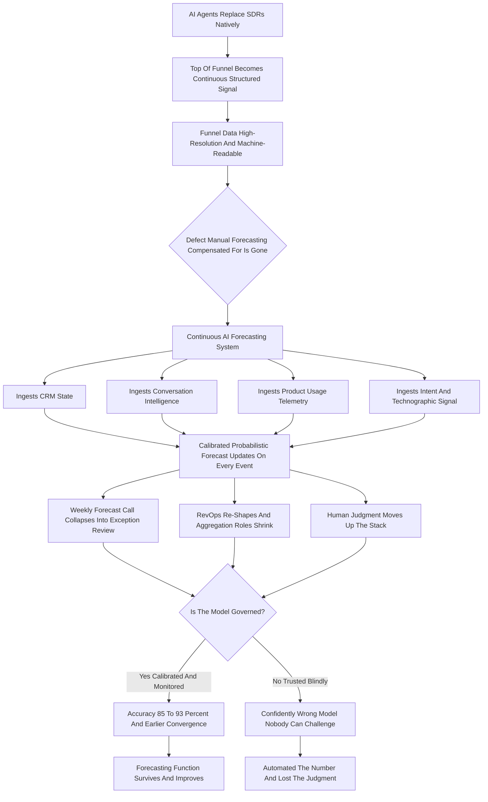

### Direct Answer

If AI agents replace SDRs natively, manual revenue forecasting does not get improved — it gets **structurally replaced** by a continuous, signal-grounded, calibrated forecasting *system* that runs as infrastructure rather than as a Friday meeting. The mechanism is specific: manual forecasting only ever existed as a compensating control for low-resolution, human-mediated pipeline data, and once AI agents source and qualify pipeline natively — continuously, at signal-level resolution, with every touch logged as structured data — that defect disappears and the manual apparatus loses its job. The honest verdict: the **forecasting function survives and gets materially more accurate**, but **manual forecasting as a labor category — the spreadsheet roll-up, the call-down, the sandbagging game — does not.**

**TL;DR**

- **Manual forecasting is a compensating control, not a goal.** It existed because pipeline was expensive to generate, slow to qualify, and noisy to interpret — the only way to turn that fog into a number was to have humans argue on a cadence.
- **The AI-SDR shift is the specific trigger.** When agents do SDR work, the funnel becomes continuous, fully structured, and consistently qualified — the exact defect manual forecasting patched.
- **Five things replace the old motion:** continuous AI forecasting, the forecast call collapsing into an exception review, a re-shaped RevOps team, the *signal* (not the rep's story) as the unit of forecasting, and human judgment moving up the stack to governance.
- **Accuracy improves credibly** from roughly 70-80% within-tolerance to 85-93%, with earlier convergence — but the gain is entirely contingent on data coverage and model governance.
- **The durable human core survives:** accountability for the number, the commitment act, strategic-deal judgment, the assumptions layer, cross-functional reconciliation, and the narrative.
- **The single biggest risk** is not a worse number — it is adopting the forecast while letting the institutional *skill* of forecasting atrophy, leaving a confident dashboard nobody can challenge.

---

## 1. What Manual Forecasting Actually Is — And Why It Existed

Before you can say what replaces manual forecasting, you have to be precise about what it *is*, because most discussions conflate the forecast (the number) with the process of producing it (the manual labor). Those are different things, and only one of them is getting replaced.

### 1.1 The Manual Forecasting Ritual, Step By Step

Manual forecasting is a specific operating ritual with a fixed shape. **Individual account executives** assess each open opportunity, assign it a category (commit, best case, pipeline, omitted), often add a close date and a confidence, and report that up. **Front-line managers** roll their reps' calls into a team number, applying their own haircuts and adjustments. **RevOps** aggregates the team numbers, reconciles them against CRM state, builds the board slide, and surfaces the gap-to-plan. The **CRO** sits on top, applies a final judgment-based adjustment, and commits a number to the CEO and the board.

This whole apparatus — the weekly forecast call, the spreadsheet, the Clari board, the Friday roll-up — exists for one reason: **pipeline was a low-resolution, expensive, human-mediated signal, and the number had to be manufactured from judgment because it could not be computed from data.**

### 1.2 The Compensating-Control Framing

A human SDR booked maybe eight to fifteen meetings a week. Each meeting was a coarse event — it happened or it did not — and what it *meant* lived in the AE's head, in call notes of wildly varying quality, in an email thread nobody parsed. The CRM was a lagging, partial, often-stale record. Given that input, the only way to get to a forecast was to have humans look at the fog and argue.

**Manual forecasting was never the goal; it was the compensating control for bad data.** That framing matters, because it tells you exactly what changes when the data stops being bad. Strip the defect and the control has nothing to do.

| Element of manual forecasting | What it actually compensated for |
|---|---|
| The weekly forecast call | No live, trustworthy deal state — the number had to be re-made by hand |
| AE category + confidence | No observable signal — the rep's read was the only available input |
| Manager haircut | Known bias in rep self-reporting — a correction layer on a subjective input |
| RevOps reconciliation | Stale and inconsistent CRM data — a clean-up pass before roll-up |
| CRO adjustment | No calibration — judgment substituting for a measured probability |

---

## 2. Why The SDR-To-AI Shift Is The Specific Trigger

It is worth being precise about why *the SDR layer specifically* turning into AI agents is the thing that breaks manual forecasting, as opposed to general "AI in sales." Not every AI deployment changes the operating model; this one does.

### 2.1 The SDR Layer Is The Source Of The Noise

The SDR function sits at the top of the funnel, and it is the single largest source of the noise that made forecasting a judgment exercise. **Human SDR pipeline is noisy in structured, well-documented ways.**

- **Activity-without-intent** — meetings booked to hit a meeting quota, not because the account is in-market.
- **Inconsistent qualification** — every SDR applies BANT or MEDDIC slightly differently, or not at all.
- **Lossy handoff** — what the SDR learned rarely survives the transfer to the AE intact.
- **Sparse signal** — a booked meeting tells you almost nothing about buying-committee dynamics, budget reality, or competitive context.

### 2.2 What Changes When Agents Do The Job

When AI agents do the SDR job natively, three things change at once, and together they remove the defect.

1. **The work is continuous rather than batched.** Agents are not constrained to a workday or a meeting quota, so the top of funnel becomes a steady stream rather than a weekly pulse.
2. **Every action is structured data by default.** An agent does not "remember" a conversation — it logs it as parseable state, so the qualification reasoning, the signals observed, and the account context are all machine-readable.
3. **Qualification becomes consistent and signal-driven.** The agent applies the same logic every time and grounds it in observable signal — hiring data, technographic changes, product usage, intent, funding events — rather than gut feel.

### 2.3 The Mechanism, Stated Plainly

The funnel stops being a fog of human-mediated coarse events and becomes a high-resolution, continuously-updating, fully-instrumented data stream. **The moment your input is high-resolution structured data, the manual judgment apparatus that existed to compensate for low-resolution data has no job left to do.**

That is the mechanism. It is not that "AI is good at forecasting." It is that the AI-SDR shift removes the specific defect manual forecasting existed to patch. This is the reason a buyer's-guide question about the AI-SDR layer itself — covered in (q1899) — is upstream of every forecasting decision in this entry.

| Funnel property | Human SDR era | Native AI-agent era |
|---|---|---|
| Cadence of top-of-funnel work | Batched to workday + meeting quota | Continuous, always-on |
| Data capture | Human memory + variable notes | Structured, machine-readable by default |
| Qualification consistency | Per-rep, uneven | Identical logic every time |
| Signal grounding | Gut feel, politeness, "happy ears" | Hiring, technographic, intent, usage signal |
| Net effect on the forecast input | Low-resolution fog | High-resolution evidence stream |

---

## 3. What Actually Replaces It: Continuous Signal-Grounded Forecasting

The thing that replaces manual forecasting is not "a better spreadsheet" or "AI-assisted forecast calls." It is a categorically different artifact: a **continuous, signal-grounded, probabilistic forecasting system** that runs as infrastructure rather than as a meeting.

### 3.1 The Five Defining Properties

A usable replacement forecast has five properties, and each one is something a manual process structurally cannot offer.

- **Continuous.** The forecast updates on every material event — a stage change, a new buying-committee contact engaged, a usage spike, a competitor mention on a call, a champion going dark — rather than on a weekly cadence. "The forecast" stops being a Friday snapshot and becomes a live state.
- **Signal-grounded.** The prediction is built from observable data — CRM state, conversation intelligence, email engagement, product telemetry, intent and technographic signal, historical conversion patterns by segment — rather than from the AE's self-reported category. The forecast no longer depends on rep honesty.
- **Probabilistic and calibrated.** Instead of a single committed number produced by stacked judgment haircuts, the system produces a distribution with explicit confidence, and a well-run version is *calibrated*: when it says 70%, those deals close roughly 70% of the time.
- **Explainable at the deal level.** A usable system does not just score a deal, it surfaces *why* — which signals moved it, what is missing, what looks anomalous versus similar historical deals. That is what makes a human exception review possible.
- **Multi-source.** It does not rely on the CRM alone, because the CRM was always the lagging record. It fuses the CRM with the conversation layer, the product layer, and the external-signal layer.

### 3.2 Why "AI Forecasting" Undersells It

The shorthand "AI forecasting" undersells the change. What replaces manual forecasting is a **forecasting operating system** — always-on, data-grounded, calibrated, explainable, and multi-source. The human work reorganizes around governing that system rather than manufacturing the number by hand.

| Property | Manual forecast | Continuous AI forecast |
|---|---|---|
| Update frequency | Weekly snapshot | Live, event-driven |
| Primary input | Rep self-report | Multi-source observable signal |
| Output form | Single committed number | Calibrated probability distribution |
| Explainability | "Because the rep said so" | Signal-level attribution per deal |
| Data sources | CRM (lagging) | CRM + conversation + product + external |
| Failure mode | Visibly fuzzy | Invisibly confident if ungoverned |

---

## 4. The Tool Landscape: Who Actually Builds This

This is not speculative. The category exists and is consolidating around a recognizable set of players, and a RevOps leader should understand the landscape rather than treat "AI forecasting" as a monolith.

### 4.1 The Revenue-Platform Incumbents

**Clari** is the incumbent revenue-platform leader, originally a forecasting and pipeline-inspection tool, now positioning around "revenue cadence" and autonomous workflows; its acquisition of Wingman gave it a conversation layer (Clari Copilot). **Gong** came from the conversation-intelligence side and pushed into forecasting from the data-richest input — the actual customer conversations — which is a structurally strong position when the whole game is signal grounding.

**Salesforce (NYSE: CRM)** ships forecasting natively through Sales Cloud and Einstein, plus its Agentforce agent layer. That matters enormously, because the CRM-native option has near-zero integration friction and owns the system of record. **HubSpot (NYSE: HUBS)** offers the equivalent CRM-native forecasting and AI features for the mid-market. **Microsoft (NASDAQ: MSFT)**, via Dynamics 365 and Copilot, brings the same system-of-record advantage to enterprises already standardized on its stack.

### 4.2 The Challengers And The Data-Capture Layer

**BoostUp** and **Aviso** are the focused AI-forecasting challengers, competing specifically on model accuracy, scenario planning, and forecast-process rigor. **People.ai** and **Scratchpad** attack the data-capture and CRM-hygiene problem that forecasts depend on. On the AI-SDR side — the trigger for this whole shift — the players are platforms like **11x**, **Artisan**, **AiSDR**, **Qualified** (with its Piper agent), and the agent layers being built natively into **Outreach** and **Salesloft**. Vendor-specific buying questions, such as whether a sequencing incumbent's AI forecast is worth it versus Clari, are explored in (q1860).

### 4.3 The Strategic Read For A Buyer

The **conversation-data owners** (Gong, Clari via Copilot) and the **CRM-of-record owner** (Salesforce, HubSpot, Microsoft) have the strongest structural claims on the forecast, because forecasting quality is downstream of data coverage — and the AI-SDR layer increasingly *generates* the structured top-of-funnel data they all consume.

| Vendor / category | Origin | Structural claim on the forecast |
|---|---|---|
| Clari | Forecasting + pipeline inspection | Incumbent platform; added conversation via Copilot |
| Gong | Conversation intelligence | Owns the richest leading-signal layer |
| Salesforce (NYSE: CRM) | CRM of record | Zero integration friction; owns deal state |
| HubSpot (NYSE: HUBS) | Mid-market CRM | CRM-native forecasting for the mid-market |
| Microsoft (NASDAQ: MSFT) | Dynamics + Copilot | System-of-record advantage in the enterprise |
| BoostUp / Aviso | AI-forecasting challengers | Compete on model accuracy and scenario rigor |
| 11x / Artisan / Qualified / AiSDR | AI-SDR agents | Generate the structured funnel data the forecast consumes |

---

## 5. The Forecast Call Does Not Survive In Its Current Form

The single most visible casualty of this shift is the **weekly forecast call**, and it is worth being honest about how thoroughly it changes.

### 5.1 What The Call Was For

In the manual model, the forecast call is where the number is *made* — the AE walks each deal, the manager challenges, categories get adjusted, the roll-up gets reconciled. It is expensive: a fully-loaded estimate of an AE's week in forecast-related activity (the call itself, the prep, the CRM updating done specifically to survive the call, the follow-up) runs several hours, and the manager and RevOps time stacks on top.

When the forecast is produced continuously by a calibrated system, **the meeting's original purpose — manufacturing the number — is gone.**

### 5.2 What Replaces It: The Exception Review

What replaces it is not nothing; it is a fundamentally different meeting. The recurring review becomes an **exception review**: the system has already produced the forecast and flagged the small subset of deals that are anomalous, at-risk, or where the model and the field disagree, and the human time goes entirely to *those* deals. The cadence often stretches — weekly becomes biweekly for the full review, because the dashboard is always current — and the content shifts from "what is your number" to "why does the model think this strategic deal slipped, and do we agree." The mechanics of running that meeting well are a discipline in their own right, covered in (q9519).

### 5.3 The Discipline Of Letting The Old Meeting Die

This is a genuine productivity unlock: AE time goes back to selling, manager time goes to coaching and intervention on real risk, and RevOps stops spending Thursday and Friday building a slide. But it is also a real cultural change, and organizations that keep the old call running *on top of* the new system — because the ritual is comforting — capture none of the savings and add confusion. The discipline is to actually let the old meeting die and replace it deliberately with the exception review. How a CRO designs that successor review meeting is treated directly in (q9638).

| Dimension | Weekly manual forecast call | Exception review |
|---|---|---|
| Purpose | Manufacture the number | Inspect the deals the model flags |
| Coverage | Every open deal, every rep | Only anomalous / at-risk / divergent deals |
| Cadence | Weekly, multi-hour | Biweekly, short |
| AE prep cost | Several hours/week | Minimal — the dashboard is always current |
| Manager focus | Challenging categories | Coaching and intervention on real risk |
| RevOps load | Roll-up + board slide | Maintain the model and the flag logic |

---

## 6. The RevOps Re-Shape: What Shrinks, What Grows

The headcount question is the one everyone actually wants answered, and it deserves a precise rather than a hand-wavy answer.

### 6.1 RevOps Re-Shapes, It Does Not Disappear

The honest framing: **RevOps does not disappear — it re-shapes, and the parts of it that were manual-forecasting labor shrink hard.** Map the function by activity. The roles that are *primarily* about compensating for bad data and manual aggregation — pipeline hygiene and CRM clean-up, report and dashboard building, forecast roll-up and reconciliation, the weekly board-slide assembly — are the roles the new system most directly displaces. A realistic reduction in *that specific work* is **40-60%** as continuous AI forecasting matures. The parallel question of what happens to the rest of the RevOps stack and tooling when agents take over is the subject of (q1870).

### 6.2 The Roles That Grow In Importance

The roles that are about *governing* the revenue system grow in importance even if they do not grow much in number.

- **The revenue strategist** interprets the forecast and owns quota and capacity strategy.
- **The forecast-model owner** is accountable for calibration and for the model's assumptions.
- **The agent-system architect** designs and maintains the AI-SDR and AI-forecasting stack.
- **The data-quality and integration owner** makes sure the signal feeding the model is trustworthy.

### 6.3 The Net Effect And The Two Mistakes

The net effect on a typical 100-rep org's RevOps team is not "RevOps goes to zero." It is something like "a 5-7 person team becomes a 3-4 person team with a meaningfully different and higher-skilled composition." Organizations make the mistake in both directions: **under-cutting** (assuming the AI means you can eliminate RevOps entirely, then discovering nobody owns the model's assumptions and the forecast quietly drifts) and **over-protecting** (keeping the full manual team employed doing manual work *alongside* the AI system, capturing the cost but not the benefit). The right move is a deliberate re-skill — and the adjacent question of what happens to the RevOps stack when agents auto-coach reps is covered in (q1898).

| RevOps activity | Direction | Why |
|---|---|---|
| Pipeline hygiene / CRM clean-up | Shrinks 40-60% | Continuous structured agent data replaces manual clean-up |
| Report / dashboard building | Shrinks 40-60% | The forecast system is the live dashboard |
| Forecast roll-up / reconciliation | Shrinks 40-60% | The model aggregates continuously |
| Board-slide assembly | Shrinks hard | The model's output is the board artifact |
| Revenue strategy | Grows in importance | Someone must own quota and capacity logic |
| Forecast-model ownership | New / grows | Calibration and assumptions need an owner |
| Agent-system architecture | New / grows | The AI stack needs design and maintenance |
| Data-quality / integration | Grows in importance | Forecast quality is downstream of data trust |

---

## 7. The Unit Of Forecasting Changes: From The Rep's Story To The Signal

A subtle but profound shift: manual forecasting forecasts **the deal as the AE describes it**, and AI forecasting forecasts **the deal as the data reveals it**. That change in the *unit* of forecasting is what actually drives the accuracy improvement.

### 7.1 Why Manual Accuracy Is Capped

In the manual model, the atomic input is the rep's judgment: their category, their close date, their confidence. Everything downstream is an operation on that judgment — the manager's haircut, the RevOps reconciliation, the CRO's adjustment are all attempts to *correct* a fundamentally subjective input. **This is why manual forecast accuracy is capped: you cannot reconcile your way out of bad primary data.**

The known failure modes are all judgment failures.

- **Sandbagging** — the rep commits low to over-deliver and protect themselves.
- **Happy ears** — the rep believes the prospect's politeness is buying intent.
- **Close-date fiction** — dates set to look good on the board, not to reflect reality.
- **The commit game** — categories chosen for political safety, not predictive accuracy.

### 7.2 Divergence Becomes Its Own Signal

When the unit of forecasting becomes the signal — engagement patterns, buying-committee breadth, conversation content, usage trajectory, historical analogs — the forecast stops being an operation on a subjective input and becomes a computation over observable evidence. The rep's view does not vanish; it becomes *one signal among many*. Crucially, the *divergence* between what the rep says and what the data shows becomes its own high-value signal: a rep committing a deal the data says is cold is exactly the deal a manager should inspect. Distinguishing genuine forecast inaccuracy from AE optimism and structural process problems is a tracking discipline in itself, treated in (q9520).

### 7.3 The Real Source Of The Accuracy Gain

This is the real source of the accuracy gain. It is not that the AI is smarter; it is that **the input changed from a story to evidence**, and you can compute over evidence in a way you never could over stories.

| Failure mode | Type | Removed by signal grounding? |
|---|---|---|
| Sandbagging | Judgment / incentive | Yes — signal is incentive-blind |
| Happy ears | Judgment / cognitive bias | Yes — engagement data overrides optimism |
| Close-date fiction | Judgment / political | Yes — model dates from conversion patterns |
| The commit game | Judgment / political | Yes — categories computed, not chosen |
| Spreadsheet error (5-15%) | Process / mechanical | Yes — no manual aggregation step |

---

## 8. Human Judgment Moves Up The Stack — It Does Not Disappear

The most important and most misunderstood part of this shift: human judgment in forecasting does not get eliminated, it **moves up the stack** — from producing the number to governing the system that produces it.

### 8.1 What Humans Keep Owning

"Humans still matter" is true but useless without specifics. Humans own, and will keep owning, six concrete things.

- **The assumptions the model cannot see** — a pending pricing change, a re-org, a strategic pivot, a major competitor's move, a macro shift — because the model only knows what is in its data, and the future is not always in the data.
- **Quota and capacity strategy** — how much pipeline coverage is enough, how to set quotas given the new agent-driven funnel economics, how to think about ramp and territory when SDR capacity is no longer the constraint.
- **The model-versus-field reconciliation** — when the system and the experienced sales leader disagree, someone has to adjudicate, and that someone needs both forecasting literacy and domain judgment.
- **At-risk intervention on strategic deals** — the model can flag a slipping enterprise deal, but a human has to actually do something about it.
- **Forecast-model governance** — calibration monitoring, watching for drift, deciding when the model needs retraining, owning the question "do we still trust this."
- **The narrative** — the board does not want a probability distribution, it wants an accountable human explaining the number and what is being done about the gap.

### 8.2 The Pattern: Lower-Volume, Higher-Leverage Work

The pattern across all of these: the human work is **lower-volume, higher-leverage, and higher-skill.** It is less "manufacture the number every Friday" and more "govern the system, own the assumptions, intervene on what matters, and stay accountable for the result." The organizations that thrive are the ones that deliberately invest in *that* skill set rather than assuming the AI made forecasting skill unnecessary.

| Old human job (manufacturing) | New human job (governing) |
|---|---|
| Walk every deal in the call | Inspect only model-flagged exceptions |
| Apply category haircuts | Own quota and capacity strategy |
| Reconcile CRM data by hand | Adjudicate model-versus-field divergence |
| Build the board slide | Own the narrative and the accountability |
| Re-do the number every Friday | Monitor calibration and decide on retraining |
| Guess at assumptions implicitly | Explicitly inject the assumptions the model cannot see |

---

## 9. The Accuracy Question: How Much Better Does It Actually Get

A RevOps leader committing to this shift needs an honest answer on the accuracy upside, not a vendor number.

### 9.1 The Realistic Numbers

Well-run manual forecasting in a competent organization lands somewhere around **70-80% of forecasts within 10% of actual** on a quarterly basis — and plenty of organizations are worse, with a long tail of poorly-run processes missing badly and unpredictably. Continuous AI forecasting, in a mature deployment with good data coverage, credibly moves that to roughly **85-93% within tolerance, often at a tighter tolerance** (within 5% rather than 10%). It also does so with **earlier convergence** — the quarter's forecast stabilizes weeks sooner because the model is not waiting for the Friday call-downs to firm up. The deeper challenge of building a bottom-up forecast that does not collapse when one AE has a $2M deal slip is examined in (q9517).

### 9.2 The Four Conditions On The Gain

The honest version includes the conditions, because the upside is not unconditional.

1. **Data coverage.** A model fed a sparse, poorly-instrumented funnel will be confidently wrong. The AI-SDR shift matters here precisely because it is what *creates* the dense structured funnel data the model needs.
2. **Calibration discipline.** A model nobody is monitoring for drift will degrade silently.
3. **Avoiding the feedback-loop trap.** If the AI forecast influences which deals reps work, it can become self-fulfilling in ways that look like accuracy but are actually the model steering reality to match itself.
4. **Segment maturity.** The gain is smaller in genuinely volatile segments — a brand-new product, a market in disruption, a tiny-sample enterprise motion — where there is not enough historical signal for the model to be confident.

### 9.3 The Failure Modes That Erase The Gain

The accuracy upside is real, but it is not automatic, and a serious treatment has to name the recognizable ways the transition fails — because it fails often, and the failures are the same ones every time.

- **The confidently-wrong model nobody can challenge.** An organization deploys AI forecasting, the manual skill atrophies, and then the model is wrong in a quarter that matters — a regime change it had no data for — and there is no human left with the forecasting literacy to have caught it. The forecast got automated; the *judgment* got lost.
- **Garbage in, confident garbage out.** The model is deployed on top of a thinly-instrumented funnel, produces precise-looking forecasts from sparse data, and the precision is mistaken for accuracy.
- **The self-fulfilling feedback loop.** The AI forecast influences which deals reps prioritize, reps work the deals the model likes, those deals close, and the model looks accurate — but it has been steering reality, not predicting it.
- **The ritual that will not die.** The organization stands up the AI system but keeps the full weekly manual forecast call running alongside it, capturing the cost of both and the benefit of neither.
- **Cutting RevOps to the bone.** Leadership reads "AI replaces manual forecasting" as "fire RevOps," eliminates the model-governance and data-quality roles too, and the forecast quality silently degrades.
- **Forecasting the wrong funnel.** The AI-SDR agents are optimized for a metric — meetings, engagement — that is not actually predictive of revenue, so the dense structured data feeding the forecast is dense, structured, and *misleading.*

Every one of these is avoidable, and the avoidance is the same in each case: deploy the system, but *govern* it — keep the human forecasting skill alive, instrument the funnel before trusting the model, monitor for the feedback loop, deliberately kill the old ritual, protect the governance roles, and make sure the agent layer is optimized for revenue, not vanity activity.

### 9.4 The Defensible Claim

The defensible claim is not "AI forecasting is 99% accurate." It is "AI forecasting is meaningfully and reliably better than manual, converges earlier, and is calibrated — *if* you feed it good data and govern it."

| Failure mode | Root cause | The governing countermeasure |
|---|---|---|
| Confidently-wrong model | Atrophied human forecasting skill | Maintain forecasting literacy on purpose |
| Garbage in, confident garbage out | Sparse funnel instrumentation | Instrument layers 2-4 before deploying |
| Self-fulfilling feedback loop | Prediction feeds back into prioritization | Monitor for steering; audit deprioritized deals |
| Ritual that will not die | Comfort of the old meeting | Deliberately retire the manual call-down |
| Cutting RevOps to the bone | Cost-only business case | Protect governance and data-quality roles |
| Forecasting the wrong funnel | Agents tuned for vanity activity | Optimize agents for revenue-predictive signal |

| Accuracy dimension | Manual forecasting | Continuous AI forecasting |
|---|---|---|
| Within-tolerance accuracy (quarterly) | ~70-80% within 10% | ~85-93% within 5-10% |
| Tolerance band typically achievable | Within 10% | Within 5% |
| Forecast convergence | Late in quarter | Weeks earlier, mid-quarter |
| Calibration (stated % matches actual %) | Rarely calibrated | Calibrated when governed |
| Update cadence | Weekly | Continuous |
| Dependency | Rep honesty + manager intuition | Data coverage + model governance |

---

## 10. The Cost And Headcount Math, Concretely

It helps to ground the re-shape in actual numbers for a representative organization, because the abstract "RevOps shrinks" claim should be testable.

### 10.1 The Manual-Era Operating Cost

Take a 100-rep B2B SaaS sales org. The manual-era operating cost of the forecasting-and-RevOps function looks roughly like this: a **RevOps team of 5-7 people** (analysts, ops managers, a leader) at a fully-loaded cost of **$600K-$1.1M annually**, plus a tooling stack — a revenue platform, conversation intelligence, a CRM ops layer, dashboarding — of **$150K-$400K annually**, for a total of **$750K-$1.5M**. On top of that sits the *distributed* cost that never shows up on the RevOps line: the AE and manager hours consumed by forecast calls and CRM-for-the-call updating.

### 10.2 The AI-Forecasting-Era Operating Cost

The AI-forecasting-era operating cost for the same org: a re-shaped **RevOps team of 3-4 higher-skilled people** at **$400K-$700K** fully loaded, plus a tooling stack that now includes the AI forecasting layer and the AI-SDR agent layer but consolidates some old point tools, landing at **$200K-$450K**, for a total of **$600K-$1.15M**.

### 10.3 Why Cost Reduction Is The Wrong Business Case

The headline savings on the *visible* line is real but modest — often **$150K-$400K** — and the bigger prize is the *recovered selling capacity* from killing the forecast-call tax. **The business case for this shift is not primarily RevOps cost reduction.** It is forecast accuracy, earlier convergence, and recovered rep capacity. An organization that justifies the move purely on "fire half of RevOps" is both overstating the line-item savings and missing the actual value — and is likely to under-invest in the model governance that makes the whole thing work.

| Line item | Manual era | AI-forecasting era |
|---|---|---|
| RevOps headcount | 5-7 people | 3-4 higher-skilled people |
| RevOps fully-loaded cost | $600K-$1.1M/yr | $400K-$700K/yr |
| Tooling stack | $150K-$400K/yr | $200K-$450K/yr |
| Total visible cost | $750K-$1.5M/yr | $600K-$1.15M/yr |
| Visible line-item savings | — | ~$150K-$400K/yr |
| Bigger prize | — | Recovered selling capacity + accuracy |

---

## 11. The Data Architecture Underneath: What The Forecast Runs On

It is worth going one level deeper than "the model ingests signal," because the data architecture is where this shift is won or lost. A RevOps leader who hand-waves it will deploy a confident, hollow forecast.

### 11.1 The Four Data Layers

The continuous forecast runs on four distinct data layers, each with its own ownership and failure mode.

1. **The system of record (the CRM)** — deal stage, amount, close date, account structure. Necessary, but always the *lagging* layer, a record of decisions already made. A forecast built on the CRM alone is the manual forecast with extra steps.
2. **The conversation layer** — recorded and transcribed calls, emails, meeting content. The richest source of *leading* signal: it captures what the buyer actually said, who was in the room, what objections surfaced, whether a champion is engaged or going quiet. This is the layer Gong was built on.
3. **The product-and-usage layer** — for product-led or hybrid motions, the actual telemetry of how the prospect or expansion account uses the product. Often the single most predictive signal, and entirely invisible to a manual process.
4. **The external-signal layer** — intent data, technographic and firmographic changes, hiring signals, funding events, leadership changes. The context the AI-SDR agents already consume to source and qualify, now feeding the same model that forecasts.

### 11.2 The Architectural Point

The forecast quality is a function of *how many of these layers are instrumented and fused*, and most organizations have layer one, partial layer two, and nothing else. **The work of "getting ready for AI forecasting" is overwhelmingly the unglamorous work of instrumenting layers two through four and fusing them into a coherent account-and-deal state.** Organizations that treat the model as the project, rather than the data architecture as the project, build a precise-looking forecast on a one-layer foundation and call the resulting confidence "accuracy."

| Data layer | Signal type | Typical instrumentation maturity |
|---|---|---|
| System of record (CRM) | Lagging | Universal but stale |
| Conversation layer | Leading | Partial — a fraction of calls captured |
| Product-and-usage layer | Leading, often most predictive | Rare outside PLG-native orgs |
| External-signal layer | Contextual | Inconsistent; often siloed in marketing |

---

## 12. Second-Order Effects On The Rest Of The Revenue Org

The shift does not stay contained in forecasting — it ripples, and a RevOps leader should anticipate the second-order effects.

### 12.1 The Effects On Roles And Comp

- **Quota setting changes.** When SDR capacity is no longer the throttle on pipeline, the old "pipeline coverage" heuristics and the logic of quota-setting have to be rebuilt around agent-driven funnel economics.
- **Comp design comes under pressure.** If agents source and qualify pipeline, what exactly is the AE being paid for, and how does the comp plan reflect a world where the human's contribution is concentrated in closing and relationship work.
- **The AE role narrows and deepens.** Less prospecting and early qualification, more late-stage execution, multi-threading, and strategic deal work — which changes hiring profiles and ramp expectations. The fate of cold outbound when agents handle pipeline forecasting is the focus of (q1883).
- **Manager work shifts.** From running forecast calls to coaching on the exception deals the model surfaces — arguably a better use of manager time, but a different skill.

### 12.2 The Effects On Finance And The Board

- **Finance's relationship to the forecast changes.** A continuous, calibrated, probabilistic forecast is a different input to FP&A than a quarterly committed number, and the two functions have to renegotiate how they consume each other's models.
- **The board conversation changes.** Boards will increasingly expect the calibrated-probability framing and will ask harder questions about model governance.
- **The data moat compounds.** Organizations that instrument early get better forecasts, which compound into better capacity and quota decisions, which compound into better execution.

The strategic point: treating this as "a forecasting tool change" under-scopes it. It is a **revenue-operating-model change**, and the forecasting piece is just the most visible part.

| Function | Manual-era relationship to the forecast | AI-era relationship |
|---|---|---|
| AEs | Produce the number deal-by-deal | Provide one signal; focus on closing |
| Managers | Run the forecast call | Coach on model-flagged exceptions |
| Finance / FP&A | Consume a single committed number | Consume a calibrated distribution |
| The board | Hear a point estimate + narrative | Probe calibration and governance |
| RevOps | Aggregate and reconcile | Govern the model and the data |

---

## 13. The Strategic-Deal Carve-Out: Where The Model Stays Junior

A recurring theme deserves its own treatment, because it is the most important boundary condition on the whole thesis: **the largest, most complex, lowest-sample deals are exactly where the AI forecast stays junior to human judgment — and that is not a temporary limitation, it is structural.**

### 13.1 Why Strategic Deals Defeat The Model

Continuous AI forecasting is strongest where it has dense historical analogs: a high-volume mid-market motion, a mature product, a well-trodden segment where thousands of similar deals have closed or not closed and the model can learn the patterns. The strategic enterprise deal is the opposite of that environment in every way — it is large enough to move the quarter by itself, it has a buying committee of eight to fifteen people with idiosyncratic politics, it is often a multi-quarter cycle, it involves a custom commercial structure, and crucially *there are not thousands of analogs*. There might be a few dozen deals of that shape in the company's entire history. A model extrapolating from a thin sample of non-analogous deals is not forecasting; it is guessing with a confidence interval.

### 13.2 Segment-Aware Authority

The operating model that works carves these deals out explicitly: the model still scores them and still surfaces signal — a champion going dark on a $2M deal is worth flagging — but the *forecast* on the strategic deals is owned by the experienced sales leader and the deal team, with the model as an input, not the authority. The mistake is letting the model's confidence on the high-volume motion bleed into false confidence on the strategic deals — treating a 90%-calibrated mid-market model as if it is 90%-calibrated on the enterprise whale. The discipline is segment-aware authority: the model leads where it has sample, humans lead where they do not, and someone owns knowing which is which.

| Segment | Sample density | Forecast authority |
|---|---|---|
| High-volume mid-market | Thousands of analogs | Model leads, human reviews exceptions |
| Mature transactional motion | Dense | Model leads |
| New product / disrupted market | Thin | Human leads, model is an input |
| Strategic enterprise whale | A few dozen analogs at most | Deal team leads, model flags signal only |

---

## 14. The Skill That Must Not Be Lost: Forecasting Literacy

The single most underrated risk in this whole transition has a name: **forecasting literacy** — the institutional capability to read a deal, sense when a number is soft, know the difference between a model that is right and a model that is confident, and challenge the system when it deserves challenging.

### 14.1 How The Skill Used To Be Maintained

In the manual era, this skill was *forced* — every AE, every manager, every RevOps analyst practiced it every week because the process required it. It was inefficient, but it had a side effect: the organization stayed forecasting-literate as a matter of course. When the manual process goes away, that forced practice goes away with it, and forecasting literacy quietly stops being maintained.

### 14.2 The Invisible Failure

For years this is invisible and even looks like progress — the model is accurate, nobody is wasting time on call-downs, the dashboard is always current. Then comes the quarter the model is wrong about a regime it had no data for — a sudden macro shift, a competitor's disruptive move, a category re-pricing — and the organization discovers it has nobody left who can look at the confident dashboard and say "this is wrong, and here is why." The skill atrophied because nobody practiced it.

### 14.3 Maintaining Literacy On Purpose

The organizations that handle this deliberately treat forecasting literacy as a capability to be *maintained on purpose*: they keep a core of humans actively forecasting in parallel as a discipline, they run the model-versus-field divergence as a teaching tool rather than just an exception queue, they rotate people through model-governance roles, and they treat "can a competent human challenge this model" as a standing operational requirement. The principle is simple and easy to get wrong: **automating the forecast is fine; automating away the ability to know when the forecast is wrong is the failure.** The shift in the SDR role itself — from quota-carrying prospector to something more like a pipeline architect — is part of how organizations preserve that judgment layer, a theme picked up in (q1472).

---

## 15. The Transition Sequence: How To Actually Do This

For a RevOps leader who buys the thesis, the question is sequencing — because doing this in the wrong order is itself a failure mode.

### 15.1 The Seven Steps

The defensible sequence runs roughly like this.

1. **Instrument the funnel.** Before the AI forecast can be trusted, the data it consumes has to be dense and clean — conversation intelligence, CRM hygiene, signal capture. This is also the prerequisite for the AI-SDR layer, so it is shared infrastructure.
2. **Deploy AI forecasting in shadow mode.** Run the continuous model alongside the manual process for a quarter or two without acting on it, and measure: is it calibrated, does it converge earlier, where does it disagree with the field and who is right.
3. **Deploy or expand the AI-SDR agent layer.** This is what generates the high-resolution top-of-funnel data, and it should be optimized from day one for revenue-predictive signal, not raw activity.
4. **Flip the forecast call to an exception review.** Once the model has earned trust in shadow mode, deliberately retire the manual call-down and replace it with the model-flagged exception review. Do not run both.
5. **Re-shape RevOps.** With the manual aggregation work genuinely gone, re-skill the people who can move up into strategy and model ownership, and be honest about the roles that are ending.
6. **Stand up formal model governance.** Name a forecast-model owner, set calibration monitoring, define the cadence for reviewing drift and assumptions.
7. **Retrain the muscle continuously.** Keep enough humans forecasting-literate that the model can always be challenged.

### 15.2 The Throughline

The throughline of the sequence: **earn trust before transferring authority, instrument before automating, and govern before you scale.** Organizations that jump straight to "fire RevOps and trust the dashboard" skip every step that makes the dashboard trustworthy.

| Step | Output | Failure if skipped |
|---|---|---|
| 1. Instrument the funnel | Dense, clean signal | Model launders sparse data into false precision |
| 2. Shadow mode | Measured calibration | Trusting an unproven model in a real quarter |
| 3. AI-SDR agent layer | High-resolution funnel data | Forecast still runs on noisy human input |
| 4. Flip to exception review | Recovered selling capacity | Paying for both rituals, benefiting from neither |
| 5. Re-shape RevOps | Higher-skilled, smaller team | Stranded aggregation roles or no owner |
| 6. Model governance | Named owner, drift monitoring | Silent model drift |
| 7. Retrain the muscle | Standing challenge capability | No competent skeptic when it matters |

---

## 16. The CRO And Board Conversation Changes Shape

The forecast is not only an internal operating artifact; it is the thing the CRO carries into the boardroom, and the AI shift changes the *shape* of that conversation.

### 16.1 From A Point Estimate To A Distribution

In the manual era, the board conversation is built around a single committed number and a narrative: here is the commit, here is the gap to plan, here is what we are doing about it. The number is a point estimate produced by stacked judgment, and everyone implicitly understands it is soft. In the continuous-AI era, the artifact the CRO has available is richer and more uncomfortable: a calibrated distribution, an explicit confidence band, a model-versus-field divergence, a set of flagged at-risk deals.

### 16.2 The Higher Bar On The CRO

A sophisticated board will *want* that richer artifact — and will start asking the harder questions that come with it: how is the model calibrated, who owns it, what is it blind to, why does it disagree with the field on the three biggest deals. This is genuinely better governance, but it raises the bar: the CRO and RevOps leader can no longer hide a soft number inside a confident narrative, and they have to be literate enough in the model to defend or challenge it in real time. The CRO's job shifts from *presenting the number* to *owning the system that produces the number and the judgment layered on top of it.* The organizations that handle this badly either over-trust the model ("the system says 4.2 million") or under-trust it ("I know the model says that, but my gut says...") without being able to articulate *why* either deserves the weight.

---

## 17. The Replacement Architecture

The diagram below traces the mechanism end to end: the AI-SDR shift removes the data defect, a continuous forecasting system replaces the manual roll-up, and the outcome forks on whether the model is actually governed.

---

## 18. Counter-Case: Where The Thesis Is Wrong Or Oversold

The case above is the realistic one, but a serious RevOps leader should stress-test it hard, because the thesis is easy to oversell and several of the counter-arguments are genuinely strong.

### 18.1 The Trigger And The Data

**Counter 1 — The trigger may not happen as cleanly as assumed.** The whole argument rests on "AI agents replace SDRs natively." But the AI-SDR category is real but uneven — agents are good at high-volume, low-complexity outbound and weak at nuanced, multi-threaded qualification. If SDRs are *augmented* rather than *replaced* — a human running a fleet of agents — the funnel data is still partly human-mediated and noisy, and manual forecasting's defect is reduced but not removed.

**Counter 2 — Garbage in is still the dominant reality.** The accuracy gain is entirely contingent on data coverage, and most organizations have *bad* data coverage. An AI forecast on top of a poorly-instrumented funnel is not better than manual forecasting; it is *worse*, because it launders sparse data into precise-looking numbers that get trusted.

**Counter 3 — The self-fulfilling feedback loop is not a corner case.** Once an AI forecast influences which deals reps prioritize — and it will, because that is the point of deal scoring — the model starts steering the reality it claims to predict. It is a structural property of any predictive system that feeds back into the process it predicts.

### 18.2 The Nature Of The Work

**Counter 4 — Forecasting is a commitment, and commitment is irreducibly human.** A lot of the thesis treats forecasting as a *prediction* problem. But the forecast that goes to the board is a *commitment* — it drives hiring, spending, and investor guidance, and committing is an act of accountable judgment. You cannot point a board at a model.

**Counter 5 — The accuracy ceiling in volatile segments is real and low.** The model is weakest exactly where forecasting matters most for strategic decisions: a brand-new product, a market in disruption, a tiny-sample enterprise motion. In those segments the AI forecast may be worse than experienced human judgment.

### 18.3 The Economics And The Skill

**Counter 6 — The headcount savings are overstated and the wrong reason to do it.** The visible RevOps line-item savings is often only $150K-$400K — real, but small relative to the disruption and tooling spend. If the business case is cost reduction, the business case is weak.

**Counter 7 — Institutional skill atrophy is a slow, invisible, expensive failure.** When the manual process goes away, the *skill* of forecasting atrophies because nobody practices it. This is fine for years, right up until the quarter the model is confidently wrong and there is no human left who can catch it.

**Counter 8 — Vendor incentives pollute the accuracy claims.** Every accuracy number in this space comes from a vendor with a product to sell, measured on their reference customers, under their definition of "accuracy." The honest benchmark literature is thin.

**Counter 9 — The transition cost is high and the disruption is real.** This is a multi-quarter organizational change program, not a tool purchase. A half-finished transition can be *worse* than either pure state.

### 18.4 The Honest Verdict

The core thesis holds *as a direction of travel*: as the funnel genuinely instruments and AI agents genuinely take over SDR work, the manual forecasting apparatus loses its reason to exist and a continuous, governed, signal-grounded system is the right replacement. But the thesis is routinely oversold on four points — the trigger is messier than "SDRs get replaced," the accuracy gain is contingent on data work most organizations have not done, the savings are smaller than claimed, and the durable human core is larger than the hype admits. The defensible position: this *is* where forecasting is going, the destination *is* better, but the organizations that win treat it as a multi-year, governance-heavy operating-model change — not a dashboard you buy and a team you cut.

| Counter-argument | Strength | What it means in practice |
|---|---|---|
| Trigger is messy | Strong | Plan for augmented SDRs, not clean replacement |
| Garbage in / garbage out | Very strong | Instrument before deploying — non-negotiable |
| Self-fulfilling feedback loop | Strong, structural | Monitor for prediction-as-steering |
| Commitment is human | Strong | The model is an input to commitment, not a substitute |
| Volatile-segment ceiling | Strong | Carve out strategic / new-product deals |
| Savings overstated | Moderate | Do not justify the move on cost |
| Skill atrophy | Strong, slow-burning | Maintain forecasting literacy on purpose |
| Vendor incentives | Moderate | Discount vendor accuracy claims |
| Transition cost | Strong | Treat as a multi-quarter program |

---

## 19. The Honest Synthesis

Pulling it together into a single defensible answer. If AI agents replace SDRs natively, what replaces manual forecasting is **a continuous, signal-grounded, calibrated, explainable forecasting system, governed by a smaller and higher-skilled human layer that owns assumptions, accountability, and intervention rather than aggregation.** The mechanism is specific and not hype: the AI-SDR shift removes the low-resolution-data defect that manual forecasting existed to compensate for, so the manual compensating apparatus — the call-down, the roll-up, the spreadsheet, the sandbagging game — loses its job.

The replacement is genuinely better on the dimensions that matter: more accurate (a credible 70-80% to 85-93% within-tolerance move), earlier-converging, calibrated in a way manual processes structurally cannot be, and it frees real selling and managing capacity. But the replacement is *not* a magic oracle, and the honest verdict has to hold both halves: **the forecasting function survives and improves; manual forecasting as a labor category does not.** The durable human core — accountability for the number, the commitment act, strategic-deal judgment, the assumptions layer, governance, and narrative — is real and load-bearing, and the organizations that thrive deliberately *move human judgment up the stack* rather than assuming AI eliminated the need for it.

The single biggest risk in the whole transition is not that the model is bad. It is that an organization adopts the forecast and abandons the *forecasting* — automating the number while letting the institutional skill of governing it atrophy — and is then left with a confident dashboard nobody can challenge in the one quarter where challenging it mattered. The right posture: deploy the system aggressively, govern it seriously, instrument before you automate, kill the old ritual deliberately, protect the governance roles, and keep enough humans forecasting-literate that the machine always has a competent skeptic. Do that, and the forecast gets materially better. Skip the governance, and you have just automated your way to a more confident version of being wrong.

---

## 20. Sources

1. **Clari — Revenue Platform And Forecasting** — Incumbent revenue-platform vendor; forecasting, pipeline inspection, revenue cadence, and the Copilot conversation layer. https://www.clari.com
2. **Clari Copilot — Conversation Intelligence** — Conversation-intelligence layer (formerly Wingman) feeding signal into the forecast. https://www.clari.com/products/copilot
3. **Gong — Revenue Intelligence And Forecasting** — Conversation-intelligence-led platform that pushed into forecasting from the customer-conversation data layer. https://www.gong.io
4. **Salesforce — Sales Cloud Forecasting And Einstein** — CRM-native forecasting and predictive scoring; the system-of-record option. https://www.salesforce.com/sales/forecasting
5. **Salesforce Agentforce — Agentic AI Layer** — Salesforce's native AI agent platform, relevant to both the AI-SDR and AI-forecasting layers. https://www.salesforce.com/agentforce
6. **HubSpot — CRM And Sales Hub Forecasting** — CRM-native forecasting and AI features for the mid-market. https://www.hubspot.com
7. **Microsoft Dynamics 365 — Sales And Copilot** — System-of-record forecasting and AI assistance for Microsoft-standardized enterprises. https://www.microsoft.com/dynamics-365/sales
8. **BoostUp — AI Revenue Forecasting** — Focused AI-forecasting challenger competing on model accuracy and forecast-process rigor. https://boostup.ai
9. **Aviso — AI-Powered Forecasting And Revenue Intelligence** — AI-forecasting and scenario-planning platform. https://www.aviso.com
10. **People.ai — Revenue Data And Activity Capture** — Activity-capture and revenue-data platform addressing the CRM-coverage problem forecasts depend on. https://www.people.ai
11. **Scratchpad — CRM Hygiene And Pipeline Workspace** — Tooling targeting the CRM-data-quality problem upstream of the forecast. https://www.scratchpad.com
12. **Outreach — Sales Execution Platform** — Sales-engagement platform building native agent and forecasting capability. https://www.outreach.io
13. **Salesloft — Revenue Orchestration Platform** — Sales-engagement platform with conversation intelligence and agentic features. https://www.salesloft.com
14. **11x — AI SDR Agents** — AI-agent platform automating the SDR function (Alice and related agents). https://www.11x.ai
15. **Artisan — AI Sales Agents** — AI-SDR agent platform (Ava) automating outbound prospecting and qualification. https://www.artisan.co
16. **Qualified — Piper The AI SDR** — AI-SDR agent operating on website and pipeline-generation workflows. https://www.qualified.com
17. **AiSDR — AI Sales Development Representative** — AI-agent platform for automated outbound and lead engagement. https://aisdr.com
18. **Gartner — Sales Forecasting And Revenue Operations Research** — Analyst research on forecast accuracy benchmarks, RevOps function design, and AI in sales. https://www.gartner.com
19. **Forrester — Revenue Operations And B2B Sales Research** — Analyst coverage of RevOps maturity, forecasting practice, and the AI-agent shift in go-to-market. https://www.forrester.com
20. **OpenView Partners — SaaS Benchmarks And Go-To-Market Research** — SaaS operating benchmarks including sales-org structure and efficiency metrics. https://openviewpartners.com
21. **Pavilion — Revenue Leadership Community And Benchmarks** — Practitioner community and benchmark data for CROs, RevOps, and sales leaders. https://www.joinpavilion.com
22. **a16z — Enterprise And AI-Agent Go-To-Market Analysis** — Investor analysis on AI agents reshaping sales development and go-to-market motions. https://a16z.com
23. **SaaStr — Sales And RevOps Operating Practice** — Practitioner content on forecasting cadence, RevOps team design, and sales-org economics. https://www.saastr.com
24. **The Bridge Group — SDR And Sales Development Metrics** — Benchmark research on SDR productivity, ramp, and the metrics the AI-SDR shift displaces. https://www.bridgegroupinc.com
25. **RevOps Co-op — Revenue Operations Practitioner Community** — Practitioner community on RevOps tooling, forecast process, and function design.
26. **Salesforce State Of Sales Report** — Periodic survey data on sales-org practices, forecasting, and AI adoption. https://www.salesforce.com/resources/research-reports/state-of-sales
27. **Gong Labs — Sales Data Research** — Data-driven research on deal signals, conversation patterns, and what actually predicts close. https://www.gong.io/labs
28. **MEDDIC / MEDDPICC Sales Qualification Framework** — Reference for the enterprise qualification methodology AI agents increasingly operationalize.
29. **Winning By Design — Revenue Architecture Methodology** — Framework reference for funnel design and revenue-process architecture in the agent era.
30. **CRO And RevOps Compensation And Headcount Benchmark Surveys** — Reference points for RevOps team size and cost in mid-market and enterprise SaaS.
31. **Conversation Intelligence And Forecast-Accuracy Industry Studies** — Studies on the relationship between data coverage, conversation capture, and forecast accuracy.
32. **McKinsey — Generative AI In Sales And Go-To-Market** — Consulting research on AI adoption patterns and productivity impact across the sales funnel. https://www.mckinsey.com
33. **CB Insights — AI Sales Tech Market Mapping** — Market intelligence on the AI-SDR and revenue-intelligence funding and category landscape. https://www.cbinsights.com
34. **HubSpot Research — State Of Sales And RevOps** — Survey data on sales-team practice, forecasting habits, and AI tooling adoption in the mid-market. https://www.hubspot.com/marketing-statistics

---

## 21. Related Pulse Library Entries

- **(q1899)** — What replaces SDR teams if AI agents replace SDRs natively? The direct companion entry on the SDR-replacement trigger that sets this whole shift in motion.
- **(q1870)** — What replaces the RevOps stack if AI agents replace SDRs natively? The tooling-and-stack counterpart to this entry's RevOps re-shape argument.
- **(q1898)** — What replaces the RevOps stack if AI agents auto-coach reps? Adjacent detail on how the RevOps function and tooling change under agent automation.
- **(q1883)** — What replaces cold outbound if AI agents handle pipeline forecasting? The outbound-motion second-order effect once forecasting becomes agent-driven.
- **(q1860)** — Is Salesloft Pipeline AI worth buying vs Clari? The vendor-level buying decision inside the AI-forecasting tool landscape.
- **(q9517)** — How do you build a real bottom-up forecast in a 50-rep SaaS org? The forecasting-mechanics deep dive behind the accuracy discussion.
- **(q9519)** — What is the operator playbook for a 25-minute weekly pipeline review? The exception-review meeting that replaces the manual forecast call.
- **(q9520)** — How do you build a tracking system for deal slippage? Distinguishing forecast inaccuracy from AE optimism — the divergence-signal idea in practice.
- **(q9638)** — How does a CRO design the ideal pipeline review meeting in 2027? The CRO-level design of the successor to the weekly forecast call.
- **(q1472)** — My SDR team became Pipeline Architects — what does that mean? The human-role shift that preserves forecasting judgment as SDR work goes to agents.
