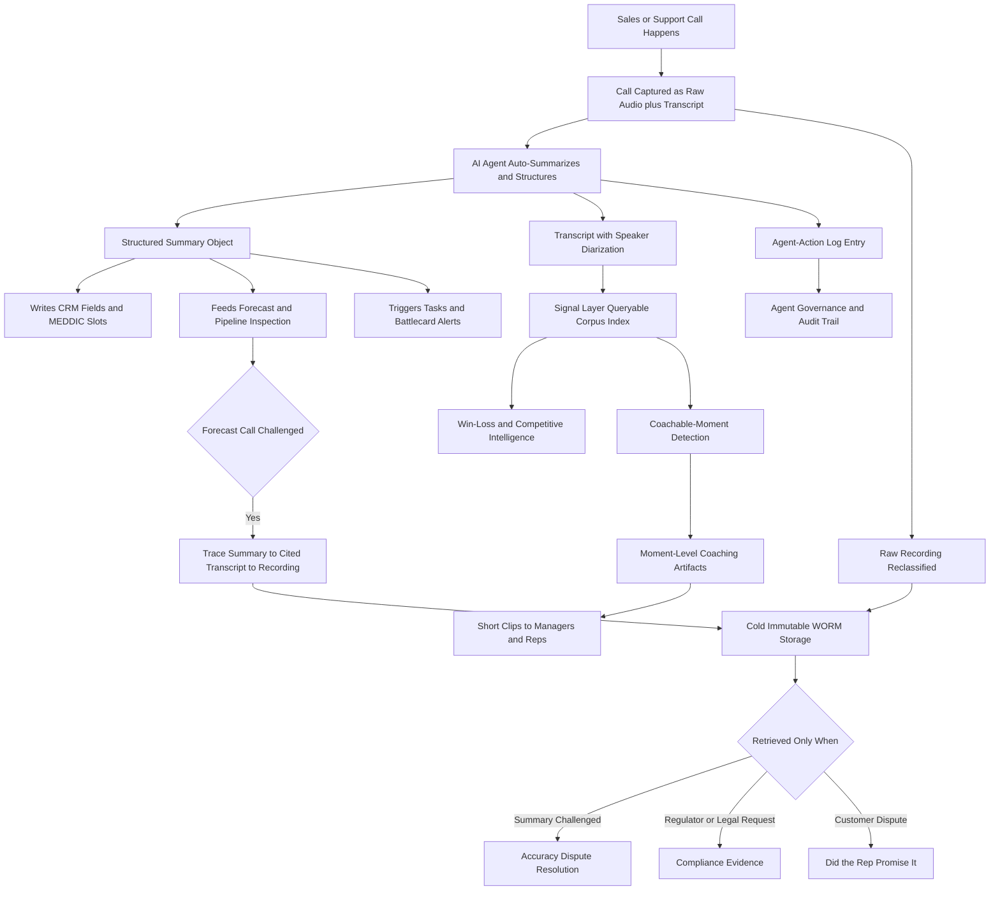

### Direct Answer

When AI agents auto-summarize every sales and support call, **call recording does not disappear -- it gets demoted.** The raw audio stops being the thing teams use to run the business every day and becomes a compliance-and-dispute artifact: a sealed, rarely-opened evidence vault retained for legal and audit reasons, not for operations. What actually replaces recording as the asset teams *work in* is a four-part stack -- the structured summary, the corpus-wide signal layer, moment-level coaching artifacts, and the brand-new agent-action log -- with the demoted recording sitting underneath as the ground truth that makes the whole stack trustworthy.

**TL;DR:** Recording was always a *proxy* for the answers inside it -- what was promised, what the risk is, how the rep performed, whether you were compliant. AI summarization delivers those answers directly, so the audio reverts to its honest job: evidence of last resort. (1) **The structured summary plus its transcript** becomes the operational source of truth -- CRM fields, deal risks, next steps, competitor mentions, and MEDDIC/MEDDPICC slots get written by the model and read by humans, so nobody scrubs a 47-minute waveform anymore. (2) **The signal layer** -- a queryable index of every commitment, objection, pricing discussion, and sentiment shift across the whole call corpus -- replaces "go listen to the call" with "show me every deal where the champion went quiet after we mentioned procurement." (3) **Moment-level coaching artifacts** replace whole-call review: managers coach the 90 seconds where discovery collapsed, not the hour around it. (4) **The agent-action log** -- a tamper-evident record of what the AI itself did, summarized, wrote, and recommended -- is a net-new artifact class that did not exist when humans took all the notes. The three things that go wrong: teams delete or under-retain the raw audio and lose their legal backstop; they trust the summary blindly with no accuracy SLA and no citation back to the transcript; and they fail to govern the agent-action log, so when a regulator or customer asks "what did your AI tell my rep," there is no answer. Net: the recording becomes the basement archive; the summary, signal index, coaching moments, and agent-action log become the building everyone actually works in.

## Why "What Replaces Recording" Is The Wrong Question Until You Reframe It

### 1.1 The Disruption Framing Is Wrong And Getting It Wrong Is Expensive

The instinct behind the question is that AI summarization makes call recording obsolete the way streaming made the DVD obsolete -- one clean product replacing another. **That framing is wrong, and getting it wrong is expensive.** Recording is not a product category that gets disrupted; it is a *layer in a stack*, and what AI summarization does is change which layer carries the value. For fifteen years the recording *was* the asset. **Gong** built a multi-billion-dollar company -- it crossed a roughly $7.25B valuation in its 2021 round and reported crossing $300M in revenue -- by being the place recordings lived, got transcribed, got searched, and got turned into coaching. **Chorus**, acquired by **ZoomInfo (NASDAQ: ZI)** for roughly $575M in 2021, did the same. The recording was the moat because capturing the call cleanly, at scale, with consent, across dialers and web conferencing, was genuinely hard.

### 1.2 Customers Were Always Buying Retrieval, Not Storage

Notice what customers were actually buying: not storage. They were buying *retrieval and insight* -- the ability to find what was said and act on it. The recording was the raw material; the value was always one layer up. **AI auto-summarization collapses the distance between the raw material and the value.** When a model writes an accurate, structured summary the instant the call ends -- deal stage, MEDDIC fields, objections, commitments, next steps, competitor mentions, sentiment arc -- the summary becomes the thing you use and the recording becomes the thing you keep.

### 1.3 The Real Question Is What The Recording Is *For* Now

So the real question is not "what replaces recording" but **"once the summary is the operational record, what is the recording for, and what new artifacts does the AI itself generate that you now have to manage?"** The answer is a four-part stack. A RevOps leader who maps it correctly builds a defensible, compliant, low-cost system. One who treats it as "summaries replace recordings, delete the audio" creates a legal and quality time bomb. The table below is the whole answer in one frame.

| Old role of the recording | What now carries it | Where the recording goes |
|---|---|---|
| Operational record of what happened | Structured summary object | Demoted to evidence |
| Cross-deal research practice | Signal layer (corpus index) | Demoted to evidence |
| Coaching by full-call replay | Moment-level coaching artifacts | Clip source only |
| Methodology compliance check | AI slot-filling with citations | Demoted to evidence |
| Proof of what the AI itself did | Agent-action log (net-new) | Not applicable -- new artifact |
| Compliance, retention, dispute | Recording itself, reclassified | Stays as evidence of last resort |

## The Recording Becomes A Compliance-And-Dispute Artifact

### 2.1 Its Job Changes -- It Does Not Go Away

Start with what happens to the recording itself, because the most dangerous mistake is assuming it vanishes. It does not -- its *job* changes. Today a recording does double duty: it is the **operational record** (managers replay it, deals get researched in it, deal reviews cite it) and it is the **compliance record** (it satisfies retention rules and settles disputes). AI summarization strips out the first job and leaves the second. The recording becomes a **write-rarely, read-rarely, delete-never** artifact -- a sealed evidence vault. This is not a downgrade in importance; it is a clarification of purpose.

### 2.2 The Four Questions The Audio Now Answers

The audio is now the answer to exactly four questions, and only four:

- **Did we have consent?** The recording is the proof that consent was captured and disclosed.
- **What was literally said when the summary is challenged?** The audio settles disputes the summary cannot.
- **Can we satisfy a regulator's retention demand?** FINRA, GDPR, and sector rules require the source artifact, not a derived one.
- **Can we defend a "your rep promised X" dispute?** Only the raw audio is neutral ground truth.

### 2.3 The Architecture That Follows From The Reframe

That reframe drives concrete architecture decisions. The recording moves to cheaper, immutable, access-logged **cold storage** -- object storage with legal-hold and write-once-read-many (WORM) semantics rather than the hot, indexed, constantly-queried storage that operational use demanded. It gets a *retention schedule* keyed to regulation rather than "keep everything forever because someone might want it." And it gets *access governance*: pulling the raw audio becomes an event -- logged, justified, often legal-approved -- not a casual manager action. The strategic point for RevOps: **you are not eliminating a cost center, you are re-classifying it.** The recording line item moves from the sales-tech budget to the compliance-and-risk budget, and that re-classification is itself the signal that operational value has moved up the stack.

| Recording attribute | Old (operational artifact) | New (evidence artifact) |
|---|---|---|
| Storage tier | Hot, indexed, instantly retrievable | Cold, immutable, WORM / legal-hold |
| Access pattern | Casual, frequent, by managers | Event-based, justified, often legal-approved |
| Retention logic | "Keep forever, someone might need it" | Regulation-keyed schedule |
| Budget home | Sales-tech line item | Compliance-and-risk line item |
| Read frequency | Many times per deal | Rarely -- only on dispute or audit |

## Artifact One: The Structured Summary As Operational Source Of Truth

### 3.1 It Is Not A Paragraph -- It Is A Schema-Bound Object

The first and most visible replacement is the structured summary. But "summary" undersells it -- a free-text paragraph is not what replaces the recording. What replaces it is a **structured, schema-bound capture object**: a record with typed fields. Deal stage. Sentiment arc. Explicit commitments and who made them. Objections raised and whether they were resolved. Competitor mentions. Pricing and discount discussion. Next steps with owners and dates. MEDDIC, MEDDPICC, or BANT slots filled. Risk flags. **This object -- not the audio and not even the transcript prose -- becomes the operational record of truth.**

### 3.2 Why It Can Actually Replace The Recording

It can replace the recording operationally because it is *actionable in a way audio never was*. It **writes directly to CRM fields**, feeds the forecast, and **triggers workflow**: a slipped next-step date creates a task; a competitor mention notifies a battlecard owner; an unresolved pricing objection routes to deal desk. And it is human-readable in fifteen seconds instead of forty-seven minutes. **Gong**'s Call Spotlight and Ask Anything, **Salesforce (NYSE: CRM)** Einstein Conversation Insights, **Microsoft (NASDAQ: MSFT)** Copilot for Sales, **HubSpot (NYSE: HUBS)** conversation intelligence, **Outreach** Kaia, and pure-play summarizers like Otter, Fireflies, Avoma, and Fathom all converge on the same idea: the model produces structure, the structure drives the system.

### 3.3 The RevOps Work Is Schema Design, Not "Turn It On"

The RevOps work here is not "turn on summaries." It is **schema design and governance**: deciding which fields are authoritative, which CRM objects they write to, what happens on a write conflict between the AI summary and a rep's manual edit, how confidence scores are surfaced, and -- critically -- whether every structured field links back to a transcript citation so a human can verify the source. **A summary without citation-to-transcript is a rumor. A summary with citation is a record.** That distinction is the entire ballgame for whether the summary can legitimately replace operational use of the recording.

| Schema decision | The wrong default | The governed answer |
|---|---|---|
| Authoritative fields | "All AI fields are truth" | Named fields are authoritative; rest advisory |
| Write conflict (AI vs rep) | Last write wins silently | Rep edit wins; AI write flagged for review |
| Confidence surfacing | Hidden | Visible per field; threshold gates auto-write |
| Citation requirement | Optional | Mandatory -- every field cites a transcript span |
| CRM object mapping | Free-text note dumped on the record | Typed fields mapped to typed CRM objects |

## Artifact Two: The Signal Layer -- A Queryable Corpus Index

### 4.1 The Replacement Most Leaders Miss

The second replacement is the one most leaders miss, and it is arguably the biggest. When humans relied on recordings, knowledge was trapped *per call*. To answer a cross-deal question -- "how do prospects react when we mention the implementation timeline?" -- someone had to remember which calls to listen to and then listen to them. AI summarization, applied across the entire call corpus, produces a **signal layer**: a structured, queryable index of every commitment, objection, pricing moment, competitor mention, feature request, and sentiment shift across every call the company has ever had.

### 4.2 From Retrieving Media To Querying A Dataset

This is what replaces "go listen to the call" as a *practice*. Instead of retrieving one recording, a RevOps analyst, manager, or product leader queries the signal layer in natural language:

- **"Show me every Q3 deal where the economic buyer pushed back on price after seeing the security questionnaire."**
- **"What is the most common objection in deals we lost to Competitor X?"**
- **"Which reps consistently skip multi-threading?"**
- **"Show me deals where the champion's sentiment dropped between call two and call three."**

**Gong** Ask Anything, **Clari** deal intelligence layered on Clari Copilot (formerly Wingman), and the analytics layers in **Outreach** and **Salesforce (NYSE: CRM)** are all racing to own this. The signal layer is where conversation data finally becomes a genuine *dataset* rather than a media library.

### 4.3 Why It Is A Strategic Asset, Not A Feature

For RevOps this is a strategic asset, not a feature: it feeds win-loss analysis, forecast accuracy, ICP refinement, competitive intelligence, pricing strategy, and product roadmap -- all from the same indexed corpus. The recording could never do this; even full transcripts barely could without structure. The signal layer is the single clearest answer to "what replaces recording" *as a workflow*: you stop retrieving media and start querying a dataset.

| Question type | Recording-era practice | Signal-layer practice |
|---|---|---|
| Single-deal research | Replay the relevant calls | Read the structured summaries |
| Cross-deal pattern | Remember and replay many calls | One natural-language corpus query |
| Win-loss analysis | Manual sampling of recordings | Query every won and lost deal at once |
| Competitive intelligence | Anecdote from whoever remembers | Query every mention of the competitor |
| Product feedback | Ad hoc forwarding of clips | Query every feature request in the corpus |

## Artifact Three: Moment-Level Coaching Replaces Whole-Call Review

### 5.1 The Old Coaching Model Was Mathematically Broken

The third replacement targets the single biggest historical *use* of call recordings: coaching. The old model was brutal and unscalable -- a manager with eight reps was supposed to listen to multiple full calls per rep per week, which mathematically never happened, so coaching was sparse, late, and based on the few calls a manager had time for. **AI summarization changes the unit of coaching from the call to the moment.**

### 5.2 The Model Surfaces The Moments That Matter

The model identifies the coachable moments inside every call -- discovery question skipped, talk-ratio ran 70/30 the wrong way, a buying signal went unaddressed for ninety seconds, the rep failed to confirm next steps, a pricing objection got a defensive rather than a curious response, the rep talked over the prospect three times -- and surfaces those moments, with the 60-to-120-second clip and transcript snippet attached, directly to the manager and the rep. **Coaching becomes "watch these four 90-second moments from this week" instead of "find time to listen to two full calls."** Gong's coaching workflows, ZoomInfo's Chorus coaching, and the coaching layers in **Salesloft** and **Outreach** all move this direction.

### 5.3 What This Changes For RevOps And Enablement

The recording is still *referenced* -- the moment-clip is a slice of it -- but the recording is no longer the unit of work; the moment is. This matters for RevOps and enablement design because it changes what you measure and resource: you build a **moment taxonomy** (which moments matter for your motion), set the thresholds, decide what auto-surfaces versus what a manager curates, and track coaching coverage at the moment level. The whole-call replay does not vanish, but it goes from "the way we coach" to "the thing we occasionally do when a moment needs full context."

| Coaching dimension | Recording-era | Moment-era |
|---|---|---|
| Unit of work | The full call | The 60-120 second moment |
| Manager time spent | Finding problems by listening | Solving problems in conversation |
| Coverage | A few calls per rep per quarter | Every call, every rep |
| Enablement work product | Generic content nobody consumes | Moment taxonomy + curated clip library |
| Measurement | "Calls reviewed" (vanity metric) | Moments surfaced, curated, skill-changed |

## Artifact Four: The Agent-Action Log -- A Net-New Artifact Class

### 6.1 It Is Not A Replacement -- It Is Something New

The fourth replacement is not a replacement at all -- it is a *net-new artifact* that exists only because AI agents entered the loop, and it is the one almost nobody is governing yet. When a human took notes after a call, the only artifacts were the recording and the human's notes. When an AI agent auto-summarizes, transcribes, fills CRM fields, scores the deal, recommends next steps, drafts the follow-up email, and maybe even speaks on the call, a new question appears: **what did the agent itself do, and can we prove it?**

### 6.2 What The Log Actually Records

The agent-action log is the tamper-evident record of every AI action: **this model version, at this timestamp, ingested this transcript, produced this summary with these confidence scores, wrote these five CRM fields, flagged this risk, recommended this next step, drafted this email.** It is an audit log for the machine, not the human.

### 6.3 The Three Reasons It Matters

This artifact matters for three converging reasons:

- **Compliance and auditability.** When a regulator, a customer, or opposing counsel asks "what did your AI tell your rep about my account" or "show me that the AI did not fabricate the commitment it logged," the agent-action log is the answer; without it you are defenseless.
- **Accuracy and dispute resolution.** When a summary is challenged, you need to know which model version produced it and what it cited.
- **AI governance.** The EU AI Act and emerging US state rules increasingly require logging, transparency, and human-oversight for automated systems that influence decisions -- and a sales AI that fills the forecast and recommends rep behavior is squarely in scope.

For RevOps, security, and legal, the agent-action log is the artifact that did not exist three years ago and now has to be designed, retained, and access-governed from day one. It is the clearest proof that "AI replaces recording" is too simple: AI does not just replace an artifact, it *generates a new one* that needs its own governance. A useful test of whether a team has internalized this: ask where the agent-action log lives and who can read it. If the answer is "it is in the vendor's product somewhere" or "we have not looked," the team has a governance gap it does not yet feel -- and gaps in audit logging are precisely the kind of thing that is invisible until the day it is the only thing anyone wants to see. The discipline is the same one applied to any other audit log: defined schema, defined retention, defined access, and a defined owner who is accountable for its completeness.

| Log field | Why it is captured |
|---|---|
| Model version + timestamp | Trace which model produced which output |
| Input transcript reference | Prove what the AI actually read |
| Output summary + confidence scores | Show what was produced and how certain |
| CRM fields written | Audit every change the AI made to revenue data |
| Recommendations issued | Answer "what did the AI tell the rep" |
| Human override events | Show where a person corrected the machine |

## The Honest Reason Recording Persists: Summaries Are Lossy

### 7.1 A Summary Is Lossy Compression By Definition

A RevOps leader has to be clear-eyed about why the raw recording cannot simply be deleted, and the reason is not sentimentality -- it is that **AI summaries are lossy compression, and sometimes they are wrong.** A summary is, by definition, a reduction: it discards tone, hesitation, the exact phrasing of a commitment, the half-sentence a buyer started and abandoned, the thing said in the last ninety seconds after the "official" wrap-up. Most of the time that loss is fine -- you wanted the signal, not the noise.

### 7.2 The Three Failure Modes That Make Audio Irreplaceable

But three failure modes make the raw audio irreplaceable as a backstop:

- **Hallucination and fabrication.** LLMs can confidently invent a commitment, a name, a number, or a next step that was never said. Published evaluations of summarization and transcription consistently find non-trivial error rates, and even a 2-5% material-error rate across thousands of calls is a lot of wrong records.
- **Diarization and transcription errors.** The model attributes a statement to the wrong speaker, or mistranscribes "we can't commit to that" as "we can commit to that" -- a single negation flip that reverses a deal's meaning.
- **Disputed interpretation.** The customer says "your rep promised a 30-day out"; the summary says "discussed contract terms"; only the audio settles it.

### 7.3 The Accuracy Regime That Has To Exist

This is exactly why the recording reverts to *evidence of last resort* rather than disappearing. The operational implication is a discipline most teams skip: you need an **accuracy regime** -- a sampled human QA process on summaries, a feedback loop that corrects the model, a confidence-score threshold below which a human must review, and mandatory citation from every structured field back to a transcript span -- and you need the raw audio retained long enough to serve as the tiebreaker the whole regime depends on. **Recording persists because it is the ground truth that makes trusting the summary defensible.**

| Failure mode | What goes wrong | Required control |
|---|---|---|
| Hallucination | Invented commitment, number, or next step | Sampled human QA + citation requirement |
| Diarization error | Statement attributed to wrong speaker | Speaker-confidence threshold for review |
| Negation flip | "can't" mistranscribed as "can" | Raw-audio fallback on disputed claims |
| Disputed interpretation | Buyer and summary disagree | Recording retained as neutral tiebreaker |
| Silent drift | Model quality degrades over time | Trended QA error rate by call type |

## How The Storage And Cost Model Inverts

### 8.1 The Tiering Flips

One of the most concrete shifts is economic, and it runs opposite to most intuitions. The old model: raw audio and video stored hot, indexed, and instantly retrievable because operational use demanded it -- expensive per gigabyte, and conversation media is large. The new model **inverts the storage tiering.** The raw recording, now an evidence artifact, moves to cold, immutable, WORM/legal-hold object storage -- dramatically cheaper per gigabyte, accessed rarely, access-logged. The structured summary and the signal index -- tiny by comparison, kilobytes of structured text versus hundreds of megabytes of audio -- move to the hot, indexed, constantly-queried tier.

### 8.2 The Cost That Appears Is Compute

So the *expensive-to-store* thing becomes *cheap-to-store* (cold tier) and the *cheap-to-store* thing (structured text) is what lives in the expensive hot tier -- but because structured text is so much smaller, **total storage cost typically falls even as queryability rises.** The cost that *appears* is compute: the inference cost of summarizing and structuring every call, and the cost of running corpus-wide queries against the signal layer.

### 8.3 The Finance Reframe

The RevOps and finance reframe: the line item shifts from *storage-heavy* to *compute-heavy*, and from a single *sales-tech budget* to a split across *compliance storage* (the cold archive) and *AI/inference* (the summarization and signal layer). A team that models this correctly often finds total cost flat or down with far more capability; a team that just bolts summarization on top of unchanged hot-storage-everything pays twice.

| Cost dimension | Old (recording-centric) | New (summary-centric) |
|---|---|---|
| Raw audio storage | Hot, indexed, expensive | Cold, immutable WORM, cheap |
| Structured text storage | Secondary or absent | Hot, indexed -- but tiny (KB vs MB) |
| Dominant cost driver | Storage of large media | Compute / inference |
| Budget owner | Sales-tech line item | Split: compliance storage + AI inference |
| Net total cost | Baseline | Typically flat or down, more capability |

## What This Means For The Conversation-Intelligence Vendor Landscape

### 9.1 The Incumbent Moat Erodes

The vendor implications are sharp, and a RevOps leader buying or renewing should read them. For incumbents like **Gong** and **ZoomInfo (NASDAQ: ZI)** (which owns Chorus), the moat was capture-plus-storage-plus-search. As summarization commoditizes -- when Otter, Fireflies, Fathom, and Avoma summarize a call competently for a low monthly price, and when **Microsoft (NASDAQ: MSFT)** Copilot for Sales and **Salesforce (NYSE: CRM)** Einstein Conversation Insights bundle it into suites the customer already pays for -- the defensible value moves to the **signal layer, the coaching workflows, the depth of CRM and workflow integration, and proprietary cross-corpus models**. Gong's heavy investment in Ask Anything, forecasting, and its broader revenue-intelligence platform is exactly this move up the stack.

### 9.2 The Platform Suites Have A Structural Advantage

The platform suites -- **Microsoft (NASDAQ: MSFT)** with Copilot, **Salesforce (NYSE: CRM)** with Einstein, **HubSpot (NYSE: HUBS)** with its conversation intelligence -- have a structural advantage: they own the CRM the summary writes into, so bundled "good enough" summarization plus native write-back is hard to compete with on standalone summary quality alone. The **pure-play summarizers** (Otter, Fireflies, Fathom, Avoma, Fellow) win on price, speed, and breadth-of-meeting-coverage but face a ceiling because they do not own the deal model or the workflow.

### 9.3 The New Contested Ground Is Governance

The new contested ground is **agent-action governance and accuracy tooling** -- whoever credibly answers "prove what your AI did and how accurate it is" earns trust in regulated and enterprise segments. For the buyer, the takeaway: you are no longer buying "a recorder." You are buying a summarization-accuracy regime, a signal layer, a coaching system, CRM write-back, and an agent-governance story -- and you should evaluate vendors on those five, not on transcription word-error-rate alone.

| Vendor class | Old moat | Where value moves |
|---|---|---|
| Incumbents (Gong, ZoomInfo/Chorus) | Capture + storage + search | Signal layer, coaching, cross-corpus models |
| Platform suites (Microsoft, Salesforce, HubSpot) | CRM ownership | Native write-back + bundled summarization |
| Pure-play summarizers (Otter, Fireflies, Fathom) | Price, speed, coverage | Ceiling -- no deal model or workflow |
| Emerging governance tooling | None yet | "Prove what your AI did" -- the new ground |

## The MEDDIC / Methodology Angle: Structure Eats Free-Text

### 10.1 Methodology Compliance Stops Being A Chore

For RevOps teams running a sales methodology -- MEDDIC, MEDDPICC, BANT, Command of the Message, SPICED -- AI summarization changes something fundamental about *adoption*. Historically the methodology lived in rep discipline: did the rep actually fill the Metrics and Economic Buyer and Decision Criteria fields, honestly and on time? Adoption was always partial because it was manual and the rep had no incentive to surface a deal's weaknesses. **AI summarization makes the methodology fields a byproduct of the call rather than a chore after it.** The model listens for the methodology slots and fills them from the transcript.

### 10.2 The Over-Fill Risk

This is genuinely powerful -- methodology compliance stops being a nag and becomes automatic -- but it carries a specific risk RevOps must manage: the model can **over-fill**, marking a slot "complete" because something adjacent was mentioned, which inflates deal health and corrupts the forecast. So the structured summary does not just replace the recording for methodology purposes; it forces RevOps to define, precisely, *what evidence in a transcript legitimately fills each slot* -- and to require citation. The recording's old role here ("listen to the call to check if the rep really qualified the deal") is replaced by "audit the AI's slot-filling against the cited transcript spans." Better, faster, scalable -- but only if the evidence standard is explicit.

## The Coaching And Enablement Function Gets Rebuilt, Not Eliminated

### 11.1 The Function Expands, It Does Not Shrink

It is tempting to read "moment-level coaching replaces whole-call review" as a reduction in the enablement function. It is the opposite -- the function gets *rebuilt and arguably expanded*. When the AI surfaces coachable moments automatically, the manager's scarce time is no longer spent *finding* problems (listening for them) but *solving* them (the actual coaching conversation, the skill development, the role-play). Enablement's job shifts from "produce content and hope reps consume it" to **"design the moment taxonomy, set the thresholds, curate the auto-surfaced moments into coaching plans, and measure coaching at the moment level."**

### 11.2 The New Enablement Artifacts

New artifacts appear here too: a **coaching-moment library** (the best and worst examples of each moment type, drawn from real calls, used as training material), **per-rep moment trend lines** (is this rep's discovery improving week over week), and **team-level moment heatmaps** (the whole team is weak at multi-threading -- a systemic problem, not eight individual ones). The recording is still the substrate the moments are cut from, but the *work product* of enablement is now the taxonomy, the curated moment library, and the trend analytics -- none of which are the recording. A RevOps leader should explicitly fund and staff this rebuild; the failure mode is assuming AI "does coaching now" and quietly defunding enablement, which produces a flood of surfaced moments that nobody turns into actual skill development.

## Consent, Privacy, And The Two-Party-Consent Problem Gets Harder

### 12.1 AI Complicates Consent, It Does Not Simplify It

A subtle but important point: AI summarization does not simplify the consent and privacy picture -- in several ways it complicates it, and the recording's role as the consent-proof artifact becomes *more* important. First, the basics persist: in two-party (all-party) consent states and under regimes like GDPR, you still need lawful basis and disclosure to record and process the call, and the recording remains the proof that consent was captured.

### 12.2 The New AI-Specific Disclosure Questions

Second, AI adds new disclosure questions: do you need to separately disclose that an *AI* is processing the call, summarizing it, and writing to systems? Several jurisdictions and a growing list of state proposals lean toward yes for automated processing and AI disclosure. Third, the summary and transcript are themselves personal data -- they are subject to data-subject access requests, deletion requests, and minimization obligations, which means your "lightweight" structured summaries are now a privacy-governed dataset, not a convenience. Fourth, if AI agents are *speaking* on calls (AI SDRs, AI voice agents), disclosure-of-automation rules and emerging "bot disclosure" laws apply directly.

### 12.3 The Data-Architecture Implication

The net: the recording stays as consent evidence, the summary and signal layer become newly privacy-governed assets, and the agent-action log becomes part of demonstrating compliant automated processing. RevOps cannot treat this as legal's problem alone -- the data architecture (what is retained, where, for how long, who can access it, how deletion propagates from recording to transcript to summary to signal layer) is an operational design that RevOps owns jointly with security and legal.

## The Forecast And Pipeline-Inspection Use Case Gets Transformed

### 13.1 From Spot-Check To Systematic

One of the highest-value things recordings were used for, indirectly, was forecast and pipeline inspection -- a skeptical manager or RevOps lead spot-checking whether a "commit" deal was real by listening to the calls. AI summarization transforms this from spot-check to systematic. The structured summary feeds the forecast directly: explicit commitments, next-step dates, sentiment arc, methodology completeness, and risk flags become forecast inputs rather than things a human has to go *extract* from a recording.

### 13.2 Pipeline Inspection At Scale

The signal layer lets RevOps run pipeline inspection at scale: "show me every commit-stage deal where there has been no economic-buyer engagement on a call," "flag every deal where the last call's sentiment dropped," "which commit deals have an unresolved pricing objection." Clari, Gong, Aviso, and the platform CRMs are all building exactly this -- conversation signal flowing into forecast intelligence. The recording's role here is fully replaced *as a workflow*: nobody inspects pipeline by listening to audio anymore; they inspect the signal layer. But the recording remains the audit trail beneath it -- when a forecast call is challenged ("why did you call that deal at risk?"), the chain is **summary -> cited transcript span -> raw recording.** This is the pattern across every use case: the operational work moves to the structured artifacts, and the recording sits underneath as the verifiable ground truth. The practical benefit is that pipeline inspection stops being adversarial. In the recording era, a manager who wanted to verify a commit deal had to second-guess the rep and find time to listen; the rep experienced inspection as distrust. With the signal layer, the inspection is a query against an evidence-cited record both sides can see, which turns "prove this deal is real" from an accusation into a shared, fast, factual review. That cultural shift -- inspection as transparency rather than suspicion -- is an underrated benefit of moving the operational record off the audio.

## The Implementation Sequence: How A RevOps Team Actually Migrates

### 14.1 The Ordering Principle

A RevOps leader managing this transition needs a sequence, because doing it in the wrong order creates the failure modes. The ordering principle: **the safety artifacts (recording reclassification, accuracy regime, agent-action log) come before or alongside the value artifacts (summary, signal layer, coaching), because the value artifacts are only trustworthy if the safety artifacts exist.** Teams that do value-first and safety-later end up with a corrupted forecast and an undefendable compliance posture.

### 14.2 The Seven Steps

- **Step one: classify, do not delete.** Re-classify the recording as a compliance-and-dispute artifact, set a regulation-keyed retention schedule with legal, and move it to immutable cold storage with access logging. Do this *before* you lean on summaries.
- **Step two: design the summary schema.** Decide the authoritative fields, the CRM objects they write to, the confidence-score surfacing, the write-conflict rule, and -- non-negotiable -- the requirement that every structured field cite a transcript span.
- **Step three: stand up the accuracy regime.** Sampled human QA, a correction feedback loop, a confidence threshold below which humans review, and published accuracy metrics.
- **Step four: build the signal layer** and define the query patterns RevOps, enablement, product, and competitive intel will actually use.
- **Step five: rebuild coaching** around a moment taxonomy and curated moment libraries, and re-staff enablement.
- **Step six: design the agent-action log** -- what every AI action records, retention, access governance -- with security and legal.
- **Step seven: govern consent, privacy, and AI disclosure** across the whole chain, including deletion propagation from recording through summary to signal layer.

| Step | Type | Failure mode if skipped |
|---|---|---|
| 1. Reclassify recording | Safety | No legal backstop -- undefendable disputes |
| 2. Summary schema | Value (with safety) | Uncited summaries -- rumors in the CRM |
| 3. Accuracy regime | Safety | Hallucinations flow into the forecast |
| 4. Signal layer | Value | Knowledge stays trapped per call |
| 5. Rebuild coaching | Value | Surfaced moments nobody curates |
| 6. Agent-action log | Safety | No answer when a regulator asks |
| 7. Govern consent | Safety | Non-compliant automated processing |

## The Org-Design Question: Who Owns This Stack

### 15.1 The Ambiguity Is Itself A Failure Mode

A four-artifact stack with compliance, accuracy, coaching, and governance dimensions does not have an obvious single owner, and the ambiguity is itself a failure mode. Historically, "call recording" was a sales-tech tool owned by RevOps or sales enablement, with light IT involvement and almost no legal involvement until something went wrong. The new stack forces an explicit ownership map.

### 15.2 The Ownership Map

The **structured summary and signal layer** are RevOps-owned -- schema, CRM write-back, query patterns, forecast integration -- because they are operational revenue infrastructure. The **moment-level coaching artifacts** are co-owned by RevOps and enablement, with enablement owning the taxonomy and the curation. The **raw recording as evidence** is owned by compliance and legal, with RevOps as a stakeholder. The **agent-action log** is the genuinely contested one -- it sits across security (it is an audit log), legal (it is discoverable evidence of automated decision-making), and RevOps (it records actions on revenue data) -- and the right answer is usually a security-owned log with legal-defined retention and RevOps-defined content. The strategic point: **do not let this stack be owned by default, which means owned by nobody.**

| Artifact | Primary owner | Key stakeholders |
|---|---|---|
| Structured summary | RevOps | Sales, IT |
| Signal layer | RevOps | Enablement, Product, CompIntel |
| Moment-level coaching | Enablement | RevOps, Sales managers |
| Raw recording (evidence) | Compliance / Legal | RevOps, Security |
| Agent-action log | Security | Legal, RevOps |
| Accuracy regime | RevOps | Data science, vendor |

## The Metrics Change: From "Calls Reviewed" To Artifact Quality

### 16.1 The Old Activity Metrics Become Misleading

When the recording was the operational artifact, the metrics around it were activity metrics: calls recorded, calls reviewed, coaching sessions logged, hours of replay. Those metrics quietly become meaningless -- or actively misleading -- in a summary-centric world. **"Calls reviewed by managers" goes to near-zero by design** (managers review moments, not calls), and a leader who still reports it will look like coaching collapsed when it actually scaled.

### 16.2 The New Artifact-Quality Metrics

The new metrics are artifact-quality and artifact-usage metrics. **Summary accuracy**: the sampled-QA error rate, trended by call type. **Citation coverage**: the percentage of structured fields that link to a transcript span. **Summary-to-CRM acceptance rate**: how often the AI's CRM write stands versus gets corrected. **Signal-layer usage**: how many cross-corpus queries actually get run. **Coaching-moment throughput**: moments surfaced, curated, and that produced measurable skill change. **Agent-action log completeness**: the percentage of AI actions actually logged. **Recording-retrieval events**: how often the cold archive is pulled, and why -- low and well-justified is healthy. The deeper point: you stop measuring the *handling of media* and start measuring the *quality and use of structured artifacts*. A leader who does not update the dashboard will be managing the new system with the old gauges -- reporting an activity metric that is collapsing by design and missing the quality metric that now determines whether the forecast can be trusted. The single most important new number is the gap between summary-to-CRM acceptance and citation coverage: if the AI's writes are accepted but very few fields are cited, the org has quietly decided to trust an unverifiable record, and that is a posture that holds right up until the first dispute it cannot win.

## The Two-Year Horizon: Where This Goes Next

### 17.1 The Clear Directions

A RevOps leader committing to this architecture should have a view of where it heads. **Summarization quality keeps rising and commoditizing further** -- the gap between a premium conversation-intelligence summary and a bundled-suite summary narrows, pushing even more value toward the signal layer and governance tooling. **The signal layer becomes agentic** -- instead of a human running natural-language queries, an agent continuously monitors the corpus and pushes findings ("three deals this week show the same new objection") without being asked. **The agent-action log becomes a regulatory expectation, not a best practice** -- "show me your automated-decision audit log" becomes a standard ask in security reviews.

### 17.2 Real-Time And Contested Ground Truth

**Real-time replaces post-call** -- more of the value moves to during the call (live guidance, live objection handling, live methodology prompts), which makes the post-call summary one output of a continuous system rather than the main event. **The recording's evidentiary role gets more contested** -- as more conversations involve AI voice agents on one or both sides, "what was actually said" becomes a question about which AI's logs to trust, and the raw audio's role as neutral ground truth becomes more important, not less. The leader's takeaway: build the four-artifact stack with governance and accuracy as first-class citizens now, because every two-year trend makes those layers more load-bearing.

## What Genuinely Goes Away, And What Does Not

### 18.1 What Genuinely Goes Away

To be precise about the answer: some things genuinely do go away, and conflating them with the things that do not is the core error. **What genuinely goes away:** the *practice* of routinely retrieving and listening to full recordings as the way you do operational work -- coaching by full-call replay, deal research by audio scrubbing, pipeline inspection by listening, methodology-compliance checks by listening. Also going away: hot, indexed, expensive storage of all raw media as the default; manual post-call CRM data entry by reps; and the per-call siloing of conversation knowledge.

### 18.2 What Does Not Go Away, And What Is New

**What does not go away:** the recording itself as a retained compliance-and-dispute artifact; the legal, consent, and retention obligations attached to it; the need for human judgment over the AI's output; and the fundamental requirement for ground truth beneath the summaries. And **what is genuinely new:** the signal layer as a queryable corpus-wide dataset, moment-level coaching as a unit of work, the agent-action log as an artifact class, the summarization-accuracy regime as an operational discipline, and the structured summary as a methodology-enforcement mechanism. The clean way to say it: **AI summarization replaces how recordings were used, not the existence of recordings.**

## The Artifact Migration Flow

## Counter-Case: Where The "Summaries Replace Recording" Thesis Breaks Down

The framing above is the right strategic model, but a RevOps leader has to stress-test it against the conditions where it fails -- because the failure modes are real, common, and expensive.

**Counter 1 -- Teams hear "replace" and actually delete the audio.** The single most damaging misread of "AI summaries replace recordings" is the literal one: stop paying to store audio, keep only the summaries. This destroys the legal backstop. The moment a summary is challenged -- by a regulator, a customer, opposing counsel -- there is no ground truth to appeal to, and the company is defending its forecast and its compliance posture with an artifact an LLM generated and that it cannot prove. The recording is delete-never; a thesis that gets read as "delete the recording" has failed at the point of communication.

**Counter 2 -- The summary is trusted with no accuracy regime.** "The AI summarizes the call" sounds like a solved problem, so teams skip the boring part: sampled human QA, confidence thresholds, citation-to-transcript, a correction feedback loop. Without that regime, hallucinated commitments and negation flips flow straight into CRM and the forecast, and nobody catches them because nobody is checking. The summary is only a *record* if it is measured and cited; otherwise it is a confident rumor driving revenue decisions.

**Counter 3 -- Schema and methodology over-filling corrupts the forecast.** AI slot-filling for MEDDIC/MEDDPICC is powerful and dangerous. Models over-fill -- they mark "Economic Buyer: identified" because a senior title was mentioned in passing, or "Metrics: complete" because a vague number was said. The result is systematically inflated deal health and a forecast that looks more qualified than it is. If RevOps does not define a precise evidence standard per slot and require citations, the structured summary does not improve the forecast -- it launders optimism into it.

**Counter 4 -- The agent-action log goes ungoverned, and then a regulator asks.** Almost no team is governing the agent-action log on day one. It feels like infrastructure plumbing, not a deliverable. Then a customer asks "what did your AI tell your rep about my account," or an auditor asks "prove the AI did not fabricate that logged commitment," or the EU AI Act's logging expectations bite -- and there is no record of what the AI did, which model version, what it cited, what it wrote. The net-new artifact is the easiest to skip and one of the riskiest to skip.

**Counter 5 -- The storage savings are illusory if you bolt summarization on top.** The cost model only improves if you actually re-tier: raw audio to cold WORM, structured text to hot. Teams that just turn on summarization while leaving all raw media in hot indexed storage pay for both -- the old storage bill plus the new inference bill -- and conclude AI made things more expensive. The economics are real but conditional on the re-architecture, not automatic.

**Counter 6 -- Lossy compression hides exactly the things that matter most in hard deals.** Summaries discard tone, hesitation, the abandoned half-sentence, the thing said in the last ninety seconds. In routine deals that loss is fine. In the hardest, highest-stakes, most-disputed deals -- the ones where the exact phrasing of a commitment or the buyer's audible hesitation is the whole story -- the summary is least sufficient precisely when you need it most. A team that has trained itself to never open the recording will miss the signal in the deals that matter.

**Counter 7 -- Enablement gets quietly defunded.** "AI does coaching now" is a seductive and wrong conclusion. AI surfaces moments; it does not develop skill. If a leader reads moment-level coaching as a headcount-reduction opportunity and defunds enablement, the result is a firehose of auto-surfaced coachable moments that nobody curates into coaching plans or skill development -- worse coaching than before, with more data.

**Counter 8 -- Vendor lock-in moves up the stack and gets stickier.** When the recording was the asset, switching vendors meant exporting audio files -- portable. When the structured summary schema, the signal layer index, the coaching taxonomy, and the agent-action log all live in one vendor's proprietary model, switching is far harder. The value moving up the stack is good for capability and bad for negotiating leverage, and RevOps should price that in at contract time.

**Counter 9 -- Consent and AI-disclosure law is moving, not settled.** Building the whole stack on the assumption that current consent practice covers AI processing is risky. Jurisdictions are actively adding AI-disclosure and automated-processing requirements; AI voice agents speaking on calls trigger bot-disclosure rules. A stack designed for today's rules may be non-compliant within a regulatory cycle, and the recording, summary, signal layer, and agent-action log are all in scope.

**Counter 10 -- "Demoted to evidence" still costs real money and effort.** Reclassifying the recording is not free. Regulation-keyed retention schedules, immutable WORM storage, access logging, legal-hold workflows, and deletion propagation from recording through transcript and summary to signal layer -- that is a real compliance-engineering project. A leader who budgets only for the exciting new artifacts and treats the recording as "just cheap cold storage now" underfunds the part that keeps the company defensible.

**Counter 11 -- The summary trains reps to stop listening.** There is a behavioral cost that does not show up in any architecture diagram: when reps know the AI will summarize the call, some of them disengage from the conversation itself -- they stop taking their own notes, stop tracking the thread, stop building the muscle of active listening, because the machine has it. The recording, ironically, kept reps somewhat honest because they knew a manager might listen; the frictionless summary can quietly erode the rep's own presence on the call. A RevOps and enablement leader has to watch for this and design against it.

**Counter 12 -- Cross-customer signal aggregation has its own legal edges.** The signal layer is powerful precisely because it aggregates across every call and every customer -- but that aggregation can run into contractual and privacy limits. Some enterprise customers' contracts, NDAs, or data-processing terms restrict how their conversation data can be used, including whether it can feed models or analytics that benefit other accounts. A signal layer built without checking those edges can quietly violate customer agreements. RevOps and legal need to define what data legitimately enters the cross-corpus index and what must stay siloed.

**The honest verdict.** The strategic model holds: AI auto-summarization replaces *how recordings were used* -- the recording is demoted to evidence, and value migrates into the structured summary, the signal layer, moment-level coaching, and the agent-action log. But the thesis only delivers if the leader does the unglamorous work: retain and reclassify the audio rather than delete it, stand up a real accuracy regime, define evidence standards so methodology slots are not over-filled, govern the agent-action log from day one, actually re-tier storage, keep opening the recording in hard deals, fund the enablement rebuild, price in lock-in, and track moving consent law. Skip that work and "summaries replaced our recordings" becomes the sentence a leader says right before explaining a corrupted forecast and an undefendable audit. The recording does not die -- but the discipline around it has to be rebuilt, not retired.

## Key Numbers And Reference Points

**The Four Replacement Artifacts**

| Artifact | Replaces | Primary owner | Storage profile |
|---|---|---|---|
| Structured summary object | Operational use of the recording; manual CRM entry | RevOps + Sales | Hot, indexed, small (KB) |
| Signal layer (corpus index) | "Go listen to the call" as a research practice | RevOps + Enablement + Product | Hot, indexed, queryable |
| Moment-level coaching artifacts | Full-call replay as the unit of coaching | Enablement / Sales managers | Clips referenced from cold audio |
| Agent-action log | Nothing -- net-new artifact class | Security + Legal + RevOps | Tamper-evident, retained, access-logged |
| Raw recording (demoted) | Stays as evidence of last resort | Compliance / Legal | Cold, immutable WORM, rarely read |

**Conversation-Intelligence Market Reference Points**

| Data point | Detail |
|---|---|
| Gong valuation | Crossed roughly $7.25B in its 2021 round |
| Gong revenue | Reported crossing roughly $300M |
| Chorus acquisition | Acquired by ZoomInfo for roughly $575M (2021) |
| Pure-play summarizers | Low single-digit to low-double-digit dollars per user per month |
| Platform-bundled summarization | Included in suites the customer already pays for |

**Accuracy Regime Benchmarks**

| Item | Detail |
|---|---|
| LLM material-error rate | Non-trivial; even 2-5% across thousands of calls is many wrong records |
| Failure modes needing audio fallback | Hallucinated commitments, diarization errors, negation flips, disputed interpretation |
| Required controls | Sampled human QA, correction feedback loop, confidence threshold, citation per field |

**Regulatory Retention Drivers**

| Regime | Relevance |
|---|---|
| FINRA communications rules | Multi-year retention of recorded communications (financial services) |
| TCPA + state two-party-consent laws | Consent capture and proof; recording is the consent evidence |
| GDPR / CCPA / CPRA | Lawful basis, minimization, data-subject rights -- now apply to summaries too |
| HIPAA / PCI-DSS | Health and card data spoken on calls carry handling rules |
| EU AI Act / NIST AI RMF | Logging, transparency, human-oversight -- drive the agent-action log |

**The Five Things To Evaluate A Vendor On (Not Word-Error-Rate)**

1. Summarization-accuracy regime (citations, confidence scores, QA tooling).
2. Signal-layer depth (corpus-wide natural-language query).
3. Coaching system (moment taxonomy, curated libraries, trend analytics).
4. CRM and workflow write-back (native vs bolt-on).
5. Agent-action governance story (can you prove what the AI did).

## Related Pulse Library Entries

This entry connects to several sibling questions in the Pulse RevOps library. The conversation-intelligence vendor landscape is examined directly in the question of whether Gong should acquire Chorus to consolidate the category (q1866) and whether Gong should acquire Avoma (q1910), both of which probe where the moat sits once summarization commoditizes. The head-to-head competitive read appears in whether Outreach Kaia can win conversation intelligence against Gong (q1744), and the bundling angle -- conversation plus sequencing under one roof -- is the subject of whether Gong should acquire Outreach (q1884). The ROI skepticism that drives the storage-and-cost reframe is interrogated in whether Gong ROI justifies a $200k-plus annual spend (q401) and in when Gong pays for itself purely on coaching ROI (q111). The broader question of fixing a conversation-intelligence incumbent's growth is covered in how to fix Gong's revenue issues (q1357). On the RevOps-architecture side, the way the whole stack changes when AI agents auto-coach reps is the focus of what replaces the RevOps stack under AI-driven coaching (q1898), and the forecast-input shift that the structured summary feeds is the subject of what replaces manual forecasting when AI agents take over (q1880). The governance discipline behind the agent-action log and the summary schema is grounded in what a sales-ops data governance framework should include (q394), and the garbage-in-garbage-out risk that the accuracy regime defends against is detailed in the CRM hygiene rules that prevent forecast failures (q302).

## Sources

1. **Gong -- Revenue Intelligence Platform, Call Spotlight and Ask Anything** -- Conversation intelligence, AI call summaries, deal and forecast intelligence. https://www.gong.io
2. **Gong Funding and Valuation Coverage** -- Reporting on Gong's 2021 round at a roughly $7.25B valuation and crossing roughly $300M in revenue.
3. **ZoomInfo -- Chorus Conversation Intelligence** -- ZoomInfo's acquisition of Chorus (roughly $575M, 2021) and its conversation-intelligence and coaching product. https://www.zoominfo.com/products/conversation-intelligence
4. **Salesforce -- Einstein Conversation Insights** -- Native CRM conversation intelligence and AI summaries with direct write-back to Salesforce objects. https://www.salesforce.com
5. **Microsoft -- Copilot for Sales** -- AI call summarization and CRM update suggestions bundled into the Microsoft 365 and Dynamics ecosystem. https://www.microsoft.com/en-us/microsoft-copilot
6. **Outreach -- Kaia and Deal Intelligence** -- Real-time call assistant, transcription, and deal-intelligence layer within the Outreach sales execution platform. https://www.outreach.io
7. **HubSpot -- Conversation Intelligence** -- Call recording, transcription, and AI summary integrated with the HubSpot CRM. https://www.hubspot.com/products/sales/conversation-intelligence
8. **Salesloft -- Conversations and Coaching** -- Conversation intelligence and coaching workflows within the Salesloft revenue workflow platform. https://www.salesloft.com
9. **Clari -- Forecast Intelligence and Clari Copilot (formerly Wingman)** -- Conversation signal feeding forecast and deal-inspection workflows. https://www.clari.com
10. **Avoma -- AI Meeting Assistant and Conversation Intelligence** -- AI notes, summaries, and coaching across sales meetings. https://www.avoma.com
11. **Otter.ai -- AI Meeting Notes and Summaries** -- Pure-play transcription and summarization platform. https://otter.ai
12. **Fireflies.ai -- AI Notetaker** -- Meeting transcription, summarization, and search across conversations. https://fireflies.ai
13. **Fathom -- AI Meeting Assistant** -- Free and low-cost AI call recording and summarization. https://fathom.video
14. **Fellow -- AI Meeting Management and Notes** -- Meeting notes, summaries, and action items. https://fellow.app
15. **Aviso -- AI Revenue Operating System** -- Conversation and activity signal feeding forecasting and deal intelligence. https://www.aviso.com
16. **FINRA -- Books and Records and Communications Retention Rules** -- Regulatory retention obligations for recorded communications in financial services. https://www.finra.org
17. **FCC -- Telephone Consumer Protection Act (TCPA)** -- Federal rules governing call practices and consent. https://www.fcc.gov/tcpa
18. **State Two-Party / All-Party Consent Statutes** -- State wiretapping and call-recording consent laws (California, Florida, Illinois, Pennsylvania, Washington) requiring all-party consent.
19. **GDPR -- General Data Protection Regulation** -- EU lawful-basis, transparency, minimization, and data-subject-rights obligations applying to recordings, transcripts, and summaries. https://gdpr.eu
20. **California Consumer Privacy Act (CCPA/CPRA)** -- California consumer data rights applying to conversation data and derived artifacts. https://oag.ca.gov/privacy/ccpa
21. **EU AI Act** -- Emerging EU regulation on transparency, logging, and human-oversight obligations for automated systems. https://artificialintelligenceact.eu
22. **HIPAA -- Health Information Privacy** -- Obligations where health information is discussed on recorded calls. https://www.hhs.gov/hipaa
23. **PCI-DSS -- Payment Card Industry Data Security Standard** -- Handling and storage rules where card data is spoken on calls. https://www.pcisecuritystandards.org
24. **Gartner -- Revenue Intelligence and Conversation Intelligence Market Coverage** -- Analyst coverage of the conversation-intelligence and revenue-intelligence categories.
25. **Forrester -- Conversation Intelligence and Sales Technology Research** -- Analyst research on conversation intelligence adoption and the AI sales-tech stack.
26. **OpenView Partners -- SaaS and Sales Technology Benchmarks** -- Benchmark research on sales tooling, efficiency, and go-to-market technology.
27. **Andreessen Horowitz (a16z) -- AI in the Enterprise and Sales Tech Commentary** -- Analysis of how generative AI commoditizes capture layers and shifts value up the stack. https://a16z.com
28. **AWS S3 Glacier / Object Lock (WORM) Documentation** -- Immutable, write-once-read-many cold storage architecture for compliance evidence retention. https://aws.amazon.com/s3/storage-classes/glacier
29. **MEDDIC / MEDDPICC Sales Qualification Methodology References** -- Qualification framework whose slots are increasingly auto-filled by conversation AI.
30. **NIST AI Risk Management Framework** -- Guidance on governance, logging, and accountability for AI systems, applicable to the agent-action log. https://www.nist.gov/itl/ai-risk-management-framework
31. **Stanford / Academic Evaluations of LLM Summarization and Hallucination** -- Research documenting non-trivial factual-error and hallucination rates in automated summarization.
32. **Salesforce State of Sales Report** -- Survey data on AI adoption in sales workflows including note-taking and call summarization. https://www.salesforce.com/resources/research-reports/state-of-sales
33. **Microsoft Dynamics 365 Sales -- Conversation Intelligence Documentation** -- Product documentation on AI conversation insights and CRM write-back.
34. **AWS / Azure Cold Storage and Legal Hold Documentation** -- Reference architecture for immutable, access-logged compliance evidence retention.
