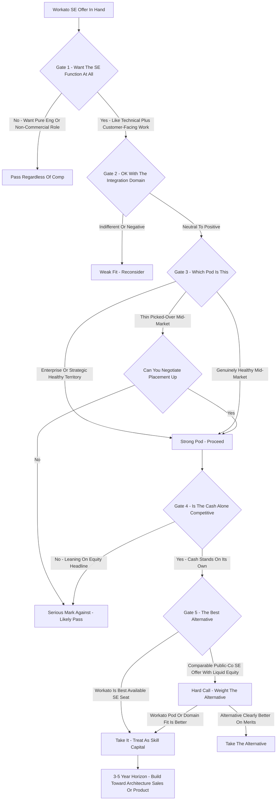

### Direct Answer

A Workato Sales Engineer role in 2027 is **worth taking for most candidates who want an SE role at all -- but only as a deliberate skill-and-equity decision, never as a reflexive yes to a recognizable logo and a large OTE headline.** The Sales Engineer function itself is one of the best risk-adjusted jobs in B2B software, and Workato is a genuine, above-median iPaaS leader -- but whether the seat is good *for your career specifically* depends entirely on the pod you land in, the package you negotiate, and the three-to-five-year skill trajectory you commit to.

**TL;DR**

- **The function beats the company in importance.** The Sales Engineer (SE) role is durable, portable, well-compensated, and a hub into architecture, sales leadership, product, and executive tracks. Evaluate it first; Workato is the smaller, more reversible part of the bet.
- **Workato is a real category leader.** Founded 2013, last priced at a **$5.7B valuation in its 2021 Series E**, an estimated **$250M-$400M ARR**, **1,200-plus prebuilt connectors**, roughly **11,000-17,000 customers**, and a 2024 Agentic automation platform that positions it as AI-native rather than AI-displaced.
- **2027 SE on-target earnings** run roughly **$175K-$280K Mid-Market**, **$225K-$350K Enterprise**, and **$280K-$420K Strategic**, with strong performers in good deal years clearing **$400K-$600K**.
- **The honest caveats are real.** Workato is a late-stage private company with no published IPO timeline, a 2021-peak valuation that may need to reset, and a crowded competitive front -- MuleSoft, Boomi, Microsoft Power Automate, Tray.ai, n8n, Celigo, Zapier.
- **Decision rule:** take the seat if you want integration-domain depth, can confirm an Enterprise or Strategic pod, negotiate the equity refresh and base-variable split on purpose, and have a multi-year horizon. Slow down if you hold a comparable SE offer at a profitable public leader -- Datadog (NASDAQ: DDOG), Snowflake (NYSE: SNOW), MongoDB (NASDAQ: MDB), ServiceNow (NYSE: NOW), CrowdStrike (NASDAQ: CRWD) -- because those carry liquid equity and more durable moats.

## 1. First Principle: Evaluate The Function Before The Company

The most common mistake a candidate makes when a "Workato Sales Engineer" offer lands is treating it as a question about Workato. It is mostly a question about the Sales Engineer function -- because the function is the larger, more durable part of the career bet, and the employer is the smaller, more replaceable part.

### 1.1 What A Sales Engineer Actually Does

**A Sales Engineer is the technical half of an enterprise software sales motion.** The role also travels under the names Solutions Engineer, Solutions Consultant, Pre-Sales Engineer, and Sales Consultant. The Account Executive (AE) owns the relationship, the commercial negotiation, the procurement choreography, and ultimately the booked number. The Sales Engineer owns technical credibility:

- **Building and running the tailored demo** mapped to the prospect's actual stack rather than a generic script.
- **Scoping and frequently hand-building the proof-of-concept (POC)** that proves the product works against the buyer's real data and systems.
- **Answering the hard architecture, security, governance, scale, and total-cost questions** from the prospect's own engineers and IT leaders.
- **Translating between business intent and technical reality** so the buyer's decision is grounded rather than hopeful.

The SE is the person the prospect's technical staff trusts -- or does not -- and that trust is what de-risks a six- or seven-figure deal.

### 1.2 Why The SE Skill Set Compounds

**The SE skill set is unusually portable and unusually compounding.** You build product depth, domain knowledge in a category, the ability to run a room full of skeptical engineers, commercial instinct for how deals are won and lost, and a network of AEs, partners, and customers -- and almost none of it is Workato-specific. If Workato stalls, is acquired, or simply turns out to be the wrong fit, an SE with two or three strong years can move to nearly any other enterprise software company in a comparable or better seat.

### 1.3 The Correct Framing For The Candidate

**You are not betting your career on Workato.** You are betting a few years of it on the SE function -- which is a good bet -- and choosing Workato as the vehicle, which is a separate, smaller, and more reversible decision. Get that framing right and the rest of the analysis falls into place; get it wrong and you will over-weight the logo and under-weight the things that actually determine the outcome.

| Layer Of The Bet | Size | Reversibility | Verdict |
|---|---|---|---|
| The SE function | Large -- the bulk of the career value | Hard to reverse; it is the skill foundation | Excellent bet |
| The integration domain | Medium -- shapes which skills compound | Reversible across vendors | Good, neutral-to-positive needed |
| The employer (Workato) | Smaller -- one vehicle among many | Highly reversible after 2-3 years | Above-median, conditional |
| The specific pod | Decisive for the lived experience | Negotiable before signing, hard after | The single biggest controllable variable |

This entry expands on the function-versus-employer distinction explored in the broader pre-sales literature (q1897), and complements the structural shift behind companies hiring SEs even as they trim AE headcount (q1482).

## 2. What You Are Actually Joining: Workato The Company In 2027

A candidate should understand exactly what Workato is, where it sits, and what its risk profile looks like before weighing the offer.

### 2.1 Origins And The Low-Code Wedge

**Workato was founded in 2013** by Vijay Tella, Gautham Viswanathan, and Harish Shetty, and built its position on a low-code, recipe-based automation model. The deliberate design choice that defined the company was making the platform usable by technically-minded business operators -- revenue operations, finance, HR, and IT analysts -- not only by integration developers. That wedge let Workato land inside business teams rather than only in central engineering, which is a structurally favorable place to expand from.

### 2.2 Funding, Valuation, And Scale

**Workato's last priced round was a Series E in November 2021 at a $5.7B valuation**, with Battery Ventures and Insight Partners leading and Altimeter and Tiger Global participating. That round was raised at the absolute peak of the 2021 software-multiple environment -- a fact that matters enormously for the equity discussion later. As a private company Workato does not publish financials, but credible external estimates put the picture roughly as follows:

| Workato Metric | Estimate / Fact | Source Confidence |
|---|---|---|
| Founded | 2013 | High -- public record |
| Last priced round | Series E, Nov 2021, ~$200M raised | High -- public record |
| Valuation at last round | ~$5.7B | High -- public record |
| Estimated ARR (mid-2020s) | ~$250M-$400M | Medium -- third-party estimate |
| Customers | ~11,000-17,000 | Medium -- varies by counting method |
| Prebuilt connectors | 1,200-plus | High -- vendor-published |
| IPO status as of 2027 | Still private, no published timeline | High -- public record |

### 2.3 The Agentic Bet

**The strategically important move for a 2027 candidate is the 2024 launch of Workato's Agentic automation platform** -- an explicit bet that the company can ride the AI-agent wave rather than be flattened by it. By positioning its connectors, governance layer, and orchestration engine as the trusted execution substrate that AI agents need to actually do things inside enterprise systems, Workato is reframing itself from "connector catalog" to "governed automation infrastructure." Whether that bet fully pays off is unknowable, but it tells a candidate the company is not standing still. The investor-side debate over whether a larger platform should absorb Workato to accelerate exactly this strategy is treated separately (q1912) and (q1657).

What you are joining, then, is a well-funded, well-regarded, still-private scale-up that is a real leader in a real category -- and also a company with the specific risk profile of a 2021-peak-valuation late-stage private company that has not yet had a liquidity event. Both halves of that sentence are true, and both belong in the decision.

## 3. The iPaaS Category In 2027: Real Demand, Crowded Supply

A Workato SE sells inside the integration platform as a service (iPaaS) category, and the health of that category is part of the career bet.

### 3.1 The Demand Side Is Structural

**The underlying need is structural and growing.** Every enterprise runs dozens to hundreds of SaaS applications, databases, and internal systems, and the work of making them talk to each other -- moving data, triggering workflows, keeping records in sync, automating cross-system processes -- never goes away; it compounds as application sprawl grows. iPaaS is not a fad category.

### 3.2 The Supply Side Is Contested

**The supply side is genuinely crowded, and it is mid-transition.** On one flank sit incumbents with distribution muscle. On another sit newer, AI-forward or developer-forward challengers. Running underneath all of it is the structural question every iPaaS company now has to answer: as large language models and AI agents get better at reading APIs, generating integration code, and orchestrating tasks, does the value of a curated connector library and a visual recipe builder erode?

| Competitor Group | Players | The Threat They Pose |
|---|---|---|
| Distribution incumbents | MuleSoft (Salesforce -- NYSE: CRM), Boomi (PE-owned), Microsoft Power Automate (NASDAQ: MSFT) | Bundling and installed-base gravity |
| Data-flavored | SnapLogic, Informatica (NYSE: INFA) | Compete in data-engineering-heavy deals |
| Modern / AI-forward | Tray.ai, n8n (open-source) | Developer-forward, fast-adopted, AI-native |
| Up-from-below | Celigo, Zapier, Make | Push upmarket from SMB and mid-market |

### 3.3 What The Category Health Means For A Candidate

**The honest read for 2027 is that the category is healthy in demand but contested in supply.** The winners will be the platforms that successfully reframe themselves as the governed, observable, enterprise-grade execution layer for AI-driven automation rather than just a connector catalog. For a candidate this means the category is a fine place to build a career -- the skills transfer across every vendor in it -- but it is not a sleepy monopoly category, and Workato has to keep winning. The competitive dynamics specific to Workato's defensive posture are detailed separately (q1893), and the broader question of fixing a slowing iPaaS revenue trajectory is examined in adjacent entries (q1382) and (q1384).

## 4. How Sales Engineer Pay Is Built And What Moves It

A candidate has to understand not just the headline OTE but how SE compensation is actually constructed, because the structure determines both the realistic take-home and the risk.

### 4.1 The Base-Plus-Variable Structure

**Sales Engineer pay is built on a base salary plus a variable component, and the split is the first thing to read.** A typical SE split runs somewhere between **75/25 and 85/15** base-to-variable -- meaningfully more base-weighted than an Account Executive, who often sits near 50/50, because the SE supports a portfolio of deals and AEs rather than owning a single number. That base weighting is one of the structural reasons the SE role is lower-variance than the AE role. The design tension between rewarding the SE fairly while keeping the AE accountable for the number is a genuine comp-design problem (q275) and (q209).

### 4.2 The 2027 OTE Bands By Segment

The 2027 on-target earnings bands, triangulated from compensation-data sources and segment norms, break down as follows:

| Segment | Typical Base/Variable Split | 2027 OTE Range | Strong-Year Total Cash |
|---|---|---|---|
| Mid-Market SE | 80/20 to 85/15 | $175,000-$280,000 | up to ~$340,000 |
| Enterprise SE | 75/25 to 80/20 | $225,000-$350,000 | up to ~$470,000 |
| Strategic / Major Accounts SE | 70/30 to 75/25 | $280,000-$420,000 | $400,000-$600,000 |

### 4.3 What Actually Moves An Individual's Number

**The things that move an individual's number within those bands** are not in the recruiter's email. They are: the segment and pod (the biggest single factor), the health of the territory and the AEs you are paired with, whether the comp plan carries accelerators and how attainable quota is, the base-variable split you negotiate, the equity grant size and refresh policy, and your level on the SE ladder. A candidate who fixates only on the OTE headline and ignores the split, the territory quality, and the equity terms is reading maybe half of the compensation picture -- and it is usually the half that is easiest to put in a recruiter's email and hardest to actually realize. The discipline of measuring SE contribution without reducing the role to a commodity is itself a live management problem (q238).

## 5. Benchmarking A Workato SE Offer Against The Alternatives

Compensation only means something in comparison, so a candidate should benchmark a Workato SE offer against the seats they could realistically hold instead.

### 5.1 The Cross-Employer Comparison

Across the B2B SaaS landscape in 2027, SE compensation at comparable companies and levels lands broadly in the same neighborhood -- this is a well-understood role with a fairly efficient labor market -- but the *composition and durability* of the package vary sharply.

| Employer | SE OTE Range (2027 est.) | Equity Liquidity | Category Moat |
|---|---|---|---|
| Datadog (NASDAQ: DDOG) | $230,000-$650,000 | Public, liquid | High |
| Snowflake (NYSE: SNOW) | $260,000-$600,000 | Public, liquid | High |
| MongoDB (NASDAQ: MDB) | $250,000-$520,000 | Public, liquid | High |
| ServiceNow (NYSE: NOW) | $230,000-$500,000 | Public, liquid | High |
| CrowdStrike (NASDAQ: CRWD) | $240,000-$560,000 | Public, liquid | High |
| MuleSoft (Salesforce -- NYSE: CRM) | $230,000-$470,000 | Public (via Salesforce) | Medium-High |
| Workato | $175,000-$420,000 | Private, illiquid | Medium |
| Boomi | $200,000-$390,000 | Private (PE-owned) | Medium |
| Celigo | $170,000-$330,000 | Private, illiquid | Medium-Low |
| Zapier | $170,000-$320,000 | Private, profitable | Medium |

### 5.2 The Equity Is The Part That Differs Most

**A Workato SE's cash OTE is competitive and overlaps the public-company range, but the equity is the part that differs most.** An SE at a profitable public leader gets restricted stock units (RSUs) worth approximately their stated value, sellable on a known vesting schedule -- the equity is real money on a known timeline. An SE at Workato gets private-company options or RSUs whose value is contingent on an IPO or acquisition that has no published timeline and whose 2021-vintage strike or valuation reference may sit above where a clean liquidity event would price.

### 5.3 What The Comparison Implies

**That does not make the Workato equity worthless** -- a good outcome is entirely possible -- but it makes it a bet rather than a paycheck, and a candidate comparing two offers with similar cash OTE should treat the public-company equity as worth more on a risk-adjusted basis. A useful mental discipline is to discount private-company equity by a meaningful factor -- many practitioners apply something in the range of a 40 to 70 percent haircut against the paper value, reflecting both the illiquidity and the genuine probability that a liquidity event prices below the last private mark. The exact number is a judgment call, but the principle is not: a dollar of liquid public RSU is worth more than a dollar of private option, and a candidate who treats them as equal is mispricing the offer.

None of this is a reason to reject Workato; it is the reason the honest verdict is "good, conditional" rather than "obvious yes." How an SE seat at a public data-infrastructure leader compares against a private iPaaS seat on the equity-durability axis is a recurring theme across the comparable-employer set (q1894).

## 6. Why The Pod Matters More Than The Logo

If a candidate remembers one operational thing from this entire analysis, it should be this: the pod you land in matters more than the company name on your badge.

### 6.1 Same Title, A Dozen Different Jobs

**A "Sales Engineer at Workato" is not one job -- it is a dozen different jobs** depending on which segment, which region, and which set of Account Executives you are assigned to. An SE in a healthy Enterprise pod, paired with two or three strong AEs working a territory with real pipeline, gets to run substantive technical evaluations, build genuine architecture credibility, influence large deals, hit accelerators, and accumulate the kind of war stories that make a resume. An SE dropped into a thin Mid-Market patch with churny AEs, small deals, and a picked-over territory spends the year running shallow demos, fighting for scraps of pipeline, missing variable comp through no fault of their own, and learning relatively little that compounds.

### 6.2 The Interview Is Your Diligence On The Pod

**The interview process should be treated as the candidate's own due diligence on the pod, not just the company's due diligence on the candidate.** A candidate should ask, directly and specifically:

- **Which segment is this role in** -- Mid-Market, Enterprise, or Strategic?
- **Which AEs would I support**, and what is their tenure and attainment history?
- **What is the state of the territory** -- greenfield, established, or rebuild?
- **How is the pipeline right now** relative to plan?
- **What does the SE-to-AE ratio look like** in this pod?
- **How has this specific team done against plan** the last few quarters?

### 6.3 A Great Pod Beats A Great Logo

**A great pod at a merely-good company beats a weak pod at a great company, every time** -- and a candidate who signs without confirming the pod has accepted a real chance of the bad version of the role. The answers to those pod questions predict the actual experience and the actual income far better than anything about Workato's ARR or valuation.

## 7. Negotiating The Offer: The Levers Candidates Forget

Most candidates negotiate the base salary, maybe push on the OTE, and stop -- leaving the most consequential levers untouched.

### 7.1 The Full Set Of Levers

A candidate evaluating a Workato SE offer should negotiate across the whole package, not just the headline number.

| Lever | Why It Matters | What To Ask |
|---|---|---|
| Base-variable split | More base = more income independent of territory performance | Can the split move toward 85/15? |
| Equity grant size | At a private company, this is the lottery ticket | Share count, implied dollar value, strike price |
| Equity refresh policy | The most-forgotten lever; absent it, comp shrinks by year three | When do refreshes happen and what size? |
| Level and title | SE vs Senior SE vs Principal SE affects comp and next-move speed | Can experience support a higher level? |
| Segment placement | Enterprise placement is worth more than a base bump | Can Mid-Market be moved to Enterprise? |
| Ramp guarantee | Protects variable income during slow first quarters | Variable paid at target during ramp? |
| Accelerators and quota | Determines overperformance upside and realism | Quota history, attainability, accelerator structure |

### 7.2 The Equity Refresh Is The Quiet One

**The equity refresh policy is the lever almost everyone forgets.** An initial four-year grant means that by year three you are "vesting down" -- your annual equity income is declining -- and if there is no refresh policy, your total comp quietly shrinks even as you get better at the job. Ask explicitly: what is the refresh policy, when do refreshes happen, and what do they typically look like?

### 7.3 Negotiate The Durable Value, Not Just The Number

**A candidate who negotiates only base salary is leaving the equity refresh, the segment, the level, and the ramp on the table** -- and those are where the durable value lives.

A second principle worth internalizing: negotiate from information, not from nerve. Before the offer conversation, a candidate should have triangulated the realistic comp band for the segment and level from at least two crowdsourced compensation sources, and should know which one or two levers matter most for their own situation -- stability-oriented candidates push the split and the ramp guarantee, upside-oriented candidates push the equity grant and accelerators. Asking for everything dilutes the ask; asking precisely for the two or three things that genuinely move the candidate's outcome, with a reason attached to each, is far more likely to land. The full negotiation playbook for base, variable, and equity is its own deep dive (q1889).

## 8. The IPO Question And The 2021 Valuation

The equity in a Workato offer is the part of the package a candidate is least equipped to evaluate and the part that carries the most uncertainty, so it deserves direct treatment.

### 8.1 The Valuation Overhang

**Workato's last priced round was the 2021 Series E at a $5.7B valuation**, raised at the high-water mark of software valuations. In the years since, the public software multiple environment compressed substantially, and many companies that raised at 2021 peaks have either raised later rounds at flat or lower valuations, sold at a discount to their last private mark, or simply waited -- staying private and hoping to grow into the old valuation rather than crystallize a markdown.

### 8.2 The Specific Risk To An Employee

For an employee with options or RSUs, this creates a specific risk: the value of your equity depends on a future liquidity event, and that event may price the company at, below, or above the 2021 reference.

| Equity Instrument | Best Case | Realistic Risk |
|---|---|---|
| Stock options (with strike) | Liquidity event well above strike -> meaningful gain | Event below strike -> underwater or modestly valuable |
| RSUs | Value at almost any positive outcome | Magnitude uncertain, timing unknown |
| Secondary sale opportunity | Partial liquidity before IPO | May not be offered; often discounted |

### 8.3 Treat It As A Call Option

**The right way to handle the equity is not to assume it is worthless and not to assume it is worth its paper value, but to treat it as a genuine call option with unknown timing** -- potentially valuable, possibly very valuable, but not bankable, and worth materially less on a risk-adjusted basis than the same dollar figure in liquid public-company RSUs. Practically: value the cash compensation as the real, reliable part of the offer; treat the equity as upside; ask the hard questions about grant size, strike, 409A, refresh, and any secondary-sale opportunities; and do not let an impressive-sounding equity headline paper over a merely-average cash package.

## 9. AI And The Sales Engineer Role: A Tailwind If You Adapt

The reasonable fear a candidate brings to any 2027 tech-career decision is AI displacement, and it deserves an honest answer rather than reassurance.

### 9.1 What AI Genuinely Automates

**AI tooling genuinely automates pieces of what an SE used to do by hand:** generating first-draft demo scripts, drafting integration code and recipes, producing responses to security questionnaires and RFPs, summarizing discovery calls, and building boilerplate POC scaffolding. An SE who defined their value as "the person who can build the demo" is partially automatable.

### 9.2 What AI Does Not Replace

**But that was never where the durable value of the role lived.** The durable value is in the parts AI does not replace:

- **Earning the trust of a skeptical room** of the prospect's own engineers.
- **Reading the political and technical landscape** of a buying organization.
- **Knowing which objection is the real objection** and which is theater.
- **Designing an evaluation the prospect's team will actually believe.**
- **Translating between business intent and technical reality under pressure.**

Those are human, contextual, relationship-bound skills, and AI raises rather than lowers their value by stripping away the lower-skill scaffolding work that used to consume an SE's time.

### 9.3 The Workato-Specific Layer

**For Workato specifically there is an additional layer:** the company sells automation, including AI-agent automation, so a Workato SE works at the intersection of the AI wave rather than in its path -- the product itself is part of the answer to "what runs the AI agents safely in an enterprise." When a prospect asks how they should govern and orchestrate the AI agents they are building, a Workato SE is selling the answer rather than defending against the question -- a structurally favorable position that an SE at a company whose product AI threatens does not enjoy. The SE who uses AI to do the rote work in a quarter of the time and reinvests that time in deeper discovery becomes more productive and more valuable; the SE who refuses to adopt the tooling is exposed.

There is also a hiring-market consequence worth naming. As AI compresses the mechanical, demo-building portion of the SE job, employers increasingly value the consultative, architecture-credibility portion -- which means the bar for the role rises and the comp for genuinely skilled SEs holds or climbs even as the headcount mix shifts. A candidate who builds the AI-resistant skills deliberately is positioning into the part of the role that is becoming *more* scarce, not less. Net: AI is a reason to develop the role deliberately, not a reason to avoid it.

## 10. The Competitive Front A Workato SE Argues Against

Part of evaluating an SE seat is understanding who you will be selling against, because the competitive dynamic shapes the day-to-day difficulty of the job and the long-term position of the employer.

### 10.1 The Incumbents

**A Workato SE most often counters distribution-heavy incumbents.** MuleSoft, owned by Salesforce (NYSE: CRM), has deep distribution into the Salesforce installed base and a strong story for Salesforce-centric shops -- the SE counters on Workato's broader, less Salesforce-gravity-bound positioning and faster time-to-value for business teams. The state of MuleSoft inside Salesforce is itself a watched question (q1526). Boomi, now private under Francisco Partners and TPG, competes hard on price and breadth -- the SE counters on usability and the agentic-automation story.

### 10.2 The Bundled Threat

**Microsoft Power Automate is the genuinely dangerous competitor in many deals** because it is bundled into Microsoft 365 and Power Platform and is therefore effectively free-at-the-margin for huge numbers of organizations. The SE has to make the case that Workato's governance, connector depth, and enterprise-grade orchestration are worth paying for over the bundled option.

### 10.3 The Modern Flank

**On the newer, developer-forward flank sit Tray.ai and n8n** (the latter open-source and rapidly adopted by technical teams), with Celigo in the mid-market, SnapLogic and Informatica in the data-heavier deals, and Zapier pushing up from below.

| Competitor | Where It Wins | The SE Counter-Argument |
|---|---|---|
| MuleSoft | Salesforce-centric estates | Broader positioning, faster business-team time-to-value |
| Boomi | Price-sensitive, breadth-focused deals | Usability, agentic-automation roadmap |
| Microsoft Power Automate | Microsoft 365 / Power Platform shops | Governance, connector depth, enterprise orchestration |
| Tray.ai / n8n | Developer-forward technical teams | Enterprise-grade governance and support |
| Celigo / Zapier | Mid-market and up-from-SMB | Scale, observability, security posture |

**The honest implication for a candidate:** this is a competitive, knife-fight category, which is harder than selling a clear monopoly product -- but it is also a category where a skilled SE's technical credibility genuinely swings deals, which makes the role more substantive and the skill-building more real.

## 11. The Product And Why It Shapes The SE Experience

A candidate should understand the product itself, because what an SE sells day to day shapes whether the job is good.

### 11.1 The Recipe-Based Core

**Workato's core is a recipe-based automation engine:** an SE-or-builder composes "recipes" -- trigger-and-action workflows -- that connect applications through the platform's library of more than 1,200 prebuilt connectors, with the platform handling authentication, data mapping, error handling, scheduling, and monitoring. The deliberate design choice that defined the company is the low-code abstraction: the platform is usable by a technically-minded revenue operations or finance analyst, not only by an integration developer.

### 11.2 The Enterprise-Grade Layers

**On top of that core sit the enterprise-grade layers an SE has to be able to defend in a technical evaluation** -- governance and access controls, environment management, observability and logging, and the security and compliance posture that an enterprise architect will interrogate hard. The 2024 Agentic automation platform extends the model toward AI, positioning the connector library and orchestration engine as the governed execution substrate that AI agents call to actually do things in enterprise systems, with the platform providing the guardrails.

### 11.3 Why It Makes The Job Good

**A Workato SE gets to demo a product that is genuinely capable and genuinely differentiated on usability**, which makes the job more satisfying than selling a weak or undifferentiated product -- but the SE also has to be technically fluent enough to win the architecture conversation against incumbents, because the low-code positioning invites the "is this enterprise-grade" objection. The product is a real asset for the SE, not a liability, but it is a product that has to be sold on substance. The competitive contrast with newer agentic-automation entrants is examined separately (q1872).

## 12. The SE-To-AE Ratio And Pod Economics

One specific operational number deserves its own treatment because it quietly determines the quality of the job: the SE-to-AE ratio and the broader economics of the pod.

### 12.1 What The Ratio Does

**The SE-to-AE ratio is how many Account Executives each Sales Engineer supports.** A ratio of roughly one SE per two-to-three AEs is common and workable. When the ratio stretches -- one SE supporting four, five, or more AEs -- the SE is spread thin, cannot go deep on any single deal, ends up reactive rather than strategic, and both the experience and the technical-close quality degrade. When the ratio is tighter -- one SE per one-to-two AEs in a high-touch Strategic motion -- the SE can go deep, build real architecture relationships, and influence each deal substantively.

### 12.2 Reading The Pod Economics

The pod economics that interact with the ratio: average deal size, the number of active opportunities, the collective quota, and historical attainment. A candidate evaluating an offer should ask for these specifics.

| Pod Economics Signal | Healthy Pattern | Warning Pattern |
|---|---|---|
| SE-to-AE ratio | ~1 SE per 2-3 AEs | 1 SE per 4+ AEs (spread thin) |
| AE tenure and attainment | Mixed tenure, most at or near quota | High churn, most AEs underwater |
| Territory state | Greenfield or healthy established | Picked-over, repeatedly re-orged |
| Pipeline vs plan | At or above plan | Persistently thin |
| Average deal size | Segment-appropriate and stable | Shrinking or erratic |
| Comp plan | Clear quota, real accelerators | Murky crediting, no accelerators |

### 12.3 Push On The Numbers Before Joining

**The reason to push on these numbers in the interview process rather than after joining:** they are the actual determinants of whether the OTE on the offer letter is realistic and whether the two-or-three years will compound skill or burn time. A recruiter sells the OTE headline; the pod economics decide whether it is real.

One practical tactic: ask to speak with a current SE in the exact pod you would join, not just the hiring manager. A hiring manager has an incentive to fill the seat; a peer SE who is one quarter into the same territory will, if asked specifically and respectfully, give a far more honest read on pipeline quality, AE strength, the realism of the quota, and whether variable comp is actually landing. If the hiring team will not arrange that conversation, that refusal is itself a data point worth weighing. A candidate who treats the interview loop as a two-way diligence process -- and who walks away from a pod that cannot withstand specific questions -- is exercising exactly the judgment the role itself rewards.

## 13. Career Trajectories Out Of A Workato SE Seat

The right question is not only "is this a good seat" but "where does this seat lead," and a Workato SE role opens several genuinely good paths.

### 13.1 The Exit Map

| Trajectory | What It Looks Like | Why The SE Seat Feeds It |
|---|---|---|
| Up the SE ladder | Senior SE, Principal SE, SE management, VP of Pre-Sales | The natural, well-compensated leadership path |
| Solutions Architecture / Pro Services | Deeper post-sale or delivery-focused technical track | Builds on the SE's architecture credibility |
| Sales / AE leadership | AE seat or sales management | SE understands technical and commercial sides |
| Product Management | SE-to-PM move at the SE's own company or larger one | SE hears exactly what customers need daily |
| Customer-facing executive | Field CTO, technical evangelist, head of Solutions Engineering | Combines technical depth with executive presence |
| Lateral to a public leader | SE seat at Datadog, Snowflake, MongoDB with liquid equity | Two-three strong years make a candidate highly hireable |

### 13.2 The Seat Is A Hub, Not A Destination

**The strategic point for a candidate: the SE seat is not a terminal role, it is a hub.** It connects to architecture, to sales leadership, to product, and to executive tracks, and it does so at a healthy compensation level the whole way. That optionality is a large part of why the function is a good career bet -- and Workato, as a real company in a real category, is a credible place to build the two or three years that unlock all of those doors.

## 14. A Five-Gate Decision Framework

A candidate should run a structured decision rather than going on gut feel, because this offer fits some people clearly and misfits others. Work through these gates in order.

### 14.1 The Five Gates

- **Gate 1 -- the function.** Do you want to be a Sales Engineer at all? Do you like the blend of technical depth and customer-facing, deal-linked work? If the honest answer is no, no Workato pod fixes that.
- **Gate 2 -- the domain.** Do you want integration and automation as your domain, or are you indifferent? You do not need to love iPaaS, but you should be neutral-to-positive, because domain depth is a large part of what compounds.
- **Gate 3 -- the pod.** Can you confirm, before accepting, that the specific pod is Enterprise or Strategic (or a genuinely healthy Mid-Market one) with credible AEs and a real territory?
- **Gate 4 -- the package.** Can you negotiate the base-variable split, the equity grant and refresh, the level, and a ramp guarantee into something you would be satisfied with even if the equity never pays off?
- **Gate 5 -- the alternative.** What else is on the table? A comparable-level SE offer at a profitable public leader with liquid equity deserves real weight.

### 14.2 The Decision Diagram

### 14.3 What The Framework Produces

**The framework's job is to convert "a recruiter offered me a job at a company I have heard of" into a deliberate decision** about function, domain, pod, package, and alternative. A candidate who runs it honestly will, in the large majority of cases, arrive at either a clear take or a clear "negotiate harder," with a clear walk reserved for genuine function mismatch or a clearly superior alternative.

## 15. Five Named Scenarios: How The Bet Plays Out

Concrete scenarios make the abstract decision tangible.

### 15.1 The Five Cases

- **Scenario one -- Anand, the deliberate Enterprise hire.** Comes in with integration-adjacent experience, negotiates into an Enterprise pod with two strong AEs, pushes the equity refresh question and gets a clear answer; within two years he is a Senior SE clearing the top of the Enterprise band, choosing between a Principal SE track and a Solutions Architecture move. The bet worked because he chose the pod and package on purpose.
- **Scenario two -- Brigitte, the cautionary tale.** Accepts a generic offer without asking which pod, lands in a thin, picked-over Mid-Market patch with churny AEs, misses variable comp two quarters running, learns little that compounds, and leaves after fourteen months mildly burned. Same company, same title as Anand, opposite outcome -- because she never did the pod diligence.
- **Scenario three -- Cheng, the comparison-shopper.** Holds a Workato Enterprise SE offer and a Datadog SE offer at a similar level, runs the five-gate framework, weights the liquid public equity and stronger moat, and takes Datadog -- a rational outcome of the framework, not a knock on Workato.
- **Scenario four -- Devika, leveraging the hub.** Joins Workato, builds two strong years in a healthy Strategic pod, then uses the credibility and customer network to move into Product Management at a larger company. The SE seat was the hub that opened the PM door.
- **Scenario five -- Emeka, equity-disappointed but career-ahead.** Takes a solid Workato SE seat, does well, but the liquidity event does not come on his timeline -- because he valued the cash as real and the equity as upside, he is not financially hurt, and the skills, comp, and network leave his career materially ahead.

### 15.2 What The Distribution Shows

**These five span the realistic distribution:** deliberate success, careless underperformance, rational competing-offer departure, the leverage-the-hub play, and the equity-disappoints-but-career-still-wins case. Four of the five are good or neutral outcomes, which is itself the honest summary of the bet.

| Scenario | Driver | Outcome |
|---|---|---|
| Anand | Deliberate pod and package choice | Strong -- Senior SE with optionality |
| Brigitte | No pod diligence | Poor -- mildly burned, low compounding |
| Cheng | Ran the framework, took the alternative | Rational -- better risk-adjusted seat |
| Devika | Used the seat as a hub | Strong -- moved into Product Management |
| Emeka | Valued cash as real, equity as upside | Neutral-positive -- career ahead regardless |

## 16. The Day-In-The-Life Reality Of The Role

A candidate should know what the job actually feels like week to week, because the lived experience is a real part of whether it is good for them.

### 16.1 The Three-Part Rhythm

**An SE's week is a blend of preparation, performance, and follow-through.**

- **Preparation** -- researching a prospect's stack before a call, building or customizing a demo environment, scoping a POC, and getting smart on the specific technical objections likely to come up.
- **Performance** -- the customer-facing time: discovery calls that surface real requirements, tailored demos, deep-dive sessions with the prospect's engineers, and the high-stakes moments where a hard security or scale question has to be answered credibly in the room.
- **Follow-through** -- building the POC, responding to technical questionnaires, supporting the AE through procurement's technical due diligence, and handing off cleanly to post-sale teams when a deal closes.

### 16.2 The Emotional Texture

**The rhythm is deal-driven and somewhat unpredictable** -- a hot deal compresses a week, a quarter-end pushes intensity up -- and the SE supports a portfolio of deals and AEs simultaneously, which means context-switching is constant. There is real satisfaction in winning a technical evaluation and being the trusted voice in a skeptical room; and real friction in deals that die for non-technical reasons, in supporting a weak AE, and in quarter-end pressure and travel.

### 16.3 The Fit Question

**It is a customer-facing, performance-inflected, intellectually substantive job** -- not a heads-down engineering role and not a pure relationship-sales role, but the hybrid in between. A candidate who is energized by that hybrid will find the role genuinely good; one who wanted either pure code or pure relationship-selling may find it an awkward fit, and no comp number fully compensates for doing a job that does not fit.

A useful self-test for the fit question: think back to a time you had to explain something technical to a skeptical audience whose trust you had not yet earned, under time pressure, with a real outcome riding on it. If the memory of that situation reads as energizing -- a problem you wanted to win -- the SE function probably fits. If it reads as draining, something you would rather have avoided, the role's central activity is one you will be doing several times a week, and a generous OTE will not change how that feels. The honest version of the day-in-the-life assessment is not "could I do this job" but "is this the texture of work I want to spend the next three to five years inside."

## 17. Geography, Remote Work, And The Segment-Location Interaction

Where a candidate sits geographically interacts with the SE role in ways worth thinking through.

### 17.1 Work Models By Segment

**SE roles in 2027 span fully remote, hybrid, and field-based depending on the segment and the company's model.** Mid-Market SE roles are often more remote and lower-travel, working a territory largely by video. Enterprise and especially Strategic SE roles frequently carry more travel and more in-person, on-site time -- large deals are still often won partly in the room, and the highest-comp segments tend to be the most travel-intensive.

| Segment | Typical Work Model | Travel Intensity |
|---|---|---|
| Mid-Market SE | Mostly remote, video-led | Low |
| Enterprise SE | Hybrid, periodic on-site | Moderate |
| Strategic SE | Field-heavy, frequent on-site | High |

### 17.2 The Trade-Off The Candidate Owns

**A candidate should be clear-eyed about which they are signing up for**, because a Strategic SE seat with heavy travel is a different life than a remote Mid-Market one, even at the same employer. The practical guidance: treat the work model, the travel expectation, and the territory geography as explicit parts of the offer to understand and, where possible, negotiate -- not as fixed background conditions. A great pod in the wrong work model for your life is a worse fit than a good pod in the right one.

## 18. Counter-Case: Why A Workato SE Role Might Be The Wrong Move

The analysis above concludes the role is a good conditional bet -- but a serious candidate should stress-test that conclusion against the reasons it could be the wrong move. There are real ones.

### 18.1 The Equity And Company Counters

- **Counter 1 -- the equity is a bet, not a paycheck.** Workato's 2021 Series E priced the company at $5.7B at the peak of the cycle. A liquidity event could price below that mark, leaving options underwhelming or near-underwater. A candidate who counts the equity headline as real compensation is overvaluing the offer.
- **Counter 2 -- there is no IPO timeline.** Late-stage private companies can stay private for many years. The illiquidity is open-ended, and it sits squarely inside the candidate's career horizon.
- **Counter 3 -- the category is crowded and contested.** A Workato SE sells against MuleSoft's Salesforce distribution, Boomi's price and breadth, Microsoft's free-at-the-margin bundling, and a flank of AI-forward and open-source challengers.
- **Counter 4 -- the AI-disruption question is genuinely open.** Connector-based iPaaS built its moat on having the most integrations. As AI agents get better at reading APIs, that moat could erode. The Agentic platform is a credible response to a real threat, not a settled outcome.

### 18.2 The Role And Pod Counters

- **Counter 5 -- the pod can quietly ruin the experience.** An SE in a thin, picked-over Mid-Market patch with weak AEs has a materially worse job than one in a healthy Enterprise pod. If a candidate cannot confirm and negotiate the pod, they accept a real chance of the bad version.
- **Counter 6 -- the cash package may be merely average dressed up by the equity.** Some offers lean on an impressive equity headline to disguise a cash package that is only at or slightly below market.
- **Counter 7 -- a better risk-adjusted alternative may be sitting right there.** SE roles at Datadog, Snowflake, MongoDB, ServiceNow, or CrowdStrike offer liquid public equity and more durable moats.
- **Counter 8 -- the SE function itself may not fit the person.** A candidate who wants pure engineering, pure research, or a non-commercial role will find no Workato pod fixes that mismatch.

### 18.3 The Structural And Behavioral Counters

- **Counter 9 -- variable comp depends on people you do not control.** A strong SE paired with weak or churny AEs can miss variable comp through no fault of their own.
- **Counter 10 -- late-stage private companies carry org-health risk.** Many 2021-vintage companies went through layoffs, leadership churn, and morale damage during the mid-2020s software reset.
- **Counter 11 -- the travel and work-model reality may not fit.** The highest-comp Enterprise and Strategic seats often carry the most travel and in-person time.
- **Counter 12 -- "a company I have heard of offered me a job" is not a strategy.** The single biggest risk is accepting because the brand is recognizable and the OTE sounds good, without running the function-domain-pod-package-alternative analysis.

| Counter | Severity If True | Mitigation |
|---|---|---|
| Equity is a bet | High | Value cash as real, equity as upside |
| No IPO timeline | Medium-High | Set a 3-5 year horizon independent of liquidity |
| Crowded category | Medium | Skill transfers across all vendors |
| AI disruption | Medium | The role's human core is AI-resistant |
| Bad pod | High | Confirm and negotiate the pod before signing |
| Average cash hidden by equity | High | Insist the cash stand on its own |

**The honest verdict on the counter-case:** the role is not a trap and the company is not weak -- but the gap between the deliberate version of this bet, which is genuinely good, and the undeliberate version, which is mediocre at the same company with the same title, is wide.

## 19. The Honest Verdict

Pulling it together: a Workato Sales Engineer role in 2027 is a good career bet for most candidates who would want an SE role at all -- but it is a *conditional* good bet, and the conditions are the whole point.

### 19.1 What Is Genuinely Strong

**The Sales Engineer function is excellent:** low-variance relative to pure sales, high-skill, durably and portably valuable, well-compensated, and a hub that connects to architecture, sales leadership, product, and executive tracks. **Workato as an employer is genuinely above-median:** a real iPaaS leader, a credible product, a credible AI-agent story, a strong brand in its category, and a competitive cash compensation package.

### 19.2 What Must Be Weighed Honestly

**The honest caveats are equally real:** Workato is a late-stage private company with no published IPO timeline, carrying a 2021-peak valuation that may need to reset before any liquidity event, in a crowded and contested category, facing the open structural question of whether AI agents eventually erode connector-based integration's moat. None of that makes it a bad choice; it makes it a choice that has to be made deliberately.

### 19.3 The Final Rule

**The candidate who lands a healthy Enterprise or Strategic pod, negotiates the package on purpose, values the cash as real and the equity as upside, and treats the seat as two-to-five years of compounding skill capital is making a strong move with excellent downside protection** -- because even in the scenario where the equity disappoints, the skills, the comp, and the network leave their career materially ahead. The candidate who accepts a generic offer without checking the pod, leans on an equity headline they have not interrogated, and has no clear horizon is making a weaker move at the same company with the same title.

So the verdict is not "yes" or "no" -- it is "yes, if you make it a yes." The SE function is good for your career almost regardless. Whether the Workato seat specifically is good for your career depends on the pod, the package, and the trajectory you negotiate going in -- and a candidate who runs that decision deliberately will, in the large majority of cases, find it a sound and even excellent move.

## 20. Key Numbers At A Glance

### 20.1 Workato And Compensation Snapshot

| Item | Value |
|---|---|
| Workato founded | 2013 |
| Last priced round | Series E, Nov 2021, ~$200M raised |
| Valuation at last round | ~$5.7B |
| Estimated ARR | ~$250M-$400M (third-party estimate) |
| Customers | ~11,000-17,000 |
| Prebuilt connectors | 1,200-plus |
| Mid-Market SE OTE (2027) | $175,000-$280,000 |
| Enterprise SE OTE (2027) | $225,000-$350,000 |
| Strategic SE OTE (2027) | $280,000-$420,000 |
| Strong-year total cash (top performers) | $400,000-$600,000 |
| Typical base-to-variable split | 75/25 to 85/15 |
| Typical SE-to-AE ratio | ~1 SE per 2-3 AEs |
| Recommended commitment horizon | 3-5 years |

### 20.2 Decision Weighting

**The single biggest controllable variable is which pod the offer is for.** SE function quality, independent of employer, is high. Workato cash comp is middle-to-upper-middle of the SE market. Workato equity liquidity is medium -- private, illiquid, with a valuation overhang. Workato moat durability is medium -- leading but contested, in a mid-disruption category.

## Sources

1. **Workato -- Official Company Site, Product Documentation, and Newsroom** -- Primary source for product capability, connector count, the 2024 Agentic automation platform launch, and company milestones. https://www.workato.com
2. **Workato Series E Funding Announcement (November 2021)** -- Coverage of the ~$200M Series E at a $5.7B valuation led by Battery Ventures and Insight Partners, with Altimeter and Tiger Global participating.
3. **Crunchbase -- Workato Funding History and Investor Profile** -- Round-by-round funding history, investor list, and valuation timeline. https://www.crunchbase.com/organization/workato
4. **PitchBook -- Workato Private-Company Profile** -- Valuation, estimated revenue range, and investor data for the private company.
5. **Battery Ventures -- Portfolio and Investment Commentary on Workato** -- Lead-investor perspective on the iPaaS thesis and Workato's positioning. https://www.battery.com
6. **Insight Partners -- Portfolio Profile, Workato** -- Co-lead-investor portfolio context. https://www.insightpartners.com
7. **Gartner -- Magic Quadrant for Integration Platform as a Service (iPaaS)** -- Analyst positioning of Workato, MuleSoft, Boomi, Microsoft, SnapLogic, and others. https://www.gartner.com
8. **Forrester -- Integration Platforms and iPaaS Wave Research** -- Independent analyst evaluation of the integration-platform competitive field. https://www.forrester.com
9. **RepVue -- Workato Sales Org Ratings and Compensation Data** -- Crowdsourced sales-org ratings, quota-attainment signal, and OTE data for Workato and comparable employers. https://www.repvue.com
10. **Levels.fyi -- Sales Engineer and Solutions Engineer Compensation Benchmarks** -- Crowdsourced base, bonus, and equity data for SE roles across SaaS employers and levels. https://www.levels.fyi
11. **Glassdoor -- Workato Sales Engineer Reviews and Salary Data** -- Employee reviews and self-reported compensation for the SE role and the broader org. https://www.glassdoor.com
12. **US Bureau of Labor Statistics -- Sales Engineers Occupational Outlook** -- Employment outlook, median pay, and growth projection for the Sales Engineer occupation. https://www.bls.gov/ooh/sales/sales-engineers.htm
13. **Pavilion -- Go-To-Market and Revenue Leadership Community** -- Practitioner community data on SE career paths, comp structures, segment design, and the pre-sales function. https://www.joinpavilion.com
14. **PreSales Collective -- Sales Engineering Community Resources and Salary Surveys** -- Dedicated pre-sales community covering SE career development, comp benchmarks, and role trends. https://www.presalescollective.com
15. **MuleSoft (Salesforce) -- Product and Company Information** -- Competitive reference; Salesforce acquired MuleSoft in 2018 for ~$6.5B. https://www.mulesoft.com
16. **Boomi -- Company and Ownership Information** -- Competitive reference; Boomi was taken private by Francisco Partners and TPG in 2021. https://boomi.com
17. **Microsoft Power Automate / Power Platform Documentation** -- Competitive reference for the bundled Microsoft automation and integration offering. https://www.microsoft.com/power-platform
18. **Tray.ai -- Product and Company Information** -- Competitive reference in the modern, AI-forward iPaaS segment. https://tray.ai
19. **n8n -- Open-Source Workflow Automation Project** -- Competitive reference; fast-growing open-source automation platform. https://n8n.io
20. **Celigo -- Integration Platform** -- Competitive reference in the mid-market integration segment. https://www.celigo.com
21. **Zapier -- Company and Product Information** -- Competitive reference; SMB automation leader moving upmarket. https://zapier.com
22. **SnapLogic -- Intelligent Integration Platform** -- Competitive reference in the data-engineering-flavored part of the category. https://www.snaplogic.com
23. **Datadog -- Investor Relations and Careers** -- Comparable-employer reference for SE comp and moat-durability benchmarking. https://www.datadoghq.com
24. **Snowflake -- Investor Relations and Careers** -- Comparable-employer reference for SE comp and equity-liquidity benchmarking. https://www.snowflake.com
25. **MongoDB -- Investor Relations and Careers** -- Comparable-employer reference for SE comp benchmarking. https://www.mongodb.com
26. **ServiceNow -- Investor Relations and Careers** -- Comparable-employer reference for SE comp and enterprise-moat benchmarking. https://www.servicenow.com
27. **CrowdStrike -- Investor Relations and Careers** -- Comparable-employer reference for SE comp in security software. https://www.crowdstrike.com
28. **Carta -- Private-Company Equity, 409A Valuations, and Option Education** -- Reference for understanding strike price, 409A valuations, vesting, and equity-refresh dynamics at late-stage private companies. https://carta.com
29. **Holloway -- The Holloway Guide to Equity Compensation** -- Reference for evaluating private-company equity offers and liquidity-event risk.
30. **OpenView / SaaS Benchmarks Reports** -- Industry data on SaaS go-to-market structures, ramp, quota-attainment norms, and ARR ranges.
31. **Bessemer Venture Partners -- State of the Cloud Reports** -- Industry context on cloud software growth, valuations, and category dynamics. https://www.bvp.com
32. **TechCrunch and The Information -- Software Funding-Market and Valuation-Reset Coverage** -- Reporting on the post-2021 compression of software multiples and its effect on late-stage private companies.
33. **Blind -- Anonymous Professional Community, Workato and SE Threads** -- Imperfect but useful back-channel signal on org health, comp, and pre-sales culture. https://www.teamblind.com
34. **We The Sales Engineers -- Practitioner Podcast and Blog** -- Practitioner perspective on the day-to-day SE role and career trajectories. https://wethesalesengineers.com
35. **Gartner / IDC -- Enterprise Application Sprawl and Integration Demand Data** -- Reference for the structural demand driver behind iPaaS: growth in enterprise SaaS application counts.

## Related Pulse Library Entries

- **(q1897)** -- Is an Outreach Solutions Engineer role still good for my career in 2027? The closest sibling: the same career-evaluation question applied to a different SE seat.
- **(q1893)** -- How does Workato defend against Okta in 2027? The competitive-defense analysis behind the category-position section here.
- **(q1912)** -- Should ServiceNow acquire Workato in 2027? The acquisition scenario that bears directly on the IPO-versus-acquisition liquidity question for your equity.
- **(q1657)** -- Should ServiceNow acquire Workato to compete in iPaaS? A second take on the strategic-acquirer angle relevant to a candidate's liquidity outlook.
- **(q1382)** -- How would you fix Workato's revenue issues in 2026? Context on the company's growth trajectory, which shapes the pod-health diligence.
- **(q1872)** -- Workato vs 11x: which should you buy? Product and competitive context for the agentic-automation positioning a Workato SE sells.
- **(q1482)** -- Why is my company hiring Solutions Engineers but firing AEs? The structural shift that explains why the SE function is a strong bet.
- **(q209)** -- What is the right way to compensate sales engineers in a complex deal cycle? The comp-design backdrop behind the base-variable-split section.
- **(q275)** -- How do we design comp for deal teams where AE, SA, and SE all touch the deal? The deal-team comp context relevant to SE variable pay.
- **(q238)** -- How do you measure SE ROI without making them feel like commodities? The management-side view of the function this entry evaluates.
- **(q1894)** -- Is a Salesforce AE role still good for my career in 2027? A sibling career-evaluation entry for benchmarking against an AE seat at a public leader.
- **(q1526)** -- Is MuleSoft still growing or melting at Salesforce? Context on the chief incumbent competitor a Workato SE argues against.
