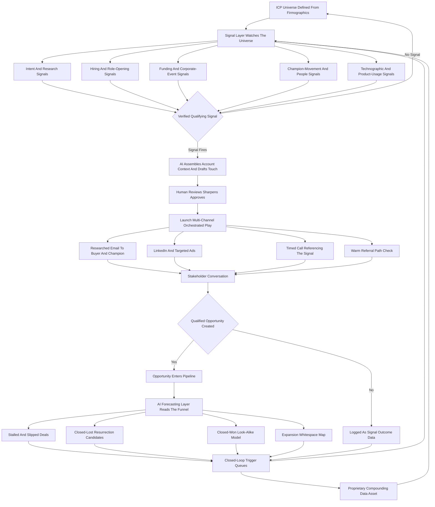

### Direct Answer

Nothing "replaces" cold outbound, because the question quietly assumes pipeline forecasting and pipeline generation are the same job — they are not. An AI agent getting genuinely reliable at forecasting (predicting what closes, when, for how much) does nothing to generation (creating net-new opportunities) except strip away the alibi that thin pipeline was a measurement error. What actually happens in 2027 is that cold outbound is **re-sequenced, re-staffed, re-priced, and re-fed**: it becomes a smaller-volume, larger-context, multi-threaded, signal-triggered precision motion — and the forecasting agent becomes one of its best fuel sources rather than its executioner.

**TL;DR:** Cold outbound is not dead in 2027 — it is demoted from a volume sport to a precision instrument. Five things move into the space the volume SDR machine vacated: **(1) signal-gated targeting**, where outreach fires only against accounts showing intent, hiring, funding, tech-install, champion-movement, or product-usage signals; **(2) AI-assembled context**, where an agent drafts genuinely researched first touches so 20 touches a day beat the old 150; **(3) orchestrated multi-channel plays**, where one verified signal launches a coordinated email-call-LinkedIn-ad-referral sequence; **(4) the closed loop**, where the forecasting agent becomes a generation *trigger source* — stalled deals, slipped commits, closed-won look-alikes, and expansion whitespace all become outbound queues; and **(5) a re-shaped org**, where a 25-40 person volume SDR floor compresses into 6-12 senior "pipeline engineers." The honest economics: a pre-2024 30-rep volume SDR org ran roughly **$3.0M-$3.8M fully loaded**; the 2027 equivalent is an **8-10 person signal-led team at $1.1M-$1.6M loaded plus a $130K-$260K tooling stack**, producing **10-30% more qualified pipeline at 4-9x the reply-to-meeting rate**. Three traps sink the transition: pointing agents at the same bad lists faster, cutting the SDR floor before the signal layer is wired, and mistaking a trustworthy forecast for a sufficient one — a perfect forecast of an empty pipeline is still an empty pipeline.

## Why The Question Contains Its Own Mistake

### 1.1 The False Equivalence Inside The Phrasing

The phrasing — "what replaces cold outbound if AI agents handle pipeline forecasting" — feels like clean cause-and-effect, but it smuggles in a false equivalence that has to be dismantled before anything useful can be said. **The hidden assumption is that cold outbound and pipeline forecasting are two points on a single line**, such that improving one mechanically retires the other. They are not on the same line at all. **Forecasting is a measurement and prediction discipline:** it takes the set of opportunities that already exist inside the CRM and estimates which will convert, on what date, at what amount, with what confidence. **Cold outbound is a creation discipline:** it takes the universe of companies that are not yet opportunities and attempts to convert some of them into opportunities. One reads the funnel; the other fills it.

### 1.2 What AI Forecasting Actually Changes

An AI agent becoming excellent at reading the funnel changes nothing structural about the need to fill it. **What it does change — and this is the genuinely important effect — is that it removes a comfortable excuse.** For years, revenue leaders could absorb a soft quarter by blaming "forecast accuracy," reorganizing the deal-review cadence, or buying another forecasting tool. When the forecasting agent is trustworthy to within a few points, that escape hatch closes. A reliable forecast of a thin pipeline simply tells the truth faster and more publicly: the problem was never that you could not *see* the pipeline, it was that there was not *enough* of it.

### 1.3 The Correct Reframe

So the correct reframe is that AI forecasting does not replace cold outbound — it **exposes** cold outbound, strips away the noise that hid its underperformance, and forces the org to rebuild generation as a deliberate, instrumented system rather than a volume reflex. The real 2027 question is not "what replaces cold outbound" but "what does cold outbound become once the org can no longer pretend a clean forecast is a full funnel." This entry is the long answer to that question, and it sits directly alongside the broader analysis in (q1873) and (q1899).

## What Cold Outbound Actually Was, Mechanically, Before The Shift

### 2.1 The Industrialized Activity Engine

To understand what changes, you have to be precise about what the legacy motion actually was, because nostalgia and contempt both blur it. **The pre-2024 volume outbound motion was an industrialized activity engine with a specific shape.** A sales development representative — the SDR or BDR — was handed a quota expressed in **activity and meetings**: a daily floor of dials, a daily floor of emails, a target number of accounts worked per quarter, and a booked-meeting number that rolled up to the account executive's pipeline coverage ratio.

### 2.2 The Firmographic List And The Sequencer

The list was built mostly on **firmographic filters** — industry, employee count, revenue band, geography, maybe a title list — pulled from a database like ZoomInfo or Apollo. The SDR loaded those contacts into a sequencer — Outreach, Salesloft, Apollo — and ran them through a fixed cadence of templated emails and calls. **Personalization, where it existed, was a merge field and a one-line "I saw you do X" opener.** The entire system was tuned on the assumption that **response rates were a fixed, low constant** — if 1-2% of cold emails generate a reply and a fraction of those become meetings, then the only lever is volume, so you hire more SDRs and send more.

### 2.3 Why It Worked, And Why That Was Always Fragile

This worked, genuinely, for a window of years, because inboxes were less saturated, spam filtering was cruder, buyers had not yet been trained to delete on sight, and deliverability was forgiving. **It was never elegant, but it was a predictable machine:** pour in headcount and tooling spend, get out a roughly proportional number of meetings. The machine did not break because AI forecasting arrived. It broke for its own reasons — and naming those reasons precisely is the next step, because they determine what the replacement has to fix.

| Volume Motion Attribute | Pre-2024 Reality | What Made It Fragile |
|---|---|---|
| Quota basis | Dials, emails, accounts touched | Measured activity, not outcomes |
| List construction | Firmographic filters from a bought DB | Same data everyone else bought |
| Personalization | Merge field + one-line opener | Recognizable as templated |
| Core lever | More headcount, more sends | Linear cost, sub-linear yield |
| Channel | Single-channel sequential streams | No reinforcement across touches |
| Success assumption | Reply rate is a fixed low constant | Constant collapsed below volume-math threshold |

## The Specific Reasons The Volume Machine Broke

### 3.1 Inbox Saturation And Buyer Training

The volume outbound motion did not decay for one reason; it decayed because several independent pressures compounded at once, and a replacement that only addresses one of them will fail. **First, inbox saturation and buyer training.** Every buyer persona worth selling to received the same templated sequences from dozens of vendors simultaneously; the rational buyer response was to stop reading cold email entirely, and they did. Reply rates that were once a low constant fell below the threshold where volume math works.

### 3.2 Deliverability Collapse

**Second, deliverability collapse.** Email providers and spam filters got dramatically better at detecting bulk, low-engagement sending; high-volume outbound from a domain now actively damages that domain's reputation. This means the volume motion is no longer merely ineffective — it is **self-harming**: it degrades the channel for the whole company, including marketing and customer success. Google's bulk-sender requirements formalized this shift, and a single careless campaign can poison a domain for months.

### 3.3 The Inverted Cost Structure

**Third, the cost structure inverted.** Loaded SDR cost rose while output per SDR fell, so the cost per qualified meeting climbed past the point where the unit economics held up against the deal sizes most companies actually close. A motion that depends on volume is brutally exposed when each unit of volume gets more expensive and less productive at the same time.

### 3.4 Commoditized And Decaying Data

**Fourth, the data got commoditized and then got worse.** Everyone bought the same contact databases, so everyone targeted the same lists with the same filters; the firmographic list stopped being a competitive asset, and the contact data decayed faster than it could be refreshed.

### 3.5 Measurement Got Honest

**Fifth, and this is the one that intersects with the question, measurement got honest.** As forecasting and revenue-intelligence tooling improved, leaders could finally see — cleanly, undeniably — that a large fraction of "pipeline" generated by volume outbound was junk: low-fit, low-intent opportunities that inflated coverage ratios and never converted. The volume machine had been partly graded on its own inflated output. When the grading got accurate, the machine's real productivity was revealed to be far lower than the activity dashboards suggested. **The replacement motion, therefore, has to fix targeting, deliverability, cost structure, data, and honesty all at once — which is why it is a system, not a single tactic.**

| Pressure | Mechanism Of Decay | What The Replacement Must Fix |
|---|---|---|
| Inbox saturation | Buyers trained to delete cold email | Make each touch genuinely relevant |
| Deliverability collapse | Bulk sending damages domain reputation | Lower volume, protect the channel |
| Inverted cost structure | Cost per meeting climbed past economics | Cut headcount cost, raise conversion |
| Commoditized data | Everyone targets the same lists | Build proprietary signal and outcome data |
| Honest measurement | Junk pipeline exposed as junk | Generate genuinely qualified pipeline |

## The Replacement Is A System, Not A Tactic — The Five Components

### 4.1 Not "Warm Outbound" — An Integrated System

What moves into the space the volume machine vacated is not "warm outbound" as a single new tactic; it is an integrated five-part system, and the parts only work together. **The volume motion treated outreach as a flow problem — maximize throughput — and the replacement treats it as a timing-and-context problem** — reach the right account, with the right reason, through the right channels, at the right moment, with the smallest number of touches that actually works.

### 4.2 The Five Components At A Glance

- **Component one — signal-gated targeting:** outbound no longer fires against a static firmographic list; it fires against accounts exhibiting a real-world signal of timing or fit.
- **Component two — AI-assembled context:** for each gated account, an agent assembles genuinely relevant research and drafts a first touch referencing a specific, true, current reason to reach out.
- **Component three — orchestrated multi-channel execution:** a single verified signal triggers a coordinated play across email, phone, LinkedIn, ads, and referral paths, multi-threaded by default.
- **Component four — the closed loop:** the forecasting and revenue-intelligence layer is wired back into generation as a trigger source.
- **Component five — the re-staffed org:** the people running this are fewer, more technical, and more senior than the volume SDR floor.

Each of the next five major sections takes one component in depth.

## Component One — Signal-Gated Targeting

### 5.1 Outbound Becomes A Triggered Event

The first and most load-bearing component is the gate: **outbound stops being something you do to a list and becomes something that is triggered by an observed condition.** The static firmographic list does not disappear — it still defines the universe of plausible accounts, the ideal-customer-profile boundary — but it stops being the thing you act on directly. Instead, a layer of signal sources continuously watches that universe for evidence that a specific account has a reason to hear from you *now*.

### 5.2 The Signal Categories That Matter In 2027

- **Intent signals:** an account is researching your category or a competitor, surfaced by providers like 6sense, Bombora, and Demandbase.
- **Hiring signals:** an account is opening roles that imply the problem you solve — a company hiring its first three RevOps people is about to buy RevOps tooling.
- **Funding and corporate-event signals:** a raise, an acquisition, an expansion, or an earnings comment, all of which change budget and priority.
- **Relationship and people signals:** a champion who bought your product at their last company just started a new role — among the highest-converting signals that exists, caught by tools like Common Room and UserGems.
- **Technographic signals:** an account just installed, or churned from, a complementary or competing tool.
- **Product-usage signals:** for PLG companies, a user inside a target account crossed an activation threshold, surfaced by Pocus or Default.

### 5.3 The Discipline The Gate Imposes

The discipline this imposes is severe and deliberate: **an account that shows no signal does not get worked, even if it fits the firmographic profile perfectly.** That feels wasteful to anyone trained on volume — "but it's a perfect-fit account, why aren't we touching it?" — and the answer is that a perfect-fit account with no timing signal is a coin flip burning a touch and a sliver of domain reputation, while a medium-fit account with three stacked signals is a real opportunity. The gate converts outbound from a probability game played at volume into a timing game played with precision. It is also the component most often skipped, because it requires real data plumbing before any rep can make a call — and skipping it is the single most common way the whole transition fails. The full operational build is its own discipline, explored in (q1898).

## Component Two — AI-Assembled Context And The Death Of The Template

### 6.1 The Valuable Version

Once the gate has selected an account and a reason, the second component does the work the SDR used to do badly: building genuine context for the first touch. **This is where AI agents are actually transformative — and it is worth being precise about *how*, because the lazy version is catastrophic.** The valuable version: an AI agent takes the gated account plus its triggering signal and assembles a real research brief — recent company news, the specific role and likely priorities of the target stakeholder, the inferred problem implied by the signal, relevant context about the buyer's industry moment, and a connection to a specific, true value hypothesis. It then drafts a first touch that a human reviews, sharpens, and sends.

### 6.2 Why 20 Touches Beat 150

The economic consequence is that **the per-touch quality ceiling rises enormously while the per-touch time cost falls**, which is what makes a 20-touch day outperform a 150-touch day: each of the 20 is a researched, specific, signal-anchored message, and the buyer can tell. A touch that references something real and current — that demonstrates the sender actually understands why *this* account *now* — reads like it was written by a person who did their homework, because in effect it was.

### 6.3 The Catastrophic Version

**The catastrophic version is the same tooling pointed at the same bad lists with no gate and no human review:** AI-generated "personalization" that is generically personalized — "I saw your company is in software and growing" — sent at even higher volume because the agent made it cheap. That does not beat the old template; it is *worse* than the old template, because it is recognizably machine-generated *and* high-volume, which trains buyers to distrust the channel even faster and triggers spam filtering even harder. **The rule for component two is that AI is a context-and-drafting multiplier gated by human judgment and the signal layer.** The template does not die because AI writes better templates; it dies because the unit of outreach stops being a template at all and becomes a researched, signal-anchored, human-approved argument. This is the same dynamic that reshaped sequencing tools, analyzed in (q1770).

| Dimension | Catastrophic Version | Valuable Version |
|---|---|---|
| Trigger | Static firmographic list | Verified timing signal |
| Research | Merge fields, generic claims | Real brief on news, role, problem |
| Human role | None — fully automated send | Reviews, sharpens, approves |
| Volume | Higher than before | 20-30 touches per rep per day |
| Buyer perception | Recognizable AI spam | Reads like genuine homework |
| Channel effect | Accelerates distrust | Protects the channel |

## Component Three — Multi-Channel Orchestration From A Single Signal

### 7.1 From Sequential Streams To Coordinated Plays

The third component addresses how a triggered account is actually worked, and it replaces single-channel sequential spam with coordinated, multi-threaded orchestration. **In the volume motion, channels were run as separate, sequential, single-threaded streams:** the email sequence ran its course, then maybe a call block, each aimed at one contact, each managed by one rep in isolation. The replacement treats a verified signal as the launch condition for an **integrated play** — a coordinated set of moves across channels and stakeholders executed as one campaign.

### 7.2 What An Orchestrated Play Looks Like

A funded-and-hiring signal on a target account might launch: a researched email to the economic buyer; a different researched email to the likely champion; a connection request and value-led message on LinkedIn to both; a precisely timed call referencing the funding event; a small targeted ad budget pointed at the account so the brand shows up in the buyer's feed while the human outreach lands; and an internal check for any warm path — a mutual connection, an existing customer who can refer, an investor in common.

### 7.3 Why The Three Properties Matter

The orchestration is **multi-threaded by default** because complex B2B deals are committee decisions and single-threading is fragile; it is **multi-channel** because different stakeholders respond on different channels and channel diversity also protects deliverability; and it is **coordinated in timing** because the channels reinforce each other — the ad makes the email less cold, the email makes the call less cold, the LinkedIn touch makes all of it feel like a real company rather than a spammer. Tooling like Outreach, Salesloft, and Clay stitches this together so a small team can run many such plays without manually managing each thread. **The unit of work shifts from "a contact in a sequence" to "an account being worked by an orchestrated play"** — and that shift is what lets a 6-12 person team generate the pipeline a 30-person floor used to.

## Component Four — The Closed Loop: Forecasting Becomes A Generation Engine

### 8.1 The Direction Of The Arrow Reverses

The fourth component is the one that most directly answers the literal question, because it is where the forecasting agent stops being the thing that supposedly *replaces* outbound and becomes the thing that *feeds* it. **Once an AI forecasting and revenue-intelligence layer is genuinely good at reading the funnel, it is not just producing a number for the board** — it is continuously producing structured intelligence about the state of every deal and every account. That intelligence is a generation goldmine if it is wired back into the outbound system instead of being treated as a reporting output.

### 8.2 The Trigger Queues That Fall Out Of The Loop

- **Stalled and slipped deals:** the forecasting agent flags deals losing momentum or pushing dates — these are generation problems disguised as pipeline, and they become a re-engagement and multi-threading queue.
- **Closed-lost resurrection:** deals lost on timing or budget six to eighteen months ago, where the forecasting layer can identify which lost reasons are now likely resolved, become a re-approach queue.
- **Closed-won look-alikes:** the system knows precisely which account characteristics correlate with deals that actually closed and stuck — a vastly better targeting model than a hand-built firmographic filter — and that model becomes a net-new prospecting queue.
- **Expansion and whitespace:** the intelligence layer maps which existing customers have unpenetrated divisions, products, or geographies, turning the install base into an outbound target set.
- **Churn-risk pre-emption:** at-risk accounts become a save-motion queue that is structurally an outbound play aimed inward.

### 8.3 Why This Is The Deepest Refutation Of The Premise

The profound part is the **direction of the arrow**. The question assumed forecasting points away from outbound — "the agent forecasts, so you need less generation." The reality is that a good forecasting layer points *toward* outbound: it is the highest-quality signal source the company owns, because it is built on the company's own closed-loop outcome data rather than on a third-party database everyone else also bought. **The forecasting agent does not make outbound obsolete; it makes outbound smarter.** A company that wires this loop has a generation advantage genuinely hard for competitors to copy, because it compounds on proprietary data — the same logic that governed the broader RevOps-stack shift discussed in (q1880).

## Component Five — The Re-Staffed Revenue Org

### 9.1 From A Wide Junior Floor To A Narrow Senior Team

The fifth component is organizational, and it is where the cost story and the human story live. **The volume motion's staffing model was a wide, junior, cheap-per-head floor:** a large number of early-career SDRs, high turnover treated as acceptable, a management layer of team leads, all measured on activity. The replacement org is **narrow, senior, expensive-per-head, and technical**.

### 9.2 The Pipeline Engineer

The role that emerges — call it a pipeline engineer, a GTM engineer, a signal-led rep; the title is unsettled — is a hybrid: part researcher, part operator, part light technical builder, part genuine seller. **This person does not personally send 150 touches;** they configure and supervise the signal layer, design and launch orchestrated plays, review and sharpen AI-drafted context, exercise judgment about which signals are real, and handle the human moments — the calls, the nuanced replies, the multi-threading conversations — that no agent should own. There are far fewer of them: a 30-person volume floor compresses to something like 8-12. They are paid more individually, but total loaded cost falls substantially because headcount falls much further than per-head cost rises. The full story of what happens to the SDR function is told in (q1466) and (q1472).

### 9.3 The Sequencing Trap

**The transition sequencing of this component is where orgs most often self-destruct.** The temptation, once AI tooling is bought, is to cut the SDR floor *first* to capture the savings and wire the signal layer *later*. That ordering strands the account executives with no functioning top-of-funnel for the months it takes to build the signal infrastructure; the pipeline dries up, the quarter is missed, and the whole transition gets blamed and reversed. **The correct order is to build the signal layer and prove the new motion with a small team *while* the old floor still runs**, then transition deliberately. The re-staffing is the payoff of the transition, not its first move.

## What The Forecasting Agents Actually Do In 2027 — And What They Do Not

### 10.1 What They Do Well

It is worth being concrete about the forecasting agents themselves, because the question's framing slightly overstates them. The category — Clari, Gong's forecasting layer, Salesforce Einstein, BoostUp, Aviso, Outreach Commit, and others — has genuinely matured. **What they do well:** they ingest CRM data plus activity data plus conversation data and produce a roll-up forecast materially more accurate and far less manipulable than the old spreadsheet-and-gut process; they flag deal risk earlier by detecting stalls, single-threading, missing stakeholders, and sentiment shifts in call transcripts; they make rep and manager "happy ears" visible and correctable; they shorten and de-politicize the forecast call.

### 10.2 What They Do Not Do

**What they do not do, and this matters:** they do not generate pipeline, they do not create demand, they do not know about an account that is not yet in the system, and their accuracy is a function of the input data — so a company with messy CRM hygiene gets a confident-looking forecast built on sand. They are also probabilistic, not oracular: they narrow the error bars, they do not eliminate them.

### 10.3 The Relevant Conclusion

**The forecasting agents are good enough that the org can no longer hide a generation problem inside a forecasting problem** — which is exactly the pressure that forces the outbound rebuild — but they are not so capable that they substitute for generation in any sense. They are a measurement breakthrough, and measurement breakthroughs change behavior by removing excuses, not by doing the other job.

| Forecasting Agent | Core Strength | What It Cannot Do |
|---|---|---|
| Clari | Roll-up forecast accuracy, deal inspection | Generate net-new pipeline |
| Gong forecasting layer | Conversation-data risk detection | Find accounts not yet in CRM |
| Salesforce Einstein | CRM-native embedded forecasting | Fix dirty input data |
| BoostUp | Pipeline-risk and slippage detection | Create demand |
| Aviso | AI deal guidance and scenario modeling | Replace human judgment on novel deals |
| Outreach Commit | Commit forecasting tied to execution | Substitute for generation |

## The Economics, Laid Out Honestly

### 11.1 The Legacy Volume Org

The financial case is the spine of why this transition happens, so it deserves a clean accounting. Take a representative pre-2024 volume SDR org at a mid-market B2B software company: roughly 30 SDRs at a loaded cost — salary, commission, benefits, tooling seats, management overhead, ramp cost, and the real cost of high turnover — of about $100K-$125K each, putting the people cost at roughly **$3.0M-$3.8M**, plus a sequencer and a contact database.

### 11.2 The 2027 Replacement

The 2027 replacement: 8-10 pipeline engineers at a higher individual loaded cost — call it $140K-$170K each given the more senior profile — for roughly **$1.1M-$1.6M** in people cost, plus a tooling stack genuinely more expensive than the old one: intent data, a signal/enrichment layer, an orchestration platform, an AI drafting layer, and the revenue-intelligence platform itself, totaling something like **$130K-$260K** annually. The all-in comparison is roughly **$3.0M-$3.8M versus $1.3M-$1.9M** — a cost reduction on the order of half — and the output side improves rather than degrades.

### 11.3 The Honest Caveats

Two honest caveats keep this from being a fairy tale. **First, the transition has a real J-curve** — tooling spend and senior hires land before the old floor is removed, so the savings are a year-two-plus reality. **Second, the numbers assume the system is built correctly;** a botched transition produces the worst of both — expensive tooling, a gutted floor, and a dry pipeline.

| Dimension | Legacy Volume SDR Org (Pre-2024) | 2027 Signal-Led Replacement Org |
|---|---|---|
| Headcount | ~25-40 SDRs (representative ~30) | ~6-12 pipeline engineers (representative ~8-10) |
| Loaded cost per head | ~$100K-$125K | ~$140K-$170K (more senior, technical) |
| Total people cost | ~$3.0M-$3.8M | ~$1.1M-$1.6M |
| Tooling stack cost | Sequencer + contact DB, modest | ~$130K-$260K/year (intent, signal, orchestration, AI, RevIntel) |
| All-in annual cost | ~$3.0M-$3.8M | ~$1.3M-$1.9M (roughly half) |
| Touch volume per rep | ~100-150 emails/day | ~20-30 researched signal-gated touches/day |
| Reply-to-meeting rate | Low single-digit baseline | ~4-9x the volume motion |
| Qualified pipeline output | Baseline (large junk fraction) | ~10-30% more qualified pipeline |
| Cost per qualified opportunity | Baseline | Down ~60-80% |

## Where Cold Outbound Survives Essentially Unchanged

### 12.1 The Segments The Gate Does Not Pay Off In

A rigorous answer marks the boundaries of its own thesis. There are real segments where the volume-ish, less-gated version of cold outbound persists because the signal-gated model does not pay off.

- **Very high-volume, low-ACV transactional sales:** deals are small, fast, and numerous, so the per-deal economics do not justify a heavy research-and-orchestration investment per account, and the law of large numbers still works.
- **Brand-new categories with no established intent data:** if you sell something so novel that no buyer is researching the category yet, intent signals do not exist to gate on, and you may have to run broader outreach simply to create awareness.
- **Geographies and segments with thin data coverage:** signal and intent providers cover large North American and Western European companies far better than mid-market companies in many other regions.
- **Very small total addressable markets:** if your entire universe is 300 accounts, you are doing named-account selling, which has always been signal-and-relationship-led.
- **Event-driven and timing-bound windows:** sometimes a real-world event creates a short window where speed matters more than gating finesse.

### 12.2 Why Naming These Sharpens The Thesis

Naming these is not a hedge; it sharpens the thesis. **The signal-gated replacement is the right model for the large middle of B2B** — mid-market and enterprise software and services with meaningful ACVs, committee buying, and decent data coverage — which is precisely where the volume SDR floor was most heavily deployed and most economically broken. The honest claim is "the volume motion breaks where the deal economics justify research and the data exists to gate on," not "volume outbound is dead everywhere." The related question of what replaced cold calling specifically is handled in (q1467).

## The Tooling Stack, Layer By Layer

### 13.1 The Six Layers

Because the replacement is a system, it has a stack, and a leader needs to understand the layers rather than shopping for a single product.

- **The data and signal layer** sits at the bottom: intent providers (6sense, Bombora, Demandbase), enrichment and contact data (Apollo, ZoomInfo), people-movement and community signal (Common Room, UserGems), and product-usage signal (Pocus, Default).
- **The orchestration and assembly layer** sits above it: tools like Clay that compose signals, enrichment, and AI steps into automated workflows, plus AI drafting agents.
- **The execution layer** is the sequencer and multi-channel engine — Outreach, Salesloft, Apollo's execution side — now used for orchestrated plays.
- **The conversation and intelligence layer** — Gong, Chorus — captures what happens on calls and feeds the closed loop.
- **The forecasting and revenue-intelligence layer** — Clari, BoostUp, Aviso, Einstein — reads the funnel and emits the trigger queues.
- **The CRM** — Salesforce, HubSpot — remains the system of record, and its hygiene determines whether every layer above it is trustworthy.

### 13.2 The Bottom-Up Build Rule

**The mistake leaders make is buying the flashy layers (the AI drafting agent, the forecasting platform) while neglecting the foundational ones (the signal data, the CRM hygiene)**, which produces a system that drafts beautiful messages to badly chosen accounts and forecasts confidently on dirty data. The stack has to be built bottom-up, and the unglamorous bottom layers are where the leverage actually is.

| Stack Layer | Representative Tools | Failure If Neglected |
|---|---|---|
| Data and signal | 6sense, Bombora, Apollo, Common Room, Pocus | Gate catches nothing real |
| Orchestration and assembly | Clay, AI drafting agents | Manual, slow, un-scalable plays |
| Execution | Outreach, Salesloft | Single-channel spam persists |
| Conversation intelligence | Gong, Chorus | Closed loop has no call data |
| Forecasting / RevIntel | Clari, BoostUp, Aviso, Einstein | No trigger queues, no honesty |
| CRM system of record | Salesforce, HubSpot | Every layer above is untrustworthy |

## The Metrics That Replace Activity Counts

### 14.1 You Cannot Run The New Motion On The Old Scoreboard

You cannot run the new motion on the old scoreboard, and the metric shift is one of the most concrete and underappreciated parts of the transition. **The volume motion was measured on activity and raw output** — dials per day, emails per day, accounts touched, meetings booked — and meetings booked rolled up into a "pipeline created" number that the honest forecasting layer later revealed to be partly fictional.

### 14.2 The New Scoreboard

The replacement motion is measured on a different set, and leadership must actually change the dashboards or the org will quietly keep optimizing the old behavior: **signal coverage and signal response time** (what fraction of qualified signals in the ICP are detected and worked, and how fast); **play conversion rates** (of orchestrated plays launched, what fraction reach a stakeholder conversation and become a qualified opportunity); **reply-to-meeting and meeting-to-qualified-opportunity rates**; **qualified pipeline created and its eventual win rate**; **cost per qualified opportunity**; **deliverability and domain health**; and **closed-loop yield** (what share of pipeline comes from forecasting-triggered queues).

### 14.3 The Throughline

The new scoreboard measures **precision, quality, timing, and cost** rather than **volume and activity**. A leadership team that buys the new stack but keeps the old dashboards has not transitioned — they have just made the volume motion more expensive.

| Old (Activity) Metric | New (Precision) Metric | What The New Metric Exposes |
|---|---|---|
| Dials and emails per day | Signal coverage and signal response latency | Whether real timing windows are caught and worked fast |
| Accounts touched per quarter | Play conversion rate | Whether orchestrated plays actually land |
| Meetings booked | Reply-to-meeting and meeting-to-qualified-opp rates | Whether gating and context are working |
| "Pipeline created" (raw) | Qualified pipeline created and its win rate | Whether the pipeline is real, not inflated |
| Cost per meeting | Cost per qualified opportunity | The true economic efficiency of generation |
| (Not tracked) | Deliverability and domain health | Whether the motion is damaging the channel |
| (Not tracked) | Closed-loop yield | Share of pipeline from forecasting-triggered queues |

## The Transition Playbook — The Right Sequence

### 15.1 The Seven Steps

A leader convinced by the logic still has to execute it, and the execution order is the difference between a successful rebuild and a missed year.

1. **Fix the foundation:** get CRM hygiene to a state where the forecasting layer can be trusted and the signal layer has clean accounts to attach to.
2. **Stand up the signal layer:** buy and wire the intent, enrichment, people-movement, and usage signals, and define precisely what counts as a qualifying signal.
3. **Build the closed loop:** instrument the forecasting and revenue-intelligence layer and define the trigger queues.
4. **Pilot with a small senior team while the old floor still runs:** take three to six of your best people, or hire two or three pipeline engineers, and prove the new motion on a real territory.
5. **Instrument the new scoreboard:** change the metrics before you scale the motion.
6. **Transition deliberately:** as the pilot proves out, expand the new team and wind down the volume floor in a managed sequence, redeploying the strongest SDRs.
7. **Run the loop and compound:** once the system is live, its advantage grows over time because the closed-loop data asset improves.

### 15.2 The One Rule That Governs The Sequence

The single most important rule embedded in this sequence is **build before you cut**. The savings from removing the volume floor are real, but they are the *reward* for a working new motion, and a leader who takes the reward before doing the work strands the AEs and reverses the whole effort.

## The System Diagram

## Common Failure Modes In The Transition

### 16.1 The Eight Recurring Traps

The ways this transition fails are consistent enough to enumerate, and a leader who knows them in advance can route around most of them.

- **The volume-multiplier trap:** buying the AI tooling and pointing it at the same bad lists, faster — industrializing the spam and burning the sending domains.
- **The cut-first trap:** removing the SDR floor to capture savings before the signal layer is built, stranding the AEs.
- **The flashy-layer trap:** investing in the AI drafting agent and forecasting platform while neglecting signal data and CRM hygiene.
- **The old-scoreboard trap:** keeping activity metrics after buying the new stack, so the org keeps optimizing volume behavior.
- **The no-gate trap:** skipping the signal layer and running "personalized" AI outreach against a static list — the old motion with better prose and worse deliverability.
- **The forecast-as-funnel trap:** the core conceptual error of the question itself — treating a trustworthy forecast as a sufficient pipeline.
- **The judgment-vacuum trap:** over-automating to the point that no human exercises judgment about which signals are real.
- **The data-coverage trap:** applying the signal-gated model in a segment where the signal data does not actually exist.

### 16.2 The Pattern Of Compounded Failure

Every one of these is avoidable, and the orgs that fail almost always fall into two or three of them at once — usually cut-first plus no-gate plus old-scoreboard, which together produce the worst possible outcome: more cost, less pipeline, and a transition that gets blamed and abandoned.

## The Transition Sequence Diagram

The build-first sequence and the cut-first trap are best seen side by side. The cut-first path removes the volume floor before the signal layer exists, stranding AEs and collapsing pipeline within a quarter. The build-first path fixes the foundation, stands up the signal and closed-loop layers, pilots with a small senior team while the old floor still runs, changes the scoreboard, then winds the floor down deliberately — arriving at a lower cost per qualified opportunity and a compounding data moat.

| Step | Cut-First Trap | Build-First Sequence |
|---|---|---|
| 1 | Remove volume SDR floor to capture savings | Fix CRM hygiene foundation |
| 2 | Signal layer not yet built | Stand up signal and enrichment layer |
| 3 | AEs stranded with dry top-of-funnel | Wire closed-loop trigger queues |
| 4 | Quarter missed, pipeline collapses | Pilot with small senior team while floor still runs |
| 5 | Transition blamed and reversed | Change the scoreboard to precision metrics |
| 6 | — | Expand pipeline-engineer team, redeploy best SDRs |
| 7 | — | Run the loop, let the data asset compound |

## The CFO And Board View — How To Defend This Financially

### 17.1 The Wrong Framing

Because this transition is a significant change to the cost structure of the revenue org, it has to survive the finance conversation. **The wrong framing — the one that gets the transition botched — is "we are going to cut sales headcount and save money."** That framing invites the board to take the savings immediately and starve the rebuild, producing the cut-first failure.

### 17.2 The Right Framing And The Three Things The CFO Must See

The right framing is "we are **changing what we spend money on**, from a low-efficiency activity engine to a higher-efficiency precision system." The CFO needs to see three things clearly. **The J-curve:** tooling spend and senior hires land before the volume floor comes off, so year one is roughly cost-neutral and the savings are a year-two reality. **The quality re-baseline:** "pipeline created" will *drop* as a raw number even as *qualified* pipeline and win rate rise, because the junk stops being counted — the board must be pre-educated on this. **The defensibility:** the closed-loop data asset is a compounding moat, a far better story than a one-time cost cut.

### 17.3 Why It Matters

Defended well, this is one of the cleaner efficiency stories a revenue org can bring to a board in 2027. Defended badly — as a headcount cut — it gets the savings stripped, the rebuild starved, and the whole thing reversed within a year.

## The Buyer's-Eye View — Why The Replacement Is Genuinely Better, Not Just Cheaper

### 18.1 The Volume Motion Was A Tax On The Buyer

It is easy to read this transition as a seller-side cost-optimization story, but the more durable reason it sticks is that **it is also better for the buyer**. From the buyer's seat, the volume motion was a tax: a constant stream of irrelevant, templated, badly timed interruptions the buyer had to develop active habits to filter out.

### 18.2 The Signal-Gated Experience

The signal-gated replacement, done well, is a different experience: the buyer is contacted **when something has actually changed** in their world that makes the conversation relevant — they just raised money, they just started hiring for the function, their champion just arrived from a company that used the product — by someone who has **actually researched their situation**.

### 18.3 Why This Makes The Motion Durable

This matters strategically because **the replacement motion is not riding a temporary tooling arbitrage** that competitors will erase by buying the same tools — it is riding a structural alignment with how buyers actually want to be approached. A seller-side efficiency that is also a buyer-side improvement is the kind of change that does not get competed away — it gets adopted industry-wide and becomes the new baseline.

## The AE's Job Changes Too — Self-Sourcing Becomes Core

### 19.1 The End Of The Clean Division Of Labor

The transition does not stop at the SDR function; it reaches the account executive. **In the volume model there was a clean division of labor:** SDRs generated, AEs closed, and a self-respecting AE often considered prospecting beneath the role. As the volume floor compresses and generation becomes a precision system, two things happen to the AE.

### 19.2 The Two Shifts

**First, the AE becomes a direct consumer and operator of the closed-loop queues** — the stalled deals, the lost-deal resurrection list, the whitespace in their own accounts are theirs to work, and working them is real outbound, just signal-fed and warm. **Second, the strongest AEs increasingly self-source a meaningful fraction of their own pipeline** using the same stack the pipeline engineers use, because the tooling has made high-quality, low-volume, signal-gated outreach efficient enough that it is no longer a poor use of an AE's time.

### 19.3 Managing The Cultural Shift

The role that thrives in 2027 is a more complete seller — one who can read a signal, build context, run a small orchestrated play, and then close. This is a meaningful cultural shift: compensation has to recognize self-sourced pipeline, enablement has to teach the stack, and the "prospecting is beneath me" attitude has to be actively retired. The orgs that handle this well end up with a continuum — pipeline engineers and AEs using a shared system — rather than a hard wall between generation and closing.

## Inbound, Outbound, And The Vanishing Border Between Them

### 20.1 The Old Taxonomy Stops Describing Reality

A second-order effect of this transition is that the clean old taxonomy — inbound is marketing's job, outbound is sales' job — stops describing reality. Consider what the signal-gated motion actually is: an account exhibits intent (historically an "inbound-ish" idea — they are showing interest), and the company *proactively reaches out* (historically "outbound"). **Is that inbound or outbound? It is neither and both.**

### 20.2 The Single Account-Engagement Motion

The functional reality in 2027 is a **single account-engagement motion** that does not respect the old inbound/outbound border. The orgs that perform best are restructuring around that — a unified go-to-market function where the signal layer, the orchestration, the closed loop, and the content all report into one coherent operation rather than being split between a marketing silo and a sales silo that fight over attribution. The collapsing distinction is not a semantic curiosity; it is an org-design instruction.

## The Compounding Data Asset — Why The Loop Wins Over Time

### 21.1 The Volume Motion Never Compounded

The final structural argument for why this is a durable shift is that **the replacement system, unlike the volume motion, compounds.** The volume motion did not get smarter with age — year three of running sequences against bought lists was no better than year one, because the inputs were commodity data everyone else had and nothing the system did fed back into improving it.

### 21.2 How The Loop Compounds

The signal-gated, closed-loop system is the opposite: every closed deal sharpens the won-look-alike model; every lost deal teaches the system which lost-reasons resolve into resurrection candidates; every play that converts or fails refines which signals are real *for this specific company's specific buyers*; the conversation intelligence layer accumulates a growing corpus of what actually moves the company's deals. After two or three years, the system runs on a **proprietary, company-specific intelligence asset that no competitor can buy.**

### 21.3 The Deepest Refutation Of The Premise

This is the deepest reason the question's premise is backwards. The forecasting agent was supposed to be the thing that made outbound unnecessary; instead, **the forecasting agent is the seed of the compounding data asset that makes outbound progressively better and progressively more defensible.** A company that wires this loop and runs it for a few years does not just have a cheaper generation motion — it has one that improves while competitors' commodity-data motions stand still. That is a moat, and moats are why structural shifts stick.

## Counter-Case: Where This Thesis Is Wrong, Overstated, Or Dangerous

The argument above is a confident one, and a serious operator should stress-test it hard before betting a revenue org on it. There are real ways it is wrong, overstated, or actively dangerous to apply.

### 22.1 The First Six Counters

**Counter 1 — The forecasting agents are not as good as the premise assumes.** The whole argument leans on "AI agents handle pipeline forecasting" being true. In practice, forecasting accuracy is heavily a function of CRM data quality, and a large share of companies have hygiene bad enough that the agent produces a confident-looking number on sand. If the forecasting layer is not trustworthy, the pressure that supposedly forces the rebuild never materializes.

**Counter 2 — The signal data is thinner and noisier than vendors claim.** Component one depends entirely on signal data being real, timely, and reasonably precise. Intent data in particular is famously noisy — a lot of "surge" is a junior employee's idle research. If the gate is built on noise, you have just built a more expensive, slower volume motion that *feels* precise.

**Counter 3 — The cost savings are routinely overstated and mistimed.** The clean "half the cost" headline ignores the J-curve, the cost of running both motions during the pilot, the real expense of senior hires in a tight talent market, and stack integration cost. Plenty of orgs that "transitioned" just spent more for a year and then under-delivered.

**Counter 4 — "Fewer touches, warmer accounts" can simply mean less pipeline.** Volume exists for a reason: it is robust. A signal-gated motion that catches fewer signals than projected, or runs at a smaller team size than the pipeline math requires, produces a thinner funnel — and a beautifully-run thin funnel is still thin.

**Counter 5 — The closed loop can become an echo chamber.** A closed-won look-alike model trained on your existing wins keeps steering you toward customers you already know how to sell to — and away from new segments, which never enter the loop because you never sold there. Run uncritically, the loop optimizes you into a shrinking niche.

**Counter 6 — The talent does not exist at the scale the model needs.** "Hire 8-10 pipeline engineers" assumes a pool of people who are part researcher, part operator, part technical builder, part seller. That hybrid is rare and expensive, and a half-trained pipeline engineer running a powerful stack with poor judgment does more damage than a mediocre SDR running a sequence.

### 22.2 The Second Six Counters

**Counter 7 — Cutting the SDR floor destroys a talent pipeline.** The junior SDR floor was the training ground that produced the next generation of AEs and sales leaders. Compress it to 8-10 senior hybrids and you have removed the entry-level rung of the entire sales career ladder.

**Counter 8 — Everyone buying the same signal stack re-commoditizes the advantage.** If every competitor buys 6sense, Clay, and the same orchestration tools, the intent surge you see is the same surge your three competitors see. The gated account gets three well-timed touches instead of thirty bad ones — better for the buyer, but the *advantage* erodes toward a new, higher-cost baseline.

**Counter 9 — AI-drafted context degrades as buyers learn its tells.** Component two works today partly because AI-assembled outreach can still feel researched and human. As buyers are flooded with AI-drafted "personalization," they get better at spotting it, and the reply-rate advantage decays — the same arms race that killed the template, one level up.

**Counter 10 — Deliverability rules can tighten faster than the motion adapts.** The replacement motion depends on email still working as a channel. A regime shift — stricter authentication, lower bulk thresholds, more aggressive filtering — could degrade even low-volume, high-quality sending, forcing another rebuild.

**Counter 11 — For many companies the honest answer is "fix the product or the market," not the motion.** A company with weak product-market fit gets the same underwhelming results from a gorgeous signal-gated motion as from a volume floor — the motion is not the constraint. Re-architecting outbound can be a sophisticated way to avoid confronting an upstream problem.

**Counter 12 — The transition risk can exceed the inefficiency it cures.** The volume motion is inefficient but *known* and it *works*, predictably, badly. A botched transition produces a missed year, a damaged domain, and a demoralized team. For a company that cannot afford a bad year, the rational move may be to keep the inefficient-but-functioning motion and improve it incrementally.

### 22.3 The Honest Verdict

The five-component replacement is the right direction for the large middle of B2B — mid-market and enterprise sellers with real ACVs, committee buying, and decent data coverage — and the underlying logic (forecasting exposes generation rather than replacing it; timing beats volume; the loop compounds) is sound. **But it is a well-executed-rebuild thesis, not a buy-AI-and-fire-SDRs thesis**, and the gap between those two is where most of the failures live. It is wrong or premature for companies with bad CRM hygiene, thin signal-data coverage, weak product-market fit, un-staffable hybrid roles, very small or very transactional markets, or no tolerance for a transition-year J-curve. A leader who hears "AI forecasting means we can cut outbound" has heard the exact opposite of the actual argument.

## Net Conclusion — What Actually Replaces Cold Outbound

So, directly: what replaces cold outbound if AI agents handle pipeline forecasting? **Nothing replaces it — it is re-sequenced, re-staffed, re-priced, and re-fed**, and the agent that was supposed to retire it instead becomes one of its best fuel sources. The volume version of cold outbound — the 150-touch day, the 30-person junior floor, the bought firmographic list, the templated sequence, the activity scoreboard — does die, but it dies of its own structural problems: inbox saturation, deliverability collapse, inverted cost structure, commodity data, and the honesty that better measurement forced. What moves into its place is a five-component system: **signal-gated targeting** that fires only on real timing evidence, **AI-assembled context** that makes a low-volume touch land hard, **multi-channel orchestrated plays** that multi-thread by default, **a closed loop** that turns the forecasting layer into a generation trigger source, and **a re-staffed org** of fewer, more senior pipeline engineers running the stack at roughly half the loaded cost for more qualified pipeline. The forecasting agent's real effect is not substitution but **exposure and feedback**. Cold outbound in 2027 is not dead and it is not obsolete — it is **demoted from a volume sport to a precision instrument**. The premise asked which tool wins. The honest answer is that the two tools were never competing; one reads the funnel and one fills it, and in 2027 the one that reads it has quietly become the one that tells the other where to aim.

## Related Pulse Library Entries

- (q1873) — What replaces cold outbound if AI agents handle outbound? The closest sibling: the same re-sequencing logic applied when AI runs the outbound execution itself.
- (q1899) — What replaces SDR teams if AI agents replace SDRs natively? The org-side counterpart to component five's re-staffing argument.
- (q1898) — What replaces RevOps stack if AI agents auto-coach reps? The broader RevOps-stack context this outbound shift sits inside.
- (q1880) — What replaces manual forecasting if AI agents replace SDRs natively? The forecasting half of the question handled as its own deep dive.
- (q1770) — What replaces sales sequences if AI agents handle outbound? Component two and the death of the template, taken to the sequencing layer.
- (q1466) — Why did my SDR team get eliminated? The lived experience behind the volume-floor compression in component five.
- (q1472) — My SDR team became Pipeline Architects — what does that mean? The pipeline-engineer role transformation, told from inside a team that made the shift.
- (q1467) — What replaced cold calling? The channel-level precedent for how a volume tactic gets demoted rather than deleted.

## Sources

1. **Clari — Revenue Platform and Forecasting** — Pipeline forecasting, revenue intelligence, and deal-inspection platform; reference for what AI forecasting agents do in practice. https://www.clari.com
2. **Gong — Revenue Intelligence and Forecast** — Conversation intelligence plus forecasting; reference for the conversation-data layer of the closed loop. https://www.gong.io
3. **Salesforce Einstein — AI Forecasting and Sales Cloud** — CRM-native forecasting and AI; reference for embedded forecasting agents. https://www.salesforce.com/products/einstein
4. **BoostUp — Revenue Intelligence and Forecasting** — Forecasting accuracy and pipeline-risk detection platform. https://boostup.ai
5. **Aviso — AI Revenue Operating System** — AI forecasting and deal-guidance platform. https://www.aviso.com
6. **Outreach — Sales Execution and Commit Forecasting** — Sequencing, multi-channel execution, and the Commit forecasting layer. https://www.outreach.io
7. **Salesloft — Revenue Orchestration Platform** — Multi-channel cadence and orchestration tooling. https://salesloft.com
8. **6sense — Account Intelligence and Intent Data** — Buyer-intent and predictive account-targeting data; foundational signal-layer reference. https://6sense.com
9. **Bombora — B2B Intent Data** — Company-level intent surge data used to gate outreach. https://bombora.com
10. **Demandbase — Account-Based GTM and Intent** — Account intelligence and intent for account-based motions. https://www.demandbase.com
11. **Common Room — Signal-Based GTM** — People, community, and champion-movement signal aggregation. https://www.commonroom.io
12. **UserGems — Champion and Buyer Tracking** — Tracks job changes of past champions and buyers as a high-converting signal. https://www.usergems.com
13. **Pocus — Product-Led Sales Signals** — Surfaces product-usage signals inside target accounts for PLG-driven outbound. https://www.pocus.com
14. **Default — GTM Automation and Signal Routing** — Routes inbound and product signals into outbound action. https://www.default.com
15. **Clay — GTM Data Orchestration** — Composes signals, enrichment, and AI steps into automated prospecting workflows. https://www.clay.com
16. **Apollo.io — Sales Intelligence and Engagement** — Contact data, enrichment, and execution platform. https://www.apollo.io
17. **ZoomInfo — B2B Contact and Company Data** — Firmographic and contact data layer; the commoditized list-data reference. https://www.zoominfo.com
18. **HubSpot — CRM and Sales Hub** — CRM system of record and the hygiene dependency for the whole stack. https://www.hubspot.com
19. **Chorus by ZoomInfo — Conversation Intelligence** — Call capture and analysis feeding coaching and the closed loop. https://www.zoominfo.com/products/conversation-intelligence
20. **Salesforce State of Sales Report** — Periodic research on sales-org structure, AI adoption, and rep productivity. https://www.salesforce.com/resources/research-reports/state-of-sales
21. **HubSpot Sales Trends and State of Sales Research** — Survey data on outbound performance, reply rates, and AI use in sales. https://www.hubspot.com/sales-statistics
22. **Gartner — Future of Sales and B2B Buying Research** — Analyst research on buyer behavior, the decline of traditional rep-led selling, and digital buying. https://www.gartner.com/en/sales
23. **Forrester — B2B Marketing and Sales Alignment Research** — Analyst research on the collapsing inbound/outbound distinction and unified GTM. https://www.forrester.com
24. **Gartner Sales Development Benchmarks (formerly TOPO)** — Historical SDR activity, conversion, and cost benchmarks for the volume motion. https://www.gartner.com
25. **Pavilion — GTM Leadership Community and Benchmarks** — Practitioner benchmarks on SDR org cost, structure, and the shift to signal-led models. https://www.joinpavilion.com
26. **GTM Partners — Go-To-Market Research and Frameworks** — Research on go-to-market motions, signal-based selling, and efficiency. https://www.gtmpartners.com
27. **Salesloft State of Sales Engagement Reports** — Data on multi-channel sequence performance and deliverability trends. https://salesloft.com/resources
28. **Lavender — Email Performance and Personalization Data** — Research on email reply rates, personalization, and what makes cold email land. https://www.lavender.ai
29. **Smartlead — Cold Email Deliverability Guidance** — Reference on domain reputation, deliverability collapse, and the cost of high-volume sending. https://www.smartlead.ai
30. **Google Email Sender Guidelines (Bulk Sender Requirements)** — Email-provider rules that materially tightened bulk-sending deliverability. https://support.google.com/mail/answer/81126
31. **The Bridge Group — Sales Development Metrics Reports** — Long-running benchmark research on SDR ramp, tenure, cost, and quota attainment. https://blog.bridgegroupinc.com
32. **Clari Definitive Guide to Pipeline and Forecasting** — Vendor reference distinguishing pipeline generation from pipeline forecasting. https://www.clari.com/resources
33. **Demandbase / 6sense Account-Based GTM Playbooks** — Practitioner playbooks on signal-based and account-based selling. https://www.demandbase.com/resources
34. **Harvard Business Review — B2B Sales and AI Coverage** — Management-press analysis of AI's effect on sales-org structure and productivity. https://hbr.org
35. **PitchBook — GTM and Sales-Tech Funding and Market Data** — Reference for the growth and maturation of the signal, orchestration, and revenue-intelligence categories. https://pitchbook.com
