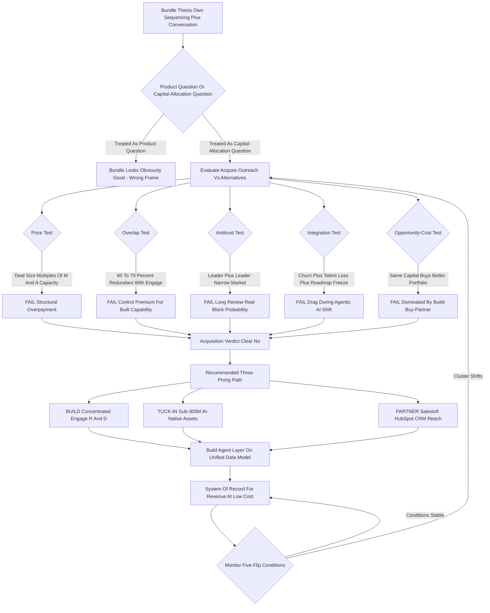

### Direct Answer

**No.** Gong should not acquire Outreach to bundle conversation intelligence with sales sequencing. The bundle is a genuinely good product idea, but acquiring the second-largest standalone sequencing vendor at a peak-cycle price is the most expensive, most regulated, and most operationally hazardous route to it. The deal fails five independent tests at once — price, product overlap, antitrust, integration drag, and opportunity cost — and a build-plus-tuck-in-plus-partner alternative reaches the identical strategic destination at roughly 5-12% of the cost with a fraction of the risk.

**TL;DR:** The seductive thesis is the "system of record for revenue" — one platform owning prospecting cadence, call capture, deal inspection, and forecasting. That thesis is real and deserves a steelman. But the case against is overdetermined. **Price:** Outreach's last public mark was **$4.4B at its June 2021 Series G** (Premji Invest and Steadfast led, ~$230M ARR then); a 2027 take-private realistically clears **$3.5B-$6.5B**, five to eight times any plausible Gong M&A budget. **Redundancy:** **Gong Engage shipped September 12, 2023** and already does sequencing, AI email, and task orchestration — a parity audit puts overlap at **60-70%**. **Antitrust:** combined share in a narrowly defined "AI revenue platform" market plausibly clears **55-70%**, and against the FTC's 2023 Merger Guidelines plus an engaged CMA and European Commission, an 18-24 month review with real block probability is the base case — Adobe-Figma (terminated December 2023, $1B reverse termination fee) is the precedent. **Integration drag:** rev-tech megamergers routinely shed **15-25% of overlapping accounts** and **30-40% of senior engineering and quota-carrying talent**, freezing the roadmap **18-24 months** exactly as agentic AI rewrites the category. **Opportunity cost:** the same capital buys a far better portfolio — build Engage deeper, tuck-in a sub-$300M AI-native asset, and partner with Salesloft or HubSpot. The steelman earns **25-30% weight**. It does not earn the company. Verdict: a clear no, with an honest asterisk and a specific build-buy-partner sequence.

## 1. The Strategic Question, Stated Precisely

### 1.1 Three Questions Hiding In One Sentence

The question "should Gong acquire Outreach to bundle conversation plus sequencing" hides three separate questions inside one sentence, and most people answer only the easiest one. **The easy question is the product question:** would a platform that does both prospecting cadences and conversation intelligence be useful to a revenue team? Yes, obviously — the two motions are adjacent, the data flows naturally, and customers already wire them together with integrations. But that is not the decision. **The decision is a capital-allocation question** — is acquiring Outreach the best use of the largest check Gong will ever write — **and a corporate-strategy question** — does owning sequencing outright beat building it, partnering for it, or buying a smaller piece of it.

When you separate the three, the product question is a clear yes and the other two are a clear no, and the other two are the ones that actually govern. The discipline this whole analysis demands is refusing to let "the combined product would be good" stand in for "the acquisition is the right move."

### 1.2 Why The Frame Decides The Answer

Almost every value-destroying megamerger in software history was defensible at the product layer and indefensible at the capital-allocation layer. Adobe genuinely would have been better with Figma inside it. Plaid genuinely would have extended Visa's reach. **The products made sense; the deals did not.** Gong-Outreach belongs in exactly that family: a product logic that is real, wrapped around a transaction logic that does not survive contact with the numbers.

So the frame for everything below is not "is the bundle good." It is: given a real but bounded M&A budget, a regulatory environment that scrutinizes exactly this kind of horizontal consolidation, a target priced at a 2021 peak, and an internal product that already covers most of the gap — is this specific $5B move the highest-expected-value path to the system-of-record-for-revenue position? It is not.

### 1.3 The Test The Deal Must Pass

A disciplined evaluation imposes one structural test: **the acquisition must beat the best available alternative, not merely look attractive on its own.** A deal can be a perfectly good idea in isolation and still be the wrong move if a dominated alternative exists. The burden of proof sits on the acquisition to beat build-buy-partner specifically — and as the sections below show, it cannot.

| Question hidden in the sentence | Honest answer |
|---|---|
| Is the combined product useful? | Clear yes |
| Is acquiring Outreach the best capital allocation? | Clear no |
| Does owning sequencing beat building/partnering for it? | Clear no |
| Which two questions govern the decision? | The capital and strategy questions |

## 2. Why This Particular Bundle Tempts Everyone

### 2.1 The Most Intuitive Consolidation Play In Rev-Tech

It is worth being honest about why this deal keeps coming up, because the temptation is not stupid — it is the single most intuitive consolidation play in all of revenue technology. The modern GTM stack is fragmented across a dozen tools: a sequencer for outbound, a conversation-intelligence layer for calls, a forecasting tool, a data-enrichment vendor, a scheduler, a CPQ system, a CRM holding it all loosely together. Every CRO complains about the seams. Every RevOps leader spends real budget on the integration glue.

And the two pieces that feel most obviously like one product are **sequencing and conversation intelligence** — because they are the bookends of the same conversation. Sequencing gets the meeting booked; conversation intelligence captures what happened in it; the outcome should feed straight back into the next sequence. When you draw that loop on a whiteboard, the case for one company owning both writes itself.

### 2.2 The AI Narrative Layered On Top

Add the AI narrative: an agent that drafts the outreach, joins the call, summarizes it, updates the CRM, and triggers the follow-up cadence is a genuinely compelling 2027 product, and it is far easier to build that agent on top of one unified data model than across two companies' APIs. So the temptation is **structural and rational.**

The error is not in finding the bundle attractive — it is in concluding that "attractive bundle" implies "acquire the second-largest standalone vendor of the other half at a peak-cycle price." The bundle is the destination. Acquiring Outreach is one route to it, and as the rest of this analysis shows, it is the most expensive, most regulated, most operationally hazardous route on the map.

### 2.3 Separating Destination From Route

The single clarifying move in this whole analysis is to **separate destination from route.** The destination — Gong owning the revenue workflow from sequencing through conversation through forecasting — is worth pursuing. The route — a $5B horizontal merger with the category co-leader — is the one variable under debate. The temptation conflates them. The discipline keeps them apart.

## 3. What Gong Is In 2027: The Acquirer's Starting Position

### 3.1 Not A Single-Product Company Anymore

To judge the deal you have to be precise about what Gong already is, because the single biggest factual error in pro-deal reasoning is treating Gong as a pure conversation-intelligence company that needs Outreach to enter sequencing. **That stopped being true in September 2023.**

Gong is, in 2027, a revenue-intelligence platform: it captures and analyzes customer conversations across calls, email, and meetings; it runs deal inspection and pipeline risk scoring; it powers forecasting; and — critically — since the **September 12, 2023 launch of Gong Engage**, it ships a native sales-engagement product with sequencing, AI-assisted email, dialer, and task orchestration. Gong is widely reported to have crossed roughly $300M ARR around 2023 and to be a clear category leader in conversation and revenue intelligence, last privately valued in the **$7-7.25B range in its 2021 round.**

### 3.2 Capability Acquisition Versus Consolidation Acquisition

That distinction changes the entire deal logic. **If Gong had no sequencer, Outreach would be a capability acquisition** — expensive, but at least buying something Gong lacks. **Because Gong has Engage, Outreach is a consolidation acquisition** — buying a competitor in a category Gong already operates in, which is simultaneously the version regulators scrutinize hardest and the version where the acquirer is most likely to be overpaying for redundancy.

### 3.3 A Strong Position Does Not Need A Bet-The-Firm Move

Gong's starting position is strong: category leadership in its core, a credible second product already in market, a healthy ARR base, and a brand RevOps buyers trust. A company in that position does not need a bet-the-firm merger. It needs disciplined sequencing of build, tuck-in, and partnership moves. Compare with adjacent strategic questions on category leaders weighing large adjacent acquisitions (q1887) and conversation-intelligence consolidation specifically (q1866).

| Gong attribute (2027) | State |
|---|---|
| Core category | Conversation/revenue intelligence — leader |
| Sequencing product | Gong Engage, live since Sept 2023 |
| Reported ARR | ~$300M around 2023 |
| Last private valuation | ~$7-7.25B (2021 round) |
| Deal type if it buys Outreach | Consolidation, not capability acquisition |

## 4. What Outreach Is And What The Check Actually Buys

### 4.1 The Sales-Engagement Category Co-Creator

Outreach is the sales-engagement category's co-creator and, with Salesloft, one of its two anchor vendors. The product is a mature sequencing and execution platform: multi-step cadences across email, call, and social; a dialer; AI features for email drafting and deal health; and a sales-execution layer that has expanded toward forecasting and deal management. Outreach raised a **$200M Series G in June 2021 at a $4.4B valuation**, led by Premji Invest and Steadfast Capital Ventures, against a reported ARR around $230M at the time.

### 4.2 The Post-2021 Correction

Since then, Outreach has gone through the same correction every 2021-vintage SaaS company faced: multiple compression, a harder funding environment, reported layoffs, and a long-discussed-but-never-executed IPO. By 2027, Outreach is a substantial, real business — thousands of customers, meaningful ARR growth off the 2021 base, a defensible position in enterprise sales engagement — but it is also a company whose **last public valuation marker is a peak-cycle number the market would no longer underwrite at the same multiple.** For the standalone business model, see how Outreach actually makes money in 2027 (q1924).

### 4.3 What The Check Buys, Stripped Of Narrative

That matters enormously for what the check buys. An acquirer is not buying a hot growth asset at a fair forward price; it is negotiating against a stale $4.4B anchor that Outreach's board and late-stage investors will fight to defend, while the underlying business would clear a public-market or strategic valuation at a materially lower multiple. The acquisition therefore carries a **structural overpayment risk baked into the starting positions.**

What the check buys, stripped of narrative, is: a mature sequencing product that overlaps 60-70% with Gong Engage, a customer base with real overlap with Gong's, an enterprise brand in sales engagement, and a pile of integration and antitrust risk. That is not nothing. It is also not $5B of incremental value to Gong specifically.

## 5. The Product Overlap Teardown: Engage Versus Outreach

### 5.1 The Feature-By-Feature Map

The redundancy objection is the one pro-deal advocates most want to wave away, so it deserves a concrete teardown. Map Outreach's product surface against Gong Engage feature by feature. **Multi-channel sequencing** — cadences across email, call, and social: Engage has it. **AI email assistance** — drafting, personalization, reply suggestions: Engage has it, arguably with a data advantage because Gong's conversation corpus informs it. **Dialer and call execution:** Engage has it. **Task and activity orchestration** — the daily prioritized rep workflow: Engage has it. **CRM sync and activity capture:** both have it; Gong's is arguably deeper given its capture heritage.

### 5.2 Where Outreach Is Genuinely Ahead

Where Outreach is genuinely ahead: **depth and maturity of enterprise sequencing** — years more iteration on complex cadence logic, admin controls, and large-team governance; **sales-execution and forecasting breadth** — Outreach has pushed further into deal management and forecasting as a standalone motion; **installed enterprise base** — a large book of demanding enterprise customers who have standardized on Outreach's specific workflow.

So the honest overlap picture is not "Outreach is redundant" — it is "**roughly 60-70% of Outreach's value to Gong is capability Gong already shipped, and 30-40% is genuine incremental depth, maturity, and installed base.**"

### 5.3 The Deal Math Against The Overlap

Now do the deal math against that. You are contemplating a $3.5B-$6.5B transaction to acquire an asset that is two-thirds redundant. The incremental 30-40% — enterprise sequencing depth and an installed base — is real, but it is the kind of gap a focused R&D investment closes in 18-30 months, and the installed base is exactly the cohort most likely to churn in a megamerger integration. **Paying a control premium on a $4.4B-anchored asset for a one-third-incremental capability is the textbook definition of a deal where the strategic story outran the diligence.** If Engage did not exist, this objection would not apply. Engage exists. It shipped in 2023.

| Component | Verdict |
|---|---|
| Multi-channel sequencing | Engage has it |
| AI email assistance | Engage has it (corpus data edge) |
| Dialer and call execution | Engage has it |
| Task / activity orchestration | Engage has it |
| CRM sync and activity capture | Both; Gong arguably deeper |
| Enterprise sequencing depth/governance | Outreach genuinely ahead |
| Sales-execution / forecasting breadth | Outreach genuinely ahead |
| Installed enterprise base | Outreach genuinely ahead |
| Estimated total feature overlap | 60-70% |
| Genuinely incremental capability | 30-40% |
| Estimated value-to-Gong of incremental portion | ~$1.5B-$2B |

## 6. The Valuation Problem: Anchored High, Worth Less

### 6.1 The Stale Anchor

The price objection deserves rigorous treatment because it is not "Outreach is expensive" — it is "**Outreach is priced on a stale anchor, and even the honest price is too large for Gong's balance sheet.**" Start with the anchor: $4.4B, June 2021, ~$230M ARR — roughly a 19x trailing ARR multiple, a quintessential 2021 peak mark.

### 6.2 Rolling The Number Forward Honestly

Roll that forward. If Outreach grew ARR at a reasonable-but-not-spectacular rate off the 2021 base, it might reach somewhere in the $350M-$500M ARR range by 2027. Apply **2027 multiples, not 2021 multiples:** durable, growing-but-mature B2B SaaS infrastructure trades in the 5-9x forward ARR range depending on growth and profitability, not 19x. That math produces a defensible enterprise value somewhere in the **$2.5B-$4.5B** range.

But Outreach's board, its 2021 investors, and its late-stage preferred holders are not going to accept a number below their last mark without a fight — liquidation preferences and investor psychology anchor the negotiation high. So the realistic transaction price, after a control premium and a contested negotiation, lands in the **$3.5B-$6.5B** zone.

### 6.3 The Balance-Sheet Mismatch

Now put that against Gong. Gong is a private company; even at a $7B+ valuation, its actual deployable M&A capital — cash plus sensible debt plus stock it can issue without destroying its own cap table — is a fraction of its enterprise value. A realistic Gong M&A budget for a single transaction is plausibly in the **high hundreds of millions to low billions, not $5B.**

The Outreach deal is therefore not "a big acquisition" — it is a transaction several times larger than Gong's entire acquisition capacity, which means it cannot be done as a normal acquisition at all. It would require a massive equity raise, heavy debt, or a private-equity-style structure — each of which dilutes existing holders, loads the balance sheet, or hands control influence to financial sponsors.

| Metric | Value |
|---|---|
| June 2021 valuation | $4.4B |
| Reported ARR at 2021 round | ~$230M |
| Implied 2021 multiple | ~19x trailing ARR (peak-cycle) |
| Estimated 2027 ARR range | ~$350M-$500M |
| Defensible 2027 forward multiple | 5-9x |
| Honest standalone enterprise value | ~$2.5B-$4.5B |
| Realistic contested transaction price | $3.5B-$6.5B |
| Gong realistic single-deal M&A budget | High hundreds of millions to low billions |
| Outreach deal size vs Gong budget | Roughly 5-8x over budget |

## 7. The Antitrust Wall: Why Regulators Are The Deal-Killer

### 7.1 It All Turns On Market Definition

Even if the price worked and the overlap were tolerable, the deal would run into a regulatory wall that, in the current environment, is the single highest-probability reason it never closes. The analysis turns on **market definition.** If you define the relevant market broadly — "all sales and marketing software" — combined share is modest and the deal looks fine. But regulators in 2027 do not use the acquirer's preferred broad definition; they use the narrowest defensible one.

### 7.2 The Narrow Market That Sinks It

There is a very plausible narrow market here: **"AI-native revenue intelligence and sales-engagement platforms,"** the specific category where Gong leads conversation intelligence and Outreach co-leads sales engagement. Under that definition, a combined Gong-Outreach plausibly holds **55-70% share**, with the next-largest independent competitor materially smaller. That is precisely the structure the **FTC's 2023 Merger Guidelines** are built to challenge: a horizontal combination of the two leading players in a concentrated, defensible market, removing a direct competitor.

Add the international layer — the UK's CMA and the European Commission both review deals of this size and have shown willingness to block or force remedies on software consolidations — and you are looking at a multi-jurisdiction review running **18-24 months** with a genuine, non-trivial probability of an outright block or a deal-gutting remedy.

### 7.3 The Adobe-Figma Precedent Everyone Will Cite

The precedent everyone will cite is **Adobe-Figma:** a strategically sensible combination, announced September 2022, terminated in December 2023 after the CMA and EC signaled they would block it — Adobe paid Figma a **$1B reverse termination fee** for the privilege of nothing. Gong-Outreach has the same shape: two category leaders, a narrow defensible market, an obvious "removal of a competitor" story.

The expected cost of attempting it is not just the legal bill — it is 18-24 months of strategic paralysis, a possible nine-or-ten-figure breakup fee, and a public failure that signals weakness to customers and competitors. **Antitrust is not a hurdle to clear on this deal. It is, on the base-case probabilities, the wall the deal hits.**

| Antitrust factor | Reading |
|---|---|
| Broad market definition | Modest share — but not the one regulators use |
| Narrow market definition | "AI revenue platform," 55-70% combined share |
| US reviewer | FTC/DOJ under 2023 Merger Guidelines |
| International reviewers | CMA (UK), European Commission (EU) |
| Estimated review timeline | 18-24 months |
| Block / gutting-remedy probability | Base case, not tail risk |
| Live precedent | Adobe-Figma, terminated Dec 2023, $1B fee |

## 8. Integration Drag: Where Rev-Tech Megamergers Quietly Die

### 8.1 The Drag That The Deal Model Never Captures

Suppose, against the odds, the price is negotiated and the regulators are cleared. The deal still has to survive integration, and rev-tech megamerger integration is where this category of deal most reliably destroys value — quietly, over two years, in ways the deal model never captured. Three drag mechanisms matter.

### 8.2 Customer Churn, Talent Loss, Roadmap Freeze

**Customer overlap and churn:** Gong and Outreach share a meaningful slice of customers who bought both deliberately and now find themselves single-vendor by force; some will use the moment to re-evaluate, and history says **15-25% of the overlapping base** leaks to Salesloft, HubSpot, or a best-of-breed alternative during the uncertainty window.

**Talent loss:** megamergers reliably shed **30-40% of senior engineering and top quota-carrying AEs** in the 18 months post-close — the overlapping product teams face role consolidation, the best engineers have options, and the highest-performing salespeople do not wait around to find out how comp plans get merged.

**Roadmap freeze:** integrating two mature codebases, two data models, two CRM-sync architectures, and two go-to-market motions absorbs the senior engineering and product leadership for **18-24 months** — precisely the people you need building the agentic-AI future, now spending two years on plumbing.

### 8.3 The Cruel Arithmetic

The cruel arithmetic: the deal model promises revenue synergy from cross-sell and cost synergy from consolidating overlapping functions, but the realized result is usually negative for the first two years — churned customers, lost talent, frozen roadmap, distracted leadership — and the promised synergies, if they arrive at all, arrive late and smaller than modeled. Meanwhile the standalone competitors — Salesloft, HubSpot, and a swarm of AI-native startups — spend those same two years shipping. **Integration drag is not a risk to be managed down to zero with a good integration plan; it is a structural feature of combining two large, overlapping, mature software organizations.**

| Integration drag benchmark | Range |
|---|---|
| Overlapping-customer churn during integration window | 15-25% |
| Senior engineering + top AE attrition (18 months) | 30-40% |
| Roadmap freeze duration | 18-24 months |
| Net value realization, first two years | Typically negative before synergies arrive |

## 9. The Capital-Allocation View: What Else $5B Buys

### 9.1 Reframing The Question

The objection pro-deal advocates least like to confront is opportunity cost, because it reframes the question from "is Outreach worth it" to "is Outreach the best thing this capital and attention could do" — and on that framing the deal loses badly. Treat the Outreach acquisition as a roughly $5B-equivalent commitment of capital, balance-sheet capacity, and — just as scarce — senior leadership attention for three-plus years.

### 9.2 The Portfolio The Same Money Buys

What else could that commitment buy? It could fund **a decade of concentrated Engage R&D** — closing the enterprise-sequencing depth gap organically, on Gong's own data model, with no integration tax. It could fund **a portfolio of five to ten tuck-in acquisitions** — an AI-native conversation engine, an email-intelligence layer, a forecasting specialist, a data-enrichment asset, a scheduling tool — each absorbable without antitrust risk and each adding genuine capability rather than redundancy. It could fund **aggressive international expansion** into markets where Gong is underpenetrated. It could fund **a major agentic-AI build** — the autonomous revenue agent that is the actual 2027-2030 prize.

### 9.3 The Attention Cost No Slide Captures

The attention cost is the part no slide ever captures: a $5B megamerger does not just spend money, it consumes the CEO, the CFO, the CPO, and the board for years — the integration becomes the company's main project, and every other ambition gets starved of leadership bandwidth.

The capital-allocation lens does not just say "Outreach is expensive." It says "**even if Outreach were free of antitrust and integration risk, spending Gong's single largest strategic commitment on it would still be the wrong portfolio choice**, because the build-plus-tuck-in-plus-partner alternative produces more capability, more optionality, and more strategic resilience for the same resources." That is the objection that closes the case. For the specific tuck-in alternative, compare the much smaller and cleaner Gong-Avoma scenario (q1910).

## 10. The Alternative That Dominates: Build, Tuck-In, Partner

### 10.1 Prong One — Build

The recommendation is not "do nothing" — the bundle thesis is real and Gong should absolutely pursue the system-of-record-for-revenue position. The recommendation is to pursue it through a three-prong path that reaches the same destination at a fraction of the cost and risk.

**Prong one — BUILD.** Take a meaningful slice of the capital that would have gone to Outreach and pour it into Gong Engage: close the enterprise-sequencing depth gap, the cadence-governance and admin-controls gap, the forecasting-breadth gap. Engage already covers 60-70% of the surface; concentrated R&D closes most of the rest in 18-30 months, on Gong's unified data model, with zero integration tax and zero antitrust exposure.

### 10.2 Prong Two — Tuck-In Acquire

**Prong two — TUCK-IN ACQUIRE.** Buy small, AI-native assets that add genuine capability rather than redundancy: an Avoma-class conversation/meeting-intelligence engine or an AI-native sequencing startup in the $100-300M range for technology and team depth; a Lavender-class email-intelligence layer for differentiation. Each of these is small enough to clear antitrust trivially, cheap enough to fit Gong's real M&A budget, and additive rather than overlapping.

### 10.3 Prong Three — Partner

**Prong three — PARTNER.** For ecosystem reach and the segments Gong does not want to build for, deepen integration partnerships with Salesloft, HubSpot (NYSE: HUBS), and the CRM layer — the customer gets the bundled workflow through best-of-breed integration without Gong having to own and operate every component.

The combined three-prong path costs an estimated **5-12% of the Outreach acquisition price**, carries a fraction of the regulatory and integration risk, preserves Gong's capital-allocation optionality, and reaches the same strategic endpoint: a Gong that owns the revenue workflow from sequencing through conversation through forecasting. **When a dominated alternative exists, the dominant move is to take it.** For the competitive backdrop this path operates in, see Outreach vs Salesloft buyer guidance (q1906) and the Salesloft-Outreach head-to-head (q1854).

| Prong | Action | Cost / risk profile |
|---|---|---|
| BUILD | Concentrated Engage R&D, 18-30 month gap-closure | Bulk of spend, zero antitrust, zero integration tax |
| TUCK-IN | Sub-$300M AI-native assets (Avoma-class, Lavender-class) | Budget-fitting, antitrust-trivial, additive |
| PARTNER | Salesloft / HubSpot / CRM integration partnerships | Near-zero capital, ecosystem reach |
| Combined | All three executed in sequence | ~5-12% of Outreach deal price |

## 11. The Steelman: The Strongest Honest Case For The Deal

### 11.1 Moat And Window

Intellectual honesty requires building the best version of the pro-deal argument. **First, the category-defining moat.** If Gong owns both conversation intelligence and the leading independent sales-engagement platform, it has a structural position competitors cannot replicate, because the next entrant would have to build or buy both halves against an incumbent that already has them unified. **Second, the valuation-compression window.** Outreach is priced off a stale 2021 peak and has been correcting; there may be a specific 2027 window — a failed IPO attempt, investor fatigue, a down-round reality check — where Outreach is acquirable at a genuine discount, and windows like that do not stay open.

### 11.2 Regulatory Climate And Speed

**Third, the regulatory climate may soften.** A new administration, a different FTC posture, a more permissive read of software market definition — the antitrust base case is not fixed. **Fourth, and most serious: build might simply be too slow.** Closing the enterprise-sequencing depth gap organically is an 18-30 month estimate, but estimates slip, and 18-30 months of building is 18-30 months during which Salesloft, HubSpot, or an AI-native challenger could lock down the enterprise sequencing position. Buying Outreach collapses that timeline to "closed."

### 11.3 The Data Asset

**Fifth, the data asset.** Outreach's sequencing and engagement data, combined with Gong's conversation corpus, could train revenue-AI models neither company could build alone. That is the honest steelman: moat, window, climate, speed, data. It is not a joke. It deserves perhaps **25-30% weight** in the final decision.

## 12. Why The Steelman Still Loses

### 12.1 Pressing On Each Pillar

The steelman is real, but each pillar has a load-bearing weakness. **The moat argument** assumes the moat is sequencing-plus-conversation specifically — but in a category being reorganized by agentic AI, the durable moat is far more likely to be the unified data model and the agent layer on top of it, both of which Gong builds better organically than by bolting on a separate company's data architecture. **The valuation-window argument** cuts both ways: if Outreach is acquirable at a real discount, that is also a signal the business is under pressure, and you may be catching a falling knife — and even a "discounted" Outreach is still multiples of Gong's M&A budget.

### 12.2 Climate, Speed, And Data Re-Examined

**The regulatory-climate argument** is a bet on a specific political outcome; you cannot build a bet-the-company strategy on the hope that the antitrust posture softens on your timeline, and even a friendlier FTC does not control the CMA and EC. **The speed argument** is the strongest, but it overstates the gap: Engage is not at zero, it is at 60-70%, and "buy" is not actually instant — a deal that takes 18-24 months to clear regulators and another 18-24 months to integrate is not faster than an 18-30 month focused build; it is slower, and it arrives with churned customers and lost talent attached. **The data-asset argument** assumes the data integrates cleanly and the combined corpus is legally and technically usable as one — megamergers routinely fail to realize exactly this kind of "combined data" synergy.

### 12.3 Where The Expected Value Lives

So the steelman earns its 25-30% weight, but the other 70-75% — structural overpayment, two-thirds redundancy, base-case regulatory block, two years of integration drag, and a dominated-alternative opportunity cost — is where the expected value lives. The honest conclusion is not "the pro-deal case is stupid." It is "**the pro-deal case is real and still loses on expected value.**"

| Steelman pillar | Load-bearing weakness |
|---|---|
| Category-defining moat | Real moat is the data model + agent layer, built organically |
| Valuation-compression window | Discount signals distress; still over budget |
| Regulatory climate may soften | Bet on politics; CMA/EC not controlled by FTC |
| Build is too slow | "Buy" is slower once review + integration are counted |
| Combined data asset | Megamergers reliably fail to realize data synergy |

## 13. How To Actually Value Outreach: The Diligence Math

### 13.1 From ARR To Standalone Enterprise Value

If a Gong corp-dev team were forced to run the real numbers, here is the diligence math. Start with ARR: Outreach at ~$230M in 2021, growing off that base at a mature-SaaS rate, lands somewhere around $350M-$500M ARR by 2027 — call the working range $400M-$450M. Apply a defensible 2027 forward multiple: durable, growing-but-not-hypergrowth B2B SaaS infrastructure with real competition trades at roughly 5-9x forward ARR; mid-point call it 6-7x. That produces a standalone enterprise value of roughly **$2.5B-$3.5B** on the honest math.

### 13.2 The Realities That Push The Price Up

Now layer the realities that push the actual transaction price up: a control premium (typically 20-40% over standalone), the seller's anchoring on the $4.4B 2021 mark, liquidation preferences that put a floor under what late-stage investors will accept. The contested transaction price realistically lands **$3.5B-$6.5B**, with a working point estimate around $4.5B-$5B.

### 13.3 The Value-To-Gong Adjustment That Breaks The Deal

Then run the value-to-Gong-specifically adjustment, which is where the deal falls apart: of that $4.5B-$5B, roughly 60-70% is redundant with Gong Engage, so the incremental capability Gong is actually buying — enterprise-sequencing depth, installed base, brand — is worth, generously, **$1.5B-$2B** to Gong. Gong would be paying $4.5B-$5B for $1.5B-$2B of incremental value, and that gap is *before* subtracting the antitrust expected cost and the integration expected cost. Run those subtractions and the risk-adjusted net present value of the Outreach acquisition to Gong is plausibly **negative.** The diligence math does not produce a "close call." It produces a deal where the honest model says no, and only the narrative says yes.

| Diligence step | Figure |
|---|---|
| 2027 working ARR range | $400M-$450M |
| Defensible forward multiple | 6-7x (within 5-9x band) |
| Honest standalone EV | $2.5B-$3.5B |
| Contested transaction price | $3.5B-$6.5B (point ~$4.5B-$5B) |
| Redundant share of value | 60-70% |
| Incremental value to Gong | ~$1.5B-$2B |
| Risk-adjusted NPV to Gong | Plausibly negative |

## 14. What The Comparable Megamergers Actually Teach

### 14.1 The Deals That Died

The deal does not have to be evaluated in a vacuum — there is a clear comp set. **Adobe (NASDAQ: ADBE)-Figma** (announced September 2022, $20B, terminated December 2023 with a $1B reverse termination fee): a strategically sensible combination of a leader and a fast-rising adjacent player, killed by the CMA and EC — the direct template for what regulators do to leader-plus-leader software deals. **Visa (NYSE: V)-Plaid** (announced 2020, ~$5.3B, abandoned 2021 after a DOJ antitrust suit): a direct precedent for regulators blocking a deal specifically because the acquirer was buying a competitive threat in an adjacent lane.

### 14.2 The Deals That Closed But Disappointed

**Salesforce (NYSE: CRM)-Slack** (closed 2021, ~$27.7B): it closed, but it absorbed enormous capital and management attention, drew activist-investor pressure on the price paid, and the integration and synergy realization were widely questioned. **Salesforce-Tableau** and **Salesforce-MuleSoft:** large, closed, but the verdict on whether the prices paid generated commensurate returns is mixed at best. **Cisco (NASDAQ: CSCO)-Splunk** (closed 2024, ~$28B): closed, but at a size only a company of Cisco's balance-sheet scale could absorb.

### 14.3 The Pattern

The pattern across the comp set: leader-plus-leader software deals draw the hardest regulatory scrutiny and frequently die; the ones that close consume years of attention and deliver contested returns; and the ones that integrate cleanly tend to be either much smaller or done by acquirers whose scale dwarfs the target. **Gong-Outreach has the risk profile of the deals that died and the integration profile of the deals that disappointed — and none of the scale cushion of the deals that worked.**

| Deal | Size | Outcome |
|---|---|---|
| Adobe-Figma | ~$20B (announced Sept 2022) | Terminated Dec 2023, $1B breakup fee |
| Visa-Plaid | ~$5.3B | Abandoned 2021 after DOJ antitrust suit |
| Salesforce-Slack | ~$27.7B | Closed 2021, contested synergy realization |
| Cisco-Splunk | ~$28B | Closed 2024 (acquirer scale dwarfed target) |

## 15. Build-Versus-Buy: The General Framework, Applied

### 15.1 When The Framework Says Buy Versus Build

Strip the specifics away and the decision is an instance of the classic build-versus-buy framework. The framework says **buy** when: the capability gap is large and you have nothing; the time-to-build is strategically fatal; the target is reasonably priced relative to your budget; integration risk is manageable; and regulators will allow it. It says **build** when: you already have a credible version of the capability; time-to-build is acceptable; the target is overpriced or oversized; and integration or regulatory risk is high.

### 15.2 Running Gong-Outreach Through Each Criterion

Run Gong-Outreach through each criterion. **Capability gap:** not large — Engage covers 60-70%. **Time-to-build the rest:** 18-30 months, which is acceptable, not fatal. **Price relative to budget:** catastrophically mismatched — the target is multiples of Gong's M&A capacity. **Integration risk:** high — two large overlapping mature organizations. **Regulatory risk:** high — leader-plus-leader in a narrow market. The framework does not return a mixed signal. Every single criterion points to build (with tuck-in support), not buy.

### 15.3 The Narrow "Buy" The Framework Still Endorses

There is a narrow version of "buy" the framework still endorses here — **buy small:** tuck-in acquisitions that add genuine capability, fit the budget, clear antitrust, and integrate cleanly. That is exactly prong two of the recommendation. But "buy the incumbent competitor at a peak-cycle price" fails the framework on price, integration, and regulatory grounds simultaneously.

| Framework criterion | Gong-Outreach reading | Signal |
|---|---|---|
| Capability gap size | 60-70% covered by Engage | Build |
| Time-to-build | 18-30 months, acceptable | Build |
| Price vs budget | Multiples over budget | Build |
| Integration risk | High — two large mature orgs | Build |
| Regulatory risk | High — leader-plus-leader | Build |
| Verdict | Every axis | Build + small tuck-ins |

## 16. The RevOps Buyer's Perspective: Does The Bundle Even Help The Customer

### 16.1 Real Fragmentation Fatigue, Real Bundle Skepticism

A deal justified by "customers want the bundle" should be checked against what customers actually want. Yes, RevOps leaders complain about stack fragmentation and integration glue — that part is real. But RevOps buyers also have a deep, learned skepticism of forced single-vendor bundles, for good reasons: bundles reduce their negotiating leverage, they create concentration risk, and they often mean accepting a weaker component to get a stronger one.

### 16.2 The Best-Of-Breed Segment Actively Resists

Many sophisticated RevOps organizations deliberately run best-of-breed — Gong for conversation, Outreach or Salesloft for sequencing — precisely because it preserves leverage and lets them swap any component that underperforms. A Gong-Outreach merger does not unambiguously delight that buyer; for a meaningful segment it triggers exactly the re-evaluation that drives the 15-25% overlap churn.

### 16.3 The Bundle As Product Versus The Bundle As Merger

Meanwhile the integration pain the bundle is supposed to solve is already substantially solved — Gong and Outreach already integrate, the data already flows, and the 2027 trend is toward open, agent-mediated interoperability rather than monolithic suites. **"Customers want the bundle" is true at a high level and does not survive contact with how sophisticated RevOps buyers actually purchase.** The bundle as a *product* has demand. The bundle as a *forced merger* has a more divided reception.

## 17. The Agentic-AI Wildcard: Why The Timing Argument Reverses

### 17.1 Value Is Moving Up The Stack

The most important 2027 context is agentic AI, and it is usually deployed as an argument *for* the deal — "you need the unified platform to build the agent" — when on inspection it argues *against* it. The agentic-AI shift means the durable value is moving up the stack, away from the individual workflow tools — the sequencer, the dialer, the call recorder — and toward the autonomous agent layer and the unified data model that feeds it.

### 17.2 Paying Peak Price For A Commoditizing Layer

In that world, owning a mature standalone sequencer is owning a commoditizing layer; the sequencer becomes a capability the agent invokes, not a product the customer logs into. If that is the trajectory, then paying $5B to own the leading standalone sequencer is **paying peak price for an asset whose strategic value is being eroded by the same AI wave that is supposed to justify the purchase.** The thing actually worth owning — the agent layer and the unified revenue data model — is something Gong builds organically on its own corpus.

### 17.3 The Distraction Lands At The Worst Possible Moment

Worse, the integration distraction lands at the exact wrong moment: the 18-24 months Gong's senior engineering and product leadership would spend integrating Outreach is the 18-24 months they most need to be building the agentic future, and every major competitor and AI-native startup gets that window free. The agentic-AI argument, followed honestly, says: **the value is moving to the agent and the data model; build those organically; do not spend your scarcest two years integrating a maturing workflow tool whose category position AI is already eroding.** The timing argument does not support the deal. It reverses against it.

## 18. What Would Have To Be True For The Answer To Flip

### 18.1 The Five Flip Conditions

A rigorous "no" should specify its own falsification conditions. The answer flips toward "acquire" if **all or most** of the following hold simultaneously. **One:** Outreach becomes acquirable at a genuine discount — think $2-3B, not $4.5-5B — because of a failed IPO, a distressed funding situation, or investor capitulation. **Two:** the antitrust environment demonstrably softens — a clear signal from the FTC, and crucially the CMA and EC, that they would clear a deal of this shape. **Three:** Engage's organic progress stalls — if concentrated R&D fails to close the enterprise-sequencing gap and Gong is visibly losing enterprise deals on sequencing depth. **Four:** a competitor moves first — if Salesloft, HubSpot, or a well-funded entrant acquires the other half of the bundle and starts compounding the moat against Gong. **Five:** the agentic-AI thesis proves wrong and standalone workflow tools retain durable, non-commoditizing value.

### 18.2 Why It Takes A Cluster, Not A Single Trigger

Notice the structure: the answer does not flip on any single condition — it flips only if several align, because the case against is overdetermined. One cheap-Outreach signal is not enough if the antitrust wall still stands; a friendlier FTC is not enough if Engage is progressing fine and the price is still $5B.

### 18.3 The Disciplined Posture

The "no" is robust precisely because it would take a coincidence of favorable conditions to overturn it — and the disciplined move is to *monitor* those five conditions on a standing basis while executing the build-buy-partner path, revisiting only if the cluster genuinely shifts. The competitive-response branch — a counter-merger — connects to the ServiceNow-Atlassian adjacent-acquisition question (q1887).

| # | Flip condition | Status to monitor |
|---|---|---|
| 1 | Outreach acquirable near $2-3B | Outreach funding / IPO news |
| 2 | Antitrust demonstrably softens | FTC, CMA, EC posture |
| 3 | Engage organic progress stalls | Enterprise win/loss on sequencing |
| 4 | Competitor buys the other half | Salesloft / HubSpot M&A |
| 5 | Agentic-AI thesis proves wrong | Standalone-tool durability |

## 19. The Recommended Sequence: What Gong Should Do Instead, In Order

### 19.1 Steps One And Two — Build And Tuck-In Program

The recommendation is a sequence, executed in order. **Step one — commit publicly and internally to the build path for Engage.** Allocate a defined, substantial R&D budget specifically to closing the enterprise-sequencing depth gap, the cadence-governance gap, and the forecasting-breadth gap, with an 18-30 month target and clear milestones. This is the spine. **Step two — run a tuck-in acquisition program.** Stand up corp-dev to evaluate sub-$300M AI-native targets: an Avoma-class conversation/meeting-intelligence engine, a Lavender-class email-intelligence layer, possibly a forecasting or data-enrichment specialist — each additive, antitrust-trivial, and budget-fitting. Expect to close one to three over two years.

### 19.2 Steps Three And Four — Partner And Build The Agent

**Step three — deepen ecosystem partnerships.** Formalize and deepen integration partnerships with Salesloft, HubSpot, and the CRM layer so the customers who want a bundled workflow can assemble one through best-of-breed integration. **Step four — build the agent layer on the unified data model.** This is the actual 2027-2030 prize: the autonomous revenue agent on top of Gong's own corpus, which the build-and-tuck-in path feeds and the megamerger path would have delayed by two years.

### 19.3 Step Five — Standing Watch

**Step five — maintain a standing watch on the five flip conditions.** Keep a live read on Outreach's price, the antitrust climate, Engage's competitive position, competitor M&A, and the agentic-AI thesis — and only reopen the acquisition question if that cluster genuinely shifts. Executed in order, this sequence reaches the system-of-record-for-revenue destination at 5-12% of the Outreach price, with a fraction of the risk, and without surrendering Gong's capital-allocation freedom. **It is not the dramatic move. It is the move that wins.**

## 20. The Data Asset Argument And Why It Cuts Both Ways

### 20.1 The Most Technically Seductive Pro-Deal Claim

One pro-deal argument deserves separate treatment because it is the most technically seductive: the combined-data-asset thesis. The claim is that Gong's conversation corpus plus Outreach's sequencing-and-engagement data would, together, train revenue-AI models neither could build alone. There is real substance here: conversation outcomes plus the sequences that produced them is a richer training signal than either alone, and in an AI-defined category, data advantages compound.

### 20.2 Why The Cutting-Against Side Is Stronger

But the argument cuts both ways. **First,** realizing combined-data synergy requires the integration to actually get clean — unified schemas, reconciled identities, merged pipelines, legal clarity on combined-data usage across two customer bases with two sets of contracts and consent terms — and this is exactly the synergy megamergers most reliably fail to realize. **Second,** Gong does not need to *own* Outreach to get sequencing-outcome data — it already has Engage generating exactly that data natively, on a unified schema, with no integration required. **Third,** the broader 2027 trajectory is toward agent-mediated interoperability, where data flows between best-of-breed tools through open agent protocols.

### 20.3 What The Data Argument Actually Supports

So the data-asset argument, honestly examined, is a reason to *build Engage and accumulate the combined data natively*, not a reason to spend $5B merging two data architectures and hoping the integration gets clean enough to matter. **It supports the recommendation, not the deal.**

## 21. The Board And Founder Lens: How This Decision Actually Gets Made

### 21.1 The Institutional Dynamics

A deal this size is not a corp-dev decision — it is a founder, CEO, board, and major-investor decision, and those constituencies bring predictable biases. Founders and CEOs are susceptible to the category-defining-move narrative — "we could own the entire revenue stack" is exactly the kind of legacy-defining story that overrides spreadsheet discipline, and bankers pitching the deal will lean hard on that narrative because it generates enormous fees.

### 21.2 Where Boards Split

Boards, especially with growth-stage investors, can split: some members will push for the bold consolidation play, others will be the voice of capital-allocation discipline. Late-stage investors on both sides have their own agendas — Outreach's investors want the exit at a defensible mark; Gong's investors want growth without dilution.

### 21.3 The Healthy Decision Process

The healthy version of this decision process does three things: it forces the analysis to separate the product question from the capital-allocation question; it demands an explicit, written steelman *and* an explicit written case against, weighted, rather than letting the narrative win by default; and it insists on the dominated-alternative test — "show me why the build-buy-partner path is worse, specifically" — which the deal cannot pass. **The recommendation to the board is structural: make the build-buy-partner alternative the default, put the burden of proof on the acquisition to beat it, and the acquisition will not clear that bar.**

## 22. The Decision Flow

### 22.1 Reading The Diagram

The flow below traces the decision from bundle temptation through the five tests to the recommended path. Every test fails, all five failures converge on the same "clear no," and the no routes into the three-prong build-buy-partner path, which loops back only if the five flip conditions cluster.

### 22.2 What The Flow Makes Visible

The diagram makes one thing visible that prose can blur: the five test failures are *independent.* Even if any one were repaired — a cheaper price, lower overlap — the other four still route to the same verdict. That is what "overdetermined" means in practice, and it is why the recommendation is robust.

## 23. The Honest Bottom Line

### 23.1 Pulling It Together

The bundle thesis — one platform owning the revenue workflow from sequencing through conversation through forecasting — is real, valuable, and worth pursuing; that is not in dispute. What is in dispute is whether *acquiring Outreach* is the right way to pursue it, and on that the answer is a clear no, overdetermined by five independent objections.

### 23.2 The Five Objections, Restated

The **price** is structurally mismatched to Gong's balance sheet — a $3.5B-$6.5B transaction against a high-hundreds-of-millions-to-low-billions M&A budget. The **product overlap** means 60-70% of what the check buys is capability Gong already shipped in Engage in 2023. The **antitrust** profile — leader plus leader in a narrowly definable market — makes a multi-year review with a real block probability the base case, with Adobe-Figma as the live precedent. The **integration drag** — 15-25% overlap churn, 30-40% senior-talent loss, an 18-24 month roadmap freeze — lands exactly when agentic AI is moving fastest. And the **opportunity cost** is decisive: the same capital and attention buys a build-plus-tuck-in-plus-partner portfolio that reaches the same destination at 5-12% of the cost.

### 23.3 The Verdict

The steelman — moat, valuation window, possible regulatory softening, the speed argument, the data asset — is honest and earns roughly 25-30% weight, and that asterisk should be respected. But on expected value, weighing the full distribution of outcomes, **the build-buy-partner path dominates.** Gong should not bet the company on a $5B merger to bundle in a capability it can build for a tenth of the price, partner for at the edges, and tuck-in-acquire the most differentiated pieces of. The verdict is a clear no — with an honest asterisk, a specific alternative, and a standing watch on the conditions that could, someday, change the math. For related M&A reasoning, see whether Outreach itself should acquire Apollo (q1892), the HubSpot-Drift acquisition question (q1925), and Salesloft's broader M&A strategy under Vista (q1835).

| Objection | Core finding |
|---|---|
| Price | $3.5B-$6.5B vs sub-budget M&A capacity |
| Overlap | 60-70% redundant with Gong Engage |
| Antitrust | Leader-plus-leader, base-case block risk |
| Integration drag | Churn + talent loss + 18-24 month freeze |
| Opportunity cost | Dominated by build-buy-partner at 5-12% cost |

## 24. Counter-Case: The Honest Argument That Gong Should Buy Outreach

### 24.1 The Winner-Take-Most And Speed Arguments

A recommendation this firm has to be tested against its strongest opposition. **Counter 1 — the system-of-record position is winner-take-most, and you do not get a second chance.** If the revenue stack consolidates and Gong is not the consolidator, Gong becomes a feature inside someone else's platform. The downside of overpaying is bounded; the downside of losing the category is unbounded. **Counter 2 — build is slower than the model admits, and slipped timelines lose categories.** "18-30 months" is an estimate, and software estimates slip. Buying collapses an uncertain multi-year build into a closed transaction. **Counter 3 — the valuation window is real and closing.** There may be a specific 2027 moment — a failed IPO, investor fatigue, a down round — when Outreach is acquirable near $3B.

### 24.2 The Antitrust, Overlap, And Data Arguments

**Counter 4 — the antitrust base case may be wrong.** Market definition is contestable; "all sales and marketing software" is a defensible frame, and a friendlier FTC could clear it. **Counter 5 — the 60-70% overlap cuts the other way too.** High overlap means integration is *easier* — similar data models, similar buyers — and real cost synergy from consolidating duplicated functions. **Counter 6 — the combined data asset is a genuine, compounding AI moat.** Conversation outcomes plus the sequences that produced them is a training signal neither company has alone. **Counter 7 — tuck-ins do not buy the installed base.** Building Engage and acquiring an Avoma-class startup gets technology, but not Outreach's thousands of demanding enterprise customers.

### 24.3 The Defensive, Comps, Budget, And Caution Arguments

**Counter 8 — defensive logic:** Salesloft, HubSpot, a PE roll-up, or a CRM incumbent could acquire Outreach and turn it against Gong. **Counter 9 — megamerger comps include successes, not just failures;** the comp set is cherry-picked toward cautionary tales. **Counter 10 — Gong's M&A budget is not fixed;** a category-defining deal can be financed with equity, debt, or a sponsor partner. **Counter 11 — best-of-breed buyer preference is eroding;** the 2027 buyer increasingly wants a consolidated, AI-orchestrated platform. **Counter 12 — doing the cautious thing has its own failure mode;** the biggest risk may be a successful competitor merger Gong declined to preempt.

**The honest verdict.** This counter-case is real and earns roughly 25-30% weight — enough that the recommendation includes a standing watch on five flip conditions rather than a permanent no. But it does not flip the decision, because its strongest pillars are conditional ("if build slips," "if the window opens," "if antitrust softens," "if a competitor moves") while the case against is unconditional and overdetermined: the price is mismatched *now*, the overlap is 60-70% *now*, the antitrust profile is leader-plus-leader *now*, and the dominated-alternative path reaches the same destination at 5-12% of the cost *now*. On expected value across the full distribution, the three-prong path dominates. The deal is a clear no, with an honest, monitored asterisk.

## 25. Sources

1. **Forbes — Outreach Raises $200M at $4.4B Valuation (June 2021)** — Reporting on Outreach's Series G led by Premji Invest and Steadfast Capital Ventures, with ARR context around $230M. https://www.forbes.com/sites/alexkonrad/2021/06/03/outreach-raises-200-million-at-43-billion-valuation/
2. **Gong — Gong Engage Launch Announcement (September 12, 2023)** — Gong's official announcement of Gong Engage, its native sales-engagement product. https://www.gong.io/blog/gong-engage-launch/
3. **FTC — 2023 Merger Guidelines (December 18, 2023)** — The FTC and DOJ joint Merger Guidelines governing horizontal-combination review. https://www.ftc.gov/legal-library/browse/federal-register-notices/2023-merger-guidelines
4. **FTC — Hart-Scott-Rodino Premerger Notification Program** — The premerger notification process applicable to a transaction this size. https://www.ftc.gov/enforcement/premerger-notification-program
5. **UK Competition and Markets Authority (CMA) — Mergers Guidance** — The UK regulator's merger-review framework. https://www.gov.uk/government/collections/mergers-cases
6. **European Commission — Competition / Mergers** — The EC's merger-control regime. https://competition-policy.ec.europa.eu/mergers_en
7. **Reuters — Adobe and Figma Terminate $20B Deal (December 2023)** — Reporting on the termination after UK and EU opposition, including the $1B reverse termination fee. https://www.reuters.com/markets/deals/adobe-figma-scrap-20-billion-deal-2023-12-18/
8. **The Verge — Adobe-Figma Deal Collapse Coverage** — Analysis of the regulatory reasoning behind the block. https://www.theverge.com/2023/12/18/24006216/adobe-figma-acquisition-deal-canceled
9. **Reuters — Visa Abandons Plaid Acquisition After DOJ Suit (January 2021)** — Reporting on the abandoned ~$5.3B Visa-Plaid deal. https://www.reuters.com/article/us-plaid-m-a-visa-idUSKBN29I2Q8
10. **DOJ — United States v. Visa Inc. and Plaid Inc. (Complaint)** — The DOJ complaint articulating the "buying a nascent competitor" theory. https://www.justice.gov/atr/case/us-v-visa-inc-and-plaid-inc
11. **Salesforce — Completion of Slack Acquisition (2021)** — Salesforce's ~$27.7B Slack acquisition. https://www.salesforce.com/news/press-releases/2021/07/21/salesforce-completes-acquisition-of-slack/
12. **Cisco — Completion of Splunk Acquisition (2024)** — Cisco's ~$28B Splunk acquisition. https://newsroom.cisco.com/c/r/newsroom/en/us/a/y2024/m03/cisco-completes-acquisition-of-splunk.html
13. **Gartner — Market Guide for Revenue Intelligence Platforms** — Analyst framing of the revenue-intelligence category. https://www.gartner.com
14. **Gartner — Market Guide for Sales Engagement Platforms** — Analyst framing of the sales-engagement category. https://www.gartner.com
15. **Forrester — Revenue Operations And Intelligence Wave** — Independent analyst evaluation of the competitive landscape. https://www.forrester.com
16. **G2 — Sales Engagement and Conversation Intelligence Grids** — Buyer-review-based competitive positioning. https://www.g2.com/categories/sales-engagement
17. **Gong — Company Overview and Product Documentation** — Gong's product surface across conversation intelligence, deal inspection, forecasting, and Engage. https://www.gong.io
18. **Outreach — Company Overview and Product Documentation** — Outreach's product surface across sequencing, dialer, deal management, and forecasting. https://www.outreach.io
19. **Salesloft — Company Overview** — The other anchor sales-engagement vendor. https://salesloft.com
20. **HubSpot — Sales Hub Overview** — HubSpot's adjacent sales-engagement motion. https://www.hubspot.com/products/sales
21. **Avoma — AI Meeting Assistant and Conversation Intelligence** — An AI-native conversation-intelligence vendor representative of the tuck-in class. https://www.avoma.com
22. **Lavender — AI Email Coaching Platform** — An AI-native email-intelligence vendor representative of the differentiation tuck-in class. https://www.lavender.ai
23. **Crunchbase — Outreach Funding History** — The full funding and valuation history for Outreach. https://www.crunchbase.com/organization/outreach
24. **Crunchbase — Gong Funding History** — Gong's funding and valuation history. https://www.crunchbase.com/organization/gong-io
25. **PitchBook — SaaS Valuation Multiples and M&A Benchmarks** — Reference for forward-ARR multiples and software M&A comparables. https://pitchbook.com
26. **Bessemer Venture Partners — State of the Cloud / Cloud Index** — Public-SaaS multiple benchmarks. https://www.bvp.com/atlas/state-of-the-cloud
27. **Meritech Capital — Public SaaS Comparables** — Forward-revenue-multiple comparables for durable B2B SaaS infrastructure. https://www.meritechcapital.com/benchmarking
28. **Harvard Business Review — The Big Idea: The New M&A Playbook** — The build-versus-buy and acquisition-integration framework literature. https://hbr.org/2011/03/the-big-idea-the-new-ma-playbook
29. **McKinsey — Why Do So Many M&A Deals Fail To Create Value** — Research on megamerger integration drag, talent loss, and synergy shortfall. https://www.mckinsey.com/capabilities/m-and-a/our-insights
30. **Bain & Company — M&A Report: Integration and Talent Retention** — Benchmarks on post-merger customer churn and senior-talent attrition. https://www.bain.com/insights/topics/m-and-a-report/
31. **The Information — Coverage of Gong and Outreach Business Trajectories** — Reporting on ARR, layoffs, and IPO-readiness for both companies. https://www.theinformation.com
32. **TechCrunch — Outreach Layoffs and Funding-Environment Coverage** — Reporting on Outreach's post-2021 correction. https://techcrunch.com
33. **CB Insights — Revenue Technology Landscape** — Mapping of the fragmented rev-tech stack and consolidation dynamics. https://www.cbinsights.com
34. **a16z — Enterprise SaaS Commentary: Agentic AI And The Future Of GTM** — Investor analysis of how agentic AI reorganizes the GTM software stack. https://a16z.com
35. **SEC EDGAR — Comparable Software M&A Filings (Adobe, Salesforce, Cisco)** — Primary filings for the comparable megamergers. https://www.sec.gov/edgar

## 26. Related Pulse Library Entries

- **(q1910)** — Should Gong acquire Avoma in 2027? The far smaller, cleaner tuck-in alternative that prong two of this recommendation endorses.
- **(q1866)** — Should Gong acquire Chorus to consolidate conversation intelligence? An adjacent Gong consolidation question in Gong's own core category.
- **(q1906)** — Outreach vs Salesloft — which should you buy in 2027? The sequencing-vendor competitive landscape this analysis operates against.
- **(q1854)** — Salesloft vs Outreach — which should you buy? The head-to-head that frames Outreach's standalone competitive position.
- **(q1924)** — How does Outreach make money in 2027? The standalone business model behind the valuation math here.
- **(q1892)** — Should Outreach acquire Apollo in 2027? A parallel rev-tech M&A question testing the same build-versus-buy logic.
- **(q1925)** — Should HubSpot acquire Drift in 2027? Another leader-acquires-adjacent-tool decision with comparable antitrust and overlap dynamics.
- **(q1887)** — Should ServiceNow acquire Atlassian in 2027? The general version of a category leader weighing a large adjacent acquisition.
- **(q1845)** — Will Salesloft beat Outreach in mid-market sales engagement by 2027? Context for the competitive window the build path must outrun.
- **(q1835)** — What is Salesloft M&A strategy under Vista through 2028? The competitor-moves-first flip condition examined from Salesloft's side.
