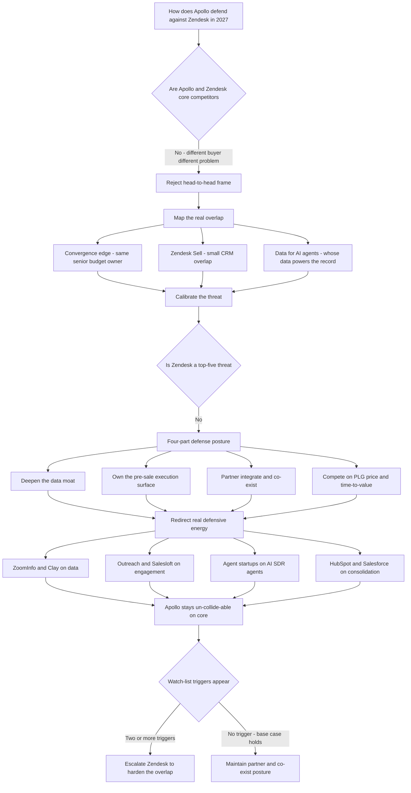

### Direct Answer

Apollo.io defends against Zendesk in 2027 not by fighting a head-to-head product war but by recognizing that the two companies barely collide: Apollo is a pre-sale go-to-market data and execution engine, Zendesk is a post-sale customer-experience platform, and they sell to different buyers solving different problems. The genuine overlap is narrow — the small Zendesk Sell CRM sidecar, a convergence edge at the senior dual-budget buyer, and the question of whose data powers AI agents — so Apollo's correct posture is to deepen its continuously-verified B2B data moat, own the pre-sale system of action, partner and integrate rather than compete, and lean on the product-led-growth funnel Zendesk's enterprise-sales DNA cannot match. The real defensive energy belongs elsewhere: ZoomInfo and Clay on data, Outreach and Salesloft on engagement, and the AI SDR agent field on the most dangerous front.

**TL;DR:** Zendesk is not a top-five threat to Apollo. Apollo (a private GTM platform on a ~$1.6B Series D valuation) and Zendesk (private since the 2022 Hellman & Friedman / Permira take-private) occupy opposite ends of the customer lifecycle. The defense is a four-part posture — deepen the data moat, own pre-sale execution, partner and co-exist, and compete on PLG and price — wrapped in a single discipline: do not let a versus-Zendesk framing pull resources away from the competitors actually aimed at Apollo's heart. Treat Zendesk as a partner and a watch-list, not a fire drill.

## 1. What This Question Is Actually Asking

The framing "how does Apollo defend against Zendesk in 2027" sounds like a competitive matchup, but the first job in answering it well is to notice that it is partly a trick question — and saying so plainly is more useful than pretending the two companies are locked in a duel they are not.

### 1.1 Why "Apollo vs Zendesk" Is The Wrong Mental Model

Apollo.io and Zendesk are not natural competitors. One is a go-to-market engine pointed at net-new revenue; the other is a customer-experience platform pointed at post-sale service. They sell to different buyers, solve different problems, sit in different parts of the org chart, and show up on different line items of the budget. A founder, operator, or investor who hears "Apollo vs Zendesk" and immediately starts comparing feature lists has already made the central mistake. **The right answer is a calibration exercise, not a feature war.**

### 1.2 The Three Things A Good Answer Must Do

A strong answer does three things in order. **First, establish what each company actually is** so the reader can see the gap. **Second, identify the genuinely narrow places where the two collide** — because they are real and worth defending. **Third, lay out a defense posture calibrated to the actual size of the threat** — which means partnering on most of the surface area, competing hard on a thin overlap, and redirecting the bulk of Apollo's defensive attention to the competitors actually aimed at it.

### 1.3 Treat It As Strategy Disguised As A Versus Question

The question is a useful prompt precisely because answering it well forces a clear-eyed map of Apollo's whole competitive position in 2027, not just one matchup. **Treat it as a strategy exercise disguised as a versus question** — the discipline it teaches (calibrate the threat before designing the defense) is the transferable lesson.

## 2. What Each Company Actually Is

Before any defense can be designed, an operator has to be precise about the two companies' real shapes — because the entire argument rests on the gap between them.

### 2.1 What Apollo.io Actually Is

Apollo.io is a go-to-market platform built around a proprietary B2B data graph. Founded in 2015 (originally as ZenProspect), it reached scale on a **product-led growth motion**: a generous free tier, self-serve signup, credit-card upgrades, and viral spread through individual SDRs and founders before the company ever talked to a buyer. By its 2023 Series D it had raised roughly $250 million at about a $1.6 billion valuation. The product has four layers stacked on the data: **the database itself** (on the order of 275M+ contacts and 73M+ companies with emails, direct dials, firmographics, technographics, and intent signals); **prospecting and enrichment**; **engagement and execution** (multichannel sequences, an integrated dialer, meeting scheduling, lightweight deal management); and **AI** (conversation intelligence, AI-assisted writing, AI SDR-style agents). The buyer is the revenue org — SDRs, AEs, RevOps, sales leadership, founders.

### 2.2 What Zendesk Actually Is

Zendesk is a customer-experience platform. Founded in 2007 in Copenhagen, it built its business on support ticketing — a clean help desk that scaled from SMB into enterprise. It went public in 2014, expanded into omnichannel, and made a small CRM move with **Zendesk Sell** (the rebuilt former Base CRM, acquired 2018). In **June 2022 Zendesk agreed to be taken private by a Hellman & Friedman and Permira-led group for approximately $10.2 billion**, closing late 2022. Since going private, the strategy has centered on AI: the Zendesk AI layer, autonomous "Resolve"-generation service agents, and an **outcome-based pricing** model where customers pay per automated resolution. It deepened the workforce side with the **Tymeshift** (workforce management) and **Klaus** (QA / conversation review) acquisitions. The buyer is the support and CX organization.

### 2.3 The Two-Company Comparison At A Glance

| Dimension | Apollo.io | Zendesk |
|---|---|---|
| Founded | 2015 (as ZenProspect) | 2007 (Copenhagen) |
| Ownership | Private, ~$1.6B Series D (2023) | Private, PE-owned since 2022 |
| Core function | Pre-sale GTM data + execution | Post-sale customer experience |
| Center of gravity | Find, reach, close net-new pipeline | Deflect, resolve, measure support |
| Data asset | 275M+ contacts, 73M+ companies | Inbound ticket / interaction history |
| Go-to-market | Product-led growth, self-serve | Sales-led, mid-market and enterprise |
| Buyer | SDR, AE, RevOps, sales leader, CRO | Support agent, CX leader, COO, CCO |
| Pricing model | Free tier + transparent per-seat | Seat-based moving to per-resolution |

### 2.4 Operators And Tickers In The Surrounding Landscape

The competitive map is populated by named, real public operators. **Salesforce (NYSE: CRM)** and **HubSpot (NYSE: HUBS)** are the platform consolidators. **ZoomInfo (NASDAQ: GTM)** is the incumbent B2B data company. **Microsoft (NASDAQ: MSFT)** looms over the CRM and agent layer through Dynamics and Copilot. **Twilio (NYSE: TWLO)** sits adjacent on customer communications. Apollo and Zendesk are themselves private, which shapes how each can move — Apollo on a venture clock, Zendesk on a patient PE one.

## 3. The Honest Threat Map: Where Zendesk Ranks

Before designing any defense, an operator has to rank the threat honestly, because a defense calibrated to the wrong threat size wastes resources Apollo does not have to waste.

### 3.1 Zendesk Is Not A Top-Five Threat

On a clear-eyed read, Zendesk is **not among Apollo's top five competitive threats** in 2027. It is a different-shaped company solving a different problem, in a different part of the org chart, on a different budget line. It earns a place in Apollo's strategic peripheral vision for three specific reasons — covered in Section 4 — but it does not earn front-of-mind defensive priority.

### 3.2 Who Is Actually Aimed At Apollo's Core

The companies genuinely aimed at Apollo's core fall into four fronts. On **B2B data**, ZoomInfo (NASDAQ: GTM) is the incumbent Apollo was built to undercut, and Clay is the fast-rising orchestration layer that re-aggregates every data source. On **sales engagement**, Outreach and Salesloft compete directly with Apollo's engagement layer, especially up-market. On **AI SDR agents** — the hottest and most dangerous front — 11x, Artisan, a wave of agent startups, plus Salesforce's Agentforce and HubSpot's Breeze, all race to automate the prospect-to-meeting motion Apollo monetizes. On **platform consolidation**, Salesforce (NYSE: CRM) and HubSpot (NYSE: HUBS) can bundle "good enough" data and engagement into a CRM the customer already owns.

### 3.3 The Ranked Threat Table

| Rank | Threat | Front | Priority |
|---|---|---|---|
| 1 | ZoomInfo | B2B data incumbent | Top-tier |
| 2 | Clay | Data orchestration / commoditization | Top-tier |
| 3 | 11x / Artisan / agent startups | AI SDR agents | Top-tier |
| 4 | Outreach / Salesloft | Sales engagement | High |
| 5 | HubSpot / Salesforce | Platform consolidation + bundled AI | High |
| 6 | Agentforce / Breeze | Incumbent AI agents | High |
| — | Zendesk | Adjacent post-sale platform | Peripheral / partner |

### 3.4 The Single Most Important Instruction

The single most important strategic instruction in this entire answer: **do not let a versus-Zendesk framing pull Apollo's defensive resources away from ZoomInfo, Clay, Outreach, 11x, HubSpot, and Salesforce, who are the actual threats.** A good defense against Zendesk is mostly a good offense on Apollo's own core, plus a partnership posture on the overlap.

## 4. The Three Genuine Collision Points

Zendesk earns peripheral attention — not zero attention — because there are exactly three places the two companies do, or will, collide. Each is real, and each is narrow.

### 4.1 Collision Point One: The Convergence Edge

The first genuine reason Zendesk belongs on Apollo's radar is convergence — the slow structural drift that has both companies, from opposite ends, moving toward "one platform for the entire customer conversation." Apollo built pre-sale and is extending into the customer relationship through deal management and AI agents. Zendesk built post-sale and has long had a CRM sidecar in Sell, while its AI-agent investments give it autonomous-conversation capability that could in principle face outward. **The place they meet is not a feature — it is a buyer.** As both climb toward "platform," they increasingly pitch the same senior budget owner: a CRO, COO, or Chief Customer Officer who controls both the revenue stack and the service stack. Apollo's defense here is not to out-feature Zendesk on service — it is to **own the pre-sale half so completely, and integrate so cleanly with the post-sale half, that the consolidation argument cuts in Apollo's favor for everything before the deal closes.**

### 4.2 Collision Point Two: Zendesk Sell

The second and most concrete overlap is **Zendesk Sell**, the CRM and sales-engagement product Zendesk carries alongside its service core. Sell offers pipeline management, email and call tracking, basic sequencing, and reporting — genuinely overlapping with Apollo's deal-management layer and engagement features, especially in SMB, where a small team might reasonably ask "we already have Zendesk for support; can we just use Zendesk Sell and skip Apollo?" The honest competitive reality is that **Zendesk Sell is a small, secondary product inside a company whose center of gravity, R&D budget, sales motion, and brand are all pointed at service.** Sell has no comparable B2B data graph behind it — a customer using Sell still has to source contacts and intent signals from somewhere else, and that somewhere else can be Apollo. The winning move is to make Sell a downstream destination for Apollo data rather than a substitute for Apollo.

### 4.3 Collision Point Three: The Data-For-AI-Agents Question

The third collision point is the most forward-looking: as Zendesk's AI agents mature, they need **context** — and the question of whose data fills the customer record becomes contested. An autonomous service agent resolving a ticket well wants to know who the customer is, how large their company is, what they bought, what their renewal looks like. Some of that is Zendesk's own first-party data — ticket history, interaction logs. But the firmographic, technographic, and intent layer is exactly what Apollo's data graph is built to provide and Zendesk's ticket-exhaust data is not. Apollo's defense is to **make itself the obvious, best, easiest enrichment source for the entire customer-conversation stack, Zendesk included** — so that Zendesk's agents getting smarter makes Apollo more essential, not less.

### 4.4 The Overlap Map

| Surface | Apollo Position | Zendesk Position | Overlap Level |
|---|---|---|---|
| B2B prospecting data | Core moat — 275M+ verified contacts | None — ticket-exhaust data only | None |
| Outbound sequencing / dialer | Core product | Minimal (basic, via Sell) | Low |
| Lightweight CRM / deal management | Growing layer | Zendesk Sell (small sidecar) | Medium — the real overlap |
| AI agents | Pre-sale: research, outreach, booking | Post-sale: ticket resolution | Low — different lifecycle ends |
| Customer service / ticketing | None | Core moat | None |
| Senior dual-budget buyer | Pitching consolidation upward | Pitching consolidation upward | The convergence edge |

### 4.5 Why The Overlap Stays Narrow Without Active Effort

A useful test of how seriously to take a competitive threat is to ask whether the overlap widens on its own or only widens if a company deliberately invests to widen it. **The Apollo-Zendesk overlap is the second kind — it does not drift wider by default.** A support platform does not accidentally accumulate a B2B prospecting graph; a prospecting engine does not accidentally accumulate a ticketing workflow. Each of the three collision points requires Zendesk to make a deliberate, expensive, against-the-grain decision: fund Sell into a real CRM, acquire a data asset, or point its agent layer outward. None of those is a passive outcome. That is structurally different from Apollo's relationship with, say, Clay or Outreach, where the overlap is the natural center of all three companies' roadmaps and widens whether anyone intends it or not. The practical consequence for Apollo's defense is that **the Zendesk overlap can be monitored rather than fought** — a watch-list is a sufficient instrument for a threat that only materializes through a visible, deliberate competitor decision, whereas the real threats need an active, resourced response because they advance on their own.

### 4.6 The Cost Of Misjudging The Overlap In Either Direction

There are two symmetric mistakes an operator can make reading this overlap, and both are expensive. **Overstating it** — treating Zendesk as a live competitor — leads Apollo to build defensive features against a non-threat, write competitive-comparison content that teaches the market the two are substitutes, and divert roadmap debate away from ZoomInfo and the agent field. **Understating it** — treating Zendesk as irrelevant — leads Apollo to neglect the integration, miss the early signals of a Zendesk Sell expansion, and lose the convergence-edge narrative to a more alert competitor. The correct posture threads between the two: Zendesk is a partner to integrate with and a competitor to watch, simultaneously, and the discipline is holding both of those at once without collapsing into either the fire-drill error or the irrelevance error.

## 5. Apollo's Two Real Moats

Every credible defense Apollo can mount traces back to two assets. An operator has to be precise about why each is a moat and not just a feature.

### 5.1 Moat One: The Continuously-Verified B2B Data Graph

Apollo's data graph — the 275M+ contacts, 73M+ companies, the emails, direct dials, firmographics, technographics, and intent signals — is a moat for three structural reasons. **First, it is continuously verified, not bought once.** B2B data decays fast: people change jobs, companies restructure, phone numbers go dead. Apollo's value is running the machinery — crawls, contributory data, validation, a multi-source waterfall — that keeps the list true. **Second, it compounds with usage.** Apollo's enormous user base, much of it on free and low-cost plans, is itself a data-quality engine: usage signals which records are real, which emails bounce, which dials connect. **Third, it is the wrong shape for a service platform to build.** Zendesk's data is a byproduct of inbound support conversations — deep on "what has this existing customer asked us" and structurally empty on "who in the world should we be talking to."

### 5.2 Moat Two: The Pre-Sale System Of Action

The second pillar is that Apollo is not a database — it is a **system of action** for the pre-sale motion. A rep does not just look up a contact; they build a list, score it, enroll it in a multichannel sequence, dial through it, get AI help drafting messaging, book the meeting, and move the deal — all in one place, on one data spine. That end-to-end execution loop is what makes Apollo sticky, and it is structurally hard for a service platform to replicate because the entire shape of the workflow — outbound, prospect-initiated, net-new — is the opposite of Zendesk's inbound, customer-initiated, post-sale workflow. **Apollo should never let itself be re-cast as "just a data vendor," because a data vendor is replaceable and a system of action is not.**

### 5.3 Why The Two Moats Reinforce Each Other

| Moat | What It Is | Why Zendesk Cannot Cross It |
|---|---|---|
| Data graph | Continuously-verified B2B contact + company data | Service data exhaust points the wrong direction |
| System of action | Find-reach-close execution loop on one spine | Pre-sale workflow is foreign to a support platform |
| Combined effect | Best data + most complete execution | Requires both the data shape and the workflow shape Zendesk lacks |

The data only matters if the execution layer turns it into booked meetings; the execution layer only matters if the data underneath is the best available. Together they are the thing Apollo is most defensible on — and precisely the thing a customer-experience platform is least naturally able to attack.

### 5.4 The Data Moat Under AI Pressure: Does It Still Hold

A fair challenge to the entire defense is whether Apollo's data moat survives the AI era at all, because if AI makes B2B data cheap to assemble, the foundation of every play weakens. The pessimistic read is real: large language models plus web-scale crawling plus cheap inference make it easier than ever to assemble a plausible-looking dataset, and a wave of AI-native data startups is betting exactly that. But the optimistic read is more durable for three reasons. **First, AI lowers the cost of assembling data, but not the cost of verifying it** — a model can guess that a person is probably still a VP of Sales, but only continuous, contributory, signal-fed verification can know it. **Second, AI raises the value of the freshest data rather than commoditizing it**, because an AI SDR agent acting autonomously on stale data fails louder and faster than a human did — it sends the wrong message to the wrong person at scale. **Third, Apollo's user base is an AI-era asset, not a legacy one** — the usage signals from a huge free base are exactly the real-world feedback loop an AI-native startup with no users cannot synthesize. The honest conclusion: the moat is under genuine pressure, but the pressure comes from Clay and AI-native data startups, not from Zendesk — and the response is the same Posture One the rest of this answer prescribes.

### 5.5 Why A Service Platform Cannot Bootstrap The Pre-Sale Moat

It is worth being precise about why Zendesk, specifically, cannot route around either moat — because "they are different companies" is an assertion, and the structural reason is the actual argument. A B2B prospecting graph is built from the outside in: it requires crawling the entire universe of companies and people, verifying records about prospects who have no relationship with you, and maintaining that graph against constant decay. Zendesk's data is built from the inside out: it accumulates as a byproduct of customers who already chose to contact a Zendesk customer for support. Those two data-generating processes do not convert into each other. Zendesk could buy a data company — that is exactly the watch-list trigger in Section 11 — but it cannot grow one from its own operations, because its operations point the wrong direction. The same is true of the system of action: Zendesk's workflow engine is tuned for inbound, customer-initiated, ticket-shaped work, and a pre-sale motion is outbound, rep-initiated, and sequence-shaped. **Re-tooling a support workflow engine into a prospecting execution engine is not an upgrade — it is a different product.** That is why both moats are genuinely defensible against Zendesk specifically, in a way they are not defensible against ZoomInfo or Outreach, who are already the right shape.

## 6. The Four-Part Defense Posture

Apollo defends against Zendesk by refusing the head-to-head frame and instead executing four calibrated moves.

### 6.1 Posture One: Deepen The Data Moat

The first play is the most fundamental and least glamorous: out-invest everyone, Zendesk emphatically included, on data. This means continuous improvement on **coverage** (more contacts, more companies, more geographies, more of the SMB and international long tail), **freshness** (faster job-change detection, faster re-verification), **depth** (richer technographics, sharper intent signals), and **accuracy** (lower bounce rates, higher dial-connect rates). Practically: keep the free tier generous because the user base is a data-quality flywheel; treat verification machinery as core R&D, not a cost center; benchmark relentlessly against ZoomInfo and Clay. Every other defense rests on this one.

### 6.2 Posture Two: Own The Pre-Sale Execution Surface

The second play is to own the pre-sale execution surface so completely there is no opening for any adjacent platform to claim it. Treat sequencing, the dialer, email, LinkedIn steps, meeting booking, deal management, and the AI SDR agent layer as one coherent, deeply-integrated system, and race to keep it the most complete version on the market. The danger is not Zendesk taking this surface — it is Apollo neglecting it and letting Outreach, Salesloft, or an 11x-style startup take pieces. Owning the execution surface is a defense against the real threats that happens to also seal off the Zendesk convergence edge.

### 6.3 Posture Three: Partner, Integrate, And Co-Exist

The third play feels counterintuitive in a "defend against" framing but is the highest-leverage move: **partner with Zendesk rather than fight it.** Because the overlap is narrow and the products are complementary, make Apollo a clean, valued part of the stack that includes Zendesk. In practice: a well-built integration so Apollo data flows into Zendesk; a presence in the Zendesk Marketplace; co-selling where it makes sense; and a consistently-repeated narrative that the two solve adjacent halves of the customer lifecycle. Every integration that makes Apollo more useful inside a Zendesk-using org raises switching costs and converts a notional competitor into a distribution channel.

### 6.4 Posture Four: Compete On PLG, Price, And Time-To-Value

The fourth play leans into the structural advantage that built Apollo and that Zendesk's DNA cannot match: **product-led growth, aggressive pricing, and ruthless time-to-value.** Apollo went from a standing start to a $1.6B-valuation Series D on a motion Zendesk has never run — a generous free tier, instant self-serve signup, credit-card upgrades, viral spread through individual end users. Zendesk's go-to-market is the opposite: enterprise and mid-market sales-assisted onboarding, longer cycles, higher friction. Wherever the buyer is a small team or an individual rep who wants to be productive today, Apollo's funnel wins on speed and price before any feature comparison happens.

### 6.5 How The Four Plays Reinforce Each Other

The four plays are not a menu to choose from — they are a single interlocking system, and seeing the interlock is what makes the posture robust. **The data moat (Play 1) is the foundation of the other three.** Owning the pre-sale execution surface only matters if the data underneath the sequences and the agents is the best available; the partnership posture only works if Apollo's data is the obvious thing for Zendesk to want to integrate; the PLG funnel only converts if the free-tier data is good enough to hook a user in their first session. **Play 2 is the product expression of Play 1** — a system of action is what turns a data asset into daily, sticky, switch-cost-generating usage. **Play 3 takes the output of Plays 1 and 2 and routes it through Zendesk's installed base** rather than against it, converting a notional competitor into a distribution surface. **Play 4 is the acquisition engine that keeps feeding all three** — every free-tier rep is a new data signal, a new integration touchpoint, and a new switching cost. Pull any one play out and the other three weaken. That interlock is itself a defense: a competitor cannot beat Apollo by winning on one front, because each front is buttressed by the other three.

### 6.6 The Posture Summary Table

| Play | Core Move | What It Defends | Depends On |
|---|---|---|---|
| 1. Deepen the data moat | Out-invest on coverage, freshness, depth, accuracy | The asset no service platform can build | Free-tier user base flywheel |
| 2. Own pre-sale execution | Sequencing + dialer + deal mgmt + AI SDR agents as one system | Seals the convergence edge; answers Zendesk Sell | Play 1's data spine |
| 3. Partner, integrate, co-exist | Strong integration + Zendesk Marketplace presence | Converts overlap into a distribution channel | Plays 1 and 2 producing value worth integrating |
| 4. Compete on PLG and price | Protect free tier, self-serve funnel, time-to-value | Close to a complete answer in SMB | All three above to convert and retain |

### 6.7 What The Posture Looks Like When It Is Working

It is worth describing the success state concretely, because a defense without an observable outcome is hard to manage against. When the four-part posture is working, several things are true at once. **A prospect evaluating Zendesk Sell against Apollo sees no real contest** — Apollo's data, sequencing depth, dialer, and agents are visibly a more complete pre-sale system, and the rep is live and productive before the Zendesk Sell trial is even configured. **A Zendesk customer discovers Apollo in the Zendesk Marketplace** as the natural pre-sale companion, and the integration is good enough that the two products feel designed to sit together. **A CRO or COO weighing consolidation hears a clean Apollo narrative** — pre-sale here, post-sale there, integrated cleanly, splitting them is correct — and the consolidation pitch loses its pull. And **Apollo's roadmap debates are about ZoomInfo, Clay, and the agent field**, with Zendesk appearing only as a quarterly watch-list line item. If those four conditions hold, the defense is working; if any one slips, that is the signal of where to invest next.

## 7. The AI Agent Front: Where The Real Fight Is

If an operator wants to know where Apollo should actually be spending its defensive worry in 2027, the answer is the AI agent front — and seeing this clearly is the best argument for why the Zendesk question, while useful, is not the urgent one.

### 7.1 Both Ship Agents — At Opposite Ends Of The Lifecycle

Both Apollo and Zendesk are shipping AI agents, but at opposite ends of the lifecycle. **Zendesk's agents resolve support tickets autonomously; Apollo's agents research accounts, draft outreach, and book meetings autonomously.** Those are not the same product and not the same buyer. The Zendesk angle on the AI front is narrow — it is the data-for-agents question of Section 4.3.

### 7.2 The Real Agent Fight Is The Pre-Sale Field

The real fight for Apollo's AI agents is against the **pre-sale agent field**: 11x and Artisan and the wave of "AI SDR" startups, Salesforce's Agentforce, HubSpot's Breeze, and the possibility that Outreach or Salesloft reframe themselves around agents. That is the category-defining fight, because whoever owns the autonomous prospect-to-meeting motion owns the next decade of Apollo's market. Apollo's advantage in that fight is, again, the data — an AI SDR agent is only as good as the contacts and context it acts on, and Apollo's agents run on Apollo's graph while a pure-agent startup has to rent its data.

### 7.3 The Allocation Instruction

The strategic point for this section is one of allocation: **Apollo's AI investment should be aimed at the pre-sale agent category and the data advantage that wins it — not at matching Zendesk's service agents, which is not Apollo's category and not Apollo's fight.**

| AI Agent Front | Apollo's Role | Where Defensive Energy Goes |
|---|---|---|
| Pre-sale SDR agents | Core category — must win | Maximum: 11x, Artisan, Agentforce, Breeze |
| Service / support agents | Not Apollo's category | None — Zendesk's territory |
| Data-for-agents enrichment | Be the standard input everywhere | Moderate: be Zendesk's enrichment source |

### 7.4 Why The Agent Era Strengthens The Data Moat Against Zendesk

There is a counterintuitive point worth making explicit: the rise of AI agents, far from eroding the Apollo-Zendesk distinction, actually sharpens it. An autonomous agent is only as good as the data and context it acts on, and the two companies' agents draw from structurally different wells. Zendesk's service agents pull from the first-party support record — what this customer asked, what was resolved, what the sentiment was. Apollo's pre-sale agents pull from the B2B graph — who to contact, at which company, with which signal, through which channel. **An agent makes the underlying data more consequential, not less**, because a human used to silently correct for stale data and an agent does not. That means the agent era rewards whoever has the freshest, most complete data for the specific job — and for the pre-sale job, that is unambiguously Apollo. The strategic read is that Apollo should welcome the agent era as a moat-deepener for its own category, while declining to chase Zendesk into the service-agent category where Apollo's data is the wrong data and the moat works in Zendesk's favor instead.

## 8. The Buyer, Budget, And Pricing Reality

A defense strategy that ignores who actually signs the contract will misfire, so it is worth being explicit about the buyer and budget map.

### 8.1 The Buyer Separation Is Itself A Defense

Apollo's buyer is the revenue org. The user is the SDR, BDR, AE, or founder; the economic buyer is a sales leader, head of RevOps, or VP of Sales — and increasingly, as Apollo moves up-market, a CRO. The budget line is sales technology. Zendesk's buyer is the service org. The user is the support agent; the economic buyer is a head of support or VP of Customer Experience — and at scale a COO or Chief Customer Officer. The budget line is customer-service technology. For most of 2027 these are different people spending different budgets, and **that separation is itself a defense.**

### 8.2 Pricing And Packaging As A Defensive Weapon

Apollo's pricing posture — a real free tier, transparent published plans, low per-seat entry, credit-card self-serve — is a weapon against three threats at once. Against **enterprise data incumbents** (ZoomInfo), it is the disruptor's classic move: same job, radically lower friction and price. Against **platform consolidators** (HubSpot, Salesforce), it is how Apollo gets adopted by the end user before procurement and the bundling conversation happen. And against **Zendesk Sell** specifically, it is close to decisive: a small team weighing "use Zendesk Sell since we have Zendesk" against "add Apollo" is comparing a sales-led vendor's sidecar against a tool a rep can be live on for free this afternoon.

### 8.3 The Budget Map Table

| Factor | Apollo | Zendesk |
|---|---|---|
| User | SDR, BDR, AE, founder | Support agent |
| Economic buyer | Sales leader, RevOps, CRO | Head of support, CX leader, COO |
| Budget line | Sales technology / GTM tooling | Customer-service / support technology |
| Buying motion | Self-serve, bottom-up, PLG | Sales-assisted, top-down, enterprise |
| Overlap point | CRO / COO / CCO owning both budgets | CRO / COO / CCO owning both budgets |

### 8.4 The Packaging Instruction

Keep the **free tier generous enough to hook and feed the data flywheel**. Keep the **paid tiers transparent and aggressively priced** so the comparison against any competitor is favorable before features are discussed. And as Apollo moves up-market, **build enterprise packaging that does not abandon the PLG base** — the up-market motion should be a layer on the funnel, not a replacement, because the funnel is the moat.

### 8.5 The Up-Market Tension Apollo Must Manage

There is a real tension in Posture Four that an honest answer has to name: the move up-market, toward CROs and larger contracts, is in some ways a move toward Zendesk's own go-to-market shape. Enterprise deals mean sales-assisted motions, longer cycles, procurement, and security reviews — exactly the friction the PLG funnel was built to avoid. If Apollo lets the enterprise motion become the primary motion, it slowly trades away the structural advantage that makes the Zendesk Sell comparison a non-contest. **The discipline is to treat enterprise as a graduation path, not a replacement.** A rep adopts Apollo for free, a team standardizes on it, and only then does an enterprise contract formalize what bottom-up adoption already proved. The funnel stays the front door; the enterprise motion is the back office that monetizes what the funnel already won. An operator should watch one metric closely here: the share of enterprise logos that started as self-serve adoption. If that share stays high, the funnel is still the moat; if it falls, Apollo is drifting toward a sales-led motion and quietly surrendering its edge over every sales-led competitor, Zendesk included.

### 8.6 Time-To-Value As The Sharpest Weapon

Of the three components of Posture Four — PLG, price, and time-to-value — the last is the sharpest and the most under-discussed. Price wins comparisons; PLG wins distribution; but **time-to-value wins the moment that actually decides the deal.** A rep who books a real meeting through Apollo in their first session is a rep who never seriously evaluates an alternative, because the alternative now has to be not just better but better-enough-to-justify-switching-away-from-something-that-already-worked. Against Zendesk Sell specifically, time-to-value is close to decisive: the Sell evaluation starts with configuration, data import, and setup, while the Apollo evaluation can start with a search that returns 50 real contacts and a sequence that goes live the same hour. The instruction is to **obsess over the first-session experience as a competitive weapon, not just an onboarding nicety** — every hour shaved off time-to-first-value is an hour of competitor evaluation that never happens.

## 9. The Ecosystem And What Apollo Should Not Do

Apollo's defense extends beyond its own product into the ecosystem it sits in — and a defense strategy is as much about discipline, the moves not to make, as about the moves to make.

### 9.1 Integration As Defensive Infrastructure

Apollo lives in a stack: it pushes data into Salesforce (NYSE: CRM) and HubSpot (NYSE: HUBS) CRMs, connects to email and calendar, integrates with Slack and the wider RevOps tool chain, and can integrate cleanly with Zendesk. The strategic logic of being deeply integrated everywhere is that **each integration raises switching costs and embeds Apollo in the customer's daily workflow.** Against Zendesk, a strong integration and Marketplace presence turns Apollo into the natural pre-sale companion for Zendesk's installed base, converting overlap into distribution.

### 9.2 The Traps To Avoid

**Apollo should not build a customer-service product** — chasing Zendesk into ticketing would burn R&D on a category Apollo has no data advantage, buyer relationship, or brand permission in. **Apollo should not treat Zendesk as a top-tier threat in its planning**, because every cycle that over-weights Zendesk under-weights the actual threats. **Apollo should not pick a public fight with Zendesk** or build comparison pages against it, because that framing teaches the market the two are substitutes. **Apollo should not neglect the Zendesk integration** out of competitive squeamishness. **Apollo should not let the convergence edge pull it into premature, sprawling platform expansion.**

### 9.3 The Discipline Of Staying In Lane

The throughline of the don'ts is a single discipline: **stay in lane, keep the lane the best in the world, integrate generously, and spend the real competitive energy where the real competitors are.** This is harder than it sounds, because every adjacent category looks like a growth opportunity and every convergence narrative is seductive. The temptation to "become a platform for everything" is exactly how focused companies dilute the moat that made them. Apollo's lane — the pre-sale find-reach-close motion on a continuously-verified data spine — is large, growing, and under genuine attack from real competitors; there is no shortage of important work inside it. A company that wins its own lane decisively is far better positioned for an eventual convergence fight than a company that spread itself thin trying to pre-empt every adjacency. **Discipline is not timidity — it is the precondition for winning the fight that actually matters.**

### 9.4 The Do / Don't Table

| Do | Don't |
|---|---|
| Deepen data freshness and coverage | Build a customer-service / ticketing product |
| Own the pre-sale execution surface | Treat Zendesk as a top-five threat in planning |
| Build and maintain a strong Zendesk integration | Pick a public fight or build anti-Zendesk pages |
| Keep the free tier and PLG funnel sharp | Let convergence trigger sprawling platform land-grabs |
| Keep a live Zendesk watch-list | Let "peripheral" calcify into "irrelevant" |

## 10. How An Operator Runs This Defense Quarter By Quarter

Strategy that never becomes a calendar is just a slide, so it is worth making the defense concrete as something a RevOps or product leader at Apollo would actually operate.

### 10.1 The Quarterly Operating Rhythm

Each quarter, the **data team** reports the moat metrics that matter against the real threats — coverage growth, bounce-rate trend, dial-connect rate, job-change detection latency, benchmark deltas against ZoomInfo and Clay — and those numbers drive the data roadmap. The **product team** reports the completeness of the pre-sale system of action: where the engagement layer sits against Outreach and Salesloft, how the AI SDR agent compares to 11x and Agentforce, whether deal management is good enough that SMB teams stop asking for a separate CRM. The **partnerships team** owns the Zendesk relationship as a line item: integration health, Marketplace presence, install counts, co-sell pipeline.

### 10.2 The Watch-List Owner

One named owner — ideally in corporate strategy or product leadership — owns the convergence-edge watch-list, reviews the escalation triggers every quarter, and has a standing mandate to raise a flag the moment two triggers light up. The discipline this imposes is the whole point: it keeps Zendesk handled as a partnership and a watch-list rather than a fire drill.

### 10.3 The Operating Cadence Table

| Owner | Reports On | Cadence | Drives |
|---|---|---|---|
| Data team | Coverage, freshness, accuracy, ZoomInfo/Clay deltas | Quarterly | Data roadmap |
| Product team | Pre-sale system completeness vs Outreach, 11x | Quarterly | Product roadmap |
| Partnerships team | Zendesk integration health, Marketplace, co-sell | Quarterly | Partner roadmap |
| Strategy owner | Convergence-edge watch-list, escalation triggers | Quarterly | Posture escalation |

## 11. The Watch-List: When Zendesk Escalates

Good strategy stress-tests its own assumptions, so it is worth being honest about the conditions under which Zendesk would graduate from peripheral to genuine threat.

### 11.1 The Escalation Triggers

Zendesk becomes a real Apollo threat if several things happen together. **First, aggressive Zendesk Sell expansion** — real R&D and sales motion poured into Sell, a B2B data acquisition to put a graph behind it, repositioning as "the full customer platform." **Second, AI agents turning outward** — autonomous-agent technology built for support pointed at outbound and engagement. **Third, a major acquisition** — Zendesk buying a sales-engagement or data company, or being rolled into a larger platform with revenue-side products. **Fourth, the convergence edge arriving faster than expected** — buyers consolidating pre-sale and post-sale into single platform decisions at scale.

### 11.2 The Escalation Rule

If **two or more** of those signals appear, Apollo should escalate Zendesk from "partner and co-exist" toward "monitor closely and harden the overlap." The honest 2027 assessment is that none of these is the base case: Zendesk's owners have shown every sign of doubling down on service-AI and outcome-based pricing, not pivoting into go-to-market. **The counter-scenario is a watch-list, not a forecast.**

### 11.3 The Watch-List Table

| Trigger | Signal To Watch | Status (2027 Base Case) |
|---|---|---|
| Zendesk Sell expansion | Real R&D + sales motion into Sell | Not occurring |
| Data acquisition | Zendesk buys a B2B data asset | Not occurring |
| Agents turn outward | Resolve agents pointed at outbound | Not occurring |
| Transformational M&A | Zendesk acquires GTM company or is rolled up | Not occurring |
| Buyer consolidation | Pre/post-sale merged into one platform decision at scale | Early, not widespread |

## 12. Counter-Case: Why "Apollo Easily Defends Against Zendesk" Could Be Wrong

The answer above argues Zendesk is a peripheral threat. That is the right base case for 2027 — but a serious strategist has to argue the other side, because the comfortable view is exactly the one that gets a company blindsided.

### 12.1 Convergence Is A One-Way Ratchet

"These companies solve different problems for different buyers" is true right up until it is not. Salesforce was a sales CRM; it is now a service, marketing, analytics, and agent platform. HubSpot was inbound marketing; it is now a full CRM suite. The pattern of SaaS is that platforms eat adjacent categories, and "post-sale service" and "pre-sale revenue" are adjacent. If the convergence edge arrives faster than the base case assumes, Apollo will have spent years treating its eventual competitor as a partner.

### 12.2 Private-Equity Owners Are Unsentimental

Zendesk is no longer a founder-led public company protecting a brand identity. It is owned by Hellman & Friedman and Permira, whose job is to maximize an exit. If the go-to-market market looks more attractive than the service market, PE owners can fund an aggressive Zendesk Sell expansion, bolt on a data acquisition, and reposition the company in a way a founder-led firm might never have. **Apollo is partly betting on Zendesk's strategic restraint — and PE owners are not famous for restraint.**

### 12.3 The Agent Layer Is More Portable Than Admitted

The base case says Zendesk's agents resolve tickets and Apollo's do outbound, and the two are different products. But an autonomous agent is increasingly a general capability — research, reason, draft, act. If Zendesk has built genuinely strong agent infrastructure for support, pointing some of it outward at engagement is a smaller leap than "different lifecycle ends" implies.

### 12.4 "Partner, Don't Compete" Can Be A Slow-Motion Trap

A deep integration with a larger or differently-resourced platform always carries the risk that the platform learns the partner's value, then internalizes it. Apollo feeding its data into Zendesk is genuinely useful to customers — and it is also a live demonstration to Zendesk of exactly what a B2B data layer is worth.

### 12.5 The SMB Buyer Might Just Use What They Have

The base case is confident Apollo's PLG funnel wins SMB against Zendesk Sell. But the most powerful force in SMB software is inertia and bundling: a small team that already pays Zendesk for support, sees "Sell" in the same login, and is told it is "good enough" may simply never run the Apollo evaluation. **"Good enough and already here" beats "better but separate" more often than product people like to admit.**

### 12.6 Underrating A Competitor Is The Classic Disruption Setup

The entire Innovator's Dilemma is incumbents correctly observing that a competitor "isn't really aimed at us" — right up to the moment it is. Apollo telling itself "Zendesk is peripheral, focus elsewhere" is structurally the exact sentence disrupted companies say. And the "real threats" framing, while genuinely true, is also psychologically convenient: fighting known competitors on known fronts is more comfortable than thinking hard about a weird, slow, ambiguous convergence threat.

### 12.7 The Counter-Case Scorecard

| Counter-Argument | Strength | Effect On The Defense |
|---|---|---|
| Convergence is a one-way ratchet | Strong | Keep watch-list live, not a formality |
| PE owners pivot-friendly | Strong | Do not bet on Zendesk's restraint |
| Agent layer is portable | Moderate | Monitor whether Resolve faces outward |
| Partnership teaches the moat away | Moderate | Share value without teaching the recipe |
| SMB inertia favors Zendesk Sell | Moderate | Sharpen PLG time-to-value relentlessly |
| Underrating is the disruption setup | Strong | Never let "peripheral" become "irrelevant" |

### 12.8 The Zero-CAC Expansion Risk

One counter-argument deserves its own treatment because it is the most concrete: Zendesk already has a large installed base of paying companies, and selling Zendesk Sell into that base is a one-email, one-toggle motion with no acquisition cost. If Zendesk decided to monetize its base on the pre-sale side, it would not be running its funnel against Apollo's funnel — it would be running **zero-CAC expansion against a base Apollo has to win one rep at a time.** That is a genuine asymmetry and the base case should not wave it away. But it cuts both ways. Zero-CAC expansion only converts if the expanded product is good enough to retain, and a Sell offering with no B2B data graph behind it produces a poor pre-sale experience that churns. Cross-sell can put a product in front of a customer for free; it cannot make a data-starved product work. The honest read is that the zero-CAC motion is a real distribution advantage for any future Zendesk pre-sale push — which is precisely why the watch-list trigger "Zendesk acquires a B2B data asset" matters so much. The distribution is already there; the missing piece is the data, and the day Zendesk buys the data is the day the counter-argument becomes a base case.

### 12.9 The Honest Synthesis

The base case still holds for 2027: Zendesk is a peripheral, partner-shaped competitor, and Apollo's energy genuinely should go to ZoomInfo, Clay, Outreach, 11x, HubSpot, and Salesforce. But the counter-case sharpens the defense rather than overturning it. It says: hold the partner posture, but hold it with eyes open — maintain the Zendesk watch-list as a live document; treat the convergence edge as a real multi-year risk with an owner and a quarterly review; be deliberate that the partnership shares value without teaching away the moat; and never let "Zendesk is peripheral" calcify into "Zendesk is irrelevant," because the distance between those two sentences is exactly where incumbents get disrupted.

## 13. The Long Game And The Synthesized Posture

Because the most serious version of the Zendesk question is a multi-year one, it is worth zooming out past 2027.

### 13.1 Three Long-Run Scenarios

The most likely long-run scenario is **durable co-existence**: Apollo owns the pre-sale half, Zendesk owns the post-sale half, they integrate deeply, and the "platform for everything" narrative stays a narrative. A second scenario is **convergence into competition**: the buyer consolidates, AI agents blur the lifecycle, a transformational acquisition happens, and the two genuinely end up in the same RFP — in which case the years Apollo spent deepening its moats are exactly what let it enter that fight from strength. A third is **mutual irrelevance to each other**: Apollo gets absorbed by a CRM consolidator, or Zendesk gets rolled into a larger CX platform, and the two never collide because larger forces reshaped both first.

### 13.2 The Robust-Across-Scenarios Instruction

Across all three scenarios, the same instruction holds: deepen the data, own the pre-sale system of action, partner cleanly, defend the funnel, and watch the triggers. **A posture that is correct whether the future brings co-existence, convergence, or consolidation is a robust posture** — and that robustness, more than any single tactic, is the real answer to the question. The deeper point is that good competitive strategy does not require predicting which scenario arrives; it requires building a posture whose moves pay off under all of them. Deepening the data moat is correct if Apollo and Zendesk co-exist forever (it keeps Apollo essential), correct if they converge into competition (it is the asset Apollo fights from), and correct if a consolidator absorbs the market (it is what makes Apollo worth absorbing on good terms). The same is true of every other play. **When a strategy's moves are scenario-independent, the company is freed from the impossible task of forecasting and can simply execute** — and that freedom is the practical payoff of refusing the head-to-head frame at the very start of this answer.

### 13.3 The One-Paragraph Version For A Time-Pressed Operator

If an operator has thirty seconds, here is the entire answer compressed: Apollo and Zendesk are not real competitors — pre-sale versus post-sale, different buyer, different budget — so do not run a feature war. Watch the three narrow overlaps (Zendesk Sell, the convergence edge, data-for-agents), but treat them as a watch-list, not a fire drill. Win by deepening the data moat, owning the pre-sale execution surface, integrating with Zendesk rather than fighting it, and protecting the PLG funnel. Spend the real competitive energy on ZoomInfo, Clay, Outreach, and the AI SDR agent field. Escalate only if two watch-list triggers light up. That is the whole defense.

### 13.4 The Synthesized Defense Posture

Pulling the whole answer into one coherent posture: Apollo defends against Zendesk in 2027 by refusing the head-to-head frame and executing four calibrated moves. **One, deepen the data moat.** **Two, own the pre-sale execution surface.** **Three, partner, integrate, and co-exist.** **Four, compete on PLG, price, and time-to-value.** And wrapping all four: **redirect the real defensive energy to the real threats.** Apollo does not "beat Zendesk." Apollo makes itself un-collide-able on its core, partners cleanly on the overlap, and spends its scarce competitive attention where competitors are actually pointed at its heart. That is the defense: not a war, but a posture of depth, focus, partnership, and disciplined attention allocation.

## 14. The Defense Decision Flow

The diagram below traces how Apollo calibrates its response to Zendesk — from rejecting the head-to-head frame, through mapping the narrow overlap, to the four-part posture and the watch-list escalation logic.

## 15. Cross-Links And Sources

### 15.1 Related Pulse Library Entries

For readers tracing the wider Apollo competitive map, the following sibling entries go deeper on adjacent questions. The most direct neighbor on Apollo's exposure to AI-driven outbound is the question of what replaces Apollo sequencing when agents handle outbound (q1908). The acquisition-angle counterparts — how Apollo's competitive position looks from an acquirer's seat — are covered in the Outreach-acquires-Apollo analysis (q1892) and the ZoomInfo-acquires-Apollo analysis (q1871). On the sales-engagement front that is a genuine top-tier threat, the Salesloft competitive-moat breakdown is the closest companion (q1809). For the buyer's-eye comparison of Apollo against its real data rival, the Apollo-versus-ZoomInfo evaluation for an outbound team is the practical reference (q1109). The defend-against pattern this entry follows is mirrored for the consolidation giants in the HubSpot-versus-Salesforce defense analysis (q1905). The bundling-pressure dynamic that shapes Apollo's PLG posture is examined in the Salesloft-versus-HubSpot-bundling entry (q1855). The three-way sales-engagement comparison that situates Apollo among Outreach and Salesloft is a useful stack-decision companion (q400). And the AI-agent disruption thesis that drives Section 7 is developed in the entry on what replaces SDR teams when AI agents replace SDRs natively (q1899).

### 15.2 Sources

1. **Apollo.io — Official Site, Product, and Platform Pages** — Primary reference for Apollo's data graph scale, prospecting, engagement, dialer, deal management, and AI agent capabilities. https://www.apollo.io
2. **Apollo.io — Pricing and Plans** — Reference for Apollo's free tier, self-serve PLG motion, and published per-seat pricing. https://www.apollo.io/pricing
3. **Apollo.io — Series D Funding Announcement (2023)** — Reference for Apollo's ~$250M Series D at a ~$1.6B valuation. https://www.apollo.io/newsroom
4. **Zendesk — Official Site and Customer Experience Platform** — Primary reference for Zendesk's service, omnichannel, and platform positioning. https://www.zendesk.com
5. **Zendesk AI and AI Agents (Resolve generation)** — Reference for Zendesk's autonomous service-agent layer and AI strategy post-take-private. https://www.zendesk.com/service/ai/
6. **Zendesk Sell — CRM and Sales Product** — Reference for the Zendesk Sell CRM/sales sidecar, the genuine point of overlap with Apollo. https://www.zendesk.com/sell/
7. **Reuters — "Zendesk agrees to be taken private in $10.2 billion deal" (June 2022)** — Coverage of the Hellman & Friedman and Permira-led take-private. https://www.reuters.com/business/zendesk-agrees-be-taken-private-2022-06-24/
8. **Hellman & Friedman — Zendesk Acquisition Announcement** — Private-equity acquirer reference for the take-private transaction and ownership structure. https://www.hf.com
9. **Permira — Zendesk Investment** — Co-lead private-equity investor reference for the Zendesk take-private. https://www.permira.com
10. **Zendesk — Tymeshift Acquisition (Workforce Management)** — Reference for Zendesk's expansion into WFM via the Tymeshift acquisition. https://www.zendesk.com/newsroom/
11. **Zendesk — Klaus Acquisition (QA / Conversation Review)** — Reference for Zendesk's quality-assurance and conversation-review capability via Klaus.
12. **Zendesk — Outcome-Based Pricing Announcement** — Reference for Zendesk's per-resolution pricing model and its strategic divergence from seat-based SaaS.
13. **Zendesk Marketplace — App and Integration Directory** — Reference for the integration and partnership channel relevant to Apollo's co-exist posture. https://www.zendesk.com/marketplace/
14. **TechCrunch — Apollo.io Funding and Growth Coverage** — Independent journalism on Apollo's funding rounds, valuation, and PLG-driven growth.
15. **Crunchbase — Apollo.io Company Profile** — Funding history, investor list, and company-stage reference. https://www.crunchbase.com/organization/apollo-io
16. **G2 — Sales Intelligence and Sales Engagement Category Pages** — Comparative positioning of Apollo against ZoomInfo, Outreach, Salesloft, and Clay. https://www.g2.com
17. **ZoomInfo — Official Site and Platform** — Reference for the incumbent B2B data competitor central to Apollo's real threat map. https://www.zoominfo.com
18. **ZoomInfo — Investor Relations** — Reference for ZoomInfo's public-company financial profile and data-business scale. https://investors.zoominfo.com
19. **Clay — Official Site (GTM Data Orchestration)** — Reference for the data-orchestration competitor that re-aggregates sources and pressures single-database moats. https://www.clay.com
20. **Outreach — Sales Execution Platform** — Reference for the sales-engagement competitor central to Apollo's engagement-layer threat map. https://www.outreach.io
21. **Salesloft — Revenue Workflow Platform** — Reference for the sales-engagement competitor alongside Outreach. https://www.salesloft.com
22. **11x — AI SDR / Digital Worker Platform** — Reference for the AI-agent SDR competitor on Apollo's most dangerous front. https://www.11x.ai
23. **Artisan — AI Sales Agent Platform** — Reference for the AI-agent SDR competitor field. https://www.artisan.co
24. **Salesforce Agentforce — AI Agent Platform** — Reference for the platform-incumbent AI-agent entrant relevant to Apollo's agent strategy. https://www.salesforce.com/agentforce/
25. **HubSpot Breeze — AI and CRM Platform** — Reference for the platform-consolidator AI and bundling threat to Apollo. https://www.hubspot.com/products/artificial-intelligence
26. **Salesforce — CRM Platform** — Reference for the platform-consolidation threat and the CRM Apollo integrates with. https://www.salesforce.com
27. **HubSpot — CRM Platform** — Reference for the platform-consolidation threat and CRM integration target. https://www.hubspot.com
28. **Microsoft Dynamics 365 and Copilot** — Reference for the Microsoft-side CRM and agent pressure on the GTM software market. https://www.microsoft.com/dynamics365
29. **Gartner — Magic Quadrant for Sales Engagement / Revenue Technology** — Analyst context on the sales-tech competitive landscape and category boundaries.
30. **Gartner — Magic Quadrant for the CRM Customer Engagement Center** — Analyst context on the customer-service platform landscape Zendesk competes in.
31. **Forrester — B2B Sales Intelligence and Revenue Operations Research** — Analyst context on B2B data and RevOps tooling categories.
32. **SaaStr — Product-Led Growth and Go-To-Market Strategy Analysis** — Reference for PLG-versus-sales-led go-to-market dynamics relevant to Apollo's funnel defense.
33. **OpenView Partners — Product-Led Growth Research** — Reference for the PLG motion economics underpinning Apollo's growth and defense.
34. **Bessemer Venture Partners — State of the Cloud / Vertical SaaS Reports** — Analyst context on platform convergence and AI-agent adoption trends.
35. **a16z — AI Agents and Enterprise Software Commentary** — Reference for the AI-agent category dynamics shaping both Apollo's and Zendesk's roadmaps.
36. **Clayton Christensen — "The Innovator's Dilemma"** — Foundational reference for the disruption-from-a-non-competitor warning in the counter-case.
37. **LinkedIn and Built In — Company Headcount and Hiring Signals (Apollo and Zendesk)** — Reference for relative company scale, hiring focus, and product-investment direction.
