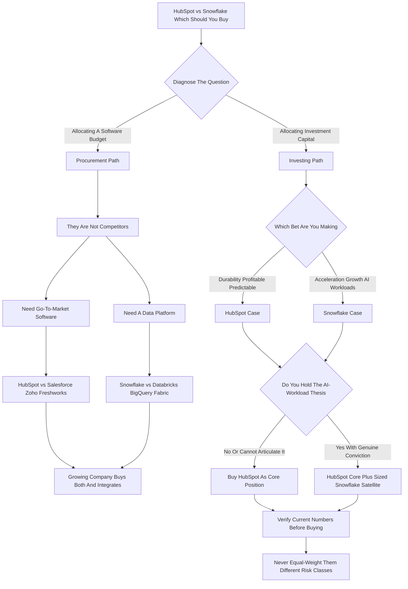

### Direct Answer

**HubSpot vs Snowflake is not one decision -- it is two, and conflating them is the most common and most expensive mistake.** If the question is "which stock should I buy," the risk-adjusted answer for most investors over the next 12-24 months is **HubSpot (NYSE: HUBS)** as a core position -- genuinely recurring subscription revenue, GAAP profitability, expanding free cash flow margins, and a defensible SMB and mid-market niche -- with **Snowflake (NYSE: SNOW)** held only as a smaller, deliberately sized, higher-variance satellite for investors who actually hold the AI-workload thesis. If the question is "which platform should my company buy," they barely compete: HubSpot is a CRM and go-to-market suite, Snowflake is a cloud data platform, so the honest answer is "probably both, for different jobs."

**TL;DR**
- **Two questions hide inside one.** "Which should you buy" splits into an investing decision (which equity) and a procurement decision (which software). They have different correct answers; diagnose first.
- **They are not competitors.** HubSpot (NYSE: HUBS) sells go-to-market software and fights Salesforce (NYSE: CRM), Zoho, and Freshworks (NASDAQ: FRSH). Snowflake (NYSE: SNOW) sells a data platform and fights Databricks, Microsoft (NASDAQ: MSFT) Fabric, Google (NASDAQ: GOOGL) BigQuery, and Amazon (NASDAQ: AMZN) Redshift.
- **The revenue-model divide is the whole story.** HubSpot is subscription -- predictable, bends in a downturn. Snowflake is consumption -- higher-beta, springs on the upside, breaks faster on the downside.
- **Valuation:** HubSpot trades at roughly 9-12x forward revenue anchored to real cash; Snowflake at roughly 13-16x prices in an AI-driven consumption re-acceleration not yet fully in the numbers.
- **Verdict:** Buy HubSpot for a core holding you can carry through a cycle. Buy Snowflake only as a sized, deliberate, thesis-driven growth allocation. Never buy them as substitutes.

This entry treats the investing question as primary because that is the more common intent behind the phrasing, but it answers the procurement question directly as well, and it is explicit at every step about which mode it is in.

## 1. What This Question Is Actually Asking

"HubSpot vs Snowflake -- which should you buy?" splits into two completely different decisions the moment you press on it, and the single most valuable move an analyst can make is to refuse to answer until that split is explicit.

### 1.1 The Two Decisions Hiding In One Sentence

**The first decision is an investing decision.** You have capital, you are choosing between two publicly traded software equities, and you want the better risk-adjusted return. **The second decision is a procurement decision.** You run a company, you have a budget, and you are choosing software to deploy. These are not variations on a theme -- they have different correct answers, different evidence, and different stakes.

**The reason they get conflated** is that both companies are famous, both are "B2B SaaS," both are roughly the same vintage of cloud-era darling, and a casual framing treats them as comparable the way you would compare two CRMs or two data warehouses. They are not comparable in that way. The conflation is also encouraged by how financial media groups stocks: "cloud software" is treated as a single bucket, screeners list HubSpot and Snowflake side by side because they share a sector code, and a casual investor inherits that grouping without ever asking whether the two businesses actually do the same thing. They do not. The grouping is an artifact of taxonomy, not of economics, and treating it as if it were economic is the root error this question invites.

### 1.2 Why Diagnosis Comes Before Analysis

**HubSpot sells a customer-relationship and go-to-market platform** -- the software a sales team, a marketing team, and a support team live inside. **Snowflake sells a cloud data platform** -- the place an organization stores, transforms, queries, and increasingly runs AI workloads against its data. A company can, and very often does, buy both, because they do different jobs.

So when someone asks "which should you buy," the first job is diagnosis: **are you allocating capital, or allocating a software budget?** The worst outcome is an investor taking procurement advice or an operator taking portfolio advice. This is the same diagnose-then-decide discipline applied in the procurement comparisons (q1508) and (q1520).

| Mode | What you are choosing | The correct frame |
|---|---|---|
| Investing | Between two equities | A legitimate portfolio question |
| Procurement (CRM) | HubSpot vs Salesforce/Zoho/Freshworks | Snowflake is not a CRM |
| Procurement (data) | Snowflake vs Databricks/BigQuery/Fabric | HubSpot is not a data platform |

## 2. HubSpot: The Business In Plain Terms

To judge HubSpot as an investment you have to understand what kind of business it actually is.

### 2.1 The Product And The Strategic Bet

**HubSpot (NYSE: HUBS) is a customer platform** built originally for small and mid-sized businesses and steadily pushed up-market. The product is a suite of "Hubs" -- Marketing Hub, Sales Hub, Service Hub, Content Hub, Operations Hub, and Commerce Hub -- all sitting on top of a shared CRM database, sold in tiers (Starter, Professional, Enterprise) and increasingly as a bundled "Customer Platform."

**The strategic bet HubSpot made and largely won** is that the SMB and lower-mid-market segment is underserved by Salesforce (NYSE: CRM), which is structurally oriented toward enterprise complexity and enterprise pricing. A company arriving at 20, 50, or 200 employees wants something powerful but coherent, fast to deploy, and not requiring a systems integrator.

### 2.2 The Financial Profile

**HubSpot's revenue is overwhelmingly subscription,** recognized ratably, and it reports the metrics of a mature SaaS compounder: total customers in the low hundreds of thousands, average subscription revenue per customer rising as it moves up-market and as multi-Hub adoption deepens, net revenue retention in a healthy band, and -- critically -- **GAAP profitability** plus a free cash flow margin that has expanded into the high-teens-to-low-20s percent of revenue.

### 2.3 Leadership And The AI Layer

**Yamini Rangan has been CEO since 2021;** co-founder Brian Halligan moved to executive chairman, and the other co-founder Dharmesh Shah remains CTO. The AI layer is branded **"Breeze"** -- Breeze Copilot, Breeze Agents, and Breeze Intelligence -- and HubSpot's AI story is less about selling raw model access and more about embedding agents into the go-to-market workflow customers already run.

**The thing to understand about HubSpot as a business:** it is past the hyper-growth phase, growth has settled into the high-teens-to-low-20s percent range, and the entire investment case rests on **durability** -- can it hold that growth rate for years while margins expand -- rather than on re-acceleration.

### 2.4 What Makes The Model Compound

**The compounding mechanism inside HubSpot is the combination of three forces.** First, low gross churn at the platform level -- once a company runs its sales, marketing, and service motion inside HubSpot, the cost and disruption of switching is high enough that most customers stay. Second, net expansion -- existing customers add seats as they grow and add Hubs as they mature, so revenue per customer rises without new-logo cost. Third, new-logo acquisition through a brand and an inbound-marketing engine that HubSpot itself pioneered. Stack those three and you get a business where this year's revenue is next year's floor, and the question is only how much gets added on top. **That floor-plus-growth structure is precisely what makes a DCF on HubSpot tractable** -- you are forecasting an increment on a sturdy base, not forecasting the base itself. It is the cleanest version of the SaaS compounder profile in the go-to-market layer.

## 3. Snowflake: The Business In Plain Terms

Snowflake is a fundamentally different shape of business, and the difference is structural, not cosmetic.

### 3.1 From Data Warehouse To Data Platform

**Snowflake (NYSE: SNOW) is a cloud data platform.** At its core it began as a cloud-native data warehouse that separated storage from compute, ran across Amazon (NASDAQ: AMZN) AWS, Microsoft (NASDAQ: MSFT) Azure, and Google (NASDAQ: GOOGL) Cloud, and let organizations scale query compute elastically and pay for what they used.

**It has since expanded well beyond the warehouse:** Snowpark lets teams run Python, Java, and Scala compute inside the platform; the Snowflake Marketplace and data sharing let organizations exchange and monetize datasets; **Cortex** is the AI layer, exposing LLM functions, vector search, and increasingly agentic and analytics-on-unstructured-data capabilities; and there is a steady push into data engineering, streaming, and application development.

### 3.2 The Consumption Model -- Source Of Appeal And Risk

**The defining feature of Snowflake as a business is its consumption revenue model.** Customers buy credits and burn them as they run compute, which means Snowflake's revenue is a direct function of how much its customers actually use it. This is the source of both its appeal and its risk. When usage grows, revenue grows with no new sales motion required; when customers optimize -- and they spent much of 2022 and 2023 doing exactly that -- revenue growth decelerates fast and somewhat unpredictably. The structural debate around this model is taken up directly in (q1567).

### 3.3 Leadership And The Financial Reality

**Sridhar Ramaswamy became CEO in early 2024,** replacing Frank Slootman, with an explicit message about accelerating product velocity and capturing AI workloads. Financially, Snowflake grows faster than HubSpot -- mid-20s to high-20s percent -- but it is **not GAAP profitable,** with losses driven heavily by stock-based compensation; it does generate meaningful non-GAAP free cash flow, which is the number bulls point to. The entire Snowflake investment case rests on **re-acceleration** rather than durability.

## 4. They Are Not Actually Competitors

The most important structural fact in this comparison is that HubSpot and Snowflake do not meaningfully compete with each other.

### 4.1 Two Different Battlefields

**They are not two CRMs. They are not two data warehouses.** HubSpot's competitive set is Salesforce (especially its SMB and mid-market offerings), Zoho, Freshworks (NASDAQ: FRSH), Pipedrive, Microsoft Dynamics 365 down-market, and a long tail of point solutions. Snowflake's competitive set is Databricks, Google BigQuery, Amazon Redshift, Microsoft Fabric and Azure Synapse, and -- at the edges -- ClickHouse, Firebolt, and the open-table-format ecosystem around Apache Iceberg.

The two companies appear in the same sentence only because they are both well-known cloud software stocks of a similar era.

### 4.2 Why The Non-Competition Matters

**For an operator,** the framing "HubSpot vs Snowflake" is a category error -- you would never be choosing between them; you would be choosing HubSpot versus Salesforce, or Snowflake versus Databricks, and quite possibly buying one from each pair. The genuine procurement frames live in the CRM comparison (q1508) and the data-platform comparison (q1570).

**For an investor,** understanding that they are not competitors tells you that you are really making a bet on two different sub-sectors of software: the go-to-market application layer versus the data infrastructure layer. Those sub-sectors have different economics, different competitive dynamics, different exposure to the AI wave, and different sensitivity to a macro slowdown.

| Company | Category | Real competitors |
|---|---|---|
| HubSpot | CRM / go-to-market platform | Salesforce, Zoho, Freshworks, Pipedrive, Microsoft Dynamics 365 |
| Snowflake | Cloud data platform | Databricks, Google BigQuery, Amazon Redshift, Microsoft Fabric, Azure Synapse |

So the comparison is legitimate as a portfolio question -- "where do I want my software dollar" -- but illegitimate as a product question.

## 5. The Revenue Model Divide: Subscription Versus Consumption

This is the single most consequential difference between the two companies, and it deserves to be understood deeply rather than as a footnote.

### 5.1 How Subscription Revenue Behaves

**HubSpot sells subscriptions:** a customer signs up for a tier and a seat count, pays monthly or annually, and HubSpot recognizes that revenue ratably over the contract. The revenue is genuinely recurring in the strong sense -- it shows up every period unless the customer actively cancels or downgrades.

**This makes HubSpot's revenue predictable.** You can forecast it, the company can forecast it, and a recession shows up as slower new-customer growth and some elevated churn rather than as an immediate revenue cliff.

### 5.2 How Consumption Revenue Behaves

**Snowflake sells consumption:** customers commit to a dollar amount of credits, but the revenue Snowflake actually recognizes depends on how much compute those customers burn. When a customer's data volumes and query workloads grow, Snowflake's revenue grows automatically -- a beautiful dynamic on the way up.

**But when customers optimize** their queries, archive cold data, renegotiate, or simply pull back during a budget crunch, consumption falls and Snowflake's revenue growth decelerates quickly and with less warning. The 2022-2023 period was the live demonstration: Snowflake's growth rate roughly halved as large customers aggressively optimized spend.

### 5.3 The Investing Implication

**Subscription revenue is lower-beta:** it grows slower but it is sturdier, and in a downturn it bends rather than breaks. **Consumption revenue is higher-beta:** it can re-accelerate faster than any subscription book if a new class of workload (read: AI) shows up, but it can also disappoint faster. For a risk-adjusted "which should I buy," the subscription model is the safer cash-flow bet and the consumption model is the higher-variance one.

| Dimension | HubSpot (subscription) | Snowflake (consumption) |
|---|---|---|
| Revenue recognition | Ratable over contract term | Based on credits consumed |
| Predictability | High -- forecastable per quarter | Lower -- depends on customer usage |
| Downturn behavior | Bends: slower adds, some churn | Breaks faster: optimization cuts usage |
| Upside behavior | Steady: expansion + new logos | Can spike if AI workloads land |
| Net revenue retention | Healthy, stable band | Strong but down sharply from peak |
| Growth profile | High-teens to low-20s %, durable | Mid-to-high-20s %, decelerating |
| What bulls watch | FCF margin expansion, multi-Hub attach | Consumption re-acceleration |

## 6. Valuation: What You Are Actually Paying For

Valuation is where the comparison gets sharp, because both stocks are expensive in absolute terms and the question is which premium is better earned.

### 6.1 What HubSpot's Multiple Buys

**HubSpot,** with a market capitalization in the tens of billions and revenue in the mid-single-billions, trades at roughly **9-12x forward revenue.** That is not a value stock -- but it is anchored to something real: HubSpot is GAAP profitable, it generates a free cash flow margin in the high-teens-to-low-20s percent of revenue, and that margin is expanding. You can build a discounted-cash-flow case on HubSpot using cash the business actually produces today.

### 6.2 What Snowflake's Multiple Buys

**Snowflake,** with a market capitalization that has ranged widely and revenue also in the mid-single-billions, trades at roughly **13-16x forward revenue.** That is a higher multiple on a company that is **not GAAP profitable** -- its losses are substantial and driven heavily by stock-based compensation, which is a real cost to shareholders through dilution even when excluded from non-GAAP figures.

**At 13-16x revenue, the market is pricing in an acceleration** -- a future in which AI workloads, Snowpark, Cortex, and data engineering push consumption growth back up materially. If that acceleration shows up, the multiple is justified. If it does not, the multiple compresses toward HubSpot-like levels and the stock derates hard. The single-name version of this debate is (q1561).

### 6.3 The Asymmetry

**With HubSpot you are paying a premium for durability you can largely see in the numbers. With Snowflake you are paying a premium for an acceleration you have to forecast.** The first is a lower-variance bet; the second is a higher-variance one. Put differently: a HubSpot DCF is mostly arithmetic on a base you can observe, while a Snowflake DCF is mostly a judgment on a base that has not yet appeared. Both can be right -- but they are different kinds of decision, and an investor should know which kind they are making before they commit capital.

| Metric (approximate, 2025-2027 framing) | HubSpot | Snowflake |
|---|---|---|
| Forward EV/revenue multiple | ~9-12x | ~13-16x |
| Revenue scale | Mid-single-billions | Mid-single-billions |
| Revenue growth | High-teens to low-20s % | Mid-to-high-20s %, decelerating |
| GAAP profitability | Yes | No (significant losses) |
| Non-GAAP operating margin | Mid-to-high teens %, rising | Mid-to-high single digits %, improving |
| Free cash flow margin | High-teens to low-20s %, expanding | Meaningful non-GAAP FCF; GAAP weaker |
| Stock-based comp as % of revenue | Moderate | High -- a real dilution drag |
| What the multiple prices in | Durable, profitable compounding | AI-driven consumption re-acceleration |

## 7. The HubSpot Bull Case

The case for buying HubSpot rests on five pillars, and they reinforce each other.

### 7.1 The Five Pillars

**First, the revenue is genuinely recurring and predictable.** Subscription SaaS with a healthy net revenue retention rate is the most forecastable business model in software, and that predictability lowers the risk premium an investor should demand.

**Second, it is profitable and the margins are expanding.** HubSpot is past the "growth at all costs" phase; it generates real GAAP earnings and a free cash flow margin that has been climbing as the business scales.

**Third, the competitive position is defensible and arguably strengthening.** HubSpot has carved out the SMB and mid-market segment as a place where it genuinely out-executes Salesforce on coherence, ease of deployment, and total cost of ownership.

**Fourth, the multi-Hub expansion motion is a built-in growth engine.** A customer who starts with Marketing Hub and later adds Sales Hub, Service Hub, and Content Hub expands HubSpot's revenue per customer with no new logo acquisition cost.

**Fifth, the AI story is grounded.** Breeze is not selling speculative model access; it embeds agents into workflows customers already run, which makes HubSpot's AI upside an enhancement to a working business.

### 7.2 The Synthesis

**HubSpot is a compounder.** It will not double in a year on a narrative, but it offers durable high-teens-to-low-20s percent growth, expanding margins, predictable cash, and a defensible niche -- the profile of a core position you can hold through a full cycle. The single-name deep dive that extends this case is (q1879), which sets HubSpot against another go-to-market peer.

## 8. The HubSpot Bear Case

The case against HubSpot is real and an honest analyst must hold it.

### 8.1 The Five Risks

**First, the SMB segment is macro-sensitive.** Small and mid-sized businesses are the first to cut software spend in a downturn and the first to fail outright; HubSpot's base is structurally more exposed to a recession than an enterprise-heavy vendor's.

**Second, growth has decelerated and may keep decelerating.** High-teens-to-low-20s percent is good, but it is well off HubSpot's historical pace, and the law of large numbers is unforgiving.

**Third, the valuation already reflects the good news.** At 9-12x forward revenue, HubSpot is priced as a quality compounder; if growth slips toward the low teens, the multiple has room to compress.

**Fourth, Salesforce is not standing still down-market.** Salesforce has every incentive to defend the SMB and mid-market tier, and Microsoft's bundling of Dynamics with the rest of its stack is a structural threat.

**Fifth, AI could compress seat-based pricing.** HubSpot's model is substantially per-seat; if AI agents reduce the number of human seats a sales or service team needs, the seat-based SaaS model faces a structural headwind.

### 8.2 The Synthesis

**None of these is fatal, but together they describe the risk:** HubSpot is a good business at a full price in a macro-sensitive segment, and the bear case is simply that you are paying up for durability that a recession or a pricing-model shift could partially erode.

## 9. The Snowflake Bull Case

The case for buying Snowflake is a growth-and-platform case, and it is genuinely compelling if you believe the premises.

### 9.1 The Five Pillars

**First, the consumption model is a coiled spring on the upside.** If AI workloads, data engineering, and analytics-on-unstructured-data take off, Snowflake's revenue grows automatically with that usage -- no new sales motion required.

**Second, the data platform is genuinely sticky.** Once an organization's data, pipelines, governance, and sharing relationships live in Snowflake, migrating off is expensive, slow, and risky.

**Third, the AI product surface is broadening fast.** Cortex, vector search, Snowpark, and the push into agentic analytics position Snowflake to be the place enterprises run AI against their proprietary data.

**Fourth, the data sharing and Marketplace network effect is underappreciated.** Every organization that joins Snowflake's data-sharing ecosystem makes the platform more valuable to every other participant.

**Fifth, Sridhar Ramaswamy's mandate is explicitly product velocity.** The leadership change was about shipping faster and capturing the AI workload, and the cadence of product announcements reflects that.

### 9.2 The Synthesis

**Snowflake is the higher-ceiling bet.** If the AI-and-data-engineering thesis plays out, a consumption business with strong switching costs and a broadening AI surface re-accelerates, the multiple is justified, and the stock significantly outperforms HubSpot. It is a bet on the data layer being where the AI value accrues -- the same head-to-head logic that drives (q1570) and (q1874).

## 10. The Snowflake Bear Case

The bear case on Snowflake is equally substantial and arguably more urgent.

### 10.1 The Five Risks

**First, it is not GAAP profitable, and stock-based compensation is a heavy, ongoing dilution.** Non-GAAP free cash flow is real, but GAAP losses and large SBC mean shareholders pay a continuous cost.

**Second, the consumption model cuts both ways -- hard.** The same elasticity that re-accelerates revenue on the upside is what made 2022-2023 ugly: customers optimize, and growth decelerates fast.

**Third, the competition is the fiercest in software.** Databricks is a genuine, well-funded rival; Microsoft Fabric bundles data into an ecosystem enterprises already pay for; BigQuery and Redshift are the defaults inside two of the three hyperscalers Snowflake runs on.

**Fourth, the valuation prices in the acceleration before it has fully arrived.** At 13-16x forward revenue with no GAAP profit, the market is extending Snowflake a lot of credit.

**Fifth, the hyperscalers are both partners and predators.** Snowflake runs on AWS, Azure, and GCP -- and those same providers sell competing data products.

### 10.2 The Synthesis

**Snowflake is a high-variance bet on a specific thesis** -- AI workloads landing on Snowflake's platform fast enough to re-accelerate consumption -- in a market with no safe ground, at a price that assumes the thesis works.

## 11. Head-To-Head: Weighing Them As Investments

Putting the two cases side by side, the decision is really about what kind of return profile you are buying and what you can tolerate.

### 11.1 Two Return Profiles

**HubSpot is a lower-variance compounder:** high-teens-to-low-20s percent growth, GAAP profitable, expanding free cash flow margin, predictable subscription revenue, a defensible niche, and a valuation that is full but supported by cash the business produces today. The realistic outcome distribution is relatively narrow.

**Snowflake is a higher-variance growth bet:** faster top-line growth, no GAAP profit, a consumption model that is a spring on the upside and a trapdoor on the downside, the toughest competitive set in software, and a valuation that prices in an AI-driven re-acceleration. Its outcome distribution is wide.

### 11.2 The Default Answer And The Mistake To Avoid

**For a risk-adjusted "which should you buy," the answer for most investors is HubSpot as the core holding** -- the position you can size large and hold through a cycle. Snowflake belongs in a portfolio only as a deliberately sized, smaller, higher-risk allocation, and only for an investor who has actually formed a conviction on the AI-workload thesis.

**The mistake to avoid above all:** treating them as interchangeable "B2B SaaS" exposure. One is a durability bet and one is an acceleration bet.

| Attribute | HubSpot | Snowflake |
|---|---|---|
| Return profile | Lower-variance compounder | Higher-variance growth bet |
| Outcome distribution | Narrow | Wide |
| Portfolio role | Core position | Sized satellite |
| Required investor conviction | None beyond "good business" | A specific AI-workload thesis |
| Worst-case behavior | Defensible drawdown | Hard derating |

## 12. The Macro Lens: How Each Behaves In A Downturn

Because timing and the macro environment dominate near-term returns, it is worth being explicit about how each company behaves when the economy turns.

### 12.1 Downturn Behavior

**In a downturn, HubSpot's exposure is its SMB-heavy base** -- smaller companies cut software and fail at higher rates -- but its subscription model means the damage shows up as slower new-logo growth and some elevated churn, a bend rather than a break. **Snowflake's exposure is more direct:** in a downturn, customers optimize consumption immediately, and because revenue is usage-based, that optimization flows straight through to decelerating revenue growth with little lag.

### 12.2 Recovery Behavior

**In a recovery or AI-capex boom, the asymmetry reverses:** HubSpot recovers steadily as new-logo growth resumes, while Snowflake can re-accelerate sharply if the recovery comes with a wave of new data and AI workloads, because consumption growth compounds on itself.

**The practical takeaway:** if your base case is a soft or uncertain macro environment over the next 12-24 months, HubSpot's profile is the safer one. If your base case is an AI-capex-driven expansion, Snowflake's profile has the torque. Most investors do not have a confident macro call -- and that itself is an argument for the lower-variance business as the core. The same rate-sensitivity logic applies across software equities, including (q1511) and (q1610).

## 13. The Procurement Question: If You Are Buying Software

Switch modes entirely: suppose the asker runs a company and is choosing software. Here "HubSpot vs Snowflake" is the wrong frame, because they solve different problems.

### 13.1 When You Buy Each

**You buy HubSpot when** you need a system for your sales, marketing, and customer service teams to manage contacts, run campaigns, track deals, and handle support. The real alternatives are Salesforce, Zoho, Freshworks, Pipedrive, and Dynamics 365.

**You buy Snowflake when** you need a place to centralize your organization's data, run analytics and reporting, build data pipelines, and run AI and machine-learning workloads against your proprietary data. The real alternatives are Databricks, BigQuery, Redshift, and Microsoft Fabric.

### 13.2 The Growing Company Buys Both

**A growing company very plausibly buys both:** HubSpot to run go-to-market, Snowflake to be the analytical backbone -- and then it connects them, piping HubSpot's CRM data into Snowflake so the data team can join it with product usage, finance, and support data for a unified view.

The only situation where they are even loosely substitutable is an early-stage company with very little data and a tight budget deciding where to spend its one incremental software dollar -- and even there the honest answer is usually "buy the CRM first, because you need to run revenue before you need to warehouse data about revenue."

| If you are... | The real decision is... | HubSpot vs Snowflake is... |
|---|---|---|
| An investor allocating capital | Durable compounder vs growth bet | A legitimate portfolio question |
| A company buying go-to-market software | HubSpot vs Salesforce/Zoho/Freshworks | Wrong frame -- Snowflake is not a CRM |
| A company buying a data platform | Snowflake vs Databricks/BigQuery/Fabric | Wrong frame -- HubSpot is not a data platform |
| A growing company building a stack | Buy both, then integrate them well | Not either-or -- it is sequencing + plumbing |
| A pre-seed startup with one dollar | Usually the CRM first | Loosely substitutable, CRM still wins |

## 14. Competitive Dynamics: The Two Battlefields

To judge each company as an investment you have to judge whether its competitive position holds.

### 14.1 HubSpot's Real Battlefield

**HubSpot's core advantage is in the SMB and lower-mid-market:** companies from roughly 10 to a few hundred employees that need real go-to-market software but cannot absorb the implementation cost and per-seat pricing of an enterprise Salesforce deployment. In that band, HubSpot wins on coherence, usability, and total cost of ownership.

**Down-market, Salesforce is the threat that matters** -- it has the resources to package a competitive SMB offering and every incentive to. **Adjacent, Microsoft is the structural threat** -- Dynamics 365 bundled with the Microsoft 365 and Azure stack is attractive to cost-conscious companies. HubSpot's niche is real and it is executing well, but it is a strong position that has to be re-earned every year. The CRM-procurement frame is taken up in (q1508).

### 14.2 Snowflake's Real Battlefield

**Snowflake's competitive battlefield is harder.** The headline rivalry is **Databricks** -- a well-funded, technically respected company pursuing the "lakehouse" vision that converges on Snowflake's territory. Beyond Databricks, **Microsoft Fabric** bundles data warehousing, engineering, and BI into the Microsoft ecosystem. **BigQuery and Redshift** are the native data warehouses of Google Cloud and AWS -- two of the three hyperscalers Snowflake runs on top of.

**The honest assessment is that Snowflake has no comfortable moat** -- it is fighting a credible specialist (Databricks), a bundling giant (Microsoft), and its own landlords (AWS, Google) simultaneously. That is survivable, even winnable, but it is a materially riskier position than HubSpot's. The infrastructure-rivalry pattern shows up across the sector, including (q1679) and (q1876).

## 15. The AI Question: Whose Story Is More Credible

Both companies have an AI story, and the investment question is which story is more likely to translate into the numbers.

### 15.1 HubSpot's AI Story

**HubSpot's AI story is Breeze** -- Copilot, Agents, and Intelligence -- and its character is "AI embedded in a working go-to-market platform." The upside is an enhancement to revenue per customer and a stickier product; the risk is that AI agents could eventually compress the per-seat model HubSpot's pricing depends on. HubSpot's AI story is therefore **lower-variance:** a probable modest tailwind with a tail risk to the business model.

### 15.2 Snowflake's AI Story

**Snowflake's AI story is Cortex and the broader data-platform-for-AI thesis** -- the claim that enterprises will run their AI workloads against their proprietary data, that proprietary data lives in data platforms, and that Snowflake can be the default place that happens. The upside is much larger; the risk is symmetric -- AI workloads might land on Databricks, on the hyperscalers' native tools, or simply not move enterprise consumption as fast as the narrative requires.

**The AI question maps cleanly onto the overall framing.** If you are buying Snowflake, you are buying that AI story; if you do not believe it, you should not own the stock. The product-launch reaction pattern -- where AI announcements meet skeptical markets -- is visible in (q1690).

## 16. Management And Capital Allocation

Management quality and capital allocation deserve their own assessment because they compound over years.

### 16.1 HubSpot's Track Record

**HubSpot under Yamini Rangan has executed a difficult transition well:** it moved up-market without losing its SMB identity, navigated the post-2021 SaaS reset, held growth in a respectable band while expanding margins, and built Breeze into the platform rather than bolting on a speculative product. Co-founder Dharmesh Shah as CTO keeps deep product DNA in the building. Capital allocation has been disciplined.

### 16.2 Snowflake's Trajectory

**Snowflake under Sridhar Ramaswamy is a more recent story:** he took over from Frank Slootman in early 2024 with an explicit mandate to accelerate product velocity, and the product cadence since has been fast. The open questions are about capital allocation in the harder sense -- the heavy stock-based compensation that drives the GAAP losses is a real cost, and the path to GAAP profitability is a "trust us" item rather than a demonstrated one.

**Net:** HubSpot's management has a longer track record of doing what it said and converting it to cash; Snowflake's management is credible and energetic but is still in the "prove the re-acceleration and the path to GAAP profit" phase. The way valuation responds to leadership and execution shifts is also visible in (q1750).

### 16.3 The Dilution Question In Detail

**Stock-based compensation deserves a closer look because it is where the two companies diverge most sharply on shareholder economics.** Both companies pay employees partly in equity -- that is normal for software. The difference is magnitude relative to revenue and the resulting share-count trajectory. HubSpot's SBC is moderate, its share count rises slowly, and its GAAP earnings absorb the expense while still landing positive. Snowflake's SBC is high as a percentage of revenue, it is the single largest driver of the GAAP loss, and even with a buyback program offsetting some of it, the effective cost to existing shareholders through dilution is material and recurring. **The bull rebuttal -- "look at non-GAAP free cash flow" -- is not wrong, but it is incomplete:** free cash flow is real cash, but SBC is a real transfer of ownership, and a complete picture has to count both. An investor comparing the two should look at per-share metrics, not just aggregate revenue and cash flow, because the share count is doing different things at each company.

## 17. Scenario Analysis: How This Plays Out

Concrete scenarios make the risk distribution tangible.

### 17.1 The Four Scenarios

**Scenario one -- the base case, soft macro:** the economy is sluggish but not in deep recession. HubSpot keeps compounding with expanding margins; the stock grinds higher in line with cash-flow growth. Snowflake's consumption stays choppy; the stock is range-bound waiting for proof. **HubSpot is the better holding.**

**Scenario two -- AI-capex boom:** enterprise data and AI spend accelerates hard. Snowflake's consumption re-accelerates, the bull thesis is confirmed, and the stock materially outperforms HubSpot. **Snowflake is the better holding.**

**Scenario three -- recession:** a genuine downturn arrives. HubSpot's SMB base takes real damage but the subscription model bends and keeps producing cash. Snowflake's consumption gets cut as customers optimize, and with no GAAP profit to anchor it, the stock derates hard. **HubSpot meaningfully outperforms.**

**Scenario four -- competitive erosion:** Databricks and Microsoft Fabric take share faster than expected; Snowflake's growth disappoints regardless of macro, and the multiple compresses toward HubSpot's. **HubSpot wins or is comparable.**

### 17.2 The Distribution

**Across the four scenarios, HubSpot is the better or comparable holding in three and Snowflake clearly wins in one** -- the AI-capex boom. That distribution is the entire argument: Snowflake's single winning scenario is a big win, but you are taking the other three to get it.

| Scenario | HubSpot outcome | Snowflake outcome | Winner |
|---|---|---|---|
| Soft macro (base case) | Compounds steadily | Range-bound, awaiting proof | HubSpot |
| AI-capex boom | Participates modestly | Re-accelerates, thesis confirmed | Snowflake |
| Recession | Bends, defensible | Derates hard | HubSpot |
| Competitive erosion | Unaffected or mild | Growth disappoints, multiple compresses | HubSpot |

## 18. Portfolio Construction: How To Actually Own These

The practical question for an investor is not just "which" but "how much and alongside what."

### 18.1 Sizing The Positions

**If you want one position,** the answer is HubSpot, sized as a normal core holding -- it is the durability bet and does not require a macro or AI-thesis call to work. **If you want exposure to both,** the construction that matches the risk profiles is HubSpot as the larger core position and Snowflake as a smaller, deliberately sized satellite -- the satellite is your AI-workload call.

### 18.2 The Errors To Avoid

**The error to avoid is equal-weighting them as if they were the same kind of asset** -- they are not; one is a profitable compounder and one is an unprofitable growth bet, and equal-weighting imports more variance than most investors intend.

**A second consideration:** both are software, both are valued richly, and both are exposed to a broad SaaS-multiple compression if rates rise or risk appetite falls -- so neither is a diversifier against the other.

**The cleanest mental model:** HubSpot is a position you own because the business compounds; Snowflake is a position you own because you have a specific, articulable thesis about AI workloads landing on the data layer.

### 18.3 Sizing The Snowflake Satellite

**If an investor does decide to hold the Snowflake satellite, the sizing question deserves real discipline.** The satellite should be large enough that, in the AI-capex-boom scenario, it is a meaningful contributor to the portfolio -- a position so small it cannot move the needle is not expressing a thesis, it is paying a comfort tax. But it must also be small enough that, in the recession or competitive-erosion scenarios, the drawdown is survivable without forcing a sale at the bottom. The practical band for most investors is a satellite that is a fraction of the size of the HubSpot core -- big enough to matter on the upside, small enough to hold through the downside. **The discipline test is simple:** if you would be tempted to sell the Snowflake position in a sharp drawdown, it is too big; if you would not notice it doubling, it is too small. The right size is the one you can hold through the full distribution of outcomes the thesis implies.

## 19. The Diligence Checklist: What To Verify Before You Buy

Before acting on any of this, an investor should verify the current state of a specific set of variables, because the numbers move and the thesis depends on them.

### 19.1 What To Check For Each Company

**For HubSpot:** the current revenue growth rate and whether it is stabilizing or still decelerating; the free cash flow margin and whether the expansion is continuing; net revenue retention and customer count trends; multi-Hub attach rates; and any commentary on how Breeze and AI agents are affecting seat-based pricing.

**For Snowflake:** the current product revenue growth rate and -- crucially -- whether consumption is re-accelerating; net revenue retention and whether the decline has stabilized; the GAAP loss trajectory and stock-based compensation as a percentage of revenue; remaining performance obligations growth; and concrete evidence that Cortex and AI workloads are driving measurable consumption.

### 19.2 What To Check For Both

**For both:** the current forward revenue multiple versus their own history and versus the software group; the macro backdrop and rate environment; and the competitive scoreboard -- HubSpot versus Salesforce down-market, Snowflake versus Databricks and Fabric.

**The framework is stable. The specific multiples, growth rates, and margins are not, and a disciplined investor confirms the current readings against the framework before committing capital.**

| Company | Verify before buying |
|---|---|
| HubSpot | Growth rate trend, FCF margin trajectory, NRR, multi-Hub attach, AI seat-pricing commentary |
| Snowflake | Product revenue growth, NRR trend, GAAP loss path, SBC % of revenue, RPO growth, Cortex consumption evidence |
| Both | Forward multiple vs history and peers, macro/rate backdrop, competitive scoreboard |

## 20. Common Mistakes In Answering This Question

Several errors recur whenever people tackle "HubSpot vs Snowflake," and naming them is part of the answer.

### 20.1 The Six Recurring Errors

**Mistake one: treating them as competitors.** One is a CRM, one is a data platform -- any analysis framing them as substitutes is built on a category error.

**Mistake two: comparing growth rates without comparing revenue models.** Snowflake grows faster, full stop -- but subscription growth and consumption growth are not the same quality of growth.

**Mistake three: ignoring GAAP profitability because "non-GAAP FCF is positive."** Stock-based compensation is a real cost; a GAAP-unprofitable, heavily diluting company is in a different risk class.

**Mistake four: anchoring on market cap or stock price instead of valuation multiples.** What matters is what you pay per dollar of revenue or cash flow.

**Mistake five: buying the AI narrative without checking whether it is in the numbers yet.** Snowflake's AI story is plausible -- but plausible and proven are different.

**Mistake six: failing to size the positions differently.** Even an investor who correctly wants both makes a mistake by equal-weighting a profitable compounder and an unprofitable growth bet.

### 20.2 Why Naming Them Matters

**Avoiding these six is most of what separates a disciplined answer from a confident-sounding wrong one.** Each mistake substitutes a surface comparison for a structural one, and the structural truths -- subscription versus consumption, profitable versus not, two layers of the stack -- are what actually drive the outcome.

## 21. The 2027-2030 Outlook

Looking out over the next several years, a few things seem reasonably clear and they shape the long answer.

### 21.1 The Two Paths

**The software sector remains AI-reshaped, and the question is who captures the value.** The application layer (HubSpot's world) and the data infrastructure layer (Snowflake's world) are both being remade, and the durable winners will be the companies that turn AI from a feature into measurable revenue and retention.

**HubSpot's path is continuity:** keep compounding in the high-teens-to-low-20s percent band, keep expanding margins, defend the SMB and mid-market niche, and navigate the seat-pricing-to-agent-pricing transition without losing revenue. **Snowflake's path is a fork:** either AI and data-engineering workloads re-accelerate consumption and confirm the bull case, or they do not land fast enough and the multiple compresses.

### 21.2 The Net View

**The macro and rate environment remains the swing factor for both** -- rich software multiples are rate-sensitive, and a risk-off shift compresses both regardless of execution. **The net 2027-2030 view:** HubSpot is the higher-probability, lower-variance path to a good outcome; Snowflake is the lower-probability, higher-variance path to a potentially better one.

### 21.3 The Signposts To Watch

**Over the next several years, a handful of observable signposts will tell an investor which way each thesis is breaking.** For HubSpot, watch whether multi-Hub attach keeps rising, whether the free cash flow margin keeps expanding, and -- the genuine swing factor -- whether HubSpot can introduce agent-based or outcome-based pricing without revenue leakage as AI compresses seat counts. If HubSpot lands that pricing transition cleanly, the bear case largely dissolves. For Snowflake, watch the product revenue growth rate quarter by quarter for the first sustained re-acceleration, watch net revenue retention for a genuine inflection rather than a stabilization, and watch for concrete, disclosed evidence that Cortex and AI workloads are a measurable share of consumption rather than a line in the narrative. **The signpost that matters most for Snowflake is the one the bull case has been promising and the numbers have not yet confirmed:** consumption growth turning back up because of AI. Until that shows up in the reported figures, the Snowflake thesis remains a forecast, and a forecast is what the elevated multiple is paying for.

## 22. The Final Framework: Deciding For Real

Pulling the whole answer into a single decision procedure.

### 22.1 The Six Steps

**Step one: diagnose the question.** Investing or procurement? If procurement, stop -- they are not competitors.

**Step two, for investors: identify which bet you are making.** HubSpot is a durability bet; Snowflake is an acceleration bet.

**Step three: check your conviction on the Snowflake thesis.** Can you articulate, in your own words, why AI workloads will land on Snowflake's platform fast enough to re-accelerate consumption against Databricks and the hyperscalers?

**Step four: check the macro.** No confident macro call argues for the profitable, predictable business as the core.

**Step five: construct the position.** One position: HubSpot. Both: HubSpot as the larger core, Snowflake as a smaller satellite -- never equal-weighted.

**Step six: verify the current numbers** against the diligence checklist before committing.

### 22.2 The Bottom Line

**For most investors over the next 12-24 months, buy HubSpot** as the core risk-adjusted choice -- it is the compounder you can hold through a cycle. **Buy Snowflake only as a sized, deliberate, higher-risk growth allocation,** and only if you genuinely hold the AI-workload thesis. And whatever you do, **do not buy them as substitutes** -- they are different businesses, in different layers of the stack, with different risk profiles.

### The Decision Journey: From Question To Position

## 23. Counter-Case: Why The "Buy HubSpot" Answer Could Be Wrong

The body of this answer lands on HubSpot as the risk-adjusted choice for most investors. An honest analysis has to stress-test that conclusion hard, because there are real, serious arguments on the other side.

### 23.1 The Arguments For Snowflake

**Counter 1 -- The AI-capex boom may be the base case, not a tail.** If enterprise AI adoption is genuinely accelerating -- and data and AI infrastructure spend is among the fastest-growing lines in enterprise IT -- then the "AI-capex boom" is not a 25%-probability tail; it is the central case, and Snowflake is the better buy.

**Counter 2 -- Consumption revenue is higher quality, not lower.** Consumption revenue is closer to true product-market fit -- customers pay more only when they get more value, there is no shelfware, and growth is organic rather than sales-driven. Subscription revenue can mask declining engagement; consumption revenue cannot.

**Counter 3 -- HubSpot's seat-based model faces a genuine existential question.** If AI agents reduce the number of human seats a company needs, HubSpot's core pricing mechanism is under structural threat, and the transition to outcome-based pricing is not guaranteed to be revenue-neutral.

**Counter 4 -- Snowflake's switching costs may be deeper.** Once an enterprise's data, pipelines, governance, and data-sharing relationships live in Snowflake, ripping it out is a multi-year project. Switching CRMs is painful but doable in months.

**Counter 5 -- "GAAP unprofitable" is partly an accounting artifact.** Snowflake's GAAP losses are driven heavily by non-cash stock-based compensation. An investor who over-weights GAAP profitability may be penalizing Snowflake for an accounting convention rather than an economic reality.

### 23.2 The Arguments Against HubSpot And The Verdict

**Counter 6 -- HubSpot's SMB exposure is a structural vulnerability.** SMB software spend is the most cyclical, most fragile demand in all of B2B software. In a real recession, HubSpot's "bend not break" could bend a lot further than the comfortable framing suggests.

**Counter 7 -- Mature growth is its own trap.** Decelerating growth at a 9-12x revenue multiple is a setup for multiple compression -- the market pays premium multiples for growth, and a company visibly slowing down can derate even while executing well.

**Counter 8 -- Databricks competition cuts both ways.** Intense competition between two strong players in a massive, growing market often signals the market itself is huge and both can win. Snowflake does not need to beat Databricks; it needs the market to be big enough for both.

**Counter 9 -- The "buy both, size differently" advice may be too cute.** If you genuinely believe the AI thesis, a small Snowflake position is too small to matter; if you do not, you should own none. The hedge may produce a mediocre version of both outcomes.

**Counter 10 -- Both could simply be bad buys right now.** Both are richly valued software names exposed to SaaS-multiple compression. The genuinely correct answer for some investors at some prices is "neither, yet."

**Counter 11 -- Snowflake's optionality is real and HubSpot's is limited.** Snowflake has multiple shots on goal -- Cortex, Snowpark, the Marketplace, data engineering, application development. HubSpot's optionality is narrower.

**Counter 12 -- Management trajectory matters more than track record.** Snowflake under Sridhar Ramaswamy is in an explicitly higher-velocity phase, and the relevant question for a multi-year hold is the forward trajectory, not the rear-view mirror.

**The honest verdict.** The "buy HubSpot as the core, Snowflake only as a sized satellite" conclusion is the right *default* for an investor who lacks a strong, specific, defensible view on the AI-workload thesis and who values predictability and a profitable, cash-supported business. That describes most investors. But it is genuinely the wrong answer for an investor who has done the work and concluded that (a) enterprise AI and data spend is structurally accelerating, (b) that spend disproportionately lands on the data platform layer, and (c) Snowflake specifically captures a meaningful share of it. **The deciding variable is not risk tolerance in the abstract -- it is whether you have a real, articulable thesis on AI workloads.** The one position nobody should hold is "both, equal-weighted, because they're both SaaS," because that is not a thesis; it is the absence of one.

## 24. Numbers Appendix

**Valuation And Financial Profile (Approximate, 2025-2027 Framing)**

| Metric | HubSpot (HUBS) | Snowflake (SNOW) |
|---|---|---|
| Forward EV/revenue multiple | ~9-12x | ~13-16x |
| Revenue scale | Mid-single-billions | Mid-single-billions |
| Revenue growth rate | High-teens to low-20s % | Mid-to-high-20s %, decelerating |
| GAAP profitability | Yes | No -- significant losses |
| Non-GAAP operating margin | Mid-to-high teens %, rising | Mid-to-high single digits %, improving |
| Free cash flow margin | High-teens to low-20s %, expanding | Meaningful non-GAAP FCF; GAAP weaker |
| Stock-based comp burden | Moderate | High -- material dilution drag |
| Revenue model | Subscription (seat-based) | Consumption (credit-based) |

**Revenue Model -- Behavior Under Different Conditions**
- HubSpot in a downturn: bends -- slower new-logo growth, some elevated churn, base revenue keeps producing cash.
- HubSpot in a recovery: steady -- new-logo growth resumes, margins keep expanding.
- Snowflake in a downturn: breaks faster -- customers optimize consumption, revenue growth decelerates quickly.
- Snowflake in an AI-capex boom: springs -- consumption can re-accelerate sharply with new workloads.
- 2022-2023 live test: Snowflake's growth rate roughly halved as large customers optimized spend.

**Leadership**
- HubSpot: Yamini Rangan CEO since 2021; Brian Halligan executive chairman; Dharmesh Shah co-founder and CTO.
- Snowflake: Sridhar Ramaswamy CEO since early 2024 (replaced Frank Slootman); mandate is product velocity and AI-workload capture.

**Product Surface**
- HubSpot Hubs: Marketing, Sales, Service, Content, Operations, Commerce -- on a shared CRM; AI layer is Breeze (Copilot, Agents, Intelligence).
- Snowflake platform: cloud data warehouse, Snowpark (Python/Java/Scala compute), Marketplace and data sharing, Cortex (LLM functions, vector search, agentic analytics).

**Position-Sizing Guidance**
- One position: HubSpot -- the durability bet, sized as a normal core holding.
- Both: HubSpot as the larger core, Snowflake as a smaller deliberately sized AI-thesis satellite.
- Error to avoid: equal-weighting a profitable compounder and an unprofitable growth bet.

## Sources

1. **HubSpot Investor Relations -- 10-K, 10-Q Filings, and Quarterly Results** -- Primary source for HubSpot revenue, customer count, average subscription revenue per customer, profitability, and free cash flow. https://ir.hubspot.com
2. **HubSpot Q4 and Full-Year Earnings Releases and Shareholder Materials** -- Quarterly revenue growth, net revenue retention commentary, and multi-Hub adoption data. https://ir.hubspot.com
3. **HubSpot Breeze AI -- Product Documentation** -- Breeze Copilot, Breeze Agents, and Breeze Intelligence positioning and capabilities. https://www.hubspot.com/products/artificial-intelligence
4. **Snowflake Investor Relations -- 10-K, 10-Q Filings, and Quarterly Results** -- Primary source for Snowflake product revenue, net revenue retention, remaining performance obligations, GAAP losses, and non-GAAP free cash flow. https://investors.snowflake.com
5. **Snowflake Quarterly Earnings Releases and Investor Presentations** -- Product revenue growth trajectory, consumption commentary, and AI-workload disclosures. https://investors.snowflake.com
6. **Snowflake Cortex AI -- Product Documentation** -- LLM functions, vector search, and AI capabilities on the Snowflake platform. https://www.snowflake.com/en/data-cloud/cortex
7. **Snowflake Snowpark -- Developer Documentation** -- Python, Java, and Scala compute within the Snowflake platform. https://www.snowflake.com/en/data-cloud/snowpark
8. **U.S. Securities and Exchange Commission -- EDGAR Filings (HUBS, SNOW)** -- Authoritative filings, risk factors, and financial statements for both companies. https://www.sec.gov/cgi-bin/browse-edgar
9. **Salesforce Investor Relations** -- Competitive context for HubSpot in the CRM and go-to-market market. https://investor.salesforce.com
10. **Databricks Company Materials and Funding Disclosures** -- Competitive context for Snowflake in the data and AI platform market. https://www.databricks.com
11. **Microsoft Investor Relations -- Dynamics 365 and Microsoft Fabric** -- Competitive context for both HubSpot (Dynamics) and Snowflake (Fabric). https://www.microsoft.com/en-us/investor
12. **Google Cloud BigQuery -- Product Documentation** -- Competitive context for Snowflake among hyperscaler-native data warehouses. https://cloud.google.com/bigquery
13. **Amazon Redshift -- Product Documentation** -- Competitive context for Snowflake among hyperscaler-native data warehouses. https://aws.amazon.com/redshift
14. **HubSpot App Marketplace** -- Ecosystem and integration breadth as a competitive moat element. https://ecosystem.hubspot.com/marketplace/apps
15. **Snowflake Marketplace and Data Sharing Documentation** -- Network-effect and data-sharing moat context. https://www.snowflake.com/en/data-cloud/marketplace
16. **Apache Iceberg Project Documentation** -- Open table format context relevant to the Snowflake vs Databricks competitive frame. https://iceberg.apache.org
17. **HubSpot Annual Report -- Risk Factors Section** -- Company-disclosed risks including SMB macro exposure and competition. https://ir.hubspot.com
18. **Snowflake Annual Report -- Risk Factors Section** -- Company-disclosed risks including consumption volatility, GAAP losses, and hyperscaler dependence. https://investors.snowflake.com
19. **Gartner Magic Quadrant -- CRM and Sales Force Automation** -- Third-party competitive positioning context for HubSpot. https://www.gartner.com
20. **Gartner Magic Quadrant -- Cloud Database Management Systems** -- Third-party competitive positioning context for Snowflake. https://www.gartner.com
21. **HubSpot Q3 / Q4 Earnings Call Transcripts** -- Management commentary on growth deceleration, margin expansion, and AI pricing. https://ir.hubspot.com
22. **Snowflake Earnings Call Transcripts** -- Management commentary on consumption trends, net revenue retention, and AI workload adoption. https://investors.snowflake.com
23. **Yahoo Finance -- company valuation data (HUBS, SNOW)** -- Forward revenue multiples, market capitalization, and consensus estimates context. https://finance.yahoo.com
24. **Stock Analysis -- HUBS and SNOW Financial Statements** -- Historical revenue, margins, and growth-rate reference. https://stockanalysis.com
25. **HubSpot Pricing Page** -- Tier structure (Starter, Professional, Enterprise) and per-seat model reference. https://www.hubspot.com/pricing
26. **Snowflake Pricing Documentation** -- Credit-based consumption pricing model reference. https://www.snowflake.com/en/data-cloud/pricing-options
27. **The Information -- enterprise software industry coverage** -- Reporting on the HubSpot-Salesforce and Snowflake-Databricks competitive dynamics. https://www.theinformation.com
28. **Bessemer Venture Partners -- State of the Cloud and SaaS metrics frameworks** -- Context on subscription vs consumption revenue quality and SaaS multiple frameworks. https://www.bvp.com
29. **Snowflake vs Databricks technical comparison documentation** -- Lakehouse vs data warehouse architecture and competitive overlap context. https://www.snowflake.com/en/data-cloud
30. **HubSpot State of Marketing and company research reports** -- Context on HubSpot's go-to-market positioning and customer segment. https://www.hubspot.com/state-of-marketing
31. **Macrotrends -- HUBS and SNOW historical financials** -- Long-run revenue, margin, and growth-rate history. https://www.macrotrends.net
32. **Snowflake Investor Day Materials** -- Long-term financial model and product strategy disclosures. https://investors.snowflake.com
33. **HubSpot Investor Day / Analyst Day Materials** -- Long-term growth and margin framework disclosures. https://ir.hubspot.com
34. **Federal Reserve interest-rate policy and macro data** -- Context for the rate-sensitivity of SaaS valuation multiples. https://www.federalreserve.gov
35. **Public 13F filings and institutional ownership data (HUBS, SNOW)** -- Context on institutional positioning in both names. https://www.sec.gov/cgi-bin/browse-edgar

## Related Pulse Library Entries

- **(q1570)** -- Snowflake vs Databricks: which should you buy? The actual head-to-head competitive frame for the Snowflake side of this analysis.
- **(q1874)** -- Snowflake vs Clari: which should you buy? Another Snowflake comparison that tests the data-platform-versus-application-layer distinction.
- **(q1508)** -- HubSpot vs Salesforce: which should you buy? The genuine procurement-path comparison for the HubSpot side.
- **(q1520)** -- Salesforce vs HubSpot: which should you buy? The CRM procurement decision viewed from the Salesforce starting point.
- **(q1879)** -- Outreach vs HubSpot: which should you buy? A go-to-market peer comparison that extends the HubSpot competitive picture.
- **(q1561)** -- Is Snowflake stock still a buy in 2027? The single-name deep dive on the Snowflake investment case.
- **(q1567)** -- Should Snowflake kill its consumption-only pricing model? Direct treatment of the consumption-versus-subscription divide central to this answer.
- **(q1511)** -- Is Salesforce stock still a buy in 2027? Single-name context for the rate-sensitivity and SaaS-multiple discussion.
- **(q1610)** -- Is ServiceNow stock still a buy in 2027? Another mature-software single-name buy case for valuation comparison.
- **(q1671)** -- Is Datadog stock still a buy in 2027? An infrastructure-software buy case that mirrors the consumption-model debate.
- **(q1679)** -- Datadog vs Splunk: which should you buy? A data-infrastructure head-to-head with parallel competitive dynamics.
- **(q1876)** -- ZoomInfo vs Datadog: which should you buy? A cross-layer comparison that reinforces the not-competitors framing.
