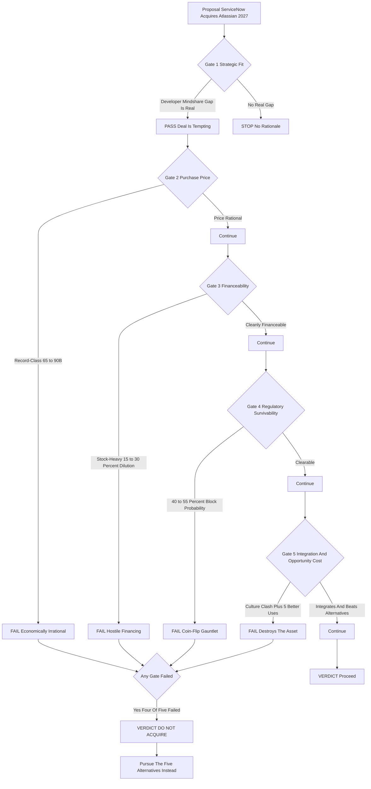

### Direct Answer

**No. ServiceNow should not acquire Atlassian in 2027.** The strategic itch is real — ServiceNow (NYSE: NOW) owns the enterprise IT buyer but not the developer, and Atlassian (NASDAQ: TEAM) owns the developer but not the enterprise IT estate — yet the deal fails on every axis that actually decides M&A: a record-class purchase price, a hostile stock-heavy financing structure, a coin-flip regulatory gauntlet, and a culture clash that destroys the very asset being bought. ServiceNow can close the developer gap far more cheaply and safely through organic build, a portfolio of small acqui-hires, and a deep Atlassian interoperability partnership — buying Atlassian outright is the single worst available route to a genuinely valuable destination.

**TL;DR**

- **Strategic fit is genuine but insufficient.** ServiceNow lacks developer mindshare; Atlassian owns it. That gap is real — but a real gap justifies *acting*, not this *specific* action.
- **The price is economically irrational.** Atlassian enters 2027 near a $45-60B market capitalization; a 30-50% control premium pushes the check to **$65-90B** — top-2-or-3 software deal ever, against a ServiceNow M&A history of sub-$3B tuck-ins.
- **The deal cannot be cleanly financed.** ServiceNow's conservative balance sheet forces **40-60% of consideration into NOW stock**, diluting holders 15-30%+ and manufacturing a shareholder revolt before any regulator weighs in.
- **The regulatory path is a coin flip.** Merging the dominant ITSM platform with Jira Service Management — its fastest-growing challenger — is the Adobe-Figma "eliminate the maverick" pattern; realistic block-or-abandon probability is **40-55%**.
- **Integration destroys the asset.** A top-down, $200K+-ACV enterprise-sales culture absorbing a bottoms-up, product-led-growth developer franchise is the canonical way to vaporize developer mindshare.
- **Five better routes exist.** Build organically, run sub-$2B acqui-hires, sign an Atlassian partnership, buy an adjacent uncontested target, or return capital — each delivers strategic value at a fraction of the risk.
- **Verdict:** the deal fails four of five gates, loses to all five alternatives, and loses to the do-nothing baseline. A clear, well-reasoned no.

## Framing The Question — "Should" Is A Five-Gate Test, Not A Synergy Slide

### 1.1 Why The Casual Yes Is The Wrong Answer

"Should ServiceNow acquire Atlassian in 2027" reads like a yes/no prompt, but a corporate-development team would never treat it that way. A real acquisition recommendation has to pass through five independent gates in sequence — **strategic fit, purchase price, financeability, regulatory survivability, and integration-plus-opportunity-cost** — and a deal that fails any single gate is dead, no matter how brilliantly it clears the others. The failure mode of casual analysis is to walk through gate one, find a tidy fit story ("ServiceNow has enterprise IT, Atlassian has developers, therefore platform"), and declare victory — never noticing that gates two through five are where every large software deal actually lives or dies.

### 1.2 The Distinction Between Wanting And Buying

This entry walks all five gates deliberately, and the structure of the answer is itself the argument: ServiceNow-Atlassian *barely* passes gate one and *fails* gates two, three, four, and five. A deal that fails four of five gates is not a close call. The honest output is not "it depends" — it is a clean no, with the strategic logic for *wanting* Atlassian fully acknowledged and the case for *buying* Atlassian fully dismantled. **The distinction between wanting and buying is the entire entry.** Wanting is a feeling about a destination; buying is a decision about a route. The route here runs through a record price, a hostile financing structure, a 40-55%-failure regulatory siege, and a culture clash that destroys the asset on contact.

### 1.3 What A Five-Gate Verdict Looks Like

A gate-based analysis produces a binary, defensible output rather than a hand-wavy "interesting but complicated." Each gate is a hard constraint, not a weighting factor; you do not average a brilliant strategic-fit score against a failing regulatory score and call the deal a "B-minus." You stop at the first failure. **The discipline of the gates is precisely that they cannot be traded off against one another** — a deal that is strategically perfect but cannot be financed is not "80% of a good deal," it is a dead deal, because there is no version of it that reaches a closing table. The reason corporate-development teams that skip this discipline destroy so much value is that synergy slides are *additive* by construction — they sum benefits — while reality is *multiplicative*: the probability the deal succeeds is the product of the probability it clears each gate, and a product with one near-zero term is near-zero regardless of how large the other terms are.

### 1.4 The Burden Of Proof Sits With The Bull Case

One more framing point sets up the entire entry: in a "should they acquire" question, the burden of proof sits with the *yes*, not the *no*. The default state of any two independent companies is to remain independent; an acquisition is the deviation that must be justified, and it must be justified against every alternative use of the same capital and attention. This is not a rhetorical tilt — it is how disciplined boards actually operate. The question is never "is there a story for this deal" (there is always a story) but "does this deal beat the best thing we could otherwise do." That reframing is what converts an exciting platform narrative into a sober capital-allocation decision, and it is the lens every section below applies. The table that follows previews the verdict and frames every section.

| Gate | Question it answers | ServiceNow-Atlassian | Outcome |
|---|---|---|---|
| 1. Strategic fit | Does owning the target close a real gap? | Developer mindshare gap is genuine | Pass |
| 2. Purchase price | Is the price rational vs. alternatives? | $65-90B, record-class | Fail |
| 3. Financeability | Can the acquirer pay without self-harm? | 40-60% stock, 15-30%+ dilution | Fail |
| 4. Regulatory survivability | Will it clear the antitrust gauntlet? | 40-55% block/abandon | Fail |
| 5. Integration + opportunity cost | Does it preserve value; is it the best use of capital? | Culture clash; 5 better uses | Fail |

## Profile Of The Two Companies — Opposite Operating Systems

### 2.1 What ServiceNow Is Heading Into 2027

You cannot judge whether ServiceNow *should* buy anything without being precise about what ServiceNow *is*, because its identity is simultaneously the source of the gap it wants to fill and the source of the integration risk it would inherit. **ServiceNow built its franchise on IT service management** — the workflow spine of corporate IT: incident, problem, and change management, the service catalog, and the configuration management database. From that base it expanded with unusual discipline into IT operations management, HR service delivery, customer service management, security operations, and — the 2024-2027 growth engine — a broad AI layer marketed as Now Assist plus an aggressive agentic-AI push.

**Entering 2027 ServiceNow runs on the order of $12-13B in revenue**, serves roughly 8,000+ large enterprises, and lands an average contract value comfortably north of $200,000. The defining fact about the company is its go-to-market: **top-down, enterprise-sales-led, large-account-team, multi-year-contract, six-and-seven-figure**. ServiceNow sells to the IT and operations *buyer* inside the Global 2000; it does not sell to individual developers and it does not grow bottoms-up. Its Now Platform — with low-code App Engine and the developer-facing ServiceNow Studio — is genuinely capable, but it is a platform enterprise IT *builds on*, not one individual engineers *choose*. That is the structural gap.

### 2.2 What Atlassian Is Heading Into 2027

Atlassian is ServiceNow's mirror image, and the symmetry is exactly what makes the deal tempting and exactly what makes it dangerous. Where ServiceNow is top-down, Atlassian is bottoms-up; where ServiceNow sells to the buyer, Atlassian wins the user. Its portfolio is the connective tissue of how software teams operate: **Jira** (issue tracking and project management, the de facto standard for software teams), **Confluence** (team documentation and wiki), **Jira Service Management** (Atlassian's ITSM product and the single head-to-head overlap with ServiceNow), **Bitbucket** (Git source-code hosting), **Trello** (lightweight kanban), **Compass** (developer experience and internal service catalog), **Loom** (async video), and a fast-expanding AI layer branded **Rovo**.

**Atlassian enters 2027 with $5B+ in revenue and 300,000+ customers.** Its defining fact is its growth model: product-led growth. For most of its history Atlassian had famously *no traditional sales force* — it grew through free tiers, low-friction self-serve purchasing, viral team-by-team adoption, and a deep third-party app marketplace. It was *chosen* by developers, not *sold* to executives. Atlassian has since layered an enterprise motion onto its largest accounts and completed the multi-year cloud migration, but the cultural and economic DNA remains PLG. Its moat is not a feature; it is **mindshare and habit** — developers learn Jira in their first job and carry it everywhere.

### 2.3 Side-By-Side — The Complementarity Is Also The Incompatibility

Laying the two companies next to each other makes the core tension legible — the complementarity that powers the synergy story and the incompatibility that powers the integration risk are the *same set of facts*.

| Dimension | ServiceNow (NYSE: NOW) | Atlassian (NASDAQ: TEAM) |
|---|---|---|
| 2027 revenue (approx) | $12-13B+ | $5B+ |
| Market capitalization band | ~$180-250B | ~$45-60B |
| Customer count | ~8,000+ large enterprises | 300,000+ across all sizes |
| Average contract value | $200K+ | Low thousands blended; enterprise tier higher |
| Go-to-market motion | Top-down, enterprise-sales-led | Bottoms-up, product-led growth |
| Primary buyer | IT / operations executive | Developer, team lead, end user |
| Core franchise | ITSM, ITOM, workflow, agentic AI | Jira, Confluence, dev tooling, JSM |
| Balance sheet posture | Conservative; ~$5-9B cash | Moderate cash; PLG cash generation |
| M&A history | Sub-$3B tuck-ins | Mid-size tuck-ins (Trello, Loom, Opsgenie) |
| Cultural DNA | Sales-led enterprise discipline | Developer-first, anti-"enterprise-sales-y" |

The table is the whole problem in miniature: **every row where the two are complementary is a row where they are also incompatible.** The opposite go-to-market motions are why the cross-sell synergy is over-modeled. The 60-to-1 customer-count ratio is why integrating the two sales organizations is a structural mismatch — ServiceNow's account teams are built to manage a few thousand high-touch relationships, while Atlassian's revenue engine converts hundreds of thousands of low-touch, self-serve accounts, and neither machine can simply absorb the other's workload. The average-contract-value gap compounds this. The cultural-DNA row is why retention and mindshare are at risk. Complementarity and incompatibility are not two findings; they are one finding seen from two angles. For deeper company context, see how ServiceNow generates revenue (q1920) and how Atlassian generates revenue (q1917).

## Gate One — The Strongest Honest Version Of The Bull Case

### 3.1 Building The Best Case Before Dismantling It

Intellectual honesty requires building the *best* version of the case for the deal before dismantling it, because the deal is tempting for genuine reasons. A verdict this firm has to survive the strongest opposing logic, and gate one is where that logic earns its hearing.

### 3.2 The Five Genuine Pillars Of The Bull Case

- **First, the developer-mindshare gap.** ServiceNow's single greatest structural weakness is that it does not own the developer; Atlassian owns the developer better than anyone except Microsoft's GitHub. On paper, acquiring Atlassian instantly hands ServiceNow a credible claim on tens of millions of developers and software-team members who live in Jira and Confluence daily.
- **Second, the unified-platform prize.** The strategic gold in enterprise software in 2027 is the single work platform spanning IT operations, developer tooling, and AI-driven workflow. A ServiceNow that owned Atlassian could credibly market one "plan-build-run" platform — Jira and Confluence to plan and build, ServiceNow to run — under a single AI fabric.
- **Third, ITSM consolidation.** Jira Service Management is the fastest-growing credible challenger to ServiceNow; buying Atlassian converts that threat into an owned product line.
- **Fourth, cross-sell economics.** ServiceNow could push the Now Platform into Atlassian's 300,000 customers and Atlassian's products into ServiceNow's 8,000 enterprises — the textbook revenue-synergy slide.
- **Fifth, the AI-context moat.** Whoever owns the planning, building, *and* running data of an enterprise's software and IT operations has the richest possible context for AI agents; combined, the two would have a context advantage neither holds alone.

### 3.3 Why Gate One Passes — And Only Gate One

Every one of these pillars is *real*. Not one is *sufficient* — because each runs straight into a wall at gate two, three, four, or five. **Gate one passes. It is the only gate that does.** The bull case (q1659) describes a genuinely valuable destination; the rest of this entry shows why buying Atlassian is the worst route to it.

## Gate Two — The Purchase Price Is Economically Irrational

### 4.1 The Control-Premium Math

The first wall is the simplest and the hardest to climb — the deal costs too much. Atlassian enters 2027 with a market capitalization in roughly the $45-60B range on $5B+ revenue, a 9-13x forward-revenue multiple that is rich but defensible for a durable PLG franchise. The problem is what a *control premium* does to that number. **Friendly software acquisitions historically clear at a 30-50% premium** to the unaffected share price, and a competitive situation runs higher.

| Scenario | Unaffected base | Premium applied | Implied purchase price |
|---|---|---|---|
| Conservative | $50B | 35% | ~$67.5B |
| Mid-case | $52B | 42% | ~$74B |
| Fuller premium | $55B | 50% | ~$82.5B |
| Competitive / contested | $58B | 55%+ | ~$90B |

Apply a conservative 35-45% premium to a $50-55B base and the purchase price lands at **$70-80B**; a fuller premium pushes toward **$85-90B**.

### 4.2 Record-Class Against A Tuck-In History

That makes ServiceNow-Atlassian one of the two or three largest software acquisitions ever attempted — the reference points are Microsoft-Activision at $68.7B and Broadcom-VMware at roughly $69B, both considered enormous, both straining their acquirers. ServiceNow is a magnificent business, but it is **not built for a deal this size**: its entire prior M&A history runs in the low hundreds of millions to low billions — tuck-ins, not transformations, as catalogued in ServiceNow's M&A strategy (q1655). An $80B deal is not an acquisition; it is a bet-the-company event.

### 4.3 The Multiple Problem Inside The Price

There is a subtler issue inside the headline number. Atlassian's 9-13x forward-revenue multiple is *defensible for Atlassian as an independent PLG compounder* — but it is not defensible for Atlassian-inside-ServiceNow, because the integration itself impairs the growth rate that justifies the multiple. A 9-13x multiple prices in durable 15-20%+ growth and a high-retention PLG base; if the act of acquisition slows that growth and raises churn (gate five), then ServiceNow is paying a multiple for a financial profile it is simultaneously destroying. The honest way to say this: **the price assumes Atlassian keeps being Atlassian, and the deal's own integration plan guarantees it will not.** An acquirer should never pay a standalone multiple for an asset whose standalone characteristics the acquisition erodes — and that, before any premium, is already a structural overpayment.

### 4.4 The Board's Real Question

The board's question is therefore not "is Atlassian a good company" — it obviously is — but "is Atlassian worth a record-setting, balance-sheet-bending, decade-defining price relative to every other use of that capital and that focus." Priced honestly against alternatives, the answer is no. **Gate two fails.**

## Gate Three — The Deal Cannot Be Cleanly Financed

### 5.1 Walking The Financing Stack

Setting the price is one problem; *paying* it is a separate, equally fatal one. ServiceNow entered 2027 with a deliberately conservative balance sheet — on the order of $5-9B in cash and short-term investments and a modest debt load — a profile engineered for tuck-ins and buybacks, not a $75B+ outlay.

| Funding source | Plausible contribution | Constraint |
|---|---|---|
| Cash on hand | ~$5-9B | Drains the entire treasury; leaves no operating buffer |
| New investment-grade debt | ~$15-30B (aggressive) | Loads interest expense and covenants; pressures the credit rating |
| ServiceNow stock | ~$40-60B (the remainder) | 15-30%+ dilution; triggers a shareholder vote |

### 5.2 The Dilution Trap

Issuing $40-60B of new NOW equity against a roughly $180-250B market cap means **15-30%+ dilution** — handing a quarter of the company to Atlassian holders. Three predictable reactions follow: ServiceNow's own institutions and likely activist investors revolt against the dilution and the strategic gamble; the deal becomes contingent on a NOW shareholder vote that is genuinely at risk; and the stock-heavy structure means ServiceNow is paying partly with a currency that *drops* the instant the market digests the dilution and integration risk — **a reflexive trap where announcing the deal makes the deal more expensive.**

### 5.3 ServiceNow Is Neither Broadcom Nor Microsoft

Broadcom executes deals this size because it is a serial mega-acquirer with a purpose-built financing machine; Microsoft executed Activision off a fortress balance sheet and $100B+ of liquidity. ServiceNow has neither. The deal is not just expensive — it is structurally awkward to pay for, and the structure manufactures shareholder opposition before regulators even appear. **Gate three fails.**

## Gate Four — The Regulatory Gauntlet Is A Coin Flip At Best

### 6.1 Four Jurisdictions, One Theory Of Harm

Even with a justified price and an engineered financing structure, ServiceNow would still have to get the deal *approved* — and this is where ServiceNow-Atlassian is at its most fragile. The transaction would draw simultaneous review from the **U.S. Federal Trade Commission, the U.S. Department of Justice Antitrust Division, the European Commission's competition directorate, and the UK Competition and Markets Authority**, with other jurisdictions possible. The core antitrust problem is not subtle: the combined entity consolidates the **IT service management** market by merging ServiceNow, the dominant ITSM platform, with Jira Service Management, its fastest-growing challenger. A regulator can draw that theory of harm on a single slide — "the number-one player is buying the number-one disruptor in a concentrated enterprise-software market."

### 6.2 The Devastating Precedent

The precedent is devastating to the odds.

| Deal | Size | Outcome | Lesson for ServiceNow-Atlassian |
|---|---|---|---|
| Adobe-Figma | $20B | Abandoned Dec 2023; $1B breakup fee | "Eliminate the maverick" theory blocks deals |
| Microsoft-Activision | $68.7B | Closed Oct 2023 after ~18 months, UK block-then-reverse, divestiture | Even doable deals are multi-year sieges |
| Broadcom-VMware | ~$69B | Closed Nov 2023 | Only serial mega-acquirers absorb this scale |
| Nvidia-Arm | ~$40B+ | Terminated Feb 2022; sizable fee | Large strategic tech deals collapse under review |

**Adobe-Figma** was abandoned in December 2023 after the UK CMA and the European Commission signaled a block on precisely the theory that Adobe was eliminating its most threatening competitor; Adobe paid a **$1B breakup fee** and walked. **Microsoft-Activision** ultimately closed — but only after roughly 18 months of war, an initial UK CMA *block*, an FTC lawsuit, and a structural concession.

### 6.3 The Honest Probability — 40-55% Block Or Abandon

The lesson of the 2023-2026 enforcement era is unambiguous: large horizontal software consolidations where the acquirer buys a direct competitive threat are no longer routine — they are multi-year, multi-jurisdiction sieges with materially worse-than-even odds. **A sober estimate of the probability that ServiceNow-Atlassian is blocked or abandoned is 40-55%.** No rational board commits a record price, a bet-the-company financing structure, and two years of total executive attention to a transaction with roughly coin-flip odds of ever closing.

### 6.4 The Breakup Fee And The Distraction Tax

The regulatory risk is not an abstract probability — it carries two concrete costs that hit ServiceNow *even if the deal fails*. The first is the **reverse termination fee**: a deal this size carries a breakup fee in the **$1.5-3B range** — cash ServiceNow pays Atlassian if regulators block it, pure destroyed value for nothing. The second cost is harder to spreadsheet and often larger: the **distraction tax**. An 18-24 month, four-jurisdiction regulatory fight consumes the single scarcest resource any company has — senior executive attention. The CEO, CFO, General Counsel, Chief Strategy Officer, and the entire corporate-development organization of *both* companies would be absorbed in discovery, hearings, concession negotiations, "hold-separate" operating constraints that *forbid* integration planning, and the morale chaos two years of limbo inflict. **The distraction tax means the deal damages ServiceNow's competitive position regardless of outcome.** There is no clean outcome on this gate.

### 6.5 The Hold-Separate Trap

There is a specific, underappreciated mechanism that makes the regulatory delay actively destructive rather than merely slow: the **hold-separate obligation**. While a deal is under review, regulators in multiple jurisdictions require the two companies to continue operating as fully independent competitors — they may not coordinate roadmaps, may not integrate sales teams, may not share competitively sensitive information, and in some cases must run under a court-supervised or commission-supervised monitor. The practical effect is brutal: for the 18-24 months of review, ServiceNow has *announced* it is buying Atlassian — signaling to every Atlassian employee, customer, and competitor that change is coming — while being *legally forbidden* from doing any of the integration planning that would make the change orderly. Atlassian's best engineers spend that window updating resumes; Atlassian's customers spend it evaluating GitLab and Linear; ServiceNow's competitors spend it poaching and positioning. The hold-separate period is the worst of both worlds — all of the destabilization of an acquisition with none of the integration benefit — and it lasts for years. **Gate four fails.**

## Gate Five — Integration And Culture Destroy The Asset

### 7.1 The Act Of Integrating Destroys What Was Bought

Suppose, against the odds, the deal is priced, financed, and approved. ServiceNow now owns Atlassian — and the deepest problem surfaces, because **the act of integrating Atlassian destroys what made Atlassian worth buying.** Atlassian's value is product-led, bottoms-up developer mindshare: developers and teams *choose* Jira and Confluence, adopt them virally, and stay out of habit and ecosystem lock-in. That mindshare was built by a PLG culture — low-friction free tiers, self-serve purchasing, developer-first product decisions, a thriving marketplace, and an explicit refusal to be "enterprise-sales-y."

### 7.2 The Standard Failure Pattern

ServiceNow's culture is the precise opposite: top-down, sales-led, enterprise-first, six-figure-deal, account-team-driven. These are not two flavors of one thing; they are opposite operating systems. When a sales-led enterprise acquirer absorbs a PLG developer-beloved company, the standard failure pattern unfolds:

- **Free tiers get squeezed** to drive enterprise conversion, alienating the bottoms-up base.
- **Product decisions start optimizing for the IT buyer** instead of the individual developer.
- **The sales motion gets pushed onto a base** that *chose the product specifically to avoid being sold to*.
- **The best PLG-native talent leaves** — people who joined Atlassian *because* it was not an enterprise-sales company.
- **The developer community drifts** toward GitLab, Linear, GitHub Issues, Notion, and AI-native tooling.

The mindshare moat does not collapse overnight — it *erodes*, and it is functionally impossible to rebuild, because developer trust is earned over years and lost in months. The sales-leadership-compatibility risk that diligence is supposed to catch (q804) is exactly the risk that no diligence can fix here. ServiceNow would be paying $80B for an asset whose value is contingent on a culture ServiceNow does not have and cannot fake.

### 7.3 Can One Company Run Both Motions?

The deeper structural question is whether a single company can operate a top-down enterprise motion and a bottoms-up PLG motion under one roof. The honest answer is: rarely, and never well at this scale. The two motions have opposite compensation structures, opposite product-decision criteria, opposite metrics, and opposite hiring profiles. An organization optimized to chase $200K+ deals has no efficient way to service a long tail of low-thousands accounts, and an organization built for self-serve has no muscle for enterprise procurement. **Gate five fails on integration alone — before opportunity cost is even considered.**

## Gate Five Continued — Opportunity Cost: What Else $80B And Two Years Buys

### 8.1 A "Should" Question Is A Question About Alternatives

A "should they" question is fundamentally a question of *alternatives*, and the strongest argument against the Atlassian deal is everything else ServiceNow could do with the same capital and the same two years of focus.

### 8.2 The Five Alternatives Priced Side By Side

| Alternative | Capital | Regulatory risk | Culture risk | Strategic value |
|---|---|---|---|---|
| Build developer platform organically | ~$3-5B over years | None | None (own culture) | High, slow |
| Sub-$2B acqui-hire portfolio | 6-12 deals, fraction of $80B | Minimal (entrant) | Low (digestible) | High, diversified |
| Atlassian interoperability partnership | ~$0 | None | None (Atlassian stays independent) | Medium-high, fast |
| Adjacent uncontested $10-20B deal | $10-20B | Low (entrant, not consolidator) | Moderate | High |
| Return capital to shareholders | $20-40B returned | None | None | Guaranteed-positive baseline |

- **Alternative one — organic developer-platform investment.** ServiceNow could direct $3-5B over several years into the Now Platform, App Engine, ServiceNow Studio, and Now Assist's agentic AI — building genuine developer-facing capability natively, with no integration, regulatory, or cultural risk, exactly as its developer-platform strategy already contemplates (q1666).
- **Alternative two — a portfolio of targeted acqui-hires.** Instead of one $80B mega-deal, six to twelve sub-$2B acquisitions in developer experience, internal developer portals, observability, AI code assistance, and security posture — each digestible, each approvable.
- **Alternative three — adjacent, uncontested M&A.** If ServiceNow wants one transformative $10-20B deal, buy something *adjacent and complementary* rather than *horizontal and consolidating* — an observability platform, a data layer, a security company — where the antitrust theory is weak.
- **Alternative four — capital return.** ServiceNow could return $20-40B via buybacks and dividends — a guaranteed-positive-return use of capital against a coin-flip deal.
- **Alternative five — partnership instead of ownership.** Capture most of the *integration value* through a deep commercial partnership that costs nothing, risks nothing, and needs no regulator's permission.

### 8.3 The Bar The Mega-Deal Must Clear

When the alternatives are this strong, the bar for the mega-deal is not "is it good" — it is "is it dramatically better than five solid alternatives." It is not. **Gate five fails on opportunity cost as decisively as it fails on integration.**

## The Five Gates Scored — Why The Verdict Is Not Close

### 9.1 The Scorecard

Pulling the gates into one view shows why this is not a close call — it is a four-of-five failure.

| Gate | Test | Verdict | Severity |
|---|---|---|---|
| 1. Strategic fit | Does owning the target close a real gap? | Pass — developer mindshare gap is genuine | Tempting |
| 2. Purchase price | Is the price rational vs. alternatives? | Fail — $65-90B, record-class | High |
| 3. Financeability | Can the acquirer pay without self-harm? | Fail — 40-60% stock, 15-30%+ dilution | High |
| 4. Regulatory survivability | Will it clear the antitrust gauntlet? | Fail — 40-55% block/abandon | Critical |
| 5. Integration + opportunity cost | Preserve value; best use of capital? | Fail — culture clash; 5 better uses | Critical |

### 9.2 Why Gate One Cannot Rescue The Deal

A deal that fails gates two through five does not get rescued by passing gate one. The strategic-fit gate is necessary but nowhere near sufficient: it tells you the deal is *tempting*, not that it is *wise*. Every gate after the first is a hard constraint, and ServiceNow-Atlassian violates all four. **The verdict is a clean no, and the scoring table is the reason it is not close.**

## The Five-Gate Decision Flow

## The ITSM Overlap — The Same Fact Viewed From Two Chairs

### 10.1 Why The Overlap Deserves Its Own Section

The single product overlap between the two companies deserves its own examination, because it is simultaneously the cleanest piece of strategic logic *for* the deal and the sharpest blade *against* it. ServiceNow is the dominant enterprise ITSM platform. **Jira Service Management is the most credible and fastest-growing challenger** — especially strong in the mid-market, with DevOps-adjacent teams, and increasingly in larger accounts wanting a lighter, more developer-native service-management tool.

### 10.2 Synergy And Liability Are The Same Fact

From ServiceNow's strategic seat, acquiring Atlassian *eliminates the disruptor*: it converts the most dangerous ITSM competitor into a wholly owned product line and removes the pricing and feature pressure JSM exerts. That is genuinely attractive. But that exact same fact — "the dominant incumbent is buying its fastest-growing direct competitor in a concentrated market" — is the textbook fact pattern that triggers a regulatory block. It is, almost beat for beat, the Adobe-Figma theory of harm.

### 10.3 The Self-Drafted Complaint

So the ITSM overlap is a trap: **the harder ServiceNow's strategy team leans on the JSM-elimination logic internally to justify the price, the more thoroughly they are drafting the regulators' complaint for them.** Strategic synergy and antitrust liability are, in this deal, the same fact viewed from two chairs — and you cannot argue one without handing the other to the other side.

## An Honest Synergy Model — Cost, Revenue, And The Dis-Synergy Line

### 11.1 The Line Deal Models Omit

Deal advocates will build a synergy model; it is worth pressure-testing what an honest one looks like, because the typical deal model omits the line that matters most.

| Synergy category | Honest assessment | Why |
|---|---|---|
| Cost synergies | Modest — low single-digit % of combined opex | Different tech stacks; cutting Atlassian headcount accelerates talent flight |
| Revenue synergies | Over-modeled; structurally constrained | Two opposite buying motions; combined sales org cannot easily run both |
| Dis-synergies (usually omitted) | Large — often the dominant line for years 1-3 | PLG-customer churn, developer drift, talent attrition, roadmap slowdown, brand dilution |
| Net synergy, years 1-3 | Plausibly **negative** | Modest cost + over-optimistic revenue minus underestimated dis-synergies |

### 11.2 The Bottom Row Is The Argument

The point of the table is the bottom row. A sober model nets the modest cost synergies and the over-optimistic revenue synergies *against* the routinely ignored dis-synergies and frequently lands at *negative* net synergy for the first two to three years. **That means ServiceNow would pay an $80B price and a record premium to destroy value in the near term**, betting on a long-term platform payoff that the culture clash makes unlikely to ever fully arrive. Deal models that omit the dis-synergy line are not models — they are sales decks.

### 11.3 The Cross-Sell Fantasy, Quantified

The single most over-modeled line is revenue synergy from cross-selling, so it is worth being concrete about why. The bull-case slide says: push the Now Platform into Atlassian's 300,000 customers, push Jira and Confluence into ServiceNow's 8,000 enterprises, and harvest billions. The reality is that **cross-sell only works when the two products are bought by the same person through the same motion** — and here they are not. Atlassian's 300,000 customers are overwhelmingly small and mid-size teams that bought self-serve, never spoke to a salesperson, and have no budget authority for a $200K+ ServiceNow contract; selling them ServiceNow requires a months-long enterprise procurement cycle they have no reason to start. ServiceNow's 8,000 enterprises, conversely, already have a developer-tooling decision made years ago by their engineering organizations; the IT buyer who owns the ServiceNow relationship cannot simply add Jira to the order, because Jira is chosen by developers, not procured by IT. The cross-sell does not fail because the products are bad — it fails because **the buyer, the budget, and the motion do not transfer across the two bases.** A model that assumes they do is assuming away the exact fact that makes the two companies complementary in the first place.

### 11.4 Why Dis-Synergies Are Systematically Underestimated

Dis-synergies are not underestimated by accident — they are underestimated by *incentive*. The synergy model is built by the deal team and the bankers, both of whom are paid (in fees, in career capital, in the satisfaction of closing) to make the deal happen. Cost synergies are easy to put on a slide because they look like spreadsheet line items. Revenue synergies are easy because they are optimistic by nature. But dis-synergies — churn from alienated PLG customers, attrition of the engineers who made the product great, roadmap slowdown under hold-separate, brand dilution as "developer-beloved Atlassian" becomes "a ServiceNow product line" — are diffuse, hard to quantify, and politically unwelcome on a deal slide. The honest discipline is to *force* the dis-synergy line onto the model and size it conservatively, because the research record is consistent: in culture-clash acquisitions, dis-synergies routinely overwhelm the modeled synergies for the first several years.

## Why ServiceNow Feels The Pressure — The 2027 Competitive Context

### 12.1 The Anxiety Is Legitimate

It is worth being empathetic about *why* this deal is even a question, because the strategic anxiety driving it is legitimate. ServiceNow's competitive landscape in 2027 is intensifying from several directions at once.

- **Microsoft** is the existential reference point: with GitHub (developer mindshare plus Copilot), Azure DevOps, the Power Platform, and a deep ITSM presence, Microsoft is assembling exactly the "plan-build-run" unified platform a ServiceNow-Atlassian combination would chase — and it can bundle the result into the Office and Azure relationships it already owns.
- **Salesforce** owns the customer-facing workflow layer, holds a collaboration surface in Slack, and pushes its own agentic AI in Agentforce — the same competitive logic that makes a Salesforce-HubSpot mega-deal a recurring question (q1536).
- **Atlassian itself**, unacquired, keeps pushing Jira Service Management upmarket directly into ServiceNow's core.
- **A wave of AI-native upstarts** is attacking individual workflow categories with tools built AI-first rather than AI-retrofitted.

### 12.2 Understanding The Anxiety Does Not Validate The Answer

In that context, the impulse behind "buy Atlassian" is understandable: it is a swing for the unified platform before Microsoft completes its version. But understanding the *anxiety* does not validate the *answer*. **The correct response to "Microsoft is bundling a plan-build-run platform" is not "make a record-priced, coin-flip-odds, culture-incompatible acquisition" — it is "out-execute organically, partner aggressively, and make targeted acquisitions"** — precisely because the mega-deal's 40-55% failure probability and two-year distraction tax would *hand* Microsoft the very window ServiceNow is trying to close.

## The Wrong Comparables — Microsoft-Activision And Broadcom-VMware

### 13.1 Why The Acquirers, Not The Deals, Are The Lesson

The two mega-deals ServiceNow-Atlassian would be sized against are instructive precisely because of how *differently situated* their acquirers were.

- **Microsoft-Activision ($68.7B)** closed — but Microsoft is the most resourced acquirer on earth, with a fortress balance sheet, $100B+ in liquidity, a deep regulatory-affairs apparatus, and the capacity to absorb an 18-month fight without strategic damage. Even *Microsoft* had to divest cloud-gaming rights.
- **Broadcom-VMware (~$69B)** closed — but Broadcom is a serial mega-acquirer with a purpose-built financing machine, a playbook for exactly this deal size, and a willingness to take the reputational and customer-relationship hits its model requires.

### 13.2 ServiceNow Is Adobe, Not Microsoft

ServiceNow is *neither* of these. It is a high-quality organic-growth compounder with a conservative balance sheet, a tuck-in-sized M&A history, and a culture built on product and customer love rather than financial engineering. Sizing ServiceNow-Atlassian against Microsoft-Activision and Broadcom-VMware does not show the deal is *doable* — **it shows that the only two companies who pulled off deals this size were uniquely, structurally built to, and ServiceNow is not.** The relevant comparable for ServiceNow is Adobe — an excellent product company that reached for a developer/designer darling and had the deal taken away by regulators after 15 months of distraction and a $1B check.

## The Five Recommended Paths

### 14.1 Path 1 — Build The Developer Platform Organically

If the strategic gap is real — and it is — the first and best response is to close it the way ServiceNow closed every other adjacency it now dominates: organically. ServiceNow did not buy its way into IT operations management, HR service delivery, or security operations; it *built* into them off the Now Platform. The raw material is already in house: the Now Platform as the runtime, App Engine as the low-code layer, ServiceNow Studio as the developer-facing surface, and Now Assist plus the agentic-AI roadmap as the intelligence layer. **A focused $3-5B, multi-year organic investment carries none of the deal's fatal risks** — no control premium, no dilution, no four-jurisdiction siege, no breakup exposure, no culture clash. The trade-off is honest: organic build is slower and does not instantly hand ServiceNow 300,000 customers. But "slower and certain and fully controlled" beats "faster and coin-flip and self-destructing" every time the second option carries a record price tag.

### 14.2 Path 2 — A Portfolio Of Sub-$2B Acqui-Hires

Organic build does not have to mean *no* M&A — it means *right-sized* M&A. Rather than one $80B transaction that fails four gates, ServiceNow should run a deliberate portfolio of six to twelve sub-$2B acquisitions across the capabilities it actually lacks: developer-experience tooling, internal developer portals, AI code assistance, observability hooks, security posture, and data tooling. Each deal at this size is **digestible** (integrable by a normal corporate-development organization), **approvable** (a sub-$2B acquisition of a capability ServiceNow does not currently sell triggers no serious antitrust theory), **affordable** (a fraction of the Atlassian price), and **diversified** (if two of ten disappoint, the program still works). This is, not coincidentally, how ServiceNow has historically done M&A — the same discipline behind questions like whether ServiceNow should acquire Workato (q1912) or UiPath (q1656).

### 14.3 Path 3 — A Deep Atlassian Interoperability Partnership

The single most underrated alternative captures most of the deal's *value* with none of its *cost*: a deep commercial and technical interoperability partnership with Atlassian, leaving Atlassian independent. Most of what the bull case actually wants — a unified plan-build-run experience — does not require *ownership*; it requires *integration*. ServiceNow and Atlassian could ship deep, first-class connectors between Jira and the Now Platform, a shared AI context layer so Now Assist and Rovo reason across both systems, joint reference architectures for "plan in Jira, run in ServiceNow," and a co-sell motion. The customer gets the integrated workflow; ServiceNow gets the strategic adjacency; **Atlassian keeps its PLG culture intact, which means the asset ServiceNow cares about is preserved rather than eroded.** The partnership costs essentially nothing, risks essentially nothing, needs no regulator's permission, and can be stood up in quarters rather than years.

### 14.4 Path 4 — If You Must Do One Big Deal, Buy Adjacent And Uncontested

Some boards will insist on a single transformative transaction; if ServiceNow must do one large deal, the rule is simple — buy *adjacent and uncontested*, not *horizontal and consolidating*. The antitrust danger in ServiceNow-Atlassian comes entirely from the horizontal overlap in ITSM. A deal of comparable strategic ambition but *without* a direct-competitor-elimination story carries a fraction of the regulatory risk. Candidates: an **observability** platform (a capability ServiceNow's ITOM customers want, where ServiceNow is not the incumbent), a **security-posture company** (adjacent to security operations, entering rather than consolidating), or a **data and analytics layer** that strengthens the AI-context story. A $10-20B deal in one of these spaces still moves the strategic needle — but the regulator sees an *entrant*, not a *consolidator*, and the block probability falls from coin-flip to comfortably clearable.

### 14.5 Path 5 — Return The Capital, The Honest Baseline

The final alternative is the one deal teams hate to put on the slide because it is an admission that the mega-deal is not worth doing: simply return the capital. If ServiceNow cannot find a use of $20-40B that clears all five gates, the disciplined answer is to hand it back to shareholders via buybacks and dividends. **This is not a failure of imagination — it is the baseline every acquisition must beat.** Capital return is a guaranteed-positive-return use of capital; the Atlassian deal is a coin-flip-odds, record-priced, value-destroying-in-the-near-term use of capital. Framing capital return as the floor reframes the entire question: the bull case must show that buying Atlassian beats organic build, an acqui-hire portfolio, a partnership, an adjacent deal, *and* simply returning the money. It loses to all five.

## The Alternatives Map — Capturing The Value Without The Deal

### 14.6 The Five Routes Compared On Every Axis

The five paths are not a menu of equivalent options — they are a ranked toolkit, and the right answer for ServiceNow is to run several of them in parallel rather than picking one. The build-organically path and the acqui-hire-portfolio path are *complementary*, not competing: organic build owns the core developer surface while the acqui-hire portfolio fills specific capability gaps faster than internal engineering could. The partnership path can run *simultaneously* with both, capturing the Jira-to-ServiceNow workflow value while the organic build matures. The table below scores all five routes against the same axes the mega-deal failed on.

| Route | Capital | Time to value | Regulatory risk | Culture risk | Reversible if it fails? |
|---|---|---|---|---|---|
| Path 1 — Build organically | ~$3-5B | Years | None | None — ServiceNow's own culture | Yes — pause or redirect spend |
| Path 2 — Sub-$2B acqui-hires | Fraction of $80B | Quarters per deal | Minimal — entrant, not consolidator | Low — small, digestible | Mostly — diversified portfolio |
| Path 3 — Atlassian partnership | ~$0 | Quarters | None | None — Atlassian stays independent | Yes — commercial agreement |
| Path 4 — Adjacent uncontested deal | $10-20B | ~12 months to close | Low — entering a space | Moderate — one integration | Partly |
| Path 5 — Return capital | $20-40B returned | Immediate | None | None | N/A — guaranteed baseline |

### 14.7 The Recommended Combination

The disciplined recommendation is not "pick path one" — it is **run paths one, two, and three together, hold path four in reserve, and treat path five as the floor.** ServiceNow builds developer-platform capability organically on the Now Platform, acqui-hires six to twelve specific capabilities it cannot build fast enough, signs a deep Atlassian interoperability partnership to capture the plan-build-run workflow value today, and returns whatever capital is left over. That combination closes the developer-mindshare gap, delivers most of the unified-platform prize, and does it all without a control premium, without 15-30% dilution, without a four-jurisdiction antitrust siege, without a $1.5-3B breakup exposure, and without a culture clash — because the cultures never collide. The mega-deal buys one uncertain outcome; the combination buys a diversified set of certain ones.

## Scenario Analysis — The Three Ways This Plays Out If ServiceNow Ignores The Advice

### 15.1 A Decision Tree With No Good Leaves

It is useful to game out what actually happens if ServiceNow announces the deal anyway, because all three branches are bad.

| Scenario | Probability | What happens | Outcome quality |
|---|---|---|---|
| A — Regulators block it | 40-55% | 15-24 months of review, then abandonment; $1.5-3B fee paid | Worst — money and time gone for nothing |
| B — Closes with concessions, under-delivers | ~25-35% | ~18-24 month grind, JSM divestiture or remedies, then culture clash | Bad — record price for an eroding asset |
| C — Closes cleanly, still under-delivers | ~15-25% | Regulators wave it through; integration problem unchanged | Mediocre at best — value-destructive for years |

- **Scenario A — regulators block it.** After 15-24 months of FTC, DOJ, EU, and CMA review, one or more jurisdictions move to block on the ITSM-consolidation theory; ServiceNow abandons, pays a $1.5-3B reverse termination fee, and emerges having spent two years for nothing while Microsoft kept building. This is the Adobe-Figma outcome — the single most likely branch.
- **Scenario B — it closes with concessions, then under-delivers.** ServiceNow grinds through ~18-24 months, accepts structural concessions, closes a damaged deal, and watches the culture clash play out: talent attrition, PLG-customer churn, developer drift, net-negative synergy for years one through three.
- **Scenario C — it closes cleanly and still under-delivers.** Even in the most optimistic branch, the integration problem is unchanged: opposite operating systems, over-modeled revenue synergies, omitted dis-synergies.

### 15.2 The Tree Says Do Not Start

There is no branch where this deal is *great*. The best realistic case is "expensive and mediocre," the modal case is "blocked and wasteful," and the worst case is "closed and destructive." **A decision tree with no good leaves is a decision tree that says do not start.**

## The Board-Level View — How A Disciplined Board Should Run This Decision

### 16.1 The Process Itself Produces The No

A ServiceNow board presented with an Atlassian proposal should run it through a structured process, and that process itself produces the no.

- **Separate "want" from "should."** Acknowledge the strategic gap is real and the destination attractive, then refuse to let that feeling skip the gates.
- **Demand the dis-synergy line.** Send any synergy model back if it omits churn, attrition, roadmap slowdown, and brand damage; a model without the negative line is a sales deck.
- **Get an independent regulatory read.** Outside antitrust counsel will price the block probability near 40-55%; treat that as a hard input, not an optimistic footnote.
- **Price the alternatives explicitly.** Require the proposal to beat organic build, an acqui-hire portfolio, a partnership, an adjacent deal, and capital return — not just to be "good."
- **Weigh the distraction tax.** Two years of total executive attention during the AI platform war is a real cost; ask what *else* leadership would do with those two years.
- **Stress-test the financing.** 15-30%+ dilution and a shareholder vote at genuine risk are governance red flags on their own.

### 16.2 The Framework Converts Narrative Into Discipline

A board that runs this process honestly does not need a contrarian instinct to reach no — **the process is the no.** The decision framework's job is to convert an attractive-sounding platform narrative into a disciplined, five-gate, alternatives-priced decision — and run that way, ServiceNow-Atlassian fails on contact. This is also why tracking which sales-tech and enterprise-software vendors get acquired most often (q152) is a board-level competitive-intelligence input, not trivia.

## Counter-Case — The Strongest Arguments FOR The Acquisition

### 17.1 The Twelve Best Pro-Deal Arguments

A verdict this firm has to survive the best opposing arguments. Here are the twelve strongest reasons a serious advocate would give for ServiceNow buying Atlassian — and why each, examined honestly, does not change the no.

- **Counter 1 — the developer-mindshare gap is genuine and urgent.** True, and acknowledged in gate one. But a real gap does not justify *any* price or *any* risk to close it. The gap is an argument for *acting*, not for this *specific* action.
- **Counter 2 — the unified plan-build-run platform is the defining prize.** Also true. But owning the destination does not require this route; Microsoft assembled its version over many years through mixed acquisition and heavy organic build — not one $80B convulsion.
- **Counter 3 — buying Atlassian eliminates JSM as a competitive threat.** It would — and that is precisely the antitrust problem, not a benefit. "Eliminate the fastest-growing challenger" is the exact theory that killed Adobe-Figma.
- **Counter 4 — ServiceNow's stock is a strong acquisition currency.** It is high-quality — until you issue $40-60B of it. At that scale the dilution itself depresses the currency and the "strong currency" argument becomes a "self-cheapening currency" problem.
- **Counter 5 — the combined AI-context moat would be unmatched.** Owning plan, build, and run data would create rich AI context — but that advantage is contingent on a *successful, retained* integration, which gates four and five say is unlikely.
- **Counter 6 — other mega-deals this size have closed, so it is doable.** They were executed by uniquely resourced serial acquirers after brutal multi-year fights. "Doable by Microsoft" is not "doable by ServiceNow."
- **Counter 7 — regulators might wave it through; 40-55% means 45-60% it clears.** Even on the optimistic read, a board does not commit a record price and two years of focus to a coin flip — and "it clears" still leaves gate five fully intact.
- **Counter 8 — ServiceNow could protect Atlassian's culture by running it independently.** Acquirers always say this; it rarely holds. The financial logic of an $80B price *demands* synergy harvesting, and the moment that starts, the mindshare erodes.
- **Counter 9 — cross-selling into 300,000 + 8,000 customers is enormous.** It is the most over-modeled line in software M&A; the two bases buy through opposite motions and a combined sales force struggles to run both.
- **Counter 10 — waiting lets Microsoft win the platform war.** The deal does not prevent that — it accelerates it. A 40-55% block chance plus a guaranteed two-year distraction tax *hands* Microsoft the window.
- **Counter 11 — a bold transformative deal is what great companies do.** Some great companies make bold deals; many great companies are *destroyed* by them. The disciplined version of boldness here is a bold *organic* bet plus a bold *partnership*.
- **Counter 12 — if ServiceNow does not buy Atlassian, someone else might.** Possibly — but a rival inherits the *same* regulatory gauntlet and culture-clash risk. A competitor overpaying for a hard-to-integrate asset is not a reason for ServiceNow to overpay first.

### 17.2 The Honest Verdict On The Counter-Case

Every pro-acquisition argument is either (a) true but an argument for *acting*, not for *this* action, (b) a benefit that is actually the antitrust liability in disguise, or (c) contingent on a clean close and retention that gates four and five say is unlikely. **The strategic want is legitimate and fully conceded. But across price, financeability, regulatory survivability, integration, and opportunity cost, the deal fails** — and it loses to organic build, an acqui-hire portfolio, an Atlassian partnership, an adjacent deal, and even to simply returning the capital.

## The Final Verdict — A Clear No, With The Logic Fully Acknowledged

### 18.1 Pulling The Analysis Together

ServiceNow should not acquire Atlassian in 2027. The strategic *want* is legitimate and should be stated plainly — ServiceNow lacks developer mindshare, Atlassian lacks enterprise ITSM depth, the unified plan-build-run-with-AI platform is a real prize, and Microsoft assembling its version is a genuine competitive threat. But *want* is gate one, and gates two through five are where the deal dies. The price is record-class — $65-90B against a tuck-in M&A history. The financing is hostile — 40-60% stock, 15-30%+ dilution, a shareholder vote at risk, a reflexively self-cheapening currency. The regulatory path is a coin flip — a 40-55% block-or-abandon probability on a clean ITSM-consolidation theory of harm, carrying a $1.5-3B breakup fee and a two-year distraction tax that lands whether the deal closes or not. And integration destroys the asset.

### 18.2 The Structural No

Against all of that stand five alternatives — organic build, an acqui-hire portfolio, a deep Atlassian partnership, an adjacent uncontested deal, and capital return — each of which delivers meaningful strategic value with a fraction of the risk. **The deal fails four of five gates, loses to all five alternatives, and loses to the do-nothing baseline.** That is not a close call dressed up as a no; it is a structural no. The right way to close the developer gap is to build it, partner for it, and acqui-hire into it — not to bet the company on a record-priced, coin-flip-odds, culture-incompatible mega-deal that the strategic logic *wants* and every other gate *forbids*.

## Numbers

**The Two Companies Heading Into 2027 (Approximate)**
- ServiceNow revenue: $12-13B+
- ServiceNow market capitalization band: ~$180-250B
- ServiceNow cash and short-term investments: ~$5-9B
- ServiceNow large-enterprise customers: ~8,000+
- ServiceNow average contract value: $200K+
- Atlassian revenue: $5B+
- Atlassian market capitalization band: ~$45-60B
- Atlassian customers: 300,000+
- Atlassian forward-revenue multiple: ~9-13x

**The Purchase Price Math**
- Atlassian unaffected valuation base: ~$50-55B
- Friendly-deal control premium range: 30-50%
- Conservative premium (35-45%) implied price: ~$70-80B
- Fuller premium implied price: ~$85-90B
- Rank if executed: top 2-3 software acquisitions ever

**The Financing Stack For A ~$75B+ Deal**
- ServiceNow cash available: single-digit billions
- Plausible new debt capacity (aggressive): $15-30B
- Remainder requiring NOW stock: $40-60B
- Implied ServiceNow shareholder dilution: 15-30%+

**The Regulatory And Failure Costs**
- Reviewing jurisdictions: FTC, DOJ, EU Commission, UK CMA
- Realistic block-or-abandon probability: 40-55%
- Reverse termination (breakup) fee range: $1.5-3B
- Regulatory review timeline: 18-24 months

**Gate Scorecard**
- Gate 1 Strategic fit: PASS
- Gate 2 Purchase price: FAIL
- Gate 3 Financeability: FAIL
- Gate 4 Regulatory survivability: FAIL
- Gate 5 Integration + opportunity cost: FAIL
- Result: 1 of 5 gates passed — verdict NO

## Sources

1. **ServiceNow, Inc. — Investor Relations and SEC Filings (10-K, 10-Q)** — Revenue, customer count, ACV, balance sheet, and M&A history. https://www.servicenow.com/company/investor-relations.html
2. **Atlassian Corporation — Investor Relations and SEC Filings** — Revenue, customer count, cloud migration, and product portfolio disclosures. https://investors.atlassian.com
3. **U.S. Federal Trade Commission — Merger Review and Enforcement** — Pre-merger notification, Hart-Scott-Rodino process, and enforcement posture. https://www.ftc.gov/enforcement/mergers
4. **U.S. Department of Justice — Antitrust Division** — Merger enforcement guidelines and review process. https://www.justice.gov/atr
5. **European Commission — Directorate-General for Competition** — EU merger regulation and review process. https://competition-policy.ec.europa.eu
6. **UK Competition and Markets Authority — Mergers** — UK merger review, phase 1 and phase 2 process. https://www.gov.uk/cma-cases
7. **2023 Merger Guidelines — FTC and DOJ Joint Guidelines** — The current framework for horizontal and vertical merger analysis. https://www.ftc.gov/legal-library/browse/2023-merger-guidelines
8. **Adobe and Figma — Termination of Proposed Acquisition (December 2023)** — The $20B deal abandoned after EU and UK regulatory opposition; $1B termination fee. https://news.adobe.com
9. **Microsoft and Activision Blizzard — Acquisition Completion (October 2023)** — The $68.7B deal, UK CMA process, FTC litigation, and cloud-gaming divestiture. https://news.microsoft.com
10. **Broadcom and VMware — Acquisition Completion (November 2023)** — The ~$69B deal and post-close integration approach. https://www.broadcom.com
11. **Nvidia and Arm — Terminated Acquisition (February 2022)** — Precedent for a large semiconductor/tech deal collapsing under regulatory pressure with a sizable fee. https://nvidianews.nvidia.com
12. **ServiceNow — Now Platform, App Engine, and ServiceNow Studio Documentation** — Low-code and developer-facing capabilities relevant to the organic-build path. https://www.servicenow.com/products/platform.html
13. **ServiceNow — Now Assist and Agentic AI** — ServiceNow's generative and agentic AI roadmap. https://www.servicenow.com/products/now-assist.html
14. **Atlassian — Jira, Confluence, and Jira Service Management Product Pages** — The core portfolio and the ITSM overlap product. https://www.atlassian.com/software
15. **Atlassian — Rovo and Atlassian Intelligence** — Atlassian's AI layer. https://www.atlassian.com/software/rovo
16. **Atlassian — Bitbucket, Compass, Trello, and Loom** — The developer-experience and work-management portfolio. https://www.atlassian.com/software/compass
17. **Gartner — Magic Quadrant for IT Service Management Platforms** — Competitive positioning of ServiceNow and Jira Service Management in ITSM. https://www.gartner.com
18. **Forrester — Enterprise Service Management and Developer Tooling Research** — Analyst coverage of the workflow and developer-platform markets. https://www.forrester.com
19. **Microsoft — GitHub, Azure DevOps, and Power Platform** — The competitor assembling a plan-build-run platform. https://github.com
20. **Salesforce — Slack and Agentforce** — The collaboration-plus-agentic-AI competitor. https://www.salesforce.com/agentforce
21. **Hart-Scott-Rodino Antitrust Improvements Act — Premerger Notification Program** — The statutory basis for U.S. merger review. https://www.ftc.gov/enforcement/premerger-notification-program
22. **Reuters — Mergers and Acquisitions Coverage (Enterprise Software)** — Reporting on large software deal announcements, reviews, and outcomes. https://www.reuters.com
23. **Bloomberg — Deals and Antitrust Coverage** — Reporting on deal financing structures, premiums, and regulatory process. https://www.bloomberg.com
24. **The Wall Street Journal — Technology and M&A Coverage** — Reporting on software acquisitions and shareholder reactions. https://www.wsj.com
25. **Financial Times — Lex and M&A Analysis** — Analysis of deal economics, premiums, and financeability. https://www.ft.com
26. **Damodaran Online — Valuation, Acquisition Premiums, and Synergy** — Academic reference on control premiums, synergy modeling, and dis-synergies. https://pages.stern.nyu.edu/~adamodar
27. **Harvard Business Review — Why M&A Deals Fail / Integration Research** — Research on culture clash and post-merger integration failure. https://hbr.org
28. **McKinsey & Company — M&A Practice: Revenue and Cost Synergy Realization** — Research on how revenue synergies are systematically over-modeled. https://www.mckinsey.com
29. **Bain & Company — M&A Report: Deal Premiums and Integration** — Annual analysis of acquisition premiums and integration outcomes. https://www.bain.com
30. **CB Insights — State of M&A and Tech Acquisitions** — Data on tech deal volume, size, and outcomes. https://www.cbinsights.com
31. **PitchBook — Software M&A and Valuation Multiples** — Forward-revenue multiples and deal comparables for enterprise software. https://pitchbook.com
32. **OpenView / Product-Led Growth Research** — Reference on PLG economics, free-tier conversion, and the bottoms-up motion. https://openviewpartners.com
33. **GitLab, Inc. — Investor Materials** — A competitive reference point for developer-tool alternatives Atlassian customers could drift toward. https://about.gitlab.com
34. **Stack Overflow Developer Survey** — Reference on developer tool adoption, loyalty, and switching behavior. https://survey.stackoverflow.co
35. **SEC EDGAR — Full-Text Search for ServiceNow and Atlassian Filings** — Primary-source filings for both companies. https://www.sec.gov/cgi-bin/srqsb

## Related Pulse Library Entries

- How does ServiceNow make money in 2027? (q1920)
- How does Atlassian make money in 2027? (q1917)
- Should ServiceNow acquire Workato in 2027? (q1912)
- What is ServiceNow's M&A strategy through 2028? (q1655)
- Should ServiceNow acquire UiPath to win agent automation? (q1656)
- What is ServiceNow developer-platform strategy through 2027? (q1666)
- What is the bull case for ServiceNow 2027? (q1659)
- Should Salesforce acquire HubSpot? (q1536)
- How do you assess sales leadership compatibility during M&A diligence before the deal closes? (q804)
- Which sales-tech vendors are getting acquired most often in 2026? (q152)
