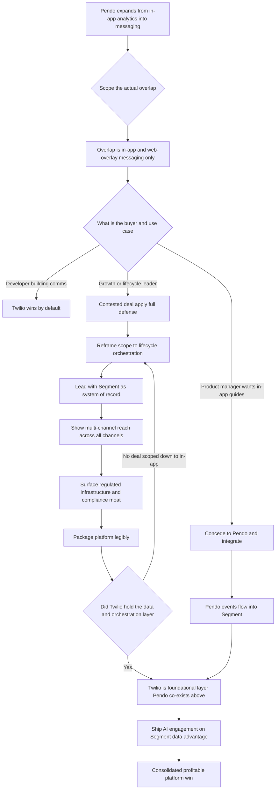

### Direct Answer

Twilio (NYSE: TWLO) defends against Pendo not by out-analyzing it, but by refusing to fight on Pendo's home turf and instead deepening the layers Pendo structurally cannot reach: the customer data platform (Segment), multi-channel orchestration, the developer surface, and the regulated communications infrastructure. The two companies look like competitors because both now touch "in-app messaging," but they are built on opposite foundations -- Pendo grew up inside a single product session as a tag that watches clicks; Twilio grew up as the API that moves a message across the carrier network. The defensible play is to treat Pendo as a feature-adjacent encroacher, hold the data-plus-orchestration-plus-infrastructure platform where Twilio genuinely leads, integrate rather than duplicate where Pendo is simply better, and never let the narrative become "messaging is a feature of your analytics tool."

**TL;DR:** Twilio (NYSE: TWLO, roughly $4.4B FY24 revenue, ~$10-14B market cap through 2024-2025, down from a ~$74B early-2021 peak) defends against Pendo (private, last priced near a ~$2.6B valuation at its 2021 Series F) on five plays: (1) **Segment as the system of record** -- the CDP that unifies web, mobile, server, offline, and ad-network events into a profile Pendo's in-app-event-only data model cannot assemble; (2) **multi-channel orchestration** -- SMS, voice, email, WhatsApp, push, and in-app from one journey engine, where Pendo is structurally in-app and web-overlay only; (3) **the developer moat** -- millions of developer accounts and a decade of API primitives a product-manager-led buyer never touches; (4) **regulated communications infrastructure** -- carrier relationships, 10DLC and toll-free registration, deliverability, fraud, and SHAKEN/STIR; and (5) **profitability and platform consolidation** -- after the 2023-2024 restructuring Twilio can credibly sell "one vendor for the whole communications and data layer." The honest verdict: this is a winnable position, the assets favor Twilio, and the real risk is self-inflicted -- losing focus, chasing the analytics trap, or letting deals get scoped down to Pendo's strength.

## 1. What This Competitive Question Is Actually Asking

### 1.1 Why two companies that were never supposed to compete now appear in the same evaluation

The question "how does Twilio defend against Pendo in 2027" only makes sense once you understand that these two companies were never designed to compete, and the overlap that created the question is narrow, recent, and easy to over- or under-state. **Twilio (NYSE: TWLO) is a communications platform-as-a-service company.** Its founding product was an API that lets a developer send an SMS or place a phone call with a few lines of code, and everything it has built or bought since -- SendGrid for email, the Segment acquisition for customer data, Twilio Engage for orchestration, Verify and Authy for authentication, Programmable Voice and Video -- extends that core idea of programmable communication.

**Pendo is a product-experience company.** Its founding product was a JavaScript tag you drop into your web or mobile app that silently records what users click, then lets a product manager paint tooltips, walkthroughs, and surveys over the live UI without shipping code. For most of the last decade these tools were sold to different buyers, solved different problems, and appeared in different budget lines.

### 1.2 Where the collision actually came from

The reason a competitive-defense question exists in 2027 is that **Pendo expanded** -- from in-app analytics, to in-app guides, to Pendo Orchestrate (multi-step in-app messaging campaigns), to digital adoption and mobile push, to feedback and roadmap tooling -- and somewhere in that expansion it began touching the "engage your users with targeted messages" use case that Twilio Engage also targets. So the real question is not "who wins customer engagement" as a totalizing category; it is **"where exactly do these two collide, how big is that contested ground, and what should the larger, infrastructure-heavy company do about a nimbler point tool encroaching from the application layer."**

That framing matters because the wrong defense -- trying to match Pendo feature-for-feature on product analytics -- would be expensive, slow, and a fight on Pendo's chosen ground. **The right defense starts by drawing the boundary of the overlap precisely.** Companies that get this wrong tend to do so because they let a competitor's marketing define the category; companies that get it right insist on defining the category themselves. The parallel to other incumbent-versus-encroacher fights is exact: the same mistake shows up whenever an infrastructure player is told by a point tool's narrative that the contest is about the visible layer (q1890).

### 1.3 The two-sentence test that decides every deal

There is a simple diagnostic Twilio's field can apply in any room. If the buyer's operating sentence is **"messaging is something my analytics tool does,"** Twilio is losing the narrative. If it is **"messaging is an infrastructure layer with its own data, channels, and compliance,"** Twilio is winning it. Everything below is in service of keeping the second sentence true.

The reason the two-sentence test is so powerful is that buyers rarely articulate their framing explicitly -- they inherit it from whichever vendor reached them first, from the analyst note they happened to read, or from the internal mandate that scoped the project. A head of product told to "fix onboarding" has been handed Pendo's frame before any vendor has spoken. A platform-engineering leader told to "build the customer-communications layer" has been handed Twilio's frame. The defensive skill is not winning a debate after the frame is set; it is **detecting the frame early and re-setting it before the evaluation criteria are written down.** Once an RFP or a scorecard exists, the frame is effectively locked, because procurement will score against the criteria the frame produced. Twilio's field motion therefore has to be **pre-RFP** -- the reframe has to happen in the discovery conversation, not the bake-off.

### 1.4 Why a competitive question deserves a strategy, not a battlecard

It is tempting to answer "how does Twilio defend against Pendo" with a one-page battlecard of feature comparisons. That is a category error. A battlecard wins a single demo; a strategy wins a market. The difference matters because Pendo's encroachment is **structural and ongoing**, not a single product launch Twilio can rebut. A battlecard goes stale the moment Pendo ships its next orchestration feature; a strategy -- "hold the data-and-orchestration-and-infrastructure layer, integrate at the application layer" -- stays correct regardless of what Pendo ships next. The rest of this analysis is therefore deliberately a strategy: a description of which ground to hold, which ground to concede, and which narrative to keep true, with the battlecard details treated as downstream tactics.

## 2. Who Twilio Is: The Communications Infrastructure Company

### 2.1 The financial and structural profile

Twilio's identity, and therefore its defensible territory, is communications infrastructure. The company went public in 2016, rode the API-economy wave to a roughly **$74B market capitalization** at the early-2021 peak, and then -- like most of the high-multiple software cohort -- saw that valuation compress hard, trading in a roughly **$10-14B band** through 2024 into 2025 as growth normalized and the market repriced revenue durability. FY24 revenue landed around **$4.4B**, the overwhelming majority of it from the Communications segment: programmable SMS and messaging, voice, email through SendGrid, WhatsApp Business, push, and the verification and authentication products.

### 2.2 The part competitors do not want to build

Underneath those APIs sits the part competitors rarely want to build: **direct and indirect carrier relationships** across hundreds of countries, the regulatory registration machinery for application-to-person messaging (10DLC in the US, toll-free verification, sender ID rules country by country), **email deliverability infrastructure** and sender reputation management, fraud controls, and emerging voice-authenticity standards. Twilio also carries the **Segment customer data platform**, acquired for $3.2B in 2020, and **Twilio Engage**, the customer-engagement layer built on top of Segment.

### 2.3 The strategic implication

The strategic point for this defense: Twilio's center of gravity is the **regulated, carrier-connected, developer-facing infrastructure layer.** That is simultaneously its strength -- almost nobody else has it and it is genuinely hard to replicate -- and the thing it must not lose sight of when a product-analytics company starts shipping in-app messages. **Twilio defends from infrastructure; it does not defend by becoming a better tooltip.** The same logic explains why developer-platform incumbents like Stripe defend from primitives and compliance rather than from UI polish (q1913).

## 3. Who Pendo Is: The Product-Experience Company

### 3.1 The tag and the two layers it powers

Pendo, founded in 2013 and headquartered in Raleigh, North Carolina, built its business inside the product session. The core Pendo install is **a tag** -- a snippet of JavaScript for web, an SDK for mobile -- that captures product usage events automatically without engineers having to instrument each one, and then renders **an analytics layer** (which features get used, which paths users take, where they drop off) plus **a guidance layer** (in-app walkthroughs, tooltips, announcements, surveys, NPS) controlled by non-engineers through a visual editor.

### 3.2 The expansion stack

Over time Pendo layered on more: **Pendo Feedback** for collecting and prioritizing feature requests, roadmap tooling, **digital-adoption capabilities** (guiding employees through internal software, competing with the Whatfix and WalkMe category), **Pendo Mobile**, and **Pendo Orchestrate** for sequencing in-app messages into campaigns. Pendo last raised a large round in 2021 -- a Series F that priced the company near a **$2.6B valuation** -- and as a private company its exact ARR is not disclosed, but credible market estimates have placed it in the low hundreds of millions of dollars of recurring revenue, with a customer base heavy in B2B software companies.

### 3.3 The buyer that makes the encroachment credible

Pendo's buyer is the **product manager, the head of product, the customer-success or product-operations leader** -- people who own activation, adoption, retention, and the in-product experience, and who control a budget line that did not meaningfully exist fifteen years ago. Understanding this buyer is the whole game: Pendo's encroachment into messaging is credible specifically because that buyer **already owns the in-app surface** and would prefer not to file a ticket with engineering and a request with the growth team just to send a targeted message.

## 4. The Collision Point: Where Twilio And Pendo Actually Overlap

### 4.1 Naming the contested ground precisely

The contested ground is smaller than a headline would suggest, and naming it precisely is the foundation of a sound defense. **The overlap is in-app and web-overlay messaging for software companies:** announcements, onboarding nudges, feature-adoption prompts, upgrade and expansion messages, churn-risk interventions -- delivered inside the product UI to a logged-in user.

**Pendo reaches this from below:** it is already in the app collecting analytics, so adding "and now message that user based on what they did" is a natural extension, and Pendo Orchestrate plus the digital-adoption layer is exactly that extension. **Twilio Engage reaches this from the side:** Engage is built on Segment, so it can target a user based on a unified cross-channel profile and then deliver a message -- and in-app is one of several channels Engage can hit.

### 4.2 Where the overlap stops

The overlap is real but **bounded.** Pendo does not send the SMS that re-engages a churned user who has not opened the app in three weeks; it does not send the transactional email receipt; it does not place the voice OTP call; it does not carry the WhatsApp conversation; it does not unify offline, ad-network, and server-side events into the profile that decides who to message. Twilio's defense depends on holding this boundary clearly in every customer conversation: **yes, we overlap on the in-app message, and no, the in-app message is not the system** -- it is one channel of a multi-channel, multi-data-source orchestration problem, and the rest of that problem is infrastructure Pendo has not built.

| Lifecycle moment | Channel required | Pendo native | Twilio native |
|---|---|---|---|
| Signup confirmation / email verification | Email, SMS OTP | No | Yes |
| Day-one onboarding guide | In-app | Yes | Yes (Engage) |
| Re-engagement after 10 days inactive | Email, push, SMS | No | Yes |
| Activation milestone celebration | In-app | Yes | Yes (Engage) |
| Expansion / upgrade nudge | In-app, email | Partial | Yes |
| Security alert to account admin | Email, SMS | No | Yes |
| Support conversation | WhatsApp, SMS | No | Yes |
| Churn-risk multi-touch intervention | Email + in-app + SMS orchestrated | No | Yes |

## 5. Why The Overlap Exists Now: Pendo's Expansion Path

### 5.1 The land-and-expand staircase

A defense is only as good as its read of the attacker's trajectory, so it is worth tracing how Pendo arrived at Twilio's edge. Pendo's expansion followed the classic **land-and-expand logic** of a strong product-analytics company:

- **Stage one -- own the analytics:** become the place product teams look to understand usage.
- **Stage two -- own the guidance:** since you are already in the app, let product teams paint tooltips and walkthroughs without engineering, which makes the tag stickier and raises the buyer from analyst to head of product.
- **Stage three -- own the feedback and roadmap loop:** collect feature requests, close the loop, become the product team's operating system.
- **Stage four -- own adoption more broadly:** push into digital adoption platforms, into mobile, and into Orchestrate's sequenced messaging, which turns one-off guides into campaigns.

### 5.2 Why this is an endgame, not an accident

Each stage was a logical adjacency, and each stage moved Pendo a little closer to **"we engage your users,"** which is Twilio Engage's sentence. The encroachment is not an accident or a pivot; it is the natural endgame of a product-analytics company that already owns the in-app surface and wants more of the engagement budget. Twilio should **expect the trajectory to continue** -- more orchestration, more channels bolted onto the tag, more "you don't need a separate engagement vendor" positioning -- and should design a defense that anticipates the next two stages rather than reacting to the last one. The defense is not "stop Pendo from shipping messaging features"; that is impossible. The defense is **"make sure the buyer understands that the messaging layer worth owning is the infrastructure layer, not the overlay layer."** This is the same point-tool-encroaches-on-platform pattern that recurs across the software market (q1893).

## 6. Twilio's Five Defensive Plays

### 6.1 Play one -- Segment as the system of record

The single strongest card Twilio holds is **Segment**, and the defense should lead with it. Segment is a customer data platform: it ingests events from every source a company has -- the website, the mobile apps, backend servers, offline systems, point-of-sale, ad networks, support tools -- normalizes them, **resolves them to a single user or account identity**, and makes that unified profile available to every downstream tool. Segment has been the de facto CDP standard for a large population of modern software and consumer companies, with a historically cited customer base including names like Atlassian, Levi's, IBM, Intuit, and Domino's.

Set that against Pendo's data model: Pendo's profile is built from **in-app and web-overlay events** -- what the user did inside the instrumented product session. That is genuinely valuable data, and for in-product analytics it may be all you need. But it is a **subset.** It does not natively include the server-side event that fired when a payment cleared, the offline event from a retail interaction, the ad-network touch that preceded signup, the support ticket, or the behavior in a sibling product. The defensive argument writes itself: **the decision of who to message, when, and why should be made from the most complete profile available, and the most complete profile is the CDP's, not the in-app tag's.** If Segment is the data layer, Twilio has already won the strategic position even when Pendo wins a specific in-app use case.

### 6.2 Play two -- multi-channel orchestration

The second play is the one **Pendo structurally cannot answer:** real multi-channel orchestration. A customer lifecycle does not happen inside one product session. The new user signs up and needs a welcome -- maybe email, maybe SMS. They go quiet for two weeks and need a re-engagement message -- that has to be email or SMS or push, because by definition they are not in the app. They hit an activation milestone and get an in-app celebration plus an expansion nudge. They show churn-risk signals and get a multi-touch intervention across channels. They need a security verification -- that is a voice call or SMS OTP. They have a support conversation -- that might be WhatsApp.

**Twilio Engage, sitting on Segment** and connected to Twilio's SMS, voice, SendGrid email, WhatsApp, and push, can orchestrate that entire journey from one engine with one set of targeting logic. Pendo, by construction, lives in the app and the web overlay; **the moment the user is not in the product, Pendo's reach ends.** The defensive positioning is to never let a deal be scoped as "in-app messaging" in isolation -- because scope is destiny.

### 6.3 Play three -- the developer moat

The third play is the **buyer and builder asymmetry.** Twilio sells to developers; that is its origin, its documentation culture, its API design philosophy, and its community. Millions of developer accounts have been created against Twilio's platform, and the breadth of primitives -- Programmable Messaging, Programmable Voice, Verify, Lookup, Serverless and Functions, the event streams -- means a builder can assemble almost any communications behavior. Pendo sells to product managers and customer-success leaders, and its entire value proposition to that buyer is **"you don't need a developer."**

Those are not the same market, and the difference is defensible in both directions. When a use case genuinely requires custom logic, deep integration, programmable voice, regulated verification flows, or embedding communications **into** the product rather than overlaying it, Pendo's no-code-tag model simply cannot reach it. The defensive content here is to make enterprise accounts understand that communications is, at its load-bearing core, **an engineering capability.** The same developer-platform logic underpins how infrastructure incumbents defend their build-versus-buy position (q117).

### 6.4 Play four -- regulated communications infrastructure

The fourth play is the least glamorous and possibly the most durable: **the regulated plumbing.** Sending application-to-person messages and placing programmable voice calls at scale is not a software feature; it is a compliance and infrastructure undertaking. In the US, application-to-person SMS runs through **10DLC registration** with the carriers, toll-free numbers require verification, and unregistered or poorly managed traffic gets filtered or blocked. Internationally, every country has its own sender ID rules. Email at scale is a **deliverability discipline** -- sender reputation, authentication standards, dedicated IP warming, bounce and complaint management. Voice is moving toward authenticity standards like **SHAKEN and STIR** to combat spoofing.

None of this is visible in a product demo, and **all of it is a moat precisely because it is miserable, slow, and unrewarding to build.** Pendo never had to build any of it, because an in-app message to a logged-in user does not touch a carrier. Twilio's defense should make this infrastructure legible: when you choose a communications platform you are not just choosing a campaign UI, you are choosing the entity that keeps your messages deliverable, your sender reputation intact, and your channels protected from fraud.

### 6.5 Play five -- profitability and platform consolidation

The fifth play is **financial and narrative**, and it is newly available to Twilio in a way it was not during the growth-at-all-costs era. Through 2023 and 2024 Twilio restructured hard -- significant headcount reductions, the wind-down or divestment of non-core experiments, a sharpened focus on the Communications core plus the Segment data layer -- and emerged with materially improved profitability and a credible path to durable margins.

That matters competitively for two reasons. **First, a profitable platform vendor can credibly tell a CFO "consolidate your spend with us":** one contract covering the data layer, the orchestration layer, and every channel, instead of separate line items for a CDP, an email tool, an SMS provider, and an in-app messaging tool. **Second, profitability buys strategic patience** -- Twilio does not need to chase Pendo into product analytics to show a growth story. The consolidation argument is the same one HubSpot uses when defending a bundled platform against a point challenger (q1905).

| Defensive play | Twilio asset | Pendo equivalent |
|---|---|---|
| System of record | Segment CDP, cross-channel identity resolution | In-app-event-only profile |
| Multi-channel orchestration | SMS, voice, email, WhatsApp, push, in-app from one engine | In-app and web overlay only |
| Developer moat | Millions of developer accounts, programmable APIs, Verify, Voice | No-code product-manager tool, no developer surface |
| Regulated infrastructure | Carrier relationships, 10DLC, deliverability, SHAKEN/STIR, fraud controls | None -- in-app messages do not touch carriers |
| Profitability / consolidation | Post-restructuring profitability, one-contract platform story | Point tool, private, single-surface |

## 7. What Twilio Should Not Do: Avoid The Product-Analytics Trap

### 7.1 Why matching Pendo on analytics is the clearest available mistake

A defense is defined as much by what it refuses to do as by what it does, and the clearest mistake available to Twilio is to try to beat Pendo at product analytics. Product analytics as a category is owned by a strong field -- **Pendo, Amplitude (NASDAQ: AMPL), Heap (now part of Contentsquare), Mixpanel**, and the broader behavioral-analytics cohort -- with years of accumulated depth in funnels, retention analysis, path exploration, and the product-team workflows around them.

For Twilio to build a credible competitor would cost years and hundreds of millions of dollars, would pull focus from the infrastructure core, and would still arrive late to a category where the incumbents have deep installed bases and switching costs. Worse, it would **implicitly concede Pendo's framing** -- that the contest is about analytics -- when Twilio's entire advantage is that the contest should be about infrastructure and orchestration.

### 7.2 The disciplined alternative

The disciplined move is the opposite: **treat product analytics as a layer Twilio integrates with rather than competes in.** If a customer loves Pendo's analytics, Twilio's answer should be "great -- pipe Pendo's events into Segment, and let Segment plus Engage handle the cross-channel orchestration." That posture turns a competitor into a partner-shaped integration, keeps Segment as the system of record, and avoids an unwinnable land war. The trap is seductive because matching a competitor **feels** like fighting back; the discipline is recognizing that the strongest defense is to make the fight happen on your ground, not theirs. Incumbents that defend an ecosystem rather than a feature -- the way Snowflake defends against open-source alternatives -- consistently outlast those that chase parity (q1571).

### 7.3 The three other traps adjacent to the analytics trap

The product-analytics trap is the largest, but it is not the only self-inflicted failure mode, and naming the adjacent ones sharpens the discipline. **The first adjacent trap is the feature-checkbox trap:** responding to every Pendo release with a matching Twilio feature, so that Twilio Engage slowly accretes a pile of in-app-guide capabilities that are individually mediocre and collectively unfocused. Each one is defensible in isolation and damaging in aggregate, because it tells the buyer the contest really is about in-app features. **The second adjacent trap is the discount trap:** when Pendo's "it's included" pitch lands, the lazy response is to discount Twilio's metered bill until the numbers look comparable. That trains the customer that Twilio's price is soft, compresses margin in exactly the segment Twilio is trying to defend, and still does not fix the underlying framing problem. **The third adjacent trap is the acquisition trap:** the temptation, when a competitor encroaches, to buy a product-analytics company outright. That converts an operating-discipline problem into a multi-hundred-million-dollar integration problem, dilutes the platform story, and -- because the acquired analytics product still serves the product-manager buyer -- does not actually change which buyer controls the contested deal. The unifying lesson across all four traps: **the right response to encroachment is rarely symmetric.** The instinct to answer like-for-like is almost always the expensive instinct.

### 7.4 What "do not compete" does not mean

"Do not build a product-analytics competitor" is a discipline, not a surrender, and it must not be misread as "do not invest in the application layer at all." Twilio still needs Engage's in-app message rendering to be **good enough** that, in a deal where Twilio is winning on data and orchestration, the in-app experience is not an embarrassing weak point that hands Pendo a wedge. The distinction is between **parity-good-enough** (Engage's in-app messaging should be competent, modern, and not a liability) and **category-leadership** (Twilio should not try to out-funnel Amplitude or out-guide Pendo). Good enough at the application layer protects the flank; leadership at the application layer is the trap. Holding that line precisely -- invest to not-lose, do not invest to win the wrong category -- is the hardest discipline in the whole defense, because it requires saying no to a roadmap that always has internal champions.

## 8. The Buyer Map: Why Different Buyers Change The Defense

### 8.1 The clean cases

Twilio's defense has to be tuned to who is actually in the room, because Twilio and Pendo are often sold to different people. The clean cases are easy. **When the buyer is a developer or an engineering leader** building communications into a product, Pendo is not even considered -- the no-code tag is the wrong tool, and Twilio wins by default. **When the buyer is a product manager** who wants in-app onboarding guides and feature-usage analytics for a single web app, Twilio Engage is the wrong tool -- that is Pendo's job, and Twilio should not waste cycles there.

### 8.2 The contested middle

The contested deals sit in the middle: a **growth or lifecycle-marketing leader** at a PLG software company, or a **head of product** who has been handed the broader "user engagement" mandate, evaluating how to run onboarding, activation, and retention campaigns. That buyer can genuinely go either way, and that is the buyer Twilio's defense must be designed for. For that buyer, the winning message is the **lifecycle-scope reframe:** your engagement problem is not in-app messaging, it is multi-channel lifecycle orchestration off a unified profile, and an in-app-native tool can only ever do part of it.

| Buyer in the room | Pendo strength | Twilio's correct posture |
|---|---|---|
| Developer / engineering leader | Not considered | Win by default; lead with primitives |
| Product manager (single web app, guides) | Strong | Concede; integrate, do not fight |
| Growth / lifecycle-marketing leader | Genuinely competitive | Reframe scope to lifecycle orchestration |
| Head of product with "engagement" mandate | Genuinely competitive | Lead with Segment as system of record |
| Enterprise IT / security / procurement | Weak (not a platform answer) | Lead with compliance + consolidation |

## 9. Integration As Defense: Co-Exist Where Pendo Is Genuinely Better

### 9.1 Why co-existence is the realistic end state

The most counterintuitive but most durable defensive posture is to **integrate with Pendo rather than fight it everywhere**, because in many real accounts both tools will be present and the strategic question is which one is the foundation. Pendo is genuinely excellent at in-app guides, walkthroughs, and product-usage analytics for product teams; pretending otherwise loses credibility with buyers who already use and like it.

### 9.2 The Twilio-favorable architecture

The defensible move is to ensure that when both tools are in an account, **Segment is the data layer underneath and Twilio is the multi-channel orchestration layer around**, with Pendo occupying the in-app-guide-and-product-analytics slot. Concretely: Pendo's events flow into Segment, Segment resolves identity and builds the unified profile, Engage orchestrates across channels, and Pendo handles the in-app guide rendering. In that architecture Twilio holds the **strategic high ground** -- the system of record and the orchestration engine -- even though Pendo is also deployed. Integration-as-defense accepts that co-existence is the realistic end state and competes to be the foundational layer rather than the only layer, because the foundational layer has the deepest switching costs and the largest future surface area.

## 10. The AI Dimension: How Generative AI Reshapes Both Sides

### 10.1 Why AI favors the side with the richer data

Any 2027 competitive analysis that ignores AI is incomplete, because generative and predictive AI changes the value of both companies' assets -- and on balance it **favors the side with the richer data.** AI-driven customer engagement -- predicting churn, choosing the next best message, generating personalized content, deciding optimal channel and timing, autonomously running journey experiments -- is only as good as the data and the channel reach feeding it.

That is structurally good for Twilio: a model orchestrating engagement wants the **most complete profile** (Segment's cross-channel data, not an in-app subset) and the **most channels to act through** (Twilio's full channel set, not in-app only). Twilio's defensive roadmap should lean hard into AI that sits on Segment and acts through Engage -- predictive targeting, generative message content, AI-chosen channel and timing.

### 10.2 The execution risk

Pendo will absolutely use AI too -- AI-generated guides, AI analysis of product-usage patterns, AI-suggested in-app interventions -- and it will be good at it within the product session. But the boundary holds: **Pendo's AI reasons over in-app behavior and acts in-app; Twilio's AI can reason over the whole customer and act everywhere.** The risk for Twilio is **execution speed** -- if Pendo ships compelling AI engagement features faster and louder, it can win the narrative even with the thinner data foundation. The AI dimension is both Twilio's biggest structural advantage and its biggest execution risk. The same data-advantage logic shows up in how platform vendors frame their AI strategy against point challengers (q1502).

## 11. The Pricing And Packaging Battle

### 11.1 The two pricing models and the wedge they create

Defense also happens in the price book, and the two companies' pricing models create both a vulnerability and an opportunity for Twilio. **Twilio's communications pricing is substantially usage-based** -- per message, per minute, per email, per verification -- which is transparent and scales with value but can produce bill anxiety and unpredictable spend. **Pendo prices more like classic enterprise SaaS** -- annual platform subscriptions tiered by monthly active users and feature set -- which is predictable and easier to budget. Pendo can credibly say "your in-app messaging is **included** in the platform you already pay for," which is a sharp wedge against a metered SMS-and-email bill.

### 11.2 The packaging response

Twilio's defensive packaging response is to make the platform value bundle **legible:** price and present Segment plus Engage plus the channels as a coherent platform offering, not as a pile of separate meters, so the buyer compares "Twilio's whole platform" to "Pendo's whole platform" rather than "Pendo's flat fee" to "Twilio's scary usage line." The opportunity is that usage-based pricing is honest about value at scale, and Twilio can lean into **committed-use discounts, platform bundles, and predictable-spend options** that neutralize the bill-anxiety wedge.

| Dimension | Twilio | Pendo |
|---|---|---|
| Primary model | Usage-based (per message, minute, email, verification) | Annual SaaS subscription, tiered by MAU + features |
| Buyer perception | Transparent, scales with value, but bill-anxiety risk | Predictable, "messaging included in platform you pay for" |
| Defensive response | Platform bundles, committed-use discounts, predictable-spend options | -- |
| Strategic weakness | Meter creates churn pressure on commodity volume | Single-surface; no off-app reach |

## 12. Enterprise Versus PLG: Two Different Defensive Postures

### 12.1 The enterprise posture

Twilio's defense should not be monolithic, because the competitive dynamic differs sharply between large enterprises and product-led-growth software companies. **In the large enterprise** -- a bank, a retailer, a healthcare system, a telecom -- the requirements are multi-channel by necessity, compliance is non-negotiable, the data lives in many systems, and the buying center includes IT, security, and procurement. There, Twilio's infrastructure, compliance, CDP, and consolidation story is overwhelmingly strong, and Pendo's in-app-native model is simply not a platform answer.

### 12.2 The PLG posture

**In the PLG software company** -- a startup or scale-up whose product is software, whose growth happens in-product, and whose buyer is a product or growth leader -- Pendo is genuinely strong, the in-app surface is where the action is, and "analytics plus messaging in one tag" is a real and attractive pitch. There, Twilio's defense is harder and has to be sharper: lead with **Segment as the data foundation the company will need anyway**, show that PLG still requires off-app channels, and compete on being the layer that scales with the company. The mistake would be to use the enterprise message in the PLG deal -- compliance and consolidation do not move a 200-person software company -- or the PLG message in the enterprise deal. Two postures, one underlying platform.

## 13. Switching Costs And Lock-In: Where Each Company Is Sticky

### 13.1 Where Pendo is sticky

A durable defense rests on understanding where switching costs actually live. **Pendo's stickiness** comes from the instrumented tag and the accumulated product-analytics history: once a company has months or years of usage data in Pendo and product teams have built their workflows around it, ripping it out means losing historical analytics continuity and retraining the team. That stickiness is real but it is **bounded** to the product-analytics-and-guides surface.

### 13.2 Where Twilio is sticky

**Twilio's stickiness is deeper and broader:** Segment's instrumentation is wired into every data source a company has and every downstream tool draws from it, so replacing Segment means re-plumbing the company's entire data layer; the communications integrations are embedded in application code; the carrier registrations, sender reputations, and compliance posture are accumulated assets that do not transfer; and the phone numbers and short codes themselves carry switching friction. The strategic implication: **Twilio's deepest moat is Segment plus the embedded infrastructure, and that is exactly what the defense must protect and lead with.** Defense means competing to own the high-switching-cost layer, not the low-switching-cost feature.

## 14. The Channel-Reach Argument In Concrete Terms

### 14.1 Walking a buyer through their own lifecycle

It is worth making the multi-channel argument fully concrete, because it is Twilio's most teachable advantage. Consider a realistic PLG software company's user lifecycle and map each moment to a channel. Signup confirmation and email verification: **email and possibly SMS OTP** -- off-app, Twilio. Welcome and day-one onboarding: **in-app guide** -- Pendo or Engage. The user does not return for ten days: **re-engagement** -- must be email or push or SMS, Twilio. The user returns and hits an activation milestone: **in-app celebration plus expansion prompt** -- either tool. An admin needs a security alert: **email or SMS**, Twilio. The user files a support request: **WhatsApp or SMS conversation**, Twilio. The account shows churn-risk signals: **a coordinated multi-touch sequence**, Twilio.

### 14.2 The teachable number

Out of that lifecycle, Pendo can natively serve perhaps the two in-app moments; Twilio Engage can serve all of them, including the in-app ones, off one profile. The defensive content here is not a slogan, it is **the lifecycle map itself:** walk a contested buyer through their own user journey, moment by moment, and let them count how many moments live outside the app. Once the buyer has counted it themselves, "analytics plus messaging in one tag" reframes from "complete solution" to "the in-app slice of a bigger problem." This is the same engagement-mapping discipline behind a well-built customer health score (q519).

## 15. Compliance As Competitive Weapon, Not Just Cost

### 15.1 Reframing compliance from cost to weapon

Twilio has historically treated compliance and regulatory infrastructure as a **cost of doing business;** in the defense against Pendo it should be reframed as a **competitive weapon**, because it is the part of the moat impossible to demo away. Every regulated industry that engages customers -- financial services, healthcare, insurance, government-adjacent services -- has hard requirements: **consent capture and management, audit trails, data residency, channel-specific regulations** (TCPA exposure on US calling and texting, GDPR and country privacy law on data, sector-specific rules on what can be communicated and how).

### 15.2 The two-fold defensive use

Twilio has spent a decade building the consent, registration, audit, and data-handling machinery to operate inside those constraints across many jurisdictions. Pendo, operating in-app to logged-in users, never had to confront most of it. The defensive use is **two-fold. First**, in any regulated-industry deal, make compliance an explicit evaluation criterion -- because once it is on the scorecard, the in-app point tool cannot score on it. **Second**, position compliance as forward-looking insurance: regulation around messaging, AI-generated content, consent, and data only intensifies, and the platform that already has the machinery is the safer multi-year bet.

## 16. Reading The Competitive Field Beyond Pendo

### 16.1 The multi-front picture

A defense narrowly aimed at Pendo would be a strategic error, because Pendo is one encroacher among several. From the **product-analytics direction**, Pendo is joined by Amplitude (NASDAQ: AMPL), Heap (Contentsquare), and Mixpanel. From the **customer-engagement direction** come Braze (NASDAQ: BRZE), Iterable, Customer.io, OneSignal, and Klaviyo (NYSE: KVYO) -- arguably more direct competitors to Twilio Engage than Pendo is. From the **CDP direction**, Segment competes with Salesforce (NYSE: CRM) Data Cloud, Adobe (NASDAQ: ADBE) Real-Time CDP, and Tealium. From the **cloud-infrastructure direction**, the hyperscalers offer communications and data primitives.

### 16.2 Why the defense is coherent

The strategic point: Twilio cannot build a Pendo-specific defense in isolation, because **the moves that beat Pendo** (own the CDP, own multi-channel orchestration, own the infrastructure) **are the same moves that hold the line against Braze and Iterable and Salesforce.** That is reassuring -- it means the defense is coherent, not a pile of competitor-specific patches.

| Direction of threat | Competitors | Twilio's counter-asset |
|---|---|---|
| Product analytics | Pendo, Amplitude (AMPL), Heap (Contentsquare), Mixpanel | Do not compete -- integrate |
| Customer engagement / orchestration | Braze (BRZE), Iterable, Customer.io, OneSignal, Klaviyo (KVYO) | Twilio Engage on Segment |
| Customer data platform | Salesforce (CRM) Data Cloud, Adobe (ADBE) Real-Time CDP, Tealium | Segment as de facto standard |
| Cloud infrastructure primitives | Hyperscaler communications and data services | Carrier + compliance + developer depth |

## 17. The Realistic Scenarios: Five Ways This Plays Out

### 17.1 The five scenarios

Concrete scenarios make the competitive dynamic legible:

- **Scenario one -- the disciplined platform hold:** Twilio leads every contested deal with Segment as the system of record and the lifecycle reframe, integrates with Pendo, ships AI engagement on its data advantage, and packages the platform legibly. Pendo keeps winning product analytics; Twilio holds the strategic data-and-orchestration layer. **The intended outcome.**
- **Scenario two -- the analytics trap:** Twilio panics, builds a me-too product-analytics product that arrives late and mediocre; the infrastructure core loses focus. **The avoidable failure.**
- **Scenario three -- the scope-creep loss:** Twilio executes fine on product but lets too many deals get scoped as "in-app messaging," cedes the PLG segment, and the next generation of software companies grows up Pendo-native. **The slow bleed.**
- **Scenario four -- the consolidation win:** budget scrutiny intensifies, CFOs force vendor consolidation, and Twilio's profitable one-contract platform story wins decisively. **The upside case.**
- **Scenario five -- the Pendo platform leap:** Pendo makes a serious multi-channel acquisition, genuinely becomes a multi-channel engagement platform, and the overlap stops being narrow. **The war-game-it-now case.**

### 17.2 What separates them

The five scenarios span the realistic distribution, and **the difference between them is almost entirely Twilio's own discipline.**

| Scenario | Description | Outcome for Twilio |
|---|---|---|
| Disciplined platform hold | Lead with Segment, reframe scope, integrate, ship AI | Intended win |
| The analytics trap | Twilio builds a me-too product-analytics product | Avoidable failure |
| Scope-creep loss | Too many deals scoped as "in-app messaging" | Slow bleed, cedes PLG |
| The consolidation win | CFO-driven vendor consolidation favors the platform | Upside case |
| The Pendo platform leap | Pendo acquires/builds genuine multi-channel | Defense shifts to infrastructure depth |

## 18. The Twelve-Month Defensive Roadmap

### 18.1 The eight moves

Translating the strategy into action, here is what Twilio should actually do over the next year:

1. **Fix the scope problem in go-to-market:** retrain the field to reframe every "in-app messaging" conversation into a lifecycle-orchestration conversation, with the lifecycle map as the standard tool.
2. **Make Segment the lead, not the afterthought:** position the CDP as the system of record in every engagement deal, including deals where Pendo will also be present.
3. **Ship the integration story:** make "Pendo events into Segment, Engage orchestrates around it" a documented, supported, demoable architecture.
4. **Package the platform legibly:** present Segment plus Engage plus channels as a coherent priced platform with predictable-spend options.
5. **Ship AI engagement on the data advantage:** predictive targeting, generative content, AI channel-and-timing selection -- and ship it loudly.
6. **Weaponize compliance:** build the compliance and regulated-industry story into the standard sales motion so it lands on the scorecard.
7. **Hold the line on the analytics trap:** explicitly decide not to build a product-analytics competitor, and communicate that discipline internally.
8. **War-game the Pendo platform leap:** model what a multi-channel Pendo would mean and pre-position the infrastructure-and-developer defense.

### 18.2 Why these are one strategy, not eight reactions

Done together, these eight moves are not a reaction to Pendo; they are **the coherent platform strategy that happens to defend against Pendo, Braze, Iterable, and Salesforce at the same time.** The same disciplined build-versus-buy and platform-consolidation reasoning applies whenever an infrastructure vendor sets its roadmap against a point challenger (q389).

## 19. What Winning Actually Looks Like

### 19.1 The win condition

It is worth being precise about the win condition, because "defend against Pendo" can be misread as "make Pendo lose," and that is the wrong target. **Twilio winning does not mean Pendo failing in product analytics** -- Pendo will very likely remain strong and valuable there, and that is fine. Twilio winning means: Segment remains the **system of record** for the modern data-and-engagement stack; Twilio Engage is the **multi-channel orchestration layer**; the developer platform stays the deepest communications-building surface; the regulated infrastructure remains a moat competitors do not cross; the platform is sold and bought as a **consolidated, profitable, infrastructure-grade decision**; and in accounts where Pendo is also present, Twilio is the foundational layer.

### 19.2 The failure condition

The failure condition is **narrative, not feature-by-feature:** it is the day a generation of software companies grows up thinking "messaging is something my product-analytics tool does," rather than "messaging is an infrastructure layer with its own data, channels, and compliance." Twilio's whole defense is about keeping that second sentence true. The way Outreach defends its revenue model against bundled and AI-native challengers is a useful parallel for how narrative discipline beats feature panic (q1737).

## 20. The Defensive Decision Flow

## 21. Counter-Case: Why Twilio's Position Is More Fragile Than It Looks

The analysis above describes a defensible position, but a serious strategist must stress-test it against the reasons Twilio could lose ground despite holding the better infrastructure.

### 21.1 The ten vulnerabilities

- **Counter 1 -- "It's included" is a devastatingly simple pitch.** Pendo can tell a buyer that in-app messaging is bundled into the platform they already pay for, while Twilio shows up with a usage-metered bill plus a separate Segment line. In a budget-scrutiny environment, "no incremental cost" beats "powerful but metered" more often than infrastructure pride wants to admit.
- **Counter 2 -- Scope is set by the buyer, not by Twilio.** The entire defense depends on reframing deals from "in-app messaging" to "lifecycle orchestration." But the buyer often arrives with scope already fixed -- a head of product was told "improve in-app onboarding," not "rebuild lifecycle orchestration." Every deal that stays narrowly scoped is tilted to Pendo.
- **Counter 3 -- The PLG generation may grow up Pendo-native.** Today's small software companies are tomorrow's enterprises. If a generation of startups instruments Pendo first because it is fast and no-code, Pendo gets years of incumbency before Twilio is even in the conversation.
- **Counter 4 -- Segment's lead is not permanent.** The CDP category is under real pressure -- Salesforce Data Cloud and Adobe Real-Time CDP have enormous distribution, and the warehouse-native CDP movement argues the CDP should just be the data warehouse. If Segment's "de facto standard" position erodes, the foundational pillar of the defense weakens.
- **Counter 5 -- Twilio's execution focus is unproven post-restructuring.** The defense assumes Twilio ships AI engagement, the integration story, and legible packaging. But a company that spent 2023-2024 cutting and refocusing does not always execute crisply on product and go-to-market.
- **Counter 6 -- Pendo could make the platform leap.** Pendo is well-capitalized, ambitious, and has shown a consistent expansion appetite. A serious multi-channel acquisition would collapse the "narrow overlap" thesis the entire defense rests on.
- **Counter 7 -- AI could flatten the infrastructure moat's visibility.** Twilio's compliance and carrier infrastructure is a real moat, but it is invisible in a demo. As AI makes campaigns easier to generate, buyers may evaluate on the visible, demoable layer and discount the invisible plumbing.
- **Counter 8 -- Usage-based pricing is a recurring source of churn.** Twilio's metered model produces genuine friction -- bill spikes, forecasting difficulty, the incentive to find cheaper routes for commodity SMS. Some customers will move in-app messaging to Pendo specifically to take volume off the Twilio meter.
- **Counter 9 -- The developer moat is less relevant in the contested deals.** The deals where Twilio and Pendo actually collide are led by product and growth people, not developers. "We're great for developers" is true and also somewhat beside the point in exactly the evaluations the defense most needs to win.
- **Counter 10 -- Consolidation can cut the other way.** A company might already run Salesforce or Adobe as its data-and-engagement platform and consolidate by dropping Twilio Engage, keeping Twilio only as a channel API underneath someone else's orchestration.

### 21.2 The honest verdict

Twilio's defense against Pendo is sound in its logic and genuinely advantaged in its assets -- the CDP, the channels, the infrastructure, the developer surface are all real and all things Pendo lacks. But the position is **more fragile than the asset list suggests**, because the vulnerabilities are not about capability -- they are about pricing perception, deal scoping, early-stage incumbency, CDP-category pressure, post-restructuring execution, and the risk of a Pendo platform leap. The defense works **if and only if** Twilio executes with discipline on go-to-market reframing, platform packaging, AI shipping, and the integration story. The assets do not win on their own. Twilio's biggest risk in defending against Pendo is not Pendo -- it is **Twilio's own focus and execution** through a fragile period, and a competitor that is faster, simpler to buy, and already inside the app. The Apollo-versus-Zendesk dynamic is a cautionary parallel: an encroacher that is simpler to buy can win share even against a structurally stronger incumbent (q1885).

## 22. The Strategic Summary

Pulling the entire analysis into one operating thesis: **Twilio defends against Pendo by being disciplined about where the two companies actually compete, refusing the fight on Pendo's ground, and deepening the layers Pendo structurally cannot reach.** The overlap is real but narrow -- in-app and web-overlay messaging for software companies -- and Twilio's error would be to treat that narrow overlap as an existential category fight and respond by trying to become a product-analytics company.

The correct defense rests on five assets Twilio already has and Pendo structurally lacks: **Segment as the cross-channel system of record, multi-channel orchestration that spans the whole lifecycle, the developer platform and its buyer, the regulated carrier-and-deliverability infrastructure, and a newly profitable platform** that can win the consolidation conversation. The execution requirements are **go-to-market discipline** (reframe scope, lead with Segment, package legibly), **product discipline** (ship AI on the data advantage, ship the integration story, do not build a me-too analytics product), and **narrative discipline** (keep messaging positioned as infrastructure, not as a feature of analytics).

Pendo is not the only competitor, and a Pendo-specific defense would be a mistake; the moves that hold against Pendo are the same moves that hold against Braze, Iterable, and Salesforce, which is the strongest possible sign that the defense is coherent. The honest verdict: this is a **winnable position** for Twilio, the assets genuinely favor it, and the risk is almost entirely **self-inflicted** -- losing focus, chasing the analytics trap, or letting deals get scoped down to Pendo's strength. Defend the infrastructure, integrate at the application layer, and never let the narrative become "messaging is a feature." The strategic-reasoning pattern behind this competitive defense is the same one used in the workshop-business benchmark analyses (q9501) and its scaling sequel (q9502).

## 23. Related Pulse Library Entries

- **(q1890)** -- How does Salesforce defend against Stripe in 2027? Adjacent platform-versus-encroacher competitive defense; the infrastructure-holds-the-line pattern.
- **(q1913)** -- How does Stripe defend against Adyen in 2027? Developer-platform-led defense; infrastructure and compliance-moat parallels.
- **(q1905)** -- How does HubSpot defend against Salesforce in 2027? Incumbent-versus-incumbent defense; consolidation and bundling parallels.
- **(q1893)** -- How does Workato defend against Okta in 2027? The point-tool-encroaches-on-platform pattern this entry is a specific case of.
- **(q1885)** -- How does Apollo defend against Zendesk in 2027? Cautionary parallel on a simpler-to-buy encroacher taking share.
- **(q1571)** -- How does Snowflake defend against open-source data lakes (Iceberg)? Ecosystem-and-system-of-record defense against a broad alternative.
- **(q1502)** -- What is HubSpot's AI strategy in 2027? Context on shipping AI on a data advantage against point challengers.
- **(q1737)** -- How does Outreach make money in 2027? Revenue-model defense against bundled and AI-native challengers.
- **(q117)** -- How do I evaluate buying vs building sales-data infrastructure? Context on the developer-versus-no-code build-versus-buy decision.
- **(q389)** -- Build vs buy: when to custom-build vs adopt vendor platforms for sales ops infrastructure? The platform-consolidation reasoning behind the roadmap.
- **(q519)** -- How should we structure a customer health score that tracks engagement and commercial indicators? The engagement-mapping discipline behind the lifecycle argument.
- **(q9501)** -- Benchmark entry: the friction-point and next-move strategic-reasoning pattern applied here.
- **(q9502)** -- Benchmark entry: the scaling-and-defense strategic framework.

## Sources

1. **Twilio Inc. -- Investor Relations and SEC Filings (10-K, 10-Q, Annual Report)** -- Primary source for Twilio revenue (~$4.4B FY24), segment breakdown, profitability, and restructuring disclosures. https://investors.twilio.com
2. **Twilio Inc. -- Form 10-K Annual Report (FY2024)** -- Detailed financials, risk factors, segment reporting, and acquisition accounting for Segment and SendGrid. https://www.sec.gov
3. **Twilio -- Segment Customer Data Platform Product Documentation** -- Capabilities of the CDP acquired for $3.2B in 2020: identity resolution, cross-channel event ingestion, downstream integrations. https://segment.com
4. **Twilio Engage -- Product Documentation** -- Multi-channel customer engagement built on Segment; journey orchestration across SMS, email, push, and in-app. https://www.twilio.com/en-us/engage
5. **Twilio SendGrid -- Email Deliverability and Infrastructure Documentation** -- Email platform acquired for $3B in 2018; sender reputation, deliverability, authentication. https://sendgrid.com
6. **Pendo.io -- Company Site and Product Documentation** -- Pendo product analytics, in-app guides, Pendo Orchestrate, Pendo Mobile, digital adoption, and feedback products. https://www.pendo.io
7. **Pendo Series F Funding Announcement (2021)** -- Reporting on Pendo's ~$2.6B valuation round; context on private-company scale and ambitions.
8. **Crunchbase / PitchBook -- Pendo Funding and Valuation Profile** -- Private-market funding history, investor list, and valuation estimates for Pendo. https://www.crunchbase.com
9. **Gartner -- Magic Quadrant and Market Guide for Customer Data Platforms** -- Independent analysis positioning Segment and CDP competitors (Salesforce Data Cloud, Adobe, Tealium). https://www.gartner.com
10. **Gartner -- Market Guide for Multichannel Marketing Hubs and Engagement Platforms** -- Category analysis covering Twilio Engage, Braze, and Iterable.
11. **Forrester -- The Forrester Wave: Customer Data Platforms and Cross-Channel Marketing** -- Independent evaluation of CDP and orchestration vendors relevant to Twilio's positioning. https://www.forrester.com
12. **Forrester -- Product Analytics and Digital Experience Platform Research** -- Analyst coverage of the product-analytics category including Pendo, Amplitude, and Heap.
13. **G2 -- Product Analytics, CDP, and Customer Engagement Category Grids** -- Aggregated buyer reviews and category positioning for Pendo, Segment, Twilio Engage, Braze, and peers. https://www.g2.com
14. **CTIA -- Messaging Principles and Best Practices (10DLC, A2P Messaging)** -- US carrier guidance on application-to-person messaging registration and compliance. https://www.ctia.org
15. **The Campaign Registry (TCR) -- 10DLC Registration Documentation** -- The US registration system for application-to-person SMS underpinning Twilio's messaging compliance. https://www.campaignregistry.com
16. **FCC -- SHAKEN/STIR Caller ID Authentication Framework** -- Regulatory framework for voice-call authenticity that Twilio's voice infrastructure implements. https://www.fcc.gov
17. **Amplitude Inc. -- Investor Relations and Product Positioning** -- Public-company product-analytics competitor; context on the category Twilio should not enter. https://amplitude.com
18. **Contentsquare / Heap -- Product Analytics Platform** -- Heap (acquired by Contentsquare) as a product-analytics competitor in Pendo's category. https://www.heap.io
19. **Braze Inc. -- Investor Relations and Product Documentation** -- Public-company multi-channel customer engagement platform; a more direct Twilio Engage competitor than Pendo. https://www.braze.com
20. **Iterable -- Customer Engagement Platform Documentation** -- Cross-channel engagement competitor relevant to the Twilio Engage competitive set. https://iterable.com
21. **Salesforce -- Data Cloud Product Documentation** -- Major CDP competitor to Segment; context for the multi-front competitive picture. https://www.salesforce.com/products/data
22. **Adobe -- Real-Time Customer Data Platform Documentation** -- Enterprise CDP competitor to Segment. https://business.adobe.com
23. **a16z -- Writing on Product-Led Growth, the API Economy, and Platform Strategy** -- Framework context on PLG buyer behavior, point tools versus platforms, and developer-led adoption. https://a16z.com
24. **Twilio SIGNAL Conference -- Product Announcements and Strategy Keynotes** -- Twilio's own articulation of platform strategy, Segment integration, and AI roadmap. https://www.twilio.com/en-us/signal
25. **Twilio Q3/Q4 FY2024 Earnings Calls and Transcripts** -- Management commentary on restructuring, profitability, Segment, and competitive positioning. https://investors.twilio.com
26. **TCPA (Telephone Consumer Protection Act) -- Regulatory Reference** -- US legal framework governing calling and texting consent, relevant to Twilio's compliance moat.
27. **GDPR and Global Privacy Regulation -- Reference for Data-Layer Compliance** -- Privacy law context for why a CDP's compliance posture is a competitive asset.
28. **OpenView / ProfitWell -- Product-Led Growth Benchmarks and Reports** -- Industry data on PLG software company behavior, the buyer profile Pendo and Twilio Engage both target.
29. **SaaS Capital and Software Equity Research -- Public SaaS Valuation and Multiple Analysis** -- Context for Twilio's valuation compression from the 2021 peak and the profitability narrative.
30. **Customer.io and OneSignal -- Engagement and Messaging Platform Documentation** -- Additional engagement-layer competitors completing the competitive field picture.
31. **Klaviyo (NYSE: KVYO) -- Investor Relations and Product Documentation** -- Public-company engagement and messaging platform; context on the competitive engagement field.
32. **Whatfix and WalkMe -- Digital Adoption Platform Documentation** -- The digital-adoption category Pendo expanded into, context for Pendo's expansion path.
33. **Mixpanel -- Product Analytics Documentation** -- Product-analytics competitor in the category Twilio integrates with rather than enters. https://mixpanel.com
34. **Tealium -- Customer Data Platform Documentation** -- CDP competitor to Segment relevant to the warehouse-native versus packaged-CDP debate. https://tealium.com
