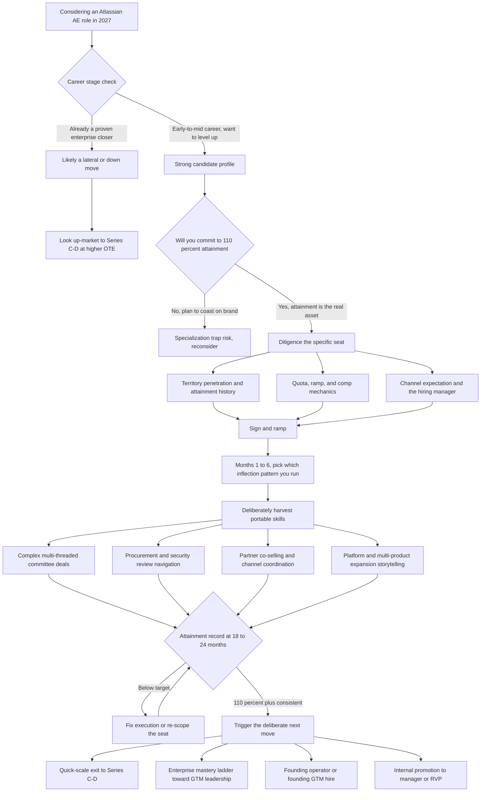

### Direct Answer

An Atlassian Account Executive role in 2027 is still a genuinely good career move -- but only if you treat it as a **15-30 month skill-and-credibility sprint** through enterprise go-to-market complexity, not as a place to retire. Atlassian is a large, healthy, high-retention software company with a mature install base of roughly **300,000-plus paying customers** and a multi-product platform that generates real sourced pipeline and a real land-and-expand motion, so an AE there gets a high volume of reps on durable, portable enterprise skills. The catch is that the value curve is front-loaded: years one and two are dense with transferable learning, while years three through five increasingly teach Atlassian-specific catalog mechanics that do not travel -- so the role pays off for the disciplined sprinter and quietly stalls the passive tenured rep.

> **TL;DR** -- Atlassian (NASDAQ: TEAM) is a structurally healthy company, which means an AE seat there carries real attainment odds and teaches portable enterprise skills: account orchestration, multi-threading, procurement navigation, and channel co-selling. Realistic ramped enterprise-AE OTE is **$240K-$330K** at a roughly 50/50 split -- strong, but below the **$300K-$400K-plus** a proven closer can command at a Series C/D company. The role is a high-quality on-ramp and a high-quality credential with excellent exit optionality and a moderate internal ceiling. Three things decide the payoff: hit 110%-plus of quota inside 18 months, deliberately harvest the portable platform-and-channel skills instead of coasting on inbound, and leave or re-scope before you become a tenured catalog specialist. For the right person at the right stage it is one of the better enterprise-SaaS seats in 2027; for someone chasing a forever job or confusing a strong brand with strong career velocity, it is a trap dressed as a safe choice.

## 1. What An Atlassian AE Role Actually Is In 2027

### 1.1 The Seat, Defined

An Atlassian Account Executive is an enterprise or mid-market software salesperson who carries a quota against a defined book of accounts, selling and expanding Atlassian's product portfolio -- Jira, Confluence, Jira Service Management, Loom, Bitbucket, Compass, and the Rovo AI layer that sits across them -- into companies that mostly already use at least one Atlassian product somewhere in the building. **That last point is the entire character of the job.** You are very rarely selling into a blank account. With Atlassian reporting on the order of 300,000-plus paying customers, the AE motion is overwhelmingly a land-and-expand motion: the land already happened, often years ago, often bottoms-up through a developer who expensed ten seats of Jira, and your job is the expand.

**The expand work is concrete.** It means migrating an account from data center to cloud and from standard to enterprise plans, attaching adjacent products, consolidating shadow instances, growing seat count, and pushing the relationship up from a team lead to a VP of Engineering to a CIO. This makes the role structurally different from a classic hunter seat at an early-stage company where you create demand from nothing.

### 1.2 Why This Differs From The Advice You Have Read

Most career advice about "SaaS sales" is written about the hunter motion -- cold outbound, demand creation, selling a roadmap promise. The Atlassian seat is a different animal. At Atlassian you are converting and compounding existing demand, navigating a buying committee that spans developers, IT, procurement, and security, and co-selling alongside a Solution Partner channel that handles a large share of implementation and services. **The skills that matter are not cold-call volume and demo theater; they are account orchestration, multi-threading, platform storytelling, channel coordination, and the patience to run a procurement cycle at a regulated enterprise.** Understanding this is the precondition for evaluating the role honestly.

| Dimension | Atlassian AE Seat | Classic Hunter Seat (Series A/B) |
|---|---|---|
| Core motion | Demand conversion and expansion | Demand creation from cold |
| Pipeline source | Install base, marketing, channel | Self-sourced, often cold |
| Product maturity | Proven, multi-product platform | Real but still maturing |
| Buying committee | Developer, IT, security, procurement, finance | Often a single line-of-business buyer |
| Org around you | Mature, structured, at scale | Still being built |
| Primary muscle built | Orchestration, channel, process | Resilience, self-sourcing, selling ambiguity |

### 1.3 What "Good For My Career" Has To Mean

A role is good for a career when it raises your market value faster than the alternatives you could realistically take. That is a different test from "is the company healthy" or "is the comp fine." The Atlassian seat passes the company-health test easily; whether it passes the market-value test depends almost entirely on how the individual plays it. This guide is the detail behind that distinction.

## 2. The Honest Verdict: Good, With Conditions

### 2.1 The Conditional Yes

The direct answer to "is this still a good career move in 2027" is **yes -- conditionally.** It is good because Atlassian is not a fragile company, the install base creates real attainment odds, the enterprise motion teaches genuinely portable skills, and the brand still functions as a credential that gets your resume read. It is conditional because the role's career value is not automatic; it is something you have to actively harvest.

### 2.2 Same Seat, Opposite Outcomes

The AE who treats Atlassian as a two-year graduate program in enterprise go-to-market -- who hits quota, multi-threads deliberately, learns the channel, and then makes a deliberate next move -- comes out with a materially stronger career position than they went in with. The AE who treats it as a comfortable seat with good inbound and stays five years on autopilot comes out with a resume that says "tenured Atlassian rep" and a skill set that has quietly specialized into things no other company needs. **Same company, same role, opposite outcomes -- and the difference is entirely in how the individual plays it.**

| If you treat the seat as... | Two-year outcome | Five-year outcome |
|---|---|---|
| A deliberate skill sprint | Strong portable attainment record, channel fluency | Likely already exited up; compounding career |
| A comfortable destination | Decent number, thin portable skill | Tenured catalog specialist, stalled velocity |

So the verdict is not "good" or "bad" as a property of the job; it is **"good if you treat it as a sprint, mediocre if you treat it as a destination."**

## 3. Atlassian's 2027 Business Health And Why It Matters To Your Quota

### 3.1 Reading The Business Like A Candidate Should

Your career outcome in a sales seat is downstream of whether the company can actually be sold, so a candidate has to read the business honestly. Atlassian (NASDAQ: TEAM) closed FY2024 -- the twelve months ended June 30, 2024 -- at roughly **$4.36 billion in revenue, up about 23% year over year**, with cloud revenue around **$2.85 billion, up roughly 33%**, per the Atlassian FY24 Q4 shareholder letter and 10-K. Subscription gross margin sits in the mid-80s percent range, and dollar-based net retention has run around the high-110s percent.

| Metric (FY2024, ended June 30, 2024) | Figure | Source |
|---|---|---|
| Total revenue | ~$4.36B (+23% YoY) | FY24 Q4 shareholder letter |
| Cloud revenue | ~$2.85B (+33% YoY) | FY24 Q4 shareholder letter |
| Paying customers | ~300,000+ | FY24 10-K, Item 1 |
| Subscription gross margin | mid-80s % | FY24 10-K |
| Dollar-based net retention | high-110s % | Q1 FY25 earnings materials |

### 3.2 What That Means For The Person Carrying The Number

Translate the investor language: this is a company with a large, sticky, expanding customer base, a real cloud-migration tailwind still in progress, and product economics healthy enough to fund a large go-to-market organization. For an AE, the practical meaning is **sourced pipeline and structural expansion.** Net retention above 115% means the average existing account grows on its own -- you are not starting every quarter at zero. The cloud and data-center-to-cloud migration motion is a built-in reason to be in every account. The multi-product portfolio means there is almost always a next thing to attach.

### 3.3 The Comparison That Makes The Point

None of this makes the quota easy -- enterprise selling is never easy -- but it means the company is not the thing working against you. Compare that to a Series B company where product-market fit is still partly a question and half your energy goes to selling a roadmap promise: at Atlassian the product is real and proven, and the difficulty is execution, not faith. **That is a meaningfully better place to learn, and a meaningfully better place to put up the attainment numbers that your next employer will actually care about.** For the deeper version of why net retention is the single metric a candidate should weigh most heavily, see the dedicated treatment of gross versus net retention (q97).

## 4. The Five Career Inflection Patterns

### 4.1 Why Naming The Patterns Matters

Across people who take an Atlassian AE seat, five distinct career trajectories show up repeatedly, and naming them lets a candidate aim deliberately instead of drifting. The single most important career decision an Atlassian AE makes is **which of these five they are running** -- and making that choice consciously in month six, rather than discovering in year four that they accidentally ran pattern two.

| Pattern | One-line description | Comp velocity | Best for |
|---|---|---|---|
| 1. Quick-scale exit play | Beat quota 18-24 months, jump to Series C/D | Fastest | Most candidates |
| 2. Platform specialization trap | Stay 3+ years on autopilot, skills go catalog-specific | Negative | Nobody (failure mode) |
| 3. Enterprise mastery ladder | Strategic AE to manager to RVP to VP Sales | Slow but durable | Aspiring sales leaders |
| 4. Founding operator path | Extract the GTM model, then go found or be early | Variable / high-upside | Future founders |
| 5. Internal mobility route | Climb inside Atlassian to manager / RVP | Slowest | Stability-first reps |

### 4.2 The Headline Read

Pattern one is the highest-velocity path and the one most candidates should default to. Pattern two is the failure mode and is covered in detail below because it does not feel like failure while it happens. Patterns three through five are all legitimate, but each carries a specific tradeoff a candidate should choose with eyes open. Sections 5 through 9 drill into each one.

## 5. Drill-Down: The Quick-Scale Exit Play

### 5.1 The Mechanics

This is the highest-velocity path. You join, you ramp, and you spend eighteen to twenty-four months proving you can carry and beat an enterprise number inside a complex, multi-stakeholder, channel-assisted motion. Why it works is structural -- the install base and net retention give you a real shot at the attainment numbers, and **attainment is the only currency that travels.** Then you move.

### 5.2 The Destination

The destination is a Series C/D company in a hot category -- sales tech, security, data infrastructure, AI tooling, developer tooling adjacent enough that your Atlassian context is relevant -- that is scaling its enterprise team and is willing to pay up for someone who has already done the hard version of the job. The comp logic is real: a proven closer who can show President's Club or 120%-plus attainment at a company with Atlassian's deal complexity is exactly the de-risked hire a scaling company wants, and they will pay a 20-35% OTE premium plus a meaningfully larger equity grant relative to what an unproven rep gets.

### 5.3 The Risk And How To Manage It

The risk is the obvious one -- you trade Atlassian's stability for a company that might miss, get its valuation re-cut, or restructure its sales org. You manage that by doing real diligence on the destination's net retention, burn, and pipeline health rather than chasing the highest OTE number on the offer letter. Done well, the quick-scale exit play is how an Atlassian AE turns a good two years into a 30-50% total-comp step-up and a much steeper equity-upside curve. The sibling AE-role analyses for Stripe (q1926), Snowflake (q1923), and Datadog (q1907) describe the same exit-play logic from adjacent seats and are worth reading as cross-checks.

### 5.4 The Timing Window That Makes Or Breaks It

The quick-scale exit has a timing window, and it is narrower than most candidates assume. Move too early -- before you have a full year of clean attainment data -- and you go to market with a story that reads as "promising but unproven," which gets you interviews but not a premium offer. Move too late -- past month thirty -- and you start to accumulate the tenure signal that makes interviewers ask whether you can still hunt. **The sweet spot is roughly months 18 through 30:** long enough to show consistent attainment across multiple quarters and at least one full fiscal year, short enough that your tenure still reads as deliberate rather than settled. The practical discipline is to begin the external conversations -- not the active interviewing, just the relationship-building -- around month twelve, so that when the window opens you are choosing among warm options rather than starting a cold search. An AE who treats the exit as an event that happens to them at month twenty-four is improvising; an AE who treats it as a window they have been preparing for since month six is negotiating from strength.

## 6. Drill-Down: The Platform Specialization Trap

### 6.1 Why It Does Not Feel Like Failure

This is the failure mode, and it is worth dwelling on because it does not feel like failure while it is happening. You stay. The inbound is decent, the accounts are familiar, the comp is fine, the company is stable, and every year you get a little better at the specific machinery of selling Atlassian's catalog -- which SKU bundles, which migration paths, which JSM attach plays, which discount thresholds, which internal approval routes. **It feels like mastery.**

### 6.2 Why Almost None Of It Travels

The problem is that almost none of it is portable. The next company does not have Jira-Confluence-JSM attach motions; it has its own products and its own motion. The next company does not have Atlassian's Solution Partner channel structured the same way. The next company does not have a 300,000-customer install base feeding you warm expansion -- it might need you to actually create pipeline, a muscle that atrophies fast in a heavy-inbound seat.

### 6.3 The Delayed Bill

So three or four years in, the tenured Atlassian AE goes to market and finds that the comp does not step up the way they expected, that interviewers probe whether they can "hunt," and that the very tenure they thought was an asset reads as a yellow flag. **The trap is insidious precisely because every individual year felt fine.** The defense is to set a deliberate clock -- decide up front roughly when you will exit, promote, or re-scope -- and to spend the Atlassian years extracting general enterprise skills rather than letting yourself become a catalog specialist. The broader version of this stagnation pattern, and how to defend against it in any comfortable corporate role, parallels the founder-side discipline discussion (q9634).

## 7. Drill-Down: The Enterprise Mastery Ladder

### 7.1 The Logic Of The Ladder

For the AE who wants to build a long-term enterprise-sales or sales-leadership career rather than chase the fastest comp jump, the enterprise mastery ladder is the play. The logic: Atlassian's largest accounts are genuinely complex -- seven-figure ACV, real procurement, real security and compliance review, multi-region rollouts, buying committees that span engineering and IT and finance -- and getting good at those deals is a credential in itself.

### 7.2 The Rungs

The ladder is: ramp as an enterprise AE, then move into a Strategic Accounts or Major Accounts seat carrying the biggest and most complex book, then use that as the basis for a first-line leadership role -- Sales Manager, RVP -- either inside Atlassian or at a peer-scale or PE-backed software company, and then up into Enterprise GTM and VP Sales roles. What makes Atlassian a good rung for this ladder is that the deal complexity is real -- you are not getting a fake version of enterprise selling -- and the brand carries weight when you interview for the next rung. The mechanics of the founder-led-to-first-VP-of-Sales transition (q162) describe the destination of this ladder in detail.

### 7.3 The Risk Is Pace

The risk is pace: this ladder is slower than the quick-scale exit, and it requires patience and a tolerance for the politics of large sales organizations. But for someone whose ambition is to run a go-to-market organization rather than to maximize near-term cash, it is a coherent, real path, and Atlassian is a legitimate place to climb its first few rungs.

## 8. Drill-Down: The Founding Operator Path

### 8.1 The Seat As Intelligence-Gathering

A subset of Atlassian AEs are not actually trying to be career salespeople -- they want to build a company, or be early at one. For them the Atlassian seat is a deliberate intelligence-gathering posting. What you can learn there that is hard to learn elsewhere: how a multi-product platform actually expands inside an account; what land-and-expand looks like when the land was bottoms-up and product-led; how a Solution Partner channel is structured and what it does and does not do; what enterprise procurement and security review actually demand from a vendor; how net-retention economics show up in real customer behavior.

### 8.2 Why That Model Is Scarce

That is a genuinely valuable mental model for a founder or a founding go-to-market hire, because most first-time founders have never seen enterprise GTM up close and get it badly wrong. The play is to spend eighteen to thirty months extracting that model -- being curious about the why behind the motion, not just executing it -- while putting up attainment numbers that fund your runway and prove you can sell.

### 8.3 The Honest Caveat

The risk is that sales tenure at a large company is not the same as founder experience, and you should be honest that you are getting a model and a network and a financial cushion, not a guarantee. But as preparation goes, a couple of disciplined years inside a healthy platform company's GTM is a strong base. The contrast with the pure hunter motion -- the muscle a founder most needs -- is laid out in the hunters-versus-farmers framework (q20).

## 9. Drill-Down: The Internal Mobility Route

### 9.1 The Real Path

The fifth path is to stay and climb inside Atlassian -- AE to Senior AE to Strategic AE, or AE into first-line management as a Sales Manager, then Senior Manager, then RVP. This is a real path and it is the right one for some people, particularly those who value Atlassian's stability, culture, and distributed-work model, and who want leadership responsibility without changing companies.

### 9.2 The Two Frictions

A candidate should go in clear-eyed about two structural frictions. **First, it is crowded:** a large, established sales organization has many tenured AEs per region all eyeing the same finite number of management seats, and the queue is long. **Second, internal title progression has historically not kept pace,** in pure comp terms, with what a strong rep can get by moving -- the market pays a premium for mobility and for the implied risk-taking, and internal ladders rarely match that.

### 9.3 The Mistake To Avoid

So the internal route is viable, but it is the slowest of the five on comp velocity, and it works best for someone whose priorities genuinely weight stability and culture-fit over maximizing total compensation and equity upside. **The mistake is defaulting into it passively because leaving feels like effort** -- that is just the specialization trap with a slightly better title.

### 9.4 The One Version Of Internal Mobility That Works Well

There is a version of the internal route that is genuinely strong rather than merely safe, and it is worth naming because it is the exception to the comp-velocity warning. It is the AE who moves into first-line management not as a comfort default but as a deliberate leadership ladder -- treating the Sales Manager seat the way the quick-scale exit treats the AE seat, as a place to prove they can build and coach a team and carry a team number. That manager then has a real choice: climb further inside Atlassian, or take the management experience to a peer-scale or PE-backed company that pays a premium for a proven first-line leader. The distinction is intent. Internal mobility taken as the path of least resistance compounds slowly; internal mobility taken as a deliberate move into leadership, with the same harvest-and-timeline discipline applied one rung up, is a coherent and well-paid path. The internal route is only weak when it is passive.

## 10. The 2027 Compensation Reality

### 10.1 Concrete Numbers, Not Vibes

A candidate needs concrete numbers, not vibes. Enterprise SaaS AE compensation in 2027 is structured as base plus variable, conventionally a 50/50 split, with the variable tied to quota attainment and often accelerators above 100%. For an Atlassian enterprise AE, a realistic ramped OTE sits in roughly the **$240,000-$330,000** range -- base around $120,000-$165,000, variable the rest at 100% attainment -- with the spread driven by segment, geography, and tenure.

| Role / Stage | Typical Base | OTE (100% Attainment) | Equity Character | Notes |
|---|---|---|---|---|
| Atlassian Mid-Market AE | $100K-$130K | $200K-$260K | Public RSUs, modest | Shorter cycles, higher deal volume |
| Atlassian Enterprise AE (ramped) | $120K-$165K | $240K-$330K | Public RSUs, modest | Complex, channel-assisted, 7-figure ACV |
| Atlassian Strategic / Major Accounts AE | $150K-$185K | $300K-$380K | Public RSUs | Largest, most complex book |
| Series C/D Enterprise AE (proven hire) | $130K-$170K | $300K-$400K+ | Private options, higher upside/risk | Premium paid to de-risk the hire |
| First-line Sales Manager (Atlassian or peer) | $150K-$190K | $280K-$360K | RSUs / options | Crowded internal queue at Atlassian |

### 10.2 Strong But Not Category-Leading

That is a strong number in absolute terms. It is not, however, the top of the market. A proven enterprise closer -- someone who can show consistent 110-130% attainment in a complex motion -- can command **$300,000-$400,000-plus OTE** at a Series C/D company that is scaling its enterprise team and is willing to pay up to de-risk the hire, often with a materially larger equity grant attached.

### 10.3 The Core Strategic Implication

The strategic implication is the core of this whole guide: Atlassian pays well for the seat, but the seat's biggest financial value is as the place you **earn the attainment record** that lets you go capture the higher number elsewhere. Public compensation aggregators -- Levels.fyi for cross-company data, RepVue for sales-org-specific attainment and culture signal, Glassdoor for range context -- are worth triangulating before any negotiation. The single biggest comp mistake an Atlassian AE makes is anchoring on the internal band as if it were the market, when it is really the floor of a much wider market. For the deeper comp-mechanics view -- accelerators, clawbacks, ratios -- see the enterprise-AE OTE benchmark (q01) and the CRO-stage compensation benchmarks (q9634).

## 11. Why The Brand Helps -- And Where It Stops Helping

### 11.1 What The Logo Does

The Atlassian name on a resume does real work, and a candidate should understand exactly what work it does and where it stops. **What it does: it gets your resume read.** A recruiter or hiring manager screening for enterprise SaaS roles sees "Atlassian Enterprise AE" and reads it as a signal that you have operated inside a real, complex, at-scale go-to-market organization -- you have probably seen procurement, you have probably co-sold with a channel, you have probably multi-threaded a committee. That signal opens the door.

### 11.2 Where The Logo Stops

**Where it stops: the brand gets you the interview, but it does not get you the offer, and it does not set the comp.** The offer and the comp are set by your attainment record -- did you hit and beat your number, consistently, and can you tell a credible, specific story about how. This is the single most misunderstood thing about brand-name sales jobs. Candidates take them believing the logo is the asset, then coast, then go to market with a great logo and a mediocre attainment story and are confused when the offers are soft.

### 11.3 Packaging Versus Product

The logo is the packaging. The attainment record is the product. Atlassian gives you good packaging and a real shot at building a good product underneath it -- but only the product gets bought.

| Career asset | What it does | What it cannot do |
|---|---|---|
| Atlassian brand on resume | Gets the resume read, opens the interview | Win the offer, set the comp |
| Attainment record (110%+) | Wins the offer, sets the comp, travels everywhere | Open a door at a company that has never heard of you |
| Portable skill story | Survives the interview probe, de-risks the hire | Substitute for an actual number |

## 12. The Skills That Actually Transfer

### 12.1 The Portable Set

Be specific about which Atlassian-AE skills are portable career capital and which are not, because the whole "treat it as a sprint" thesis depends on harvesting the portable ones.

| Transfers Well (Portable Capital) | Transfers Poorly (Atlassian-Specific) |
|---|---|
| Enterprise account orchestration / committee selling | Atlassian product catalog and SKU mechanics |
| Multi-threading and executive access | Atlassian discounting and approval routes |
| Procurement and security-review navigation | Reliance on Atlassian's inbound / install-base motion |
| Channel and partner co-selling | Atlassian-specific partner program structure |
| Platform / multi-product expansion storytelling | -- |
| Forecast discipline and pipeline hygiene | -- |

### 12.2 The Discipline The List Implies

The career discipline this implies is to spend your Atlassian years consciously building the first column -- volunteer for the messiest committee deals, the hardest procurement cycles, the partner co-sells -- rather than optimizing for the easy inbound expansion that builds mostly the second column. **Two AEs can hit the same quota number; the one who hit it through complex multi-threaded deals has built portable capital, and the one who hit it through easy renewals and inbound has built a number with nothing transferable underneath it.** This is the same conversion-versus-creation distinction at the heart of the hunters-versus-farmers framework (q20).

### 12.3 How To Tell A Portable-Skill Story In An Interview

The harvested skill only becomes career capital when you can articulate it. A hiring manager at your next company does not care that you hit 118% -- they care whether the number was built on something they can buy. The portable-skill story has a structure: **name the hard deal, name the specific obstacle, name what you did, and name the transferable principle.** A weak version is "I closed a big Jira-to-cloud migration." A strong version is "I had a seven-figure migration stalled in security review for two months; I built a direct relationship with the customer's CISO, restructured our data-residency answer, and got procurement unblocked -- which taught me how to run a regulated enterprise's security gauntlet without losing deal momentum." The first version sells Atlassian's catalog; the second sells a skill any enterprise-software company needs. The discipline during the Atlassian years is to keep a running deal journal -- not for the CRM, for yourself -- documenting the hard deals specifically enough that two years later you can tell the second kind of story without reconstructing it from memory.

## 13. The First 90 Days: Ramping Without Wasting The Window

### 13.1 The Most-Wasted Period

The early months of an Atlassian AE seat are the highest-leverage and most-wasted period of the whole tenure, and a candidate should plan them before signing. The mistake most new AEs make is treating ramp as a passive process -- absorb the onboarding, learn the product catalog, wait for pipeline to mature -- when ramp is actually when you set the trajectory for everything after.

### 13.2 The Four Things A Deliberate Ramp Does

**It maps the book ruthlessly:** which accounts are penetrated and which are greenfield-within-the-base, which have expiring contracts or migration triggers, which already have an executive relationship and which are single-threaded through one champion. **It builds the channel relationships early:** identifying which Solution Partners are active in your territory and getting in front of them before you need them on a deal, because a partner relationship started cold inside a live opportunity is a partner relationship that slows the deal. **It establishes the manager relationship as a coaching relationship,** not just a forecasting one. **And it picks the inflection pattern:** by the end of the first quarter you should have a working hypothesis about which of the five career paths you are running.

| First-90-day action | Passive AE | Deliberate AE |
|---|---|---|
| Book mapping | Learns accounts as deals appear | Pre-segments penetrated vs greenfield, flags migration triggers |
| Channel | Meets partners inside a live deal | Builds partner relationships before they are needed |
| Manager | Uses manager for forecasting only | Uses manager as a deal strategist and coach |
| Career path | Drifts | Has a working hypothesis on which pattern they run |

### 13.3 The Payoff Of A Strategic Ramp

The AE who treats ramp as paid orientation comes out of it behind; the AE who treats it as the strategic setup phase comes out of it with a mapped book, a channel network, a coaching relationship, and a plan.

## 14. The Channel, Geography, Segment, And AI Reality

### 14.1 Selling Alongside Solution Partners

A distinctive feature of the Atlassian AE job is that you do not sell alone -- a large share of implementation, migration, and services flows through Atlassian's Solution Partner channel, and a meaningful portion of deals are co-sold or partner-sourced. The upside: channel co-selling is an increasingly common enterprise-software motion, and learning to do it well -- how to bring a partner in at the right moment, how to coordinate without losing control of the customer relationship, how to manage the economics and the attribution -- is a real, portable, and somewhat scarce skill. The downside: a heavy channel motion can leave you slightly more removed from raw end-to-end deal mechanics, so you have to deliberately stay close to the full deal. **The career move is to treat the channel as a skill to master, not a crutch to lean on.** The capacity and bottleneck mechanics of co-sell motions are treated separately in the AE co-sell analysis (q146).

### 14.2 Geography And Segment Are Not Uniform

A candidate should not treat "Atlassian AE" as one uniform job. **Segment** is the biggest variable: a mid-market AE runs higher deal volume, shorter cycles, and a more transactional motion, while an enterprise or strategic AE runs fewer, larger, slower, more complex deals -- and these build different skills and carry different comp. A candidate optimizing for portable enterprise capital wants the enterprise or strategic segment even if mid-market offers faster early wins. **Geography** shapes both the territory's character and the comp. Atlassian's distributed-work model is itself a real factor -- a genuine quality-of-life advantage over an in-office enterprise seat for many candidates.

### 14.3 The AI Layer: Rovo And What It Means

By 2027 the AI question sits over every software sales seat. **Level one, AI as something you sell:** Atlassian's Rovo AI layer -- search, agents, and AI capabilities woven across Jira and Confluence -- becomes part of the expansion story, and learning to sell an AI layer into a skeptical enterprise buyer is itself a 2027 skill worth having. **Level two, AI as something that changes the job:** AI tooling is compressing the commodity parts of the SaaS sales motion -- research, account planning, outreach drafting, call summarization -- which means the differentiated parts (complex multi-threading, executive trust, hard procurement cycles, channel orchestration) are becoming the whole job. The strategic read: this argues for a seat like Atlassian's, because the Atlassian motion is concentrated in exactly the complex work AI does not replace.

## 15. The Risk Side: What Could Go Wrong With This Bet

### 15.1 Why The Risks Have To Be Named

An honest evaluation has to name the downside scenarios, because "Atlassian is healthy" is a probabilistic statement, not a guarantee.

### 15.2 The Risk Register

| Risk | What it means for the AE | How to manage it |
|---|---|---|
| Macro / IT-budget | Downturn compresses engineering and IT budgets, slows expansion | Diligence segment exposure; build pipeline cushion early |
| Org-design | Territory re-cuts, re-segmentation, comp-plan changes | Ask about recent re-cut frequency before signing |
| Saturation | A heavily-expanded book makes the number harder | Diligence territory penetration explicitly |
| Platform competition | Pressure on a specific product makes an attach play harder | Diversify the deals you chase across products |
| Specialization | Slow, invisible erosion of portable skill | Set a deliberate exit/promote/re-scope clock |

### 15.3 The Biggest Under-Weighted Risk

The specialization risk is arguably the biggest career risk and the one most under-weighted, because it is the only one on the list that is invisible while it happens. None of these make the role a bad bet; they make it a bet that has to be actively managed. The candidate who goes in naming these risks, doing diligence on their specific segment and territory, and keeping a deliberate timeline is positioned very differently from the one who treats "big healthy company" as the end of the analysis.

### 15.4 Separating Company Risk From Seat Risk

A useful mental model is to split the risk into two layers. **Company-level risk** -- macro exposure, competitive pressure, the broad health of the business -- is real but largely outside your control and, for Atlassian specifically, relatively low: a 23%-growth company with high-110s net retention is not the bet most likely to go wrong. **Seat-level risk** -- territory penetration, your specific manager, how recently your comp plan was re-cut, whether your patch is greenfield or saturated -- is where most individual AE outcomes are actually decided, and it is the layer candidates most consistently fail to diligence. The mistake is to spend the evaluation worrying about the company layer, where Atlassian scores well and you have little leverage anyway, while skipping the seat layer, where the variance is wide and the diligence questions are answerable. A candidate who inverts that -- treats company health as a quick check and seat quality as the deep investigation -- is doing the evaluation in the right order.

## 16. Who This Role Is Right For

### 16.1 The Strong-Fit Profile

The Atlassian AE seat in 2027 is a strong fit for a specific profile. **It fits the early-to-mid-career enterprise seller** -- someone with two to seven years of B2B sales experience who wants to level up into genuine enterprise complexity at a company stable enough to let them learn without the floor falling out. **It fits the rep who wants a credible logo plus a real attainment opportunity.** **It fits the future founder or founding GTM hire** who wants to see platform GTM up close. **It fits the aspiring sales leader** who wants legitimate enterprise reps as the base of a leadership ladder. **It fits someone who values Atlassian's distributed-work model and culture.**

### 16.2 The Poor-Fit Profile

It is a poor fit for the rep who wants to maximize near-term cash above all else and would be better at a higher-OTE Series C/D seat right now; for the pure hunter who is energized by demand creation and would find the conversion motion unsatisfying; for someone looking for a forever job, because the value curve flattens; and for anyone who confuses a strong brand with strong career velocity and would coast. **The role is a tool, and like any tool it is excellent for some jobs and wrong for others** -- the candidate's task is an honest match between the tool and the career they are actually trying to build. The same fit logic, applied to adjacent companies, runs through the sibling analyses for HubSpot (q1915), Salesforce (q1894), and ServiceNow (q1641).

## 17. The Decision Framework: Should You Take Or Stay In This Role

### 17.1 A Structured Self-Assessment

A candidate facing the take-it-or-not -- or stay-or-go -- decision should run a structured self-assessment rather than going on gut.

| Assessment axis | The question to ask yourself | Weak answer signal |
|---|---|---|
| Career stage | Am I leveling up, or moving laterally? | "This would be a lateral or down move" |
| Attainment intent | Can and will I hit 110%+ in 18 months? | "I expect the brand to carry me" |
| Skill-harvest discipline | Will I chase the hard, complex deals? | "The easy inbound deals are fine" |
| Timeline honesty | Do I have an exit/promote clock? | "I will figure it out later" |
| Path selection | Which of the five patterns am I running? | "I have not chosen one" |
| Risk diligence | Have I diligenced segment, territory, manager? | "Big healthy company is enough" |

### 17.2 Reading The Result

If a candidate answers strongly across all six axes, the Atlassian AE role in 2027 is a clear yes. If they answer weakly on attainment intent or timeline honesty, they will probably fall into the specialization trap and should either fix that mindset or pick a different seat. If they answer "this is a lateral or down move" on career stage, they have likely outgrown the seat and should look up-market.

## 18. What To Negotiate And Diligence Before You Sign

### 18.1 The Offer Stage Is Maximum Leverage

If the framework says yes, a candidate should treat the offer stage as the moment of maximum leverage and get specific answers, because the quality of the specific seat matters as much as the company.

| Diligence area | What to ask | Why it matters |
|---|---|---|
| Territory and segment | How penetrated is the book? Greenfield or expanded? | Single biggest swing on number difficulty |
| Quota and ramp | Quota size, ramp schedule, ramped-quota relief | Defines what on-target actually means |
| Comp mechanics | Base/variable split, accelerators, payout, clawback, equity | Internal band is the floor, not the market |
| Channel expectation | What share of motion is partner co-sold? | Co-sell attribution affects your payout |
| Hiring manager | Interview the first-line manager hard | Biggest single variable in success and learning |
| Org stability | How often have territories and comp plans been re-cut? | Org-design risk is outside your control |

### 18.2 Known Bet Versus Blind Bet

The candidate who signs after getting real answers to those questions is taking a known bet; the one who signs on the logo and the headline OTE is taking a blind one. The brand is the easy part to evaluate -- the seat is the hard part, and the seat is what you actually live in.

## 19. The Two-Year Exit Playbook: Engineering The Next Move

### 19.1 The Rhythm Of A Deliberate Exit

If the plan is the quick-scale exit -- and for most candidates it should be -- a candidate should run the exit deliberately rather than hoping a good move appears. The playbook has a rhythm.

| Window | Focus | Key actions |
|---|---|---|
| Months 0-6 | Setup | Map the book, build channel network, set manager coaching, pick the pattern |
| Months 6-18 | Build the record | Hit the number through hard deals; document wins specifically |
| Months 12-24 | Build surface area | Relationships at destination companies, GTM-community visibility, a clear narrative |
| Months 18-30 | Run the move | Diligence destinations on retention/burn/pipeline; interview hard; negotiate from strength |

### 19.2 Why Starting Early Is The Whole Trick

The discipline that makes this work is starting it early. The AE who begins thinking about the exit at month 22 is improvising, while the AE who has been deliberately building the attainment record, the portable skills, and the external network since month six is executing a plan. **The brand and the company stability give you a stable platform to run this playbook from -- but the playbook is yours to run, and the cost of not running it is the specialization trap.** The sibling Stripe-AE analysis (q1926) walks the same exit playbook from a payments-platform seat and is a useful comparison.

## 20. Common Mistakes That Waste The Atlassian Seat

### 20.1 The Failure Patterns Are Consistent

A candidate can avoid most of the bad outcomes simply by knowing the failure patterns in advance, because they are remarkably consistent.

| Mistake | What it looks like | The fix |
|---|---|---|
| Coasting on inbound | Easy install-base deals quarter after quarter | Chase complex, multi-threaded deals deliberately |
| Anchoring comp to the internal band | Treating Atlassian OTE as "the market" | Benchmark on Levels.fyi and RepVue |
| Staying past the value curve | Missing the 24-30 month window | Set and honor a deliberate clock |
| Single-threading deals | One champion per account | Multi-thread the whole buying committee |
| Treating the channel as a crutch | Handing hard deal parts to the partner | Own the customer relationship end-to-end |
| Skipping seat-level diligence | Signing on brand and headline OTE | Diligence territory, segment, comp, manager |
| Not picking an inflection pattern | Drifting with no chosen path | Choose one of the five by month six |
| Neglecting the network | Two-plus years with no external relationships | Build destination relationships from month six |

### 20.2 Treat The List As A Pre-Mortem

Every one of these is avoidable, and the AEs who get real career value from the seat are the ones who treated this list as a pre-mortem before they ever signed.

## 21. The Career-Decision Journey: A Visual Map

The diagram below traces the full decision from considering the offer through the deliberate next move.

## 22. Counter-Case: Why An Atlassian AE Role Might Be The Wrong Move In 2027

### 22.1 Stress-Testing The Thesis

The analysis above describes a genuinely good opportunity for the right person -- but a serious candidate has to stress-test it against the conditions that make it a poor bet. There are real reasons to pass.

### 22.2 The Ten Counter-Arguments

**Counter 1 -- The brand is worth less than candidates think.** "Atlassian" on a resume gets the interview, but it does not get the offer and it does not set the comp -- the attainment record does. If you are not going to put up the numbers, the brand alone is close to worthless as career capital.

**Counter 2 -- The OTE is strong but not category-leading.** A ramped Atlassian enterprise AE realistically earns $240K-$330K OTE. A proven enterprise closer can command $300K-$400K-plus at a scaling Series C/D company. If you are already a proven closer, taking the Atlassian seat is a lateral or down move dressed up as a prestige upgrade.

**Counter 3 -- The specialization trap is real, slow, and invisible.** It does not feel like failure while it happens. Every year you get better at Atlassian-specific catalog mechanics that do not transfer. Three or four years in you discover the comp did not step up and your tenure reads as a yellow flag.

**Counter 4 -- It is a conversion motion, not a creation motion.** The pipeline is substantially sourced for you. That is comfortable, but the self-sourcing and demand-creation muscle atrophies. If your career goal needs the hunter muscle, a heavy-inbound seat actively works against you.

**Counter 5 -- The internal ceiling is moderate and the queue is crowded.** Promotion into management means competing with many tenured AEs per region for a finite number of seats, and internal title progression has historically lagged the comp you could get by leaving.

**Counter 6 -- Your specific territory can quietly sink the bet.** "Atlassian is healthy" is a company-level statement. Your outcome is a territory-level reality. Draw a heavily-penetrated book and your number is materially harder than a peer's greenfield book.

**Counter 7 -- Org-design risk is outside your control.** Large sales organizations periodically re-cut territories, re-segment accounts, and change comp plans. You can have a great book one year and a re-cut, harder book the next.

**Counter 8 -- Macro and IT-budget exposure.** Atlassian sells into engineering and IT budgets. A hard enough downturn compresses those budgets and lengthens cycles for everyone in the org regardless of individual skill.

**Counter 9 -- Competitive pressure on specific attach motions.** Atlassian competes with Microsoft, ServiceNow, GitLab, GitHub, and monday.com. Competitive pressure on a specific product can make a specific attach play structurally harder, independent of how good you are.

**Counter 10 -- Adjacent seats may simply fit your goal better.** If you want maximum near-term cash, a higher-OTE Series C/D seat fits better now. If you are energized by demand creation, a hunter seat fits better. If you want to be a founder soon, being early at a startup teaches more than observing platform GTM from a large-company seat.

### 22.3 The Honest Verdict

An Atlassian AE role in 2027 is a reasonable choice for a candidate who is early-to-mid-career and genuinely leveling up, who will commit to and actually deliver 110%-plus attainment, who will deliberately harvest the portable enterprise and channel skills, who keeps an honest 24-30 month decision clock, who has done real diligence on segment and territory and manager, and who has matched the seat to a clearly chosen one of the five inflection patterns. It is a poor choice for the already-proven closer taking a comp cut for a logo, for the pure hunter who needs demand-creation reps, for anyone seeking a forever job, and for anyone who confuses a strong brand with strong career velocity and will coast. **The role is not a scam and it is not a trap -- but it is a tool that is excellent for some careers and wrong for others, and in 2027 the gap between the disciplined version that pays off and the passive version that quietly stalls is wide.**

## 23. The Bottom Line On The Atlassian AE Bet In 2027

Pulling the whole analysis together: an Atlassian AE role in 2027 is a genuinely good career move for the right person played the right way -- and a quietly mediocre one for the wrong person, or the right person played passively. The company is healthy, the install base and net retention create real attainment odds, the enterprise-and-channel motion teaches durable portable skills, and the brand opens doors. But the value curve is front-loaded, the internal ceiling is moderate, the OTE is strong but not category-leading, and the specialization trap is real and invisible while it happens. So the move is: take it -- or stay in it -- if you are at the right career stage, treat it as a 15-30 month sprint rather than a destination, commit to actually hitting 110%-plus so you build the attainment record that is the real asset, deliberately harvest the portable enterprise and channel skills rather than coasting on inbound, keep an honest timeline so you exit or climb before your skills stop compounding, and pick which of the five inflection patterns you are running on purpose. Do that, and the Atlassian seat is one of the better enterprise-SaaS sales bets available in 2027 -- a strong on-ramp, a real credential, and excellent exit optionality. Skip the discipline -- coast on the brand, coast on the inbound, stay too long -- and you end up a tenured catalog specialist with a great logo and a stalled career. **The role is not good or bad. The way you play it is.**

## 24. Related Pulse Library Entries

The entries below are genuine siblings -- the adjacent-company AE-role analyses and the underlying enterprise-sales career mechanics that this guide draws on.

- **Is a Stripe AE role still good for my career in 2027?** (q1926) -- The same "is this seat still good" framework applied to a payments-platform AE seat; a direct comparison point for the quick-scale exit play.
- **Is a Snowflake AE role still good for my career in 2027?** (q1923) -- A data-infrastructure AE-role analysis with parallel land-and-expand and attainment-record logic.
- **Is a HubSpot AE role still good for my career in 2027?** (q1915) -- A mid-market-to-enterprise AE seat analysis that shows the brand-versus-attainment tradeoff in a different segment.
- **Is a Datadog AE role still good for my career in 2027?** (q1907) -- An observability-platform AE-role evaluation with the same value-curve and exit-optionality framing.
- **Is a Salesforce AE role still good for my career in 2027?** (q1894) -- The large-platform AE seat where the specialization-trap and internal-ceiling dynamics are most pronounced.
- **Is a ServiceNow AE role still good for my career in 2027?** (q1641) -- A complex-enterprise AE analysis that pairs with the channel and procurement-navigation sections here.
- **What do CRO compensation benchmarks actually look like by company stage in 2027?** (q9634) -- The leadership-comp context behind the enterprise-mastery-ladder destination.
- **What's a fair OTE for an enterprise AE selling $100k+ ACV deals?** (q01) -- The deeper comp-mechanics view -- base/variable split, accelerators -- behind this guide's compensation section.
- **What's the difference between hunters and farmers and when to hire each?** (q20) -- The conversion-versus-creation motion distinction central to evaluating the Atlassian seat.
- **How do you transition from founder-led to first VP of Sales?** (q162) -- The enterprise-mastery-ladder destination role and the path into go-to-market leadership.
- **How do I sell into private equity-backed portfolio companies?** (q146) -- Adjacent enterprise-motion and co-sell context relevant to the channel and exit-destination discussion.
- **How do I calculate true gross retention vs net retention?** (q97) -- The single metric most predictive of an AE's sourced-pipeline reality and the diligence behind the quick-scale exit play.

## 25. Sources

1. **Atlassian Investor Relations -- SEC Filings and Shareholder Letters** -- Primary source for revenue, cloud revenue, customer count, gross margin, and net retention disclosures. https://investors.atlassian.com
2. **Atlassian FY24 Q4 Shareholder Letter** -- FY2024 (12 months ended June 30, 2024) revenue ~$4.36B (+23% YoY) and cloud revenue ~$2.85B (+33% YoY).
3. **Atlassian FY24 Annual Report (Form 10-K)** -- Customer count (~300,000+ paying customers), subscription gross margin, operating margin, and business-model disclosures.
4. **Atlassian Q1 FY2025 Earnings Call and Materials** -- Dollar-based net retention and updated operating metrics. https://investors.atlassian.com
5. **Atlassian Solution Partner Program Documentation** -- Structure of the partner channel that co-sells and implements across the Atlassian portfolio. https://www.atlassian.com/partners
6. **Atlassian Rovo and AI Product Documentation** -- The AI layer (search, agents) woven across Jira, Confluence, and Jira Service Management. https://www.atlassian.com/software/rovo
7. **Levels.fyi -- Sales Compensation Data** -- Cross-company base, OTE, and equity benchmarks for SaaS AE roles by segment and level. https://www.levels.fyi/comp.html?track=Sales
8. **RepVue -- Sales Organization Ratings and Attainment Data** -- Crowd-sourced quota-attainment rates, OTE accuracy, and sales-culture signal by company. https://www.repvue.com
9. **Glassdoor -- Atlassian Account Executive Compensation and Reviews** -- Range context for base and OTE and employee-reported role detail. https://www.glassdoor.com
10. **US Bureau of Labor Statistics -- Sales Representatives, Wholesale and Manufacturing / Software** -- Occupational outlook and wage context for software sales roles. https://www.bls.gov/ooh/sales/
11. **The Bridge Group -- SaaS AE and Inside Sales Metrics Reports** -- Industry benchmarks on quota size, ramp time, attainment, and tenure for B2B SaaS sales roles. https://www.bridgegroupinc.com
12. **Pavilion -- Go-To-Market Leadership Community and Compensation Benchmarks** -- Benchmarks and community data on GTM roles, comp plans, and career paths. https://www.joinpavilion.com
13. **Gartner -- Software and DevOps / Agile Planning Market Research** -- Market context for the categories Atlassian competes in (agile planning, ITSM, collaboration). https://www.gartner.com
14. **Forrester -- Collaborative Work Management and Developer Tooling Research** -- Analyst context on the competitive landscape and buyer behavior. https://www.forrester.com
15. **Atlassian Team -- Annual Customer and Partner Conference Materials** -- Product roadmap and platform-strategy signal relevant to the expansion motion.
16. **LinkedIn -- Atlassian Sales Org Headcount and Alumni Career-Path Data** -- Observable destination patterns for former Atlassian AEs (exit companies, roles, leadership tracks). https://www.linkedin.com
17. **Outreach, Apollo.io, Clari, ZoomInfo -- Public Funding and Revenue Disclosures** -- Reference points for Series C/D destination companies in the sales-tech category and their AE hiring.
18. **Vista Equity Partners and Thoma Bravo -- Software Portfolio Disclosures** -- PE-backed software companies that hire experienced enterprise AEs and sales leaders. https://www.vistaequitypartners.com
19. **Sales Hacker / GTMnow -- Enterprise Sales Career and Compensation Content** -- Practitioner content on enterprise AE career paths, comp negotiation, and the brand-versus-attainment dynamic.
20. **CompGauge and Comprehensive.io -- SaaS Sales Compensation Aggregators** -- Additional triangulation sources for AE base/variable split and OTE ranges.
21. **G2 and TrustRadius -- Atlassian Product Category Standing** -- User-review context on Jira, Confluence, and Jira Service Management competitive position. https://www.g2.com
22. **Atlassian Cloud Migration Program Documentation** -- The data-center-to-cloud migration motion that anchors much of the current AE expansion play.
23. **Crunchbase -- Funding-Stage Data for Destination Companies** -- Series C/D financing context for evaluating exit-play destinations. https://www.crunchbase.com
24. **Microsoft, ServiceNow, GitLab, GitHub, monday.com -- Public Competitive Positioning** -- The competitive set whose pressure shapes specific Atlassian attach motions.
25. **US Securities and Exchange Commission -- EDGAR Filings (Atlassian and Comparable SaaS Issuers)** -- Primary-source financial filings for Atlassian and public comparables. https://www.sec.gov/edgar
26. **Atlassian FY24 Q1 Through Q4 Earnings Press Releases** -- Quarterly revenue, cloud growth, and customer-metric progression across FY2024.
27. **Atlassian Investor Day and Long-Term Model Materials** -- Management's framing of the cloud-migration tailwind and multi-product expansion thesis.
28. **Gainsight and ChurnZero -- Net Retention and Expansion Benchmark Content** -- Industry context for what dollar-based net retention in the high-110s implies for an AE's sourced pipeline.
29. **OpenView and SaaS Capital -- SaaS Growth and Retention Benchmark Reports** -- Cross-company benchmarks for revenue growth, retention, and go-to-market efficiency.
30. **Built In and Comparably -- Atlassian Workplace, Culture, and Distributed-Work Data** -- Employee-reported context on Atlassian's remote-first model and sales-org culture.
31. **HBR and First Round Review -- Enterprise Sales Career and GTM Leadership Content** -- Practitioner and research perspective on enterprise-sales career ladders and the IC-to-leader transition.
32. **GitLab and Microsoft Investor Disclosures -- DevOps and Collaboration Competitive Context** -- Public competitor financials that frame the attach-motion pressure Atlassian AEs navigate.
33. **Pulse RevOps Library -- Adjacent AE-Role and Enterprise-Sales-Career Entries** -- Internal cross-reference set covering sibling company AE-role analyses and the underlying comp, retention, and motion mechanics.
