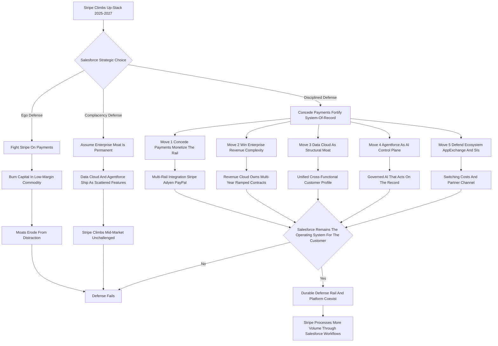

### Direct Answer

Salesforce defends against Stripe in 2027 not by trying to win payment processing -- a commodity fight it has already lost and should never have entered -- but by hardening the three layers Stripe structurally cannot replicate: the customer system-of-record, the enterprise revenue-management stack, and the agentic-AI control plane that sits on top of unified data. The honest defense concedes payments, monetizes the rail through deep multi-rail partnership, widens the enterprise revenue-complexity gap where Stripe Billing is weak, turns Data Cloud and Agentforce into a compounding moat, and keeps the AppExchange and systems-integrator ecosystem sticky. Done with discipline, Salesforce does not beat Stripe -- it makes the question irrelevant by owning a different, defensible layer while Stripe processes more volume than ever *through* Salesforce-orchestrated workflows.

**TL;DR:** Salesforce (NYSE: CRM) is a mature, GAAP-profitable platform company being attacked from below by Stripe, a private payments-infrastructure company climbing up the stack into Billing, Tax, Revenue Recognition, and a developer marketplace. The collision is real but narrow: Stripe owns money movement and developer-first commerce; Salesforce owns the relationship, process, and record layer. The 2027 defense has four-plus-one moves -- (1) concede payments, monetize the rail; (2) win enterprise revenue complexity; (3) make Data Cloud the structural moat; (4) make Agentforce the governed AI control plane; (5) defend the ecosystem. The three failure modes are the ego defense (fighting payments head-on), the complacency defense (assuming the moat is permanent), and AI dilution (shipping Agentforce as scattered features). The defense is a positioning-and-discipline problem more than a product problem -- the products mostly exist; the open question is execution over the next twenty-four months.

## 1. What This Competition Actually Is In 2027

The Salesforce-versus-Stripe question is widely misframed, and the misframing produces bad strategy. Getting the frame right is the first defensive act.

### 1.1 The Wrong Frame And The Right Frame

**The wrong frame is "CRM company versus payments company."** That framing implies two non-overlapping businesses and produces a lazy conclusion -- that the two simply do not compete. **The right frame in 2027 is a stack-collision between two companies expanding toward the same revenue-operations center from opposite ends.** Salesforce (NYSE: CRM) built downward and outward from the customer relationship: it began as sales-force automation, then accreted service, marketing, commerce, analytics through Tableau, integration through MuleSoft, collaboration through Slack, and a data-and-AI layer in Data Cloud, Einstein, and Agentforce. It sits as the system-of-record for how enterprises *manage relationships and process revenue*. **Stripe built upward from the payment rail:** it started as seven lines of code to charge a card, then added Billing, Invoicing, Tax, Sigma, Radar, Connect, Issuing, Treasury, Capital, Atlas, Identity, and a developer marketplace in Stripe Apps. It sits as the infrastructure for how internet businesses *move and manage money*.

### 1.2 Why The Two Now Overlap

**The two were non-overlapping for a decade and overlap now for three reasons.** First, **Stripe Billing, Tax, Invoicing, and revenue-reporting products increasingly do things Salesforce Revenue Cloud, CPQ, and Billing also do.** Second, **Stripe Apps is a marketplace that looks structurally like a young AppExchange.** Third, **agentic AI raises the value of whoever owns the workflow and the record**, drawing both companies toward the same control point. The competition is therefore not "who processes the payment" -- Stripe wins that, decisively -- but "who owns the revenue *workflow* and the customer *record* that the payment is attached to."

### 1.3 The Seam The Defense Lives In

**A strategist must hold two truths at once:** Stripe is genuinely climbing into Salesforce-adjacent territory, and Salesforce genuinely cannot and should not win the layer Stripe is climbing from. The defense is about the *seam* between them -- the line where money movement ends and relationship-and-process management begins. A founder or operator analyzing this collision must resist the comforting symmetry of "two big companies, surely they compete everywhere." They do not. **They compete at a single contested band -- enterprise billing and revenue management -- and almost nowhere else**, and a defense that does not locate that band precisely will either over-defend the wrong rungs or under-defend the right one. For the broader pattern of how a payments incumbent thinks about defending its own rung, the inverse case is analyzed in (q1913). For the same stack-collision framing at the CRM tier, see (q1905).

**The deeper reason the seam matters is sequencing.** Stripe does not arrive at Salesforce's enterprise revenue tier in one leap; it arrives through a multi-year ladder -- payments first, then Billing for self-serve SaaS, then Tax, then Revenue Recognition, then a slow push from mid-market toward enterprise. Each rung is individually unremarkable, which is exactly what makes the climb dangerous: there is no single moment a defender can point to and say "now we fight." The disciplined defense therefore has to be *pre-positioned* -- the moats must be deep before Stripe arrives at the contested band, because a moat built reactively, after the attacker is already inside the segment, is built too late and under pressure.

| Framing | Implication for strategy | Verdict |
|---|---|---|
| CRM vs payments company | They do not compete | Wrong -- breeds complacency |
| Stack-collision, opposite ends | They collide at the revenue-ops center | Right -- the working frame |
| Frontal payments rivalry | Match Stripe feature-for-feature | Wrong -- the ego trap |
| Rail-and-platform coexistence | Concede payments, own the record | Right -- the durable position |

## 2. The Two Companies By The Numbers In 2027

Strategy has to start from the actual financial and structural reality of both companies, because the asymmetry between them dictates which moves are available.

### 2.1 Salesforce: The Mature Public Incumbent

**Salesforce is a large, mature, public, GAAP-profitable platform company.** FY25, ended January 2025, delivered revenue of roughly $37.9 billion, with growth that has decelerated into the high-single-digit to low-double-digit range. **Management has deliberately expanded the non-GAAP operating margin past 30%**, generates strong free cash flow, has initiated a dividend, and has authorized $20 billion-plus in buybacks. It also carries the obligations of maturity: activist-investor scrutiny -- Elliott, Starboard, and ValueAct all took positions in the 2023 cycle -- the post-Slack integration overhang from a $27.7 billion acquisition, and a market that now prices it for disciplined profitable growth rather than growth-at-all-costs. For a full breakdown of how the company actually earns its revenue, see (q1904).

### 2.2 Stripe: The Patient Private Attacker

**Stripe is the opposite profile:** private, founder-controlled by Patrick and John Collison, valued at roughly $91.5 billion in its early-2025 employee tender -- down from the $95 billion 2021 peak but recovered sharply from the $50 billion 2023 internal mark. It processed more than $1.4 trillion in total payment volume in 2024, is reportedly cash-flow positive, and has net revenue estimated in the $5 billion-plus range, growing far faster than Salesforce. **Stripe has no quarterly-earnings clock, no activist investors, and a long runway as a private company**, which means it can invest in up-the-stack expansion patiently and without margin scrutiny.

### 2.3 The Asymmetry That Dictates The Defense

**The asymmetry that matters: Salesforce must defend profitably and publicly; Stripe can attack patiently and privately.** That single fact is why Salesforce's defense has to be capital-efficient and focused on its actual moat, not a scorched-earth payments war it would have to fund under a microscope. A defense built to satisfy an EPS clock cannot be a war of attrition against an opponent with no clock at all.

**There is a second-order consequence of the asymmetry that strategists routinely miss.** Because Stripe is private, it can run a product line at a loss for years to win a segment, and it can do so without ever explaining the loss to a public market. Salesforce cannot. **Any Salesforce initiative that competes directly with a Stripe product is therefore competing not just against the product but against Stripe's ability to subsidize it indefinitely.** This is precisely why the disciplined defense steers Salesforce toward battlefields where the contest is about *depth and switching cost* rather than *price* -- enterprise revenue complexity, unified data, governed AI -- because those are battlefields a patient subsidy cannot simply buy. Price wars favor the patient private balance sheet; complexity-and-trust wars favor the entrenched incumbent. The asymmetry, read correctly, does not just constrain the defense -- it tells Salesforce exactly which kind of fight to pick.

| Dimension | Salesforce (2027 posture) | Stripe (2027 posture) |
|---|---|---|
| Status | Public (NYSE: CRM), mature | Private, founder-controlled |
| FY25 revenue / net revenue | ~$37.9B revenue | ~$5B+ net revenue (est.) |
| Growth rate | High-single to low-double digit | Materially faster (private est.) |
| Valuation / market cap | ~$280-310B market cap | ~$91.5B (early-2025 tender) |
| Profitability | GAAP-profitable, 30%+ non-GAAP op margin | Reportedly cash-flow positive |
| Payment volume | Not a payments company | $1.4T+ TPV (2024) |
| Core moat | System-of-record, process, ecosystem | Money-movement rail, developer love |
| Capital pressure | Activists, dividend, buybacks, EPS clock | None -- patient private capital |
| Attack vector | Being attacked up-stack | Climbing up-stack |

## 3. Stripe's Real Up-Stack Threat: Mapping The Overlap

A defense is only as good as its read of the actual threat, so Salesforce strategists must map precisely where Stripe's products touch Salesforce's -- and, equally important, where they do not.

### 3.1 Where Stripe Genuinely Overlaps

**Stripe Billing is the sharpest overlap:** it handles subscriptions, usage-based and metered pricing, invoicing, dunning, and revenue recovery, competing directly with Salesforce Billing and parts of Revenue Cloud, especially for product-led and self-serve SaaS companies. **Stripe Tax** automates sales-tax, VAT, and GST calculation and increasingly remittance, overlapping the tax-engine partnerships -- Avalara and Vertex -- that Revenue Cloud relies on. **Stripe Invoicing** competes with the invoicing layer of Salesforce Billing. **Stripe Revenue Recognition** does ASC 606 and IFRS 15 automation, striking directly into Salesforce's enterprise-finance value proposition. **Stripe Sigma and Data Pipeline** give customers SQL access and warehouse syncs to payment data -- a narrow analytics overlap with Tableau and CRM Analytics. **Stripe Apps** is a developer marketplace, structurally a young AppExchange.

### 3.2 Where Stripe Does Not Compete At All

**The non-overlap is just as important.** Stripe does not do sales-pipeline management, opportunity and forecast management, case and service management, field service, marketing-campaign orchestration, CPQ-grade configuration and approval workflows for complex products, or the unified cross-functional customer profile. **Stripe's climb is real, but it is climbing a finance-and-commerce ladder, not a relationship-and-service ladder.**

### 3.3 The Threat-Triage Conclusion

**Salesforce's defense must triage the overlap into three buckets:** concede the finance-and-commerce rungs Stripe already holds, contest the ones genuinely in dispute -- enterprise billing, revenue recognition, tax -- and fortify the relationship-and-service tower Stripe is not climbing at all. The same triage discipline applied to another incumbent facing an adjacent attacker is examined in (q1888) and (q1885).

| Stripe product | Salesforce product it pressures | Threat level | Bucket |
|---|---|---|---|
| Stripe Payments | Salesforce Payments | Lost | Concede |
| Stripe Billing | Salesforce Billing / Revenue Cloud | High | Contest |
| Stripe Tax | Avalara/Vertex partnerships | Medium | Contest |
| Stripe Invoicing | Salesforce Billing invoicing | Medium | Contest |
| Stripe Revenue Recognition | Revenue Cloud ASC 606 automation | High | Contest |
| Stripe Sigma / Data Pipeline | Tableau / CRM Analytics | Low | Watch |
| Stripe Apps | AppExchange | Low now | Watch |
| Stripe Connect | (never occupied by Salesforce) | N/A | Concede |
| Sales / Service / Marketing Cloud | (Stripe does not build these) | None | Fortify |

## 4. Defensive Move One: Concede Payments, Monetize The Rail

The single most important strategic decision in this defense is the one that feels like surrender.

### 4.1 The Logic Of Conceding

**Salesforce should explicitly stop trying to win payment processing and instead make the payment rail a partnered, embedded, monetized commodity underneath its own workflow.** The logic is unforgiving. **Payment processing is a scale-and-infrastructure business** with razor margins, fraud-and-compliance complexity, and a multi-decade head start held by Stripe, Adyen (AMS: ADYEN), PayPal (NASDAQ: PYPL), and the card networks Visa (NYSE: V) and Mastercard (NYSE: MA). Salesforce has no structural advantage there -- no acquiring relationships at Stripe's scale, no Radar-grade fraud machine learning trained on $1.4 trillion of volume, no developer mindshare. **Every dollar Salesforce spends trying to be a processor is a dollar spent losing slowly.**

### 4.2 The "Own The Workflow, Rent The Rail" Posture

**The correct move is the "own the workflow, rent the rail" posture.** Salesforce makes Stripe, Adyen, and the major processors first-class, deeply native payment options inside Revenue Cloud, Commerce Cloud, and Agentforce-driven commerce, so that the *quote, the contract, the entitlement, the renewal schedule, the dunning logic, the revenue forecast, and the customer record* all live in Salesforce while the actual money movement runs through Stripe. **Salesforce monetizes through platform fees, through the value of the surrounding workflow, and through Revenue Cloud subscriptions -- without carrying processing risk.**

### 4.3 Neutralizing Stripe's Best Wedge

**This posture neutralizes Stripe's best wedge.** If Stripe's pitch is "use us for payments and you might as well use our Billing and Tax too," Salesforce's counter is "use Stripe for payments *inside Salesforce*, and keep your billing, contracts, and records where your whole company already works." Conceding payments is not weakness; it is refusing to fight on the one battlefield where Salesforce structurally cannot win, so it can mass its forces where it can.

**The execution detail that makes or breaks this move is integration depth.** A shallow, grudging Stripe connector -- the kind a defensive incumbent ships to check a box -- actively *helps* Stripe, because it makes the Salesforce-orchestrated experience worse than the all-Stripe experience and gives the customer a reason to consolidate on Stripe. **The integration has to be genuinely first-class:** real-time reconciliation between Stripe charges and Salesforce revenue objects, native dunning that triggers Salesforce workflows, payment status visible on the opportunity and the contract, and Agentforce able to act on payment events. If the embedded Stripe experience inside Salesforce is *better* than standalone Stripe-plus-spreadsheet, the customer has every reason to keep the workflow in Salesforce. If it is worse, conceding payments quietly becomes conceding the customer. The move is only as strong as the engineering behind it.

| Posture option | Capital cost | Win probability | Verdict |
|---|---|---|---|
| Build a competing processor | Very high | Near zero | Reject -- the ego trap |
| Ignore payments entirely | Low | Cedes the workflow seam | Reject -- too passive |
| Own workflow, rent the rail | Moderate | High | Adopt -- the disciplined move |
| Acquire a payments company | Very high | Low strategic fit | Reject -- post-Slack M&A fatigue |

## 5. Defensive Move Two: Win The Enterprise Revenue-Complexity Gap

Stripe Billing is genuinely excellent -- for a specific shape of company. The defense is to widen the gap where it is weakest.

### 5.1 What Stripe Billing Is Built For

**Stripe Billing is built for product-led, self-serve, usage-based, developer-adjacent businesses:** the company billing per API call, per seat, per gigabyte, with mostly self-service signup and simple-to-moderate contract logic. **That is a huge and growing market, and Salesforce should not pretend otherwise.** But it is not where Salesforce's revenue moat lives.

### 5.2 The Enterprise Revenue-Complexity Tier

**The defense is to widen the gap where Stripe Billing is weakest -- the enterprise revenue-complexity tier.** This is the world of multi-year contracts with annual ramps, co-terminated subscriptions across product lines, mid-term amendments and true-ups, complex approval matrices, channel and partner pricing, configure-price-quote logic for bundled and dependent products, multi-entity and multi-currency consolidation, and ASC 606 / IFRS 15 revenue recognition that survives a Big Four audit at Fortune 500 scale. **Stripe can do pieces of this, but doing all of it -- integrated, with the CPQ and approval and forecasting workflow attached -- is exactly what Revenue Cloud and the CPQ lineage were built for.**

### 5.3 Blocking The Up-Market Climb

**The strategic risk to avoid is letting Stripe move up-market through the mid-market unchallenged.** Stripe's pattern is to land in the developer and PLG segment and expand. Salesforce defends by making the up-market jump as hard as possible: deep enterprise complexity, audit-grade compliance, and switching costs that compound with every contract amendment a customer makes inside the system. The same up-market-climb dynamic, seen from the CRM challenger's side, is analyzed in (q1905).

**The mid-market is the decisive terrain, and it is where the complacency trap is most dangerous.** A company billing $5-50 million in ARR is the swing voter: large enough that contract logic is getting complex, small enough that Stripe Billing might still be "good enough." If Salesforce cedes that band -- by treating Revenue Cloud as an enterprise-only product with enterprise-only pricing and a heavy implementation -- it hands Stripe a runway straight into the enterprise, because the mid-market company that grows up on Stripe Billing will not rip it out at the enterprise threshold; it will ask Stripe to do more. **The defensive imperative is therefore to make Revenue Cloud land-able in the mid-market** -- a lighter onboarding path, a clearer upgrade ramp from simple to complex -- so the swing-voter band has a credible Salesforce option *before* it grows into the contested enterprise tier. Defending the enterprise summit means holding the mid-market slope.

| Revenue capability | Stripe Billing | Salesforce Revenue Cloud | Defensive priority |
|---|---|---|---|
| Usage-based / metered billing | Strong | Adequate | Concede the segment |
| Self-serve signup billing | Strong | Adequate | Concede the segment |
| Multi-year ramped contracts | Weak | Strong | Widen the gap |
| Co-terming across product lines | Weak | Strong | Widen the gap |
| Mid-term amendments / true-ups | Partial | Strong | Widen the gap |
| CPQ-grade approval matrices | Absent | Strong | Widen the gap |
| ASC 606 audit-grade rev rec | Partial | Strong | Widen the gap |
| Multi-entity consolidation | Weak | Strong | Widen the gap |

## 6. Defensive Move Three: Data Cloud As The Structural Moat

If there is one thing Stripe structurally cannot replicate, it is the unified customer profile that spans every function.

### 6.1 Stripe Sees Money; Salesforce Sees The Relationship

**Stripe sees money: charges, refunds, disputes, subscriptions, payouts.** It is rich data, but it is one slice. **Salesforce sees -- or can see -- the entire relationship:** the marketing campaign that generated the lead, the SDR's call notes, the opportunity's stage history, the contract's terms, the support cases and their sentiment, the field-service visit, the community-forum post, the product-usage telemetry piped in through MuleSoft and Data Cloud connectors.

### 6.2 Why Stripe Cannot Build This

**Data Cloud's job is to unify all of that into one profile, in near real time, with identity resolution across systems, and to make it queryable and actionable.** That is the asset Stripe cannot build, because **Stripe does not sit in the sales call, the support case, or the marketing journey** -- and acquiring its way there would mean buying a CRM, which is a different and harder company to be. The strategic value of the Data Cloud category, and how a data-warehouse partner thinks about it, is examined in (q1580).

### 6.3 Treating Data Cloud As The Center Of Gravity

**The defensive investment is clear: Data Cloud must be the connective tissue that makes leaving Salesforce mean losing the only complete picture of the customer.** Every additional first-party and third-party data source ingested, every identity graph improved, every zero-copy integration with Snowflake and Databricks deepens the moat. **The strategic discipline is to resist treating Data Cloud as just an upsell SKU and instead treat it as the platform's center of gravity** -- because the next move, the AI control plane, is worthless without it.

**There is a counter Salesforce must answer head-on: the warehouse-as-the-real-record argument.** A skeptic will say the unified profile does not have to live in Data Cloud at all -- a customer could pipe Salesforce data, Stripe data, and product telemetry into Snowflake or Databricks and build the unified view there, neutral to any application vendor. That argument has force, and the defensive response is not to fight the warehouse but to *embrace zero-copy and out-execute on activation*. Raw unified data sitting in a warehouse is inert; the moat is not the storage but the **near-real-time, identity-resolved, action-ready profile that an operational system can read and write at the speed of a live sales call or support case.** Warehouses are built for analytical query, not for sub-second operational action across Sales, Service, and Commerce. Data Cloud's defensible job is to be the operational activation layer on top of whatever warehouse the customer chooses -- which turns a potential substitute into a complement and keeps the action, and therefore the moat, inside Salesforce.

| Data dimension | Stripe's view | Salesforce Data Cloud's view |
|---|---|---|
| Payments / charges | Full | Ingested as one source |
| Marketing touches | None | Full |
| Sales call notes / pipeline | None | Full |
| Support cases / sentiment | None | Full |
| Contract terms / entitlements | Partial | Full |
| Field-service visits | None | Full |
| Product-usage telemetry | None | Full (via connectors) |
| Unified cross-functional profile | Not possible | The defensible moat |

## 7. Defensive Move Four: Agentforce As The AI Control Plane

The 2025-2027 platform war is being fought over agentic AI, and Agentforce is Salesforce's bet that the defensible position is a control plane, not a feature set.

### 7.1 An Agent Is Only As Good As Its Data And Actions

**The defensive thesis: an autonomous agent is only as good as the data and the actions it can reach.** An Agentforce agent that can see the full Data Cloud profile -- every interaction, contract, case, and signal -- and can take governed actions across Sales, Service, Commerce, and Revenue Cloud is doing something Stripe's tooling cannot, because **Stripe's agents would see only the payment slice and could act only on payment objects.** The broader thesis of where agentic AI is heading in enterprise software is the structural backdrop for this entire move.

### 7.2 The Four Requirements For Agentforce-As-Control-Plane

**For Agentforce to work as a defense, four conditions must hold.** First, **it must be deeply, natively wired to Data Cloud** so its intelligence compounds with the data moat. Second, **it must be able to act, not just answer** -- resolve the case, adjust the renewal, route the deal, draft the contract amendment -- because action-on-record is the part Stripe cannot replicate. Third, **it must be governed, auditable, and permissioned**, because enterprises will not deploy autonomous agents they cannot trust, and trust is a moat in itself. Fourth, **its pricing and packaging must drive adoption rather than gate it**, because a widely deployed Agentforce raises switching costs structurally.

### 7.3 The Build-Versus-Buy Question Around Agentic AI

**The failure mode -- a real risk inside a company of Salesforce's size -- is shipping Agentforce as a marketing layer of disconnected features.** The defense only works if Agentforce is genuinely the control plane that the unified data feeds and the whole platform obeys. The strategic questions of whether Salesforce should build versus buy in agentic AI are explored in (q1558) and (q1551), and whether it should run its own agent marketplace in (q1555).

| Agentforce requirement | If met | If missed |
|---|---|---|
| Native Data Cloud wiring | Intelligence compounds with the data moat | Agent acts on partial context |
| Action-on-record, not just answer | Replicates what Stripe cannot | Becomes a commodity copilot |
| Governed, auditable, permissioned | Trust becomes a moat | Enterprises refuse to deploy |
| Adoption-driving pricing | Switching costs rise structurally | Low deployment, weak moat |

## 8. Defensive Move Five: The Ecosystem Moat -- AppExchange, SIs, And Switching Costs

Beyond product, Salesforce's defense rests on three accumulated structural moats that Stripe's developer-first model has not yet matched.

### 8.1 AppExchange Versus Stripe Apps

**AppExchange is a deep, mature marketplace of thousands of enterprise-grade ISV applications**, built over fifteen-plus years, with security review, enterprise procurement integration, and a partner economy that depends on Salesforce's success. **Stripe Apps exists but is young, small, and payment-centric.** The defense is to keep AppExchange the obvious place enterprise software extends the CRM, and to make sure ISVs see more opportunity building on Salesforce than building on Stripe.

### 8.2 The Systems-Integrator Channel

**The systems-integrator channel -- Accenture (NYSE: ACN), Deloitte, Slalom, IBM (NYSE: IBM), and Capgemini (EPA: CAP) -- represents tens of billions in services revenue built on Salesforce implementations.** These firms are a distribution and lock-in force Stripe's self-serve model does not have, and Salesforce must keep that channel invested.

### 8.3 Switching Costs As The Quiet Moat

**Switching costs are the quiet moat:** an enterprise with years of customizations, integrations, trained admins, automation, reports, and process embedded in Salesforce faces a brutal migration to leave -- and every Agentforce deployment and Data Cloud integration deepens it. **Stripe's great strength, developer-first frictionless adoption, is also a relative weakness in the enterprise:** it has not yet built the heavy, sticky, partner-mediated ecosystem that takes a decade to accumulate. The general PLG-attacker-versus-incumbent dynamic, including the ecosystem dimension, is examined in (q1893).

| Ecosystem moat | Salesforce strength | Stripe equivalent | Durability |
|---|---|---|---|
| Enterprise app marketplace | AppExchange, 15+ years | Stripe Apps, young | High but aging |
| Systems-integrator channel | Accenture, Deloitte, Slalom, IBM | Thin | High |
| Trained-admin labor pool | Large, certified | Small | High |
| Customization / integration lock-in | Deep, compounding | Light | High |
| Developer mindshare | Enterprise-grade, not loved | Industry benchmark | Stripe leads |

## 9. Why Salesforce Payments Was The Wrong Fight

It is worth dwelling on the mistake the defense must avoid, because the instinct to "compete with Stripe" naturally pulls toward building a payments business.

### 9.1 The Economics Of Payment Processing

**Payment processing is a business of enormous scale economics, regulatory and licensing complexity across every jurisdiction, fraud and chargeback management that requires machine learning trained on trillions in volume, and acquiring-bank and card-network relationships measured in decades.** Stripe, Adyen, and PayPal have all of that; Salesforce has none of it and would be starting from zero against entrenched giants in a low-margin commodity.

### 9.2 The Distraction Cost

**Worse, escalating into payments would pick a fight on Stripe's home ground while distracting capital and leadership attention from the layer Salesforce actually owns.** The historical analogy the defense should remember: **companies lose not by failing to expand into adjacent businesses but by expanding into the *wrong* adjacent business and neglecting the core.**

### 9.3 The Clarity Of Conceding

**The disciplined move is the embarrassing-sounding one.** Salesforce should be comfortable saying "we are not a payments company; we are the system you run your customer relationships and revenue process on, and we partner with the best payment rails." **That clarity is a strength.** The companies that defend well against an up-stack attacker are the ones that know exactly which rung they own.

## 10. Stripe's Weaknesses Salesforce Should Press

A defense is not only about protecting your own ground; it is about pressing the attacker where the attacker is weak.

### 10.1 The Buyer-Narrowness Of Developer-First

**Stripe is developer-first, which means it is buyer-narrow.** Stripe sells beautifully to engineers and product teams, but the enterprise CRM and revenue decision increasingly involves the CRO, the CFO, the CIO, RevOps, and procurement -- and Salesforce owns those relationships. **Stripe's enterprise-sales motion is younger:** it has built one, but it does not have Salesforce's two decades of enterprise field sales, customer-success organization, and executive relationships.

### 10.2 The Missing Relationship-And-Service Layer

**Stripe lacks the relationship-and-service layer entirely** -- it has no answer for sales pipeline, service cases, marketing orchestration, or field service. A company standardizing on Stripe still needs a CRM, and that CRM is the system everything else orbits. **Stripe's marketplace and partner ecosystem is thin** relative to AppExchange and the SI channel, and **Stripe carries platform-risk concentration** -- exposure to interchange, regulatory pressure on payments, and the structural margin ceiling of processing.

### 10.3 The Go-To-Market Translation

**The defensive go-to-market translation:** Salesforce should sell to the full enterprise buying committee, lean on its customer-success and SI relationships, and frame the choice not as "Stripe or Salesforce" but as "Stripe is your payment rail; Salesforce is your operating system for the customer" -- a framing that is both true and turns Stripe's up-stack climb into a feature of Salesforce's platform rather than a substitute for it.

**One weakness deserves special emphasis because it is the slowest for Stripe to fix: the buying-committee gap.** Selling payments to a head of engineering is a fundamentally different motion from selling a revenue-and-relationship platform to a buying committee of a CRO, a CFO, a CIO, a head of RevOps, and procurement. The second motion requires field reps who can speak each of those languages, a customer-success organization that survives the post-sale, executive relationships built over years of renewals, and reference customers each persona trusts. **Stripe can hire that motion, but it cannot hire the twenty years of accumulated enterprise relationships and the muscle memory of selling complexity to a committee.** Salesforce's defense should press this relentlessly: every enterprise deal should be contested on the full committee's terms, where Stripe's developer-love advantage is least relevant and Salesforce's incumbency is most decisive. The attacker is strong where the buyer is one engineer and weak where the buyer is a committee -- so the defender should make sure the buyer is always a committee.

| Stripe weakness | How Salesforce presses it |
|---|---|
| Developer-first, buyer-narrow | Sell to the full buying committee -- CRO, CFO, CIO |
| Younger enterprise-sales motion | Lean on 20 years of field sales and customer success |
| No relationship-and-service layer | Frame Stripe as a component, not a substitute |
| Thin marketplace / partner ecosystem | Keep AppExchange and the SI channel invested |
| Platform-risk concentration in payments | Position Salesforce as the diversified workflow layer |

## 11. The Partnership Path: Coopetition As Strategy

The most counterintuitive but possibly strongest element of the defense is to make Stripe a partner, not just a conceded competitor.

### 11.1 Why Coopetition Beats Pure Rivalry

**Salesforce customers are going to use Stripe regardless;** Stripe is the default payment rail for an enormous share of internet businesses. Salesforce can either fight that reality or absorb it. **Absorbing it means building genuinely excellent, deep, native Stripe integration into Revenue Cloud, Commerce Cloud, and Agentforce** -- making Salesforce the best place to *orchestrate* a business that pays through Stripe.

### 11.2 The Three Things Coopetition Buys

**Coopetition does three things.** First, **it removes Stripe's incentive to climb harder** into Salesforce's territory, because Stripe gets distribution and embedded volume without having to build a CRM. Second, **it keeps the customer record and the revenue workflow in Salesforce** even when the money moves through Stripe -- which is the whole ballgame. Third, **it lets Salesforce stay multi-rail:** deep Stripe integration alongside deep Adyen and PayPal integration means Salesforce is the neutral workflow layer above all payment providers.

### 11.3 The Risk Of Coopetition Becoming Dependence

**The risk to manage is that partnership can become dependence**, and Stripe could use the integration as a beachhead. The mitigation is the multi-rail posture and keeping the data, the workflow, and the AI control plane firmly Salesforce-owned. **Coopetition works as a defense precisely because it converts an up-stack attacker into a component of your own stack.**

## 12. Three Scenarios: How The Defense Plays Out

Concrete scenarios make the strategy tangible by showing the disciplined path and its two failure modes.

### 12.1 Scenario One -- The Disciplined Defense That Works

**Salesforce leadership makes the hard call early:** it publicly and internally reframes the Stripe relationship as "rail partner, not payments rival," winds down any ambition to build a competing processor, and redirects that capital to Data Cloud as the unified-profile center of gravity, Agentforce as the governed AI control plane, and Revenue Cloud as the best-in-class enterprise revenue-complexity system. By 2027, **Stripe continues to dominate payments and PLG billing, and Salesforce *lets it*, while retaining the enterprise system-of-record and deepening switching costs with every deployment.** Salesforce does not beat Stripe -- it makes the question irrelevant.

### 12.2 Scenario Two -- The Ego Defense That Fails

**Salesforce treats the Stripe threat as a frontal challenge.** It escalates Salesforce Payments into a real processing ambition, pours capital into acquiring relationships and fraud tooling, and matches every Stripe up-stack move feature-for-feature. **The predictable result: Salesforce burns capital and leadership attention in a low-margin commodity where it has no structural advantage**, while the actual moats erode from distraction. By 2027 Salesforce has a money-losing payments sideline, a diluted AI story, and a Stripe that quietly moved up-market because nobody defended that flank.

### 12.3 Scenario Three -- The Complacency Defense That Fails Slowly

**Salesforce makes no obvious mistake** -- it does not start a payments war -- **but it assumes the enterprise moat is permanent and self-defending.** It treats Data Cloud and Agentforce as upsell SKUs, lets Revenue Cloud coast, and assumes the ecosystem holds on inertia. Meanwhile Stripe lands in PLG, gets good at mid-market billing, builds out enterprise sales, and slowly climbs. **There is no single dramatic loss -- there is a five-year erosion** in which the system-of-record claim hollows out from the revenue side.

| Scenario | Core decision | 2027 outcome |
|---|---|---|
| Disciplined defense | Concede payments, fortify the record | Durable rail-and-platform coexistence |
| Ego defense | Fight Stripe head-on in payments | Capital burned, moats eroded |
| Complacency defense | Assume the moat is permanent | Slow five-year erosion of the revenue layer |

## 13. The Org And Capital-Allocation Implications

A defense this specific has concrete implications for how Salesforce should allocate capital and organize.

### 13.1 Capital Allocation And M&A Discipline

**The dollars freed by *not* fighting a payments war should flow to Data Cloud engineering, Agentforce integration depth, Revenue Cloud enterprise-complexity features, and the multi-rail integration layer** -- plus targeted M&A in data, AI, and vertical-revenue capabilities rather than payments infrastructure. **Post-Slack, the market has limited patience for another mega-acquisition;** the defense favors tuck-in acquisitions. The longer-horizon capital question of how Salesforce funds its next phase of growth is examined in (q1556).

### 13.2 Organization And Go-To-Market

**Revenue Cloud, Data Cloud, and Agentforce need to be run as a coherent, tightly integrated unit**, not as separate clouds with separate roadmaps -- because the entire defense depends on data, AI, and revenue being one connected control plane. **The field organization needs to be retrained to sell the "operating system for the customer, partnered with best-in-class rails" narrative** to the full buying committee, and to stop competing on payments.

### 13.3 The KPIs That Keep The Defense Honest

**Leadership should track Data Cloud adoption, Agentforce deployment depth, Revenue Cloud enterprise-segment growth, and ecosystem health as the defense's KPIs -- not payments volume**, which is the metric the ego defense would chase. The capital-allocation test for any proposed initiative: does it deepen the system-of-record moat, or chase Stripe onto ground Salesforce cannot hold?

| Capital priority | Funded in disciplined defense | Starved in disciplined defense |
|---|---|---|
| Data Cloud engineering | Yes | -- |
| Agentforce integration depth | Yes | -- |
| Revenue Cloud enterprise complexity | Yes | -- |
| Multi-rail payment integration | Yes | -- |
| Building a competing processor | -- | Yes |
| Mega-acquisition in payments | -- | Yes |

## 14. The Vertical-SaaS And Regulatory Flanks

Two flanks beyond the core product fight materially affect the defense.

### 14.1 The Vertical-SaaS Flank

**Stripe has expanded into vertical-flavored financial infrastructure** -- Treasury for banking-as-a-service, Issuing for card programs, Capital for lending, Connect for marketplace payments -- letting vertical-software companies embed financial services. **Salesforce runs Industry Clouds:** Financial Services, Health, Manufacturing, Consumer Goods, and Public Sector. The collision risk is in embedded-finance-heavy verticals. **The defensive move: accelerate and deepen Industry Clouds so the vertical workflow, compliance, and data model are unmistakably Salesforce's**, while treating Stripe's financial primitives as embeddable rails.

### 14.2 The Regulatory Dimension

**Stripe's payments business is exposed to interchange regulation, real-time-payments mandates, open-banking rules, stablecoin and crypto regulation, and licensing complexity in every jurisdiction.** That regulatory surface area is a cost Stripe carries that Salesforce does not -- another reason conceding payments is risk-reducing. **Conversely, Salesforce should treat being the governed, auditable, compliance-grade system-of-record as itself a moat:** enterprises in regulated industries will not run their customer operations on tooling that cannot satisfy auditors.

### 14.3 AI Governance As A Competitive Feature

**Salesforce should treat AI governance not as a compliance tax but as a competitive feature:** an Agentforce that is demonstrably governed, permissioned, and auditable wins in exactly the enterprise and regulated-vertical accounts that are the heart of the defensible base. **Regulation, handled right, widens the moat rather than just raising costs.**

## 15. The Five-Year Collision Arc And The Talent Battle

Mapping a realistic arc and one uncomfortable flank helps size the stakes.

### 15.1 The 2025-2030 Arc

**2025:** Stripe consolidates payments and ships up-stack depth; Salesforce ships Agentforce; the strategic choice is being made now. **2026:** Stripe's up-stack suite matures for mid-market; a disciplined Salesforce widens the Revenue Cloud gap. **2027:** equilibrium in the disciplined scenario -- Stripe owns payments and PLG billing and is partnered into Salesforce; Salesforce owns the enterprise system-of-record. **2028-2029:** an execution race. **2030:** disciplined defense yields a durable, profitable, AI-deepened platform; ego or complacency yields visible moat erosion and a market re-rating.

### 15.2 The Talent And Developer-Mindshare Battle

**Stripe's brand among engineers is exceptional** -- its documentation, API design, and developer experience are industry benchmarks. **Salesforce's developer experience is enterprise-grade but not loved.** This matters because the AI-control-plane future is built by developers, and the ISV ecosystem follows developer enthusiasm. **The defensive move is not to out-cool Stripe** -- Salesforce will not win that -- **but to make the Agentforce and Data Cloud developer surface genuinely excellent:** clean APIs, real documentation, fast time-to-first-agent.

### 15.3 Why The Timing Of The Choice Matters

**The five-year point: the outcome is already mostly determined by the strategic discipline of the next twenty-four months.** The strategy is clear by 2027; the open question is whether Salesforce executes the disciplined version.

| Year | Stripe move | Salesforce disciplined response |
|---|---|---|
| 2025 | Consolidate payments, ship up-stack depth | Ship Agentforce, push Data Cloud |
| 2026 | Up-stack suite matures for mid-market | Widen the Revenue Cloud enterprise gap |
| 2027 | Owns payments + PLG billing, partnered in | Owns the enterprise system-of-record |
| 2028-2029 | Patient up-market climb | Compounding data-and-AI moat |
| 2030 | Larger payments-and-commerce giant | Durable, AI-deepened platform |

## 16. The Strategist's Framework: Six Tests For The Defense

Anyone reasoning about how Salesforce defends against Stripe in 2027 should run the question through six tests.

### 16.1 The Battlefield And Moat Tests

**First, the battlefield test:** is this a battle Salesforce can structurally win? Payments -- no, concede it. Enterprise revenue complexity, unified data, AI control plane, ecosystem -- yes, fight there. **Second, the moat test:** does the proposed move deepen the system-of-record moat, or chase the attacker onto its home ground? Fund the former, kill the latter. The general theory of building and defending a software moat at startup scale is examined in (q9601).

### 16.2 The Asymmetry And Coopetition Tests

**Third, the asymmetry test:** does the move respect that Salesforce must defend profitably and publicly while Stripe attacks patiently and privately? **Fourth, the coopetition test:** can this competitor be partly absorbed as a partner and a component rather than fought as a pure rival? With Stripe, largely yes -- make it a rail.

### 16.3 The Discipline And AI Tests

**Fifth, the discipline test:** is the organization at risk of the ego defense or the complacency defense? Both are real failure modes leadership must actively guard against. **Sixth, the AI test:** does the move position Salesforce to win in the world where agentic AI rewards whoever owns the most complete, actionable, governed customer data? **Run any proposed defensive action through those six tests and the strategy resolves cleanly:** concede payments, fortify the system-of-record, weaponize data and AI, defend the ecosystem, partner where possible.

| Test | Question | Pass condition |
|---|---|---|
| Battlefield | Can Salesforce structurally win here? | Fight only where yes |
| Moat | Does this deepen the system-of-record? | Fund only if yes |
| Asymmetry | Capital-efficient given the EPS clock? | Reject scorched-earth moves |
| Coopetition | Can the rival be absorbed as a component? | Prefer partnership where possible |
| Discipline | Is this the ego or complacency trap? | Reject both failure modes |
| AI | Does it win the agentic-AI data race? | Required -- this is the bet |

## 17. The Defensive Strategy Map

The full defense, from threat to durable position, can be rendered as a single decision flow.

## 18. Counter-Case: Why The "Salesforce Defends Easily" View Might Be Wrong

The analysis above argues Salesforce can defend successfully with discipline. A serious strategist must stress-test that conclusion against the case that the defense is harder, or even structurally weaker, than the optimistic framing suggests.

### 18.1 The Erosion And Data-Position Counters

**Counter 1 -- the enterprise moat erodes from the bottom, invisibly.** Stripe's pattern is to land in PLG and climb. Every year the band of companies for which Stripe Billing is "good enough" widens. There is no dramatic loss -- just a slow expansion of Stripe's adequate-zone that hollows the revenue layer from below. By the time it is obvious, it is late. **Counter 2 -- "concede payments" may concede more than the rail.** Payments is where the transaction *data* originates, and the company that owns money movement has a privileged, real-time view of revenue reality. Conceding payments may quietly concede a data position that matters more in an AI world than the framing admits.

### 18.2 The Dependence And Capital Counters

**Counter 3 -- coopetition can become dependence.** Making Stripe a deeply embedded partner is elegant until Stripe is embedded enough to dictate terms or uses the integration as a beachhead to upsell its own Billing and Tax to Salesforce's customers from inside Salesforce. **Counter 4 -- Salesforce's growth problem is real and limits the defense.** A defense costs money and attention. Salesforce is a decelerating, activist-watched, EPS-disciplined company that cannot freely out-invest a patient private attacker; margin commitments and buyback promises compete for the same dollars.

### 18.3 The AI-Native And Agentforce Counters

**Counter 5 -- the AI-native disruption threatens both companies and may favor the leaner one.** If agentic AI lets new entrants rebuild CRM-like functionality cheaply on warehouses plus payment data plus models, the incumbent with the most legacy surface area to defend is the most exposed -- and Stripe's narrower stack could be easier to extend. **Counter 6 -- Agentforce might be a feature, not a platform.** Large mature companies routinely ship strategic AI as scattered, under-integrated features because of org silos and roadmap inertia. If Agentforce dilutes, the central pillar of the defense is gone.

### 18.4 The Lock-In, Pace, And Endgame Counters

**Counter 7 -- switching costs cut both ways.** High switching costs keep customers in but breed resentment, and they are exactly what a well-funded challenger weaponizes by offering to fund the migration. **Counter 8 -- Stripe's enterprise motion is improving faster than the defense assumes.** Underestimating an attacker's rate of improvement is the classic incumbent error. **Counter 9 -- the ecosystem moat is aging, not fixed:** AppExchange and the SI channel were built for a pre-AI, pre-PLG procurement world. **Counter 10 -- discipline is hard for a company this size**, and large public companies under pressure frequently do the un-disciplined thing. **Counter 11 -- the two companies may not stay rivals at all;** consolidation, a Stripe IPO, or a hyperscaler reshaping the board could make the M&A scenario the real endgame. **Counter 12 -- "system of record" may be a fading concept** if the AI-native thesis that the model matters more than the record proves right.

### 18.5 The Honest Verdict

**Salesforce *can* defend against Stripe in 2027 -- the moat is real, the strategy is sound, and conceding payments while fortifying the system-of-record is the right call.** But the defense is not easy and not guaranteed. It works only if Salesforce genuinely funds Data Cloud, Agentforce, and Revenue Cloud despite margin pressure, makes Agentforce a real control plane, keeps coopetition from sliding into dependence, widens the enterprise gap fast enough to outrun Stripe's bottom-up climb, has the organizational discipline to resist the ego war, and is right that owning unified, actionable, governed customer data is what the AI era rewards. **The conventional "Salesforce is too entrenched to lose" view is too complacent; the contrarian "AI will flatten the incumbent" view may be too early.** The accurate view sits between them: a defensible position, a sound strategy, a real moat -- and a genuinely uncertain execution over the next twenty-four months.

| Counter-case risk | Severity | Mitigation in the disciplined defense |
|---|---|---|
| Bottom-up invisible erosion | High | Widen the enterprise gap aggressively |
| Conceding the payments data position | Medium | Ingest payment data into Data Cloud |
| Coopetition becoming dependence | Medium | Stay multi-rail; own data and workflow |
| Capital constraint vs Stripe's patience | High | Capital-efficient, focused defense |
| AI-native disruption favors the lean | High | Lean hard into Agentforce-as-control-plane |
| Agentforce dilutes into features | High | Run data, AI, revenue as one unit |
| Switching-cost resentment weaponized | Medium | Win on product, not lock-in alone |
| Endgame is consolidation, not rivalry | Medium | Hold the M&A scenario as a live branch |

## 19. Numbers And Reference Tables

The quantitative and structural backbone of the analysis, consolidated for quick reference.

### 19.1 The Two Companies, Profiled

**Salesforce -- financial and structural profile (2027 posture):** FY25 revenue roughly $37.9 billion; revenue growth high-single to low-double digit; non-GAAP operating margin 30%-plus; market capitalization roughly $280-310 billion; 150,000-plus customers; largest acquisition Slack at $27.7 billion in 2021; buyback authorization $20 billion-plus; dividend initiated. **Stripe -- financial and structural profile (2027 posture):** valuation roughly $91.5 billion at the early-2025 employee tender; prior marks $95 billion in 2021 and $50 billion in 2023; total payment volume $1.4 trillion-plus in 2024; net revenue roughly $5 billion-plus estimated; reportedly cash-flow positive; private and founder-controlled with no earnings clock; notable acquisition the Bridge stablecoin platform at roughly $1.1 billion.

### 19.2 The Battlefield Map

| Battlefield | Verdict | Salesforce action |
|---|---|---|
| Payment processing | Concede | Make Stripe an embedded partner rail |
| Developer-first commerce rail | Concede | Multi-rail integration, do not contest |
| Marketplace payments (Connect) | Concede | Not Salesforce's market |
| Enterprise billing / rev rec | Contest | Widen the enterprise-complexity gap |
| Tax engine layer | Contest | Defend the partner layer in Revenue Cloud |
| Mid-market revenue management | Contest | Block Stripe's up-market climb |
| Customer system-of-record | Fortify | Core moat -- deepen every year |
| Unified Data Cloud profile | Fortify | Structural moat Stripe cannot build |
| Agentforce AI control plane | Fortify | Governed action on the unified record |
| AppExchange + SI channel | Fortify | Keep the ecosystem sticky |
| Sales / Service / Marketing Cloud | Fortify | Stripe does not build these -- safe ground |

### 19.3 Moves, Failure Modes, And KPIs

**The four-plus-one defensive moves:** Move 1, concede payments and monetize the rail through multi-rail integration with Stripe, Adyen, and PayPal; Move 2, win the enterprise revenue-complexity gap of multi-year ramps, co-terming, CPQ, and ASC 606; Move 3, Data Cloud as the structural moat through the unified cross-functional profile; Move 4, Agentforce as the governed AI control plane that acts on the record; Move 5, defend the ecosystem of AppExchange, the SI channel, and switching costs. **The three failure modes:** the ego defense of fighting Stripe on payments, which burns capital and erodes moats by distraction; the complacency defense of assuming the enterprise moat is permanent, which yields a slow five-year erosion; and AI dilution, shipping Agentforce as scattered features and losing the control-plane high ground. **The KPIs that keep the defense honest:** Data Cloud adoption and data-source breadth, Agentforce deployment depth across the installed base, Revenue Cloud enterprise-segment growth, and ecosystem health -- and explicitly *not* payments volume.

## 20. Related Pulse Library Entries

The following sibling entries extend specific threads of this analysis. Each is an independently verified cross-link.

- **(q1913)** -- How does Stripe defend against Adyen in 2027? The payments-side competitive picture that sits directly underneath this analysis.
- **(q1905)** -- How does HubSpot defend against Salesforce in 2027? The same stack-collision and up-market-climb framing at the CRM tier.
- **(q1904)** -- How does Salesforce make money in 2027? The revenue-model breakdown behind the financial profile used here.
- **(q1556)** -- What is Salesforce's playbook for the next $10B in revenue? The longer-horizon capital-allocation question this defense feeds into.
- **(q1558)** -- Should Salesforce acquire Sierra to win agentic customer support? The build-versus-buy question around the Agentforce control plane.
- **(q1555)** -- Should Salesforce launch its own AI agent marketplace? The ecosystem-and-agent strategy adjacent to Move Four.
- **(q1551)** -- Should Salesforce launch its own foundation model? The make-versus-partner question one layer below Agentforce.
- **(q1580)** -- How should Snowflake think about a Salesforce Data Cloud partnership in 2027? The unified-data moat from the warehouse partner's side.
- **(q1885)** -- How does Apollo defend against Zendesk in 2027? Another incumbent-versus-adjacent-attacker defense for cross-pattern comparison.
- **(q1888)** -- How does Twilio defend against Pendo in 2027? A parallel up-stack-collision defense in the communications layer.
- **(q1893)** -- How does Workato defend against Okta in 2027? The general PLG-attacker-versus-incumbent defense pattern.
- **(q9601)** -- How do you start a competitive-moat-driven SaaS business in 2027? The moat-building framework applied at startup scale.

## 21. Sources

1. **Salesforce Inc. -- FY2025 Annual Report (Form 10-K) and Q4 FY25 Earnings** -- Revenue (~$37.9B), margin, cash flow, buyback and dividend disclosures, segment commentary. https://investor.salesforce.com
2. **Salesforce Investor Relations -- Quarterly Results and Investor Presentations** -- Growth rates, Data Cloud and Agentforce commentary, Revenue Cloud positioning. https://investor.salesforce.com
3. **Stripe -- Annual Letter (2024 / 2025)** -- Total payment volume ($1.4T+ in 2024), product expansion, cash-flow positioning. https://stripe.com/annual-updates
4. **Stripe Newsroom -- Tender Offer and Valuation Coverage** -- ~$91.5B early-2025 employee tender valuation; prior $95B (2021) and $50B (2023) marks. https://stripe.com/newsroom
5. **Stripe -- Product Documentation (Billing, Tax, Invoicing, Sigma, Connect, Apps, Revenue Recognition, Treasury, Issuing, Capital)** -- Scope of Stripe's up-stack product suite. https://stripe.com/docs
6. **Stripe -- Bridge Acquisition Announcement (~$1.1B stablecoin platform)** -- Stripe's expansion into stablecoin and money-movement infrastructure. https://stripe.com/newsroom
7. **Gartner -- Magic Quadrant for CRM and Sales Force Automation Platforms** -- Salesforce's leadership position and platform-breadth assessment.
8. **Gartner -- Market Share Analysis: CRM Software Worldwide** -- Salesforce CRM market-share leadership data.
9. **Forrester -- The Forrester Wave: Core CRM and Revenue Operations** -- Competitive evaluation of CRM and revenue-management platforms.
10. **Forrester -- Embedded Finance and Payments Platform Research** -- Analysis of payment platforms moving up the software stack.
11. **IDC -- Worldwide CRM Applications Market Forecast** -- Market sizing and growth context for the CRM category.
12. **CB Insights -- Stripe Company Profile and Fintech Market Maps** -- Stripe valuation history, product expansion, and competitive positioning.
13. **PitchBook -- Stripe and Salesforce Company and Market Data** -- Private-market valuation, financing, and comparables data.
14. **a16z (Andreessen Horowitz) -- Fintech and Vertical SaaS Essays** -- Analysis of payments companies expanding into software and embedded finance. https://a16z.com
15. **Bessemer Venture Partners -- State of the Cloud Report** -- SaaS growth, net revenue retention, and platform-economics benchmarks. https://www.bvp.com
16. **The Information -- Reporting on Stripe Strategy and Valuation** -- Investigative coverage of Stripe's up-stack expansion and enterprise push.
17. **Bloomberg -- Salesforce Activist-Investor Coverage (Elliott, Starboard, ValueAct)** -- The 2023 activist cycle and its impact on Salesforce capital discipline.
18. **The Wall Street Journal -- Salesforce Margin, M&A, and Strategy Coverage** -- Post-Slack integration, margin expansion, and strategic-direction reporting.
19. **Salesforce -- Slack Acquisition Disclosure ($27.7B, 2021)** -- The largest Salesforce acquisition and its integration context. https://investor.salesforce.com
20. **Salesforce -- Agentforce Product Announcements and Documentation** -- The agentic-AI control-plane strategy and Data Cloud integration. https://www.salesforce.com/agentforce
21. **Salesforce -- Data Cloud Product Documentation** -- Unified-profile, identity-resolution, and zero-copy integration capabilities. https://www.salesforce.com/data
22. **Salesforce -- Revenue Cloud and CPQ Documentation** -- Enterprise revenue-management, CPQ, and ASC 606 capabilities. https://www.salesforce.com/revenue-cloud
23. **Salesforce AppExchange -- Partner Ecosystem Data** -- Marketplace scale and ISV-ecosystem context. https://appexchange.salesforce.com
24. **Adyen -- Annual Report and Investor Materials** -- Comparative context on enterprise payment processing and the competitive payments landscape. https://www.adyen.com/investor-relations
25. **PayPal / Braintree -- Investor Materials** -- Comparative payments-platform context. https://investor.pypl.com
26. **FASB ASC 606 / IFRS 15 -- Revenue Recognition Standards** -- The accounting standard underlying enterprise revenue-recognition complexity. https://www.fasb.org
27. **Accenture, Deloitte, Slalom -- Salesforce Practice Disclosures** -- Scale of the systems-integrator channel built on Salesforce.
28. **McKinsey -- Global Payments Report** -- Payments-industry economics, margin structure, and scale dynamics.
29. **Stripe -- Developer Documentation and Stripe Apps Marketplace** -- The developer-first ecosystem and marketplace positioning. https://stripe.com/apps
30. **SEC EDGAR -- Salesforce Filings (10-K, 10-Q, 8-K, Proxy)** -- Primary-source financial and governance disclosures. https://www.sec.gov/edgar
31. **Salesforce -- Industry Clouds Documentation (Financial Services, Health, Manufacturing, Consumer Goods, Public Sector)** -- Vertical-cloud strategy and the vertical-SaaS flank. https://www.salesforce.com/industries
32. **Battery Ventures / OpenView -- SaaS and Usage-Based Pricing Benchmarks** -- Context on PLG, usage-based billing, and the Stripe Billing target market.
33. **Stratechery (Ben Thompson) -- Platform and Aggregation Analysis** -- Strategic framing of stack competition and platform moats.
34. **Salesforce Ventures -- Portfolio and Ecosystem Investment Disclosures** -- Salesforce's ecosystem-investment strategy context. https://salesforceventures.com
35. **Federal Reserve / Nilson Report -- Payments Volume and Interchange Data** -- Industry context on payment-processing scale and economics.
