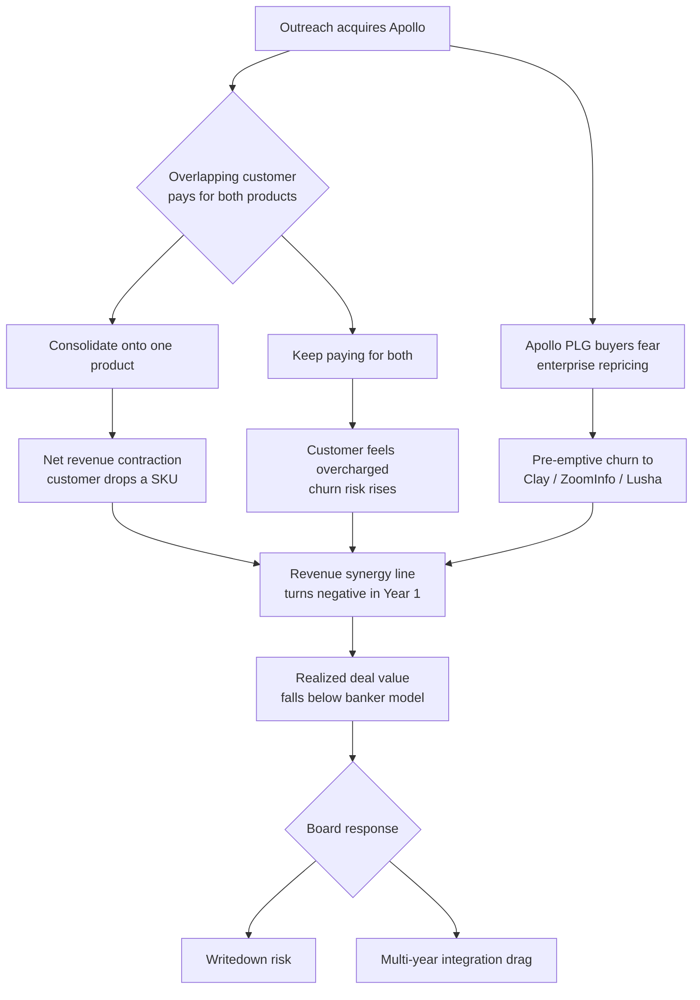

### Direct Answer

No — Outreach should not acquire Apollo in 2027, and the reason is structural rather than tactical. The two companies sell to opposite ends of the market with incompatible go-to-market motions: Outreach is a top-down enterprise sales-execution platform, while Apollo is a bottoms-up, product-led data-and-prospecting machine. A merger would force a $1.8B-plus purchase that buys revenue overlap, channel conflict, and a data-versus-workflow culture clash, while leaving the actual strategic threat — AI agents collapsing the manual sequencing layer — completely unaddressed. The disciplined move is a data-licensing partnership plus a focused tuck-in of an AI-native asset, not a transformational merger.

> **TL;DR**
> - **The pitch sounds clean, the math is ugly.** Outreach (sequencing/execution) plus Apollo (data/prospecting) looks like the complete outbound stack, but Apollo's roughly $1.8-2.5B acquisition price against Outreach's own compressed post-2021 valuation means a debt-or-dilution-heavy deal with a 6-8 year payback at realistic synergy capture.
> - **The motions do not blend.** Outreach lands six-figure enterprise contracts through a top-down sales team; Apollo lands $49-per-seat self-serve credit-card swipes. Stapling them together does not create a flywheel — it creates two GTM orgs fighting over the same logo and the same comp plan.
> - **It solves yesterday's problem.** The 2027 threat is AI SDR agents (11x, Artisan, Regie.ai) that make manual sequencing optional. Buying a bigger sequencer-plus-database is fighting the last war while the front line moves.
> - **The public comps confirm the pattern.** Salesforce (CRM) and HubSpot (HUBS) consolidated through disciplined tuck-ins, not motion-clashing megadeals; ZoomInfo (ZI) has spent three years and significant multiple compression trying to bolt workflow onto data. The market does not reward this exact merger shape.
> - **The better play:** a deep data-licensing and co-sell partnership with Apollo, plus a sub-$150M tuck-in of an AI-native outbound asset, preserves cash and buys the actual capability gap.
> - **Verdict:** Pass on the acquisition. Partner on data, build or buy AI agents, and let Apollo and Outreach stay structurally separate companies. It is a *conditional* no — three named conditions could flip it — but in the base case, the answer is pass.

This entry walks the full diligence: why the strategic logic is seductive, why the financial and integration math breaks, what the real 2027 threat is, and what Outreach should do instead. It is written for CROs, corp-dev leads, and RevOps operators who have to model these decisions in a spreadsheet — not for a press release. Where it matters, it benchmarks against public-company comparables whose filings and trading history make the pattern measurable.

---

## 1 — The Strategic Logic: Why This Deal Keeps Getting Pitched

Every six months a banker's deck circulates arguing that Outreach should buy Apollo. The logic is genuinely tempting, and any honest analysis has to start by steelmanning it before tearing it down. If the bull case were weak, the deal would never reach a boardroom; it reaches boardrooms precisely because three of its arguments are individually plausible.

### 1.1 The "complete outbound stack" thesis

The pitch is that outbound sales has two halves and each company owns one. Apollo owns the **data and discovery** layer: a contact database of 270M-plus people, buying-intent signals, and a prospecting workflow that turns "who should I call" into a list. Outreach owns the **execution and orchestration** layer: sequences, the dialer, deal management, forecasting, and AI conversation guidance. Buy Apollo, the argument runs, and Outreach controls the prospect's journey from "this account exists" to "this deal closed" — one vendor, one contract, one system of record for outbound revenue.

| Layer | Apollo owns | Outreach owns | Combined entity owns |
|---|---|---|---|
| Account / contact data | Yes — 270M-plus contacts | No — relies on integrations | The full data graph |
| Intent + signals | Yes — buying-intent feeds | Partial — engagement signals | Signal-to-action loop |
| Sequencing / cadence | Basic | Yes — category-defining | Best-in-class sequencing |
| Dialer / calling | Yes — built-in | Yes — built-in | Redundant (overlap) |
| Deal + forecast | No | Yes — core enterprise product | Enterprise execution |
| AI conversation guidance | Emerging | Yes — mature module | Differentiated |
| Pricing motion | Self-serve, PLG | Sales-led, enterprise | Both — in theory |

On paper, the combined entity owns six of seven layers and becomes the default operating system for outbound revenue. That is the slide that gets the deal a meeting. The weakness — explored in Section 2 — is the last row: a single company cannot run two opposite pricing motions through one org without one of them dying.

### 1.2 The defensive framing against ZoomInfo and Salesloft

The second argument is defensive. ZoomInfo Technologies (ZI) has spent three years moving from a pure data vendor into engagement and workflow, acquiring and building its way toward a "go-to-market platform" rather than a database. Salesloft — now owned by Vista Equity Partners and integrating its Drift acquisition — is consolidating the engagement category from the other direction (see *Why did Vista acquire Salesloft for $2.3B?* in q1810 and *What is Salesloft M&A strategy under Vista through 2028?* in q1835). If both competitors are becoming data-plus-workflow suites, the argument runs, Outreach cannot stay a pure execution layer — it will get squeezed in enterprise procurement, where buyers increasingly favor consolidated platforms over best-of-breed point tools.

This framing is not crazy. The sales-tech category genuinely is consolidating, and platform breadth genuinely does matter in enterprise procurement cycles. The question — answered across the sections below — is whether *acquiring Apollo specifically* is the right response, or whether it is the most expensive possible answer to a real problem. Notably, the public-market verdict on ZoomInfo's data-plus-workflow strategy has been a multi-year multiple compression, which is exactly the cautionary comp this deal should study before, not after, signing.

### 1.3 The talent and AI-roadmap argument

A third, quieter argument: Apollo has shipped AI features quickly and has a younger, PLG-native engineering culture. Acquirers sometimes justify deals as "acqui-hires at scale" — buy the company to buy the velocity. Outreach's product org, the argument goes, would be re-energized by Apollo's builders and its faster release cadence.

This is the weakest of the three arguments and the one corp-dev teams should be most suspicious of. Buying a $1.8B-plus company to import engineering culture is the most expensive talent acquisition imaginable, and post-merger attrition (Section 4.3) routinely destroys exactly the velocity the deal was meant to capture. The teams most likely to leave are the ones whose work justified the price.

### 1.4 Why the bull case is necessary but not sufficient

Each of the three arguments survives a first glance and fails a second. The "complete stack" thesis ignores motion incompatibility. The defensive thesis points at a real trend but assumes acquisition is the only response. The talent thesis confuses a billion-dollar transaction with a recruiting strategy. The rest of this entry takes each failure mode in turn — motion conflict, financial math, integration risk, and strategic timing — and shows why the disciplined answer is to pass.

It is worth naming a fourth, unstated reason this deal keeps getting pitched: the incentive structure around it. Investment bankers earn fees on deals that close, not on deals that are correctly declined. Founders and late-stage investors in Apollo benefit from a liquidity event. Inside the acquirer, an ambitious corp-dev or strategy leader can build a career on a transformational deal in a way that a quiet partnership never allows. None of these actors is acting in bad faith — but every one of them is structurally tilted toward "yes." A CRO or board evaluating the deal should recognize that the analysis arriving on the desk has been shaped by people who get paid when the answer is "acquire." The job of disciplined diligence is to supply the counterweight, and that counterweight is the rest of this entry.

### 1.5 What a good version of this question looks like

The narrow question — "should Outreach acquire Apollo" — is actually the wrong frame. The right frame is: "what is the lowest-cost way for Outreach to win outbound in 2027, and where does an Apollo acquisition rank against the alternatives?" Posed that way, the acquisition has to beat a data-licensing partnership, an AI-agent tuck-in, an organic data build, and simple balance-sheet strengthening. A question that only asks "yes or no on Apollo" has already smuggled in the assumption that Apollo is the relevant lever. It is not. The relevant lever is the 2027 win condition, and Apollo is one expensive, badly-timed way to pull it. Sections 3, 5, and 7 keep that wider frame in view; the reader should too.

---

## 2 — The Two-Motion Problem: Why the Businesses Do Not Blend

The single most important fact in this analysis: **Outreach and Apollo are not two halves of one business. They are two different businesses that happen to share a category label.** Everything downstream — the financial model, the integration plan, the org chart — breaks on this fact.

### 2.1 Top-down enterprise versus bottoms-up PLG

Outreach is a classic top-down enterprise SaaS company. It lands six-figure annual contracts, sells through a quota-carrying field team, runs multi-month procurement cycles, and supports deployments with solutions engineers and customer-success managers (see *Is a Outreach Solutions Engineer role still good for my career in 2027?* in q1897). Its buyer is a VP of Sales or a CRO, and its sales cycle is measured in quarters.

Apollo is a product-led-growth company. A large share of its revenue starts as self-serve: an individual SDR signs up free, hits a usage limit, and swipes a credit card for a roughly $49-99-per-seat plan. Sales-assist closes the larger accounts, but the *acquisition motion* is bottoms-up. Its buyer is an individual rep or a team lead, and its "sales cycle" can be minutes.

| Dimension | Outreach | Apollo |
|---|---|---|
| Primary motion | Sales-led, top-down | Product-led, bottoms-up |
| Typical entry ACV | $25K-$150K-plus | $0 (free) to roughly $600/seat/yr |
| Buyer | CRO / VP Sales | Individual rep / team lead |
| Sales cycle | 2-6 months | Minutes (self-serve) to weeks |
| GTM cost structure | High — field + SE + CS | Low — self-serve + sales-assist |
| Primary success metric | Rep adoption, deal velocity | Activation, usage, contact accuracy |
| Expansion mechanic | Seat + module land-and-expand | Usage credits + tier upgrades |
| Churn profile | Annual, contract-anchored | Monthly, frictionless to cancel |

These two GTM machines do not merge — they collide. You cannot run a $49 self-serve signup and a $150K enterprise procurement through the same comp plan, the same pricing page, or the same sales org. HubSpot (HUBS) is the rare company that runs both motions well, and it took roughly a decade of deliberate engineering and a purpose-built freemium architecture to get there — it did not arrive via acquisition. The acquirer here would spend the first 18 months deciding which motion wins, and either answer destroys value: kill the PLG motion and you have overpaid for a database; keep it and you have two companies stapled together, not one.

### 2.2 Channel conflict and the cannibalization tax

Both companies sell a dialer. Both sell sequencing (Outreach's is far better; Apollo's exists). Both increasingly sell AI email assistance. The instant the deal closes, every overlapping customer asks the same question: *which product do I keep paying for?*

The diagram captures the trap. In a merger of two overlapping products, the "revenue synergy" line in the banker's model is usually *negative* in year one, because consolidating customers drop SKUs and price-sensitive PLG buyers flee to alternatives — Clay, Lusha, and ZoomInfo's lighter tiers all sit one click away. This is the same dynamic analyzed in *Should ZoomInfo acquire Apollo in 2027?* (q1871) and *Should Snowflake acquire Apollo in 2027?* (q1877): Apollo's PLG base is precisely the asset most at risk in any enterprise-led acquisition, because the thing that makes it valuable — frictionless adoption — is the same thing that makes it frictionless to leave.

### 2.3 The data-culture versus workflow-culture clash

Outreach is a workflow company. Its center of gravity is the sequence, the deal, the forecast. Apollo is a data company. Its center of gravity is the database — coverage, freshness, accuracy, enrichment match rates. These are different engineering disciplines, different metrics, different on-call cultures, and different definitions of "quality."

Outreach measures itself on rep adoption and deal velocity; Apollo measures itself on contact accuracy and match rates. When the two orgs merge, one culture's metrics get demoted on the combined scorecard — and demoted teams, especially the ones who built the acquired asset, leave. The pattern is visible in how data-centric and workflow-centric companies struggle to integrate even when the strategic logic looks sound; it is a major reason ZoomInfo's workflow expansion has been slower and costlier than its filings originally implied.

The deeper issue is the *unit of engineering excellence*. A data company's best engineers obsess over crawl coverage, dedup accuracy, and freshness decay curves — they are proud of a database that other people barely notice when it works. A workflow company's best engineers obsess over latency, UI responsiveness, and the rep's daily-driver experience — they are proud of software people touch every hour. Neither group is wrong, but a combined company can only have one promotion ladder, one definition of "senior," and one set of architecture-review priorities. Whichever discipline loses that contest watches its best people get out-leveled in performance reviews and leaves within a year. The acquirer then owns the *other* discipline's asset with a hollowed-out team running it. This is not a soft "culture" concern that an integration playbook can smooth over with all-hands meetings — it is a structural incompatibility in what the merged engineering org rewards.

### 2.4 Brand and positioning dilution

There is a softer cost that diligence decks routinely ignore: positioning. Outreach's brand promise to a CRO is "enterprise-grade execution and forecasting rigor." Apollo's brand promise to an SDR is "fast, cheap, self-serve prospecting." These are not complementary brand stories — they pull in opposite directions. A combined entity has to choose which promise leads, and whichever it chooses, it weakens its credibility with the other audience. Salesforce (CRM) manages multiple brands by keeping them as distinct clouds with distinct identities; a forced single-brand merger of Outreach and Apollo gets the cost of two positions and the clarity of neither.

The procurement consequence is concrete. When an enterprise buyer evaluates Outreach today, the conversation is about forecast accuracy, security review, and admin controls — a deliberate, reference-heavy, multi-stakeholder process. When that same buyer learns Outreach now also runs a self-serve database product priced at $49 a seat, the immediate question is "why does my $120K contract cost 50x what an individual rep pays for what looks like the same logo." Price-anchoring works against the enterprise motion: a visible cheap tier compresses what the enterprise buyer believes the premium tier is worth. PLG companies that also sell enterprise solve this with careful packaging walls and separate sales surfaces, and even then it takes years to get right. Bolting the two together via acquisition imports the anchoring problem on day one with none of the packaging discipline that took HubSpot (HUBS) a decade to build.

### 2.5 The integration math compounds the motion math

Sections 2.1 through 2.4 each describe a separate failure mode — pricing collision, channel conflict, culture clash, brand dilution. The reason they matter together rather than separately is that they *compound*. A combined company does not get to fix them one at a time in a calm sequence; it faces all four simultaneously in the first 18 months, while also running two billing systems (Section 4.1) and a data-platform merge (Section 4.2). Each problem makes the others harder: the pricing collision accelerates PLG churn, the churn worsens the synergy math, the weak synergy math pressures management to cut R&D, the R&D cuts trigger more talent attrition, and the attrition slows the integration that was supposed to fix the pricing collision. This is the loop that turns "two good companies" into "one distracted company," and it is why motion-incompatible mergers fail at a far higher rate than the banker base case assumes.

---

## 3 — The Financial Case: The Math Does Not Work

Strategic logic is necessary but not sufficient. The acquisition has to clear a financial bar, and on the numbers it does not. This section models the price, the synergies, and — most importantly — the opportunity cost.

### 3.1 Valuation gap and purchase price

Apollo's last major primary raise (a 2023 Series D) valued the company around $1.6B, and on continued strong PLG growth a 2027 acquisition price would realistically land in the **$1.8B-$2.5B** range — a control premium on a company that has likely grown into and past its last private mark.

| Scenario | Apollo implied standalone value | Control premium | Likely purchase price |
|---|---|---|---|
| Conservative | $1.6B | 15% | roughly $1.85B |
| Base case | $2.0B | 20% | roughly $2.4B |
| Aggressive | $2.5B | 25% | roughly $3.1B |

Outreach itself was last marked near $4.4B in its 2021 Series G and has since absorbed the entire sales-tech multiple-compression cycle. Public proxies make the scale of that compression concrete: ZoomInfo (ZI) traded down sharply from its post-IPO highs as growth decelerated, and the broader SaaS index de-rated meaningfully from 2021 peaks. Outreach's current realistic enterprise value is therefore materially below its 2021 mark. Buying Apollo is not a tuck-in — it is a deal worth a large fraction of Outreach's *own* value, financed with some mix of stock (dilutive at a depressed mark) and debt (expensive in a higher-rate environment than the one in which the bull case was first drafted).

### 3.2 Synergy capture versus the model

Bankers will model two synergy lines: cost synergies (consolidate G&A, overlapping R&D, redundant cloud spend) and revenue synergies (cross-sell). Cost synergies are real but modest — perhaps 10-15% of combined operating expense over two years, and front-loaded with severance and retention costs. Revenue synergies are where models lie.

| Synergy line | Banker model | Realistic capture | Why the gap |
|---|---|---|---|
| G&A consolidation | High | Medium | Real, but slow; severance + retention front-loaded |
| R&D de-duplication | High | Low-Medium | Cutting overlapping product kills roadmaps customers bought |
| Cloud / infra consolidation | Medium | Medium | Achievable, modest in absolute dollars |
| Cross-sell (Apollo to Outreach) | Very high | Low | PLG buyers do not convert to $100K enterprise deals on command |
| Cross-sell (Outreach to Apollo) | High | Low-Medium | Enterprise buyers often already have a data vendor under contract |
| Net revenue retention lift | Positive | Flat-to-negative Y1 | SKU consolidation + PLG churn (Section 2.2) |

A defensible model lands net synergies far below the banker case, pushing the payback period to **6-8 years** — well past the horizon any board should accept for a transformational, balance-sheet-stressing deal. Compare the cleaner economics analysis in *How does Outreach make money in 2027?* (q1924): Outreach's own margin and retention profile is the binding constraint, and a debt-loaded acquisition makes that constraint worse, not better, by adding interest expense before any synergy arrives.

### 3.3 The interest-rate and dilution drag

The structure of the deal matters as much as the price. Two financing paths, both bad:

- **All-stock**: issuing equity at a depressed post-2021 mark to buy Apollo means Outreach's existing holders are diluted at the worst possible price — they effectively sell a slice of Outreach cheap to buy Apollo expensive.
- **Debt-heavy**: term debt at 2026-era rates adds a fixed interest expense that hits the P&L immediately, while the synergies that are supposed to pay for it do not arrive for years (Section 3.2). The combined entity carries the cost from day one and the benefit from year three.
- **Hybrid**: blends both problems and adds covenant constraints that limit Outreach's ability to invest in the AI roadmap that actually matters (Section 5).

None of these paths is comfortable. A clean acquisition needs either a strong-currency stock (Outreach does not have one at a compressed mark) or cheap debt (the rate environment does not offer one). The financing reality alone is enough to make a disciplined corp-dev team pause.

### 3.4 Opportunity cost: what else $2B-plus buys

The honest comparison is not "acquire Apollo versus do nothing." It is "acquire Apollo versus deploy $2B-plus on the highest-return alternative."

| Use of capital | Approximate cost | Strategic value | Risk |
|---|---|---|---|
| Acquire Apollo | $1.8B-$3.1B | Suite breadth, owned data | Integration, channel conflict, PLG churn |
| Data-licensing partnership w/ Apollo | under $50M/yr | roughly 80% of the data benefit | Low — no integration risk |
| Tuck-in AI-SDR asset (11x-class) | $50M-$150M | Directly addresses 2027 threat | Medium — early-stage tech |
| Pay down debt / strengthen balance sheet | Variable | Optionality, lower interest drag | None |
| Aggressive AI R&D + selective buyback | $200M-$400M | Roadmap velocity, capital discipline | Execution |

Spending $2B-plus to capture a data benefit that is available for under $50M per year through a partnership is, in plain terms, negative-NPV capital allocation. The opportunity cost is the strongest single argument in this entry: the money has better homes.

To make the comparison fully concrete, consider a simple framing. The whole point of "owning" Apollo's data rather than licensing it is the incremental margin and control that ownership confers. But the incremental benefit of ownership over a deep licensing deal is modest — perhaps the difference between an 80% capture and a 100% capture of the data value, plus some roadmap control. Paying a roughly $2B premium-inclusive price to move from 80% to 100% capture, while taking on every integration and churn risk in Sections 2 and 4, is a textbook example of overpaying for the last increment. The first 80% of almost any capability is cheap to rent; the last 20% is brutally expensive to own. Disciplined acquirers buy the last 20% only when it produces a moat — a capability a competitor genuinely cannot replicate through a contract. Apollo's data does not clear that bar, because the data is licensable to anyone, including to Outreach, without a merger.

### 3.5 The "build the data instead" alternative

There is a fourth financing comparison worth making explicit: building comparable data coverage organically. A contact database is expensive to build and maintain, but it is not a $2B project. Outreach could stand up a credible first-party data layer — seeded by its own engagement exhaust, augmented by licensed feeds and targeted enrichment partnerships — for a small fraction of the acquisition price, spread over time, with no integration shock. The build path is slower and produces thinner initial coverage than buying Apollo's mature database. But it is fully under Outreach's control, it carries no PLG-churn liability, and it compounds: every customer interaction makes Outreach's own data graph slightly better. For a company whose strategic future depends on feeding an AI agent (Section 5), a controllable, compounding first-party data asset may ultimately be worth more than a large purchased static one — and it costs an order of magnitude less.

### 3.6 The public-comp reality check

Public markets have already run this experiment in adjacent form. Salesforce (CRM) built its empire on a long string of disciplined, mostly bolt-on acquisitions integrated into a coherent platform — and the market punished it on the rare occasions it stretched. HubSpot (HUBS) grew its dual-motion business largely organically and through small tuck-ins, not motion-clashing megadeals. ZoomInfo (ZI) is the closest live comp to the *exact* Outreach-Apollo shape — a data company bolting on workflow — and its multi-year de-rating is the market's verdict on how hard that integration is. The pattern across the public comps is consistent: the market rewards focused consolidation and punishes transformational deals that fuse incompatible motions. The Apollo acquisition is the second kind.

---

## 4 — Integration Risk: Where Big SaaS Deals Die

Even if the strategy were sound and the price were fair, integration is where this class of deal most often fails. The diligence deck always under-models this section because integration cost is hard to quantify and easy to wave away.

### 4.1 Two billing and pricing systems

Outreach bills enterprise contracts annually through procurement and signed order forms. Apollo bills self-serve credit cards monthly and meters usage credits. Unifying billing, packaging, and the public pricing page is a multi-quarter platform project that ships zero customer value while consuming the exact engineering capacity the deal was supposed to free up. Until it is done, the combined company runs two pricing pages, two billing stacks, and two renewal motions — and confuses every prospect who looks at both.

### 4.2 Data-platform integration is harder than the deck admits

The deck says "Apollo's data flows natively into Outreach's sequences." In reality, that promise means reconciling two contact schemas, two enrichment pipelines, two compliance regimes, and two notions of record identity. The compliance exposure alone is non-trivial: a 270M-record contact database carries real obligations under GDPR (Regulation (EU) 2016/679) and CCPA/CPRA, and merging it into an enterprise platform with different consent and data-handling architecture is a legal and engineering project, not a config change. Honest data integration is 4-8 quarters of work, and it is the single line item most consistently underestimated in SaaS M&A models.

### 4.3 Talent attrition in the window that matters

Acquisitions trigger predictable attrition: founders and early engineers vest, receive retention packages, and a meaningful share leave within 18-24 months regardless. The risk here is concentrated exactly in Apollo's data and PLG-growth teams — the people who built the asset Outreach is paying $2B-plus for. Lose them and the acquirer owns a depreciating database with no one who knows how to keep it fresh, plus a PLG funnel with no one who knows how to tune it.

The integration timeline below is not a worst case — it is the median outcome for a transformational SaaS merger of two products with overlapping SKUs. The first six months go to billing and pricing reconciliation, months 6-18 to data-platform integration, and months 12-24 are when retention packages expire and the talent question gets answered for real. Only after all three phases clear does synergy capture begin, and only if the key teams stayed.

| Integration phase | Window | Primary work | Customer value shipped | Dominant risk |
|---|---|---|---|---|
| Phase 1 | Months 0-6 | Billing + pricing-page merge | Near zero | Two price lists confuse every prospect |
| Phase 2 | Months 6-18 | Data-platform + compliance integration | Near zero | Schema and identity reconciliation slips |
| Phase 3 | Months 12-24 | Org consolidation, retention cliffs | Minimal | Apollo's data and PLG teams depart |
| Phase 4 | Months 24-36 | Synergy capture begins — if talent stayed | Finally positive | AI-agent threat already three years matured |

By the time the integration overhead clears — best case, year three — the AI-agent threat in Section 5 has had three years to mature. The deal can succeed operationally and still fail strategically, because it bought the wrong thing and then spent three years bolting it on. The retention-cliff problem in Phase 3 deserves emphasis: the standard 2-4 year vesting-and-retention schedule means the people Outreach is paying $2B-plus to acquire are contractually free to leave at exactly the moment the integration is most fragile. An acquirer that has not modeled a realistic post-cliff attrition rate for Apollo's data engineers and PLG-growth team has not modeled the deal.

### 4.4 Customer-trust and roadmap-freeze costs

There is a quieter cost during integration: roadmap freeze. While engineering teams are merging billing systems and data pipelines, they are not shipping new customer-facing features. Competitors — Salesloft, ZoomInfo (ZI), and the AI-native entrants — keep shipping. Customers on both sides experience a 12-18 month stretch where their vendor is visibly distracted, and renewal conversations get harder. Integration is not a neutral back-office activity; it is a competitive vulnerability window, and a smart competitor will time its own launches to exploit it.

The distraction is not only an engineering phenomenon — it is an attention phenomenon at the top of the company. A transformational acquisition consumes the executive team. The CEO is managing investor communications and integration governance; the CFO is managing the financing and the synergy reporting; the CRO is managing channel-conflict escalations and a confused field team; product leadership is arbitrating which roadmap survives. For 18 months, the scarcest resource in the company — senior leadership attention — is pointed inward at the integration rather than outward at the market and the AI-agent threat. The opportunity cost in Section 3.4 is usually framed in dollars, but the opportunity cost in *executive attention* may be the larger loss, because it lands during exactly the window when the category is being redrawn.

### 4.5 The asymmetry of integration outcomes

A final point on integration risk: the outcomes are asymmetric. A merger that goes well delivers, at best, the synergies in the banker model — a known, bounded upside. A merger that goes badly can deliver an unbounded downside: a writedown, a demoralized org, lost ground to competitors, and a strategic position weaker than the standalone starting point. When the upside is capped and the downside is not, a rational decision-maker demands a large margin of safety before proceeding. The Apollo deal offers no such margin: it is expensive at the top of the price range, motion-incompatible, and badly timed. An asymmetric bet with no margin of safety is precisely the bet a disciplined board declines.

---

## 5 — The Real 2027 Threat: AI Agents Collapse the Sequencing Layer

Here is the argument that should end the discussion. Even a perfectly executed Outreach-Apollo merger is a bet on a 2024 picture of outbound. The 2027 picture is different, and the difference is the whole point.

### 5.1 The sequencing layer is being commoditized by AI

For a decade, the value of a sales-engagement platform was that it let a human rep run dozens of multi-step cadences at scale. AI SDR agents — 11x, Artisan, Regie.ai, and a widening field of others — change the unit of work itself. Instead of a human configuring a sequence, an agent researches the account, drafts the outreach, sends it, handles the reply, and books the meeting. The "sequence" becomes an implementation detail inside the agent, not a product a human buys and operates.

This is the thesis explored directly in *What replaces Apollo sequencing if AI agents handle outbound in 2027?* (q1908) and *Should Outreach acquire Regie.ai in 2027?* (q1901): when agents handle outbound end to end, the standalone sequencer is at risk of becoming a commodity API call inside the agent, not a platform a CRO licenses.

### 5.2 What this does to the Apollo thesis

If AI agents are doing the prospecting and the sending, then the strategic value of both merger assets is moving the wrong direction:

- **Apollo's prospecting *workflow* loses value** — the agent does the prospecting itself. What survives is the *raw data*, which is licensable, not ownable-only-via-acquisition.
- **Outreach's sequencing *workflow* loses value** — the agent owns the cadence logic internally.
- **What gains value** is the agent layer itself, the data feed it consumes, and the system-of-record / deal-execution layer that the agent reports its results into.

So the merger buys two assets — Apollo's prospecting workflow and Outreach's sequencing workflow — whose strategic value is *declining*, while doing nothing to acquire the asset whose value is *rising* (the agent). It is, almost precisely, fighting the last war: investing $2B-plus to win a battle that is being relocated.

### 5.3 Where durable value actually sits in 2027

| Layer | 2024 value | 2027 trajectory | Acquisition-relevant for Outreach? |
|---|---|---|---|
| Raw contact / intent data | High | High but commoditizing | License it, do not buy it |
| Prospecting workflow | High | Declining (agents absorb it) | Low priority |
| Sequencing workflow | High | Declining (agents absorb it) | Low priority |
| AI SDR agent | Emerging | Rising fast | **This is the gap to fill** |
| Deal execution / forecast | High | Stable-to-rising | Outreach already owns this |
| AI conversation guidance | Rising | Rising | Outreach should reinforce this |
| System of record / CRM | High | Stable | Not realistically in play |

The table makes the strategic error of the Apollo deal unmistakable: it doubles down on the two rows trending *down* and ignores the one row trending *up*. A capital-allocation decision that systematically funds declining assets and starves a rising one is not a strategy — it is inertia with a banker attached.

### 5.4 The agent layer needs data, not a merger, to be fed

A subtle but important point: the AI-agent future does not eliminate the need for data — agents are *more* data-hungry than human reps, because they can act on far more signal. But "the agent needs data" is an argument for a *data feed*, not for a *merger*. An agent can consume Apollo's data through a licensing API just as well as it can consume it from an owned database. Ownership adds cost, integration risk, and channel conflict; it does not add a material capability the agent could not get through a contract. This is the hinge of the whole recommendation in Section 7.

### 5.5 Three forces that could move faster than the integration timeline

The Section 4 integration timeline runs roughly three years. Three independent forces are likely to reshape the outbound market inside that same window — which means the merged company would be integrating a 2024-shaped asset into a 2027-shaped market.

- **Agent-native incumbents scale.** The AI SDR category leaders are not staying small. As they raise larger rounds and land enterprise logos, the "agent" stops being an experiment a CRO pilots and becomes the default expectation in an outbound RFP. A merged Outreach-Apollo would be answering that RFP with a sequencer-and-database story.
- **Data commoditizes from the model side.** Large language models with web-browsing and research tools can already assemble much of a prospect profile on demand. As that capability improves, the marginal value of a static, pre-built 270M-record database falls — not to zero, but enough to compress what "owning the data" is worth. Buying a depreciating-value asset at a control premium is the wrong direction.
- **The CRM platforms move.** Salesforce (CRM) and HubSpot (HUBS) are not spectators in outbound. As they push agent capabilities into their own platforms, the standalone engagement layer faces pressure from above. A merged Outreach-Apollo would be defending a middle-layer position that is being squeezed from both the agent side and the platform side.

None of these forces is certain on a precise timeline, but all three point the same way: the value of the exact assets this merger buys is more likely to fall than rise over the integration window. A deal whose thesis depends on the market standing still is a deal whose thesis has already expired.

### 5.6 What Outreach actually needs to win 2027

Strip the analysis down and the 2027 win condition for Outreach is not "own more of the outbound stack." It is three things: (1) a credible AI agent — built or tucked in — that does the prospecting-to-meeting work; (2) reliable data feeding that agent, which can be licensed; and (3) a defensible execution-and-forecast layer that the agent reports into, which Outreach already owns and should reinforce. The Apollo acquisition delivers more of (2) at enormous cost and does nothing for (1) or (3). The recommended play in Section 7 delivers all three at under 10% of the price. That contrast — same goal, one-tenth the cost, better coverage of the actual win condition — is the entire argument.

---

## 6 — Counter-Case: When Acquiring Apollo Could Actually Be Right

Intellectual honesty requires steelmanning the other side. There are real conditions under which buying Apollo becomes defensible — they are just narrow, and operators should pressure-test whether they actually hold rather than assume them.

### 6.1 If the price collapses

Everything in Section 3 assumes a $1.8B-$3.1B price. If a funding-market downturn or an Apollo growth stall pushed the acquisition price below roughly $800M-$1B, the math changes materially. At a low-enough price, you are buying a 270M-record database and a real, growing revenue stream for less than the cost of building comparable data coverage from scratch. *Price is a feature.* A distressed Apollo is a genuinely different decision than a healthy one — the integration pain is the same, but the margin of safety is far wider. Corp-dev should keep a standing valuation trigger: below a defined price, re-open the file.

### 6.2 If Outreach already owns the agent layer

The Section 5 critique is that the deal ignores the AI-agent gap. If Outreach had *already* built or bought a credible AI SDR agent, then acquiring Apollo stops being "fighting the last war" and becomes "feeding our agent the best proprietary data." Owned data plus owned agent is a genuine, durable moat — the agent gets a data advantage no competitor renting the same feeds can match. The sequencing order is everything: agent first, data second. Buying Apollo *before* solving the agent layer is the mistake; buying it *after* the agent is in production could be smart capital allocation.

### 6.3 If a competitor is about to take Apollo off the board

If ZoomInfo (ZI), Salesloft, or a private-equity roll-up were in advanced talks to buy Apollo, the calculus shifts from offense to defense. *Should Salesloft acquire Apollo to compete in lead-gen?* (q1837) war-games exactly that scenario. A defensive acquisition to deny a competitor a strategic asset can be rational even at a price that fails a standalone NPV test — *if* the competitor owning Apollo would do structural damage to Outreach's enterprise position. That is a real scenario worth monitoring, but it is a reason to *watch and pre-position*, not to *pre-empt* with a $2B check on speculation.

### 6.4 If Outreach is itself the one being consolidated

There is an inverted version of this question. If Outreach's own strategic future is to be acquired — by a Gong, a CRM platform, or a PE roll-up (see *Should Gong acquire Outreach to bundle conversation+sequencing?* in q1884) — then bulking up via Apollo first could raise Outreach's own sale price and strategic optionality. This is a "dress for the exit" argument. It is real, but it is also the most dangerous, because it justifies a value-destroying deal on the theory that a future acquirer will pay for the bulk. Boards should treat this argument with maximum suspicion: building scale you would not build for its own sake, purely to look bigger to a buyer, usually destroys value on both sides of the eventual transaction.

### 6.5 What would have to be true — the checklist

| Condition | Status as base case | Flips the verdict? |
|---|---|---|
| Apollo price below roughly $1B | Unlikely | Yes, if it happens |
| Outreach already owns a production AI agent | Not true today | Yes — changes sequencing logic |
| Credible competitor bid imminent | Not observed | Yes — defensive logic applies |
| Outreach actively running a sale process | Not the stated strategy | Weakly — and risky |
| PLG churn risk credibly mitigated | Not mitigated | Necessary, not sufficient |
| Integration capacity genuinely available | Constrained | Necessary, not sufficient |

In the base case, zero of the verdict-flipping conditions hold. That is why the answer is "no" — but it is a *conditional* no, and corp-dev should keep the first three conditions on an explicit watchlist with defined triggers, rather than treating "no" as a closed file.

### 6.6 Why the counter-case still does not rescue the base deal

It is tempting to read Section 6 as "the deal is fine, just wait for the right moment." That reading is wrong, and the distinction matters. Every condition in the counter-case changes *the deal itself* — a distressed price is a different transaction, an already-owned agent is a different strategic context, an imminent competitor bid is a different decision (defense, not offense). None of them rescues the deal *as currently pitched*: a healthy-priced Apollo, bought by an Outreach with no agent, on offense, in a market moving toward agents. The counter-case is not a reason to do the deal later; it is a reason to keep watching for a *genuinely different* deal. The version on the table today fails, and no amount of patience turns today's version into a good one — only a change in the underlying facts does. Operators should resist the common diligence error of treating "there exists a scenario where this works" as "therefore we should lean toward yes." The base-case facts are what govern, and the base-case answer is pass.

---

## 7 — The Recommended Play: Partner, Tuck-In, Preserve Cash

A pass is only useful if it comes with an alternative. If not the acquisition, then what? The recommended path captures the real benefits of the Apollo thesis at under 10% of the cost.

### 7.1 Step one — a deep data-licensing and co-sell partnership

Outreach can capture roughly 80% of the strategic benefit of "owning Apollo's data" through a commercial agreement: license Apollo's contact and intent data to flow natively into Outreach sequences and feed Outreach's future AI agent, and run a structured co-sell motion where each company refers the other into deals where it does not compete. The cost is a fraction of acquisition price, with no integration risk, no compliance-merger headache, and no PLG-churn exposure. This is the same logic that makes partnership the default answer in *Outreach vs Salesloft — which should you buy in 2027?* (q1906): capability *access* does not require capability *ownership*, and ownership only pays when it produces a moat a contract cannot. Here, it does not.

### 7.2 Step two — a focused AI-agent tuck-in

The actual capability gap is the AI SDR agent. Outreach should either build it aggressively in-house or make a *small* tuck-in acquisition — a sub-$150M deal for an AI-native outbound asset whose technology and team plug directly into Outreach's execution and conversation-guidance layers. This addresses the Section 5 threat head-on, at roughly 5-8% of the cost of the Apollo deal, and it puts capital into the one row of the Section 5.3 table that is trending up. The integration risk of a sub-$150M tuck-in is also an order of magnitude smaller than a transformational merger: one product, one small team, one roadmap.

### 7.3 Step three — strengthen the balance sheet and reinforce the core

The capital not spent on Apollo is not idle. Paying down debt reduces interest drag and restores covenant flexibility; investing in Outreach's defensible layers — deal execution, forecasting, AI conversation guidance — reinforces the products competitors find hardest to replicate. The strategic question of *acquisition mode versus retention mode* is exactly the operating-model decision framed in *What's the right operating model for deciding whether your company should be in acquisition mode or retention mode?* (q9528): for Outreach in 2027, the disciplined answer is selective tuck-ins funded from a strong balance sheet, not a transformational, debt-loaded merger that mortgages the core to buy declining assets.

### 7.4 Step four — keep the watchlist live

Section 6 identified three conditions that could flip the verdict. The recommended play is not "close the file" — it is "keep the file open with triggers." Corp-dev should monitor Apollo's valuation trajectory, Outreach's own AI-agent progress, and competitor M&A signals, and revisit the decision the moment a trigger fires. A disciplined no is an active position, not a passive one.

### 7.5 The decision summary

| Option | Cost | Captures data benefit | Addresses AI threat | Integration risk | Verdict |
|---|---|---|---|---|---|
| Acquire Apollo | $1.8B-$3.1B | Yes (owned) | No | Very high | **Pass** |
| Data partnership + co-sell | under $50M/yr | roughly 80% | Indirectly (feeds the agent) | Low | **Do this** |
| AI-agent tuck-in | $50M-$150M | No | Yes | Medium | **Do this** |
| Strengthen balance sheet / core | Variable | No | Indirectly | None | **Do this** |
| Keep M&A watchlist with triggers | Negligible | n/a | n/a | None | **Do this** |

The partnership-plus-tuck-in path captures the real benefits of the Apollo thesis — data access and AI capability — at under 10% of the acquisition cost, while leaving Outreach a stronger, more focused company aimed at the 2027 battle rather than the 2024 one. That is the move.

---

## 8 — The Operator's Decision Framework

This entry has argued a verdict. But a verdict is only useful to a corp-dev or RevOps leader if it comes with a repeatable way to test it — both for this deal and for the next "should X acquire Y" question that lands on the desk. This section turns the analysis into a framework.

### 8.1 The four-question screen for any platform acquisition

Before modeling synergies, run any proposed acquisition through four binary screens. A "no" on the first two is usually disqualifying on its own.

| Screen | Question | Apollo deal answer |
|---|---|---|
| Motion compatibility | Do the two companies sell through the same GTM motion? | No — enterprise top-down vs. PLG bottoms-up |
| Capability-vs-contract | Does ownership add a capability a licensing deal cannot? | No — the data is licensable |
| Timing | Does the deal address where the market is going, not where it was? | No — it funds declining layers |
| Financing | Can the deal be financed without mortgaging the core roadmap? | No — depressed stock or expensive debt |

The Apollo deal fails all four screens. A deal that fails even two should not reach a synergy model; the synergy model is where a bad deal gets dressed up, not where it gets caught.

### 8.2 Scenario modeling — three futures

A disciplined diligence process models at least three scenarios and assigns rough probabilities, rather than presenting a single base case.

- **Scenario A — Integration succeeds, market cooperates (low probability).** Talent stays, billing and data merges land on schedule, the AI-agent shift is slower than expected. Payback arrives near year three. This is the banker base case and it requires several independent things to all go right.
- **Scenario B — Integration drags, market moves (most likely).** Billing and data integration slip, PLG churn runs above model, key data engineers leave at the retention cliff, and AI-native competitors keep shipping. Synergies underperform; payback stretches past year six or never clears. This is the modal outcome for motion-incompatible mergers.
- **Scenario C — Strategic miss (real tail risk).** The integration is executed competently, but by the time it clears, AI agents have commoditized both the prospecting and sequencing layers. The merged company owns two depreciating assets and faces a writedown — an operational success that is a strategic failure.

When the realistic probability mass sits on Scenarios B and C, the expected value of the deal is negative even before accounting for opportunity cost. That is the quantitative restatement of "pass."

### 8.3 The watchlist — what to monitor instead

A disciplined "no" is an active position. Corp-dev should maintain a live watchlist with explicit triggers, reviewed quarterly:

- **Apollo valuation trigger.** If a market downturn or growth stall pushes Apollo's acquisition price below roughly $1B, re-open the file — at that price the margin of safety changes the answer (Section 6.1).
- **Internal agent trigger.** Once Outreach has a production-grade AI SDR agent of its own, the data-ownership logic flips from "fighting the last war" to "feeding our moat" (Section 6.2). Track the agent roadmap as the gating condition.
- **Competitor-bid trigger.** If ZoomInfo (ZI), Salesloft, or a PE roll-up enters advanced talks for Apollo, shift from offense to defense and re-evaluate (Section 6.3).
- **Partnership-health trigger.** If the recommended data-licensing partnership (Section 7.1) deteriorates — Apollo restricts the feed, raises licensing terms sharply, or is acquired — the build-the-data alternative (Section 3.5) moves up the priority list.

### 8.4 How this generalizes

The same framework answers the broader family of sales-tech consolidation questions in the library. *Should Apollo acquire Lavender in 2027?* (q1922) and *Should Gong acquire Outreach to bundle conversation+sequencing?* (q1884) both turn on the motion-compatibility and timing screens. *Outreach vs Salesloft — which should you buy in 2027?* (q1906) is the buyer-side mirror of the same logic. The recurring lesson across all of them: in a consolidating, AI-disrupted category, the disciplined move is almost always the focused tuck-in plus the partnership, not the transformational, motion-clashing megadeal. Scale for its own sake is not a strategy — and a banker's deck is not a thesis.

---

## Bottom Line

Outreach should **not** acquire Apollo in 2027. The deal is a clean-looking slide built on three flawed assumptions: that two opposite GTM motions (enterprise top-down versus PLG bottoms-up) will blend, that banker synergy models will hold against real SKU-consolidation and PLG-churn drag, and that a bigger data-plus-sequencing suite is what wins in 2027. The actual 2027 battle is the AI SDR agent collapsing the manual sequencing layer — and the Apollo deal spends $2B-plus systematically funding the declining assets and ignoring the rising one.

The public comparables reinforce the verdict: Salesforce (CRM) and HubSpot (HUBS) consolidated through disciplined, mostly bolt-on moves, while ZoomInfo (ZI) — the closest live analog to the exact Outreach-Apollo shape — has spent three years and significant multiple compression proving how hard a data-plus-workflow fusion is to execute. The market does not reward this merger shape.

The disciplined alternative is a four-part play: a data-licensing and co-sell partnership with Apollo for the data, a sub-$150M AI-agent tuck-in for the real capability gap, a stronger balance sheet from the cash not spent, and a live M&A watchlist with defined triggers. The verdict is a *conditional* no — a distress-priced Apollo, an already-owned agent layer, or an imminent competitor bid could each flip it — so corp-dev should keep those conditions monitored rather than closing the file. But in the base case, the answer is clear: pass on the merger, partner on the data, and buy the agent.

For adjacent diligence, see *Should Apollo acquire Lavender in 2027?* (q1922), *Should ZoomInfo acquire Apollo in 2027?* (q1871), *Should Snowflake acquire Apollo in 2027?* (q1877), *Should Outreach acquire Regie.ai in 2027?* (q1901), *What replaces Apollo sequencing if AI agents handle outbound in 2027?* (q1908), *Outreach vs Salesloft — which should you buy in 2027?* (q1906), *How does Outreach make money in 2027?* (q1924), *Should Gong acquire Outreach to bundle conversation+sequencing?* (q1884), *Should Salesloft acquire Apollo to compete in lead-gen?* (q1837), and *What is Salesloft M&A strategy under Vista through 2028?* (q1835).

---

### Sources & References

1. Apollo.io — Series D financing announcement and roughly $1.6B valuation (Apollo.io press, 2023).
2. Apollo.io — product and database scale disclosures (270M-plus contact records), accessed 2026.
3. Apollo.io — pricing and self-serve plan tiers (Apollo.io/pricing), accessed 2026.
4. Outreach — Series G $200M round at roughly $4.4B valuation (Outreach press, 2021).
5. Outreach — product platform overview: sequences, dialer, deal management, forecasting (Outreach.io), accessed 2026.
6. Outreach engineering blog — AI conversation-intelligence and platform roadmap posts, accessed 2026.
7. Salesloft / Vista Equity Partners — acquisition announcement, roughly $2.3B (Vista Equity Partners press, 2024).
8. Salesloft — Drift acquisition disclosure and product-integration notes (Salesloft.com).
9. ZoomInfo Technologies (NASDAQ: ZI) — Form 10-K and investor materials on platform expansion into engagement and workflow (SEC filings).
10. ZoomInfo Technologies (NASDAQ: ZI) — post-IPO trading history and multiple-compression data (public market data), accessed 2026.
11. Salesforce, Inc. (NYSE: CRM) — historical acquisition record and platform-integration strategy (Salesforce investor relations).
12. HubSpot, Inc. (NYSE: HUBS) — dual-motion (freemium + sales-led) GTM disclosures and 10-K, accessed 2026.
13. 11x.ai — AI SDR agent product disclosures and funding announcements, accessed 2026.
14. Artisan — AI SDR ("Ava") product positioning and funding coverage, accessed 2026.
15. Regie.ai — AI outbound agent product and positioning materials, accessed 2026.
16. Clay — data-enrichment and waterfall-enrichment product positioning (Clay.com), accessed 2026.
17. Lusha — contact-data product and pricing tiers (Lusha.com), accessed 2026.
18. Harvard Business Review — research surveys on M&A failure rates and synergy shortfalls, accessed 2026.
19. Bain & Company — M&A diligence and post-merger integration practice research on synergy capture timelines.
20. McKinsey & Company — "Where mergers go wrong" and post-merger integration research.
21. Gartner — Sales Engagement Platforms market guidance and category definition, accessed 2026.
22. Forrester — sales technology and revenue-operations platform research, accessed 2026.
23. G2 — category data for Sales Engagement and Lead Intelligence (G2.com), accessed 2026.
24. CB Insights — sales-tech funding and M&A activity tracking, accessed 2026.
25. PitchBook — private-company valuation and SaaS multiple-compression data, accessed 2026.
26. SaaS Capital — private SaaS valuation multiples research and 2023-2026 compression data.
27. Bessemer Venture Partners — "State of the Cloud" SaaS benchmark reports.
28. KeyBanc Capital Markets — annual SaaS metrics survey (net revenue retention, CAC payback benchmarks).
29. OpenView Partners — Product-Led Growth benchmark research on PLG conversion and CAC.
30. ProfitWell / Paddle — net revenue retention and SKU-consolidation churn analysis.
31. GDPR (Regulation (EU) 2016/679) — compliance obligations for large contact databases.
32. CCPA / CPRA — California consumer-data compliance requirements relevant to enrichment data.
33. The Information — coverage of sales-tech consolidation and AI-SDR market entrants, accessed 2026.
34. SaaStr — analysis of PLG-versus-sales-led GTM motion conflicts in SaaS M&A.
35. Pulse RevOps Knowledge Library — internal cross-analysis entries q1810, q1835, q1837, q1871, q1877, q1884, q1901, q1906, q1908, q1922, q1924, q9528.
