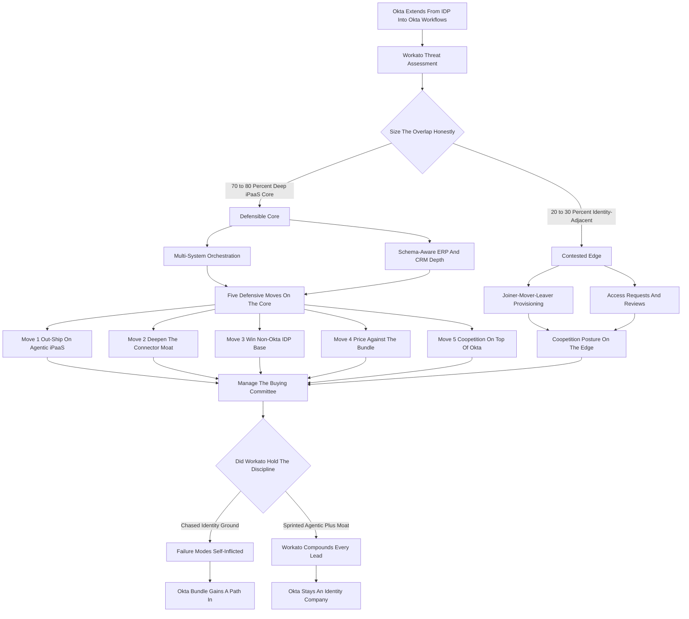

### Direct Answer

Workato defends against Okta in 2027 not by fighting on Okta's home turf of identity-bound user-lifecycle automation, but by widening the gap on the ground Workato already owns: deep enterprise iPaaS connector breadth, agentic orchestration, and a system-of-record integration moat that Okta cannot replicate without years of differently-shaped engineering. Okta (NASDAQ: OKTA) extended past pure identity after the $6.5B Auth0 acquisition into Okta Workflows, a no-code automation layer bundled with Identity Governance, and credibly contests the thin identity-adjacent slice of Workato's footprint. But that slice is only 20-30% of why enterprises buy Workato; the asymmetric defense protects and compounds the 70-80% deep core while gracefully conceding or coopeting on the contested edge.

**TL;DR:** Okta Workflows is a real threat to identity-adjacent automation (joiner-mover-leaver provisioning, access requests, SaaS-app lifecycle) and essentially shut out of deep multi-system orchestration (order-to-cash, financial close, schema-aware ERP and CRM depth). Workato's defensible playbook has five moves: (1) out-ship Okta on agentic iPaaS during a 12-24 month lead window; (2) deepen the system-of-record connector moat that Okta is structurally shallow on; (3) win the non-Okta IDP installed base — Microsoft Entra ID, Google Workspace, Ping Identity, ForgeRock — which is 60%+ of the enterprise identity market and feels zero pull toward the Okta bundle; (4) price and package against the bundle so Workato is never scored as a feature; and (5) run coopetition in Okta shops, remaining the best automation layer on top of Okta as an IDP. Workato loses only by self-inflicted error: failing to ship agentic depth, letting the identity owner become the automation buyer, or neglecting the connector moat. The Okta defense and the agentic sprint are the same project.

## 1. The Competitive Collision: What Is Actually Happening

The Workato-versus-Okta question is not hypothetical. It is a real platform-boundary collision that sharpened through the mid-2020s, and a strategist must understand its precise shape before reasoning about defense.

### 1.1 The Two Companies And Why They Now Overlap

**Workato is the enterprise iPaaS leader.** Founded in 2013, it built its position on a deceptively simple promise: let business and IT teams connect any enterprise system to any other and automate the workflows that run across them, without a services army. By 2027 Workato carries 1,200-plus pre-built connectors, an enterprise customer base in the thousands, and a last-known private valuation near $5.7B from its 2021 round led by Battery Ventures and Insight Partners.

**Okta is the identity leader.** Okta (NASDAQ: OKTA) is an IDP — identity provider — that became the default single-sign-on and access-management layer for cloud-first enterprises, with roughly $2.6B-$2.8B in FY25 revenue, public since 2017. The collision was set in motion when Okta acquired Auth0 for $6.5B in 2021 and — more importantly for this question — when Okta leaned into Okta Workflows, a no-code automation product, and bundled it into its Identity Governance and lifecycle-management suite.

### 1.2 Okta's Strategic Logic — Coherent And Dangerous

**Okta's argument is intellectually clean:** identity is the spine of every enterprise's user graph, so the automation that provisions, de-provisions, and governs users *should* live where identity already lives. If Okta owns the identity graph, the reasoning goes, it should own the lifecycle automation that hangs off it — and lifecycle automation, Okta will claim, is a large fraction of what companies buy iPaaS for anyway. That is the threat. The strategist's job is to size it honestly: it is real on the identity-adjacent edge, and it is mostly noise in the deep integration core. Everything in this playbook follows from holding both truths at once.

### 1.3 Why This Question Is Not Unique To Workato

The Okta collision is one instance of a recurring pattern: an independent best-of-breed platform facing a larger adjacent vendor that bundles a "good enough" version of the independent's product. The same structural dynamic drives how HubSpot defends against Salesforce (q1905), how Stripe defends against Adyen (q1913), and how Salesloft defends against HubSpot Sales Hub bundling (q1855). A defense built for Okta specifically is weaker than a defense built for the whole class of bundle-and-incumbent threats. The strategist should treat the Okta question as a *case study* in a general discipline, not a one-off competitive fire drill, because the moves that work here are reusable and the moves that fail here fail everywhere.

### 1.4 The Timeline Of The Collision

**The collision did not appear overnight; it built in identifiable steps.** Okta started as a pure single-sign-on company, then expanded into lifecycle management and access governance — a natural adjacency to identity. The Auth0 acquisition in 2021 signaled that Okta intended to be a platform, not a feature. Okta Workflows then emerged as the connective tissue: a no-code layer that could orchestrate the actions that identity events imply. Bundling Workflows into Identity Governance was the final move — it converted a standalone automation product into a "free with the suite" component. A strategist tracing this arc sees that Okta's expansion into Workato's territory was deliberate and incremental, which means it will not reverse on its own. Workato must assume Okta keeps pushing on this boundary every year, and plan a defense that compounds rather than a one-time response.

## 2. Sizing The Threat Honestly: Where Okta Workflows Actually Competes

A defense built on either panic or dismissal will fail. The first discipline is an honest map of the overlap.

### 2.1 Where Okta Workflows Genuinely Competes

**Okta Workflows is a legitimate competitor on the identity-adjacent slice.** That slice includes joiner-mover-leaver automation (provisioning a new hire's accounts across SaaS apps, changing access on a role move, de-provisioning a departure); access-request and access-review workflows; SaaS-application lifecycle management; identity-event-triggered notifications and approvals; and lightweight "when an identity thing happens, do a sequence of simple things" orchestration. For an enterprise already deep on Okta as its IDP, Okta Workflows is a natural, low-friction choice for exactly these use cases. A strategist who tells the Workato sales force "Okta Workflows is a toy" is setting them up to lose deals they should have repositioned.

### 2.2 Where Okta Workflows Does Not Meaningfully Compete

**Okta is structurally shut out of the deep iPaaS core.** That core includes multi-system financial close orchestration across NetSuite, Salesforce, and a data warehouse; order-to-cash automation spanning CRM, ERP, billing, and fulfillment; quote-to-cash with deep transformation logic; data synchronization with conflict resolution between systems of record; complex error handling, retry logic, and human-in-the-loop exception routing across non-identity systems; and anything requiring deep, schema-aware connectors into Workday, SAP, Oracle, or NetSuite. This is outside Okta's reach because Okta's connector investment is identity-shaped — it knows how to read and write user objects, not how to orchestrate a three-way revenue-recognition reconciliation.

### 2.3 The Honest Size Of The Threat

**Okta can credibly contest perhaps 20-30% of Workato's use-case surface** — the identity-adjacent slice — and is essentially shut out of the other 70-80%. The entire defensive strategy is built on protecting and expanding that 70-80% while gracefully conceding, or coopeting on, the contested edge. This sizing is not a comfort blanket; it is an instruction. It tells Workato precisely where engineering and sales energy is well spent and where it is wasted. A defense that spends 50% of its effort defending 25% of its surface has mis-allocated, and a defense that pretends the 25% does not exist will be ambushed in deals. The discipline is to hold the number honestly and let it drive resourcing.

### 2.4 Why The Boundary Will Keep Moving

**The 20-30% / 70-80% split is a snapshot, not a fixed line.** Two forces push the boundary. First, Okta's roadmap: as Okta Workflows matures, it will reach slightly further into mid-complexity automation, and Workato must track that creep rather than assume the line holds. Second, Workato's own roadmap: agentic capabilities and deeper connectors can push the defensible core wider, pulling use cases that were "contestable" firmly into Workato's territory. The strategic implication is that Workato should not merely *defend* the 70-80% — it should actively *grow* it, converting contested ground into owned ground by making the deep platform so obviously superior that even mid-complexity buyers default to it. A static defense loses ground every year; a compounding defense gains it.

| Use-case surface | Okta competitiveness | Workato position |
|---|---|---|
| Joiner-mover-leaver provisioning | Strong (in Okta shops) | Challenger — concede or coopete |
| Access requests and reviews | Strong (in Okta shops) | Challenger — concede or coopete |
| SaaS-app lifecycle | Moderate | Competitive on consolidation argument |
| Multi-system orchestration | Weak / shut out | Dominant — defend and expand |
| Order-to-cash, quote-to-cash | Weak / shut out | Dominant — defend and expand |
| Schema-aware ERP/CRM depth | Weak / shut out | Dominant — the connector moat |
| Agentic autonomous orchestration | No native platform | 12-24 month lead window |

## 3. Workato's Real Moat: System-Of-Record Connector Depth

The single most important asset in Workato's defense is the one hardest for Okta to copy and easiest for Workato to underinvest in: connector depth into systems of record.

### 3.1 What A Deep Connector Actually Is

**A connector is not a checkbox.** A *shallow* connector authenticates and moves a few common objects. A *deep* connector understands the target system's full schema, its custom objects and fields, its business logic, its rate limits, its bulk APIs, its eventing model, and its idiosyncratic failure modes — and it stays current as the target system changes its API quarterly. Workato's 1,200-plus connectors include genuinely deep integrations into Workday, NetSuite, Salesforce (NYSE: CRM), SAP (NYSE: SAP), Oracle (NYSE: ORCL), ServiceNow (NYSE: NOW), and the long tail. That depth is the product of more than a decade of engineering, customer-driven hardening, and a connector SDK that lets the ecosystem extend coverage.

### 3.2 Why Okta's Connector Library Is Structurally Different

**Okta Workflows has a connector library shaped by identity use cases** — strong on SaaS-app provisioning endpoints, thin on the transformation-heavy, schema-aware ERP and CRM depth that enterprise integration actually requires. This asymmetry is Workato's deepest defensive position because it compounds: every year Workato hardens its connectors, every enterprise customer that pushes a connector to handle a new edge case, every API version Workato tracks — all of it widens a moat that Okta would need years and a fundamentally different engineering focus to cross.

### 3.3 The Counterintuitive Imperative

**Workato must keep investing aggressively in connector depth even though it is unglamorous,** because the connector moat is the thing Okta most cannot replicate. A Workato that lets its connector depth atrophy while chasing shinier roadmap items is a Workato that has voluntarily filled in its own moat. The same lesson governs how Outreach defends its integration ecosystem (q1816) and how Salesloft defends its integration moat against Outreach plus Apollo (q1809): the unglamorous depth is the durable defense.

### 3.4 Why The Moat Compounds Rather Than Depreciates

**Most software assets depreciate; a connector moat appreciates.** This is the crucial property a strategist must internalize. A feature, once shipped, is immediately copyable and starts losing differentiation the day it launches. A deep connector library behaves differently: every quarter, the target systems — Workday, NetSuite, SAP, Salesforce — ship new API versions, new objects, new business logic, and Workato's connectors absorb those changes. A competitor entering the market does not have to catch up to where Workato is today; it has to catch up to a moving target that gets deeper every quarter, while also building the customer-driven hardening that only comes from running real production workloads at scale. The moat is therefore not a wall of fixed height — it is a wall that Workato's own customers and engineers raise continuously. The strategic instruction follows directly: the connector moat is the highest-return defensive investment Workato can make, precisely because its returns *compound* rather than decay, and the company that stops investing does not hold steady — it slides backward as the target systems move on without it.

| Connector dimension | Workato depth | Okta Workflows depth |
|---|---|---|
| SaaS-app provisioning endpoints | Strong | Strong |
| Workday full-schema HR/finance | Deep | Shallow |
| NetSuite / ERP transaction objects | Deep | Minimal |
| Salesforce custom objects + bulk API | Deep | Partial |
| SAP S/4HANA business logic | Deep | Minimal |
| Database / messaging long tail | Broad | Narrow |
| Connector SDK + ecosystem extension | Mature | Limited |

## 4. Defensive Move One: Out-Ship Okta On Agentic iPaaS

The first active defensive move is to win the next platform shift before Okta can contest it.

### 4.1 What Agentic iPaaS Means

**Agentic iPaaS is integration and automation where LLM-powered agents do not merely execute predefined rules but make judgment calls** — routing an exception based on context, deciding whether to escalate, generating a response, interpreting an unstructured input, and choosing among possible actions. Workato announced agentic capabilities in the mid-2020s and has a real head start.

### 4.2 The Size Of The Lead Window

**Okta does not have a native LLM or agent platform.** To compete on agentic automation, Okta would have to build one (years), buy one (expensive and integration-heavy), or partner (ceding control of the layer that matters most). That gap is a 12-24 month lead window, and lead windows in platform competition are use-them-or-lose-them. If the *next* generation of automation is agentic, and Workato establishes itself as the agentic iPaaS standard while Okta Workflows is still rule-based, then the competitive question stops being "identity automation versus integration automation" and becomes "intelligent autonomous orchestration versus a no-code rules engine" — a comparison Workato wins decisively.

### 4.3 Execution Requirements For The Sprint

**The lead window only matters if Workato sprints through it.** The execution requirements are demanding: ship agentic capabilities that are genuinely production-grade, not demoware; make agents safe and governable, because enterprises will not deploy autonomous agents they cannot audit and constrain; integrate the agentic layer with the connector moat so agents can act across deep system-of-record integrations; and price and package it so it pulls enterprises up-market rather than confusing the buy. The risk is not that Okta closes the gap quickly — it cannot — but that Workato fails to ship at depth and lets the window close from its own side.

### 4.4 Why The Connector Moat Makes Agents Actually Useful

**An agent is only as capable as the systems it can act on.** This is the under-appreciated link between Workato's two strongest assets. An LLM-powered agent that can reason brilliantly but can only write to a shallow set of SaaS endpoints is a clever demo; an agent wired into deep, schema-aware connectors into Workday, NetSuite, SAP, and Salesforce can actually *do* the enterprise's work — reconcile a financial close, route a quote exception, resolve a data conflict across systems of record. Okta's identity-shaped connector library means that even if Okta builds a competent agent, that agent has a narrow surface to act on. Workato's agentic lead and connector moat are therefore not two separate defenses; they are one compounding defense, where each makes the other more valuable. A strategist who funds agentic features but starves the connector roadmap has half-built the moat.

## 5. Defensive Move Two: Deepen And Defend The Connector Moat

The second move is to treat the connector moat not as a static asset but as an active investment program.

### 5.1 Concrete Connector Commitments

**Keep deepening the systems of record that matter most** — Workday, NetSuite, SAP S/4HANA, Salesforce, Oracle Fusion — so that for the use cases Okta most wants to contest, the Workato connector is so obviously deeper that the bake-off is not close. **Track API change relentlessly** so connectors never silently break when a target system ships a new version. **Invest in the connector SDK and the partner ecosystem** so the long tail extends faster than any single vendor could build it.

### 5.2 Publishing Depth As A Competitive Artifact

**Workato should publish connector depth as a verifiable artifact** — not just "1,200 connectors" as a vanity number, but demonstrable depth (custom-object support, bulk operations, eventing, error semantics) that a technical buyer can verify in a proof-of-concept. Every competitive deal against Okta Workflows should be steered toward a use case that exercises the connector moat.

### 5.3 The Discipline Of Asymmetry

**The strategic discipline is resisting the temptation to chase Okta onto identity-adjacent ground.** Every engineering dollar spent trying to out-Okta Okta on user-lifecycle provisioning is a dollar not spent widening the moat Okta cannot cross. Workato's defense is strongest when it is asymmetric: fight where you are deep, not where your competitor is.

## 6. Defensive Move Three: Win The Non-Okta IDP Installed Base

The third move is a positioning and go-to-market play that costs almost nothing and neutralizes a huge fraction of Okta's bundle leverage.

### 6.1 The Bundle Only Pulls For Okta Shops

**Okta's "identity plus automation" bundle only has pull for enterprises that use Okta as their IDP.** For everyone else, the bundle is irrelevant — and "everyone else" is the majority of the enterprise market.

### 6.2 Mapping The Non-Okta IDP Market

**Microsoft Entra ID** (formerly Azure AD) is bundled into the Microsoft (NASDAQ: MSFT) 365 estate that dominates enterprise IT; Microsoft's identity revenue dwarfs Okta's, and a Microsoft-shop CIO feels zero pull toward an Okta-bundled automation layer. **Google Workspace** — Alphabet (NASDAQ: GOOGL) — carries its own identity and access management for a large installed base. **Ping Identity** and **ForgeRock**, both taken private by Thoma Bravo and combined, serve large, identity-sophisticated enterprises, especially in regulated industries. **CyberArk (NASDAQ: CYBR)**, **SailPoint (NASDAQ: SAIL)**, and others occupy adjacent identity-governance ground.

### 6.3 The Cheapest, Highest-Leverage Move

**Add it up and well over half of the enterprise identity market does not run Okta as its primary IDP.** For every one of those accounts, Workato's competitive position against Okta Workflows is structurally strong: there is no bundle, no incumbency, no "you already pay Okta, just add Workflows" pull. The defensive play is to make this explicit in positioning, sales enablement, and account targeting — to deliberately concentrate competitive energy where Workato wins on the merits. This is the cheapest, highest-leverage defensive move available: it does not require shipping anything, only choosing where to fight.

### 6.4 Operationalizing The Account-Targeting Play

**The non-Okta IDP play only works if it is wired into the revenue machine, not left as a slide.** Concretely, Workato's revenue operations team should be able to segment the pipeline and account base by primary IDP — a data field most companies do not capture today — so that sales leadership can see how much of the pipeline sits in bundle-immune accounts versus bundle-exposed Okta shops. Marketing should run demand generation that is explicitly tuned to Microsoft-estate and Google-estate buyers. Sales enablement should arm reps with a fast qualification question early in the cycle: "what is your primary identity provider?" — because the answer immediately tells the rep whether they are in a bundle fight or a clean-merits fight, and the two require different plays. The strategic point: a positioning insight that lives only in a strategy deck changes nothing; the same insight wired into segmentation, targeting, and qualification changes win rates.

| IDP / identity vendor | Bundle pull toward Okta Workflows | Workato competitive position |
|---|---|---|
| Microsoft Entra ID | None | Strong (but watch Power Automate) |
| Google Workspace IAM | None | Strong |
| Ping Identity (Thoma Bravo) | None | Strong |
| ForgeRock (Thoma Bravo) | None | Strong |
| CyberArk / SailPoint (governance-adjacent) | Low | Strong |
| Okta as primary IDP | High | Coopetition motion |

## 7. Defensive Move Four: Price And Package Against The Bundle

The fourth move addresses the most dangerous mechanism in Okta's playbook: the giveaway.

### 7.1 Why Bundling Is Dangerous

**Bundling's competitive power is that the bundled component does not need to win on its own merits** — it only needs to be "good enough and already included." Okta can make Okta Workflows feel free inside an Identity Governance deal, and "free and adequate" beats "excellent and a separate line item" for the slice of buyers who are not sophisticated about integration. This is exactly the dynamic that shapes how Salesloft defends against HubSpot Sales Hub bundling (q1855) and how Apollo defends against Zendesk (q1885).

### 7.2 Refusing To Be Valued As A Feature

**Workato must consistently reframe the conversation** from "automation as an add-on to identity" to "the integration and automation platform as strategic infrastructure," because a platform commands platform pricing and a feature gets compared to free. Sell the platform, not the project — land on a deep, multi-system use case where the value is self-evidently beyond what a bundled rules engine could do, then expand.

### 7.3 The Total-Cost-Of-Ownership Argument

**Make the total-cost-of-ownership comparison explicit.** A "free" bundled automation layer that cannot handle the deep use cases means the enterprise still buys a real iPaaS, so the bundle did not save money — it added a redundant tool. Package agentic and connector depth as the premium tier so the things Okta cannot match anchor Workato's price. The strategic core: bundling beats unbundled features, but it does not beat a genuinely differentiated platform the buyer understands as strategic.

### 7.4 The Packaging Trap To Avoid

**There is a tempting but dangerous packaging mistake: creating a stripped-down "identity automation" SKU to compete head-on with the Okta Workflows price point.** On the surface it looks like a smart counter — meet the bundle where it lives. In practice it does three damaging things. First, it validates the framing that automation is an identity feature, which is exactly the framing Workato must refuse. Second, it cannibalizes the platform sale, training buyers to start with a cheap SKU rather than the strategic platform. Third, it still loses, because a stripped-down Workato SKU competing against a *free* bundled Okta Workflows is competing on price against zero — an unwinnable position. The correct packaging move is the opposite: bundle agentic orchestration and deep connectors into a premium platform tier, make the entry point a genuine platform with a genuine platform price, and never offer a SKU whose only job is to look like Okta Workflows. Workato wins by being a different category of product, not a cheaper version of the same one.

## 8. Defensive Move Five: Coopetition On Top Of Okta

The fifth move is the most counterintuitive and the most mature.

### 8.1 The Coopetition Logic

**Do not declare total war on Okta,** because for a large set of accounts Okta is the IDP and Workato is the automation layer *on top of* it, and that relationship should be excellent. Many of Workato's best enterprise customers run Okta as their IDP. For those accounts, Workato orchestrating workflows that *consume* Okta identity events — and Workato being the deep integration layer Okta Workflows cannot be — is a coopetition relationship, not a zero-sum one.

### 8.2 The Risk Of Total War

**If Workato treats every Okta-shop account as a battlefield,** it risks pushing those accounts toward the Okta bundle out of vendor-consolidation fatigue, and degrading the Workato-Okta technical integration those customers depend on. The smarter posture: maintain a best-in-class Okta connector and Okta-event integration so that in an Okta shop, Workato is the obvious deep-automation partner; let Okta Workflows have the trivial identity-adjacent automations it will win anyway; and compete hard only on the deep use cases where Workato's win is on the merits.

### 8.3 Defense As Refusing The Fight

**This is the difference between a strategist and a brawler.** Coopetition — compete on the deep core, integrate cleanly on the identity edge — preserves the accounts, preserves the technical relationship, and concentrates the actual fight where Workato is strongest. Defense is not always attack; sometimes it is refusing the fight your opponent wants.

### 8.4 The Limits Of Coopetition

**Coopetition is the right posture, but a strategist must hold it without naivety.** The relationship is asymmetric: Okta is the larger party and controls the IDP that Workato integrates with, which means Okta can change the terms — degrade third-party API access, prioritize Okta Workflows in the integration experience, or quietly make the bundled path smoother than the partner path. Workato cannot prevent this, but it can hedge against it. The hedge is precisely moves one through four: a connector moat and agentic lead that do not depend on Okta's goodwill, and a non-Okta IDP installed base that gives Workato a large book of business immune to any Okta API decision. Coopetition is the right *posture* for Okta-shop accounts today, but it must never become a *dependency*. Workato should run the coopetition motion while ensuring the company would survive intact if Okta ended it tomorrow. That is the difference between a partnership and a vulnerability.

| Use-case surface | Posture | Rationale |
|---|---|---|
| Deep multi-system orchestration | FIGHT and win on merits | Connector moat plus agentic lead |
| Identity-adjacent, non-Okta shop | FIGHT on positioning | No bundle pull exists |
| Identity-adjacent, deep-Okta shop | COOPETE, integrate cleanly | Preserve partner-by-necessity |
| Trivial identity provisioning | CONCEDE | Not worth engineering spend |

## 9. The Buying Committee: Who Actually Decides

A subtle but decisive front is *who inside the enterprise owns the decision*.

### 9.1 Okta's Bundle Is A Buying-Committee Strategy

**Okta's bundle strategy is, underneath, a buying-committee strategy.** If the identity owner — often a security or IAM leader — becomes the de facto owner of automation, then Okta's incumbency in identity converts directly into automation wins. Workato's deep iPaaS, by contrast, is bought by integration leaders, platform engineering, enterprise architecture, and increasingly business-unit automation owners and CIOs thinking about a consolidated automation fabric.

### 9.2 Preventing The Quiet Drift

**The defensive imperative is to keep the automation decision anchored with the persona who values integration depth** — and to actively prevent the quiet drift of automation ownership to the identity owner. Workato's field motion should engage enterprise architecture and platform engineering early, frame automation as cross-functional infrastructure rather than an identity adjacency, and give the integration owner the artifacts — TCO models, architecture diagrams, consolidation narratives — to win the internal argument against "just use what's bundled with Okta."

### 9.3 The Insidious Risk

**The risk is insidious because it is organizational, not technical.** Okta does not need to build a better product to win if it can quietly make the identity owner the automation buyer. Workato's defense includes a deliberate stakeholder strategy that keeps the decision with the people who can tell the difference between a rules engine and an integration platform.

### 9.4 Mapping The Buying Committee

**A useful defensive exercise is to map every persona in the automation decision and assign Workato a deliberate posture toward each.** The IAM and security leader is Okta's natural champion — Workato should not try to convert this persona but should ensure they are not the sole decision-maker. The enterprise architect is Workato's strongest natural ally, because architects think in terms of platforms, integration patterns, and long-term fabric design; Workato should engage them earliest and arm them most heavily. Platform engineering and integration leaders are the technical evaluators who will run the proof-of-concept, and the connector moat wins them if the POC exercises deep multi-system use cases. The CIO is the budget owner who responds to consolidation and total-cost arguments. The business-unit automation owner is increasingly a real buyer and responds to time-to-value and the recipe ecosystem. The defensive play is to ensure the *committee* — not just the identity owner — owns the decision, because a broad committee with the enterprise architect and CIO engaged is a committee where Workato's platform story can be heard. A decision quietly delegated to the identity owner alone is a decision already half-lost.

| Persona | Okta's pull | Workato's posture |
|---|---|---|
| IAM / security leader | Strong (natural champion) | Neutralize, never sole decider |
| Enterprise architect | Weak | Engage earliest, arm heavily |
| Platform engineering / integration | Weak | Win via deep-use-case POC |
| CIO / budget owner | Moderate | Consolidation and TCO argument |
| Business-unit automation owner | Weak | Time-to-value, recipe ecosystem |

## 10. The Defensive Strategy Map

The diagram below traces the defense from threat assessment through the discipline test to a compounded lead.

## 11. What Each Side Genuinely Does Well

A credible defense respects the opponent and is clear-eyed about its own assets.

### 11.1 Okta's Real Strengths

**Okta's identity incumbency is genuine and sticky** — ripping out an IDP is painful, so Okta has durable access to its installed base. Okta Workflows is a competent no-code product for what it is built to do. Okta has a strong security and governance brand, which matters because enterprises increasingly want automation that is governed and auditable. Okta has the balance sheet and public-market currency to acquire its way toward gaps, including potentially an agentic-automation acquisition. And Okta's "identity-first" narrative is intellectually coherent in an era where identity is genuinely becoming the control plane for security.

### 11.2 What Okta's Strengths Tell Workato Not To Do

**Respecting the opponent produces a sharper defense than dismissing it.** Do not try to out-incumbent Okta in identity. Do not dismiss Okta Workflows as worthless and lose credibility with technical buyers. Do not assume Okta cannot acquire an agentic capability — which is precisely why Workato's agentic lead window must be sprinted through now.

### 11.3 Workato's Compoundable Assets

**Connector depth** is the moat. **The unified low-code platform** spans integration, workflow automation, API management, and increasingly agentic orchestration in one environment — a consolidation story enterprises want. **The business-plus-IT user model** expands the buying surface. **Enterprise trust and reference base** de-risks the buy. **The agentic head start** is a genuine lead. **The recipe and template ecosystem** lowers time-to-value and creates switching costs. Workato's defense is fundamentally an offense on its own ground.

| Asset | Workato | Okta |
|---|---|---|
| Identity incumbency | Weak | Very strong |
| Connector depth into systems of record | Very strong | Weak |
| Agentic / LLM-native automation | Strong head start | No native platform |
| Security and governance brand | Solid | Very strong |
| Balance sheet / capital access | Private, constrained | Public, deep |
| Unified automation platform breadth | Very strong | Narrow (identity-shaped) |

## 12. The Wider Competitive Field

A strategist must place the Okta threat in full context, because over-indexing on one competitor distorts strategy.

### 12.1 The iPaaS And Automation Landscape

**Workato competes in a crowded enterprise iPaaS and automation market.** MuleSoft, owned by Salesforce (NYSE: CRM), is the heavyweight in API-led integration. Boomi, private-equity-owned after spinning out of Dell (NYSE: DELL), is a long-standing iPaaS incumbent. Microsoft Power Automate is bundled into the Microsoft (NASDAQ: MSFT) 365 and Power Platform estate. SnapLogic, Tray.io, and Celigo occupy adjacent positions. UiPath (NYSE: PATH) and Automation Anywhere come at automation from the RPA direction and are converging toward the same agentic center. Zapier and Make dominate the lighter-weight, SMB-and-team end.

### 12.2 Why Microsoft Is The Larger Structural Threat

**The Microsoft Power Automate bundle is arguably a larger structural threat than Okta Workflows.** Power Automate is "free enough" inside an estate the majority of enterprises already run, and the Microsoft field motion is relentless. A defense that obsesses over Okta while Power Automate erodes the base from the Microsoft side has mis-aimed.

### 12.3 The Whole-Field Defense

**The same five moves that defend against Okta defend against the entire field** — connector depth, agentic leadership, platform consolidation, deep-use-case anchoring, and keeping the right buyer. Workato should not build an Okta-specific strategy; it should build a platform-strength strategy that happens to defeat the Okta bundle as one of several threats.

| Competitor | Threat type | Relative structural threat |
|---|---|---|
| Microsoft Power Automate | Bundle (M365 / Power Platform) | Arguably the largest |
| Okta Workflows | Bundle (Identity Governance) | Real but bounded to identity edge |
| MuleSoft (Salesforce) | API-led integration incumbent | High in Salesforce-centric accounts |
| Boomi | iPaaS incumbent | Moderate, broad base |
| SnapLogic / Tray.io / Celigo | Adjacent iPaaS | Moderate |
| UiPath / Automation Anywhere | RPA converging to agentic | Rising |

## 13. The Agentic Inflection: Why The Next 24 Months Decide The Decade

The deepest strategic frame for this question is timing.

### 13.1 Inflections Are When Positions Are Won

**Enterprise automation is at an inflection:** the shift from rule-based to agentic automation is the biggest platform change in the category since the move from on-premise middleware to cloud iPaaS. Inflections are when competitive positions are won and lost, because the new layer is up for grabs in a way the mature layer is not.

### 13.2 How Each Side Enters The Inflection

**Workato enters the agentic inflection with a head start,** a connector moat that makes its agents *able to act*, and a unified platform. **Okta enters it with no native agentic platform** and an identity-shaped connector library. If Workato establishes agentic iPaaS leadership during the inflection — roughly the next 24 months — it resets the entire competitive frame so that "rule-based automation bundled with identity" is a previous-generation product.

### 13.3 The Strategic Equivalence

**The Okta defense and the agentic sprint are the same project.** Win the inflection and the Okta question is settled in Workato's favor for years. Lose it — ship demoware, fail to make agents governable, fail to connect agents to the connector moat — and a better-capitalized competitor catches up, because the buyer's definition of "modern automation" will have moved.

| Agentic inflection factor | Detail |
|---|---|
| Lead window before Okta can build/buy comparable | ~12-24 months |
| Strategic equivalence | Okta defense = agentic sprint |
| Outcome if won | Rule-based bundled automation becomes previous-gen |
| Outcome if lost | Microsoft or an acquisitive Okta closes the gap |
| Key execution risk | Agentic features shipped as demoware, not production |

## 14. Scenarios: Three Paths Through The Competition

Concrete scenarios make the strategy tangible.

### 14.1 Scenario One — The Disciplined Asymmetric Defense

**Workato's leadership refuses the fight Okta wants.** Engineering investment concentrates on two things: sprinting agentic iPaaS to genuine production depth, and deepening the system-of-record connector moat. Go-to-market targets the Entra ID, Google Workspace, Ping, and ForgeRock installed base while running coopetition in Okta shops. Pricing never lets a deal be scored as "automation feature versus automation feature." The outcome: Okta Workflows wins the trivial identity-adjacent automations it was always going to win, Workato compounds its lead on the deep core, and by the end of the agentic inflection Workato is the clear agentic iPaaS leader. Okta remains a respected identity company with a competent automation feature — not an iPaaS threat.

### 14.2 Scenario Two — The Reactive Mistake

**Workato over-reacts to the Okta narrative.** Stung by competitive-deal losses on identity-adjacent use cases, Workato redirects engineering toward out-Okta-ing Okta on user-lifecycle provisioning — ground where Okta has structural incumbency. The agentic roadmap slips. The connector moat stops getting deeper. Sales enablement starts pitching Workato as an "Okta Workflows alternative," framing Workato as a feature competitor. The result is the worst of both worlds: Workato still loses most identity-adjacent deals and has slowed the two investments that were its actual defense.

### 14.3 Scenario Three — Bundle Erosion From The Microsoft Side

**Workato wins the Okta fight but loses the war it should have been fighting.** The asymmetric playbook works against Okta, but while leadership was focused on the Okta narrative, Microsoft Power Automate quietly erodes Workato's base from the Microsoft 365 side. The lesson: the Okta defense must be a general bundle-and-incumbent defense, not an Okta-specific one — and a strategist who builds an Okta-shaped defense has built one with a Microsoft-shaped hole.

## 15. Governance, The Connector Ecosystem, And The Consolidation Narrative

Three reinforcing elements turn the core moves into a durable position.

### 15.1 The Connector SDK And Ecosystem As A Multiplier

**The connector moat is not only what Workato's own engineers build** — it is what the ecosystem builds on Workato's SDK. This makes the moat grow faster than any single vendor's engineering capacity, creates switching costs for enterprises that build custom connectors, and creates a flywheel where more connectors attract more customers attract more contributors. Okta can build connectors; replicating a thriving connector ecosystem is a far harder, multi-year proposition.

### 15.2 Taking Okta's Governance Argument Away

**Okta's most resonant pitch is governance:** "automation from your identity and security vendor is automation you can trust and audit." The defensive move is to make Workato's own governance unimpeachable — enterprise-grade access controls, audit logging, lifecycle governance on every recipe, and, critically as agentic capabilities ship, agent governance that lets enterprises constrain, audit, and roll back what autonomous agents do. If Workato's governance story is as strong as Okta's, the comparison reverts to platform depth, where Workato wins.

### 15.3 The Consolidation Narrative

**Workato's consolidation argument turns Okta's bundle logic against it.** An enterprise that uses Okta Workflows for identity-adjacent automation and a real iPaaS for everything else is running two automation tools, two governance models, two skill sets, two vendors — when one unified automation fabric is simpler, cheaper to operate, and easier to govern. The buying conversation becomes "one fabric or two," and "one" wins on operational simplicity.

### 15.4 Why The Three Elements Reinforce Each Other

**Governance, the connector ecosystem, and the consolidation narrative are not three separate tactics — they form a single mutually reinforcing system.** A strong connector ecosystem produces breadth; breadth makes the consolidation narrative credible, because a platform that genuinely covers identity-adjacent *and* deep use cases can honestly claim to be the one fabric; and the consolidation narrative only survives buyer scrutiny if the governance story is unimpeachable, because a CIO consolidating onto one fabric is concentrating risk and will only do so if that fabric is auditable and secure. Pull one element out and the other two weaken. This is why a defense cannot be a menu of independent moves picked à la carte; it is an integrated posture where the connector moat, the agentic lead, the governance story, and the consolidation narrative each make the others more powerful. The strategist's job is to invest in the *system*, not to optimize any single component in isolation.

## 16. Counter-Case: Why Workato's Defense Could Still Fail

A serious strategist must stress-test the playbook against the conditions under which Workato loses anyway.

### 16.1 The Bundle And Capital Counter-Cases

**Counter 1 — The bundle is more powerful than "differentiation" assumes.** Enterprise software history is littered with superior point products that lost to "good enough and already included." If the buyer is not sophisticated about integration — and many are not — the bundle wins regardless of connector depth.

**Counter 2 — Workato is private and capital-constrained against public incumbents.** Okta, Microsoft, and Salesforce can fund losses, acquire capabilities, and outspend on go-to-market indefinitely. A competitor with effectively unlimited capital can buy its way across a 12-24 month gap faster than the gap suggests. The capital-constraint dynamic that shapes this counter mirrors the M&A pressure in whether ServiceNow should acquire Workato (q1912).

**Counter 3 — The agentic inflection is also Workato's biggest risk.** Every vendor in the category is racing toward agentic automation. Workato's head start is real but not unique, and inflections reward capital and distribution as much as timing.

### 16.2 The Structural And Trend Counter-Cases

**Counter 4 — Identity genuinely is becoming the control plane.** In a zero-trust, agent-saturated enterprise, identity really is becoming the spine of security and access. Okta's "identity-first" narrative gets *more* persuasive over time, not less.

**Counter 5 — The connector moat can be commoditized by AI.** If AI-assisted integration — LLMs that read API documentation and generate connectors on the fly — matures, the cost of connector depth could collapse. A moat that took ten years to build could be partially commoditized in two.

**Counter 6 — Coopetition is unstable and can be ended unilaterally.** Okta controls the relationship. Okta can degrade its APIs for third-party automation, prioritize its own Workflows, or make the Okta-plus-Workato path worse than Okta-plus-Okta-Workflows. Coopetition only works while the larger partner allows it.

### 16.3 The Execution And Perception Counter-Cases

**Counter 7 — The buying-committee battle may already be lost in many accounts.** In security-conscious enterprises, the IAM and security organization is gaining budget and authority. In a meaningful number of accounts the identity owner may already be the de facto automation buyer.

**Counter 8 — Microsoft is the real threat, bigger than this whole analysis.** A strategist who builds an Okta-shaped defense has spent finite strategic attention on the second-most-important competitor.

**Counter 9 — Execution discipline is genuinely hard to sustain.** Boards react to press releases, sales leaders demand features to win specific deals, and the reactive raid on the core budget is the normal failure mode, not the exception.

**Counter 10 — "Refusing the fight" can read as weakness to the market.** Analysts and buyers may read "Workato isn't competing for identity automation" as "Workato is ceding ground to Okta." Perception can become reality in enterprise software.

### 16.4 The Honest Verdict

**Workato can defend successfully against Okta in 2027** — the asymmetric playbook is sound, the deep iPaaS core is genuinely defensible, and the agentic lead is real. But the defense is not guaranteed. It fails under identifiable conditions: if the bundle's pull is underestimated, if Workato is simply outspent, if the agentic inflection equalizes rather than entrenches, if AI commoditizes the connector moat, if coopetition is ended unilaterally, if the buying-committee battle is already lost, if Microsoft is the bigger unaddressed threat, or if Workato cannot hold execution discipline. The defense is mostly within Workato's control — which means most of these failure modes are avoidable — but "avoidable" is not "avoided." Treat this counter-case as the pre-mortem.

## 17. How Workato Loses: The Three Failure Modes

A strategist should name the failure modes explicitly, because avoiding them is most of the defense.

### 17.1 Failure Mode One — No Agentic Depth

**Workato fails to ship agentic iPaaS at depth.** The head start is squandered — agentic features are demoware, agents are not governable, the agentic layer is not wired to the connector moat — and the inflection passes with Workato having shipped less than its lead allowed. The competitive frame stays "rule-based automation," which is the frame where bundling wins.

### 17.2 Failure Mode Two — The Identity Owner Becomes The Buyer

**The identity owner quietly becomes the automation buyer.** Workato neglects the buying-committee front, automation-decision ownership drifts to the IAM and security leader, and Okta's identity incumbency converts directly into automation wins without Okta ever needing a better product.

### 17.3 Failure Mode Three — The Moat Atrophies

**Workato neglects the connector moat while chasing identity-adjacency.** The unglamorous connector-depth investment loses its budget fights, the moat stops widening, and Workato simultaneously fails to win the identity-adjacent ground it chased. All three failure modes are self-inflicted — Okta cannot take the deep iPaaS core by force.

| Failure mode | Trigger | Consequence |
|---|---|---|
| 1. No agentic depth | Demoware shipping, no agent governance | Frame stays rule-based; bundle wins |
| 2. Identity owner becomes buyer | Buying-committee front neglected | Incumbency converts to automation wins |
| 3. Moat atrophies | Connector budget loses to identity-adjacency | Loses both fights at once |

## 18. The Decision Framework And 2027-2030 Outlook

The playbook converges into a usable decision framework and a forward view.

### 18.1 The Seven-Test Decision Framework

**Workato leadership facing any Okta-related strategic choice should run it through seven tests.** The *asymmetry test*: does this fight where Workato is deep, or chase Okta onto identity ground? The *inflection test*: does this accelerate or slow the agentic sprint? The *moat test*: does this widen or neglect the connector moat? The *buyer test*: does this keep the automation decision with the integration owner? The *framing test*: does this keep Workato positioned as strategic platform infrastructure? The *coopetition test*: for an Okta-shop account, does this preserve the partner-by-necessity relationship? The *whole-field test*: does this defense also work against Microsoft, MuleSoft, and Boomi? A move that passes all seven is a real defensive move.

### 18.2 The 2027-2030 Outlook

**Several trends are reasonably clear.** The agentic shift accelerates and becomes the category's center of gravity. Bundling pressure intensifies from every direction — Microsoft, Salesforce, and identity vendors all push automation as a bundled component. Identity genuinely becomes more central to the security control plane, strengthening Okta's core narrative. Consolidation continues, which favors unified platforms and is structurally good for Workato. Governance and auditability become non-negotiable as autonomous agents proliferate. The IPO and capital question looms — a strong agentic and connector position is what makes Workato's eventual capital event happen on good terms.

### 18.3 The Twelve-Step Operating Order

**Workato's leadership should execute in this order:** name the threat honestly; sprint the agentic inflection; compound the connector moat; target the non-Okta IDP installed base; price and position as strategic platform infrastructure; run coopetition in Okta shops; manage the buying committee; match Okta on governance; lead with the consolidation narrative; hold the discipline of saying no; build the whole-field defense; and keep the capital position strong. Do these twelve things in order and Workato defends successfully against Okta in 2027 — not by winning Okta's fight, but by refusing it and compounding every lead Workato already holds.

### 18.4 The Discipline Of Saying No

**The hardest part of this entire playbook is not strategy design — it is execution discipline under pressure.** A defense is ultimately an allocation of finite engineering and go-to-market capacity, and Workato's leadership will face constant pressure to react: a competitive loss generates a demand to "close the gap" on identity-adjacency; a board member reads an Okta press release and asks why Workato is not responding; a sales leader wants a feature to win a specific deal. Every one of those pressures, if obeyed, pulls capacity away from the two things that actually constitute the defense — agentic depth and connector depth. The discipline of saying no requires three things: leadership alignment on the asymmetric strategy so it is not relitigated every quarter; a roadmap governance process that protects the core investments from reactive raids; and a sales-enablement function that arms the field to *reposition* identity-adjacency losses rather than demand product changes to chase them. Companies that lose platform competitions usually lose not because they picked the wrong strategy but because they could not hold it under pressure. The discipline of saying no — letting Okta have the trivial identity automations, not building the reactive feature, protecting the agentic and connector budgets through every pressure cycle — is the operational core of whether this defense actually happens.

### 18.5 The Final Word

**Workato can defend successfully against Okta in 2027, and the defense is mostly within Workato's own control.** Okta cannot take the deep iPaaS core by force; Workato can only lose it by failing to ship agentic depth, failing to manage the buyer, or failing to invest in the connector moat. That is the uncomfortable good news: there is no external force that decides this outcome, only Workato's own execution. The strategist's mandate is therefore simple to state and hard to do — refuse the fight Okta wants, compound every lead Workato already holds, and treat the agentic inflection and the Okta defense as the single most important project of the next twenty-four months. Do that, and Okta remains a respected identity company with a competent automation feature, not an iPaaS threat.

## 19. The Two Companies At A Glance

| Dimension | Workato | Okta |
|---|---|---|
| Category | Enterprise iPaaS / automation leader | Identity (IDP) leader extending into automation |
| Founded | 2013 | 2009 |
| Status | Private | Public (NASDAQ: OKTA) |
| Last-known valuation / market cap | ~$5.7B private valuation (2021 round) | ~$13B-$18B market cap range |
| Revenue (estimate / disclosed) | ~$200M-$400M ARR (private, estimated) | ~$2.6B-$2.8B FY25 revenue |
| Key acquisition | — | Auth0, $6.5B (2021) |
| Connector / integration count | 1,200+ connectors | Identity-shaped connector library (narrower) |
| Automation product | Core platform: integration + workflow + agentic | Okta Workflows (no-code, bundled with Identity Governance) |
| Contested share of Workato use-case surface | ~20-30% identity-adjacent | — |
| Defensible share | ~70-80% deep iPaaS core | — |

## 20. Related Pulse Library Entries

This entry sits inside a cluster of competitive-defense and platform-strategy analyses in the Pulse library. Each cross-link below points to a verified sibling entry.

- **The mirror-image bundle defense** — how HubSpot defends against a larger incumbent (q1905) is the closest structural parallel: independent platform versus bundling giant.
- **A payments-side bundle collision** — how Salesforce defends against Stripe (q1890) shows the same incumbent-versus-specialist dynamic from the incumbent's seat.
- **The specialist defending against a payments giant** — how Stripe defends against Adyen (q1913) is the head-to-head version of "differentiated platform versus scaled competitor."
- **Defending against feature bundling directly** — how Salesloft defends against HubSpot Sales Hub bundling (q1855) is the canonical "good enough and already included" threat.
- **The integration-ecosystem moat** — how Salesloft defends its competitive moat against Outreach plus Apollo (q1809) maps directly onto Workato's connector-moat argument.
- **A platform-boundary collision in adjacent software** — how Twilio defends against Pendo (q1888) is another best-of-breed-versus-adjacent-vendor case.
- **Defending an integration ecosystem** — how Outreach defends its integration ecosystem (q1816) parallels Workato's connector-and-SDK defensive program.
- **Best-of-breed versus a suite vendor** — how Apollo defends against Zendesk (q1885) is the SMB-and-mid-market version of the bundle threat.
- **The M&A angle on Workato itself** — should ServiceNow acquire Workato (q1912) directly examines Workato's strategic value and capital position.
- **A direct Workato head-to-head** — Workato versus 11x (q1872) frames Workato against an AI-native automation challenger.

## 21. Sources

1. **Okta, Inc. Investor Relations — Annual Reports and Quarterly Results** — FY revenue, segment commentary, and product-strategy disclosure for Okta including Identity Governance and Okta Workflows. https://investor.okta.com
2. **Okta — Auth0 Acquisition Announcement ($6.5B, 2021)** — Primary source for the acquisition that expanded Okta's platform ambitions beyond pure IDP. https://www.okta.com/press-room
3. **Okta Workflows — Product Documentation** — Capabilities, connector library, and positioning of Okta's no-code automation product. https://www.okta.com/products/workflows
4. **Workato — Company and Platform Overview** — Connector count, platform capabilities, and enterprise positioning for the iPaaS leader. https://www.workato.com
5. **Workato — $5.7B Valuation Funding Round (Battery Ventures, Insight Partners, 2021)** — Primary reference for Workato's last-known private valuation and investor base. https://www.workato.com/the-connector
6. **Workato — Agentic Automation and Agentic iPaaS Announcements** — Workato's product direction on LLM-powered autonomous workflow agents. https://www.workato.com/product
7. **Gartner — Magic Quadrant for Integration Platform as a Service (iPaaS)** — Analyst positioning of Workato, MuleSoft, Boomi, Microsoft, SnapLogic, and others.
8. **Gartner — Magic Quadrant for Access Management** — Analyst positioning of Okta, Microsoft Entra ID, Ping Identity, ForgeRock, and others in the identity market.
9. **Forrester — The Forrester Wave: iPaaS / Enterprise Integration** — Independent analyst evaluation of integration platforms and competitive positioning.
10. **Forrester — The Forrester Wave: Workflow Automation and Digital Process Automation** — Analyst coverage of the automation category where Okta Workflows and Workato overlap.
11. **Microsoft — Entra ID (formerly Azure AD) and Power Automate Documentation** — Reference for the Microsoft identity and bundled-automation footprint. https://www.microsoft.com/security/business/identity-access
12. **Thoma Bravo — Ping Identity and ForgeRock Acquisitions** — Primary reference for the consolidation of the Ping and ForgeRock identity businesses under private equity.
13. **Salesforce — MuleSoft Overview** — Reference for the API-led integration competitor inside the Salesforce estate. https://www.mulesoft.com
14. **Boomi — Platform Overview** — Reference for the long-standing iPaaS incumbent and competitive context. https://boomi.com
15. **a16z (Andreessen Horowitz) — Enterprise Software and AI Agents Research** — Investor analysis of the agentic-automation inflection and platform-competition dynamics. https://a16z.com
16. **Bessemer Venture Partners — State of the Cloud Report** — Cloud-software market data, including iPaaS and automation category benchmarks. https://www.bvp.com/atlas
17. **OpenView Partners — SaaS Benchmarks and Product-Led Growth Research** — Benchmark data on SaaS go-to-market, expansion, and competitive motion.
18. **Battery Ventures — Software and Cloud Market Research** — Investor perspective on enterprise software competition and the Workato investment thesis. https://www.battery.com
19. **Insight Partners — Enterprise Software Market Commentary** — Investor perspective relevant to the Workato funding and growth thesis. https://www.insightpartners.com
20. **IDC — Worldwide Integration and Automation Software Market Forecasts** — Market-sizing and growth data for the iPaaS and automation categories.
21. **Okta — Identity Governance Product Documentation** — The governance suite into which Okta Workflows is bundled. https://www.okta.com/products/identity-governance
22. **UiPath and Automation Anywhere — Investor and Product Materials** — Reference for the RPA vendors converging toward agentic automation.
23. **G2 and TrustRadius — Enterprise iPaaS and Automation Software Reviews** — Practitioner reviews comparing Workato, Okta Workflows, MuleSoft, Boomi, and Power Automate.
24. **The Information / Enterprise Software Trade Coverage** — Ongoing journalism on Workato, Okta, and the iPaaS competitive landscape.
25. **Okta Ventures and Okta Integration Network Documentation** — Reference for Okta's integration ecosystem and connector approach.
26. **Workato — Connector SDK and Recipe Ecosystem Documentation** — Reference for the SDK and ecosystem that act as a connector-moat multiplier. https://docs.workato.com
27. **CIO and Enterprise Architecture Trade Press — Platform Consolidation Coverage** — Reference for the enterprise tool-rationalization trend underpinning the consolidation narrative.
28. **SnapLogic, Tray.io, and Celigo — Product and Positioning Materials** — Reference for the adjacent iPaaS competitors that shape the whole-field defense.
29. **NASDAQ — OKTA Equity Data** — Public market capitalization and trading data for Okta. https://www.nasdaq.com/market-activity/stocks/okta
30. **Workday, NetSuite, SAP, and Salesforce — Developer and API Documentation** — Reference for the system-of-record API surfaces that define connector depth. https://developer.salesforce.com
31. **Crunchbase — Workato Funding and Valuation History** — Reference for Workato's private funding rounds and valuation trajectory. https://www.crunchbase.com/organization/workato
32. **Identity Defined Security Alliance (IDSA) — Identity as the Control Plane Research** — Reference for the trend making identity more central to enterprise security.
33. **Enterprise Strategy Group (ESG) — Automation and Integration Buyer Surveys** — Buyer-side data on automation tool selection and buying-committee composition.
34. **McKinsey and BCG — Enterprise Automation and AI Agents Reports** — Consulting research on the agentic-automation inflection and enterprise adoption patterns.
35. **SEC EDGAR — Okta 10-K and 10-Q Filings** — Primary regulatory filings for Okta's financials, risk factors, and strategic disclosures. https://www.sec.gov/cgi-bin/browse-edgar
36. **CyberArk and SailPoint — Investor and Product Materials** — Reference for the identity-governance-adjacent vendors in the non-Okta IDP landscape.
