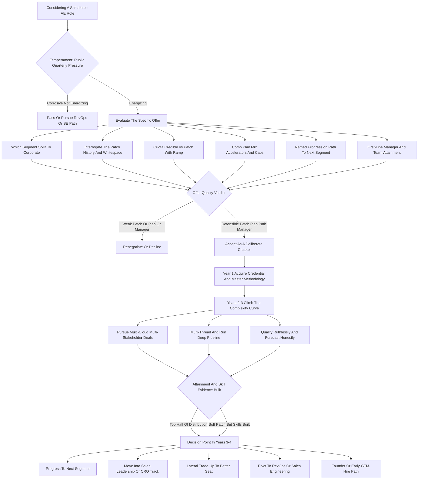

### Direct Answer

A Salesforce Account Executive role is still a genuinely good career bet in 2027 — but only as an **accelerant, not a destination**. It remains the most credentialed, highest-paying, and most transferable seat in enterprise software sales, sitting on top of a platform that is simultaneously the industry's training ground and one of its hardest comp plans to consistently beat. Take it as a deliberate two-to-four-year chapter to acquire the brand, the methodology, and the comp; climb the complexity curve toward the AI-amplified part of the job; and move on your own timing.

**TL;DR:** A Salesforce AE in 2027 carries an on-target earnings package of roughly **$240K–$340K at the enterprise tiers and $150K–$220K in commercial and SMB**, against a quota that has risen faster than win rates and an attainment distribution where **only ~40–55% of reps hit plan in a normal year**. The role is a good career bet for three durable reasons: **(a) the brand and methodology transfer** — "Salesforce AE" is a liquid, universally legible credential; **(b) the comp ceiling is real** — a strong enterprise AE clearing $400K–$600K+ in a good year is a documented outcome; and **(c) the skill it forces** — multi-threaded enterprise selling, MEDDPICC discipline, executive orchestration, and platform-not-product selling — is exactly where the rest of the industry is converging. It is a *bad* bet for the wrong person because of **the territory lottery**, **the AI-driven compression of the transactional middle**, and **the burn rate** of a 2–4 year, number-or-out role. Net: an excellent career accelerant, a poor career destination — choose it as a chapter, work it as a climb.

## 1. What A Salesforce AE Role Actually Is In 2027

### 1.1 The Core Definition

A Salesforce Account Executive owns a book of business — a "patch" or "territory" of named accounts, or a segment defined by employee count and revenue — and is measured, quarter after quarter, on one number: new and expansion Annual Recurring Revenue closed against a quota. **You are not a product specialist and you are not a customer success manager.** You are the person accountable for the commercial outcome: the one who builds the pipeline, qualifies it, multi-threads into the buying committee, runs the deal, negotiates the contract, and signs it. Everything else in the role — the tooling, the enablement, the solution engineers, the partners — exists to make that one accountability land.

### 1.2 What Has Changed By 2027

The job is shaped by realities that did not exist a decade ago. **Salesforce (NYSE: CRM) sells a sprawling platform** — Sales Cloud, Service Cloud, Marketing Cloud, Data Cloud, the Agentforce agentic-AI layer, Slack, Tableau, MuleSoft, Commerce Cloud, and the Industries verticals — and the AE is increasingly expected to sell the *platform thesis*, not a single SKU. **The buyer has changed:** enterprise software purchases now route through a procurement and finance gauntlet, a security review, and often a dedicated AI-governance check, which means the AE orchestrates six to twelve stakeholders rather than charming one economic buyer. **The tooling has changed:** Salesforce's own AI, plus Gong, Clari, and the engagement platforms, now handle a large share of the prospecting, call analysis, forecasting, and coaching that used to be the AE's craft. **And the comp plan has changed:** quotas have ratcheted up, accelerators have flattened, and the gap between the top decile and the median has widened.

### 1.3 The Honest One-Line Description

A Salesforce AE role in 2027 is the best-known, best-paying, most-transferable seat in enterprise SaaS sales, attached to a platform that will teach you to sell at the highest level in the industry — and a comp plan and quota structure that will test, quarter by quarter, whether you can.

| Dimension | A Decade Ago | In 2027 |
|---|---|---|
| What you sell | A CRM SKU | A multi-cloud platform thesis plus agentic AI |
| Buying committee | 1–3 stakeholders | 6–12 stakeholders, plus AI-governance review |
| Prospecting | Manual, AE-owned | Largely AI-automated |
| Forecasting | Manager craft | Tooled and inspected |
| Comp ceiling | High | Higher, but more distribution-driven |
| Quota pressure | Real | Ratcheted faster than win rates |

### 1.4 Why The Definition Matters For The Career Question

The reason a precise definition matters is that **most people evaluating "Is a Salesforce AE role good for my career?" are actually answering a vaguer question** — "Is Salesforce a good company?" or "Is sales a good field?" — and getting a vaguer answer. The career question only becomes answerable once you fix the unit of analysis to the specific seat: a quota-carrying, ARR-accountable individual contributor inside a defined segment, with a defined patch, under a defined comp plan, reporting to a specific first-line manager. **Everything that makes the role good or bad is in those specifics, not in the logo.** A candidate who internalizes this stops asking whether Salesforce is prestigious — it is — and starts asking whether *this* seat, in *this* segment, with *this* patch and plan and manager, compounds their career. That is the question this entry answers, and section 12 turns it into a checklist.

## 2. The Segment Map: Where The AE Job Actually Lives

### 2.1 "Salesforce AE" Is At Least Five Jobs

The segment you sit in determines your comp, your quota, your deal size, your cycle length, and your career velocity. A career-minded person should understand this map cold, because the single most consequential thing about a Salesforce AE offer is not "Salesforce" — it is *which segment, which patch, and which trajectory between segments*.

### 2.2 The Five Segments In Detail

- **SMB / Small Business** — sells to companies under roughly 100–200 employees, runs high-velocity transactional cycles measured in days to weeks, carries a lower quota and a lower OTE, and is the entry tier. It is where Salesforce trains raw closing talent — and where AI automation pressure is heaviest.
- **Commercial / Mid-Market** — sells to companies of roughly 200–2,000 employees, runs cycles of one to three months, sits in a mid OTE band, and is the proving ground that decides whether you advance to enterprise.
- **Enterprise** — sells to large companies, runs three-to-nine-month cycles, carries six-and-seven-figure deals, and pays an enterprise OTE with realistic upside well beyond it.
- **Corporate / Strategic / Named-Account** — owns a tiny number of the largest accounts in a region or industry, runs nine-to-eighteen-month motions, and is where the genuinely large earnings and the CRO-track visibility live.
- **Industries / Vertical AE roles** — Financial Services, Healthcare & Life Sciences, Public Sector, Manufacturing, Retail — overlay segment with deep domain specialization, and are increasingly where Salesforce concentrates its highest-value selling.

### 2.3 Why The Map Decides The Offer

An offer that does not come with a credible path from commercial to enterprise is a materially weaker offer than one that does. The brand is constant across all five jobs; the career outcome is not.

| Segment | Account Size | Cycle Length | Career Role |
|---|---|---|---|
| SMB | <100–200 employees | Days to weeks | Entry / raw closing training |
| Commercial / Mid-Market | 200–2,000 employees | 1–3 months | Proving ground |
| Enterprise | Large companies | 3–9 months | Comp ceiling + complexity |
| Corporate / Strategic | Largest named accounts | 9–18 months | CRO-track visibility |
| Industries / Vertical | Domain-defined | Often longer | Highest-value specialization |

## 3. The Compensation Reality: OTE, Pay Mix, And Take-Home

### 3.1 OTE Is The Headline, Not The Outcome

A career decision rests on real numbers. **OTE — on-target earnings — is the headline**, ranging from roughly $110K–$150K in SMB to $150K–$220K in commercial to $240K–$340K in enterprise, with corporate/strategic above that. But OTE is what you earn *if you hit 100% of quota*; the actual W-2 is a distribution.

### 3.2 Pay Mix Matters As Much As OTE

Enterprise AE plans typically run a roughly **50/50 to 60/40 base-to-variable split**, meaning a $300K OTE enterprise AE has a $150K–$180K base and the rest at-risk commission. **The pay mix tells you how variable your income actually is** — and the higher the variable share, the more the territory lottery and the macro cycle govern your real earnings.

### 3.3 Accelerators And Ramp

**Accelerators** — the higher commission rate paid on every dollar above quota — are the mechanism behind the top-decile outcomes, and they are the single most important line in a comp plan to read carefully, because flattened accelerators cap your upside. **Ramp** matters: a newly hired enterprise AE typically gets a ramped (reduced) quota for the first one to three quarters, and a guarantee or draw that protects early commission while pipeline builds.

### 3.4 Reading The Comp Plan Like A Contract

The comp plan is a legal document that decides your income, and a candidate should read it with the same scrutiny they would bring to the customer contracts they will later negotiate. **Five lines decide most of the outcome.** First, the **base-to-variable mix** — a 50/50 plan means half your headline number is genuinely at risk. Second, the **commission rate** — the dollars-per-dollar-of-ARR you earn up to quota. Third, the **accelerator schedule** — whether the rate steps up above 100% (good) or stays flat or even decelerates (bad). Fourth, the **caps** — whether there is a ceiling on commission, which silently deletes the right tail that the entire "high comp ceiling" argument depends on. Fifth, the **crediting rules** — how multi-year deals, expansions, renewals, and platform bundles count toward quota and toward commission, because a plan that credits a three-year deal only on year-one ARR pays very differently than one that credits total contract value.

### 3.5 The Honest Summary

A Salesforce AE role offers a genuinely high *expected* income and an even higher *possible* income, but it is a variable, distribution-driven income. **A candidate should price the job off a realistic 70–90% attainment scenario, not off the OTE on the offer letter.** The disciplined move is to model three years of income — a soft year, a median year, and a strong year — and to confirm that even the soft-year number, which is mostly base plus partial commission, clears your real financial obligations. If it does not, the role is financially fragile for you regardless of how attractive the OTE looks, and that is a structural finding, not a pessimistic one.

| Comp-Plan Line | What To Look For | The Risk If You Skip It |
|---|---|---|
| Base/variable mix | How much is genuinely at risk | Underestimating income volatility |
| Commission rate | Dollars earned per dollar of ARR | Misjudging effort-to-pay ratio |
| Accelerator schedule | Steps up above 100% | Flat accelerators cap the upside |
| Caps | Any ceiling on commission | Silently deletes the right tail |
| Crediting rules | Multi-year, expansion, renewal treatment | Large gap between OTE and reality |

| Segment | Typical OTE | Base/Variable Mix | Deal Size | Cycle Length |
|---|---|---|---|---|
| SMB / Small Business | $110K–$150K | ~60/40 | Low five figures | Days to weeks |
| Commercial / Mid-Market | $150K–$220K | ~55/45 to 60/40 | Five to low six figures | 1–3 months |
| Enterprise | $240K–$340K | ~50/50 to 60/40 | Six to seven figures | 3–9 months |
| Corporate / Strategic | $320K–$450K+ | ~50/50 | Seven figures+ | 9–18 months |
| Industries / Vertical | Segment OTE + domain premium | Varies | Varies | Often longer |

## 4. The Quota And Territory Lottery: The Single Biggest Variable

### 4.1 Why The Territory Outweighs Effort

This is the section a career-minded candidate must understand most clearly, because it is the factor that most determines outcomes and the one candidates most underweight. A Salesforce AE's results are a function of three things: **the rep's skill and effort, the macro environment, and the territory** — and the territory is frequently the largest of the three and the one entirely outside the rep's control.

### 4.2 Good Patch Versus Bad Patch

A **"good patch"** — accounts with budget, expansion whitespace, existing Salesforce footprint to grow, and a healthy renewal base — can make a median rep look like a star. A **"bad patch"** — saturated accounts, no whitespace, a region in a downturn, a book of logos that just bought and will not buy again for two years — can make a genuinely excellent rep miss quota through no fault of their own. A missed year on a bad patch still counts against you.

### 4.3 The Territory Conversation Is The Interview

This is why **the territory conversation is the most important conversation in the interview process**. A candidate should ask, specifically: how is the patch defined, what is its history, what did the prior rep do against it, how much of the quota is expansion of existing accounts versus net-new logos, and how often are territories re-cut.

### 4.4 The Career Discipline

**You cannot out-work a bad territory and a bad quota.** The assignment is substantially a lottery, and the best protection is to (a) interrogate the patch hard before signing, (b) build the kind of pipeline and multi-threading discipline that survives a soft patch, and (c) understand that one bad territory year is recoverable but two in a row is a signal to move.

| Patch Attribute | "Good Patch" Signal | "Bad Patch" Signal |
|---|---|---|
| Whitespace | Open expansion accounts | Saturated, fully penetrated |
| Renewal base | Healthy, growing | Just bought, locked for 2 years |
| Region health | Expanding budgets | In a downturn |
| Quota vs history | Credible against prior reps | Set above what the patch bears |
| Re-cut frequency | Stable, predictable | Frequently re-carved |

## 5. The AI Compression Thesis: What Is Actually Happening To The Role

### 5.1 Not Elimination — Compression

The loudest question about a Salesforce AE career in 2027 is whether AI is destroying it, and the honest answer is more precise than either the doom or the dismissal. **AI is not eliminating the AE role; it is compressing the transactional middle of it and raising the bar at the top.**

### 5.2 What AI Has Automated

The prospecting, list-building, sequencing, initial qualification, call note-taking, CRM hygiene, and first-draft outreach that used to consume a large share of an AE's week are now substantially automated by Salesforce's own AI layer and by the engagement and intelligence tools around it. The forecasting and deal-inspection that used to be a manager's craft is now tooled. The coaching that used to require a ride-along is now extracted from call recordings.

### 5.3 The Fork

- **The transactional, volume-closer version of the job** — the rep whose value was activity, persistence, and running a standardized pitch through a high volume of similar deals — faces genuine threat, because that is exactly the work that automates and gets consolidated into fewer, more productive seats or pushed to lower-cost geographies.
- **The complex, enterprise, platform-selling version of the job** — multi-threading a twelve-stakeholder buying committee, architecting a multi-cloud platform deal, navigating procurement and AI-governance review, orchestrating solution engineers and partners — sees AI as an amplifier, not a replacement, because that work is judgment, relationship, and orchestration, not activity.

### 5.4 What "Climbing The Complexity Curve" Concretely Means

The phrase is easy to nod at and hard to operationalize, so it is worth making concrete. **Climbing the complexity curve is a series of deliberate, observable moves**, not an attitude. It means consistently choosing the deal with six stakeholders over the deal with one, even though the one-stakeholder deal closes faster. It means asking your manager for the larger, messier account when patches are re-cut, rather than the clean, easy one. It means volunteering for the multi-cloud or Agentforce opportunity that requires you to learn Data Cloud architecture, because the learning is the point. It means inserting yourself into the procurement and AI-governance conversation rather than handing it off. Each of these moves is individually small; together, over two to three years, they are the difference between a rep whose resume reads "closed transactional CRM deals" and one whose resume reads "architected and closed seven-figure multi-cloud platform deals across twelve-stakeholder buying committees." The second resume is the one that survives the AI compression and commands the next role.

### 5.5 The Career Implication

The Salesforce AE role is a good 2027 career bet specifically to the extent that you use it to **climb the complexity curve toward the part of the job AI amplifies**, and a bad bet to the extent you stay in the part AI compresses. This is the single most important sentence in this entry, because it converts a binary question — "is the role good?" — into a conditional one whose condition is inside your control. The role does not decide the outcome; the version of the role you build inside it does.

| Work Category | AI Effect | Career Signal |
|---|---|---|
| Prospecting, list-building, sequencing | Compressed | Avoid being defined by this |
| Initial qualification, call notes, CRM hygiene | Compressed | Automate it, do not own it |
| Transactional volume closing | Compressed / consolidated | Shrinking island |
| Multi-threading buying committees | Amplified | Build this deliberately |
| Platform / value selling | Amplified | The durable core |
| Procurement, legal, AI-governance navigation | Amplified | High-judgment moat |

## 6. The Skills The Role Forces — And Why They Transfer

### 6.1 The Skill Curriculum Is The Real Argument

The strongest argument for a Salesforce AE role as a career move is not the comp; it is the **skill curriculum the role imposes**, because those skills are the most transferable and most durable assets in enterprise software.

### 6.2 The Forced Competencies

- **A qualification methodology** — MEDDIC, MEDDPICC, or a Salesforce-internal variant — the discipline of knowing, for every deal, the Metrics, Economic buyer, Decision criteria, Decision process, Paper process, Identified pain, Champion, and Competition. This is the lingua franca of enterprise sales.
- **Multi-threaded enterprise selling** — building and maintaining relationships across an entire buying committee rather than depending on a single contact — the single highest-leverage sales skill there is.
- **Platform and value selling** — selling a business outcome and a platform thesis rather than a feature list — which is where the entire industry is heading.
- **Executive-stakeholder fluency** — holding a credible conversation with a CFO, a CIO, and a line-of-business VP in the same deal.
- **Forecasting discipline and CRM rigor** — because at Salesforce, of all places, your pipeline lives in the system and is inspected.
- **Negotiation and commercial structuring** — multi-year terms, ramped deals, platform bundles.

### 6.3 Why Portability Is The Payoff

Every one of these skills is portable. They are exactly what every other enterprise SaaS company hires for, what every Salesforce partner needs, and what RevOps, sales leadership, and CRO roles are built on. **You can have a hard quota year and still walk away with a skill set worth more on the open market than when you started.**

| Skill | Where It Transfers |
|---|---|
| MEDDIC / MEDDPICC | Every enterprise SaaS sales org |
| Multi-threading | Any complex B2B sale |
| Platform / value selling | The direction of the whole industry |
| Executive fluency | Leadership, founder, advisory roles |
| Forecasting discipline | RevOps, sales operations, FP&A-adjacent |
| Commercial structuring | Deal desk, pricing, CRO track |

## 7. The Brand And Credential Value Of "Salesforce AE"

### 7.1 A Legible Signal In An Illegible Market

Beyond the skills, the role confers a credential, and in a labor market full of illegible signals, a legible one is worth real money. **"Salesforce AE" — particularly "Salesforce Enterprise AE" — is a liquid, universally understood credential.** Every hiring manager in enterprise software knows what it means: this person was hired and retained by the company with the most rigorous sales hiring bar in the industry, carried a real quota, and survived the comp plan.

### 7.2 Where The Credential Opens Doors

That signal opens doors at every other enterprise SaaS company — a Salesforce enterprise AE is a default-credible candidate at a **HubSpot (NYSE: HUBS)**, a **ServiceNow (NYSE: NOW)**, a **Workday (NASDAQ: WDAY)**, a **Snowflake (NYSE: SNOW)**, a **Datadog (NASDAQ: DDOG)**, an **Adobe (NASDAQ: ADBE)**, or a **Microsoft (NASDAQ: MSFT)**. It opens doors across the **Salesforce partner ecosystem** — the consultancies, the ISVs, and the implementation partners that collectively employ enormous numbers of people. It carries weight into **RevOps, sales enablement, and sales leadership** roles. And it carries into **founder and early-GTM-hire** paths, because investors and founders treat Salesforce sales pedigree as a de-risking signal.

### 7.3 The Practical Career Point

Even in a year where your number is hard, you are accruing a credential that compounds. A candidate weighing a Salesforce AE offer against a similar-comp offer at an unknown company should weight the credential heavily — the brand on the resume is a real, bankable asset.

## 8. The Attainment Distribution: Who Actually Wins

### 8.1 The Role Pays A Distribution, Not An OTE

A candidate must understand that the AE role does not pay everyone the OTE; it pays a *distribution*. In a normal year, roughly **40–55% of AEs hit or exceed 100% of quota** — meaning roughly half do not.

### 8.2 The Shape Of The Distribution

The distribution has a long right tail. The top decile of reps routinely clears 150–300%+ of plan, and because of accelerators they earn dramatically more than 1.5–3x the OTE — this is the cohort that produces the $400K–$700K+ stories. The middle of the distribution — the 60–110% attainment band — is where most reps actually live. The bottom roughly third lands under 50% of quota, and in a high-accountability culture that cohort is on a performance clock and is frequently managed out within 18–24 months.

### 8.3 What Separates The Cohorts

The skill factors are knowable. The winners multi-thread relentlessly, qualify out bad deals early instead of hoping, build pipeline 3–4x their quota so a few slipped deals do not sink the quarter, run a disciplined methodology, and partner aggressively with their solution engineers and ecosystem. The losers single-thread, hold onto zombie deals, run thin pipeline, and improvise.

### 8.4 The Behaviors That Move You Up The Distribution

Because part of the distribution is skill and not just luck, it is worth being specific about the behaviors that correlate with the top half. **Top-half reps build pipeline early and continuously**, treating pipeline generation as a non-negotiable weekly block rather than a panic activity when the quarter looks thin. They **multi-thread before they need to** — mapping the buying committee and building a relationship in every box while the deal is still healthy, not scrambling for a second contact after the champion goes quiet. They **qualify out fast**, accepting a smaller, truer pipeline over a larger, fictional one. They **run a tight deal review**, walking into forecast calls with a defensible number rather than a hopeful one. And they **partner deliberately** — pulling in solution engineers, partners, and executives at the right moments rather than trying to carry every deal solo. None of these behaviors require a good patch; they are available to any rep on any patch, which is exactly why they are the part of the outcome a candidate can actually underwrite.

### 8.5 The Career-Honest Framing

A Salesforce AE role is a good bet **if you have evidence you can be in the top half of that distribution** — and the way you generate that evidence is the methodology discipline the role itself teaches. Going in, assume the median outcome, plan personal finances off a 70–90% attainment year, and treat the right tail as upside, not as the plan.

| Cohort | Share Of Reps | Attainment Band | Earnings Reality |
|---|---|---|---|
| Top decile | ~10% | 150–300%+ of quota | 1.5–3x+ OTE; the $400K–$700K+ outcomes |
| Solid performers | ~30–45% | 100–150% of quota | At or modestly above OTE |
| Middle band | ~20–30% | 60–100% of quota | Meaningful but sub-OTE income |
| Bottom third | ~30–35% | Under 50–60% of quota | Performance clock; managed out in 18–24 months |

## 9. The Career Paths Out Of The Role

### 9.1 Optionality Is The Proof

The clearest evidence that a Salesforce AE role is a good career bet is the **breadth and quality of the paths out of it**, because a role is a good accelerant precisely when it opens many doors.

### 9.2 The Six Forks

- **Segment progression inside Salesforce** — SMB to commercial to enterprise to corporate/strategic — each step a meaningful jump in deal size, OTE, and prestige.
- **Sales leadership** — first-line manager, then RVP/AVP, then VP of Sales, then CRO — the management track that turns a strong individual contributor into a leader of revenue.
- **RevOps and sales strategy** — AEs who understand the comp plan, the territory model, and the forecasting machinery from the inside are valuable in the function that designs all of it.
- **Sales engineering and solutions leadership** — for AEs with a technical bent.
- **Lateral trade-up** — using the Salesforce credential to move to another enterprise SaaS company at a higher segment or a better territory.
- **Founder / early-GTM-hire path** — being the first or second sales hire at a startup, or founding one, on the strength of the pedigree and the network.

### 9.3 The Career Math

A 2–4 year stretch as a Salesforce AE, executed well, does not narrow your options — it widens them, and that optionality is the third pillar of the "good career bet" case.

| Path Out | What It Values From The AE Seat |
|---|---|
| Segment progression at Salesforce | Attainment record, methodology mastery |
| Sales leadership / CRO track | Coaching instinct, comp-plan literacy |
| RevOps / sales strategy | Forecasting rigor, territory understanding |
| Sales engineering leadership | Technical fluency, deal architecture |
| Lateral trade-up | The liquid credential and the network |
| Founder / early-GTM hire | Pedigree, customer graph, GTM judgment |

## 10. The Burn Rate And Tenure Reality

### 10.1 The 2–4 Year Cycle

A candidate owes themselves an honest look at how long people actually last in the role. Enterprise AE tenure at a given company tends to run on a roughly **2–4 year cycle** — a year-ish to fully ramp and learn the patch, a couple of strong years if the territory cooperates, and then a move, either upward, laterally to a better seat, or out under quota pressure. This is not unique to Salesforce; it is the structural rhythm of the high-accountability enterprise sales role.

### 10.2 Plan The Role As A Chapter

The implication is not that the role is bad — it is that the role should be **planned as a chapter, not a career**. The reps who get the most out of it treat the 2–4 years deliberately: year one is ramp and credential acquisition, years two and three are the earning-and-evidence-building window, and somewhere in years three to four is the decision point.

### 10.3 The Drift Failure

The reps who get the *least* out of it are the ones who drift — who stay in the same segment on a soft patch for five years, never climb the complexity curve, and find that the credential has stopped compounding. The right response to the burn rate is not to avoid the role; it is to enter it with a clock and a plan.

| Phase | Window | The Job In That Phase |
|---|---|---|
| Ramp | Year 1 | Acquire credential, master methodology, learn the patch |
| Earn & build evidence | Years 2–3 | Climb the complexity curve, bank attainment |
| Decision point | Years 3–4 | Progress, lead, trade up, or pivot |

## 11. The Day-To-Day: What The Job Actually Feels Like

### 11.1 Two Competing Clocks

A career decision should be grounded in the lived texture of the work. A Salesforce AE's day is a constant negotiation between **the pipeline-building clock** (the work that pays you in two quarters) and **the deal-closing clock** (the work that pays you this quarter). The chronic failure mode is letting this quarter's deals crowd out next quarter's pipeline.

### 11.2 A Typical Week

A typical week is a mix of discovery and qualification calls, multi-threading outreach to widen the buying committee, internal deal reviews and forecast calls where you defend every number, working sessions with solution engineers to build the technical case, partner coordination, proposal and pricing construction, procurement and legal navigation, and the CRM hygiene that keeps it all inspectable.

### 11.3 The Emotional Texture

The rhythm is **quarterly and public** — your number is visible, your forecast is challenged, and the end of quarter is a genuine crunch. There is real exhilaration in a large deal closing and real, recurring stress in a slipped deal, a quiet pipeline, and the standing knowledge that the number resets to zero every ninety days. The role rewards a particular temperament — comfort with public accountability, resilience to a "no," and the emotional regulation to not ride the deal-by-deal rollercoaster. **No comp number compensates for a temperament mismatch with the core rhythm of the job.**

### 11.4 The Annual Rhythm Beyond The Quarter

Beyond the weekly and quarterly cadence, the AE year has a shape worth knowing. **The start of the fiscal year** brings a new quota, often a re-cut patch, and a kickoff event that resets goals. **The early quarters** are pipeline-building quarters, where the disciplined rep front-loads the generation work that pays off later. **The mid-year** is typically where the strong reps separate from the pack, and where managers begin forming a view of who will land the year. **The final quarter** is the most intense — it carries the most pressure, the most management attention, and the most deal acceleration, and it is where careers are both made and ended. Layered on top of this is the **annual planning cycle**, where next year's quotas and territories are set, and a smart rep is paying attention to that process because it determines the patch they will run next. Understanding this rhythm lets a candidate see the role not as an undifferentiated grind but as a structured year with predictable phases — which is itself a form of control.

## 12. How To Evaluate A Specific Salesforce AE Offer

### 12.1 The Most Important Career Skill

Because "Salesforce AE" is five jobs and a lottery, the most important career skill is evaluating a *specific* offer. A candidate should run structured diligence on any offer before signing — treat the offer like the enterprise deal it is: multi-thread it, qualify it hard, and do not let the brand and the OTE headline substitute for diligence on the patch, the plan, and the path.

### 12.2 The Seven Diligence Areas

- **Segment and patch** — which segment, and exactly how is the territory defined; what is its history; what did the last one to three reps do against it.
- **Quota relative to the patch** — is the quota credible against what the territory has historically produced; what is the ramp.
- **Comp plan mechanics** — the base-to-variable mix, the commission rates, the accelerator structure, the caps, and how expansion and multi-year deals are credited.
- **The path** — is there a credible, named progression from this segment to the next.
- **The manager** — the first-line manager is the single biggest predictor of an AE's success.
- **The team's recent reality** — what percentage of the team hit quota last year, and what is the tenure pattern.
- **The product moment** — are you selling into momentum or headwind.

| Area | The Question To Ask |
|---|---|
| Segment & patch | How is the territory defined; what did the last 1–3 reps do against it? |
| Expansion vs net-new | What share of quota is expansion vs net-new logos? |
| Quota vs patch | Is the quota credible against what the patch has historically produced? |
| Ramp | Ramped quota for how many quarters; is there a draw or guarantee? |
| Comp mechanics | Base/variable mix, accelerator structure, caps, multi-year credit rules? |
| Path | Is there a named, credible progression to the next segment? |
| Manager & team | Manager tenure and style; what % of the team hit quota last year? |

## 13. The 2027 Salesforce Context: Selling Inside A Transition

### 13.1 The Agentforce Pivot

A Salesforce AE in 2027 is not selling in a vacuum; they are selling inside Salesforce's own strategic transition. Salesforce has pivoted hard toward **agentic AI** — the Agentforce layer that sells autonomous AI agents on top of the CRM and Data Cloud foundation — and that pivot changes what an AE carries and how they sell.

### 13.2 The Upside And The Complication

The **upside** for the AE: a genuinely new, high-interest product category, expansion whitespace in the installed base, and a platform story larger than "CRM seats," which pushes the role toward the high-complexity selling that AI amplifies. The **complication**: a new category means longer education cycles, more proof-of-concept work, more AI-governance review, and a quota that may be set on optimistic adoption assumptions.

### 13.3 The Career Read

Selling at Salesforce in 2027 means selling at the front edge of the industry's AI transition — genuinely good for skill-building and credential value — while also meaning you are inside a large, mature company managing its own growth and margin scrutiny, which is the source of the comp and quota pressure.

### 13.4 What The Agentforce Pivot Means For A New AE Specifically

For a candidate joining in 2027, the Agentforce pivot has concrete, mixed implications. On the **opportunity side**, selling a new category means there is genuine greenfield in the installed base — accounts that have bought Sales Cloud or Service Cloud for years now have a fresh reason to expand, and expansion into a warm account is the highest-probability ARR an AE can carry. It also means the platform conversation is more strategic and more interesting, which pulls the role toward the judgment-heavy selling that builds transferable skill. On the **caution side**, a candidate should ask hard questions about how Agentforce quota is set: a new category with optimistic adoption assumptions can produce a number that the market is not yet ready to deliver, and a rep handed an aggressive agentic-AI quota in the early innings of category adoption can miss for reasons that have nothing to do with their selling. The honest read: the Agentforce pivot makes the role more interesting and more strategically central, but it also adds a layer of quota-setting uncertainty that belongs squarely in the offer-diligence conversation.

## 14. Salesforce AE Versus The Alternatives

### 14.1 The Comparative Frame

A career decision is comparative. The Salesforce AE role is **not categorically better than every alternative**, but it is the highest-floor, most-legible, most-transferable option in the set.

### 14.2 The Realistic Alternatives

- **Versus an AE role at a high-growth, mid-stage SaaS company** — the startup AE role offers more whitespace, faster visibility, equity upside, and a less ratcheted quota, but it carries company risk and a less legible credential. The trade is brand and training versus whitespace and equity.
- **Versus an AE role at another large incumbent** — ServiceNow, Workday, SAP, Oracle, Microsoft, Adobe are genuinely comparable; the choice comes down to the specific segment, patch, product momentum, and manager. A great patch at ServiceNow beats a bad patch at Salesforce.
- **Versus moving into RevOps or sales engineering directly** — less variable, less publicly pressured, still well-paid, but forgoes the comp ceiling and the bag-carrying credential.
- **Versus staying in a current sales role** — the question is whether the current role is still building skills, credential, and comp, or whether it has plateaued.

| Alternative | What You Gain | What You Give Up |
|---|---|---|
| Startup mid-stage AE | Whitespace, equity, faster visibility | Brand legibility, training machine |
| Other incumbent AE | Comparable comp + credential | Marginal — depends on the specific patch |
| RevOps / SE directly | Lower variance, still good pay | The comp ceiling, the bag credential |
| Staying put | Continuity, known patch | Possible plateau in skill and comp |

## 15. Maximizing The Role: How To Make It A Genuinely Good Bet

### 15.1 The Deliberate Behaviors

For the candidate who takes the role, the difference between a good outcome and a wasted chapter is a set of deliberate behaviors:

- **Treat year one as credential-and-methodology acquisition** — learn the patch, master the methodology cold, and do not panic about the number while ramping.
- **Climb the complexity curve on purpose** — actively pursue the larger, multi-cloud, multi-stakeholder deals, because that is the part AI amplifies.
- **Multi-thread every deal from the start** — never let a deal depend on one person; build a relationship in every box of the buying committee.
- **Run pipeline at 3–4x quota** — the single most reliable protection against a missed quarter and a soft patch.
- **Qualify ruthlessly** — kill zombie deals early, forecast honestly, and earn a reputation for a clean pipeline.
- **Partner aggressively** — with solution engineers, with the partner ecosystem, with marketing — because enterprise selling is a team sport.
- **Build the relationship graph deliberately** — customers, partners, colleagues become your durable professional network.
- **Run a clock** — know the role is a 2–4 year chapter and make the next move on your timing.
- **Manage the manager relationship** — your first-line manager controls your patch, your deals' air cover, and your internal advocacy.
- **Price your life conservatively** — live off the base-plus-conservative-commission, bank the upside, and stay financially un-fragile.

### 15.2 The First Ninety Days

The behaviors above are a multi-year program, but the first ninety days deserve their own discipline because they set the trajectory. **In the first month**, the priority is learning the patch cold — every account, its history, its existing Salesforce footprint, its renewal dates, and its expansion whitespace — and building a relationship with the solution engineers and the partners who will carry deals with you. **In the second month**, the priority is methodology: knowing the qualification framework well enough that it is automatic, and beginning to generate genuine pipeline rather than relying on whatever inherited deals came with the patch. **In the third month**, the priority is shifting from learning to producing — running real discovery, multi-threading early deals, and establishing with your manager a reputation for a clean, honest forecast. A rep who treats the ramp as a passive orientation period wastes the one window where missing the number is fully expected; a rep who treats it as an aggressive learning sprint enters quarter two already ahead.

### 15.3 The Payoff

Do these, and the role delivers all three of its promises — comp, credential, and skill — and becomes exactly the accelerant the "good career bet" case describes. The reps who execute this program do not just earn well; they leave the seat, whenever they leave it, with a resume, a skill set, and a network worth materially more than what they walked in with — which is the entire definition of a role that is good for your career.

| Behavior | Protects Against | Builds Toward |
|---|---|---|
| Year-one credential focus | Panic-driven early mistakes | A durable methodology base |
| Climbing the complexity curve | AI compression of the role | A liquid, senior-track resume |
| Multi-threading every deal | Single-point-of-failure deal loss | Enterprise-selling reputation |
| 3–4x pipeline coverage | A missed quarter from normal slip | Forecast reliability |
| Ruthless qualification | Forecasting on fiction | Manager and exec trust |
| Running a clock | Drifting past the cycle | A move on your own timing |

## 16. The Ecosystem Dividend And The Macro Cycle

### 16.1 The Network Outlasts The Job

A factor career-minded candidates consistently underweight is that a Salesforce AE role plugs you into the single largest professional ecosystem in enterprise software. There is a vast **partner economy** — the global system integrators, boutique consultancies, and ISVs — that hires aggressively for people who carried a Salesforce bag. There is the **customer base** — every account you sell to is a building full of operators who become future employers, references, and buyers. There is the **colleague network** — solution engineers, other AEs, managers — who scatter across the industry and become your warm-intro graph. And there is the **certification and community layer** — Trailhead, the Trailblazer community, the Dreamforce orbit. When you eventually leave the seat, you do not leave cold.

### 16.2 Reading The Macro Cycle You Sign Into

A Salesforce AE's outcomes are unusually sensitive to the macroeconomic and software-spending cycle. In an **expansionary year**, a median rep on a median patch can hit quota and a good rep can have a career year. In a **contractionary year**, the same rep on the same patch can miss, because deals that would have closed simply do not. This matters in two ways: first, it is another reason to price the role off a conservative attainment scenario and keep finances un-fragile; second, it reframes a missed quarter — in a contractionary stretch, a missed number is partly a macro artifact, and a clear-eyed rep separates "I executed poorly" from "the cycle was against everyone."

## 17. The Career Decision Journey: From Offer To Next Move

## 18. Counter-Case: Why A Salesforce AE Role Might Be A Mistake For You

The case above describes a genuinely good career bet, but a serious candidate must stress-test it against the conditions that make this role the wrong move. There are real reasons to pass.

### 18.1 The Territory Lottery Can Cost You A Year

Your W-2 and your internal reputation are set substantially by the patch you are handed, and the patch is assigned, not earned. A saturated, no-whitespace, just-bought book in a soft region can make an excellent rep miss quota, and a missed year still counts against you regardless of cause.

### 18.2 The Transactional Version Is Being Compressed

If you land in — or get stuck in — the SMB or lower-commercial volume-closer version of the role, you are in exactly the work that AI automation and geographic consolidation are eating. Not every rep climbs the complexity curve, and the ones who do not are on a shrinking island.

### 18.3 The Income Is Variable And Unforgiving

The OTE on the offer letter is what you make at exactly 100% of quota, and only roughly 40–55% of reps get there. A meaningful third land under 50% of plan and are on a performance clock. If you need income stability, a 40–60% variable comp plan with a long left tail is a poor structural fit.

### 18.4 The Burn Rate Is Real

Enterprise AE tenure runs on a roughly 2–4 year cycle. This is fine if you plan it as a chapter, but it means the role is structurally not a stable long-term home — you are signing up for a seat you will need to move out of, on a clock, and the move is not always on your timing.

### 18.5 The Quarterly Pressure Resets To Zero

Your number is visible, your forecast is challenged in front of peers, and every ninety days the counter goes back to zero. For a candidate whose temperament does not fit that rhythm, no comp number compensates — the role will be corrosive, not energizing.

### 18.6 Quotas Have Ratcheted Faster Than Win Rates

Salesforce, as a large and mature company under growth and margin scrutiny, has structural reasons to set aggressive quotas and re-cut territories. "The quota was unrealistic" is not a defense that shows up on your attainment record.

### 18.7 The Brand Can Lull You Into Skipping Diligence

The single most common career mistake with this role is signing for the logo and the OTE headline without interrogating the patch, the plan, the path, and the manager. The prestige of the name is exactly what makes candidates underwrite a bad specific offer.

### 18.8 A Great Patch Elsewhere Can Beat A Bad Patch At Salesforce

ServiceNow, Workday, SAP, Microsoft, and Adobe offer comparable comp and credential value. The Salesforce name does not, by itself, make a specific Salesforce offer the best offer.

### 18.9 It Forgoes Equity Upside

A mature public company's AE comp is salary and commission, not meaningful equity. A candidate who specifically wants ownership upside is better served by an AE seat at a high-growth, mid-stage company.

### 18.10 It Is The Wrong Move If You Want Lower Variance

RevOps, sales enablement, and sales engineering roles are well-compensated, build durable skills, and carry far less public quarterly variance.

### 18.11 A Weak First-Line Manager Can Sink The Experience

The first-line manager controls your patch, the air cover on your deals, and your internal advocacy — and you do not pick them.

### 18.12 "Good For Your Career" Assumes You Actually Climb

Every pillar of the positive case — comp, credential, skills — compounds only if you climb the complexity curve and move on the cycle. The candidate who drifts in the same segment on a soft patch for five years gets the pressure without the payoff. The role is good *conditionally*, and the condition is real work — it can quietly narrow a person who never reaches outside the deal.

### 18.13 The Honest Verdict

A Salesforce AE role in 2027 is a strong choice for a candidate who finds public quarterly accountability energizing, is at a career stage where a top-tier credential materially advances their trajectory, can absorb a variable income, is oriented toward the complex platform-selling version of the job, will do real diligence, and will treat the role as a deliberate climbing chapter. It is a poor choice for anyone who needs income stability, wants a stable long-term home, rejects public quarterly pressure, specifically wants equity upside, or would take the role for the logo and then drift. The role is not worse in 2027 — it is **more bifurcated**, and the gap between the climbing version that pays off and the flat version that does not is wider than it has ever been.

## 19. The Verdict: Accelerant, Not Destination

Pulling the analysis together: is a Salesforce AE role still good for your career in 2027? **Yes — as an accelerant, with eyes open.** It is good because it offers the three things that genuinely compound a sales career: a high and high-ceilinged comp opportunity, the single most legible and transferable credential in enterprise software sales, and a forced curriculum in the exact methodology and selling motion the rest of the industry is converging on. It is *not* a safe or passive seat: the territory you are handed is substantially a lottery you cannot out-work; the transactional version of the job is being compressed by AI and consolidation; and the role naturally runs on a 2–4 year burn cycle. The synthesis that resolves the tension: a Salesforce AE role is a poor career *destination* and an excellent career *accelerant*. The candidate who takes it as a deliberate 2–4 year chapter — to acquire the credential, master the methodology, climb the complexity curve toward the AI-amplified part of the job, extract the comp, and then move on their own timing — is making one of the best available moves in software sales. The candidate who takes it for the brand alone, ignores the patch, stays transactional, and drifts past the cycle is making a mistake. Choose it as a chapter, work it as a climb, and it is still, in 2027, a genuinely good thing to have on your career.

## 20. Sources

1. **RepVue — Salesforce Account Executive Compensation and Ratings** — Crowd-sourced OTE, quota-attainment, and culture data by segment. https://www.repvue.com
2. **Salesforce Investor Relations — 10-K and Quarterly Filings** — Official revenue, operating income, and segment disclosures providing the company-context backdrop. https://investor.salesforce.com
3. **Gartner — The Future of Sales** — Research on AI-assisted selling, buyer behavior shifts, and the evolving structure of the seller role. https://www.gartner.com
4. **The Bridge Group — SaaS AE / Sales Development Metrics Reports** — Benchmark data on AE quota, ramp time, tenure, attainment, and pipeline coverage. https://bridgegroupinc.com
5. **Pavilion — GTM Compensation and Benchmarks Reports** — Compensation, pay-mix, and quota-attainment benchmarks across GTM roles. https://www.joinpavilion.com
6. **levels.fyi — Salesforce Sales Compensation Data** — Self-reported total-compensation data points for Salesforce sales roles. https://www.levels.fyi
7. **Glassdoor — Salesforce Account Executive Salary and Review Data** — Self-reported base, OTE, and qualitative role reviews. https://www.glassdoor.com
8. **US Bureau of Labor Statistics — Sales Representatives / Software Publishers** — Occupational employment, wage, and outlook data for sales occupations. https://www.bls.gov
9. **Salesforce Newsroom and Agentforce Product Announcements** — Official material on the agentic-AI pivot shaping what AEs sell in 2027. https://www.salesforce.com/news
10. **MEDDIC Academy — MEDDIC / MEDDPICC Methodology Documentation** — Reference for the enterprise qualification methodology the role forces. https://www.meddic.academy
11. **Gong — Sales Reality / Revenue Intelligence Reports** — Analysis of sales-conversation data on win-rate drivers and AI-coaching impact. https://www.gong.io
12. **Clari — Revenue Operations and Forecasting Research** — Material on forecasting discipline and the tooling of deal inspection. https://www.clari.com
13. **HubSpot — State of Sales Reports** — Survey data on sales-cycle length, buyer behavior, and rep productivity trends. https://www.hubspot.com
14. **Outreach — State of Sales Engagement Reports** — Data on prospecting automation and the share of pipeline creation shifting off the AE. https://www.outreach.io
15. **Alexander Group — Sales Compensation Trends Surveys** — Enterprise sales-comp structure, segmentation, and role-bifurcation research. https://www.alexandergroup.com
16. **Korn Ferry — Sales Talent and Compensation Studies** — Research on sales-role tenure, turnover, and talent benchmarks. https://www.kornferry.com
17. **CSO Insights / Korn Ferry Sales Performance Research** — Historical and ongoing data on quota-attainment distributions. https://www.kornferry.com
18. **LinkedIn — State of Sales Report** — Survey data on seller workflows, buyer relationships, and tool adoption. https://www.linkedin.com
19. **Salesforce State of Sales Report** — Salesforce's own survey research on seller time allocation and AI adoption. https://www.salesforce.com
20. **Sales Hacker / Pavilion Community Practitioner Discussion** — Practitioner commentary on territory design, comp plans, and AE career paths. https://www.saleshacker.com
21. **Built In — Salesforce and Enterprise SaaS Role and Salary Pages** — Role descriptions and compensation references for AE positions. https://builtin.com
22. **Comparably — Salesforce Compensation and Culture Data** — Self-reported compensation and workplace-culture data. https://www.comparably.com
23. **Forrester — B2B Buying Study / Future of B2B Sales** — Research on the expanding buying committee and lengthening procurement processes. https://www.forrester.com
24. **McKinsey — B2B Sales and the Future of Selling** — Analysis of AI's impact on sales productivity and role structure. https://www.mckinsey.com
25. **ZoomInfo / DealRoom GTM Benchmark Data** — Pipeline-coverage and sales-cycle benchmark references. https://www.zoominfo.com
26. **Salesforce Trailblazer Community and Trailhead** — Reference for the Salesforce ecosystem, certification, and partner-network scale. https://www.salesforce.com/trailblazer
27. **Salesforce Partner Program Documentation** — Material on the consultancy and ISV ecosystem that hires ex-Salesforce AEs. https://partners.salesforce.com
28. **The Information — Coverage of Enterprise SaaS GTM and Sales-Tooling Vendors** — Reporting on the sales-tech vendors automating the AE workflow. https://www.theinformation.com
29. **Crunchbase — Enterprise SaaS Company and Funding Data** — Reference for the alternative-employer landscape AEs trade into. https://www.crunchbase.com
30. **G2 — Sales Tools Category and Adoption Data** — Reference for the AI sales-tooling stack reshaping the role. https://www.g2.com
31. **Sales Management Association — Research on Territory Design and Quota Setting** — Material on how territory and quota assignment drives rep outcomes. https://salesmanagement.org
32. **Harvard Business Review — Articles on Sales Compensation and Territory Design** — Conceptual references on comp-plan and territory mechanics. https://hbr.org
33. **OpenView / SaaS Operational Benchmarks (historical)** — Historical SaaS GTM and sales-efficiency benchmark references. https://openviewpartners.com
34. **First-Hand AE Practitioner Accounts — Sales Community Forums and Career Discussions** — Practitioner accounts of tenure, burn rate, territory experience, and career paths. https://www.reddit.com/r/sales

## 21. Related Pulse Library Entries

- **(q1896)** — Is an Apollo AE role still good for your career in 2027? A comparable AE-role analysis at a high-velocity sales-engagement vendor; useful contrast in segment, deal size, and credential.
- **(q1915)** — Is a HubSpot AE role still good for your career in 2027? The closest direct comparison among CRM incumbents; weighs a different segment mix and brand against the Salesforce seat.
- **(q1923)** — Is a Snowflake AE role still good for your career in 2027? A data-platform AE comparison — higher deal complexity, similar credential value.
- **(q1926)** — Is a Stripe AE role still good for your career in 2027? Another incumbent-alternative AE seat for the comparative-frame section.
- **(q1907)** — Is a Datadog AE role still good for your career in 2027? An observability-vendor AE comparison rounding out the alternatives map.
- **(q1889)** — Is an Atlassian AE role still good for your career in 2027? A product-led-growth contrast to the Salesforce enterprise-sales motion.
- **(q1897)** — Is an Outreach Solutions Engineer role still good for your career in 2027? The SE counterpart to the AE seat — the lower-variance adjacent path.
- **(q1898)** — What replaces the RevOps stack if AI agents auto-coach reps? The downstream tooling implication of the AI-compression thesis.
- **(q1899)** — What replaces SDR teams if AI agents replace SDRs natively? Context for the AI compression that reshapes the upstream of the AE funnel.
- **(q1904)** — How does Salesforce make money in 2027? The parent-company economics behind the quota pressure and the platform thesis the AE sells.
- **(q1906)** — Outreach vs Salesloft — which should you buy in 2027? The engagement-layer tooling that automates the transactional middle of the AE job.
- **(q1910)** — Should Gong acquire Avoma in 2027? The revenue-intelligence and AI-coaching layer reshaping how AE performance is measured.
- **(q9634)** — What do CRO compensation benchmarks look like by company stage in 2027? The destination economics at the top of the sales-leadership path out of the AE role.
