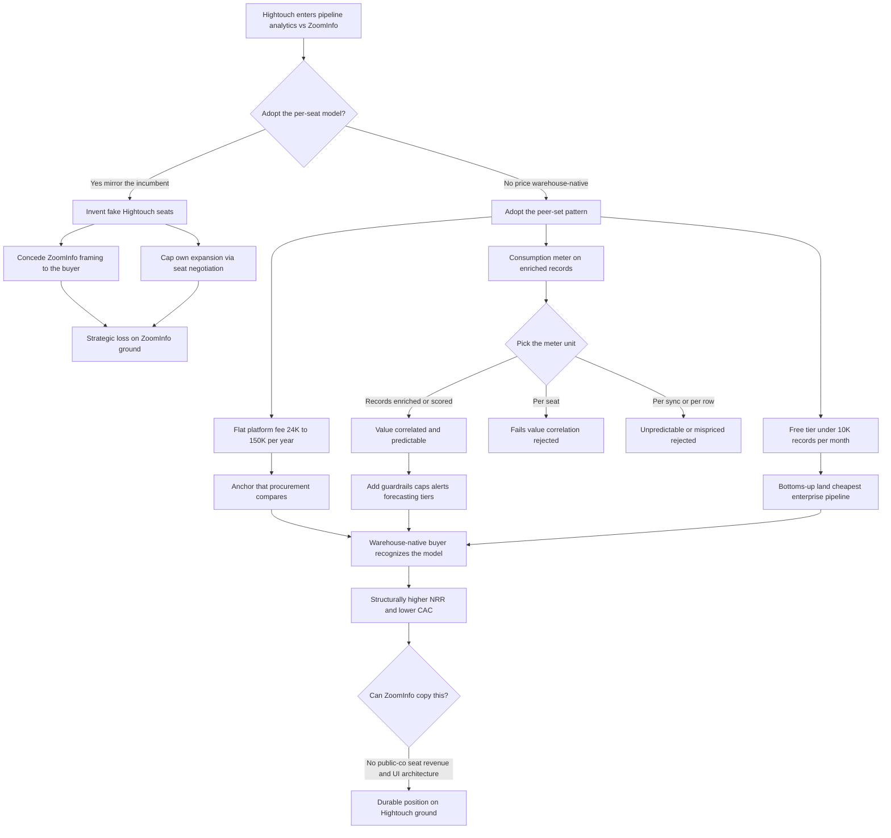

### Direct Answer

Hightouch should price pipeline analytics on a **warehouse-native, consumption-anchored model with a flat platform tier** and should explicitly refuse to mirror ZoomInfo's per-user-seat enterprise pricing. The entire strategic reason a customer buys pipeline analytics from Hightouch instead of ZoomInfo is that Hightouch is warehouse-native, and per-seat pricing structurally contradicts that position. The recommended structure is a transparent flat platform fee (roughly $24K-$150K/yr), a consumption add-on for enrichment and scoring (roughly $0.40-$1.50 per 1,000 records), and a genuine free tier under ~10K records/month to seed bottoms-up adoption.

**TL;DR:** ZoomInfo (NASDAQ: ZI) sells contact data and workflow on per-user-seat contracts that run $15K-$40K/yr for small teams and $40K-$250K+/yr for enterprise, metering how many salespeople log into its UI. Hightouch (private, reverse-ETL category leader, ~$1.2B Series C valuation) has no per-user concept — data lives in the customer's Snowflake, BigQuery, Databricks, or Redshift warehouse. Pricing per seat would force Hightouch to invent fake "Hightouch users," concede ZoomInfo's framing, and cap its own expansion. The winning model meters on data volume and enrichment consumption, anchors on a transparent platform fee, keeps a free tier, and lets warehouse-native architecture — not a seat count — be the thing the price expresses. The three traps to avoid: seat-based pricing, pricing the data itself like a data vendor, and an opaque "call us" enterprise motion with no public anchor.

---

## 1. What This Question Is Actually Asking

### 1.1 A Positioning Question Wearing a Pricing Costume

The question looks like a narrow pricing-page exercise — pick a number, pick a unit, undercut the competitor — but it is really a positioning question wearing a pricing costume. **Pricing is the most legible expression of strategy a company ships**, and customers, competitors, and investors all read the pricing page as a statement of what the company believes it is. So the real question is: when Hightouch enters a category ZoomInfo has historically owned, does it adopt ZoomInfo's commercial model to compete on familiar terms, or does it price in a way that forces the comparison onto Hightouch's home ground?

The answer matters far beyond the revenue from this one product line. **ZoomInfo's per-seat model is not an accident** — it is the economic engine of a roughly $1.2B-revenue public company, and it works because ZoomInfo's product is a UI that salespeople log into. Hightouch's product is infrastructure that sits on the data warehouse and moves and activates data.

### 1.2 Why the Pricing Decision Is the Strategic Decision

If Hightouch prices pipeline analytics per seat, it has to invent a fake notion of "Hightouch users," create artificial seat boundaries inside an architecture that has none, and accept ZoomInfo's framing that the value of pipeline intelligence scales with the number of people who look at it. If Hightouch instead prices on data volume and enrichment consumption, it tells the market that **value scales with the data activated and the outcomes produced** — which is both true to the architecture and strategically the harder thing for ZoomInfo to copy without cannibalizing its own seat revenue. The rest of this answer treats the pricing decision as the strategic decision it is.

### 1.3 The Stakes in One Table

| Dimension | If Hightouch prices per seat | If Hightouch prices warehouse-native |
|---|---|---|
| **Buyer framing** | Evaluated as ZoomInfo's weaker twin | Evaluated as modern-data-stack infrastructure |
| **Expansion mechanic** | Gated by seat negotiation | Frictionless via consumption growth |
| **Moat alignment** | Contradicts warehouse architecture | Compounds warehouse architecture |
| **Competitor response** | Easy for ZoomInfo to match | Structurally hard for ZoomInfo to copy |
| **Investor read** | "Competing on ZoomInfo's terms" | "Warehouse-native disruptor" |

---

## 2. The Two Companies: Structural Profiles That Determine Pricing

### 2.1 ZoomInfo — The Per-Seat Public Company

A pricing recommendation that ignores the structural facts of both companies is just a guess. **ZoomInfo (NASDAQ: ZI)** is a public company that reported roughly $1.2B in FY2024 revenue with growth decelerated sharply from its pandemic-era highs; its market capitalization, above $30B at the 2021 peak, had fallen to roughly $4-5B by 2024-2025 as net revenue retention compressed.

ZoomInfo sells a contact-and-company database, intent signals, and a workflow layer, and monetizes through **per-user-seat annual contracts** — the customer buys access for a defined number of named users who log into ZoomInfo's interface to prospect. That model produced enormous gross margins for years, but by 2024 it was under visible strain: seat-based renewals became a procurement line item, lower-cost competitors like Apollo and Cognism attacked the price point, and the "do we really need all these seats" question capped expansion.

### 2.2 Hightouch — The Warehouse-Native Private Company

**Hightouch** is a private company founded in 2018 that created and leads the reverse-ETL category — software that reads from the customer's cloud data warehouse and syncs modeled data out to operational tools like Salesforce (NYSE: CRM), HubSpot (NYSE: HUBS), Marketo, Customer.io, Braze (NASDAQ: BRZE), and ad platforms. It raised a $38M Series C in 2022 led by Sapphire Ventures and ICONIQ Growth at a valuation widely reported around $1.2B, and it has since expanded from pure reverse-ETL into a composable CDP ("Customer Studio") and AI Decisioning.

**The structural fact that should drive every pricing decision:** Hightouch's product does not have "users" in the seat sense — it has data sources, models, syncs, and destinations, and the humans who benefit from it are using Salesforce or HubSpot, not Hightouch. ZoomInfo's pricing fits ZoomInfo because ZoomInfo is a UI. Any pricing Hightouch adopts must fit the fact that Hightouch is warehouse infrastructure.

### 2.3 The Profiles Side by Side

| Attribute | ZoomInfo (NASDAQ: ZI) | Hightouch (private) |
|---|---|---|
| **Status** | Public, ~$1.2B FY24 revenue | Private, ~$1.2B Series C valuation |
| **Core product** | Proprietary contact/company database + workflow | Reverse-ETL, Customer Studio CDP, AI Decisioning |
| **Architecture** | Hosted UI salespeople log into | Warehouse-native, sits on customer's cloud data |
| **Monetization** | Per-user-seat annual contracts | (recommended) platform fee + consumption |
| **Value-delivery mechanism** | Login session in ZoomInfo UI | Synced data in customer's operational tools |
| **Primary asset** | ZoomInfo's own data file | Activation layer on customer's own warehouse |

---

## 3. What "Pipeline Analytics" Means in This Context

### 3.1 Pinning Down the Product

The phrase needs to be pinned down because it changes the pricing logic. **Pipeline analytics**, as a product adjacent to what ZoomInfo sells, means using the customer's own warehouse data — product usage, CRM history, billing, support, web behavior — combined with firmographic, technographic, and intent enrichment to score accounts and opportunities, predict pipeline health, surface buying signals, and route the right accounts to the right reps at the right time. It is the analytical and activation layer that sits between raw data and the sales motion.

### 3.2 A Feature Expansion, Not a New Product

For Hightouch this is a natural extension: the company **already reads everything in the warehouse and already syncs audiences out**, so adding scoring and pipeline intelligence is a feature expansion on infrastructure that exists. For ZoomInfo, the equivalent capability is bundled into its higher tiers and priced as part of the per-seat enterprise contract.

### 3.3 The Critical Distinction That Drives the Pricing Argument

The critical distinction: ZoomInfo's pipeline intelligence is fed primarily by **ZoomInfo's own proprietary database**, so it sells its data; Hightouch's is fed primarily by **the customer's own warehouse**, with enrichment as an augmenting layer, so it sells activation on data the customer already owns. That difference is the entire pricing argument — a company selling its own data file prices the data; a company selling activation prices the activation and the volume.

| Capability dimension | ZoomInfo equivalent | Hightouch pipeline analytics |
|---|---|---|
| **Primary data source** | ZoomInfo's proprietary database | Customer's own warehouse |
| **Role of enrichment** | The product itself | An augmenting layer |
| **What is sold** | The data file | Activation and intelligence |
| **Natural meter** | Seats accessing the file | Volume of data activated |
| **Where margin sits** | Data arbitrage | Software / activation layer |

---

## 4. Why Per-Seat Pricing Structurally Cannot Work for Hightouch

### 4.1 The Most Tempting Mistake

This is the load-bearing section, because the most tempting mistake — "ZoomInfo charges per seat and makes $1.2B, so charge per seat" — is also the most damaging. **Per-seat pricing assumes a one-to-one relationship between a paying unit and a human who derives value by logging in.** ZoomInfo has that: a rep opens ZoomInfo, searches, exports contacts, and the value is consumed through that session.

### 4.2 Hightouch Has No Login Event in the Value Chain

Hightouch does not have that. When Hightouch syncs a scored account list into Salesforce, the value is consumed by **every rep, manager, and ops person who touches that record** — there is no Hightouch login event in the value chain. To price per seat, Hightouch would have to either charge for Salesforce seats it does not control, which is absurd, or **invent a fictional "Hightouch user" license** and police who counts as one — creating friction, audit overhead, and a constant expansion negotiation that punishes the customer for sharing the output more widely.

### 4.3 Per-Seat Pricing Caps Hightouch's Own Growth

Worse, per-seat pricing caps Hightouch's own growth: the customer's instinct becomes to **minimize licensed seats**, which means minimizing the spread of the product. And strategically, adopting per-seat pricing concedes ZoomInfo's framing to every buyer — it tells procurement "evaluate us the way you evaluate ZoomInfo," a comparison ZoomInfo's database scale and incumbency is favored to win. The only pricing that lets Hightouch win makes the buyer evaluate it as **warehouse-native infrastructure** — the only frame in which Hightouch is the favorite. This is the same lesson in any deal where a challenger refuses to match an incumbent on the incumbent's terms (q327).

### 4.4 The Failure Modes Itemized

| Per-seat failure mode | Why it breaks for Hightouch |
|---|---|
| **No login event** | Value is consumed in Salesforce/HubSpot, not in Hightouch |
| **Fictional license** | Forces invented "Hightouch users" and seat policing |
| **Sharing penalty** | Broader output distribution raises the bill — anti-infrastructure |
| **Self-capped growth** | Customer minimizes seats, minimizes embedding |
| **Conceded framing** | Buyer evaluates Hightouch as ZoomInfo's weaker twin |
| **Unknown user count** | Seat pricing breaks down when the user count is genuinely unknowable (q135) |

---

## 5. The Warehouse-Native Pricing Pattern: What the Peer Set Actually Does

### 5.1 Hightouch Does Not Have to Invent a Model

Hightouch does not have to invent a pricing model — it has a peer set, and that peer set has converged on a recognizable pattern. **The companies that sit on or near the cloud data warehouse price on data and capability, not seats.**

### 5.2 The Peers, One by One

- **dbt Labs** prices dbt Cloud on a per-developer-seat basis for the modeling layer but layers usage-based consumption on top, and its enterprise pricing is capability-tiered rather than headcount-driven for the platform value.
- **Fivetran** prices on Monthly Active Rows — literally the volume of data moved — so the meter is consumption.
- **Census**, Hightouch's closest reverse-ETL competitor, prices on a platform fee plus the number of syncs/destinations and data volume.
- **Snowflake (NYSE: SNOW)**, the substrate, prices purely on consumption — compute credits and storage — and that consumption model is widely credited as a core reason Snowflake's net revenue retention ran extraordinarily high, because cost scales with value and there is no seat negotiation to cap expansion.
- **Databricks** is the same shape — consumption-based DBU pricing for the lakehouse.

### 5.3 The Consistent Lesson

The lesson from the peer set is consistent: the warehouse-native go-to-market converges on **a transparent platform fee for access and capability tiering, plus a consumption meter tied to data volume or activity**, frequently with a free or self-serve entry point to seed bottoms-up adoption. This is what fits the architecture. Hightouch pricing pipeline analytics should look like Fivetran, Census, and Snowflake, not like ZoomInfo, because it lives in the same layer of the stack.

| Peer | Meter | Free/self-serve entry | Lesson for Hightouch |
|---|---|---|---|
| **Fivetran** | Monthly Active Rows | Yes | Pure consumption on data moved is viable |
| **Census** | Platform fee + syncs/destinations | Yes | Closest analog — platform + volume |
| **Snowflake (NYSE: SNOW)** | Compute credits + storage | Trial | Consumption drives extreme NRR |
| **Databricks** | DBU consumption | Trial | Lakehouse converges on the same shape |
| **dbt Labs** | Developer seats + usage | Yes (Developer) | Capability tiering for the platform value |

---

## 6. The Recommended Structure, Tier by Tier

### 6.1 Part One — The Flat Platform Fee

The recommendation is a three-part structure, and each part does a specific job. **Part one: the flat platform fee.** A transparent, tiered annual platform fee — roughly $24K/yr at the entry business tier scaling to $80K-$150K/yr at the upper tier — priced on the variables that describe Hightouch's footprint: total data volume processed, destinations enabled, and number of models, audiences, and syncs configured. This is the anchor; it is what shows up in a procurement comparison, and it must be legible. The ratio of this list anchor to the effective negotiated price is itself a discipline worth managing deliberately (q81).

### 6.2 Part Two — The Pipeline Analytics Consumption Add-On

**Part two: the pipeline analytics consumption add-on.** A usage meter for the enrichment and scoring specifically — roughly $0.40-$1.50 per 1,000 records enriched or scored, with the rate declining at volume — so the customer pays in direct proportion to how much pipeline intelligence they actually generate. A customer scoring 50,000 accounts a month pays meaningfully; a customer scoring 2,000 pays a little; nobody pays for seats they are not using.

### 6.3 Part Three — The Free / Self-Serve Tier

**Part three: the free / self-serve tier.** A genuine free tier under roughly 10,000 records per month, enough for a single team to wire up pipeline analytics and pull it into a sales conversation — the bottoms-up wedge the warehouse-native peer set uses to make the eventual enterprise deal a formality. The three parts together produce a pricing page a data leader recognizes instantly as "priced like the rest of my modern data stack" — exactly the recognition that wins the deal against ZoomInfo.

| Component | Range / Unit | Job it does |
|---|---|---|
| **Flat platform fee** | ~$24K-$150K/yr, tiered | Transparent anchor for procurement comparison |
| **Consumption add-on** | ~$0.40-$1.50 per 1,000 records enriched/scored | Pay in proportion to pipeline-intelligence value |
| **Free / self-serve tier** | Under ~10K records/month, 1-2 destinations | Bottoms-up wedge; cheapest enterprise pipeline |

---

## 7. A Direct Pricing Comparison: Hightouch Versus ZoomInfo

### 7.1 Putting Representative Numbers Side by Side

The clearest way to see why this structure wins is to put representative numbers side by side. **The point is not that Hightouch is always cheaper** — it is that Hightouch's cost tracks data and outcomes while ZoomInfo's tracks headcount, and for most modern revenue teams the data-and-outcome meter is both cheaper and less frictional.

| Customer profile | ZoomInfo (per-seat) | Hightouch (platform + consumption) | Why Hightouch wins |
|---|---|---|---|
| **8-rep startup team** | ~$15K-$30K/yr for 8 seats | ~$24K platform + ~$3K-$8K consumption | Comparable cost, no seat ceiling, runs on own data |
| **40-rep mid-market team** | ~$60K-$150K/yr for 40 seats | ~$50K-$80K platform + ~$15K-$35K consumption | Decisively cheaper per rep; cost grows with data |
| **150-rep enterprise** | ~$200K-$400K+/yr seat contract | ~$120K-$150K platform + ~$60K-$120K consumption | Lower total cost; frictionless expansion |
| **Ops-led team, huge data** | Underpriced — few seats, low revenue | Priced correctly — high data volume drives revenue | Hightouch captures value the seat meter misses |

### 7.2 The Strategic Asymmetry the Table Reveals

The table also reveals the strategic asymmetry: there are customer shapes — the ops-led team with enormous data and a handful of human "users" — where the seat model **actively underprices the value**, and Hightouch's consumption model captures revenue ZoomInfo's meter cannot see. That is not just defense; it is a structural revenue advantage in exactly the accounts a warehouse-native company should win. This mirrors the broader pattern in pipeline-analytics pricing fights between a consumption-native challenger and a seat-based incumbent (q1900).

---

## 8. The Consumption Meter: Choosing the Right Unit

### 8.1 The Four Tests a Meter Must Pass

Getting the meter unit right is its own discipline, because the wrong unit reintroduces the problems seat pricing creates. The meter must satisfy four tests:

- **Value-correlated** — the customer paying more should genuinely be getting more.
- **Predictable** — the customer can forecast the bill within reason.
- **Non-punitive** — using the product more broadly should never feel like a penalty.
- **Cheap to instrument** — Hightouch can measure it cleanly without disputes.

### 8.2 Why "Records Enriched or Scored" Wins

"Records enriched or scored per month" passes all four: **it rises with actual pipeline-intelligence work**, a revenue ops leader can estimate it from account counts, it does not punish sharing the output, and Hightouch already processes these records so the instrumentation is free.

### 8.3 Why the Alternatives Fail

Compare the alternatives. "Per sync" undercharges high-value low-frequency work and overcharges trivial frequent syncs. "Per destination" is fine as a platform-tier input but too coarse as the primary meter. "Per warehouse row processed" is defensible but can spike unpredictably and frighten buyers. "Per seat" fails the value-correlation test entirely. The right answer: use **destinations and model count as platform-tier inputs** and **records enriched/scored as the consumption meter**. The same per-query-versus-per-outcome tension surfaces whenever a warehouse-layer vendor meters an analytics product (q1578).

| Candidate meter | Verdict |
|---|---|
| **Per seat** | Fails value-correlation — rejected |
| **Per sync** | Misprices high-value low-frequency work — rejected as primary |
| **Per destination** | Useful as a platform-tier input, too coarse as primary |
| **Per warehouse row processed** | Defensible but spike-prone and buyer-frightening |
| **Records enriched / scored per month** | Passes all four tests — recommended consumption meter |

---

## 9. Margin Architecture: Why Hightouch Must Not Price Like a Data Vendor

### 9.1 The Second, Subtler Trap

There is a second trap beside seat pricing, and it is subtler: **pricing pipeline analytics as if Hightouch were selling the data.** If Hightouch wraps a third-party firmographic and intent file, marks it up, and sells it per record as "Hightouch's data," it has volunteered to become a thin reseller in a category — B2B data — that is commoditizing, price-compressing, and dominated by incumbents with proprietary collection at scale.

### 9.2 Margin Must Come From Software, Not Data Arbitrage

The margin on resold data is structurally thin and gets thinner as Apollo, Cognism, and others drive the price of a contact record toward zero. **Hightouch's gross margin should come from the platform and the activation layer** — software margin, high and defensible — not from arbitraging a data file. The enrichment meter should be priced to cover third-party data cost plus a reasonable margin, but it must be framed as **activation and intelligence on the customer's own warehouse data, augmented by enrichment** — not as "buy our database."

### 9.3 Honest Framing Protects the Margin

This framing is also the honest one: the customer's warehouse genuinely is the primary asset, and Hightouch genuinely is the layer that makes it useful. **Pricing that tells the truth about where the value comes from is also the pricing that protects the margin**, because it keeps Hightouch positioned as infrastructure rather than as a data middleman.

| Margin source | Economics | Verdict |
|---|---|---|
| **Resell third-party data file** | Thin, compressing, commoditizing | Rejected — becomes a data middleman |
| **Platform + activation layer** | High, defensible, scales with software | Recommended — software-grade margin |
| **Enrichment passthrough** | Covers data cost plus reasonable margin | Acceptable as an add-on, not the core |

---

## 10. The Free Tier as Strategic Weapon, Not Charity

### 10.1 Inverting ZoomInfo's Gated Entry

The free tier is frequently treated as a marketing afterthought; for a warehouse-native company competing against a seat-based incumbent, it is a **primary strategic weapon** and should be designed deliberately. The mechanism: ZoomInfo's seat model has a high, gated, sales-mediated entry — you talk to a rep, you negotiate seats, you sign a contract before you see real value. A genuine free tier inverts that for Hightouch — a data or ops person can connect a warehouse, wire up pipeline analytics on a real team, and have working scored pipeline inside a day, with no contract and no seat negotiation.

### 10.2 The Free Tier Converts the Buying Motion

That converts the buying motion from a top-down sale into a **bottoms-up land** — dramatically cheaper to run and producing better-qualified enterprise conversations because the buyer has already seen the product work on their own data. The free tier must be calibrated carefully: generous enough — roughly 10K records/month, a couple of destinations, core scoring — that a single team gets real value, but bounded enough that any serious multi-team deployment clearly needs a paid tier.

### 10.3 Bound on Volume, Not on Crippled Features

The boundary should be **data volume and destination count, not feature crippling**, because a warehouse-native buyer evaluating infrastructure needs to see the actual product, not a hobbled demo. Done right, the free tier is the cheapest enterprise pipeline Hightouch can build, and it is a channel ZoomInfo structurally cannot easily copy without undermining its own seat-gated motion.

---

## 11. Land-and-Expand Mechanics Under Each Model

### 11.1 Expansion Under ZoomInfo's Seat Model

Comparing how expansion actually works under the two pricing models exposes why the structural choice matters so much over a multi-year customer lifetime. Under **ZoomInfo's seat model**, expansion means selling more seats, and every additional seat is a discrete negotiation that procurement can see, question, and resist. Net revenue retention therefore depends on the customer's headcount growth and on winning a recurring internal argument about whether each new person "needs" ZoomInfo. **When sales teams stop growing or contract, the seat model goes into reverse.**

### 11.2 Expansion Under Hightouch's Consumption Model

Under **Hightouch's consumption-plus-platform model**, expansion is mostly automatic: as the customer connects more data sources, scores more accounts, and adds destinations, consumption rises without anyone signing a new contract, and the platform tier steps up naturally as the deployment grows. **Net revenue retention is driven by usage depth, not headcount** — which is why Snowflake, Fivetran, and the consumption-priced cohort posted the NRR figures they did.

### 11.3 The Expansion Path Is Better Aligned

The expansion path is also better aligned: the customer's bill rises only when they are getting more value, so the expansion does not feel like a tax — it feels like a utility bill that scaled with usage. For a company Hightouch's size with a long runway ahead, choosing the pricing model that produces structurally higher, less-negotiated NRR is one of the highest-leverage decisions available, and it is decided here, in how pipeline analytics is metered.

| Expansion attribute | ZoomInfo seat model | Hightouch consumption model |
|---|---|---|
| **Expansion trigger** | New seat sold | More data scored / activated |
| **Friction per expansion** | Discrete procurement negotiation | None — automatic meter growth |
| **NRR driver** | Customer headcount growth | Usage depth |
| **Downside scenario** | Reverses on layoffs / hiring freeze | Resilient — usage persists |
| **Customer experience** | "Another seat to justify" | "A utility bill that scaled" |

---

## 12. Sales Motion and Buyer Persona Alignment

### 12.1 Different Buyers in the Room

Pricing must match who is actually in the room, and the buyers for ZoomInfo and for Hightouch's pipeline analytics are not the same people. **ZoomInfo is sold to a VP of Sales or a sales-ops leader** whose mental model is reps, seats, quotas, and territories — the seat meter speaks that person's language. Hightouch's pipeline analytics, because it runs on the warehouse, is co-bought by a **data or analytics leader and a revenue-ops leader**, and the data leader is the one who blesses the architecture.

### 12.2 The Data Leader Is Suspicious of Seat Pricing

That buyer's mental model is data volume, models, pipelines, and the modern data stack — and that buyer is **actively suspicious of seat-based SaaS pricing** because it does not match how anything else in their stack is priced. A per-seat pricing page makes the data leader's eyebrow go up; a platform-fee-plus-consumption page makes the data leader nod, because it looks like dbt and Fivetran and Snowflake. So the pricing model is not just an economic choice — it is a **credibility signal** to the specific human whose approval Hightouch needs.

### 12.3 The Cheaper Sales Motion

The sales motion is also cheaper: a warehouse-native, consumption-priced product with a free tier is sold substantially product-led, with sales-assist on larger deals, rather than through ZoomInfo's seat-by-seat enterprise grind. **Pricing the product to fit the warehouse-native buyer is what unlocks the warehouse-native, lower-cost sales motion.**

---

## 13. How ZoomInfo Is Structurally Constrained From Responding

### 13.1 Public-Company Incentives Punish a Pivot

A pricing strategy is only as good as the competitor's inability to neutralize it, so it is worth being explicit about why ZoomInfo cannot simply copy this. **ZoomInfo's seat-based revenue is the financial foundation of a public company.** A meaningful shift to consumption pricing would disrupt reported revenue, complicate guidance, and risk a re-rating — public-company incentives make a fast pricing-model pivot extremely costly.

### 13.2 The UI Architecture Does Not Fit Consumption

ZoomInfo's product is also genuinely a UI that people log into, so consumption pricing does not fit its architecture — it would be adopting a meter that does not match its own value-delivery mechanism. And ZoomInfo's core asset is its proprietary database; its instinct and its investor story push it to **price the data**, the opposite of pricing activation on the customer's warehouse.

### 13.3 The Real Moat

This is the durable part of the recommendation: Hightouch is not just picking a clever price, it is picking a price that sits on the one axis — warehouse-native, consumption-aligned, data-owned-by-the-customer — where ZoomInfo is structurally slow and reluctant to follow. **The moat is not the number on the pricing page; the moat is that ZoomInfo's own structure punishes it for matching the model.** Snowflake's broader strategic posture shows the same logic — a warehouse-layer player wins by forcing rivals onto a battlefield their architecture cannot occupy (q1909).

---

## 14. Packaging: What Goes in the Platform Fee Versus the Meter

### 14.1 Drawing the Line Precisely

A clean recommendation has to draw the line precisely between what is bundled into the flat platform fee and what is metered, because a fuzzy line creates buyer anxiety and renewal disputes. **The principle: the platform fee covers everything that describes the size and shape of the deployment and everything the customer needs to feel safe; the meter covers only the variable work that genuinely scales with value.**

### 14.2 What the Platform Fee Includes

Concretely, the platform fee should include the warehouse connections, the destination integrations up to the tier's count, the modeling and audience tooling, the core scoring engine, **all users (because there are no per-user charges)**, support, security and compliance features, and a baseline allotment of enrichment/scoring volume. The consumption meter then covers enrichment and scoring above that baseline allotment.

### 14.3 Why This Packaging Works

This packaging does two things: it makes the entry price predictable so the buyer is not nickel-and-dimed on basics, and it confines the variable cost to the one dimension — volume of pipeline intelligence generated — the customer accepts as fair to pay more for. Feature-gating should be minimal and should separate genuine enterprise needs (advanced security, SLA, dedicated support) from core functionality; **crippling core features to force upgrades is the kind of pricing hostility warehouse-native buyers punish.** The same attach-without-cannibalization discipline applies to any add-on layered on a core platform (q1142).

| Bundled in platform fee | Metered separately |
|---|---|
| Warehouse connections | Enrichment above baseline |
| Destination integrations (to tier count) | Scoring above baseline |
| Modeling and audience tooling | — |
| Core scoring engine | — |
| All users (no per-seat charge) | — |
| Support, security, compliance | — |
| Baseline enrichment/scoring allotment | — |

---

## 15. Discounting, Floors, and Deal Discipline

### 15.1 A Published Floor, Not a Black Box

Even the right model fails if the deal discipline around it is sloppy, so the recommendation includes guardrails. The platform fee should have a **published floor** — the entry business tier number should be real and visible, not a "contact us" black box — because the public anchor is what makes the bottoms-up motion work and what frames every competitive comparison.

### 15.2 Protect the Consumption Rate From Discounting

Discounting should be allowed on the platform fee for multi-year commitments and genuine strategic logos, but the **consumption rate should be largely protected from discounting** and instead carry transparent published volume tiers, so the meter's unit economics stay intact and every customer trusts it is fair. Annual commitments with a consumption drawdown — the customer commits to a volume, draws it down, and overages bill at the published rate — give Hightouch revenue predictability while keeping the consumption alignment.

### 15.3 Never Let the Structure Collapse

The deal discipline that matters most: **never let a large enterprise negotiation collapse the structure back into a flat "all-you-can-eat" number with no meter**, because that is how a consumption company quietly becomes a seat-style company again and loses the NRR advantage. The structure is the strategy; protecting the structure in the deal room is protecting the strategy. This is the same discipline a seller needs when a buyer pushes a price-compression objection backed by a cheaper alternative (q324).

---

## 16. Risk: The Bill-Shock Problem and How to Defuse It

### 16.1 The Honest Weakness of Consumption Pricing

The honest weakness of consumption pricing is **bill shock** — the customer fears an unpredictable, spiking invoice, and that fear can lose deals to ZoomInfo's at-least-I-know-the-number seat contract. The recommendation therefore includes the standard consumption-pricing defenses, applied deliberately.

### 16.2 The Guardrail Playbook

- **Spend caps and hard alerts** — the customer sets a ceiling and gets warned well before approaching it; nobody is ever surprised.
- **Forecasting tools** — Hightouch gives the buyer a simple model (accounts scored per month times rate) so the bill is estimable before signing.
- **Committed-use discounts** — a customer who commits to an annual volume gets a better rate and a predictable number, converting consumption into something that feels like a subscription.
- **Generous, transparent volume tiers** — the rate visibly falls as usage rises, so growth is rewarded, not punished.
- **A no-surprise definition of the billable unit** — precisely what counts as an enriched or scored record, documented and stable.

### 16.3 A Solved Problem

Snowflake, Datadog (NASDAQ: DDOG), and the consumption cohort all solved exactly this problem; the playbook is well-established. Bill shock is real, but it is a **solved problem**, and solving it well is part of the price of choosing the structurally superior model. A consumption model with strong guardrails beats a seat model on both cost and friction; a consumption model with no guardrails loses on fear.

---

## 17. The Pricing Decision Flow

---

## 18. What the Pricing Says to Investors and the Market

### 18.1 The Pricing Page Is Part of the Equity Story

Pricing is read by investors as closely as it is read by customers, and for a company at Hightouch's stage — post-Series-C, roughly $1.2B valuation, on a path that likely includes later rounds or an eventual public listing — the pricing model is **part of the equity story.**

### 18.2 Two Stories, Two Valuations

A consumption-plus-platform model with a free tier tells investors an attractive story: usage-aligned revenue, structurally high NRR, a product-led motion with efficient acquisition, and a modern-data-stack market position public investors value with the Snowflake (NYSE: SNOW), Datadog (NASDAQ: DDOG), and MongoDB (NASDAQ: MDB) comparables. A per-seat model tells a **less favorable story**: revenue tied to customer headcount, expansion gated by seat negotiations, and a comparable set that now includes a re-rated, decelerating ZoomInfo (NASDAQ: ZI).

### 18.3 The Pricing Must Corroborate the Identity

The analyst community would read a seat-based Hightouch as "competing with ZoomInfo on ZoomInfo's terms" and a consumption-based Hightouch as "the warehouse-native disruptor of ZoomInfo's category." For a company whose valuation rests on being the category-defining warehouse-native player, **the pricing model has to corroborate that identity.** The pricing page is, among other things, a slide in every future fundraising deck.

---

## 19. The International and Multi-Region Dimension

### 19.1 ZoomInfo's Coverage Map Is Uneven

A pricing model has to survive contact with the reality that ZoomInfo and Hightouch both sell across borders, and the warehouse-native consumption model holds up better here too. **ZoomInfo's data quality is famously uneven outside North America** — its database is deepest on US contacts and thinner in EMEA and APAC, which is precisely the gap Cognism built a business in. A per-seat price justified by a deep US database becomes much harder to defend when the same seat price buys a shallower data set in Germany or Singapore, yet ZoomInfo's seat model charges the same per head regardless.

### 19.2 The Consumption Model Is Region-Neutral

Hightouch's consumption model is naturally region-neutral: the customer pays to activate and score **their own warehouse data**, and their data about EMEA customers is exactly as rich as their data about US customers. The enrichment layer still varies by region, but because enrichment is metered separately, a customer in a thinner-data region simply consumes less enrichment and pays less — the price honestly tracks the value available. Warehouse-native also means the customer's data never leaves their own cloud region, a real advantage for GDPR-bound European buyers.

### 19.3 Keep Structure Uniform, Flex the Rate

The recommendation here is to keep the consumption model **globally uniform in structure** — same meter, same guardrails — while letting the enrichment rate and the platform-tier breakpoints flex modestly by region to reflect local data costs and willingness to pay. The seat model forces an awkward choice between charging too much for thin-data regions or leaving money on the table in deep-data ones; the consumption model sidesteps the dilemma entirely (q82).

---

## 20. Pricing the AI Decisioning Adjacency

### 20.1 Pipeline Analytics Blurs Into AI Decisioning

Hightouch has already shipped AI Decisioning, and pipeline analytics will inevitably blur into it — scoring, signal detection, next-best-action, and automated routing are a continuum, not discrete products. **The pricing model has to anticipate this rather than be retrofitted for it**, because AI-driven features are exactly where a company can accidentally slip back into bad pricing habits.

### 20.2 Resist the "AI Seat" Temptation

The temptation with anything labeled "AI" is to price it as a premium per-seat add-on — an "AI seat" or an "AI user license" — and that temptation must be resisted for the same structural reason all seat pricing must be resisted: there is no per-user-of-Hightouch concept, and inventing an "AI user" is just the seat trap wearing a fashionable label. The right approach keeps AI Decisioning and pipeline analytics on the **same consumption spine**: the meter is decisions made, accounts scored, records processed — the unit of work the AI performs — not the number of humans who consume the output. This is the same per-agent-versus-per-seat fork every vendor faces when pricing an AI product (q1528).

### 20.3 Mind the Inference Cost

This keeps the pricing page coherent — a buyer sees one consistent logic across reverse-ETL, Customer Studio, pipeline analytics, and AI Decisioning. The cost side needs attention: AI features carry real inference cost, so the per-decision or per-score rate has to be set with enough margin to cover model-serving costs at scale, and the volume tiers have to be modeled against that cost curve. But the structural answer is firm: **AI Decisioning is metered on work performed, never on invented AI seats.** The same logic governs how a warehouse-layer vendor should price an AI assistant adjacent to its core (q1869).

---

## 21. The Migration Path for Existing Hightouch Customers

### 21.1 The Installed Base Is the Warmest Market

A pricing recommendation that only considers new logos is incomplete, because **the most immediate buyers of pipeline analytics are the customers Hightouch already has** — companies already running reverse-ETL and Customer Studio on their warehouse. How pipeline analytics is priced into the existing base is its own decision with its own risks.

### 21.2 Do Not Make It a Repricing Event

The wrong move is to make pipeline analytics a disruptive repricing event that forces existing customers onto a new contract structure — that creates churn risk among the customers most likely to expand. The right move treats pipeline analytics as a **natural consumption add-on** an existing customer can switch on without renegotiating their platform tier: they already have the warehouse connection, the models, and the destinations.

### 21.3 Make It Feel Like an Upgrade the Customer Chose

There should be a generous trial allotment of enrichment volume for existing customers, so they prove the value internally before the meter becomes material, and the platform-tier step-up should happen naturally as the deployment grows. **The installed base is the warmest possible market for pipeline analytics, and the pricing should make adopting it feel like an upgrade the customer chose, not a bill the vendor imposed.**

---

## 22. Benchmarking the Recommendation Against the Snowflake Playbook

### 22.1 The Most Successful Warehouse-Native Pricing Story

It is worth holding the recommendation against the single most successful warehouse-native pricing story — Snowflake — because the parallels are instructive. **Snowflake priced on pure consumption:** compute credits and storage, no seats, transparent rates, with the meter so tightly correlated to value that net revenue retention ran well above 150% for years, because customers expanded simply by using more.

### 22.2 Where the Recommendation Borrows and Where It Differs

The recommendation for Hightouch borrows the core lesson — consumption aligned to a value-correlated unit, transparent rates, expansion without renegotiation — but it **deliberately differs in one respect**: Snowflake is pure consumption with effectively no platform fee, whereas Hightouch should pair the consumption meter with a flat platform fee. Snowflake's pure model works partly because the warehouse is so mission-critical that customers tolerate the forecasting uncertainty; Hightouch, entering a category against an incumbent that quotes flat numbers, benefits from a platform-fee anchor procurement can compare.

### 22.3 The Hybrid Shape Is the Right One

So the recommendation is "Snowflake's consumption discipline plus a procurement-friendly anchor" — close to where Databricks and the recent warehouse-native cohort landed, having learned that a pure-consumption pricing page can frighten a first-time buyer. **The Snowflake playbook validates the consumption spine; the platform-fee anchor is the adaptation that fits a competitive category-entry.**

---

## 23. A Phased Rollout Plan

### 23.1 The Four Phases

The recommendation is a sequence, not just a destination, because launching a new pricing model badly can poison a good model.

- **Phase one — the free tier and a published entry platform fee.** Ship the free tier and a transparent entry-tier platform price first, with a baseline enrichment allotment included, to seed bottoms-up adoption and establish the public anchor.
- **Phase two — the metered consumption add-on.** Once a cohort of free and entry-tier customers is generating real enrichment volume, introduce the consumption meter for usage above the baseline, with the guardrails — caps, alerts, forecasting, volume tiers — shipped on day one, not retrofitted.
- **Phase three — the enterprise tier and committed-use deals.** With usage data in hand, formalize the upper platform tiers and the committed-use consumption agreements for the large accounts, using real consumption curves to price them rather than guessing.
- **Phase four — instrument, observe, and tune the meter rate.** Watch the actual distribution of enrichment volume across the base, confirm the per-1,000 rate produces healthy margin after third-party data cost, and adjust the volume-tier breakpoints.

### 23.2 Why Phasing De-Risks the Launch

Throughout, the messaging discipline is constant: every surface says "warehouse-native, you own your data, you pay for what you activate," and never "seats." **The phasing lets Hightouch learn the real consumption curve from its own customers before it commits to the enterprise numbers**, which is far safer than launching a fully-specified enterprise price schedule on assumptions.

| Phase | Ships | De-risks |
|---|---|---|
| **1** | Free tier + published entry platform fee | Establishes the anchor, seeds adoption |
| **2** | Metered consumption add-on + guardrails | Avoids retrofitted bill-shock defenses |
| **3** | Enterprise tiers + committed-use deals | Prices from real curves, not guesses |
| **4** | Instrument and tune the rate | Confirms margin after data cost |

---

## 24. The Two-Year Scoreboard: How to Know the Model Is Working

### 24.1 The Six Metrics

A pricing recommendation should come with the metrics that will tell Hightouch, eighteen to twenty-four months in, whether the model is succeeding or quietly failing — because pricing mistakes are slow-acting and easy to miss until they are expensive.

- **NRR on the pipeline analytics line specifically** — should run well above the seat-based benchmark ZoomInfo discloses; if it merely matches a seat model, the meter or guardrails need attention.
- **Free-to-paid conversion rate and time-to-convert** — a healthy wedge shows a meaningful fraction of free teams crossing into a paid tier within a quarter or two.
- **Consumption-per-account growth within existing customers** — flat or declining consumption-per-account is a warning that pricing is suppressing the usage it should encourage.
- **Gross margin on the enrichment meter after third-party data cost** — if the per-1,000 rate is not clearing a software-grade margin, Hightouch has drifted toward data-reseller economics.
- **Win rate in competitive deals against ZoomInfo, segmented by buyer persona** — the model predicts Hightouch wins disproportionately when the data leader is in the room.
- **The rate of deals where the structure collapsed into a flat all-you-can-eat number** — this should be near zero.

### 24.2 Reading the Scoreboard Honestly

Watching these six together gives an honest, early read: the model is working if NRR runs hot, the free tier converts, consumption-per-account climbs, the meter margin is software-grade, the data-leader win rate is high, and the structure is holding in the deal room. **If three or more of those are off, the recommendation is not being executed — and the fix is almost always in execution discipline, not in abandoning the model for seats.**

---

## 25. The Buyer and Margin Map

### 25.1 Buyer Persona Determines the Pricing Logic

The pricing model and the buyer persona are linked: the **VP of Sales** approver carries a per-seat-SaaS mental model and is ZoomInfo's native buyer, while the **data and RevOps leader** carries a modern-data-stack mental model and is Hightouch's native buyer. A platform fee that reads like dbt, Fivetran, and Snowflake is the credibility signal the data leader needs to approve the architecture.

### 25.2 Margin Source Decides the Business Model

Margin sourced from reselling a third-party data file collapses into thin-reseller economics and margin compression — rejected. Margin sourced from the **platform and activation layer** is software-grade, high, and defensible, with the enrichment meter merely covering data cost plus a reasonable margin. The path from there is clean: land via the free tier, expand via consumption with no seat negotiation, add committed-use deals for predictability, and arrive at the investor story of a warehouse-native disruptor.

| Stage | Wrong path | Right path |
|---|---|---|
| **Approver** | VP Sales — per-seat mental model | Data + RevOps leader — data-stack mental model |
| **Pricing read** | Looks like seat SaaS | Reads like dbt, Fivetran, Snowflake |
| **Margin source** | Resell a third-party data file | Platform + activation layer |
| **Margin quality** | Thin, compressing | Software-grade, defensible |
| **Land motion** | Gated enterprise sale | Free tier, bottoms-up |
| **Expand motion** | Seat negotiation | Consumption growth, no negotiation |
| **Investor story** | "Competes on ZoomInfo's terms" | "Warehouse-native disruptor" |

---

## 26. Putting It Together: The Recommendation in One Frame

### 26.1 The Small Number of Decisions

Stepping back, the recommendation resolves to a small number of decisions, each following from the structural facts.

- **Do not mirror ZoomInfo's per-seat pricing** — it imports ZoomInfo's economics, discards Hightouch's architecture, concedes ZoomInfo's framing, and caps Hightouch's own expansion.
- **Do price like the warehouse-native peer set** — a transparent, capability-tiered platform fee in the roughly $24K-$150K/yr range as the anchor.
- **Do meter the pipeline analytics on a value-correlated consumption unit** — records enriched or scored, roughly $0.40-$1.50 per 1,000 with volume tiers.
- **Do ship a genuine free tier** under roughly 10K records/month as the bottoms-up wedge.
- **Do not price like a data vendor** — keep the margin in the platform and the activation layer.
- **Do build the guardrails** — caps, alerts, forecasting, committed-use, transparent volume tiers.
- **Do protect the structure in the deal room and in the messaging.**

### 26.2 The Strategy Behind the Price

The pricing model is the most legible statement of strategy Hightouch ships, and the strategy is that **the value lives on the warehouse and scales with the data activated** — not with the number of people who happen to log in. Priced this way, pipeline analytics is not Hightouch fighting ZoomInfo on ZoomInfo's battlefield; it is Hightouch making ZoomInfo's category come fight on Hightouch's. The same forecasting-pricing logic against a consumption-native rival shows up whenever a platform vendor meters an analytics product against an incumbent (q1902).

---

## 27. Counter-Case: When the Warehouse-Native Consumption Model Is the Wrong Call

The recommendation above is the right one, but a serious strategist has to stress-test it against the conditions and arguments that would point the other way. There are real counter-pressures.

### 27.1 Counter 1 — The Seat Model Is What Procurement Is Built to Buy

Enterprise procurement has spent a decade optimizing around per-seat SaaS contracts — templates, approval thresholds, renewal processes all shaped for it. A consumption-plus-platform model asks procurement to do something non-standard, and in some deals that friction alone — not the price, the unfamiliarity — will cost Hightouch the deal to a vendor that quotes a flat seat number.

### 27.2 Counter 2 — Revenue Predictability Genuinely Suffers

A seat contract books a known number for the year. A consumption deal ramps and varies with usage, making Hightouch's own forecasting harder and its quarters lumpier — a real concern for a company facing later rounds and an eventual IPO where predictability is rewarded. Committed-use agreements mitigate this but do not eliminate it.

### 27.3 Counter 3 — Bill Shock Can Lose Deals at the Worst Moment

The consumption meter's honest weakness is fear of the unpredictable invoice. Even with caps and forecasting, a risk-averse buyer may choose ZoomInfo's known-number seat contract to avoid the variability — and that buyer is not irrational, they are buying predictability.

### 27.4 Counter 4 — ZoomInfo's Data Scale Is a Real Product Advantage

Pricing strategy cannot paper over the fact that ZoomInfo has spent years and enormous capital building a proprietary database. If Hightouch's pipeline analytics is weaker because its enrichment data is thinner, a clever pricing model just makes a weaker product cheaper — and customers buy outcomes, not pricing elegance.

### 27.5 Counter 5 — The Free Tier Has Real Costs and Abuse Vectors

A genuine free tier consumes engineering, support, and infrastructure, and invites users who will never convert. For a company managing burn, a generous free tier is a bet that the bottoms-up pipeline pays for itself — and that bet does not always pay off on the timeline a board wants.

### 27.6 Counter 6 — Consumption Pricing Can Suppress Usage

The flip side of "pay for what you use" is that a cost-conscious customer may deliberately score fewer accounts to keep the bill down — so the pricing model can actively discourage the adoption Hightouch wants. A flat all-you-can-eat fee, by contrast, encourages maximal use.

### 27.7 Counter 7 — Mid-Market May Not Be the Right Beachhead

The recommendation leans on undercutting ZoomInfo's seat math in the mid-market. But the mid-market is price-sensitive, higher-churn, and expensive to serve per dollar of revenue. An argument exists for going straight at large enterprises with sophisticated data teams who already understand consumption pricing.

### 27.8 Counter 8 — A Hybrid May Beat a Pure Model

The recommendation is fairly pure: platform fee plus consumption, no seats. A defensible counter is that a hybrid — adding an optional flat-rate enterprise package for buyers who demand predictability — captures more of the market than ideological purity does, at the cost of a more complex pricing page.

### 27.9 Counter 9 — ZoomInfo Could Respond Faster Than Assumed

ZoomInfo is a well-capitalized public company that can acquire a warehouse-native capability, launch a consumption-priced SKU, or simply price aggressively to defend the category. The moat is real but it is not infinite.

### 27.10 Counter 10 — Execution Risk on Metering Infrastructure

Consumption pricing only works if the metering is accurate, transparent, and dispute-free. Building billing infrastructure customers trust is genuinely hard, and a buggy or opaque meter does more damage to trust than a simple seat count ever would.

### 27.11 The Honest Verdict

The warehouse-native consumption-plus-platform model is the correct recommendation because it aligns with Hightouch's architecture, compounds its moat, produces structurally better NRR and acquisition economics, and forces the competition onto Hightouch's ground. But it is correct **with conditions**: ship strong bill-shock guardrails from day one, offer committed-use agreements to recover predictability, consider a flat-rate enterprise option as a hybrid release valve, invest real engineering in trustworthy metering, and be honest that pricing cannot substitute for closing any genuine product-and-data-scale gap with ZoomInfo. The model is not a magic trick that beats a stronger product — it fails if the underlying product is not actually differentiated. Adopt the model, but adopt the conditions with it.

---

## 28. Key Numbers

### 28.1 ZoomInfo — Structural Profile

- **FY2024 revenue:** roughly $1.2B, growth materially decelerated from pandemic-era peak.
- **Market cap:** peaked above $30B in 2021, fell to roughly $4-5B by 2024-2025.
- **Pricing model:** per-user-seat annual contracts.
- **Typical seat contract (small team):** ~$15K-$40K/yr.
- **Typical seat contract (enterprise):** ~$40K-$250K+/yr.
- **Meter:** number of named users logging into ZoomInfo's UI.

### 28.2 Hightouch — Structural Profile

- **Founded:** 2018; reverse-ETL category leader.
- **Series C:** $38M in 2022, led by Sapphire Ventures and ICONIQ Growth.
- **Reported valuation:** roughly $1.2B.
- **Product surface:** reverse-ETL, Customer Studio (composable CDP), AI Decisioning.
- **Architecture:** warehouse-native — reads from Snowflake, BigQuery, Databricks, Redshift; syncs to Salesforce, HubSpot, Marketo, Customer.io, Braze, ad platforms.

### 28.3 Hightouch vs ZoomInfo — Representative Annual Cost

| Customer profile | ZoomInfo (per-seat) | Hightouch (platform + consumption) |
|---|---|---|
| 8-rep startup team | ~$15K-$30K/yr | ~$24K platform + ~$3K-$8K consumption |
| 40-rep mid-market team | ~$60K-$150K/yr | ~$50K-$80K platform + ~$15K-$35K consumption |
| 150-rep enterprise | ~$200K-$400K+/yr | ~$120K-$150K platform + ~$60K-$120K consumption |
| Ops-led team, huge data | Underpriced by seat meter | Priced correctly by data-volume consumption |

### 28.4 Consumption Guardrails (Bill-Shock Defenses)

- Spend caps and hard alerts before the ceiling is reached.
- Forecasting tool: accounts scored/month x rate.
- Committed-use discounts: annual volume commitment for a better, predictable rate.
- Transparent published volume tiers: per-unit rate falls as usage rises.
- Documented, stable definition of a billable enriched/scored record.

---

## 29. Sources

1. **ZoomInfo Technologies (NASDAQ: ZI) — Investor Relations and SEC Filings** — FY2024 revenue (~$1.2B), growth deceleration, net revenue retention disclosures, and the per-seat enterprise model. https://ir.zoominfo.com
2. **ZoomInfo Q4 and Full-Year 2024 Earnings Materials** — Revenue, retention, and guidance context for the seat-based model under strain.
3. **Hightouch — Company Site and Product Documentation** — Reverse-ETL leadership, Customer Studio composable CDP, AI Decisioning, and warehouse-native architecture. https://hightouch.com
4. **Hightouch Series C Announcement (2022)** — $38M Series C led by Sapphire Ventures and ICONIQ Growth at a reported valuation around $1.2B.
5. **Hightouch Pricing Page** — Current platform-fee plus capability-tier structure for reverse-ETL and Customer Studio. https://hightouch.com/pricing
6. **Census — Reverse-ETL Pricing and Product** — Closest reverse-ETL competitor; platform-fee-plus-syncs/destinations pricing pattern. https://getcensus.com
7. **Fivetran — Pricing (Monthly Active Rows)** — Consumption-based data-movement pricing; canonical warehouse-native consumption meter. https://www.fivetran.com/pricing
8. **dbt Labs — dbt Cloud Pricing** — Developer-seat plus usage and capability-tiered enterprise pricing in the transformation layer. https://www.getdbt.com/pricing
9. **Snowflake (NYSE: SNOW) — Investor Relations** — Pure consumption (compute credits + storage) pricing and the high net revenue retention it produced. https://investors.snowflake.com
10. **Databricks — Pricing** — Consumption-based (DBU) pricing for the lakehouse platform. https://www.databricks.com/product/pricing
11. **OpenView Partners — Product Led Growth and Usage-Based Pricing Research** — Benchmarks on PLG motion, free-tier design, and consumption pricing outcomes. https://openviewpartners.com
12. **OpenView — 2023/2024 Usage-Based Pricing Reports** — NRR and growth-efficiency advantages of consumption pricing versus seat-based models.
13. **Bessemer Venture Partners — State of the Cloud and Pricing Strategy** — Cloud-business pricing benchmarks, NRR drivers, and warehouse-native go-to-market analysis. https://www.bvp.com/atlas
14. **a16z — The New Business of AI / SaaS Pricing Commentary** — Analysis of consumption versus subscription pricing and data-layer margin structure. https://a16z.com
15. **Andreessen Horowitz — Modern Data Stack and Reverse-ETL Market Analysis** — Category context for the warehouse-native activation layer.
16. **Gartner — Sales Intelligence and B2B Data Market Research** — Market sizing and competitive context for ZoomInfo's category. https://www.gartner.com
17. **Gartner — Market Guide for Customer Data Platforms** — Composable / warehouse-native CDP positioning relevant to Hightouch Customer Studio.
18. **Forrester — B2B Sales Intelligence and Data Provider Evaluations** — Competitive landscape including ZoomInfo, Apollo, Cognism, and Clearbit. https://www.forrester.com
19. **Apollo.io — Pricing** — Lower-cost per-seat sales-intelligence competitor pressuring ZoomInfo's price point. https://www.apollo.io/pricing
20. **Cognism — Pricing and Positioning** — European-strong sales-intelligence competitor in ZoomInfo's category. https://www.cognism.com
21. **Clearbit (acquired by HubSpot, NYSE: HUBS) — Enrichment Pricing and Product** — Enrichment-as-a-layer pricing reference relevant to the consumption add-on. https://clearbit.com
22. **SaaS Capital — Spending Benchmarks and Retention Data** — Retention and pricing-model benchmarks for private SaaS companies. https://www.saas-capital.com
23. **Tomasz Tunguz — Pricing and Consumption Business Model Essays** — Analysis of consumption pricing mechanics, billing predictability, and NRR. https://tomtunguz.com
24. **Kyle Poyar (Growth Unhinged) — Usage-Based Pricing Playbooks** — Practical free-tier, meter-selection, and guardrail design guidance. https://www.growthunhinged.com
25. **Datadog (NASDAQ: DDOG) — Investor Relations** — Consumption-pricing case study including bill-shock mitigation and committed-use contracts. https://investors.datadoghq.com
26. **MongoDB (NASDAQ: MDB) — Investor Relations** — Consumption (Atlas) versus license revenue mix as a pricing-evolution reference. https://investors.mongodb.com
27. **Snowflake Net Revenue Retention Disclosures** — The widely cited NRR figures used to argue consumption pricing drives expansion.
28. **CB Insights — Modern Data Stack and Sales Tech Market Maps** — Competitive and category mapping for reverse-ETL and sales intelligence. https://www.cbinsights.com
29. **Hightouch Blog — Warehouse-Native and Composable CDP Positioning** — Company's own articulation of why warehouse-native architecture differs from packaged tools. https://hightouch.com/blog
30. **G2 — Sales Intelligence and Reverse-ETL Category Reviews** — Buyer-side sentiment on ZoomInfo seat pricing friction and reverse-ETL tooling. https://www.g2.com
31. **First Round / SaaStr — Pricing Strategy and Land-and-Expand Talks** — Practitioner guidance on packaging, tiering, and protecting pricing structure in deals.
32. **Battery Ventures — Cloud Software Pricing and OpenCloud Reports** — Pricing-model and retention benchmarks across cloud software. https://www.battery.com
33. **ICONIQ Growth — B2B SaaS Growth and Efficiency Benchmarks** — Growth-efficiency and NRR benchmarks relevant to model selection (Hightouch Series C investor). https://www.iconiqcapital.com
34. **ProfitWell / Paddle — Pricing and Retention Benchmark Data** — Subscription-versus-usage retention and expansion benchmarks. https://www.paddle.com
35. **Public B2B Data Market Commentary (2024-2025)** — Analyst and press coverage of ZoomInfo's re-rating, NRR compression, and competitive pressure from lower-cost data vendors.

---

## 30. Related Pulse Library Entries

- **(q1900)** — How a platform vendor should price pipeline analytics against an incumbent's bundled equivalent — the closest direct analog to this question.
- **(q1902)** — Pricing a forecasting product against a consumption-native rival — the same meter-versus-flat tension.
- **(q1869)** — How a warehouse-layer vendor should price an AI assistant adjacent to its core product.
- **(q1578)** — Per-query versus per-outcome metering for a warehouse-native analytics product.
- **(q1528)** — Per-agent versus per-seat: the AI-pricing fork that pipeline analytics must avoid.
- **(q1142)** — Pricing a SaaS add-on so it drives attach without cannibalizing the core.
- **(q135)** — Pricing an enterprise deal when the user count is genuinely unknowable — why seat pricing breaks.
- **(q81)** — The right list-price-to-effective-price ratio for SaaS and why the public anchor matters.
- **(q82)** — Pricing for international versus domestic deals and region-neutral meters.
- **(q327)** — Winning against a competitor who undercut you, without matching their price.
- **(q324)** — Overcoming a price-compression objection when the buyer has found a cheaper alternative.
- **(q1909)** — A warehouse-layer player's strategy for forcing rivals onto a battlefield their architecture cannot occupy.
