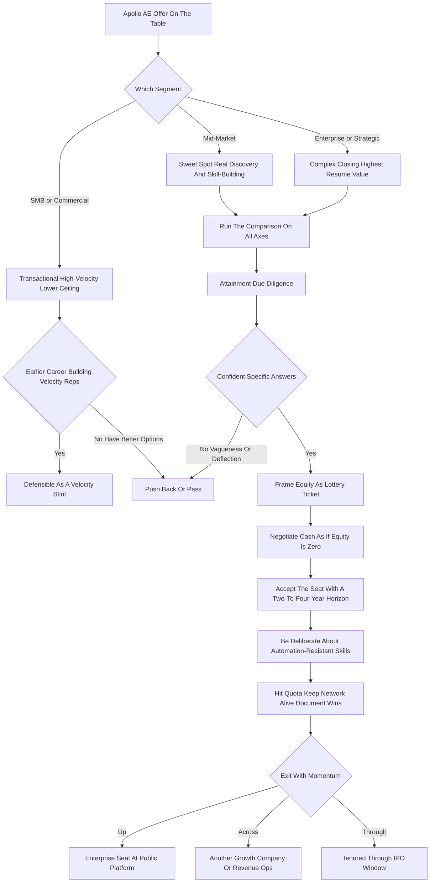

### Direct Answer

An Apollo AE role in 2027 is a **strong-but-volatile career bet that rewards a specific kind of seller inside a specific window** -- it is neither a safe long-term home nor a mistake. Take the seat if you can land in Mid-Market or Enterprise rather than the high-velocity SMB grind, you hold a deliberate two-to-four-year horizon, you treat the Series-D equity as a lottery ticket rather than a retirement plan, and you intend to use the role to compound transferable AI-GTM skills and a credible logo. Skip it if you are choosing between Apollo and a comparable seat at a durable public platform, if you need stability and predictable comp, or if you would default into the transactional SMB segment without negotiating hard for something better.

**TL;DR:** Apollo.io (founded 2015 as ZenProspect, CEO Tim Zheng) is a venture-backed sales-engagement-plus-data platform last marked near **$1.6B at its 2023 Series D** (Sequoia-led, with NEA, Tribe Capital, and Y Combinator in the cap table) and private revenue widely estimated at **$200M-$300M**. The honest 2027 read on AE on-target earnings: roughly **$150K-$220K for SMB/Commercial, $180K-$300K for Mid-Market, $260K-$420K for Enterprise, and $350K-$550K for Strategic**, with breakout-year top performers clearing **$450K-$700K** -- competitive for a Series-D-stage company, below the durable public platforms like Datadog (NASDAQ: DDOG), Snowflake (NYSE: SNOW), ServiceNow (NYSE: NOW), Workday (NASDAQ: WDAY), and MongoDB (NASDAQ: MDB) at the same seniority. The bull case: a product-led-growth funnel that hands AEs warm, product-qualified pipeline; a real product with genuine daily usage; an addressable 2026-2029 IPO window; and a category -- AI-assisted go-to-market -- that is expanding in total spend. The bear case: Apollo's category is being attacked on three fronts at once -- autonomous AI-SDR agents (11x, Artisan, Clay's agent stack, native Outreach and Salesloft AI), data commoditization (ZoomInfo, Cognism, Clay), and CRM-suite consolidation (Salesforce, HubSpot bundling "good enough" engagement). Three variables decide whether the seat works: **which segment you land in**, **whether Apollo ships AI fast enough to stay relevant**, and **whether you use the role to compound skill and reputation rather than just clip a year of comp**.

## What An Apollo AE Role Actually Is In 2027

An Account Executive seat at Apollo.io in 2027 is a quota-carrying closing role inside a venture-backed, product-led sales-engagement-and-data company that has grown past the existential startup phase but is not yet a stable public company. Understanding what that means is the foundation of evaluating it, because the seat is only as good as the company underneath it and the segment you are placed in.

### 1.1 The Product And The Distribution Model

**Apollo's product is a unified go-to-market platform.** It bundles a B2B contact-and-company database, an outbound sequencing and engagement engine, a Chrome and LinkedIn prospecting extension, conversation intelligence, and an expanding layer of AI features for research, list-building, and message generation. **The distribution model is product-led growth (PLG).** A very large free and low-cost self-serve base of individual sellers and small teams adopts the tool from the bottom up, and the sales organization exists to convert and expand the accounts where that bottom-up usage has reached enough scale to justify a contract, a security review, and a multi-seat deployment.

That PLG foundation is the single most important thing to understand about the AE role, because it shapes everything. An Apollo AE is not, for the most part, dialing strangers from a cold list. The AE works a blend of **product-qualified leads** -- accounts already using Apollo, where the job is to expand seats, move them to a higher tier, and lock in an annual contract -- and a smaller motion of **net-new outbound** into accounts that fit the profile.

### 1.2 What The Role Still Demands

The role still carries a number and still demands the full closing skill set: discovery, multi-threading, navigating procurement and security, building business cases, and forecasting. **The pipeline mix is friendlier than a pure cold-outbound seat**, and that is a genuine quality-of-attainment difference. But the closing discipline is identical to any enterprise software seat -- the PLG funnel changes where pipeline comes from, not how deals are won.

### 1.3 Why "Which Segment" Is The First Real Question

PLG companies segment aggressively. An Apollo AE in the high-velocity SMB or Commercial segment -- many small deals, short cycles, transactional motion -- has a fundamentally different job from one in Mid-Market or Enterprise, where deals are larger, cycles are longer, and the work looks like classic enterprise software selling. When someone asks whether "an Apollo AE role" is good for their career, the honest first answer is a question back: **which segment**, because the SMB seat and the Strategic seat at the same company are nearly different professions.

| Role Dimension | What It Means At Apollo | Career Implication |
|---|---|---|
| Pipeline source | Blend of product-qualified leads + net-new outbound | Friendlier than pure cold outbound |
| Quota structure | Number tied to segment; transaction count (SMB) vs deal value (Ent) | Segment determines the daily job |
| Skill built | Closing, multi-threading, expansion selling, AI-GTM fluency | Transferable if you land Mid-Market or above |
| Company stage | Series D private, ~$1.6B mark, real revenue | Past existential risk, not yet stable public |
| Equity | Options at 409A strike, four-year vest, one-year cliff | Illiquid, outcome-dependent |

## The Apollo Company Context: Stage, Backing, And Trajectory

Evaluating any AE role starts with an honest read of the company underneath it, because a seller's career is partly a portfolio of the logos and outcomes they attach themselves to. Apollo sits in a specific tier, and that tier carries specific risks and specific upside.

### 2.1 Stage And Backing

**Apollo.io was founded in 2015 as ZenProspect**, rebranded to Apollo, and is led by co-founder and CEO Tim Zheng. The company went through Y Combinator, raised through a Series D in 2023 that was led by Sequoia Capital with participation from NEA and Tribe Capital, and was valued at roughly **$1.6B** at that round. Revenue is private and therefore estimated rather than known -- industry estimates have generally placed it in the **$200M-$300M range**, growing -- and the company has publicly leaned into a narrative of efficient, product-led growth with a very large user base relative to its headcount.

### 2.2 The Tier Apollo Occupies

That profile -- Series D, unicorn valuation, PLG efficiency, real revenue, recognizable brand among sellers -- puts Apollo well past the existential-risk early stage, with a real product and real customers, but still private, still venture-funded, and still facing the two questions every company at this stage faces: **can it grow into and beyond its last valuation, and what is the eventual liquidity outcome.**

### 2.3 Why Trajectory Matters To An AE

For an AE, the trajectory read matters three ways. **First, comp durability:** a company growing into its valuation can hold and raise quotas-and-comp; a stalling one tends to cut territories, raise quotas, and churn AEs. **Second, equity outcome:** Series D options struck at a $1.6B valuation are only worth something if the eventual exit clears that bar with room to spare. **Third, resume value:** Apollo is a known name, and a strong tenure there is a credible logo -- but its weight depends partly on whether the company is seen as ascending or fading when you leave.

| Trajectory Signal | Healthy Read | Warning Read |
|---|---|---|
| Quota and comp | Held or raised year over year | Raised quotas, shrunk territories |
| Headcount | Steady or growing AE org | Recent RIFs, constant re-segmentation |
| Equity narrative | Transparent 409A, credible IPO path | Flat/down round, indefinite IPO delay |
| Brand perception | Seen as ascending in GTM circles | Seen as fading versus AI-native rivals |
| Product roadmap | Shipping AI features that land | AI roadmap mostly slideware |

The 2027 read: Apollo is a legitimate, real, mid-stage company -- neither a sure thing nor a sinking ship -- and the AE should size the role to that reality rather than to hype or fear. The deeper question of whether Apollo's sequencing survives the agent era is treated in its own entry (q1908).

## Apollo AE Compensation In 2027: The Honest Bands

Compensation is where a career decision becomes concrete, and an AE evaluating Apollo needs realistic, segment-specific numbers rather than a single headline figure.

### 3.1 The Segment Bands

Apollo, like most companies at its stage, does not publish detailed comp, so the bands below are synthesized from levels.fyi data points, RepVue self-reported ranges, LinkedIn salary inputs, and the general structure of Series-D PLG sales orgs. They are estimates -- a candidate should always verify the specific offer against the specific territory and quota. On-target earnings (OTE) is typically a 50/50 or 60/40 base-to-variable split.

| Segment | Est. Base | Est. OTE | Deal / Cycle Profile |
|---|---|---|---|
| SMB / Commercial AE | $110K-$140K | $150K-$220K | Many small deals, short cycles, transactional |
| Mid-Market AE | $120K-$160K | $180K-$300K | Larger deals, real discovery, the sweet spot |
| Enterprise AE | $140K-$180K | $260K-$420K | Complex multi-stakeholder, security reviews |
| Strategic AE | $160K-$200K | $350K-$550K | Largest accounts, longest cycles, highest ceiling |
| Top performers (MM/Ent, breakout year) | -- | $450K-$700K | With accelerators on over-attainment |

### 3.2 The Equity Component

Equity is granted as stock options struck at the prevailing 409A valuation, with a standard four-year vest and a one-year cliff. At a Series-D company the equity is real but illiquid and outcome-dependent. **The Apollo comp story is "good cash now, lottery-ticket equity, below the public-platform ceiling"** -- which is fine if you understand it and a trap if you joined expecting public-company economics.

### 3.3 The Honest Comparison

These bands are competitive for a Series-D PLG company and are genuinely good money, but they sit below the comp of a Strategic or Enterprise AE at a durable public platform -- Datadog (NASDAQ: DDOG), Snowflake (NYSE: SNOW), ServiceNow (NYSE: NOW), Workday (NASDAQ: WDAY), MongoDB (NASDAQ: MDB) -- where the same seniority can carry a higher OTE and, critically, liquid equity. A direct comparison appears in section 8. The all-axes comparison against a public-platform AE seat is the subject of its own entry (q1907).

## Segment Is Destiny: SMB Vs Mid-Market Vs Enterprise Vs Strategic

The single most consequential variable in whether an Apollo AE role is good for a career is the segment the AE lands in, because the four segments are nearly different jobs with different skills, different attainment dynamics, and different resume value.

### 4.1 The SMB / Commercial Segment

The SMB / Commercial segment is a **high-velocity, high-volume motion**: many small deals, short sales cycles, often a heavy renewal-and-expansion component on the PLG base, and a quota built on transaction count. It is a real job and a fine place to learn velocity and pipeline discipline, but **it builds a transactional skill set, the comp ceiling is the lowest, and burnout from the volume is real.**

### 4.2 The Mid-Market Segment

The Mid-Market segment is the **sweet spot for most sellers**: deals large enough to require genuine discovery, multi-threading, and business cases, cycles long enough to develop real enterprise-selling muscle, and a comp ceiling that rewards skill. This is the segment most candidates should be trying to land in.

### 4.3 The Enterprise Segment

The Enterprise segment is **classic complex software selling**: large multi-stakeholder deals, procurement and security and legal, six-to-twelve-month cycles, and a skill set that transfers cleanly to any enterprise software company afterward. The comp is strong and the resume value is highest.

### 4.4 The Strategic Segment

The Strategic segment is the **top of the pyramid** -- the biggest accounts, the longest cycles, the highest ceiling, and usually reserved for proven enterprise closers.

| Segment | Deal Size | Cycle Length | Skill Built | Resume Value | AI-Automation Exposure |
|---|---|---|---|---|---|
| SMB / Commercial | Small | Days to weeks | Transactional velocity | Lower | High |
| Mid-Market | Mid | 1-3 months | Discovery, multi-threading | Strong | Moderate |
| Enterprise | Large | 6-12 months | Complex closing, procurement | Highest | Low |
| Strategic | Largest | 9-18 months | Top-of-funnel orchestration | Highest | Low |

### 4.5 The Career Math

The career implication is direct: a candidate evaluating Apollo should be evaluating a **specific segment offer**, not "Apollo" in the abstract. An Enterprise or Mid-Market seat can be a genuinely good two-to-four-year move that builds transferable skill and a credible logo. An SMB seat is a more transactional, lower-ceiling, higher-churn-risk role that makes sense for an earlier-career seller building velocity reps but is harder to defend as a deliberate career step for someone with options. Same company, same logo, very different career math -- and the candidate who does not push hard to negotiate segment is leaving the most important variable to chance.

## The Bull Case: Why An Apollo AE Seat Can Be A Genuinely Good Move

There is a real, substantive case for taking an Apollo AE role in 2027, and a candidate should weigh it honestly rather than dismissing the company because it is not a public platform.

### 5.1 The PLG Pipeline Advantage

**Apollo's product-led model means a meaningful share of an AE's pipeline is product-qualified** -- accounts already using the tool, where the motion is expansion and conversion rather than cold demand generation. Selling into existing usage is structurally easier, less soul-crushing, and often higher-attainment than pure cold outbound, and that is a genuine quality-of-role advantage over a comparable seat at a company with no self-serve base.

### 5.2 A Real Product With Real Usage

**Apollo is not vaporware** -- it has a large, genuinely active user base, a product sellers actually use daily, and a brand recognized across the GTM world. Selling a product that works and that prospects already know is materially easier than selling a struggling one.

### 5.3 The Category Is Expanding

**AI-assisted go-to-market is a growing category, not a shrinking one** -- companies are spending more on the tooling that makes revenue teams efficient, and Apollo sits in the middle of that spend.

### 5.4 IPO Optionality

**A Series D in 2023 puts a plausible IPO window in the 2026-2029 range.** If Apollo executes and the window opens favorably, Series-D-era equity could become meaningfully valuable, and being a tenured, high-performing AE through an IPO is both a financial and a resume event.

### 5.5 Skill And Reputation Compounding

**An Apollo AE who lands in the right segment can build exactly the skill set the next decade of selling will reward** -- AI-assisted GTM, PLG-plus-sales-assisted motion, expansion selling -- and attach a recognizable logo to their resume.

### 5.6 The Comp Is Genuinely Good Cash

**Even below the public-platform ceiling, a Mid-Market or Enterprise Apollo OTE is strong income**, and for a seller who performs, the cash alone justifies the seat for a defined window.

| Bull-Case Pillar | Why It Holds | Who Benefits Most |
|---|---|---|
| PLG pipeline | Warm PQLs beat cold outbound | Every Apollo AE |
| Real product | Daily usage, recognized brand | Sellers who hate manufacturing demand |
| Growing category | Total AI-GTM spend rising | Sellers betting on the space |
| IPO optionality | 2026-2029 window plausible | Tenured high performers |
| Skill compounding | AI-GTM + PLG fluency | Mid-Market / Enterprise AEs |
| Good cash | Strong OTE for a Series-D firm | Proven closers |

The bull case is not "Apollo is a sure thing" -- it is "for the right seller, in the right segment, with the right horizon, this is a strong move."

## The Bear Case: The Three-Front Disruption Of Apollo's Category

The honest bear case is not about Apollo's execution -- it is about the category Apollo sits in being attacked from three directions at once, and a candidate must understand this because it is the single biggest risk to the seat's value.

### 6.1 Front One: Autonomous AI-SDR Agents

**Apollo's core product supports a human workflow** -- a human SDR or AE researching, list-building, sequencing, and sending. A wave of AI-agent products -- 11x, Artisan, Clay's agent stack, and the native AI being built into Outreach and Salesloft -- aims to automate that workflow end to end, so the buyer needs fewer human SDRs and a different kind of tool. If the human-SDR-supported workflow shrinks, demand for the product Apollo's AEs sell is structurally pressured, regardless of how well Apollo executes. The deeper analysis of what happens when AI agents replace SDR teams natively is its own entry (q1899).

### 6.2 Front Two: Data Commoditization

**Apollo's contact-and-company database competes directly with ZoomInfo (NASDAQ: ZI), Cognism, and Clay's enrichment stack**, and B2B data is commoditizing -- multiple credible sources, price compression, and AI-driven enrichment all push the data layer toward a low-margin utility. If the data half of Apollo's value proposition commoditizes, the company leans harder on the engagement-and-AI half exactly as that half is also under attack.

### 6.3 Front Three: CRM-Suite Consolidation

**Salesforce (NYSE: CRM) and HubSpot (NYSE: HUBS), the systems of record, are bundling "good enough" sequencing, engagement, and AI directly into the CRM.** For many buyers, a free-or-cheap engagement layer inside the CRM they already pay for beats a separate best-of-breed tool, and that bundling pressure has historically been brutal for standalone point solutions.

| Disruption Front | Attackers | What It Pressures | AE-Seat Risk |
|---|---|---|---|
| AI-SDR agents | 11x, Artisan, Clay | Demand for human-SDR tooling | Quota attainability, growth |
| Data commoditization | ZoomInfo, Cognism, Clay | The data-layer margin | Comp durability, pricing power |
| CRM consolidation | Salesforce, HubSpot | Standalone-tool justification | Win rate, deal defensibility |

None of this means Apollo fails -- the company has a real product, a strong PLG funnel, and a credible AI roadmap. But the bear case is that an Apollo AE is **selling into a category facing simultaneous pressure from automation, commoditization, and bundling**, and the seat's value -- comp durability, equity outcome, quota attainability -- is exposed to a transition the AE does not control. Join with eyes open, not because a recruiter said the category is "exploding."

## Apollo's Competitive Position: Who It Is Fighting And Where It Stands

A candidate should be able to map the competitive board precisely, because an AE's day-to-day attainment and the company's trajectory both depend on where Apollo actually stands.

### 7.1 The Competitive Fronts

**On engagement and sequencing**, Apollo competes with Outreach and Salesloft, the long-time category leaders, both privately held, both building native AI. **On B2B data**, Apollo competes with ZoomInfo (NASDAQ: ZI) -- the enterprise incumbent -- Cognism, strong in Europe, and Clay, the modern enrichment-and-agent darling. **On the emerging AI-SDR layer**, the competitors are 11x and Artisan, which sell autonomous-agent SDRs rather than tools for human SDRs. **On the suite side**, Salesforce (NYSE: CRM) and HubSpot (NYSE: HUBS) loom as the consolidating systems of record.

### 7.2 Apollo's Strategic Bet

**Apollo's strategic position is the unification bet:** be the single, affordable, PLG-distributed platform that does data plus engagement plus AI, so the buyer does not need ZoomInfo plus Outreach plus a separate AI tool. That bet has real merit -- bundling, price, and bottom-up distribution are genuine advantages, and Apollo's user base is large.

### 7.3 The Caught-In-The-Middle Risk

The risk is being caught in the middle: not the deepest data (ZoomInfo), not the most entrenched enterprise engagement (Outreach/Salesloft), not the most aggressive AI-agent vision (11x/Clay), and not the system of record (Salesforce/HubSpot).

| Competitive Layer | Apollo's Position | Primary Rivals |
|---|---|---|
| B2B data | Credible, broad, mid-depth | ZoomInfo, Cognism, Clay |
| Engagement / sequencing | Price-and-PLG wedge | Outreach, Salesloft |
| AI-SDR agents | Building, not leading | 11x, Artisan, Clay agents |
| System of record | Not a player; bundled against | Salesforce, HubSpot |
| Distribution | Genuine PLG strength | None match it at scale |

For an AE, the practical translation: in some deals Apollo's all-in-one value proposition wins cleanly, and in others the AE fights a best-of-breed or a bundled-in-CRM competitor. The competitive read is "credible contender with a real wedge, in a crowded and consolidating field" -- a fine place to sell from, as long as the AE is not betting their whole career on the outcome. A head-to-head buyer view of Apollo against ZoomInfo lives at q1109.

## The IPO Question And What Apollo Equity Is Actually Worth

Equity is the part of an Apollo offer most likely to be either oversold by a recruiter or misunderstood by a candidate, so it deserves a clear-eyed section.

### 8.1 The Mechanics

Apollo's equity grant to an AE is **stock options** -- the right to buy shares at a strike price set by the most recent 409A valuation -- with a standard four-year vest and a one-year cliff. The honest valuation framework: the options are worth the eventual per-share exit value minus the strike price, times the number of shares, minus taxes -- and every term in that equation is uncertain.

### 8.2 The Valuation Bar

Apollo was valued at roughly **$1.6B at its 2023 Series D**; for AE-level options struck around that era to be meaningfully valuable, the eventual outcome -- an IPO or an acquisition -- needs to clear that valuation with real room to spare, because options struck near the exit price are worth little.

### 8.3 The IPO Timing Question

A 2023 Series D puts a plausible public-offering window in the **2026-2029 range**, but "plausible window" is not "scheduled event" -- IPO timing depends on the company's growth, the market environment, and the board's choices, and down rounds, flat rounds, and indefinitely-delayed IPOs are all real outcomes in this category.

### 8.4 The Comp Comparison Table

A direct comparison of estimated Strategic and Enterprise AE economics across Apollo and the adjacent seats makes the trade-off concrete. The numbers are synthesized estimates from levels.fyi, RepVue, and LinkedIn salary data and should be verified against any specific offer, but the relative shape is the point.

| Company | Stage | Est. Enterprise AE OTE | Est. Strategic AE OTE | Equity Type | Moat Strength |
|---|---|---|---|---|---|
| Apollo.io | Series D private | $260K-$420K | $350K-$550K | Options (illiquid) | Moderate -- crowded category |
| Datadog (NASDAQ: DDOG) | Public | $300K-$480K | $400K-$650K | RSUs (liquid) | Strong -- platform + observability |
| Snowflake (NYSE: SNOW) | Public | $320K-$500K | $400K-$700K | RSUs (liquid) | Strong -- data network effects |
| ServiceNow (NYSE: NOW) | Public | $320K-$520K | $420K-$700K | RSUs (liquid) | Strong -- workflow system of record |
| MongoDB (NASDAQ: MDB) | Public | $300K-$460K | $350K-$600K | RSUs (liquid) | Strong -- developer mindshare |
| Workday (NASDAQ: WDAY) | Public | $280K-$440K | $320K-$520K | RSUs (liquid) | Strong -- HR/Finance lock-in |
| Outreach | Private (late) | $260K-$400K | $340K-$520K | Options (illiquid) | Moderate -- engagement incumbent |
| 11x | Early/growth | $200K-$340K | n/a | Options (very illiquid) | Unproven -- AI-agent bet |

### 8.5 The Practical Guidance

Treat Apollo equity as a **lottery ticket with a real but unquantifiable expected value**, not as a number you can spend. Negotiate the cash -- base and OTE -- as if the equity were worth zero. If the equity pays off, it is upside; if it does not, you were still paid a strong cash comp. The candidates who get burned took a below-market cash offer "because of the equity upside" and then watched a flat round or a stalled IPO turn the upside into nothing.

## Adjacent Seats: How Apollo Compares To The Durable Public Platforms

A career decision is comparative -- the right question is not "is Apollo good" in isolation but "is Apollo good relative to the candidate's other options."

### 9.1 The Public-Platform Profile

The public-platform tier -- Datadog (NASDAQ: DDOG), Snowflake (NYSE: SNOW), ServiceNow (NYSE: NOW), Workday (NASDAQ: WDAY), MongoDB (NASDAQ: MDB) -- offers a different risk-reward profile: **higher comp ceilings at the same seniority, liquid equity (RSUs you can actually sell), more mature enablement and ramp infrastructure, more predictable territories, and a wider competitive moat that makes quota attainment more durable.**

### 9.2 The Trade-Off

The trade-off is that these are large, established organizations -- less equity upside, less of the scrappy build-it culture, and a more process-heavy environment. The Apollo seat trades that durability for PLG-pipeline quality, IPO optionality, a faster-moving environment, and a chance to be early in a growing category.

### 9.3 Running The Comparison On The Right Axes

The mistake is comparing them on the wrong axis -- comparing Apollo's headline OTE to a public platform's and concluding Apollo is "competitive," when the real comparison includes equity liquidity, moat durability, enablement quality, and territory stability.

| Comparison Axis | Apollo AE Seat | Public-Platform AE Seat |
|---|---|---|
| Comp ceiling | Strong for stage, below public top | Higher at same seniority |
| Equity | Illiquid options | Liquid RSUs |
| Moat / attainment durability | Moderate, crowded category | Wider moat, steadier quota |
| Enablement / ramp | Thinner, Series-D maturity | Mature, structured |
| Territory stability | Variable, PLG-dependent | More predictable |
| Upside | IPO optionality | Limited, already public |
| Culture | Faster, scrappier | More process-heavy |

For a seller who is mid-career, performs well, and wants durable comp and liquid equity, the public platform is usually the more defensible choice. For a seller who wants to bet on upside, build AI-GTM skills early, and is comfortable with a two-to-four-year volatile window, Apollo is a legitimate choice. The full all-axes comparison against a Datadog-tier seat is its own deep dive (q1907), and parallel AE-career analyses exist for Salesforce (q1894), HubSpot (q1915), and Snowflake (q1591).

## Quota Attainment And The Reality Of The Number

Comp bands are only meaningful next to attainment reality, because an OTE the AE never hits is just a base salary with a sad story attached.

### 10.1 What Drives Attainment

The honest framework: attainment depends on segment, territory quality, the PQL-to-cold pipeline mix, and the company's overall trajectory. In a healthy PLG segment with a real product-qualified-lead flow, attainment can be genuinely good -- selling into existing usage is structurally higher-conversion than cold outbound.

### 10.2 What Compresses Attainment

Several factors can compress attainment, and a candidate should probe each one. **Territory quality:** in PLG companies, the difference between a territory dense with active Apollo users and a thin one is enormous, and new AEs sometimes inherit picked-over patches. **Quota inflation:** companies under growth pressure raise quotas faster than territory potential grows, quietly turning a 100%-attainment seat into a 70%-attainment seat. **The category headwind:** if the three-front disruption pressures Apollo's growth, the company's response is often to raise quotas and shrink territories, and the AE absorbs that. **Ramp and enablement:** a Series-D company's enablement is usually less mature than a public platform's.

| Attainment Factor | Healthy Sign | Red Flag |
|---|---|---|
| Team quota attainment | 50-60%+ hitting number | Vague answer or low number |
| Territory | Defined, dense with users | Thin, picked-over, undefined |
| Pipeline mix | Real PQL flow for the segment | "Mostly cold outbound" |
| Ramp / enablement | Structured, documented | "You'll figure it out" |
| Org stability | Steady or growing headcount | Recent RIFs, churn |

### 10.3 The Due-Diligence Ask

In the interview, ask what percentage of the AE team hit quota last year and the year before, how territories are assigned and how this specific territory has performed, and what the PQL-to-net-new pipeline mix actually is. A confident, specific answer is a good sign; vagueness or deflection is a real red flag. The number on the offer letter is a hypothesis -- attainment data is the test of it. The parallel "will AEs hit quota" analyses for the engagement incumbents -- Outreach (q1765) and Salesloft (q1824) -- are useful comparison reading.

## The AI-SDR Disruption And What It Means For The Seller, Not Just The Company

The rise of autonomous AI-SDR agents matters to an Apollo AE on two distinct levels, and a candidate should think about both.

### 11.1 Level One: The Company Risk

The company risk was covered in the bear case: AI agents that automate the human-SDR workflow pressure demand for the tools that support that workflow. This is the same pressure that is visibly pulling AE talent away from the engagement incumbents toward AI-native competitors (q1758).

### 11.2 Level Two: The Seller's Own Career Risk And Opportunity

As AI agents take over more of the top-of-funnel research, list-building, and initial outreach, **the human selling role concentrates upward**: the activities that survive and become more valuable are discovery, multi-threading, business-case construction, navigating complex buying committees, negotiation, and the judgment-and-relationship work that agents do not do well.

### 11.3 Why The Seat Choice Decides The Exposure

An Apollo AE seat in the Mid-Market or Enterprise segment is, conveniently, a seat that builds exactly those surviving skills -- it is a closing role, not an SDR role, and the closing skill set is the one the AI transition rewards. An Apollo AE seat in the high-velocity SMB segment is more exposed, because transactional, high-volume selling is closer to the kind of motion automation pressures.

| Seat Type | AI-Automation Exposure | Skills It Builds | Career Verdict |
|---|---|---|---|
| Enterprise / Strategic AE | Low | Complex closing, orchestration | Automation-resistant |
| Mid-Market AE | Moderate | Discovery, multi-threading | Largely durable |
| SMB / Commercial AE | High | Transactional velocity | Most exposed |

Same wave, opposite implications, depending on the seat.

## Career Skill-Building: What An Apollo Seat Actually Teaches You

A role's resume line is only half its value -- the other half is the skill set it builds.

### 12.1 The Transferable, Automation-Resistant Skills

**PLG-plus-sales-assisted motion** -- learning to work product-qualified pipeline, convert and expand existing usage, and partner with a self-serve funnel is an increasingly common GTM model. **AI-assisted GTM fluency** -- Apollo is building AI into its product and its sellers use AI tooling daily, so the seat builds practical fluency in how AI changes the selling workflow. **Expansion and land-and-expand selling** -- the PLG model is fundamentally about expanding accounts, and expansion selling is a durable, valued skill. **Selling to revenue leaders** -- Apollo's buyers are sales and GTM leaders, so the AE builds fluency in the revenue-operations buyer.

### 12.2 The Enterprise-Specific Skills

In the Enterprise and Strategic segments specifically, the seat also builds the **classic complex-deal skill set** -- multi-threading, procurement, security, business cases -- that transfers to any enterprise software company.

### 12.3 What The Seat Builds Less Well

The seat builds less well: deep vertical or domain specialization (Apollo is horizontal), and -- in the SMB segment -- anything beyond transactional velocity.

| Skill | Where It Is Built | Transferability |
|---|---|---|
| PLG + sales-assisted motion | All segments | High -- common GTM model |
| AI-GTM fluency | All segments | High -- forward-looking |
| Expansion / land-and-expand | All segments, esp. SMB renewals | High |
| Complex closing | Enterprise / Strategic only | High -- any enterprise SaaS |
| Vertical / domain depth | Not really built (horizontal) | Low |

A candidate should take an Apollo seat partly for the skills it builds, choose the segment accordingly, and be deliberate about developing transferable, automation-resistant capabilities rather than just clipping deals. A seat used well becomes a skill-compounding engine; a seat used passively becomes just a resume line and a year of comp.

## The Right Horizon: Why Apollo Is A Two-To-Four-Year Seat, Not A Career Home

One of the most important and least discussed parts of evaluating an Apollo AE role is matching it to the right time horizon.

### 13.1 The Two-To-Four-Year Window

An Apollo AE role in 2027 is a strong **two-to-four-year** move and a questionable twenty-year one. In a two-to-four-year window, a performing AE in the right segment can build the PLG and AI-GTM skill set, attach a recognized logo to their resume, earn strong cash comp, hold a lottery ticket on the equity through a possible IPO window, and exit with momentum into either a public platform, a leadership track, or another growth company.

### 13.2 Why The Twenty-Year Math Changes

Over a twenty-year horizon, the calculus changes -- the category disruption risk compounds, the equity outcome resolves one way or the other, and a seller's career is better served by a portfolio of moves than by a long tenure at a single mid-stage company whose category is in transition.

### 13.3 Who The Horizon Framing Sorts In And Out

A mid-career seller looking for a deliberate two-to-four-year skill-and-logo-and-comp move: good fit. A seller looking for a stable, durable, predictable career home: poor fit -- a public platform serves them better. An early-career seller: it depends heavily on segment and enablement quality.

| Candidate Profile | Apollo Fit | Better Alternative If Poor Fit |
|---|---|---|
| Mid-career, wants skill+logo+comp window | Good fit | -- |
| Needs stability and predictable comp | Poor fit | Durable public platform |
| Early-career, needs structured development | Conditional | Depends on segment + enablement |
| Wants maximum equity upside, risk-tolerant | Good fit | -- |

The candidate who internalizes "this is a two-to-four-year seat" makes better decisions inside the role too -- harder negotiation upfront, deliberate skill-building, network kept alive. The seat is a chapter, not the book.

## Red Flags To Probe In The Apollo Interview Process

A candidate evaluating an Apollo AE offer has more leverage and more information available than they usually use, and the interview process is the place to surface the factors that decide whether the seat works out.

### 14.1 The Questions That Matter

**"What percentage of the AE team hit quota last year and the year before?"** -- a confident, specific number above roughly 50-60% is healthy; vagueness, deflection, or a low number is a serious flag. **"How are territories assigned, and how has this specific territory performed historically?"** -- a clear answer about a real, defined territory is good; a thin or picked-over or undefined territory is a flag. **"What is the actual pipeline mix between product-qualified leads and net-new outbound for this segment?"** -- the PLG pipeline advantage is real only if the PQL flow is real. **"What does the ramp look like, and what is enablement like for a new AE?"** -- mature ramp and enablement is good; "you'll figure it out, we move fast" is a flag. **"How has the AE org's headcount and structure changed over the last 18 months?"** -- steady or growing is good; recent layoffs or constant re-segmentation is a flag.

### 14.2 The Category And Equity Questions

**"How does leadership talk about the AI-agent competitive threat?"** -- a thoughtful, specific answer is reassuring; dismissiveness or hand-waving suggests leadership is not honest about the category. **"What is the equity grant, the strike price, and the current 409A valuation?"** -- a transparent answer lets the candidate value the equity honestly; reluctance to share is itself informative.

| Interview Question | Healthy Answer | Red-Flag Answer |
|---|---|---|
| AE quota attainment rate | Specific, 50-60%+ | Vague or low |
| Territory assignment | Defined, real, dense | Thin, picked-over, undefined |
| PQL vs cold pipeline mix | Real PQL flow named | "Mostly cold outbound" |
| Ramp and enablement | Structured, documented | "You'll figure it out" |
| AE headcount trend | Steady or growing | Recent RIFs, churn |
| AI-agent threat framing | Thoughtful, specific | Dismissive, hand-waving |
| Equity / 409A transparency | Full grant details shared | Reluctance to disclose |

The throughline: treat the interview as your due diligence on the company, not just its evaluation of you -- the specificity of the answers is itself one of the most useful signals about whether this is a healthy seat.

## Five Named Real-World Scenarios

Concrete scenarios make the decision tangible.

### 15.1 Priya -- The Deliberate Mid-Market Move

A seller with four years of SaaS AE experience takes an Apollo Mid-Market seat with a strong, defined territory and a real PQL flow. She treats it explicitly as a three-year window, negotiates the cash hard and the equity as upside, builds genuine AI-GTM and expansion-selling skill, hits quota two of three years, and exits into an Enterprise seat at a public platform with a credible logo and a sharper skill set -- the seat worked exactly as a two-to-four-year move should.

### 15.2 Marcus -- The Cautionary Tale

A seller takes a below-market cash offer for an SMB Apollo seat "because of the equity upside," lands in a thin, picked-over territory, grinds a high-volume transactional motion, watches a flat funding round quietly zero out the equity narrative, and leaves after fourteen months with a transactional skill set and a resume line that does not differentiate him -- the canonical illustration of joining for the wrong reasons in the wrong segment.

### 15.3 Dana -- The IPO-Window Bet

A strong Enterprise closer joins Apollo specifically as an upside bet, performs well, is tenured through a favorable IPO window, and the equity becomes genuinely meaningful while the public-company logo lifts her next move -- the bull case landing the way it can when execution and timing cooperate.

### 15.4 Tomas -- The Comparison Decision

A mid-career seller weighs an Apollo Enterprise offer against a Datadog (NASDAQ: DDOG) Enterprise offer, runs the comparison on all axes -- comp ceiling, equity liquidity, moat durability, enablement, territory stability -- concludes the public platform is the more defensible choice for his stage and risk tolerance, and takes Datadog. Apollo was a legitimate option, but the comparison was clear once run honestly.

### 15.5 Aisha -- The Skills-First Framing

An early-career-to-mid seller takes an Apollo Mid-Market seat primarily to build PLG and AI-GTM fluency, is deliberate about skill development inside the role, treats the comp as good but secondary, and exits in three years not with a fortune but with exactly the forward-looking skill set the next decade rewards -- the seat used as a skill-compounding engine.

| Scenario | Segment | Reason For Joining | Outcome |
|---|---|---|---|
| Priya | Mid-Market | Deliberate skill+logo+comp window | Strong -- exited up |
| Marcus | SMB | Equity upside at below-market cash | Poor -- thin story |
| Dana | Enterprise | Upside bet on the IPO window | Strong -- equity paid |
| Tomas | Enterprise (declined) | Compared and chose public platform | Apollo was a fine pass |
| Aisha | Mid-Market | Skills-first framing | Strong -- skill compounding |

These five span the realistic distribution of outcomes.

## Geography, Remote Work, And The Apollo Seat

Where an AE is based shapes the value of an Apollo seat.

### 16.1 The Comp Dimension

Apollo, like many PLG-era companies, runs a substantially distributed and remote-friendly sales organization. Distributed companies sometimes geo-adjust pay, so an AE in a lower-cost metro may see a band somewhat below the headline, while one in a major hub may see the top of it; the candidate should confirm whether the offer is geo-adjusted.

### 16.2 The Development Dimension

A remote AE seat puts more of the responsibility for skill-building, visibility, and mentorship on the seller -- the structured in-office enablement and the ambient learning from sitting next to strong closers is thinner, and the candidate has to be deliberate about seeking development and visibility.

### 16.3 Lifestyle And Network

A remote Apollo seat offers genuine flexibility, but PLG enterprise selling still involves travel for the larger deals -- fully-remote does not mean no travel. A distributed seat can either broaden a network (working across geographies) or thin it (less in-person density), depending on how the seller works it.

| Geography Factor | Benefit | Cost |
|---|---|---|
| Comp | Hub AEs may see top of band | Geo-adjusted bands can trim pay |
| Development | Flexibility, autonomy | Thinner ambient mentorship |
| Lifestyle | Real flexibility | Travel still required for big deals |
| Network | Cross-geography reach | Less in-person density |

The remote-friendly seat is a genuine quality-of-life benefit, but it shifts the burden of career development onto the AE.

## Building The Exit Before You Take The Seat

The best time to think about how an Apollo AE seat ends is before it begins, because a seat used well is one the seller exits from with momentum.

### 17.1 The Exit Paths

**Up into a public platform** -- a performing Apollo Enterprise or Mid-Market AE with a credible logo and a sharpened skill set is a strong candidate for an Enterprise or Strategic seat at a Datadog-tier company. **Into sales leadership** -- a high performer can move toward team lead, manager, or director. **Into another growth company** -- the PLG and AI-GTM skill set transfers well. **Into revenue operations or enablement** -- the fluency with the GTM-leader buyer opens adjacent roles. **Through an IPO** as a tenured employee -- both a financial and a resume event.

### 17.2 What Keeps The Exits Open

Hit quota, because attainment is the currency that makes every exit possible; be deliberate about building transferable, automation-resistant skills rather than just clipping deals; keep the network alive -- stay in touch with the broader GTM community, not just the Apollo bubble; document wins and skills as they happen; and treat the seat as a defined chapter with a purpose.

| Exit Path | What It Requires | Timing |
|---|---|---|
| Up to a public platform | Quota + credible logo + skill | Year 2-4 |
| Into sales leadership | Top performance + leadership signal | Year 2-4 |
| To another growth company | Transferable PLG + AI-GTM skill | Anytime after ramp |
| Into RevOps / enablement | GTM-buyer fluency | Year 2+ |
| Through an IPO | Tenure + the window opening | Window-dependent |

The seller who joins Apollo with the exit already in mind makes better decisions throughout. The exit is built during the seat, not at the end of it.

## A Decision Framework: Should You Actually Take The Apollo AE Seat

Pulling the analysis into a structured self-assessment.

### 18.1 The Seven Questions

**Segment:** is the offer for Mid-Market, Enterprise, or Strategic -- or is it SMB? **Horizon:** are you looking for a two-to-four-year skill-logo-comp move, or a stable long-term home? **Equity framing:** can you treat the equity as a lottery ticket and negotiate the cash as if the equity were worth zero? **Comparison:** what are your other options, and have you compared them on all axes -- comp ceiling, equity liquidity, moat durability, enablement, territory stability -- not just headline OTE? **Attainment due diligence:** did the interview process give you confident, specific answers on quota attainment, territory quality, and pipeline mix? **Skill intent:** will you be deliberate inside the role about building the transferable, automation-resistant skill set? **Category clarity:** do you understand the three-front disruption Apollo's category faces?

| Decision Question | "Take It" Answer | "Pause Or Pass" Answer |
|---|---|---|
| Segment | Mid-Market, Enterprise, Strategic | Default SMB, no negotiation |
| Horizon | Deliberate 2-4 year window | Seeking a permanent home |
| Equity framing | Lottery ticket; cash negotiated to zero | Joining for the upside at low cash |
| Comparison | Run on all axes | Headline OTE only |
| Attainment data | Confident, specific | Vague, deflected |
| Skill intent | Deliberate skill-building | Just clipping deals |
| Category clarity | Understands three-front risk | "Category is exploding" pitch |

### 18.2 The Verdict The Framework Produces

A candidate who lands in the right segment, holds the right horizon, frames the equity correctly, has run the comparison honestly, got specific attainment answers, intends to build skills deliberately, and understands the category risk -- for that candidate, an Apollo AE role in 2027 is a legitimate and potentially strong move. A candidate who is in SMB by default, joined for the equity upside at a below-market cash number, did not run the comparison, got vague attainment answers, and is hazy on the category risk -- that candidate should pause, push back, or pass.

## The Career Decision Journey: From Offer To Exit

## Common Mistakes Candidates Make Evaluating This Seat

Most bad outcomes with an Apollo AE role trace to a short list of avoidable evaluation mistakes, and naming them is the cheapest insurance a candidate can buy.

### 19.1 The Evaluation Mistakes

**Evaluating "Apollo" instead of the specific segment offer** -- treating the SMB and the Enterprise seat as the same decision when they are nearly different professions. **Joining for the equity upside at a below-market cash number** -- taking a comp haircut "because of the upside" and watching a flat round turn the upside to nothing. **Comparing on headline OTE alone** -- concluding Apollo is "competitive" by matching OTE numbers while ignoring equity liquidity, moat durability, enablement quality, and territory stability. **Skipping the attainment due diligence** -- accepting a number on an offer letter as a fact rather than a hypothesis.

### 19.2 The Framing Mistakes

**Believing the "category is exploding" pitch uncritically** -- joining on a recruiter's optimism without understanding the three-front disruption. **Ignoring territory quality** -- not realizing that in a PLG company the difference between a dense and a picked-over territory is enormous. **Treating the seat as permanent** -- settling in without an exit plan. **Not being deliberate about skills** -- clipping deals for a year or two without building automation-resistant capabilities. **Underrating segment negotiation** -- accepting whatever segment is offered. **Letting the recruiter set the frame** -- evaluating the seat on the company's terms rather than running an independent analysis.

| Mistake | Consequence | Fix |
|---|---|---|
| Evaluating "Apollo" not the segment | Wrong-job surprise | Negotiate and confirm segment |
| Joining for equity at low cash | Flat-round wipeout | Negotiate cash to equity-zero |
| Headline-OTE comparison | Hidden downgrade | Compare all axes |
| Skipping attainment diligence | OTE never materializes | Ask the hard questions |
| Believing the "exploding" pitch | Blindsided by category shift | Understand three-front risk |
| Ignoring territory quality | Thin patch, low attainment | Ask about the specific territory |
| Treating the seat as permanent | Exit on company's timing | Build exit from day one |
| Not deliberate about skills | Just a resume line | Target automation-resistant skills |

Every one of these is avoidable; the candidates who do well treated this list as a pre-decision checklist.

## The 2027-2030 Outlook For The Apollo Seat And The Category

A candidate making a multi-year career bet should have a view on where this goes.

### 20.1 What Is Reasonably Clear

**The AI-GTM category keeps growing in total spend** -- companies will spend more, not less, on the tooling that makes revenue teams efficient. **The reshaping is real and accelerating** -- autonomous AI-SDR agents, data commoditization, and CRM-suite consolidation will all intensify, and the standalone sales-engagement-plus-data category will look different by 2030 than it does in 2027. **The human selling role concentrates upward** -- top-of-funnel automation pushes the durable human value into complex closing, multi-threading, business-case work, and judgment. **Comp for proven closers stays strong** -- the sellers who can close complex deals remain scarce and well-paid. **The IPO question resolves somewhere in this window** -- a 2023 Series D means the 2026-2029 range is when an outcome likely becomes clear.

| 2027-2030 Trend | Direction | Implication For The Seat |
|---|---|---|
| Total AI-GTM spend | Up | Category is expanding, not dying |
| Category reshaping | Accelerating | Standalone tools must adapt fast |
| Human-role concentration | Upward | Enterprise/MM skills gain value |
| Closer comp | Stays strong | Proven closers remain well-paid |
| IPO resolution | Within window | Equity outcome becomes knowable |

### 20.2 The Net Outlook

An Apollo AE seat is a bet on a real company in a growing-but-reshaping category, and the seat's value over 2027-2030 depends on landing in the right segment, building the durable upward-concentrating skills, and treating the role as a defined two-to-four-year chapter rather than a permanent home. The category is not dying and Apollo is not doomed -- but neither is a safe, static, set-and-forget career home.

## The Final Framework: Taking The Apollo AE Seat The Right Way

Pulling the entire analysis into a single operating framework: a seller who wants to evaluate and -- if it fits -- take an Apollo AE role in 2027 the right way should execute in this order.

### 21.1 The Nine-Step Operating Order

**First, get honest about your own horizon and risk tolerance** -- this is a two-to-four-year, volatile, upside-tilted seat, not a stable long-term home. **Second, fight for the segment** -- Mid-Market, Enterprise, or Strategic is a far more defensible career step than SMB. **Third, run the comparison on all axes** -- comp ceiling, equity liquidity, moat durability, enablement quality, and territory stability, not just headline OTE. **Fourth, do the attainment due diligence** -- ask what percentage of AEs hit quota, how territories are assigned, and what the real pipeline mix is. **Fifth, frame the equity as a lottery ticket** -- negotiate the cash as if the equity were worth zero. **Sixth, understand the category risk** -- internalize the three-front disruption. **Seventh, be deliberate about skills from day one** -- build complex closing, PLG-plus-sales-assisted motion, AI-GTM fluency, and expansion selling. **Eighth, build the exit before you take the seat** -- know the paths out and do the things that keep them open. **Ninth, treat the interview as your due diligence** -- the specificity and honesty of the answers is itself a signal.

| Step | Action | Why It Matters |
|---|---|---|
| 1 | Set honest horizon and risk tolerance | Sorts in the right candidate |
| 2 | Fight for the segment | The single most consequential variable |
| 3 | Run the all-axes comparison | Avoids the hidden downgrade |
| 4 | Do attainment due diligence | Tests the OTE hypothesis |
| 5 | Frame equity as a lottery ticket | Prevents the flat-round trap |
| 6 | Understand the category risk | Joins with eyes open |
| 7 | Build skills deliberately | Turns the seat into a compounding engine |
| 8 | Build the exit from day one | Exits with momentum |
| 9 | Treat the interview as diligence | Reads the company honestly |

### 21.2 The Honest Verdict

Do these nine things in this order and an Apollo AE role in 2027 can be a genuinely strong, skill-compounding, well-paid two-to-four-year career chapter. Skip the discipline -- default into SMB, join for the equity, skip the comparison and the due diligence, treat it as permanent -- and it becomes a transactional year or two, a flat-round equity story, and a resume line that does not differentiate. **The Apollo AE seat is neither a dream job nor a mistake.** It is a real, specific role at a real, mid-stage company in a real, reshaping category, and in 2027 it rewards exactly one kind of candidate: the deliberate one who lands in the right segment, holds the right horizon, frames the equity honestly, and uses the seat to compound skills and reputation rather than just clip a year of comp.

## Counter-Case: Why An Apollo AE Role In 2027 Might Be The Wrong Move

The analysis above describes a seat that can be a genuinely good two-to-four-year career chapter, but a serious candidate must stress-test that conclusion against the conditions that make this role a poor bet. There are real reasons to pass.

### 22.1 Category, Comp, And Equity Risks

**Counter 1 -- The category is under simultaneous attack from three directions.** Apollo sits in the sales-engagement-plus-data category, and that category is being pressured at the same time by autonomous AI-SDR agents, data commoditization, and CRM-suite bundling. A candidate joining Apollo is joining a company whose entire category is in transition.

**Counter 2 -- The comp ceiling sits below the durable public platforms.** An Apollo Enterprise or Strategic OTE is good money, but it is below what the same seniority earns at Datadog (NASDAQ: DDOG), Snowflake (NYSE: SNOW), ServiceNow (NYSE: NOW), or MongoDB (NASDAQ: MDB) -- and those companies also offer liquid RSU equity instead of illiquid options.

**Counter 3 -- The equity is an illiquid lottery ticket, not a number you can spend.** Options struck around a $1.6B Series D valuation are worth something only if the eventual exit clears that bar with real room to spare. A flat round, a down round, or an indefinitely-delayed IPO are all genuine outcomes.

### 22.2 Segment, Enablement, And Quota Risks

**Counter 4 -- Segment roulette can land you in the transactional SMB grind.** A candidate who does not aggressively negotiate segment can end up in a high-velocity, transactional, lower-ceiling role that builds exactly the kind of selling motion AI automation most threatens.

**Counter 5 -- Series-D enablement is thinner than a public platform's.** A company at Apollo's stage usually has less mature ramp, enablement, and development infrastructure. For an earlier-career seller, "you'll figure it out, we move fast" is a real cost.

**Counter 6 -- Quota inflation and territory thinning are the standard response to growth pressure.** If the category headwinds pressure Apollo's growth, the typical response is to raise quotas and shrink territories -- and the AE absorbs that as lower attainment on the same effort.

### 22.3 Narrative, Stability, And Alternative Risks

**Counter 7 -- The "category is exploding" pitch obscures the reshaping.** Total category growth and a specific company's durability are different things, and the pitch conflates them.

**Counter 8 -- It is a volatile seat, not a stable home.** For a seller who needs predictable comp, a durable employer, and stability, the Apollo seat is simply the wrong instrument.

**Counter 9 -- The logo's weight depends on the company's trajectory at exit.** Resume value is not static -- a logo's weight depends partly on whether the company is seen as ascending or fading when the seller leaves.

**Counter 10 -- Adjacent roles may build a more durable career.** A seller drawn to the AI-GTM space might be better served by an Enterprise seat at a durable platform that is adding AI, or by a role at the system-of-record layer that is doing the consolidating.

| Counter | Core Risk | Who Should Heed It Most |
|---|---|---|
| 1 | Three-front category disruption | Anyone betting long-term |
| 2 | Below-public comp ceiling | Sellers with a public offer in hand |
| 3 | Illiquid lottery-ticket equity | Anyone joining for the upside |
| 4 | SMB segment roulette | Candidates not negotiating segment |
| 5 | Thin Series-D enablement | Early-career sellers |
| 6 | Quota inflation, territory thinning | Anyone in a pressured segment |
| 7 | Misleading "exploding" pitch | Recruiter-led candidates |
| 8 | Volatility, not stability | Sellers needing predictable comp |
| 9 | Trajectory-dependent logo value | Anyone counting on the resume line |
| 10 | Stronger adjacent options exist | AI-GTM-focused sellers |

### 22.4 The Honest Verdict

Taking an Apollo AE role in 2027 is a reasonable choice for a seller who can land in Mid-Market, Enterprise, or Strategic rather than SMB, holds a deliberate two-to-four-year horizon, can treat the equity as a lottery ticket, has run an honest all-axes comparison, got specific attainment answers, and will be deliberate about building transferable, automation-resistant skills. It is a poor choice for anyone choosing between Apollo and a comparable durable-public-platform seat, anyone who needs stability and predictable comp, anyone who would default into the SMB segment, and anyone joining on a recruiter's "the category is exploding" pitch without understanding the three-front disruption. The seat is not a mistake and not a dream job -- it is a specific instrument for a specific seller in a specific window.

## Related Pulse Library Entries

The following sibling entries extend the analysis above. Each is its own deep dive.

- The direct sales-engagement-incumbent comparison seat -- whether an Outreach AE role is still a good career bet (q1761).
- The other engagement-incumbent parallel -- whether a Salesloft AE role still holds up for a career in 2027 (q1820).
- The durable public-platform alternative and all-axes comparison anchor -- the Datadog AE-career analysis (q1907).
- The CRM-suite-side AE-career comparison -- whether a HubSpot AE role is still good in 2027 (q1915).
- The Front-1 disruption thesis in depth -- what replaces SDR teams if AI agents replace SDRs natively (q1899).
- The company-trajectory question behind the seat -- what replaces Apollo sequencing if AI agents handle outbound in 2027 (q1908).
- The buyer-side view of Apollo's competitive position -- evaluating Apollo versus ZoomInfo for an outbound team (q1109).
- The talent-flow signal driving the bear case -- why the engagement incumbents are losing AE talent to AI-native competitors (q1758).
- A parallel system-of-record AE-career analysis -- whether a Salesforce AE role is still good in 2027 (q1894).

## Sources

1. **Apollo.io -- Company Site, Product, and Newsroom** -- Primary reference for product scope, positioning, and company milestones. https://www.apollo.io
2. **Crunchbase -- Apollo.io Funding and Investor Profile** -- Series D round, valuation, and investor list (Sequoia, NEA, Tribe Capital, Y Combinator). https://www.crunchbase.com/organization/apollo-io
3. **PitchBook -- Apollo.io Private Company Profile** -- Valuation history and private-company financial estimates.
4. **Sequoia Capital -- Portfolio and Investment Commentary** -- Lead investor in Apollo's Series D; context on the investment thesis. https://www.sequoiacap.com
5. **levels.fyi -- Sales Compensation Data** -- Self-reported AE compensation data points used to triangulate comp bands. https://www.levels.fyi
6. **RepVue -- Sales Org Ratings and Compensation Ranges** -- Crowd-sourced AE OTE ranges and quota-attainment sentiment by company. https://www.repvue.com
7. **LinkedIn Salary and Job Listings** -- AE base, OTE, and segment-structure reference points across SaaS sales orgs.
8. **Glassdoor -- Apollo.io and Comparable Company Reviews** -- Employee-reported compensation and culture context. https://www.glassdoor.com
9. **The Bridge Group -- SaaS AE Metrics and Sales Development Reports** -- Benchmark data on AE ramp, quota, attainment, and pipeline structure. https://www.bridgegroupinc.com
10. **Pavilion -- Revenue Leadership Community Benchmarks** -- GTM compensation, hiring, and org-structure benchmarks for revenue roles. https://www.joinpavilion.com
11. **US Bureau of Labor Statistics -- Sales Occupations Data** -- Wholesale and software sales occupation wage and outlook data. https://www.bls.gov
12. **Gartner -- Sales Technology and Revenue Enablement Research** -- Category analysis on sales engagement, B2B data, and AI in go-to-market. https://www.gartner.com
13. **Forrester -- B2B Sales and Marketing Technology Coverage** -- Research on sales-engagement platforms and the AI-SDR category. https://www.forrester.com
14. **G2 -- Sales Engagement and B2B Data Software Category Pages** -- Competitive landscape, user reviews, and category positioning for Apollo and rivals. https://www.g2.com
15. **ZoomInfo -- Investor Relations and Product Site** -- Primary competitor on the B2B data side; public-company financials for category context. https://www.zoominfo.com
16. **Outreach -- Company and Product Site** -- Sales-engagement incumbent and direct competitor. https://www.outreach.io
17. **Salesloft -- Company and Product Site** -- Sales-engagement incumbent and direct competitor. https://salesloft.com
18. **Clay -- Company and Product Site** -- Modern enrichment and agent-framework competitor. https://www.clay.com
19. **Cognism -- Company and Product Site** -- B2B data competitor with European strength. https://www.cognism.com
20. **11x -- Company and Product Site** -- Autonomous AI-SDR agent company; reference for the AI-agent disruption thesis. https://www.11x.ai
21. **Artisan -- Company and Product Site** -- AI-SDR agent competitor; reference for the automation thesis. https://www.artisan.co
22. **Datadog -- Investor Relations** -- Public-platform comp and moat comparison benchmark. https://investors.datadoghq.com
23. **Snowflake -- Investor Relations** -- Public-platform comp and moat comparison benchmark. https://investors.snowflake.com
24. **ServiceNow -- Investor Relations** -- Public-platform comp and moat comparison benchmark. https://www.servicenow.com/company/investor-relations.html
25. **MongoDB -- Investor Relations** -- Public-platform comp and moat comparison benchmark. https://investors.mongodb.com
26. **Workday -- Investor Relations** -- Public-platform comp and moat comparison benchmark. https://investor.workday.com
27. **Salesforce -- Investor Relations** -- System-of-record consolidation context; CRM-bundling pressure on point solutions. https://investor.salesforce.com
28. **HubSpot -- Investor Relations** -- System-of-record consolidation context; Sales Hub bundling pressure. https://ir.hubspot.com
29. **Y Combinator -- Company Directory** -- Apollo's accelerator origin and early-stage context. https://www.ycombinator.com
30. **SaaStr -- SaaS Go-To-Market and Sales Org Content** -- Practitioner commentary on AE comp, quotas, PLG sales motion, and segment structure. https://www.saastr.com
31. **OpenView (archived) and PLG Research** -- Foundational research on product-led growth sales motions and the PQL pipeline model.
32. **Sales Hacker / GTM Community Coverage** -- Practitioner discussion of AE seats, comp, attainment, and company trajectory in the sales-tech space.
33. **TechCrunch -- Apollo.io and Sales-Tech Funding Coverage** -- Reporting on Apollo's rounds and the broader sales-engagement and AI-SDR funding landscape. https://techcrunch.com
34. **The Information -- Private Company and Sales-Tech Reporting** -- Reporting on private SaaS valuations, IPO timing, and category dynamics. https://www.theinformation.com
35. **Carta -- Startup Equity and 409A Valuation Education** -- Reference for understanding stock options, strike prices, vesting, and dilution. https://carta.com
36. **Holloway -- Equity Compensation Guides** -- Reference material for valuing illiquid startup equity and negotiating offers.
37. **Wall Street Journal and Bloomberg -- IPO Market and SaaS Coverage** -- Context on the IPO window environment relevant to Series-D-stage companies.
38. **PitchBook-NVCA Venture Monitor** -- Late-stage venture funding, valuation trends, and exit-environment data for Series-D companies.
