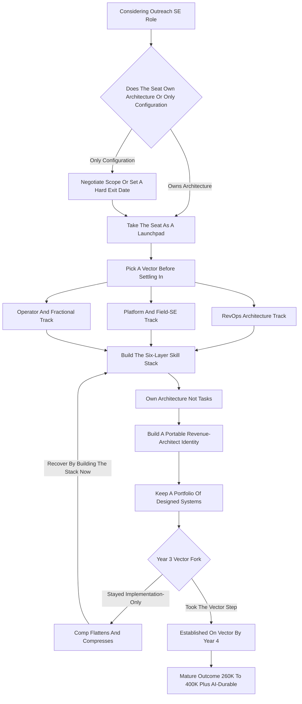

### Direct Answer

Yes -- an Outreach Solutions Engineer role is still a good career bet in 2027, but only if you treat the title as a launchpad rather than a destination and deliberately climb from "I configure sequences" to "I architect revenue systems." The implementation-only version of the job is being genuinely compressed by better product UX and by AI sales agents; the architecture version -- owning CRM-to-engagement-platform data flow, deliverability, routing logic, and forecast hygiene -- is getting more valuable, not less. Take the seat, build the skill stack underneath the product, name a vector early, and the role is a credible on-ramp to a $260K-$400K-plus revenue-architecture career.

**TL;DR**

- **The seat is neutral; the vector is everything.** An Outreach SE seat can become a $300K architecture career or a $165K plateau depending entirely on what you build on top of it.
- **The compression is real and specific.** AI agents from 11x, Regie.ai, and Clay -- plus Outreach's own automation -- absorb the rote build-and-send layer. They do not absorb the architecture layer.
- **Three exits pay off:** the RevOps architecture track ($180K-$320K+), the platform / field-SE track ($200K-$300K+ OTE), and the operator / fractional track ($150K-$400K).
- **Comp today:** a pre-sales SE lands roughly $150K-$235K OTE on a $120K-$170K base; the implementation/solutions-consultant variant lands $125K-$190K.
- **Three quiet career killers:** staying implementation-only, over-indexing on one vendor's UI, and ignoring the RevTech consolidation risk.
- **The mandate:** from month one, build the skill stack -- CRM data model, SQL, integration layer, deliverability, commercial logic, AI orchestration -- and frame your resume as "systems I architected," not "tasks I completed."

---

## 1. What an Outreach Solutions Engineer Actually Does in 2027

An Outreach Solutions Engineer is the technical person who makes a sales-execution platform actually produce pipeline. Outreach is the sales-execution and engagement platform that sits between a company's CRM and its sales reps, orchestrating the outbound and follow-up motion. The SE is the technical owner of how that platform gets sold, stood up, and integrated -- and in 2027 the role has split into two distinct shapes that get blurred under one title.

### 1.1 The Pre-Sales SE: Technical Owner of the Deal Cycle

The **pre-sales SE** sits inside the deal cycle. They run technical discovery with a prospect's RevOps and sales-ops team, scope how Outreach will sit between the CRM and the rep, build the demo and the proof-of-concept, answer the security and deliverability questions, and de-risk the technical objections that would otherwise stall a six-figure platform purchase. The pre-sales SE is the credibility in the room -- the person who makes a skeptical VP of RevOps believe the platform will actually work inside their stack.

### 1.2 The Post-Sales SE: Architect of the Live System

The **post-sales / professional-services SE** -- sometimes titled Implementation Consultant, Solutions Consultant, or Customer Solutions Architect -- takes the signed deal and stands the platform up. That means CRM field mapping, sequence architecture, mailbox and domain configuration for deliverability, user provisioning, reporting design, and the first ninety days of adoption. This variant builds the deepest architecture muscle because the post-sales SE is the one actually constructing the live system.

### 1.3 Why the 2027 Role Is More Technical Than the 2021 Version

The platform no longer lives alone. It sits inside a mesh of Salesforce (NYSE: CRM) or HubSpot (NYSE: HUBS) as the system of record, a data layer like Snowflake (NYSE: SNOW), enrichment from Clay or ZoomInfo (NASDAQ: ZI), conversation intelligence from Gong, and -- the genuinely new thing -- AI sales agents that draft, send, and sometimes book on their own. The Outreach SE is the person who has to make all of that produce a clean, attributable pipeline number.

The job is not "knows where the buttons are." Done well, the job is "understands the commercial logic of an outbound motion, the data model underneath it, and the integration surface around it, and can design a system that a sales team and an AI agent can both operate inside." That distinction -- buttons versus architecture -- is the entire career question.

### 1.4 A Day in the Two Variants

It helps to picture the actual work. A pre-sales SE's week is shaped by the deal calendar: a Monday technical discovery with a prospect's RevOps lead, a Tuesday demo build customized to that prospect's Salesforce instance, a Wednesday proof-of-concept review where the prospect's security team probes data residency and SOC 2 questions, and a Thursday whiteboard session sketching how Outreach will sit between the CRM and the rep without creating duplicate activity records. The SE is constantly translating between a prospect's messy reality and a clean product story. A post-sales SE's week is shaped by the implementation calendar: scoping a new customer's CRM field mapping, designing a sequence architecture that matches their segmentation, configuring SPF and DKIM records with their IT team, running an admin-training session, and triaging the first wave of "the data looks wrong" tickets that always follow go-live. One job sells the system; the other builds it. Both are technical, and both -- if you let them -- can quietly become checklist work.

### 1.5 Why the Title Confusion Matters for Your Career

Because "Solutions Engineer," "Solutions Consultant," "Implementation Consultant," and "Customer Solutions Architect" all describe overlapping work, the title on your offer letter tells you almost nothing about the actual scope. Two people with identical "Solutions Engineer" titles can be doing radically different jobs -- one architecting integration meshes, the other clicking through onboarding checklists. This is the first reason you must interview the role rather than the title, a theme Section 13 develops in full. The career risk is invisible at the offer stage and becomes obvious only two years in, when one SE has a portfolio of designed systems and the other has a portfolio of completed tickets.

| Dimension | Pre-Sales SE | Post-Sales / Solutions-Architect SE |
|---|---|---|
| Primary venue | The deal cycle | Implementation and adoption |
| Core deliverable | Demos, POCs, technical close | Live system, data mapping, deliverability |
| Variable comp | Higher (70/30 or 75/25) | Lower (often 10-20%) |
| Best on-ramp to | Platform / field-SE vector | RevOps architecture / operator vector |
| Skill that compounds | Technical selling, executive presence | System design, integration depth |

---

## 2. The Honest 2027 Verdict: Launchpad, Not Destination

The direct answer to "is this role still good for my career" is yes, with a sharp condition: it is an excellent launchpad and a poor destination.

### 2.1 Why It Is a Strong Launchpad

As an entry or mid-career seat, the Outreach SE role gives you something rare and portable. You sit at the technical center of how a company generates revenue. You see the CRM object model, the data flow, and the commercial logic from the inside. You build a resume line that reads "I make revenue systems work," which is one of the most fundable skill stories in B2B. Few seats let you get paid a strong wage while learning the exact skill the labor market is short of. That is the launchpad.

### 2.2 Why It Is a Poor Destination

The static version of the role -- the person who has done the same implementation checklist for four years and never moved up the value ladder -- is being slowly compressed from two directions. **Product UX keeps getting better,** so configuration that used to need an expert now needs a competent admin. And **AI agents absorb more of the rote build-and-send work every quarter.** None of that kills the role. It kills the implementation-only interpretation of the role.

### 2.3 The Architect Gets More Valuable, Not Less

The SE who, by year three, owns deliverability strategy, the CRM-to-platform data contract, territory and routing logic, and the forecasting hygiene of the whole motion is more valuable in 2027 than they were in 2021 -- because the system got more complex and someone has to architect it. So: take the seat, and from day one treat it as the place you learn revenue architecture, not the place you settle into platform configuration. The people for whom this role "went bad" are almost always the people who let it stay a configuration job. For a parallel breakdown of how AI agents reshape the broader operations stack, see (q1898).

---

## 3. The Compensation Reality: Base, Variable, and OTE Bands

Compensation is where the "is it good for my career" question gets concrete.

### 3.1 The Pre-Sales SE Band

A pre-sales Solutions Engineer at Outreach or a comparable sales-execution / RevTech vendor typically carries a **$120K-$170K base** with a **70/30 or 75/25 base-to-variable split**, landing an on-target earnings number of roughly **$150K-$235K**. Senior and principal pre-sales engineers push past $260K-$300K once equity and accelerators are counted. The variable is usually tied to team or territory bookings rather than an individual quota, which makes the income steadier than a pure AE seat but caps the upside lower.

### 3.2 The Post-Sales / Professional-Services Band

The post-sales SE -- Implementation Consultant, Solutions Architect -- tends to run a slightly higher base, **$105K-$160K**, with a smaller variable component (often 10-20%, tied to utilization, project delivery, or CSAT), landing **$125K-$190K total**.

### 3.3 The Comparison Points That Matter

Gong's senior solutions engineers and Clari's principal solutions architects land in overlapping or higher bands. Salesforce (NYSE: CRM) and HubSpot (NYSE: HUBS) pre-sales engineers at the senior level frequently clear $220K-$320K OTE because the deal sizes and the platform breadth are larger. For a comp-floor anchor in the AE world, a Datadog (NASDAQ: DDOG) AE seat is covered in (q1907). The career-relevant fact is the shape of the curve, not just the level: an Outreach SE who stays implementation-only flattens around the $150K-$180K mark by year four, while the same person who moves into RevOps architecture or senior platform SE work breaks through $220K and keeps climbing.

### 3.4 Reading the Variable Component Honestly

The variable component deserves more scrutiny than candidates usually give it. A 75/25 split on a $135K base means $33,750 of OTE is variable -- and because it is typically tied to team or territory bookings rather than your own quota, you have limited individual control over it. In a strong year the team hits and you collect; in a soft year the whole team misses and your variable compresses regardless of your personal performance. This is genuinely steadier than an AE's individual quota, which is a feature for someone who values predictability. But it is also a ceiling: you cannot out-earn your team the way a top AE out-earns their peers. Understanding sales compensation structure before you sign is a skill in itself, and it is the same skill the architecture vector rewards -- the SE who can read a comp plan critically is already thinking like an operator. The practical instruction: weight the base heavily in your evaluation, treat the variable as a probable but not guaranteed number, and never accept a lower base on the promise of an uncertain variable upside.

### 3.5 Equity, Sign-On, and the Total-Comp Picture

Cash OTE is only part of the picture. At a private RevTech vendor like Outreach, equity is typically granted as RSUs or options with a four-year vest and a one-year cliff, and its real value depends entirely on an exit that may or may not come -- and in a category being consolidated by private equity, an exit can mean a take-private at a valuation that leaves common stock worth little. Treat private-company equity as a lottery ticket, not as comp you can spend. Sign-on bonuses are more common for senior and principal SEs and are worth negotiating, especially to offset unvested equity left behind at a prior employer. The total-comp picture for an Outreach SE in 2027 is therefore: a reliable base, a probable team-tied variable, an uncertain equity component, and -- on the operator vector specifically -- the possibility of meaningful equity at a company you join later. The strategic read is that the cash bands above are what you should plan your life around; everything else is upside you should pursue but not depend on.

| Role / Level | Base | Variable / Split | Realistic OTE |
|---|---|---|---|
| Outreach SE (pre-sales, early) | $110K-$135K | 75/25 | $135K-$165K |
| Outreach SE (pre-sales, senior) | $140K-$170K | 70/30 | $185K-$235K |
| Outreach SE (principal / staff pre-sales) | $160K-$195K | 70/30 + accel. | $230K-$300K+ |
| Outreach Implementation / Solutions Consultant | $105K-$150K | 80/20 or 90/10 | $125K-$180K |
| Gong Senior Solutions Engineer | $135K-$175K | 70/30 | $185K-$250K |
| Clari Principal Solutions Architect | $150K-$200K | 75/25 | $200K-$280K |
| Salesforce / HubSpot Senior SE | $150K-$190K | 65/35 | $220K-$320K |
| Senior / Principal RevOps (architecture track) | $160K-$230K | 85/15 | $190K-$320K+ |
| Head of RevOps (scaling startup) | $170K-$240K | + equity | $200K-$400K (w/ equity) |

---

## 4. The Three Career Vectors From an Outreach SE Seat

There are exactly three high-value directions out of this role, and naming them precisely matters because the seat itself is neutral -- it rewards whichever one you deliberately build toward.

### 4.1 Vector One: The RevOps Architecture Track

You use the SE seat to learn the entire revenue tech stack from the inside, then move into Senior, Principal, or Staff Revenue Operations -- or into Sales Engineering / Solutions leadership -- where you own the system rather than configure a piece of it. This is the most common and most durable exit, it pays **$180K-$320K-plus**, and it is the path where the AI-agent wave is a tailwind: the more the stack automates, the more a company needs an architect who designs the system the automation runs inside.

### 4.2 Vector Two: The Platform / Field-SE Track

You go deeper technical and stay in pre-sales, but you move to a larger platform with bigger deals -- a senior or principal SE at Gong, Clari, HubSpot (NYSE: HUBS), or Salesforce (NYSE: CRM) -- carrying a quota-influenced number, **$200K-$300K-plus OTE**, with the work shifting from configuration toward architecture, security, and executive-level technical selling.

### 4.3 Vector Three: The Operator / Fractional Track

You take the systems knowledge in-house as a Head of RevOps at a scaling startup -- trading some cash for equity and scope -- or you build a fractional RevOps practice serving several companies at once, where a strong operator clears **$150K-$400K** depending on client load and structure. The operator destination is detailed in (q115).

| Vector | Destination Titles | Comp Range | AI Posture |
|---|---|---|---|
| RevOps architecture | Senior/Principal/Staff RevOps, Solutions leadership | $180K-$320K+ | Tailwind -- architect governs the agents |
| Platform / field-SE | Senior/Principal SE at larger platform | $200K-$300K+ OTE | Neutral -- skill must stay transferable |
| Operator / fractional | Head of RevOps, fractional practice | $150K-$400K | Tailwind -- companies need the skill faster than they can hire |

All three are real, all three pay well, and the Outreach SE seat is a legitimate on-ramp to each. The failure mode is not picking one and drifting -- which lands you in the static-implementation trap by default.

---

## 5. Vector One Deep Dive: The RevOps Architecture Track

The RevOps architecture track is the highest-probability good outcome from an Outreach SE seat, so it deserves the most detail.

### 5.1 The Move: From Configuration to the Revenue Operating System

The move is from "I configure the engagement platform" to "I design and own the revenue operating system" -- the CRM object model, the data layer, the routing and territory logic, the forecasting methodology, the tool integration mesh, and the metrics that the whole go-to-market org runs on. For the company-specific career ladder this maps onto, see (q1764).

### 5.2 What It Requires

You have to learn the layers beneath Outreach. That means the Salesforce or HubSpot data model deeply enough to design it, not just use it; the SOQL or SQL to actually interrogate the data; the integration patterns -- native connectors, iPaaS tools like Workato or Tray, reverse-ETL from a warehouse -- well enough to architect them; and the commercial logic of pipeline, conversion, velocity, and forecast accuracy well enough to be the person leadership asks "why is the number wrong."

### 5.3 The Time Horizon and Comp Progression

The time horizon is real: 18-30 months in the SE seat, deliberately reaching beyond your lane, to build the portfolio of "I designed this system and it lifted conversion / cleaned the forecast / cut ramp time" stories that get you the RevOps title. The comp progression is the clearest of the three vectors -- and it is the most AI-durable seat in the entire go-to-market org, because the architect is the one role the agents cannot replace.

### 5.4 Why This Vector Has the Lowest Variance

The RevOps architecture track is not just the highest-probability good outcome -- it is also the lowest-variance one. The platform / field-SE vector depends on landing seats at a small number of large vendors and surviving their hiring cycles; the operator vector depends on equity outcomes that are genuinely a coin flip. The architecture vector, by contrast, rests on a structural labor-market fact: Revenue Operations has moved from a niche title to a board-visible function, and the supply of people who can actually architect a revenue system has not kept pace with demand. That gap is not a one-year hiring blip -- it is a multi-year structural shortage, and it means an SE who builds the architecture skill is selling into a persistently undersupplied market. You are not betting on one company or one exit; you are betting on a skill the entire B2B economy is short of. That is why, of the three vectors, this is the one to default to unless you have a specific reason -- a love of the deal cycle, or a strong appetite for equity risk -- to choose another.

| RevOps Architecture Rung | Typical Comp | What You Own |
|---|---|---|
| Senior RevOps | $160K-$210K | A defined domain (data, routing, or forecasting) |
| Principal RevOps | $200K-$260K | Cross-domain architecture and standards |
| Staff / Director RevOps Architecture | $260K-$320K+ | The whole revenue operating system |

---

## 6. Vector Two Deep Dive: The Platform and Field-SE Track

The platform / field-SE track keeps you in pre-sales but moves you up-market, and it is the right vector for the person who genuinely likes the deal cycle, the demo, the technical win, and the customer-facing intensity.

### 6.1 The Up-Market Ladder

The move is from a mid-market SE seat at one platform to a senior or principal SE seat at a larger one -- the natural ladder runs Outreach to Gong or Clari to Salesforce or HubSpot, with deal sizes, platform breadth, and technical depth increasing at each rung.

### 6.2 What Changes as You Climb

Less click-through configuration, more architecture diagrams, security and compliance review, multi-product solutioning, and executive-level technical selling where you are the credibility in the room that closes a $400K platform deal. The skills that compound here are technical breadth across the GTM stack, the ability to whiteboard an integration architecture live, security and data-governance fluency, and the executive presence to be trusted by a prospect's VP of RevOps.

### 6.3 The Burnout and Retention Risk

The field-SE path is intense, and the most common leak is strong SEs burning out or leaving for AE roles for the higher cash ceiling. A team with a real SE career ladder retains them; a team without one loses them -- the framework for that is covered in (q615). The other risk on this vector is vendor-identity lock-in, which Section 9 treats in full. The mitigation is simple: build the transferable architecture skill so your value is "senior SE who understands revenue systems" and the logo on your badge is incidental.

---

## 7. Vector Three Deep Dive: The Operator and Fractional Track

The operator / fractional track takes the systems knowledge in-house or independent, and it is the right vector for the person who wants ownership and scope over the structured comp of a vendor seat.

### 7.1 The In-House Operator

You become Head of RevOps or Director of Revenue Operations at a scaling startup -- typically Series A through C -- where you own the entire go-to-market system end to end, report to a CRO or COO, and trade some cash compensation for meaningful equity. Cash runs $170K-$240K, but the equity is the real bet, and a good outcome at a company that exits well is the largest single payoff of any vector here. The signal for when a company is ready to make this hire is covered in (q115).

### 7.2 The Fractional Practitioner

You build a practice serving three to six companies at once as their part-time Head of RevOps, charging $4K-$15K per client per month, where a full book clears $150K-$400K depending on client load and whether you stay solo or build a small team.

### 7.3 What Both Versions Demand

Both versions demand the same thing the SE seat is supposed to teach you: not platform configuration, but the ability to walk into a messy revenue system, diagnose why the pipeline is leaking or the forecast is wrong, and design the fix across people, process, and the tool stack.

| Operator Variant | Cash | Upside Mechanism | Variance |
|---|---|---|---|
| Head of RevOps (Series A-C) | $170K-$240K | Equity at a company that exits well | High |
| Fractional practitioner (solo) | $150K-$280K | More clients, higher retainers | Medium |
| Fractional practice (with small team) | $250K-$400K | Leverage across a team | High |

---

## 8. The Skill Stack: What You Must Learn Beyond the Outreach UI

The single highest-leverage thing you can do in an Outreach SE seat is deliberately build the skill stack underneath the product, because that stack is what makes you AI-durable and vendor-portable.

### 8.1 Layers One Through Three: Data and Integration

**Layer one is the CRM data model** -- the Salesforce or HubSpot object architecture, the relationships between accounts, contacts, leads, opportunities, and activities, and the field-level logic that everything else depends on; you should be able to design this, not just navigate it. **Layer two is data and query fluency** -- SOQL for Salesforce, SQL for the warehouse, enough to interrogate the pipeline data yourself rather than waiting for an analyst. **Layer three is the integration layer** -- native connectors, iPaaS platforms like Workato and Tray.io, reverse-ETL from Snowflake (NYSE: SNOW) or BigQuery, and webhook and API patterns.

### 8.2 Layers Four Through Six: Deliverability, Commercial Logic, AI

**Layer four is deliverability and domain strategy** -- SPF, DKIM, DMARC, domain warming, mailbox rotation, the post-2024 Google and Yahoo sender requirements -- which is genuinely technical, high-stakes, and a place where a strong SE is irreplaceable. **Layer five is commercial logic** -- pipeline math, conversion rates by stage, sales velocity, forecast accuracy, ramp time, the unit economics of an outbound motion. **Layer six is AI orchestration** -- how agents from 11x, Regie.ai, and Clay actually plug into the stack, where they help, where they break, and how to design guardrails around them.

### 8.3 Why the Stack Compounds

An SE who builds all six layers is not threatened by the AI wave; they are the person who gets hired to manage it. The compounding is not metaphorical -- it is structural. Each layer makes the next one more valuable. Knowing the CRM data model lets you write meaningful SQL against it; SQL fluency lets you verify whether an integration actually moved the data correctly; integration fluency lets you reason about whether a deliverability problem is a DNS issue or a sync issue; deliverability mastery lets you connect send-acceptance rates to pipeline math; commercial-logic fluency lets you judge whether an AI agent's output is helping or quietly poisoning the forecast. A person who has only layer one is an admin. A person who has all six is an architect, and the gap between those two is not six times the value -- it is closer to an order of magnitude, because the architect can be trusted to own outcomes rather than execute tasks.

### 8.4 A Realistic Learning Sequence

The stack is not learned all at once, and trying to do so is how people stall. A realistic sequence: in months one through six, master the CRM data model and basic SOQL/SQL, because they underpin everything and you will use them daily. In months six through twelve, go deep on deliverability -- it is self-contained, high-stakes, and a fast way to become visibly irreplaceable on your team. In months twelve through eighteen, build integration fluency by volunteering for every cross-system implementation you can get. In months eighteen through twenty-four, develop commercial-logic fluency by sitting in on forecast calls and pipeline reviews until the math is second nature. AI orchestration is woven through the whole period, because the agent landscape changes too fast to "learn once." This sequence is deliberate, it is roughly the 18-30 month horizon Section 5 names, and it is the difference between an SE who drifts and an SE who arrives at the year-three vector fork with a real portfolio.

| Months | Skill Focus | Why This Order |
|---|---|---|
| 1-6 | CRM data model + SOQL/SQL | Underpins every other layer; used daily |
| 6-12 | Deliverability and domain strategy | Self-contained, high-stakes, fast credibility |
| 12-18 | Integration layer and iPaaS | Learned by volunteering for real implementations |
| 18-24 | Commercial logic and forecast math | Learned by sitting in on forecast and pipeline reviews |
| Ongoing | AI orchestration | Landscape changes too fast to learn once |

| Skill Layer | What It Covers | Why It Compounds |
|---|---|---|
| CRM data model | Salesforce/HubSpot object architecture, field logic | Foundation every other layer depends on |
| Data & query fluency | SOQL, SQL, warehouse interrogation | Lets you diagnose the number yourself |
| Integration layer | iPaaS (Workato, Tray), reverse-ETL, APIs | Modern stack is an integration problem |
| Deliverability strategy | SPF/DKIM/DMARC, domain warming, sender rules | High-stakes, technical, irreplaceable |
| Commercial logic | Pipeline math, velocity, forecast accuracy | Connects the system to revenue |
| AI orchestration | Agent integration, guardrails, failure modes | Makes you the person who manages the wave |

---

## 9. The AI Agent Compression and the Consolidation Risk

A clear-eyed career decision has to price in two structural forces: AI compression and category consolidation.

### 9.1 What AI Agents Genuinely Absorb

The compression is real, it is specific, and it does not point where the panic points. What AI agents genuinely absorb -- happening now, not someday -- is the rote build-and-send layer: drafting sequence copy, generating first-draft messaging, executing the send cadence, doing tier-one personalization, and handling the simplest tier of reply triage. Tools like 11x (which raised a $50M Series B led by Benchmark in late 2024), Regie.ai, and Clay's agent features are aimed squarely at that layer, and Outreach's own product roadmap is automating the same work from the inside.

### 9.2 What Agents Structurally Cannot Do

Agents do not design the CRM data contract the agent reads from, architect the integration mesh the agent operates inside, set the deliverability strategy that determines whether the agent's sends even land, define routing logic, own forecast hygiene, or decide what the system should do and put guardrails around an agent that will otherwise confidently do the wrong thing at scale. Every AI agent makes the architect more necessary, not less. The same dynamic playing out across the whole RevOps stack is mapped in (q1898).

### 9.3 The Consolidation Risk

The sales-execution and RevTech category is consolidating. Outreach and Salesloft -- the two original sales-engagement platforms -- have been circled by the same private-equity and strategic buyer pool for years; Salesloft was taken private by Vista Equity Partners in a deal valued around $2.3 billion at the end of 2023, and the market has long expected Outreach to face a similar outcome. A re-org, an acquirer's tooling rationalization, a "we already own a competing product" decision, or a private-equity efficiency pass can all reshape or eliminate a specific SE team with little warning.

### 9.4 The Mitigation Is Portability

The mitigation is not pessimism; it is portability. Build the transferable skill -- revenue architecture, the data layer, the integration mesh, the commercial logic -- so that when the logo on your badge changes, your value does not.

| Force | What It Threatens | What It Rewards |
|---|---|---|
| AI agent compression | The implementation-only SE | The architect who governs the agents |
| Product UX improvement | Expert-level configuration work | System design beyond the UI |
| Category consolidation | Vendor-specific identity | Portable "revenue systems architect" identity |

---

## 10. Choosing the Variant and Framing the Resume

Two seats with the same title can sit on opposite sides of the compression line. Two things decide which side you land on: the variant you take and how your experience reads on paper.

### 10.1 Pre-Sales vs. Post-Sales: Which Variant to Take

If your target is the platform / field-SE vector or sales leadership, take pre-sales -- it builds technical selling, executive presence, and deal-cycle credibility. If your target is RevOps architecture or the operator track -- the two most AI-durable, highest-ceiling vectors -- the post-sales / solutions-architect variant builds the better foundation, because you are the one actually standing the system up. The dynamic of companies hiring more SEs while thinning AE headcount is covered in (q1482), and it tells you which way the wind is blowing on the pre-sales side.

### 10.2 The Resume Problem: "Outreach Admin" vs. "Revenue Architect"

There are two versions of the exact same three years. Version one reads: "Outreach Solutions Engineer -- built sequences, ran onboarding, configured the platform." That resume gets you another Outreach-shaped job and is precisely the resume the AI-agent wave devalues. Version two reads: "Revenue systems architect -- designed CRM-to-engagement-platform data contracts across Salesforce and Snowflake, owned deliverability strategy lifting send-acceptance, architected the integration mesh, built the forecasting hygiene that cut forecast error." That resume gets you a Principal RevOps interview or a Head of RevOps conversation.

### 10.3 Document Systems, Not Tasks

The work can be identical; the framing -- and the deliberate reaching beyond the configuration lane to actually own the architecture work -- determines which resume you have. From month one, keep a running record of systems you designed and owned, not tasks you completed. This is also how SE value gets measured fairly inside an org without being treated as a commodity (q238).

| Resume Framing | What It Signals | What It Unlocks |
|---|---|---|
| "Built sequences, ran onboarding" | Configuration labor | Another lateral SE seat |
| "Owned deliverability strategy" | A piece of architecture | Senior SE / RevOps interviews |
| "Designed the revenue operating system" | Full systems ownership | Principal RevOps / Head of RevOps |

---

## 11. The Five-Year Career Trajectory From an Outreach SE Seat

Mapping a realistic five-year arc makes the career bet concrete.

### 11.1 Years One and Two: Competence and First Architecture Ownership

**Year 1:** you take the seat -- pre-sales or solutions-architect variant -- and your job is to become genuinely competent at the platform and, from month one, start building the skill stack underneath it: CRM data model, integration layer, deliverability. Comp lands $135K-$170K. **Year 2:** you are trusted with complex implementations or technical deals, you have real SQL and integration fluency, and you start owning a piece of architecture rather than executing a checklist. Comp climbs to $160K-$200K.

### 11.2 Year Three: The Vector Fork

You have a portfolio of "systems I designed and owned" stories, and you choose a vector deliberately -- senior platform SE at a larger company, a Senior RevOps title, or a first Head of RevOps role at a scaling startup. Comp crosses $185K-$230K.

### 11.3 Years Four and Five: The Mature Outcome

**Year 4:** you are established on your vector -- Principal SE, Principal RevOps, or an operator with real scope and equity. Comp runs $220K-$280K-plus. **Year 5:** the mature outcome -- Staff/Director-level RevOps architecture, a principal SE at a top platform, or a Head of RevOps with meaningful equity or a full fractional book -- $260K-$400K-plus.

| Year | Stage | Focus | Comp Band |
|---|---|---|---|
| Year 1 | Outreach SE (entry/mid) | Platform competence + start skill stack | $135K-$170K |
| Year 2 | Trusted SE | Own a piece of architecture, SQL + integration fluency | $160K-$200K |
| Year 3 | The vector fork | Choose: platform SE / RevOps / operator | $185K-$230K |
| Year 4 | Established on vector | Principal SE / Principal RevOps / scoped operator | $220K-$280K+ |
| Year 5 | Mature outcome | Staff RevOps / top-platform principal SE / Head of RevOps + equity | $260K-$400K+ |

This arc assumes you treated the SE seat as a launchpad. The arc for the SE who let the role stay a configuration job flattens hard around year three at $150K-$180K, and gets more fragile every year as the automation wave rises.

---

## 12. Five Named Real-World Career Scenarios

Concrete scenarios make the vectors tangible.

### 12.1 Priya, the Architecture Builder

Takes a post-sales Outreach Solutions Consultant seat at $115K, and from month one treats every implementation as architecture practice -- she learns the Salesforce data model cold, picks up SOQL, owns deliverability strategy for her accounts. By year three she has a portfolio of designed systems and moves to a Senior RevOps role at $195K; by year five she is Director of RevOps Architecture at a Series D company clearing $290K.

### 12.2 Marcus, the Cautionary Tale

Takes the same kind of seat, becomes genuinely excellent at the Outreach UI, and stays there -- four years of building sequences and running onboarding. His comp flattens at $165K, his resume reads "Outreach admin," and when the AI-agent wave and a product-UX refresh compress his exact job, he is competing for the shrinking pool of implementation-only roles with a non-portable skill set.

### 12.3 Devon, the Platform Climber

Takes a pre-sales Outreach SE seat, loves the deal cycle, and deliberately builds technical breadth and executive presence; he ladders to a Senior SE role at Gong, then a Principal SE seat at Salesforce (NYSE: CRM), clearing $295K OTE by year five carrying a quota-influenced number on large platform deals.

### 12.4 Aisha, the Operator

Uses three years as an Outreach SE to learn the whole revenue system, then takes a Head of RevOps role at a Series B startup -- $185K cash plus meaningful equity -- owning the entire GTM stack; the equity is the real bet, and a clean exit would be the biggest single payoff of any scenario here.

### 12.5 Tomas, the Fractional Practitioner

After four years spanning both SE variants, he leaves to build a fractional RevOps practice, serving five companies at $7K-$10K each per month, clearing roughly $400K at full book as the architect-for-hire that scaling startups cannot justify full-time.

| Scenario | Vector | Year-5 Outcome | Lesson |
|---|---|---|---|
| Priya | RevOps architecture | $290K Director | Treat every implementation as architecture practice |
| Marcus | None (drift) | $165K plateau | The static version compresses |
| Devon | Platform / field-SE | $295K Principal SE | Build breadth and executive presence |
| Aisha | Operator (in-house) | $185K + equity | Equity is the real bet |
| Tomas | Operator (fractional) | ~$400K full book | Architect-for-hire scales beyond one company |

Four of the five used the seat as a launchpad. One let it stay a job. That is the whole career question.

---

## 13. How to Interview Into the Right Version of the Role

If you are evaluating an Outreach SE offer -- or any RevTech SE offer -- interview the role, not just take it.

### 13.1 Interrogate What the SE Team Owns

Ask what the SE team actually owns: if the answer is "onboarding and sequence builds," that is the compressed segment; if the answer includes "data architecture, integration design, deliverability strategy, forecasting," that is the durable segment. Ask who the SE team reports into and works alongside -- proximity to RevOps, to the data team, and to sales leadership is proximity to the architecture work and to your next vector.

### 13.2 Ask About the AI Roadmap and the Last Three People

Ask about the AI roadmap explicitly: a company that talks about agents as something the SE team will architect and govern is building the durable role; a company that has not thought about it is one where the role is static by default. Ask what the last three people in the seat did next -- the honest answer tells you whether this seat is a launchpad or a holding pattern.

### 13.3 Negotiate for Scope, Not Just Comp

A slightly lower base with an explicit mandate to own deliverability strategy or the CRM data contract is worth more to your five-year arc than a higher base in a pure-configuration seat. The title on the offer letter is the same either way; the career outcome depends on which version of the role you negotiated into.

| Interview Question | Good Answer | Warning Sign |
|---|---|---|
| What does the SE team own? | Data architecture, integration, deliverability, forecasting | Onboarding and sequence builds |
| Who does the SE team report into? | RevOps or sales leadership, close to the data team | Isolated, ticket-driven support function |
| What is the AI roadmap for SEs? | SEs will architect and govern the agents | No clear answer |
| What did the last three SEs do next? | Promoted into RevOps, principal SE, or operator roles | Left laterally or stayed flat |

---

## 14. Adjacent Paths and the 2027-2030 Outlook

Before committing, a careful person should weigh the adjacent paths and form a view on where the role is heading.

### 14.1 Adjacent and Alternative Paths

**The AE path** has a higher cash ceiling and higher variance but trades away the systems-architecture skill that makes the SE path AI-durable; whether an AE seat is itself a good 2027 bet is examined in (q1907). **The straight RevOps-analyst path** gets you to the architecture work faster but without the customer-facing technical-selling muscle. **The data-analytics path** builds the data layer deeply but skips the commercial and customer-facing layers. **The non-RevTech SE path** builds heavier technical depth in a different domain, less transferable to the RevOps and operator vectors. The Outreach SE seat is not the only good path, but it is unusually balanced -- it builds the technical, the commercial, and the customer-facing layers together.

### 14.2 Where the Role Is Heading: 2027-2030

**The bifurcation hardens** -- the gap between the compressed implementation-only role and the durable architecture role widens, not closes. **AI agents become standard, and governance becomes a named job** -- by 2030 it is normal for a GTM org to run agents inside the outbound motion, which makes "the person who designs and governs the agent-augmented revenue system" a core role. **RevOps keeps rising as a function** -- it continues its move from back-office support to a strategic, board-visible function. **The RevTech category keeps consolidating** -- which keeps making vendor-specific identity risky and portable architecture skill valuable.

### 14.3 The Title May Not Survive; the Skill Will

The Outreach Solutions Engineer title may not even exist in its 2027 form by 2030 -- it may be absorbed, renamed, or restructured by consolidation and automation. But the skill the seat builds, used well -- revenue systems architecture -- is heading into its most valuable decade. This is the single most important reframe in the whole analysis: do not bet your career on the title, bet it on the capability. A person who thinks of themselves as "an Outreach Solutions Engineer" has tied their identity to something the next three years are actively reshaping. A person who thinks of themselves as "a revenue systems architect who currently happens to work at Outreach" has tied their identity to a capability whose value is rising across every B2B company, vendor and operator alike. The title is the scaffolding; the skill is the building. When the scaffolding comes down -- and in a consolidating, automating category it will -- only the building stands.

### 14.4 What to Watch as Leading Indicators

A person committing years to this path should watch a few leading indicators to know whether their bet is tracking. First, the language in job descriptions: if SE roles increasingly say "architect," "govern," "data," and "forecasting," the durable segment is growing; if they still say "configure" and "onboard," your specific corner of the market is the compressed one. Second, where RevOps reports: as RevOps leaders increasingly report to the CEO or COO rather than to a VP of Sales, the function is rising and the architecture vector is strengthening. Third, the pace of RevTech acquisitions: each consolidation event is a reminder to keep your identity portable. Fourth, how your own company talks about AI agents: a company treating agents as something SEs will govern is building the durable role around you; a company that has not formed a view is one where your seat is static by default. Read these indicators every six to twelve months and adjust your vector accordingly -- the career bet is not set-and-forget.

| Trend | Direction | Career Implication |
|---|---|---|
| Implementation vs. architecture gap | Widening | Pick the architecture side deliberately |
| AI agents in the outbound motion | Becoming standard | Governance becomes a named, durable job |
| RevOps as a function | Rising in prestige and comp | Tailwind for the architecture vector |
| RevTech consolidation | Continuing | Portable identity beats vendor identity |

---

## 15. The Decision Framework: A Visual Walkthrough

Pulling the entire analysis into one operating sequence: a person who takes an Outreach SE role in 2027 and wants it to build a strong career should run the seat through this decision flow.

The framework has four checkpoints, and each one is worth working through deliberately rather than treating as a slogan.

### 15.1 Checkpoint One: Interrogate the Seat

Does this specific role own architecture -- data, integration, deliverability, forecasting -- or only configuration: onboarding and sequence builds? If it owns architecture, take it. If it is configuration-only, you have two honest options: negotiate scope into the role before you sign, or take it as a deliberate, short stepping stone with a hard exit date you actually hold yourself to. The trap is taking a configuration-only seat with a vague intention to "make it more" and then drifting. The seat will not expand on its own; product UX and AI agents are actively shrinking it.

### 15.2 Checkpoint Two: Assess Your Own Willingness

The entire bull case depends on 18-30 months of deliberate skill-stack building underneath the product. Be honest with yourself about whether you will actually do that work. It is not glamorous -- it is learning the Salesforce object model on weekends, writing SQL queries that fail before they work, and volunteering for the messy cross-system implementations nobody else wants. If you are not willing to do it, the framework's honest answer is that the role will go static on you, and you should either not take it or treat it explicitly as a short stop, not a career.

### 15.3 Checkpoint Three: Name the Vector

Can you name which of the three vectors -- RevOps architecture, platform / field-SE, or operator / fractional -- you are building toward? If you cannot, that is the gap to close before the seat, not after. The seat rewards whichever vector you build toward and punishes drift, so naming the vector is not optional planning hygiene -- it is the single decision that determines whether the seat compounds or plateaus.

### 15.4 Checkpoint Four: Build a Portable Identity

Are you treating the consolidation exposure seriously enough to build a portable "revenue systems architect" identity rather than a vendor-specific "Outreach expert" one? The test is simple: if Outreach were acquired and your team restructured tomorrow, would your resume, your network, and your self-concept survive intact? If the answer is no, you have a logo-dependent identity, and the fix is to start framing your work as transferable architecture from month one. Answer well across all four checkpoints and the role is a strong bet; answer poorly and it is the static-implementation trap.

---

## 16. Counter-Case: Why an Outreach SE Role Might Be the Wrong Career Move

The case above describes a strong launchpad, but a serious person must stress-test it against the conditions that make this role a poor career bet.

### 16.1 The Compression and Lock-In Counters

**Counter 1 -- The implementation-only version is genuinely being compressed.** This is not speculative. Product UX keeps improving, and AI agents from 11x, Regie.ai, Clay, and Outreach's own automation keep absorbing the rote build-and-send work. If you let the seat stay a configuration job -- and many people do, because it is comfortable -- you are sitting in the exact segment the next three years are built to shrink.

**Counter 2 -- Vendor-identity lock-in is a real and underestimated trap.** Spend four years as "the Outreach expert" and your resume, network, and self-concept all organize around one vendor's product. When that vendor gets acquired or out-competed, you discover your value was tied to a logo, not a transferable skill.

**Counter 3 -- The category is consolidating, and consolidation eliminates SE teams.** Outreach, Salesloft, Gong, and Clari are all consolidation targets or have already been taken private. Acquirers rationalize tooling, cut redundant teams, and run efficiency passes.

### 16.2 The Ceiling and Effort Counters

**Counter 4 -- The comp ceiling is real if you do not move.** The implementation-only SE flattens around $150K-$180K by year three and stays there. That is a fine income, but it is a plateau, not a trajectory.

**Counter 5 -- The skill-stack build is real work that many people will not do.** The entire bull case rests on 18-30 months of deliberately learning the CRM data model, SQL, the integration layer, deliverability, commercial logic, and AI orchestration. The honest truth is that most people in the seat will not do it.

**Counter 6 -- An AE seat may simply pay more for the right person.** If your real strength is the relationship and the close, a quota-carrying AE path has a higher cash ceiling and faster upside -- a comparison made directly in (q1907).

### 16.3 The Path-Fit and Behavioral Counters

**Counter 7 -- A direct RevOps-analyst path may be a cleaner on-ramp.** If RevOps architecture is your actual goal, entering revenue operations directly gets you there faster, without the detour through customer-facing technical selling.

**Counter 8 -- The variable comp is steadier but lower than it looks.** The 70/30 or 75/25 split tied to team or territory bookings makes income predictable, but it caps the upside well below an individual-quota seat.

**Counter 9 -- Remote-market comp compression is real.** The role is remote-friendly, which widens opportunity -- but it also means you compete in a national candidate pool at national rates, without the metro premium.

**Counter 10 -- The title itself may not survive to 2030.** Consolidation and automation may absorb, rename, or restructure the title entirely. The skill survives if you build it; the title may not.

**Counter 11 -- "Treat it as a launchpad" is easy to say and hard to live.** The seat is comfortable, the pay is fine, and the path of least resistance is to settle in. Every counter collapses into one behavioral fact: the difference between the good outcome and the bad one is sustained, deliberate effort against the grain of a comfortable job.

### 16.4 The Honest Verdict

Taking or staying in an Outreach SE role in 2027 is a strong move for a person who treats the seat as a launchpad with a named vector, will actually do the 18-30 months of skill-stack building, builds a portable "revenue systems architect" identity, takes the vector step around year three, and positions as the layer that governs the AI agents. It is a poor move for anyone who lets the role stay a configuration job, attaches identity to one logo, expects the title alone to keep paying more, or whose strength would be better captured in an AE or direct-RevOps path. The role is a neutral seat on a bifurcating line -- and in 2027 the gap between the launchpad version and the static version is wide, and it is widening.

| Take / Stay If You... | Walk Away If You... |
|---|---|
| Treat the seat as a launchpad with a named vector | Will let it stay a configuration job |
| Will do the 18-30 months of skill-stack building | Want comfort over deliberate effort |
| Build a portable revenue-architect identity | Attach your identity to one vendor's logo |
| Take the vector step around year three | Expect the title alone to keep paying more |
| Position as the layer that governs the agents | Have an AE or direct-RevOps strength instead |

---

## 17. Sources

1. **US Bureau of Labor Statistics -- Occupational Employment and Wage Statistics (Sales Engineers, Management Analysts)** -- Wage and employment data for sales engineering and adjacent operations roles. https://www.bls.gov/oes/
2. **US Bureau of Labor Statistics -- Occupational Outlook Handbook: Sales Engineers** -- Job-outlook, growth-projection, and role-definition reference. https://www.bls.gov/ooh/
3. **RepVue -- Sales Engineering and RevTech Compensation Data** -- Crowdsourced base, variable, and OTE data for SE and RevOps roles by company. https://www.repvue.com
4. **Levels.fyi -- Solutions Engineer and Solutions Architect Compensation** -- Verified compensation data across base, equity, and bonus for SE and SA roles. https://www.levels.fyi
5. **Pavilion -- Revenue Operations and GTM Leadership Benchmarks** -- Community and benchmark data for RevOps, sales, and GTM leadership roles and comp. https://www.joinpavilion.com
6. **The Bridge Group -- Sales Development and Sales Operations Metrics Reports** -- Research on SDR, sales-ops, and RevOps team structure, comp, and ramp. https://www.bridgegroupinc.com
7. **Gartner -- Sales Technology and Revenue Operations Research** -- Analyst coverage of the RevTech category, consolidation, and the rise of RevOps. https://www.gartner.com
8. **Outreach -- Platform, Solutions, and Careers Documentation** -- Product scope, integration catalog, and role references for the sales-execution platform. https://www.outreach.io
9. **Gong -- Revenue Intelligence Platform and Careers** -- Product and role references for the conversation-intelligence and revenue platform. https://www.gong.io
10. **Clari -- Revenue Platform and Solutions Architecture Roles** -- Product and role references for the revenue-forecasting and pipeline platform. https://www.clari.com
11. **Salesloft -- Sales Engagement Platform (Vista Equity Partners portfolio)** -- Reference for the Salesloft platform and the Vista take-private transaction. https://salesloft.com
12. **HubSpot, Inc. (NYSE: HUBS) -- Sales Hub and Solutions Engineering Roles** -- Product and pre-sales role references for the CRM and sales platform. https://www.hubspot.com
13. **Salesforce, Inc. (NYSE: CRM) -- Sales Cloud and Solution Engineering Career Paths** -- Pre-sales engineering role and platform-architecture references. https://www.salesforce.com
14. **11x -- AI Sales Agent Platform ($50M Series B led by Benchmark, 2024)** -- Reference for the AI-agent layer compressing rote outbound execution work. https://www.11x.ai
15. **Regie.ai -- AI Sales Outreach and Agent Platform** -- Reference for AI-driven sequence generation and outbound automation. https://www.regie.ai
16. **Clay -- GTM Data and Agent Platform** -- Reference for enrichment and agent-driven workflow automation in the modern GTM stack. https://www.clay.com
17. **Vista Equity Partners -- Salesloft Acquisition and RevTech Portfolio** -- Reference for private-equity consolidation activity in the sales-engagement category. https://www.vistaequitypartners.com
18. **Workato and Tray.io -- Integration Platform (iPaaS) Documentation** -- Reference for the integration-layer skills central to revenue-systems architecture.
19. **Snowflake Inc. (NYSE: SNOW) -- Data Cloud and Reverse-ETL Patterns** -- Reference for the data-warehouse layer underneath a modern revenue stack. https://www.snowflake.com
20. **Salesforce Developer Documentation -- Data Model and SOQL** -- Reference for the CRM object model and query skills an SE must build. https://developer.salesforce.com
21. **Google and Yahoo Bulk Sender Requirements (2024)** -- Reference for the deliverability, SPF/DKIM/DMARC, and sender-authentication requirements an SE must master.
22. **ZoomInfo Technologies Inc. (NASDAQ: ZI) -- GTM Data and Sales Intelligence** -- Reference for the data-enrichment layer in the outbound motion. https://www.zoominfo.com
23. **OpenComp / Comprehensive.io -- Compensation Benchmarking for GTM Roles** -- Reference for base, variable, and equity benchmarking across sales and RevOps roles.
24. **RevGenius and Wizards of Ops -- RevOps Practitioner Communities** -- Practitioner discussion of RevOps career paths, tooling, and architecture practice.
25. **Sales Hacker / GTM Trade Coverage** -- Ongoing journalism on sales technology, SE roles, RevOps, and the AI-agent shift.
26. **LinkedIn Economic Graph and Jobs on the Rise Reports** -- Demand-trend data for RevOps, sales engineering, and adjacent GTM roles. https://economicgraph.linkedin.com
27. **Forrester -- B2B Revenue Operations and Sales Technology Research** -- Analyst coverage of RevOps maturity and the revenue tech stack. https://www.forrester.com
28. **G2 -- Sales Engagement and RevOps Software Category Data** -- Reference for the RevTech competitive landscape and category consolidation. https://www.g2.com
29. **SaaStr -- GTM, RevOps, and Sales Leadership Content** -- Practitioner and founder commentary on RevOps roles, comp, and the SE-to-leadership path. https://www.saastr.com
30. **Fractional RevOps Practice and Marketplace References** -- Reference for the fractional Head-of-RevOps engagement and pricing model.
31. **Built In -- Sales Engineer and RevOps Salary and Role Data** -- Aggregated role, comp, and remote-work data for GTM technical roles. https://builtin.com
32. **Glassdoor -- Solutions Engineer and Revenue Operations Compensation** -- Crowdsourced comp and role data across RevTech employers. https://www.glassdoor.com
33. **Demandbase / 6sense -- Account-Based GTM Platform Documentation** -- Reference for the broader ABM and GTM stack an SE architects around.
34. **TSIA -- Technology Services and Professional Services Benchmarks** -- Reference for professional-services SE utilization and delivery models. https://www.tsia.com
35. **PreSales Collective -- Sales Engineering Community** -- Practitioner discussion of SE career ladders, pre-sales vs. post-sales paths, and comp.

---

## 18. Related Pulse Library Entries

- **(q1761)** -- Is an Outreach AE role still good for your career in 2027? The closest in-company sibling and the AE-side comparison for this exact seat.
- **(q1764)** -- What is the Outreach RevOps career path? The company-specific ladder that Vector One maps directly onto.
- **(q1882)** -- Is a Workato Sales Engineer role still good for your career in 2027? The closest SE-role sibling, and the iPaaS layer central to the architecture vector.
- **(q1482)** -- Why is my company hiring Solutions Engineers but firing AEs? The structural shift that makes the pre-sales SE seat a rising one.
- **(q615)** -- What career-path framework prevents your best SEs from burning out or leaving for AE roles? The retention dynamic behind the field-SE vector.
- **(q1898)** -- What replaces the RevOps stack if AI agents auto-coach reps? The AI-compression dynamic this role sits inside, mapped across the whole stack.
- **(q1907)** -- Is a Datadog AE role still good for your career in 2027? The AE-path counter-case and a comp-floor anchor for the alternative.
- **(q115)** -- When should a company hire a head of RevOps? The operator-vector destination and the signal that the in-house seat exists.
- **(q238)** -- How do you measure SE ROI without making them feel like commodities? How SE value gets quantified inside an org -- the framing that protects the seat.
