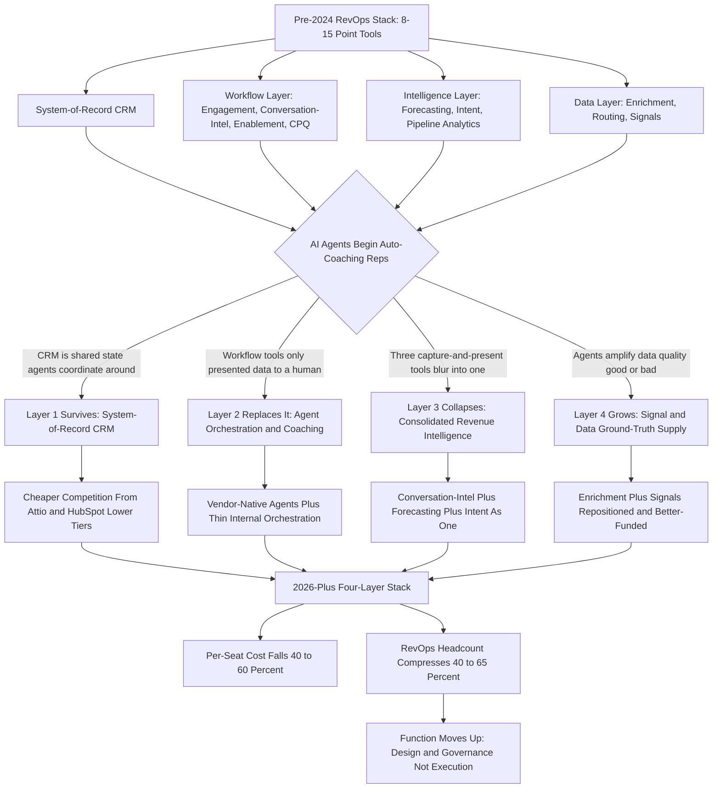

### Direct Answer

When AI agents genuinely auto-coach reps, the RevOps stack does not disappear -- it **inverts and consolidates**, collapsing from a sprawl of eight to fifteen point tools into roughly four clear layers, with per-seat software cost falling 40-60% and RevOps headcount compressing 40-65%. The agents replace the **reasoning layer** that used to be spread across a dozen workflow tools and a roomful of managers; they do not replace the **state layer** (the CRM) those tools sat on, and they do not replace the **strategy layer** -- comp, territory, segmentation, methodology -- that no agent is accountable for. The RevOps function gets smaller, more senior, and more strategic: the stack shrinks while the function grows up.

**TL;DR:** The pre-2024 RevOps stack was workflow-tool-heavy and intelligence-thin: a CRM plus a dozen point tools (Gong, Clari, Outreach, 6sense, LeanData, Highspot, ZoomInfo, Common Room) costing $1,500-$5,000 per seat per year and requiring one RevOps person per 15-25 reps. The agent-era stack inverts that into four layers: (1) a **system-of-record CRM** agents read and write -- Salesforce (NYSE: CRM), HubSpot (NYSE: HUBS), or a cheaper modern entrant like Attio; (2) an **agent orchestration and coaching layer** that absorbs call analysis, deal-review prep, coaching notes, and pipeline hygiene; (3) a **collapsed revenue-intelligence layer** merging what conversation intelligence, forecasting, and intent did separately; and (4) a **signal and data layer** that becomes more important, not less, because agents amplify data quality good or bad. Cost falls 40-60% per seat. RevOps headcount compresses 40-65% but rises in seniority, resolving into three archetypes: agent system architect, revenue strategist, and forecasting-and-data-quality owner. The three traps: assuming agents replace the CRM, assuming headcount goes to zero, and deploying coaching agents on dirty data.

## Defining The Stack Before You Can Say What Replaces It

### 1.1 Why The Phrase "RevOps Stack" Hides The Answer

Before anyone can answer what replaces the RevOps stack, they must be precise about what the stack *is*, because the phrase gets used loosely and the looseness conceals the answer. The RevOps stack is not one thing -- it is a layered set of systems that together run the revenue motion of a company. Treating "the stack" as a monolith produces a wrong answer before the analysis even starts, because **agents do radically different things to each layer**: they barely touch one layer, gut another, consolidate a third, and make the fourth more important.

**The four structural layers** of the pre-agent stack break down cleanly:

- **The system-of-record layer** holds the canonical record of accounts, contacts, opportunities, and activities. For most companies this is Salesforce (NYSE: CRM) or HubSpot (NYSE: HUBS); for smaller ones, increasingly Attio or HubSpot's lower tiers.
- **The workflow layer** is the set of tools reps and managers touch every day: sales engagement for sequencing outbound, conversation intelligence for recording and analyzing calls, enablement for content and coaching, and CPQ or deal-desk tooling for quoting.
- **The intelligence layer** sits above workflow: forecasting, intent and ABM scoring, and pipeline analytics.
- **The data layer** feeds everything: enrichment, lead routing, and signal capture.

### 1.2 What "Auto-Coach Reps" Actually Covers

The second piece of precision: what does it mean for an AI agent to "auto-coach reps," and how much of the RevOps job does that premise really cover? Coaching, done by a human sales manager, is a bundle of distinct activities, and an honest answer separates them.

**Call review** means listening to recordings and flagging missed discovery, weak objection handling, and talk-time imbalances. **Deal coaching** means examining a specific opportunity -- where the champion is, whether economic-buyer access exists, what the genuine next step is. **Skill development** means noticing a rep is weak at multithreading and building a quarter-long plan to fix it. **Pipeline coaching** asks whether a rep's pipeline is real, sufficient, and healthily distributed across stages. **Forecasting discipline** pushes reps to commit honestly.

An agent that "auto-coaches" can plausibly do the first three well today: it can analyze every call rather than the 2% a human samples, flag deal risks against a methodology like MEDDICC, and track skill patterns over time. What it does *not* do is set the strategy that coaching operates inside. The realistic scope of the premise: **agents absorb the execution of coaching and the analysis beneath it** -- a large slice of front-line sales management and RevOps enablement work -- but not the strategic part, which becomes *more* valuable when execution is automated.

The coverage gap is worth quantifying. A human sales manager with eight direct reports listens to perhaps two to four calls per rep per month -- a sampling rate of single-digit percentages of total call volume. An agent listens to **every call**, scores each against the methodology, and surfaces patterns no human sampling would ever catch: the rep who consistently skips the third discovery question, the rep whose deals slip whenever a specific competitor is mentioned, the rep whose talk-time ratio degrades on second calls. That is a genuine step-change in the *analytical* half of coaching. The *relational* half -- the trust, the motivation, the hard-feedback conversation a rep will accept only from someone they respect -- is exactly the half the agent does not touch. So "auto-coach" is precise about the analysis-and-execution layer and silent about the relational layer, and an honest answer holds both facts at once: the analysis is largely automatable now, the relationship is not, and the headcount math depends on how much of real coaching value lives in each.

| Coaching activity | Agent capability today | Who owns it in 2027 |
|---|---|---|
| Call review and scoring | Strong -- every call, timestamped | Agent-led, human spot-check |
| Deal-specific coaching | Strong -- risk flags vs methodology | Agent-led, manager decides |
| Skill-development planning | Moderate -- pattern detection | Hybrid |
| Pipeline coaching | Strong -- hygiene and coverage math | Agent-led |
| Methodology selection | None | Human-owned |
| Motivation and trust-building | None | Human-owned |

## The Pre-2024 Baseline The Agents Are Replacing

### 2.1 The Concrete Sprawl Of A Mid-Market Stack

To see what changes, anchor on the concrete pre-2024 baseline for a mid-market SaaS company in the $50M-$500M ARR range. Every tool in this stack exists because the CRM was bad at something specific, and the market filled each gap with a point solution.

**The CRM** is Salesforce, $165-$330 per user per month depending on edition. **Sales engagement** is Outreach or Salesloft, roughly $100-$200 per user per month. **Conversation intelligence** is Gong, the category leader, commonly $1,400-$1,600 per user per year. **Forecasting** is Clari, frequently $1,000-$3,000+ per user per year. **Intent and ABM** is 6sense or Demandbase, often a $60K-$200K annual platform fee rather than per-seat. **Lead-to-account matching and routing** is LeanData, $40-$200 per user per month. **Enablement** is Highspot or Seismic, $75-$150 per user per month. **Data enrichment** is some combination of ZoomInfo (NASDAQ: ZI), Apollo, and Cognism, anywhere from $15K to $200K+ a year. **Signal capture** is Common Room or Pocus, often $40K-$150K a year.

| Layer | Representative tool | Typical cost |
|---|---|---|
| System-of-record CRM | Salesforce / HubSpot | $165-$330 per user / month |
| Sales engagement | Outreach / Salesloft | $100-$200 per user / month |
| Conversation intelligence | Gong / Chorus | $1,400-$1,600 per user / year |
| Forecasting | Clari / BoostUp | $1,000-$3,000+ per user / year |
| Intent / ABM | 6sense / Demandbase | $60K-$200K platform / year |
| Lead routing | LeanData / Chili Piper | $40-$200 per user / month |
| Enablement | Highspot / Seismic | $75-$150 per user / month |
| Data enrichment | ZoomInfo / Apollo / Cognism | $15K-$200K+ / year |
| Signal capture | Common Room / Pocus | $40K-$150K / year |

### 2.2 What The Sprawl Costs

Stack it all up and a fully-equipped rep sits on **$1,500-$5,000 of RevOps software per year**, and a 100-rep organization spends **$150K-$500K annually** on the tool stack alone -- before the RevOps salaries that integrate it. The sprawl is not an accident. The agent era's core move is to ask whether a general-purpose reasoning layer can collapse those gaps back together -- and for the workflow layer especially, the answer is largely yes.

- **Fully-equipped rep, blended:** $1,500-$5,000 of RevOps software per year, with a typical mid-market figure around $2,500-$3,500.
- **100-rep org total RevOps software:** $150K-$500K per year.
- **Distinct tool categories:** 8-15, each a separate vendor, contract, integration, and renewal.

## The Stack-Inversion Thesis

### 3.1 Inversion, Not Disappearance

The central thesis is **inversion**, not disappearance, and the distinction matters because it predicts where money and headcount actually go. The pre-2024 stack was *workflow-tool-heavy and intelligence-thin*: a dozen tools that each captured or moved data, plus a thin analytical layer on top and humans doing most of the actual reasoning. The agent-era stack inverts that into *intelligence-heavy and workflow-tool-thin*.

The reasoning that used to live in humans -- and in the narrow ML features bolted onto each point tool -- **consolidates into an orchestration layer of general-purpose models**, and the dozen workflow tools collapse because their job was mostly to present data to a human who would then reason about it. If the agent reasons, you do not need the tool whose only job was to make data legible to a person.

### 3.2 What Survives And What Gets Absorbed

The system-of-record survives because *something* has to be the canonical truth. The data and signal layer survives -- and grows -- because the agents are only as good as their inputs. But the middle of the old stack, the expensive workflow-and-narrow-intelligence sprawl, is exactly what gets absorbed.

Inversion also explains the cost math: **you are not eliminating spend, you are moving it** from many per-seat workflow licenses to a smaller number of orchestration-layer and data-layer line items. The net is lower because you stop paying a dozen vendors each marking up access to the same underlying CRM data. The sibling question of what happens when agents replace SDRs natively reaches the same structural conclusion through a different door (q1870), and the SDR-team version of the question (q1899) shows the headcount mechanics in a narrower slice.

## Layer One: The System-Of-Record CRM Survives

### 4.1 Why The CRM Is The Layer Agents Change Least

The CRM is the layer agents change *least*, and understanding why is foundational. An agent fleet needs a canonical, permissioned, auditable place to read the current state of every account and opportunity and to write back its conclusions. That is what a system-of-record is. You cannot have five agents and a dozen reps all operating on their own private notion of "the truth" -- the CRM is the shared state.

So Salesforce (NYSE: CRM) and HubSpot (NYSE: HUBS) do not get replaced by agents; if anything, they get *more* central as the agent-of-record substrate. The choice of CRM org structure when agents are running on top of it becomes a genuine design question in its own right (q1533).

### 4.2 Price Pressure From Below

What *does* change is the competitive pressure on price. Much of what enterprises paid Salesforce premium editions for was workflow automation, reporting, and the Einstein add-ons -- exactly the territory agents now contest. That opens the door for **cheaper modern entrants like Attio** ($34-$179 per user per month) or HubSpot's lower tiers, because if the orchestration layer provides the intelligence, the CRM only needs to be a clean, fast, well-modeled database with good APIs.

| CRM tier | Approx. cost | Agent-era positioning |
|---|---|---|
| Enterprise Salesforce | $165-$330 per user / month | Survives; loses premium for intelligence add-ons |
| HubSpot mid-tier | $90-$150 per user / month | Strong; Breeze agents native |
| Attio / modern entrants | $34-$179 per user / month | Gains share as "clean database with APIs" |
| HubSpot Starter | $15-$50 per user / month | Democratizes SMB capability |

The likely 2027 picture: the CRM survives universally, but buyers get more ruthless about paying enterprise premiums for capabilities the agent layer now delivers, and the system-of-record market sees real price pressure from below.

## Layer Two: The Agent Orchestration And Coaching Layer

### 5.1 The New Center Of Gravity

The genuinely new layer, and the new center of gravity, is **agent orchestration**. This is where the coaching actually happens, and it has two flavors that will coexist.

**Vendor-native agents** are embedded inside the tools companies already own -- Gong's AI capabilities, Salesforce's Agentforce and Einstein, Outreach's agent features, HubSpot's Breeze. They coach and draft inside the existing workflow, are the path of least resistance, and most companies start here.

**Independent orchestration** is a layer built on general-purpose models (Claude, GPT-class, Gemini) and frameworks (LangGraph, CrewAI, custom internal builds) that sits *across* tools rather than inside one. It reads from the CRM, the call recordings, the email system, and the data layer; reasons about deals, reps, and pipeline; and writes coaching, drafts, and updates back.

### 5.2 The Hybrid Reality

The independent layer is more powerful because it is not confined to one vendor's data, but it requires more RevOps engineering to build and govern. The 2027 reality for most mid-market and enterprise companies is a **hybrid**: vendor-native agents for in-tool coaching, plus a thin internal orchestration layer for the cross-system reasoning the vendors cannot do because they only see their slice.

The pressure this puts on the workflow incumbents is already visible: the strategic question of whether a sequencing vendor should pivot wholesale into agent-orchestration is live for both Outreach (q1771) and Salesloft (q1830). Either way, *this* is the layer that replaces the reasoning once spread across a dozen tools and a roomful of managers.

| Orchestration flavor | Strength | Weakness | Best fit |
|---|---|---|---|
| Vendor-native agents | Fast, low-risk, no integration | Sees only one vendor's data | SMB, fast-start mid-market |
| Independent orchestration | Full cross-system reasoning | Engineering + governance burden | Large, sophisticated orgs |
| Hybrid | Cross-system where it matters | Two things to manage | Most mid-market and enterprise |

## Layer Three: The Collapsed Revenue-Intelligence Layer

### 6.1 Three Tools That Did The Same Job

The revenue-intelligence layer -- conversation intelligence, forecasting, and intent, which were three separate purchases -- collapses into roughly one. The logic is straightforward, and it rests on a single observation: **all three were capture-and-present-to-a-reasoning-human tools.**

Conversation intelligence (Gong) recorded and analyzed calls so a human could extract meaning. Forecasting (Clari) aggregated pipeline signals so a human could predict the quarter. Intent (6sense) scored accounts so a human could prioritize. When the reasoning human is partly an agent, and the agent can read the raw call transcripts, the raw pipeline, and the raw intent signals directly, the three tools' distinct value propositions blur into one capability: **give the agent fresh, structured ground truth about conversations, pipeline, and account behavior.**

### 6.2 Consolidation, Not Disappearance

That capability can come from one consolidated platform -- Gong expanding into forecasting and intent, Clari expanding into conversation intelligence, or Salesforce absorbing all three natively -- or from the orchestration layer pulling raw feeds and doing the synthesis itself. The category does not vanish; the *capture* of calls and signals still has to happen, and that is real infrastructure. But the three-vendor, three-budget-line structure consolidates hard.

This is precisely why M&A pressure mounts inside the category: the question of whether Gong should acquire Chorus to consolidate conversation intelligence is a direct expression of the collapse (q1866), and the future of standalone call recording once agents auto-summarize calls is the same thesis seen from the capture-infrastructure side (q1881). Whether a forecasting feature like Salesloft Pipeline AI is worth buying against a pure-play like Clari is the buyer-side version of the same consolidation pressure (q1860).

| Old category | Old vendor | Old job | Agent-era fate |
|---|---|---|---|
| Conversation intelligence | Gong / Chorus | Analyze calls for a human | Becomes capture + consolidated platform |
| Forecasting | Clari / BoostUp | Roll up pipeline for a human | Most exposed; must expand or consolidate |
| Intent / ABM | 6sense / Demandbase | Score accounts for a human | Folds into consolidated revenue intelligence |

## Layer Four: The Signal And Data Layer Gets More Important

### 7.1 The Counterintuitive Part Most Takes Get Wrong

Here is the counterintuitive part that most "agents replace the stack" takes get wrong: **the data and signal layer becomes more important.** An agent that auto-coaches reps is a reasoning engine, and a reasoning engine is only as good as its inputs.

If the CRM data is stale, the firmographic enrichment is wrong, the buying-committee map is incomplete, or the intent signals are noise, the agent does not coach badly in a way a human would catch -- it coaches *confidently and at scale* in the wrong direction. So the enrichment vendors (ZoomInfo (NASDAQ: ZI), Apollo, Clay), the signal vendors (Common Room, Default, Pocus, UserGems), and the routing tooling do not get absorbed the way the workflow layer does.

### 7.2 The Ground-Truth Supply Chain

They get repositioned as the **ground-truth supply chain** for the agent fleet. The budget here may even grow, because the marginal value of clean data rises sharply when an automated system acts on it thousands of times a day. The 2027 stack keeps a real data layer -- possibly consolidated (Clay-style platforms that unify enrichment, signals, and data orchestration are well-positioned) but definitely present and arguably better-funded than before.

The slogan: **agents commoditize the workflow layer and premium-ize the data layer.**

- **Enrichment** (ZoomInfo, Apollo, Clay) -- ground truth on firmographics and contacts; budget stable to growing.
- **Signal capture** (Common Room, Default, UserGems) -- behavioral and product signals; budget growing.
- **Routing and hygiene** (LeanData, Chili Piper) -- becomes a reasoning task agents perform, infrastructure persists.
- **Data governance** -- becomes a named, owned function rather than an afterthought.

## The Four-Layer 2027 Stack, Concretely

### 8.1 Four Categories Instead Of Twelve

Pulling it together, the concrete 2027 stack for a mid-market SaaS company looks like four categories instead of twelve-plus.

**Layer one, system-of-record:** one CRM -- Salesforce, HubSpot, or Attio -- as the canonical, agent-readable-and-writable database. **Layer two, agent orchestration and coaching:** vendor-native agents inside owned tools, plus a thin internal orchestration layer for cross-system reasoning -- where coaching, deal-review prep, email drafting, and pipeline hygiene happen. **Layer three, collapsed revenue intelligence:** one consolidated platform (or raw capture plus orchestration) covering what conversation intelligence, forecasting, and intent covered separately. **Layer four, signal and data:** enrichment plus signal capture plus routing, repositioned as the ground-truth supply chain.

| Layer | What it is | Status |
|---|---|---|
| 1. System-of-record CRM | Canonical agent-readable/writable database | Survives; price pressure from below |
| 2. Agent orchestration and coaching | Vendor-native agents + thin internal orchestration | New center of gravity |
| 3. Consolidated revenue intelligence | Conversation-intel + forecasting + intent merged | Collapses from 3 vendors toward 1 |
| 4. Signal and data | Enrichment + signals + routing as ground-truth supply | Grows; better-funded |

### 8.2 The Honest Nuance

"Four layers" is the *category* count, not the *vendor* count -- a real company in 2027 still has more than four contracts, because capture infrastructure, point niches, and transition-period legacy tools persist. But the structural shift from a dozen co-equal workflow tools to four clear layers, with orchestration as the new center of gravity, is the real prediction. It is a genuine simplification of how the stack is reasoned about, budgeted, and staffed.

## The Cost Math: From $3,000-Plus Per Seat To $600-$1,800

### 9.1 Modeling The Collapse

The cost story is concrete enough to model. The pre-2024 fully-equipped rep carried $1,500-$5,000 of RevOps software per year, with a typical mid-market figure around $2,500-$3,500 once you blend CRM, engagement, conversation intelligence, forecasting, enablement, and an allocation of the platform-fee tools.

The 2027 collapsed stack runs roughly **$600-$1,800 per seat**: a CRM seat (cheaper if Attio or HubSpot lower tiers), an allocation of orchestration-layer cost (model usage plus the consolidated revenue-intelligence platform), and an allocation of the data layer. The headline is a **40-60% reduction in per-seat software cost** -- driven not by any single tool getting cheaper but by *eliminating the redundancy* of a dozen vendors each marking up access to the same CRM data.

| Metric | Pre-2024 | 2027 collapsed stack |
|---|---|---|
| Per-seat software cost | $1,500-$5,000 / year | $600-$1,800 / year |
| Typical mid-market blend | $2,500-$3,500 / year | $1,000-$1,400 / year |
| Tool categories | 8-15 | ~4 |
| Cost shape | Fixed per-seat licenses | Smaller but variable consumption |
| 100-rep org total | $150K-$500K / year | $70K-$180K / year |

### 9.2 The Cost-Shape Change

There is an important caveat: **model-usage cost is variable** in a way per-seat licenses were not. A heavy agent deployment that analyzes every call, drafts every email, and runs continuous pipeline coaching consumes real tokens, and at scale that is a meaningful line item. The 2027 budget trades predictable per-seat licenses for a smaller-but-variable orchestration spend, and RevOps has to actually manage that consumption. Net cost still falls, but the *shape* of the cost changes from fixed to consumption-based -- which is its own operational discipline. This is also why pricing strategy across the category is in flux, visible in how vendors reprice forecasting and pipeline analytics against each other (q1902).

The consumption discipline is genuinely new RevOps work. Under per-seat licensing, the budget was a known number set once a year; nobody had to *manage* it day to day. Under consumption pricing, the budget responds to behavior: a quarter where the agent fleet analyzes more calls, drafts more emails, or runs more cross-system reasoning is a quarter with a bigger bill. RevOps now needs a model-cost dashboard, a per-task cost attribution, a policy on which tasks justify the most expensive model versus a cheaper one, and a sense of the marginal cost of an additional agent capability before it ships. The upside is that consumption pricing aligns spend with value -- you pay for the calls that get analyzed, not for seats that go unused. The discipline is making sure a runaway use case does not quietly erase the 40-60% saving. A company that treats the orchestration bill as "set and forget" the way it treated per-seat licenses will be surprised; a company that instruments it gets a cost structure that is both lower and more honest than the old one.

## What Agents Genuinely Absorb From The RevOps Job

### 10.1 The Tasks Agents Take Over

Be specific about which RevOps tasks agents actually take over, because the headcount math depends on it. Agents credibly absorb a substantial slice of the day-to-day execution-and-analysis layer.

- **Pipeline hygiene** -- flagging stale opportunities, missing next steps, and past close-dates, then nudging the rep or updating directly.
- **Forecast-data wrangling** -- assembling the deal-by-deal roll-up and the changes since last week so the forecast call is a decision meeting, not a data-gathering exercise.
- **Call analysis and coaching-note generation** -- every call, not a sample, scored against the methodology with specific timestamped feedback.
- **Deal-review prep** -- the pre-read for every deal-desk and pipeline review, assembled automatically.
- **Enablement surfacing** -- the right content and battlecard delivered in-context instead of searched for.
- **Routing and assignment** -- lead-to-account matching and territory routing as a reasoning task rather than a brittle rules engine.
- **Reporting and ad-hoc analysis** -- the "can you pull me the numbers on..." requests that consumed a large share of junior RevOps time.

### 10.2 What Agents Do Not Absorb

Agents do not absorb the *design* layer of RevOps, and that layer becomes more valuable precisely because execution gets automated.

Agents do not set the **sales methodology** -- they coach *against* a methodology a human chose. They do not design the **comp plan**, the single most powerful behavior lever in a revenue org. They do not draw **territories** or define **segmentation** or set the **ICP** -- these require market judgment and executive alignment no agent is accountable for. They do not own **process design** -- the stage definitions and exit criteria the agents then enforce. They do not run **the data-governance regime** that keeps their own inputs clean, they do not handle the **change management** of getting a sales org to adopt anything, and they do not own **the agent fleet itself**.

| RevOps work | Agent-absorbed | Stays human |
|---|---|---|
| Pipeline hygiene | Yes | -- |
| Forecast-data assembly | Yes | -- |
| Call analysis and coaching notes | Yes | -- |
| Deal-review prep | Yes | -- |
| Ad-hoc reporting | Yes | -- |
| Methodology selection | -- | Yes |
| Comp-plan design | -- | Yes |
| Territory and segmentation | -- | Yes |
| Process and stage design | -- | Yes |
| Agent-fleet architecture and governance | -- | Yes |

## The Headcount Reality: 40-65% Compression, Not Elimination

### 11.1 The Honest Number

The honest headcount number is a **40-65% compression of RevOps execution roles, not elimination of the function**. Pre-agent, a common ratio was one RevOps person per 15-25 reps, so a 100-rep org carried 4-7 RevOps people, weighted toward execution -- analysts pulling reports, ops people maintaining integrations, enablement people building decks. Post-agent, the same org might run 2-3 RevOps people, but the *composition* changes more than the count.

| Metric | Pre-agent | Post-agent |
|---|---|---|
| RevOps-to-rep ratio | 1 per 15-25 reps | shifts up the value chain |
| RevOps team, 100-rep org | 4-7 people | 2-3 people |
| Headcount compression | -- | 40-65% |
| Team composition | Execution-weighted | Strategy-weighted |

### 11.2 Why "RevOps Disappears" Is Wrong

The compression is real and a company that pretends otherwise will be out-competed on cost. But "RevOps disappears" is wrong for three reasons. **First, someone owns the agents** -- a fleet of coaching agents acting on revenue data is a higher-stakes system than any single tool. **Second, the strategic design work is undiminished** -- comp, territory, segmentation, process, and methodology still need owners, and these were always under-staffed relative to their leverage. **Third, the data-quality bar rises**, and someone has to own the ground-truth supply chain.

The function gets smaller, more senior, more strategic, and more technical. The junior report-pulling RevOps role is the one genuinely at risk; the senior RevOps strategist is *more* valuable. The same compression-and-elevation pattern shows up wherever AI agents absorb an operational layer -- the manual-forecasting question reaches an identical conclusion (q1880).

There is a hiring-and-development implication that RevOps leaders should not dodge. The traditional RevOps career ladder started with a junior analyst pulling reports and maintaining dashboards, then progressed to an operations manager owning integrations and process, then to a director or VP owning strategy. The agent era *removes the bottom rung*: the report-pulling entry role compresses hardest because that is exactly the work agents absorb first and most completely. That creates a genuine pipeline problem -- if the entry role disappears, where do future senior strategists come from? The honest answer is that the entry point shifts: the new junior RevOps hire is less a report-puller and more an agent-operations associate who instruments, monitors, and corrects the agent fleet under the architect's supervision. That role still develops the systems thinking a future strategist needs, but it is technical work from day one, not spreadsheet work. RevOps leaders who want a healthy talent pipeline in 2029 should be deliberate now about what the new entry role looks like and how it ladders up toward the three surviving archetypes.

## The Three Surviving RevOps Archetypes

### 12.1 The Agent System Architect

The first archetype is the **agent system architect** -- the person who designs the agent fleet, decides which tasks are agent-owned versus human-owned, builds or configures the orchestration layer, instruments the agents with evaluation and monitoring, manages model selection and the consumption budget, and owns the governance regime. This is a genuinely new role, part RevOps and part platform engineer, and it did not exist in 2022.

### 12.2 The Revenue Strategist

The second is the **revenue strategist** -- the person who owns the design layer the agents operate inside: segmentation, ICP, territory, comp, process and stage design, methodology selection. This role existed before but was chronically under-staffed because execution work crowded it out; freed from execution, it expands.

### 12.3 The Forecasting And Data-Quality Owner

The third is the **forecasting and data-quality owner** -- accountable for the integrity of the forecast and, critically, for the cleanliness of the data the agents consume. This role also existed but gets elevated, because its failure mode went from "the report is wrong" to "the automated coaching system is confidently wrong at scale." Together, these three archetypes -- all more senior than the average pre-agent seat -- replace the 4-7 person execution-heavy org. Career-path questions across adjacent operating roles (q1896) reflect the same upward shift in what a RevOps seat is worth.

| Archetype | Origin | Core mandate |
|---|---|---|
| Agent system architect | New in the agent era | Design, instrument, and govern the agent fleet; manage model cost |
| Revenue strategist | Existed, under-staffed | Segmentation, ICP, territory, comp, process, methodology |
| Forecasting and data-quality owner | Existed, elevated | Forecast integrity and cleanliness of agent inputs |

## The Vendor-Landscape Shake-Out

### 13.1 Who Is Structurally Safe

The vendor landscape sorts into clear winners and clearly exposed categories. **System-of-record CRMs** are structurally safe -- Salesforce (NYSE: CRM) and HubSpot (NYSE: HUBS) remain the substrate -- but face price pressure from below and lose the premium they charged for workflow-and-intelligence add-ons. **Data and signal vendors** like ZoomInfo (NASDAQ: ZI), Clay, and Common Room are *winners*: they become the ground-truth supply chain and their value rises. **The new winners** are the orchestration-layer providers: the model labs, the agent-framework companies, and whoever builds the RevOps-specific orchestration layer well.

### 13.2 Who Is Exposed

**Conversation-intelligence leaders** like Gong are *exposed but adaptive* -- their capture infrastructure is a real asset, but their "analyze calls for a human" value prop is exactly what general-purpose agents commoditize. **Forecasting pure-plays** (Clari, BoostUp, Aviso) are the *most exposed* -- forecasting is reasoning over pipeline data, squarely in the agent's wheelhouse. **Sales-engagement tools** (Outreach, Salesloft) are exposed on their "sequence and send" workflow but defensible if they become the agent execution surface. **Enablement tools** (Highspot, Seismic) are exposed unless they become the content substrate agents draw from.

| Category | Exposure | Path to survival |
|---|---|---|
| System-of-record CRM | Low | Stay the substrate; cede premium add-ons |
| Conversation intelligence | Moderate-high | Become capture utility or consolidated platform |
| Forecasting pure-play | Highest | Expand into capture or orchestration |
| Sales engagement | High | Become the agent execution surface |
| Enablement | High | Become the agent content substrate |
| Data and signal | Low (winner) | Become the ground-truth supply chain |
| Orchestration providers | None (new winner) | Build the new center of gravity |

## The Transition Path: From Here To There

### 14.1 The Four Phases

The shift does not happen in one procurement cycle -- it is a multi-year transition. **Phase one** is *vendor-native agent adoption*: companies turn on agent features inside tools they already own, requiring no new procurement. **Phase two** is *redundancy elimination*: once vendor-native agents prove they handle a workflow, the standalone tool whose job that was gets questioned at renewal. **Phase three** is *orchestration-layer construction*: the company hits the ceiling of vendor-native agents and builds or buys a thin cross-system orchestration layer. **Phase four** is *re-platforming*: the company reevaluates whether it still needs enterprise-premium CRM editions and whether the collapsed revenue-intelligence layer can be one vendor.

- **Phase 1 (2026):** vendor-native agent adoption inside tools already owned -- no new procurement.
- **Phase 2 (2026-2027):** redundancy elimination -- exposed contracts cut at renewal.
- **Phase 3 (2027-2028):** orchestration-layer construction for cross-system reasoning.
- **Phase 4 (2027-2028+):** re-platforming -- reevaluate enterprise CRM premiums and revenue-intel consolidation.

### 14.2 The Strategic Implication

Most companies are in phase one or two in 2026; phases three and four are 2027-2028. The strategic point for a RevOps leader: do not try to leap to the end state, but do not over-invest in tools whose category is structurally exposed -- buy the exposed categories on short terms and the durable ones (CRM, data) with more confidence.

## The Build-Versus-Buy Decision For Orchestration

### 15.1 The Tradeoff

The single biggest new decision RevOps owns in this era is **build versus buy for the orchestration layer**, and it is genuinely hard. *Buying* -- relying on vendor-native agents and a packaged RevOps agent platform -- is faster, lower-risk, and gets governance partly handled by the vendor; its weakness is that vendor agents see only their vendor's data. *Building* -- a custom orchestration layer on general-purpose models -- gives full cross-system reasoning and no lock-in on the intelligence layer; its weakness is real engineering, ongoing maintenance, and a self-built evaluation regime.

### 15.2 The Realistic Answer

The realistic 2027 answer for most mid-market companies is *hybrid*: buy vendor-native agents for in-tool coaching where they are good enough, and build a *thin* internal orchestration layer only for the specific cross-system reasoning that is both high-value and unserved by vendors. Pure-build is for the largest revenue orgs; pure-buy is for the smallest. The mistake at both extremes is treating it as a one-time decision rather than a portfolio that shifts as vendor capabilities and internal sophistication evolve.

| Posture | Who it fits | Cross-system reasoning | Governance burden | Vendor lock-in risk |
|---|---|---|---|---|
| Pure-buy (vendor-native only) | SMB, lean mid-market | Limited to each vendor's slice | Low -- vendor handles most | Moderate, distributed |
| Hybrid (buy + thin build) | Most mid-market and enterprise | High where it matters | Moderate -- shared | Low if build stays model-agnostic |
| Pure-build (custom orchestration) | Largest, most sophisticated orgs | Full | High -- self-owned | Low on intelligence, high on internal debt |

### 15.3 Sequencing The Decision Over Time

The build-versus-buy decision is best sequenced rather than settled. A practical path runs in four moves. **Move one:** turn on vendor-native agents and measure them honestly against the workflows they claim to replace -- this costs almost nothing and produces real data. **Move two:** identify the cross-system reasoning vendors structurally cannot do, because they see only their own data, and scope it as a thin, specific use case. **Move three:** build that thin orchestration slice with a model-agnostic design so no single model lab becomes a lock-in point. **Move four:** stand up the governance regime *before* the agent fleet is large enough to need it urgently. The companies that get hurt skip move four, deploying agents faster than the governance regime can keep up and accumulating an un-monitored fleet. Treating the orchestration layer as a portfolio -- shifting the buy-build mix as vendor capability and internal sophistication both evolve -- is the discipline that separates a cost-and-capability win from an expensive mess.

## The Governance Problem

### 16.1 Coaching Agents Are Higher-Stakes Than Any Tool

A coaching agent fleet is a *higher-stakes system* than any tool in the old stack. The old stack's failure modes were mostly *passive* -- a stale report, a missed sync, a dashboard nobody looked at. An agent fleet's failure modes are *active*: an agent that coaches a rep toward the wrong behavior, drafts an email that misrepresents the product, updates a deal stage incorrectly, or applies a methodology inconsistently is *acting*, at scale, thousands of times, with the authority of "the system said so."

### 16.2 The Governance Regime

That demands a governance regime that did not exist before: a clear policy on what agents can write directly versus what needs human approval; an evaluation framework that continuously checks agent outputs against a quality bar; monitoring and alerting for drift; an audit trail of every agent action; a defined escalation path when an agent is uncertain; and a feedback loop where humans correct the agents and the corrections improve the system.

This is real work and it is RevOps work -- the agent-system-architect role's core mandate. The companies that deploy coaching agents *without* this governance layer industrialize their bad habits, and the cautionary tales of the next few years will mostly be governance failures, not capability failures.

A useful way to scope the governance regime is the **write-permission tier**. Not every agent action carries the same risk, and a mature governance design grades them. Tier-zero actions -- assembling a deal-review pre-read, drafting a coaching note for a manager to review, flagging a stale opportunity -- are low-risk because a human sees them before they matter. Tier-one actions -- updating a next-step field, logging a call summary, adjusting a contact record -- are direct writes to the system-of-record and need an audit trail but not pre-approval. Tier-two actions -- changing a deal stage, altering a forecast category, sending an email on a rep's behalf -- are high-stakes writes that should default to human approval until the agent has a measured track record on that specific task. The governance regime is the policy that assigns every agent capability to a tier, the monitoring that catches drift, and the feedback loop that promotes a capability to a less-restrictive tier only when the evaluation data earns it. This is the discipline that turns a coaching agent fleet from a liability into an asset, and it is a permanent RevOps responsibility, not a launch-time checklist.

| Action tier | Example agent actions | Default control |
|---|---|---|
| Tier 0 -- advisory | Deal-review pre-read, draft coaching note, risk flag | Human reviews before use |
| Tier 1 -- low-risk write | Next-step update, call-summary log, contact edit | Audit trail, no pre-approval |
| Tier 2 -- high-stakes write | Stage change, forecast-category change, outbound email | Human approval until track record earned |

## The Data-Quality Bar

### 17.1 Why Dirty Data Breaks The Whole Premise

If there is one make-or-break dependency in the entire "agents auto-coach reps" thesis, it is **data quality**. A human sales manager coaching off a messy CRM applies judgment -- they know the close date is fake, they discount the bad data instinctively. An agent does not, unless explicitly built to. An agent coaching off a CRM where stages are inconsistently applied, next steps are missing, and enrichment is wrong produces coaching that is *fluent, specific, confident, and wrong*. And because it is fluent and confident, reps trust it more than they trusted the messy dashboard.

### 17.2 The Precondition

That is the trap: agents do not just inherit data-quality problems, they *amplify* them, converting passive bad data into active bad guidance at scale. So the precondition for the whole stack inversion is a data-quality and process-definition foundation: consistent stage definitions with real exit criteria, enforced next-step hygiene, a maintained buying-committee model, current enrichment, and a governance owner. A company that wants coaching agents has to earn them by getting its data house in order first; the ones that skip that step do not get a cheaper stack, they get an expensive way to be confidently wrong.

The foundation work is concrete and ownable, and it pays off regardless of how the agent question resolves. **Stage definitions** need real, falsifiable exit criteria -- "stage 3 means the economic buyer has confirmed budget in writing," not "stage 3 feels like a real deal." **Next-step hygiene** needs enforcement: every open opportunity carries a dated, specific next action, and the agent itself can police this once the rule exists. **The buying-committee model** needs to be maintained as a living map of who is in the deal and what role they play, because an agent coaching on a half-mapped committee will confidently advise multithreading into a contact who left the company. **Enrichment freshness** needs a refresh cadence, because firmographic data decays and an agent does not know it is reasoning over a stale record unless the record carries a freshness timestamp. None of this is glamorous, but it is the highest-leverage work a RevOps leader can do in 2026 -- it is the literal precondition for the agent era, and it improves the human-run revenue motion in the meantime.

This is also the clearest reason RevOps headcount does not fall to zero. The function that defines stage criteria, enforces hygiene, maintains the committee model, and owns enrichment freshness is *more* load-bearing when an automated system acts on its output thousands of times a day than it ever was when a human manager could eyeball and discount the bad data. The data-quality owner archetype is not a legacy role grandfathered into the new stack -- it is a role the agent era *elevates*, because the cost of its failure went up by orders of magnitude.

## Company-Size Variation

### 18.1 SMB, Mid-Market, And Enterprise Diverge

The answer varies sharply by company size. **SMB** (sub-$20M ARR) sees the most dramatic simplification: these companies often could not afford the full pre-2024 stack anyway, and the agent era lets them run a capable revenue motion on a cheap CRM plus vendor-native agents plus a light data layer -- four layers, very few vendors, often zero dedicated RevOps headcount. For SMB, agents are *democratizing*.

**Mid-market** ($20M-$500M ARR) is where the inversion thesis is cleanest: these companies had the full sprawling stack and the 4-7 person RevOps team, and they see the real consolidation, cost reduction, and headcount compression-and-elevation. **Enterprise** ($500M+ ARR) consolidates *less* in vendor count -- complex multi-product, multi-region motions and procurement constraints resist collapse -- but invests *most* in the orchestration layer, often building substantial internal agent platforms.

| Segment | Stack outcome | RevOps headcount outcome |
|---|---|---|
| SMB (sub-$20M ARR) | Dramatic simplification; democratization | Often zero dedicated; sales-leader-owned |
| Mid-market ($20M-$500M) | Clean inversion; 40-60% cost cut | 4-7 compress to 2-3, more senior |
| Enterprise ($500M+) | Less vendor collapse, heavy orchestration build | Most technical; bifurcated architects vs strategists |

### 18.2 Three End States From One Force

So the same forces produce three different end states: democratization for SMB, clean inversion for mid-market, and a heavier, more-built orchestration layer for enterprise. A single answer that ignores this hides most of the practical guidance.

The motion type matters as much as the company size. A high-velocity, transactional sales motion -- short cycles, patterned calls, methodology adherence as most of the game -- is where agent coaching is strongest, because the patterns are dense and the deals rhyme. A genuinely complex enterprise motion -- multi-year, multi-stakeholder, custom, consultative -- is where agent coaching is weakest, because each deal is closer to sui generis and the coaching value lives in a manager's accumulated judgment. Most real companies run *both* motions across different segments, which means the stack inversion is uneven inside a single company: the velocity segment consolidates hard and compresses headcount, while the enterprise segment keeps more human coaching and more human RevOps. A RevOps leader should therefore not write one stack plan -- they should write one per motion, and accept that the four-layer model arrives faster and more completely on the velocity side.

## What A RevOps Leader Should Do Right Now

### 19.1 The Six-Step Sequence

A RevOps leader facing this shift should do six things, in order. **First, fix the data and process foundation** -- the precondition for everything, and work that pays off regardless of how the agent question resolves. **Second, turn on vendor-native agents** in the tools already owned and measure them honestly. **Third, audit the stack for structural exposure** -- mark each tool durable or exposed and move exposed contracts to short terms. **Fourth, start a thin orchestration-layer experiment** -- a small, high-value cross-system use case. **Fifth, stand up governance early** -- the write-policy, evaluation framework, and monitoring. **Sixth, reshape the team deliberately** toward the surviving archetypes.

### 19.2 The Throughline

The throughline: do not wait for the end state to be obvious, but do not bet the budget on it arriving tomorrow either. Fix the foundation, adopt incrementally, govern early, and reshape the team toward design and governance. The RevOps leaders who do this turn the stack inversion into a cost-and-capability win; the ones who either ignore it or over-rotate on it get hurt. The pricing turbulence this creates across adjacent categories -- visible in how analytics and forecasting vendors reprice against each other (q1900) and how a workflow vendor like Workato defends its position (q1893) -- is a reminder that the whole landscape is in motion, not just the coaching layer.

## Counter-Case: Where The Thesis Breaks Down

The inversion thesis is the most likely outcome, but a serious RevOps leader has to stress-test it -- because several assumptions can fail, and the failure modes are expensive.

**Counter 1 -- The consolidation may be far slower than the capability.** The thesis assumes that once agents *can* do a workflow, the redundant tool gets cut. But enterprise procurement is sticky: multi-year contracts, switching costs, integration debt, and risk-averse procurement all slow the actual contract-cutting to a crawl. The capability can be real in 2026 and the stack can still look almost unchanged in 2028 because nobody cancelled anything.

**Counter 2 -- Vendor-native agents may be good enough that the stack never collapses into a new orchestration category.** If Salesforce, Gong, and HubSpot ship agents that are 85% as good as a custom orchestration layer, most companies will never build one -- and the "stack" then just becomes the same incumbents with agents bolted on. That is not an inversion; it is the incumbents capturing the agent value themselves.

**Counter 3 -- The data-quality precondition may never be met.** The entire thesis depends on agents having clean data and defined process. But most companies' CRM data is *chronically* dirty and their process *chronically* undefined -- the normal state, not a temporary one. If the foundation is never fixed, companies get confident-wrong coaching, lose trust, and rip the agents out.

**Counter 4 -- Coaching may be irreducibly human in ways the thesis underrates.** Coaching is not only call analysis -- it is motivation, trust, reading a rep's confidence and burnout, career conversations. An agent can analyze the call; it cannot be the manager a rep wants to run through a wall for. If the relational core of coaching drives performance, the headcount compression is smaller than 40-65%.

**Counter 5 -- The headcount may not compress -- it may just shift work.** The new work -- agent architecture, evaluation, governance, data-quality regimes, consumption-cost management -- is real and skill-intensive. Every prior wave of sales-tech automation was supposed to shrink ops headcount and instead grew it. This wave may rhyme.

**Counter 6 -- Orchestration-layer lock-in may be worse than the old sprawl.** The old stack's sprawl was annoying but *diversified* -- a dozen vendors, real negotiating leverage at each renewal. If the orchestration layer consolidates onto one vendor's proprietary platform, the company has concentrated its most critical capability into a single dependency with maximum switching cost.

**Counter 7 -- Consumption-based cost may not be cheaper at scale.** The 40-60% figure assumes eliminating redundant per-seat licenses outweighs the new variable model spend. But a heavy deployment -- every call analyzed, every email drafted, continuous coaching -- consumes serious tokens. For the heaviest users, the agent-centric stack might just be *differently* expensive.

**Counter 8 -- Homogenized coaching may lower performance, not raise it.** If every rep gets the same agent coaching against the same methodology, the org may regress toward a competent mean and lose the idiosyncratic excellence of its top performers -- the reps whose unconventional style the agent would "correct." A more consistent floor can come with a lower ceiling.

**Counter 9 -- The CRM incumbents may simply absorb the orchestration layer.** Salesforce and HubSpot have the data, distribution, and install base, and every incentive to make the agent layer a native feature rather than a separate purchase. If Agentforce and Breeze become genuinely good, the "new center of gravity" is the old incumbents extending their moat -- a very different competitive outcome.

**Counter 10 -- The premise itself may be overstated for complex enterprise sales.** "AI agents auto-coach reps" is most credible for high-volume, transactional motions. For genuinely complex enterprise sales -- multi-year, multi-stakeholder, each deal sui generis -- the coaching value is in a manager's decades of scar tissue, and an agent has far less to work with.

**The honest verdict.** The stack inversion is the most probable trajectory and a RevOps leader should plan for it -- but as a *contested, uneven, multi-year* shift, not a clean and certain one. The robust strategy does the things that pay off in *every* scenario: fix the data and process foundation, keep exposed contracts short, avoid single-vendor orchestration lock-in, and develop the team toward strategy and governance. The thesis is directionally right; the leaders who get hurt treat "directionally right" as "imminent and certain."

## The Strategic Bottom Line

The synthesis is a single, slightly paradoxical sentence: **the RevOps stack shrinks and the RevOps function grows up.** The stack shrinks because the workflow layer -- the dozen point tools whose job was to make data legible to a reasoning human -- collapses into an orchestration layer once the reasoning is partly done by agents; per-seat cost falls 40-60%; the twelve-plus-category sprawl resolves into four clear layers. But the function grows up because the surviving work *defines the system the agents operate inside* and *governs the agents themselves*. Execution compresses; design and governance expand. Headcount falls 40-65% in raw count but rises in seniority. The CRM survives as the one fixed point because agents need shared state to coordinate around. The data layer gets *more* important because agents amplify data quality. Anyone who hears "AI agents auto-coach reps" and concludes "RevOps is dead" has confused the *tool stack* with the *function*. The tool stack is genuinely getting replaced. The function is getting promoted.

## Sources

1. **Gartner -- Sales Technology and RevOps Research** -- Coverage of the sales tech stack, tool consolidation pressure, and AI in revenue operations. https://www.gartner.com
2. **Forrester -- Revenue Operations and B2B Sales Technology** -- Research on the RevOps function and AI's impact on revenue tech. https://www.forrester.com
3. **Gartner Magic Quadrant -- Sales Force Automation Platforms** -- Reference for the system-of-record CRM landscape and competitive positioning.
4. **Gartner Magic Quadrant -- Revenue Intelligence and Conversation Intelligence** -- Reference for Gong, Clari, and the forecasting category structure.
5. **OpenView Partners -- SaaS Benchmarks Report** -- Per-seat software spend and RevOps staffing-ratio benchmarks. https://openviewpartners.com
6. **Pavilion -- RevOps and GTM Operating Benchmarks** -- Community benchmark data on RevOps team structure and headcount ratios. https://www.joinpavilion.com
7. **The Bridge Group -- SaaS Sales and Sales Operations Benchmark Reports** -- Long-running benchmark data on the sales-ops-to-rep ratio. https://www.bridgegroupinc.com
8. **Salesforce -- Agentforce, Einstein, and Pricing Documentation** -- Vendor documentation on agent capabilities and edition pricing. https://www.salesforce.com
9. **HubSpot -- Breeze AI and Sales Hub Pricing** -- Vendor documentation on HubSpot's agent features and tiered pricing. https://www.hubspot.com
10. **Gong -- Revenue Intelligence and AI Capabilities** -- Vendor documentation on conversation intelligence and forecasting expansion. https://www.gong.io
11. **Clari -- Revenue Platform and Forecasting** -- Vendor documentation on the forecasting and revenue-intelligence platform. https://www.clari.com
12. **Outreach and Salesloft -- Sales Engagement Platform Documentation** -- Vendor references for the sales-engagement category and its agent features. https://www.outreach.io
13. **Attio -- Modern CRM Pricing and Positioning** -- Vendor documentation for the cheaper modern system-of-record entrant. https://attio.com
14. **6sense and Demandbase -- ABM and Intent Platform Documentation** -- Vendor references for the intent and account-based-marketing layer.
15. **LeanData and Chili Piper -- Lead Routing Documentation** -- Vendor references for the lead-to-account matching and routing category.
16. **Highspot and Seismic -- Sales Enablement Platform Documentation** -- Vendor references for the enablement and content layer.
17. **ZoomInfo, Apollo, and Cognism -- B2B Data Provider Documentation** -- Vendor references for the enrichment and data layer; pricing and coverage context.
18. **Clay -- Data Orchestration and Enrichment Platform** -- Vendor documentation for the data-orchestration approach to the ground-truth supply chain. https://www.clay.com
19. **Common Room, Pocus, and Default -- Signal and PLG Platform Documentation** -- Vendor references for the signal-capture category.
20. **LangChain / LangGraph and CrewAI -- Agent Orchestration Framework Documentation** -- Reference for the agent-framework options underpinning custom orchestration. https://www.langchain.com
21. **Anthropic -- Claude Models, Agents, and Tool Use Documentation** -- Reference for the general-purpose model layer used in independent orchestration. https://www.anthropic.com
22. **Winning by Design -- Revenue Architecture and Process Design** -- Framework reference for the strategic process-design layer that remains human-owned. https://winningbydesign.com
23. **MEDDICC and Command of the Message -- Sales Methodology References** -- Reference for the methodologies agents coach against but do not set.
24. **SaaStr -- GTM, RevOps, and Sales Tech Commentary** -- Practitioner commentary on stack consolidation and RevOps headcount. https://www.saastr.com
25. **RevOps Co-op and RevGenius -- Practitioner Community Discussion** -- Community references for how practitioners reshape stacks and teams around agents.
26. **Bessemer Venture Partners -- State of the Cloud and AI in GTM** -- Investor research on AI-driven consolidation in the go-to-market software market. https://www.bvp.com
27. **a16z -- Enterprise AI and the Agent Stack** -- Investor research on the emerging agent orchestration layer and its effect on incumbent SaaS. https://a16z.com
28. **US Bureau of Labor Statistics -- Occupational Data for Operations and Analyst Roles** -- Reference context for operations and analyst categories affected by automation. https://www.bls.gov
29. **McKinsey -- The State of AI in Go-To-Market Functions** -- Analysis of AI adoption and productivity effects across sales and operations roles. https://www.mckinsey.com
30. **Bain & Company -- Technology Report: AI and Enterprise Software** -- Research on consolidation dynamics in the enterprise software market. https://www.bain.com
31. **CB Insights -- State of Sales Tech and AI Agent Market Maps** -- Market-map reference for the agent-orchestration and RevOps tooling landscape. https://www.cbinsights.com
32. **Stripe and Anthropic Engineering Blogs -- Agent Orchestration and Tool-Use Patterns** -- Engineering references for building and governing production agent systems.
33. **Sales Hacker and GTMnow -- Practitioner GTM Operating Content** -- Practitioner commentary on coaching, enablement, and the changing RevOps role. https://www.saleshacker.com

## Related Pulse Library Entries

- **What replaces RevOps stack if AI agents replace SDRs natively?** (q1870)
- **What replaces SDR teams if AI agents replace SDRs natively?** (q1899)
- **What replaces manual forecasting if AI agents replace SDRs natively?** (q1880)
- **What replaces call recording if AI agents auto-summarize calls?** (q1881)
- **Should Gong acquire Chorus to consolidate conversation intelligence?** (q1866)
- **Should Outreach pivot from sequencing to agent-orchestration?** (q1771)
- **Should Salesloft pivot from sequencing to AI orchestration?** (q1830)
- **Is Salesloft Pipeline AI worth buying vs Clari?** (q1860)
- **What is the right Salesforce org structure for AI agents?** (q1533)
- **Is an Apollo AE role still good for your career in 2027?** (q1896)
- **How should ServiceNow price forecasting against the Datadog equivalent?** (q1902)
- **How should ServiceNow price pipeline analytics against the HubSpot equivalent?** (q1900)
- **How does Workato defend against Okta in 2027?** (q1893)
