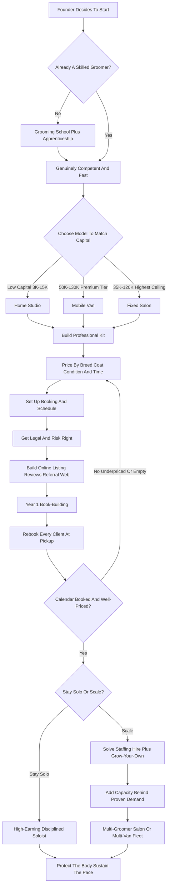

### Direct Answer

To start a pet grooming business in 2027, build it around one repeatable physical service -- bathing, drying, brushing, de-shedding, nail-trimming, ear-cleaning, and haircutting dogs and cats -- delivered out of one of three footprints: a mobile grooming van, a fixed-location salon, or a home-based studio. The model is genuinely durable because grooming is a recurring, self-rebooking need: a doodle needs a full groom every four to eight weeks for its entire life, so one happy client becomes a $600-$1,500-per-year annuity rather than a one-time sale. Viability in 2027 hinges on three things -- being a genuinely skilled groomer, pricing by breed and coat condition rather than vague size tiers, and protecting your body and pace -- and it is a poor fit for anyone expecting passive income or hands-off work.

**TL;DR:** A home studio launches for **$3K-$15K** and clears **$45K-$95K** owner profit once booked. A mobile van launches for **$50K-$130K** all-in and a booked solo van grosses **$120K-$220K** at a **40-55% margin**. A fixed salon launches for **$35K-$120K** and grosses **$180K-$600K+** depending on chairs filled. Grooming is a skilled trade with structurally strong, supply-constrained demand: the constraint is competent groomers, not customers. The three killers are underpricing the service, the physical toll and burnout, and the inability to hire scarce skilled groomers. Win by mastering per-dog pricing as a soloist or solving the groomer-hiring problem to scale.

## 1. What A Pet Grooming Business Actually Is In 2027

### 1.1 The Core Service And The Recurring-Revenue Engine

A pet grooming business sells a repeating physical service: it takes a dirty, overgrown, matted, or shedding animal -- overwhelmingly dogs, with cats a smaller specialty segment -- and returns it clean, dried, brushed, de-shedded, nail-trimmed, ear-cleaned, and, for the breeds that need it, haircut to a breed-appropriate style. **You are not selling a product.** You are selling roughly sixty to a hundred and twenty minutes of skilled hands-on work per animal, over and over, all day.

**The entire business is a single financial idea executed thousands of times.** A dog with a coat that grows -- a poodle, a doodle, a schnauzer, a shih tzu, a bichon -- physically requires a full groom every four to eight weeks for its whole life. One new client is not one sale; it is a subscription that rebooks itself eight to twelve times a year for a decade. A client who pays $90 every six weeks is worth roughly $780 a year and $7,000-plus over the dog's life. **That recurring, self-rebooking demand is the engine**, and it is what makes grooming a structurally better cash business than most one-and-done service trades.

### 1.2 What Shapes The Business In 2027

In 2027 the business is shaped by a few realities. Pet ownership stayed elevated after the early-2020s surge and the "pandemic puppies" are now mature, high-maintenance, often-doodle adult dogs in their peak grooming years. Clients discover groomers online and expect digital booking, reminders, and payment. The supply of skilled groomers did not keep pace with demand -- the constraint on the industry is labor, not customers. And mobile grooming, once a novelty, became a mainstream premium tier.

**Pet grooming is not trendy and it is not passive.** It is a skilled-trade, recurring-revenue, physically demanding service business. For the closest mobile-only treatment of this model, see (q1973), and for the premium mobile variant, see (q9566).

### 1.3 How Grooming Sits Among Adjacent Pet Businesses

Grooming is one node in a wider pet-care economy. Adjacent businesses share the same client base and refer constantly: dog training (q1976), pet sitting (q1972), dog walking (q1971), doggy daycare (q1975), dog boarding (q1974), and the broader veterinary world (q9661). Grooming differs from all of them in one structural way -- it is the most reliably recurring of the pet trades, because the dog's coat keeps growing whether the owner travels or not.

| Pet business | Revenue cadence | Capital intensity | Skill barrier |
|---|---|---|---|
| Grooming | Recurring 4-8 wks | Low to high (by model) | High (skilled trade) |
| Dog walking | Recurring daily/weekly | Very low | Low |
| Pet sitting | Episodic (travel-driven) | Very low | Low to moderate |
| Doggy daycare | Recurring weekday | High (facility) | Moderate |
| Dog boarding | Episodic (travel-driven) | High (facility) | Moderate |
| Dog training | Project-based | Low | High |
| Veterinary clinic | Recurring + episodic | Very high | Very high (licensed) |

## 2. The Three Business Models: Mobile, Salon, And Home Studio

### 2.1 The Mobile Van Model

**The mobile model is a purpose-built or converted van** -- a self-contained grooming salon on wheels with a tub, a hydraulic table, a dryer, water tanks, power, climate control, and lighting -- that drives to the client's home and grooms at the curb. Its advantages: a premium price point (clients pay 30-60% more for the convenience and the one-dog, no-cage experience), no commercial lease, a geographic moat in the route, and intense client loyalty. Its challenges: a high entry cost concentrated in the van, a hard daily ceiling of five to eight dogs because of drive time, breakdown risk, and working in a confined box.

### 2.2 The Fixed-Location Salon Model

**The fixed-location salon model is a leased commercial space** with multiple tubs, multiple tables, kennels, a reception and retail area, and room for two to six groomers. Its advantages: higher total throughput, the ability to build a team, retail and add-on revenue, and a sellable business asset with enterprise value beyond the owner's hands. Its challenges: the lease and build-out cost, the fixed overhead covered every month regardless of bookings, and the staffing problem -- a salon with empty chairs is losing money.

### 2.3 The Home-Based Studio Model

**The home-based studio model is a converted garage, basement, or spare room** with a tub, a table, and a dryer, where clients drop off and pick up. Its advantages: the lowest startup cost, no lease, no commute, and the highest margin because overhead is almost nil. Its challenges: zoning limits, a low throughput ceiling (one groomer, no team), the blurring of home and work, and a lower ceiling on enterprise value.

### 2.4 The Strategic Sequencing Pattern

The pattern most operators follow: **start home-based or mobile to prove the skill and build a book of recurring clients with little capital at risk**, then either stay a high-earning soloist, graduate the home studio into a commercial salon, or add a second and third van. The wrong move is launching straight into a six-chair salon lease with no client book and no groomers hired.

| Model | All-in startup | Booked gross | Owner margin | Daily ceiling | Scaling path |
|---|---|---|---|---|---|
| Home studio | $3K-$15K | $45K-$95K | Very high | 4-7 dogs | Graduate to salon |
| Mobile van | $50K-$130K | $120K-$220K | 40-55% | 5-8 dogs | Add vans to fleet |
| Fixed salon | $35K-$120K | $180K-$600K+ | Chair-dependent | 15-40+ dogs | Add chairs / locations |

## 3. The 2027 Market Reality: Demand, Competition, And What Changed

### 3.1 Demand Is Strong And Supply-Constrained

A founder needs an accurate read of the 2027 landscape -- grooming is neither a saturated dead end nor an effortless goldmine. **Demand is structurally strong and, unusually, supply-constrained.** US pet ownership rose through the early 2020s and stayed elevated; roughly two-thirds of US households own a pet, with a meaningful tilt toward exactly the breeds that need professional grooming -- doodles, poodles, and other curly, fast-matting coats an owner cannot maintain at home. The pandemic puppies of 2020-2021 are now adult dogs in the heart of their grooming-dependent years.

**Critically, the supply of trained groomers did not keep pace.** Grooming is a skilled trade with a thin training pipeline, an aging workforce, and high burnout, so in most markets a competent groomer has a waitlist, not a marketing problem.

### 3.2 The Competitive Layers

**The competition is layered.** At the top of most metros are corporate grooming operations -- the in-store grooming inside large pet retailers such as those run by Petco Health and Wellness (NASDAQ: WOOF) -- plus a mid-tier of established independent salons and an expanding field of mobile operators, under which sits a long tail of home-based groomers. National operators like Chewy (NYSE: CHWY) and pet-retail anchors such as Tractor Supply (NASDAQ: TSCO) increasingly cross-sell pet services, and big-box pet retail measured against general retailers like Walmart (NYSE: WMT) shows how mainstream pet spend has become. **The opportunity for a new disciplined entrant is real because the constraint is groomer capacity:** there is room for a skilled, reliable, well-priced operator in nearly every market.

### 3.3 What Changed By 2027

**What changed by 2027:** online discovery and booking became the default -- clients find groomers through search, maps, and social media and expect online booking, reminders, and digital payment. The doodle wave permanently raised the share of high-maintenance, higher-ticket coats. Mobile grooming moved from novelty to mainstream premium tier. Low-stress, fear-free handling became a real marketing differentiator. And grooming software matured enough that a soloist can run a professional booking-and-reminder operation cheaply.

| 2027 market force | Effect on a new operator |
|---|---|
| Elevated pet ownership | Larger addressable client base |
| Doodle / high-coat tilt | Higher tickets, longer grooms, more skill needed |
| Groomer shortage | Pricing power, waitlists, hard staffing |
| Online discovery default | Listing + reviews are core marketing assets |
| Mobile mainstreaming | Premium tier viable in most metros |
| Fear-free expectations | Gentle handling is a real differentiator |
| Mature software | Soloist can run like a larger operation |

The net market reality: demand is strong and supply-constrained, the skilled-trade barrier protects competent operators, and the winning 2027 entrant competes on skill, reliability, gentle handling, and disciplined pricing rather than on being the cheapest groom in town.

## 4. The Skill Itself: Why Grooming Competence Is The Real Barrier

### 4.1 What "Competent" Actually Means

Before any discussion of vans or leases, a founder must confront the actual barrier to this business: **grooming is a skilled trade, and the skill is the moat.** A competent groomer can safely restrain and read an anxious, aggressive, or wriggling animal; can fully dry a heavy double coat without leaving it damp to mat; can dematt without torturing the dog or make the humane call to shave down; can execute a breed-standard poodle or schnauzer pattern, a teddy-bear doodle face, a hand-stripped terrier coat; can scissor a straight topline; can trim a black nail without quicking it; and can do all of this on the difficult animals as well as the easy ones, eight times a day, without injuring the dog or themselves.

### 4.2 The Real Paths To The Skill

That competence does not come from a weekend. **A grooming school** is a structured program, several weeks to several months, teaching breed patterns, handling, safety, and salon operations. **An apprenticeship** under a working groomer is the traditional path -- bathing and brushing for months before touching scissors, learning on real dogs over a year or more. A **self-taught route** supplemented by online instruction is slower, riskier, and harder to do safely.

| Training path | Typical duration | Cost range | Trade-off |
|---|---|---|---|
| Grooming school | 6-22 weeks | $5K-$15K | Fast, structured, costs money |
| Salon apprenticeship | 12-24 months | Paid (low at first) | Slow, real-dog reps, earn while learning |
| Self-taught + online | Variable, long | Low | Riskiest, hardest to reach safe speed |

### 4.3 Certification And The Honest First Investment

**Certification** -- credentials from bodies like the National Dog Groomers Association of America (NDGAA) or International Professional Groomers (IPG) -- is generally voluntary in the US, but it signals competence and is increasingly expected at the premium end. The honest point: **if you are not already a skilled groomer, your first investment is not a van or a lease, it is the months or years it takes to become genuinely competent and fast.** A slow or unsafe groomer caps their own income, generates complaints, and risks injuring an animal. If you are a skilled groomer working in someone else's salon, you already hold the hard part. If you are not, the first chapter of your plan is training, not equipment -- skill-first sequencing that mirrors other skilled pet trades such as dog training (q1976).

## 5. Mobile Grooming In Depth: The Van, The Build, And The Route

### 5.1 The Two Routes To A Grooming Van

The mobile model deserves its own treatment because **the van is the business**, and the entire capital plan is the vehicle and its build-out. There are two routes: buy a **purpose-built van** from a specialist manufacturer -- a turnkey unit with the tub, hydraulic table, dryers, water system, climate control, and electrical integrated -- or **convert a cargo van** yourself or through a builder.

### 5.2 The Non-Negotiable Van Systems

The systems a working van must have are non-negotiable: a **tub** with hot and cold water, **fresh and gray water tanks**, a **water heater**, a **hydraulic or electric table**, **high-velocity and stand dryers**, **climate control** (a real cost and a real safety issue), **lighting**, **ventilation**, **electrical power** from a generator or shore power, and **storage** for product and tools.

| Van acquisition route | Cost range | Trade-off |
|---|---|---|
| New turnkey purpose-built | $90K-$170K+ | Ready to work, highest capital |
| Used purpose-built | $40K-$90K | Proven systems, depreciation risk |
| Self-converted cargo van | $25K-$60K+ | Lowest cost, build quality varies |

### 5.3 The Route Is The Other Half Of The Asset

**A mobile groomer's profitability is governed by drive time** -- every minute between dogs is unpaid -- so the operator must build a geographically tight route, clustering appointments by neighborhood by day. A booked, well-clustered route is a genuine moat: the clients are loyal and a competitor cannot easily poach a route built on relationships and a known schedule.

The constraints are real: the daily ceiling is roughly five to eight dogs; a breakdown is a day or a week of zero revenue and an expensive repair; and the operator is alone, in a box, all day, in all weather. Mobile is the highest-price-per-dog model and the one with the strongest client loyalty, and also the model where capital is most concentrated in a single depreciating, breakable asset. Founders weighing the mobile-only path should read (q9566) and (q1973) for that variant in full.

## 6. The Fixed Salon In Depth: Space, Build-Out, And Throughput

### 6.1 The Working Infrastructure Of A Salon

The salon model's economics are driven by a different lever: not price per dog, but **chairs filled.** A grooming salon is a leased commercial space built out with the working infrastructure: **multiple bathing tubs** with good drainage, **multiple grooming tables** (one per station), **high-velocity, stand, and cage dryers**, **kennels or crates** for dogs waiting and drying, a **reception area**, a **retail display** if the operator sells product, proper **HVAC and ventilation**, **plumbing** sized for multiple tubs, and **flooring** that survives constant water and cleaning.

### 6.2 The Math Of Capacity

The strategic point about a salon is the math of capacity. **A single-groomer salon is barely better than a home studio but carries a commercial lease**, so the salon model only earns its overhead when multiple stations are filled -- whether by employed W-2 groomers, commission groomers, or booth-rent groomers. That is why the salon's central management challenge is staffing: an empty chair is fixed rent and utilities producing nothing. The dog-to-staff and station-loading math here parallels the facility-ratio thinking covered in (q1135).

| Salon chairs filled | Indicative gross | Owner role |
|---|---|---|
| 1 (owner only) | $90K-$160K | Full-time groomer |
| 2-3 | $180K-$320K | Groomer + light management |
| 4-5 | $320K-$500K | Mostly manager, grooms part-time |
| 6+ | $500K-$700K+ | Full manager / recruiter |

### 6.3 What The Salon Buys When Chairs Are Full

The advantages, when the chairs are full, are real: high total throughput, retail and add-on revenue, a front desk that sells and rebooks, the ability to take overflow, and -- crucially -- a business with enterprise value that does not evaporate when the owner stops grooming. The salon has the highest ceiling and the most operational complexity, and the founder choosing it must understand that they are **signing up to be a manager and a recruiter, not just a groomer.**

## 7. Equipment And Supplies: What You Actually Buy

### 7.1 The Core Cutting And Drying Kit

Regardless of model, a grooming business runs on a specific kit. **The grooming table** -- hydraulic, electric, or fixed-height -- is the central work surface, with a grooming arm and loop to safely position the dog. **Clippers and blades** are the core cutting tools: a quality professional clipper, a full set of blades in the sizes that produce different coat lengths, plus snap-on combs; blades dull and must be sharpened or replaced. **Shears** -- straight, curved, thinning, and blending scissors -- are the finishing tools, expensive, and a serious groomer owns several. **Dryers** -- high-velocity force dryers, stand dryers, and cage dryers used carefully -- are essential and not cheap; drying is half the job.

### 7.2 Bathing, Finishing, And Safety Supplies

**The tub and bathing system** -- with a sprayer, good water pressure, and hot water -- plus **shampoos, conditioners, and de-shedding products** in professional formulations. **Brushes, combs, rakes, and dematting tools** -- slickers, pin brushes, undercoat rakes, mat splitters. **Nail tools** -- clippers, grinders, styptic. **Restraint and safety equipment** -- grooming loops, no-sit haunch holders, muzzles, and a well-stocked first-aid kit. **Sanitation supplies and towels** -- the volume is significant -- plus a way to launder them, and **software and a payment system.**

| Equipment category | Starter spend | Notes |
|---|---|---|
| Grooming table + arm | $200-$1,200 | Hydraulic preferred for ergonomics |
| Clippers, blades, combs | $600-$2,000 | Ongoing sharpening cost |
| Shears (full set) | $300-$1,500 | Expensive, multiple needed |
| Dryers (HV + stand) | $400-$1,500 | Drying is half the job |
| Brushes / dematting tools | $200-$600 | Wears out, needs replacing |
| Shampoo / product (initial) | $200-$600 | Professional formulations |
| Towels + laundry capacity | $200-$800 | High consumption |

The discipline is to **buy professional-grade tools that hold up to daily use** rather than consumer equipment that fails -- while not over-buying boutique gear before the revenue justifies it.

## 8. The Core Unit Economics: Price Per Dog And Dogs Per Day

### 8.1 The Brutal Equation

This is one of the two most important sections in the guide, because grooming economics reduce to a simple, brutal equation: **revenue is price per dog multiplied by dogs per day multiplied by working days, and profit is what survives after the cost of doing each dog and the fixed overhead.** Every lever in the business is one of those numbers.

### 8.2 Price Per Dog And Dogs Per Day

**Price per dog** in 2027 varies widely by model, market, breed, and coat condition -- a full groom on a small, easy dog might run $55-$85 in a salon, a large or matted dog $90-$160-plus, and the same services on a mobile van carry a 30-60% premium. **Add-ons** -- de-shedding, teeth brushing, specialty shampoos, nail grinding, de-matting time -- lift the ticket meaningfully and are where disciplined operators protect their margin.

**Dogs per day** is governed by model and the groomer's speed: a mobile groomer realistically does five to eight dogs a day because of drive time; a salon groomer at a fast pace might do six to ten; a home studio operator somewhere in between. The realistic ceiling on a single groomer's daily count is examined in depth in (q1137).

| Groom type | Salon price | Mobile price (premium) | Typical time |
|---|---|---|---|
| Small easy dog, full groom | $55-$85 | $80-$130 | 60-90 min |
| Large / double-coat full groom | $90-$160+ | $130-$230+ | 90-150 min |
| De-shed add-on | $15-$40 | $20-$55 | +15-30 min |
| Nail trim only | $12-$25 | $20-$40 | 10-15 min |
| Bath & tidy (no haircut) | $35-$60 | $55-$95 | 45-60 min |
| Cat full groom | $75-$140 | $110-$190 | 60-120 min |

### 8.3 What Survives After Costs

The cost of doing each dog -- product, blade and shear wear, towels and laundry, water and power, software and payment fees -- is real but modest as a percentage of a well-priced groom. The larger costs are the operator's own labor and, in salon and fleet models, staff pay and fixed overhead. A solo home studio runs a very high margin; a solo mobile van runs a 40-55% owner margin after fuel, maintenance, insurance, and depreciation; a salon's margin depends entirely on filling chairs. **A founder must know their real price per dog, their honest dogs-per-day capacity, and their cost per dog -- and must price so that a full day of work produces a genuinely good income, not a hobby wage.**

## 9. Pricing Strategy: The Single Biggest Determinant Of Income

### 9.1 Why Small / Medium / Large Pricing Traps Groomers

This is the other most important section, because pricing is where skilled groomers most reliably leave money on the table. The core problem is the legacy **"small / medium / large" pricing model** -- pricing a groom by the dog's rough size when the actual cost driver is **time**, and time is driven by breed, coat type, coat condition, behavior, and the style requested. A matted large doodle and a clean, cooperative large lab are both "large dogs" but could not be more different in the work they demand; charging them the same price means the doodle is wildly underpriced and subsidized by the groomer's unpaid effort.

### 9.2 The Disciplined 2027 Pricing Approach

**The disciplined 2027 pricing approach: price by breed and service, with explicit add-ons and explicit condition surcharges.** A breed-and-coat-based price list, a stated de-matting fee or "de-matting is billed by time" policy, an add-on menu, and a clear policy that an aggressive or extremely difficult dog carries a handling surcharge -- all of these convert hidden unpaid labor into paid revenue.

| Pricing lever | What it does | Common mistake |
|---|---|---|
| Breed/coat price list | Matches price to real time | Using vague S/M/L tiers |
| De-matting fee (by time) | Pays for the worst work | Absorbing it for free |
| Add-on menu | Lifts ticket and margin | Treating it as an afterthought |
| Handling surcharge | Pays for difficult dogs | Eating the risk and time |
| Regular price increases | Keeps pace with costs | Holding prices for years |
| Waitlist-as-signal | Tells you to raise prices | Working more hours instead |

### 9.3 Raise Prices And Read The Waitlist

Two further pricing disciplines matter enormously. **First, raise prices regularly.** Costs rise -- product, fuel, rent, the groomer's cost of living -- and a groomer who has not raised prices in three years is quietly taking a pay cut every year. **Second, use the waitlist as the pricing signal.** If a groomer is booked weeks out, the market is telling them the price is too low; the correct response is not to work more hours, it is to raise prices and let the price ration demand. The mobile premium, the add-on menu, the surcharges, and regular increases are the difference between a professional income and a hobby wage while booked solid.

## 10. Scheduling, Booking, And The Daily Operation

### 10.1 The Booking System Backbone

The daily operation of a grooming business is a scheduling problem. **The booking system is the backbone:** grooming-specific software handles online booking, the calendar, automated reminders, digital intake forms, client and pet records (breed, coat, behavior notes, vaccination records, the style the owner wants), and payment. In 2027 clients expect to book and be reminded digitally, and a no-show is a lost hour that cannot be recovered, so reminder automation and a clear cancellation policy directly protect revenue.

### 10.2 Building The Schedule And Rebooking At Pickup

**The schedule itself must be built around realistic per-dog times.** A founder who books dogs too tightly runs late all day, stresses the animals, and burns out; one who books too loosely leaves money on the table. The mature approach is to time-block by the actual breed and service, leave buffer for the difficult dogs, and -- critically -- **rebook the client before they leave.** The single highest-leverage operational habit in grooming is booking the next appointment at pickup, because it converts a one-time groom into the recurring annuity the whole model depends on.

### 10.3 Capacity Discipline And The Daily Flow

**The daily flow** -- check-in, bath, dry, finish, check-out, rebook in a salon; drive, set up, groom, check out, drive in a van -- should be a designed routine, not improvised. **Capacity discipline matters too:** a founder must decide their honest sustainable dogs-per-day number and hold to it, because the temptation to cram one more dog in is how grooming businesses become injury-and-burnout machines. The operators who run a tight schedule extract far more income and far less stress from the same skill.

## 11. Startup Cost Breakdown: The Honest All-In Numbers By Model

### 11.1 The Home Studio

**The home-based studio is the lowest-cost entry:** a grooming table, a quality clipper, blades, shears, dryers, a tub or tub conversion, brushes and nail tools, initial product, towels and laundry capacity, software, business formation, licensing, insurance, and basic marketing -- a realistic all-in of roughly **$3,000-$15,000.** The detailed line items appear in the table below.

### 11.2 The Mobile Van And The Fixed Salon

**The mobile van is dominated entirely by the vehicle:** a self-converted cargo van ($25,000-$60,000+), a used purpose-built van ($40,000-$90,000), or a new turnkey van ($90,000-$170,000+), on top of which sit the same tools and product, commercial auto and liability insurance, licensing, and marketing -- a realistic all-in of roughly **$50,000-$130,000+.** **The fixed salon carries the lease and build-out:** deposits, build-out, multiple tubs, tables, dryers, kennels, reception and retail fit-out, tools, signage, insurance, software, marketing, and a working-capital reserve -- a realistic all-in of roughly **$35,000-$120,000+.**

| Cost line | Home studio | Mobile van | Fixed salon |
|---|---|---|---|
| Vehicle / lease / build-out | $300-$4,000 (tub) | $25K-$170K (van) | $13K-$95K |
| Equipment package | $1,800-$6,500 | $1,800-$6,500 | $8K-$30K |
| Product / supplies (initial) | $400-$1,400 | $400-$1,400 | $1K-$3K |
| Insurance / licensing | $500-$2,000 | $2,000-$6,000 | $2K-$6K |
| Marketing / website | $300-$1,500 | $500-$2,500 | $1K-$5K |
| Working-capital reserve | Light | $3K-$8K | $10K-$30K |
| Realistic all-in | $3K-$15K | $50K-$130K+ | $35K-$120K+ |

### 11.3 The Strategic Read Of The Numbers

The strategic read: **the home studio is the de-risked way to prove the skill and build a client book with little capital exposed; the van and the salon are real capital commitments that should follow a proven book of recurring clients, not precede it.** This staged-capital logic is the same one that protects new entrants in pet sitting (q1972) and dog walking (q1971).

## 12. The Year-One Operating Reality

### 12.1 Book-Building And Routine-Building Mode

A founder should walk into Year 1 with accurate expectations. **Year 1 is book-building and routine-building mode.** The first months are spent filling a calendar that starts mostly empty, learning the true time each breed takes in your own hands, discovering the difficult dogs, building the rebooking habit, and finding the sustainable daily dog count before the body protests.

### 12.2 Year-One Results By Model

A disciplined Year 1 looks different by model. A **home studio** operator might clear $25,000-$60,000 in the first year and $45,000-$95,000 once genuinely booked. A **mobile van** operator carries the van's costs from day one and spends Year 1 filling and tightening a route, possibly netting modestly at first and reaching a $120,000-$220,000 gross at a 40-55% owner margin once booked. A **salon** operator is often the primary groomer while trying to fill the other chairs, carrying lease and any staff cost, and Year 1 can be break-even or a loss until the chairs fill -- which is exactly why the working-capital reserve matters.

| Model | Year-1 result (building) | Once booked |
|---|---|---|
| Home studio | $25K-$60K | $45K-$95K owner profit |
| Mobile van | Modest net, route filling | $120K-$220K gross |
| Fixed salon | Break-even or loss | Depends on chairs filled |

### 12.3 What Year One Really Teaches

Year 1 is when a founder discovers whether their body, their pricing, and their scheduling can sustain the pace. It is also when the recurring-revenue engine starts to show: by the end of a well-run Year 1, a meaningful share of the calendar is repeat clients on a six-to-eight-week cycle. **The founders who succeed treat Year 1 as paid tuition in the business of grooming** -- the pricing, the scheduling, the rebooking, the pace -- on top of the grooming skill they already had.

## 13. The Five-Year Revenue Trajectory

### 13.1 Years One Through Three

Mapping a realistic five-year arc helps a founder size the opportunity honestly. **Year 1:** book-building, routine-building, model-dependent results; the founder is hands-on with every dog. **Year 2:** the book matures, repeat clients dominate, pricing has been raised at least once -- a booked solo home studio reaches roughly $55K-$110K in owner income, a booked solo mobile van $120K-$220K gross with $55K-$110K owner profit, and a salon with three or four chairs filled starts generating real owner profit. **Year 3:** the strategic fork arrives -- the solo operator is now capped by the hours in their own hands; a salon with chairs filled reaches $180K-$400K gross with owner profit of $60K-$150K; a two-van mobile operation can reach $250K-$450K gross.

### 13.2 Years Four And Five

**Year 4:** continued capacity-building -- a three-to-four-van fleet, a fuller salon, possibly daycare layered in -- pushes a multi-unit operation toward $350K-$700K gross with owner profit of $90K-$220K. **Year 5:** a mature operation reaches $400K-$900K+ gross with owner profit of $110K-$280K for the operator who solved scaling, while the disciplined soloist sits comfortably at $70K-$140K with low overhead and no staff headaches.

| Year | Solo home studio | Solo mobile van | Scaled salon / fleet |
|---|---|---|---|
| 1 | $25K-$60K | Route filling | Break-even / loss |
| 2 | $55K-$110K | $120K-$220K gross | First real owner profit |
| 3 | $70K-$120K | $130K-$220K gross | $180K-$400K gross |
| 4 | $80K-$130K | Add 2nd van | $350K-$700K gross |
| 5 | $70K-$140K | $250K-$450K gross | $400K-$900K+ gross |

### 13.3 The Honest Summary

These numbers assume disciplined per-dog pricing, religious rebooking, honest capacity limits, and -- for the scaled outcomes -- solving the groomer-hiring problem. **Solo grooming is a reliably good wage with a real ceiling; scaled grooming is a real small business with a higher ceiling and a harder management problem.**

## 14. Five Named Real-World Operating Scenarios

### 14.1 The Disciplined Soloist And The Cautionary Tale

**Scenario one -- Dana, the disciplined soloist:** trained at a grooming school, apprenticed two years, then launched a home studio for about $9,000; she prices by breed and coat, rebooks every client at pickup, raises prices annually, and caps herself at six dogs a day; by Year 3 she is booked eight weeks out and clears about $95,000 with almost no overhead. **Scenario two -- the cautionary tale, Marcus:** signed a six-chair salon lease before he had a client book or a single groomer hired; he carried full rent while grooming alone, could not recruit groomers, ran out of working capital in month seven, and closed.

### 14.2 The Mobile Builder And The Well-Run Salon

**Scenario three -- Priya, the mobile route-builder:** bought a used purpose-built van for about $70,000, spent Year 1 clustering a tight route, priced at a real mobile premium, and built a loyal book; by Year 3 she is booked solid, grossing about $190,000 solo, and is buying a second van. **Scenario four -- the Okafor salon, capacity done right:** opened a four-chair salon but filled it deliberately -- one commission groomer at launch, a second by month eight, a third in Year 2; by Year 4 the salon grosses about $480,000 and has real enterprise value.

### 14.3 The Burnout Casualty

**Scenario five -- Tomas, the burnout casualty:** a skilled groomer who priced low, never raised prices, and crammed nine and ten dogs a day; by Year 2 he had a repetitive-strain injury, was booked solid at a hobby wage, and quit the trade.

| Scenario | Model | Key choice | Outcome |
|---|---|---|---|
| Dana | Home studio | Priced right, capped pace | $95K, happy soloist |
| Marcus | Salon | Capacity before demand | Closed in month 7 |
| Priya | Mobile van | Tight route, premium price | $190K, scaling to 2 vans |
| Okafor | Salon | Filled chairs deliberately | $480K, sellable asset |
| Tomas | Salon/solo | Underpriced, overbooked | RSI, quit the trade |

These five span the realistic distribution: the disciplined soloist, the over-built-capacity failure, the mobile route success, the well-managed salon, and the pricing-and-pace burnout.

## 15. Lead Generation: How Grooming Clients Actually Find You

### 15.1 Online Discovery And Reviews

Pet grooming is partly a discovery business and largely a referral-and-retention business. **Online discovery is the front door.** In 2027 most new clients find a groomer through search and maps -- a complete, well-reviewed local listing with photos and online booking is the single most important marketing asset. **Reviews are the currency** -- grooming is a trust purchase, and a steady flow of genuine positive reviews, actively requested from happy clients, is what converts a search into a booking.

### 15.2 Social, Referrals, And Adjacent Businesses

**Social media** -- before-and-after photos, the fluffy doodle transformation -- is genuinely effective because the results are visual and shareable. **Referrals are the compounding engine** -- a happy client tells the neighbor with the other doodle. **Veterinary, pet store, daycare, and breeder relationships** are a steady qualified-referral source. Cultivating referral relationships with a local dog walker (q1971), pet sitter (q1972), or doggy daycare (q1975) builds a two-way pipeline.

| Channel | Role | Effort to build |
|---|---|---|
| Search / maps listing | Front door for new clients | Moderate, then maintain |
| Reviews | Converts search to booking | Ongoing ask discipline |
| Social before/after | Brand + trust building | Ongoing content |
| Client referrals | Compounding free growth | Earned via good work |
| Adjacent-business web | Steady qualified leads | Relationship cultivation |
| Rebooking / retention | Keeps the recurring book | Habit at every pickup |

### 15.3 Retention Is The Real Growth Lever

**Retention is the real growth lever**, cheaper and more reliable than acquisition: the rebooking-at-pickup habit, the automated reminders, the consistency of a good groom, and being reliable and gentle keep the recurring book intact. The discipline: build the online listing and reviews, post the visual transformations, cultivate the referral web, and -- above all -- retain relentlessly, because the client you keep is worth far more than the client you chase.

## 16. Staffing And The Groomer-Hiring Problem

### 16.1 Why Skilled Groomers Are Scarce

For any founder who wants to scale past their own two hands, staffing is the central, defining challenge. **Skilled groomers are scarce.** The training pipeline is thin, the workforce is aging, the burnout rate is high, and demand outpaced the supply of groomers. This is the reason salons sit with empty chairs and fleet ambitions stall.

### 16.2 Compensation Models And Growing Your Own

There are a few real approaches. **Hire experienced groomers** -- the fastest path to filled capacity, but the hardest and most competitive. **Compensation models** vary: **commission** (a percentage of what the groomer bills), **booth rent** (the groomer rents a station and runs their own book), and **W-2 hourly or salary** (more control, more owner risk). **Build your own pipeline** -- hire bathers and brushers and train them up; slow, but the most durable answer to the scarcity.

| Comp model | Owner control | Owner risk | Best for |
|---|---|---|---|
| W-2 hourly / salary | High | High | Consistent salon standards |
| Commission | Medium | Medium | Aligned incentive, common |
| Booth rent | Low | Low | Low-overhead station fill |

### 16.3 Retention And Support Staff

**Retention is as important as hiring** -- because groomers are scarce, an owner who creates a good environment (fair pay, manageable dog counts, a sane schedule) keeps their team. **Front-desk and bather staff** also matter: a salon that has groomers do their own check-in and bathing is wasting expensive skilled time. The strategic truth: a soloist can sidestep this entirely; a founder who wants to scale must accept that **solving the groomer problem -- through competitive hiring plus grow-your-own training -- is the actual work of scaling.** The same staff-ratio and labor-cost math shapes adjacent facility businesses such as doggy daycare (q1135).

## 17. Health, Safety, And The Physical Toll

### 17.1 Repetitive Strain And Ergonomics

A founder must take the physical reality of grooming seriously -- it is the quiet reason many skilled groomers leave the trade. **Grooming is physically demanding** -- hours on your feet, bending over a table, lifting and restraining animals, fine repetitive scissor and clipper work, in a wet, warm, hairy environment. **Repetitive strain injuries** to wrists, hands, and shoulders are common and career-threatening, and an operator must manage them with good ergonomics (an adjustable hydraulic table is injury prevention, not a luxury), sharp tools, and a sane dog count.

### 17.2 Animal-Handling And Animal-Safety Risk

**Animal-handling risk is real:** dog bites, scratches, and the strain of controlling a frightened animal are part of the job; safe restraint technique, reading animal stress, muzzling when necessary, and being willing to stop an unsafe groom are core competence. **Animal safety is also a liability issue:** dryer heat, cuts and quicked nails, a dog jumping from a table, heat stress, and fragile elderly animals all demand care.

| Hazard | Mitigation |
|---|---|
| Repetitive strain injury | Hydraulic table, sharp tools, paced dog count |
| Dog bites / scratches | Safe restraint, stress-reading, muzzling |
| Cage-dryer heat | Attended use, conservative settings |
| Falls from table | Loops, never leaving a dog unattended |
| Zoonotic exposure | Cleaning protocols, vaccination policy |
| Burnout | Pace discipline, sustainable schedule |

### 17.3 Burnout Is Structural

**Burnout is structural:** the combination of physical toll, emotional labor, and the temptation to overbook is why pace discipline is not optional. The founders who have long careers treat their body as the irreplaceable business asset it is; the ones who treat themselves as infinitely exploitable get an injury and a short career.

## 18. Licensing, Insurance, And The Regulatory Picture

### 18.1 Licensing And Zoning

A founder should set up the legal and risk side deliberately. **Groomer licensing is generally not required** at the federal level and is required by relatively few states or localities -- which means the competence bar is set by the market and by certification, not by law. **Business licensing and permits** are required: a business license, an entity registration, a sales-tax permit if selling retail, and -- importantly -- **zoning and permitting** clearance, which matters enormously for the home-studio model (many residential zones restrict a client-facing home business) and for the salon (commercial zoning and any animal-business permits).

### 18.2 Insurance Is Non-Negotiable And Specific

**Insurance is non-negotiable and specific.** A grooming business needs **general liability** (slip-and-fall, property damage) and, critically, **animal bailee or "care, custody, and control" coverage** -- because the animals in your care are not covered by standard general liability, and an injury to a dog while you are grooming it is exactly the claim that coverage exists for. A **mobile** operator also needs **commercial auto**, and any operator with employees needs **workers' compensation.**

| Coverage | What it protects | Who needs it |
|---|---|---|
| General liability | Slip-and-fall, property damage | All operators |
| Animal bailee / care-custody-control | Injury to an animal in your care | All operators |
| Commercial auto | The built-out van | Mobile operators |
| Workers' compensation | Employee injury | Operators with staff |
| Property / contents | Equipment, build-out | Salon, van |

### 18.3 Paperwork And The Discipline

**Vaccination policies** -- requiring proof of rabies and core vaccinations -- protect the business and should be written and enforced. **Clear service agreements and intake forms** -- documenting the dog's condition, behavior, the owner's instructions, the matting policy, and the operator's right to make humane decisions on a severely matted coat -- protect both sides. The discipline: separate business banking, an entity, the right insurance with explicit animal-care coverage, verified zoning before build-out, a vaccination policy, and solid intake paperwork.

## 19. Add-On Services And The Path To A Fuller Pet-Care Business

### 19.1 The Add-On Menu And Retail

**Within grooming itself, the add-on menu** -- de-shedding treatments, teeth brushing, nail grinding, specialty and medicated shampoos, flea-and-tick treatments, "face, feet, and fanny" trims between full grooms, de-matting time -- meaningfully lifts the average ticket and the margin. **Retail** -- shampoos, brushes, treats, and accessories sold from a salon's front display -- adds margin for a fixed location, though it is inventory to manage.

### 19.2 Adjacent Pet Services

**Beyond grooming, the adjacent services** that grooming businesses commonly layer in are **dog daycare** (q1975), **dog boarding** (q1974), **dog walking and pet sitting** (q1972), **dog training** (q1976), and **self-service dog wash.** Even a specialized comfort service like mobile dog massage (q2089) shows how broad the layered pet-care opportunity has become.

| Adjacent service | Capital | Cadence | Synergy with grooming |
|---|---|---|---|
| Dog daycare | High (facility) | Recurring weekday | Steady stream of groom clients |
| Dog boarding | High (facility) | Episodic | Cross-sell groom-before-pickup |
| Dog walking / sitting | Very low | Recurring / episodic | Two-way referrals |
| Dog training | Low | Project-based | Shared trust-purchase clients |
| Self-service dog wash | Moderate | Recurring | Low-labor revenue add |

### 19.3 Add Deliberately, One Step At A Time

The strategic point: **grooming is an excellent core because of its recurring revenue and high client trust**, and it can stay a focused specialty or anchor a fuller pet-care business -- but each adjacent service is its own operation with its own facility, staffing, licensing, and liability profile. A founder should add them deliberately, one proven step at a time, not launch a daycare-boarding-grooming-retail complex on day one.

## 20. Cat Grooming And Other Specialty Niches

### 20.1 Cat Grooming As An Underserved Niche

A founder should know the specialty paths. **Cat grooming is a genuine, underserved specialty:** cats require very different handling, restraint, and skill from dogs; many general groomers will not take cats; the demand -- de-shedding, sanitary trims, lion cuts, mat removal, nail care -- is real and the supply of competent cat groomers is thin, so a groomer who masters cat handling can build a high-value, low-competition niche. **Mobile cat-only grooming** is an even narrower, even more defensible niche.

### 20.2 The Other Specialty Paths

**Large-breed and double-coated specialists** can own the segment many salons rush or avoid. **Hand-stripping and breed-standard show-style grooming** for terriers and sporting breeds is a high-skill, premium niche. **Senior and special-needs pet grooming** -- gentle handling of elderly, arthritic, or fragile animals -- is an underserved, trust-intensive niche. **Fear-free certified grooming** is increasingly a marketable differentiator. **"Express" grooming** for easy, well-maintained dogs is a volume play.

| Niche | Why it works | Trade-off |
|---|---|---|
| Cat grooming | Thin supply, real demand | Harder, specialized handling |
| Large / double-coat | Avoided by many salons | Physically heavier work |
| Hand-stripping / show | Premium, scarce skill | Slow, training-intensive |
| Senior / special-needs | Trust compounds, underserved | Emotional labor, fragility |
| Fear-free certified | Marketable differentiator | Certification effort |

### 20.3 The Strategic Point On Niches

The general dog-grooming model is the most common starting point and a good business, but the specialty paths -- **cat grooming above all** -- can deliver higher margins, lower competition, and pricing power. The mistake is not choosing a niche; it is being mediocre and undifferentiated in a market where the harder-skilled operator commands the premium.

## 21. Scaling Past The Solo Operator Ceiling

### 21.1 The Prerequisites For Scaling

The jump from a high-earning soloist to a multi-groomer or multi-van business is a genuine change in what the business is. The prerequisites: a proven, full, well-priced book (do not scale on top of empty capacity or hobby-wage pricing); a documented way of working someone else can be trained into; the working capital to carry the new van or chair before it pays for itself; and, above all, a real answer to the groomer-hiring problem.

### 21.2 The Scaling Levers And Constraints

The scaling levers: **add capacity in step with proven demand** -- a second van for an overflowing route, a hired groomer for a salon with a waitlist -- never ahead of demand; **solve staffing through competitive hiring plus grow-your-own training**; **build the management layer**; **systematize the standards** so a four-groomer salon delivers a consistent groom; and **add adjacent services only from a position of strength.** The constraints are the skilled-groomer labor market (first and hardest), the owner's own time, facility or fleet capacity, and working capital.

| Scaling lever | Constraint it solves |
|---|---|
| Add capacity behind demand | Avoids empty-overhead failure |
| Hire + grow-your-own training | Scarce-groomer labor market |
| Management layer | Owner-time bottleneck |
| Systematized standards | Inconsistent multi-groomer quality |
| Working-capital reserve | Cash gap before capacity pays |

### 21.3 The Strategic Decision At Maturity

The decision that arrives at maturity: stay a focused multi-groomer business, build a pet-care hybrid with daycare and boarding, expand the fleet or open a second location, or position for sale. The founders who scale well treated the solo phase as the proving ground for a repeatable system. They also know the honest alternative: **a disciplined, well-priced, low-overhead solo grooming business is itself an excellent outcome**, and choosing not to scale is a legitimate, often wise, decision.

## 22. Taxes, Structure, And The Financial Backbone

### 22.1 Entity And Depreciation

**Entity:** most grooming operators form an LLC for liability protection (especially important given the animal-care exposure), with an S-corp election worth considering as profit grows. **Equipment and vehicle depreciation** matters: the van, the tables, the dryers, and the major equipment are depreciable assets, and for a mobile operator -- where a six-figure van is the core asset -- the depreciation strategy materially shapes taxable income.

### 22.2 Sales Tax, Payroll, And Deductions

**Sales tax** applies to retail product sales and, in some jurisdictions, to the grooming service itself. **Payroll taxes** on W-2 staff and correct **worker classification** (the commission-versus-booth-rent-versus-employee distinction has real tax and legal consequences) must be handled properly. **Deductible expenses** -- product, equipment, vehicle costs and mileage, insurance, software, rent, marketing, continuing education -- are real and a clean bookkeeping system captures them.

| Financial element | Discipline |
|---|---|
| Entity (LLC, later S-corp) | Liability protection, tax efficiency |
| Equipment / vehicle depreciation | Knowledgeable accountant earns the fee |
| Sales tax | Check local rules, remit from day one |
| Worker classification | Commission vs booth vs W-2 done right |
| Separate business banking | From day one, non-negotiable |
| Cash-flow reserve | Covers book-building / chair-filling gap |

### 22.3 The Discipline

The discipline: separate business banking from day one, a bookkeeping system tracking revenue per groomer and per service, quarterly attention to sales and estimated taxes, correct worker classification if hiring, and an accountant who understands equipment-heavy service businesses.

## 23. Counter-Case: When A Pet Grooming Business Is The Wrong Move

### 23.1 The Honest Reasons Not To Start

Not every founder should start a grooming business, and the honest counter-case is as important as the playbook. **If you are not a skilled groomer and not willing to spend the months or years to become one, do not start** -- the skill is the barrier, and the business cannot outrun a thin skill. **If your body cannot sustain hours of bending, lifting, restraining, and fine repetitive hand work, do not start** -- the trade will injure you, and there is no revenue on a day you cannot work. **If you want passive or hands-off income, do not start** -- every version of this model is hands-on, and the soloist *is* the business.

### 23.2 The Capital And Discipline Misfits

**If you cannot capitalize the model you want, do not launch it** -- a six-chair salon lease with no client book and no groomers hired is the canonical fast failure (Marcus, in Scenario 14.1). **If you will not enforce pricing discipline** -- if you will fall into vague small/medium/large pricing and never raise prices -- you will earn a hobby wage while booked solid (Tomas, in Scenario 14.3). **If you want to scale but are unwilling to become a recruiter and trainer of a scarce workforce**, you will stay a soloist with a lease and empty chairs.

| Founder profile | Verdict |
|---|---|
| Not skilled, unwilling to train | Do not start -- skill is the moat |
| Body cannot sustain the toll | Do not start -- the trade injures you |
| Wants passive income | Do not start -- no hands-off version exists |
| Cannot capitalize chosen model | Downsize the model or wait |
| Will not price with discipline | Do not start -- hobby-wage trap |
| Wants scale, dislikes managing people | Start, but stay a soloist |

### 23.3 When An Adjacent Pet Business Fits Better

For some founders, an adjacent pet business is the better fit. A founder who loves animals but lacks grooming skill and capital might do better with the lower-skill, lower-capital path of dog walking (q1971) or pet sitting (q1972). A founder who wants a facility business and is comfortable managing staff might prefer doggy daycare (q1975) or dog boarding (q1974). A founder drawn to a high-skill, low-capital, project-based model might prefer dog training (q1976), and one who wants the broadest medical-grade pet business should weigh the very different economics of a veterinary clinic (q9661). Grooming is an excellent business -- for the competent, body-aware, pricing-disciplined operator -- and a poor one for everyone else. Recognizing which group you are in before spending money is the single most valuable decision in this guide.

## 24. The 2027-2030 Outlook: Where This Model Is Heading

### 24.1 Demand And The Labor Constraint

**Demand stays structurally strong.** Pet ownership remained elevated, the doodle and high-coat share is durable, and the pandemic-era puppies are mature dogs in their peak grooming years. **The labor constraint persists and may tighten.** The groomer-supply shortage is structural -- a thin pipeline, an aging workforce, real burnout -- and unless the pipeline expands, skilled groomers stay scarce, which keeps competent operators in demand and supports continued price strength.

### 24.2 Mobile, Fear-Free, And Software

**Mobile keeps growing as a mainstream premium tier** -- the convenience, the low-stress experience, and route-based loyalty are durable advantages. **Low-stress and fear-free handling becomes a baseline expectation**, not just a niche differentiator. **Software keeps professionalizing the small operator** -- booking, reminders, records, payment, and marketing tools get better and cheaper, letting a soloist run like a much larger operation.

### 24.3 Consolidation And AI

**Consolidation continues modestly** -- well-run multi-location and multi-van operators absorb share -- but the trade's skill-and-labor intensity limits how fast it can be rolled up. **AI and tooling assist the back office** without touching the irreducibly hands-on core: a dog still has to be bathed, dried, and scissored by a skilled human. The net outlook: pet grooming is **viable and durable through 2030 in its skilled-trade, recurring-revenue, disciplined-pricing form.**

## 25. The Final Framework: Building It Right From Day One

### 25.1 The Operating Sequence

Pulling the playbook into one framework, a founder should execute in this order. **First, secure the skill** -- be a genuinely competent, reasonably fast groomer before anything else. **Second, choose the model to match the capital and the goal** -- a low-cost home studio to prove the book, a mobile van for the premium tier and route moat, or a salon for the highest ceiling. **Third, build the kit right** -- professional-grade table, clippers, blades, shears, dryers, and bathing system. **Fourth, price by breed, coat, condition, and time** -- with an explicit add-on menu and condition surcharges, and commit to raising prices regularly.

### 25.2 The Operating Discipline

**Fifth, design the schedule and the booking system** -- realistic per-dog times, automated reminders, an enforced cancellation policy, and an honest sustainable dogs-per-day cap. **Sixth, rebook every client at pickup.** **Seventh, protect your body** -- the right table at the right height, sharp tools, ergonomics, a sane pace. **Eighth, get the legal and risk side right** -- LLC, the correct insurance with explicit animal-care coverage, verified zoning, a vaccination policy, solid intake paperwork.

### 25.3 The Decision Diagram And Closing Read

**Ninth, build the online listing, the reviews, and the referral web.** **Tenth, decide deliberately whether to stay solo or scale.** **Eleventh, if scaling, add capacity only behind proven demand.** **Twelfth, run the financial backbone.** The flowchart below captures the full sequence:

Do these twelve things in order and a pet grooming business in 2027 is a legitimate path to either a reliably good solo income of $70K-$140K or a real, sellable, multi-groomer business grossing $400K-$900K+. Skip the discipline -- on the skill, the pricing, the pace, and the staffing -- and it is a fast way to be a fully booked, injured, hobby-wage groomer, or a salon owner with a lease and empty chairs. The business is neither a passive pet-lover's dream nor a saturated dead end. **It rewards exactly one kind of founder: the competent, disciplined, body-aware operator who treats it as the skilled service business it actually is.**

## Sources

1. American Pet Products Association (APPA) -- National Pet Owners Survey, pet ownership and spending data, 2026-2027.
2. American Veterinary Medical Association (AVMA) -- US pet ownership statistics and demographics.
3. US Bureau of Labor Statistics -- Occupational data for animal care and service workers, including groomers.
4. National Dog Groomers Association of America (NDGAA) -- Certification standards and groomer credentialing.
5. International Professional Groomers (IPG) -- Professional certification and grooming standards.
6. IBISWorld -- Pet Grooming and Boarding Services in the US industry report, 2026-2027.
7. Pet Industry Joint Advisory Council (PIJAC) -- Industry regulatory and policy overview.
8. US Small Business Administration (SBA) -- Guidance on service-business formation, licensing, and financing.
9. Petco Health and Wellness (NASDAQ: WOOF) -- Investor disclosures on grooming and pet-services revenue.
10. Chewy, Inc. (NYSE: CHWY) -- Investor materials on pet-services and cross-sell strategy.
11. Tractor Supply Company (NASDAQ: TSCO) -- Disclosures on pet-category and pet-service expansion.
12. Walmart Inc. (NYSE: WMT) -- Retail context for mainstream pet-category spend.
13. American Pet Products Association -- "Pandemic puppy" cohort analysis and breed-mix trends.
14. Professional Pet Groomers and Stylists Alliance -- Standards of care and safety guidance.
15. Fear Free LLC -- Low-stress handling certification framework.
16. US Internal Revenue Service -- Business entity, depreciation, and worker-classification guidance.
17. National Association of Insurance Commissioners -- Animal bailee and care-custody-control coverage overview.
18. State and municipal zoning ordinances -- Home-occupation and commercial animal-business permitting (representative US jurisdictions).
19. Grooming Business in a Box / industry training providers -- Curriculum and apprenticeship-pathway descriptions.
20. PetSmart -- Public materials on in-store grooming operations and pricing tiers.
21. Mobile grooming van manufacturers (industry composite) -- Build specifications and turnkey pricing.
22. Pet-business software vendors (industry composite) -- Booking, reminder, and records feature sets.
23. Veterinary and pet-retail referral surveys -- Adjacent-business referral patterns.
24. Insurance Information Institute -- Commercial auto and general-liability coverage basics.
25. US Department of Labor -- Workers' compensation and employee-classification requirements.
26. American Animal Hospital Association -- Vaccination and animal-health policy context.
27. Industry trade publications (Groomer to Groomer; Pet Age) -- Pricing-model and operations coverage, 2026-2027.
28. Pulse RevOps internal analysis -- Grooming unit economics: price-per-dog and dogs-per-day modeling.
29. Pulse RevOps internal analysis -- Three-model startup-cost benchmarking (home studio, mobile, salon).
30. Pulse RevOps internal analysis -- Five-year revenue-trajectory modeling by model.
31. Pulse RevOps internal analysis -- Groomer-labor-market scarcity and staffing-cost study.
32. Pulse RevOps internal analysis -- Mobile route-density and drive-time profitability modeling.
33. Pulse RevOps operator interviews -- Solo, mobile, and multi-groomer salon case composites.
34. Pulse RevOps internal analysis -- Add-on-menu and retention-driven margin study.
