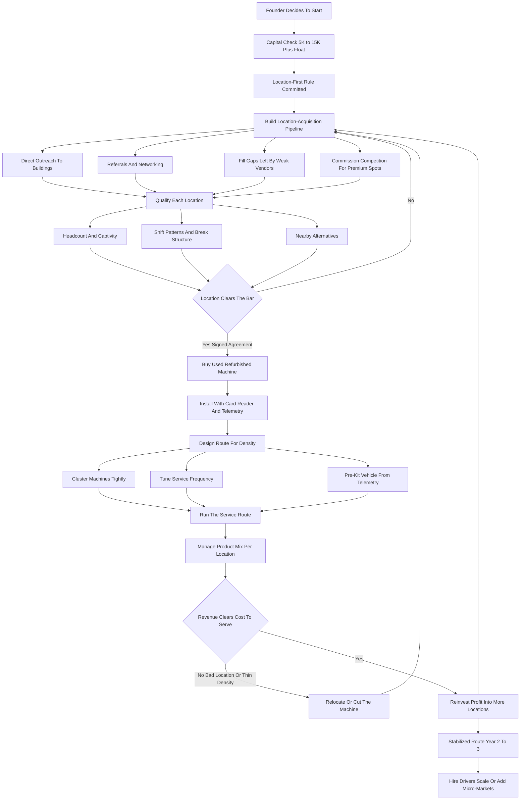

### Direct Answer

To start a vending machine business in 2027, you buy unattended retail machines, secure signed agreements to place them inside other people's buildings, stock them with product, and collect the spread between wholesale cost and the price the machine charges. The model is real, durable, and low-glamour, and it lives or dies on one number beginners almost never calculate before buying a machine: **revenue per machine per month at a specific location.** The entire business is location arbitrage run as a service route, and the operator who buys machines before securing locations has the business exactly backwards.

**TL;DR:** Vending in 2027 is a route-logistics-and-placement business, not a passive-income asset. A disciplined operator invests **$5,000-$35,000** to launch a small route of used or refurbished snack, drink, and combo machines, runs at a **45-55% gross margin after cost of goods and 25-40% net** after fuel, commissions, shrink, and repairs, and in a careful Year 1 generates **$15,000-$70,000 in revenue** against **$6,000-$28,000 in owner profit** -- nearly all of it determined by location quality. By Year 3-5 a well-run route of **25-60 machines** reaches **$120,000-$400,000 in revenue** with **$45,000-$150,000 in owner profit**. The same combo machine grosses $150/month in a quiet 12-person office and $1,200/month in a 200-person captive warehouse -- identical equipment, an eight-fold difference driven entirely by foot traffic, captivity, and the absence of alternatives. The three things that kill vending startups: **(a) buying machines before securing locations** -- the cardinal sin; **(b) accepting bad, low-traffic locations** because they are the only ones that said yes; and **(c) underestimating the unglamorous grind** of driving a route, hauling product, fixing bill validators, and eating shrink. Net: viable in 2027 as a disciplined, location-obsessed, route-efficient, technology-equipped operation -- and a money-loser for anyone who buys the machine first and hopes a location appears.

## 1. What A Vending Machine Business Actually Is In 2027

### 1.1 The Core Financial Idea

A vending machine business owns unattended retail equipment -- snack machines, drink machines, combo machines, coffee machines, and increasingly micro-markets and smart coolers -- places that equipment inside locations owned by other people, stocks it with product, and collects the money the machines take in. You are running a chain of tiny automated convenience stores, except you do not own the real estate, you do not staff a counter, and the "store" is a steel box that sells twenty-four hours a day whether you are there or not. **The entire business is a single financial idea repeated across a route:** you buy a candy bar for fifty cents and the machine sells it for a dollar fifty, you buy a bottled drink for forty cents and the machine sells it for two dollars, and you do that hundreds or thousands of times a week across a circuit of machines you service on a schedule. That spread, multiplied by volume, minus the cost of getting product into the machines and money out of them, is the business.

### 1.2 What Is Different In 2027

**The 2027 business is shaped by realities that did not fully exist a decade ago.** Cashless payment is now the majority of transactions in most locations, not a novelty, and an operator without card readers is leaving real money on the table. Telemetry and remote-monitoring hardware let an operator see what sold and what is empty without driving to the machine. Micro-markets and smart coolers have expanded what "vending" means at the higher end. Product costs and consumer price sensitivity both rose, squeezing the operator who does not manage the product mix carefully. The vending business is not passive and it is not glamorous -- it is a route-logistics-and-placement business, and the operators who succeed understand that the candy bar is incidental; the business is locations, a service route, a van full of product, a spreadsheet of revenue per machine, and the relationships that keep the machines where the people are. This shares a structural backbone with other route businesses such as ATM placement (q9649) and unattended laundromats (q2153), where the asset earns nothing until it sits in the right spot.

### 1.3 Why It Attracts Beginners -- And Why That Is A Trap

Vending is marketed relentlessly as near-passive income with low startup cost, and that marketing draws a steady stream of beginners. The accessible part is true -- the lean version genuinely costs less than most capital-heavy businesses, requires no storefront lease, no employees on day one, and no specialized license in most jurisdictions. **The trap is the word "passive."** Vending is a job that becomes a managed business, not a holding that throws off cash on its own. The operators who internalize that distinction build real routes; the ones who bought the marketing fill a garage with idle machines. The honest reframe a founder should adopt before spending a dollar is this: **you are not buying machines, you are building a portfolio of placed assets and a service operation to keep them earning.** A machine is a tool the way a delivery van is a tool -- necessary, but not the business. The business is the locations, the route, and the discipline to keep both productive. A founder who can hold that frame through the rejection-heavy first months has a real shot; a founder who keeps mentally returning to "passive income" will quit when the reality of the route sets in.

## 2. The Location Is The Business: Why Placement Beats Everything

### 2.1 The Single Most Important Idea In Vending

This is the idea beginners most consistently fail to internalize: **the machine is a commodity, the product is a commodity, and the only thing that is not a commodity is the location.** A vending machine is a fixed cost that earns nothing on its own; it only earns when it is placed somewhere with enough of the right people walking past it with money and a reason to buy. The same machine, in three different locations, is three completely different businesses.

### 2.2 The Same Machine, Three Locations

In a quiet professional office of twelve people who can walk to a real store, a machine might gross **$120-$200 a month** -- barely worth the fuel to service it. In a 60-person medical clinic where staff cannot leave the floor, it might gross **$400-$600**. In a 200-person distribution warehouse running multiple shifts, with no store within ten minutes and workers who get short breaks, that same machine might gross **$900-$1,400 a month**. Nothing about the equipment changed. What changed is foot traffic, **captivity** (how trapped the buyer is, how inconvenient the alternatives are), shift patterns, demographics, and break structure.

| Location type | Headcount | Captivity | Typical monthly gross |
|---|---|---|---|
| Small professional office | 8-15 | Low (store nearby) | $100-$220 |
| Mid-size office | 30-60 | Medium | $300-$550 |
| Medical clinic | 40-80 | High (staff cannot leave) | $400-$700 |
| Auto dealership / repair shop | varies | High (waiting customers) | $300-$600 |
| Distribution warehouse | 150-300 | Very high (multi-shift, no store) | $800-$1,400+ |
| Large plant with micro-market | 200+ | Very high | $2,000-$6,000+ |

### 2.3 Why The Startup Sequence Must Be Location-First

This is why the entire startup sequence must be built around **location acquisition, not equipment acquisition.** The operator who buys ten machines and then goes looking for homes for them has it exactly backwards -- they now have ten depreciating, possibly financed assets sitting in a garage earning zero while they cold-call buildings. The disciplined operator secures the location first, with a signed placement agreement, and only then puts a machine in it. A great location with a mediocre machine and an average product mix is a good business. A perfect machine with a perfect product mix in a dead location is a loss. Placement is not one factor among many in vending; **placement is the business.**

## 3. The Machine Types: What You Actually Buy And Why

### 3.1 The Standard Formats

A founder must understand every machine category before spending a dollar, because the format mix determines both the capital required and the kind of locations you can serve. **Snack machines** -- the glass-front spiral machines that vend chips, candy, pastries, and crackers -- are the workhorse of the industry, mechanically simple, durable, and they pair with nearly every location. **Drink machines** come in two styles: older "drop" machines that drop cans and bottles, and glass-front drink machines that show the product; both vend bottled water, soda, sports drinks, juices, and energy drinks -- the highest-velocity, most reliable sellers in most locations. **Combo machines** put snacks and drinks in one cabinet -- the right choice for smaller locations that cannot justify two separate machines. **Coffee and hot-beverage machines** brew on demand and serve break rooms and lobbies; they carry higher product margins but more mechanical complexity, more cleaning, and more service calls.

### 3.2 The Higher-End And Specialty Formats

**Micro-markets** are the higher-end evolution -- an unattended open-shelf store with coolers, racks, and a self-checkout kiosk, placed in larger break rooms; they sell far more SKUs, generate higher revenue per location, and command better margins, but they require a bigger location (typically 75-plus people), more capital, and more trust in the honor-system-plus-camera model. **Smart coolers** -- cooler units with camera or weight-sensor technology that charge a customer automatically when they take product -- are the newest format, expanding what unattended retail can do in offices and lobbies. **Specialty machines** -- fresh food, frozen, PPE, electronics -- serve niches with their own economics.

| Format | Typical location | Capital level | Operator stage |
|---|---|---|---|
| Combo machine | Small-mid office, shop | Lowest | Year 1 startup |
| Snack machine | Mid-large location | Low | Year 1 startup |
| Drink machine | Mid-large location | Low-medium | Year 1 startup |
| Coffee / hot beverage | Break rooms, lobbies | Medium | Year 1-2 |
| Smart cooler | Offices, gyms, lobbies | Medium-high | Year 2+ |
| Micro-market | 75+ person break rooms | Highest | Year 2-3+ |

### 3.3 The Capital Ladder

The capital ladder runs roughly from a used combo machine at the bottom to a full micro-market installation at the top. **A starting operator almost always begins with used or refurbished snack, drink, and combo machines** -- they are cheap, reliable, easy to learn on, and fit the small-to-mid locations a new operator can realistically win. Micro-markets and smart coolers are a later move, made once the operator has the capital, the larger locations, and the operational competence to run them.

## 4. New, Used, And Refurbished: The Machine-Buying Decision

### 4.1 Why Used Or Refurbished Wins For A Startup

The machine-buying decision is one of the most consequential early capital choices, and the right answer for almost every startup is **used or refurbished, not new.** A brand-new combo machine from a manufacturer can run $3,000-$6,000 or more; a comparable used machine in working condition can be had for $500-$1,500, and a professionally refurbished machine -- cleaned, tested, with a new control board and a modern card reader -- for $1,200-$2,500. The math is decisive: a vending machine is mature, slow-changing equipment, a maintained used machine runs for many years, and the capital saved buying used can be spread across more machines and more locations -- and locations, not machine newness, generate revenue.

### 4.2 When New Machines Make Sense

New machines make sense in specific cases: when a high-value location's decision-maker expects pristine equipment, when financing terms on new equipment are unusually favorable, or when a specialty format is only available new. **But the default startup move is to buy used and refurbished** from reputable dealers, auctions, operators exiting the business, and the secondary market.

### 4.3 What To Inspect Before Buying

Inspect carefully for working bill validators and coin mechanisms, functional refrigeration on drink machines, intact spirals and motors, and -- critically -- the ability to add or upgrade a modern cashless card reader, because a machine that cannot take cards is losing the majority of its potential transactions in 2027. **Buying an existing operator's whole route is a related and often smart entry:** it delivers machines and the locations and revenue history together, solving the cardinal location-first problem in one transaction, though it must be diligenced carefully on the quality and contract security of those locations.

## 5. The Location Acquisition Playbook: How You Actually Get Placements

### 5.1 The Pitch You Are Making

Because placement is the business, the acquisition process deserves its own detailed playbook -- this is the skill the whole operation rests on. The operator is selling building owners and managers on a simple proposition: **free vending service for their staff or customers, at no cost and no effort to them**, and often with a commission paid back to the location on sales.

### 5.2 The Target Location Hierarchy

The target locations, in rough order of desirability: **manufacturing plants and distribution warehouses** (large headcounts, captive shift workers, often no nearby store -- the best vending locations in existence), **medical facilities** (hospitals, clinics, nursing homes), **large offices and corporate campuses**, **schools and universities** (with their own rules and seasonality), **auto dealerships and repair shops** (waiting customers), **hotels and motels**, **apartment complexes and laundromats**, **gyms and recreation centers**, **car washes**, and **government buildings**.

### 5.3 The Acquisition Methods

**Direct outreach** -- walking in, calling, emailing building managers, office managers, and plant managers with a clear, professional pitch. **Networking and referrals** -- one happy location manager refers another, and a reputation for reliable service compounds. **Filling gaps** -- finding locations whose current vendor is unreliable, has old machines, or stocks poorly, and offering to do better. **Buying routes** -- acquiring locations with the machines. **Commission competition** -- at desirable locations, offering the location a percentage of sales (commonly 5-25%) to win or keep the placement.

| Method | Cost | Speed | Best for |
|---|---|---|---|
| Direct outreach | Time only | Slow | Year 1 route building |
| Referrals and networking | Low | Compounds over time | Year 2+ growth |
| Filling vendor gaps | Time only | Medium | Winning proven good spots |
| Buying a route | High capital | Fast | Cash flow from month one |
| Commission competition | Margin | Medium | Premium contested locations |

### 5.4 Qualifying The Location Before You Commit

**The discipline that matters: qualify the location before you commit a machine.** Ask about headcount, shift patterns, break structure, nearby alternatives, and whether the prior vendor (if any) was making money. A signed placement agreement should specify the term, the commission if any, the service commitment, who supplies electricity, liability and access terms, and an exit clause. The operator who masters location acquisition has the entire business solved; the operator who cannot is stuck servicing whatever marginal locations said yes.

## 6. The Core Unit Economics: Revenue Per Machine Per Month

### 6.1 The Calculation The Whole Business Runs On

This is the calculation the whole business runs on, and beginners almost never run it before buying. Every machine has a **revenue per machine per month** number, and that number -- against the cost to stock and service it -- tells you whether the machine is an asset or a liability. A poorly located snack machine grosses **$100-$250 a month**; a solid mid-size location grosses **$300-$600**; a strong location grosses **$700-$1,400 or more**; and a busy combo or micro-market in an exceptional spot runs well beyond that. The deeper mechanics of what separates a $500 machine from a $1,500 machine on a 20-machine route are worked through in detail in (q1145).

### 6.2 Layering The Costs

Now layer the costs. **Cost of goods** typically runs 45-55% of revenue -- you keep roughly half of the gross as gross margin. From that gross margin, subtract **fuel and vehicle cost** to drive the route, **commission** paid to the location (5-25% of sales if any), **shrink** -- theft, spoilage, machines that malfunction and eat money or give free product -- which realistically runs 2-6% of revenue, **repairs and parts**, and your **time**, the cost beginners never price. Net it out and a well-run route nets **25-40% of revenue as owner profit** after all real costs.

| Machine monthly gross | Gross margin (~50%) | Service cost per stop | Net contribution | Verdict |
|---|---|---|---|---|
| $150 | $75 | $40-$60 | Near zero or loss | Cut or relocate |
| $350 | $175 | $40-$60 | $115-$135 | Acceptable |
| $600 | $300 | $40-$60 | $240-$260 | Good asset |
| $1,000 | $500 | $40-$60 | $440-$460 | Strong asset |

### 6.3 The Brutal Arithmetic Of Bad Locations

A machine grossing $150 a month produces maybe $75 in gross margin, and after the fuel and time to drive to it, restock it, and collect from it -- a stop that might take 30-45 minutes round trip plus product-cost float -- it can easily be a net loss. A machine grossing $800 a month produces $400 in gross margin from the same single service stop. **This is why route density and location quality are not separate concerns from the unit economics -- they ARE the unit economics.** The operator must calculate, for every machine, the realistic monthly revenue, the cost to serve it, and the net, and ruthlessly cut or relocate the machines that do not clear the bar.

## 7. The Line-By-Line P&L Of A Vending Route

### 7.1 A Representative Early Route

Beyond per-machine revenue, a founder must internalize the operating P&L of the whole route, because that is what turns activity into profit. Take a representative early route of **15 machines averaging $350 a month** -- roughly $5,250 in monthly gross revenue, $63,000 a year.

| P&L line | Monthly amount | Notes |
|---|---|---|
| Gross revenue | $5,250 | 15 machines x $350 |
| Cost of goods (~50%) | -$2,625 | Largest single line |
| Commissions (~8% blended) | -$420 | Higher at premium spots |
| Fuel and vehicle | -$300 to -$600 | Route density is the lever |
| Shrink (~4%) | -$210 | Theft, spoilage, malfunction |
| Repairs and parts | -$150 to -$300 | Lumpy by nature |
| Cashless processing fees | -$60 to -$130 | A few % of cashless sales |
| Telemetry, software, insurance, admin | -$150 to -$300 | Fixed overhead |
| **Net owner profit** | **~$1,300-$2,100** | Side-income level at 15 machines |

### 7.2 Reading The P&L

Net the route out and the owner-operator keeps roughly **$1,300-$2,100 a month** from a 15-machine route at this average -- real money for a side operation, modest for a full-time income, which is exactly why the route must grow and the average revenue per machine must rise. The leverage points are visible: **cost of goods** is controlled by smart purchasing and product-mix discipline; **fuel** is controlled by route density and telemetry-tuned service frequency; **shrink** is controlled by location selection, machine maintenance, and not over-stocking perishables; and the **revenue line** -- the one that matters most -- is controlled by location quality and pricing.

### 7.3 The Most Common P&L Failure

The operators who fail at the P&L level almost always have the same problem: **a route of low-average machines spread across too much geography**, so the fuel and time costs eat a gross margin that was too thin to begin with. The fix is always the same -- cut the dead machines, cluster the survivors, and pursue better locations.

## 8. Route Design And Service Logistics

### 8.1 What A Route Actually Is

The route is the operational engine, and a founder must design it deliberately because route efficiency is a direct, large line in the P&L. A vending route is a circuit of machines serviced on a schedule -- the operator loads a vehicle with product, drives to each machine, restocks it, collects the cash, addresses malfunctions, and moves to the next. **Service frequency** is set by how fast each machine sells through its capacity: a high-volume machine might need restocking twice a week, a low-volume one every two or three weeks.

### 8.2 Route Density Is The Biggest Efficiency Lever

**Route density** -- how geographically clustered the machines are -- is the single biggest efficiency lever; ten machines within a tight radius are dramatically more profitable to service than ten machines scattered across a county, because fuel and windshield time spread across more revenue. This is why a disciplined operator grows by **deepening clusters** rather than chasing a great-sounding location an hour away. The same density logic governs other route businesses -- residential lawn-care crews face an almost identical math problem of accounts per drive-time radius (q1149), and rideshare-and-delivery fleets win or lose on geographic clustering (q2075).

### 8.3 Telemetry, Pre-Kitting, And The Service Stop

**Telemetry changes the logistics:** remote-monitoring hardware reports what each machine has sold and what is running low, so the operator can pre-kit the vehicle for exactly what each stop needs and skip machines that do not need service yet -- turning a blind, fixed-schedule route into a demand-driven one. **The vehicle** -- a van or box truck sized to the route -- carries product, a hand truck or cart, tools, a cash bag, and spare parts. **Pre-kitting** -- packing product for each stop in advance -- makes the actual service stop fast. **The service stop itself** is a routine: restock to par, rotate stock so older product sells first, wipe down the machine, test the bill validator and card reader, clear jams, collect cash, and note repair follow-ups. A disciplined operator times the route as deliberately as a delivery company times its drivers: a well-run stop on a healthy machine takes ten to twenty minutes, and the operator measures stops-per-hour and revenue-per-route-hour as a core metric, not just total revenue.

### 8.4 Service Frequency Versus Machine Capacity

The single judgment call that drives route cost is matching **service frequency to machine capacity and sell-through.** Restock a high-volume machine too rarely and it stocks out -- empty slots earn nothing and erode the location relationship. Restock a low-volume machine too often and the operator burns fuel and time on a stop that did not need to happen. The fix is telemetry-informed scheduling: let the data tell the operator which machines are near par and which can be skipped this week. A machine that sells $1,000 a month may need twice-weekly service; a $200 machine may need a visit only every two or three weeks. The operator who maps frequency to actual sell-through, rather than running every machine on the same blind weekly schedule, can carry a meaningfully larger route on the same hours of work -- and route hours, not machine count, are the real ceiling on an owner-operated business.

## 9. Product Selection, Pricing, And Margin Management

### 9.1 The Product Categories

The product mix is where gross margin is made or lost, and a founder must manage it actively rather than just filling slots. **Drink machine:** carbonated soft drinks, water, sports and energy drinks, juices. **Snack machine:** chips and salty snacks, candy and chocolate, pastries and baked goods, crackers and nuts, gum and mints. **Larger formats:** fresh food, sandwiches, and a wider grocery range.

### 9.2 Velocity Over Single-Item Margin

**Velocity matters more than margin on any single item** -- a fast-selling water at a thin margin contributes more total dollars than a slow-moving specialty item at a fat margin that expires on the shelf. The operator must know each location's preferences -- a warehouse of shift workers buys differently than a medical office, which buys differently than a gym -- and tune the mix per location rather than running one identical planogram everywhere.

### 9.3 Pricing And Sourcing As Margin Levers

**Pricing** in 2027 must reflect risen product costs and is most defensible in captive, high-convenience locations where the buyer has no nearby alternative; pricing too low leaves margin on the table in good locations, pricing too high in a location with alternatives kills volume. **Sourcing** is a margin lever -- buying from warehouse clubs and wholesale distributors, buying at route volume as the operation grows, and avoiding the trap of buying retail. **Healthier and premium options** have grown as a real segment, and some locations (schools, certain workplaces) require or prefer them.

| Product category | Typical COGS share | Velocity | Margin note |
|---|---|---|---|
| Bottled water | High markup | Very high | Volume driver, thin per-unit |
| Soda / energy drinks | Medium | High | Reliable margin and volume |
| Chips / salty snacks | Medium | High | Workhorse snack category |
| Candy / chocolate | Medium | Medium-high | Watch summer melt |
| Fresh food / sandwiches | Lower markup | Variable | Real spoilage risk |
| Healthy / premium | Variable | Medium | Wins specific locations |

## 10. Cashless Payment And Vending Technology In 2027

### 10.1 Cashless Is The Baseline, Not An Upgrade

A founder launching in 2027 must treat technology as a baseline requirement. **Cashless payment is now the majority of transactions in most locations** -- card readers, tap-to-pay, and mobile wallets are what a large share of customers expect, and a cash-only machine in 2027 is not capturing a big slice of demand, especially among younger buyers and in office and medical settings. Every machine on a serious route needs a modern card reader; the hardware and the per-transaction processing fee are a real cost, but the lost sales from going cash-only are far larger.

### 10.2 Telemetry And Vending Management Software

**Telemetry and remote monitoring** -- hardware and software that report each machine's sales, inventory levels, and malfunctions in near real time -- transform route logistics: the operator sees what to restock before driving out, catches a down machine immediately, and can analyze which products and locations perform. **Vending management software** ties it together -- inventory, route planning, sales reporting, commission tracking, and accounting -- letting a small operator run a professional, data-driven operation.

### 10.3 The Strategic Point

Smart coolers and micro-market kiosks represent the technology frontier; energy-efficient machines lower operating cost. **The strategic point:** the 2027 operator who skips the technology -- cash-only machines, blind fixed-schedule routes, paper records -- is running a 2010 business and will be out-competed on both customer capture and operating efficiency. The technology is not optional sophistication; it is the current baseline of a competitive route.

## 11. The Commission Question: Paying Locations For Placement

### 11.1 What A Commission Is And When It Applies

A commission is a percentage of the machine's sales paid back to the location owner or manager -- it is how an operator competes for desirable placements. **Commissions are not universal** -- many small and mid locations take vending service with no commission because the value to them is the convenience for their people. But **at desirable, high-traffic locations, commission is often the price of entry**, and competing operators bid for the spot. Typical ranges run from 5% at the low end to 25% or more at premium, heavily-contested locations.

### 11.2 The Per-Location Economic Calculation

**Commission comes straight out of the operator's net**, so it must be priced into the location's economics before agreeing -- a 20% commission on a $1,000-a-month machine is $200 a month, and the location must still net well after that. A great location at a high commission can still be an excellent machine; a mediocre location at a high commission is a trap.

| Location quality | Monthly gross | Commission rate | Commission paid | Still worth it? |
|---|---|---|---|---|
| Premium warehouse | $1,200 | 20% | $240 | Yes -- strong net remains |
| Mid office | $400 | 15% | $60 | Marginal -- run the math |
| Small office | $180 | 10% | $18 | Often not worth servicing |
| Contested corporate | $900 | 25% | $225 | Yes if route-dense |

### 11.3 The Two Valid Strategies

Some operators avoid commissioned locations entirely and build routes of no-commission small-and-mid placements, accepting lower per-machine revenue for fuller margin retention. Others compete aggressively on commission for big captive locations because even at 20% the absolute dollars are large. **Both are valid; what is not valid is agreeing to a commission without running the post-commission net.**

## 12. Startup Cost Breakdown: The Honest All-In Number

### 12.1 The Line-By-Line Startup Cost

A founder needs a clear-eyed total, because vending is sold as cheaper than it really is once you account for everything.

| Startup line | Lean range | Notes |
|---|---|---|
| Machines (5-10 used/refurbished) | $3,000-$20,000 | The largest line; $500-$2,500 each |
| Card readers (if not installed) | $150-$400 per machine | Non-negotiable in 2027 |
| Initial product inventory | $500-$2,000 | Depends on route size |
| Vehicle (used cargo van, if bought) | $8,000-$25,000 | Often the largest single line |
| Telemetry and management software | Few hundred to low thousands | Hardware plus subscription |
| Formation, licenses, permits | $200-$1,500 | Varies widely by locality |
| Insurance (liability, commercial auto) | $500-$2,000 | First payment |
| Tools, hand truck, cash bags, locks | $200-$800 | Service supplies |
| Storage (small unit, if needed) | $50-$200/month | Product and spare machines |
| Working capital / float and repair cushion | $2,000-$8,000 | The line beginners skip |

### 12.2 The Totals

A genuinely lean start using an owned vehicle and a handful of used machines comes in around **$5,000-$15,000**; a more substantial launch with more machines and a purchased vehicle runs **$20,000-$50,000+**; and buying an existing route is its own number, typically priced as a multiple of monthly revenue.

### 12.3 The Under-Capitalization Trap

Vending is more accessible than many capital-heavy businesses, but it is not the near-zero-cost passive-income business it is often marketed as. **Under-capitalization -- especially skipping the working-capital float and the repair cushion -- is a real way to stall a route** before it gets dense enough to be profitable.

## 13. The Year-One Operating Reality

### 13.1 Year One Is Route-Building, Not Profit-Extraction

A founder should walk into Year 1 with accurate expectations, because the gap between the marketed version and the real version is where most quitting happens. **Year 1 is location-acquisition and route-building mode.** The first months are spent doing the unglamorous, rejection-heavy work of pitching buildings, getting machines placed, learning which locations actually produce, discovering the real cost of fuel and time, and finding out where the operation is fragile.

### 13.2 Realistic Year-One Numbers

A disciplined Year 1 vending startup, launched with a real plan and a working-capital cushion, can realistically generate **$15,000-$70,000 in revenue** -- a wide range driven almost entirely by location quality and route size -- against **$6,000-$28,000 in owner profit**, real money but earned through hands-on route work and back-loaded as the route fills out.

### 13.3 The Physical Reality

The work is genuinely physical and routine: the founder is driving the route, hauling product, restocking machines, fixing jams, collecting and counting cash, and doing cold outreach for the next location. Year 1 is also when the founder discovers whether the locations were qualified properly -- a route of marginal, low-traffic placements shows up as long fuel-heavy days for thin collections, and the lesson is to relocate or cut the dead machines and pursue better spots. The founders who succeed treat Year 1 as paid tuition in a real route-logistics-and-placement business and use it to learn location qualification, route density, and product mix; the ones who fail expected a passive income stream and were unprepared for the driving, the lifting, the repairs, the shrink, and the rejection in location pitching. The single best Year-1 habit is to keep a simple per-machine ledger -- revenue, service cost, and net for every machine, every month -- so that by month nine the founder can see exactly which placements to cut, which to deepen around, and which kind of location to pursue next.

## 14. The Five-Year Revenue Trajectory

### 14.1 The Year-By-Year Arc

Mapping a realistic five-year arc helps a founder size the opportunity honestly.

| Year | Machines | Revenue | Owner profit | Operator role |
|---|---|---|---|---|
| Year 1 | 5-15 | $15K-$70K | $6K-$28K | Doing everything; learning |
| Year 2 | 15-30 | $50K-$150K | $20K-$60K | Deepening clusters |
| Year 3 | 25-50 | $120K-$300K | $45K-$110K | First driver; managing route |
| Year 4 | 35-65 | $200K-$450K | $70K-$160K | Micro-markets; more drivers |
| Year 5 | 40-80+ | $300K-$600K | $100K-$220K | Mature route; strategic choices |

### 14.2 What The Numbers Assume

These numbers assume disciplined location qualification, route density, technology adoption, and product-mix management; **they do not assume exponential growth**, because vending scales with locations, route density, and service capacity, not magically.

### 14.3 The Year-Five Strategic Choice

By Year 5 the operator decides whether to keep scaling toward a few hundred machines, go deep on micro-markets, acquire other operators' routes, or run a lean optimized route and harvest the cash. A mature vending business is a real small business with a fleet of placed assets, a service route, and a balance sheet of equipment in productive locations -- a genuinely good outcome, but earned through years of placement and logistics discipline.

## 15. Buying An Existing Vending Route Instead Of Building One

### 15.1 Why Buying Solves The Hardest Problem

A founder should seriously consider buying an existing route, because it directly solves the hardest problem in vending -- location acquisition. When an operator buys a route, they acquire the machines, the locations, the placement agreements, and the revenue history together. The advantages are real: **immediate cash flow from day one**, proven locations with actual revenue numbers to diligence, existing relationships with location managers, and a faster path to profitable scale.

### 15.2 The Diligence Checklist

The risks must be diligenced hard: **location quality and security** -- are the placement agreements contractually solid or month-to-month handshakes; **revenue verification** -- are the claimed numbers real, supported by collection records and telemetry; **machine condition** -- maintained or about to need a wave of repairs; **the reason for sale** -- a retiring operator differs from one fleeing declining locations; and **route geography** -- a dense efficient route or a scattered fuel-eater.

### 15.3 Pricing And Seller Financing

Routes are typically priced as a multiple of monthly net or gross revenue, with the multiple reflecting location security and quality. **Seller financing** is common and lowers entry risk, aligning the seller's payout with the route's continued performance. Many of the most successful operators do both -- buy a route to reach scale fast, then build and acquire from there. This buy-versus-build choice mirrors the analysis acquirers run on ATM placement routes (q9649), where existing site contracts are similarly the core asset.

## 16. Scaling The Route: Hiring Drivers And Going Past Owner-Operated

### 16.1 The Owner-Operated Ceiling

The owner-operated route has a hard ceiling -- there are only so many machines one person can service well in a week, and past roughly **30-60 machines** (depending on density and revenue) the founder is the bottleneck. **Scaling means hiring route drivers** -- people who run service circuits, restock, collect, and handle basic machine issues -- which changes the business from a job into a company.

### 16.2 The Prerequisites For Scaling

The prerequisites: the route must be **genuinely profitable per machine** (do not scale a route of marginal locations -- you just multiply the problem); the service process must be **documented** well enough that a driver can run it consistently; **telemetry and software** must be in place so the owner can see what drivers are doing; and **cash-handling controls** must be tight because cash collection by employees introduces a real shrink and trust risk.

### 16.3 The Scaling Levers And Constraints

The scaling levers: deepen existing clusters, add locations in step with service capacity, move into higher-revenue formats at larger locations, build a management layer, and acquire other operators' routes. The constraints: capital for more machines and product float, founder attention, cash-handling integrity, and route density. **The founders who scale well proved per-machine profitability and documented the service process first**, so adding drivers multiplied a working machine rather than a broken one.

## 17. Micro-Markets And Smart Coolers: The Higher-Margin Frontier

### 17.1 What A Micro-Market Is

A **micro-market** is an unattended open-format store -- coolers, shelving, racks, and a self-checkout kiosk -- placed in a larger break room, typically at a location with 75-plus people. Compared to a bank of vending machines, a micro-market sells far more SKUs, generates substantially higher revenue per location, and runs at better margins because the format supports a broader, fresher, higher-ticket mix.

### 17.2 The Trade-Offs And Smart Coolers

The trade-offs: a micro-market requires a larger location, more capital to install, more product management (including fresh food and its spoilage risk), and it relies on an honor-system-plus-camera model. **Smart coolers** -- cooler units that charge a customer automatically when they take product -- bring frictionless grab-and-go to offices, lobbies, and gyms, capturing impulse buys traditional machines miss.

### 17.3 When To Make The Move

Micro-markets and smart coolers are generally **not a Year-1 startup move** -- they need capital, larger locations, and operational competence the new operator does not yet have -- but they are a powerful Year-2-and-beyond growth lever, letting an operator dramatically raise the revenue of its best larger locations without proportionally increasing the number of route stops.

## 18. Risk Management And Insurance

### 18.1 The Major Risks And Their Mitigations

The vending model carries specific risks, and the 2027 operator manages each deliberately.

| Risk | What it looks like | Primary mitigation |
|---|---|---|
| Location loss | Placement ends, switches, closes | Signed agreements, service reliability, diversification |
| Theft / vandalism | Machine broken into, tipped | Good locations, sturdy locks, cameras, frequent collection |
| Equipment failure | Validators, boards, compressors fail | Quality refurb, basic repair skill, spare parts |
| Shrink | Spoilage, malfunction, free product | Mix discipline, stock rotation, maintenance |
| Product cost / pricing | Rising wholesale squeezing margin | Smart sourcing, route-volume buying, captive pricing |
| Liability | Customer claims illness or injury | General liability insurance, food-handling practices |
| Vehicle / route | Accidents, breakdowns | Commercial auto insurance, vehicle maintenance |
| Cash-handling | Driver theft once scaled | Cashless-heavy routes, telemetry, controls |

### 18.2 Location Loss Is The Biggest Structural Risk

**Location loss is the single biggest structural risk**, because the location is the business; it is mitigated by signed placement agreements with reasonable terms, genuine service reliability that gives the location no reason to switch, fair commissions at contested spots, and diversification so no single location dominates the route.

### 18.3 The Insurance Throughline

The throughline: every major risk in vending has a known mitigation built from good location selection, signed agreements, insurance, maintenance discipline, and -- as the route scales -- cash controls. **General liability and commercial auto insurance** are baseline; health permits where required complete the picture.

## 19. The Competitor Landscape: Who You Are Up Against

### 19.1 The Large Operators

A founder should understand the competitive field clearly. **The large regional and national vending operators** have big routes, full driver fleets, warehouse operations, established relationships with the biggest locations, and the capital for micro-markets and the newest technology; they dominate the largest corporate and institutional accounts but can be slower to respond, less personal with mid-size locations, and willing to let smaller or more distant placements go underserved.

### 19.2 The Long Tail And The Gap

**The long tail of small owner-operators and side hustlers** is large; many are under-capitalized, run cash-only old machines, service inconsistently, and stock poorly -- precisely the gap a disciplined new operator exploits. Existing operators with weak service at otherwise-good locations are an opportunity: a location manager frustrated with an unreliable vendor is a location ready to be won.

### 19.3 Where A 2027 Entrant Wins

You generally cannot out-capitalize the regional giant for the biggest accounts, and you should not try to out-cheap the desperate side hustler. **You win by being the most reliable, best-stocked, technology-equipped, well-located operator in the underserved middle.** The competitive moat in vending is not the machines -- it is the portfolio of good, contractually-secured locations, the reputation for reliable service, the route density, and the relationships with location managers.

## 20. Financing, Taxes, And Business Structure

### 20.1 Financing The Business

**Equipment financing** is the natural fit for the machines -- they are tangible assets a lender will finance; the danger is financing machines before locations exist, so the discipline is to finance against placed, earning machines. **SBA and small-business loans** can fund a broader launch including a vehicle and working capital. **Seller financing** is common and smart when buying an existing route. **Reinvested cash flow** funds most healthy organic growth. **Personal savings and lean bootstrapping** fund many startups. The dangerous move is the leveraged speculative launch -- financing a pile of machines with no locations and no cushion.

### 20.2 Entity And Depreciation

Most vending operators form an **LLC** for liability protection and tax flexibility; the entity holds the placement agreements, the insurance, the vehicle, and signs with locations. **Depreciation matters** -- the machines and the vehicle are depreciable assets, and the schedules (and any available accelerated or first-year expensing) shape taxable income, especially in heavy machine-buying years.

### 20.3 Sales Tax, Permits, And Bookkeeping

**Sales tax on vending sales** is a real and sometimes complex obligation -- many jurisdictions tax vended product, sometimes at special vending rates. **Licenses and permits** vary widely -- vending licenses, health permits, sometimes per-machine decals. **Cash income reporting** demands clean records of collections, deposits, and product purchases. The discipline: separate business banking from day one, a bookkeeping system that tracks each machine, rigorous cash-collection records, quarterly attention to sales tax and estimated taxes, and an accountant who understands cash-heavy equipment-based small businesses.

## 21. Owner Lifestyle: What Running This Business Actually Feels Like

### 21.1 The Year-One Daily Reality

In Year 1, running a lean route, the founder is genuinely in the business -- driving the circuit, loading and hauling product, restocking machines, kneeling to clear jams and swap bill validators, collecting and counting cash, and spending non-route hours on rejection-heavy cold outreach. **It is physical, repetitive, and absorbing, closer to running a small delivery route than to managing a passive asset.**

### 21.2 The Year-Two-To-Five Shift

By Year 2-3, with a denser route and possibly a first driver, the founder's role shifts toward managing the route, acquiring locations, and handling purchasing and the numbers -- though the business stays hands-on. By Year 3-5, with drivers and a real route, the founder can move toward a managerial rhythm -- though vending never becomes fully hands-off; the physical route, the cash, the repairs, and the location relationships are permanent features.

### 21.3 The Emotional Texture

There is real, quiet satisfaction in a dense efficient route, a well-stocked machine in a great location reliably throwing off cash, and a strong collection day; and real grind in the driving, the lifting, the repairs, the shrink, the occasional vandalized machine, and the rejection in location pitching. **The income is real and can become a genuinely good living, but it is earned through routine physical work and location hustle, not extracted passively.**

## 22. Counter-Case: When Vending Is The Wrong Business

### 22.1 The Cautionary Tale -- Greg, The Buy-Machines-First Failure

The clearest counter-case is the operator who inverts the location-first rule. **Greg** sees a "passive income" pitch, finances twelve machines for $22,000, and then starts looking for locations. He can only place seven, four of those in weak low-traffic spots that said yes because no one else wanted them. Five machines sit in his garage, and the loan payment is due whether the machines earn or not. His route grosses too little to cover the fuel and the financing, and he sells the machines at a loss within a year. Greg did everything in the wrong order, and the wrong order is fatal.

### 22.2 Dwayne, The Density Failure

**Dwayne** wins locations enthusiastically but scattered across a wide region -- a great machine here, a good one forty minutes away, another across the county. Even though his individual machines are decent, his route is a fuel-and-windshield-time disaster, his effective hourly earnings are poor, and he eventually has to cut the outliers and rebuild around tight clusters. Dwayne's mistake is not bad machines or bad locations -- it is the absence of route geography discipline, the same trap that punishes scattered lawn-care accounts (q1149).

### 22.3 Who Should Not Start This Business

Vending is the wrong business for several profiles. **The person with zero capital** -- it is more accessible than most businesses, but not free; skipping the working-capital float stalls the route. **The person who will not pitch** -- location acquisition is rejection-heavy ongoing sales work, and an operator who will not cold-call buildings is stuck servicing whatever marginal spots said yes. **The person who wants a desk job or a truly passive holding** -- vending is physical, routine route work. **The person seeking fast or exponential growth** -- vending scales linearly with locations and service capacity, not magically; a founder who wants venture-style scale should look at a different model entirely. If a founder recognizes themselves in these profiles, the honest answer is that vending will disappoint them, and the disappointment is structural, not a matter of effort.

### 22.4 When A Different Route Business Fits Better

A founder drawn to unattended, asset-based, route-style businesses but who finds vending's product-handling grind unappealing has real alternatives: **ATM placement routes** (q9649) carry no perishable product and no restocking of food, just cash management; **self-storage** (q1969) is a far more passive real-estate-backed model once built; and an **unattended laundromat** (q2153) concentrates the assets in one location rather than spreading them across a route, with its own distinct cash-flow profile (q1123). Vending should be chosen on its merits, not by default.

## 23. Named Real-World Operating Scenarios

### 23.1 Marisol -- The Disciplined Location-First Operator

**Marisol** starts with $9,000, buys six refurbished combo and drink machines, but does not place a single one until she has signed placement agreements. She spends six weeks pitching and lands two warehouses, a clinic, and two mid-size offices, all qualified for headcount and break structure. Her average machine grosses $480 a month from day one, she reinvests every dollar into more machines for similar locations, deepens her clusters, and reaches a 35-machine route netting solid profit by Year 3 -- because every machine was placed before it was bought.

### 23.2 Priya -- The Route Buyer

**Priya** buys a retiring operator's 28-machine route for a multiple of its verified monthly revenue with seller financing, diligences the placement agreements and collection records carefully, inherits proven locations and cash flow from month one, and spends Year 1 optimizing -- cutting three dead machines, upgrading card readers, tightening the product mix -- to lift the route's net rather than building it.

### 23.3 The Okafor Family -- The Micro-Market Move

**The Okafor family** runs a solid traditional route for two years, then converts their three largest warehouse locations to micro-markets, tripling the revenue at those sites without adding stops, and builds a hybrid route of machines plus micro-markets that out-earns a pure-machine route of the same stop count. These scenarios span the realistic distribution: disciplined location-first success, the route-buyer's shortcut, and the micro-market upgrade -- alongside the Greg and Dwayne counter-cases in Section 22.

## 24. The Final Framework: Building It Right From Day One

### 24.1 The Twelve-Step Operating Sequence

Pulling the entire playbook into a single operating framework, a founder should execute in this order. **First, get honest about capital and temperament** -- confirm $5K-$15K for a lean location-first launch with a working-capital float, and confirm you want a route-logistics business. **Second, commit to the location-first rule** -- secure signed, qualified placements before buying the machine that goes in them, every time. **Third, build the location-acquisition skill** -- direct outreach, referrals, filling gaps, and commission competition. **Fourth, buy used and refurbished machines** -- cheap, reliable, card-reader-equipped. **Fifth, design the route for density** -- cluster machines, tune service frequency to sell-through. **Sixth, run the unit economics on every machine** -- revenue per machine per month against the cost to serve it.

### 24.2 Steps Seven Through Twelve

**Seventh, adopt the technology** -- full cashless on every machine, telemetry for demand-driven service, and management software. **Eighth, manage the product mix actively** -- per-location planograms, velocity over single-item margin, smart sourcing, disciplined pricing in captive spots. **Ninth, secure placements with real agreements** -- term, commission, service commitment, electricity, access, and exit clauses in writing. **Tenth, capitalize properly** -- hold the working-capital float and the repair cushion. **Eleventh, scale deliberately** -- prove per-machine profitability and document the service process before hiring drivers. **Twelfth, keep the exit options open** -- a dense route of secured locations, maintained machines, and clean books makes the business sellable.

### 24.3 The Honest Bottom Line

Do these twelve things in order and a vending machine business in 2027 is a legitimate path to a **$120K-$400K asset-backed small business** with **$45K-$150K in owner profit**. Skip the discipline -- especially the location-first rule, the route density, and the technology -- and it is a fast way to fill a garage with idle machines and lose money on fuel. The business is neither a passive goldmine nor a scam. It is a real, accessible, capital-light-to-moderate, route-logistics-and-placement small business, and in 2027 it rewards exactly one kind of founder: **the disciplined, location-obsessed operator who treats it as the placement-and-logistics business it actually is.** Founders comparing it against adjacent paths should weigh the route-economics math against landscaping (q1939), junk removal (q1944), ATM routes (q9649), and self-storage (q1969) before committing capital.

## 25. The Operating Journey: From Location Plan To Stabilized Route

## 26. Sources

1. **National Automatic Merchandising Association (NAMA) -- Industry Data and Operating Benchmarks** -- The trade association for the convenience services and vending industry; industry size, segment data, and operating practices. https://www.namanow.org
2. **NAMA -- Census of the Industry / State of the Industry Reports** -- Annual industry revenue, machine population, and segment-level data for vending, micro-markets, and office coffee service.
3. **IBISWorld -- Vending Machine Operators Industry Report (US)** -- Industry revenue, growth, margin, and competitive-structure data for US vending operators. https://www.ibisworld.com
4. **US Small Business Administration -- Business Structures, Financing, and Equipment Loans** -- Reference for entity selection, SBA loans, and small-business financing. https://www.sba.gov
5. **US Bureau of Labor Statistics -- Occupational Data for Vending and Route Drivers** -- Wage and employment data relevant to route driver labor costs. https://www.bls.gov
6. **National Federation of Independent Business (NFIB) -- Small Business Operating and Cost Environment** -- Small-business cost, hiring, and economic-condition context. https://www.nfib.com
7. **Automatic Merchandiser / VendingMarketWatch -- Industry Trade Coverage** -- Ongoing trade journalism on vending operations, technology, micro-markets, and operator practices. https://www.vendingmarketwatch.com
8. **Vending Times -- Industry Trade Publication** -- Long-running trade coverage of the vending and unattended retail industry.
9. **Cantaloupe (formerly USA Technologies) -- Cashless Payment and Telemetry Hardware** -- Card readers, telemetry, and vending management technology for operators. https://www.cantaloupe.com
10. **Nayax (NASDAQ: NYAX) -- Cashless Payment and Management Platform** -- Cashless payment hardware and route and inventory management software for unattended retail. https://www.nayax.com
11. **365 Retail Markets -- Micro-Market and Self-Checkout Technology** -- Micro-market kiosk and self-checkout platform for unattended retail. https://www.365retailmarkets.com
12. **Parlevel / VendSoft -- Vending Management Software Providers** -- Route planning, inventory, telemetry, and sales-reporting software for vending operators.
13. **Crane Co. (NYSE: CR) -- Crane Merchandising Systems Vending Equipment** -- Snack, drink, and combo machine specifications and pricing references.
14. **AMS (Automatic Merchandiser Systems) -- Vending Machine Manufacturer** -- Combo and specialty machine specifications and references.
15. **Royal Vendors / Dixie-Narco -- Drink Machine Manufacturers** -- Drink machine specifications, refurbishment, and pricing references.
16. **Used and Refurbished Vending Machine Dealers and Auctions** -- Secondary-market pricing references for used and refurbished snack, drink, and combo machines.
17. **Costco Wholesale (NASDAQ: COST) and Warehouse-Club Product Sourcing** -- Warehouse-club sourcing references for vending product cost-of-goods.
18. **Performance Food Group (NYSE: PFGC) / Vistar -- Vending Wholesale Distribution** -- Vending-specific wholesale product distribution and route-volume pricing references.
19. **IRS -- Depreciation, Section 179, and Bonus Depreciation Guidance** -- Tax treatment of machines and vehicles as depreciable business assets. https://www.irs.gov
20. **State and Local Sales Tax Authorities -- Vending Transaction Taxability** -- Reference for sales tax collection and remittance on vended product, including special vending rates.
21. **State and Local Health Departments -- Vending Machine Permits and Food-Safety Rules** -- Reference for vending licenses, decals, and food-handling permits, which vary by jurisdiction.
22. **Insureon / Small-Business Insurance Resources** -- General liability and commercial auto coverage references for vending operators. https://www.insureon.com
23. **Equipment Leasing and Finance Association (ELFA)** -- Reference for equipment financing structures applicable to vending machines and vehicles. https://www.elfaonline.org
24. **BizBuySell -- Business Valuation and Sale Listings (Vending Routes)** -- Reference for vending-route valuations, revenue multiples, and exit pricing. https://www.bizbuysell.com
25. **SCORE -- Small Business Mentoring and Planning Resources** -- Business planning, cash-flow, and route-economics guidance for small businesses. https://www.score.org
26. **US Department of Labor -- Wage, Hour, and Payroll Obligations** -- Reference for route driver labor, payroll-tax, and employment obligations. https://www.dol.gov
27. **Federal Trade Commission -- Business Opportunity Rule and Vending Scheme Warnings** -- Consumer-protection guidance on fraudulent vending business-opportunity pitches. https://www.ftc.gov
28. **PepsiCo (NASDAQ: PEP) -- Beverage and Snack Supplier Data** -- Product-cost and category-velocity context for vending drink and snack supply.
29. **The Coca-Cola Company (NYSE: KO) -- Beverage Supplier Data** -- Beverage-category pricing and machine-supply context relevant to drink-machine sourcing.
30. **Mondelez International (NASDAQ: MDLZ) -- Snack and Confectionery Supplier Data** -- Snack and confectionery category context for vending product-mix planning.
31. **Walmart (NYSE: WMT) -- Sam's Club Wholesale Sourcing** -- Warehouse-club sourcing reference for early-stage vending cost-of-goods.
32. **Amusement and Bulk Vending Industry References** -- References for the bulk and amusement vending sub-segment economics.
33. **Office Coffee Service Industry References (NAMA OCS Segment)** -- Operating references for the coffee and hot-beverage route segment.
34. **Micro-Market Operating and Shrink-Rate Industry Studies** -- Industry references on micro-market revenue, SKU breadth, and honor-system shrink rates.
35. **Commercial Vehicle and Cargo Van Buyer Guides** -- Vehicle specification and capacity references for vending route fleets.
36. **State Business Licensing Portals -- Vending Business Registration** -- Reference for vending business registration and per-machine licensing requirements by state.
