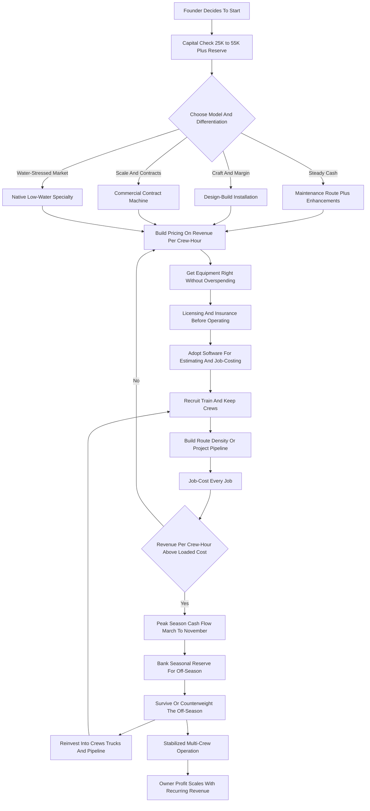

### Direct Answer

To start a landscaping business in 2027, you build a company that designs, installs, and maintains outdoor spaces -- mowing and maintenance, planting and softscape, hardscape and pavers, irrigation, lighting, drainage, and increasingly native and low-water design -- for residential homeowners, commercial properties, and HOAs. The industry is large, durable, and real -- roughly a **$140B+ US market** spread across **600,000+ businesses** -- but it is also fragmented, weather-exposed, labor-constrained, and brutally easy to enter and just as easy to fail at. The single number that decides whether a landscaping business is a real company or a self-employed mowing job is **revenue per crew-hour**, and the founders who succeed are the ones who price every job against the fully loaded cost of putting a crew on the ground.

**TL;DR:** A focused 2027 landscaping startup invests **$25K-$110K** in a truck or two, a trailer, mowers and handhelds, and a working-capital reserve; runs at a **45-58% gross margin on maintenance** and **35-50% on design-build installs**; and in a disciplined Year 1 generates **$90K-$280K in revenue** against **$35K-$95K in owner profit**, with the founder physically in the work. By Year 3-5 a well-run operation reaches **$500K-$1.6M in revenue** with **$110K-$340K in owner profit**. The three things that kill landscaping startups are competing as one more undifferentiated mowing operator, underpricing labor and drive time, and spending the summer cash before the off-season arrives. Viable in 2027 as a disciplined, revenue-per-crew-hour-obsessed operation built on recurring commercial and HOA contracts, high-margin design-build, and a defensible specialty wedge -- a poor fit for anyone wanting light work, fast scale without crews, or a business immune to weather.

---

## 1. What A Landscaping Business Actually Is In 2027

A landscaping business is not one business; it is a family of related businesses that share a truck, a trailer, and a crew but have wildly different economics. Understanding the structure before you buy a single mower is the first act of discipline.

### 1.1 The Three Revenue Layers

**Maintenance is the recurring backbone.** Mowing, edging, blowing, pruning, fertilizing, mulching, leaf cleanup, and seasonal color rotations, billed weekly or monthly. It generates steady cash and customer relationships but carries the thinnest margins and the highest churn -- a client can drop a mowing service with one text.

**Design-build installation is the high-margin engine.** Building a paver patio, a retaining wall, a fire pit, an irrigation system, a lighting package, or a full landscape renovation, billed per project at four-to-six-figure tickets. It carries real pricing power and the craft that separates a company from a crew.

**Enhancements are the upsell layer in between.** Mid-size planting jobs, sod, drainage fixes, and bed renovations sold into the existing maintenance base. This is where route-model margin is actually earned.

### 1.2 What Changed By 2027

The business is shaped by a handful of realities that were not fully true a decade ago. Clients find and compare companies online and expect a clean digital estimate. Labor is genuinely scarce and more expensive, which makes crew productivity the central management problem. Gas-powered handheld equipment faces bans in a growing list of jurisdictions, forcing a real battery-electric transition. Water scarcity and state turf-replacement incentives have created a structural demand wedge for native and low-water design.

| Service category | Frequency | Margin profile | Skill required |
|---|---|---|---|
| Mowing and lawn maintenance | Weekly/biweekly | Low | Low |
| Fertilization and weed control | Per program | Mid-high (licensed) | Mid |
| Pruning and plant health care | Seasonal | Mid | Mid |
| Mulching and seasonal color | Seasonal | Mid | Low-mid |
| Planting and softscape install | Per project | Mid-high | Mid |
| Hardscape (pavers, walls) | Per project | High | High |
| Irrigation install and service | Per project | High (licensed) | High |
| Outdoor lighting | Per project | High | Mid |
| Drainage and grading | Per project | High | Mid-high |
| Snow and ice management | Off-season | Variable | Low-mid |
| Native and low-water design | Per project | High | High |

### 1.3 Why It Is A Logistics Business, Not A Green One

The landscaping business is not passive and it is not easy. It is a logistics-labor-and-weather business: trucks and trailers, a crew you must recruit and keep, equipment that wears out, routes that must be tight, and a season that compresses the money into part of the year. The green grass belongs to the customer; the business is crews, routes, equipment, a pricing spreadsheet built on crew-hours, and a book of recurring contracts that does not evaporate in a slow week. Founders who want a head-start on the recurring-revenue mechanics should study a pure-maintenance variant (q9612) alongside this guide.

The mental model that separates a real operator from a hobbyist is this: the founder is not in the business of cutting grass, they are in the business of selling crew-hours at a margin. A landscaping company is a machine that converts labor, fuel, and equipment time into billable output, and every decision -- which accounts to take, which services to lead with, how to route the week, when to add a crew -- is a decision about how productively that machine runs. The founders who internalize this early build companies; the ones who think they are simply mowing lawns build jobs.

---

## 2. The Three Models: Choosing Your Spine

There are three distinct ways to build a landscaping business, and choosing deliberately is one of the most consequential early decisions a founder makes.

### 2.1 The Maintenance Route Model

This model builds a dense book of recurring residential and small-commercial maintenance accounts, tightly routed by geography, billed monthly, and run on crew efficiency. **The advantage** is steady predictable cash, a low-skill labor model, and a business that compounds as the route fills in. **The challenge** is thin margins, relentless price competition, high client churn, and a real ceiling unless the route is genuinely dense and well-priced. This is the most common starting point and the most commoditized.

### 2.2 The Design-Build Model

This model sells and builds landscape projects -- hardscape, planting, irrigation, lighting, full renovations -- at four-to-six-figure tickets, often with a design fee and a real creative process up front. **The advantage** is high margins, large tickets, differentiation, and pricing power. **The challenge** is a longer sales cycle, lumpier cash flow, a need for skilled labor and real craft, and the pipeline anxiety of always having to sell the next job.

### 2.3 The Commercial Contract Model

This model pursues recurring maintenance contracts with property managers, office parks, retail centers, multi-family communities, and HOAs -- larger contracts of $1,500-$6,000+/month per property, routed efficiently, bid annually. **The advantage** is large recurring revenue per account, professional buyers, and the ability to load a crew with one stop. **The challenge** is competitive annual re-bidding, slow payment terms, demanding service-level expectations, and winning contracts against established incumbents.

| Model | Cash pattern | Margin | Labor model | Main risk |
|---|---|---|---|---|
| Maintenance route | Steady, monthly | Thin base, mid with enhancements | Low-skill, high-volume | Price competition, churn |
| Design-build | Lumpy, per project | High | Skilled craft | Pipeline gaps |
| Commercial contract | Steady, larger units | Mid | Mixed, crew leaders | Annual re-bidding |

Many successful operators start with a maintenance route to build cash flow and crews, then deliberately layer design-build for margin or chase commercial contracts for scale. The founders who try to be all three in Year 1 with one crew end up mediocre at each.

---

## 3. The 2027 Market Reality

A founder needs an accurate read of the 2027 landscape, because the business is neither the easy-money side hustle some claim nor a saturated dead end.

### 3.1 Demand Is Structurally Healthy

Property owners -- residential and commercial -- consistently spend on outdoor space. The green industry is large and has grown steadily; lawns still need mowing, patios still get built, and water scarcity has if anything increased the design work. The market is roughly **$140B+ in the US** across landscaping and lawn care services, and it is not going away. Outdoor space is not a discretionary purchase the way many things are.

### 3.2 The Competition Is Extreme And Bifurcated

There are **600,000+ landscaping businesses** in the US, the overwhelming majority small, owner-operated, undifferentiated, and competing on price -- the easiest industry in the country to enter with a used truck and a mower. At the top sit a few large consolidators and franchise networks. **BrightView Holdings (NYSE: BV)** is the largest commercial landscaper in the US at roughly $2.7-$2.8B in revenue. **TruGreen** is the dominant residential lawn-treatment company at roughly $1.4-$1.5B. **Lawn Doctor** and **Weed Man** run national franchise systems. Equipment is supplied by public manufacturers like **The Toro Company (NYSE: TTC)**, **Deere & Company (NYSE: DE)**, and **Husqvarna (STO: HUSQ-B)**, while **Stanley Black & Decker (NYSE: SWK)** drives much of the battery-handheld transition. Software backbones come increasingly from public field-service vendors.

| Market segment | Approximate scale | Competitive posture for a new entrant |
|---|---|---|
| Large commercial consolidators | $2B+ revenue leaders | Do not try to out-scale |
| Residential lawn-treatment franchises | $1B+ leaders | Compete on service, not chemistry |
| Mid-size regional operators | $1M-$20M revenue | Direct competition at maturity |
| Owner-operator long tail | 500,000+ tiny operators | Out-professionalize, do not out-cheap |

### 3.3 The Opportunity For A Disciplined Entrant

The opportunity for a new entrant is not to out-cheap the long tail or out-scale the consolidators. It is to be more professional, more reliable, and more differentiated than the swarm of undifferentiated small operators -- and to compete in the higher-margin design-build and specialty lanes the swarm cannot serve. The winning 2027 entrant competes on professionalism, reliability, route or project discipline, and a differentiated service mix rather than on being the cheapest mow in the neighborhood. The same dynamic shapes adjacent trades -- a founder comparing options should review how it plays out in a junk-removal startup (q9586) and a pressure-washing startup (q2052).

---

## 4. The Core Unit Economics: Revenue Per Crew-Hour

This is the single most important section in the guide, because the entire business lives or dies on one number that beginners almost never calculate.

### 4.1 The Loaded Crew-Hour Cost

A landscaping crew -- typically two to three people, a truck, a trailer, and equipment -- has a fully loaded cost per hour: wages plus payroll taxes for every crew member, fuel, equipment depreciation and maintenance, insurance, and an allocation of overhead. Realistically that loaded crew cost runs **$95-$170 per crew-hour** depending on crew size, wages, and region. Every job you price must be evaluated against that number.

### 4.2 The Spread Between Services

The difference between landscaping services is enormous when measured per crew-hour, and the table below is the most important math in the business.

| Job type | Price | Crew-hours (incl. drive/load) | Revenue per crew-hour | Verdict |
|---|---|---|---|---|
| Scattered residential mow | $50 | 1.2 | ~$42 | Loses money |
| Dense-route residential mow | $55 | 0.9 | ~$61 | Barely viable |
| Mulch install | $1,400 | 9 | ~$155 | Decent |
| Commercial maintenance visit | $3,000/mo | ~22/mo | ~$135 | Strong |
| Irrigation install | $4,500 | 22 | ~$205 | Excellent |
| Lighting package | $3,200 | 14 | ~$230 | Excellent |
| Paver patio | $19,000 | 95 | ~$200 | Excellent |

### 4.3 The Trap And The Discipline

The trap: a scattered residential mowing route, where the crew drives 20 minutes between $50 lawns, can collapse to **$35-$45 per crew-hour** -- below the loaded crew cost, meaning the harder the owner works, the more money the business loses. The discipline this imposes is simple. **Before quoting any job, estimate the realistic crew-hours including drive and load time, and compare the revenue-per-crew-hour to the loaded crew cost.** Route density is not a nicety -- it is the entire economics of maintenance, and it has been quantified directly in a dedicated route-density analysis (q1149). The founder who prices by crew-hour builds a business that converts revenue to profit; the founder who prices by "what the neighbor charges" builds a busy, exhausting, unprofitable mowing job.

### 4.4 Why Drive Time Is The Hidden Killer

Beginners price the on-site work and ignore the drive and load time, and that single omission is what sinks more maintenance routes than any other error. A $55 mow that takes 35 minutes on the lawn looks like a $94/crew-hour job in the founder's head -- but add a 20-minute drive from the previous stop and 10 minutes to load and unload, and the real figure is 65 minutes for $55, or roughly $51/crew-hour against a $110+ loaded crew cost. The job that felt profitable was a loss the entire time. The fix is to price the *door-to-door* crew-hours, not the on-lawn minutes, and to treat route geography as a hard pricing input: an account two neighborhoods away from the cluster is not the same product as an account inside it, and it should either be priced higher or declined. The operators who survive in maintenance are the ones who understand that they are paid for billable on-site time but they pay wages for every minute the truck is moving.

---

## 5. The Line-By-Line P&L

Beyond crew-hour pricing, a founder must internalize the operating P&L, because the gross margin and the hidden costs determine whether a busy schedule becomes real profit.

### 5.1 The Cost Stack

**Direct labor** is the largest cost in the business -- crew wages plus the payroll taxes, workers' compensation, and overtime that beginners forget to load -- and it typically runs **35-50% of revenue**. **Equipment** is a constant drip: mowers, trimmers, blowers, and battery systems wear out and must be maintained, repaired, and replaced. **Vehicles** -- fuel, maintenance, insurance, and depreciation on trucks and trailers -- allocate to every job. **Materials** on installs are a real pass-through cost that must be marked up correctly, not absorbed. **Insurance, software, dump fees, licenses, marketing, and admin** round out the overhead.

| P&L line | Share of revenue (healthy shop) | Beginner error |
|---|---|---|
| Direct crew labor | 35-50% | Costing only the base wage |
| Equipment maintenance/replacement | 4-8% | Treating gear as one-time purchase |
| Vehicles and fuel | 6-10% | Ignoring depreciation |
| Materials (install-weighted) | Pass-through + markup | Thin or no markup |
| Insurance | 3-6% | Carrying minimum coverage |
| Software, admin, marketing | 4-8% | Running on a paper calendar |
| Net owner profit | 10-20% | Negative when underpriced |

### 5.2 Seasonality Dominates The Annual Picture

Across most of the country, revenue concentrates heavily in roughly March/April through October/November, with a thin or near-dead stretch in the deep off-season unless the operator carries snow-and-ice management or works in a year-round-mild climate. The disciplined operator treats the peak season as the period that must fund the entire year, building a reserve in summer that carries fixed costs -- truck payments, insurance, year-round core staff, the shop -- through the lean months.

### 5.3 The Margin Outcome

Net it out and a healthy landscaping operation runs a **45-58% gross margin on maintenance** and **35-50% on design-build installs** after crew labor and materials, with a **net owner profit margin of roughly 10-20%** in a well-run shop. The founders who fail at the P&L level almost always made the same errors: they priced labor as just the hourly wage, treated equipment as a one-time purchase, marked up materials thinly, and spent the summer cash instead of reserving it for the winter that was always coming.

---

## 6. Choosing And Pricing The Service Mix

With the crew-hour discipline established, a founder needs a concrete plan for what to sell and how to price it.

### 6.1 Lead With What Differentiates, Not What Is Easiest

The principle is to **lead with what differentiates and earns, not with what is easiest to sell.** Mowing is easy to sell and the worst-margin work on the menu; if a founder leads with nothing else, they have built a commodity. A maintenance-route founder should still build the route -- but build it dense, priced honestly so every visit clears the loaded crew cost with margin, and with enhancements attached because every maintenance client is a buyer of mulch, planting, cleanup, and small installs.

### 6.2 Pricing By Model

A **design-build** founder should price projects on crew-hours plus marked-up materials plus margin, charge a real design fee for the design work, and build a portfolio of completed projects as the primary sales asset. A **commercial-contract** founder should price contracts on the annualized crew-hours to service the property at the required standard, build in the enhancement and seasonal-color revenue, and bid to win profitable contracts rather than to be the low number.

### 6.3 The Constant Pricing Rules

Across all models, the pricing rules are constant: load labor fully, mark up materials properly with a real markup rather than cost-plus-a-little, price drive and load time into maintenance, charge separately for the things beginners give away (cleanup hauling, dump fees, extra visits), and set minimums that protect against tiny jobs that cost more in mobilization than they earn.

The material markup deserves particular emphasis because it is the most commonly surrendered margin in the business. On an install, the mulch, plants, pavers, base aggregate, sod, pipe, and fixtures are a real cost the operator fronts, transports, handles, and warranties -- and a founder who passes them through at cost or at a token markup has given away a meaningful slice of the project's profit. A proper material markup is not gouging; it compensates the business for sourcing, hauling, the risk of waste and breakage, and the working capital tied up before the client pays. The operators who treat materials as a pure pass-through are the ones who finish a $20,000 patio, look at the bank account, and cannot understand where the profit went.

| Pricing rule | What it protects against |
|---|---|
| Load labor fully (taxes, comp, OT) | The "busy but broke" trap |
| Mark up materials with real margin | Giving away the install profit |
| Price drive and load time | Scattered-route losses |
| Charge for hauling and dump fees | Death by a thousand givebacks |
| Set job minimums | Mobilization-heavy tiny jobs |
| Charge a design fee | Unpaid creative work |

---

## 7. Equipment, Trucks, And The Battery-Electric Transition

The landscaping business runs on physical equipment, and a founder must plan it as a core, ongoing cost, not a one-time startup line.

### 7.1 The Core Capital Stack

**The truck and trailer** are the foundation -- a pickup or work truck and an enclosed or open trailer sized to the equipment and the job type. A startup typically begins with one rig and adds as crew count grows. **Mowers** are the workhorse capital -- a commercial zero-turn or stand-on mower for maintenance plus push or walk-behind mowers for tight areas, each a real four-figure-plus expense. **Handheld equipment** -- string trimmers, edgers, blowers, hedge trimmers, chainsaws -- is the constant-replacement category.

### 7.2 The Battery-Electric Reality

The battery-electric transition is a genuine 2027 capital reality. California's statewide small-off-road-engine regulation effectively ended the sale of new gas-powered handheld equipment, and a growing list of cities have banned gas leaf blowers outright. An operator in or near these jurisdictions must budget for battery handheld systems and the batteries and chargers behind them -- a real incremental cost, though one that can often be passed to commercial buyers and that lowers fuel and maintenance over time.

### 7.3 The Equipment Discipline

| Equipment category | Buy or rent (startup) | Replacement horizon |
|---|---|---|
| Truck and trailer | Buy (often financed) | 7-12 years |
| Commercial mowers | Buy | 3-6 years heavy use |
| Battery handhelds | Buy | 3-5 years |
| Skid steer / mini-excavator | Rent until volume justifies | Buy at scale |
| Plate compactor, install tools | Rent early | Buy at scale |
| Hand tools, safety gear | Buy | Ongoing consumable |

Build a replacement reserve from day one, because every mower and trimmer is a depreciating asset on a clock. Rent the expensive install equipment until volume justifies buying, spec the battery transition into the plan rather than being surprised by it, and remember that equipment sitting idle in the off-season still cost money and still depreciates.

---

## 8. Hiring And Building Crews

A founder can run the smallest landscaping operation nearly solo, but the business does not scale past a one-person job without a crew -- and in 2027, building and keeping crews is the single hardest management problem in the business.

### 8.1 The Core Hires

Labor is scarce, the work is physical and weather-exposed, and turnover is a constant drag. The crew is the core hire: the people who mow, plant, build, prune, and load. A landscaping operation needs reliable crew members, ideally a **crew leader** who can run a crew without the owner present, and -- as the business grows -- skilled installers for design-build work, which is genuinely craft labor and harder to find than maintenance labor.

### 8.2 Why Crew Quality Drives Margin

Crew quality directly drives margin and reputation. Efficient, careful crews clear more crew-hours of revenue, damage less, build better, and represent the company at the client's property; sloppy crews run long, damage property, and generate complaints. Training, checklists, and clear job-cost expectations turn a crew into a system.

### 8.3 The H-2B Program And Stacked Labor Sources

The H-2B guest-worker program is a major part of how the industry staffs the season -- a temporary-nonagricultural-worker visa that landscaping companies use heavily. It is capped at **66,000 visas per year**, split across the fiscal year with supplemental allocations in some years, competitive, administratively involved, and not a guaranteed source. Many operators stack labor sources: local hiring, returning seasonal crew, H-2B, and referrals.

| Labor source | Strength | Limitation |
|---|---|---|
| Local hiring | Fast, flexible | Tight market, turnover |
| Returning seasonal crew | Trained, reliable | Seasonal availability |
| H-2B guest workers | Stable peak-season labor | Capped, administratively heavy |
| Referrals from current crew | Pre-vetted fit | Limited volume |

Beyond the crew, the hiring sequence typically adds an operations or account manager to run scheduling, estimating, and client communication as job volume grows. Landscaping is a people business as much as a green business, and the same labor squeeze defines adjacent trades like a tree-service startup (q9613) and a commercial-cleaning startup (q9610).

---

## 9. Routing, Scheduling, And Crew Productivity

This is the operational heart of the maintenance side of the business, and a founder who does not master it will have a full schedule and an empty bank account.

### 9.1 Route Density Is The Entire Economics

A crew that does ten lawns clustered in two neighborhoods, with five-minute drives between stops, clears far more revenue per crew-hour than a crew doing the same ten lawns scattered across a metro with twenty-minute drives -- same revenue billed, wildly different cost. The discipline is to build the route geographically, taking clustered accounts and being willing to decline or reprice a profitable-looking account that sits alone far from the cluster.

### 9.2 Job-Costing Every Job

Comparing the crew-hours a job actually took against the crew-hours it was priced for is how an operator learns which work is profitable and which is quietly losing money. The operators who do not job-cost are flying blind. Software runs the modern operation -- routing, scheduling, estimating, job-costing, and invoicing platforms let a small crew run a tight, professional operation.

| Operational lever | Effect on margin |
|---|---|
| Clustered route design | Cuts drive time, lifts revenue/crew-hour |
| Job-costing every job | Surfaces money-losing work |
| Routing/scheduling software | More jobs, fewer errors |
| Weather flex in the schedule | Absorbs lost crew-hours |
| Crew-leader accountability | Keeps actual hours near priced hours |

### 9.3 Weather Is The Permanent Variable

Weather is the permanent variable -- rain days, frozen ground, heat -- and the schedule must have the flex to absorb it. The operators who win treat routing and scheduling as a designed system rather than as whatever happens after the trucks leave the shop. In maintenance landscaping, the routing is the business, and a tight route is the difference between a 55% gross margin and a negative one.

### 9.4 The Catch-Up Day And Crew Sequencing

A maintenance schedule that is full every day with no slack is a schedule that breaks the first time it rains. The disciplined operator builds the week with a deliberate catch-up buffer -- typically treating the last working day of the week as flexible, so a rained-out Tuesday can be absorbed without pushing every client into the following week. Crew sequencing within the day matters just as much: the route should start at the cluster nearest the shop, work outward, and end nearest home, so the crew is not crossing the metro twice. Install crews should be slotted around weather windows -- pour concrete and set pavers on dry days, do interior-of-the-property planting work on marginal ones -- and the founder running both maintenance and design-build must protect the install crew from being constantly raided to cover maintenance gaps, because a half-built patio earns nothing while it sits. The schedule is a designed asset, and the operators who treat it as one run calmer, more profitable weeks than those who improvise every morning.

---

## 10. Startup Cost Breakdown: The Honest All-In Number

A founder needs a clear-eyed total of what it costs to launch, because under-capitalization and over-capitalization on the wrong things both kill landscaping startups.

### 10.1 The Line Items

| Startup line item | Lean launch | Fuller launch |
|---|---|---|
| Truck (used to financed) | $8,000 | $45,000 |
| Trailer (open to enclosed) | $2,000 | $12,000 |
| Mowers (ZTR + push) | $4,000 | $18,000 |
| Handheld equipment (incl. battery) | $2,000 | $8,000 |
| Hand tools, safety, consumables | $500 | $2,500 |
| Insurance (initial payments) | $1,500 | $6,000 |
| Formation, licensing, permits | $300 | $3,000 |
| Website, branding, truck lettering | $1,000 | $6,000 |
| Software setup | $200 | $1,500 |
| Working capital / off-season reserve | $5,000 | $25,000 |
| **Total** | **~$25,000** | **~$110,000+** |

### 10.2 Lean Versus Fuller Launch

A lean solo-to-small launch can come in around **$25,000-$55,000**, and a fuller launch with a better truck, design-build capability, a crew from the start, and a real reserve runs **$60,000-$110,000+**. Financing softens the truck and mower lines -- equipment financing is common and reasonable for productive assets.

### 10.3 The Reserve Is Non-Negotiable

The capital requirement is genuinely lower than many trades, which is exactly why the industry is so crowded. But the founders who fail are usually not the under-equipped ones; they are the ones who spent everything on equipment and kept nothing as a reserve, then could not make payroll in a rainy April before the route filled in. A founder weighing capital intensity against other trades should compare a pool-service startup (q2118) and a handyman startup (q9614), both of which start lighter.

---

## 11. The Operating Journey

The diagram below maps the full operating arc from the founder's first decision through a stabilized multi-crew operation.

---

## 12. The Year-One Operating Reality

A founder should walk into Year 1 with accurate expectations, because the gap between the marketed version and the real version of this business is where most quitting happens.

### 12.1 Route-Building Mode, Not Profit-Extraction Mode

Year 1 is route-building, portfolio-building, and learning-the-real-costs mode. The first season is spent landing the first accounts and projects, discovering the real loaded cost of a crew-hour, learning which work actually clears margin, building the route density that makes maintenance profitable, and finding out where the operation is fragile -- the mower that breaks in peak season, the crew member who quits in July, the install that took 40% more crew-hours than it was priced for.

### 12.2 The Realistic Numbers

A disciplined Year 1 landscaping startup, launched with real equipment and a reserve, can realistically generate **$90,000-$280,000 in revenue** -- the wide range driven by whether the founder is solo or running a crew and whether the mix includes design-build -- against **$35,000-$95,000 in owner profit**, with the owner physically in the work most of the year.

### 12.3 The First Off-Season Is The Test

The first off-season is the test: a founder who built the summer reserve carries the fixed costs and emerges ready for a stronger Year 2; one who spent the summer cash scrambles. The work is genuinely hands-on -- the founder is on the mower, in the truck, on the shovel, and on the phone selling the next job. The founders who succeed treat Year 1 as paid tuition in a real labor-and-logistics business.

---

## 13. The Five-Year Revenue Trajectory

Mapping a realistic five-year arc helps a founder size the opportunity honestly.

| Year | Revenue | Owner profit | Operating reality |
|---|---|---|---|
| Year 1 | $90K-$280K | $35K-$95K | Founder in the work; first off-season is survival |
| Year 2 | $200K-$500K | $55K-$150K | First crew leader; route deepens |
| Year 3 | $400K-$900K | $90K-$240K | Multiple crews; founder managing |
| Year 4 | $600K-$1.2M | $110K-$300K | Deeper commercial book or specialty arm |
| Year 5 | $800K-$1.6M | $140K-$340K | Mature operation; strategic fork |

### 13.1 What The Trajectory Assumes

These numbers assume disciplined crew-hour pricing, loaded labor costs, real material markups, route density, job-costing, and a respected seasonal reserve. They do not assume effortless growth, because landscaping scales with crews, equipment, and route or pipeline depth, not magically.

### 13.2 The Year-Five Fork

By Year 5 the founder decides whether to keep scaling, go deep on high-margin design-build, build the commercial-contract machine, expand geographically, or position for sale. A mature landscaping business is a real small business with trucks, crews, equipment, and recurring revenue -- a genuinely good outcome, but earned through years of operating discipline in a crowded, weather-exposed, labor-constrained industry.

### 13.3 What Slows The Trajectory

The five-year arc is a disciplined-case projection, not a default outcome, and several specific forces flatten it. **Underpricing compounds** -- a route built at thin margins in Year 1 does not magically improve, it just gets bigger and busier at the same thin margin, which is why fixing pricing before scaling is non-negotiable. **Crew-leader scarcity caps growth** -- a founder who cannot promote or hire a trustworthy crew leader stays a one-crew operation regardless of demand. **Off-season cash gaps reset progress** -- a founder who burns the reserve in a bad winter starts the next season rebuilding rather than growing. **Geographic limits matter** -- a service radius that runs out of profitable accounts puts a hard ceiling on the route. The founders who hit the upper end of the trajectory treat each year's cash flow as fuel for the next year's capacity, and they never let revenue grow faster than their systems and crew leadership can support.

---

## 14. Five Named Operating Scenarios

Concrete scenarios make the model tangible.

### 14.1 Marcus, The Disciplined Route-And-Enhancement Operator

Marcus launches with $40K into one truck-and-trailer rig, builds a dense residential maintenance route clustered in three adjacent neighborhoods, prices every visit to clear his loaded crew cost, and treats every maintenance client as a buyer of mulch, planting, and cleanup. He hits $180K revenue in Year 1 with the enhancement upsell carrying the margin, adds a second crew in Year 2, and reaches $620K by Year 3 because his routes are tight and his clients buy enhancements.

### 14.2 Derek, The Cautionary Tale

Derek buys $60K of equipment, takes every mowing account he can get regardless of location, ends up with a scattered route averaging 20-minute drives between $50 lawns, works 60-hour weeks, never job-costs anything, and discovers in his second fall that his "busy" business cleared barely $30K in owner profit because his revenue-per-crew-hour was below his loaded crew cost the whole time.

### 14.3 Priya, The Design-Build Specialist

Priya skips the maintenance route entirely, builds a design-build company doing paver patios, retaining walls, planting, and lighting at $15K-$80K tickets, charges real design fees, rents her skid steer until Year 2, and builds a photographed portfolio that becomes her sales engine. Smaller job count but $200+/crew-hour economics, and by Year 4 she is doing $850K at strong margins.

### 14.4 The Okafor Brothers, Commercial-Contract Builders

The Okafor brothers target property managers and HOAs from the start, win a handful of $2,000-$4,000/month commercial maintenance contracts that load a crew efficiently with few stops, layer in seasonal color and enhancement work, and grind through annual re-bidding. By Year 5 they run a multi-crew commercial operation near $1.3M in recurring-heavy revenue.

### 14.5 Janelle, The Seasonality Casualty

Janelle builds a solid Year-1 route grossing $210K through the summer, but spends the peak-season cash on a new truck and lifestyle, enters the off-season in a cold-winter market with no snow operation and no reserve, cannot cover the truck payment and insurance through January and February, and sells equipment at a loss in March -- the canonical illustration of disrespecting the seasonal reserve.

---

## 15. Lead Generation: Where Jobs Actually Come From

Landscaping is a local-marketing-and-reputation business, and the answer differs sharply by model.

### 15.1 Lead Sources By Model

**For the maintenance-route model**, jobs come from neighborhood density and word of mouth -- one well-served lawn generates neighbors, lawn signs and truck lettering build local visibility, and the route compounds geographically. **For the design-build model**, jobs come from a photographed portfolio -- completed projects on a website and on design-inspiration platforms -- plus referrals and relationships with builders, remodelers, real estate agents, and architects. **For the commercial-contract model**, jobs come from direct business development with property managers and management companies, HOA boards, and facility managers.

| Model | Primary lead engine | Secondary engine |
|---|---|---|
| Maintenance route | Neighborhood density, word of mouth | Door-hangers, local digital ads |
| Design-build | Photographed portfolio | Trade and builder relationships |
| Commercial contract | Direct property-manager BD | HOA board relationships |
| Specialty wedge | Rebate-program referral lists | Local low-water expert positioning |

### 15.2 The Baseline Credibility Check

Across all models, a professional online presence -- a clean website, real photos, genuine reviews, accurate service-area information -- is the baseline credibility check every modern client runs. The founder should match the lead-gen engine to the model and treat lead generation as a core ongoing function, because in an industry with 600,000+ competitors, the operator who is invisible competes on price and the operator who is known and trusted does not. The mechanics of recurring-account lead generation are explored further in a dedicated lawn-care guide (q2050).

---

## 16. Licensing, Insurance, And Compliance

The landscaping business carries a real compliance layer, and a founder must handle it deliberately rather than discover it the hard way.

### 16.1 Licensing

**Business licensing** -- a basic business license and registration is required in essentially every jurisdiction. **Contractor licensing** -- many states require a contractor or landscape-contractor license for installation work above a dollar threshold. **Pesticide applicator licensing** -- applying fertilizers, herbicides, and pesticides commercially almost always requires a state applicator license, and operating without it is a real legal exposure. **Irrigation licensing** -- some states license irrigation installation specifically.

### 16.2 Insurance

| Coverage | What it protects against | When to carry it |
|---|---|---|
| General liability | Property damage, thrown-rock claims, injury | Day one |
| Commercial auto | Trucks and trailers | Day one |
| Workers' compensation | Crew injury (legally required) | First employee |
| Inland marine / equipment | Mower and equipment theft and damage | With first major gear |

### 16.3 Employment And Environmental Compliance

Employment compliance covers proper worker classification -- employee versus contractor, a real audit risk in this industry -- payroll-tax compliance, and the H-2B labor and wage rules for operators using the program. Environmental rules cover proper green-waste disposal and any local rules on chemical application near water. Get the business and any required contractor and applicator licenses before operating, carry general liability and commercial auto from day one and workers' comp the moment there is a crew, and treat compliance as a fixed cost of being a real business.

---

## 17. The Specialty Wedge: Native And Low-Water Design

Beyond the general models, a founder should understand the fastest-growing differentiated lane in 2027: native, low-water, and sustainable landscape design.

### 17.1 The Policy Driver

The driver is structural -- water cost and scarcity, especially across the West, and a wave of state and municipal programs that pay property owners to replace turf with low-water landscaping. **California** has pursued large-scale turf-replacement programs and restricted irrigation of purely ornamental turf at commercial and institutional properties. **Nevada** enacted a law banning the use of Colorado River water to irrigate nonfunctional turf at commercial and common-area properties. **Colorado** created a statewide turf-replacement incentive program. Cities and water districts across the Southwest run their own per-square-foot turf-removal rebates.

### 17.2 Why It Escapes The Commodity Trap

| Specialty advantage | Why it matters |
|---|---|
| Higher margins | Design-driven work, not price-shopped |
| Differentiation | Local low-water and native-design expert |
| Referral channel | Rebate-program contractor lists |
| Durability | Water pressure is not going away |

For a founder in or near a water-stressed market, leading with or layering in a native and low-water design specialty is one of the clearest ways to escape the commodity-mowing trap. It requires genuine horticultural knowledge of native and drought-tolerant plants and is strongest where the water mandates and rebates are active.

### 17.3 How To Position For The Specialty

A founder choosing this wedge should build the positioning deliberately rather than treating it as an occasional add-on. That means getting onto the contractor referral lists that water districts and municipal rebate programs maintain, because those lists put the operator in front of exactly the homeowners and HOAs already holding rebate money and looking for someone to spend it. It means building a photographed portfolio of completed xeriscape and native-planting projects, because the work sells visually. It means developing real plant knowledge -- which natives thrive in the local climate, how to design for pollinators, how to stage a turf-to-xeriscape conversion so it looks intentional rather than barren. And it means pricing the work as design-build, with a design fee and a real margin, because the whole point of the specialty is that it is not price-shopped the way mowing is. The operator who becomes the recognized local low-water expert builds a referral engine and a margin profile that the undifferentiated mowing swarm simply cannot touch.

---

## 18. Scaling Past The First Crew

The jump from a proven solo-or-one-crew operation to a multi-crew business is its own distinct challenge.

### 18.1 The Prerequisites

The Year-1 pricing must be genuinely profitable -- do not scale a business that loses money per crew-hour, you just lose faster. The routing or project system must be documented well enough that a crew leader can run it without the owner. The cash flow plus reserve must absorb the next truck, the next crew's payroll before they are billable, and the next off-season.

### 18.2 The Scaling Levers

**Add a crew leader before adding a crew** -- the constraint on multi-crew growth is leadership, not labor. **Deepen route density or project pipeline** before adding capacity so the new crew has profitable work from day one. **Add trucks and equipment in step with crews**, because a crew without a rig is idle payroll. **Systematize estimating and job-costing** so pricing discipline survives the founder not personally quoting every job. **Build the office layer** so the founder moves from doing the work to running the system. **Never stop lead generation** so the route or pipeline grows ahead of the capacity.

### 18.3 The Constraints

| Scaling constraint | Order of difficulty | Solution |
|---|---|---|
| Crew leadership | First and hardest | Promote and train early |
| Labor availability | Second | Stack labor sources |
| Capital for trucks/equipment | Third | Reinvest cash, finance gear |
| Founder's attention | Fourth | Build the office layer |

The founders who scale well share one trait -- they fixed the pricing and the systems before they added crews, so growth was the repetition of a profitable machine rather than the multiplication of a money-losing one.

---

## 19. Taxes And Business Structure

A founder should set up the tax and legal structure deliberately, because the equipment-heavy, labor-heavy, seasonal nature of the business has specific implications.

### 19.1 Entity And Depreciation

Most landscaping operators form an LLC or elect S-corp treatment for liability protection and tax flexibility; the entity holds the truck titles, the equipment, the insurance, the contracts, and the payroll. Depreciation matters -- trucks, trailers, mowers, and equipment are depreciable assets, and the depreciation schedules and any available accelerated or first-year expensing materially shape taxable income, especially in heavy-equipment years.

### 19.2 Payroll, Classification, And Sales Tax

Payroll taxes on the crew -- including seasonal labor and any H-2B workers -- are a real, non-optional cost that must be budgeted and remitted correctly. Worker classification is a genuine audit risk -- treating crew members as independent contractors when they are functionally employees invites back taxes and penalties. Sales tax can apply to landscaping services and materials in ways that vary by state, and the operator must get the local rule right.

### 19.3 The Discipline

Separate business banking from day one, run a bookkeeping system that tracks jobs and job-costs and equipment as assets, give quarterly attention to payroll and estimated taxes, classify workers correctly, and retain an accountant who understands equipment-heavy seasonal trades. Skipping this does not save money -- it converts a manageable compliance function into a year-end scramble and a missed depreciation opportunity.

---

## 20. Owner Lifestyle: What It Actually Feels Like

A founder should know what daily life in this business is like before committing, because the lived reality is physical, seasonal, weather-driven, and -- in the early years -- relentless.

### 20.1 The Year-By-Year Shift

In Year 1, running a lean operation, the founder is genuinely in the business -- on the mower, in the truck, on the shovel, building the patio, doing the estimates at night. By Year 2-3, with a crew leader running a crew and a system in place, the founder's role shifts toward management -- estimating, selling, running the crews, watching the job-costs. By Year 3-5, with multiple crews and a mature system, the founder can run a larger operation with a more managerial rhythm, though landscaping never becomes hands-off the way some businesses do.

### 20.2 The Emotional Texture

There is real satisfaction in a transformed yard, a beautifully built patio, a tight profitable route, a crew that runs well, and the tangible visible result of the work. There is real stress in the weather days, the equipment that breaks in July, the crew member who quits in peak season, the underpriced job, and the off-season cash gap. A founder who genuinely enjoys outdoor work, the trades, and the rhythm of a season will find it rewarding; a founder who wanted a clean, indoor, light-touch business will be exhausted and surprised.

---

## 21. Counter-Case: When You Should Not Start A Landscaping Business

Honesty requires a dedicated section on who should walk away, because the model badly misfits a large set of would-be founders.

### 21.1 The Person Who Should Not Start

**Do not start if your only plan is to mow lawns cheaper.** In a market with 600,000+ competitors, undifferentiated commodity mowing has a ceiling of a $60K-$160K solo job, price is the only lever, and you will be exhausted and capped. **Do not start if you want a light-touch, indoor, weather-immune business** -- this is a physical, outdoor, seasonal trade, and no amount of software changes that. **Do not start if you will not build crews** -- if you cannot or will not recruit, train, and lead labor in a tight market, you have a solo job with a solo ceiling, not a business. **Do not start if you cannot fund a reserve** -- a launch with equipment but no off-season cushion is one rainy April from collapse.

### 21.2 The Conditions That Break The Model

| Failure condition | Why it breaks the model |
|---|---|
| Scattered route, no density | Revenue/crew-hour falls below loaded cost |
| No job-costing | Whole service lines lose money invisibly |
| Thin material markup | Install margin given away |
| Summer cash spent | Off-season fixed costs unfunded |
| No insurance or licensing | One claim or audit ends the business |
| Owner-only, no crew leader | Cannot scale, cannot sell, cannot get sick |

### 21.3 The Honest Verdict

The model also misfits a founder in a market without enough residential, commercial, and HOA density to build a route, and a would-be specialty operator in a region with no active water mandates or rebates. If a founder reads this section and recognizes themselves in three or more of these conditions, the disciplined move is not to start -- or to start deliberately small and capped, priced accordingly. Adjacent trades such as a commercial-cleaning startup (q9610) or a pressure-washing startup (q2052) carry different -- though not lighter -- versions of the same constraints, and a founder who fails the landscaping fit test should not assume those are an easy escape.

---

## 22. A Decision Framework: Should You Start In 2027

A founder deciding whether to commit should run a structured self-assessment, because this model fits a specific person.

### 22.1 The Seven Questions

**Capital:** do you have $25,000-$55,000 for a lean disciplined launch with a real off-season reserve, or access to equipment financing plus reserve cash? **Physical temperament:** are you willing to run a physical, outdoor, weather-exposed business, on the mower and the shovel yourself in Year 1? **Differentiation plan:** do you have a real plan to be something other than one more mowing operator? **Labor willingness:** are you willing to recruit, train, keep, and lead crews in a tight labor market? **Operating discipline:** will you actually price on loaded crew-hours, mark up materials properly, build a dense route, job-cost every job, and respect the reserve? **Seasonality tolerance:** can you operate a business that earns most of its money in a compressed season? **Local market fit:** is there enough residential, commercial, and HOA work in your service radius?

### 22.2 Reading The Answers

| Answer pattern | Verdict |
|---|---|
| Yes across all seven | Legitimate path to a $500K-$1.6M business |
| No on differentiation or discipline | Do not start -- you are a price-competer |
| No on labor willingness only | Plan a deliberately solo, capped operation |
| No on local market fit | Wrong market -- relocate the plan or the radius |

The framework's purpose is to convert "I have a truck and a mower" into an honest, structured decision about the labor-logistics-and-weather business underneath. A landscaping founder still weighing this against a closely related model should also read the dedicated landscaping-company guide (q9678).

---

## 23. Exit Strategies And The Long-Term Picture

Landscaping businesses can be exited, and a founder should build with the eventual exit in mind.

### 23.1 The Exit Paths

**Sell the operating business** -- a landscaping company with recurring maintenance contracts, a documented system, trained crews, owned equipment, and clean books is a saleable asset; valuations run as a multiple of stabilized earnings, with the multiple driven heavily by how much of the revenue is recurring contract revenue versus one-off project work, and by how owner-dependent the operation is. **Sell the contract book and equipment** -- even absent a full going-concern sale, a route of recurring accounts has real value and the trucks and equipment have resale value. **Roll up or be rolled up** -- the industry is consolidating. **Transition to a key employee or family** -- the operational, crew-driven nature makes an internal transition viable when a trained successor exists.

### 23.2 What Drives Exit Value

| Value driver | Effect on multiple |
|---|---|
| Recurring contract revenue share | Higher recurring = higher multiple |
| Low owner-dependence | Self-running operation sells for more |
| Documented systems | Reduces buyer risk, lifts price |
| Clean books and job-costing | Speeds diligence, supports valuation |
| Contract durability | Sticky contracts command premium |

### 23.3 The Honest Long-Term Picture

Landscaping is a durable, real business -- properties always need outdoor work, the demand does not disappear, and a well-run operation produces real owner profit for years -- but it is a business, not a passive holding. It demands ongoing capital for equipment replacement, ongoing labor management, and ongoing operating discipline through every season.

---

## 24. The 2027-2030 Outlook

A founder committing capital should have a view on where the business goes next.

### 24.1 The Clear Trends

Demand stays structurally healthy -- residential and commercial properties keep needing maintenance, installation, and increasingly water-wise design. Labor stays the central constraint -- crew scarcity and cost are not resolving. The equipment transition continues -- gas-equipment restrictions spread, the battery-electric transition becomes the default. Water drives a growing specialty market -- Western water scarcity and rebate programs keep expanding the native and low-water design wedge. Software keeps professionalizing the small operator. Consolidation continues, especially on the commercial side. AI and tooling assist the back office -- estimating, design visualization, and routing optimization get more automated.

### 24.2 The Net Outlook

The version that thrives is a professional operation that prices on loaded crew-hours, differentiates beyond commodity mowing, builds and keeps real crews, runs tight routes or a real project pipeline, and -- where the market supports it -- leans into the low-water specialty wedge. The version that struggles is the undifferentiated, underpriced, scattered-route, no-reserve mowing operator competing on price alone. Landscaping is viable and durable through 2030 in its disciplined, crew-hour-priced, differentiated form.

---

## 25. The Final Framework: Building It Right From Day One

Pulling the entire playbook into a single operating sequence, a founder who wants to succeed should execute in this order.

### 25.1 The Twelve-Step Sequence

| Step | Action |
|---|---|
| 1 | Get honest about capital and temperament |
| 2 | Choose your model and differentiation deliberately |
| 3 | Build pricing on revenue-per-crew-hour |
| 4 | Get the equipment right without overspending |
| 5 | Handle licensing and insurance before operating |
| 6 | Build route density or a real project pipeline |
| 7 | Adopt estimating, routing, and job-costing software |
| 8 | Make crews and the crew-leader layer the priority |
| 9 | Job-cost every job and reprice what loses money |
| 10 | Respect the seasonal reserve every year |
| 11 | Generate leads relentlessly through your model's channel |
| 12 | Build for the exit -- maximize recurring revenue, document systems |

### 25.2 The Closing Verdict

Do these twelve things in order and a landscaping business in 2027 is a legitimate path to a $500K-$1.6M asset-and-contract-backed small business with $110K-$340K in owner profit. Skip the discipline -- especially on differentiation, crew-hour pricing, route density, and the reserve -- and it is the fastest way to buy yourself an exhausting, capped, price-competing job in the most crowded small-business market there is. The business is neither easy money nor a dead end. It is a real, physical, seasonal, labor-constrained small business, and in 2027 it rewards exactly one kind of founder: the disciplined, differentiated, crew-hour-obsessed operator who treats it as the labor-logistics-and-weather business it actually is.

---

## Sources

1. US Census Bureau -- County Business Patterns, landscaping services (NAICS 561730).
2. IBISWorld -- Landscaping Services in the US, industry market research report.
3. National Association of Landscape Professionals (NALP) -- industry size and workforce data.
4. US Bureau of Labor Statistics -- Occupational Outlook, grounds maintenance workers.
5. US Bureau of Labor Statistics -- wage data for landscaping and groundskeeping occupations.
6. BrightView Holdings, Inc. -- annual report (Form 10-K) and investor disclosures.
7. ServiceMaster / TruGreen -- corporate revenue and market-position disclosures.
8. Lawn Doctor -- franchise disclosure document and system overview.
9. Weed Man -- franchise system and territory overview.
10. The Toro Company -- annual report and equipment product disclosures.
11. Deere & Company -- annual report and commercial mowing product line.
12. Husqvarna Group -- annual report and battery-equipment transition disclosures.
13. Stanley Black & Decker -- outdoor power equipment segment disclosures.
14. California Air Resources Board -- Small Off-Road Engine (SORE) regulation.
15. US Department of Labor -- H-2B temporary non-agricultural worker program rules.
16. US Citizenship and Immigration Services -- H-2B cap and allocation data.
17. Southern Nevada Water Authority -- nonfunctional turf removal law and rebate program.
18. Nevada Legislature -- Assembly Bill on Colorado River water and nonfunctional turf.
19. Colorado Water Conservation Board -- statewide turf replacement program.
20. Metropolitan Water District of Southern California -- turf-replacement rebate program.
21. US Environmental Protection Agency -- WaterSense and outdoor water efficiency guidance.
22. US Small Business Administration -- starting and financing a small business.
23. US Small Business Administration -- equipment financing and working capital guidance.
24. Internal Revenue Service -- business structure (LLC, S-corp) guidance.
25. Internal Revenue Service -- depreciation and Section 179 expensing guidance.
26. Internal Revenue Service -- worker classification (employee vs. independent contractor).
27. Internal Revenue Service -- employer payroll tax obligations.
28. National Association of Insurance Commissioners -- commercial general liability overview.
29. Insurance Information Institute -- commercial auto and workers' compensation basics.
30. Occupational Safety and Health Administration -- landscaping and groundskeeping safety.
31. US Environmental Protection Agency -- pesticide applicator certification requirements.
32. State contractor licensing boards -- landscape contractor license thresholds (multi-state).
33. Irrigation Association -- irrigation contractor certification and water-management standards.
34. US Department of Agriculture -- drought monitor and Western water-stress data.
35. Lawn & Landscape industry media -- annual State of the Industry operator survey.
36. Turf and green-industry trade media -- equipment, labor, and pricing benchmarks.
37. National Association of Landscape Professionals -- business management and benchmarking resources.
