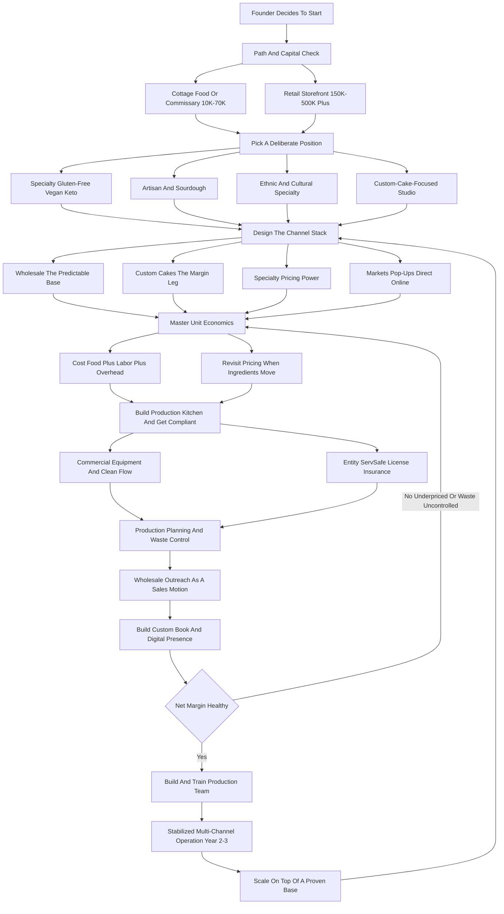

### Direct Answer

Starting a bakery business in 2027 is genuinely viable, but only for the founder who stops imagining a charming retail shop and starts building a **production-and-distribution business that happens to make baked goods**. The model that works stands on four legs at once -- recurring wholesale, high-margin custom celebration cakes, a deliberate specialty position, and direct channels like farmers markets and online -- with the retail storefront treated as optional topspin rather than the plan. Expect **$10K-$70K** to launch lean from a commissary or cottage-food kitchen and **$150K-$500K+** for a built-out storefront; a disciplined Year 1 produces **$120K-$300K in revenue** at **$15K-$60K in owner profit**, and the operators who survive price labor honestly, control waste, and build a recurring wholesale base before they ever sign a lease.

**TL;DR:** Retail-only bakery is one of the hardest, lowest-margin small-business categories there is -- rent, labor, and volatile ingredient costs converge to leave retail-only operators netting just **4-9%**. The bakery that compounds runs production economics: a recurring wholesale calendar as the predictable base, custom cakes as the margin leg, a specialty position for pricing power, and farmers markets, pop-ups, and online as the demand engine. Start lean (cottage food or shared commissary, $10K-$70K), prove demand, price every item against food cost plus labor plus overhead plus margin, track waste as a daily number, and add a storefront only when the business underneath it already covers the rent. The three killers are underpricing (ignoring labor entirely), leading with a retail lease, and ignoring the daily compounding loss of unsold perishable product. Do it as a disciplined multi-channel production business and a 2027 bakery is a real path to a **$350K-$1.6M** operation with **$70K-$340K** in owner profit; do it as a pretty empty shop and it is a fast way to lose a savings account.

## 1. What A Bakery Business Actually Is In 2027

### 1.1 The Production-Business Reframe

A bakery produces baked goods -- bread, pastries, cakes, cookies, muffins, croissants, bagels, pies, and specialty celebration items -- and sells them through some combination of a retail counter, wholesale accounts, custom orders, farmers markets, catering, and direct online shipping. **The single most important thing a founder must internalize before spending a dollar is that a bakery is not fundamentally a retail business or a hospitality business; it is a production business** with an extremely short product shelf life and a labor-intensive process. The channel you sell through is a separate decision from the product you make. The romantic image -- a charming shop, a glowing display case, a line of neighbors out the door -- describes the single hardest, lowest-margin way to run the business.

The version that actually compounds is closer to a small food-manufacturing operation. **You run a production schedule, a yield-and-waste discipline, a recurring set of wholesale accounts you bake for on a calendar, and a custom-order book that carries the high-margin work.** The display case, if it exists, is the marketing -- not the model. A founder who treats baking as craft and ignores production economics works hard for years and clears nothing; a founder who treats it as a factory with an apron builds a durable business.

### 1.2 What Changed By 2027

The 2027 bakery is shaped by realities that did not fully exist a decade ago. **Ingredient costs** -- flour, butter, eggs, sugar, chocolate, dairy -- stepped up sharply in the early-to-mid 2020s and remain volatile, so menu pricing must be revisited continuously rather than set once. **Labor** is more expensive and harder to find, particularly skilled bakers and decorators, which makes the production schedule and selective automation the squeeze point. **Grocery chains** have dramatically improved their in-store bakery and prepared-food shelves, so the commodity muffin and the commodity loaf are hard to win on price. **Digital discovery and ordering** is now baseline -- customers find and order through Instagram, Google, DoorDash, Uber Eats, and direct websites -- so a bakery with no digital presence is invisible to a large share of demand. And **shared-commissary and ghost-kitchen infrastructure** made it far cheaper to start without a retail lease.

| 2027 force | What it does to the business | The operator's response |
|---|---|---|
| **Ingredient volatility** | Margins move month to month | Continuous pricing review, supplier relationships |
| **Labor scarcity and cost** | Production cost rises, staffing is hard | Tight scheduling, cross-training, selective automation |
| **Grocery and chain competition** | Commodity end is unwinnable on price | Deliberate specialty position |
| **Digital discovery** | Offline-only bakeries are invisible | Website, Google Business Profile, Instagram, delivery apps |
| **Shared-kitchen infrastructure** | Barrier to entry collapses | Start lean, skip the lease until proven |
| **Shipping of shelf-stable goods** | National direct channel opens | Cookies, biscotti, granola as a DTC line |

A bakery in 2027 is a production-and-distribution business wearing an apron, and the founders who succeed understand that the display case is the marketing, not the model.

## 2. Why The Default Retail Storefront Tops Out

### 2.1 The Cost Stack Is Brutal And Fixed

The default plan nearly every aspiring baker imagines is identical: lease 800-2,000 square feet of retail in a walkable area, build out a commercial kitchen and a display counter, hire a few part-time counter and production staff, post on Instagram, and wait for foot traffic. It is the most natural plan and the most dangerous one. **First, the cost stack is brutal and fixed.** Retail rent in a location with real foot traffic runs $2,000-$15,000+ a month depending on metro; the buildout of a code-compliant commercial kitchen runs $60,000-$250,000; and the equipment -- ovens, mixers, proofers, refrigeration, display cases -- runs $30,000-$150,000. All of that is a fixed monthly obligation that does not care whether it rained, whether it is January, or whether the neighborhood showed up.

### 2.2 The Margin Math Is Unforgiving

**Second, the margin math is unforgiving.** Ingredients might be only 25-35% of a retail item's price, which sounds great until rent, labor, utilities, packaging, insurance, and waste are stacked on -- and the typical retail-only bakery nets in the low-to-mid single digits as a percentage of revenue. A shop doing $300,000 a year might clear $15,000-$25,000 in owner profit while the owner works sixty-hour weeks. **Third, the product perishes daily.** Unsold bread, pastries, and cakes are not inventory you carry; they are a loss you absorb every single day, and a retail case must be kept full to look appealing, which structurally builds waste into the model.

### 2.3 The Chain Competition Is Real

**Fourth, the grocery and chain competition is real.** Whole Foods (part of Amazon, NASDAQ: AMZN), Sprouts Farmers Market (NASDAQ: SFM), Costco (NASDAQ: COST), and Walmart (NYSE: WMT) in-store bakeries, plus chains like Panera Bread, Paris Baguette, Nothing Bundt Cakes, and Crumbl, have made the commodity end of the category extremely hard to win on price or convenience. The retail storefront is not worthless -- it builds brand, anchors a custom-order business, and can be a genuine community asset -- but **as the primary engine of a startup it is the most expensive customer-acquisition channel in food.** A founder who leads with it is choosing the hardest possible path. The same brutal-fixed-cost logic applies to other lease-led food concepts; the contrast with a low-fixed-cost mobile model is covered in the food truck playbook (q1929).

## 3. The Channel Stack: The Four Legs That Make A Bakery Work

A durable 2027 bakery stands on multiple channels at once, and a founder should think of these as a portfolio rather than picking one.

### 3.1 Leg One -- Wholesale, The Predictable Base

You bake on a recurring schedule for business customers -- independent coffee shops, restaurants, grocers, hotels, caterers, corporate cafeterias, offices, and institutional accounts -- who place standing weekly orders. **Wholesale is lower margin per item than retail, but it is predictable, high-volume, low-marketing-cost, and it lets you plan production**, which is the single most valuable thing in a perishable business. A coffee shop taking 80 croissants and 40 muffins three days a week is a calendar you can build around.

### 3.2 Leg Two -- Custom Celebration Cakes, The Margin Leg

Wedding cakes, birthday and anniversary cakes, baby showers, corporate event cakes, holiday orders, and dessert platters. **This is the highest-margin leg** -- a custom cake priced at $200-$800 might carry 60-70% gross margin -- and it is made-to-order, so there is essentially no waste.

### 3.3 Leg Three -- Specialty Positioning, The Pricing Power

Gluten-free, vegan, allergen-free, sourdough and artisan, keto and low-carb, or ethnic and cultural specialty -- **positioning that escapes commodity price competition** and commands a premium because the grocery shelf cannot easily replicate it.

### 3.4 Leg Four -- Direct Demand Engines

Farmers markets, pop-ups, a direct online store, local delivery, and shipping of shelf-stable items. **These are low-rent ways to generate cash flow, test products, and build the brand and email list** that feed the other three legs.

| Channel leg | Margin profile | Predictability | Waste risk | Marketing cost |
|---|---|---|---|---|
| **Wholesale** | Thin per unit, strong on volume | Very high (standing orders) | Very low | Near zero once landed |
| **Custom cakes** | Highest net (25-45%) | Moderate (event-driven) | Near zero (made to order) | Portfolio + referral |
| **Specialty position** | Premium pricing (1.5x-3x) | Follows chosen channels | Depends on channel | Built into brand |
| **Direct (markets/online)** | Good gross, real time cost | Low, but builds the list | Moderate (markets) | Time-intensive |
| **Retail counter** | High gross, eaten by overhead | Lowest | Highest | Rent IS the cost |

The strategic point: **a bakery built on one leg is fragile, and a bakery built on retail alone is fragile and low-margin.** The operators who thrive layer recurring wholesale (the predictable base) under custom orders (the margin) with specialty positioning (the pricing power) and direct channels (the demand engine) -- and the retail storefront, if it exists at all, comes later and on top.

## 4. Wholesale: The Predictable Recurring Base In Depth

### 4.1 Who The Wholesale Customer Is

Wholesale deserves its own deep treatment because it is the leg most beginners underweight and the one that most reliably stabilizes a bakery. **The wholesale customer is a business that resells or serves your product:** independent coffee shops and cafes, full-service and quick-service restaurants, grocery stores and specialty markets, hotels and bed-and-breakfasts, corporate cafeterias and office pantries run by operators like Sodexo, Aramark (NYSE: ARMK), and Compass Group, country clubs, hospitals, universities, and caterers who need a baking partner.

### 4.2 The Wholesale Economics

Wholesale pricing is typically a wholesale rate the buyer marks up, so your margin per item is thinner than retail -- **but the volume is large, the orders recur on a schedule, the marketing cost is near zero once the account is landed, and you can plan production around it**, which slashes waste. A single solid wholesale account might be worth $800-$12,000 a month in recurring revenue depending on the account size, and a bakery with eight to fifteen accounts has a predictable revenue base that retail foot traffic can never match.

### 4.3 How To Land Wholesale Accounts

Landing wholesale is an **outbound sales motion, not a marketing one.** You identify target accounts, you sample-drop, you nail consistency and delivery reliability, and you build the relationship with the buyer or chef.

| Wholesale account type | Typical monthly value | What they buy | Sales contact |
|---|---|---|---|
| **Independent coffee shop** | $800-$4,000 | Croissants, muffins, scones, cookies | Owner / manager |
| **Full-service restaurant** | $1,200-$6,000 | Dinner rolls, dessert components, bread | Executive chef |
| **Specialty grocer** | $2,000-$10,000 | Packaged loaves, cookies, pastries | Category buyer |
| **Hotel / B&B** | $1,500-$8,000 | Breakfast pastry, breads | F&B director |
| **Corporate cafeteria** | $3,000-$12,000 | Volume pastry, sheet cakes | Foodservice operator |

The risks to manage: **concentration** (no single account should be so large that losing it breaks you), **delivery logistics** (early-morning routes, refrigeration, reliability), and **pricing discipline** (wholesale rates that still clear a real margin after delivery cost). The founders who build wholesale early have a business with a floor under it; a related demand-engineering case is the coffee-shop break-even math in (q1131).

## 5. Custom Celebration Cakes: The Margin Leg

### 5.1 What The Category Spans

Custom and celebration baking is where the margin lives. The category spans wedding cakes ($300-$1,500+ each), birthday and anniversary cakes ($60-$400), baby shower and gender-reveal cakes, corporate and event cakes ($150-$600), holiday orders, and cookie and dessert platters. **The reason the margin is strong: custom work is made to order, so waste is near zero; it is priced on skill and design, not on commodity comparison**, so a customer is not price-shopping your wedding cake against the grocery shelf.

### 5.2 The Pricing Discipline That Makes Or Breaks It

The discipline that makes or breaks this leg is **pricing**. A custom cake's price must cover ingredients, the genuine hours of labor (baking, leveling, filling, crumb-coating, decorating, assembly), the overhead allocation, and a real margin. The single most common mistake is the baker who prices a forty-dollar cake that took five hours to make because thirty-five dollars "feels like a lot for a cake."

### 5.3 Distribution For Custom Work

Distribution runs through wedding marketplaces (The Knot and WeddingWire, both part of The Knot Worldwide; Zola), wedding planners and venues, social media portfolios on Instagram and Pinterest (NYSE: PINS), Google Business Profile (Alphabet, NASDAQ: GOOGL), and referral from past clients. **The operational keys:** a clear order-intake and consultation process, a deposit and contract structure, a production calendar that protects against over-committing a weekend, and a portfolio that does the selling. Custom is the leg that turns a break-even production business into a profitable one; a closely related event-food model is the catering playbook (q1980).

## 6. Specialty Positioning: Escaping The Commodity Trap

### 6.1 Why Generic Loses

In 2027, a generic bakery selling generic muffins, generic bread, and generic cookies is competing directly with the grocery store, the chain, and every other generic bakery -- a price war it cannot win. **Specialty positioning is how a bakery escapes that trap**, and a founder should choose a position deliberately.

### 6.2 The Positions Worth Choosing

- **Gluten-free and allergen-free** -- a genuinely hard production discipline requiring a dedicated facility or rigorous protocols, but a position with passionate, underserved demand and real pricing power. The dedicated-facility version is its own playbook (q9604).
- **Vegan** -- a growing segment, often paired with allergen-free, that the commodity shelf serves poorly.
- **Sourdough and artisan bread** -- the Tartine and Acme Bread model, where craft, fermentation, and quality command a premium and build a devoted following.
- **Keto, low-carb, and protein-forward** -- serving a diet-driven segment willing to pay well above commodity pricing.
- **Ethnic and cultural specialty** -- Mexican panaderia, Vietnamese banh mi and pastries, Chinese and Asian bakery, Persian, Indian, Filipino, Eastern European, Jewish, Italian -- categories with built-in community demand, cultural authenticity as a moat, and often weak chain competition.
- **Ultra-premium and design-forward** -- the bakery whose product is so distinctive (the viral cookie, the architectural cake, the laminated-pastry program) that it becomes a destination.

| Specialty position | Pricing premium | Difficulty | Moat strength |
|---|---|---|---|
| **Gluten-free / allergen-free** | 1.8x-3x | High (dedicated facility) | Strong |
| **Vegan** | 1.4x-2x | Moderate | Moderate |
| **Sourdough / artisan** | 1.5x-2.5x | Moderate-high (skill) | Strong (following) |
| **Keto / low-carb** | 1.8x-3x | Moderate (R&D) | Moderate |
| **Ethnic / cultural** | 1.2x-2x | Low-moderate | Strong (authenticity) |
| **Ultra-premium / design** | 2x-4x | High (talent) | Strong (brand) |

The strategic point is not that any one position is best; it is that **a position -- any deliberate, defensible position -- beats being generic.** A founder who picks a lane and goes deep builds a brand; one who tries to be the everything bakery competes with everyone on price.

## 7. The 2027 Market Reality: Demand, Costs, And Competition

### 7.1 Demand Is Real And Resilient

A founder needs an accurate read of the 2027 landscape, because the bakery category is neither the recession-proof comfort-food goldmine some imagine nor a dying business. **Demand is real and resilient.** People buy bread, celebrate with cake, and treat themselves with pastry, and the category as a whole is large and stable -- celebration and comfort spending is durable even when discretionary budgets tighten.

### 7.2 The Cost Environment Is The Hard Part

**The cost environment is the hard part of 2027.** Ingredient costs stepped up significantly in the early-to-mid 2020s and remain volatile, which means a bakery cannot set a menu price once and forget it; pricing is now a continuous discipline. Labor is more expensive and harder to staff. Commercial rent in walkable retail corridors is high.

### 7.3 The Competition Is Bifurcated

**The competition is bifurcated.** At the commodity end, grocery in-store bakeries and chains (Panera, Paris Baguette, Nothing Bundt Cakes, Crumbl, Great American Cookies) have raised the floor and own convenience and price. At the craft and specialty end, independent bakeries compete on quality, position, and relationship -- **and that is the only end a new independent should be playing in.** The same bifurcation reshapes adjacent food categories; the craft-versus-commodity dynamic also drives the brewery business (q1941).

## 8. The Unit Economics: Food Cost, Labor, And The Real Margin

### 8.1 The Three Cost Layers Of Every Item

This is the section that determines whether a bakery is a business or an expensive hobby. **Every item a bakery makes has three cost layers, and the founder must price against all three.** **Food cost** -- the ingredients in the item -- typically runs 20-35% of the menu price for a well-priced item; a croissant with $0.55 of ingredients should not sell for $1.50, it should sell for $3.50-$5.00. **Labor cost** -- the genuine hands-on time to produce the item, loaded with payroll taxes -- is the cost beginners systematically ignore, and it is often larger than the food cost, especially for laminated pastry, decorated cakes, and anything hand-finished. **Overhead allocation** -- rent, utilities, equipment depreciation, insurance, packaging, software, marketing, and waste -- must be spread across every item sold.

### 8.2 The Honest Blended Margin Picture

A disciplined bakery runs a **65-75% gross margin on food cost alone**, but the net margin after labor and overhead is where the channels diverge sharply. **Retail-only operations frequently net just 4-9%** of revenue. Wholesale nets thinner per item but the volume and zero-waste-from-planning lift the effective return. Custom and celebration work nets the best -- frequently **25-40%+** -- because it is made-to-order and priced on skill.

| Channel | Gross margin (food) | Net margin (after all costs) | Why |
|---|---|---|---|
| **Retail counter** | 75-88% | 4-9% | Rent + labor + waste eat the gross |
| **Wholesale** | 55-70% | 12-20% | Thinner gross, but planned and low-waste |
| **Custom cakes** | 70-85% | 25-45% | Made to order, priced on skill |
| **Catering / events** | 70-80% | 22-38% | Volume + made-to-order |
| **Shipped shelf-stable** | 65-80% | 15-25% | Shipping cost, but national reach |

### 8.3 The Disciplines This Imposes

**Price every item against food cost plus labor plus overhead plus margin, not against what feels right. Revisit pricing every time ingredient costs move. Track waste as a hard number** because unsold product is a daily loss in a perishable business. **Know the margin of each channel** so you can shift the mix toward the profitable legs. A baker who masters the unit economics builds a business; one who prices by feel runs a tiring charity.

## 9. Pricing Tables: What Items And Channels Actually Earn

### 9.1 The Per-Item Economics

Concrete numbers make the economics tangible. The table below shows representative 2027 figures -- ranges, not promises, and they vary by metro, position, and skill.

| Item / channel | Food cost | Typical price | Gross margin | Notes |
|---|---|---|---|---|
| **Croissant (retail)** | $0.45-$0.75 | $3.50-$5.50 | 80-87% | Labor-heavy lamination; price must reflect it |
| **Muffin / scone (retail)** | $0.40-$0.80 | $3.00-$4.75 | 78-85% | Competes hardest with grocery shelf |
| **Artisan sourdough loaf** | $0.80-$1.60 | $7.00-$12.00 | 83-88% | Long fermentation = real labor and time |
| **Cookie (retail, single)** | $0.25-$0.55 | $2.50-$4.50 | 85-90% | Travels and ships well; high margin |
| **Dozen cookies (wholesale)** | $3.00-$6.50 | $9.00-$16.00 | 55-65% | Volume and recurring; lower per-unit margin |
| **Croissants (wholesale dozen)** | $5.40-$9.00 | $18.00-$36.00 | 60-70% | Standing coffee-shop orders; plannable |
| **Birthday cake (custom, 8 in.)** | $8.00-$18.00 | $60.00-$160.00 | 70-85% food; 25-40% net | Made-to-order, near-zero waste |
| **Wedding cake (3-tier)** | $35.00-$90.00 | $400.00-$1,200.00 | 70-85% food; 30-45% net | Highest-margin leg; priced on skill |
| **Cupcakes (custom dozen)** | $4.00-$9.00 | $36.00-$60.00 | 75-85% food | Popular event upsell |
| **Dessert platter (catering)** | $12.00-$30.00 | $75.00-$180.00 | 70-80% food | Pairs with corporate accounts |

### 9.2 What The Table Makes Obvious

The pattern is clear: **retail items carry high food-cost margin but get eaten alive by rent and labor; wholesale trades per-unit margin for predictable volume; custom and catering carry the real net profit.** A founder who reads this table correctly designs a channel mix that overweights custom and wholesale and treats retail as brand and topspin -- not the reverse.

## 10. The Startup Path: Home Kitchen, Commissary, Or Storefront

### 10.1 The Cottage-Food / Home-Kitchen Start

A founder has three genuinely different ways to start, and choosing deliberately is one of the highest-leverage early decisions. **The cottage-food / home-kitchen start:** most US states have cottage food laws that allow certain shelf-stable baked goods (cookies, breads, some cakes -- rules vary widely by state) to be made in a home kitchen and sold direct, often with revenue caps and labeling requirements. **This is the lowest-cost on-ramp** -- a few thousand dollars -- and the right way to test products, build a customer base, and generate cash before committing capital. Its limits: revenue caps, channel restrictions (often no wholesale, no online sales across state lines), and you cannot scale inside it. The cottage-food path has its own dedicated playbook (q2003).

### 10.2 The Shared Commissary / Commercial Kitchen Rental

You rent time in a licensed commercial kitchen -- a shared commissary, a ghost-kitchen facility, a church or restaurant kitchen with off-hours -- for $15-$35 an hour or a monthly membership. **This unlocks wholesale, larger custom volume, and legal scaling without the six-figure buildout**, and it is the smartest middle path for most serious starts: $10,000-$50,000 all-in. The ghost-kitchen model itself is covered in (q2002).

### 10.3 The Retail Storefront With Commercial Kitchen

The full buildout -- lease, code-compliant kitchen, equipment, display, counter staff -- running $150,000-$500,000+. **This is the right move only when the wholesale and custom book is already substantial enough to anchor the rent**, or for a founder with significant capital and a specific destination-retail concept. The sequencing rule that works: start in cottage food or a commissary, build the wholesale and custom revenue to a real monthly base, and add retail only when it sits on top of an existing business.

## 11. Startup Cost Breakdown: The Honest All-In Numbers

### 11.1 The Two Paths Compared

A founder needs a clear-eyed total, because under-capitalization is a top bakery killer. The cost stack varies enormously by path.

| Cost line | Lean (commissary/home) | Retail storefront |
|---|---|---|
| **Kitchen / lease deposit + first months** | $500-$3,000 | $6,000-$45,000 |
| **Buildout (commercial kitchen + retail)** | $0 | $60,000-$250,000 |
| **Equipment** | $3,000-$20,000 | $30,000-$150,000 |
| **Initial ingredient inventory** | $500-$2,500 | $2,000-$8,000 |
| **Licensing, permits, certifications** | $300-$2,000 | $1,000-$5,000 |
| **Insurance (first payment)** | $500-$2,500 | $2,000-$8,000 |
| **Website, branding, photography** | $800-$4,000 | $3,000-$15,000 |
| **Vehicle / delivery setup** | $0-$15,000 | $0-$25,000 |
| **Staff for ramp** | $0 | $10,000-$40,000 |
| **Working capital / reserve** | $5,000-$25,000 | $25,000-$75,000 |
| **Total** | **$10,000-$70,000** | **$150,000-$500,000+** |

### 11.2 What The Numbers Mean For Path Choice

**The capital requirement is the single biggest filter on which path a founder should take.** The lean path is recoverable if it does not work; the storefront path, launched before the wholesale and custom revenue exists to anchor it, is how bakers lose a house down payment. A founder who is only willing to do this as a full storefront, without $150K-$500K plus a tolerance for thin early margins, should reconsider the path -- not necessarily the business.

## 12. Equipment And The Production Kitchen

### 12.1 The Core Equipment List

The kitchen is the factory, and a founder should plan it as production infrastructure, not a pretty space. **The core equipment list, scaled to volume:** a commercial deck or convection oven (or both -- deck for bread, convection for pastry and cookies); a commercial stand mixer (a 20-quart or larger Hobart-class mixer is a workhorse; a sheeter for laminated pastry if croissants are core); proofing cabinets for controlled fermentation; refrigeration and freezer capacity (reach-ins, a walk-in at scale, blast chilling for cake work); work tables; sheet pans, racks, and speed racks in real quantity; scales (a bakery runs on weight, not volume); decorating tools; packaging -- boxes, bags, labels, cake boards, dome lids -- which is a real recurring cost; and a POS and order-management system if there is a retail or online-order component.

### 12.2 Sourcing Discipline

**Buy commercial-grade**, because consumer equipment fails under production load. **Buy used** from restaurant-equipment liquidators and closing bakeries for major savings on ovens and refrigeration. **Buy capacity slightly ahead of need** so the equipment does not become the production bottleneck mid-growth. The kitchen layout is operational, not cosmetic -- the flow from ingredient storage to mixing to shaping to proofing to baking to cooling to packing to dispatch should be a clean line, because every wasted step is multiplied across every batch every day.

## 13. Licensing, Food Safety, And Regulatory Reality

### 13.1 The Compliance Layers

A bakery is a regulated food business, and a founder must treat compliance as a launch prerequisite.

| Compliance layer | What it covers | When it is required |
|---|---|---|
| **Business formation** | LLC/S-corp registration, EIN, local license | Before any sales |
| **Food handler / manager cert** | ServSafe or equivalent food-safety training | Before operating the kitchen |
| **Kitchen permit + inspection** | Health-department licensing of the kitchen | Before commercial production |
| **Cottage food compliance** | State-specific allowed products, caps, labels | For home-based path |
| **Allergen labeling** | Ingredient disclosure, allergen statements | Increasingly required |
| **Sales tax registration** | Food-tax collection and remittance | From first sale |
| **Wholesale / interstate** | Commercial license, possible FDA requirements | For wholesale or shipping |
| **Insurance** | General + product liability | Before any sellable item |

### 13.2 Why Compliance Is Not Optional

**The compliance discipline is not a formality:** an uninspected kitchen, a missing certification, or a cottage-food operator quietly doing wholesale is one complaint away from being shut down. Cottage food law specifics vary dramatically by state on what can be sold, where, how much, and with what labeling. Selling wholesale or shipping across state lines generally requires a commercial-kitchen license and may trigger additional FDA-level requirements. A founder should map the exact requirements for their state, their path, and their channels before baking the first sellable item.

## 14. Production Planning, Yield, And Waste Control

### 14.1 Why Waste Is The Silent Margin-Killer

Waste is the silent margin-killer in a perishable business. The reality: baked goods have a 24-to-72-hour quality window for most items, a retail case must look full to sell, and every unsold item is a 100% loss of its ingredient and labor cost. **Across a poorly run retail bakery, waste can run 10-25% of production; a tightly run operation pushes it toward the low single digits.**

### 14.2 The Disciplines That Control Waste

- **Produce to demand, not to a full-case aesthetic** -- use sales history to forecast, and accept a slightly leaner case over a fully wasted one.
- **Build the production schedule around the wholesale calendar** -- standing orders are known demand with zero waste risk, which is exactly why wholesale stabilizes the business.
- **Make custom work to order** -- zero waste by definition.
- **Route day-old product deliberately** -- discounting, staff meals, donation, or a markdown shelf rather than the trash.
- **Standardize recipes by weight** so yield is consistent and predictable.
- **Track waste as a daily number** the way a restaurant tracks food cost.

The founders who ignore waste watch a 70% gross-margin business net nothing and never understand why; the ones who control it convert the same production into real profit.

## 15. Staffing, Labor, And The Production Schedule

### 15.1 The Roles A Bakery Needs

A founder can run the smallest cottage-food or commissary bakery nearly solo, but the business does not scale without a team. **The production roles** are the core: bakers who run mixing, shaping, and the oven, often starting pre-dawn; decorators for the custom-cake leg, a genuinely skilled role; and prep and packing staff. **The customer-facing roles** -- counter staff for a storefront, an order coordinator for custom and wholesale -- come as those channels grow.

### 15.2 Managing The Labor Challenge

The labor challenge in 2027 is real: skilled bakers and decorators are hard to find and command real wages, the hours are early and physically demanding, and weekend and holiday demand spikes hard. **The disciplines that manage it:** build a tight production schedule so labor hours map to actual demand; cross-train so the operation is not fragile to one person; use the wholesale calendar to smooth labor; consider selective automation -- a sheeter, a depositor, a divider -- where volume justifies replacing repetitive hand labor; and price labor into every item so the team is funded by the product. The founder is on the bench in Year 1, and the path to a manageable life runs through hiring and training a production team and a coordinator.

## 16. Lead Generation: Wholesale Outreach, Local Marketing, And Digital

### 16.1 Wholesale Outreach Is A Sales Motion

A bakery generates demand through a distinct mix of channels. **Wholesale outreach is an outbound sales motion.** You build a target list -- independent coffee shops, restaurants, grocers, hotels, caterers, corporate cafeterias -- you sample-drop with the decision-maker, you follow up, and you win the account on consistency and reliability. This is not marketing; it is sales, and it is the highest-leverage demand work a new bakery can do.

### 16.2 Custom-Order And Local Demand

**Custom-order demand** runs through wedding marketplaces (The Knot, WeddingWire, Zola), wedding planners and venues, an Instagram and Pinterest portfolio, Google Business Profile and local SEO, and referral from past clients -- the portfolio is the salesperson. **Local-market visibility** comes from farmers markets and pop-ups (demand engines and brand-builders, not just sales channels), local press, neighborhood partnerships, and community presence.

### 16.3 Digital And The Customer List

**Digital and direct is now baseline:** a clean website with an online order form, Google Business Profile reviews, Instagram as the visual storefront, delivery-platform presence on DoorDash (NASDAQ: DASH) and Uber Eats (NYSE: UBER) where it fits, and email and SMS to the customer list for holiday and seasonal pushes. **The customer list is an asset** -- every farmers-market sale, every custom order, every pop-up is a chance to capture an email, and the list drives the high-margin holiday spikes. A founder pairing pop-ups with a daypart-style demand model can study the coffee-cart and event-cart approach in adjacent entries.

## 17. The Year-One Operating Reality

### 17.1 Year 1 Is Channel-Building, Not Profit-Extraction

A founder should walk into Year 1 with accurate expectations. **Year 1 is production-learning and channel-building mode, not profit-extraction mode.** The first year is spent dialing in recipes for consistency at volume (a recipe that works for six does not automatically work for six hundred), discovering the real labor cost of each item, landing the first wholesale accounts and learning delivery logistics, building the custom-order book and the consultation-and-deposit process, finding out which products actually sell locally, and learning where the operation is fragile.

### 17.2 The Honest Year-1 Numbers

A disciplined Year 1 lean bakery -- commissary-based, multi-channel -- can realistically generate **$120,000-$300,000 in revenue** against **$15,000-$60,000 in owner profit**, earned through genuinely early hours and physical work. A retail-storefront Year 1 might gross more -- $250,000-$500,000 -- but net less or even nothing as the buildout debt and rent absorb the revenue. **The founder is on the bench:** mixing before dawn, decorating, packing, driving the wholesale route, answering the custom inquiry. The operators who succeed treat Year 1 as paid tuition in a production business.

## 18. The Five-Year Revenue Trajectory

### 18.1 The Year-By-Year Arc

Mapping a realistic five-year arc helps a founder size the opportunity honestly.

| Year | Revenue | Owner profit | Founder role |
|---|---|---|---|
| **Year 1** | $120K-$300K | $15K-$60K | Fully hands-on; recipe and pricing calibration |
| **Year 2** | $200K-$500K | $40K-$110K | First hires; wholesale base deepens |
| **Year 3** | $350K-$800K | $70K-$180K | Managing + decorating; small trained team |
| **Year 4** | $500K-$1.2M | $100K-$260K | Second location or shipping line possible |
| **Year 5** | $700K-$1.6M | $140K-$340K | Mature operation; managerial rhythm |

### 18.2 What The Trajectory Assumes

These numbers assume disciplined pricing, a multi-channel mix weighted toward wholesale and custom, real waste control, and a built team. **They do not assume the romantic-storefront-only path**, which more often plateaus at long hours and single-digit margins. A mature bakery is a real small business with a kitchen, a team, a recurring revenue base, and a brand -- a genuinely good outcome, earned through years of production discipline.

## 19. Five Named Real-World Operating Scenarios

### 19.1 Priya -- The Disciplined Multi-Channel Operator

Priya launches from a shared commissary with $35K, prices every item against food cost plus labor plus overhead, spends Year 1 landing eight coffee-shop and restaurant wholesale accounts and building a custom-cake book through The Knot and Instagram, and deliberately skips a storefront. She hits $240K revenue in Year 1 at a real $52K owner profit, reaches $620K by Year 3 with a small team, and adds a pickup-and-retail counter in Year 4 on top of a wholesale base that already covers the rent.

### 19.2 Marcus -- The Cautionary Tale

Marcus signs a $7,500-a-month retail lease and spends $210K on a beautiful buildout before he has a single wholesale account, prices his pastries by what "feels right" without costing labor, keeps the case full, and wastes 20% of production daily. He grosses $310K in Year 1 but nets under $8,000 against sixty-hour weeks, and is renegotiating the lease by Year 2.

### 19.3 Wei -- The Specialty Baker

Wei goes deep on a gluten-free and allergen-free position from the start in a dedicated commissary, escapes commodity price competition entirely, and builds a devoted customer base plus wholesale to health-focused grocers and cafes. Smaller addressable market, but premium pricing and loyalty -- reaching $430K revenue by Year 3 at strong margins.

### 19.4 The Okafor Family -- Ethnic Specialty

The Okafors open a Nigerian and West African bakery serving a community with built-in demand and weak chain competition, running retail plus catering for cultural events plus wholesale to ethnic grocers. The cultural authenticity is the moat, and by Year 5 they run two locations near $1.1M combined revenue.

### 19.5 Dana -- The Cottage-Food Grower

Dana starts under her state's cottage food law with $4K selling cookies and quick breads at farmers markets, builds a 2,000-person email list and a clear best-seller set over eighteen months, then graduates to a commissary with proven demand and a customer base already in hand -- the lowest-risk path executed patiently.

## 20. Counter-Case: When Starting A Bakery In 2027 Is The Wrong Move

### 20.1 The Honest Case Against

Most of this playbook is constructive, but intellectual honesty requires a hard counter-case, because a bakery genuinely misfits many would-be founders. **A bakery is the wrong move if you cannot tolerate physical, early-morning production work** -- the 3 a.m. start is not a phase, it is a permanent feature of the business, and a founder who wanted a relaxed retail lifestyle will be exhausted and resentful within a year. **It is the wrong move if you will not price labor honestly** -- the structural thin margins of the category are unforgiving, and a founder who prices by feel will work sixty-hour weeks for single-digit returns no matter how good the product is.

### 20.2 The Scenarios Where You Should Not Start

| Misfit signal | Why it is disqualifying | Better alternative |
|---|---|---|
| **Only want a retail storefront, no patience for lean** | Retail-only nets 4-9%; failure rate is high | Reconsider path, or pick a lower-fixed-cost food model |
| **Will not do outbound wholesale sales** | The predictable base never gets built | A pure cottage-food hobby income, not a business |
| **No tolerance for early hours** | The schedule is permanent, not temporary | A non-production small business |
| **Under-capitalized for even the lean path** | The ramp burns cash before holiday revenue | Wait, save, or start cottage-food first (q2003) |
| **Want passive income** | A bakery is owner-intensive for years | A vending or rental model, not baking |

### 20.3 The Saturation And Substitute Risk

There is also a real **market-saturation and substitute risk** a founder must weigh honestly: many metros are already dense with bakeries, and the grocery in-store bakery plus the chains (Crumbl, Nothing Bundt Cakes, Paris Baguette) own the commodity end completely. **If a founder cannot articulate a deliberate specialty position and a multi-channel plan, the honest answer is not to start.** The category rewards the disciplined operator and punishes the generic one -- and for the founder who answers "no" on pricing discipline or production temperament, the correct decision is to walk away, not to push forward and lose a savings account.

## 21. Risk Management And Insurance

### 21.1 The Risk Map

The bakery model carries specific risks, and the 2027 operator manages each deliberately.

| Risk | What it looks like | Mitigation |
|---|---|---|
| **Margin risk** | Structural thin margins, especially retail | Disciplined pricing, channel mix, waste control |
| **Ingredient cost risk** | Volatile flour, butter, egg, cocoa prices | Continuous pricing review, supplier relationships |
| **Perishability / waste** | Daily loss of unsold product | Produce-to-demand, low-waste channels, day-old routing |
| **Food safety / liability** | Contamination or allergen incident | ServSafe rigor, allergen protocols, product-liability insurance |
| **Concentration** | Over-dependence on one large account | Diversified account base, multi-channel model |
| **Labor risk** | Cannot find or keep skilled bakers | Cross-training, tight schedule, fair pay, automation |
| **Equipment failure** | Oven down on a high-demand day | Maintenance discipline, service relationship, redundancy |
| **Cash-flow / seasonality** | Holiday spikes against slow stretches | Reserve, recurring wholesale base smooths it |
| **Lease risk** | Rent outruns the revenue | Do not sign until the business underneath exists |

### 21.2 The Insurance That Matters Most

**Food safety and liability risk is genuinely business-ending** -- a contamination, an allergen incident, or an illness claim -- and is mitigated by ServSafe-level discipline, rigorous allergen protocols (especially for specialty positioning), proper licensing and inspection, and **product-liability insurance**, which is not optional in a category where one claim ends the business. The throughline: every major bakery risk has a known mitigation built from pricing discipline, the channel mix, food-safety rigor, insurance, and not over-committing on rent.

## 22. Financing The Business

### 22.1 The Financing Options

Because the storefront path is capital-intensive and even the lean path needs real working capital, a founder should understand the options. **Bootstrapping and the cottage-food on-ramp** -- starting in a home kitchen or commissary with personal savings is the most common and lowest-risk entry. **SBA and small-business loans** -- the SBA 7(a) and microloan programs can fund equipment, buildout, and working capital. **Equipment financing and leasing** -- ovens, mixers, refrigeration, and display cases are tangible assets lenders will finance. **Local and community lenders** -- CDFIs and local banks sometimes look favorably on neighborhood food businesses. **Crowdfunding and pre-sales** -- a bakery with a brand can fund a buildout through Kickstarter-style campaigns or pre-sold memberships and gift cards. **Reinvested cash flow** -- the healthiest growth past Year 1 is funded by the business itself. **Seller financing** -- buying an existing bakery can be lower-risk than building from zero.

### 22.2 The Financing Discipline

It is reasonable to finance equipment and a buildout when the revenue model underneath is proven, but the founder must hold real cash for working capital and a reserve, because a bakery has ingredient costs, payroll, and rent that hit before the holiday and wedding-season cash arrives. **The dangerous move is debt-financing a full storefront on the hope of foot traffic; the sound move is financing earning assets on top of proven channels.**

## 23. Taxes And Business Structure

### 23.1 Entity And Tax Setup

A founder should set up the tax and legal structure deliberately. **Entity:** most bakeries form an LLC or S-corp for liability protection and tax flexibility -- the entity holds the lease, the insurance, the wholesale contracts, and the licenses, and the liability shield matters in a food business where product-liability exposure is real. **Sales tax:** food-tax rules vary by state and even by product and channel -- prepared food, packaged food, and wholesale-for-resale are often treated differently -- and a bakery must collect and remit correctly from day one.

### 23.2 COGS, Depreciation, And Bookkeeping

**Cost of goods sold and inventory:** a bakery tracks ingredient COGS and packaging as deductible costs, and the bookkeeping must separate food cost cleanly so the unit economics are visible. **Equipment depreciation:** ovens, mixers, refrigeration, and vehicles are depreciable assets, and available first-year expensing or accelerated depreciation can materially shape taxable income in a heavy-capex buildout year. **Payroll taxes** on the production and counter team are a real cost to budget. The discipline: separate business banking from day one, a bookkeeping system that tracks COGS and channel revenue distinctly, quarterly attention to sales tax and estimated taxes, and an accountant who understands food businesses. Cloud accounting tools from Intuit QuickBooks (NASDAQ: INTU) or Xero (ASX: XRO) keep the books clean enough that the unit economics stay visible.

## 24. Owner Lifestyle: What Running This Business Actually Feels Like

### 24.1 The Daily Reality By Year

A founder should know what daily life is like before committing. In **Year 1**, running a lean operation, the founder is genuinely in the business -- mixing and baking pre-dawn, decorating cakes, packing wholesale orders, driving the delivery route, answering custom inquiries, and working the farmers market on weekends. By **Year 2-3**, with a production hire or two and a coordinator, the founder's role shifts toward managing the team, deepening wholesale relationships, decorating the high-end custom work, and watching the numbers. By **Year 3-5**, with a built team and a mature system, the founder can run a larger operation with a more managerial rhythm -- though a bakery never becomes fully hands-off.

### 24.2 The Emotional Texture

There is real satisfaction in a perfect croissant, a wedding cake that made someone cry, a wholesale route that runs like clockwork, and a brand the neighborhood loves. There is real stress in the 3 a.m. starts, the broken oven, the ingredient price spike, the holiday week that never ends, and the thin margins that punish every pricing mistake. **The income is real and can become substantial, but it is earned through physical, early, demand-spiked work.** A founder who loves the craft and the rhythm of production will find it deeply rewarding; one who wanted a relaxed lifestyle business will be exhausted and surprised.

## 25. Common Year-One Mistakes That Kill The Business

### 25.1 The Consistent Failure Modes

A founder can avoid most failure modes simply by knowing them in advance.

- **Underpricing -- ignoring labor entirely.** Pricing against food cost or against what "feels right" while ignoring genuine labor hours is the single most common profit-destroying error.
- **Leading with a retail storefront.** Signing the lease before any wholesale or custom revenue exists.
- **Ignoring waste.** Not tracking or controlling the daily loss of unsold product.
- **Skipping the channel mix.** Relying on retail foot traffic alone instead of building wholesale and custom.
- **Recipe inconsistency at volume.** Failing to standardize by weight, so quality wobbles and wholesale accounts churn.
- **Under-capitalization.** Launching without the working capital to survive the ramp.
- **Thin or missing insurance.** Skimping on product-liability coverage in a category where one claim is business-ending.
- **Compliance shortcuts.** Operating an uninspected kitchen, doing wholesale under a cottage-food license.
- **Trying to be the everything bakery.** No deliberate position, competing on price with everyone.
- **Neglecting the customer list and digital presence.** Being invisible to online-discovering demand.
- **Over-committing the custom calendar.** Saying yes to more weekend cake orders than the kitchen can deliver.

### 25.2 The Pre-Launch Checklist Mindset

Every one of these is avoidable. **The founders who fail almost always made three or four of them; the founders who succeed treated this list as a pre-launch checklist.** A founder cross-checking adjacent food-business playbooks -- the charcuterie-board model (q2006), the coffee-shop break-even math (q1131), the food truck economics (q1929) -- will recognize the same pricing and waste disciplines recurring across every perishable-product business.

## 26. Niche And Specialty Paths Worth Considering

### 26.1 The Focused-Niche Options

Beyond the general multi-channel model, a founder should understand the specialty paths. **Gluten-free and allergen-free bakery** -- a dedicated-facility discipline serving a passionate, premium-paying segment (q9604). **Vegan bakery** -- a growing segment, often paired with allergen-free. **Artisan and sourdough bread** -- the craft-bread model where fermentation and a devoted following command a premium. **Custom-cake-focused studio** -- skipping retail and wholesale entirely to run a high-margin made-to-order wedding and celebration cake studio. **Wholesale-only production bakery** -- a pure B2B operation supplying coffee shops and grocers at volume. **Ethnic and cultural specialty** -- a panaderia or Asian or Persian bakery serving a community with built-in demand. **Shippable shelf-stable line** -- cookies, biscotti, and granola built for a national direct-to-consumer and corporate-gifting business.

### 26.2 The Strategic Point

The general multi-channel model is the most resilient starting point, but the specialty paths can deliver higher margins, lower waste, and a clearer brand for a founder with the right skill and interest -- and many mature bakeries run a general core with one specialty arm. **The mistake is not choosing a niche; it is failing to choose at all and being mediocre and generic across everything.**

## 27. Scaling Past The First Location Or The First Year

### 27.1 The Prerequisites For Scaling

The jump from a proven lean Year-1 operation to a multi-channel, team-run, possibly multi-location business is its own distinct challenge. **The prerequisites:** the recipes must be genuinely standardized and consistent at volume, the unit economics of every channel must be known and positive, the wholesale and custom revenue must be a real recurring base, and the cash flow plus reserve must absorb the next capex and the next hire.

### 27.2 The Scaling Levers

**Deepen the wholesale book.** **Build the production team and a coordinator** so the founder moves from doing everything to managing. **Add capacity ahead of the bottleneck** -- a second oven, a sheeter, more refrigeration. **Add a retail or pickup location only on top of a proven base** that already covers the rent. **Build the shipping and direct-online line** for shelf-stable items. **Systematize** -- documented recipes, prep lists, production schedules, and SOPs. **Never stop the wholesale outreach and the custom referral engine.** The founders who scale well treated Year 1 as a recipe-and-system-building exercise, so growth was the repetition of a proven machine rather than a series of expensive experiments.

## 28. Exit Strategies And The Long-Term Picture

### 28.1 The Exit Paths

Bakery businesses can be exited, and a founder should build with the eventual exit in mind. **Sell the operating business** -- a bakery with a deep recurring wholesale book, an established custom pipeline, standardized recipes, trained staff, equipment, a brand, and clean books is a saleable asset; valuations run as a multiple of stabilized earnings, with the multiple driven by how diversified and recurring the revenue is and how owner-dependent the operation is. **Sell the assets** -- the commercial equipment has real resale value, and recipes, accounts, and a brand can be sold. **Roll up or be acquired** by a regional food company or larger bakery group. **Transition to family or a key employee.** **License or franchise** a strong brand with standardized recipes. **Wind down gracefully**, because the equipment holds value.

### 28.2 The Honest Long-Term Picture

A bakery is a durable, real business -- people will always buy bread, celebrate with cake, and treat themselves with pastry -- **but it is a business, not a passive holding.** It demands ongoing pricing discipline against volatile costs, ongoing production and waste management, ongoing wholesale and custom demand work, and the physical reality of early hours. A founder should think of a 2027 launch as building a tangible, brand-and-recipe-backed small business with multiple genuine exit paths.

## 29. The 2027-2030 Outlook: Where This Model Is Heading

### 29.1 The Clear Trends

A founder committing capital should have a view on where the business goes next. **Demand stays durable** -- bread, celebration cake, and comfort pastry are not going away. **Cost pressure persists** -- ingredient volatility and labor cost remain the hard part, which structurally rewards operators with pricing discipline. **Digital and direct keep growing** -- online ordering, delivery platforms, social discovery, and shipping of shelf-stable goods keep expanding the channels. **Shared-kitchen and ghost-kitchen infrastructure keeps lowering the barrier**, which structurally favors the multi-channel, low-fixed-cost model over the romantic storefront. **Specialty and dietary positioning keeps strengthening.** **Automation assists at the margin.** **Wholesale and B2B demand stays strong.**

### 29.2 The Net Outlook

The bakery business is **viable and durable through 2030 in its disciplined, multi-channel, well-priced, position-led form** -- a production-and-distribution business with recurring wholesale, high-margin custom, a deliberate specialty position, and a credible digital presence. The version that thrives runs production economics, prices labor honestly, controls waste, and treats retail as optional topspin. The version that struggles is the under-capitalized, mispriced, retail-only, generic shop competing with the grocery store on price.

## 30. The Operating Journey: From Recipe To Stabilized Multi-Channel Bakery

## 31. The Final Framework: Building It Right From Day One

### 31.1 The Twelve-Step Execution Order

Pulling the entire playbook into a single operating framework, a founder should execute in this order. **First, get honest about the path and the capital** -- start lean ($10K-$70K) and prove demand before committing to a lease. **Second, pick a deliberate position** -- specialty, ethnic, artisan, custom-focused, or wholesale-led. **Third, design the channel stack** -- recurring wholesale as the base, custom cakes as the margin leg, specialty positioning as the pricing power, direct channels as the demand engine. **Fourth, master the unit economics** -- cost every item against food plus labor plus overhead plus margin. **Fifth, build the production kitchen** -- commercial-grade equipment, a clean flow, bought used where sensible. **Sixth, get compliant** -- entity, ServSafe, the right kitchen license, allergen labeling, sales tax, product-liability insurance. **Seventh, build production planning and waste control.** **Eighth, run wholesale outreach as a sales motion.** **Ninth, build the custom book and the digital presence.** **Tenth, build and train a production team and a coordinator.** **Eleventh, scale on top of a proven base.** **Twelfth, keep the exit options open** -- standardized recipes, documented systems, diversified recurring revenue, a real brand, clean books.

### 31.2 The Bottom Line

Do these twelve things in this order and a bakery business in 2027 is a legitimate path to a **$350K-$1.6M multi-channel small business with $70K-$340K in owner profit.** Skip the discipline -- especially on pricing, the channel mix, waste, and not over-committing on rent -- and it is a fast way to work sixty-hour weeks for single-digit margins or to lose a savings account on a beautiful empty shop. **The bakery business is neither a romantic lifestyle dream nor a doomed category. It is a real, production-first, multi-channel small business, and in 2027 it rewards exactly one kind of founder: the disciplined operator who prices labor honestly, builds recurring wholesale, controls waste, picks a position, and treats the storefront as optional rather than as the plan.**

## Related Questions

- How do you start a specialty allergen-free bakery business in 2027? (q9604)
- How do you start a cottage food bakery business in 2027? (q2003)
- How do you start a ghost kitchen business in 2027? (q2002)
- How do you start a catering business in 2027? (q1980)
- How do you start a coffee shop business in 2027? (q1930)
- How do you start a brewery business in 2027? (q1941)
- How do you start a charcuterie board business in 2027? (q2006)
- How do you start a food truck business in 2027? (q1929)
- What's the realistic break-even cup count per day for a 1200-square-foot coffee shop? (q1131)

## Sources

1. US Small Business Administration -- "Fund Your Business" and SBA 7(a) and microloan program documentation.
2. SCORE -- "Starting a Bakery" mentoring resources and small-business survival data.
3. US Bureau of Labor Statistics -- "Bakers" occupational outlook and wage data, 2026 edition.
4. US Bureau of Labor Statistics -- food manufacturing and retail bakery employment series.
5. IBISWorld -- "Retail Bakeries in the US" industry report, 2026.
6. IBISWorld -- "Commercial Bakeries in the US" industry report, 2026.
7. National Restaurant Association -- 2026 State of the Restaurant Industry report.
8. US Department of Agriculture -- Economic Research Service food price outlook and wheat and flour price data.
9. USDA ERS -- dairy and egg price volatility data, 2024-2026.
10. American Bakers Association -- industry economics and policy briefings.
11. Retail Bakers of America -- operational benchmarks and member resources.
12. US Food and Drug Administration -- Food Safety Modernization Act guidance for small food businesses.
13. FDA -- food allergen labeling requirements under FALCPA.
14. National Conference of State Legislatures -- summary of state cottage food laws.
15. Forrager -- state-by-state cottage food law database and revenue caps.
16. ServSafe (National Restaurant Association) -- food handler and manager certification standards.
17. Internal Revenue Service -- Publication 334, Tax Guide for Small Business.
18. IRS -- Section 179 expensing and bonus depreciation guidance for equipment.
19. SBA -- "Choose a Business Structure" entity comparison guidance.
20. Specialty Food Association -- State of the Specialty Food Industry report, 2026.
21. The Knot Worldwide -- annual Real Weddings Study, wedding cake and dessert spending.
22. WeddingWire -- wedding vendor cost and booking benchmarks.
23. Mintel -- US bakery products market and consumer trends report.
24. Technomic -- bakery-cafe and foodservice channel analysis.
25. Datassential -- bakery menu trends and dietary-positioning demand data.
26. National Federation of Independent Business -- Small Business Economic Trends survey.
27. JPMorgan Chase Institute -- small-business cash-flow and survival research.
28. US Census Bureau -- Business Formation Statistics and food-services establishment data.
29. Restaurant Equipment World and auction-house resources -- used commercial bakery equipment pricing.
30. Hobart and commercial-equipment manufacturer specifications -- mixer and oven capacity guidance.
31. DoorDash and Uber Eats merchant resources -- delivery-platform commission and onboarding terms.
32. Square and Toast -- small-business POS and bakery payments benchmarking data.
33. King Arthur Baking Company -- professional baker resources and recipe-scaling guidance.
34. Modern Baking and Bake magazine -- trade-press coverage of independent bakery operations, 2025-2026.
35. Tartine Bakery and Acme Bread published interviews -- artisan-bread craft-business case material.
