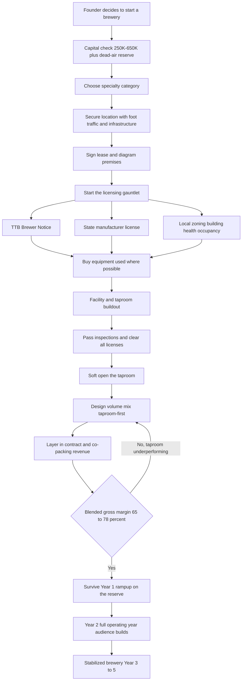

### Direct Answer

To start a brewery business in 2027 you build a licensed beer-production company -- a brewhouse, fermentation and serving tanks, usually a packaging or canning capability, and almost always a taproom -- and you sell what you make either across your own bar at very high margin, into wholesale distribution at very low margin, or as contract production for other brands. The single most important fact a 2027 founder must absorb is that the easy-growth craft era is over: the US craft brewery count peaked near 9,700 establishments in 2022-2023, closings have outpaced openings since 2023, and total beer consumption is structurally declining. The brewery that works in 2027 is a **taproom-first, specialty-anchored, capital-disciplined hospitality business that happens to make beer** -- not a generic production brewery chasing tap handles through distributors.

**TL;DR:** A disciplined nano-or-micro taproom brewery opens for **$250K-$650K** all-in (a 15-30 BBL production-plus-taproom facility runs **$900K-$2.5M+**), runs a blended **65-78% gross margin** when taproom-led, and in a careful Year 1 generates **$250K-$900K in revenue** against slim, zero, or negative owner profit because Year 1 is a licensing-and-rampup year. By Year 3-5 a well-run taproom brewery reaches **$700K-$2.5M in revenue** with **$70K-$350K in owner profit**. The model rests on three wedges -- **taproom-first economics** (pouring at 80%+ gross margin direct-to-consumer), **a defensible specialty category** (non-alcoholic, barrel-aged/sour/wild, hyperlocal grain-to-glass, or serious lager), and **contract/co-packing revenue** to fill the tanks and smooth cash flow. The three things that kill brewery startups in 2027 are defaulting to the wholesale-distribution model, under-capitalizing the 9-18 month licensing dead-air window, and brewing a commodity portfolio in a market of 9,000-plus breweries. Viable in 2027 only as a taproom-first hospitality business -- and a genuinely bad idea as a generic production brewery.

## 1. What A Brewery Business Actually Is In 2027

### 1.1 Three Businesses Wearing One Costume

A brewery is a licensed manufacturing business that converts malted grain, hops, water, and yeast into beer and sells it -- but in 2027 that one-sentence definition hides three completely different businesses, and confusing them is the first and most expensive mistake a founder makes. **The production brewery** is built to brew large volumes and push them through wholesale distribution into bars, restaurants, grocery, and convenience retail. **The taproom brewery or brewpub** is a hospitality business with a brewhouse attached, where the primary product sold is a pour of beer across your own bar at full retail margin, often alongside food. **The contract or alternating-proprietorship operation** is a licensed facility that brews and packages beer for other brands, selling production capacity rather than a consumer product.

In 2012, all three of these models made money, and the dominant assumption was that you start as a taproom and "graduate" into a production brewery as the prize. In 2027 that assumption is inverted and dangerous. The production-brewery-into-wholesale path is where the closures are concentrated; the taproom is no longer the training-wheels phase but the actual destination; and contract brewing has gone from a stepping stone to a legitimate standalone revenue stream.

### 1.2 Choosing The Business Before The Beer

A 2027 founder is not "starting a brewery" in the abstract -- they are choosing, deliberately and early, which of these three businesses they are building, because the capital plan, licensing path, equipment list, staffing, and entire P&L differ enormously between them. **The brewery that works in 2027 understands that beer is the product but hospitality, specialty, and capacity utilization are the business.** The romantic image of a founder shipping pallets of a flagship IPA to distributors across three states is, in the current market, a near-perfect description of how to go bankrupt. The nano-brewery playbook (q9605) walks through the same fork at the lowest-capital entry point.

| Model | Primary product sold | Dominant channel | 2027 risk level |
|---|---|---|---|
| Production brewery | Packaged beer (cans/kegs) | Three-tier distribution | Highest -- avoid as a startup |
| Taproom brewery / brewpub | Pours across your own bar | Direct-to-consumer | Lowest -- the resilient default |
| Contract / alternating proprietorship | Production capacity | B2B to other brands | Moderate -- best as a layer |

## 2. Why The Generic Wholesale Production Brewery Collapsed

### 2.1 The Default Model Of The Last Boom

To start a brewery intelligently in 2027 you must first understand why the default model of the last boom stopped working -- because if you do not understand the collapse, you will rebuild it. **The default 2012-2019 brewery was a 15-30 BBL brewhouse, a canning line, a six-to-ten SKU portfolio anchored by IPAs, and a wholesale-distribution strategy:** sign with a distributor, get your beer into accounts, scale annual production toward tens of thousands of barrels. Three forces broke this model and they compound.

### 2.2 Saturation, Channel Margin, And Shrinking Demand

**First, the market saturated.** The Brewers Association counted roughly 9,700 craft breweries at the 2022-2023 peak -- up from under 2,000 in 2011 -- and since 2023, closings have outpaced openings, the first sustained net contraction of the modern craft era. **Second, the economics of the three-tier system are brutal at small scale.** When you sell through distribution you give up roughly 25-30% to the distributor and the retailer takes their margin on top, so a four-pack that retails for $13-$16 might return $4-$6 to the brewery before COGS. You are a price-taker competing against macro brewers and large craft consolidators -- Boston Beer (NYSE: SAM), Molson Coors (NYSE: TAP), and the Anheuser-Busch InBev (NYSE: BUD) craft portfolio -- who have scale, automation, and shelf power you cannot match. **Third, total beer consumption is declining**, not just craft's share of it; younger legal-age drinkers in 2027 drink meaningfully less, and cannabis and non-alcoholic options are pulling volume out of beer entirely.

So the generic production brewery is fighting for a shrinking slice of a shrinking pie, on the worst-margin channel, against the best-capitalized competitors. That is not a hard business -- it is a structurally losing one, and the 2027 founder's job is to not build it.

| Force | What changed | Effect on a small producer |
|---|---|---|
| Market saturation | ~9,700 breweries at peak vs under 2,000 in 2011 | No open shelf or tap space; closings now outpace openings |
| Three-tier margin | Distributor takes ~25-30%, retailer takes more | A four-pack returns only $4-$6 to the brewery before COGS |
| Demand decline | Younger cohorts drink less; total beer volume falling | Shrinking pie; commodity volume strategy has no tailwind |
| Consolidator scale | SAM, TAP, BUD portfolios dominate retail | A startup cannot win on price, automation, or shelf power |

## 3. The Three Wedges That Actually Work In 2027

### 3.1 Wedge One -- Taproom-First Economics

If the commodity wholesale brewery is dead, what replaces it? Three wedges, ideally combined, define the breweries surviving in 2027. **A pint poured across your own bar has a liquid cost of roughly $0.25-$0.60 and sells for $7-$10, a gross margin north of 80% before labor and occupancy** -- versus 30-45% selling that same beer wholesale. The taproom-first brewery treats distribution as optional and marginal, and treats its own four walls as the business: pints, flights, crowlers and to-go cans at retail, a mug club, private events, and increasingly a real food program.

### 3.2 Wedge Two -- A Defensible Specialty Category

**Instead of another hazy IPA in a sea of hazy IPAs, the surviving brewery owns a category.** Non-alcoholic craft beer is the standout -- Athletic Brewing built a multi-hundred-million-dollar revenue business and a billion-dollar-plus valuation in barely eight years, and the NA segment is one of the only parts of beer growing double digits. Other defensible specialties: barrel-aged, sour, and wild/mixed-fermentation beer (Allagash, Russian River, Jester King, Jolly Pumpkin built durable brands here); genuinely hyperlocal grain-to-glass using regional malt and ingredients; or lager done with real craft seriousness as hazy-IPA fatigue sets in.

### 3.3 Wedge Three -- Contract Brewing And Co-Packing

**Your licensed brewhouse is an asset that can earn money brewing and packaging for other people's brands** -- gypsy brewers, restaurant groups wanting a house beer, beverage startups without a facility. This is steady B2B revenue that smooths the cash-flow chop of a consumer brand. The strongest 2027 breweries run all three wedges at once: a taproom that generates 60-80% of revenue at high margin, anchored by a specialty category that gives the brand a reason to exist, with contract work filling the tanks between releases.

| Wedge | Core mechanism | Gross margin | Why it works in 2027 |
|---|---|---|---|
| Taproom-first | Sell pours direct at full retail | 80-88% on the pour | Bypasses the failing wholesale channel entirely |
| Specialty category | Own a defensible niche, not commodity beer | Premium pricing power | A reason to exist among 9,000+ breweries |
| Contract / co-pack | Rent licensed capacity to other brands | 25-45% B2B | Steady revenue that smooths consumer-brand chop |

## 4. The Licensing Gauntlet: TTB, State, And Local

### 4.1 Federal -- The TTB Brewer's Notice

Nothing about starting a brewery is slower or more frequently underestimated than licensing, and a 2027 founder must build the entire capital and timeline plan around it. You need permission at three levels before you can legally sell a single pint. **The Alcohol and Tobacco Tax and Trade Bureau (TTB) requires a Brewer's Notice -- you cannot brew for sale without it.** The application requires a defined premises (so you typically need your lease signed and your space diagrammed before you can apply), ownership and financial disclosures, bonding paperwork, and detailed plans; TTB processing has historically run anywhere from a couple of months to well over six months depending on backlog and application quality.

### 4.2 State And Local Permitting

**The state brewery or manufacturer license** is separate -- every state licenses alcohol production with its own application, fees, inspections, and rules about what you can sell, to whom, and whether you can self-distribute or operate a taproom. **Local zoning, building, health, and occupancy** permitting is the third layer: your municipality must zone the site for manufacturing and/or hospitality, your buildout must pass building and fire inspection, and a taproom with food triggers health permitting and food-service licensing.

### 4.3 Why The Timeline Is The Real Risk

The critical, repeatedly fatal reality is that **these processes run partly in sequence, not parallel** -- you often cannot get the state license without the federal notice, cannot get the federal notice without a premises -- and the whole gauntlet realistically takes **9 to 18 months from signed lease to first legal sale.** That is 9-18 months of rent, loan payments, and often payroll with zero revenue. The founders who fail at this stage are not bad brewers; they simply ran out of cash during the licensing window because they budgeted for a buildout and not for the dead-air months the buildout sits inside.

| Licensing layer | Authority | Typical timeline | Sequencing note |
|---|---|---|---|
| Brewer's Notice | Federal (TTB) | ~2 to 6+ months | Needs a defined premises first |
| Manufacturer license | State ABC agency | Varies widely by state | Often needs the federal notice first |
| Zoning / building / fire | Local municipality | Runs alongside buildout | Gates the certificate of occupancy |
| Health / food service | State and local health dept | Varies; adds weeks | Triggered by a taproom kitchen |

## 5. Brewery Scale: Nano, Micro, And Small Production

### 5.1 The Barrel And The Scale Ladder

"Brewery" spans a 100x range of capital and capacity, and choosing your scale sets your entire cost structure. Scale is measured in **barrels (BBL)** -- one barrel is 31 US gallons, about two standard kegs. **A nano brewery** runs a 1-3 BBL brewhouse, often producing only enough to serve its own taproom; it is the lowest-capital legitimate entry point. **A microbrewery** typically runs a 7-15 BBL system, large enough to serve a busy taproom and do modest packaging. **A small production brewery** runs 20-30 BBL or larger, built for volume -- the scale most associated with the wholesale model and the one a 2027 founder should approach with the most caution.

### 5.2 Start Smaller Than Your Ambition

The 2027 logic is counterintuitive to old boom-era thinking: **start smaller than your ambition.** A nano or small micro with a great taproom can be genuinely profitable on modest volume because the taproom margin does the work; a 30 BBL system bought on the assumption you will fill it through distribution is a large fixed cost betting on the exact channel that is failing. You can always add tanks or a second location later. The expensive, hard-to-reverse mistake is buying capacity in Year 0 that your realistic Year 1-3 demand cannot fill. The nano-brewery treatment (q9605) and the microbrewery deep dive (q9664) cover the two lowest-risk scale choices in detail.

## 6. The Taproom Is The Business: Direct-To-Consumer Economics

### 6.1 The Same Barrel, Three Ways

The single most important strategic shift between a 2012 brewery and a 2027 brewery is that the taproom moved from being the on-ramp to being the destination. Consider the same barrel sold three ways. **Sold wholesale through a distributor**, that barrel might net the brewery $120-$180 after the distributor's cut, before production cost. **Sold self-distributed** to a local bar, maybe $150-$220. **Sold by the pint across your own taproom bar**, that same 31-gallon barrel yields roughly 200-240 servings at $7-$10 each -- call it $1,600-$2,200 from one barrel. The taproom is not 20% better than wholesale; it is multiples better.

### 6.2 A Hospitality Business, Not A Margin Trick

That is why the taproom-first brewery treats every barrel sold off-premise as a barrel of lost margin and only distributes deliberately -- for brand visibility, for a specific account that matters -- rather than as the default. But **the taproom is more than a margin trick; it is a different business with different success factors.** It needs a location with foot traffic and parking, a welcoming and well-designed space, hospitality staffing and management, a reason for people to come, and increasingly a food program. The 2027 brewery's P&L is therefore closer to a bar-and-restaurant P&L than a manufacturer's, and the founder who is only a brewer, with no interest in hospitality, has chosen the wrong business or needs a co-founder who lives on the hospitality side.

## 7. Brewing Equipment And Facility Buildout

### 7.1 What The Money Buys

The physical brewery is a real capital project. The core production equipment: a **brewhouse** (the mash tun, lauter tun, kettle, and whirlpool where wort is made), **fermentation tanks** (jacketed and temperature-controlled, where yeast turns wort into beer), **brite tanks** (for conditioning, carbonating, and serving), a **glycol chiller and cooling system**, a **walk-in cooler**, **kegs** themselves (a surprisingly large line item), and cleaning equipment (CIP systems, a keg washer). If you package, add a **canning line or mobile-canning relationship**. Then the facility: drains and a slope-graded floor (breweries use enormous amounts of water), substantial **electrical and gas service**, **water and sewer capacity**, ventilation, and a **buildout of the taproom** -- bar, seating, restrooms, finishes.

### 7.2 Two Disciplined Moves

Two disciplined moves a 2027 founder should make: **buy used equipment** -- the closures that make this a hard market also make it a buyer's market for tanks and brewhouses, often at deep discounts -- and **lease a space with as much existing infrastructure as possible** (a former brewery, a former restaurant with drains and grease infrastructure, a building with heavy power already run), because the buildout of drains, power, and plumbing into a raw space is where budgets quietly double.

## 8. Brewery Startup Cost Breakdown: The Honest All-In Number

### 8.1 Two Realistic Launch Profiles

Founders consistently underestimate brewery startup cost, and the underestimate is usually not in the equipment line -- it is in the buildout, the licensing dead-air, and the working capital. Here is an honest breakdown across two realistic launch profiles.

| Cost category | Nano / small micro taproom | 15-30 BBL production + taproom |
|---|---|---|
| Brewhouse + fermentation/brite tanks | $35,000-$120,000 | $150,000-$500,000 |
| Glycol, cooling, walk-in cooler | $15,000-$40,000 | $40,000-$120,000 |
| Kegs, cleaning, small equipment | $10,000-$30,000 | $30,000-$80,000 |
| Canning line or co-pack setup | $0-$25,000 (mobile) | $75,000-$250,000 |
| Facility buildout (drains, power, plumbing) | $30,000-$120,000 | $150,000-$500,000+ |
| Taproom buildout (bar, seating, restrooms) | $25,000-$90,000 | $75,000-$300,000 |
| TTB, state, local licensing + bonding + legal | $5,000-$25,000 | $15,000-$50,000 |
| Initial ingredients + packaging inventory | $8,000-$25,000 | $30,000-$80,000 |
| Branding, signage, website, POS | $5,000-$20,000 | $15,000-$50,000 |
| Working capital + licensing dead-air reserve | $40,000-$120,000 | $150,000-$400,000 |
| **Approximate all-in total** | **$250,000-$650,000** | **$900,000-$2,500,000+** |

### 8.2 The Line Founders Shortchange

The line most founders shortchange is the last one -- **working capital and the licensing dead-air reserve.** A brewery typically burns 9-18 months of rent, loan service, insurance, and often early payroll before it can legally sell anything, then needs more runway while the taproom ramps from "soft open with no audience" to "steady traffic." Under-capitalization here is the number-one financial killer: a founder who budgets perfectly for equipment and buildout but has no reserve for the dead-air window opens a beautiful brewery and runs out of money before the public ever shows up. The disciplined 2027 plan treats the reserve as non-negotiable and sizes the whole project so the reserve survives a licensing delay -- because licensing delays are the base case, not the exception.

## 9. Brewery Unit Economics: COGS, Margin, And The Per-Barrel Math

### 9.1 Cost Of Goods

A founder must be able to do brewery math on a napkin, because the margin difference between channels is the entire strategic argument. **Cost of goods** is the ingredients (malt, hops, yeast, water, adjuncts) plus packaging (cans, kegs amortized, labels) plus direct utilities and CO2. On a typical taproom beer, **all-in liquid COGS runs roughly $0.25-$0.60 per pint**, and **packaged COGS for a four-pack of cans runs roughly $3-$6**.

### 9.2 The Three Channels Compared

| Sales channel | Typical revenue per BBL | Gross margin band | Notes |
|---|---|---|---|
| Taproom pints/flights | $1,600-$2,200 | 80-88% before labor/occupancy | The engine; hospitality cost layers on |
| To-go cans/crowlers (taproom) | $900-$1,500 | 55-70% | Retail DTC, packaging cost included |
| Self-distribution (local) | $150-$260 | 35-50% | Where state law allows; your truck, your time |
| Wholesale via distributor | $110-$190 | 20-40% | Distributor + retailer take the rest |
| Contract/co-pack production | Priced per BBL | 25-45% | B2B; uses capacity, smooths cash flow |

### 9.3 The Eight-To-Fifteen-Times Difference

The takeaway is not subtle: **a barrel poured in the taproom can be worth eight to fifteen times the same barrel sold through a distributor.** This is why the 2027 model is taproom-first and why "getting into distribution" is a margin trap dressed up as growth. But the taproom margin is a *gross* margin -- earned before you pay the bartenders, the rent, the utilities, and the management. A realistic **blended gross margin for a taproom-led brewery lands around 65-78%**, and the operating margin after hospitality and overhead is far thinner. The founders who understand this build the volume mix deliberately toward the taproom and contract work, and treat every distributor pour as a deliberate brand-marketing expense rather than a profit center.

## 10. The Operating Journey: From Concept To Stabilized Brewery

### 10.1 The Critical Path

The brewery launch is a sequence with hard dependencies -- premises before federal notice, federal notice before state license, all licenses before legal sale -- and a founder should hold the whole path in view rather than discovering the gates one at a time.

### 10.2 Reading The Path

The diagram makes one point unmissable: **the licensing gauntlet sits between you and your first dollar of revenue**, and everything downstream -- buildout, inspections, soft open -- is gated by it. The loop back from the margin check to the volume-mix design is also deliberate: if the blended margin is not landing in the 65-78% band, the fix is almost always rebalancing toward the taproom, not chasing more wholesale volume.

## 11. The Three Models In Detail: Production, Taproom-First, And Contract

### 11.1 Production Versus Taproom-First

A 2027 founder should choose one of three models as the primary identity of the business, because each has a distinct capital plan, P&L, and risk profile. **The production-brewery model** builds capacity for volume and sells primarily through distribution -- in 2027 the highest-risk path for a startup, and it only makes sense with a genuinely differentiated product, real distribution relationships, and deep capitalization. Most 2027 founders should not start here. **The taproom-first model** (brewpub or production-taproom hybrid) makes the taproom the primary revenue source, with packaging and limited distribution as supporting acts -- the resilient default for 2027: high margin, community-anchored, and scalable through additional taproom locations rather than ever-larger production capacity.

### 11.2 The Contract Model And The Winning Structure

**The contract and alternating-proprietorship model** sells production capacity: you brew and package other brands' beer, or you host other licensed brewers in your facility. It can be standalone or, more commonly, a revenue stream layered onto a taproom brewery to fill tanks and smooth cash flow. The strongest 2027 structure is explicit: **a taproom-first brewery as the core identity, anchored by a specialty category, with contract brewing layered on to monetize spare capacity** -- and a deliberate, minimal, marketing-driven approach to distribution rather than a wholesale-volume strategy.

## 12. Specialty Categories: Where The Defensible Brands Are

### 12.1 Non-Alcoholic Craft Beer

Choosing a defensible category is what separates a brewery with a reason to exist from the 9,000th maker of hazy IPA. **Non-alcoholic craft beer is the standout 2027 opportunity:** the segment is growing strongly while total beer shrinks, Athletic Brewing proved a craft NA brand can scale into the hundreds of millions in revenue and a billion-plus valuation, and the category is still young enough that regional and taproom-led NA brands have room. NA brewing is technically harder, but the demand growth is real -- and it overlaps the broader better-for-you beverage wave that powers the kombucha category (q2005).

### 12.2 Barrel-Aged, Sour, Wild, Hyperlocal, And Lager

**Barrel-aged, sour, and wild/mixed-fermentation beer** -- the domain Allagash, Russian River, Jester King, and Jolly Pumpkin built durable, premium, hard-to-copy brands in -- rewards patience, expertise, and a cellar, and commands premium pricing the commodity end cannot. **Genuinely hyperlocal grain-to-glass** is defensible precisely because it cannot be replicated three states away. **Lager done seriously** is a quiet 2027 opportunity as drinkers tire of hazy-IPA sameness, and **low-calorie "better-for-you" beer** rides the same health-conscious wave as NA.

| Specialty category | Defensibility driver | 2027 demand signal | Difficulty |
|---|---|---|---|
| Non-alcoholic craft | Hard process; first-mover brand equity | One of beer's only growth segments | High |
| Barrel-aged / sour / wild | Cellar time, expertise, patience | Premium pricing power | High |
| Hyperlocal grain-to-glass | Geography cannot be copied | Local-pride and tourism pull | Medium |
| Serious lager | Craft execution on a "simple" style | Hazy-IPA fatigue | Medium |
| Low-cal / better-for-you | Health-conscious tailwind | Aligned with NA growth | Medium |

The discipline: the category should be something the founder can brew genuinely well, that the local and regional market actually wants, and that is hard for a commodity competitor to copy on price.

## 13. Distribution: The Trap, And When It Still Makes Sense

### 13.1 Why Wide Distribution Is A Trap

Distribution deserves its own clear-eyed section because it is simultaneously the thing 2012 founders chased and the thing 2027 founders must approach with discipline. The **three-tier system** separates producers, distributors, and retailers, and in most states a brewery selling beyond its own walls goes either through a licensed distributor or through limited self-distribution where state law allows. **The trap is treating distribution as growth:** signing with a distributor feels like winning, but you have just handed 25-30% of the price to a middleman to sell a commodity product into a saturated market against better-capitalized competitors, on a channel where you have little control over how your beer is placed, rotated, or priced. For a small 2027 brewery, wide wholesale distribution is usually a way to convert high-margin potential into low-margin reality.

### 13.2 When It Still Makes Sense

That said, distribution is not categorically wrong -- it makes sense in limited cases: **self-distribution to a handful of carefully chosen local accounts** (where legal) as low-cost brand visibility; **limited distribution of a specialty product** that genuinely stands out and pulls people back to the taproom; getting your beer into accounts that function as marketing -- a respected bottle shop, a destination restaurant. The 2027 discipline is to treat any off-premise placement as a **deliberate marketing expense with a brand purpose**, not a volume strategy, and to never build production capacity on the assumption that a distributor will fill it.

## 14. The Taproom Experience: Food, Events, And The Third Place

### 14.1 The Food Decision

If the taproom is the business, then the taproom experience is the product, and a founder should design it as deliberately as the beer. **Food is the highest-leverage decision.** Food extends dwell time, raises per-head spend, broadens the audience beyond dedicated beer drinkers, and turns a "stop in for one" into a "meet friends for the evening." The options range from a full in-house kitchen (highest revenue, highest cost and complexity), to a tight focused menu (pizzas, a few shareables), to a reliable rotating food-truck partnership (low capital, less control). Many taprooms partner with a food truck (q1929) or a caterer (q1980) rather than running their own kitchen.

### 14.2 Events, The Mug Club, And The Third Place

**Events are the second lever:** trivia nights, live music, run clubs, bottle releases, private buyouts, and seasonal festivals. **The mug club** -- a paid membership that gives regulars a personalized mug, discounts, early access, and status -- is a small recurring-revenue and loyalty engine the best taprooms run deliberately. **The third place** concept underpins all of it: the taproom succeeds when it becomes a place in people's lives, not just a place that sells beer. The 2027 taproom competes with every other entertainment option for a customer's evening, much like a coffee shop (q1930) competes for the morning, and it wins on experience, community, and consistency.

| Experience lever | What it does | Capital intensity | Per-head revenue lift |
|---|---|---|---|
| Full kitchen | Maximizes spend and dwell time | High | Highest |
| Tight focused menu | Covers food without a full kitchen | Medium | Moderate |
| Food-truck rotation | Outsources food, keeps capital low | Low | Moderate |
| Events calendar | Reasons to return; group visits | Low | High on event nights |
| Mug club | Loyalty and small recurring revenue | Very low | Steady regulars |

## 15. Contract Brewing And Co-Packing As A Revenue Stream

### 15.1 What Contract Work Actually Is

Contract brewing has quietly become one of the smartest moves a 2027 brewery can make. The core idea: your licensed brewhouse, tanks, and packaging capability are expensive assets, and any hour they sit idle is sunk cost earning nothing. **Contract brewing** means you brew and package beer to another brand's recipe, and they sell it under their own label. **Alternating proprietorship** means another licensed brewer uses your facility on a scheduled basis. **Co-packing** can also mean running other beverages -- canning a local cidery's product, packaging a beverage startup's drink.

### 15.2 The Customers And The Trade-Offs

The customers are real and growing: restaurant groups that want a house beer without building a brewery, "gypsy" brewers without a facility, established brands needing overflow capacity, and startups testing a product. For the host brewery, the benefits are substantial -- **steady B2B revenue that does not depend on consumer foot traffic, high utilization of capacity you have already paid for, and cash flow that smooths the seasonal chop of a consumer brand.** The trade-offs: it is a relationship and scheduling business, the margins are thinner than taproom pours, and you take on liability for someone else's brand. Layered onto a taproom-first brewery, contract work is a powerful stabilizer.

## 16. Staffing The Brewery And The Taproom

### 16.1 Two Businesses, Staffed Differently

A brewery is two businesses staffed differently. **The production side** needs brewing labor -- the founder is often the head brewer in Year 1, but as volume grows you add assistant brewers, cellar staff (who manage fermentation, transfers, and the relentless cleaning), and packaging labor. Brewing is skilled, physical work, and cleaning is most of it. **The hospitality side** needs bartenders and beertenders who can pour, sell, and represent the brand, taproom managers, and, if there is a kitchen, the entire restaurant staffing stack.

### 16.2 The Founder's Honest Role

**Overhead roles** grow with the business: a general manager, sales staff if you self-distribute or do contract work, marketing, and bookkeeping. The 2027 staffing reality has two pressure points. First, **labor is expensive and the hospitality side is hard to staff well** -- and taproom service quality directly drives the high-margin revenue. Second, **the founder's own role must be planned honestly:** many brewery founders are brewers at heart, but a taproom-first brewery is a hospitality and management business, and the founder either grows into the operator role or partners with someone who owns it.

| Role group | Key positions | Cost behavior | When you add it |
|---|---|---|---|
| Production | Head brewer, assistant brewer, cellar, packaging | Moderate fixed cost | Founder in Year 1; staff as volume grows |
| Hospitality | Bartenders, taproom manager, cooks | Largest variable cost | From soft open onward |
| Overhead | GM, sales/accounts, marketing, bookkeeping | Fixed; enables the founder to step back | Year 2-3 |

## 17. Year-One Operating Reality

### 17.1 A Licensing-And-Rampup Year

A founder should walk into Year 1 with accurate expectations. **Year 1 is a licensing, buildout, and rampup year, not a profit year.** The first stretch -- often 9 to 18 months -- is pure cash burn: signing the lease, applying for the TTB Brewer's Notice, pursuing the state license, building out the taproom, passing inspections, and brewing the first batches that cannot be sold until every license clears. Then the soft open, where the taproom is legal but the public has not discovered it yet, and traffic ramps slowly from friends-and-family to a real audience.

### 17.2 The Honest Numbers

A disciplined Year 1 taproom brewery might generate **$250,000-$900,000 in revenue** depending on scale, location, and whether it opened early or late in the year -- but **owner profit in Year 1 is typically slim, zero, or negative**, because the year is front-loaded with dead-air costs and the revenue only arrives in the back half. This is not failure; it is the structure of the business, and the founders who fail are usually the ones who did not capitalize for it. Year 1 is also when the founder learns the real numbers: the actual COGS, the taproom traffic patterns, which beers sell, whether the food program works -- the right mindset is that Year 1 is paid tuition in running the specific brewery you built.

## 18. The Five-Year Revenue Trajectory

### 18.1 The Year-By-Year Arc

Mapping a realistic five-year arc sizes the opportunity honestly. **Year 1** is licensing and buildout dead-air, then a partial-year rampup. **Year 2** is the first full operating year with the taproom open the whole time -- the audience builds, the events calendar fills, the mug club grows, contract work may begin. **Year 3** is a real business with a system -- a known traffic pattern, a working food and events program, contract revenue stabilizing the tanks. **Year 4** sees the brewery established locally -- possible capacity expansion, a second taproom, deeper contract relationships. **Year 5** is a mature operation, with the founder deciding whether to add locations, deepen the specialty brand, or position for sale.

| Year | Revenue range | Owner profit | Operating reality |
|---|---|---|---|
| Year 1 | $250K-$900K | Slim, zero, or negative | Licensing + buildout + partial rampup |
| Year 2 | $450K-$1.4M | ~$20K-$120K | First full operating year; audience builds |
| Year 3 | $650K-$1.9M | ~$60K-$250K | Systemized; founder manages, not works every shift |
| Year 4 | $800K-$2.3M | ~$70K-$320K | Established locally; possible second location |
| Year 5 | $900K-$2.5M | ~$100K-$350K | Mature; decide to scale, deepen brand, or sell |

### 18.2 What The Numbers Assume

These numbers assume the disciplined 2027 model -- taproom-first, specialty-anchored, contract-augmented, distribution-minimal -- and that the founder capitalized for the dead-air year. A brewery built on the old wholesale-volume model would show a far more fragile curve. The honest framing: **a mature 2027 taproom brewery is a real, respectable small hospitality business** -- not a passive asset and not a rocket ship, but a genuine living for a founder who built it on the right model.

## 19. Five Named Real-World Operating Scenarios

### 19.1 The Disciplined And The Cautionary

Concrete scenarios make the model tangible. **Scenario one -- Priya, the disciplined taproom-first operator:** opens a 7 BBL micro with a strong taproom in a walkable neighborhood for about $520K including a real dead-air reserve; skips distribution in Year 1, runs a tight food menu plus a rotating food truck, builds a 200-member mug club, and adds contract canning for a local cidery in Year 2. Year 1 revenue $640K at a near-breakeven owner draw; by Year 3 she is at $1.5M revenue with healthy owner profit because 75% of her volume pours across her own bar. **Scenario two -- the cautionary tale, Marcus:** raises $1.4M and builds a 20 BBL production brewery betting on distribution -- a six-SKU IPA-led portfolio, a canning line, the taproom an afterthought. His beer lands on saturated shelves at distributor margin, the distributor under-supports a small new brand, and his capital-heavy facility cannot cover debt service on 30-40% wholesale margins; he is restructuring by Year 2.

### 19.2 Specialty, Contract, And The Casualty

**Scenario three -- Dana, the NA specialist:** builds a small brewery dedicated to non-alcoholic craft beer; the brewing is harder and the equipment specific, but the taproom and DTC demand are real and the brand has a story, and by Year 4 Dana is selling NA cans regionally on top of a healthy taproom. **Scenario four -- the Okafor partnership, contract-anchored:** two founders build a slightly oversized small brewery deliberately, run a solid taproom as the brand, and fill the extra capacity with contract clients -- restaurant house beers, a beverage startup; the contract revenue covers a large share of fixed costs through Year 1's chop. **Scenario five -- Cole, the under-capitalized casualty:** builds a beautiful nano taproom but budgets only for equipment and buildout; the TTB notice takes seven months, the state license adds three, the buildout runs over, and Cole runs out of cash two months before the legal opening -- a perfectly good brewery that never sold a public pint.

## 20. Marketing And Building A Local Brand

### 20.1 A Local Relationship Game

A 2027 brewery is won or lost on local brand-building, and a founder should treat marketing as a core ongoing function, not a launch event. The taproom-first brewery's marketing job is to **get people through the door and make them regulars** -- mostly a local, community, and relationship game rather than mass advertising. **The grand opening** should be an event the local community shows up for, and **social media and a strong visual brand** carry weight in beer specifically: beer drinkers follow breweries, share releases, and check in.

### 20.2 Events, Partnerships, And Platforms

**The events calendar is itself marketing** -- every trivia night, release, and run club is a reason for someone to come and bring friends. **Local partnerships** compound: collaborations with other breweries, local food vendors and farms, charity nights, sponsoring local teams. **Check-in platforms** like Untappd are where beer-engaged customers discover breweries, and **press, festivals, and competitions** build reputation. The throughline: the 2027 brewery markets by being a vivid, active, community-rooted place with a clear category identity and a full calendar.

## 21. Risk Management, Insurance, And Compliance

### 21.1 The Operational Risks

The brewery model carries specific risks, and the 2027 operator manages each deliberately. **Regulatory and licensing risk** is the most timeline-critical, mitigated by building the capital plan around a realistic 9-18 month licensing window. **Excise tax compliance** is ongoing -- breweries owe federal and often state excise tax on the beer they produce. **Liability and dram-shop risk** is real for any business serving alcohol on premises, mitigated by trained staff and liquor-liability insurance. **Product liability** -- contamination, a recall -- is mitigated by rigorous quality control and product-liability coverage, and is heightened when you do contract work.

### 21.2 Property, Labor, And The Strategic Risk

**Property and equipment risk** -- a glycol failure, a tank loss, a fire, water damage -- is mitigated by commercial property and equipment coverage, and **workers' compensation** matters in a physical environment with hot liquid and heavy kegs. **Market risk** -- the structural decline of beer consumption and the saturation of craft -- is the strategic risk, mitigated by the entire taproom-first, specialty-anchored model rather than by an insurance policy. **Cash-flow and seasonality risk** is mitigated by the dead-air reserve, contract revenue, and an events calendar that drives traffic in slow periods.

| Risk | Primary mitigation | Cost layer |
|---|---|---|
| Licensing delay | Realistic 9-18 month plan; licensing help | Working capital reserve |
| Excise non-compliance | Production tracking; beverage-alcohol accountant | Bookkeeping system |
| Dram-shop / over-service | Trained staff; liquor-liability policy | Insurance premium |
| Product contamination / recall | QC, sanitation, product-liability coverage | Insurance + QC labor |
| Property / equipment loss | Commercial property and equipment coverage | Insurance premium |
| Market contraction | Taproom-first, specialty-anchored model | Strategic, not insurable |

## 22. Financing, Taxes, And Business Structure

### 22.1 Financing The Launch

Because a brewery is capital-intensive, a founder should understand the financing options. **Owner equity and savings** anchor most launches. **SBA loans** -- the 7(a) and 504 programs -- are commonly used, particularly the 504 for real estate and major equipment. **Equipment financing and leasing** fit the brewhouse, tanks, and canning line, because they are tangible assets a lender can secure. **Used-equipment purchases** are themselves a form of cheap capital in the 2027 market. **Buying an existing brewery** is a financing-relevant path of its own -- acquiring a licensed, built-out distressed facility can be cheaper and faster than building from raw space, and seller financing may be available. The discipline: finance the productive assets, but hold real cash for the licensing dead-air reserve, because no lender's payment schedule waits for the TTB.

### 22.2 Entity, Excise, And Accounting

A founder should set up the tax and legal structure deliberately. **Most breweries form an LLC or S-corp** for liability protection and tax flexibility, and because alcohol licensing scrutinizes ownership, the ownership structure must be clean and accurately disclosed. **Federal excise tax** is the defining brewery-specific obligation: the TTB taxes beer production, with a reduced rate on the first portion of a small brewer's annual output, and the brewery must track production and file the required returns. **State excise and alcohol taxes** apply on top in most states; **sales tax** applies to taproom sales and **payroll taxes** to all staff. The discipline: separate business banking from day one, a bookkeeping system built to handle excise reporting, and an accountant who specifically understands beverage-alcohol businesses.

## 23. Owner Lifestyle: What Running A Brewery Actually Feels Like

### 23.1 The Romantic Image Versus The Reality

A founder should know what daily life in this business is like before committing. The romantic image is the founder-brewer crafting beer and chatting with happy customers. The reality, especially in Year 1, is that **a brewery is a cleaning, hospitality, and small-manufacturing operation, and the founder does all of it.** Brewing is physical, hot, wet work, and most of it is cleaning -- scrubbing tanks, sanitizing lines, washing kegs. On top of that, in a taproom-first brewery, the founder is also running a bar and often a kitchen, working nights and weekends because that is when a taproom earns.

### 23.2 How The Role Evolves

**The first year or two is total immersion** -- the founder as brewer and bartender and manager and janitor and bookkeeper. By **Year 2-3**, with a taproom manager and brewing help, the founder's role shifts toward managing the team, the brand, and the numbers. By **Year 3-5**, with a real team, the founder can run a more managerial rhythm, but the nights-and-weekends gravity of hospitality never fully disappears. A founder who loves beer, hospitality, and being the heart of a community space will find it deeply rewarding; one who only wants to make beer, or wants a hands-off business, has picked the wrong model.

## 24. A Decision Framework: Should You Actually Start A Brewery In 2027

### 24.1 The Six Self-Assessment Questions

A founder deciding whether to commit should run a structured self-assessment, because in 2027 this model fits a narrow profile and badly misfits a wide one. **Capital:** can you raise $250K-$650K for a disciplined nano-or-micro taproom launch *including* a real licensing dead-air reserve? **Model clarity:** are you committed to a taproom-first, distribution-minimal model -- or secretly still dreaming of the wholesale-volume brewery? **Hospitality temperament:** are you willing to run a bar, probably a kitchen, a staff, and nights and weekends? **Category:** do you have a defensible specialty you can brew genuinely well? **Compliance tolerance:** can you live with the TTB, state, local, and excise-tax layer? **Local market:** is there a location with real foot traffic and a community that will adopt a third place?

| Self-assessment dimension | Pass | Fail |
|---|---|---|
| Capital incl. dead-air reserve | $250K-$650K+ secured | "I will bootstrap it lean" |
| Model clarity | Committed taproom-first | Still chasing wholesale volume |
| Hospitality temperament | Willing to run a bar and kitchen | Only wants to brew |
| Defensible category | A real specialty, brewed well | "Good beer" with no identity |
| Compliance tolerance | Accepts permanent excise/licensing layer | Wants to run it casually |
| Local market | Foot traffic + a third-place community | Saturated taproom on every corner |

### 24.2 The Verdict Of The Framework

If a founder answers yes across all six, a brewery in 2027 is a legitimate -- if demanding -- path to a $900K-$2.5M small hospitality business with $100K-$350K in owner profit. If they answer no on capital or model clarity, they should not start; if they answer no on hospitality temperament specifically, contract brewing or a different beverage role may fit better.

## 25. Scaling, Exit, And The 2027-2030 Outlook

### 25.1 Scaling Past The First Location

The jump from a proven single taproom to a multi-location brewery is its own challenge. The prerequisites: the first taproom must be genuinely profitable on its own, the operations documented well enough that a manager can run a location, and the cash flow plus reserve able to absorb the next project. The scaling levers, in rough priority: **deepen the existing taproom** first; **add contract and co-pack capacity** to monetize the tanks; **add a second taproom location** -- generally a smarter scale path in 2027 than a giant production facility; **selectively expand the specialty brand** into limited regional distribution only if the margin math works; and **build the management layer** so the founder moves from working shifts to running the business.

### 25.2 Exit Strategies

Breweries can be exited, and a founder should build with the eventual exit in mind. **Sell the operating business** -- a profitable taproom brewery with a strong local brand, clean books, and a trained team is saleable as a multiple of stabilized earnings. **Sell the assets** -- the brewhouse, tanks, and buildout have real resale value in the active 2027 secondary market. **Sell to a strategic acquirer** -- a larger regional brewery or hospitality group. **Transition to family or a key employee.** A 2027 brewery is not a passive holding and not a high-multiple tech-style exit, but a well-run taproom-first brewery with a defensible brand produces real owner profit and has genuine exit paths.

### 25.3 The 2027-2030 Outlook

The 2027-2030 picture is contraction-with-opportunity. **The shakeout continues** -- closings will likely keep outpacing openings as the over-built craft segment right-sizes; this is bad for the generic production brewery and fine for the disciplined taproom-first operator. **Non-alcoholic and "better-for-you" beer keeps growing.** **The taproom and "third place" model strengthens relative to distribution.** **Contract and co-packing demand grows** as building a full brewery gets riskier. **The used-equipment market stays a buyer's market**, and **premiumization wins over volume.** The net: the brewery business is **contracting but not dying through 2030**, and within that contraction the disciplined model is arguably advantaged, because the shakeout is clearing out exactly the commodity-volume competitors that model never tried to beat.

## 26. The Final Framework: Building It Right From Day One

### 26.1 The Twelve-Step Launch Order

A founder who wants to start a brewery in 2027 and actually succeed should execute in this order. **First, get honest about capital and the model.** **Second, choose your specialty category deliberately.** **Third, secure the right location** with foot traffic, parking, and as much existing infrastructure as possible. **Fourth, start the licensing gauntlet immediately and get help.** **Fifth, buy equipment disciplined and used where possible.** **Sixth, build the taproom as the business.** **Seventh, design the volume mix taproom-first.** **Eighth, layer in contract and co-packing.** **Ninth, set up compliance and accounting properly.** **Tenth, carry real insurance.** **Eleventh, build the local brand relentlessly.** **Twelfth, keep the exit options open.**

### 26.2 The Honest Bottom Line

Do these twelve things in this order and a brewery in 2027 is a legitimate path to a real community hospitality business. Skip the discipline -- especially on model choice, the licensing reserve, and the specialty category -- and it is a fast, well-documented way to join the closure statistics. The brewery business in 2027 is not a goldmine, but within the industry's contraction it rewards exactly one kind of founder: **the disciplined, hospitality-minded, specialty-anchored, capital-prudent operator who builds a taproom-first business that happens to make beer.**

## 27. Counter-Case: Why Starting A Brewery In 2027 Might Be A Mistake

### 27.1 The Structural Headwinds

The case above describes a viable model, but a serious founder must stress-test it against the conditions that make a brewery a bad bet in 2027.

**Counter 1 -- The entire industry is contracting.** This is not a growth market. The US craft brewery count peaked near 9,700 in 2022-2023, closings have outpaced openings since 2023, craft volume is declining, and total beer consumption is structurally falling. You would be opening into a documented, multi-year contraction.

**Counter 2 -- It is far more capital-intensive than founders expect.** Even a disciplined nano-or-micro taproom runs $250K-$650K all-in, and a production facility runs into the millions. The single most underestimated line -- the licensing dead-air reserve -- is the one founders most often skip.

**Counter 3 -- The licensing gauntlet is slow, sequential, and unforgiving.** TTB Brewer's Notice, state manufacturer license, local permits -- partly in sequence, realistically 9-18 months of rent and loan payments with zero revenue, and delays are the base case.

**Counter 4 -- The wholesale channel is a margin trap.** The instinctive move -- get into distribution, scale volume -- hands 25-30% to a distributor to sell a commodity product into a saturated market against macro brewers with scale you cannot match.

### 27.2 The Operating And Lifestyle Headwinds

**Counter 5 -- It is a hospitality business, not a craft hobby.** The taproom-first model means running a bar, almost always a kitchen, a staff, an events calendar, and nights and weekends. A founder who loves brewing but does not want hospitality has chosen the wrong business.

**Counter 6 -- The product is undifferentiated by default.** There are 9,000-plus breweries making overlapping hazy IPAs. "Good beer" is not a market position; without a defensible specialty, a new brewery is the 9,001st commodity producer competing on price.

**Counter 7 -- Compliance is permanent and punishing.** Federal and state excise tax, production reporting, dram-shop exposure, and food-service permitting never end, and getting any of it wrong creates liability with agencies that control whether you can operate.

**Counter 8 -- The first year produces little or no owner income.** Year 1 is a licensing-buildout-rampup year; owner profit is typically slim, zero, or negative. A founder who needs near-term income is structurally set up to run out of money.

**Counter 9 -- It is physically grinding, capital-illiquid work.** Brewing is hot, wet, heavy, and mostly cleaning, layered with a bar and kitchen on nights and weekends -- and money sunk into a brewhouse and a fitted space is hard to redeploy, with the active used-equipment market existing precisely because so many breweries failed.

**Counter 10 -- The competition includes the best-capitalized players in beverages.** On any shelf you face SAM, TAP, and BUD portfolios with automation, scale, and marketing budgets. The only place you are not outgunned is your own taproom.

**Counter 11 -- Adjacent paths may fit better.** A founder who loves beer but not the capital risk might be better served by contract-only brewing, a beverage role inside an existing brewery, or a beer-focused bottle shop or bar.

### 27.3 The Honest Verdict

Starting a brewery in 2027 is a defensible choice for a founder who has $250K-$650K of genuine launch capital including a real dead-air reserve, is fully committed to a taproom-first hospitality business, has a defensible specialty category, can run a bar and a kitchen and a staff, can live with a permanent compliance layer, and has the runway to take little or no owner income in Year 1. It is a poor choice for anyone under-capitalized, anyone who wants to brew but not run hospitality, anyone defaulting to distribution, anyone without a defensible category, and anyone who needs near-term income. The model is not a scam, but the industry is genuinely contracting, and the gap between the disciplined version that works and the under-capitalized commodity-wholesale version that joins the closure statistics is very wide.

## 28. Key Numbers At A Glance

### 28.1 Market, Scale, And Cost Reference

**The market context:** US craft brewery count at peak roughly 9,700 establishments (2022-2023) versus under 2,000 in 2011; since 2023 closings outpace openings; craft volume down roughly 1-4% per year; non-alcoholic beer growing at double digits. **Brewery scale** in barrels (1 BBL = 31 US gallons, about 2 kegs): nano 1-3 BBL, microbrewery 7-15 BBL, small production brewery 20-30+ BBL. **Per-barrel revenue by channel:** taproom pints ~$1,600-$2,200, to-go cans/crowlers ~$900-$1,500, self-distribution ~$150-$260, wholesale ~$110-$190 -- a taproom barrel can be worth 8-15x the same barrel sold wholesale. **Cost of goods:** liquid COGS per taproom pint ~$0.25-$0.60, packaged COGS per four-pack ~$3-$6, taproom pour gross margin 80-88%, blended gross margin ~65-78%.

### 28.2 Capital, Timeline, And Trajectory Reference

**Startup cost** runs roughly $250K-$650K all-in for a nano/small-micro taproom and $900K-$2.5M+ for a 15-30 BBL production-plus-taproom facility. **The licensing timeline** runs roughly 9-18 months from signed lease to first legal sale, with the TTB Brewer's Notice alone taking 2 to 6+ months. **The five-year trajectory** for the disciplined taproom-first model: Year 1 $250K-$900K revenue, slim/zero/negative profit; Year 2 $450K-$1.4M, ~$20K-$120K profit; Year 3 $650K-$1.9M, ~$60K-$250K profit; Year 4 $800K-$2.3M, ~$70K-$320K profit; Year 5 $900K-$2.5M, ~$100K-$350K profit. **Operational benchmarks:** taproom share of revenue 60-80%; contract/co-pack gross margin 25-45%.

## 29. Related Pulse Library Entries

These sibling entries in the Pulse RevOps library connect directly to the brewery model:

- The detailed nano-brewery 2027 playbook is the deepest small-scale companion to this entry (q9605).
- The microbrewery and craft-brewery deep dive covers the 7-15 BBL scale step (q9664).
- Starting a craft distillery in 2027 is the adjacent licensed-spirits model with a similar TTB-and-state gauntlet (q9606).
- Starting a wine bar business in 2027 is the on-premise beverage-hospitality cousin the taproom shares third-place economics with (q9607).
- Starting a kombucha business in 2027 sits in the same better-for-you fermented-beverage space breweries often co-pack (q2005).
- Starting a coffee shop business in 2027 is another third-place hospitality model with comparable community dynamics (q1930).
- Starting a food truck business in 2027 is the rotating food partner many taprooms run instead of a kitchen (q1929).
- Starting a catering business in 2027 covers the food-program partner for a taproom without a full kitchen (q1980).
- Starting a cannabis dispensary business in 2027 is a parallel heavily regulated, license-gated retail model (q9673).
- Starting a wedding venue business in 2027 covers the private-events and buyout revenue a taproom monetizes (q9654).

## 30. Sources

1. **Brewers Association -- National Beer Sales and Production Data** -- The craft brewing trade association; annual craft brewery counts, production volume, openings and closings, and the craft market statistics underpinning the saturation and contraction thesis. https://www.brewersassociation.org
2. **Brewers Association -- Craft Brewery Definition and Industry Statistics** -- Definitions of brewery scale (microbrewery, brewpub, taproom, regional craft) and segment-level industry data.
3. **Alcohol and Tobacco Tax and Trade Bureau (TTB) -- Brewer's Notice and Federal Brewery Permitting** -- Federal requirements to operate a brewery, the Brewer's Notice application, bonding, and excise tax. https://www.ttb.gov
4. **TTB -- Beer Excise Tax and Reduced Rates for Small Brewers** -- Federal excise tax structure on beer production, including reduced rates on the first portion of small-brewer output. https://www.ttb.gov/beer
5. **US Small Business Administration -- Brewery Business Plans, 7(a) and 504 Loans** -- SBA financing programs commonly used for brewery equipment, real estate, and working capital. https://www.sba.gov
6. **National Beer Wholesalers Association (NBWA) -- Three-Tier System and Distribution Data** -- Context on the producer-distributor-retailer system and distribution economics. https://www.nbwa.org
7. **IWSR Drinks Market Analysis -- Non-Alcoholic and Low-Alcohol Beverage Trends** -- Market data on the growth of the non-alcoholic beer segment and shifting consumption patterns. https://www.theiwsr.com
8. **Athletic Brewing Company -- Non-Alcoholic Craft Beer Category Leader** -- The benchmark scaled non-alcoholic craft brewery; category-growth and business-scale reference. https://athleticbrewing.com
9. **NielsenIQ and Circana -- Beer Category Retail Scan Data** -- Off-premise retail sales trends across beer, craft, and non-alcoholic segments.
10. **Brewbound -- Craft Beer Industry News and Business Coverage** -- Ongoing journalism on brewery openings, closings, financing, distribution, and industry strategy. https://www.brewbound.com
11. **Good Beer Hunting -- Craft Beer Trade Journalism** -- Industry analysis on brewery business models, the taproom shift, and market contraction.
12. **ProBrewer -- Brewing Equipment, Used Equipment Marketplace, and Operations Forums** -- Practitioner reference for equipment specification, used-equipment sourcing, and brewery operations. https://www.probrewer.com
13. **American Homebrewers Association / Brewers Publications -- Brewing Process and Technical References** -- Technical brewing process, scale-up, and quality-control references.
14. **Master Brewers Association of the Americas (MBAA)** -- Professional brewing-science and operations association; quality and process standards.
15. **Brewers Association -- Brewery Operations Benchmarking Survey** -- Operating benchmarks on margins, labor, COGS, and revenue mix across brewery types.
16. **Ekos and Breww -- Brewery Management and Production Software** -- Inventory, production tracking, excise reporting, and management platforms for breweries.
17. **Arryved -- Taproom Point-of-Sale and Hospitality Software** -- POS and hospitality platform built for breweries and taprooms. https://www.arryved.com
18. **Untappd for Business -- Beer Menu, Check-In, and Marketing Platform** -- The beer-rating and discovery platform and its business-facing tools. https://untappd.com/business
19. **State Alcohol Beverage Control (ABC) Agencies -- State Brewery Licensing** -- State-level manufacturer licensing, self-distribution rules, and taproom regulations (varies by state).
20. **IRS -- Depreciation, Section 179, and Bonus Depreciation Guidance** -- Tax treatment of brewhouse, tanks, cooling, and buildout as depreciable assets. https://www.irs.gov
21. **Insureon -- Specialty Brewery and Liquor Liability Insurance Resources** -- General liability, liquor liability, product liability, and property coverage for breweries.
22. **Equipment Leasing and Finance Association (ELFA)** -- Equipment financing structures applicable to brewhouses, tanks, and canning lines. https://www.elfaonline.org
23. **BizBuySell -- Brewery and Brewpub Business-for-Sale Listings and Valuations** -- Reference for going-concern valuations and acquisition pricing in the brewery category. https://www.bizbuysell.com
24. **SCORE -- Small Business Mentoring and Planning Resources** -- Business planning, cash-flow, and capitalization guidance for small businesses. https://www.score.org
25. **National Restaurant Association -- Foodservice Operating Data** -- Benchmarks for the food-program and hospitality side of a taproom brewery. https://www.restaurant.org
26. **Allagash, Russian River, Jester King, Jolly Pumpkin, Side Project -- Specialty Brewery Brand References** -- Real-world examples of durable barrel-aged, sour, and wild-fermentation brand-building.
27. **Boston Beer Company (NYSE: SAM), Molson Coors (NYSE: TAP), Anheuser-Busch InBev (NYSE: BUD)** -- Scale-competitor context for why the wholesale channel is hard for small producers.
28. **Distributor and Three-Tier Margin Analyses -- Trade Press** -- Reference for distributor and retailer margin structure on craft beer.
29. **Mobile Canning and Co-Packing Service Providers** -- Reference for mobile canning as a low-capital packaging option for small breweries.
30. **Used Brewing Equipment Marketplaces and Brewery Liquidation Listings** -- Sourcing references for discounted tanks and brewhouses from the closure wave.
31. **Brewers Association -- Independent Craft Brewer Seal and Branding Guidance** -- Brand-identity and independence-positioning context for craft breweries.
32. **State and Local Health Departments -- Food Service Permitting for Taprooms** -- Reference for the food-service licensing layer when a taproom serves food.
33. **US Department of Labor -- Workers' Compensation and Hospitality Labor Guidance** -- Reference for brewing, taproom, and kitchen labor and workers' coverage. https://www.dol.gov
34. **Craft Brewery Cost-of-Goods and Pricing Analyses -- Industry Consultants** -- Reference for per-pint and per-package COGS and taproom pricing benchmarks.
35. **Beer Consumption and Generational Drinking Trend Reports** -- Data supporting the structural decline in total beer consumption and reduced drinking among younger legal-age cohorts.
