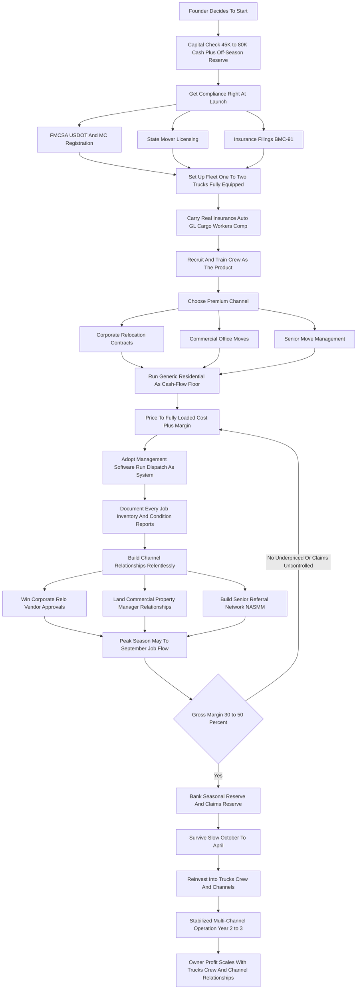

### Direct Answer

To start a moving company in 2027 you buy or finance one or two trucks, equip and train a crew, get the FMCSA and state licensing and the insurance stack genuinely right, and sell the labor and logistics of relocating people's and businesses' belongings safely and on schedule. The version that actually builds wealth is not another generic Yelp-listed local mover charging $120-$180 an hour into a sea of 18,000-plus US moving companies and entrenched franchises; it is a disciplined, channel-focused operation that wins premium repeat work in corporate relocation, commercial office moves, or senior move management while running generic residential only as a cash-flow floor. Done right, a 2027 launch is a $45,000-$160,000 investment that becomes a $700,000-$2.2M asset-backed small business with $130,000-$400,000 in owner profit by Year 3-5 — earned through physical, seasonal, compliance-heavy work, not extracted passively.

**TL;DR:** Generic residential moving is a commodity — the customer never calls twice, acquisition cost is brutal, the work is seasonal and physically punishing, and you compete on price against franchises that own search. The real 2027 opportunity is in higher-value, relationship-driven channels that pay two to four times retail and repeat: **corporate relocation** fed by relocation management companies at roughly $4,000-$15,000 per move; **commercial office moves and furniture installation** sold through commercial property managers at $5,000-$50,000 per project; and **senior move management and estate downsizing** at $3,000-$15,000 per engagement. A disciplined startup invests $45,000-$160,000, runs at 30-50% gross margin after crew labor, fuel, and claims, and in Year 1 generates $150,000-$400,000 in revenue against $35,000-$95,000 in owner profit, heavily concentrated in a brutal May-September peak. The three things that kill moving startups: competing as a generic commodity with no channel and no repeat customer; underpricing the job and the claims reserve; and under-capitalizing with a thin truck, no reserve, and no compliance budget. Viable in 2027 as a channel-focused, compliance-tight, crew-quality-obsessed operation — a poor fit for anyone who wants light physical work, fast payback, or a business without trucks, licensing, claims exposure, and a crew to recruit and retain.

## 1. What A Moving Company Actually Is In 2027

### 1.1 The Core Product Is A Crew, Not A Truck

**A moving company sells labor, equipment, and logistics** — relocating furniture, boxes, appliances, office equipment, and fragile items from one location to another safely, on schedule, and intact. You are not selling a product; you are selling a crew that shows up on time, a truck specced for the job, the skill to disassemble a bed and pad-wrap a dresser without gouging a doorframe, and the assurance that what goes on the truck comes off it undamaged. **The entire margin lives in the gap** between what the customer pays and the true loaded cost of the crew, fuel, truck, insurance, and — the line beginners forget — the claims for things that get broken.

**The business is deceptively simple to describe and hard to run well.** Customers experience three people and a truck; the operator experiences a logistics-and-labor business with a heavy compliance and liability overlay. The founders who succeed understand that the customer's stress is the product they manage — the business itself is trucks, a crew, a claims reserve, a compliance file, and a pipeline of repeat-paying B2B relationships.

### 1.2 What 2027 Specifically Changed

Several realities shape the 2027 version of the business in ways that did not fully exist a decade ago:

- **Customers research and book online and weaponize reviews** — reputation is a hard, measurable asset and a single mishandled claim spreads fast.
- **Labor is more expensive and harder to find** — crew recruiting and retention is the operational squeeze point.
- **Fuel and truck-acquisition costs stayed volatile** — thin operators get squeezed directly.
- **The regulatory layer got no lighter** — FMCSA registration for interstate moves, state mover licensing, DOT numbers, and insurance filings are real and non-optional.
- **Software professionalized the small operator** — dispatch, estimating, inventory, and claims platforms let a disciplined small operation run like a much larger one.

The moving business is not trendy and it is not passive. It is a logistics-and-labor business with a compliance and liability overlay, and in 2027 it rewards the disciplined channel-focused operator and punishes the undercapitalized commodity mover.

### 1.3 Where Moving Sits Among Adjacent Trades

Moving overlaps a cluster of truck-and-crew service businesses, and a founder weighing it should know the neighbors. **Junk removal** is the closest operating cousin — same trucks, same crew model, overlapping senior-estate and commercial cleanout channels (q1944) (q9586). **Trucking and over-the-road freight** shares the FMCSA compliance spine and the fleet economics (q9677). **Courier and last-mile delivery** is a lighter-vehicle logistics adjacency with similar dispatch and routing bones (q1955) (q2075). Moving is a specific expression of the truck-crew-logistics family, distinguished by its premium channels and its liability exposure.

## 2. Why The Generic Residential Default Tops Out

### 2.1 The Path Every First-Timer Reaches For

The default nearly every first-time founder reaches for is the generic local residential mover: buy or finance a 26-foot box truck, equip it with furniture pads, dollies, hand trucks, straps, tools, and shrink wrap, list on Yelp, Google, Angi, and Thumbtack, and charge $120-$180 an hour with a three-to-five-hour minimum. **With two trucks running, a Year 1 of $100,000-$300,000 in revenue is achievable.** The problem is not that this cannot work — it is that it tops out fast and stays fragile.

### 2.2 The Three Structural Reasons It Caps Out

| Structural Limit | What It Means | Consequence |
|---|---|---|
| **Overwhelming branded competition** | ~18,000+ US moving establishments; franchises own brand searches and aggregator placements | A new independent competes for the same customer from behind |
| **The one-off customer never returns** | A family moves every 5-7 years on average | Customer acquisition cost is a permanent tax on the business |
| **B2B and specialty channels pay more** | Corporate, commercial, and senior work pays 2-4x the effective rate and repeats | Generic residential is the lowest-margin, least-repeatable version of the business |

**The generic residential default is not worthless** — it is a fine cash-flow floor and a training ground for the crew. But a founder who builds *only* that business has built the most competitive, lowest-margin, least-repeatable version of the moving company.

### 2.3 The Escape: Channel Strategy

The strategic core of starting a moving company in 2027 is choosing a channel that pays a premium and repeats rather than competing as a commodity. This is a D2C-to-B2B channel shift applied to a physical trade — the same strategic move that reshapes commodity service businesses generally (q1922). The founder picks a primary premium channel based on network and temperament, builds a second as a hedge, and treats generic residential as the floor that funds the channel-building.

## 3. The Three Channels That Actually Pay In 2027

### 3.1 Channel One — Corporate Relocation Contracts

**Relocation management companies — Cartus, SIRVA Worldwide, BGRS, NEI Global Relocation, and Aires — manage employee relocations** for large employers and government, and they contract regional and local moving companies to execute the physical move. The work pays roughly **$4,000-$15,000 per relocation**, comes with predictable monthly volume once you are an approved vendor, and is insulated from the residential price war. The catch is the approval process: becoming an approved vendor takes **60-180 days** and requires clean compliance, strong insurance limits, references, and documented processes — so a founder pursues it while running other channels for cash flow. This is, in effect, an enterprise vendor-qualification motion: the relo management company is the buyer and the moving company is the qualified supplier.

### 3.2 Channel Two — Commercial Office Moves And Furniture Installation

**Office relocations, tenant-improvement furniture installs, office right-sizing and consolidation moves, and modular furniture reconfiguration** are sold through commercial property managers — CBRE (NYSE: CBRE), JLL / Jones Lang LaSalle (NYSE: JLL), and Cushman & Wakefield (NYSE: CWK) — and through corporate facilities directors. Projects run **$5,000-$50,000**, the work is scheduled in advance (often nights and weekends), and a single property-management relationship can feed a steady stream of buildings. The commercial channel overlaps the buyer base of commercial office cleaning, where the same facilities and property managers control the vendor list (q2110).

### 3.3 Channel Three — Senior Move Management And Estate Downsizing

**This is a credentialed specialty** — NASMM, the National Association of Senior Move Managers, is the credentialing body — in which the company manages the full downsizing, sorting, packing, moving, and estate cleanout for older adults transitioning to smaller homes or senior living, and for adult children settling a parent's estate. The work is fed by Aging Life Care managers, senior-living placement agencies, estate attorneys, and elder-law firms; it pays **$3,000-$15,000 per engagement**, carries the highest gross margins of the three (45-60%), and is demographically durable as the population ages. It overlaps the referral network and demographic of estate sale companies (q2143) and non-medical senior home care agencies (q9670) (q9630).

### 3.4 Channel Comparison

| Channel | Pricing Per Job | Volume Source | Gross Margin | Key Friction |
|---|---|---|---|---|
| Corporate relocation | $4,000-$15,000 per relo | Cartus, SIRVA, BGRS, NEI, Aires | Strong | 60-180 day vendor approval |
| Commercial office moves | $5,000-$50,000 per project | CBRE, JLL, Cushman property managers | Strong | Scheduled nights/weekends |
| Senior move management | $3,000-$15,000 per engagement | NASMM network, Aging Life Care managers | 45-60% (highest) | Smaller addressable market |
| Generic residential (floor) | $120-$180/hr, 3-5 hr minimum | Yelp, Google, Angi, lead platforms | 30-50% | Commodity, no repeat customer |

**The strategic point:** pick a primary channel based on network and temperament, build a second as a hedge, and treat generic residential as the cash-flow floor.

## 4. The 2027 Market Reality

### 4.1 Demand Is Real But Uneven

People and businesses relocate — for jobs, housing, life stage, cost of living — and while residential move volume flexes with the housing market and interest rates, the underlying need does not disappear. **Corporate relocation tracks the labor market, commercial moves track office-market churn, and senior moves track demographics — a one-way tailwind.** The moving business is neither a recession-proof goldmine nor a dying trade; it is a durable but channel-dependent demand pool.

### 4.2 The Competition Is Bifurcated

At the residential commodity end sit the franchises and lead-aggregator platforms that have professionalized customer acquisition; at the regional and national end sit large van lines and their agents. **The opening for a new disciplined entrant is the B2B and specialty middle** — being more reliable, more compliance-tight, and more relationship-driven than the long tail of undercapitalized one-truck operators, without needing the scale of a national van line.

### 4.3 Market Reference Figures

| Metric | 2027 Figure | Source |
|---|---|---|
| US moving establishments | ~18,000+ | ATA / industry data |
| US moving services industry size | ~$24B+ | IBISWorld + ATA |
| Two Men and a Truck locations | ~390 | Franchise data |
| College HUNKS Hauling Junk & Moving franchises | ~250+ | Franchise data |
| You Move Me franchises | ~50 | Franchise data |
| NASMM senior move manager members | ~1,000+ | NASMM |
| Mover wage (BLS 53-7062) | ~$16-$25/hr median range | US BLS |

**The net market reality:** demand is durable but channel-dependent, the business is harder than it looks because of labor, compliance, and liability, and the winning 2027 entrant competes on reliability, relationships, and channel focus rather than on being the cheapest truck in town.

## 5. Licensing, Compliance, And The Regulatory Layer

### 5.1 Federal — The FMCSA

**Any company that moves household goods across state lines is a household goods carrier** regulated by the Federal Motor Carrier Safety Administration. It needs a USDOT number, an MC (motor carrier operating authority) number, must register, file proof of insurance (the BMC-91 or BMC-91X cargo and liability filings), maintain an arbitration program for consumer disputes, provide consumers the required disclosures ("Your Rights and Responsibilities When You Move," "Ready to Move?"), and comply with the household-goods rules on estimates, weighing, and delivery.

### 5.2 State, Vehicle, And Local Layers

- **State mover licensing** — many states separately license intrastate household goods movers through a state DOT, public utilities commission, or similar agency, with their own insurance, bonding, and tariff requirements; the rules vary significantly by state.
- **Vehicle and driver compliance** — trucks must be registered and inspected, drivers operating larger trucks may need a commercial driver's license depending on the vehicle's weight rating, and the company must maintain DOT-compliant records.
- **Insurance filings tie into licensing** — the required liability and cargo coverage is both a business protection and a regulatory prerequisite.
- **Local business licensing, permits, and zoning** — for the warehouse or yard.

### 5.3 The Compliance Discipline

**A founder budgets real money and time** for FMCSA registration (the USDOT/MC registration itself is a few hundred dollars; the surrounding insurance and process work is more), researches the specific state's mover-licensing regime before launch, and treats the compliance file as a permanent operating function. Operating an unlicensed or under-filed moving company is not a gray area — it is a fast way to be shut down, fined, or uninsurable, and an automatic disqualifier for the channels that pay best.

## 6. The Equipment And Fleet Plan

### 6.1 Trucks — The Core Asset

**The workhorse is the 26-foot box truck with a liftgate** — large enough for full-house and office jobs and generally drivable without a commercial driver's license depending on configuration and state, which widens the hiring pool. A startup typically begins with one or two trucks and adds in step with booked volume; some start with a smaller 16-to-20-foot truck for apartment moves. Trucks can be bought used (a used 26-foot box truck runs roughly **$30,000-$70,000**), bought new, or financed, and they carry ongoing fuel, maintenance, insurance, and depreciation costs allocated to every job.

### 6.2 Moving Equipment And Specialty Gear

| Category | Items | Notes |
|---|---|---|
| Core moving equipment | Furniture pads/blankets, hand trucks, appliance and four-wheel dollies, ratchet/cam straps, shrink wrap, mattress and furniture bags, tool kits, ramps, floor/door protection | Must be complete from day one |
| Packing materials | Boxes, paper, tape, bubble wrap | If the company offers packing |
| Commercial specialty | Library carts, panel carts, computer carts, crates | For office moves |
| Senior/estate specialty | Careful packing supplies, sometimes storage | For downsizing and estate work |

### 6.3 The Fleet Discipline

**Equip one or two trucks completely rather than three trucks partially.** Buy quality equipment because cheap straps and worn pads cause the damage claims that destroy margin. Add truck capacity only when booked volume genuinely demands it — an idle financed truck is pure overhead in a seasonal business. Storage — a warehouse or a relationship with a storage facility — becomes relevant for overnight jobs, staged moves, and the senior/estate channel, and a mature operator can layer in self-storage as its own recurring-revenue arm (q1969) (q9663).

## 7. The Core Unit Economics

### 7.1 The Job-Level P&L

**The entire moving business lives in the job-level P&L**, and a founder who does not internalize it will have revenue without profit. Take a representative residential job: a crew of three for six hours at a $150 hourly rate bills $900, plus a truck/travel fee — call it a $1,000 ticket.

| Component | Figure |
|---|---|
| Crew of 3 x 6 hours x $150/hr + truck/travel fee | ~$1,000 ticket |
| Crew labor (3 movers, $18-$25/hr loaded, drive time) | $350-$500 |
| Fuel | Job + round trips |
| Truck cost (maintenance, insurance, depreciation) | Allocated per job |
| Claims reserve (blended) | 1-4% of revenue |
| Materials (pads, shrink wrap, boxes) | Consumed per job |
| Card processing, dispatch software, admin | Per-job allocation |
| **Gross margin after crew labor, fuel, claims** | **30-50% residential; higher on B2B/specialty** |

**Claims is the genuinely overlooked line** — it runs a real 1-4% of revenue as a blended reserve: a scratched floor, a dinged dresser, a broken lamp, the occasional serious damage to an antique or electronics. It must be reserved for, not absorbed by surprise.

### 7.2 Seasonality Dominates The Business-Level P&L

**Residential move volume concentrates heavily in roughly May-September** — summer, the school-calendar peak, month-end and end-of-lease clustering — while October-April is thinner. A disciplined operator treats the peak as the period that must fund the year, building a summer reserve that carries the fixed costs (truck payments, core crew, insurance, warehouse) through the slow months, and uses the B2B and commercial channels to smooth the curve.

The founders who fail at the P&L level made the same errors: they priced the job without fully loading the crew cost, carried no claims reserve, and spent the summer cash instead of reserving it for the winter that was always coming.

## 8. The Honest Startup Cost Breakdown

### 8.1 The Full Launch Math

A founder needs a clear-eyed total of what it costs to launch, because moving is more capital-intensive than its "just buy a truck" reputation, and under-capitalization is a top killer.

| Line Item | Lean Launch | Fuller Launch | Notes |
|---|---|---|---|
| Trucks (used 26' box) | $30,000-$70,000 (1, often financed) | $60,000-$140,000 (2, bought) | Far less cash out if financed |
| Moving equipment (pads, dollies, straps, tools) | $3,000-$6,000 | $6,000-$10,000 | Complete from day one |
| Insurance (auto, GL, cargo, workers' comp) + filings | $5,000-$12,000 | $12,000-$20,000 | Workers' comp is a high class code |
| FMCSA registration + state mover licensing | $1,000-$3,000 | $2,000-$5,000 | USDOT/MC registration itself ~$300 |
| Business formation, legal, contracts | $500-$1,500 | $1,000-$2,500 | LLC or S-corp |
| Dispatch / estimating software | $500-$1,500 | $1,000-$3,000 | Setup + first months |
| Marketing and website | $2,000-$5,000 | $4,000-$8,000 | Site, photography, initial leads |
| Warehouse / yard | $2,000-$5,000 | $5,000-$10,000 | Deposit + setup |
| Working capital / off-season reserve | $15,000-$30,000 | $30,000-$50,000 | Covers the slow-winter cash gap |
| **Total cash deployed** | **~$45,000-$80,000** | **~$100,000-$220,000+** | Financing softens the truck line |

### 8.2 Why Under-Capitalization Kills

**A lean focused launch with a single financed truck comes in around $45,000-$80,000 of actual cash deployed; a fuller two-truck launch with trucks bought outright runs $100,000-$220,000+.** Financing softens the truck line, but the founder still needs real cash for insurance, compliance, and the reserve — the business has a built-in seasonal cash gap, a built-in claims rate, and an expensive workers' comp obligation from the first day a crew member lifts a box. The founder who treats moving as a cheap business launches under-capitalized and folds in the first slow stretch.

## 9. Crew — Recruiting, Training, And Retention

### 9.1 The Crew Is The Product

**Customers do not experience the truck or the software; they experience the three people who show up.** Crew quality directly drives the review, the referral, the claims rate, and the margin. A careful, trained crew moves faster, damages less, and generates the five-star reviews that are the residential channel's only real moat; a sloppy crew breaks things, runs long, generates complaints, and bleeds the claims reserve.

### 9.2 Recruiting And The Seasonal Staffing Puzzle

**Recruiting is hard because the work is hard** — physical, weather-exposed, weekend-concentrated, and seasonal. The operation needs a small reliable year-round core and a larger flex pool for the May-September peak. Operators build a base of full-time or steady part-time movers, supplement with seasonal hires and returning crew, and pay above the local market because turnover is expensive: every new hire is an untrained injury and claims risk until seasoned.

### 9.3 Training And The Hiring Sequence

| Hire | When | Role |
|---|---|---|
| Year-round core crew | From launch | The trained backbone — lifting, protection technique, loading, documentation |
| Seasonal flex crew | Before each peak | May-September surge capacity |
| Dispatcher / estimator | As volume grows | Scheduling and quoting |
| Sales / account manager | As channels develop | B2B relationship management |
| Operations manager | At scale | Running the system so the founder steps off the truck |

**Training converts a body into a mover** — lifting and ergonomics (which directly reduces the workers' comp claims that are a major cost), pad-wrapping and protection technique, truck loading and weight distribution, furniture disassembly, customer interaction, and the inventory and condition documentation that protects the company on claims. The truck-and-crew hiring discipline mirrors the handyman model closely (q9614) (q2051).

## 10. Insurance, Liability, And Claims Management

### 10.1 The Insurance Stack

| Coverage | Protects Against | Note |
|---|---|---|
| Commercial auto | Truck accidents and third-party vehicle damage | Required for the fleet |
| General liability | Damage to premises, third-party injury | Standard business coverage |
| Cargo insurance | Damage or loss of goods in transit | Core to the moving exposure |
| Workers' compensation | Crew injury | Expensive — moving is a high-injury class code |
| FMCSA filings (BMC-91/91X) | Regulatory proof of coverage | Required for interstate household goods carriers |

### 10.2 Valuation Coverage And Claims Discipline

**Valuation coverage is its own concept the founder must understand and communicate.** Federal rules require interstate movers to offer a choice between released value protection (a minimal default, often 60 cents per pound per article) and full value protection (the mover is liable for repair or replacement). The customer's choice and the company's tariff govern what a claim pays.

**Claims management is the operational discipline that contains the cost:** a written inventory and condition report at origin, photo documentation of valuable and pre-damaged items, customer sign-off, careful protection, and a fair, prompt claims process. The discipline: carry real coverage at limits that satisfy the regulators and the B2B channels, document every job so claims are bounded, train the crew to prevent the damage, and reserve 1-4% of revenue for the claims that happen anyway.

## 11. Estimating, Pricing, And The Quote

### 11.1 Estimate Types And Pricing Models

| Estimate Type | What It Means |
|---|---|
| Binding estimate | Fixes the price |
| Non-binding estimate | An approximation; final charges can exceed it (within regulated limits for interstate) |
| Not-to-exceed estimate | Caps the customer's cost |

**The pricing models:** residential local work is typically hourly (crew size times hourly rate, plus a truck/travel fee, with a minimum); long-distance and interstate work is priced by weight and distance, or by a binding quote built from a cube-sheet inventory; commercial and specialty work is project-priced from a scope.

### 11.2 The Pricing Inputs A Founder Must Load

**Every quote must fully load:** crew size and hours, the fully loaded crew cost, fuel and travel, truck cost, materials, the claims reserve, access difficulty (stairs, elevators, long carries, tight parking), timing (after-hours, weekends, month-end premium), and a real margin contribution to overhead — not just a number that "feels competitive." The in-home or virtual survey is how a serious operator builds an accurate quote for anything beyond a small job.

**The discipline:** price to the fully loaded cost plus margin, not to the competitor's hourly rate; use binding or not-to-exceed quotes to bound disputes; survey real jobs rather than guessing; and never give away the access difficulty, materials, or travel as "included."

## 12. Dispatch, Software, And Operations

### 12.1 The Operating Stack

**In 2027 a moving company runs on software.** Purpose-built management platforms — SuperMove, SmartMoving, Elromco, MoveitPro and others — handle lead intake and CRM, build estimates and the cube-sheet inventory, schedule and dispatch crews and trucks, generate contracts and required disclosures, track jobs, process payment, and manage claims and reporting. This is the first serious paid tool and the one a growing operation cannot skip past a handful of jobs.

### 12.2 Dispatch, Crew Apps, And Reputation

| Function | What It Does |
|---|---|
| Quote-to-booking flow | Fast, clear, professional digital quote and easy booking — commercially decisive |
| Dispatch and scheduling | Crew/truck assignment, route and time-window planning, rebalancing when jobs run long |
| Crew apps | Job details, inventory, and customer sign-off in the movers' hands |
| Operational backbone | Pull and load lists, condition reports, fuel/maintenance logs, claims file |
| Reviews and reputation management | A deliberate post-job review process — the residential channel's only moat |

**The discipline:** adopt the management platform early, make the quote-to-booking flow genuinely professional, run dispatch as a designed system rather than a daily scramble, and treat the software and the review process as the infrastructure that lets a small operation run like a far larger and more reliable one.

## 13. The Year-One Operating Reality

### 13.1 Year 1 Is Channel-Building Mode

**Year 1 is channel-building and crew-building mode, not profit-extraction mode.** The first season is spent learning the true loaded cost of a crew and a job, discovering how brutal the claims and workers' comp lines really are, surviving the first slow winter, getting the compliance file clean, and starting the long work of getting approved as a corporate relocation vendor and building the commercial and senior-network relationships that generate repeat premium work.

A disciplined Year 1 moving company — launched with a real truck-and-crew setup and a reserve, pursuing a channel rather than pure generic residential — can realistically generate **$150,000-$400,000 in revenue** (heavily concentrated in May-September) against **$35,000-$95,000 in owner profit**.

### 13.2 The First Winter Is The Test

**A founder who built the summer reserve carries the fixed costs and emerges ready for a stronger Year 2; one who spent the summer cash scrambles.** Year 1 is also when the founder discovers whether the channel choice was right — or whether the operation is stuck in the residential commodity it meant to escape. The founders who succeed treat Year 1 as paid tuition in a real logistics-labor-and-compliance business.

## 14. The Five-Year Revenue Trajectory

### 14.1 The Realistic Arc

| Year | Revenue | Owner Profit | Stage |
|---|---|---|---|
| Year 1 | $150,000-$400,000 | $35,000-$95,000 | 1-2 trucks, channel-building, founder on the truck |
| Year 2 | $350,000-$750,000 | $70,000-$180,000 | First channel approvals feeding repeat work |
| Year 3 | $600,000-$1,300,000 | $110,000-$300,000 | Multi-channel, dispatcher, trained core crew |
| Year 4 | $900,000-$1,800,000 | $150,000-$380,000 | Second/third channel maturing, storage layered in |
| Year 5 | $1,100,000-$2,200,000 | $180,000-$420,000 | Mature multi-channel operation |

### 14.2 What The Numbers Assume

**These numbers assume disciplined fully loaded pricing, real claims and reserve discipline, clean compliance, and the patient multi-year work of building the B2B and specialty channels.** They do not assume exponential growth — moving scales with trucks, crew capacity, and channel relationships, not magically. A mature moving company is a real small business with a fleet, a crew, a compliance file, and a balance sheet of depreciating-but-earning trucks.

## 15. Five Named Real-World Operating Scenarios

### 15.1 The Five Founders

| Scenario | Founder | Approach | Outcome |
|---|---|---|---|
| 1 — Disciplined channel builder | Marcus | $70K cash, one financed 26' truck, residential for cash flow while pursuing Cartus/SIRVA approval and courting two commercial property managers | Year 3: half of revenue is premium channel work, ~$1.1M revenue, healthy owner profit |
| 2 — Commodity-trap failure | Brittany | Generic residential mover competing purely on low hourly rate, thin insurance, no claims reserve | Year 2: a serious antique-damage claim plus a workers' comp injury wipe out the year; folds in the third slow winter |
| 3 — Senior-move specialists | The Okafor team | NASMM-credentialed senior-move-management niche, relationships with Aging Life Care managers, placement agencies, two elder-law firms | Year 4: regional go-to for senior moves at 50%+ gross margins |
| 4 — Commercial-office operator | Devon | Commercial office moves and furniture install sold through CBRE and JLL property managers, scheduled nights/weekends | Year 5: revenue near $1.8M with steady commercial volume smoothing seasonality |
| 5 — Seasonality casualty | The Reyes brothers | Solid two-truck residential operation, grossed $320K in a good summer, then spent peak cash on a third truck and lifestyle | Forced to sell a truck at a loss in February with no reserve |

**These five span the realistic distribution.** The lesson across all five is the same — the channel choice, the reserve, and the compliance discipline decide the outcome, not the truck.

## 16. Lead Generation — Channels, Referrals, And Reputation

### 16.1 B2B And Specialty Lead Generation Is Relationship-Led

**For the premium channels, lead generation is relationship-led, not advertising-led.** Corporate relocation work comes from being an approved vendor with the relocation management companies — a months-long process of application, qualification, references, and relationship-building with Cartus, SIRVA, BGRS, NEI Global, and Aires. Commercial office work comes from relationships with commercial property managers and corporate facilities directors. Senior-move work comes from the referral network of Aging Life Care managers, placement agencies, and elder-law firms, plus NASMM credentialing as a trust signal.

### 16.2 Residential Lead Generation Is Reputation-And-Search-Led

| Lead Source | Role |
|---|---|
| Review profile (Google, Yelp, moving directories) | The single most important residential asset — built through a deliberate post-job review process |
| Professional website with easy quoting | Converts the demand |
| Local SEO and Google Business Profile | Puts the company in the map results |
| Lead-aggregator platforms (Thumbtack, Angi) | Volume at a cost; effectively set the residential price floor |
| Real estate agents, apartment communities, property managers | A steady residential referral source, including property managers running portfolios (q1956) |

**Repeat and referral compounds across all channels** — the satisfied corporate account, the property manager with a portfolio, the Aging Life Care manager with a continuous caseload, the residential customer who refers a friend. A founder treats business development for the chosen channel as a core ongoing function while running a disciplined reputation-and-search engine for the residential floor.

## 17. Risk Management — The Specific Risks Of A Moving Company

### 17.1 The Risk-And-Mitigation Map

| Risk | Mitigation |
|---|---|
| Workers' comp and injury | Rigorous lifting/ergonomics training, proper equipment, a safety culture |
| Damage and claims | Crew training, inventory/condition documentation, valuation coverage, fair prompt claims process |
| Compliance | Get FMCSA and state licensing right at launch; keep the file current |
| Seasonality | Disciplined off-season reserve; B2B/commercial channels that smooth the curve |
| Fuel and vehicle cost | Fuel surcharges where appropriate, disciplined maintenance, not over-fleeting |
| Labor (no-shows, turnover) | Trained year-round core, flex pool, above-market pay, real training program |
| Reputation | Crew quality, claims fairness, proactive reputation management |
| Customer concentration | Multiple channel relationships — never rely on one relo company or one property manager |
| Cargo and catastrophic loss | Proper cargo and auto coverage |

**The throughline:** every major risk in moving has a known mitigation built from insurance, training, compliance, documentation, and reserve discipline. The operators who fail are usually the ones who carried thin coverage, skipped the training and documentation, ignored the compliance, or disrespected the seasonal and concentration risks they could see coming.

## 18. Competitor Landscape — Who You Are Up Against

### 18.1 The Competitive Field

- **National van lines and their agents** — the large interstate carriers and the local agents who operate under their authority dominate long-distance and corporate relocation at scale; becoming a van-line agent is itself a path.
- **The franchise networks** — Two Men and a Truck (~390 locations), College HUNKS Hauling Junk & Moving (~250+), You Move Me, and others dominate the residential commodity end with brand recognition and systems.
- **The lead-aggregator platforms** — Thumbtack (operated by parent companies in the home-services space), Angi (NASDAQ: ANGI), and the moving-lead marketplaces intermediate a large share of residential demand and set the price floor.
- **The long tail of independent and one-truck operators** — many undercapitalized, under-compliant, competing purely on price; this is the field a disciplined new entrant can out-professionalize.
- **Specialty competitors** — NASMM-credentialed senior-move companies (including franchises such as Caring Transitions), commercial-move specialists, and corporate-relo-focused agents are the real competition in the premium channels.

### 18.2 Where The Moat Actually Is

**The competitive moat in moving is not the truck** — anyone with capital can buy a truck. It is the clean compliance file and high insurance limits, the vendor approvals, the commercial and senior referral relationships, the trained crew, the review profile, and the operational system — all of which take years to build and are hard for a new entrant to copy. You cannot out-brand the franchises or out-cheap the one-truck operator on generic residential, so you win by being the most compliant, reliable, relationship-driven operator in a chosen channel.

## 19. Financing The Business

### 19.1 The Financing Options

| Option | Best For | Note |
|---|---|---|
| Equipment and vehicle financing | The largest line — the trucks | Spreads cost over the earning life of the asset; widely used and sensible |
| Used trucks | Lowering the entry cost | A sound used 26' box truck at $30K-$70K vs new materially lowers entry cost |
| SBA and small-business loans | A broader launch | Multiple trucks, warehouse setup, working capital |
| Seller financing | Buying an existing moving company | Trucks, licensing, crew, reviews, and relationships already exist — diligence compliance and claims history |
| Reinvested cash flow | Healthy growth past Year 1 | Disciplined peak-season cash buys the next truck and funds the next crew |

### 19.2 The Financing Discipline

**It is reasonable and normal to finance the trucks**, because they are productive assets that earn from day one — but the founder must still hold real cash for insurance, compliance and licensing, and the off-season reserve, because no lender covers a thin winter. The dangerous move is over-leveraging the fleet and skipping the reserve. **Finance the earning assets, but never finance away the cushion.**

## 20. Taxes And Business Structure

### 20.1 Entity And Depreciation

**Most moving companies form an LLC or S-corp** for liability protection and tax flexibility; given the genuine liability exposure of the business, the liability shield matters, and the entity holds the trucks, the leases, the contracts, the licensing, and the insurance. **Depreciation is central to the tax picture** — the trucks are depreciable assets, and the depreciation schedules and any available accelerated or first-year expensing materially shape taxable income, especially in heavy-capex years. This is an area where a knowledgeable accountant earns the fee.

### 20.2 Payroll, Classification, And Bookkeeping

**Payroll taxes and worker classification are a real and scrutinized issue** — movers are generally employees, not contractors, and misclassifying a crew to dodge payroll taxes and workers' comp is both a compliance risk and a liability exposure. Fuel, maintenance, insurance, truck payments, equipment, software, and warehouse rent are deductible business expenses. **The discipline:** separate business banking from day one, a bookkeeping system that tracks the trucks as assets and the jobs as revenue, correct employee classification, quarterly attention to estimated taxes, and an accountant who understands vehicle-heavy, labor-heavy seasonal businesses.

## 21. Owner Lifestyle — What Running This Business Actually Feels Like

### 21.1 The Year-By-Year Texture

**In Year 1**, running a lean operation, the founder is genuinely in the business — often on the truck, doing estimates and in-home surveys, recruiting and training crew, handling the claim when something breaks, filing the FMCSA and state paperwork, and working the Saturdays and month-ends when the residential volume clusters. The May-September stretch is long hours and packed weekends; the slower months are spent on maintenance, compliance, planning, and the patient channel-building.

**By Year 2-3**, with a dispatcher running the schedule and a trained crew handling the jobs, the founder's role shifts toward management — overseeing the team, building the corporate-relo and commercial and senior relationships, watching the claims and the numbers, recruiting ahead of the peak. **By Year 3-5**, with a deeper team and a mature system, the founder can run a larger multi-channel operation with a more managerial rhythm — though moving never becomes hands-off the way some businesses do.

### 21.2 The Emotional Reality

There is real satisfaction in a smoothly executed move, a stressed customer relieved, a clean season, a crew that performs, and a B2B relationship that repeats; and real stress in the workers' comp injury, the damaged antique, the crew no-show on a packed Saturday, and the slow-winter cash gap. **The income is real and can become substantial, but it is earned through physical, logistical, and managerial work, not extracted passively.** A founder who can handle logistics, labor management, physical work, compliance detail, and the rhythm of a season will find it genuinely viable; a founder who wanted a light-touch truck business will be exhausted and surprised.

## 22. Common Year-One Mistakes That Kill The Business

### 22.1 The Avoidable Failure Modes

| Mistake | Consequence |
|---|---|
| Competing as a generic residential commodity | Caps the business at the lowest-margin, most-fragile version of itself |
| Underpricing the job | Turns a 40% gross margin into a 15% one |
| Carrying no claims reserve | One bad claim wipes out a month |
| Under-capitalization | No cushion for the slow winter, no money for required insurance and licensing |
| Skimping on compliance | Risks shutdown or fines; disqualifies the B2B channels |
| Thin insurance | One injury or catastrophic claim becomes a business-ending loss |
| Mishandling the crew | Turnover, injuries, claims, bad reviews |
| Ignoring the off-season reserve | The classic seasonality wipeout |
| Skipping inventory and condition documentation | Leaves the company exposed, unable to bound a claim |
| Neglecting the review profile | Loses the residential channel's only moat |
| Saying yes to every job | Tiny or far jobs cost more in time and travel than they earn |
| Misclassifying movers as contractors | A payroll-tax and liability exposure waiting to surface |

**Every one of these is avoidable.** The founders who fail almost always made three or four of them; the founders who succeed treated this list as a pre-launch checklist.

## 23. A Decision Framework — Should You Actually Start This In 2027

### 23.1 The Self-Assessment

A founder deciding whether to commit should run a structured self-assessment, because this model fits a specific person and badly misfits others:

- **Capital** — do you have $45,000-$80,000 of genuine cash for a lean financed-truck launch with a real reserve and compliance budget, or more for a fuller launch?
- **Physical and operational temperament** — are you willing to run a trucks-crew-weekends-month-ends logistics-and-labor business, often on the truck yourself in Year 1?
- **Compliance tolerance** — can you do the genuine work of FMCSA registration, state mover licensing, insurance filings, and a permanent compliance file?
- **Channel access and orientation** — do you have, or can you build, the relationships for at least one premium channel?
- **Labor-management capability** — can you recruit, train, retain, and lead a crew in a tight labor market doing hard physical work?
- **Seasonality tolerance** — can you operate a business that earns most of its residential money in May-September and reserve summer cash for winter?
- **Liability stomach** — can you run a business with daily claims exposure and an expensive workers' comp obligation?

### 23.2 The Verdict Of The Framework

**If a founder answers yes across capital, physical temperament, compliance tolerance, channel orientation, labor-management capability, seasonality tolerance, and liability stomach, a moving company in 2027 is a legitimate and achievable path** to a $700K-$2.2M small business with $130K-$400K in owner profit. If they answer no on capital, compliance, or channel orientation, they should not start — or should start only the residential commodity with eyes open about its ceiling. The framework's purpose is to convert "I could just buy a truck" into an honest, structured decision about the logistics-labor-and-compliance business underneath.

## 24. Niche And Specialty Paths Worth Considering

### 24.1 The Adjacent Specialties

| Specialty Path | Why It Can Be The Better Business |
|---|---|
| Senior move management / estate downsizing | Highest-margin, most demographically durable niche |
| Commercial / office moving with furniture install | Project-priced, schedule-able, smooths residential seasonality |
| Corporate relocation as a van-line agent | Trades autonomy for reach and systems |
| Specialty-item moving (pianos, safes, art, antiques) | A premium niche for operators who build the specific skill and equipment |
| Last-mile and white-glove delivery | Adjacent logistics business using the same trucks and crews |
| Labor-only moving | Lower-capital entry that skips the vehicle line |
| Storage and warehousing | Creates a recurring-revenue layer on top of the project work |
| Junk removal and cleanout | A natural adjacency overlapping senior-estate and commercial channels |

### 24.2 The Strategic Point

**The multi-channel model built on corporate relo, commercial, and senior is the most resilient core**, but the specialty paths can deliver higher margins, less price competition, and a recurring-revenue layer for a founder with the right network. Many mature operators run a core moving business with one specialty arm layered on top. The mistake is not choosing a specialty; it is failing to choose at all and being a generic commodity mover.

## 25. Scaling Past The First Season

### 25.1 The Prerequisites And Levers

**The prerequisites for scaling:** the Year-1 operation must be genuinely profitable on a fully loaded basis (do not scale a business that only looks profitable because it ignores claims and reserve), the compliance file must be clean enough to satisfy the B2B channels, the dispatch and operations system must be documented well enough that a dispatcher and crews can run it, and the cash flow plus reserve must absorb the next truck and the next winter.

**The scaling levers:** win the channel approvals; add trucks and crew capacity in step with booked volume; build the dispatcher and operations layer so the founder moves from the truck to the system; deepen the crew bench with a trained year-round core and a reliable flex pool; layer a specialty or storage arm once the core is solid; and never stop the channel business development.

### 25.2 The Constraints On Scaling

| Constraint | Solution |
|---|---|
| Capital | Reinvested peak-season cash and sensible truck financing |
| Crew capacity and quality | Training, pay, and culture — the hardest constraint |
| Founder attention | The dispatcher and operations layer |
| Compliance and insurance | Treat the compliance file as a permanent function that scales with the fleet |

**The founders who scale well share one trait** — they treated Year 1 as a system-building and channel-proving exercise, so growth was the repetition of a proven machine rather than expensive experiments.

## 26. Exit Strategies And The Long-Term Picture

### 26.1 The Exit Paths

- **Sell the operating business** — a moving company with a clean compliance file, established vendor approvals and referral relationships, a trained crew, a maintained fleet, a strong review profile, storage revenue, and clean books is a saleable asset; valuations run as a multiple of stabilized earnings.
- **Sell the assets** — the trucks and equipment have real resale value, and a fleet plus the operating authority and customer relationships can be sold to an operator expanding or entering the market.
- **Acquire and roll up** — a mature operator can grow by buying smaller competitors' fleets, authorities, and relationships, and can position to be acquired by a regional consolidator or a national van line.
- **Become or sell to a van-line agent** — the relationship with a national van line is itself a transferable, valuable position.
- **Transition to family or a key employee** — the operational, relationship-driven nature of the business makes an internal transition viable.
- **Wind down gracefully** — because the trucks and equipment hold value, an operator can sell the fleet and exit with the proceeds.

### 26.2 The Honest Long-Term Picture

**Moving is a durable, real business** — people and businesses will always relocate, the demographic tailwind under senior moves is one-directional, the assets hold value, and a well-run multi-channel operation produces real owner profit for years. But it is a business, not a passive holding; it demands ongoing capital for fleet maintenance, ongoing crew recruiting and training, ongoing compliance work, and ongoing channel business development. A 2027 launch builds a tangible, asset-backed small business with multiple genuine exit paths.

## 27. The 2027-2030 Outlook

### 27.1 Where The Model Is Heading

| Trend | Implication |
|---|---|
| Demand stays structurally real but channel-dependent | Favors operators with senior and B2B channels over pure residential commodity players |
| Labor stays the squeeze point | Rewards operators who pay well, train seriously, and build culture |
| Compliance and insurance get no lighter | A real barrier that protects the disciplined operator |
| Software keeps professionalizing the small operator | A disciplined small operation runs like a much larger one |
| AI and tooling assist the back office and estimating | Virtual surveys, automated estimating, dispatch optimization lower cost |
| Consolidation continues | Well-run operators absorb the share undercapitalized one-truck operators vacate |
| Lead-aggregator platforms keep intermediating residential demand | Keeps pressure on the commodity end, reinforces the case for B2B channels |

### 27.2 The Net Outlook

**A moving company is viable and durable through 2030 in its disciplined, channel-focused, compliance-tight form.** The version that thrives is a professional multi-channel operation built on corporate relocation, commercial, and senior work, priced to fully loaded cost, reserved against claims and seasonality, and run on a real system. The version that struggles is the undercapitalized, generic-residential, underpriced operation competing on price alone.

## 28. The Final Framework — Building It Right From Day One

### 28.1 The Twelve-Step Launch Sequence

| Step | Action |
|---|---|
| 1 | Get honest about capital and temperament — $45K-$80K genuine cash for a lean launch, and the willingness to run a logistics-and-labor business |
| 2 | Get the compliance right at launch — FMCSA USDOT/MC registration, insurance filings, state mover licensing, a permanent compliance file |
| 3 | Choose your channel deliberately — corporate relo, commercial, or senior as primary; a second as a hedge; residential as the floor |
| 4 | Set up the fleet right — one or two trucks completely equipped, bought used or financed to preserve cash |
| 5 | Carry real insurance at real limits — commercial auto, GL, cargo, workers' comp |
| 6 | Build the crew as the product — recruit, train, pay above market, build a year-round core plus flex pool |
| 7 | Price to fully loaded cost plus margin — crew, fuel, truck, materials, claims reserve, access, timing |
| 8 | Reserve for claims and the off-season — 1-4% of revenue for claims; bank peak-season cash for winter |
| 9 | Adopt the management software and run dispatch as a system |
| 10 | Document every job — inventory and condition reports that bound the claims |
| 11 | Build the channel relationships relentlessly — vendor approvals, property managers, senior-network referrals |
| 12 | Manage the review profile and keep the exit options open |

### 28.2 The Bottom Line

**Do these twelve things in order and a moving company in 2027 is a legitimate path to a $700K-$2.2M asset-backed small business.** Skip the discipline — especially on compliance, channel focus, fully loaded pricing, and the reserve — and it is a fast way to compete on price into a commodity ceiling and run out of cash in the first slow winter. The business is neither a simple truck business nor a dying trade. It is a real, capital-intensive, compliance-heavy, logistics-and-labor small business, and in 2027 it rewards the disciplined, channel-focused, compliance-tight operator who treats it as the logistics-labor-and-relationship business it actually is.

## 29. The Operating Journey Diagram

## 30. Counter-Case — Why Starting A Moving Company In 2027 Might Be A Mistake

The case above describes a viable business, but a serious founder must stress-test it against the conditions that make this model a bad bet. There are real reasons to walk away.

**Counter 1 — The generic residential market is a brutal commodity trap.** The US has 18,000-plus moving establishments and well-branded franchises and lead platforms that own customer acquisition. A founder who launches as another generic local mover competes on price, from behind, for a customer who will never call again. Without a channel, the business is the lowest-margin, most-fragile version of itself, and most new movers never escape it.

**Counter 2 — It is more capital-intensive than its "just buy a truck" reputation.** A genuinely competitive launch needs $45K-$80K of real cash even with a financed truck — and a fuller two-truck launch runs well past $100K — once trucks, equipment, real insurance, compliance and licensing, marketing, and a slow-winter reserve are all funded. Founders who treat it as a cheap business launch under-capitalized and fold in the first slow stretch.

**Counter 3 — Workers' compensation and injury exposure are structural and expensive.** Moving is a high-injury occupation with one of the higher workers' comp class codes. The cost is real from the first day a crew member lifts a box, and a serious injury is both a human cost and a financial one. A founder who under-budgets workers' comp or under-trains the crew is exposed every single workday.

**Counter 4 — Claims will happen, and they quietly eat the margin.** Furniture gets scratched, antiques get damaged, floors get gouged, electronics break. A blended 1-4% of revenue disappears into claims even for careful operators — and the operator who carries no reserve and skips the inventory documentation gets surprised by claims that wipe out a month and spread across the reviews.

**Counter 5 — The compliance layer is real, non-optional, and unforgiving.** FMCSA registration and insurance filings for interstate work, state mover licensing that varies by state, DOT numbers, vehicle compliance — operating under-licensed is not a gray area; it risks shutdown and fines and automatically disqualifies the B2B channels that pay best. A founder who finds regulatory detail intolerable will be punished by this business.

**Counter 6 — The seasonality is brutal and unforgiving.** Residential move volume concentrates heavily in May-September and then faces a thin October-April while truck payments, the core crew, insurance, and the warehouse keep costing money. A founder who spends the summer cash cannot make winter payroll, and selling a truck at a loss in February is a real and common failure mode.

**Counter 7 — Crew recruiting and retention is the hardest problem in the business.** The work is physical, weather-exposed, weekend-concentrated, and seasonal, and good movers are hard to find and keep in a tight labor market. Turnover is expensive — every new hire is an untrained injury and claims risk. A founder who cannot recruit, train, pay, and retain a crew does not have a business, because the crew is the product.

**Counter 8 — The premium channels take months and clean compliance to enter.** Corporate relocation vendor approval runs 60-180 days and demands clean compliance, high insurance limits, and references. Commercial and senior relationships are earned slowly through reliability. In the early years, before the channels exist, the operator is stuck in the residential commodity it meant to escape.

**Counter 9 — It is physically demanding and weekend-bound.** This is a trucks, lifting, loading, weekend, month-end business. Moving has Saturdays and the last week of every month. The founder is on the truck in Year 1. Anyone imagining a clean asset business where the trucks earn money while they relax has misunderstood the model.

**Counter 10 — Fuel and truck costs are volatile and outside the operator's control.** Fuel spikes, truck-acquisition costs, and maintenance squeeze thin operators directly, and a residential operator who quoted a flat hourly rate cannot easily pass the cost through. The asset base itself — the trucks — is expensive to acquire, maintain, and replace.

**Counter 11 — Reputation is fragile and weaponized.** The residential channel lives and dies on the review profile, and a single mishandled job — a damaged heirloom, a crew that ran long, a claim handled badly — spreads across Google and Yelp and follows the business. Reputation takes years to build and one bad month to dent.

**Counter 12 — Adjacent businesses may fit better.** A founder drawn to logistics but not to trucks, crews, and claims exposure might be better suited to a brokerage or last-mile coordination model; one drawn to the senior demographic but not the physical move might fit senior placement or care management; one drawn to truck-and-crew work but not the liability of moving valuables might prefer junk removal or courier delivery. Moving rewards the operator who can run a physical, compliance-heavy, labor-intensive business.

**The honest verdict.** Starting a moving company in 2027 is a reasonable choice for a founder who: (a) has $45K-$80K of genuine launch cash plus a real off-season reserve and compliance budget, (b) will build at least one premium channel — corporate relocation, commercial, or senior — rather than competing as a residential commodity, (c) will get the FMCSA and state compliance genuinely right, (d) can recruit, train, retain, and lead a crew doing hard physical work, (e) will price to fully loaded cost and reserve for claims and the off-season, and (f) can run a physical, weekend-bound, seasonal, liability-exposed business. It is a poor choice for anyone who is under-capitalized, anyone who wants a light-touch or passive business, anyone who cannot stomach the compliance and the workers' comp exposure, anyone who will not build a channel, and anyone whose real interest in logistics would be better served by a brokerage or coordination model. The model is not a scam, but it is more capital-hungry, more physical, more seasonal, more compliance-heavy, and more liability-exposed than its "just buy a truck" surface suggests.

## 31. Related Pulse Library Entries

The moving company sits inside a cluster of truck-and-crew, logistics, and channel-driven service businesses. These sibling entries deepen specific dimensions of the playbook above:

- **(q1944)** — How do you start a junk removal business in 2027? The closest operating cousin — trucks, crew, and the overlapping senior-estate and commercial cleanout channels.
- **(q9586)** — How do you start a junk removal business in 2027? A second junk-removal treatment covering the overlapping channels and truck-crew operations.
- **(q9677)** — How do you start a trucking (over-the-road / OTR) business in 2027? The adjacent FMCSA-regulated fleet model with shared compliance and depreciation economics.
- **(q1955)** — How do you start a courier delivery business in 2027? A lighter-vehicle logistics adjacency with similar dispatch and routing bones.
- **(q2075)** — How do you start a rideshare and delivery fleet business in 2027? An adjacent fleet-and-driver logistics model with overlapping vehicle and dispatch economics.
- **(q1969)** — How do you start a self-storage business in 2027? The storage-and-warehousing recurring-revenue layer a mature mover can add.
- **(q9663)** — How do you start a self-storage facility business in 2027? A deeper treatment of the storage facility model adjacent to the moving operation.
- **(q2143)** — How do you start an estate sale company business in 2027? Overlapping senior-estate referral network and downsizing demographic.
- **(q2114)** — How do you start a move-out cleaning business in 2027? Move-out and move-in cleaning is a natural moving-company add-on and referral partner.
- **(q2110)** — How do you start a commercial office cleaning business in 2027? Shares the commercial property-manager and facilities-director buyer base of the office-move channel.
- **(q1956)** — How do you start a property management business in 2027? Property managers are a key commercial-move and residential-referral source.
- **(q9614)** — How do you start a handyman service business in 2027? A truck-and-crew operating model with an overlapping aging-in-place senior demographic.
- **(q2051)** — How do you start a handyman business in 2027? A second handyman treatment covering the crew, dispatch, and pricing model moving shares.
- **(q9670)** — How do you start a non-medical senior home care agency in 2027? Overlapping senior referral network feeding the senior-move channel.
- **(q9630)** — How do you start a senior in-home care agency business in 2027? Another senior-services adjacency in the same demographic and referral web.
- **(q1922)** — Should Apollo acquire Lavender in 2027? Channel-and-acquisition strategy context for the D2C-to-B2B channel shift that escapes the residential commodity.

## 32. Sources

1. **Federal Motor Carrier Safety Administration (FMCSA) — Household Goods / Protect Your Move** — Federal regulator of interstate household goods carriers; USDOT and MC registration, insurance filing, and consumer-protection rules. https://www.fmcsa.dot.gov/protect-your-move
2. **FMCSA — Unified Registration System and USDOT Number Registration** — Process and requirements for obtaining operating authority and a USDOT number. https://www.fmcsa.dot.gov
3. **American Trucking Associations (ATA) — Industry Data** — Trade association data on the trucking and moving establishment landscape. https://www.trucking.org
4. **ATA Moving & Storage Conference (formerly AMSA / American Moving & Storage Association)** — Industry group for the household-goods moving sector; operating practices and benchmarks. https://www.moving.org
5. **National Association of Senior Move Managers (NASMM)** — Credentialing and professional body for the senior move management specialty. https://www.nasmm.org
6. **US Bureau of Labor Statistics — Occupational Employment and Wages, 53-7062 Laborers and Freight, Stock, and Material Movers** — Wage data for moving-crew labor. https://www.bls.gov/oes/current/oes537062.htm
7. **US Bureau of Labor Statistics — Industry data for the moving and storage sector** — Employment, wage, and injury-rate context for the moving industry. https://www.bls.gov
8. **IBISWorld — Moving Services Industry Report (US)** — Industry revenue, growth, and segment data for the US moving services market.
9. **US Small Business Administration (SBA) — Business Structures and Financing** — Reference for entity selection, SBA loans, and small-business financing. https://www.sba.gov
10. **IRS — Depreciation, Section 179, and Bonus Depreciation Guidance** — Tax treatment of trucks and equipment as depreciable business assets. https://www.irs.gov
11. **Cartus — Relocation Management Company** — Major relocation management company that contracts regional movers for corporate relocations. https://www.cartus.com
12. **SIRVA Worldwide Relocation & Moving** — Global relocation management company and van-line operator. https://www.sirva.com
13. **BGRS (Global Workforce Solutions)** — Relocation management company serving corporate and government clients. https://www.bgrs.com
14. **NEI Global Relocation** — Corporate relocation management company. https://www.neirelo.com
15. **Aires — Global Relocation and Mobility** — Relocation management company contracting moving services. https://www.aires.com
16. **Worldwide ERC — Workforce Mobility Association** — Professional association for the corporate relocation and mobility industry. https://www.worldwideerc.org
17. **CBRE Group (NYSE: CBRE) — Commercial Real Estate Services** — Major commercial property manager and a buyer of commercial moving and furniture-install services. https://www.cbre.com
18. **JLL / Jones Lang LaSalle (NYSE: JLL) — Commercial Real Estate and Facilities** — Commercial property and facilities manager; commercial-move channel reference. https://www.jll.com
19. **Cushman & Wakefield (NYSE: CWK) — Commercial Real Estate Services** — Commercial property manager; commercial office-move channel reference. https://www.cushmanwakefield.com
20. **Aging Life Care Association (ALCA)** — Professional body for Aging Life Care managers, a key referral source for senior-move work. https://www.aginglifecare.org
21. **Two Men and a Truck — Franchise Moving Company** — Major residential moving franchise network; competitive-landscape reference. https://twomenandatruck.com
22. **College HUNKS Hauling Junk & Moving — Franchise** — Moving and junk-removal franchise network; competitive-landscape reference. https://www.collegehunkshaulingjunk.com
23. **You Move Me — Franchise Moving Company** — Residential moving franchise network. https://www.youmoveme.com
24. **Angi Inc. (NASDAQ: ANGI) — Home Services Marketplace** — Lead-aggregator platform intermediating residential moving demand. https://www.angi.com
25. **Thumbtack — Home Services Marketplace** — Lead-aggregator platform for residential moving and home services. https://www.thumbtack.com
26. **Commercial Moving Insurance Resources** — General liability, commercial auto, cargo, and workers' compensation coverage references for movers.
27. **Inland Marine and Motor Truck Cargo Insurance Guides** — Coverage references for goods in transit for moving companies.
28. **State DOT / Public Utilities Commission Mover-Licensing Resources** — State-level intrastate household goods mover licensing, bonding, and tariff requirements (varies by state).
29. **SuperMove — Moving Company Management Software** — Purpose-built dispatch, estimating, and CRM software for moving companies. https://supermove.com
30. **SmartMoving — Moving Software** — Moving-company CRM, estimating, and operations platform. https://smartmoving.com
31. **Elromco — Moving Company Software** — Estimating, scheduling, and dispatch software for movers. https://elromco.com
32. **MoveitPro — Moving Company Software** — Operations and dispatch software for moving companies. https://moveitpro.com
33. **Equipment Leasing and Finance Association (ELFA)** — Reference for equipment and vehicle financing structures applicable to trucks. https://www.elfaonline.org
34. **BizBuySell — Business Valuation and Sale Listings (Moving and Storage)** — Reference for going-concern valuations and exit multiples in the moving category. https://www.bizbuysell.com
35. **SCORE — Small Business Mentoring and Planning Resources** — Business planning, cash-flow, and seasonality-management guidance for small businesses. https://www.score.org
36. **National Association of Realtors (NAR) — Housing and Moving Trends** — Housing-market and mobility data underlying residential move-volume seasonality. https://www.nar.realtor
37. **Caring Transitions — Senior Relocation and Estate Cleanout Franchise** — Franchise in the senior-move and estate-cleanout specialty; competitive and channel reference. https://www.caringtransitions.com
