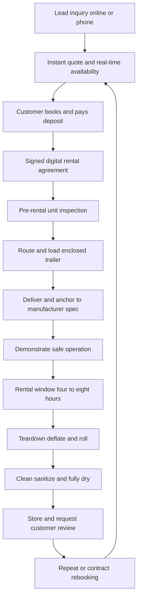

### Direct Answer

To start a bounce house rental business in 2027, you buy commercial-grade inflatables, store them in a garage or small warehouse, haul them in an enclosed trailer or van, and rent them by the day for birthday parties, school carnivals, church festivals, HOA events, and corporate family days. A credible four-to-six-unit launch runs **$14,000-$32,000 all-in**, and the entire business lives or dies on one number beginners almost never calculate: **bookings per unit per season** -- how many times each inflatable rents across the roughly March-to-October window. Treat it as a logistics, safety, and reliability business -- correct anchoring every single time, proper general-liability insurance, clean equipment, and on-time delivery -- and it is genuinely accessible; treat it as the passive YouTube side hustle and one improperly anchored unit or one rained-out spring can erase the year.

**TL;DR:** A commercial bounce house bought for $1,800-$4,500 that rents for $150-$275/day and books 35-70 times a season grosses **$6,000-$15,000 per unit per year** against per-rental costs (fuel, labor, cleaning, platform fees, wear reserve) of **$45-$95**, leaving a per-unit contribution of **$4,500-$11,000** before fixed overhead. Year-1 realistic owner profit is **$8,000-$28,000** working weekends and evenings; a focused operator scales to 15-30 units by Year 3 generating **$70,000-$190,000** in owner profit, then chooses between a solo lifestyle operation, a full-time crew business, or a broader party-rental brand. The two existential risks are unique and non-negotiable: **(a)** one serious injury on an improperly anchored or unsupervised inflatable can produce a lawsuit larger than the entire business is worth, and **(b)** extreme seasonality and weather mean a cold, wet April can erase a third of annual revenue. The operators who win run a calendar packed by repeat customers and recurring school, church, and HOA contracts, compete on professionalism rather than price, and capitalize the business to survive a bad season.

## 1. What A Bounce House Rental Business Actually Is In 2027

### 1.1 The Core Model

A bounce house rental business owns a fleet of commercial-grade inflatable amusement equipment and rents that equipment, almost always by the day, to customers throwing parties and events. **The transaction is simple and repeatable.** The customer pays a flat rental fee; you deliver the unit, set it up on grass or pavement, anchor it with stakes or sandbags, run the blower, demonstrate safe operation, leave it for a four-to-eight-hour window, then return to tear it down, deflate it, roll it, clean it, and haul it away. You never sell the inflatable. You rent the same unit dozens of times across its multi-year life, and the whole business is the math of buying a durable asset once and monetizing it repeatedly until it has paid for itself many times over.

**The 2027 model sits in a comfortable middle zone.** It is far more accessible than most equipment-rental businesses -- a few thousand dollars buys a rentable unit, demand exists everywhere there are children, and the customer-acquisition problem is well understood -- but it is also more demanding than the "passive side hustle" framing that fills social media. It is a real operating business with physical labor, liability exposure, seasonality, and logistics. The single most important reframe for a 2027 founder: **this is a logistics, safety, and reliability business wearing a birthday-party costume.** The party belongs to the customer; your business is a trailer, a fleet of folded vinyl, a blower inventory, a calendar, an insurance policy, and an anchoring checklist you execute identically every single time.

### 1.2 Why The Asset-Rental Math Works

The reason this business is attractive is the ratio between asset cost and rental price. **A bounce house is cheap relative to what it earns.** A combo unit costs $2,500-$4,500 and rents for $200-$300 per day; rented 40-70 times across a season, it returns several multiples of its purchase price every year for the five-to-eight-year life of commercial vinyl. Compare that to a car-rental, equipment-rental, or real-estate model, where the asset costs tens or hundreds of thousands and the rental ratio is far thinner. The inflatable's high rental-to-cost ratio is the structural reason a $14,000 launch can produce real money -- and the reason the per-job contribution margin runs 60-75%.

### 1.3 Where Inflatables Sit In The Event-Rental Universe

Inflatables are one category inside a wider event-rental world that includes tables, chairs, tents, linens, concessions, photo booths, and soft-play. Many operators eventually expand across that universe, and the adjacent guides on the broader party-rental motion (q1965), photo-booth rental (q1967), and balloon decor (q2149) are worth reading alongside this one, because they share customers, venues, and a booking calendar. The inflatable category is the strongest standalone entry point: it has the cleanest unit economics, the broadest demand base, and the lowest physical-plant requirement of the bunch.

### 1.4 What The Customer Is Actually Buying

A founder reasons better when they understand the purchase from the customer's side. **The customer is not buying vinyl; they are buying a worry-free centerpiece for an event that matters to them.** A parent renting a bounce house for a seven-year-old's birthday is buying ninety minutes of occupied, delighted children and the relief of not having to entertain them. A church renting an obstacle course for a fall festival is buying attendance and a memorable day. A school renting for a field day is buying a logistics partner who shows up on time, sets up safely, and disappears. This reframe drives every operating decision: the customer cares far more about reliability, cleanliness, on-time arrival, and safety than about which exact castle theme they got. **A late delivery to a birthday party is not a minor inconvenience -- it is a ruined event with a child at the center of it**, and the review that follows reflects that emotional weight. The operators who internalize what the customer is truly buying treat punctuality and cleanliness as non-negotiable, because those are the product.

### 1.5 The Honest Difficulty Rating

It is worth stating plainly where this business sits on a difficulty scale, because the social-media framing distorts it badly. **On capital, it is genuinely low** -- a real four-unit business starts under $16,000, and very few legitimate businesses open that cheap. **On skill, it is moderate** -- the anchoring, safety, scheduling, and customer-service disciplines are learnable in a season, and there is no licensing exam or trade apprenticeship. **On physical demand, it is high** -- the owner hauls heavy folded vinyl, sets up in summer heat, and works the exact weekends other people are off. **On risk, it is concentrated rather than constant** -- most jobs are uneventful, but the tail risk of a wind-related injury is severe, which is why insurance and anchoring discipline carry the weight they do. **On lifestyle, it is seasonal and weekend-heavy** -- the calendar is the opposite of a nine-to-five. A founder who scores honestly against those five axes will know within an afternoon whether this is the right business for them.

## 2. The Three Business Models And The 2027 Market

### 2.1 Solo Weekend Operator

**The solo weekend operator model runs a small fleet of four to ten units**, delivered by the owner alone or with one helper, on evenings and weekends, alongside a day job or as a lifestyle business. Its advantage is the lowest capital, the lowest overhead, and a genuine path to $15,000-$50,000 in side or part-time income. Its constraint is that the owner is the entire delivery capacity, so the calendar is capped by how many setups one person can physically complete on a Saturday. This is the correct starting model for almost every founder, because it proves demand and builds cash before committing to payroll.

### 2.2 Full-Time Crew Business

**The full-time crew business model runs a deeper fleet of fifteen to forty-plus units** with hired delivery crews, a box truck or multiple trailers, and an owner who runs scheduling, sales, and operations rather than humping vinyl. Its advantage is real scale and $80,000-$250,000-plus in owner profit. Its challenge is that it requires capital for a deep fleet, the management skill to run crews, and enough booking volume to keep paid labor productive across a seasonal calendar. The error here is launching as a crew business with no booking history -- paid crews idle on slow weekends destroy the margin.

### 2.3 Party-Rental Hybrid

**The party-rental hybrid model uses inflatables as the lead category and expands into the broader event-rental world** -- tables, chairs, tents, linens, concessions, photo booths, soft-play, and games -- becoming the one-stop call for a kid's party or a school event. Its advantage is a higher average ticket, more bookings per customer, and diversification beyond pure inflatables. Its challenge is more capital across more categories and a more complex operation. The disciplined path is to start solo, prove the inflatable core, then choose to scale into crews or broaden into the hybrid -- never to sprawl into tents and tables before the inflatable core is even turning.

### 2.4 The 2027 Market Reality

A founder needs an accurate read of the landscape, because this business is neither a recession-proof goldmine nor a saturated dead end. **Demand is structurally healthy and broad.** Children's birthday parties are not discretionary the way many purchases are -- parents cut other spending before they cancel a kid's party -- and the demand base extends well beyond birthdays into school field days and carnivals, church festivals, HOA and neighborhood events, daycare functions, corporate family days, grand openings, and graduation parties. The customer base regenerates constantly because there is always a new cohort of five-year-olds.

**The competition is fragmented and uneven.** Most markets have a handful of established operators with deep fleets and strong reviews, plus a long tail of one-and-two-unit side hustlers, many under-insured or uninsured and competing purely on a low price. **What changed by 2027:** customers book and compare online and expect real-time availability, instant quotes, and digital contracts; reviews on Google and Facebook are now the primary trust signal and effectively gate the business; venues, schools, and parks increasingly require a certificate of insurance before they will allow an inflatable on the property, which quietly pushes uninsured operators out of the best jobs; and software made it far easier for a small operator to run a professional booking and routing operation. The winning 2027 entrant competes on professionalism, safety, reviews, and reliability -- not on being the cheapest castle in town.

| Business Model | Fleet Size | All-In Capital | Owner Time | Realistic Owner Profit |
|---|---|---|---|---|
| Solo weekend operator | 4-10 units | $14,000-$35,000 | Evenings + weekends | $15,000-$50,000 |
| Full-time crew business | 15-40+ units | $60,000-$180,000 | Full-time, manages crews | $80,000-$250,000 |
| Party-rental hybrid | 10-30+ units + soft goods | $45,000-$150,000 | Full-time | $70,000-$220,000 |
| Pure side-hustle (1-2 units) | 1-2 units | $4,000-$9,000 | Few weekends/month | $3,000-$12,000 |

### 2.5 The Geographic And Demographic Read

The market reality varies enormously by location, and a founder must read the local terrain before committing. **The demographic that drives this business is families with young children**, so a market's density of households with kids under twelve is the single best demand proxy -- suburban and exurban areas with new-build subdivisions, young families, and detached homes with yards are structurally strong, while dense urban cores with apartment living and no backyards are weaker for residential bookings (though they can still support school, church, and corporate jobs). **Climate sets the season length.** A founder in the Sun Belt may run a near-year-round calendar with a long water-slide window, while a founder in the upper Midwest or Northeast has a compressed March-to-October season and a hard winter -- the same fleet earns very different annual revenue depending on latitude. **Competition density** is the third read: a market with three professional operators and a thin long tail has room for a disciplined entrant, while a market saturated with established, well-reviewed companies demands a sharper differentiation angle. The pre-launch market study is not optional homework -- it is the input that sizes the realistic Year-1 revenue and tells the founder whether to launch broad or to pick a specific niche such as toddler-focused, water-slide-heavy, or school-and-church institutional.

### 2.6 Niche Positioning Options

A new entrant rarely wins by being a generic castle company in a market that already has several. **Deliberate positioning is a cheap, powerful lever.** A founder can position as the **toddler-and-preschool specialist** with soft, low-wall units and a daycare-contract base; as the **water-park operator** with a deep slide fleet that owns the summer; as the **school-and-church institutional partner** with obstacle courses, interactive games, and the insurance and references those buyers require; as the **premium reliability brand** that charges more and guarantees on-time, spotless delivery; or as the **one-stop party hybrid** bundling inflatables with concessions, tables, and chairs. Positioning shapes the fleet, the pricing, the marketing language, and the customer base. The founder who picks a position and buys a fleet to match will out-compete the generalist with a random fleet, because every dollar and every review compounds toward a clear promise rather than diffusing across an undifferentiated offering.

## 3. The Equipment Fleet: What You Buy And Why

### 3.1 The Core Categories

The fleet is the business, and a founder must understand every category before spending a dollar, because the Year-1 mix sets booking velocity and margin for years. **Standard bounce houses** -- the classic open-jump castle, typically 13x13 or 15x15 -- are the entry workhorse: $1,500-$3,000 commercial-grade, the most-requested unit for backyard birthday parties of younger kids, easiest to deliver and set up. **Combo units** -- a bounce area plus a slide, basketball hoop, and climbing obstacle in one inflatable -- are the booking-velocity champions: $2,500-$4,500, they out-book a plain bounce house because they entertain a wider age range, and most operators make combos the core of the fleet. **Water slides** -- single and double-lane inflatable slides with a splash pool -- are the summer revenue engine: $2,500-$6,000, they command higher rental prices and book solid June through August, exactly when revenue density matters most.

### 3.2 The Institutional And Specialty Units

**Dry slides** -- tall standalone slides without water -- extend slide demand into spring and fall. **Obstacle courses** -- long inflatable courses, often 40-plus feet -- are the school, church, and corporate-event anchor: $4,000-$10,000, they require more space and labor, but they win the larger institutional jobs a backyard-only fleet cannot bid. **Interactive games** -- jousting, bungee runs, gaga ball pits, inflatable competitive units -- serve the older-kid, teen, school, and corporate market and differentiate you from every operator carrying only castles. **Toddler units** -- smaller, soft, low-wall inflatables -- serve daycares and very young birthday parties.

### 3.3 Concessions And Attach-On Margin

**Concessions and add-ons** -- popcorn machines, cotton candy machines, snow cone machines, tables and chairs, generators for venues without power -- are low-cost, high-margin attach-ons that lift the average ticket without adding a delivery. A $300-$1,200 popcorn machine that attaches to 25-60 inflatable rentals a season is nearly pure margin, because the delivery vehicle is already going to the job. Concessions are the cheapest profit lift in the business and the first expansion most operators make.

### 3.4 Reading The Fleet As A Portfolio

A founder should think of the fleet as a portfolio: **combos and standard bounce houses as the high-velocity core that fills the calendar, water slides as the summer density engine, obstacle courses and interactive games as the institutional anchors that win schools and churches, and concessions as the cheap margin lift on top.** The Year-1 mistake is buying five identical castles -- a fleet with no slide for summer, no obstacle course for the school carnival, and no interactive unit for the teen party turns away the bookings that pay the best.

### 3.5 Commercial Grade Versus Consumer Grade

The most expensive mistake a beginner makes at the equipment stage is buying the wrong tier of vinyl. **Consumer-grade inflatables -- the units sold in big-box stores for backyard home use -- are built for a few dozen uses by one family, not for hundreds of commercial rental cycles.** They use thinner vinyl, lighter stitching, and weaker blowers; they fail fast under commercial load; and -- critically -- they are not designed, rated, or accepted by insurers for commercial rental operation. An operator who tries to rent consumer units is renting a unit that will tear within a season and is operating outside the terms of any credible insurance policy. **Commercial-grade units are the only acceptable purchase.** They use heavy-gauge reinforced vinyl, double- and quadruple-stitched seams, commercial blowers, and lead lines and stake points engineered for repeated anchoring. They cost two to four times what a consumer unit costs, and that premium is not optional -- it is the entry price of being a real business. The secondary market for used commercial units is legitimate and valuable, but the same rule applies: a used commercial unit is fine; a used consumer unit is not a shortcut, it is a liability.

### 3.6 Inspecting A Unit Before You Buy

Whether buying new or used, a founder needs a disciplined inspection routine. **On a new unit**, confirm the manufacturer is an established commercial maker, verify the vinyl weight and seam construction, check that the unit ships with proper anchor points and a commercial blower, and confirm any documentation or compliance markings the manufacturer provides. **On a used unit**, the inspection is more involved and more important: inflate the unit fully and walk every seam looking for separation, fraying, or prior patch jobs; check the stitching at high-stress points such as the slide attachment and the jump-area walls; inspect the netting and safety mesh for tears; test the blower for full pressure and listen for bearing noise; check the lead lines and stake loops for wear; and look for any sign of mold, which indicates the prior owner stored it damp and may mean hidden damage. A used commercial unit in good condition at a real discount is one of the best ways to build fleet depth affordably -- but only after an inspection that a founder runs themselves rather than trusting the seller's word.

| Inspection Point | New Unit | Used Unit |
|---|---|---|
| Vinyl weight / grade | Confirm commercial-grade spec | Confirm commercial; check for thinning |
| Seam integrity | Verify double/quad stitching | Walk every seam for separation/patches |
| Blower | Commercial blower included | Test full pressure, listen for bearings |
| Anchor points / lead lines | Proper count and rating | Check loops for wear and prior repair |
| Netting / safety mesh | Intact from factory | Inspect for tears at stress points |
| Mold / storage damage | Not applicable | Smell and inspect; mold is a dealbreaker |

| Equipment Type | Purchase Cost | Day Rate | Bookings/Season | Gross/Unit/Year |
|---|---|---|---|---|
| Standard bounce house (13x13-15x15) | $1,500-$3,000 | $150-$200 | 30-55 | $5,000-$10,000 |
| Combo unit (bounce + slide) | $2,500-$4,500 | $200-$300 | 40-70 | $9,000-$18,000 |
| Water slide (single/double lane) | $2,500-$6,000 | $225-$400 | 25-45 | $7,000-$15,000 |
| Dry slide (standalone) | $2,000-$5,000 | $200-$325 | 20-40 | $5,000-$11,000 |
| Obstacle course (40ft+) | $4,000-$10,000 | $300-$600 | 15-35 | $6,000-$18,000 |
| Interactive game (joust, bungee, gaga) | $1,500-$5,000 | $150-$350 | 15-35 | $3,000-$10,000 |
| Toddler unit | $1,200-$2,500 | $125-$175 | 20-40 | $3,000-$6,500 |
| Concession (popcorn, cotton candy) | $300-$1,200 | $40-$85 | 25-60 attach | $1,500-$4,000 |

## 4. The Core Unit Economics: Bookings Per Unit Per Season

### 4.1 The One Number Beginners Never Calculate

This is the single most important section in the guide, because the entire business lives or dies on one calculation. **Every inflatable you own has a bookings-per-season number** -- how many separate rentals it generates across the roughly March-to-October window -- and that number, multiplied by the rental price, against the purchase cost and per-rental costs, tells you whether the unit is an asset or idle vinyl.

Consider the math concretely. A **standard bounce house** costs roughly $1,500-$3,000, rents for $150-$200 per day, and books 30-55 times a season: at 40 bookings and $175, it grosses $7,000 a year against a $2,200 cost -- it pays for itself in its first season and then earns several times its cost annually for the rest of its life. A **combo unit** costs $2,500-$4,500, rents for $200-$300, and books 40-70 times -- the highest-velocity asset in the fleet. A **water slide** costs $2,500-$6,000, rents for $225-$400, and books 25-45 times but concentrated into high-summer months. An **obstacle course** costs $4,000-$10,000, rents for $300-$600, and books 15-35 times -- fewer bookings, larger tickets, institutional jobs.

### 4.2 The Buy-By-Velocity Discipline

The discipline this imposes: before buying any unit, estimate its realistic seasonal bookings and rental price, subtract per-rental costs of $45-$95, and compare the seasonal contribution to the cost. **High-velocity combos and standard bounce houses should dominate the early fleet** because they recover capital fast and fill the calendar. Water slides earn their place by densifying the summer. Obstacle courses and interactive games earn theirs by unlocking the larger institutional tickets. A founder who buys by booking velocity builds a fleet that compounds; a founder who buys the biggest, flashiest unit at the trade show builds a warehouse with one impressive obstacle course and an empty Saturday calendar.

### 4.3 The Booking-Velocity Drivers

Bookings per season are not random -- they are driven by levers a founder controls. **Theme and design** matter: gender-neutral and broadly appealing castles out-book a niche licensed-character unit. **Review count and rating** gate inquiries before a customer ever sees a unit. **Calendar visibility** -- real-time online availability -- converts browsers into bookings. **Geographic density** matters: a tight delivery radius lets one unit do two jobs in a day. **Repeat and contract bookings** -- a school that books every field day, a church festival every fall -- raise a unit's floor. The operator who pulls these levers can move a combo from 40 bookings to 65, which is the difference between a $9,000 and a $15,000 unit on identical capital.

| Booking-Velocity Lever | Low-Velocity Operator | High-Velocity Operator | Effect On Bookings/Season |
|---|---|---|---|
| Theme selection | Niche licensed character | Broadly appealing, gender-neutral | +20-35% |
| Google/Facebook reviews | Under 10, mixed | 50+ at 4.8-5.0 stars | +25-40% |
| Online booking calendar | Phone/text only | Real-time availability + instant quote | +15-30% |
| Delivery radius discipline | Sprawling, one job/day | Tight, two jobs/day on peak units | +10-20% per unit |
| Repeat/contract base | Walk-up only | Recurring school/church/HOA contracts | +15-25% floor |

### 4.4 The Double-Turn Multiplier

The most underused lever in the entire model is the **double turn** -- renting the same physical unit twice in one day. A bounce house delivered for a morning party that ends at 1 p.m. can be torn down, transported, and re-set for an afternoon party, effectively doubling that unit's revenue for the day. Double turns are not always possible -- they require two bookings close enough geographically, a delivery window that allows the turnaround, and the physical stamina to do four setups instead of two -- but on peak Saturdays in a dense delivery radius, a disciplined operator can double-turn a meaningful share of the fleet. **The double turn is why delivery-radius discipline matters so much.** An operator whose jobs sprawl across an hour of driving cannot double-turn anything; an operator whose jobs cluster within fifteen minutes of each other can. A solo operator who double-turns even three units on each of twenty peak Saturdays adds sixty extra bookings to the season -- the equivalent of owning an extra unit and a half, on zero additional capital. The lesson: tight geographic booking is not just a cost saver, it is a hidden capacity multiplier.

### 4.5 The Depreciation And Replacement Truth

Beginners model the fleet as if it lasts forever; it does not. **Commercial vinyl has a working life of roughly five to eight years of rental use** before seams, vinyl, and netting degrade past the point of safe and presentable rental, and blowers wear out somewhat faster. A founder must treat the fleet as a depreciating asset and reserve against its replacement -- which is exactly what the 5-10% wear reserve in the per-job cost stack funds. A unit that grossed $9,000 a year for six years returned roughly $54,000 on a $3,500 purchase, an exceptional return -- but only the operator who reserved along the way has the cash to replace it without a capital crunch. **The operators who get into trouble are the ones who treated all of the contribution as profit, spent it, and then faced a fleet aging out all at once with no replacement reserve.** A disciplined operator staggers purchases so the fleet does not age uniformly, and funds replacement from the wear reserve rather than from a sudden, painful capital event.

## 5. The Line-By-Line P&L

### 5.1 The Per-Job Cost Stack

Beyond booking velocity, a founder must internalize the operating P&L of a single job. Take a representative backyard birthday rental: one combo unit at $250 for a six-hour Saturday window. **The costs stack in an order beginners consistently underestimate.** Delivery and setup labor -- a typical delivery-plus-pickup is one to two hours of round-trip drive plus 30-60 minutes of setup and the same for teardown, easily $20-$50 of real labor cost per job. Fuel -- a loaded van or a vehicle towing a trailer burns $10-$30 per job depending on distance. Booking platform and payment processing fees -- the software subscription amortized per job plus 2.9%-plus card processing, $10-$20 on a $250 job. Cleaning and sanitizing -- every unit is wiped down and sanitized between rentals. Wear and replacement reserve -- a disciplined operator reserves 5-10% of revenue against eventual repair and replacement of vinyl, seams, blowers, and stakes.

### 5.2 Contribution Margin Versus Net Profit

Net the job out and a healthy bounce house rental operation runs a **60-75% contribution margin per job** after per-rental costs -- higher than most equipment-rental businesses because the asset is cheap relative to its rental price. **But the fixed overhead is the other half of the story.** Insurance, storage rent, the vehicle, the website and marketing, the LLC and licenses, and the owner's phone and admin time are fixed costs that exist whether or not anyone booked this weekend, spread across the whole season's jobs. The founders who fail at the P&L level made the same two errors: they treated the high per-job contribution margin as if it were net profit and ignored fixed overhead, and they spent the summer cash instead of reserving it for the winter that was always coming.

| Per-Job Line Item ($250 combo rental) | Typical Cost | Notes |
|---|---|---|
| Gross rental revenue | $250 | Six-hour Saturday window |
| Delivery + setup + teardown labor | $20-$50 | Owner time or paid helper |
| Fuel (round trip) | $10-$30 | Loaded trailer/van |
| Booking software + card processing | $10-$20 | Subscription amortized + 2.9% |
| Cleaning and sanitizing | $5-$12 | Consumables + time |
| Wear / replacement reserve (5-10%) | $13-$25 | Vinyl, seams, blowers |
| **Per-job contribution** | **$120-$190** | **~60-75% margin** |

### 5.3 The Seasonal Annual P&L

At the business level, seasonality dominates the annual P&L: revenue concentrates heavily into roughly March-October, and a disciplined operator treats peak summer as the period that must fund the entire year, building a reserve that carries fixed costs and the owner through the dead winter. **A solo six-unit operator booking each unit 45 times a season at an average $215 ticket grosses roughly $58,000**, nets $36,000-$42,000 in contribution after per-job costs, and after $14,000-$20,000 of fixed overhead lands $16,000-$26,000 of owner profit -- working weekends.

| Annual P&L (solo 6-unit operator) | Conservative | Realistic | Strong |
|---|---|---|---|
| Total bookings/year | 210 | 270 | 340 |
| Average ticket (with attach-ons) | $195 | $215 | $245 |
| Gross revenue | $41,000 | $58,000 | $83,000 |
| Per-job costs (~32%) | $13,100 | $18,600 | $26,600 |
| Fixed overhead | $14,000 | $17,000 | $20,000 |
| **Owner profit** | **$13,900** | **$22,400** | **$36,400** |

### 5.4 The Fixed Overhead Breakdown

A founder should know exactly what the fixed overhead is, because it is the number that does not move when a weekend rains out. **Insurance** is the largest line for most operators -- an inflatable-specific general liability policy runs $500-$2,000 in Year 1 and scales with revenue. **Storage** is the next line: a garage may be effectively free, but a self-storage unit or warehouse bay runs $100-$600 a month. **The vehicle** carries insurance, registration, maintenance, and -- if financed -- a payment, easily $1,500-$5,000 a year. **Software** -- the booking platform subscription -- runs $50-$200 a month. **Marketing** -- website hosting, the paid-ad budget, photography refreshes -- is a recurring spend a serious operator does not zero out. **Administrative** costs include the business phone, bookkeeping, the LLC annual fee, and licenses. None of these care whether the calendar is full. The discipline point: a founder must total the fixed overhead honestly, divide it by a conservative season's bookings to get the fixed cost per job, and confirm the per-job contribution comfortably exceeds it. The operator who only models the per-job contribution margin and forgets the fixed base will be surprised by how thin the real net profit is in a soft season.

### 5.5 The Cash-Flow Calendar

The seasonal P&L hides a cash-flow trap that destroys under-capitalized operators. **Revenue arrives March through October; expenses arrive all twelve months.** Insurance, storage, vehicle costs, software, and the owner's own living expenses run through the dead winter when almost no bookings come in. A founder who finishes October with a healthy season but no reserve faces five months of negative cash flow before the next spring's revenue arrives. **The discipline is to treat the peak summer as the period that must fund the entire year** and to deliberately set aside an off-season reserve -- ideally three to six months of fixed overhead plus owner draw -- before spending the summer's surplus. The strongest operators also use the slow winter productively: repairing and refurbishing units, booking next season's school and church contracts, refreshing photography and marketing, and buying used inventory from operators exiting the business. The winter is not dead time to be survived; it is preparation time to be used -- but only by an operator who reserved the cash to be calm during it.

| Cash-Flow Period | Months | Revenue | Cash Behavior |
|---|---|---|---|
| Pre-season ramp | Feb-Mar | Low, deposits arriving | Spend on prep, marketing |
| Spring peak | Apr-Jun | Strong | Build reserve aggressively |
| Summer peak | Jun-Aug | Strongest (water slides) | Peak surplus -- reserve it |
| Fall shoulder | Sep-Oct | Moderate (festivals) | Final reserve top-up |
| Off-season | Nov-Jan | Minimal | Live on reserve; refurbish fleet |

## 6. The Startup Capex Plan

### 6.1 Buy A Balanced Core Before Breadth

With the booking-velocity discipline established, a founder needs a concrete plan for what to buy first. The principle is **buy a balanced high-velocity core before breadth.** A disciplined Year-1 fleet for a solo launch prioritizes, in rough order: two to three combo units in broadly appealing designs, because combos book the most; one or two standard bounce houses to cover simpler younger-kid parties and to have backup inventory; one water slide to capture summer demand that otherwise walks to a competitor; and one interactive game or obstacle course only once the core is funded.

### 6.2 The Capex Math And Sourcing

The capex math: a lean four-unit launch can start around $10,000-$16,000 in inventory; a fuller six-unit launch with a water slide and an interactive unit runs $16,000-$28,000. **Sourcing discipline matters enormously. Buy commercial-grade only** -- from established US manufacturers built for hundreds of rental cycles, never the consumer-grade units sold for backyard home use, which fail fast and are not built or insured for commercial rental. The major sourcing channels are commercial inflatable manufacturers (companies such as Magic Jump, Ninja Jump, Cutting Edge Creations, and Happy Jump), industry distributors, and the genuine secondary market, where operators upgrading or exiting sell good used commercial units at a real discount -- a legitimate way to build depth affordably if the vinyl, seams, and blowers are inspected carefully.

| Startup Line Item | Lean 4-Unit Launch | Fuller 6-Unit Launch |
|---|---|---|
| Inflatable inventory (commercial-grade) | $10,000-$16,000 | $16,000-$28,000 |
| Blowers (one per unit plus spares) | $600-$1,200 | $1,000-$1,800 |
| Vehicle / cargo trailer (used) | $2,500-$8,000 | $4,000-$12,000 |
| General liability insurance (first payment) | $500-$1,500 | $800-$2,000 |
| Booking / rental software (setup + months) | $200-$700 | $300-$1,000 |
| Anchoring gear (stakes, sandbags, dollies) | $400-$900 | $600-$1,400 |
| Cleaning and sanitizing supplies | $150-$400 | $200-$500 |
| Website, logo, photography | $400-$2,000 | $800-$3,000 |
| Initial marketing budget | $500-$2,000 | $1,000-$3,500 |
| LLC, licenses, permits, contracts | $150-$800 | $200-$1,000 |
| Working capital / off-season reserve | $1,500-$5,000 | $3,000-$8,000 |
| **Total all-in** | **~$14,000-$32,000** | **~$28,000-$50,000** |

### 6.3 The Sequencing Rule

The sequencing rule: **every additional dollar should go to the unit type with the best booking-velocity-adjusted return until that category is deep enough to serve your typical Saturday, and only then move to the next.** Buy in themes and styles your local market actually requests, not the one design that caught your eye at the trade show. A founder who underinvests in the high-velocity core to buy a flashy obstacle course will field calls for combos on every busy weekend and have nothing to deliver.

## 7. Storage, The Vehicle, And The Physical Plant

### 7.1 Storage And The Drying Discipline

The bounce house rental business is unusually light on physical infrastructure, which is a real part of its accessibility -- but a founder still must plan the physical plant deliberately. **A small fleet of four to eight folded inflatables, their blowers, and the anchoring gear genuinely fits in a one-car or two-car garage**, which is how most operators start and a meaningful cost advantage over party-rental businesses that need a warehouse from day one. As the fleet grows past ten or fifteen units, the operation graduates to a small self-storage unit, a portion of a warehouse, or a dedicated shop.

The non-negotiable storage discipline: **inflatables must be completely dry before they are folded and stored.** Vinyl rolled up damp grows mold, which permanently damages a unit and is a health and reputation disaster -- so the physical plant must include space and a way to fully dry units after a water-slide weekend or a rained-on job.

### 7.2 The Vehicle

A startup typically begins with one of three setups: an enclosed cargo trailer towed behind a truck or SUV (the most common starting choice -- secure, weatherproof, and it keeps the personal vehicle usable), a cargo van, or a box truck for larger fleets. **The vehicle must have the cubic capacity to carry a full Saturday's worth of units, blowers, and gear, and it should be enclosed so equipment stays dry and secure.** Many operators start with a used trailer to keep capital low and upgrade as volume grows.

### 7.3 The Accessibility Point

The low physical-plant requirement is one of the genuine reasons this business is more accessible than party rental or most equipment rental -- but the drying discipline and a properly sized enclosed vehicle are not optional. Skipping either creates mold losses or a Saturday where you cannot fit the jobs you booked.

| Physical Plant Item | Startup Phase | Growth Phase (15+ units) |
|---|---|---|
| Storage | One-to-two-car garage | Self-storage unit / warehouse bay / shop |
| Vehicle | Used enclosed cargo trailer | Box truck or multiple trailers |
| Drying space | Garage floor, fans | Dedicated dry rack / drying bay |
| Repair area | Workbench corner | Dedicated patch and seam station |

## 8. Safety, Anchoring, And Liability

### 8.1 The Existential Risk

This is the section that separates a real business from a lawsuit waiting to happen. **An inflatable that is improperly anchored, overcrowded, or operated in wind can collapse, deflate, or be lifted by a gust -- and the resulting injury can produce a lawsuit larger than the entire business is worth.** Wind is the single most dangerous variable: an unanchored or under-anchored inflatable in a sudden gust is a documented cause of serious injury, and every operator must have a hard wind-speed cutoff and the discipline to enforce it even when a customer pushes back.

### 8.2 The Anchoring And Operating Checklist

The defense is procedure executed identically every single time. **Anchoring:** stakes for grass at the manufacturer-specified count and depth, sandbags at the specified weight for pavement -- never improvised, never skipped, never reduced because the customer is in a hurry. **Operating rules:** posted age and capacity limits, no shoes, no sharp objects, no flips, and -- critically -- adult supervision required at all times, which the customer agrees to in writing. **Pre-rental inspection:** every unit checked for seam, blower, and stitching integrity before it leaves the storage area. The anchoring checklist is not paperwork; it is the core operating discipline of the business, and the founder who treats it casually is one windy Saturday from ruin.

### 8.3 Insurance Is Non-Negotiable

**General liability insurance covering inflatable amusement operations is mandatory** -- not optional, not "later." It protects the business from the catastrophic-injury scenario, and just as importantly it is now a gate to revenue: venues, schools, parks, and many HOAs require a certificate of insurance naming them as additional insured before they will allow an inflatable on the property. The uninsured side-hustler is quietly locked out of the best institutional jobs. Specialized inflatable-rental insurers exist precisely for this business; the first-year premium typically runs $500-$2,000 and rises with fleet size and revenue.

### 8.4 Permits, Inspections, And Local Rules

Beyond insurance, a founder must learn the local regulatory layer, which varies more than beginners expect. **Some states regulate inflatable amusement devices directly** -- requiring registration, periodic inspection, operator certification, or compliance with the ASTM F2374 standard for design, manufacture, operation, and maintenance of inflatables. Other states regulate lightly or not at all. A founder must check their specific state's amusement-ride or department-of-labor rules before launch, because operating an unregistered or uninspected unit where registration is required is both a legal exposure and an insurance-voiding problem. **City and county rules add another layer**: park districts often require a permit and a certificate of insurance to set up an inflatable on public property, and some municipalities restrict generators or setups in public spaces. The discipline is to research the state amusement-device rule, the local park-permit process, and the business-licensing requirement during the first 30 days, and to build compliance into the standard operating procedure rather than discovering a rule the hard way after a job is booked.

### 8.5 The Written Rental Agreement

The single cheapest piece of liability protection is a real, signed rental agreement, and yet the under-equipped long tail routinely skips it. **The agreement must do several jobs at once.** It must state the operating rules -- age and capacity limits, no shoes, no sharp objects, no flips, no use in unsafe weather. It must place adult supervision responsibility explicitly on the customer for the full rental window. It must include a liability waiver and an assumption-of-risk clause appropriate to the operator's state. It must specify the weather and cancellation policy, the deposit terms, and what happens if the customer's chosen setup surface turns out to be unsuitable. **The agreement is signed before the unit is set up, every time, with no exceptions** -- the customer who has not signed does not get a running blower. A founder should have the agreement reviewed by an attorney licensed in their state, because waiver enforceability varies, and a generic internet template may not hold. The agreement does not eliminate liability, but combined with insurance and anchoring discipline it is the third leg of a defensible operation.

| Safety / Liability Element | Requirement | Consequence If Skipped |
|---|---|---|
| General liability insurance | Inflatable-specific GL policy | Locked out of venues; catastrophic uninsured loss |
| Wind-speed cutoff | Hard limit, enforced | Wind lift, collapse, serious injury |
| Anchoring (stakes/sandbags) | Manufacturer spec, every job | Tip-over, deflation, lawsuit |
| Written rental agreement | Signed, with supervision clause | No liability shield, disputed terms |
| Pre-rental inspection | Seam/blower/stitching check | Unit failure mid-party |
| Adult supervision clause | Customer agrees in writing | Unsupervised-injury liability |

## 9. Marketing, Booking, And Customer Acquisition

### 9.1 The Trust-Signal Gate

In 2027, customer acquisition for this business runs almost entirely through online discovery and reviews. **A strong Google Business Profile with 50-plus reviews at 4.8-5.0 stars is the single highest-leverage marketing asset**, because parents choosing a bounce house company default to the highest-rated local option. The founder's first marketing job is not advertising; it is engineering a steady flow of reviews from every satisfied customer through a simple, consistent post-event ask.

### 9.2 The Booking Stack

Customers expect real-time availability, instant quotes, online booking, and digital contracts. **Rental-specific booking software** -- the category includes platforms built for the inflatable and party-rental trade -- handles the calendar, prevents double-booking, sends contracts, takes deposits, and routes deliveries. A professional booking experience converts dramatically better than phone tag, and it is one of the clearest ways a disciplined new entrant out-competes the under-equipped long tail.

### 9.3 The Recurring-Revenue Engine

The highest-value bookings are not one-off birthday parties; they are recurring institutional relationships. **A school that books a field day every spring, a church with an annual fall festival, an HOA with a summer block party, a daycare with quarterly events** -- each is a booking that recurs without re-acquisition cost and raises the floor under the calendar. The operator who deliberately builds a base of repeat school, church, and HOA contracts converts a volatile seasonal business into a far more predictable one. Cross-category referral partnerships with photographers (q1949), photo-booth operators (q1967), and balloon-decor providers (q2149) are a low-cost channel, because they serve the same parents and events.

### 9.4 Pricing Strategy

Pricing is where new operators leave the most money on the table, usually by underpricing out of fear. **The instinct to be the cheapest castle in town is almost always wrong.** The under-insured long tail competes on price; a professional, insured, well-reviewed operator competes on reliability and should price at or above the market middle. A founder should research local day rates by unit type, then price to the value delivered -- the customer comparing a 5.0-star insured company against a 3.8-star side-hustler is not actually shopping on price alone. **Several pricing levers raise the average ticket without raising resistance.** Tiered rental windows -- a standard four-hour window with an upcharge for all-day -- capture customers who want the unit longer. Attach-on bundling -- a combo plus a concession machine and a table-and-chair set -- lifts the ticket on a single delivery. Peak-date premiums -- a modest surcharge on the busiest Saturdays in May and June -- reflect genuine scarcity. Delivery-zone pricing -- a small fee beyond a core radius -- protects margin on distant jobs. The operator who prices with discipline funds the insurance, the reserve, and the quality that the cheap competitor cannot afford.

### 9.5 Reviews As The Compounding Asset

A founder should understand reviews not as feedback but as the compounding asset that drives every future season. **Each five-star review makes the next inquiry cheaper to win**, because it lifts the business in local search and raises conversion when a parent compares options. Reviews compound: a business with 80 reviews at 4.9 stars has a near-unassailable position against a new entrant, and that position took seasons of disciplined review-asking to build. The mechanics are simple and must be systematic -- every satisfied customer is asked for a review, at the moment of teardown when the event just delighted their child, through a direct link that makes it a thirty-second action. The operators who treat the review ask as an afterthought collect a handful a season; the operators who build it into the standard job close collect dozens, and the gap compounds into a structural moat. A founder launching against established competitors should treat the first 25 reviews as the single most important Year-1 deliverable, ahead of profit.

| Marketing Channel | Cost Level | Best For | Notes |
|---|---|---|---|
| Google Business Profile + reviews | Low (time) | Default discovery | Highest-leverage asset |
| Rental booking software / website | Medium | Conversion | Real-time availability |
| Facebook local / community groups | Low-medium | Birthday-party reach | Strong for parents |
| School / church / HOA outreach | Low (time) | Recurring contracts | Highest-value bookings |
| Referral partners (photo, balloon) | Low | Shared-event customers | Cross-category leads |
| Paid local search ads | Medium-high | Peak-season demand spikes | Use selectively |

## 10. The Software And RevOps Layer

### 10.1 Why A One-Person Rental Business Needs RevOps Thinking

Even a solo operator runs a revenue operation: leads come in, quotes go out, deposits get collected, deliveries get routed, reviews get requested, and contracts get stored. **The operators who scale treat this pipeline as a system, not a pile of texts.** The booking software is the spine, but the broader stack -- a CRM for repeat institutional customers, payment processing, routing, and review automation -- is what lets one person handle 270 bookings a season without dropping a job.

### 10.2 The Platforms Behind The Stack

The general-business software underneath a rental operation is dominated by public companies a founder will touch directly or indirectly. Payment processing typically runs through Stripe, Block (NYSE: XYZ) via Square, or PayPal (NASDAQ: PYPL). A growing operation managing institutional contracts and a referral network often adopts a CRM such as HubSpot (NYSE: HUBS) or, at the larger end, Salesforce (NYSE: CRM). Scheduling, lead capture, and review-request automation increasingly lean on tools from Intuit (NASDAQ: INTU) for bookkeeping and on workflow apps from companies like monday.com (NASDAQ: MNDY). Communications and storage run through Alphabet's Google Workspace (NASDAQ: GOOGL) and Microsoft (NASDAQ: MSFT) 365. The point is not that a four-unit operator needs all of this -- it is that the rails are mature, cheap, and easy to adopt one layer at a time as the booking volume grows.

### 10.3 The Right-Sizing Rule

A founder should resist over-tooling. **In Year 1, a rental-specific booking platform plus a payment processor and a free Google Workspace tier is enough.** The CRM, the routing optimizer, and the review-automation layer earn their place only when booking volume makes manual handling the bottleneck -- typically once the fleet passes ten units or the operator hires a first crew. Adopt the stack to relieve a real constraint, never to feel professional.

## 11. The 90-Day Launch Roadmap

### 11.1 Days 1-30: Foundation

**Form the LLC, open a business bank account, and secure inflatable-specific general liability insurance** -- the insurance quote alone will sharpen the founder's understanding of the risk profile. Research the local market: who the established operators are, what they charge, what units they carry, where the gaps are. Decide the business model (almost always start solo weekend operator) and draft the Year-1 fleet plan by booking velocity. Set the budget and confirm the working-capital reserve.

### 11.2 Days 31-60: Build

**Buy the core fleet** -- combos first, then standard bounce houses, then a water slide -- from commercial manufacturers or a carefully inspected secondary market. Acquire the enclosed trailer or van, blowers, and anchoring gear. Set up storage with a real drying plan. Build the website, claim the Google Business Profile, and stand up the booking software with a real-time calendar, contracts, and deposit collection.

### 11.3 Days 61-90: Launch And Book

**Go live before peak season.** Photograph every unit professionally, list real-time availability, and open bookings. Begin school, church, and HOA outreach for recurring contracts. Run the first deliveries with obsessive attention to the anchoring checklist, on-time arrival, and clean equipment. Request a review from every single customer. The goal of the first 90 days is not profit -- it is a clean safety record, the first 15-25 reviews, and a calendar starting to fill.

| Phase | Window | Primary Goal | Key Output |
|---|---|---|---|
| Foundation | Days 1-30 | Legal + insurance + plan | LLC, GL policy, fleet plan |
| Build | Days 31-60 | Fleet + plant + booking stack | Units, trailer, website, software |
| Launch | Days 61-90 | First bookings + reviews | 15-25 reviews, clean record |
| Scale | Months 4-12 | Densify calendar | Contracts, repeat base, reserve |

## 12. Counter-Case: When NOT To Start A Bounce House Rental Business

### 12.1 The Honest Reasons To Walk Away

This guide would be dishonest if it only sold the upside. **There are real founders for whom this is the wrong business.** If you cannot or will not do physical labor -- a combo unit is heavy, setup happens in summer heat, and the owner is the delivery crew until there is one to hire -- this business will grind you down. If you cannot tolerate income that swings violently by season, the March-to-October concentration and the dead winter will create cash-flow stress that a steadier business would not. If you are unwilling to carry proper insurance or to enforce an anchoring and wind-cutoff discipline every single time, you are not running a business; you are accumulating uninsured catastrophic risk, and you should not start.

### 12.2 The Structural Limits

**The weekend calendar caps a solo operator.** There are only so many Saturdays in a season and only so many setups one person can do in a day -- the solo model has a real income ceiling, and a founder who needs six figures must be honest that it requires crews, capital, and management. **Weather is uninsurable revenue risk.** A cold, wet April or a rained-out peak weekend simply erases bookings, and no amount of operational excellence recovers them. **The under-insured long tail compresses price** in some markets, and a founder must be prepared to compete on professionalism rather than win a race to the bottom.

### 12.3 Who Should Consider An Adjacent Path Instead

A founder drawn to the event-rental world but wary of the physical labor or seasonality should weigh adjacents. **Photo-booth rental (q1967)** is lighter to haul and less weather-dependent. **Balloon decor (q2149)** has no large equipment and no anchoring liability. **A broader party-rental business (q1965)** diversifies away from pure inflatable seasonality. Founders attracted to the rental-asset model more broadly might look at boat rental (q1964), kayak rental (q1970), or pickleball court rental (q9571) -- each shares the buy-an-asset-and-rent-it logic with a different demand and risk profile. The honest verdict: bounce house rental is viable and genuinely accessible in 2027 as a focused, safety-first, weekend operation that can grow into a real full-time business -- and a poor fit for anyone unwilling to do physical setup work, carry proper insurance, or weather a seasonal income swing.

| Disqualifier | Why It Matters | Better-Fit Alternative |
|---|---|---|
| Cannot do physical labor | Owner is the delivery crew | Photo-booth rental (q1967) |
| Cannot tolerate seasonal income swings | March-Oct concentration, dead winter | Balloon decor (q2149) |
| Unwilling to carry insurance | Catastrophic uninsured risk | Do not start |
| Needs six figures from day one | Solo weekend model is capped | Crew business or hybrid (q1965) |
| Wants asset rental, not events | Different demand/risk profile | Boat (q1964) or kayak (q1970) rental |

## 13. Key Metrics And Benchmarks

A founder should track a tight set of numbers from the first season. **Bookings per unit per season** is the master metric -- the whole business is the sum of every unit's velocity. **Average ticket** captures pricing and attach-on discipline. **Per-job contribution margin** confirms the job math is healthy. **Review velocity** -- new reviews per month -- predicts next season's booking flow. **Repeat and contract share** measures how much of the calendar is locked versus re-acquired. **Off-season reserve ratio** -- months of fixed overhead in the bank -- measures whether the business can survive a bad spring.

| Metric | Weak | Healthy | Strong |
|---|---|---|---|
| Bookings per unit per season | Under 25 | 35-50 | 55-70 |
| Average ticket (with attach-ons) | Under $180 | $200-$235 | $245+ |
| Per-job contribution margin | Under 55% | 60-70% | 70-75% |
| Google reviews (rating) | Under 15 (under 4.5) | 40-70 (4.7-4.9) | 80+ (4.9-5.0) |
| Repeat / contract share of bookings | Under 15% | 25-40% | 45%+ |
| Off-season reserve | Under 1 month overhead | 3-4 months | 6+ months |

## 14. Operating Flow

The flow above is the entire business compressed: a lead becomes a quote, a quote becomes a paid and contracted booking, the booking becomes an inspected and correctly anchored delivery, the delivery becomes a clean and dry stored unit and a review, and the review and the relationship feed the next booking. Every box is a discipline -- skip the inspection, skip the anchoring spec, skip the drying, or skip the review ask, and the loop breaks where it costs the most.

## 15. Sources

1. U.S. Small Business Administration -- business plan and startup financing guidance, sba.gov.
2. U.S. Small Business Administration -- choosing a business structure (LLC formation), sba.gov.
3. Internal Revenue Service -- employer identification number and small-business tax basics, irs.gov.
4. U.S. Consumer Product Safety Commission -- inflatable amusement and bounce house injury data, cpsc.gov.
5. ASTM International -- F2374 standard practice for the design, manufacture, operation, and maintenance of inflatable amusement devices.
6. ASTM International -- F24 committee on amusement rides and devices, astm.org.
7. International Association of Amusement Parks and Attractions (IAAPA) -- inflatable safety guidance, iaapa.org.
8. National Association of Amusement Ride Safety Officials (NAARSO) -- operator safety standards.
9. U.S. Bureau of Labor Statistics -- arts, entertainment, and recreation industry data, bls.gov.
10. U.S. Bureau of Labor Statistics -- Consumer Expenditure Survey, household entertainment spending, bls.gov.
11. National Weather Service -- wind advisory and severe-weather guidance for outdoor operations, weather.gov.
12. IBISWorld -- party and event rental industry market report.
13. IBISWorld -- consumer goods rental industry analysis.
14. American Rental Association (ARA) -- equipment and event rental industry data, ararental.org.
15. SCORE -- mentorship and small-business startup resources, score.org.
16. U.S. Small Business Administration -- general liability insurance overview for small business.
17. Insurance Information Institute -- commercial general liability basics, iii.org.
18. National Federation of Independent Business (NFIB) -- small-business operations and seasonality guidance.
19. Magic Jump Inc. -- commercial inflatable manufacturer product specifications, magicjump.com.
20. Ninja Jump Inc. -- commercial inflatable manufacturer catalog, ninjajump.com.
21. Cutting Edge Creations -- custom commercial inflatable manufacturer, cuttingedgecreations.com.
22. Happy Jump -- commercial inflatable manufacturer product line, happyjump.com.
23. HubSpot Inc. (NYSE: HUBS) -- CRM and small-business sales tooling documentation, hubspot.com.
24. Salesforce Inc. (NYSE: CRM) -- CRM platform documentation, salesforce.com.
25. Stripe -- payments and online checkout documentation, stripe.com.
26. Block Inc. (NYSE: XYZ) -- Square payments and small-business tools, squareup.com.
27. PayPal Holdings Inc. (NASDAQ: PYPL) -- payment processing documentation, paypal.com.
28. Intuit Inc. (NASDAQ: INTU) -- QuickBooks small-business accounting resources, quickbooks.intuit.com.
29. monday.com Ltd. (NASDAQ: MNDY) -- work and workflow management documentation, monday.com.
30. Alphabet Inc. (NASDAQ: GOOGL) -- Google Business Profile and Google Workspace help, google.com.
31. Microsoft Corp. (NASDAQ: MSFT) -- Microsoft 365 small-business resources, microsoft.com.
32. U.S. Small Business Administration -- marketing and customer-acquisition guidance, sba.gov.
33. Federal Trade Commission -- advertising and consumer-disclosure guidance for small business, ftc.gov.
34. U.S. Small Business Administration -- managing business cash flow and seasonal revenue, sba.gov.
35. American Rental Association -- rental insurance and certificate-of-insurance best practices, ararental.org.

---

*Related Pulse RevOps guides:* starting a party rental business (q1965), starting a photo booth rental business (q1967), starting a balloon decor business (q2149), starting a wedding photography business (q1949), starting a boat rental business (q1964), starting a kayak rental business (q1970), and starting a pickleball court rental business (q9571).
